# 二、TensorFlow 数学运算

在本章中，我们将介绍以下主题：

*   张量数据结构
*   使用 TensorFlow 处理张量
*   复数和分形
*   计算导数
*   随机数
*   求解偏微分方程

# 张量数据结构

张量是 TensorFlow 中的基本数据结构。 正如我们已经说过的那样，它们表示数据流图中的连接边。 张量只是标识多维数组或列表。

可以通过三个参数`rank`，`shape`和`type`进行标识：

*   `rank`：每个张量由称为等级的维单位描述。 它确定张量的维数。 因此，秩被称为张量的阶数或 n 维数（例如，秩 2 张量是矩阵，秩 1 张量是向量）。
*   `shape`：张量的形状是其张数和列数。
*   `type`：这是分配给张量元素的数据类型。

好吧，现在我们对这种基本的数据结构充满信心。 要构建张量，我们可以：

*   建立一个 n 维数组； 例如，通过使用 NumPy 库
*   将 n 维数组转换为 TensorFlow 张量

一旦获得张量，就可以使用 TensorFlow 运算符对其进行处理。 下图直观地介绍了所引入的概念：

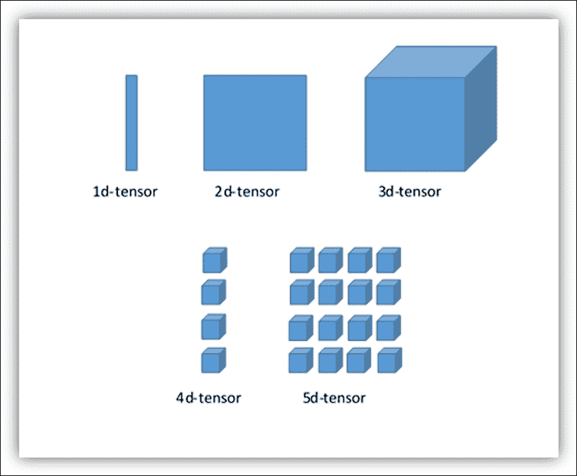

多维张量的可视化

## 一维张量

要构建一维张量，我们使用 Numpy 数组命令，其中`s`是 Python 列表：

```py
>>> import numpy as np 
>>> tensor_1d = np.array([1.3, 1, 4.0, 23.99])

```

与 Python 列表不同，元素之间的逗号不显示：

```py
>>> print tensor_1d 
[  1.3    1\.     4\.    23.99] 

```

索引与 Python 列表相同。 第一个元素的位置为 0，第三个元素的位置为 2，依此类推：

```py
>>> print tensor_1d[0] 
1.3 
>>> print tensor_1d[2] 
4.0

```

最后，您可以查看张量的基本属性，即张量的`rank`：

```py
>>> tensor_1d.ndim 
1

```

张量维度的元组如下：

```py
>>> tensor_1d.shape 
(4L,) 

```

张量的形状连续只有四个值。

张量中的*数据类型*：

```py
>>> tensor_1d.dtype 
dtype('float64')

```

现在，让我们看看如何将 NumPy 数组转换为 TensorFlow 张量：

```py
import TensorFlow as tf

```

TensorFlow 函数`tf_convert_to_tensor`将各种类型的 Python 对象转换为张量对象。 它接受张量对象，Numpy 数组，Python 列表和 Python 标量：

```py
tf_tensor=tf.convert_to_tensor(tensor_1d,dtype=tf.float64)

```

运行`Session`，我们可以可视化张量及其元素，如下所示：

```py
with tf.Session() as sess: 
    print sess.run(tf_tensor) 
    print sess.run(tf_tensor[0]) 
    print sess.run(tf_tensor[2])

```

得到以下结果：

```py
>> 
[  1.3    1\.     4\.    23.99] 
1.3 
4.0 
>>> 

```

## 二维张量

要创建二维张量或矩阵，我们再次使用数组，但是`s`将是数组序列：

```py
>>> import numpy as np 

>>> tensor_2d=np.array([(1,2,3,4),(4,5,6,7),(8,9,10,11),(12,13,14,15)]) 

>>> print tensor_2d 
[[ 1  2  3  4] 
 [ 4  5  6  7] 
 [ 8  9 10 11] 
 [12 13 14 15]] 
>>>

```

`tensor_2d`中的值由表达式`tensor_2d[row,col]`标识，其中`row`是行位置，`col`是列位置：

```py
>>> tensor_2d[3][3] 
15

```

您还可以使用切片运算符`:`提取子矩阵：

```py
>>> tensor_2d[0:2,0:2] 
array([[1, 2], 
       [4, 5]])

```

在这种情况下，我们提取了一个`2×2`子矩阵，其中包含`tensor_2d`的行 0 和 1，以及列 0 和 1。 TensorFlow 有自己的切片运算符。 在下一个小节中，我们将看到如何使用它。

### 张量操作

让我们看看如何对这些数据结构进行一些更复杂的操作。 考虑以下代码：

1.  导入库：

    ```py
     import TensorFlow as tf 
        import numpy as np

    ```

2.  让我们构建两个整数数组。 它们代表两个 3×3 矩阵：

    ```py
     matrix1 = np.array([(2,2,2),(2,2,2),(2,2,2)],dtype='int32') 
        matrix2 = np.array([(1,1,1),(1,1,1),(1,1,1)],dtype='int32') 

    ```

3.  可视化它们：

    ```py
     print "matrix1  =" 
        print matrix1 

        print "matrix2 =" 
        print matrix2

    ```

4.  要在我们的 TensorFlow 环境中使用这些矩阵，必须将它们转换为张量数据结构：

    ```py
     matrix1 = tf.constant(matrix1) 
        matrix2 = tf.constant(matrix2) 

    ```

5.  我们使用 TensorFlow `constant`运算符执行转换。
6.  准备使用 TensorFlow 运算符来处理矩阵。 在这种情况下，我们计算矩阵乘法和矩阵和：

    ```py
     matrix_product = tf.matmul(matrix1, matrix2) 
        matrix_sum = tf.add(matrix1,matrix2) 

    ```

7.  以下矩阵将用于计算矩阵行列式：

    ```py
     matrix_3 = np.array([(2,7,2),(1,4,2),(9,0,2)],dtype='float32') 

        print "matrix3 =" 
        print matrix_3 

        matrix_det = tf.matrix_determinant(matrix_3)

    ```

8.  现在是时候创建我们的图并运行会话了，并创建了张量和运算符：

    ```py
     with tf.Session() as sess: 
            result1 = sess.run(matrix_product) 
            result2 = sess.run(matrix_sum) 
            result3 = sess.run(matrix_det) 

    ```

9.  通过运行以下命令将打印出结果：

    ```py
     print "matrix1*matrix2 =" 
        print result1 

        print "matrix1 + matrix2 =" 
        print result2 

        print "matrix3 determinant result =" 
        print result3

    ```

下图显示了运行代码后的结果：


TensorFlow 在张量上提供了许多数学运算。 下表总结了它们：

| TensorFlow 运算符 | 描述 |
| --- | --- |
| `tf.add` | 返回和 |
| `tf.sub` | 返回差 |
| `tf.mul` | 返回积 |
| `tf.div` | 返回商 |
| `tf.mod` | 返回模数 |
| `tf.abs` | 返回绝对值 |
| `tf.neg` | 返回相反值 |
| `tf.sign` | 返回符号 |
| `tf.inv` | 返回逆 |
| `tf.square` | 返回平方 |
| `tf.round` | 返回最接近的整数 |
| `tf.sqrt` | 返回平方根 |
| `tf.pow` | 返回幂 |
| `tf.exp` | 返回指数 |
| `tf.log` | 返回对数 |
| `tf.maximum` | 返回最大值 |
| `tf.minimum` | 返回最小值 |
| `tf.cos` | 返回余弦 |
| `tf.sin` | 返回正弦 |

## 三维张量

以下命令构建三维张量：

```py
>>> import numpy as np 
>>> tensor_3d = np.array([[[1,2],[3,4]],[[5,6],[7,8]]]) 
>>> print tensor_3d 
[[[1 2] 
  [3 4]] 

 [[5 6] 
  [7 8]]] 
>>>

```

创建的三维张量是`2x2x2`矩阵：

```py
>>> tensor_3d.shape 
(2L, 2L, 2L)

```

要从三维张量中检索元素，我们使用以下形式的表达式：

```py
tensor_3d[plane,row,col]

```

遵循以下设置：

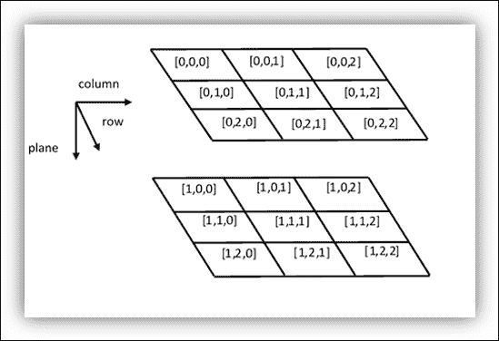 Matrix 3×3 representation

因此，由可变平面的值标识的第一平面中的所有四个元素都等于零：

```py
>>> tensor_3d[0,0,0] 
1 
>>> tensor_3d[0,0,1] 
2 
>>> tensor_3d[0,1,0] 
3 
>>> tensor_3d[0,1,1] 
4

```

三维张量允许引入与图像操作相关的下一个主题，但更笼统地介绍我们以对张量的简单变换进行操作。

## 使用 TensorFlow 处理张量

TensorFlow 旨在处理各种大小的张量和可用于操纵它们的运算符。 在此示例中，为了查看数组操作，我们将使用数字图像。 您可能知道，彩色数字图像是 MxNx3 大小的矩阵（三阶张量），其分量与图像（RGB 空间）中的红色，绿色和蓝色分量相对应，这意味着矩形中的每个特征 RGB 图像的框将由`i`，`j`和`k`三个坐标指定。

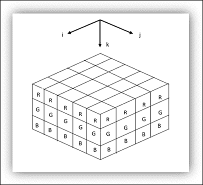 The RGB tensor

我想向您展示的第一件事是如何使用 TensorFlow 切片运算符上传图像，然后从原始图像中提取子图像。

### 准备输入数据

使用 matplotlib 中的`imread`命令，我们以标准格式的颜色（JPG，BMP，TIF）导入数字图像：

```py
import matplotlib.image as mp_image 
filename = "packt.jpeg" 
input_image = mp_image.imread(filename)

```

但是，我们可以看到张量的`rank`和`shape`：

```py
print 'input dim = {}'.format(input_image.ndim) 
print 'input shape = {}'.format(input_image.shape) 

```

您将看到输出（`80, 144, 3`）。 这意味着图像的高度为`80`像素，宽度为`144`像素，深度为`3`。

最后，使用`matplotlib`可以可视化导入的图像：

```py
import matplotlib.pyplot as plt 
plt.imshow(input_image) 
plt.show() 

```

 The starting image

在此示例中，切片是起始图像的二维段，其中每个像素都具有 RGB 分量，因此我们需要一个占位符来存储切片的所有值：

```py
import TensorFlow as tf 
 my_image = tf.placeholder("uint8",[None,None,3])

```

对于最后一个维度，我们仅需要三个值。 然后，我们使用 TensorFlow 运算符切片创建一个子图像：

```py
slice = tf.slice(my_image,[10,0,0],[16,-1,-1])

```

最后一步是构建 TensorFlow 工作会话：

```py
with tf.Session() as session: 
    result = session.run(slice,feed_dict={my_image: input_image}) 
    print(result.shape) 

plt.imshow(result) 
plt.show()

```

最终的形状如下图所示：

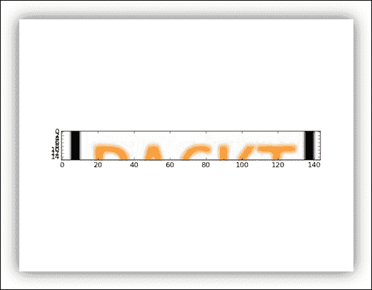 The input image after the slice

在下一个示例中，我们将使用转置运算符对输入图像进行几何变换：

```py
import TensorFlow as tf

```

我们将输入图像与一个称为`x`的变量相关联：

```py
x = tf.Variable(input_image,name='x')

```

然后，我们初始化模型：

```py
model = tf.initialize_all_variables() 

```

接下来，我们使用我们的代码构建会话：

```py
with tf.Session() as session: 

```

要执行矩阵的转置，请使用 TensorFlow 的`transpose`函数。 此方法在输入矩阵的轴 0 和 1 之间执行交换，而`z`轴保持不变：

```py
 x = tf.transpose(x, perm=[1,0,2]) 
    session.run(model) 
    result=session.run(x) 

plt.imshow(result) 
plt.show()

```

结果如下：

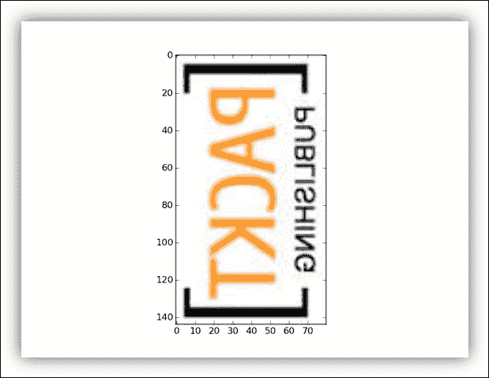 The transposed image

# 复数和分形

首先，我们看一下 Python 如何处理复数。 这很简单。 例如，在 Python 中设置`x = 5 + 4j`，我们必须编写以下代码：

```py
>>> x = 5.+4j

```

这意味着`>>> x`等于`5+4j`。

同时，您可以编写以下内容：

```py
>>> x = complex(5,4) 
>>> x 
(5+4j)

```

我们还注意到：

*   Python 在数学中使用`j`表示`√-1`而不是`i`。
*   如果将数字放在`j`之前，Python 会将其视为虚数，否则将其视为变量。 这意味着，如果要写入虚数`i`，则必须写入`1j`而不是`j`。

要获取 Python 复数的实部和虚部，可以使用以下代码：

```py
>>> x.real 
5.0 
>>> x.imag 
4.0 
>>>

```

现在我们来看我们的问题，即如何使用 TensorFlow 显示分形。 Mandelbrot 图案是最著名的分形之一。 分形是一种几何对象，其结构以不同的比例重复出现。 分形在自然界中很常见，例如大不列颠海岸。

为复数`c`定义了 Mandelbrot 集，对于该复数来说，以下连续是有界的：

```py
Z(n + 1) = Z(n)^2 + c，其中 Z(0) = 0
```

这套作品以其创造者 BenoîtMandelbrot（波兰数学家以制造著名的分形而闻名）的名字命名。 但是，仅在计算机编程的帮助下，他才能为 Mandelbrot 设置形状或图形表示。 1985 年，他在《科学美国人》上发表了第一个计算 Mandelbrot 集的算法。 算法（对于每个点的复数点`Z`）：

1.  `Z`的初始值`Z(0) = 0`。
2.  选择复数`c`作为当前点。 在笛卡尔平面中，横坐标轴（水平线）代表实部，而纵坐标轴（垂直线）代表`c`的虚部。
3.  迭代： `Z(n + 1) = Z(n)^2 + c`
    *   当`Z(n)^2`大于最大半径时停止；

现在我们通过简单的步骤了解如何使用 TensorFlow 转换前面提到的算法。

## 准备 Mandelbrot 集的数据

将必要的库导入到我们的示例中：

```py
import TensorFlow as tf 
import numpy as np 
import matplotlib.pyplot as plt

```

我们构建了一个复杂的网格，其中将包含 Mandelbrot 的集合。 复平面的区域在实轴上位于`-1.3`和`+1.3`之间，在虚轴上位于`-2j`和`+1j`之间。 每个图像中的每个像素位置将代表不同的复数值`z`：

```py
Y, X = np.mgrid[-1.3:1.3:0.005, -2:1:0.005] 
Z = X+1j*Y 
c = tf.constant(Z.astype(np.complex64)) 

```

然后，我们定义数据结构或张量 TensorFlow，其中包含要包含在计算中的所有数据。 然后，我们定义两个变量。 第一个是我们进行迭代的那个。 它具有与复杂网格相同的尺寸，但是被声明为变量，也就是说，其值将在计算过程中发生变化：

```py
zs = tf.Variable(c) 

```

下一个变量初始化为零。 它的大小也与变量`zs`相同：

```py
ns = tf.Variable(tf.zeros_like(c, tf.float32)) 

```

## 为 Mandelbrot 集建立并执行数据流图

代替引入会话，我们实例化一个`InteractiveSession()`：

```py
sess = tf.InteractiveSession()

```

正如我们将看到的，它需要`Tensor.eval()`和`Operation.run()`方法。 然后，我们通过`run()`方法初始化所有涉及的变量：

```py
tf.initialize_all_variables().run()

```

开始迭代：

```py
 zs_ = zs*zs + c

```

定义迭代的停止条件：

```py
not_diverged = tf.complex_abs(zs_) < 4 

```

然后，我们使用对多个操作进行分组的分组运算符：

```py
step = tf.group(zs.assign(zs_),\ 
             ns.assign_add(tf.cast(not_diverged, tf.float32)))

```

第一个操作是步骤迭代`Z(n + 1) = Z(n)^2 + c`以创建新值。

第二个操作将此值添加到`ns`中的对应元素变量中。 此`op`完成时，输入中的所有操作都已完成。 该运算符没有输出。

然后，我们将运算符运行两百步：

```py
for i in range(200): step.run()

```

## 可视化 Mandelbrot 的结果

结果将是张量`ns.eval()`。 使用 matplotlib，让我们可视化结果：

```py
plt.imshow(ns.eval()) 
plt.show() 

```

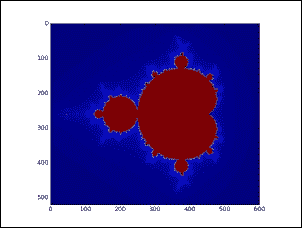

曼德布罗集

当然，Mandelbrot 集并不是我们可以看到的唯一分形。 朱莉娅集合是分形，以加斯顿·莫里斯·朱莉亚（Gaston Maurice Julia）的名字在该领域的工作而得名。 它们的构建过程与用于 Mandelbrot 集的过程非常相似。

## 准备 Julia 的数据

让我们定义输出复杂平面。 它在实轴上位于`-2`和`+2`之间，在虚轴上位于`-2j`和`+2j`之间：

```py
Y, X = np.mgrid[-2:2:0.005, -2:2:0.005]

```

和当前点位置：

```py
Z = X+1j*Y

```

朱莉娅集合的定义需要将`Z`重新定义为恒定张量：

```py
Z = tf.constant(Z.astype("complex64")) 

```

因此，支持我们的计算的输入张量如下：

```py
zs = tf.Variable(Z)
ns = tf.Variable(tf.zeros_like(Z, "float32"))

```

## 为 Julia 集建立并执行数据流图

与前面的示例一样，我们创建了自己的交互式会话：

```py
sess = tf.InteractiveSession()

```

然后我们初始化输入张量：

```py
tf.initialize_all_variables().run() 

```

为了计算 Julia 集的新值，我们将使用迭代公式`Z(n + 1) = Z(n)^2 + c`，其中初始点`c`等于虚数`0.75i`：

```py
c = complex(0.0,0.75) 
zs_ = zs*zs - c

```

分组运算符和停止迭代的条件将与 Mandelbrot 计算中的相同：

```py
not_diverged = tf.complex_abs(zs_) < 4 

step = tf.group(zs.assign(zs_),\ 
              ns.assign_add(tf.cast(not_diverged, "float32"))) 

```

最后，我们将操作符运行两百步：

```py
for i in range(200): step.run()

```

## 可视化结果

要显示结果，请运行以下命令：

```py
plt.imshow(ns.eval()) 
plt.show()

```

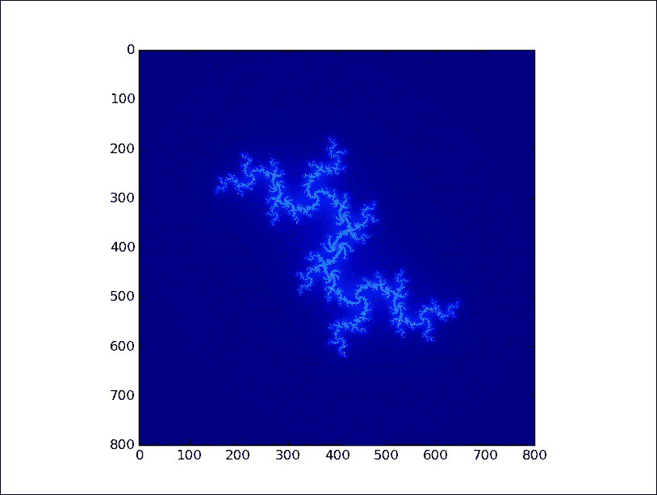

朱莉娅套装

# 计算梯度

TensorFlow 具有解决其他更复杂任务的功能。 例如，我们将使用数学运算符来计算`y`相对于其表达式`x`参数的导数。 为此，我们使用`tf.gradients()`功能。

让我们考虑数学函数`y = 2*x²`。 我们要计算相对于`x=1`的梯度`dy/dx`。 以下是计算此梯度的代码：

1.  首先，导入 TensorFlow 库：

    ```py
     import TensorFlow as tf

    ```

2.  `x`变量是函数的自变量：

    ```py
     x = tf.placeholder(tf.float32)

    ```

3.  让我们构建函数：

    ```py
     y =  2*x*x

    ```

4.  最后，我们以`y`和`x`作为参数调用 `tf.gradients()`函数：

    ```py
     var_grad = tf.gradients(y, x)

    ```

5.  要求解梯度，我们必须建立一个会话：

    ```py
     with tf.Session() as session:

    ```

6.  将通过变量`x=1`求解梯度：

    ```py
     var_grad_val = session.run(var_grad,feed_dict={x:1}) 

    ```

7.  `var_grad_val`值是要打印的进纸结果：

    ```py
     print(var_grad_val)

    ```

8.  得到以下结果：

    ```py
     >> 
        [4.0] 
        >>

    ```

# 随机数

随机数的生成对于机器学习和训练算法至关重要。 当计算机生成随机数时，它们是由**伪随机数生成器**（**PRNG**）生成的。 术语“伪”来自这样一个事实，即计算机是仅能模拟随机性的指令的染色逻辑编程运行。 尽管存在逻辑限制，但计算机在生成随机数方面非常有效。 TensorFlow 为开发者提供了创建具有不同分布的随机张量的方法。

## 均匀分布

通常，当我们需要使用随机数时，我们尝试获得相同频率，均匀分布的重复值。 运算符 TensorFlow 提供`minval`和`maxval`之间的值，所有这些值具有相同的概率。 让我们看一个简单的示例代码：

```py
random_uniform(shape, minval, maxval, dtype, seed, name) 

```

我们导入`TensorFlow`库和`matplotlib`以显示结果：

```py
import TensorFlow as tf 
import matplotlib.pyplot as plt 

```

`uniform`变量是一维张量，元素`100`的值范围从 0 到 1，以相同的概率分布：

```py
uniform = tf.random_uniform([100],minval=0,maxval=1,dtype=tf.float32) 

```

让我们定义会话：

```py
sess = tf.Session()

```

在我们的会话中，我们使用`eval ()`运算符求值均匀的张量：

```py
with tf.Session() as session: 
    print uniform.eval() 
    plt.hist(uniform.eval(),normed=True) 
    plt.show()

```

如您所见，所有介于 0 和 1 之间的中间值都具有大致相同的频率。 这种行为称为均匀分布。 因此，执行结果如下：

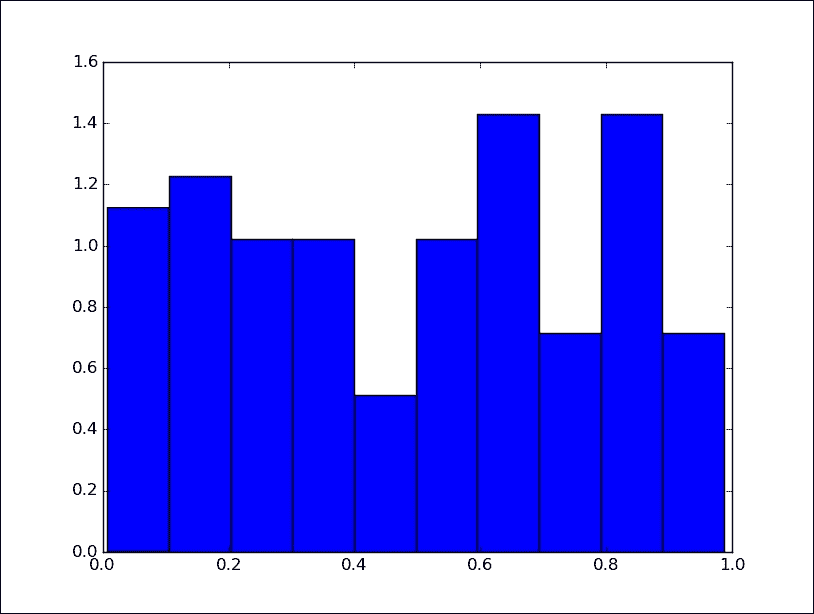

均匀分布

## 正态分布

在某些特定情况下，您可能需要生成相差几个单位的随机数。 在这种情况下，我们使用随机数的*正态分布*，也称为*高斯分布*，这增加了下一个问题在 0 处提取的可能性。每个整数代表标准差。 从未来的问题可以看出，该范围的边被提取的可能性很小。 以下是 TensorFlow 的实现：

```py
import TensorFlow as tf 
import matplotlib.pyplot as plt 

norm = tf.random_normal([100], mean=0, stddev=2) 
with tf.Session() as session: 
    plt.hist(norm.eval(),normed=True) 
    plt.show()

```

我们使用运算符`tf.random_normal`创建了一个形状为`[100]`的`1d-tensor`，该形状由均值等于 0 且标准差等于`2`的随机正态值组成。 结果如下：

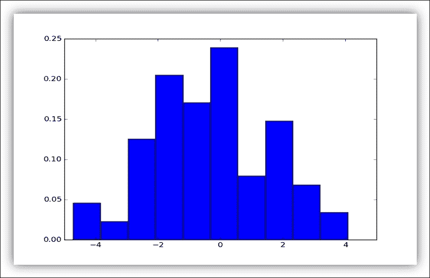

正态分布

## 用种子生成随机数

我们回想起我们的序列是*伪随机*，因为这些值是使用确定性算法计算的，并且概率没有实际作用。 种子只是序列的起点，如果从同一种子开始，则将以相同的序列结束。 例如，这对于调试代码非常有用，例如当您在程序中搜索错误时，由于每次运行都会有所不同，因此您必须能够重现该问题。

考虑以下示例，其中有两个均匀分布：

```py
uniform_with_seed = tf.random_uniform([1], seed=1)
uniform_without_seed = tf.random_uniform([1])

```

在第一个均匀分布中，我们从种子`= 1`开始。这意味着重复求值两个分布，第一个均匀分布将始终生成值相同的序列：

```py
print("First Run") 
with tf.Session() as first_session:
print("uniform with (seed = 1) = {}"\
.format(first_session.run(uniform_with_seed)))
print("uniform with (seed = 1) = {}"\
.format(first_session.run(uniform_with_seed)))
print("uniform without seed = {}"\
.format(first_session.run(uniform_without_seed)))
print("uniform without seed = {}"\
.format(first_session.run(uniform_without_seed)))
print("Second Run")
with tf.Session() as second_session:
print("uniform with (seed = 1) = {}\
.format(second_session.run(uniform_with_seed)))
print("uniform with (seed = 1) = {}\
.format(second_session.run(uniform_with_seed)))
print("uniform without seed = {}"\
.format(second_session.run(uniform_without_seed)))
print("uniform without seed = {}"\
.format(second_session.run(uniform_without_seed)))

```

如您所见，这是最终结果。 `seed = 1`的均匀分布总是得到相同的结果：

```py
>>>  
First Run 
uniform with (seed = 1) = [ 0.23903739] 
uniform with (seed = 1) = [ 0.22267115] 
uniform without seed = [ 0.92157185] 
uniform without seed = [ 0.43226039] 
Second Run 
uniform with (seed = 1) = [ 0.23903739] 
uniform with (seed = 1) = [ 0.22267115] 
uniform without seed = [ 0.50188708] 
uniform without seed = [ 0.21324408] 
>>>

```

### 蒙特卡洛法

我们以有关蒙特卡洛方法的简单注释结束有关随机数的部分。 它是一种数值概率方法，广泛应用于高性能科学计算的应用中。 在我们的示例中，我们将计算`π`的值：

```py
import TensorFlow as tf 

trials = 100 
hits = 0

```

使用`random_uniform`函数在正方形`[-1,1]×[-1,1]`内生成伪随机点：

```py
x = tf.random_uniform([1],minval=-1,maxval=1,dtype=tf.float32) 
y = tf.random_uniform([1],minval=-1,maxval=1,dtype=tf.float32) 
pi = []

```

开始会话：

```py
sess = tf.Session()

```

在会话中，我们计算`π`的值：圆的面积为`π`，正方形的面积为`4`。 圆内的数字与生成的点的总数之间的关系必须收敛（非常缓慢）到`π`，并且我们计算圆方程`x<sup>2</sup>+y<sup>2</sup>=1`内有多少点。

```py
with sess.as_default(): 
    for i in range(1,trials): 
        for j in range(1,trials): 
            if x.eval()**2 + y.eval()**2 < 1 : 
                hits = hits + 1 
                pi.append((4 * float(hits) / i)/trials)   

plt.plot(pi) 
plt.show()

```

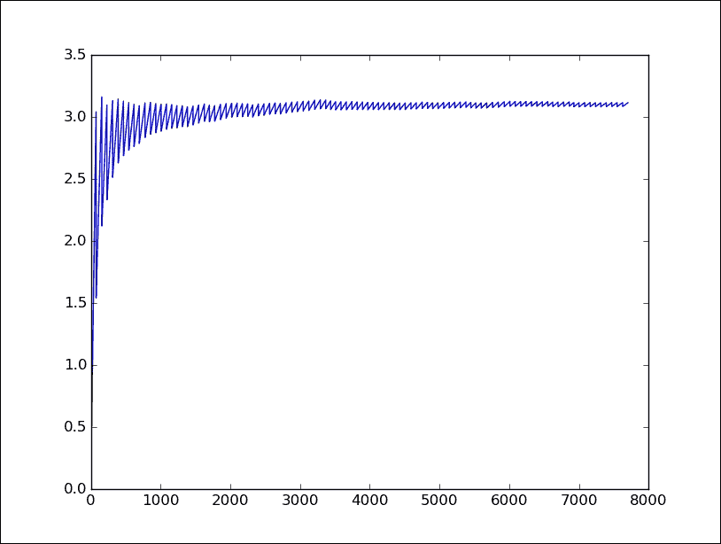

该图显示了测试次数达到π值时的收敛性

# 求解偏微分方程

**偏微分方程**（**PDE**）是一个微分方程，涉及多个独立变量的未知函数的偏导数。 PDE 通常用于制定和解决从量子力学到金融市场等各个领域的重大物理问题。 在本节中，我们以[这里](https://www.TensorFlow.org/versions/r0.8/tutorials/pdes/index.html)为例，展示了 TensorFlow 在二维 PDE 解决方案中的用法，它建模了方形池塘的表面，上面有几滴雨滴。 效果将是在池塘本身上产生二维波。 我们不会专注于问题的计算方面，因为这超出了本书的范围。 相反，我们将专注于使用 TensorFlow 定义问题。

起点是导入以下基本库：

```py
import TensorFlow as tf 
import numpy as np 
import matplotlib.pyplot as plt

```

## 初始条件

首先，我们必须定义问题的范围。 假设我们的池塘是`500x500`正方形：

```py
N = 500

```

以下二维张量是时间`t = 0`处的池塘，即我们问题的*初始条件*：

```py
u_init = np.zeros([N, N], dtype=np.float32) 

```

我们上面有`40`个随机雨滴

```py
for n in range(40): 
  a,b = np.random.randint(0, N, 2) 
  u_init[a,b] = np.random.uniform()

```

`np.random.randint(0, N, 2)`是 NumPy 函数，可在二维形状上返回从 0 到`N`的随机整数。

使用 matplotlib，我们可以显示初始正方形池塘：

```py
plt.imshow(U.eval()) 
plt.show()

```

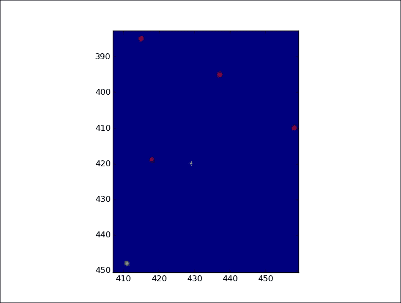

在初始状态下放大池塘：彩色圆点表示掉落的雨滴

然后我们定义以下张量：

```py
ut_init = np.zeros([N, N], dtype=np.float32) 

```

它是池塘的*时间演变*。 在时间`t = t<sub>end</sub>`，它将包含池塘的最终状态。

## 构建模型

我们必须定义一些基本参数（使用 TensorFlow 占位符）和仿真的时间步长：

```py
eps = tf.placeholder(tf.float32, shape=())

```

我们还必须定义模型的物理参数，即`damping`系数：

```py
damping = tf.placeholder(tf.float32, shape=())

```

然后我们将起始张量重新定义为 TensorFlow 变量，因为它们的值将在模拟过程中发生变化：

```py
U  = tf.Variable(u_init) 
Ut = tf.Variable(ut_init)

```

最后，我们建立 PDE 模型。 它代表雨滴落下后池塘时间的演变：

```py
U_ = U + eps * Ut 
Ut_ = Ut + eps * (laplace(U) - damping * Ut) 

```

如您所见，我们引入了`laplace(U)`函数来解析 PDE（将在本节的最后一部分中进行介绍）。

使用 TensorFlow 组运算符，我们定义了时间池`t`应该如何演变：

```py
 step = tf.group( 
  U.assign(U_), 
  Ut.assign(Ut_))

```

让我们回想一下，组运算符将多个操作分组为一个操作。

## 执行图

在我们的会话中，我们将以`1000`步长看到池塘的时间演变，其中每个时间步长等于`0.03s`，而阻尼系数设置为`0.04`。

让我们初始化 TensorFlow 变量：

```py
tf.initialize_all_variables().run()

```

然后我们运行模拟：

```py
for i in range(1000): 
  step.run({eps: 0.03, damping: 0.04}) 
  if i % 50 == 0: 
    clear_output() 
    plt.imshow(U.eval()) 
    plt.show()

```

每`50`个步骤，仿真结果将显示如下：

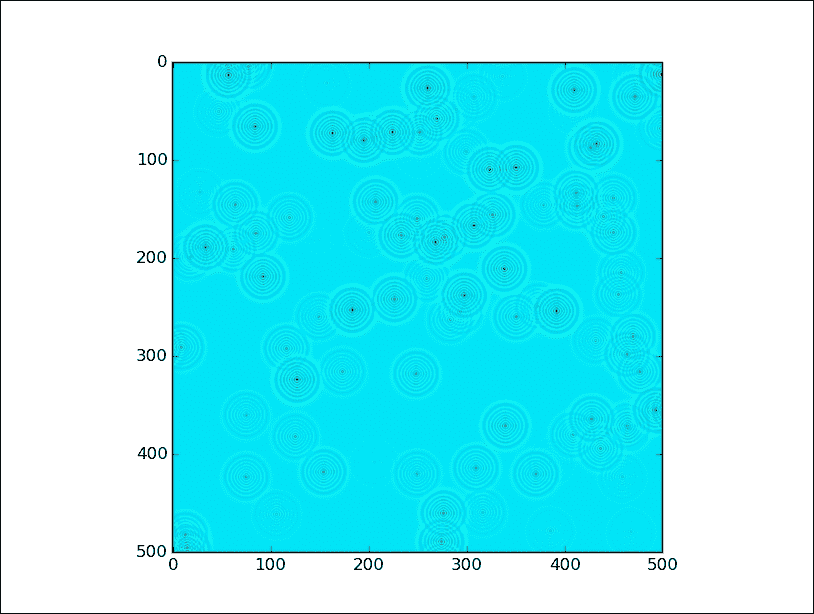

经过 400 个模拟步骤的池塘

### 使用的计算函数

现在让我们看看`Laplace(U)`函数和所使用的辅助函数是什么：

```py
def make_kernel(a): 
  a = np.asarray(a) 
  a = a.reshape(list(a.shape) + [1,1]) 
  return tf.constant(a, dtype=1) 

def simple_conv(x, k): 
  x = tf.expand_dims(tf.expand_dims(x, 0), -1) 
  y = tf.nn.depthwise_conv2d(x, k, [1, 1, 1, 1],padding='SAME') 
  return y[0, :, :, 0] 

def laplace(x): 
    laplace_k = make_kernel([[0.5, 1.0, 0.5], 
                           [1.0, -6., 1.0], 
                           [0.5, 1.0, 0.5]]) 
  return simple_conv(x, laplace_k)

```

这些功能描述了模型的物理性质，也就是说，随着波浪的产生和在池塘中的传播。 我不会详细介绍这些功能，对它们的理解超出了本书的范围。

下图显示了雨滴落下后池塘上的波浪。


放大池塘

# 总结

在本章中，我们研究了 TensorFlow 的一些数学潜力。 从*张量*的基本定义（任何类型的计算的基本数据结构），我们看到了一些使用 TensorFlow 的数学运算符处理这些数据结构的示例。 使用*复数*数，我们探索了分形的世界。 然后，我们介绍了*随机*数的概念。 这些实际上用于机器学习中的模型开发和测试，因此本章以使用偏微分方程定义和解决数学问题的示例结尾。

在下一章中，最后我们将开始在 TensorFlow 的开发领域立即开始运作-在机器学习中，解决诸如*分类*和*数据聚类*之类的复杂问题 。