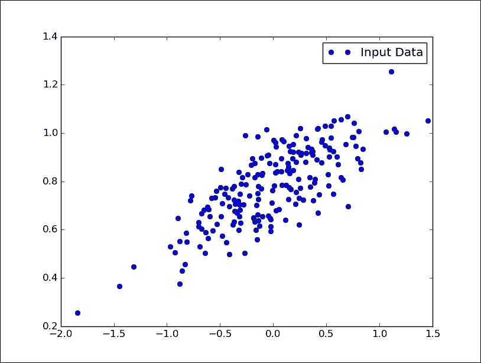
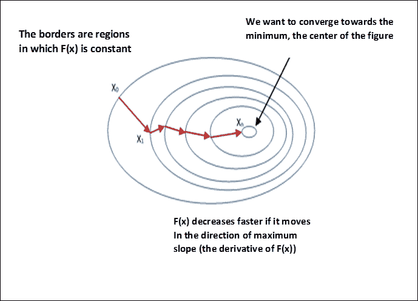
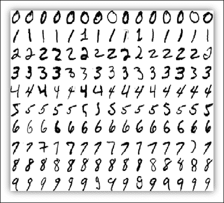
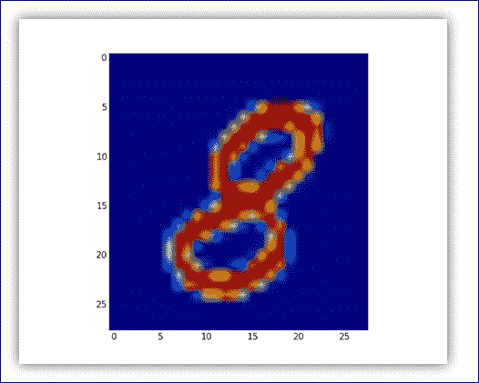
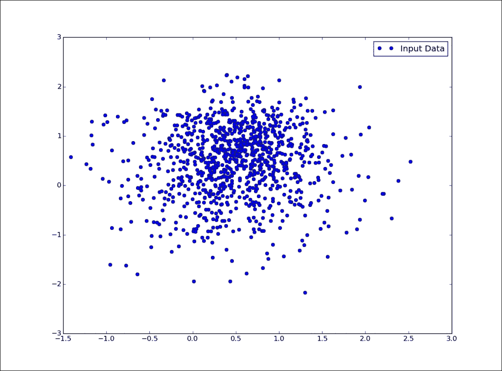

# 第 3 章从机器学习开始

在本章中，我们将介绍以下主题：

*   线性回归
*   MNIST 数据集
*   分类器
*   最近邻居算法
*   数据聚类
*   k-均值算法

# 线性回归算法

在本节中，我们将使用线性回归算法开始对机器学习技术的探索。 我们的目标是建立一个模型，通过该模型从一个或多个自变量的值预测因变量的值。

这两个变量之间的关系是线性的。 也就是说，如果`y`是因变量，`x`是因变量，则两个变量之间的线性关系如下所示：`y = Ax + b`。

线性回归算法可适应多种情况。 由于它的多功能性，它被广泛应用于应用科学领域，例如生物学和经济学。

此外，该算法的实现使我们能够以一种完全清晰易懂的方式介绍机器学习的两个重要概念：成本函数和**梯度下降算法**。

## 资料模型

关键的第一步是建立我们的数据模型。 前面我们提到变量之间的关系是线性的，即：`y = Ax + b`，其中`A`和`b`是常数。 为了测试我们的算法，我们需要二维空间中的数据点。

我们首先导入 Python 库 NumPy：

```py
import numpy as np

```

然后，我们定义要绘制的点数：

```py
number_of_points = 500

```

我们初始化以下两个列表：

```py
x_point = []
y_point = []

```

这些点将包含生成的点。

然后，我们设置将出现在`y`与`x`的线性关系中的两个常数：

```py
a = 0.22
b = 0.78

```

通过 NumPy 的`random.normal`函数，我们在回归方程`y = 0.22x + 0.78`周围生成 300 个随机点：

```py
for i in range(number_of_points):
    x = np.random.normal(0.0,0.5)
    y = a*x + b +np.random.normal(0.0,0.1)
    x_point.append([x])
    y_point.append([y])

```

最后，通过`matplotlib`查看生成的点：

```py
import matplotlib.pyplot as plt
plt.plot(x_point,y_point, 'o', label='Input Data')
plt.legend()
plt.show()

```



线性回归：数据模型

### 成本函数和梯度下降

我们要用 TensorFlow 实现的机器学习算法必须根据我们的数据模型将`y`的值预测为`x`数据的函数。 线性回归算法将确定常数`A`和`b`（已为我们的数据模型固定）的值，然后这些常数才是问题的真正未知数。

第一步是导入`tensorflow`库：

```py
import tensorflow as tf

```

然后使用 TensorFlow `tf.Variable`定义`A`和`b`未知数：

```py
A = tf.Variable(tf.random_uniform([1], -1.0, 1.0))

```

使用`-1`和`1`之间的随机值初始化未知因子`A`，而变量`b`最初设置为零：

```py
b = tf.Variable(tf.zeros([1]))

```

因此，我们写了将`y`绑定到`x`的线性关系：

```py
y = A * x_point + b

```

现在，我们将介绍此*成本函数*：其参数包含一对要确定的值`A`和`b`，该参数将返回一个估计参数正确性的值。 在此示例中，我们的成本函数为*均方误差*：

```py
cost_function = tf.reduce_mean(tf.square(y - y_point))

```

它提供了对度量的可变性的估计，或更准确地说，是估计值在平均值附近的离散度； 该函数的较小值对应于未知参数`A`和`b`的最佳估计。

为了使`cost_function`最小化，我们使用*梯度下降*的优化算法。 给定几个变量的数学函数，梯度下降允许找到该函数的局部最小值。 该技术如下：

*   **在函数域的任意第一点评估**，函数本身及其梯度。 梯度表示函数趋向于最小的方向。
*   **在渐变指示的方向上选择**第二点。 如果此第二点的函数的值小于在第一点计算的值，则下降可以继续。

您可以参考下图来直观地了解算法：



梯度下降算法

我们还指出，梯度下降只是*局部函数最小值*，但它也可以用于搜索全局最小值，一旦找到了局部最小值，便会随机选择一个新的起点，然后重复 处理很多次。 如果函数的最小值的数量有限，并且尝试的次数非常多，则很有可能早晚确定全局最小值。

使用 TensorFlow，该算法的应用非常简单。 指令如下：

```py
optimizer = tf.train.GradientDescentOptimizer(0.5)

```

这里`0.5`是该算法的*学习率*。

学习速度决定了我们朝着最佳权重发展的速度是多快还是多慢。 如果太大，则跳过最佳解决方案；如果太大，则需要太多迭代才能收敛到最佳值。

提供了一个中间值（`0.5`），但是必须对其进行调整，以提高整个过程的性能。

我们通过其`minimize`函数将`train`定义为`cost_function`（`optimizer`）应用的结果：

```py
train = optimizer.minimize(cost_function)

```

#### 测试模型

现在，我们可以在您之前创建的数据模型上测试梯度下降算法。 和往常一样，我们必须初始化所有变量：

```py
model = tf.initialize_all_variables()

```

因此，我们构建了迭代（20 个计算步骤），使我们能够确定`A`和`b`的最佳值，它们定义最适合数据模型的线。 实例化评估图：

```py
with tf.Session() as session:

```

我们对模型进行仿真：

```py
 session.run(model)
        for step in range(0,21):

```

对于每次迭代，我们执行优化步骤：

```py
 session.run(train)

```

每隔五个步骤，我们将打印出点图形：

```py
 if (step % 5) == 0:
                        plt.plot(x_point,y_point,'o',
                                 label='step = {}'
                                 .format(step))

```

直线是通过以下命令获得的：

```py
                        plt.plot(x_point,
                                 session.run(A) * 
                                 x_point + 
                                 session.run(B))
                        plt.legend()
                        plt.show()

```

下图显示了所实现算法的收敛性：


线性回归：开始计算（步长= 0）

仅需五个步骤，我们就可以看到（在下图中）该生产线的贴合性有了实质性的改进：


线性回归：5 个计算步骤后的情况

下图（最后一张图）显示了 20 个步骤后的确定结果。 我们可以看到所使用算法的效率，完美地跨越了点云的直线效率。


线性回归：最终结果

最后，我们报告完整的代码，以加深我们的理解：

```py
import numpy as np
import matplotlib.pyplot as plt
import tensorflow as tf
number_of_points = 200
x_point = []
y_point = []
a = 0.22
b = 0.78
for i in range(number_of_points):
    x = np.random.normal(0.0,0.5)
    y = a*x + b +np.random.normal(0.0,0.1)
    x_point.append([x])
    y_point.append([y])
plt.plot(x_point,y_point, 'o', label='Input Data')
plt.legend()
plt.show()
A = tf.Variable(tf.random_uniform([1], -1.0, 1.0))
B = tf.Variable(tf.zeros([1]))
y = A * x_point + B
cost_function = tf.reduce_mean(tf.square(y - y_point))
optimizer = tf.train.GradientDescentOptimizer(0.5)
train = optimizer.minimize(cost_function)
model = tf.initialize_all_variables()
with tf.Session() as session:
        session.run(model)
        for step in range(0,21):
                session.run(train)
                if (step % 5) == 0:
                        plt.plot(x_point,y_point,'o',
                                 label='step = {}'
                                 .format(step))
                        plt.plot(x_point,
                                 session.run(A) * 
                                 x_point + 
                                 session.run(B))
                        plt.legend()
                        plt.show()

```

# MNIST 数据集

MNIST 数据集（可从 [http://yann.lecun.com/exdb/mnist/](http://yann.lecun.com/exdb/mnist/) 获得）在机器学习领域中广泛用于培训和测试，我们将在示例中使用它 这本书。 它包含从 0 到 9 的手写数字的黑白图像。

数据集分为两个组：60,000 个用于训练模型，另外 10,000 个用于测试模型。 将黑白的原始图像规格化以适合大小为 28×28 像素的盒子，并通过计算像素的质心来居中。 下图表示如何在 MNIST 数据集中表示数字：



MNIST 数字采样

每个 MNIST 数据点是一个数字数组，描述每个像素有多暗。 例如，对于以下数字（数字 1），我们可以有：


数字 1 的像素表示

## 下载并准备数据

以下代码导入了我们将要分类的 MNIST 数据文件。 我正在使用 Google 提供的脚本，可以从以下位置下载该脚本：

[https://github.com/tensorflow/tensorflow/blob/r0.7/tensorflow/examples/tutorials/mnist/input_data.py](https://github.com/tensorflow/tensorflow/blob/r0.7/tensorflow/examples/tutorials/mnist/input_data.py) 。 它必须在文件所在的同一文件夹中运行。

现在，我们将展示如何加载和显示数据：

```py
import input_data
import numpy as np
import matplotlib.pyplot as plt

```

使用`input_data`，我们加载数据集：

```py
mnist_images = input_data.read_data_sets\
               ("MNIST_data/",\
                one_hot=False)
train.next_batch(10) returns the first 10 images :
pixels,real_values = mnist_images.train.next_batch(10)

```

这还会返回两个列表：加载的像素矩阵和包含加载的实数值的列表：

```py
print "list of values loaded ",real_values
example_to_visualize = 5
print "element N° " + str(example_to_visualize + 1)\
                    + " of the list plotted"
>>
Extracting MNIST_data/train-labels-idx1-ubyte.gz
Extracting MNIST_data/t10k-images-idx3-ubyte.gz 
Extracting MNIST_data/t10k-labels-idx1-ubyte.gz 
list of values loaded  [7 3 4 6 1 8 1 0 9 8] 
element N 6 of the list plotted
>>

```

在显示元素时，我们可以使用 matplotlib，如下所示：

```py
image = pixels[example_to_visualize,:]
image = np.reshape(image,[28,28])
plt.imshow(image)
plt.show()

```

结果如下：



MNIST 的数字八

# 分类器

在机器学习的上下文中，术语*分类*标识一种算法过程，该算法过程将每个新的输入数据（*实例*）分配给一种可能的类别（*类*） 。 如果只考虑两个类，我们将讨论二进制分类。 否则我们有一个多类分类。

该分类属于*监督学习*类别，这使我们可以根据所谓的*训练集*对新实例进行分类。 解决监督分类问题的基本步骤如下：

1.  构建培训示例，以表示完成分类的实际环境和应用。
2.  选择分类器和相应的算法实现。
3.  在训练集上训练算法，并通过验证设置任何控制参数。
4.  通过应用一组新实例（测试集）评估分类器的准确性和性能。

## 最近邻居算法

**K 最近邻**（ **KNN** ）是用于分类或回归的监督学习算法。 它是一个系统，根据其与内存中存储的对象之间的距离来分配测试样品的类别。

距离`d`定义为两点之间的欧几里得距离：


`n`是空间的尺寸。 这种分类方法的优点是能够对类别*无法线性分离*的对象进行分类。 考虑到训练数据*的*小扰动*不会显着影响*的结果，因此这是一个稳定的分类器。 但是，最明显的缺点是它不能提供真正的数学模型。 相反，对于每个新分类，应通过将新数据添加到所有初始实例并针对所选 K 值重复计算过程来执行。

此外，它需要相当大量的数据才能进行实际的预测，并且对分析数据的噪声敏感。

在下一个示例中，我们将使用 MNIST 数据集实现 KNN 算法。

### 建立训练集

让我们从模拟所需的导入库开始：

```py
import numpy as np
import tensorflow as tf
import input_data

```

要构建训练集的数据模型，请使用前面介绍的`input_data.read_data_sets`函数：

```py
mnist = input_data.read_data_sets("/tmp/data/", one_hot=True)

```

在我们的示例中，我们将进行训练阶段，该阶段包括 100 个 MNIST 图像：

```py
train_pixels,train_list_values = mnist.train.next_batch(100) 

```

在测试`10`图像的算法时：

```py
test_pixels,test_list_of_values  = mnist.test.next_batch(10) 

```

最后，我们定义用于构建分类器的张量`train_pixel_tensor`和`test_pixel_tensor`：

```py
train_pixel_tensor = tf.placeholder\
                     ("float", [None, 784])
test_pixel_tensor = tf.placeholder\
                    ("float", [784])

```

### 成本函数和优化

成本函数由距离表示，以像素为单位：

```py
distance = tf.reduce_sum\
           (tf.abs\
            (tf.add(train_pixel_tensor, \
                    tf.neg(test_pixel_tensor))), \
            reduction_indices=1)

```

`tf.reduce`函数 sum 用于计算张量维度上的元素之和。 例如（摘自 TensorFlow 在线手册）：

```py
# 'x' is [[1, 1, 1]
#         [1, 1, 1]]
tf.reduce_sum(x) ==> 6
tf.reduce_sum(x, 0) ==> [2, 2, 2]
tf.reduce_sum(x, 1) ==> [3, 3]
tf.reduce_sum(x, 1, keep_dims=True) ==> [[3], [3]]
tf.reduce_sum(x, [0, 1]) ==> 6

```

最后，为了最小化距离函数，我们使用`arg_min`，它返回距离最小（最近邻居）的索引：

```py
pred = tf.arg_min(distance, 0)

```

#### 测试和算法评估

准确性是可以帮助我们计算分类器最终结果的参数：

```py
accuracy = 0

```

初始化变量：

```py
init = tf.initialize_all_variables()

```

开始模拟：

```py
with tf.Session() as sess:
    sess.run(init)
    for i in range(len(test_list_of_values)):

```

然后，我们使用前面定义的`pred`函数评估最近的邻居索引：

```py
nn_index = sess.run(pred,\
    feed_dict={train_pixel_tensor:train_pixels,\
    test_pixel_tensor:test_pixels[i,:]})

```

最后，我们找到最近的邻居类标签，并将其与其真实标签进行比较：

```py
 print "Test N° ", i,"Predicted Class: ", \
    np.argmax(train_list_values[nn_index]),\
    "True Class: ", np.argmax(test_list_of_values[i])
        if np.argmax(train_list_values[nn_index])\
    == np.argmax(test_list_of_values[i]):

```

然后，我们评估并报告分类器的准确性：

```py
 accuracy += 1./len(test_pixels)
    print "Result = ", accuracy

```

如我们所见，训练集的每个元素均已正确分类。 仿真结果显示了预测类和真实类，最后报告了仿真的总价值：

```py
>>>
Extracting /tmp/data/train-labels-idx1-ubyte.gz                                Extracting /tmp/data/t10k-images-idx3-ubyte.gz
Extracting /tmp/data/t10k-labels-idx1-ubyte.gz 
Test N°  0 Predicted Class:  7 True Class:  7 
Test N°  1 Predicted Class:  2 True Class:  2 
Test N°  2 Predicted Class:  1 True Class:  1 
Test N°  3 Predicted Class:  0 True Class:  0 
Test N°  4 Predicted Class:  4 True Class:  4 
Test N°  5 Predicted Class:  1 True Class:  1 
Test N°  6 Predicted Class:  4 True Class:  4 
Test N°  7 Predicted Class:  9 True Class:  9 
Test N°  8 Predicted Class:  6 True Class:  5 
Test N°  9 Predicted Class:  9 True Class:  9 
Result =  0.9
>>>

```

结果不是 100％准确； 原因是在于对测试编号的错误评估。 8 代替 5，分类器的评分为 6。

最后，我们报告用于 KNN 分类的完整代码：

```py
import numpy as np
import tensorflow as tf
import input_data
#Build the Training Set

```

```py
mnist = input_data.read_data_sets("/tmp/data/", one_hot=True)
train_pixels,train_list_values = mnist.train.next_batch(100) 
test_pixels,test_list_of_values  = mnist.test.next_batch(10) 
train_pixel_tensor = tf.placeholder\
                     ("float", [None, 784])
test_pixel_tensor = tf.placeholder\
                     ("float", [784])
#Cost Function and distance optimization
distance = tf.reduce_sum\
           (tf.abs\
            (tf.add(train_pixel_tensor, \
                    tf.neg(test_pixel_tensor))), \
            reduction_indices=1)
pred = tf.arg_min(distance, 0)
# Testing and algorithm evaluation
accuracy = 0.
init = tf.initialize_all_variables()
with tf.Session() as sess:
    sess.run(init)
    for i in range(len(test_list_of_values)):
        nn_index = sess.run(pred,\
    feed_dict={train_pixel_tensor:train_pixels,\
    test_pixel_tensor:test_pixels[i,:]})
        print "Test N° ", i,"Predicted Class: ", \
    np.argmax(train_list_values[nn_index]),\
    "True Class: ", np.argmax(test_list_of_values[i])
        if np.argmax(train_list_values[nn_index])\
    == np.argmax(test_list_of_values[i]):
            accuracy += 1./len(test_pixels)
    print "Result = ", accuracy

```

# 数据聚类

聚类问题包括从一组初始数据中选择和分组同类项目。 为了解决这个问题，我们必须：

*   确定元素之间的*相似度*度量
*   找出是否存在与所选测度*类似*的元素子集

该算法确定哪些元素构成一个簇，以及在簇内将它们组合在一起的相似程度。

聚类算法属于*无监督方法*，因为我们不假设有关聚类结构和特征的任何先验信息。

## k-均值算法

k-means 是最常见和最简单的*聚类算法*之一，它可以根据对象的属性将对象组细分为 k 个分区。 每个簇由*点*或*质心平均值*标识。

该算法遵循一个迭代过程：

1.  随机选择 K 个点作为初始质心。
2.  重复。
3.  通过将所有点分配给最接近的质心来形成表格 K 的聚类。
4.  重新计算每个群集的质心。
5.  直到质心不变。

k 均值的流行来自其*收敛速度*和其*易于实现。* 就解决方案的质量而言，该算法不能保证实现全局最优。 最终解决方案*的质量在很大程度上取决于*集群的*初始集*，并且在实践中可能会获得更差的全局最优解。 由于该算法非常快，因此您可以多次应用它，并提供解决方案，您可以从中选择最满意的一种。 该算法的另一个缺点是，它要求您选择要查找的簇数（k）。

如果数据不是自然分区的，您将最终得到奇怪的结果。 此外，该算法仅在数据中存在可识别的球形簇时才有效。

现在让我们看看如何通过 TensorFlow 库实现 k-means。

## 建立训练集

将所有必需的库导入到我们的仿真中：

```py
import matplotlib.pyplot as plt
import numpy as np
import tensorflow as tf
import pandas as pd

```

### 注意

Pandas 是适用于 Python 编程语言的开源，易于使用的数据结构和数据分析工具。 要安装它，请键入以下命令：

```py
sudo pip install pandas

```

我们必须定义问题的参数。 我们要聚类的总点数为`1000`分：

```py
num_vectors = 1000

```

您要通过所有首字母实现的分区数：

```py
num_clusters = 4

```

我们设置 k-means 算法的计算步骤数：

```py
num_steps = 100

```

我们初始化初始输入数据结构：

```py
x_values = []
y_values = []
vector_values = []

```

*训练集*创建了一个随机的点集，这就是为什么我们使用`random.normal` NumPy 函数，从而允许我们构建`x_values`和`y_values`向量的原因：

```py
for i in xrange(num_vectors):
  if np.random.random() > 0.5:
    x_values.append(np.random.normal(0.4, 0.7))
    y_values.append(np.random.normal(0.2, 0.8))
  else:
    x_values.append(np.random.normal(0.6, 0.4))
    y_values.append(np.random.normal(0.8, 0.5))

```

我们使用 Python 的`zip`函数来获取`vector_values`的完整列表：

```py
vector_values = zip(x_values,y_values)

```

然后，`vector_values`转换为可由 TensorFlow 使用的常量：

```py
vectors = tf.constant(vector_values)

```

我们可以使用以下命令查看用于聚类算法的*训练集*：

```py
plt.plot(x_values,y_values, 'o', label='Input Data')
plt.legend()
plt.show()

```



k 均值训练集

在随机构建训练集之后，我们必须生成（`k = 4`）重心，然后使用`tf.random_shuffle`确定索引：

```py
n_samples = tf.shape(vector_values)[0]
random_indices = tf.random_shuffle(tf.range(0, n_samples))

```

通过采用此过程，我们能够确定四个随机指数：

```py
begin = [0,]
size = [num_clusters,]
size[0] = num_clusters

```

它们具有我们初始质心的索引：

```py
centroid_indices = tf.slice(random_indices, begin, size)
centroids = tf.Variable(tf.gather\
            (vector_values, centroid_indices))

```

## 成本函数和优化

我们要针对此问题最小化的成本函数再次是两点之间的欧式距离：


为了管理先前定义的张量`vectors`和`centroids`，我们使用 TensorFlow 函数`expand_dims`，该函数自动扩展两个参数的大小：

```py
expanded_vectors = tf.expand_dims(vectors, 0)
expanded_centroids = tf.expand_dims(centroids, 1)

```

此函数允许您标准化两个张量的形状，以便通过`tf.sub`方法评估差异：

```py
vectors_subtration = tf.sub(expanded_vectors,expanded_centroids)

```

最后，我们使用`tf.reduce_sum`函数构建`euclidean_distances`成本函数，该函数计算张量维度上的元素总和，而`tf.square`函数计算`vectors_subtration`元素张量的平方：

```py
euclidean_distances = tf.reduce_sum(tf.square\
                      (vectors_subtration), 2)
assignments = tf.to_int32(tf.argmin(euclidean_distances, 0))

```

此处`assignments`是跨张量`euclidean_distances`的距离最小的索引值。 现在让我们进入优化阶段，其目的是改善质心的选择，而质心的构建依赖于质心的构建。 我们使用`assignments`的索引将`vectors`（这是我们的*训练集*）划分为`num_clusters`张量。

以下代码获取每个样本的最近索引，并使用`tf.dynamic_partition`将它们作为单独的组获取：

```py
partitions = tf.dynamic_partition\
             (vectors, assignments, num_clusters)

```

最后，我们对单个组使用`tf.reduce_mean`更新质心，以找到该组的平均值，从而形成其新质心：

```py
update_centroids = tf.concat(0, \
                          [tf.expand_dims\
                      (tf.reduce_mean(partition, 0), 0)\
                           for partition in partitions])

```

为了形成`update_centroids`张量，我们使用`tf.concat`连接单个张量。

### 测试和算法评估

现在是测试和评估算法的时候了。 第一个过程是初始化所有变量并实例化评估图：

```py
init_op = tf.initialize_all_variables()
sess = tf.Session()
sess.run(init_op)

```

现在我们开始计算：

```py
for step in xrange(num_steps):
   _, centroid_values, assignment_values =\
      sess.run([update_centroids,\
                centroids,\
                assignments])

```

为了显示结果，我们实现以下功能：

```py
display_partition(x_values,y_values,assignment_values)

```

这将使用训练集的`x_values`和`y_values`向量以及`assignemnt_values`向量来绘制聚类。

此可视化功能的代码如下：

```py
def display_partition(x_values,y_values,assignment_values):
    labels = []
    colors = ["red","blue","green","yellow"]
    for i in xrange(len(assignment_values)):
      labels.append(colors[(assignment_values[i])])
    color = labels
    df = pd.DataFrame\
         (dict(x =x_values,y = y_values ,color = labels ))
    fig, ax = plt.subplots()
    ax.scatter(df['x'], df['y'], c=df['color'])
    plt.show()

```

它通过以下数据结构将每个颜色的颜色关联到每个群集：

```py
colors = ["red","blue","green","yellow"]

```

然后通过 matplotlib 的`scatter`函数绘制它们：

```py
ax.scatter(df['x'], df['y'], c=df['color'])

```

让我们显示结果：


k-means 算法的最终结果

这是 k-means 算法的完整代码：

```py
import matplotlib.pyplot as plt
import numpy as np
import pandas as pd
import tensorflow as tf
def display_partition(x_values,y_values,assignment_values):
    labels = []
    colors = ["red","blue","green","yellow"]
    for i in xrange(len(assignment_values)):
      labels.append(colors[(assignment_values[i])])
    color = labels
    df = pd.DataFrame\
            (dict(x =x_values,y = y_values ,color = labels ))
    fig, ax = plt.subplots()
    ax.scatter(df['x'], df['y'], c=df['color'])
    plt.show()
num_vectors = 2000
num_clusters = 4
n_samples_per_cluster = 500
num_steps = 1000
x_values = []
y_values = []
vector_values = []
#CREATE RANDOM DATA
for i in xrange(num_vectors):
  if np.random.random() > 0.5:
    x_values.append(np.random.normal(0.4, 0.7))
    y_values.append(np.random.normal(0.2, 0.8))
  else:
    x_values.append(np.random.normal(0.6, 0.4))
    y_values.append(np.random.normal(0.8, 0.5))
vector_values = zip(x_values,y_values)
vectors = tf.constant(vector_values)
n_samples = tf.shape(vector_values)[0]
random_indices = tf.random_shuffle(tf.range(0, n_samples))
begin = [0,]
size = [num_clusters,]
size[0] = num_clusters
centroid_indices = tf.slice(random_indices, begin, size)
centroids = tf.Variable(tf.gather(vector_values, centroid_indices))
expanded_vectors = tf.expand_dims(vectors, 0)
expanded_centroids = tf.expand_dims(centroids, 1)
vectors_subtration = tf.sub(expanded_vectors,expanded_centroids)
euclidean_distances =         
               \tf.reduce_sum(tf.square(vectors_subtration), 2)
assignments = tf.to_int32(tf.argmin(euclidean_distances, 0))
partitions = [0, 0, 1, 1, 0]
num_partitions = 2
data = [10, 20, 30, 40, 50]
outputs[0] = [10, 20, 50]
outputs[1] = [30, 40]
partitions = tf.dynamic_partition(vectors, assignments, num_clusters)
update_centroids = tf.concat(0, [tf.expand_dims (tf.reduce_mean(partition, 0), 0)\
                              for partition in partitions])
init_op = tf.initialize_all_variables()
sess = tf.Session()
sess.run(init_op)
for step in xrange(num_steps):
   _, centroid_values, assignment_values =\
      sess.run([update_centroids,\
                centroids,\
                assignments])
display_partition(x_values,y_values,assignment_values)
plt.plot(x_values,y_values, 'o', label='Input Data')
plt.legend()
plt.show()

```

# 摘要

在本章中，我们开始探索 TensorFlow 在机器学习中一些典型问题的潜力。 使用*线性回归*算法，解释了*成本函数*和使用*梯度下降*进行优化的重要概念。 然后，我们描述了手写数字的数据集 MNIST。 我们还使用*最近邻居*算法实现了多类分类器，该分类器属于机器学习*监督学习*类别。 然后，本章以实现数据聚类问题的 k-means 算法为例，以*无监督学习*为例。

在下一章中，我们将介绍神经网络。 这些是代表定义为*人工神经元*的元素之间相互联系的数学模型，即模仿活神经元特性的数学构造。

我们还将使用 TensorFlow 实现一些神经网络学习模型。