# 第 5 章深度学习

在本章中，我们将介绍以下主题：

*   深度学习技巧
*   卷积神经网络（CNN）
    *   CNN 架构
    *   CNN 的 TensorFlow 实现
*   递归神经网络（RNN）
    *   RNN 架构
    *   使用 TensorFlow 进行自然语言处理

# 深度学习技巧

深度学习技术是机器学习研究人员近几十年来所迈出的关键一步，已提供了许多应用（如图像识别和语音识别）中前所未有的成功成果。

有多种原因导致开发深度学习并将其置于机器学习范围内的关注焦点。 这些原因之一是硬件的进步，以及新处理器的可用性，例如图形处理单元（**GPU**），它们大大减少了训练网络所需的时间，降低了 10/20 的时间。 次。

另一个原因肯定是*越来越容易找到*，要在其上训练系统的*数据集*越多，这些数据集就需要训练一定深度和输入数据的高维结构。 深度学习包含一组方法，这些方法使系统可以在多个级别上获取数据的*分层表示*。 这是通过组合简单的单元（不是线性的）来实现的，每个简单的单元从输入级别开始将其自身级别的表示形式转换为更高级别的表示形式*更抽象*。 通过足够数量的这些转换，可以学习相当复杂的输入输出功能。

关于分类问题，例如最高级别的表示，突出显示与分类相关的输入数据方面，从而抑制那些对分类目的没有影响的方面。

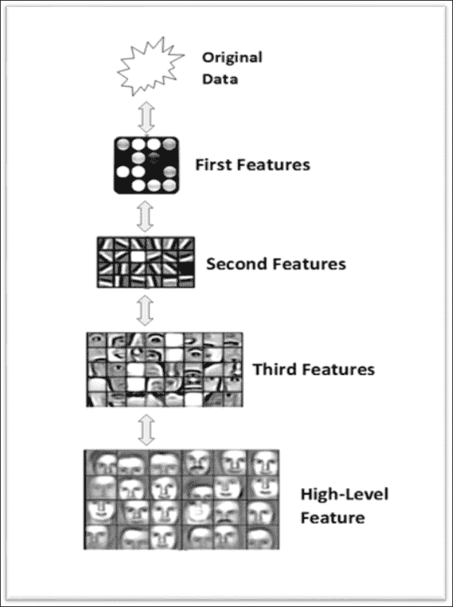

图像分类系统中的分层特征提取

前面的方案描述了图像分类系统（人脸识别器）的特征：每个块逐渐提取输入图像的特征，处理从先前块中已经预处理过的数据，提取输入图像的日益复杂的特征， 从而构建表征基于深度学习的系统的分层数据表示。

层次结构特征的可能表示形式如下：

```py
 pixel --> edge --> texture --> motif --> part --> object

```

但是，在文本识别问题中，可以将层次表示形式构造如下：

```py
character --> word --> word group --> clause --> sentence --> story

```

因此，深度学习架构是*多层架构*，它由简单的单元组成，所有单元都受训练，其中许多单元包含*非线性变换*。 每个单元都对其输入进行转换以改善其*属性，以仅出于分类目的选择和放大*相关方面，以及其*不变性*，即其倾向*忽略无关的*。 方面可忽略不计。

因此，通过多级非线性转换，深度大约在 5 到 20 级之间，深度学习系统可以学习并实现极其复杂和复杂的功能，同时*对最小的相关细节非常敏感*， *，*和*对输入数据无关方面的大变化非常不敏感，在对象识别的情况下，这些变化可能是：图像的背景，亮度或所表示对象的位置 。*

以下部分将借助 TensorFlow 说明两种重要的深度神经网络类型：**卷积神经网络** *（* CNN *）*，主要针对 分类问题，然后针对**自然语言处理**（**NLP**）问题的**递归神经网络**（**RNNs**）问题。

## 卷积神经网络

**卷积神经网络**（**CNN**）是面向神经网络的一种特殊类型的深度学习，在许多实际应用中都取得了优异的成绩，尤其是*对象识别* 在图像中。

实际上，CNN 被设计为处理以多个阵列形式表示的数据，例如*彩色图像*，可通过包含像素颜色强度的三个二维阵列表示。 CNN 与普通神经网络之间的实质区别在于，前者*在图像上直接操作*，而后者在*特征上从图像中提取*。 因此，与普通神经网络不同，CNN 的输入将是*二维*，特征将是输入图像的像素。

CNN 是几乎所有识别问题的主要方法。 这种类型的网络所提供的出色性能实际上已经促使诸如 Google 和 Facebook 之类的最大的技术公司投资于此类网络的研发项目，并开发和分发基于 CNN 的产品图像识别。

### CNN 架构

CNN 使用三个基本概念：*局部感受野*，*卷积*和*合并*。

在卷积网络中，我们认为输入类似于下图所示：

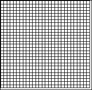

输入神经元

CNN 背后的概念之一是*本地连接*。 实际上，CNN 利用输入数据中可能存在的空间相关性。 第一后续层的每个神经元仅连接*某些输入神经元。 该区域称为**局部感受野**。 在下图中，用*会聚*到隐藏的神经元的黑色 5x5 正方形表示：*


从输入到隐藏的神经元

*隐藏的神经元* *，*当然只会处理其接受区域内的输入数据，而不会实现其外部的变化。 但是，很容易看到，根据深度的基本原理，通过叠加多层本地连接的层，升级后，与输入相比，您将拥有处理越来越多的*全局数据*的单元 学习，以使性能达到不断增长的抽象水平。

### 注意

本地连接的原因在于以下事实：在数组形式的数据（例如图像）中，值通常高度相关，从而形成了易于识别的不同数据组。

每个连接都学习一个权重（因此它将得到 5x5 = 25），而不是隐藏的神经元及其关联的连接会学习一个总偏差，然后我们将通过不时执行移位来将区域连接到单个神经元，如下 在以下图中：

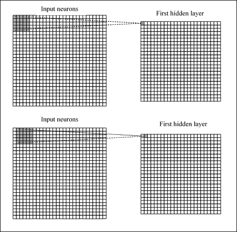

卷积运算

该操作称为**卷积** *。* 这样做，如果我们有一个 28x28 输入和 5x5 区域的图像，我们将在隐藏层中获得 24x24 神经元。 我们说过，每个神经元都有一个偏差和与该区域相关的 5x5 权重：我们将对所有 24x24 神经元使用这些权重和偏差。 这意味着第一隐藏层中的所有神经元将识别相同的特征，只是在输入图像中放置的位置不同。 因此，从输入层到隐藏特征图的连接图称为*共享权重*，偏差称为*共享偏差* *和*，因为它们位于 事实共享。

显然，我们需要识别的不仅仅是一个特征图，因此，一个完整的卷积层是由*多个特征图*组成的。

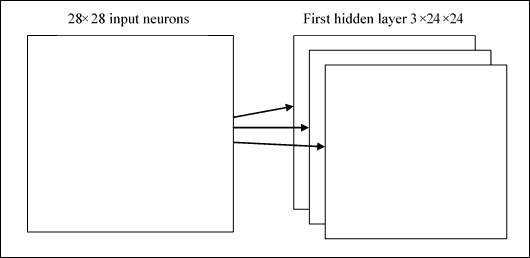

多个功能图

在上图中，我们看到了三个特征图。 当然，实际上它的数量会增加，甚至可以使用具有 20 或 40 个特征图的卷积层。 权重和偏差共享的一个巨大优势是卷积网络中涉及的参数的*显着降低*。 考虑我们的示例，对于每个特征图，我们需要 25 个权重（5x5）和一个偏差（共享）。 总共有 26 个参数。 假设我们有 20 个特征图，我们将定义 520 个参数。 在具有 784 个输入神经元和例如 30 个隐藏层神经元的完全连接的网络中，我们需要 30 个以上的 784x30 偏差权重，以达到总共 23.550 个参数。

差异是显而易见的。 卷积网络还使用*池化层*，它们是紧接在卷积层之后的层。 这些简化了前一层的输出信息（*卷积*）。 它获取从卷积层出来的输入特征图，并准备一个*压缩的*特征图。 例如，我们可以说池化层可以以其所有单位汇总在上一层神经元的 2x2 区域中。

该技术称为池化，可以用以下方案概括：

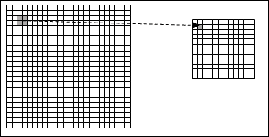

池化操作有助于简化从一层到下一层的信息

显然，我们通常有更多的功能图，并且我们将最大池分别应用于每个功能图。

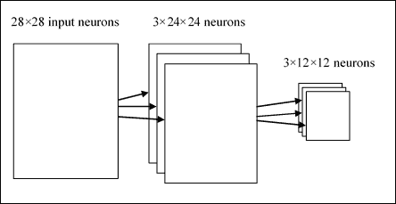

从输入层到第二个隐藏层

因此，我们假设第一个隐藏层具有三个尺寸为 24x24 的特征图，第二个隐藏层的尺寸将为 12x12，因为我们假设每个单元汇总一个 2x2 区域。

结合这三个思想，我们形成了一个完整的卷积网络。 其架构可以显示如下：

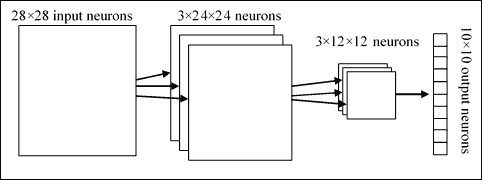

CNN 架构架构

让我们总结一下：有 28x28 个输入神经元，后跟一个*卷积层*，具有局部接收场 5x5 和 3 个特征图。 作为*的结果，我们获得了 3x24x24 神经元的隐藏层*。 然后在特征图的 3 个区域上将最大池应用于 2x2，从而获得 3x12x12 的隐藏层。 最后一层是*完全连接的*：它将最大池化层的所有神经元连接到所有 10 个输出神经元，有助于识别相应的输出。

然后将通过梯度下降和反向传播算法训练该网络。

### CNN 的 TensorFlow 实现

在以下示例中，我们将看到 CNN 在图像分类问题中的作用。 我们想展示构建 CNN 网络的过程：要执行哪些步骤以及需要执行哪些推理才能对整个网络进行适当的尺寸标注，当然还要如何使用 TensorFlow 进行实现。

#### 初始化步骤

1.  加载并准备 MNIST 数据：

    ```py
    import tensorflow as tf
    import input_data
    mnist = input_data.read_data_sets("/tmp/data/", one_hot=True)

    ```

2.  定义所有 CNN 参数：

    ```py
    learning_rate = 0.001
    training_iters = 100000
    batch_size = 128
    display_step = 10

    ```

3.  MNIST 数据输入（每个形状为 28x28 阵列像素）：

    ```py
    n_input = 784

    ```

4.  MNIST 的总分类（0-9 位）

    ```py
    n_classes = 10

    ```

5.  为了减少过度拟合，我们应用了*脱落*技术。 该术语是指在神经网络中删除单元（隐藏，输入和输出）。 确定要消除的神经元是随机的； 一种方法是应用概率，正如我们将在代码中看到的那样。 因此，我们定义以下参数（待调整）：

    ```py
    dropout = 0.75 

    ```

6.  定义输入图的占位符。 `x`占位符包含 MNIST 数据输入（恰好 728 像素）：

    ```py
    x = tf.placeholder(tf.float32, [None, n_input])

    ```

7.  然后，我们使用 TensorFlow `reshape`运算符将 4D 输入图像的形式更改为张量：

```py
_X = tf.reshape(x, shape=[-1, 28, 28, 1])

```

第二和第三个尺寸对应于图像的宽度和高度，而第二个尺寸是色彩通道的总数（在我们的情况下为 1）。

因此，我们可以将输入图像显示为尺寸为 28x28 的二维张量：

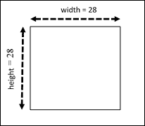

我们问题的输入张量

输出张量将包含每个数字的*输出概率*，以进行分类：

```py
y = tf.placeholder(tf.float32, [None, n_classes]).

```

#### 第一卷积层

隐藏层的每个神经元都连接到尺寸为 5x5 的输入张量的一小部分。 这意味着隐藏层的大小为 24x24。 我们还定义和初始化共享权重和共享偏差的张量：

```py
wc1 = tf.Variable(tf.random_normal([5, 5, 1, 32])) 
bc1 = tf.Variable(tf.random_normal([32]))

```

回想一下，要识别图像，我们需要的不仅仅是功能图。 该数量仅是我们正在考虑的第一层要素地图的数量。 在我们的例子中，卷积层由 32 个特征图组成。

下一步是*第一卷积层*和`conv1`的构造：

```py
conv1 = conv2d(_X,wc1,bc1)

```

在此，`conv2d`是以下功能：

```py
def conv2d(img, w, b):
  return tf.nn.relu(tf.nn.bias_add\
                    (tf.nn.conv2d(img, w,\
                                   strides=[1, 1, 1, 1],\
                                    padding='SAME'),b))

```

为此，我们使用了 TensorFlow `tf.nn.conv2d`函数。 它根据*输入张量*和*共享权重*计算 2D 卷积。 然后，该操作的结果将被添加到偏置`bc1`矩阵。 为此，我们使用函数`tf.nn.conv2d`从输入张量和共享权重的张量计算出二维卷积。 然后，该操作的结果将添加到偏置`bc1`矩阵中。 `tf.nn.relu`是 *Relu 函数*（整流线性单位），它是深层神经网络隐藏层中的*通常激活函数*。

我们将这个激活函数应用于卷积函数的返回值。 填充值为`'SAME'`，它指示*输出张量输出将具有与输入张量*相同的大小。

表示卷积层的一种方法为`conv1`，如下所示：

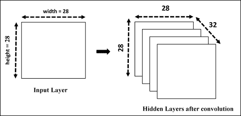

第一隐藏层

卷积操作之后，我们强加了*合并*步骤，该步骤简化了先前创建的卷积层的输出信息。

在我们的示例中，让我们采用卷积层的 2x2 区域，然后我们将汇总池层中每个点的信息。

```py
conv1 = max_pool(conv1, k=2)

```

在此，对于池操作，我们实现了以下功能：

```py
def max_pool(img, k):
    return tf.nn.max_pool(img, \
                          ksize=[1, k, k, 1],\
                          strides=[1, k, k, 1],\
                          padding='SAME')

```

`tf.nn.max_pool`函数对输入执行最大池化。 当然，我们将最大池化应用于每个卷积层，并且将有很多层池化和卷积。 在合并阶段结束时，我们将具有 12x12x32 *卷积隐藏层*。

下图显示了池化和卷积操作后的 CNN 层：

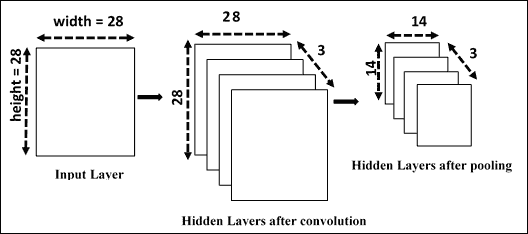

第一次卷积和合并操作后的 CNN

最后的操作是通过在卷积层上应用`tf.nn.dropout` TensorFlow 运算符来减少过度拟合。 为此，我们为占位符（`keep_prob`）在删除期间保留神经元输出的概率创建一个占位符：

```py
keep_prob = tf. placeholder(tf.float32)
conv1 = tf.nn.dropout(conv1,keep_prob)

```

#### 第二卷积层

对于*第二隐藏层*，我们必须应用与第一层相同的操作，因此我们定义并初始化*共享权重*和*共享偏差*的张量：

```py
wc2 = tf.Variable(tf.random_normal([5, 5, 32, 64]))
bc2 = tf.Variable(tf.random_normal([64]))

```

如您所注意到的，第二个隐藏层将具有 5x5 窗口的 64 个要素，而输入层的数量将从第一个卷积获得的层中给出。 接下来，我们将第二层应用于卷积`conv1`张量，但是这次我们将 64 组 5x5 滤镜分别应用于 32 个`conv1`层：

```py
conv2 = conv2d(conv1,wc2,bc2)

```

它为我们提供了 64 个 14x14 数组，通过最大池化将其减少到 64 个 7x7 数组：

```py
conv2 = max_pool(conv2, k=2)

```

最后，我们再次使用 dropout 操作：

```py
conv2 = tf.nn.dropout(conv2, keep_prob)

```

生成的层是 7x7 x 64 卷积张量，因为我们从输入张量 12x12 和 5x5 的滑动窗口开始，考虑到步幅为 1。

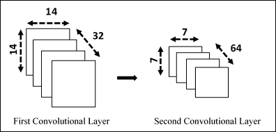

建立第二个隐藏层

#### 密集连接层

在此步骤中，我们将建立一个紧密连接的层，用于处理整个图像。 权重和偏差张量如下：

```py
wd1 = tf.Variable(tf.random_normal([7*7*64, 1024]))
bd1 = tf.Variable(tf.random_normal([1024]))

```

如您所注意到的，该层将由`1024`神经元形成。

然后我们将来自第二个卷积层的张量整形为一批向量：

```py
dense1 = tf.reshape(conv2, [-1, wd1.get_shape().as_list()[0]]) 

```

将该张量乘以权重矩阵`wd1`，将张量偏差`bd1`相加，然后执行 RELU 操作：

```py
dense1 = tf.nn.relu(tf.add(tf.matmul(dense1, wd1),bd1)) 

```

我们再次使用 dropout 运算符完成这一层：

```py
dense1 = tf.nn.dropout(dense1, keep_prob) 

```

#### 读出层

最后一层定义张量`wout`和`bout`：

```py
wout = tf.Variable(tf.random_normal([1024, n_classes]))
bout = tf.Variable(tf.random_normal([n_classes]))

```

在应用`softmax`函数之前，我们必须计算*证据*该图像属于某个类别：

```py
pred = tf.add(tf.matmul(dense1, wout), bout)

```

#### 测试和训练模型

必须将证据转换为 10 种可能类别中每一种的概率（该方法与我们在第 4 章和*神经网络介绍*中看到的方法相同）。 因此，我们定义了成本函数，该函数通过应用`softmax`函数来评估模型的质量：

```py
cost = tf.reduce_mean(tf.nn.softmax_cross_entropy_with_logits(pred, y))

```

使用 TensorFlow `AdamOptimizer`函数对其功能进行优化：

```py
optimizer = tf.train.AdamOptimizer(learning_rate=learning_rate).minimize(cost)

```

以下张量将在模型的评估阶段使用：

```py
correct_pred = tf.equal(tf.argmax(pred,1), tf.argmax(y,1))
accuracy = tf.reduce_mean(tf.cast(correct_pred, tf.float32))

```

#### 启动会议

初始化变量：

```py
init = tf.initialize_all_variables()

```

建立评估图：

```py
with tf.Session() as sess:
    sess.run(init)
    step = 1

```

让我们训练网络直到`training_iters`：

```py
 while step * batch_size < training_iters:
        batch_xs, batch_ys = mnist.train.next_batch(batch_size)       

```

使用`batch`数据进行健身训练：

```py
 sess.run(optimizer, feed_dict={x: batch_xs,\
                                    y: batch_ys,\
                                    keep_prob:  dropout})
        if step % display_step == 0:

```

计算`accuracy`：

```py
 acc = sess.run(accuracy, feed_dict={x: batch_xs,\
                                         y: batch_ys,\
                                         keep_prob: 1.})

```

计算`loss`：

```py
 loss = sess.run(cost, feed_dict={x: batch_xs,\
                                           y: batch_ys,\
                                          keep_prob: 1.})
            print "Iter " + str(step*batch_size) +\
                  ", Minibatch Loss= " + \
                  "{:.6f}".format(loss) + \
                  ", Training Accuracy= " + \
                  "{:.5f}".format(acc)
        step += 1
    print "Optimization Finished!"

```

我们打印`256` MNIST 测试图像的准确性：

```py
print "Testing Accuracy:",\
           sess.run(accuracy,\
                feed_dict={x: mnist.test.images[:256], \
                           y: mnist.test.labels[:256],\
                              keep_prob: 1.})

```

运行代码，我们得到以下输出：

```py
Extracting /tmp/data/train-images-idx3-ubyte.gz 
Extracting /tmp/data/train-labels-idx1-ubyte.gz 
Extracting /tmp/data/t10k-images-idx3-ubyte.gz 
Extracting /tmp/data/t10k-labels-idx1-ubyte.gz 
Iter 1280, Minibatch Loss= 27900.769531, 
Training Accuracy= 0.17188 
Iter 2560, Minibatch Loss= 17168.949219, Training Accuracy= 0.21094 
Iter 3840, Minibatch Loss= 15000.724609, Training Accuracy= 0.41406 
Iter 5120, Minibatch Loss= 8000.896484, Training Accuracy= 0.49219 
Iter 6400, Minibatch Loss= 4587.275391, Training Accuracy= 0.61719 
Iter 7680, Minibatch Loss= 5949.988281, Training Accuracy= 0.69531 
Iter 8960, Minibatch Loss= 4932.690430, Training Accuracy= 0.70312 
Iter 10240, Minibatch Loss= 5066.223633, Training Accuracy= 0.70312 . . . . . . . . . . . . . . . . . . . . 
. . . . . . . . . . . . . . . . . . . . 
Iter 81920, Minibatch Loss= 442.895020, Training Accuracy= 0.93750 
Iter 83200, Minibatch Loss= 273.936676, Training Accuracy= 0.93750 
Iter 84480, Minibatch Loss= 1169.810303, Training Accuracy= 0.89062 
Iter 85760, Minibatch Loss= 737.561157, Training Accuracy= 0.90625 
Iter 87040, Minibatch Loss= 583.576965, Training Accuracy= 0.89844 
Iter 88320, Minibatch Loss= 375.274475, Training Accuracy= 0.93750 
Iter 89600, Minibatch Loss= 183.815613, Training Accuracy= 0.94531 
Iter 90880, Minibatch Loss= 410.157867, Training Accuracy= 0.89844 
Iter 92160, Minibatch Loss= 895.187683, Training Accuracy= 0.84375 
Iter 93440, Minibatch Loss= 819.893555, Training Accuracy= 0.89062 
Iter 94720, Minibatch Loss= 460.179779, Training Accuracy= 0.90625 
Iter 96000, Minibatch Loss= 514.344482, Training Accuracy= 0.87500 
Iter 97280, Minibatch Loss= 507.836975, Training Accuracy= 0.89844 
Iter 98560, Minibatch Loss= 353.565735, Training Accuracy= 0.92188 
Iter 99840, Minibatch Loss= 195.138626, Training Accuracy= 0.93750 
Optimization Finished! 
Testing Accuracy: 0.921875

```

它提供约 99.2％的精度。 显然，它不代表最新技术，因为该示例的目的只是看如何构建 CNN。 该模型可以进一步完善以提供更好的结果。

#### 源代码

```py
# Import MINST data
import input_data
    mnist = input_data.read_data_sets("/tmp/data/",one_hot=True)
import tensorflow as tf
# Parameters
learning_rate = 0.001
training_iters = 100000
batch_size = 128
display_step = 10
# Network Parameters
n_input = 784 # MNIST data input (img shape: 28*28)
n_classes = 10 # MNIST total classes (0-9 digits)
dropout = 0.75 # Dropout, probability to keep units
# tf Graph input
x = tf.placeholder(tf.float32, [None, n_input])
y = tf.placeholder(tf.float32, [None, n_classes])
#dropout (keep probability)
keep_prob = tf.placeholder(tf.float32) 
# Create model
def conv2d(img, w, b):
    return tf.nn.relu(tf.nn.bias_add\
                      (tf.nn.conv2d(img, w,\
                                    strides=[1, 1, 1, 1],\
                                    padding='SAME'),b))
def max_pool(img, k):
    return tf.nn.max_pool(img, \
                          ksize=[1, k, k, 1],\
                          strides=[1, k, k, 1],\
                          padding='SAME')
# Store layers weight & bias
# 5x5 conv, 1 input, 32 outputs
wc1 = tf.Variable(tf.random_normal([5, 5, 1, 32])) 
bc1 = tf.Variable(tf.random_normal([32]))
# 5x5 conv, 32 inputs, 64 outputs
wc2 = tf.Variable(tf.random_normal([5, 5, 32, 64]))
bc2 = tf.Variable(tf.random_normal([64]))
# fully connected, 7*7*64 inputs, 1024 outputs 
wd1 = tf.Variable(tf.random_normal([7*7*64, 1024]))
# 1024 inputs, 10 outputs (class prediction) 
wout = tf.Variable(tf.random_normal([1024, n_classes])) 
bd1 = tf.Variable(tf.random_normal([1024]))
bout = tf.Variable(tf.random_normal([n_classes]))
# Construct model
_X = tf.reshape(x, shape=[-1, 28, 28, 1])
# Convolution Layer
conv1 = conv2d(_X,wc1,bc1)
# Max Pooling (down-sampling)
conv1 = max_pool(conv1, k=2)
# Apply Dropout
conv1 = tf.nn.dropout(conv1,keep_prob)
# Convolution Layer
conv2 = conv2d(conv1,wc2,bc2)
# Max Pooling (down-sampling)
conv2 = max_pool(conv2, k=2)
# Apply Dropout
conv2 = tf.nn.dropout(conv2, keep_prob)
# Fully connected layer
# Reshape conv2 output to fit dense layer input
dense1 = tf.reshape(conv2, [-1, wd1.get_shape().as_list()[0]]) 
# Relu activation
dense1 = tf.nn.relu(tf.add(tf.matmul(dense1, wd1),bd1)) 
# Apply Dropout
dense1 = tf.nn.dropout(dense1, keep_prob) 
# Output, class prediction
pred = tf.add(tf.matmul(dense1, wout), bout)
# Define loss and optimizer
cost = tf.reduce_mean\
(tf.nn.softmax_cross_entropy_with_logits(pred, y))
optimizer =\
      tf.train.AdamOptimizer\
(learning_rate=learning_rate).minimize(cost)
# Evaluate model
correct_pred = tf.equal(tf.argmax(pred,1), tf.argmax(y,1))
accuracy = tf.reduce_mean(tf.cast(correct_pred, tf.float32))
# Initializing the variables
init = tf.initialize_all_variables()
# Launch the graph
with tf.Session() as sess:
    sess.run(init)
    step = 1
    # Keep training until reach max iterations
    while step * batch_size < training_iters:
        batch_xs, batch_ys = mnist.train.next_batch(batch_size)
        # Fit training using batch data
        sess.run(optimizer, feed_dict={x: batch_xs,\
                                       y: batch_ys,\
                                       keep_prob: dropout})
        if step % display_step == 0:
            # Calculate batch accuracy
            acc = sess.run(accuracy, feed_dict={x: batch_xs,\
                                                y: batch_ys,\
                                                keep_prob: 1.})
            # Calculate batch loss
            loss = sess.run(cost, feed_dict={x: batch_xs,\
                                             y: batch_ys,\
                                             keep_prob: 1.})
            print "Iter " + str(step*batch_size) +\
                  ", Minibatch Loss= " + \
                  "{:.6f}".format(loss) + \
                  ", Training Accuracy= " + \
                  "{:.5f}".format(acc)
        step += 1
    print "Optimization Finished!"
    # Calculate accuracy for 256 mnist test images
    print "Testing Accuracy:",\
          sess.run(accuracy,\
                   feed_dict={x: mnist.test.images[:256], \
                              y: mnist.test.labels[:256],\
                              keep_prob: 1.})

```

## 递归神经网络

另一个面向深度学习的架构是所谓的**递归神经网络**（**RNN**）的架构。 RNN 的基本思想是在输入中使用*顺序信息*类型。 在神经网络中，我们通常假设每个输入和输出都独立于所有其他输入和输出。 但是，对于许多类型的问题，此假设并不肯定。 例如，如果您想预测一个短语的下一个单词，那么知道短语之前的单词肯定很重要。 这些神经网络称为*递归*，因为它们对输入序列的所有元素执行相同的计算，并且除当前输入外，每个元素的输出还取决于所有先前的计算。

### RNN 架构

RNN 一次处理一个顺序输入项，维护一种*更新状态向量*，该向量包含有关*序列*的所有过去元素的信息。 通常，RNN 具有以下类型的形状：

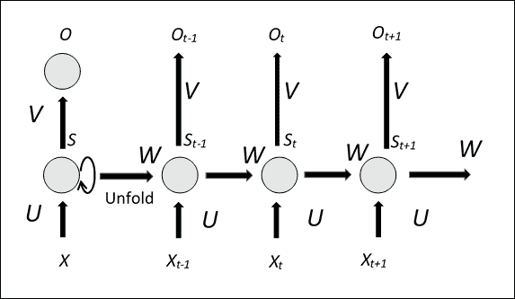

RNN 架构架构

上图显示了 RNN 的方面，其*展开为*版本，解释了在每个时间点的整个输入序列的网络结构。 很明显，与典型的多级神经网络不同，在*每个级别*中*使用多个*参数，RNN 始终使用*相同的参数*命名为 *U* ， *V* 和 *W* （请参见上图）。 此外，RNN 在输入中的相同序列的多个*上的每个*时刻，在*处执行相同的计算。 共享相同的参数，可以大大减少网络在训练阶段必须学习的参数数量，从而也可以缩短训练时间。*

显然，您也可以训练这种类型的网络，因为参数是在每个时间共享的*，所以为每个输出计算的梯度不仅取决于当前计算，还取决于 以前的。 例如，为了计算时间 *t = 4* 时的梯度，有必要使*向后传播*之前三个时间点的梯度，然后求和所得的梯度。 同样，*整个输入序列*通常被认为是训练集的*单元素*。*

但是，这种类型的网络的训练会遇到所谓的*消失/爆炸*梯度问题； 计算得出的梯度和向后传播的梯度在每个时间点倾向于使*增大*或*减小*，然后在一定时间间隔后，*趋于无穷大* ]或*收敛为零*。

现在让我们检查 RNN 的工作方式。 X <sub xmlns:epub="http://www.idpf.org/2007/ops" xmlns:m="http://www.w3.org/1998/Math/MathML" xmlns:pls="http://www.w3.org/2005/01/pronunciation-lexicon" xmlns:ssml="http://www.w3.org/2001/10/synthesis" xmlns:svg="http://www.w3.org/2000/svg">t</sub> ； 是瞬间 *t* 上的网络输入，例如可以是代表句子的*单词而 S <sub xmlns:epub="http://www.idpf.org/2007/ops" xmlns:m="http://www.w3.org/1998/Math/MathML" xmlns:pls="http://www.w3.org/2005/01/pronunciation-lexicon" xmlns:ssml="http://www.w3.org/2001/10/synthesis" xmlns:svg="http://www.w3.org/2000/svg">t</sub> 的向量。 是网络的*状态向量*。 可以认为是系统的一种*存储器*，其中包含有关输入序列的所有先前元素的信息。 从*电流输入*（时间 *t* ）开始评估 *t* 时刻的状态向量，并从*评估*状态*。 通过 *U* 和 *W* 参数的先前时刻*（时间 *t-1* ）：*

S <sub>t</sub> = f（[U] X <sub>t</sub> + [W] S <sub>t-1</sub> ）

函数 *f* 是*非线性函数*，例如整流线性单位（ReLu），而 O <sub>t</sub> ； 是使用参数 *V* 计算的 *t* 时刻的输出。

输出将取决于网络所使用的问题的类型。 例如，如果您要预测句子的下一个单词，则它可能是系统词汇表中每个单词的*概率向量*。

### LSTM 网络

**长期共享内存**（**LSTM**）网络是 RNN 体系结构基本模型的扩展。 主要思想是改进网络，为其提供显式内存。 实际上，尽管 LSTM 网络与 RNN 并没有本质上的不同，但它们配备了特殊的隐藏单元，称为存储单元，其行为是长时间记住以前的输入。

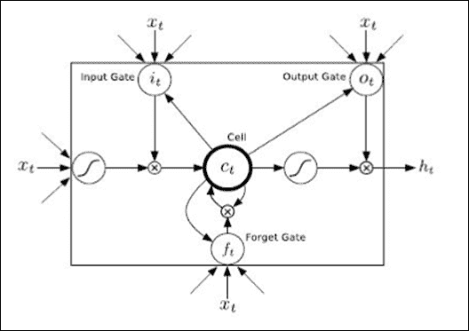

LSTM）单位

LSTM 单元具有三个门和四个输入权重， *xt* （从数据到输入和三个门），而 *ht* 是单元的输出。

LSTM 块包含确定输入是否足够重要以进行保存的门。 该块由四个单元组成：

*   **输入门**：允许在结构中输入值
*   **忘记门**：删除结构中包含的值
*   **输出门**：确定设备何时输出陷在结构中的值
*   **单元**：启用或禁用存储单元

在下一个示例中，我们将在语言处理问题中看到 LSTM 网络的 TensorFlow 实现。

### 使用 TensorFlow 的 NLP

RNN 已被证明在诸如预测文本中的下一个字符或类似地预测句子中的下一个顺序词等问题上具有出色的性能。 但是，它们也用于更复杂的问题，例如**机器翻译**。 在这种情况下，网络将输入源语言中的单词序列，而您想要输出语言*目标*中的相应单词序列。 最后，RNN 被广泛使用的另一个非常重要的应用是*语音* *识别*。 在下文中，我们将开发一个计算模型，该模型可以根据前一个单词的顺序来预测文本中的下一个单词。 为了测量模型的*精度*，我们将使用 **Penn 树库**（**PTB**）数据集，该数据集是衡量这些模型精度的基准 。

本示例引用您在 TensorFlow 发行版的`/rnn/ptb`目录中找到的文件。 它包含以下两个文件：

*   `ptb_word_lm.py`：在 PTB 数据集上训练语言模型的队列
*   `reader.py`：读取数据集的代码

与前面的示例不同，我们将仅介绍所实现过程的伪代码，以便理解模型构建背后的主要思想，而不会陷入不必要的实现细节中。 源代码很长，一行一行地解释代码太麻烦了。

### 注意

有关其他参考，请参见[这里](https://www.tensorflow.org/versions/r0.8/tutorials/recurrent/index.html)。

#### 下载资料

您可以从[网页](http://www.fit.vutbr.cz/~imikolov/rnnlm/simple-examples.tgz)下载数据，然后提取数据文件夹。 数据集经过预处理，包含 10000 个不同的单词，包括句子结尾标记和稀有单词的特殊符号（`<unk>`）。 我们将`reader.py`中的所有参数都转换为唯一的整数标识符，以使神经网络更易于处理。

要使用 tar 解压缩`.tgz`文件，您需要使用以下命令：

```py
  tar -xvzf /path/to/yourfile.tgz

```

## 建立模型

该模型使用 LSTM 实现 RNN 的体系结构。 实际上，它计划通过包括存储单元来增加 RNN 的体系结构，该存储单元允许保存有关长期时间依赖性的信息。

TensorFlow 库允许您通过以下命令创建 LSTM：

```py
lstm = rnn_cell.BasicLSTMCell(size)

```

这里`size`应该是 LSTM 要使用的单位数。 LSTM 内存初始化为零：

```py
state = tf.zeros([batch_size, lstm.state_size])

```

在计算过程中，用输出值更新要检查状态值的每个单词之后，以下是实现的步骤的伪代码列表：

```py
loss = 0.0
for current_batch_of_words in words_in_dataset:
       output, state = lstm(current_batch_of_words, state)

```

然后，`output`用于对下一个单词的预测进行预测：

```py
 logits = tf.matmul(output, softmax_w) + softmax_b
       probabilities = tf.nn.softmax(logits)
       loss += loss_function(probabilities, target_words)

```

`loss`函数将目标单词的平均负对数概率最小化，它是 TensorFow 函数：

```py
tf.nn.seq2seq.sequence_loss_by_example

```

它计算平均每个单词的*困惑度*，它的值衡量模型的准确性（值越小则表示最佳性能），并将在整个训练过程中进行监控。

## 运行代码

实现的模型支持三种类型的配置：`small`，`medium`和`large`。 它们之间的区别在于 LSTM 的大小和用于训练的一组超参数。 模型越大，应获得的结果越好。 `small`模型应该能够在测试集上达到低于 120 的困惑度，而`large`模型则能够达到低于 80 的困惑度，尽管可能需要花费几个小时来训练。

要执行模型，只需键入以下内容：

```py
python ptb_word_lm --data_path=/tmp/simple-examples/data/ --model small

```

在`/tmp/simple-examples/data/`中，您必须已经从 PTB 数据集中下载了数据。

以下列表显示了训练 8 个小时后的跑步情况（对于*小型*配置，为 13 个纪元）：

```py
Epoch: 1 Learning rate: 1.000
0.004 perplexity: 5263.762 speed: 391 wps
0.104 perplexity: 837.607 speed: 429 wps
0.204 perplexity: 617.207 speed: 442 wps
0.304 perplexity: 498.160 speed: 438 wps
0.404 perplexity: 430.516 speed: 436 wps
0.504 perplexity: 386.339 speed: 427 wps
0.604 perplexity: 348.393 speed: 431 wps
0.703 perplexity: 322.351 speed: 432 wps
0.803 perplexity: 301.630 speed: 431 wps
0.903 perplexity: 282.417 speed: 434 wps
Epoch: 1 Train Perplexity: 268.124
Epoch: 1 Valid Perplexity: 180.210
Epoch: 2 Learning rate: 1.000
0.004 perplexity: 209.082 speed: 448 wps
0.104 perplexity: 150.589 speed: 437 wps
0.204 perplexity: 157.965 speed: 436 wps
0.304 perplexity: 152.896 speed: 453 wps
0.404 perplexity: 150.299 speed: 458 wps
0.504 perplexity: 147.984 speed: 462 wps
0.604 perplexity: 143.367 speed: 462 wps
0.703 perplexity: 141.246 speed: 446 wps
0.803 perplexity: 139.299 speed: 436 wps
0.903 perplexity: 135.632 speed: 435 wps
Epoch: 2 Train Perplexity: 133.576
Epoch: 2 Valid Perplexity: 143.072
............................................................
Epoch: 12 Learning rate: 0.008
0.004 perplexity: 57.011 speed: 347 wps
0.104 perplexity: 41.305 speed: 356 wps
0.204 perplexity: 45.136 speed: 356 wps
0.304 perplexity: 43.386 speed: 357 wps
0.404 perplexity: 42.624 speed: 358 wps
0.504 perplexity: 41.980 speed: 358 wps
0.604 perplexity: 40.549 speed: 357 wps
0.703 perplexity: 39.943 speed: 357 wps
0.803 perplexity: 39.287 speed: 358 wps
0.903 perplexity: 37.949 speed: 359 wps
Epoch: 12 Train Perplexity: 37.125
Epoch: 12 Valid Perplexity: 123.571
Epoch: 13 Learning rate: 0.004
0.004 perplexity: 56.576 speed: 365 wps
0.104 perplexity: 40.989 speed: 358 wps
0.204 perplexity: 44.809 speed: 358 wps
0.304 perplexity: 43.082 speed: 356 wps
0.404 perplexity: 42.332 speed: 356 wps
0.504 perplexity: 41.694 speed: 356 wps
0.604 perplexity: 40.275 speed: 357 wps
0.703 perplexity: 39.673 speed: 356 wps
0.803 perplexity: 39.021 speed: 356 wps
0.903 perplexity: 37.690 speed: 356 wps
Epoch: 13 Train Perplexity: 36.869
Epoch: 13 Valid Perplexity: 123.358
Test Perplexity: 117.171

```

如您所见，在每个时期之后，困惑变得更低了。

# 摘要

在本章中，我们概述了深度学习技术，研究了使用中的两种深度学习架构，即 CNN 和 RNN。 通过 TensorFlow 库，我们开发了用于图像分类问题的卷积神经网络架构。 本章的最后一部分专门介绍 RNN，我们在其中描述了 TensorFlow 的 RNN 教程，其中建立了 LSTM 网络以预测英语句子中的下一个单词。

下一章介绍了用于 GPU 计算的 TensorFlow 功能，并介绍了 *TensorFlow 服务*，这是一种用于机器学习模型的高性能，开源服务系统，专为生产环境设计，并针对 [TensorFlow](https://www.tensorflow.org/) 进行了优化。