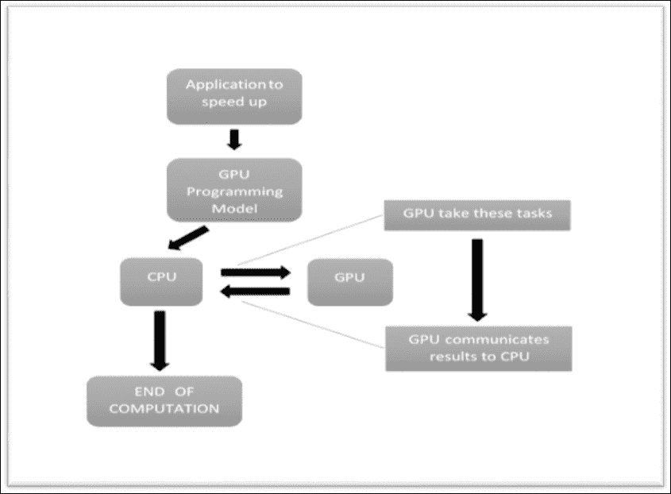

# 第 6 章。使用 TensorFlow 进行 GPU 编程和服务

在本章中，我们将介绍以下主题：

*   GPU 编程
*   TensorFlow 服务：
    *   如何安装 TensorFlow Serving
    *   如何使用 TensorFlow 服务
    *   如何加载和导出 TensorFlow 模型

# GPU 编程

在[第 5 章](../Text/ch05.html "Chapter 5\.  Deep Learning")，*深度学习*中，我们针对 NLP 应用训练了**递归神经网络**（ **RNN** ）， 深度学习应用程序可能需要大量计算。 但是，您可以通过**图形处理单元**（ **GPU** ）使用并行编程技术来减少训练时间。 实际上，现代图形单元的计算资源使它们能够执行并行代码部分，从而确保了高性能。

GPU 编程模型是一种编程策略，包括将 CPU 替换为 GPU 以加速各种应用程序的执行。 该策略的应用范围非常广泛，并且每天都在增长。 目前，GPU 能够减少跨平台（从汽车到手机，从平板电脑到无人机和机器人）的应用程序执行时间。

下图显示了 GPU 编程模型如何工作。 在该应用程序中，有一些调用告诉 CPU 放弃代码 GPU 的特定部分，并使其运行以提高执行速度。 此类特定部分依赖两个 GPU 的原因取决于 GPU 体系结构提供的速度。 GPU 具有许多**流多处理器**（ **SMP** ），每个处理器都具有许多计算核心。 这些内核借助**单指令多线程**（ **SIMT** ）调用能够执行 ALU 和其他操作，从而大大减少了执行时间。



在 GPU 编程模型中，有一些代码在 CPU 中顺序执行，而某些部分则由 GPU 并行执行

TensorFlow 具有可以利用此编程模型的功能（如果您具有 NVIDIA GPU），支持 GPU 的软件包版本需要 Cuda Toolkit 7.0 和 6.5 CUDNN V2。

### 注意

对于 Cuda 环境的安装，我们建议参考 Cuda 安装页面： [http://docs.nvidia.com/cuda/cuda-getting-started-guide-for-linux/#axzz49w1XvzNj](http://docs.nvidia.com/cuda/cuda-getting-started-guide-for-linux/#axzz49w1XvzNj)

TensorFlow 通过以下方式引用这些设备：

*   `/cpu:0`：引用服务器 CPU
*   `/gpu:0`：GPU 服务器（如果只有一个）
*   `/gpu:1`：第二个 GPU 服务器，依此类推

要找出分配给我们的操作的设备，张紧器需要创建会话，并选择将实例化的`log_device_placement`设置为`True`。

考虑以下示例。

我们创建一个计算图； `a`和`b`将是两个矩阵：

```py
a = tf.constant([1.0, 2.0, 3.0, 4.0, 5.0, 6.0], shape=[2, 3], name='a')
b = tf.constant([1.0, 2.0, 3.0, 4.0, 5.0, 6.0], shape=[3, 2], name='b')

```

在`c`中，我们将这两个输入张量的矩阵相乘：

```py
c = tf.matmul(a, b)

```

然后，我们将`log_device_placement`设置为`True`来建立会话：

```py
sess = tf.Session(config=tf.ConfigProto(log_device_placement=True))

```

最后，我们启动会话：

```py
print sess.run(c)

```

您应该看到以下输出：

```py
Device mapping:
/job:localhost/replica:0/task:0/gpu:0 -> device: 0, name: Tesla K40c, pci bus
id: 0000:05:00.0
b: /job:localhost/replica:0/task:0/gpu:0
a: /job:localhost/replica:0/task:0/gpu:0
MatMul: /job:localhost/replica:0/task:0/gpu:0
[[ 22\.  28.]
 [ 49\.  64.]]

```

如果您希望某个特定的操作在您选择的设备上运行而不是自动为您选择的设备，则可以使用`tf.device`创建设备上下文，以便该上下文中的所有操作将具有相同的设备分配。

让我们使用`tf.device`指令创建相同的计算图：

```py
with tf.device('/cpu:0'):
a = tf.constant([1.0, 2.0, 3.0, 4.0, 5.0, 6.0], shape=[2, 3], name='a')
b = tf.constant([1.0, 2.0, 3.0, 4.0, 5.0, 6.0], shape=[3, 2], name='b')
c = tf.matmul(a, b)

```

同样，我们构建会话图并启动它：

```py
sess = tf.Session(config=tf.ConfigProto(log_device_placement=True))
print sess.run(c)

```

您会看到`a`和`b`已分配给`cpu:0`：

```py
Device mapping:
/job:localhost/replica:0/task:0/gpu:0 -> device: 0, name: Tesla K40c, pci bus
id: 0000:05:00.0
b: /job:localhost/replica:0/task:0/cpu:0
a: /job:localhost/replica:0/task:0/cpu:0
MatMul: /job:localhost/replica:0/task:0/gpu:0
[[ 22\.  28.]
 [ 49\.  64.]]

```

如果您拥有多个 GPU，则可以在创建会话时在配置选项中将`allow_soft_placement`设置为`True`来直接选择它。

# TensorFlow 服务

服务是 TensorFlow 软件包，已开发该软件包将机器学习模型带入生产系统。 这意味着开发人员可以使用 TensorFlow Serving 的 API 来构建服务器以服务于已实现的模型。

服务的模型每次都可以根据其客户提供的数据进行推断和预测，从而可以改进模型。

为了与服务系统进行通信，客户端使用 Google 开发的高性能开源**远程过程调用**（ **RPC** ）接口，称为 gRPC。

典型的管道（请参见下图）是将训练数据馈送到学习者，后者输出模型。 经过验证后，即可将其部署到 TensorFlow 服务系统。 随着新数据的可用或模型的改进，随着时间的推移启动和迭代我们的模型非常普遍。


TensorFlow 服务管道

## 如何安装 TensorFlow Serving

要编译和使用 TensorFlow Serving，您需要设置一些先决条件。

### 巴塞尔

TensorFlow Serving 需要 Bazel 0.2.0（ [http://www.bazel.io/](http://www.bazel.io/) ）或更高版本。 下载`bazel-0.2.0-installer-linux-x86_64.sh`。

### 注意

Bazel 是使软件构建和测试自动化的工具。 支持的构建任务包括运行编译器和链接器以生成可执行程序和库，以及组装可部署的程序包。

运行以下命令：

```py
chmod +x bazel-0.2.0-installer-linux-x86_64.sh
./bazel-0.2.0-installer-linux-x86_64.sh -user

```

最后，设置您的环境。 将其导出到您的`~/.bashrc`目录中：

```py
export PATH="$PATH:$HOME/bin"

```

### gRPC

我们的教程使用 gRPC（0.13 或更高版本）作为我们的 RPC 框架。

### 注意

您可以在 [https://github.com/grpc](https://github.com/grpc) 上找到其他参考。

#### TensorFlow 服务依赖关系

要安装 TensorFlow 服务依赖项，请执行以下操作：

```py
sudo apt-get update && sudo apt-get install -y \
        build-essential \
        curl \
        git \
        libfreetype6-dev \
        libpng12-dev \
        libzmq3-dev \
        pkg-config \
        python-dev \
        python-numpy \
        python-pip \
        software-properties-common \
        swig \
        zip \
        zlib1g-dev

```

然后通过运行以下命令来配置 TensorFlow：

```py
cd tensorflow
./configure
cd ..

```

#### 安装服务

使用 Git 克隆存储库：

```py
git clone --recurse-submodules 
https://github.com/tensorflow/serving
cd serving

```

需要`--recurse-submodules`选项来获取 TensorFlow，gRPC 和 TensorFlow 服务所依赖的其他库。 要构建 TensorFlow，您必须使用 Bazel：

```py
bazel build tensorflow_serving/

```

二进制文件将放置在`bazel-bin`目录中，并且可以使用以下命令运行：

```py
/bazel-bin/tensorflow_serving/example/mnist_inference

```

最后，您可以通过执行以下命令来测试安装：

```py
bazel test tensorflow_serving/

```

## 如何使用 TensorFlow 服务

在本教程中，我们将展示*如何导出*训练有素的 TensorFlow 模型，以及*如何构建服务器*为导出的模型提供服务。 实现的模型是用于手写图像分类（MNIST 数据）的 Softmax 回归模型。

该代码将由两部分组成：

*   训练和导出模型的 Python 文件（`mnist_export.py`）
*   一个 C ++文件（`mnist_inference.cc`），该文件加载导出的模型并运行 gRPC 服务为其提供服务

在以下各节中，我们报告使用 TensorFlow Serving 的基本步骤。 对于其他参考，您可以查看 [https://tensorflow.github.io/serving/serving_basic](https://tensorflow.github.io/serving/serving_basic) 。

### 训练和导出 TensorFlow 模型

如您在`mnist_export.py`中看到的，训练的方法与 MNIST 中的方法相同。 对于初学者教程，请参考以下链接：

[https://www.tensorflow.org/versions/r0.9/tutorials/mnist/beginners/index.html](https://www.tensorflow.org/versions/r0.9/tutorials/mnist/beginners/index.html)

TensorFlow 图在 TensorFlow 会话`sess`中启动，输入张量（图像）为`x`，输出张量（Softmax 分数）为`y`。 然后我们使用 TensorFlow 服务导出器导出模型； 它构建了经过训练的模型的快照，以便以后可以加载以进行推断。 现在，让我们看一下用于导出训练后的模型的主要功能。

导入`exporter`以序列化模型：

```py
from tensorflow_serving.session_bundle import exporter

```

然后，您必须使用 TensorFlow 函数`tf.train.Saver`定义`saver`。 它的`sharded` 参数等于`True`：

```py
saver = tf.train.Saver(sharded=True)

```

`saver`用于将图形变量值序列化为模型导出，以便以后可以正确还原它们。

下一步是定义`model_exporter`：

```py
model_exporter = exporter.Exporter(saver)
signature = exporter.classification_signature\
                     (input_tensor=x, scores_tensor=y)
model_exporter.init(sess.graph.as_graph_def(),
                    default_graph_signature=signature)

```

`model_exporter`采用以下两个参数：

*   `sess.graph.as_graph_def()`是该图的原型。 导出会将 protobuf 序列化为模型导出，以便稍后可以正确恢复 TensorFlow 图。
*   `default_graph_signature=signature`指定模型导出签名。 签名指定要导出的模型类型，以及运行推理时绑定到的输入/输出张量。 在这种情况下，您可以使用`exporter.classification_signature`将该模型指定为分类模型。

最后，我们创建`export`：

```py
model_exporter.export(export_path,tf.constant\
                               (FLAGS.export_version), sess)

```

`model_exporter.export`采用以下参数：

*   `export_path`是导出目录的路径。 如果目录不存在，导出将创建该目录。
*   `tf.constant(FLAGS.export_version)`是一个张量，指定模型的版本。 导出同一模型的较新版本时，应指定一个较大的整数值。 每个版本将导出到给定路径下的不同子目录。
*   `sess`是 TensorFlow 会话，其中包含您要导出的经过训练的模型。

### 进行会议

要导出模型，请首先清除导出目录：

```py
$>rm -rf /tmp/mnist_model

```

然后，使用`bazel`构建`mnist_export`示例：

```py
$>bazel build //tensorflow_serving/example:mnist_export

```

最后，您可以运行以下示例：

```py
$>bazel-bin/tensorflow_serving/example/mnist_export /tmp/mnist_model
Training model...
Done training!
Exporting trained model to /tmp/mnist_model
Done exporting!

```

在导出目录中，我们应该有一个子目录，用于导出模型的每个版本：

```py
$>ls /tmp/mnist_model
00000001

```

对应的子目录的默认值为`1`，因为我们先前将`tf.constant(FLAGS.export_version)`指定为模型版本，而`FLAGS.export_version`的默认值为`1`。

子目录的每个版本都包含以下文件：

*   `export.meta`是模型的序列化`tensorflow::MetaGraphDef`。 它包括模型的图形定义，以及模型的元数据，例如签名。
*   `export-?????-of-?????`是保存图形的序列化变量的文件。

```py
$>ls /tmp/mnist_model/00000001
checkpoint export-00000-of-00001 export.meta

```

# 加载和导出 TensorFlow 模型

用于加载导出的 TensorFlow 模型的 C ++代码在`mnist_inference.cc`中的`main()`函数中。 在这里，我们报告摘录； 我们不考虑用于批处理的参数。 如果要调整最大批处理大小，超时阈值或用于批处理推理的后台线程数，可以通过在`BatchingParameters`中设置更多值来进行调整：

```py
int main(int argc, char** argv) 
{
  SessionBundleConfig session_bundle_config;
          . . . Here batching parameters 
  std::unique_ptr<SessionBundleFactory> bundle_factory;
  TF_QCHECK_OK(
      SessionBundleFactory::Create(session_bundle_config,  
                                       &bundle_factory));
      std::unique_ptr<SessionBundle> bundle(new SessionBundle);
      TF_QCHECK_OK(bundle_factory->CreateSessionBundle(bundle_path,
                                                          &bundle));
      ......
      RunServer(FLAGS_port, std::move(bundle));
      return 0;
}

```

`SessionBundle`是 TensorFlow 服务的组件。 让我们考虑包含文件`SessionBundle.h`：

```py
struct SessionBundle {
  std::unique_ptr<tensorflow::Session> session;
  tensorflow::MetaGraphDef meta_graph_def;
};

```

`session`参数是一个 TensorFlow 会话，具有原始图和正确还原了必要变量的图。

`SessionBundleFactory::CreateSessionBundle()`从`bundle_path`加载导出的 TensorFlow 模型，并创建一个`SessionBundle`对象以对该模型进行推理。

`RunServer`启动了一个 gRPC 服务器，该服务器导出单个 Classify（）API。

每个推理请求将按以下步骤处理：

1.  验证输入。 对于每个推理请求，服务器都只需要一个 MNIST 格式的图像。
2.  将输入转换为推断输入张量并创建输出张量占位符。
3.  运行推断。

要运行推理，必须键入以下命令：

```py
$>bazel build //tensorflow_serving/example:mnist_inference
$>bazel-bin/tensorflow_serving/example/mnist_inference --port=9000 /tmp/mnist_model/00000001

```

## 测试服务器

要测试服务器，我们使用`mnist_client.py`（ [https://github.com/tensorflow/serving/blob/master/tensorflow_serving/example/mnist_client.py](https://github.com/tensorflow/serving/blob/master/tensorflow_serving/example/mnist_client.py) ）实用程序。

该客户端下载 MNIST 测试数据，将其作为请求发送到服务器，并计算推断错误率。

要运行它，请键入以下命令：

```py
$>bazel build //tensorflow_serving/example:mnist_client
$>bazel-bin/tensorflow_serving/example/mnist_client --num_tests=1000 
--server=localhost:9000
Inference error rate: 10.5%

```

结果确认服务器成功加载并运行了经过训练的模型。 实际上，对于 1,000 张图像，推理错误率为 10.5％，这为训练后的 Softmax 模型提供了 91％的准确性。

# 摘要

我们在本章中描述了 TensorFlow 的两个重要功能。 首先是使用称为 *GPU 计算*的编程模型的可能性，通过该模型可以加快代码的速度（例如，神经网络的训练阶段）。 本章的第二部分专门描述框架 *TensorFlow Serving* 。 这是一个用于机器学习模型的高性能，开源服务系统，专为生产环境而设计，并针对 TensorFlow 进行了优化。 这个强大的框架可以运行多个模型，这些模型可以根据现实世界的数据随时间变化，从而可以更有效地利用 GPU 资源，并允许开发人员改善自己的机器学习模型。