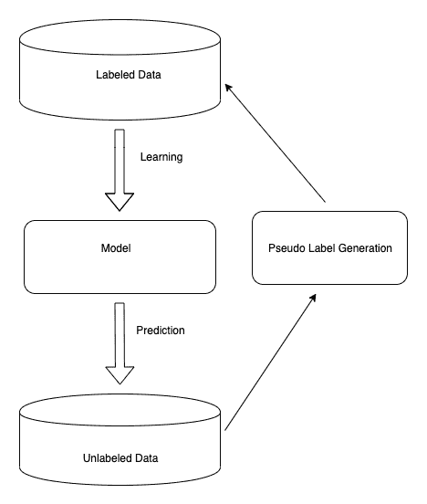

# 六、总结和其他方法

在这本书中，我们了解了用于深度学习的各种形式的架构，以及从手动特征提取到变型贝叶斯框架的各种技术和方法。 一次学习是一个特别活跃的研究领域，因为它专注于根据人类的神经能力更紧密地建立一种机器意识。 过去 5 年中，随着深度学习社区的进步，我们至少可以说，我们正在开发一种可以像人类一样同时学习多个任务的机器。 在这一章中，我们将看到一次学习还有哪些其他选择，并讨论本书中未深入探讨的其他方法。

将涵盖以下主题：

*   最新进展
*   相关领域
*   应用领域

# 最新进展

在深度学习社区中，已经提出了用于一次学习的各种其他方法，例如使用 GAN 的生成建模，图像变形元网络，基于代表的度量学习等。 到目前为止，我们已经看到了使用一次学习进行分类的模型，但是在对象检测和语义分割方面也取得了一些进步。 在本节中，我们将介绍一些主要的基于机器学习的会议的最新论文（例如 CVPR，NeurIPS，ICLR 等）。

基于度量的学习是进行单次学习的较旧方法之一。 尽管该区域较旧，但仍在探索许多方面。 一个很好的例子是关于[《为短时学习重新研究基于局部描述符的图像到类度量》](https://arxiv.org/abs/1903.12290)主题的研究工作。 在本文中，作者提出了一种卷积神经网络架构，称为 **D4N**（**深度最近邻神经网络**），该架构可提取图像级特征。 它与其他神经网络架构的主要区别是用基于局部描述符的图像到类度量替代了最后一层。

[《通过类别遍历查找与几次任务学习相关的任务相关特征》](https://arxiv.org/abs/1905.11116)也为改进度量学习方法做出了贡献，方法是引入一个插件框架。 在本文中，作者讨论了众所周知的度量学习方法（例如连体网络和匹配网络）如何一次只关注一个任务，而不是整个学习所有任务。 **类别遍历模块**（**CTM**）插件组件通过完成所有支持任务来学习重要的尺寸特征。 CTM 在集中器和投影仪单元的帮助下，为相似类别提取通用特征嵌入，并在不同类别中提取唯一特征。 使用 CTM 的输出，我们可以在元学习器之前添加一个强大的先验，这可以使我们更快更好地进行优化。 通过使用此框架，他们显示了基于度量的学习方法的显着改进。

在对象检测和语义分割领域也有一些显着贡献。 让我们讨论其中的两种方法。

# 小样本领域中的对象检测

[《RepMet：用于分类和几次对象检测的基于代表的度量学习》](https://arxiv.org/abs/1806.04728)是一种小样本学习对象检测方法。 在本文中，作者提出了一种用于对象区域提议的特征金字塔网络的变体，并且在其顶部，他们添加了基于度量的分类器，该分类器根据与学习的类代表的距离对建议的区域进行分类。 他们还通过在 ImageNet 数据集上建立了用于少发物体检测任务的基准，为研究界做出了贡献。

同样，[《具有共同注意和共同激励的一次目标检测》](https://arxiv.org/abs/1911.12529)也可以使用传统的视觉方法，在建议的区域基础上进行过滤。 在这项工作中，作者假设将提供目标图像和查询图像。 例如，如果我们要检测笔架，则目标图像将是笔架，而查询图像将是桌子上的笔架。 在这种方法中，我们首先从目标图像中提取有关对象的空间信息，然后从查询图像中提取上下文对象。 上下文和空间信息在确定对象方面起着重要作用。 例如，如果有一张桌子，出现笔架的可能性就会增加。 这类似于人类使用上下文学习的方式。 该模型还通过将输入传递给注意力模型来利用上下文的帮助。

# 小样本领域中的图像分割

研究工作[《CANet：具有迭代细化和专注的小样本学习的类不可知分割网络》](https://arxiv.org/abs/1903.02351)证明了医学影像行业的潜在增长。 在本文中，作者提出了一个用于语义分割的两级框架：**密集比较模块**（**DCM**）和**迭代优化模块**（**IOM**）。 DCM 通过使用通用的 ResNet 架构提取特征，在训练集示例和测试集示例之间进行了密集的特征比较，而 IOM 通过残差块加 CNN 和**粗糙的空间金字塔池**（**ASPP**）模块。

同样， [《PANet：具有原型对齐的几次语义分割》](https://arxiv.org/abs/1908.06391)通过以下方式解决了少数镜头分割问题： 度量学习方法。 本文还提出了一种对齐网络，以更好地利用从支持集中提取的信息。 在 PANet 中，最初，网络从特定嵌入空间内的一些支持图像中学习特定于类别的表示，然后通过将每个像素与学习到的特定于类别的表示进行匹配，对查询/目标图像执行分割。 通过使用这种方法，PANet 可以利用支持集中的重要见解，并在几次分割的情况下提供更可靠的概括。

如我们所见，这些解决方案适用于数据有限的情况。 我们如何量化有限的和足够的？ 我们需要查看我们希望训练的模型架构的能力以及希望解决的问题的复杂性。 类似于一次学习，多年来研究人员提出了其他一些方法，也旨在解决数据有限的问题。 在下一节中，我们将学习机器学习的这些领域，以及它们与单次学习相比的效率。

# 相关领域

众所周知，一次学习是机器学习的一个子领域。 有多种不同的相关解决方案与单次学习方法非常相似，但其解决方案方法略有不同。 这些问题也可以通过使用一次学习算法来解决。 让我们遍历 ML 的每个相关领域，观察它们与一次学习问题的相似之处：

*   半监督学习
*   学习不平衡
*   元学习
*   迁移学习

# 半监督学习

假设我们有 10,000 个数据点，其中只有 20,000 个被标记，而 80,000 个未被标记。 在这种情况下，我们将采用半监督学习。 在半监督学习中，我们使用未标记的数据来总体上进一步了解人口结构。 半监督学习通过伪标签技术来增加训练集。 也就是说，我们使用 20,000 个带标签的数据集训练模型，并在大小相等的测试数据点上使用该模型为它们创建伪标签。 下图说明了半监督学习架构：

获得伪标签后，我们将实标签与伪标签连接起来，将实特征与伪特征连接在一起。 连接后，我们训练了一个新模型，事实证明该模型比初始模型更准确。 我们一直这样做，直到获得最佳精度。

# 学习不平衡

在学习不平衡的情况下，我们有一个不平衡的数据集。 也就是说，我们从一个类别中获得的样本要多于从其他类别中获得的样本。 这也被普遍称为**偏态分布数据集**。让我们看一下处理偏斜数据集的一些流行方法：

*   **度量标准的选择**：度量标准的多种形式可以帮助评估模型的准确率，例如混淆矩阵，精度，召回率和 F1 得分。
*   **算法的选择**：参数算法通过数据集学习其参数，因此，如果数据集存在偏差，则参数模型最有可能也会受到偏差。 对于有偏数据集，非参数方法（例如 k 最近邻）和集合（例如 AdaBoost，XGBoost 等）被证明是最佳方法。
*   **数据采样方法的选择**：也可以考虑进行数据采样以确保数据集不会保持偏斜。

这种方法接近一次学习，因为我们期望创建的机器学习模型应该能够从一些示例中学习分布。

要了解有关度量形式的更多信息，请参阅第 2 章，“基于度量的方法”。

# 元学习

元学习最近在研究界引起了很多关注。 本书中讨论的大多数方法都是元学习型方法，例如与模型无关的元学习和元网络。 元学习是一种在不同任务上训练模型，然后针对特定任务使用通常学到的特征的方法。 它帮助模型在许多任务上学习先验，从而帮助模型在有限的数据下达到优化。 用简单的话来说，元学习是一种训练模型以*元学习*任何目标的方法。

# 迁移学习

迁移学习是指使用从解决一个问题中获得的知识并将其用于解决另一个问题的技术。 以下是迁移学习方法的简化视图：

换句话说，在一个数据集上训练的神经网络模型可以通过对前一个网络进行微调而用于其他数据集，就像我们如何使用在不同域数据集（例如 MNIST 数据集）上训练的连体网络来提取更好的特征，用于签名匹配，手写匹配等。 迁移学习在深度学习领域引起了很多关注，并已被证明对于许多应用非常有用。 但是，由于数据限制，我们无法在制造，医药，化学等非常见领域中使用它。

# 应用领域

从理论上讲，一次学习有多种应用，但直到最近才开始在实际场景中使用。 使用一次学习已取得了最新进展，例如编写 SQL 代码，改进变形的医学图像以及运行签名验证。 还有其他几个领域仍在研究中。 OpenAI，Google，Microsoft 和 Amazon 等公司正在 AI 研究方面投入巨资。 解决一次学习将意味着创建具有人类能力的机械大脑。 这种进步可以通过多种方式挽救生命：可以为罕见病的发现铺平道路，解决全球粮食危机或优化供应链模型。

在本书中，我们探讨了一些一次学习的可能方法。 如果您想探索更多内容，请参阅“进一步阅读”部分。

# 进一步阅读

要进一步了解本章，请参考以下作品：

*   [《元学习实践》](https://www.packtpub.com/big-data-and-business-intelligence/hands-meta-learning-python)
*   [《为小样本学习重新研究基于局部描述符的图像到类度量》](https://arxiv.org/pdf/1903.12290.pdf)
*   [《通过类别遍历查找与几项学习相关的任务相关特征》](https://arxiv.org/pdf/1905.11116.pdf)
*   [《RepMet：基于代表的度量学习，用于分类和几次检测》](https://arxiv.org/abs/1806.04728)
*   [《具有共同注意和共同激励的一次对象检测》](https://arxiv.org/pdf/1911.12529.pdf)
*   [《CANet：具有迭代细化和专心的几次次学习的类不可知分割网络》](https://arxiv.org/pdf/1903.02351.pdf)
*   [《PANet：具有原型对齐的几次图像语义分割》](https://arxiv.org/pdf/1908.06391.pdf)