# 深度学习和卷积神经网络

在开始本章之前，我们需要讨论一下 AI 和**机器学习**（**ML**）以及这两个组件如何组合在一起。 术语“人工”是指不真实或自然的事物，而“智能”是指能够理解，学习或能够解决问题的事物（在极端情况下，具有自我意识）。

正式地，人工智能研究始于 1956 年的达特茅斯会议，其中定义了 AI 及其使命。 在接下来的几年中，每个人都很乐观，因为机器能够解决代数问题和学习英语，并且在 1972 年制造了第一台机器人。但是在 1970 年代，由于过分的承诺但交付不足，出现了所谓的 AI 冬季 人工智能研究有限且资金不足。 此后，尽管 AI 通过专家系统重生，但可以显示人类水平的分析技能。 之后，第二次 AI 冬季机器学习在 1990 年代被认可为一个单独的领域，当时概率理论和统计学开始得到利用。

计算能力的提高和解决特定问题的决心促使 IBM 的 Deep Blue 的发展在 1997 年击败了国际象棋冠军。 迅速发展，时下的 AI 领域涵盖了许多领域，包括机器学习，计算机视觉，自然语言处理，计划调度和优化，推理/专家系统和机器人技术。

在过去的 10 年中，我们目睹了机器学习和一般 AI 的强大功能。 主要感谢深度学习。

在本章中，我们将涵盖以下主题：

*   AI 和 ML 概念的一般说明
*   人工神经网络和深度学习
*   **卷积神经网络**（**CNN**）及其主要构建模块
*   使用 TensorFlow 构建 CNN 模型以识别数字图像
*   Tensorboard 简介

# AI 和 ML

就本书而言，将**人工智能**（**AI**）视为计算机科学领域，负责制造可解决特定问题的代理（软件/机器人）。 在这种情况下，“智能”表示代理是灵活的，并且它通过传感器感知环境，并将采取使自身在某个特定目标成功的机会最大化的措施。

我们希望 AI 最大化名为**期望效用**的东西，或者通过执行动作获得某种满足的概率。 一个简单易懂的例子是上学，您将最大程度地获得工作的期望效用。

人工智能渴望取代在完成繁琐的日常任务中涉及的易于出错的人类智能。 AI 旨在模仿（以及智能代理应该具有）的人类智能的一些主要组成部分是：

*   **自然语言处理**（**NLP**）：能够理解口头或书面人类语言，并能自然回答问题。 NLP 的一些示例任务包括自动旁白，机器翻译或文本摘要。
*   **知识和推理**：开发并维护代理周围世界的最新知识。 遵循人类推理和决策来解决特定问题并对环境的变化做出反应。
*   **规划和解决问题的方法**：对可能采取的措施进行预测，并选择能最大化预期效用的方案，换句话说，为该情况选择最佳措施。
*   **感知**：代理程序所配备的传感器向其提供有关代理程序所处世界的信息。这些传感器可以像红外传感器一样简单，也可以像语音识别麦克风那样复杂。 或相机以实现机器视觉。
*   **学习**：要使代理开发世界知识，它必须使用感知来通过观察来学习。 学习是一种知识获取的方法，可用于推理和制定决策。 AI 的无需处理某些明确编程即可处理从数据中学习算法的子字段，称为机器学习。

ML 使用诸如统计分析，概率模型，决策树和神经网络之类的*工具*来有效地处理大量数据，而不是人类。

例如，让我们考虑以下手势识别问题。 在此示例中，我们希望我们的机器识别正在显示的手势。 系统的输入是手部图像，如下图所示，输出是它们所代表的数字。 解决该问题的系统需要使用视觉形式的感知。

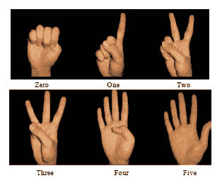

仅将原始图像作为输入输入到我们的机器将不会产生合理的结果。 因此，应对图像进行预处理以提取某种可解释的抽象。 在我们的特定情况下，最简单的方法是根据颜色对手进行分割，然后进行垂直投影，将`x`轴上的非零值相加。 如果图像的宽度为 100 像素，则垂直投影将形成一个向量，该向量长 100 个元素（100 维），并且在展开的手指位置具有最高的值。 我们可以将提取的任何特征向量称为**特征向量**。

假设对于我们的手部数据，我们有 1000 张不同的图像，现在我们已经对其进行处理以提取每个图像的特征向量。 在机器学习阶段，所有特征向量都将被提供给创建模型的机器学习系统。 我们希望该模型能够推广并能够预测未经过系统训练的任何未来图像的数字。

ML 系统的组成部分是评估。 在评估模型时，我们会看到模型在特定任务中的表现。 在我们的示例中，我们将研究它可以多么准确地从图像中预测数字。 90％的准确度意味着正确预测了 100 张给定图像中的 90 张。 在接下来的章节中，我们将更详细地讨论机器训练和评估过程。

# ML 的类型

机器学习问题可以分为三大类，具体取决于我们可以使用哪种数据以及我们想要完成什么：

**监督学习**：我们可以使用输入和所需的输出或标签。 手势分类是一种有监督学习问题的示例，其中为我们提供了手势和相应标签的图像。 我们想要创建一个模型，该模型能够在输入手形图像的情况下输出正确的标签。

监督技术包括 SVM，LDA，神经网络，CNN，K-NN，决策树等。

**无监督学习**：只有输入可用，没有标签，我们不一定知道我们想要模型做什么。 例如，如果我们得到一个包含手的图片但没有标签的大型数据集。 在这种情况下，我们可能知道数据中存在某些结构或关系，但是我们将其留给算法来尝试在我们的数据中找到它们。 我们可能希望我们的算法在数据中找到相似手势的簇，因此我们不必手动标记它们。

无监督学习的另一种用途是找到方法，以减少我们正在使用的数据的维度，这又是通过找到数据中的重要特征并丢弃不重要的特征来实现的。

无监督技术包括 PCA，t-SNE，K-means，自编码器，深度自编码器等。

下图说明了分类和聚类之间的区别（当我们需要在非监督数据上查找结构时）。


**强化学习**：第三种是关于训练代理在环境中执行某些操作的全部。 我们知道理想的结果，但不知道如何实现。 我们没有给数据加标签，而是给代理提供反馈，告诉它完成任务的好坏。 强化学习超出了本书的范围。

# 新旧机器学习

ML 工程师可能会遵循的典型流程来开发预测模型，如下所示：

1.  收集资料
2.  从数据中提取相关特征
3.  选择 ML 体系结构（CNN，ANN，SVM，决策树等）
4.  训练模型
5.  评估模型并重复步骤 3 至 5，直到找到满意的解决方案
6.  在现场测试模型

如前一节所述，机器学习的思想是拥有足够灵活的算法来学习数据背后的基础过程。 可以这么说，许多经典的 ML 方法不够强大，无法直接从数据中学习。 他们需要在使用这些算法之前以某种方式准备数据。

我们之前曾简要提到过，但是准备数据的过程通常称为特征提取，其中一些专家会过滤掉我们认为与其基础过程有关的所有数据细节。 此过程使所选分类器的分类问题更加容易，因为它不必处理数据中不相关的变量，否则这些变量可能会显得很重要。

ML 的新型深度学习方法具有的最酷的功能是，它们不需要（或需要更少）特征提取阶段。 相反，使用足够大的数据集，模型本身就能够直接从数据本身中学习代表数据的最佳特征！ 这些新方法的示例如下：

*   深度 CNN
*   深度自编码器
*   **生成对抗网络**（**GAN**）

所有这些方法都是深度学习过程的一部分，在该过程中，大量数据暴露于多层神经网络。 但是，这些新方法的好处是有代价的。 所有这些新算法都需要更多的计算资源（CPU 和 GPU），并且比传统方法需要更长的训练时间。

# 人工神经网络

**人工神经网络**（**ANN**）受存在于我们大脑中的神经元生物网络的启发非常模糊，它由一组名为**人工神经元**的单元组成， 分为以下三种类型的层：

*   输入层
*   隐藏层
*   输出层

基本的人工神经元通过计算输入及其内部*权重*之间的点积来工作（参见下图），然后将结果传递给非线性激活函数`f`（S 型） ，在此示例中）。 然后将这些人工神经元连接在一起以形成网络。 在训练该网络期间，目标是找到合适的权重集，这些权重将有助于我们希望网络执行的任何任务：

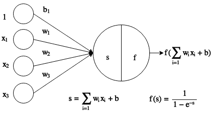

接下来，我们有一个 2 层前馈人工神经网络的示例。 想象一下，神经元之间的联系就是训练过程中将学习的权重。 在此示例中，层`L1`将是输入层，`L2`隐藏层，而`L3`将是输出层。 按照惯例，在计算层数时，我们仅包括权重可学习的层； 因此，我们不包括输入层。 这就是为什么它只是一个 2 层网络：

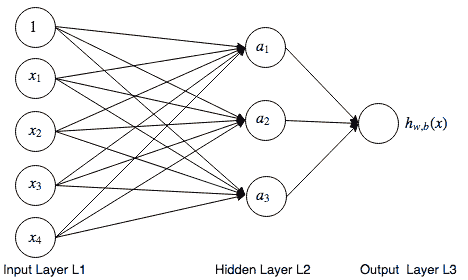

一层以上的神经网络是非线性假设的示例，在该模型中，模型可以学习比线性分类器更复杂的关系。 实际上，它们实际上是通用逼近器，能够逼近任何连续函数。

# 激活功能

为了使 ANN 模型能够解决更复杂的问题，我们需要在神经元点积之后添加一个非线性块。 然后，如果将这些非线性层级联起来，它将使网络将不同的概念组合在一起，从而使复杂的问题更易于解决。

在神经元中使用非线性激活非常重要。 如果我们不使用非线性激活函数，那么无论我们层叠了多少层，我们都只会拥有行为类似于线性模型的东西。 这是因为线性函数的任何线性组合都会分解为线性函数。

我们的神经元可以使用多种不同的激活功能，此处显示了一些； 唯一重要的是函数是非线性的。 每个激活功能都有其自身的优点和缺点。

历史上，神经网络选择的激活函数是 Sigmoid 和 *TanH* 。 但是，这些功能对于可靠地训练神经网络不利，因为它们具有不希望的特性，即它们的值在任一端都饱和。 这将导致这些点处的梯度为零，我们将在后面找到，并且在训练神经网络时不是一件好事。


结果，更流行的激活功能之一是 ReLU 激活或**整流线性单元**。 ReLU 只是输入和 0-max（x，0）之间的最大运算。 它具有理想的特性，即梯度（至少在一端）不会变为零，这极大地有助于神经网络训练的收敛速度。

该激活功能用于帮助训练深层的 CNN 之后，变得越来越流行。 它的简单性和有效性使其成为通常使用的激活功能。

# XOR 问题

为了解释深度在 ANN 中的重要性，我们将研究一个 ANN 能够解决的非常简单的问题，因为它具有多个层。

在使用人工神经元的早期，人们并不像我们在人工神经网络中那样将各层级联在一起，因此我们最终得到了一个称为感知器的单层：

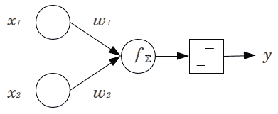

感知器实际上只是输入和一组学习的权重之间的点积，这意味着它实际上只是线性分类器。

大约在第一个 AI 冬季，人们意识到了感知器的弱点。 由于它只是线性分类器，因此无法解决简单的非线性分类问题，例如布尔异或（XOR）问题。 为了解决这个问题，我们需要更深入地研究。

在此图中，我们看到了一些不同的布尔逻辑问题。 线性分类器可以解决 AND 和 OR 问题，但不能解决 XOR：

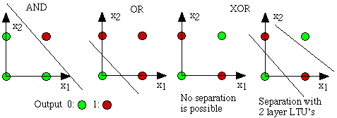

这使人们有了将使用非线性激活的神经元层级联在一起的想法。 一层可以根据上一层的输出来创建非线性概念。 这种“概念的组合”使网络变得更强大，并能代表更困难的功能，因此，它们能够解决非线性分类问题。

# 训练神经网络

那么，我们该如何在神经网络中设置权重和偏差的值，从而最好地解决我们的问题呢？ 好吧，这是在训练阶段完成的。 在此阶段中，我们希望使神经网络从训练数据集中“学习”。 训练数据集由一组输入（通常表示为 X）以及相应的所需输出或标签（通常表示为 Y）组成。

当我们说网络学习时，所发生的就是网络参数被更新，网络应该能够为训练数据集中的每个 X 输出正确的 Y。 期望的是，在对网络进行训练之后，它将能够针对训练期间未看到的新输入进行概括并表现良好。 但是，为了做到这一点，您必须有一个足够具有代表性的数据集，以捕获要输出的内容。 例如，如果要分类汽车，则需要具有不同类型，颜色，照度等的数据集。

通常，当我们没有足够的数据或者我们的模型不够复杂以至于无法捕获数据的复杂性时，就会出现训练机器学习模型的一个常见错误。 这些错误可能导致过拟合和拟合不足的问题。 在以后的章节中，您将学习如何在实践中处理这些问题。

在训练期间，*以两种不同的模式执行网络*：

*   **正向传播**：我们通过网络向前工作，为数据集中的当前给定输入生成输出结果。 然后评估损失函数，该函数告诉我们网络在预测正确输出方面的表现如何。
*   **反向传播**：我们通过网络进行反向计算，计算每个权重对产生网络电流损耗的影响。

此图显示了训练时网络运行的两种不同方式。

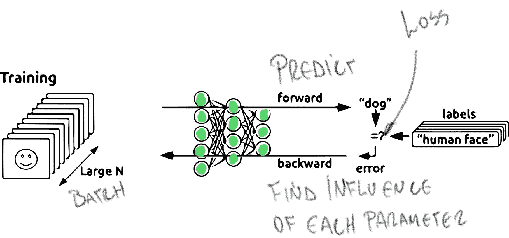

当前，使神经网络“学习”的主力军是与基于梯度的优化器（例如梯度下降）结合的反向传播算法。

反向传播用于计算梯度，该梯度告诉我们每个权重对产生电流损耗有什么影响。 找到梯度后，可以使用诸如梯度下降之类的优化技术来更新权重，以使损失函数的值最小化。

谨在最后一句话：TensorFlow，PyTorch，Caffe 或 CNTK 之类的 ML 库将提供反向传播，优化器以及表示和训练神经网络所需的所有其他功能，而无需您自己重写所有这些代码。

# 反向传播和链式规则

反向传播算法实际上只是微积分中可信赖链规则的一个示例。 它说明了如何找到某个输入对由多个功能组成的系统的影响。 因此，例如在下图中，如果您想知道`x`对函数`g`的影响，我们只需将`f`对`g`的影响乘以`x`对`f`的影响：

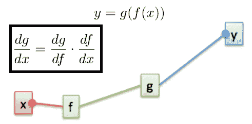

同样，这意味着如果我们想实现自己的深度学习库，则需要定义层的正常计算（正向传播）以及此计算块相对于其输入的影响（导数）。

下面我们给出一些常见的神经网络操作及其梯度。

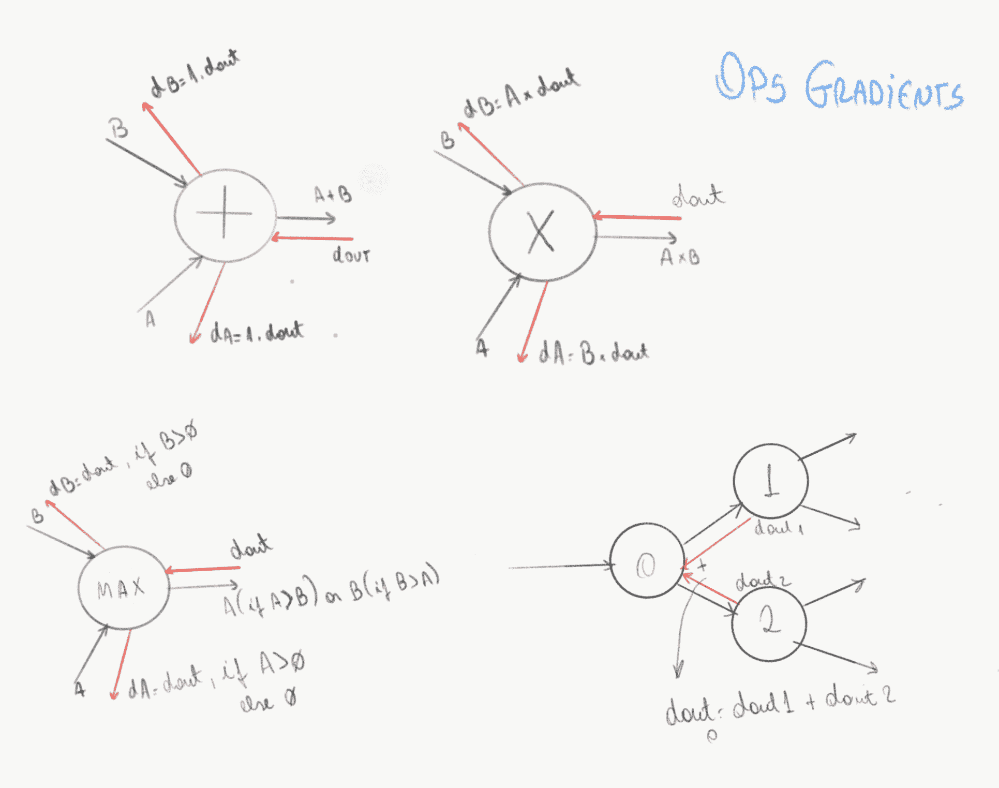

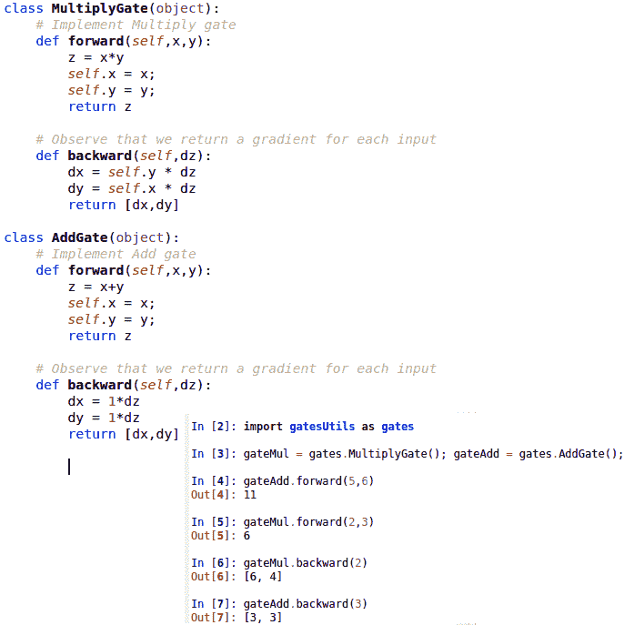

# 分批

对于大型数据集而言，将整个数据集存储在内存中以训练网络的想法，例如第 1 章，“TensorFlow 简介和设置”中的示例。 人们在实践中所做的是，在训练期间，他们将数据集分成小块，称为迷你批次（通常称为批次）。 然后，依次将每个微型批次装入并馈送到网络，在网络中将计算反向传播和梯度下降算法，然后更新权重。 然后，对每个小批量重复此操作，直到您完全浏览了数据集。

为小批量计算的梯度是对整个训练集的真实梯度的噪声估计，但是通过反复获取这些小的噪声更新，我们最终仍将收敛到足够接近损失函数的最小值。

较大的批次大小可以更好地估计真实梯度。 使用较大的批次大小将允许较大的学习率。 权衡是在训练时需要更多的内存来保存此批次。

当模型看到您的整个数据集时，我们说一个纪元已经完成。 由于训练的随机性，您将需要针对多个时期训练模型，因为您的模型不可能只在一个时期内收敛。

# 损失函数

在训练阶段，我们需要使用当前的权重正确预测训练集； 此过程包括评估我们的训练集输入 *X* ，并与所需的输出 *Y* 进行比较。 需要某种机制来量化（返回标量数）我们当前的权重在正确预测我们所需的输出方面有多好。 该机制称为**损失函数**。

反向传播算法应返回每个参数相对于损失函数的导数。 这意味着我们将发现更改每个参数将如何影响损耗函数的值。 然后，优化算法的工作就是最小化损失函数，换句话说，就是在训练时减小训练误差。

一个重要方面是为工作选择合适的损失函数。 一些最常见的损失函数及其用途是在此处给出的：

*   **对数损失** - 仅具有两个可能结果的分类任务（从有限集中返回标签）
*   **交叉熵损失** - 具有两个以上结果的分类任务（从有限集返回标签）
*   **L1 损失** - 回归任务（返回实数值）
*   **L2 损失** - 回归任务（返回实数值）
*   **Huber 损失** - 回归任务（返回实数值）

在本书中，我们将看到损失函数的不同示例。

损失函数的另一个重要方面是它们必须是可区分的。 否则，我们不能将它们与反向传播一起使用。 这是因为反向传播要求我们能够采用损失函数的导数。

在下图中，您可以看到损失函数连接在神经网络的末端（模型输出），并且基本上取决于模型的输出和数据集所需的目标。

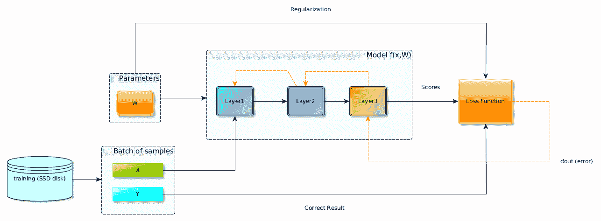

TensorFlow 的以下代码行也显示了这一点，因为损失仅需要标签和输出（此处称为 logits）。

```py
loss = tf.losses.sparse_softmax_cross_entropy(labels=labels, logits=logits) 
```

您可能会注意到第三个箭头也连接到损失功能。 这与名为正则化的东西有关，将在第 3 章“TensorFlow 中的图像分类”中进行探讨； 因此，现在您可以放心地忽略它。

# 优化器及其超参数

如前所述，优化器的工作是以一种使训练损失误差最小的方式来更新网络权重。 在所有 TensorFlow 之类的深度学习库中，实际上只使用了一个优化器系列，即梯度下降式优化器系列。

其中最基本的简称为梯度下降（有时称为香草梯度下降），但已经尝试开发出更复杂的梯度下降方法。 一些受欢迎的是：

*   带动量的梯度下降
*   RMSProp
*   亚当

TensorFlow 的所有不同优化器都可以在`tf.train`类中找到。 例如，可以通过调用`tf.train.AdamOptimizer()`使用 Adam 优化器。

您可能会怀疑，它们都有可配置的参数来控制它们的工作方式，但是通常最需要注意和更改的参数如下：

*   学习率：控制优化器尝试最小化损失函数的速度。 将其设置得太高，您将无法收敛到最小。 将其设置得太小，将永远收敛或陷于不良的局部最小值中。

下图显示了学习率选择错误可能带来的问题：

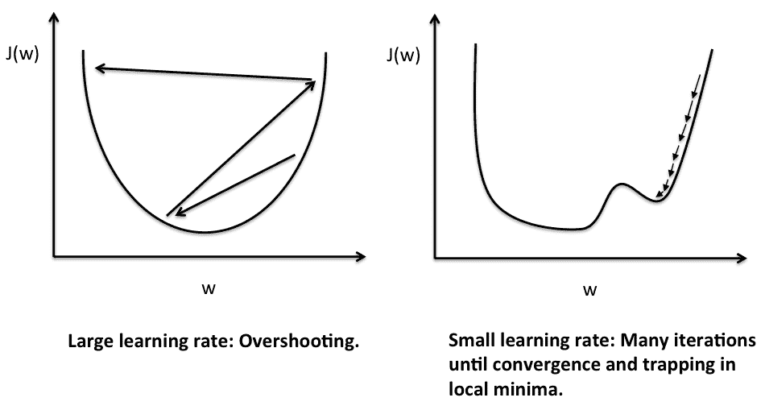

学习率的另一个重要方面是，随着训练的进行和错误的减少，您在训练开始时选择的学习率值可能会变得太大，因此您可能会开始超出最小值。

要解决此问题，您可以安排学习速率衰减，以免在训练时降低学习速率。 这个过程称为**学习率调度**，我们将在下一章中详细讨论几种流行的方法。

另一种解决方案是使用自适应优化器之一，例如 Adam 或 RMSProp。 这些优化器经过精心设计，可在您训练时自动调整和衰减所有模型参数的学习率。 这意味着从理论上讲，您不必担心安排自己的学习率下降。

最终，您希望选择优化器，以最快，最准确的方式训练您的网络。 下图显示了优化器的选择如何影响网络收敛的速度。 不同的优化器之间可能会有相当大的差距，并且可能因不同的问题而有所不同，因此理想情况下，如果可以的话，您应该尝试所有的优化器，并找到最适合您的问题的解决方案。


但是，如果您没有时间执行此操作，那么下一个最佳方法是首先尝试将 Adam 用作优化器，因为它通常在很少调整的情况下效果很好。 然后，如果有时间，请尝试使用 Momentum SGD； 这将需要更多的参数调整，例如学习率，但是如果调整得很好，通常会产生非常好的结果。

# 拟合不足与拟合过度

在设计用于解决特定问题的神经网络时，我们可能有很多活动部件，并且必须同时处理许多事情，例如：

*   准备数据集
*   选择层数/神经元数
*   选择优化器超参数

如果我们专注于第二点，它使我们了解选择或设计神经网络架构/结构时可能发生的两个问题。

这些问题中的第一个是模型对于训练数据的数量或复杂性而言是否太大。 由于模型具有如此众多的参数，因此即使在数据中存在噪声的情况下，它也可以轻松轻松地准确地学习其在训练集中看到的内容。 这是一个问题，因为当向网络提供的数据与训练集不完全相同时，网络将无法正常运行，因为它过于精确地了解了数据的外观，而错过了其背后的全局。 这个问题称为**过拟合**或具有**高方差**。

另一方面，您可能选择的网络规模不足以捕获数据复杂性。 现在，我们遇到了相反的问题，由于您的模型没有足够的能力（参数）来充分学习，因此您的模型无法充分捕获数据集背后的基础结构。 网络将再次无法对新数据执行良好的操作。 这个问题称为**欠拟合**或具有**高偏差**。

您可能会怀疑，在模型复杂性方面，您总是会寻求适当的平衡，以避免这些问题。

在后面的章节中，我们将看到如何检测，避免和补救这些问题，但是仅出于介绍的目的，这些是解决这些问题的一些经典方法：

*   获取更多数据
*   当检测到测试数据的错误开始增长时停止（提前停止）
*   尽可能简单地开始模型设计，并且仅在检测到拟合不足时才增加复杂性

# 功能缩放

为了简化优化程序算法的工作，在训练和测试之前，有一些技术可以并且应该应用到您的数据中。

如果输入向量的不同维度上的值彼此不成比例，则损失空间将以某种方式扩大。 这将使梯度下降算法难以收敛，或者至少使其收敛较慢。

当数据集的要素超出比例时，通常会发生这种情况。 例如，关于房屋的数据集在输入向量中的一个特征可能具有“房间数”，其值可能在 1 到 4 之间，而另一个特征可能是“房屋面积”，并且可能在 1000 到 10000 之间。 ，它们彼此之间严重超出比例，这可能会使学习变得困难。

在下面的图片中，我们看到一个简单的示例，说明如果我们的输入要素未全部按比例缩放，则损失函数的外观以及正确缩放比例后的外观。 当数据缩放不正确时，梯度下降很难达到损失函数的最小值。


通常，您将对数据进行一些标准化，例如在使用数据之前减去平均值并除以数据集的标准偏差。 对于 RGB 图像，通常只需从每个像素值中减去 128 即可使数据居中于零附近。 但是，更好的方法是为数据集中的每个图像通道计算平均像素值。 现在，您具有三个值，每个图像通道一个，现在从输入图像中删除这些值。 我们一开始就不必担心缩放问题，因为所有功能一开始的缩放比例都相同（0-255）。

要记住非常重要的一点-如果您在训练时对数据进行了一些预处理，则必须在测试时进行完全相同的预处理，否则可能会得到不好的结果！

# 全连接层

组成我们之前看到的 ANN 的神经元层通常称为密集连接层，或**完全连接的**（**FC**）层，或简称为线性层。 诸如 Caffe 之类的一些深度学习库实际上会将它们视为点乘积运算，非线性层可能会或可能不会跟随它们。 它的主要参数将是输出大小，基本上是其输出中神经元的数量。

在第 1 章，“TensorFlow 简介和设置”中，我们创建了自己的致密层，但是您可以使用`tf.layers`来更轻松地创建它，如下所示：

```py
dense_layer = tf.layers.dense(inputs=some_input_layer, units=1024, activation=tf.nn.relu) 
```

在这里，我们定义了一个具有 1,024 个输出的完全连接层，随后将激活 ReLU。

重要的是要注意，该层的输入必须仅具有二维，因此，如果您的输入是空间张量，例如形状为`[28 * 28 * 3]`的图像，则必须在输入之前将其重整为矢量 它：

```py
reshaped_input_to_dense_layer = tf.reshape(spatial_tensor_in, [-1, 28 * 28 * 3]) 
```

# 针对 XOR 问题的 TensorFlow 示例

在这里，我们将到目前为止已经了解的一些知识放在一起，并将使用 TensorFlow 解决布尔 XOR 问题。 在此示例中，我们将创建一个具有 S 型激活函数的三层神经网络。 我们使用对数丢失，因为网络 0 或 1 仅有两种可能的结果：

```py
import tensorflow as tf 
# XOR dataset 
XOR_X = [[0, 0], [0, 1], [1, 0], [1, 1]] 
XOR_Y = [[0], [1], [1], [0]] 

num_input = 2 
num_classes = 1 

# Define model I/O (Placeholders are used to send/get information from graph) 
x_ = tf.placeholder("float", shape=[None, num_input], name='X') 
y_ = tf.placeholder("float", shape=[None, num_classes], name='Y') 

# Model structure 
H1 = tf.layers.dense(inputs=x_, units=4, activation=tf.nn.sigmoid) 
H2 = tf.layers.dense(inputs=H1, units=8, activation=tf.nn.sigmoid) 
H_OUT = tf.layers.dense(inputs=H2, units=num_classes, activation=tf.nn.sigmoid) 

# Define cost function 
with tf.name_scope("cost") as scope: 
   cost = tf.losses.log_loss( labels=y_, predictions=H_OUT) 
   # Add loss to tensorboard 
   tf.summary.scalar("log_loss", cost) 

# Define training ops 
with tf.name_scope("train") as scope: 
   train_step = tf.train.GradientDescentOptimizer(0.1).minimize(cost) 

merged_summary_op = tf.summary.merge_all() 

# Initialize variables(weights) and session 
init = tf.global_variables_initializer() 
sess = tf.Session() 
# Configure summary to output at given directory 
writer = tf.summary.FileWriter("./logs/xor_logs", sess.graph) 
sess.run(init) 

# Train loop 
for step in range(10000): 
   # Run train_step and merge_summary_op 
   _, summary = sess.run([train_step, merged_summary_op], feed_dict={x_: XOR_X, y_: XOR_Y}) 
   if step % 1000 == 0:        
       print("Step/Epoch: {}, Loss: {}".format(step, sess.run(cost, feed_dict={x_: XOR_X, y_: XOR_Y}))) 
       # Write to tensorboard summary 
       writer.add_summary(summary, step)
```

如果运行此脚本，则应该期望获得以下损耗图。 我们可以看到损失已经为零，这表明模型已经过训练并解决了问题。 您可以重复此实验，但现在只有一层致密层； 正如我们所说，您应该注意到该模型无法解决问题

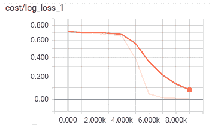。

为了能够查看图形，可以在脚本提示符下的命令提示符下运行以下命令。 这将为我们启动 tensorboard。 我们将在本章的后面找到关于 tensorboard 的更多信息。

```py
$ tensorboard --logdir=./logs/xor_logs
```

# 卷积神经网络

现在，我们将讨论另一种类型的神经网络，该网络专门设计用于处理具有某些空间特性的数据，例如图像。 这种类型的神经网络称为**卷积神经网络**（**CNN**）。

CNN 主要由称为**卷积层**的层组成，这些层对其层输入进行过滤以在这些输入中找到有用的特征。 这种过滤操作称为卷积，从而产生了这种神经网络的名称。

下图显示了对图像的二维卷积运算及其结果。 重要的是要记住，过滤器内核的深度与输入的深度相匹配（在这种情况下为 3）：


同样重要的是要清楚卷积层的输入不必是 1 或 3 通道图像。 卷积层的输入张量可以具有任意数量的通道。

很多时候，在谈论 CNN 中的卷积层时，人们都喜欢将卷积这个词简称为 conv。 这是非常普遍的做法，我们在本书中也会做同样的事情。

# 卷积

卷积运算是由星号表示的线性运算，它将两个信号合并：


二维卷积在图像处理中用于实现图像过滤器，例如，查找图像上的特定补丁或查找图像中的某些特征。

在 CNN 中，卷积层使用称为**内核**的小窗口，以类似于瓦片的方式过滤输入张量。 内核精确定义了卷积运算将要过滤的内容，并且在找到所需内容时会产生强烈的响应。

下图显示了将图像与称为 Sobel 滤波器的特定内核进行卷积的结果，该内核非常适合在图像中查找边缘：


您可能已经猜到了，在卷积层中要学习的参数是该层内核的权重。 在 CNN 训练期间，这些过滤器的值会自动调整，以便为手头任务提取最有用的信息。

在传统的神经网络中，我们将必须将任何输入数据转换为单个一维向量，从而在将该向量发送到全连接层后丢失所有重要的空间信息。 此外，每个像素每个神经元都有一个参数，导致输入大小或输入深度较大的模型中参数数量激增。

但是，在卷积层的情况下，每个内核将在整个输入中“滑动”以搜索特定补丁。 CNN 中的内核很小，并且与它们所卷积的大小无关。 结果，就参数而言，使用 conv 层的开销通常比我们之前了解的传统密集层要少得多。

下图显示了传统的完全连接层和卷积（局部连接）层之间的区别。 注意参数的巨大差异：

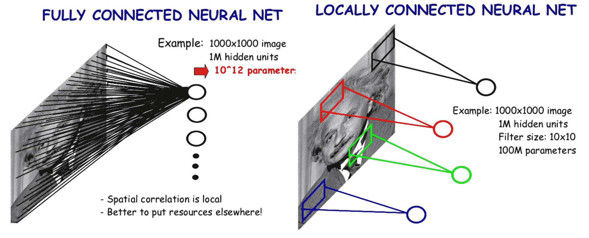

现在，也许我们希望卷积层在其输入中查找六种不同的事物，而不仅仅是寻找一种。 在这种情况下，我们将只给卷积层六个相同大小的过滤器（在这种情况下为 5x5x3），而不是一个。 然后，每个转换滤波器都会在输入中查找特定的模式。

下图显示了此特定的六个滤波器卷积层的输入和输出：

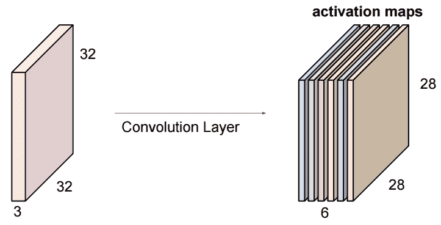

控制卷积层行为的主要超参数如下：

*   **内核大小（K）**：滑动窗口的像素大小。 小通常更好，通常使用奇数，例如 1、3、5，有时很少使用 7。
*   **跨度（S）**：内核窗口在卷积的每个步骤中将滑动多少像素。 通常将其设置为 1，因此图像中不会丢失任何位置，但是如果我们想同时减小输入大小，则可以增加位置。
*   **零填充（P）**：要放在图像边框上的零数量。 使用填充使内核可以完全过滤输入图像的每个位置，包括边缘。
*   **过滤器数（F）**：我们的卷积层将具有多少个过滤器。 它控制卷积层将要查找的图案或特征的数量。

在 TensorFlow 中，我们将在`tf.layers`模块中找到 2-D 卷积层，可以将其添加到模型中，如下所示：

```py
conv1 = tf.layers.conv2d( 
   inputs=input_layer, 
   filters=32, 
   kernel_size=[5, 5], 
   padding="same", 
   activation=tf.nn.relu) 
```

# 输入填充

如果我们什么都不做，那么卷积运算将输出一个在空间上小于输入结果的结果。 为了避免这种影响并确保卷积核查看每个图像位置，我们可以在输入图像的边界上放置零。 当我们这样做时，据说我们要填充图像：


TensorFlow 卷积操作为您提供了两种用于填充需求的选项：相同和有效。

*   有效-TensorFlow 不填充图像。 卷积内核将仅进入输入中的“有效”位置。
*   相同-如果我们假设步幅为 1，则在这种情况下，TensorFlow 将足够填充输入，以便输出空间大小与输入空间大小相同。

如果您确实希望对填充有更多控制，则可以在图层的输入上使用`tf.pad()`，以用所需的零个位数来填充输入。

通常，我们可以使用以下公式计算卷积运算的输出大小：

，

（这里，pad 是添加到每个边框的零的数量。）

但是在 TensorFlow 中，由于有效和相同填充选项的性质，公式如下所示：

```py
# Same padding 
out_height = ceil(float(in_height) / float(strides[1]))
 out_width  = ceil(float(in_width) / float(strides[2]))
 # Valid padding
 out_height = ceil(float(in_height - filter_height + 1) / float(strides[1]))
 out_width  = ceil(float(in_width - filter_width + 1) / float(strides[2]))
```

# 计算参数数量（权重）

在这里，我们将展示如何计算卷积层使用的参数数量。 计算卷积层中参数数量（包括偏差）的公式如下：


我们将用一个简单的例子来说明：

```py
 Input: [32x32x3] input tensor
 Conv layer: Kernel:5x5
               numFilters:10
```


另一方面，全连接层中的参数数量（包括偏置）如下：


如前所述，如果直接在图像上使用传统的人工神经网络，则所有空间信息都将丢失，并且每个参数每个神经元每个像素只有一个参数，因此会有大量的参数。 使用前面提到的相同示例，并在密集的 10 个输出神经元层中，我们得到以下数字：


这证明了这两种层类型之间参数的数量级差异。

# 计算操作数

现在，我们对计算特定卷积层的计算成本感兴趣。 如果您想了解如何实现有效的网络结构（例如在移动设备中速度是关键时），则此步骤很重要。 另一个原因是要查看在硬件中实现特定层需要多少个乘法器。 现代 CNN 架构中的卷积层最多可负责模型中所有计算的 90％！

这些是影响 MAC（乘加累加器）/操作数量的因素：

*   卷积核大小（F）
*   过滤器数量（M）
*   输入要素图的高度和宽度（高，宽）
*   输入批量（B）
*   输入深度大小（通道）（C）
*   卷积层步幅（S）

MAC 的数量可以计算为：

```py
#MAC = [F * F * C *（H + 2 * P-FS + 1）*（W + 2 * P-FS + 1）* M] * B
```

例如，让我们考虑一个具有输入 224 x 224 x 3，批处理大小为 1，内核为 3x3、64 个过滤器，跨度为 1 和填充 1 的转换层：

```py
#MAC = 3 * 3 *（224 + 2-31 + 1）*（224 + 2-31 + 1）* 3 * 64 * 1 = 9,462,528
```

相反，全连接层具有以下操作数：

```py
#MAC = [H * W * C * Outputneurons] * B
```

让我们重用相同的示例，但现在有 64 个神经元的密集层：

```py
#MAC = [224 * 224 * 3 * 64] * 1 = 9,633,792
```

（我们已排除了所有运维计算的偏差，但不应增加太多成本。）

通常，在 CNN 中，早期的 conv 层贡献了大部分计算成本，但参数最少。 在网络的末尾，相反的情况是后面的层具有更多的参数，但计算成本却较低。

# 将卷积层转换为全连接层

实际上，我们可以将全连接层视为卷积层的子集。 如果我们将内核大小设置为与输入大小匹配，则可以将 CNN 层转换为全连接层。 设置过滤器的数量与设置完全连接层中输出神经元的数量相同。 检查一下自己，在这种情况下，操作将是相同的。

例：

考虑具有 4,096 个输出神经元和输入大小为 7x7x512 的 FC 层，转换为：

转换层：内核：7x7，填充：0：步幅：1，过滤器：4,096。

使用公式来计算输出大小，我们得到大小为 1 x 1 x 4096 的输出。

这样做的主要原因之一是使您的网络完全卷积。 当网络完全卷积时，决定使用比输入的图像更大的输入大小图像并不重要，因为您没有任何需要固定输入大小的全连接层。

# 池化层

**池化层**用于减少 CNN 中我们的激活张量的空间尺寸，而不是体积深度。 它们是执行此操作的非参数方式，这意味着池化层中没有权重。 基本上，以下是从使用池中获得的收益：

*   在输入张量中汇总空间相关信息的便宜方法
*   通过减少空间信息，您可以获得计算性能
*   您的网络中存在一些翻译不变性

但是，池化的最大优点之一是它无需学习任何参数，这也是它的最大缺点，因为池化最终可能会丢掉重要的信息。 结果，现在开始在 CNN 中使用池的频率降低了。

在此图中，我们显示了最大池化池的最常见类型。 它像普通的卷积一样滑动一个窗口，然后在每个位置将窗口中的最大值设置为输出：


在 TensorFlow 中，我们可以这样定义池层：

```py
tf.layers.max_pooling2d(inputs=some_input_layer, pool_size=[2, 2], strides=2)
```

# 1x1 卷积

这种卷积起初看起来可能有些奇怪，但是 1x1 卷积实际上是通过合并深度来适应深度的，而不更改空间信息。 当需要在不损失空间信息的情况下将一个体积深度转换为另一个体积深度（称为压缩或扩展）时，可以使用这种类型的卷积：


# 计算感受野

接收场是特定卷积窗口“看到”其输入张量的程度。

有时，确切了解激活中每个特定像素在输入图像中“看到”了多少像素可能很有用； 这在对象检测系统中尤其重要，因为我们需要以某种方式查看某些层激活如何映射回原始图像大小。

在下图中，我们可以看到三个连续的 3x3 卷积层的接收场与一个 7x7 卷积层的接收场相同。 在设计新的更好的 CNN 模型时，此属性非常重要，我们将在后面的章节中看到。

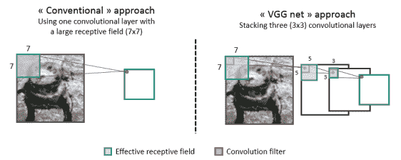

接收场可以计算为：


在这里，组件如下：

*   ：k 层的接收场
*   ：第 k 层的内核大小
*   ：从第 i 层（1..k-1）跨步
*   ：所有步长的乘积直到第 k-1 层（所有先前的层，而不是当前的一层）

仅对于第一层，接收域就是内核大小。

这些计算与是否使用卷积或池化层无关，例如，步幅为 2 的 conv 层将与步幅为 2 的池化层具有相同的接收场。

例如，给定以下图层之后的 14x14x3 图像，这将适用：

*   转换：S：1，P：0，K：3
*   转换：S：1，P：0，K：3
*   最大池：S：2，P：0，K2
*   转换：S：1，P：0，K：3

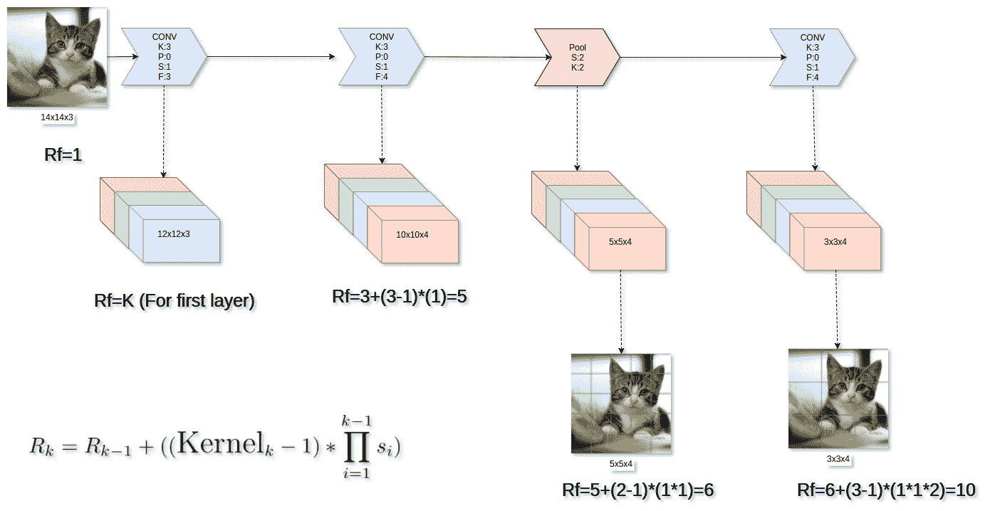

# 在 TensorFlow 中构建 CNN 模型

在开始之前，有个好消息：使用 TensorFlow，您无需担心编写反向传播或梯度下降代码，而且所有常见类型的层都已实现，因此事情应该更轻松。

在此处的 TensorFlow 示例中，我们将根据您在第 1 章，“TensorFlow 简介和设置”中学到的内容进行一些更改，并使用`tf.layers` API 创建整个 我们的网络轻松自如：

```py
import tensorflow as tf 
from tensorflow.examples.tutorials.mnist import input_data 
mnist = input_data.read_data_sets("MNIST_data/", one_hot=True) 
# MNIST data input (img shape: 28*28) 
num_input = 28*28*1 
# MNIST total classes (0-9 digits) 
num_classes = 10 

# Define model I/O (Placeholders are used to send/get information from graph) 
x_ = tf.placeholder("float", shape=[None, num_input], name='X') 
y_ = tf.placeholder("float", shape=[None, num_classes], name='Y') 
# Add dropout to the fully connected layer 
is_training = tf.placeholder(tf.bool) 

# Convert the feature vector to a (-1)x28x28x1 image 
# The -1 has the same effect as the "None" value, and will 
# be used to inform a variable batch size 
x_image = tf.reshape(x_, [-1, 28, 28, 1]) 

# Convolutional Layer #1 
# Computes 32 features using a 5x5 filter with ReLU activation. 
# Padding is added to preserve width and height. 
# Input Tensor Shape: [batch_size, 28, 28, 1] 
# Output Tensor Shape: [batch_size, 28, 28, 32] 
conv1 = tf.layers.conv2d(inputs=x_image, filters=32, kernel_size=[5, 5], padding="same", activation=tf.nn.relu) 

# Pooling Layer #1 
# First max pooling layer with a 2x2 filter and stride of 2 
# Input Tensor Shape: [batch_size, 28, 28, 32] 
# Output Tensor Shape: [batch_size, 14, 14, 32] 
pool1 = tf.layers.max_pooling2d(inputs=conv1, pool_size=[2, 2], strides=2) 

# Convolutional Layer #2 
# Computes 64 features using a 5x5 filter. 
# Input Tensor Shape: [batch_size, 14, 14, 32] 
# Output Tensor Shape: [batch_size, 14, 14, 64] 
conv2 = tf.layers.conv2d( inputs=pool1, filters=64, kernel_size=[5, 5], padding="same", activation=tf.nn.relu) 

# Pooling Layer #2 
# Second max pooling layer with a 2x2 filter and stride of 2 
# Input Tensor Shape: [batch_size, 14, 14, 64] 
# Output Tensor Shape: [batch_size, 7, 7, 64] 
pool2 = tf.layers.max_pooling2d(inputs=conv2, pool_size=[2, 2], strides=2) 

# Flatten tensor into a batch of vectors 
# Input Tensor Shape: [batch_size, 7, 7, 64] 
# Output Tensor Shape: [batch_size, 7 * 7 * 64] 
pool2_flat = tf.reshape(pool2, [-1, 7 * 7 * 64]) 

# Dense Layer 
# Densely connected layer with 1024 neurons 
# Input Tensor Shape: [batch_size, 7 * 7 * 64] 
# Output Tensor Shape: [batch_size, 1024] 
dense = tf.layers.dense(inputs=pool2_flat, units=1024, activation=tf.nn.relu) 

# Add dropout operation; 0.6 probability that element will be kept 
dropout = tf.layers.dropout( inputs=dense, rate=0.4, training=is_training) 

# Logits layer 
# Input Tensor Shape: [batch_size, 1024] 
# Output Tensor Shape: [batch_size, 10] 
logits = tf.layers.dense(inputs=dropout, units=10) 

# Define a loss function (Multinomial cross-entropy) and how to optimize it 
cross_entropy = tf.reduce_mean(tf.nn.softmax_cross_entropy_with_logits(logits=logits, labels=y_)) 
train_step = tf.train.AdamOptimizer(1e-4).minimize(cross_entropy) 

correct_prediction = tf.equal(tf.argmax(logits,1), tf.argmax(y_,1)) 
accuracy = tf.reduce_mean(tf.cast(correct_prediction, tf.float32)) 

# Build graph 
init = tf.global_variables_initializer() 

# Avoid allocating the whole memory 
gpu_options = tf.GPUOptions(per_process_gpu_memory_fraction=0.333) 
sess = tf.Session(config=tf.ConfigProto(gpu_options=gpu_options)) 
sess.run(init) 

# Train graph 
for i in range(2000): 
   # Get batch of 50 images 
   batch = mnist.train.next_batch(50) 

   # Print each 100 epochs 
   if i % 100 == 0: 
       # Calculate train accuracy 
       train_accuracy = accuracy.eval(session=sess, feed_dict={x_: batch[0], y_: batch[1], is_training: True}) 
       print("step %d, training accuracy %g" % (i, train_accuracy)) 

   # Train actually here 
   train_step.run(session=sess, feed_dict={x_: batch[0], y_: batch[1], is_training: False}) 

print("Test Accuracy:",sess.run(accuracy, feed_dict={x_: mnist.test.images, y_: mnist.test.labels, is_training: False}))
```

# 张量板

TensorBoard 是 TensorFlow 随附的基于 Web 的实用程序，可让您可视化构造的 TensorFlow 图。 最重要的是，它使您能够跟踪大量的统计数据或变量，这些数据或变量可能对训练模型很重要。 您可能希望跟踪的此类变量的示例包括训练损失，测试集准确性或学习率。 前面我们看到，我们可以使用张量板可视化损失函数的值。

要运行 TensorBoard，请打开一个新终端并输入以下内容：

```py
$ tensorboard --logdir=/somepath
```

在这里，`somepath`指向您的训练代码保存张量板日志记录数据的位置。

在代码内部，您需要通过为每个张量创建一个`tf.summary`来定义要可视化的张量。 因此，例如，如果我们要检查所有可训练变量和损失，则需要使用以下代码：

```py
with tf.Session() as sess:

    """Create your model"""

    # Add all trainable variables to tensorboard
    for var in tf.trainable_variables(): 
        tf.summary.histogram(var.name, var) 
    # Add loss to tensorboard 
    tf.summary.scalar("softmax_cross_entropy", loss) 
    # Merge all summaries 
    merged_summary = tf.summary.merge_all() 
    # Initialize a summary writer  
    train_writer = tf.summary.FileWriter( /tmp/summarys/ , sess.graph) 

    train_writer.add_summary(merged_summary, global_step) 

    """Training loop"""
```

我们需要创建一个`tf.summar.FileWriter`，它负责创建一个目录，该目录将存储我们的摘要日志。 如果在创建 FileWriter 时传递图形，则该图形也将显示在 TensorBoard 中。 通过传入 sess.graph，我们提供了会话正在使用的默认图。 在 TensorBoard 中显示图形的结果可能看起来像这样：

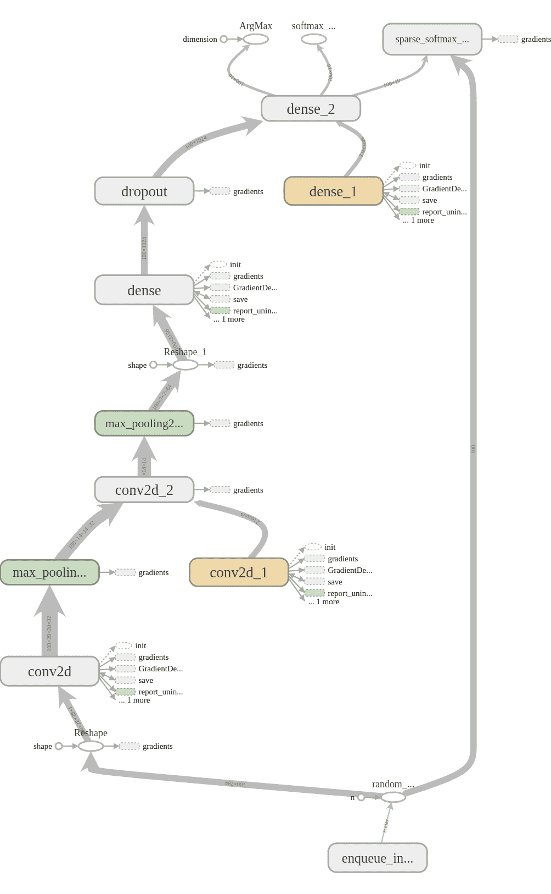

# 其他类型的卷积

本章的目的是让您了解 CNN 是什么，它们的用途以及如何在 TensorFlow 中构造它们。 但是，在这一点上值得一提的是，当今还有其他类型的卷积运算用于不同的目的，我们将在后面的章节中更详细地介绍其中的一些。

现在，我们将仅按名称和使用位置提及它们：

*   **深度卷积**：用于 MobileNets，旨在使卷积对移动平台友好
*   **膨胀卷积（Atrous Convolution）**：它们具有称为膨胀率的额外参数，可让您以相同的计算成本获得更大的视野（例如 3x3 CONV 可以具有相同的视野 作为 5x5 CONV）
*   **转置卷积（Deconvolutions）**：通常用于 CNN 自编码器和语义分割问题

# 摘要

在本章中，我们向您介绍了机器学习和人工智能。 我们研究了什么是人工神经网络以及如何对其进行训练。 在此之后，我们研究了 CNN 及其主要组成部分。 我们介绍了如何使用 TensorFlow 训练您自己的 CNN 以识别数字。 最后，我们对 Tensorboard 进行了介绍，并了解了如何在 TensorFlow 中训练模型时如何使用它来帮助可视化重要的统计数据。

在下一章中，我们将更仔细地研究图像分类的任务，以及如何使用 CNN 和 TensorFlow 来解决此任务。