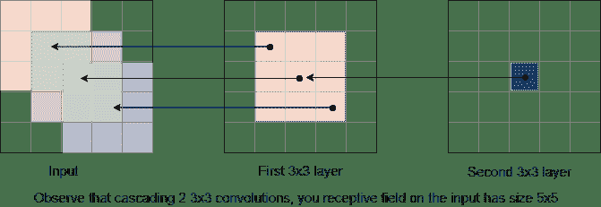
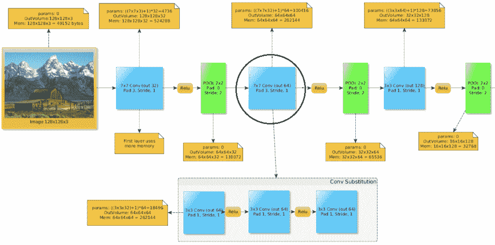
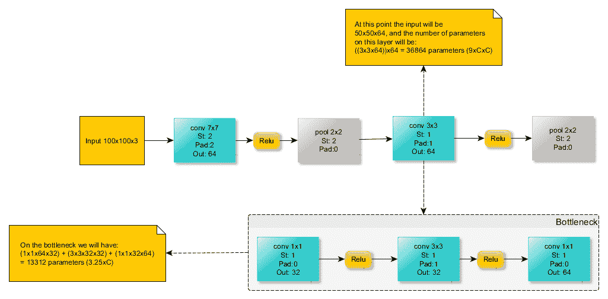
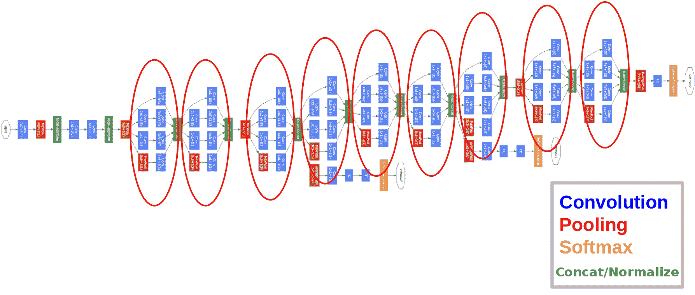
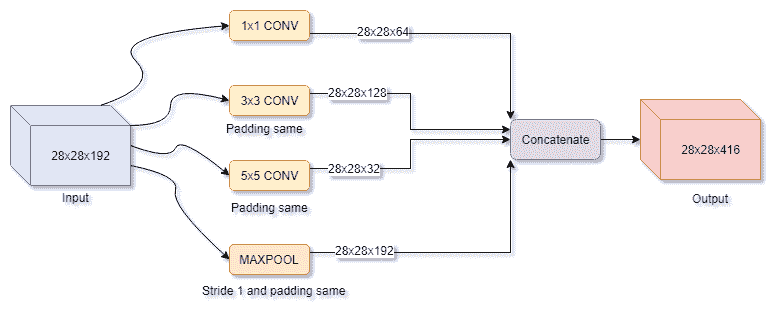
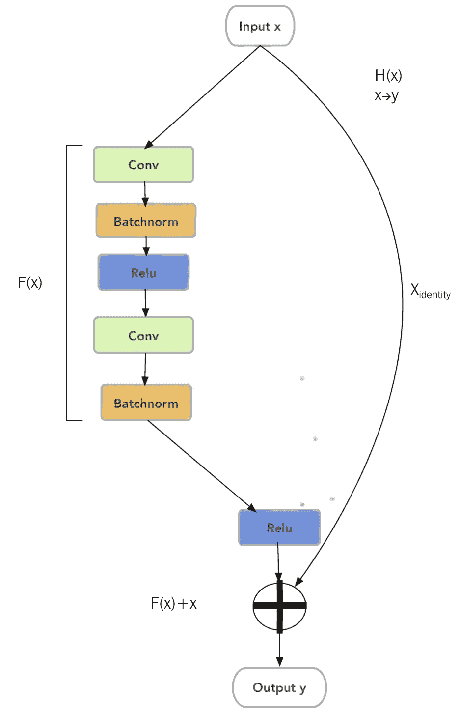
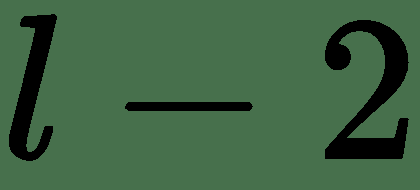
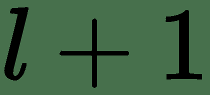
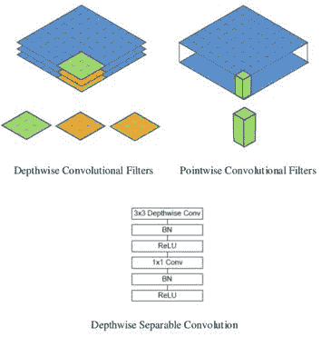

# VGG，启动模块，残差和 MobileNets

到目前为止，我们已经讨论了所有必要的构建块，以便能够实现常见问题（例如图像分类和检测）的解决方案。 在本章中，我们将讨论一些通用模型体系结构的实现，这些体系结构在许多常见任务中都表现出了很高的性能。 自从最初创建以来，这些体系结构一直很流行，并且在今天继续被广泛使用。

在本章的最后，您将对现有的不同类型的 CNN 模型及其在各种不同的计算机视觉问题中的用例进行了解。 在实现这些模型时，您将学习如何设计这些模型以及它们各自的优点。 最后，我们将讨论如何修改这些架构，以使训练和性能/效率更好。

总之，本章将涵盖以下主题：

*   如何提高参数效率
*   如何在 TensorFlow 中实现 VGG 网络
*   如何在 TensorFlow 中实现 Inception 网络
*   如何在 TensorFlow 中实施残留网络
*   如何实现对移动设备更友好的体系结构

# 替代大卷积

在开始之前，我们将首先学习可以减少模型使用的参数数量的技术。 首先，这很重要，因为它可以提高网络的泛化能力，因为使用该模型中存在的参数数量将需要较少的训练数据。 其次，较少的参数意味着更高的硬件效率，因为将需要更少的内存。

在这里，我们将从解释减少模型参数的重要技术入手，将几个小卷积级联在一起。 在下图中，我们有两个 3x3 卷积层。 如果回头看图右侧的第二层，可以看到第二层中的一个神经元具有 3x3 的接收场：



当我们说“感受野”时，是指它可以从上一层看到的区域。 在此示例中，需要一个 3x3 区域来创建一个输出，因此需要一个 3x3 的接收场。

回溯到另一层，该 3x3 区域的每个元素在输入端也具有 3x3 接收场。 因此，如果我们将所有这 9 个元素的接受场组合在一起，那么我们可以看到在输入上创建的总接受场大小为 5x5。

因此，用简单的话来说，将较小的卷积级联在一起可以获得与使用较大卷积相同的接收场。 这意味着我们可以用级联的小卷积代替大卷积。

请注意，由于第一卷积层和输入文件深度之间的深度不匹配（输出的深度需要保持一致），因此无法在作用于输入图像的第一个卷积层上进行此替换：还应在图像上观察我们如何 计算每层参数的数量。



在上图中，我们用三个 3x3 卷积替换了一个 7x7 卷积。 让我们自己计算一下，以减少使用的参数。

想象一下，在形状为 WxHxC 的输入体积上使用 C 滤波器进行 7x7 大小的卷积。 我们可以计算过滤器中的权数，如下所示：


现在，相反，如果我们层叠三个 3x3 卷积（代之以 7x7 卷积），我们可以如下计算其权重数：


在这里，我们可以看到参数比以前更少！

还要注意，在这三个卷积层的每一个之间，我们放置了 ReLu 激活。 与仅使用单个大卷积层相比，这样做会给模型带来更多的非线性。 增加的深度（和非线性）是一件好事，因为这意味着网络可以将更多的概念组合在一起，并提高其学习能力！

大多数新的成功模型的趋势是用许多级联在一起的较小卷积（通常为 3x3 大小）替换所有大型滤波器。 如前所述，这样做有两个巨大的好处。 它不仅减少了参数的数量，而且还增加了网络中非线性的深度和数量，这对于增加其学习能力是一件好事。

# 替代 3x3 卷积

也可以通过称为瓶颈的机制来简化 3x3 卷积。 与早期相似，这将具有正常 3x3 卷积的相同表示，但参数更少，非线性更多。

瓶颈通过使用以下 C 滤镜替换 3x3 卷积层而起作用：

*   具有 C / 2 滤波器的 1x1 卷积
*   具有 C / 2 滤波器的 3x3 卷积
*   带 C 滤镜的 1x1 卷积

这里给出一个实际的例子：



从此示例中，我们将计算参数数量以显示该瓶颈的减少量。 我们得到以下内容：


这比仅使用 3x3 卷积层时得到的参数要少：


一些网络体系结构，例如残差网络（我们将在后面看到），使用瓶颈技术再次减少了参数数量并增加了非线性。

# 虚拟网

VGGNet 由牛津大学的**视觉几何组**（**VGG**）创建，是真正引入堆叠更多层的想法的首批架构之一。 虽然 AlexNet 最初以其七层出现时被认为很深，但与 VGG 和其他现代体系结构相比，这现在已经很小了。

与只有 11x11 的 AlexNet 相比，VGGNet 仅使用空间大小为 3x3 的非常小的滤镜。 这些 3x3 卷积滤波器经常散布在 2x2 最大池化层中。

使用如此小的滤波器意味着可见像素的邻域也非常小。 最初，这可能给人的印象是，本地信息是模型所考虑的全部内容。 但是，有趣的是，通过依次堆叠小型滤波器，它提供了与单个大型滤波器相同的“接收场”。 例如，堆叠三批 3x3 滤镜将具有与一个 7x7 滤镜相同的接收场。

堆叠过滤器的这种洞察力带来了能够拥有更深的结构（我们通常会看到更好的结构）的优点，该结构保留了相同的接收场大小，同时还减少了参数数量。 本章后面将进一步探讨这个想法。

# 建筑

接下来，我们将看到 VGGNet 的体系结构，特别是包含 16 层的 VGG-16 风味。 所有卷积层都有空间大小为 3x3 的滤镜，并且随着我们深入网络，卷积层中滤镜的数量从 64 个增加到 512 个。

堆叠两个或三个卷积层然后合并的简单模块化设计使网络的大小易于增加或减小。 结果，VGG 成功创建并测试了具有 11、13 和 19 层的版本：


# 参数和内存计算

VGG 最酷的功能之一是，由于其在 conv 层中的内核较小，因此使用的参数数量很少。 如果我们从第 2 章，“深度学习和卷积神经网络”记住，卷积层中的参数数量（减去偏差）可以计算如下：


因此，例如，第一层将具有以下参数：


但是要注意，当涉及到模型末端的完全连接（密集）层时，这种数量很少的参数并不是这种情况，通常这是我们可以找到许多模型参数的地方。 如果像在 VGGNet 中一样，一个接一个地堆叠多个密集层，则尤其如此。

例如，第一个密集层将具有以下数量的参数：


到那时为止，这是所有参数的六倍以上！

如前所述，您需要在训练数据集中使用大量样本来消耗模型参数，因此最好避免过度使用完全连接的层来避免参数爆炸。 幸运的是，人们发现，如果最后只有一层而不是三层，那么 VGGNet 的工作原理几乎相同。 因此，删除这些完全连接的层会从模型中删除大量参数，而不会大大降低性能。 因此，如果您决定实施 VGGNet，我们建议您也这样做。

# 码

接下来，我们介绍负责在 Tensorflow 中构建 VGG-16 模型图的函数。 像本章中的所有模型一样，VGGNet 旨在对 Imagenet 挑战的 1,000 个类别进行分类，这就是为什么该模型输出大小为 1000 的向量的原因。 显然，可以为您自己的数据集轻松更改此设置，如下所示：

```py
   def build_graph(self): 

   self.__x_ = tf.placeholder("float", shape=[None, 224, 224, 3], name='X') 

   self.__y_ = tf.placeholder("float", shape=[None, 1000], name='Y') 

   with tf.name_scope("model") as scope: 

       conv1_1 = tf.layers.conv2d(inputs=self.__x_, filters=64, kernel_size=[3, 3], 

                                padding="same", activation=tf.nn.relu) 

       conv2_1 = tf.layers.conv2d(inputs=conv1_1, filters=64, kernel_size=[3, 3], 

                                  padding="same", activation=tf.nn.relu) 

       pool1 = tf.layers.max_pooling2d(inputs=conv2_1, pool_size=[2, 2], strides=2) 

       conv2_1 = tf.layers.conv2d(inputs=pool1, filters=128, kernel_size=[3, 3], 

                                padding="same", activation=tf.nn.relu) 

       conv2_2 = tf.layers.conv2d(inputs=conv2_1, filters=128, kernel_size=[3, 3], 

                                  padding="same", activation=tf.nn.relu) 

       pool2 = tf.layers.max_pooling2d(inputs=conv2_2, pool_size=[2, 2], strides=2) 

      conv3_1 = tf.layers.conv2d(inputs=pool2, filters=256, kernel_size=[3, 3], 

                                padding="same", activation=tf.nn.relu) 

       conv3_2 = tf.layers.conv2d(inputs=conv3_1, filters=256, kernel_size=[3, 3], 

                                  padding="same", activation=tf.nn.relu) 

       conv3_3 = tf.layers.conv2d(inputs=conv3_2, filters=256, kernel_size=[3, 3], 

                                  padding="same", activation=tf.nn.relu) 

       pool3 = tf.layers.max_pooling2d(inputs=conv3_3, pool_size=[2, 2], strides=2) 

       conv4_1 = tf.layers.conv2d(inputs=pool3, filters=512, kernel_size=[3, 3], 

                                  padding="same", activation=tf.nn.relu) 

       conv4_2 = tf.layers.conv2d(inputs=conv4_1, filters=512, kernel_size=[3, 3], 

                                  padding="same", activation=tf.nn.relu) 

       conv4_3 = tf.layers.conv2d(inputs=conv4_2, filters=512, kernel_size=[3, 3], 

                                  padding="same", activation=tf.nn.relu) 

       pool4 = tf.layers.max_pooling2d(inputs=conv4_3, pool_size=[2, 2], strides=2) 

       conv5_1 = tf.layers.conv2d(inputs=pool4, filters=512, kernel_size=[3, 3], 

                                  padding="same", activation=tf.nn.relu) 

       conv5_2 = tf.layers.conv2d(inputs=conv5_1, filters=512, kernel_size=[3, 3], 

                                  padding="same", activation=tf.nn.relu) 

       conv5_3 = tf.layers.conv2d(inputs=conv5_2, filters=512, kernel_size=[3, 3], 

                                  padding="same", activation=tf.nn.relu) 

       pool5 = tf.layers.max_pooling2d(inputs=conv5_3, pool_size=[2, 2], strides=2) 

       pool5_flat = tf.reshape(pool5, [-1, 7 * 7 * 512]) 

       # FC Layers (can be removed) 

       fc6 = tf.layers.dense(inputs=pool5_flat, units=4096, activation=tf.nn.relu) 

       fc7 = tf.layers.dense(inputs=fc6, units=4096, activation=tf.nn.relu) 

       # Imagenet has 1000 classes 

       fc8 = tf.layers.dense(inputs=fc7, units=1000) 

       self.predictions = tf.nn.softmax(self.fc8, name='predictions')
```

# 关于 VGG 的更多信息

2014 年，VGG 在 Imagenet 分类挑战中获得第二名，在 Imagenet 本地化挑战中获得第一名。 正如我们所看到的，VGGNet 的设计选择是堆叠许多小的卷积层，从而可以实现更深的结构，同时具有更少的参数（如果我们删除了不必要的完全连接的层），则性能更好。 这种设计选择在创建强大而高效的网络方面非常有效，以至于几乎所有现代体系结构都复制了这种想法，并且很少（如果有的话）使用大型过滤器。

事实证明，VGG 模型可以在许多任务中很好地工作，并且由于其简单的体系结构，它是开始尝试或适应问题需求的理想模型。 但是，它确实有以下问题需要注意：

*   通过仅使用 3x3 层，尤其是在第一层，计算量不适用于移动解决方案
*   如前几章所述，由于逐渐消失的梯度问题，甚至更深的 VGG 结构也无法正常工作
*   原始设计中大量的 FC 层在参数方面是过大的，这不仅减慢了模型的速度，而且更容易出现过拟合的问题
*   使用许多池化层，目前认为这不是好的设计

# GoogLeNet

虽然 VGGNet 在 2014 年 Imagenet 分类挑战赛中排名第二，但我们将要讨论的下一个模型 GoogLeNet 在那一年是赢家。 它是由 Google 创建的，它引入了一种重要的方法来使网络更深，同时减少参数数量。 他们称他们提出了`Inception` 模块。 该模块填充了大部分 GoogLeNet 模型。

GoogLeNet 具有 22 层，参数几乎比 AlexNet 少 12 倍。 因此，除了更加精确之外，它还比 AlexNet 快得多。 创建`Inception`模块的动机是制作更深的 CNN，以便获得高度准确的结果，并使该模型可在智能手机中使用。 为此，在预测阶段，计算预算大约需要增加 15 亿次：



# 起始模块

起始模块（或层的块）旨在覆盖较大的区域，但也保持较高的分辨率，以便也可以在图像中查看重要的本地信息。 除了创建更深的网络外，起始块还引入了并行卷积的思想。 我们的意思是在前一层的输出上执行不同大小的并行卷积。

初始层的幼稚视图可以在这里看到：



基本上，初始块的想法是使用所有可用的内核大小和操作来覆盖尽可能多的信息，并让反向传播根据您的数据决定使用什么。 在上图中看到的唯一问题是计算成本，因此该图在实践中会有所不同。

考虑我们之前看到的 5x5 分支，让我们检查一下它的计算成本：


现在，考虑以下更改； 我们添加一个 1x1 CONV 来将 5x5 CONV 输入深度从 192 转换为 16：


如果您观察到，现在计算效率提高了 10 倍。 1x1 层会挤压大量深度（瓶颈），然后发送到 5x5 CONV 层。

考虑到这一瓶颈变化，真正的初始层要复杂一些：


此外，在某些实现中，您可能会注意到有人试图在初始代码块中使用 Batchnorm 或 Dropout。

Googlenet 将只是许多级联的启动块。 在这段代码中，我们展示了如何创建一个起始块：

```py
# Reference: https://github.com/khanrc/mnist/blob/master/inception.py 

import tensorflow as tf 

def inception_block_a(x, name='inception_a'): 

   # num of channels: 384 = 96*4 

   with tf.variable_scope(name): 

       # Pooling part 

       b1 = tf.layers.average_pooling2d(x, [3,3], 1, padding='SAME') 

       b1 = tf.layers.conv2d(inputs=b1, filters=96, kernel_size=[1, 1], padding="same", activation=tf.nn.relu) 

       # 1x1 part 

       b2 = tf.layers.conv2d(inputs=x, filters=96, kernel_size=[1, 1], padding="same", activation=tf.nn.relu) 

       # 3x3 part 

       b3 = tf.layers.conv2d(inputs=x, filters=64, kernel_size=[1, 1], padding="same", activation=tf.nn.relu) 

       b3 = tf.layers.conv2d(inputs=b3, filters=96, kernel_size=[3, 3], padding="same", activation=tf.nn.relu) 

       # 5x5 part 

       b4 = tf.layers.conv2d(inputs=x, filters=64, kernel_size=[1, 1], padding="same", activation=tf.nn.relu) 

       # 2 3x3 in cascade with same depth is the same as 5x5 but with less parameters 

       # b4 = tf.layers.conv2d(inputs=b4, filters=96, kernel_size=[5, 5], padding="same", activation=tf.nn.relu) 

       b4 = tf.layers.conv2d(inputs=b4, filters=96, kernel_size=[3, 3], padding="same", activation=tf.nn.relu) 

       b4 = tf.layers.conv2d(inputs=b4, filters=96, kernel_size=[3, 3], padding="same", activation=tf.nn.relu) 

       concat = tf.concat([b1, b2, b3, b4], axis=-1) 

       return concat 
```

# 有关 GoogLeNet 的更多信息

GoogLeNet 的主要优点是，它比 VGG 更为准确，同时使用的参数更少，计算能力也更低。 主要的缺点仍然是，如果我们开始堆叠很多初始层，梯度将消失，而且整个网络具有多个分支和多个损耗的设计相当复杂。

# 残留网络

在前面的部分中，已经证明了网络的深度是有助于提高准确性的关键因素（请参见 VGG）。 TensorFlow 中的第 3 章和*图像分类中也显示，可以通过正确的权重初始化和批处理归一化来缓解深度网络中梯度消失或爆炸的问题。 但是，这是否意味着我们添加的层越多，我们得到的系统就越准确？ 亚洲研究机构 Microsoft 的*用于图像识别的深度残差学习*的作者发现，只要网络深度达到 30 层，准确性就会达到饱和。 为了解决此问题，他们引入了一个称为残差块的新层块，该块将上一层的输出添加到下一层的输出中（请参见下图）。 Residual Net 或 ResNet 在非常深的网络（甚至超过 100 层！）中都显示了出色的结果，例如 152 层的 ResNet 赢得了 2015 LRVC 图像识别挑战，其前 5 个测试错误为 3.57。 事实证明，诸如 ResNets 之类的更深层网络要比包括 Inception 模块（例如 GoogLeNet）在内的更广泛的网络更好地工作。*



让我们更详细地了解残差块的外观以及其功能背后的直觉。 如果我们有一个输入和一个输出，则存在一个将映射到的非线性函数。 假设函数可以由两个堆叠的非线性卷积层近似。 然后，残差函数也可以近似。 我们可以等效地写为，其中表示两个堆叠的非线性层，标识函数（输入=输出）。

更正式地说，对于通过网络的前向传递，如果是来自层的张量，并且和是当前层和先前层的权重矩阵，则输入到 下一层是


其中是非线性激活函数，例如 ReLu 和，即两层堆叠卷积。 ReLu 函数可以在添加 x 之前或之后添加。 剩余的块应由 2 层或更多层组成，因为一层的块没有明显的好处。

为了理解该概念背后的直觉，我们假设我们有一个经过训练的浅层 CNN，其更深的对应层具有与浅层 CNN 相同的层，并且在它们之间随机插入了一些层。 为了拥有一个与浅层模型至少具有相似性能的深层模型，附加层必须近似标识函数。 但是，要学习具有 CONV 层堆栈的标识函数比将残差函数推为零要困难得多。 换句话说，如果单位函数是最优解，则很容易实现，因此很容易实现。

另一种思考的方式是，在训练期间，特定的层不仅会从上一层学习一个概念，还会从它之前的其他层学习一个概念。 这比只从上一层学习概念要好。

在实现方面，我们应注意确保和的大小相同。

查看残差块的重要性的另一种方法是，我们将为梯度创建一个“高速公路”（加法块），以避免随着梯度的增加而消失的梯度问题！

以下代码将向您展示如何创建残差块，它是残差网络的主要构建块：

```py
# Reference
# https://github.com/tensorflow/tensorflow/blob/master/tensorflow/examples/learn/resnet.py
import tensorflow as tf
from collections import namedtuple

# Configurations for each bottleneck group.
BottleneckGroup = namedtuple('BottleneckGroup',
                            ['num_blocks', 'num_filters', 'bottleneck_size'])
groups = [
   BottleneckGroup(3, 128, 32), BottleneckGroup(3, 256, 64),
   BottleneckGroup(3, 512, 128), BottleneckGroup(3, 1024, 256)
]

# Create the bottleneck groups, each of which contains `num_blocks`
# bottleneck groups.
for group_i, group in enumerate(groups):
   for block_i in range(group.num_blocks):
       name = 'group_%d/block_%d' % (group_i, block_i)

       # 1x1 convolution responsible for reducing dimension
       with tf.variable_scope(name + '/conv_in'):
           conv = tf.layers.conv2d(
               net,
               filters=group.num_filters,
               kernel_size=1,
               padding='valid',
               activation=tf.nn.relu)
           conv = tf.layers.batch_normalization(conv, training=training)

       with tf.variable_scope(name + '/conv_bottleneck'):
           conv = tf.layers.conv2d(
               conv,
               filters=group.bottleneck_size,
               kernel_size=3,
               padding='same',
               activation=tf.nn.relu)
           conv = tf.layers.batch_normalization(conv, training=training)

       # 1x1 convolution responsible for restoring dimension
       with tf.variable_scope(name + '/conv_out'):
           input_dim = net.get_shape()[-1].value
           conv = tf.layers.conv2d(
               conv,
               filters=input_dim,
               kernel_size=1,
               padding='valid',
               activation=tf.nn.relu)
           conv = tf.layers.batch_normalization(conv, training=training)

       # shortcut connections that turn the network into its counterpart
       # residual function (identity shortcut)
       net = conv + net
```

# 移动网

我们将以一个新的 CNN 系列结束本章，该系列不仅具有较高的准确性，而且更轻巧，并且在移动设备上的运行速度更快。

由 Google 创建的 MobileNet 的关键功能是它使用了不同的“三明治”形式的卷积块。 它不是通常的（`CONV`，`BATCH_NORM,RELU`），而是将 3x3 卷积拆分为 3x3 深度卷积，然后是 1x1 点向卷积。他们称此块为深度可分离卷积。

这种分解可以减少计算量和模型大小：



# 深度可分离卷积

这个新的卷积块（`tf.layers.separable_conv2d`）由两个主要部分组成：深度卷积层，然后是 1x1 点式卷积层。 该块与普通卷积有以下几种不同：

*   在正常卷积层中，每个滤波器 F 将同时应用于输入通道上的所有通道（F 应用于每个通道然后求和）
*   这个新的卷积 F 分别应用于每个通道，并且结果被级联到某个中间张量（多少由深度倍数 DM 参数控制）

相对于标准卷积，深度卷积非常有效。 但是，它仅过滤输入通道，并且不将它们组合以创建新功能。

现在，将使用 1x1 转换层将深度输出张量映射到某些所需的输出通道深度，该转换层将在通常在标准卷积层中发生的通道之间进行混合。 区别在于 DM 参数可用于丢弃一些信息。 同样，1x1 转换仅用于调整音量大小。

# 控制参数

MobileNets 使用两个超参数来帮助控制精度和速度之间的折衷，从而使网络适合您要定位的任何设备。 这两个超参数如下：

*   **宽度倍增器**：通过统一减少整个网络中使用的滤波器数量，控制深度 CONV 精度
*   **分辨率倍增器**：只需将输入图像缩小到不同大小

# 有关 MobileNets 的更多信息

对于任何神经网络设计，MobileNets 都具有一些最佳的精度，速度和参数比率。

但是，目前尚无良好（快速）的深度卷积实现可在 GPU 上运行。 结果，训练可能会比使用正常的卷积运算慢。 但是，此网络目前真正发挥作用的地方是小型 CPU 设计，提高的效率更加明显。

# 摘要

在本章中，我们向您介绍了各种卷积神经网络设计，这些设计已经证明了它们的有效性，因此被广泛使用。 我们首先介绍牛津大学 VGG 的 VGGNet 模型。 接下来，在最终讨论微软的 Residual Net 之前，我们先使用 Google 的 GoogLeNet。 此外，我们还向您展示了一种更高级的新型卷积，该模型在名为 MobileNet 的模型设计中具有特色。 在整个过程中，我们讨论了使每个网络如此出色的不同属性和设计选择，例如跳过连接，堆叠小型过滤器或启动模块。 最后，给出了代码，向您展示了如何在 TensorFlow 中写出这些网络。

在下一章中，我们将讨论一种称为生成模型的新型模型，该模型将使我们能够生成数据。