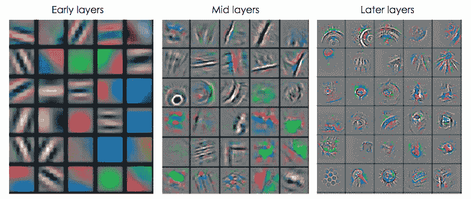
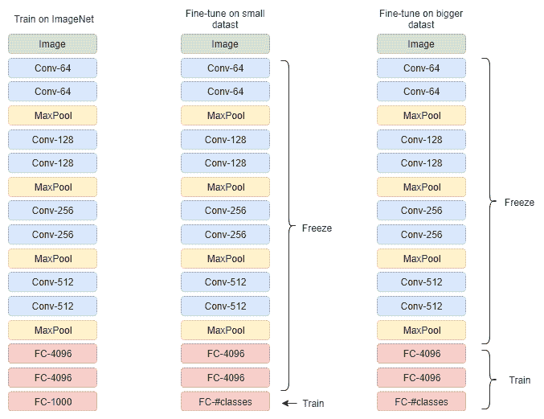

# 迁移学习

迁移学习的作用恰如其名。 这个想法是将从一项任务中学到的东西转移到另一项任务上。 为什么？ 实际上，每次都从头开始训练整个模型的效率很低，其成功取决于许多因素。 另一个重要原因是，对于某些应用程序，公开可用的数据集不够大，无法训练出像 AlexNet 或 ResNet 这样的深层架构而又不会过度拟合，这意味着无法推广。 示例应用程序可以从用户给出的一些示例中进行在线学习，也可以是细粒度的分类，其中类别之间的差异很小。

一个非常有趣的观察结果是，由于您冻结了所有其余部分（无论是检测还是分类），最终的层可以用于完成不同的任务，最终权重看起来非常相似。

这导致了迁移学习的想法。 这意味着在大量数据上训练的深度架构（例如 ImageNet）可以很好地概括化，以至于其卷积权重可以充当特征提取器，类似于常规的视觉表示，并且可以用于训练线性分类器以用于 各种任务。

本章旨在教读者如何在 TensorFlow 中采用现成的训练有素的模型，更改其结构以及为特定任务重新训练某些层。 我们将看到迁移学习将如何帮助改善结果并加快训练时间。

本章涵盖的主要主题如下：

*   使用来自另一个训练过的模型的权重预先初始化一个模型
*   在需要时使用 TensorFlow 加载模型并冻结/解冻图层

# 什么时候？

研究表明，在 ImageNet 上训练的卷积网络权重中的特征提取优于常规特征提取方法，例如 SURF，[H​​TG0]可变形部分描述符（ **DPD** s），**定向梯度直方图** （ **HOG** ）和**一袋单词**（ **BoW** ）。 这意味着无论常规视觉表示如何工作，卷积特征都可以同样好地使用，唯一的缺点是更深的架构可能需要更长的时间来提取特征。

当在 ImageNet 上训练深层卷积神经网络时，第一层中的卷积滤波器的可视化（请参见下图）显示，他们学习了*低层*特征，类似于边缘检测滤波器，而卷积滤波器 在最后一层学习*高级*功能，这些功能捕获特定于类的信息。 因此，如果我们在第一个池化层之后提取 ImageNet 的特征并将其嵌入 2D 空间（例如，使用 t-SNE），则可视化将显示数据中存在一些无政府状态，而如果执行 在完全连接的层上相同，我们将注意到具有相同语义信息的数据被组织成簇。 这意味着网络可以在更高层次上很好地概括，并且有可能将这种知识转移到看不见的类别中。



根据对与 ImageNet 相似度较小的数据集进行的实验，在以下任务上，基于 ImageNet 训练的基于卷积神经网络权重的特征比常规特征提取方法的性能更好：

*   **对象识别**：此 CNN 特征提取器可以成功地对其他类别不可见的数据集执行分类任务。
*   **域适应**：这是当训练和测试数据来自不同的分布，而标签和类别数相同时。 不同的域可以考虑使用不同的设备或在不同的设置和环境条件下捕获的图像。 具有 CNN 功能的线性分类器可以在不同域中成功地将具有相同语义信息的图像聚类，而 SURF 功能则可以针对特定领域的特征进行过拟合。
*   **精细**-**精细分类**：这是我们要在同一高级类中的子类之间进行分类的时候。 例如，我们可以对鸟类进行分类。 尽管没有对细粒度数据进行训练，但 CNN 功能以及逻辑回归功能的性能优于基线方法。
*   **场景识别**：在这里，我们需要对整个图像的场景进行分类。 在对象分类数据库上经过训练的 CNN 特征提取器，顶部带有一个简单的线性分类器，其性能优于应用于识别数据的传统特征提取器的复杂学习算法。

这里提到的某些任务与图像分类没有直接关系，图像分类是 ImageNet 训练的主要目标，因此有人希望 CNN 功能无法推广到看不见的场景。 但是，这些功能与简单的线性分类器相结合，性能优于手工制作的功能。 这意味着 CNN 的学习权重是可重用的。

那么什么时候应该使用迁移学习呢？ 当我们有一个任务时，由于问题的性质，可用数据集很小（例如对蚂蚁/蜜蜂进行分类）。 在这种情况下，我们可以在包含相似语义信息的较大数据集上训练我们的模型，然后用较小的数据集仅训练最后一层（线性分类器）。 如果我们只有足够的可用数据，并且有一个更大的相似数据集，则对该相似数据集进行预训练可能会导致模型更健壮。 通常情况下，我们使用随机初始化的权重来训练模型，在这种情况下，将使用在其他数据集上训练过的权重来初始化模型。 这将有助于网络更快地融合并更好地推广。 在这种情况下，仅微调模型顶端的几层是有意义的。

经验法则是，从网络顶部开始，可用数据越多，可以训练的层就越多。 通过预训练（例如在 ImageNet 上）模型初始化模型权重。

# 怎么样？ 概述

我们应该如何使用转学？ 有两种典型的解决方法。 第一种不太及时的方法是使用所谓的预训练模型，即预先在大型数据集（例如 ImageNet 数据集）上训练过的模型。 这些经过预先训练的模型可以在不同的深度学习框架中轻松获得，并且通常被称为“模型动物园”。 预训练模型的选择在很大程度上取决于当前要解决的任务是什么，以及数据集的大小。 选择模型后，我们可以使用全部或部分模型作为要解决的实际任务的初始化模型。

深度学习的另一种不太常见的方式是自己预先训练模型。 当可用的预训练网络不适合解决特定问题时，通常会发生这种情况，我们必须自己设计网络体系结构。 显然，这需要更多的时间和精力来设计模型和准备数据集。 在某些情况下，用于进行网络预训练的数据集甚至可以是合成的，可以从计算机图形引擎（例如 3D Studio Max 或 Unity）或其他卷积神经网络（例如 GAN）生成。 可以对虚拟数据进行预训练的模型在真实数据上进行微调，并且可以与仅对真实数据进行训练的模型一起很好地工作。

例如，如果我们想区分猫和狗，而我们没有足够的数据，则可以从“模型动物园”下载在 ImageNet 上训练的网络，并使用除最后一层以外的所有层的权重。 最后一层必须调整为具有与班级数量相同的大小，在本例中为两个，并且权重需要重新初始化和训练。 这样，通过将这些层的学习率设置为零或非常小的值（请参见下图），我们将冻结那些不需训练的层。 如果有更大的数据集，我们可以训练最后三个完全连接的层。 有时，预训练网络只能用于初始化权重，然后再进行正常训练。

迁移学习之所以有效，是因为在初始层计算出的特征更通用并且看起来很相似。 在顶层提取的特征对于我们要解决的问题变得更加具体。

为了进一步研究如何使用迁移学习，以及对该主题的更深刻理解，让我们看一下代码。



# 怎么样？ 代码示例

在本节中，我们将学习在 TensorFlow 中进行迁移学习所需的实用技能。 更具体地说，我们将学习如何从检查点选择要加载的层，以及如何指示我们的求解器仅优化特定的层而冻结其他层。

# TensorFlow 有用的元素

由于迁移学习是关于训练一个网络的权重，而该网络已从另一个训练后的模型中获取了权重，因此我们将需要找到一个。 在我们的示例中，我们将使用预训练卷积自编码器的编码部分，该部分在第 6 章中进行了说明。 使用自编码器的优点是我们不需要标记的数据，也就是说，可以完全不受监督地对其进行训练。

# 没有解码器的自编码器

包含两个卷积层和一个完全连接层的编码器（不带解码器部分的自编码器）如下所示。 父自编码器在 MNIST 数据集上进行了训练。 因此，网络将大小为 28x28x1 的图像作为输入，并在潜在空间将其编码为 10 维矢量，每个类别一维：

```py
# Only half of the autoencoder changed for classification
class CAE_CNN_Encoder(object):
    ......
    def build_graph(self, img_size=28):
        self.__x = tf.placeholder(tf.float32, shape=[None, img_size * img_size], name='IMAGE_IN')
        self.__x_image = tf.reshape(self.__x, [-1, img_size, img_size, 1])
        self.__y_ = tf.placeholder("float", shape=[None, 10], name='Y')

        with tf.name_scope('ENCODER'):
            ##### ENCODER
            # CONV1: Input 28x28x1 after CONV 5x5 P:2 S:2 H_out: 1 + (28+4-5)/2 = 14, 
            # W_out= 1 + (28+4-5)/2 = 14
            self.__conv1_act = tf.layers.conv2d(inputs=self.__x_image, strides=(2, 2), name='conv1',
                              filters=16, kernel_size=[5, 5], padding="same", activation=tf.nn.relu)

            # CONV2: Input 14x14x16 after CONV 5x5 P:0 S:2 H_out: 1 + (14+4-5)/2 = 7,
            # W_out= 1 + (14+4-5)/2 = 7
            self.__conv2_act = tf.layers.conv2d(inputs=self.__conv1_act, strides=(2, 2),      
                name='conv2', filters=32, kernel_size=[5, 5], padding="same", activation=tf.nn.relu)

        with tf.name_scope('LATENT'):
            # Reshape: Input 7x7x32 after [7x7x32]
            self.__enc_out = tf.layers.flatten(self.__conv2_act, name='flatten_conv2')
            self.__dense = tf.layers.dense(inputs=self.__enc_out, units=200, activation=tf.nn.relu,                                                                                                                                                                                               name='fc1')
            self.__logits = tf.layers.dense(inputs=self.__dense, units=10, name='logits')

    def __init__(self, img_size=28):
        if CAE_CNN_Encoder.__instance is None:
            self.build_graph(img_size)

    @property
    def output(self):
        return self.__logits

    @property
    def labels(self):
        return self.__y_

    @property
    def input(self):
        return self.__x

    @property
    def image_in(self):
        return self.__x_image
```

# 选择图层

一旦定义了模型`model = CAE_CNN_Encoder` `()`，选择将要使用预训练权重初始化的图层就很重要。 请注意，两个网络的结构（要初始化的网络和提供训练后的权重的网络）必须相同。 因此，例如，以下代码片段将选择名称为`convs`为`fc`的所有层：

```py
from models import CAE_CNN_Encoder
model = CAE_CNN_Encoder()

list_convs = [v for v in tf.global_variables() if "conv" in v.name]
list_fc_linear = [v for v in tf.global_variables() if "fc" in v.name or "output" in v.name]
```

请注意，这些列表是从`tf.global_variables()`填充的； 如果选择打印其内容，则可能会发现它包含所有模型变量，如下所示：

```py
[<tf.Variable 'conv1/kernel:0' shape=(5, 5, 1, 16) dtype=float32_ref>,
 <tf.Variable 'conv1/bias:0' shape=(16,) dtype=float32_ref>,
 <tf.Variable 'conv2/kernel:0' shape=(5, 5, 16, 32) dtype=float32_ref>,
 <tf.Variable 'conv2/bias:0' shape=(32,) dtype=float32_ref>,
 <tf.Variable 'fc1/kernel:0' shape=(1568, 200) dtype=float32_ref>,
 <tf.Variable 'fc1/bias:0' shape=(200,) dtype=float32_ref>,
 <tf.Variable 'logits/kernel:0' shape=(200, 10) dtype=float32_ref>,
 <tf.Variable 'logits/bias:0' shape=(10,) dtype=float32_ref>]
```

将定义图的图层分为卷积和完全连接两个列表后，您将使用`tf.Train.Saver`加载所需的权重。 首先，我们需要创建一个 saver 对象，将要从检查点加载的变量列表作为输入，如下所示：

```py
# Define the saver object to load only the conv variables
 saver_load_autoencoder = tf.train.Saver(var_list=list_convs) 
```

除了`saver_load_autoencoder`，我们还需要创建另一个`saver`对象，该对象将允许我们将要训练的网络的所有变量存储到检查点中。

```py
# Define saver object to save all the variables during training
saver = tf.train.Saver()
```

然后，在使用`init = tf.global_variables_initializer()`初始化图形并创建会话之后，我们可以使用`saver_load_autoencoder`从检查点恢复卷积层，如下所示：

```py
# Restore only the weights (From AutoEncoder)
 saver_load_autoencoder.restore(sess, "../tmp/cae_cnn/model.ckpt-34")

```

请注意，调用`restore`会覆盖`global_variables_initializer`，所有选定的权重都将替换为检查点的权重。

# 仅训练一些层次

迁移学习的另一个重要部分是冻结不需要训练的图层的权重，同时允许对某些图层（通常是最后一层）进行训练。 在 TensorFlow 中，我们可以仅将要优化的层传递给求解器（在此示例中，仅将 FC 层传递给）：

```py
train_step = tf.train.AdamOptimizer(learning_rate).minimize(loss, var_list=list_fc_linear) 
```

# 完整资料

在此示例中，我们将从 MNIST 卷积自编码器示例中加载权重。 我们将仅恢复编码器部分的权重，冻结 CONV 层，并训练 FC 层以执行数字分类：

```py
import tensorflow as tf 
import numpy as np 
import os 
from models import CAE_CNN_Encoder
SAVE_FOLDER='/tmp/cae_cnn_transfer' 
from tensorflow.examples.tutorials.mnist import input_data 
mnist = input_data.read_data_sets("MNIST_data/", one_hot=True)  
model = CAE_CNN_Encoder(latent_size = 20) 
model_in = model.input 
model_out = model.output 
labels_in = model.labels 

# Get all convs weights
list_convs = [v for v in tf.global_variables() if "conv" in v.name]

# Get fc1 and logits
list_fc_layers = [v for v in tf.global_variables() if "fc" in v.name or "logits" in v.name]

# Define the saver object to load only the conv variables
saver_load_autoencoder = tf.train.Saver(var_list=list_convs)

# Define saver object to save all the variables during training
saver = tf.train.Saver()

# Define loss for classification
with tf.name_scope("LOSS"):
    loss = tf.reduce_mean(tf.nn.softmax_cross_entropy_with_logits_v2(logits=model_out,                             labels=labels_in))
correct_prediction = tf.equal(tf.argmax(model_out,1), tf.argmax(labels_in,1))
accuracy = tf.reduce_mean(tf.cast(correct_prediction, tf.float32))    

# Solver configuration
with tf.name_scope("Solver"):
    train_step = tf.train.AdamOptimizer(1e-4).minimize(loss, var_list=list_fc_layers)

# Initialize variables
init = tf.global_variables_initializer()

# Avoid allocating the whole memory
gpu_options = tf.GPUOptions(per_process_gpu_memory_fraction=0.200)
sess = tf.Session(config=tf.ConfigProto(gpu_options=gpu_options))

sess.run(init)

# Restore only the CONV weights (From AutoEncoder)
saver_load_autoencoder.restore(sess, "/tmp/cae_cnn/model.ckpt-34")

# Add some tensors to observe on tensorboad
tf.summary.image("input_image", model.image_in, 4)
tf.summary.scalar("loss", loss)

merged_summary = tf.summary.merge_all()
writer = tf.summary.FileWriter(SAVE_FOLDER)
writer.add_graph(sess.graph)

#####Train######
num_epoch = 200
batch_size = 10
for epoch in range(num_epoch):
    for i in range(int(mnist.train.num_examples / batch_size)):
        # Get batch of 50 images
        batch = mnist.train.next_batch(batch_size)

        # Dump summary
        if i % 5000 == 0:            
            # Other summaries
            s = sess.run(merged_summary, feed_dict={model_in:batch[0], labels_in:batch[1]})
            writer.add_summary(s,i)                     

        # Train actually here (Also get loss value)            
        _, val_loss, t_acc = sess.run((train_step, loss, accuracy), feed_dict={model_in:batch[0],                                         labels_in:batch[1]})                

    print('Epoch: %d/%d loss:%d' % (epoch, num_epoch, val_loss))
    print('Save model:', epoch)
    saver.save(sess, os.path.join(SAVE_FOLDER, "model.ckpt"), epoch)
```

# 摘要

在本章中，我们学习了如何，何时以及为什么使用迁移学习。 这被认为是一个非常强大的工具，因为它使我们能够使用从其他领域学到的功能来以较少的数据很好地概括。 我们看了一些示例，现在应该清楚如何在自己的任务中实施迁移学习。

在下一章中，我们将看到如何组织我们的数据以及如何扩展 CNN 架构，以构建准确而实用的机器学习系统。