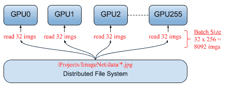
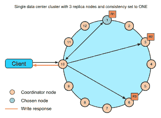
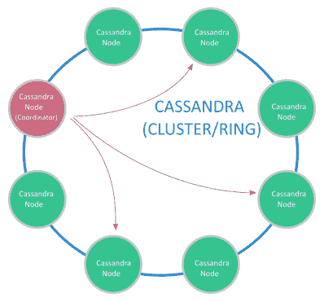
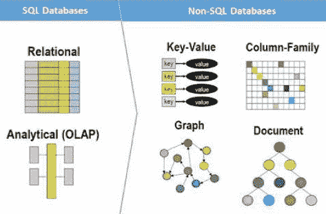
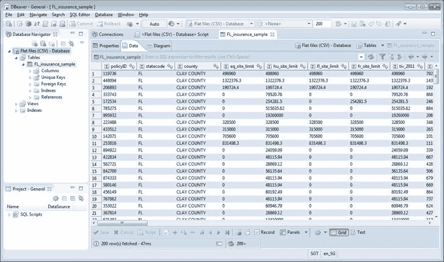
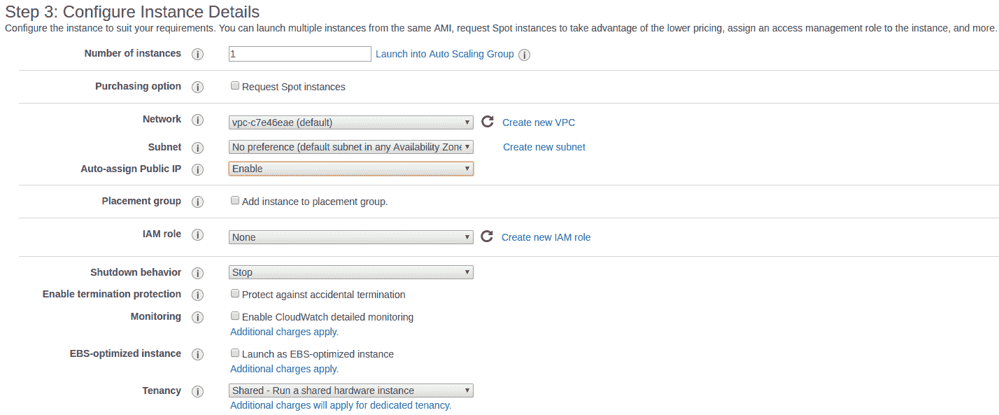
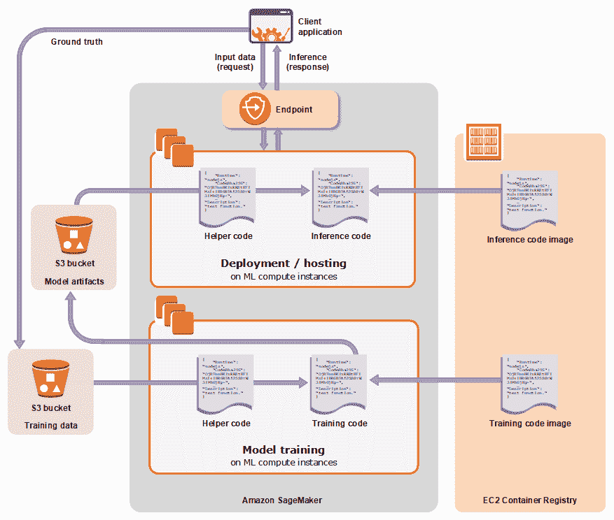
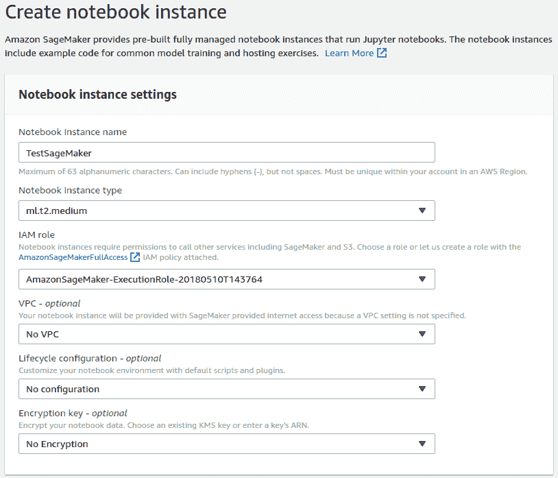
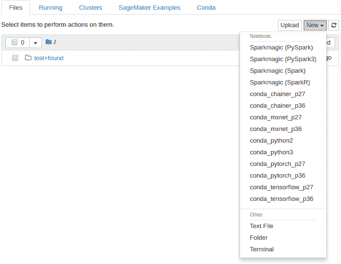

# 九、大规模训练

到目前为止，在本书中，我们使用或查看的数据集的大小从数万个（MNIST）样本到略超过一百万个（ImageNet）。 尽管所有这些数据集在刚推出时都被认为是巨大的，并且需要使用最先进的机器，但是 GPU 和云计算等技术的迅捷发展现已使它们易于训练。 由功率较低的机器的人。

但是，深度神经网络的强大功能来自其随输入的数据量进行扩展的能力。 简而言之，这意味着您可以用来训练模型的数据越好，越干净，结果越好。 研究人员已经意识到了这一点，我们可以看到，新的公共数据集中的训练样本数量一直在增加。

结果，很有可能，如果您开始研究行业中的问题，甚至只是最近的 Kaggle 竞赛，您很有可能将使用可能包含数百万个元素的数据集。 如何处理如此庞大的数据集，以及如何有效地训练模型，就成为一个现实问题。 差异可能意味着要等待三天而不是 1 个月的时间来完成模型的训练，因此这不是您想出错的事情。

在本章中，您将学习一些解决以下问题的方法：

*   数据集太大而无法放入内存
*   如何在多台机器上扩展训练
*   数据过于复杂而无法在普通目录文件夹和子文件夹中进行组织

# 在 TFRecords 中存储数据

让我们从训练网络进行图像分类的示例开始。 在这种情况下，我们的数据将是带有相关标签的图像集合。 我们存储数据的一种方法是在类似目录的文件夹结构中。 对于每个标签，我们将有一个文件夹，其中包含该标签的图像：

```py
-Data 
- Person 
   -im1.png 
- Cat 
   -im2.png 
- Dog 
   -im3.png 
```

尽管这似乎是存储数据的一种简单方法，但一旦数据集大小变得太大，它就会具有一些主要缺点。 当我们开始加载它时，一个很大的缺点就来了。

打开文件是一项耗时的操作，必须多次打开数百万个文件，这会增加大量的训练时间开销。 最重要的是，由于我们已将所有数据拆分开，因此不会将其存储在一个漂亮的内存块中。 硬盘驱动器将不得不做更多的工作来尝试查找和访问所有硬盘。

解决办法是什么？ 我们将它们全部放入一个文件中。 这样做的好处是，您的所有数据将在计算机内存中更好地对齐以便读取，这将加快处理速度。 将所有内容都保存在一个文件中也意味着我们不必花费时间来加载数百万个文件，这将非常缓慢且效率低下。

我们可以根据需要使用几种不同的格式来存储数据，例如 HDF5 或 LMDB。 但是，当我们使用 TensorFlow 时，我们将继续使用其自己的内置格式 TFRecords。 TFRecords 是 TensorFlow 自己的标准文件格式，用于存储数据。 它是一种二进制文件格式，提供对其内容的顺序访问。 它足够灵活，可以存储复杂的数据集和标签以及我们可能想要的任何元数据。

# 创建 TFRecord

在开始之前，让我们分解一下 TFRecord 的工作方式。 打开 TFRecord 文件进行写入后，创建一个称为`Example`的内容。 这只是一个协议缓冲区，我们将使用它填充要保存在其中的所有数据。 在示例中，我们将数据存储在`Feature`中。 功能是描述示例中数据的一种方式。 功能可以是以下三种类型之一：字节列表，浮点列表或`int64`列表。 将所有数据放入功能部件并将它们写入示例缓冲区后，我们会将整个协议缓冲区序列化为字符串，然后将其写入 TFRecord 文件。

让我们看看这在实践中如何工作。 我们将继续使用前面的图像分类示例，并创建一个 TFRecord 来存储相关数据。

首先，我们创建文件，这还将返回给我们一种写入文件的方式：

```py
writer = tf.python_io.TFRecordWriter('/data/dataset.tfrecord') 
```

接下来，我们假设图像已经加载并且已经作为`numpy`数组存储在内存中； 我们将在以后看到如何存储编码图像：

```py
# labels is a list of integer labels.
# image_data is an NxHxWxC numpy array of images
for index in range(len(labels)):
    image_raw = image_data[index, ...].tobytes() 
# Create our feature.
    my_features= {
                'image_raw':   tf.train.Feature(bytes_list=tf.train.BytesList(value=[image_raw])),               'label':
 tf.train.Feature(int64_list=tf.train.Int64List(value=[labels[index]]))}
   # The Example protocol buffer.
    example = tf.train.Example(features=tf.train.Features(feature=my_features)
    writer.write(example.SerializeToString())

 writer.close()  # Close our tfrecord file after finishing writing to it.
```

我们遍历标签列表，将每个图像数组一次转换为原始字节。

要在示例中存储数据，我们需要向其添加功能。 我们将功能存储在字典中，其中每个键都是我们选择的某些字符串名称，例如`label`，值是`tf.train.Feature`，这就是我们的数据。

必须使用`tf.train.BytesList`，`tf.train.Int64List`或`tf.train.FloatList`将进入`tf.train.Feature`的数据转换为期望的正确类型。

接下来，我们创建一个`tf.train.Example`协议缓冲区并将功能传递给它。 最后，我们将`Example`序列化为字符串并将其写入 TFRecord 文件。 一旦遍历了整个图像阵列，就必须记住关闭文件进行写入。

# 存储编码图像

优化内存使用率的一种方法是使用某种压缩方式（即 PNG）对图像进行编码，在这种情况下 TFRecord 会更小，但是您仍需要在使用之前解压缩数据，这可能需要一些时间。 在实践中要做的是使用另一个 CPU 内核来减轻计算量。

# 分片

尽管我们说最好将所有数据保存在一个文件中，但实际上并非 100% 正确。 由于 TFRecords 是按顺序读取的，因此，如果仅使用一个文件，我们将无法重新整理数据集。 经过一段时间的训练之后，每次到达 TFRecord 的末尾时，您都将返回到数据集的开头，但是不幸的是，每次浏览文件时，数据的顺序都相同。

为了允许我们随机播放数据，我们可以做的一件事是通过创建多个 TFRecord 文件并将数据散布到这些多个文件中来*分片*我们的数据。 这样，我们可以在每个纪元处重新整理加载 TFRecord 文件的顺序，因此我们在训练时将为我们有效地整理数据。 每 100 万张图像需要 1000 个碎片，这是可以遵循的良好基准。

在下一节中，我们将看到如何使用 TFRecords 建立有效的数据馈送流水线。

# 建立高效的流水线

当我们处理较小的数据集时，仅将整个数据集加载到计算机内存中就足够了。 如果您的数据集足够小，这很简单并且可以正常工作； 但是，在很多时候，情况并非如此。 现在我们将研究如何克服这个问题。

为了避免一次加载所有数据，我们将需要创建一个数据流水线以将我们的训练数据馈入模型。 除其他事项外，该流水线将负责从存储中加载一批元素，对数据进行预处理，最后将数据提供给我们的模型。 幸运的是，这一切都可以使用 TensorFlow 数据 API 轻松完成。

对于这些示例，我们将假定已将数据保存到多个（在本例中为两个）TFRecord 文件中，如先前所述。 如果您有两个以上，则没有区别； 您只需在设置内容时包括所有名称即可。

我们首先从所有 TFRecord 文件名的列表创建 TFRecord 数据集：

```py
 # Create a TFRecord dataset that reads all of the Examples from  
   two files.
 train_filenames= ["/data/train1.tfrecord", "/data/train2.tfrecord"]
 train_dataset = tf.data.TFRecordDataset(filenames)

```

接下来，我们必须解码 TFRecords。 为此，我们编写了一个函数，该函数将接受 TFRecord，对其进行解码，然后返回输入图像及其对应的标签：

```py
# Function for decoding our TFRecord. We assume our images are fixed size 224x224x3
 def decode_tfrec(proto_in):

    my_features = {'image_raw': tf.FixedLenFeature([], tf.string),
                'Label': tf.FixedLenFeature([], tf.int64)}
    parsed_features = tf.parse_single_example(proto_in, features=my_features)image = tf.decode_raw(parsed_features['image_raw'], tf.uint8)
    image = tf.cast(image, tf.float32)  # Tensorflow data needs to be float32.
    image = tf.reshape(image, [224,224,3])  # Need to reshape your images.

    label = tf.cast(parsed_features['label'], tf.int32)  # Labels need to be int32

    label = tf.one_hot(label, depth=...)  # Convert our labels to one hot.   
return image, label 
```

然后，我们将此函数传递给`dataset.map()`方法，该方法将为我们执行：

```py
train_dataset = train_dataset.map(decode_tfrec, num_parallel_calls=4)  
```

# 映射转换的并行调用

默认情况下，您在数据集上调用的任何地图转换都仅作用于数据集的单个元素，并且将按顺序处理元素。 要加快速度并使用所有 CPU 功能，最简单的方法是将`num_parallel_calls`参数设置为可用的 CPU 内核数。 这样，我们就不会浪费任何可用的 CPU 能力。 但是，警告您不要将其设置为高于可用内核的数量，因为由于调度效率低下，这实际上可能会降低性能。

您想要对数据进行的任何转换（例如数据扩充）也可以编写为函数，然后像以前一样传递给`map`方法，以将其应用于数据集。 例如，请注意以下代码：

```py
train_dataset = train_dataset.map(decode_tfrec, num_parallel_calls=4)  # Decode tfrecord.
 train_dataset = train_dataset.map(data_augmentation,   
 num_parallel_calls=4)  # Augment data. 
```

# 批量

您希望在流水线末尾做的最后一件事是生成一批准备发送到 GPU 进行训练的数据。 这可以通过批量方法简单地完成，并传入所需的批量大小：

```py
train_dataset = train_dataset.batch(128)  # Take a batch of 128 from the dataset. 
```

当试图使我们的流水线尽可能高效时，批次的大小是一个重要的参数。 尽可能大可能并不总是最好的。 例如，如果您的图像上有很多预处理步骤，那么当 CPU 对大量图像进行预处理时，GPU 可能会处于空闲状态。

# 预取

我们能够建立有效数据流水线的另一种方法是始终准备好一批数据准备发送到 GPU。 理想情况下，在训练模型时，我们希望 GPU 的使用率始终保持在 100%。 这样，我们可以最大程度地利用昂贵的硬件，该硬件可以在训练时有效地计算前进和后退的传球次数。

为此，我们需要 CPU 加载并准备一批图像，以准备在向前和向后传递模型的过程中传递给 GPU。 幸运的是，在收集批量之后，我们可以使用简单的预取转换轻松完成此操作，如下所示：

```py
train_dataset= train_dataset.batch(128).prefetch(1) 
```

使用预取将确保我们的数据流水线在进行训练时为我们准备一整批数据，准备将其加载到 GPU 中以进行下一次迭代。 这样做可以确保我们的流水线在等待一批批次收集之前不会减慢速度，并且如果获取批次所需的时间少于模型的前后传递时间，那么我们的流水线将尽可能高效。

要清楚的是，此处使用`prefetch(1)`表示我们`prefetch`整批数据。 这就是为什么我们将批量作为流水线的最后一步，并在此处使用预取功能，因为这样做最有效。

# 追踪图

TensorFlow 提供了一种很好的方式来分析并查看整个图形通过其时间轴跟踪工具执行所需的时间。 这是查看图表的哪些部分正在减慢训练速度并发现数据流水线中任何低效率的好工具。

我们将从为您提供如何跟踪图形的示例开始。 这非常简单：您只需在常规代码中添加几行，就会生成一个 JSON 文件，我们可以将该文件加载到 Google Chrome 浏览器中，以查看图形执行的所有时间：

```py
from tensorflow.python.client import timeline 
.... # Your model and training code here 
with tf.Session() as sess:

    # We set some options to give to the session so graph execution is profiled.
    options = tf.RunOptions(trace_level=tf.RunOptions.FULL_TRACE)
    run_metadata = tf.RunMetadata()
    # Run your graph and supply the options we set.
    sess.run(model_output, options=options, run_metadata=run_metadata)
   # We create the Timeline object here then write it to json file.
    created_timeline = timeline.Timeline(run_metadata.step_stats)
    chome_readable_trace = created_timeline.generate_chrome_trace_format()

    with open('my_timeline.json', 'w') as file:
          file.write(chome_readable_trace)
```

在此代码中，我们导入 TensorFlow 时间轴模块，然后设置两个选项以启用图形跟踪并将其提供给`Session.run()`。 运行图之后，我们创建`Timeline`对象，该对象将包含对图执行进行性能分析的结果。 然后，我们将其转换为 Chrome 跟踪格式，最后将其写入 JSON 文件。

要查看结果，您需要打开一个新的 Chrome 窗口。 然后，在地址栏中输入`chrome://tracing`并按`Enter`。 左上角将有一个加载按钮。 使用它来加载刚刚保存的 JSON 文件。

现在将显示跟踪图形的结果。 查看此内容将告诉您图形的每个部分执行所需的时间。 您应该特别注意存在大块空白的地方。 这些空白表示设备（例如您的 GPU）正坐在那里等待数据，以便它们可以执行计算。 您应该尝试通过优化数据馈送方式来消除这些问题。

但是请注意，您的流水线可能已完全优化，但是您没有 CPU 周期来足够快地处理流水线。 检查您的 CPU 使用情况，看看是否是这种情况。

# TensorFlow 中的分布式计算

在本节中，您将学习如何在 TensorFlow 中分配计算； 强调如何做到这一点的重要性如下：

*   并行运行更多实验（即，找到超参数，例如网格搜索）
*   在多个 GPU（在多个服务器上）上分配模型训练，以减少训练时间

一个著名的用例是，Facebook 发布了一篇论文，该论文能够在 1 小时（而不是几周）内训练 ImageNet。 基本上，它在 256 个 GPU 上的 ImageNet 上训练了 ResNet-50，该 GPU 分​​布在 32 台服务器上，批量大小为 8,192 张图像。

# 模型/数据并行

实现并行性和在多台服务器中扩展任务的方法主要有两种：

*   **模型并行性**：当模型不适合 GPU 时，您需要在不同服务器上计算层。
*   **数据并行性**：当我们在不同的服务器上分布相同的模型但处理不同的批次时，每个服务器将具有不同的梯度，并且我们需要在服务器之间进行某种同步。

在本节中，我们将重点介绍易于实现的数据并行性：



# 同步/异步 SGD

如前所述，在数据并行性中，每个模型都会从训练集中获取一些数据并计算自己的梯度，但是考虑到每个工作人员都将拥有相同的模型，我们需要在更新模型之前以某种方式进行同步。

在同步 SGD 中，所有工作人员都会计算一个梯度并等待计算所有梯度，然后将模型更新并再次分发给所有工作人员：


# 当数据不适合在一台计算机上时

可能出现的一个问题是，我们根本无法将数据存储在一台计算机上和/或我们仍然需要在该数据集上进行搜索。 为了解决此类问题，我们可能需要分布式 **NoSQL** 数据库，例如 Cassandra。 Cassandra 支持在可用性和性能至关重要的多个系统上进行数据分发：





卡桑德拉（Cassandra）尽最大努力避免出现单点故障。 例如，所有节点都将像一种主节点一样工作（没有实际的主节点），因此，在某种类型的高可用性备份中，所有节点都有责任处理请求并自动在节点之间分配数据。

# NoSQL 系统的优势

与关系数据库（例如旧版本的 MySQL 和 PostgreSQL）相比，NoSQL 数据库在数据量太大以及不需要关系数据库的功能（例如触发器或存储过程）时会发光。 。

在继续之前，让我们列出 NoSQL 系统的优点：

*   水平缩放； 要获得更高的性能，只需添加更多机器
*   我们不需要事先知道表之间的关系
*   允许在整个工作期间更改表结构
*   更快（没有复杂的关系数据库机制）
*   数据通常保存在分布式文件系统上，因此，例如，将图像存储在 NoSQL 数据库中就可以了



# 安装 Cassandra（Ubuntu 16.04）

安装 Oracle Java 1.8：

*   ``sudo apt-get update​``
*   `sudo add-apt-repository ppa:webupd8team/java​`
*   `sudo apt-get update​`
*   `sudo apt-get -y install oracle-java8-installer​`

安装 Cassandra：

*   `echo "deb http://www.apache.org/dist/Cassandra/debian 310x main" | sudo tee -a /etc/apt/sources.list.d/cassandra.sources.list​`
*   `curl https://www.apache.org/dist/Cassandra/KEYS | sudo apt-key add -​`
*   `sudo apt-get update​`
*   `sudo apt-get install cassandra`
*   `sudo service cassandra status`
*   `sudo nodetool status​`

# CQLSH 工具

CQLSH 是允许您向 Cassandra 节点发出 SQL 命令的工具：


对于图形用户界面，有一个很好的工具叫做 DBWeaver，它也可以完成此工作：



DBWeaver 示例

# 创建数据库，表和索引

1.  首先，我们需要创建数据库（键空间）并选择节点如何复制数据：

```py
CREATE KEYSPACE mydb WITH REPLICATION = { 'class' : 'SimpleStrategy', 'replication_factor' : 1 };​
```

2.  现在，我们创建一个表：

```py
CREATE TABLE tb_drive ( id uuid PRIMARY KEY, wheel_angle float, acc float, image blob );​
```

3.  如下添加一些数据：

```py
INSERT INTO tb_drive (id,wheel_angle,acc) VALUES (now(),0.2,0.5);​
INSERT INTO tb_drive (id,wheel_angle,acc) VALUES (now(),0.1,0.5);​
INSERT INTO tb_drive (id,wheel_angle,acc) VALUES (now(),0.0,0.5);​
```

4.  （在任何时间点）创建要查询的所有列的索引（这就是为什么要快）

```py
CREATE INDEX idxAngle ON tb_drive (wheel_angle);​
CREATE INDEX idxAcc ON tb_drive (acc);​
```

# 将 Python 用于查询

首先，在开始玩之前，我们需要安装 Python 驱动程序`pip install cassandra-driver​`； 以下代码片段仅列出了 Cassandra 集群中表的内容：

```py
from cassandra.cluster import Cluster​ 
import cassandra.util​ 
import uuid​ 
import numpy as np​ 
​ 
# Considering that the cluster is on localhost​ 
cluster = Cluster()​ 
# Other option if you know the IPs​ 
# cluster = Cluster(['192.168.0.1', '192.168.0.2'])​ 
# Get a session to the database​ 
session = cluster.connect('mydb')​ 
​ 
# Doing a query​ 
rows = session.execute('SELECT * FROM tb_drive limit 5')​ 
print('Columns:',rows.column_names)​ 
for row in rows:​ 
    print(row.id, row.acc, row.wheel_angle) 
```

# 在 Python 中填充表格

在以下示例中，我们将填充表格，包括一个存储图像的字段：

```py
insert_string = """​INSERT INTO tb_drive (id, wheel_angle, acc, image)​ VALUES (%s, %s, %s, %s)​"""​ 
​for data in dataset:​ 
    # Split from dataset the image path, steering angle, and acceleration​ 
    img_path, steering_angle, acc = data​ 
​    # Load image (png compressed)​ 
    with open(img_path, 'rb') as f:​ 
        content_file = f.read()​ 
​ 
    # Insert into database​ 
    session.execute(insert_string,(uuid.uuid1(), steering_angle, acc, content_file))​ 
```

# 做备份

对于备份（快照）：结果存储在`var/lib/cassandra/data/)​`中：

```py
nodetool -h localhost snapshot mydb​ 
```

要还原数据（可能需要截断/删除表），请执行以下操作：

然后我们复制在目录`/var/lib/Cassandra/data/keyspace/table_name-UUID`之前创建的快照（数据库备份文件），然后：

```py
 nodetool refresh​
```

# 在云中扩展计算

在您作为机器学习工程师的设计周期和生命周期中，您可能会遇到这样的情况，即您办公室中可用的计算能力根本不够，并且您不能等待 IT 团队为您购买新服务器。 因此，例如，如果您能负担得起每小时 24.48 美元的价格，则可能拥有一个 p3.16xlarge，带有 8 个 GPU Nvidia V100、64 核和 488 GB RAM。

在本部分中，您将学习有关可帮助您解决计算能力不足问题的 Amazon AWS 服务的信息。

您将了解以下 Amazon Cloud Services：

*   **弹性计算云**（**EC2**）
*   S3
*   SageMaker

# EC2

这是我们创建服务器的服务，您基本上可以在其中创建任何服务器来完成工作：


在这里，您可以配置诸如访问服务器的方式（通常使用私钥）：



在这里，我们配置所需的磁盘空间：


在这里，我们配置将可用的端口：


可用端口

# AMI

这是 AWS 中最酷的功能之一，它使您可以从所有数据和已安装的工具（从一个服务器实例到另一个服务器实例）创建映像。 因此，您可以仅使用所有工具，驱动程序等配置一台服务器，以后再使用具有相同映像的另一台服务器：


# 储存（S3）

Amazon S3 是存储系统，您可以在其中从常规 HTTP 请求上传/下载文件。 S3 的构想是*存储桶*，您可以从中存储/下载文件。 另外，有些插件可让您将 S3 直接映射到您的 EC2 实例，例如某些远程文件夹（不建议使用）：


以下屏幕截图显示了如何创建存储桶：


S3 系统可以进行公共配置，因此人们可以从任何地方下载/上传内容。

# SageMaker

SageMaker 提供了一种在云中训练/部署机器学习模型的简便方法。 SageMaker 将提供 Jupyter 笔记本，您可以在其中可视化/训练模型并直接连接到 S3 中的数据（提供了访问 S3 的 API）：



在这里，我们显示了创建笔记本实例的默认选项：



这是笔记本面板：


并且，这是笔记本（您可以查看训练模型的示例来检查 API 的工作方式）：



# 总结

在本章中，您学习了如何处理数据集太大而无法由普通台式计算机处理的数据。 我们看到了如何在多个 GPU 和机器之间训练 TensorFlow 模型，最后，我们研究了用于存储数据并将其有效地馈送到模型的最佳实践。

在本书的学习过程中，我们研究了计算机视觉中当前流行的许多问题，以及如何使用深度学习解决所有这些问题。 我们还提供了有关如何在 TensorFlow 中实现这些功能的见解。 在此过程中，我们介绍了如何使用 TensorFlow。