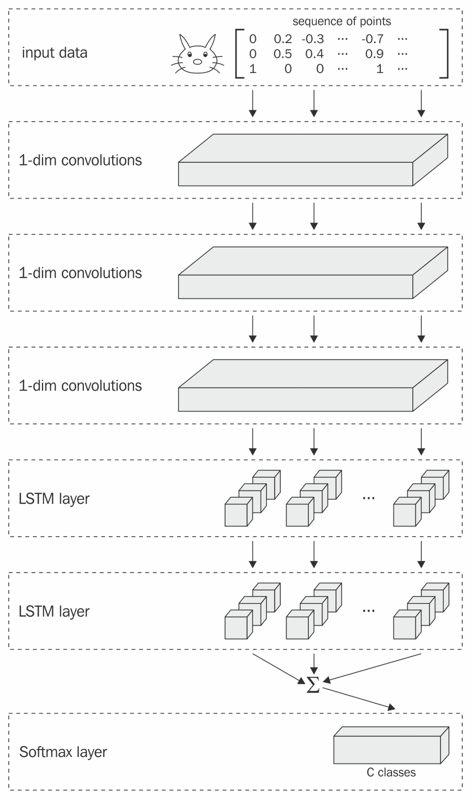
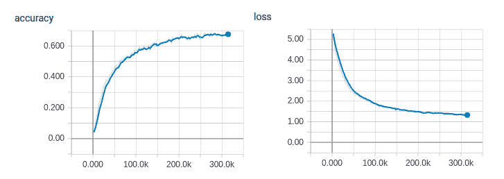
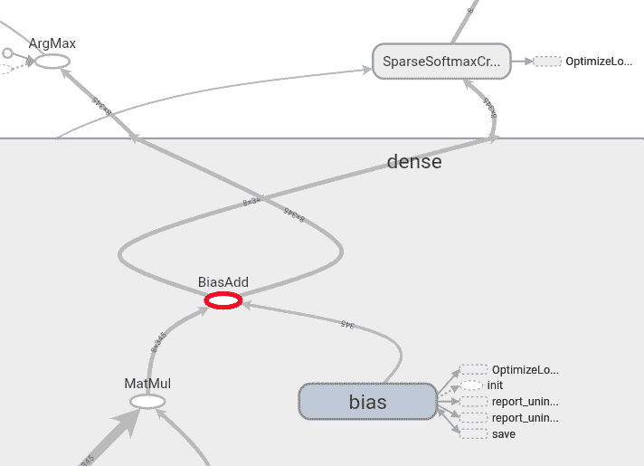
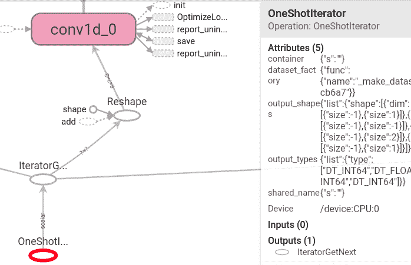
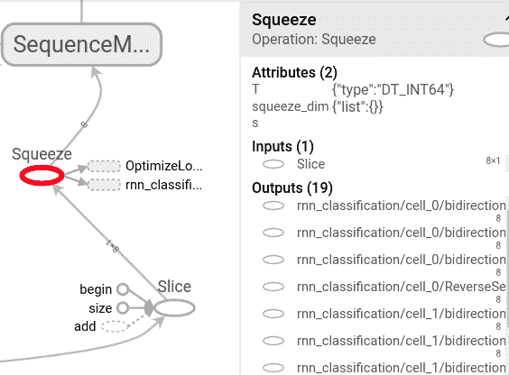
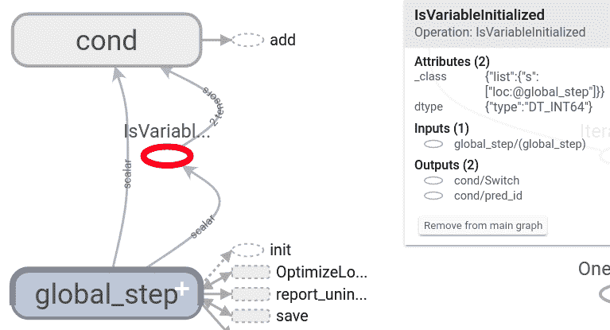
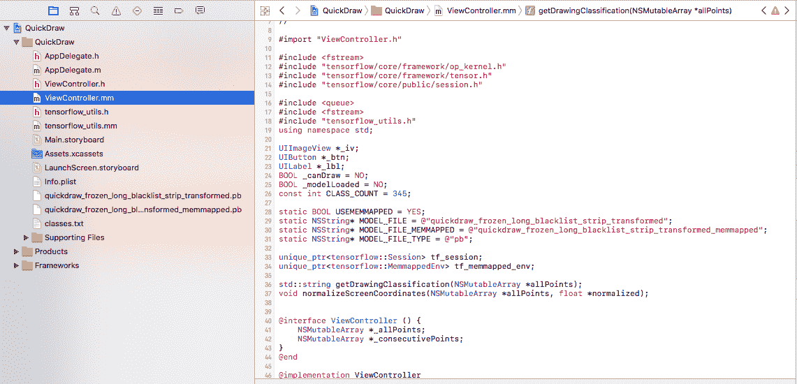
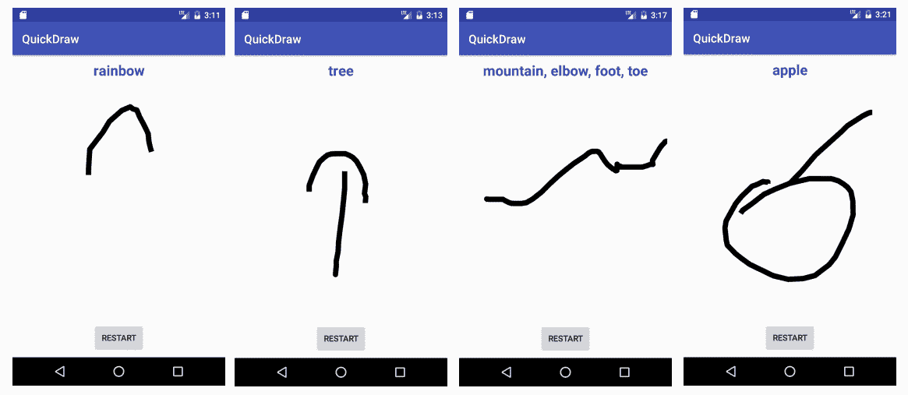

# 使用 CNN 和 LSTM 识别绘画


在上一章中，我们看到了使用深度学习模型的强大功能，该模型将 CNN 与 LSTM RNN 集成在一起以生成图像的自然语言描述。 如果深度学习驱动的 AI 就像新的电力一样，我们当然希望看到这种混合神经网络模型在许多不同领域中的应用。 诸如图像字幕之类的严肃应用与之相反？ 一个有趣的绘画应用，例如 [Quick Draw](https://quickdraw.withgoogle.com)（请参见[这里](https://quickdraw.withgoogle.com/data)了解有趣的示例数据），使用经过训练并基于 345 个类别中的 5000 万张绘画的模型，并将新绘画分类到这些类别中，听起来不错。 还有一个[正式的 TensorFlow 教程](https://www.tensorflow.org/tutorials/recurrent_quickdraw)，该教程介绍了如何构建这样的模型来帮助我们快速入门。

事实证明，在 iOS 和 Android 应用上使用本教程构建的模型的任务提供了一个绝佳的机会：

*   加深我们对找出模型的正确输入和输出节点名称的理解，因此我们可以为移动应用适当地准备模型
*   使用其他方法来修复 iOS 中的新模型加载和推断错误
*   首次为 Android 构建自定义的 TensorFlow 本机库，以修复 Android 中的新模型加载和预测错误
*   查看有关如何使用预期格式的输入来输入 TensorFlow 模型以及如何在 iOS 和 Android 中获取和处理其输出的更多示例

此外，在处理所有繁琐而重要的细节的过程中，以便模型可以像魔术一样工作，以进行漂亮的绘画分类，您将在 iOS 和 Android 设备上享受有趣的涂鸦。

因此，在本章中，我们将介绍以下主题：

*   绘画分类 -- 工作原理
*   训练并准备绘画分类模型
*   在 iOS 中使用绘画分类模型
*   在 Android 中使用绘画分类模型


# 绘画分类 – 工作原理


[TensorFlow 教程](https://www.tensorflow.org/tutorials/recurrent_quickdraw)中内置的绘画分类模型，首先接受表示为点列表的用户绘画输入，并将规范化输入转换为连续点的增量的张量，以及有关每个点是否是新笔画的开始的信息。 然后将张量穿过几个卷积层和 LSTM 层，最后穿过 softmax 层，如图 7.1 所示，以对用户绘画进行分类：



图 7.1：绘画分类模式

与接受 2D 图像输入的 2D 卷积 API `tf.layers.conv2d` 不同，此处将 1D 卷积 API `tf.layers.conv1d`用于时间卷积（例如绘画）。 默认情况下，在绘画分类模型中，使用三个 1D 卷积层，每个层具有 48、64 和 96 个过滤器，其长度分别为 5、5 和 3。 卷积层之后，将创建 3 个 LSTM 层，每层具有 128 个正向`BasicLSTMCell`节点和 128 个反向`BasicLSTMCell`节点，然后将其用于创建动态双向循环神经网络，该网络的输出将发送到最终的完全连接层以计算`logits`（非标准化的对数概率）。

If you don't have a good understanding of all these details, don't worry; to develop powerful mobile apps using a model built by others, you don't have to understand all the details, but in the next chapter we'll also discuss in greater detail how you can build a RNN model from scratch for stock prediction, and with that, you'll have a better understanding of all the RNN stuff.

在前面提到的有趣的教程中详细描述了简单而优雅的模型以及构建模型的 Python 实现，其源代码位于[仓库](https://github.com/tensorflow/models)中。 在继续进行下一部分之前，我们只想说一件事：模型的构建，训练，评估和预测的代码与上一章中看到的代码不同，它使用了称为[`Estimator`](https://www.tensorflow.org/api_docs/python/tf/estimator/Estimator)的 TensorFlow API，或更准确地说，是自定义`Estimator`。 如果您对模型实现的详细信息感兴趣，则应该阅读有关[创建和使用自定义`Estimator`](https://www.tensorflow.org/get_started/custom_estimators)的指南。 [这个页面](https://github.com/tensorflow/models)的`models/samples/core/get_started/custom_estimator.py`上的指南的有用源代码。 基本上，首先要实现一个函数，该函数定义模型，指定损失和准确率度量，设置优化器和`training`操作，然后创建`tf.estimator.Estimator`类的实例并调用其`train`，`evaluate` 和`predict`方法。 就像您将很快看到的那样，使用`Estimator`可以简化如何构建，训练和推断神经网络模型，但是由于它是高级 API，因此它还会执行一些更加困难的低级任务，例如找出输入和输出节点名称来推断移动设备。


# 训练，预测和准备绘画分类模型


训练模型非常简单，但为移动部署准备模型则有些棘手。 在我们开始训练之前，请首先确保您已经在 TensorFlow 根目录中克隆了 [TensorFlow 模型库](https://github.com/tensorflow/models)，就像我们在前两章中所做的一样。 然后从[这里](http://download.tensorflow.org/data/quickdraw_tutorial_dataset_v1.tar.gz)下载绘画分类训练数据集，大约 1.1GB，创建一个名为`rnn_tutorial_data`的新文件夹， 并解压缩`dataset tar.gz`文件。 您将看到 10 个训练 TFRecord 文件和 10 个评估 TFRecord 文件，以及两个带有`.classes`扩展名的文件，它们具有相同的内容，并且只是该数据集可用于分类的 345 个类别的纯文本，例如`"sheep", "skull", "donut", "apple"`。


# 训练绘画分类模型


要训​​练模型，只需打开终端`cd`到`tensorflow/models/tutorials/rnn/quickdraw` ，然后运行以下脚本：

```py
python train_model.py \
  --training_data=rnn_tutorial_data/training.tfrecord-?????-of-????? \
  --eval_data=rnn_tutorial_data/eval.tfrecord-?????-of-????? \
  --model_dir quickdraw_model/ \
  --classes_file=rnn_tutorial_data/training.tfrecord.classes
```

默认情况下，训练步骤为 100k，在我们的 GTX 1070 GPU 上大约需要 6 个小时才能完成训练。 训练完成后，您将在模型目录中看到一个熟悉的文件列表（省略了其他四组`model.ckpt*`文件）：

```py
ls -lt quickdraw_model/
-rw-rw-r-- 1 jeff jeff 164419871 Feb 12 05:56 events.out.tfevents.1518422507.AiLabby
-rw-rw-r-- 1 jeff jeff 1365548 Feb 12 05:56 model.ckpt-100000.meta
-rw-rw-r-- 1 jeff jeff 279 Feb 12 05:56 checkpoint
-rw-rw-r-- 1 jeff jeff 13707200 Feb 12 05:56 model.ckpt-100000.data-00000-of-00001
-rw-rw-r-- 1 jeff jeff 2825 Feb 12 05:56 model.ckpt-100000.index
-rw-rw-r-- 1 jeff jeff 2493402 Feb 12 05:47 graph.pbtxt
drwxr-xr-x 2 jeff jeff 4096 Feb 12 00:11 eval
```

如果您运行`tensorboard --logdir quickdraw_model`，然后从浏览器在`http://localhost:6006`上启动 TensorBoard，您会看到精度达到约 0.55，损失到约 2.0。 如果继续进行约 200k 的训练，则精度将提高到约 0.65，损失将下降到 1.3，如图 7.2 所示：



图 7.2：300k 训练步骤后模型的准确率和损失

现在，我们可以像上一章一样运行`freeze_graph.py`工具，以生成用于移动设备的模型文件。 但是在执行此操作之前，我们首先来看一下如何在 Python 中使用该模型进行推断，例如上一章中的`run_inference.py`脚本。


# 使用绘画分类模型进行预测


看一下`models/tutorial/rnn/quickdraw`文件夹中的`train_model.py`文件。 当它开始运行时，将在`create_estimator_and_specs`函数中创建一个`Estimator`实例：

```py
  estimator = tf.estimator.Estimator(
      model_fn=model_fn,
      config=run_config,
      params=model_params)
```

传递给`Estimator`类的关键参数是名为`model_fn`的模型函数，该函数定义：

*   获取输入张量并创建卷积，RNN 和最终层的函数
*   调用这些函数来构建模型的代码
*   损失，优化器和预测

在返回`tf.estimator.EstimatorSpec`实例之前，`model_fn`函数还具有一个名为`mode`的参数，该参数可以具有以下三个值之一：

*   `tf.estimator.ModeKeys.TRAIN`
*   `tf.estimator.ModeKeys.EVAL`
*   `tf.estimator.ModeKeys.PREDICT`

实现`train_model.py`的方式支持训练和求值模式，但是您不能直接使用它来通过特定的绘画输入进行推理（对绘画进行分类）。 要使用特定输入来测试预测，请按照以下步骤操作：

1.  复制`train_model.py`，然后将新文件重命名为`predict.py`-这样您就可以更自由地进行预测了。
2.  在`predict.py`中，定义[预测]的输入函数，并将`features`设置为模型期望的绘画输入（连续点的增量，其中第三个数字表示该点是否为笔划的起点） ：

```py
def predict_input_fn():
    def _input_fn():

        features = {'shape': [[16, 3]], 'ink': [[
             -0.23137257, 0.31067961, 0\. , 
             -0.05490196, 0.1116505 , 0\. , 
             0.00784314, 0.09223297, 0\. , 
             0.19215687, 0.07766992, 0\. , 
             ...
             0.12156862, 0.05825245, 0\. ,
             0\. , -0.06310678, 1\. , 
             0\. , 0., 0\. , 
             ...
             0\. , 0., 0\. , 
        ]]}
        features['shape'].append( features['shape'][0])
        features['ink'].append( features['ink'][0])
        features=dict(features)

        dataset = tf.data.Dataset.from_tensor_slices(features)
        dataset = dataset.batch(FLAGS.batch_size)

        return dataset.make_one_shot_iterator().get_next()

    return _input_fn
```

我们并没有显示所有的点值，但它们是使用 TensorFlow RNN 用于绘画分类的教程中显示的示例猫示例数据创建的，并应用了`parse_line`函数（请参见教程或`models/tutorials/rnn/quickdraw`文件夹中的`create_dataset.py` 细节）。

还要注意，我们使用`tf.data.Dataset`的`make_one_shot_iterator`方法创建了一个迭代器，该迭代器从数据集中返回一个示例（在这种情况下，我们在数据集中只有一个示例），与模型在处理大型数据集时，在训练和评估过程中获取数据的方式相同–这就是为什么稍后在模型的图中看到`OneShotIterator`操作的原因。

3.  在主函数中，调用估计器的`predict`方法，该方法将生成给定特征的预测，然后打印下一个预测：

```py
  predictions = estimator.predict(input_fn=predict_input_fn())
  print(next(predictions)['argmax'])
```

4.  在`model_fn`函数中，在`logits = _add_fc_layers(final_state)`之后，添加以下代码：

```py
  argmax = tf.argmax(logits, axis=1)

  if mode == tf.estimator.ModeKeys.PREDICT:
    predictions = {
      'argmax': argmax,
      'softmax': tf.nn.softmax(logits),
      'logits': logits,
    }

    return tf.estimator.EstimatorSpec(mode, predictions=predictions)
```

现在，如果您运行`predict.py`，您将在步骤 2 中获得具有输入数据返回最大值的类 ID。

基本了解如何使用`Estimator`高级 API 构建的模型进行预测后，我们现在就可以冻结该模型，以便可以在移动设备上使用该模型，这需要我们首先弄清楚输出节点名称应该是什么。


# 准备绘画分类模型


让我们使用 TensorBoard 看看我们能找到什么。 在我们模型的 TensorBoard 视图的 GRAPHS 部分中，您可以看到，如图 7.3 所示，以红色突出显示的`BiasAdd`节点是`ArgMax`操作的输入，用于计算精度，以及 softmax 操作的输入。 我们可以使用`SparseSoftmaxCrossEntropyWithLogits`（图 7.3 仅显示为`SparseSiftnaxCr ...`）操作，也可以仅使用`Dense`/`BiasAdd`作为输出节点名称，但我们将`ArgMax`和`Dense`/`BiasAdd`用作`freeze_graph`工具的两个输出节点名称，因此我们可以更轻松地查看最终密集层的输出以及`ArgMax`结果：



图 7.3：显示模型的可能输出节点名称

用您的`graph.pbtxt`文件的路径和最新的模型检查点前缀替换`--input_graph`和`--input_checkpoint`值后，在 TensorFlow 根目录中运行以下脚本以获取冻结的图：

```py
python tensorflow/python/tools/freeze_graph.py  --input_graph=/tmp/graph.pbtxt --input_checkpoint=/tmp/model.ckpt-314576 --output_graph=/tmp/quickdraw_frozen_dense_biasadd_argmax.pb --output_node_names="dense/BiasAdd,ArgMax"
```

您会看到`quickdraw_frozen_dense_biasadd_argmax.pb`成功创建。 但是，如果您尝试在 iOS 或 Android 应用中加载模型，则会收到一条错误消息，内容为`Could not create TensorFlow Graph: Not found: Op type not registered 'OneShotIterator' in binary. Make sure the Op and Kernel are registered in the binary running in this process.`

我们在前面的小节中讨论了`OneShotIterator`的含义。 回到 TensorBoard `GRAPHS`部分，我们可以看到`OneShotIterator`（如图 7.4 所示），该区域以红色突出显示，并且还显示在右下方的信息面板中，在图表的底部，以及上方的几个层次中，有一个 `Reshape`操作用作第一卷积层的输入：



图 7.4：查找可能的输入节点名称

您可能想知道为什么我们不能使用我们之前使用的技术来解决`Not found: Op type not registered 'OneShotIterator'`错误，即先使用命令`grep 'REGISTER.*"OneShotIterator"' tensorflow/core/ops/*.cc`（您将看到输出为`tensorflow/core/ops/dataset_ops.cc:REGISTER_OP("OneShotIterator")`），然后将`tensorflow/core/ops/dataset_ops.cc`添加到`tf_op_files.txt`并重建 TensorFlow 库。 即使这可行，也会使解决方案复杂化，因为现在我们需要向模型提供一些与`OneShotIterator`相关的数据，而不是以点为单位的直接用户绘画。

此外，在右侧上方一层（图 7.5），还有另一种操作 `Squeeze` ，它是 `rnn_classification` 子图的输入：



图 7.5：找出输入节点名称的进一步研究

我们不必担心`Reshape`右侧的`Shape`运算，因为它实际上是`rnn_classification`子图的输出。 因此，所有这些研究背后的直觉是，我们可以使用`Reshape`和`Squeeze`作为两个输入节点，然后使用在上一章中看到的`transform_graph` 工具，我们应该能够删除 `Reshape`和`Squeeze`以下的节点，包括`OneShotIterator`。

现在在 TensorFlow 根目录中运行以下命令：

```py
bazel-bin/tensorflow/tools/graph_transforms/transform_graph --in_graph=/tmp/quickdraw_frozen_dense_biasadd_argmax.pb --out_graph=/tmp/quickdraw_frozen_strip_transformed.pb --inputs="Reshape,Squeeze" --outputs="dense/BiasAdd,ArgMax" --transforms='
strip_unused_nodes(name=Squeeze,type_for_name=int64,shape_for_name="8",name=Reshape,type_for_name=float,shape_for_name="8,16,3")' 
```

在这里，我们为`strip_unused_nodes`使用了更高级的格式：对于每个输入节点名称（`Squeeze`和`Reshape`），我们指定其特定的类型和形状，以避免以后出现模型加载错误。 有关`transform_graph`工具的`strip_unused_nodes`的更多详细信息，请参见其[上的文档 https://github.com/tensorflow/tensorflow/tree/master/tensorflow/tools/graph_transforms](https://github.com/tensorflow/tensorflow/tree/master/tensorflow/tools/graph_transforms) 。

现在在 iOS 或 Android 中加载模型，`OneShotIterator`错误将消失。 但是，您可能已经学会了预期，但是会出现一个新错误：`Could not create TensorFlow Graph: Invalid argument: Input 0 of node IsVariableInitialized was passed int64 from global_step:0 incompatible with expected int64_ref.`

我们首先需要了解有关`IsVariableInitialized`的更多信息。 如果我们回到 TensorBoard `GRAPHS`标签，我们会在左侧看到一个`IsVariableInitialized`操作，该操作以红色突出显示并在右侧的信息面板中以`global_step`作为其输入（图 7.6）。

即使我们不确切知道它的用途，我们也可以确保它与模型推断无关，该模型推断只需要一些输入（图 7.4 和图 7.5）并生成绘画分类作为输出（图 7.3）。 ：



图 7.6：查找导致模型加载错误但与模型推断无关的节点

那么，如何摆脱`global_step`以及其他相关的`cond`节点，由于它们的隔离性，它们不会被变换图工具剥离掉？ 幸运的是，`freeze_graph`脚本支持这一点 – [仅在其源代码中记录](https://github.com/tensorflow/tensorflow/blob/master/tensorflow/python/tools/freeze_graph.py)。 我们可以为脚本使用`variable_names_blacklist`参数来指定应在冻结模型中删除的节点：

```py
python tensorflow/python/tools/freeze_graph.py --input_graph=/tmp/graph.pbtxt --input_checkpoint=/tmp/model.ckpt-314576 --output_graph=/tmp/quickdraw_frozen_long_blacklist.pb --output_node_names="dense/BiasAdd,ArgMax" --variable_names_blacklist="IsVariableInitialized,global_step,global_step/Initializer/zeros,cond/pred_id,cond/read/Switch,cond/read,cond/Switch_1,cond/Merge"
```

在这里，我们只列出`global_step`和`cond`范围内的节点。 现在再次运行`transform_graph`工具：

```py
bazel-bin/tensorflow/tools/graph_transforms/transform_graph --in_graph=/tmp/quickdraw_frozen_long_blacklist.pb --out_graph=/tmp/quickdraw_frozen_long_blacklist_strip_transformed.pb --inputs="Reshape,Squeeze" --outputs="dense/BiasAdd,ArgMax" --transforms='
strip_unused_nodes(name=Squeeze,type_for_name=int64,shape_for_name="8",name=Reshape,type_for_name=float,shape_for_name="8,16,3")' 
```

在 iOS 或 Android 中加载生成的模型文件`quickdraw_frozen_long_blacklist_strip_transformed.pb`，您将不再看到  `IsVariableInitialized`错误。 当然，在 iOS 和 Android 上，您还会看到另一个错误。 加载先前的模型将导致此错误：

```py
Couldn't load model: Invalid argument: No OpKernel was registered to support Op 'RefSwitch' with these attrs. Registered devices: [CPU], Registered kernels:
 device='GPU'; T in [DT_FLOAT]
 device='GPU'; T in [DT_INT32]
 device='GPU'; T in [DT_BOOL]
 device='GPU'; T in [DT_STRING]
 device='CPU'; T in [DT_INT32]
 device='CPU'; T in [DT_FLOAT]
 device='CPU'; T in [DT_BOOL]

[[Node: cond/read/Switch = RefSwitch[T=DT_INT64, _class=["loc:@global_step"], _output_shapes=[[], []]](global_step, cond/pred_id)]]
```

要解决此错误，我们必须以不同的方式为 iOS 和 Android 构建自定义的 TensorFlow 库。 在下面的 iOS 和 Android 部分中讨论如何执行此操作之前，让我们首先做一件事：将模型转换为映射版本，以便在 iOS 中更快地加载并使用更少的内存：

```py
bazel-bin/tensorflow/contrib/util/convert_graphdef_memmapped_format \
--in_graph=/tmp/quickdraw_frozen_long_blacklist_strip_transformed.pb \
--out_graph=/tmp/quickdraw_frozen_long_blacklist_strip_transformed_memmapped.pb
```


# 在 iOS 中使用绘画分类模型


要解决以前的 RefSwitch 错误，无论您是否像在第 2 章，“通过迁移学习对图像分类”和第 6 章，“用自然语言描述图像”或手动构建的 TensorFlow 库，就像在其他章节中一样，我们必须使用一些新技巧。 发生错误的原因是`RefSwitch`操作需要`INT64`数据类型，但它不是 TensorFlow 库中内置的已注册数据类型之一，因为默认情况下，要使该库尽可能小，仅包括每个操作的共同数据类型。 我们可能会从 Python 的模型构建端修复此问题，但是在这里，我们仅向您展示如何从 iOS 端修复此问题，当您无权访问源代码来构建模型时，这很有用。


# 为 iOS 构建自定义的 TensorFlow 库


从`tensorflow/contrib/makefile/Makefile`打开 Makefile，然后，如果您使用 TensorFlow 1.4，则搜索`IOS_ARCH`。 对于每种架构（总共 5 种：ARMV7，ARMV7S，ARM64，I386，X86_64），将`-D__ANDROID_TYPES_SLIM__` 更改为
`-D__ANDROID_TYPES_FULL__`。 TensorFlow 1.5（或 1.6/1.7）中的`Makefile`稍有不同，尽管它仍位于同一文件夹中。 对于 1.5/1.6/1.7，搜索`ANDROID_TYPES_SLIM`并将其更改为 `ANDROID_TYPES_FULL`。 现在，通过运行`tensorflow/contrib/makefile/build_all_ios.sh`重建 TensorFlow 库。 此后，在加载模型文件时，`RefSwitch`错误将消失。 使用 TensorFlow 库构建并具有完整数据类型支持的应用大小约为 70MB，而使用默认的细长数据类型构建的应用大小为 37MB。

好像还不够，仍然发生另一个模型加载错误：

`Could not create TensorFlow Graph: Invalid argument: No OpKernel was registered to support Op 'RandomUniform' with these attrs. Registered devices: [CPU], Registered kernels: <no registered kernels>.`

幸运的是，如果您已经阅读了前面的章节，那么您应该非常熟悉如何解决这种错误。 快速回顾一下：首先找出哪些操作和内核文件定义并实现了该操作，然后检查`tf_op_files.txt`文件中是否包含操作或内核文件，并且应该至少缺少一个文件，从而导致错误 ; 现在只需将操作或内核文件添加到`tf_op_files.txt`并重建库。 在我们的情况下，运行以下命令：

```py
grep RandomUniform tensorflow/core/ops/*.cc
grep RandomUniform tensorflow/core/kernels/*.cc
```

您将看到这些文件作为输出：

```py
tensorflow/core/ops/random_grad.cc
tensorflow/core/ops/random_ops.cc:
tensorflow/core/kernels/random_op.cc
```

`tensorflow/contrib/makefile/tf_op_files.txt`文件只有前两个文件，因此只需将最后一个`tensorflow/core/kernels/random_op.cc`添加到 `tf_op_files.txt`的末尾，然后再次运行`tensorflow/contrib/makefile/build_all_ios.sh`。

最终，在加载模型时所有错误都消失了，我们可以通过实现应用逻辑来处理用户绘画，将点转换为模型期望的格式并返回分类结果，从而开始获得一些真正的乐趣。


# 开发 iOS 应用来使用模型


让我们使用 Objective-C 创建一个新的 Xcode 项目，然后从上一章中创建的`Image2Text` iOS 项目中拖放`tensorflow_util.h`和`tensorflow_util.mm`文件。 另外，将两个模型文件`quickdraw_frozen_long_blacklist_strip_transformed.pb`和`quickdraw_frozen_long_blacklist_strip_transformed_memmapped.pb`以及`training.tfrecord.classes`文件从 `models/tutorials/rnn/quickdraw/rnn_tutorial_data`拖放到`QuickDraw`项目，然后将`training.tfrecord.classes`重命名为`classes.txt`。

还将`ViewController.m`重命名为`ViewController.mm`，并在`tensorflow_util.h`中注释`GetTopN`函数定义，并在`tensorflow_util.mm`中注释其实现，因为我们将在`ViewController.mm`中实现修改后的版本。 您的项目现在应如图 7.7 所示：



图 7.7：显示带有`ViewController`初始内容的`QuickDraw` Xcode 项目。

我们现在准备单独处理`ViewController.mm`，以完成我们的任务。

1.  在按图 7.6 设置基本常量和变量以及两个函数原型之后，在`ViewController`的`viewDidLoad`中实例化`UIButton`，`UILabel`和`UIImageView`。 每个 UI 控件都设置有多个`NSLayoutConstraint`（有关完整的代码列表，请参见源代码仓库）。 `UIImageView`的相关代码如下：

```py
_iv = [[UIImageView alloc] init];
_iv.contentMode = UIViewContentModeScaleAspectFit;
[_iv setTranslatesAutoresizingMaskIntoConstraints:NO];
[self.view addSubview:_iv];
```

`UIImageView`将用于显示通过`UIBezierPath`实现的用户绘画。 同样，初始化两个用于保存每个连续点和用户绘制的所有点的数组：

```py
_allPoints = [NSMutableArray array];
_consecutivePoints = [NSMutableArray array];
```

2.  点击具有初始标题“开始”的按钮后，用户可以开始绘画； 按钮标题更改为“重新启动”，并进行了其他一些重置：

```py
- (IBAction)btnTapped:(id)sender {
    _canDraw = YES;
    [_btn setTitle:@"Restart" forState:UIControlStateNormal];
    [_lbl setText:@""];
    _iv.image = [UIImage imageNamed:@""];
    [_allPoints removeAllObjects];
}
```

3.  为了处理用户绘画，我们首先实现`touchesBegan`方法：

```py
- (void) touchesBegan:(NSSet *)touches withEvent:(UIEvent *)event {
    if (!_canDraw) return;
    [_consecutivePoints removeAllObjects];
    UITouch *touch = [touches anyObject];
    CGPoint point = [touch locationInView:self.view];
    [_consecutivePoints addObject:[NSValue valueWithCGPoint:point]];
    _iv.image = [self createDrawingImageInRect:_iv.frame];
}
```

然后是`touchesMoved`方法：

```py
- (void) touchesMoved:(NSSet *)touches withEvent:(UIEvent *)event {
    if (!_canDraw) return;
    UITouch *touch = [touches anyObject];
    CGPoint point = [touch locationInView:self.view];
    [_consecutivePoints addObject:[NSValue valueWithCGPoint:point]];
    _iv.image = [self createDrawingImageInRect:_iv.frame];
}
```

最后是`touchesEnd`方法：

```py
- (void) touchesEnded:(NSSet *)touches withEvent:(UIEvent *)event {
    if (!_canDraw) return;
    UITouch *touch = [touches anyObject];
    CGPoint point = [touch locationInView:self.view];
    [_consecutivePoints addObject:[NSValue valueWithCGPoint:point]];
    [_allPoints addObject:[NSArray arrayWithArray:_consecutivePoints]];
    [_consecutivePoints removeAllObjects];
    _iv.image = [self createDrawingImageInRect:_iv.frame];

    dispatch_async(dispatch_get_global_queue(0, 0), ^{
        std::string classes = getDrawingClassification(_allPoints);
        dispatch_async(dispatch_get_main_queue(), ^{
            NSString *c = [NSString stringWithCString:classes.c_str() encoding:[NSString defaultCStringEncoding]];
            [_lbl setText:c];
        });
    });
}
```

这里的代码很容易解释，除了`createDrawingImageInRect`和`getDrawingClassification`这两种方法外，我们将在后面介绍。

4.  方法 `createDrawingImageInRect`使用`UIBezierPath's` `moveToPoint`和`addLineToPoint`方法显示用户绘画。 它首先通过触摸事件准备所有完成的笔划，并将所有点存储在`_allPoints`数组中：

```py
- (UIImage *)createDrawingImageInRect:(CGRect)rect
{
    UIGraphicsBeginImageContextWithOptions(CGSizeMake(rect.size.width, rect.size.height), NO, 0.0);
    UIBezierPath *path = [UIBezierPath bezierPath];

    for (NSArray *cp in _allPoints) {
        bool firstPoint = TRUE;
        for (NSValue *pointVal in cp) {
            CGPoint point = pointVal.CGPointValue;
            if (firstPoint) {
                [path moveToPoint:point];
                firstPoint = FALSE;
            }
            else
                [path addLineToPoint:point];
        }
    }
```

然后，它准备当前正在进行的笔划中的所有点，并存储在`_consecutivePoints`中：

```py
    bool firstPoint = TRUE;
    for (NSValue *pointVal in _consecutivePoints) {
        CGPoint point = pointVal.CGPointValue;
        if (firstPoint) {
            [path moveToPoint:point];
            firstPoint = FALSE;
        }
        else
            [path addLineToPoint:point];
    }
```

最后，它执行实际绘画，并将绘画作为`UIImage`返回，以显示在`UIImageView`中：

```py
    path.lineWidth = 6.0;
    [[UIColor blackColor] setStroke];
    [path stroke];

    UIImage *image = UIGraphicsGetImageFromCurrentImageContext();
    UIGraphicsEndImageContext();
    return image;
}
```

5.  `getDrawingClassification`首先使用与上一章相同的代码来加载模型或其映射版本：

```py
std::string getDrawingClassification(NSMutableArray *allPoints) {
    if (!_modelLoaded) {
        tensorflow::Status load_status;

        if (USEMEMMAPPED) {
            load_status = LoadMemoryMappedModel(MODEL_FILE_MEMMAPPED, MODEL_FILE_TYPE, &tf_session, &tf_memmapped_env);
        }
        else {
            load_status = LoadModel(MODEL_FILE, MODEL_FILE_TYPE, &tf_session);
        }

        if (!load_status.ok()) {
            LOG(FATAL) << "Couldn't load model: " << load_status;
            return "";
        }
        _modelLoaded = YES;
    }
```

然后，它获得总点数并分配一个浮点数数组，然后调用另一个函数`normalizeScreenCoordinates`（稍后将介绍）将点转换为模型期望的格式：

```py
    if ([allPoints count] == 0) return "";
    int total_points = 0;
    for (NSArray *cp in allPoints) {
        total_points += cp.count;
    }

    float *normalized_points = new float[total_points * 3]; 
    normalizeScreenCoordinates(allPoints, normalized_points);
```

接下来，我们定义输入和输出节点名称，并创建一个包含总点数的张量：

```py
    std::string input_name1 = "Reshape";
    std::string input_name2 = "Squeeze";
    std::string output_name1 = "dense/BiasAdd";
    std::string output_name2 = "ArgMax"
    const int BATCH_SIZE = 8;

    tensorflow::Tensor seqlen_tensor(tensorflow::DT_INT64, tensorflow::TensorShape({BATCH_SIZE}));
    auto seqlen_mapped = seqlen_tensor.tensor<int64_t, 1>();
    int64_t* seqlen_mapped_data = seqlen_mapped.data();
    for (int i=0; i<BATCH_SIZE; i++) {
        seqlen_mapped_data[i] = total_points;
    }
```

请注意，在运行`train_model.py`来训练模型时，我们必须使用与`BATCH_SIZE`相同的`BATCH_SIZE`，默认情况下为 8。

保存所有转换点值的另一个张量在这里创建：

```py
    tensorflow::Tensor points_tensor(tensorflow::DT_FLOAT, tensorflow::TensorShape({8, total_points, 3}));
    auto points_tensor_mapped = points_tensor.tensor<float, 3>();
    float* out = points_tensor_mapped.data();
    for (int i=0; i<BATCH_SIZE; i++) {
        for (int j=0; j<total_points*3; j++)
            out[i*total_points*3+j] = normalized_points[j];
    }
```

6.  现在，我们运行模型并获得预期的输出：

```py
    std::vector<tensorflow::Tensor> outputs;

    tensorflow::Status run_status = tf_session->Run({{input_name1, points_tensor}, {input_name2, seqlen_tensor}}, {output_name1, output_name2}, {}, &outputs);
    if (!run_status.ok()) {
        LOG(ERROR) << "Getting model failed:" << run_status;
        return "";
    }

    tensorflow::string status_string = run_status.ToString();
    tensorflow::Tensor* logits_tensor = &outputs[0];
```

7.  使用修改后的`GetTopN`版本并解析`logits`获得最佳结果：

```py
    const int kNumResults = 5;
    const float kThreshold = 0.1f;
    std::vector<std::pair<float, int> > top_results;
    const Eigen::TensorMap<Eigen::Tensor<float, 1, Eigen::RowMajor>, Eigen::Aligned>& logits = logits_tensor->flat<float>();

    GetTopN(logits, kNumResults, kThreshold, &top_results);
    string result = "";
    for (int i=0; i<top_results.size(); i++) {
        std::pair<float, int> r = top_results[i];
        if (result == "")
            result = classes[r.second];
        else result += ", " + classes[r.second];
    }
```

8.  通过将`logits`值转换为 softmax 值来更改`GetTopN`，然后返回顶部 softmax 值及其位置：

```py
    float sum = 0.0;
    for (int i = 0; i < CLASS_COUNT; ++i) {
        sum += expf(prediction(i));
    }

    for (int i = 0; i < CLASS_COUNT; ++i) {
        const float value = expf(prediction(i)) / sum;
        if (value < threshold) {
            continue;
        }
        top_result_pq.push(std::pair<float, int>(value, i));

        if (top_result_pq.size() > num_results) {
            top_result_pq.pop();
        }
    }
```

9.  最后，`normalizeScreenCoordinates`函数将其在触摸事件中捕获的屏幕坐标中的所有点转换为增量差异 – 这几乎是[这个页面](https://github.com/tensorflow/models/blob/master/tutorials/rnn/quickdraw/create_dataset.py)中的 Python 方法`parse_line`的一部分：

```py
void normalizeScreenCoordinates(NSMutableArray *allPoints, float *normalized) {
    float lowerx=MAXFLOAT, lowery=MAXFLOAT, upperx=-MAXFLOAT, uppery=-MAXFLOAT;
    for (NSArray *cp in allPoints) {
        for (NSValue *pointVal in cp) {
            CGPoint point = pointVal.CGPointValue;
            if (point.x < lowerx) lowerx = point.x;
            if (point.y < lowery) lowery = point.y;
            if (point.x > upperx) upperx = point.x;
            if (point.y > uppery) uppery = point.y;
        }
    }
    float scalex = upperx - lowerx;
    float scaley = uppery - lowery;

    int n = 0;
    for (NSArray *cp in allPoints) {
        int m=0;
        for (NSValue *pointVal in cp) {
            CGPoint point = pointVal.CGPointValue;
            normalized[n*3] = (point.x - lowerx) / scalex;
            normalized[n*3+1] = (point.y - lowery) / scaley;
            normalized[n*3+2] = (m ==cp.count-1 ? 1 : 0);
            n++; m++;
        }
    }

    for (int i=0; i<n-1; i++) {
        normalized[i*3] = normalized[(i+1)*3] - normalized[i*3];
        normalized[i*3+1] = normalized[(i+1)*3+1] - normalized[i*3+1];
        normalized[i*3+2] = normalized[(i+1)*3+2];
    }
}
```

现在，您可以在 iOS 模拟器或设备中运行该应用，开始绘画，并查看模型认为您正在绘画的内容。 图 7.8 显示了一些绘画和分类结果–不是最佳绘画，而是整个过程！


图 7.8：在 iOS 上显示绘画和分类结果


# 在 Android 中使用绘画分类模型


现在该看看我们如何在 Android 中加载和使用该模型。 在之前的章节中，我们通过使用 Android 应用的`build.gradle`文件并添加了一行 `compile 'org.tensorflow:tensorflow-android:+'`仅添加了 TensorFlow 支持。 与 iOS 相比，我们必须构建一个自定义的 TensorFlow 库来修复不同的模型加载或运行错误（例如，在第 3 章，“检测对象及其位置”中，第四章，“变换具有惊人艺术风格的图片”和第五章，“了解简单的语音命令”），Android 的默认 TensorFlow 库对注册的操作和数据类型有更好的支持，这可能是因为 Android 是 Google 的一等公民，而 iOS 是第二名，甚至是第二名。

事实是，当我们处理各种惊人的模型时，我们不得不面对不可避免的问题只是时间问题：我们必须手动为 Android 构建 TensorFlow 库，以修复默认 TensorFlow 库中的一些根本无法应对的错误。 `No OpKernel was registered to support Op 'RefSwitch' with these attrs.`错误就是这样的错误之一。 对于乐观的开发人员来说，这仅意味着另一种向您的技能组合中添加新技巧的机会。


# 为 Android 构建自定义 TensorFlow 库


请按照以下步骤手动为 Android 构建自定义的 TensorFlow 库：

1.  在您的 TensorFlow 根目录中，有一个名为`WORKSPACE`的文件。 编辑它，并使`android_sdk_repository`和`android_ndk_repository`看起来像以下设置（用您自己的设置替换`build_tools_version`以及 SDK 和 NDK 路径）：

```py
android_sdk_repository(
    name = "androidsdk",
    api_level = 23,
    build_tools_version = "26.0.1",
    path = "$HOME/Library/Android/sdk",
)

android_ndk_repository(
    name="androidndk",
    path="$HOME/Downloads/android-ndk-r15c",
    api_level=14)
```

2.  如果您还使用过本书中的 iOS 应用，并且已将`tensorflow/core/platform/default/mutex.h`从`#include "nsync_cv.h"`和`#include "nsync_mu.h"`更改为`#include "nsync/public/nsync_cv.h"`和`#include "nsync/public/nsync_mu.h"`，请参见第 3 章， “检测对象及其位置” 时，您需要将其更改回以成功构建 TensorFlow Android 库（此后，当您使用手动构建的 TensorFlow 库在 Xcode 和 iOS 应用上工作时，需要先添加`nsync/public` 这两个标头。

Changing `tensorflow/core/platform/default/mutex.h` back and forth certainly is not an ideal solution. It's supposed to be just as a workaround. As it only needs to be changed when you start using a manually built TensorFlow iOS library or when you build a custom TensorFlow library, we can live with it for now.

3.  如果您具有支持 x86 CPU 的虚拟模拟器或 Android 设备，请运行以下命令来构建本机 TensorFlow 库：

```py
bazel build -c opt --copt="-D__ANDROID_TYPES_FULL__" //tensorflow/contrib/android:libtensorflow_inference.so \
   --crosstool_top=//external:android/crosstool \
   --host_crosstool_top=@bazel_tools//tools/cpp:toolchain \
   --cpu=x86_64
```

如果您的 Android 设备像大多数 Android 设备一样支持 armeabi-v7a，请运行以下命令：

```py
bazel build -c opt --copt="-D__ANDROID_TYPES_FULL__" //tensorflow/contrib/android:libtensorflow_inference.so \
   --crosstool_top=//external:android/crosstool \
   --host_crosstool_top=@bazel_tools//tools/cpp:toolchain \
   --cpu=armeabi-v7a
```

在 Android 应用中使用手动构建的本机库时，您需要让该应用知道该库是针对哪个 CPU 指令集（也称为**应用二进制接口**（**ABI**））构建的。 Android 支持两种主要的 ABI：ARM 和 X86，而`armeabi-v7a`是 Android 上最受欢迎的 ABI。 要找出您的设备或仿真器使用的是哪个 ABI，请运行`adb -s <device_id> shell getprop ro.product.cpu.abi`。 例如，此命令为我的 Nexus 7 平板电脑返回`armeabi-v7a`，为我的模拟器返回`x86_64`。

如果您具有支持 x86_64 的虚拟仿真器以在开发过程中进行快速测试，并且在设备上进行最终性能测试，则可能要同时构建两者。

构建完成后，您将在`bazel-bin/tensorflow/contrib/android`文件夹中看到 TensorFlow 本机库文件`libtensorflow_inference.so`。 将其拖到`android/app/src/main/jniLibs/armeabi-v7a`或 `android/app/src/main/jniLibs/x86_64`的`app`文件夹中，如图 7.9 所示：


图 7.9：显示 TensorFlow 本机库文件

4.  通过运行以下命令构建 TensorFlow 本机库的 Java 接口：

```py
bazel build //tensorflow/contrib/android:android_tensorflow_inference_java
```

这将在`bazel-bin/tensorflow/contrib/android`处生成文件`libandroid_tensorflow_inference_java.jar`。 将文件移动到 `android/app/lib`文件夹，如图 7.10 所示：


图 7.10：将 Java 接口文件显示到 TensorFlow 库

现在，我们准备在 Android 中编码和测试模型。


# 开发一个 Android 应用来使用该模型


请按照以下步骤使用 TensorFlow 库和我们先前构建的模型创建一个新的 Android 应用：

1.  在 Android Studio 中，创建一个名为 QuickDraw 的新 Android 应用，接受所有默认设置。 然后在应用的`build.gradle`中，将`compile files('libs/libandroid_tensorflow_inference_java.jar')`添加到依赖项的末尾。 像以前一样创建一个新的`assets`文件夹，并将`quickdraw_frozen_long_blacklist_strip_transformed.pb`和`classes.txt`拖放到该文件夹​​中。
2.  创建一个名为`QuickDrawView`的新 Java 类，该类扩展了`View`，并如下设置字段及其构造器：

```py
public class QuickDrawView extends View {
    private Path mPath;
    private Paint mPaint, mCanvasPaint;
    private Canvas mCanvas;
    private Bitmap mBitmap;
    private MainActivity mActivity;
    private List<List<Pair<Float, Float>>> mAllPoints = new ArrayList<List<Pair<Float, Float>>>();
    private List<Pair<Float, Float>> mConsecutivePoints = new ArrayList<Pair<Float, Float>>();

    public QuickDrawView(Context context, AttributeSet attrs) {
        super(context, attrs);
        mActivity = (MainActivity) context;
        setPathPaint();
    }
```

`mAllPoints`用于保存`mConsecutivePoints`的列表。 `QuickDrawView`用于主要活动的布局中，以显示用户的绘画。

3.  如下定义`setPathPaint`方法：

```py
    private void setPathPaint() {
        mPath = new Path();
        mPaint = new Paint();
        mPaint.setColor(0xFF000000);
        mPaint.setAntiAlias(true);
        mPaint.setStrokeWidth(18);
        mPaint.setStyle(Paint.Style.STROKE);
        mPaint.setStrokeJoin(Paint.Join.ROUND);
        mCanvasPaint = new Paint(Paint.DITHER_FLAG);
    }
```

添加两个实例化`Bitmap`和`Canvas`对象并向用户显示在画布上绘画的重写方法：

```py
@Override protected void onSizeChanged(int w, int h, int oldw, int oldh) {
    super.onSizeChanged(w, h, oldw, oldh);
    mBitmap = Bitmap.createBitmap(w, h, Bitmap.Config.ARGB_8888);
    mCanvas = new Canvas(mBitmap);
}

@Override protected void onDraw(Canvas canvas) {
    canvas.drawBitmap(mBitmap, 0, 0, mCanvasPaint);
    canvas.drawPath(mPath, mPaint);
}
```

4.  覆盖方法`onTouchEvent`用于填充`mConsecutivePoints`和`mAllPoints`，调用画布的`drawPath`方法，使图无效（以调用`onDraw`方法），以及（每次使用`MotionEvent.ACTION_UP`完成笔划线），以启动一个新线程以使用模型对绘画进行分类：

```py
    @Override
    public boolean onTouchEvent(MotionEvent event) {
        if (!mActivity.canDraw()) return true;
        float x = event.getX();
        float y = event.getY();
        switch (event.getAction()) {
            case MotionEvent.ACTION_DOWN:
                mConsecutivePoints.clear();
                mConsecutivePoints.add(new Pair(x, y));
                mPath.moveTo(x, y);
                break;
            case MotionEvent.ACTION_MOVE:
                mConsecutivePoints.add(new Pair(x, y));
                mPath.lineTo(x, y);
                break;
            case MotionEvent.ACTION_UP:
                mConsecutivePoints.add(new Pair(x, y));
                mAllPoints.add(new ArrayList<Pair<Float, Float>>
                (mConsecutivePoints));
                mCanvas.drawPath(mPath, mPaint);
                mPath.reset();
                Thread thread = new Thread(mActivity);
                thread.start();
                break;
            default:
                return false;
        }
        invalidate();
        return true;
    }
```

5.  定义两个将由`MainActivity`调用的公共方法，以获取所有点并在用户点击重新启动按钮后重置绘画：

```py
    public List<List<Pair<Float, Float>>> getAllPoints() {
        return mAllPoints;
    }

    public void clearAllPointsAndRedraw() {
        mBitmap = Bitmap.createBitmap(mBitmap.getWidth(),   
        mBitmap.getHeight(), Bitmap.Config.ARGB_8888);
        mCanvas = new Canvas(mBitmap);
        mCanvasPaint = new Paint(Paint.DITHER_FLAG);
        mCanvas.drawBitmap(mBitmap, 0, 0, mCanvasPaint);
        setPathPaint();
        invalidate();
        mAllPoints.clear();
    }
```

6.  现在打开`MainActivity`，并使其实现`Runnable`及其字段，如下所示：

```py
public class MainActivity extends AppCompatActivity implements Runnable {

    private static final String MODEL_FILE = "file:///android_asset/quickdraw_frozen_long_blacklist_strip_transformed.pb";
    private static final String CLASSES_FILE = "file:///android_asset/classes.txt";

    private static final String INPUT_NODE1 = "Reshape";
    private static final String INPUT_NODE2 = "Squeeze";
    private static final String OUTPUT_NODE1 = "dense/BiasAdd";
    private static final String OUTPUT_NODE2 = "ArgMax";

    private static final int CLASSES_COUNT = 345;
    private static final int BATCH_SIZE = 8;

    private String[] mClasses = new String[CLASSES_COUNT];
    private QuickDrawView mDrawView;
    private Button mButton;
    private TextView mTextView;
    private String mResult = "";
    private boolean mCanDraw = false;

    private TensorFlowInferenceInterface mInferenceInterface;
```

7.  在主布局文件`activity_main.xml`中，除了我们之前所做的`TextView`和`Button`之外，还创建一个`QuickDrawView`元素：

```py
<com.ailabby.quickdraw.QuickDrawView
    android:id="@+id/drawview"
    android:layout_width="fill_parent"
    android:layout_height="fill_parent"
    app:layout_constraintBottom_toBottomOf="parent"
    app:layout_constraintLeft_toLeftOf="parent"
    app:layout_constraintRight_toRightOf="parent"
    app:layout_constraintTop_toTopOf="parent"/>
```

8.  返回`MainActivity`； 在其`onCreate`方法中，将 UI 元素 ID 与字段绑定，为启动/重启按钮设置点击监听器。 然后将`classes.txt`文件读入字符串数组：

```py
@Override
protected void onCreate(Bundle savedInstanceState) {
    super.onCreate(savedInstanceState);
    setContentView(R.layout.activity_main);

    mDrawView = findViewById(R.id.drawview);
    mButton = findViewById(R.id.button);
    mTextView = findViewById(R.id.textview);
    mButton.setOnClickListener(new View.OnClickListener() {
        @Override
        public void onClick(View v) {
            mCanDraw = true;
            mButton.setText("Restart");
            mTextView.setText("");
            mDrawView.clearAllPointsAndRedraw();
        }
    });

    String classesFilename = CLASSES_FILE.split("file:///android_asset/")[1];
    BufferedReader br = null;
    int linenum = 0;
    try {
        br = new BufferedReader(new InputStreamReader(getAssets().open(classesFilename)));
        String line;
        while ((line = br.readLine()) != null) {
            mClasses[linenum++] = line;
        }
        br.close();
    } catch (IOException e) {
        throw new RuntimeException("Problem reading classes file!" , e);
    }
}
```

9.  然后从线程的`run`方法中调用同步方法`classifyDrawing`：

```py
public void run() {
    classifyDrawing();
}

private synchronized void classifyDrawing() {
    try {
        double normalized_points[] = normalizeScreenCoordinates();
        long total_points = normalized_points.length / 3;
        float[] floatValues = new float[normalized_points.length*BATCH_SIZE];

        for (int i=0; i<normalized_points.length; i++) {
            for (int j=0; j<BATCH_SIZE; j++)
                floatValues[j*normalized_points.length + i] = (float)normalized_points[i];
        }

        long[] seqlen = new long[BATCH_SIZE];
        for (int i=0; i<BATCH_SIZE; i++)
            seqlen[i] = total_points;
```

即将实现的`normalizeScreenCoordinates`方法将用户绘画点转换为模型期望的格式。 `floatValues`和`seqlen`将被输入模型。 请注意，由于模型需要这些确切的数据类型（`float`和`int64`），因此我们必须在`floatValues`中使用`float`在`seqlen`中使用`long`，否则在使用模型时会发生运行时错误。

10.  创建一个与 TensorFlow 库的 Java 接口以加载模型，向模型提供输入并获取输出：

```py
AssetManager assetManager = getAssets();
mInferenceInterface = new TensorFlowInferenceInterface(assetManager, MODEL_FILE);

mInferenceInterface.feed(INPUT_NODE1, floatValues, BATCH_SIZE, total_points, 3);
mInferenceInterface.feed(INPUT_NODE2, seqlen, BATCH_SIZE);

float[] logits = new float[CLASSES_COUNT * BATCH_SIZE];
float[] argmax = new float[CLASSES_COUNT * BATCH_SIZE];

mInferenceInterface.run(new String[] {OUTPUT_NODE1, OUTPUT_NODE2}, false);
mInferenceInterface.fetch(OUTPUT_NODE1, logits);
mInferenceInterface.fetch(OUTPUT_NODE1, argmax);
```

11.  归一化所提取的`logits`概率并以降序对其进行排序：

```py
double sum = 0.0;
for (int i=0; i<CLASSES_COUNT; i++)
    sum += Math.exp(logits[i]);

List<Pair<Integer, Float>> prob_idx = new ArrayList<Pair<Integer, Float>>();
for (int j = 0; j < CLASSES_COUNT; j++) {
    prob_idx.add(new Pair(j, (float)(Math.exp(logits[j]) / sum) ));
}

Collections.sort(prob_idx, new Comparator<Pair<Integer, Float>>() {
    @Override
    public int compare(final Pair<Integer, Float> o1, final Pair<Integer, Float> o2) {
        return o1.second > o2.second ? -1 : (o1.second == o2.second ? 0 : 1);
    }
});
```

获取前五个结果并将其显示在`TextView`中：

```py
mResult = "";
for (int i=0; i<5; i++) {
    if (prob_idx.get(i).second > 0.1) {
        if (mResult == "") mResult = "" + mClasses[prob_idx.get(i).first]; 
        else mResult = mResult + ", " + mClasses[prob_idx.get(i).first]; 
    }
}

runOnUiThread(
    new Runnable() {
        @Override
        public void run() {
            mTextView.setText(mResult);
        }
    });
```

12.  最后，实现`normalizeScreenCoordinates`方法，它是 iOS 实现的便捷端口：

```py
private double[] normalizeScreenCoordinates() {
    List<List<Pair<Float, Float>>> allPoints = mDrawView.getAllPoints();
    int total_points = 0;
    for (List<Pair<Float, Float>> cp : allPoints) {
        total_points += cp.size();
    }

    double[] normalized = new double[total_points * 3];
    float lowerx=Float.MAX_VALUE, lowery=Float.MAX_VALUE, upperx=-Float.MAX_VALUE, uppery=-Float.MAX_VALUE;
    for (List<Pair<Float, Float>> cp : allPoints) {
        for (Pair<Float, Float> p : cp) {
            if (p.first < lowerx) lowerx = p.first;
            if (p.second < lowery) lowery = p.second;
            if (p.first > upperx) upperx = p.first;
            if (p.second > uppery) uppery = p.second;
        }
    }
    float scalex = upperx - lowerx;
    float scaley = uppery - lowery;

    int n = 0;
    for (List<Pair<Float, Float>> cp : allPoints) {
        int m = 0;
        for (Pair<Float, Float> p : cp) {
            normalized[n*3] = (p.first - lowerx) / scalex;
            normalized[n*3+1] = (p.second - lowery) / scaley;
            normalized[n*3+2] = (m ==cp.size()-1 ? 1 : 0);
            n++; m++;
        }
    }

    for (int i=0; i<n-1; i++) {
        normalized[i*3] = normalized[(i+1)*3] - normalized[i*3];
        normalized[i*3+1] = normalized[(i+1)*3+1] - 
                                        normalized[i*3+1];
        normalized[i*3+2] = normalized[(i+1)*3+2];
    }
    return normalized;
}
```

在您的 Android 模拟器或设备上运行该应用，并享受分类结果的乐趣。 您应该看到类似图 7.11 的内容：



图 7.11：在 Android 上显示绘画和分类结果

既然您已经了解了训练 Quick Draw 模型的全过程，并在 iOS 和 Android 应用中使用了它，那么您当然可以微调训练方法，使其更加准确，并改善移动应用的乐趣。

在本章我们不得不结束有趣旅程之前的最后一个提示是，如果您使用错误的 ABI 构建适用于 Android 的 TensorFlow 本机库，您仍然可以从 Android Studio 构建和运行该应用，但将出现运行时错误`java.lang.RuntimeException: Native TF methods not found; check that the correct native libraries are present in the APK.`，这意味着您的应用的`jniLibs`文件夹中没有正确的 TensorFlow 本机库（图 7.9）。 要找出`jniLibs`内特定 ABI 文件夹中是否缺少该文件，可以从`Android Studio | View | Tool Windows`中打开`Device File Explorer`，然后选择设备的`data | app | package | lib`来查看，如图 7.12 所示。 如果您更喜欢命令行，则也可以使用`adb`工具找出来。


图 7.12：使用设备文件资源管理器检出 TensorFlow 本机库文件


# 总结


在本章中，我们首先描述了绘画分类模型的工作原理，然后介绍了如何使用高级 TensorFlow Estimator API 训练这种模型。 我们研究了如何编写 Python 代码以使用经过训练的模型进行预测，然后详细讨论了如何找到正确的输入和输出节点名称以及如何以正确的方式冻结和转换模型以使移动应用可以使用它。 我们还提供了一种新方法来构建新的 TensorFlow 自定义 iOS 库，并提供了一个逐步教程，以构建适用于 Android 的 TensorFlow 自定义库，以修复使用模型时的运行时错误。 最后，我们展示了 iOS 和 Android 代码，这些代码捕获并显示用户绘画，将其转换为模型所需的数据，并处理和呈现模型返回的分类结果。 希望您在漫长的旅途中学到了很多东西。

到目前为止，除了来自其他开放源代码项目的几个模型以外，所有由我们自己进行预训练或训练的模型，我们在 iOS 和 Android 应用中使用的都是 TensorFlow 开放源代码项目，当然，该项目提供了大量强大的模型，其中一些模型在强大的 GPU 上进行了数周的训练。 但是，如果您有兴趣从头开始构建自己的模型，并且还对本章中使用和应用的强大 RNN 模型以及概念感到困惑，那么下一章就是您所需要的：我们将讨论如何从头开始构建自己的 RNN 模型并在移动应用中使用它，从而带来另一种乐趣-从股市中赚钱-至少我们会尽力做到这一点。 当然，没有人能保证您每次都能从每次股票交易中获利，但是至少让我们看看我们的 RNN 模型如何帮助我们提高这样做的机会。


