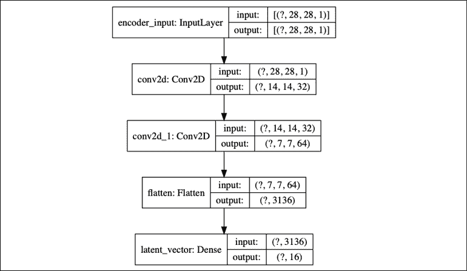
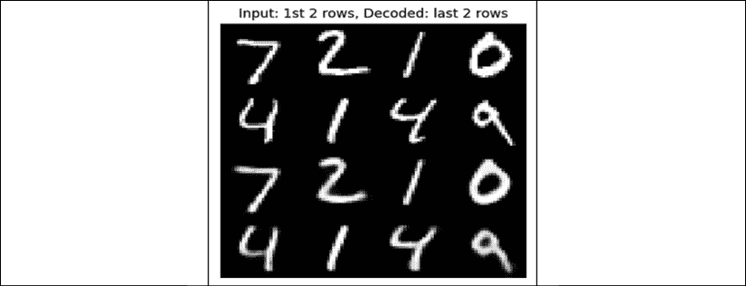
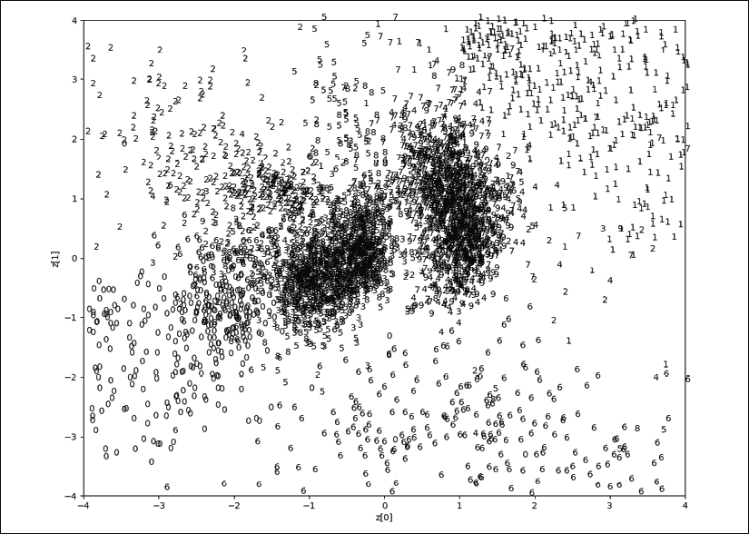
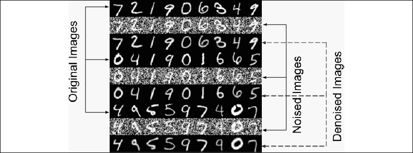
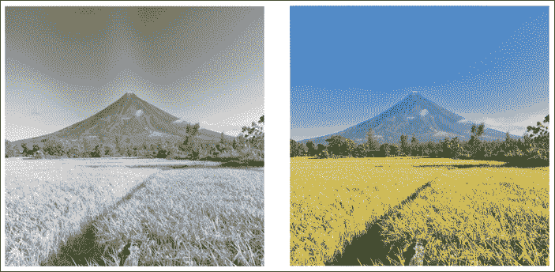
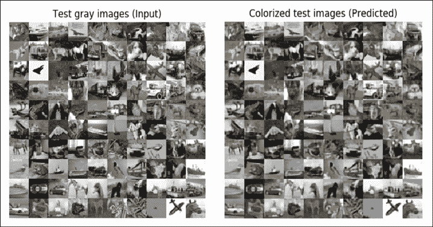
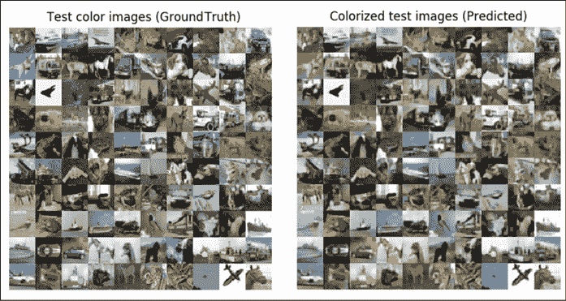

# 3

# 汽车编码器

在上一章“第 2 章”，“深度神经网络”中，我们介绍了深度神经网络的概念。 现在，我们将继续研究自编码器，它是一种神经网络架构，试图找到给定输入数据的压缩表示形式。

与前面的章节相似，输入数据可以采用多种形式，包括语音，文本，图像或视频。 自编码器将尝试查找表示形式或一段代码，以便对输入数据执行有用的转换。 例如，当对自编码器进行降噪处理时，神经网络将尝试找到可用于将噪声数据转换为干净数据的代码。 嘈杂的数据可以是带有静态噪声的录音形式，然后将其转换为清晰的声音。 自编码器将自动从数据中自动学习代码，而无需人工标记。 这样，自编码器可以在**无监督**学习算法下分类为。

在本书的后续章节中，我们将研究**生成对抗网络**（**GAN**）和**变分自编码器**（**VAE**） 也是无监督学习算法的代表形式。 这与我们在前几章中讨论过的监督学习算法相反，后者需要人工注释。

总之，本章介绍：

*   自编码器的原理
*   如何使用`tf.keras`实现自编码器
*   去噪和着色自编码器的实际应用

让我们从了解自编码器是什么以及自编码器的原理开始。

# 1.自编码器的原理

自编码器以最简单的形式通过尝试将输入复制到输出中来学习表示形式或代码。 但是，使用自编码器并不像将输入复制到输出那样简单。 否则，神经网络将无法发现输入分布中的隐藏结构。

自编码器将输入分布编码为低维张量，通常采用矢量形式。 这将近似通常称为潜在表示，代码或向量的隐藏结构。 该处理构成编码部分。 然后，潜在向量将由解码器部分解码，以恢复原始输入。

由于潜矢量是输入分布的低维压缩表示，因此应该期望解码器恢复的输出只能近似输入。 输入和输出之间的差异可以通过损失函数来衡量。

但是为什么我们要使用自编码器？ 简而言之，自编码器在原始形式或更复杂的神经网络的一部分中都有实际应用。

它们是了解深度学习的高级主题的关键工具，因为它们为我们提供了适合密度估计的低维数据表示。 此外，可以有效地对其进行处理以对输入数据执行结构化操作。 常见的操作包括去噪，着色，特征级算术，检测，跟踪和分割，仅举几例。

在本节中，我们将介绍自编码器的原理。 我们将使用前几章介绍的带有 MNIST 数据集的自编码器。

首先，我们需要意识到自编码器具有两个运算符，它们是：

*   **编码器**：这会将输入`x`转换为低维潜矢量`z = f(x)`。 由于潜矢量是低维的，编码器被迫仅学习输入数据的最重要特征。 例如，在 MNIST 数字的情况下，要学习的重要特征可能包括书写风格，倾斜角度，笔触圆度，厚度等。 从本质上讲，这些是代表数字 0 至 9 所需的最重要的信息位。
*   **解码器**：这尝试从潜在矢量`g(z) = x`中恢复输入。

尽管潜矢量的维数较小，但它的大小足以使解码器恢复输入数据。

解码器的目标是使`x_tilde`尽可能接近`x`。 通常，编码器和解码器都是非线性函数。`z`的尺寸是可以表示的重要特征数量的度量。 该维数通常比输入维数小得多，以提高效率，并为了限制潜在代码仅学习输入分布的最显着属性[1]。

当潜码的维数明显大于`x`时，自编码器倾向于记忆输入。

合适的损失函数`L(x, x_tilde)`衡量输入`x`与输出（即）恢复后的输入`x_tilde`的相异程度。 如下式所示，均方误差（MSE）是此类损失函数的一个示例：

 (Equation 3.1.1)

在此示例中，`m`是输出尺寸（例如，在 MNIST 中，`m = width × height × channels = 28 × 28 × 1 = 784`）。`x[i]`和`x_tilde[i]`分别是`x`和`x_tilde`的元素。 由于损失函数是输入和输出之间差异的量度，因此我们可以使用替代的重建损失函数，例如二进制交叉熵或结构相似性指数（SSIM）。

与其他神经网络类似，自编码器会在训练过程中尝试使此错误或损失函数尽可能小。“图 3.1.1”显示了一个自编码器。 编码器是将输入`x`压缩为低维潜矢量`z`的功能。 该潜矢量代表输入分布的重要特征。 然后，解码器尝试以`x_tilde`的形式从潜矢量中恢复原始输入。


图 3.1.1：自编码器的框图

为了将自编码器置于上下文中，`x`可以是尺寸为`28×28×1 = 784`的 MNIST 数字。编码器将输入转换为低维的`z`，可以是 16 维潜在向量。 解码器将尝试从`z`中以`x_tilde`的形式恢复输入。

在视觉上，每个 MNIST 数字`x`看起来都类似于`x_tilde`。“图 3.1.2”向我们演示了此自编码过程。


图 3.1.2：带有 MNIST 数字输入和输出的自编码器。 潜在向量为 16 角

我们可以看到，虽然解码后的数字 7 并不完全相同，但仍然足够接近。

由于编码器和解码器都是非线性函数，因此我们可以使用神经网络来实现两者。 例如，在 MNIST 数据集中，自编码器可以由 MLP 或 CNN 实现。 通过最小化通过反向传播的损耗函数，可以训练自编码器。 与其他神经网络类似，反向传播的要求是损失函数必须是可微的。

如果将输入视为分布，则可以将编码器解释为分布的编码器，`p(z | x)`，将解码器解释为分布的解码器`p(x | z)`。 自编码器的损耗函数表示为：

 (Equation 3.1.2)

损失函数只是意味着我们要在给定潜在矢量分布的情况下最大程度地恢复输入分布的机会。 如果假设解码器的输出分布为为高斯，则损失函数归结为 MSE，因为：

 (Equation 3.1.3)

在此示例中，`N(x[i]; x_tilde[i], σ²`表示平均值为`x_tilde[i]`且方差为`σ²`的高斯分布。 假设恒定方差。 假定解码器输出`x_tilde[i]`是独立的。`m`是输出尺寸。

了解自编码器背后的原理将有助于我们执行代码。 在下一节中，我们将研究如何使用`tf.keras`功能 API 来构建编码器，解码器和自编码器。

# 2.使用 Keras 构建自编码器

现在，我们要使用进行一些令人兴奋的事情，使用`tf.keras`库构建一个自编码器。 为了简单起见，我们将使用 MNIST 数据集作为第一组示例。 然后，自编码器将根据输入数据生成潜矢量，并使用解码器恢复输入。 在该第一示例中，潜矢量是 16 维。

首先，我们将通过构建编码器来实现自编码器。

“列表 3.2.1”显示了将 MNIST 数字压缩为 16 维潜在矢量的编码器。 编码器是两个`Conv2D`的堆栈。 最后阶段是具有 16 个单位的`Dense`层，以生成潜矢量。

“列表 3.2.1”：`autoencoder-mnist-3.2.1.py`

```py
from tensorflow.keras.layers import Dense, Input
from tensorflow.keras.layers import Conv2D, Flatten
from tensorflow.keras.layers import Reshape, Conv2DTranspose
from tensorflow.keras.models import Model
from tensorflow.keras.datasets import mnist
from tensorflow.keras.utils import plot_model
from tensorflow.keras import backend as K 
```

```py
import numpy as np
import matplotlib.pyplot as plt 
```

```py
# load MNIST dataset
(x_train, _), (x_test, _) = mnist.load_data()
# reshape to (28, 28, 1) and normalize input images
image_size = x_train.shape[1]
x_train = np.reshape(x_train, [-1, image_size, image_size, 1])
x_test = np.reshape(x_test, [-1, image_size, image_size, 1])
x_train = x_train.astype('float32') / 255
x_test = x_test.astype('float32') / 255 
```

```py
# network parameters
input_shape = (image_size, image_size, 1)
batch_size = 32
kernel_size = 3
latent_dim = 16
# encoder/decoder number of CNN layers and filters per layer
layer_filters = [32, 64]
# build the autoencoder model
# first build the encoder model
inputs = Input(shape=input_shape, name='encoder_input')
x = inputs
# stack of Conv2D(32)-Conv2D(64)
for filters in layer_filters:
    x = Conv2D(filters=filters,
               kernel_size=kernel_size,
               activation='relu',
               strides=2,
               padding='same')(x) 
```

```py
# shape info needed to build decoder model
# so we don't do hand computation
# the input to the decoder's first
# Conv2DTranspose will have this shape
# shape is (7, 7, 64) which is processed by
# the decoder back to (28, 28, 1)
shape = K.int_shape(x) 
```

```py
# generate latent vector
x = Flatten()(x)
latent = Dense(latent_dim, name='latent_vector')(x) 
```

```py
# instantiate encoder model
encoder = Model(inputs,
                latent,
                name='encoder')
encoder.summary()
plot_model(encoder,
           to_file='encoder.png',
           show_shapes=True) 
```

```py
# build the decoder model
latent_inputs = Input(shape=(latent_dim,), name='decoder_input')
# use the shape (7, 7, 64) that was earlier saved
x = Dense(shape[1] * shape[2] * shape[3])(latent_inputs)
# from vector to suitable shape for transposed conv
x = Reshape((shape[1], shape[2], shape[3]))(x) 
```

```py
# stack of Conv2DTranspose(64)-Conv2DTranspose(32)
for filters in layer_filters[::-1]:
    x = Conv2DTranspose(filters=filters,
                        kernel_size=kernel_size,
                        activation='relu',
                        strides=2,
                        padding='same')(x) 
```

```py
# reconstruct the input
outputs = Conv2DTranspose(filters=1,
                          kernel_size=kernel_size,
                          activation='sigmoid',
                          padding='same',
                          name='decoder_output')(x) 
```

```py
# instantiate decoder model
decoder = Model(latent_inputs, outputs, name='decoder')
decoder.summary()
plot_model(decoder, to_file='decoder.png', show_shapes=True) 
```

```py
# autoencoder = encoder + decoder
# instantiate autoencoder model
autoencoder = Model(inputs,
                    decoder(encoder(inputs)),
                    name='autoencoder')
autoencoder.summary()
plot_model(autoencoder,
           to_file='autoencoder.png',
           show_shapes=True) 
```

```py
# Mean Square Error (MSE) loss function, Adam optimizer
autoencoder.compile(loss='mse', optimizer='adam') 
```

```py
# train the autoencoder
autoencoder.fit(x_train,
                x_train,
                validation_data=(x_test, x_test),
                epochs=1,
                batch_size=batch_size) 
```

```py
# predict the autoencoder output from test data
x_decoded = autoencoder.predict(x_test) 
```

```py
# display the 1st 8 test input and decoded images
imgs = np.concatenate([x_test[:8], x_decoded[:8]])
imgs = imgs.reshape((4, 4, image_size, image_size))
imgs = np.vstack([np.hstack(i) for i in imgs])
plt.figure()
plt.axis('off')
plt.title('Input: 1st 2 rows, Decoded: last 2 rows')
plt.imshow(imgs, interpolation='none', cmap='gray')
plt.savefig('input_and_decoded.png')
plt.show() 
```

“图 3.2.1”显示了`plot_model()`生成的架构模型图，与`encoder.summary()`生成的文本版本相同。 保存最后一个`Conv2D`的输出形状以计算解码器输入层的尺寸，以便轻松重建 MNIST 图像：`shape = K.int_shape(x)`。



图 3.2.1：编码器模型由`Conv2D(32) - Conv2D(64) - Dense(16)`组成，以生成低维潜矢量

列表 3.2.1 中的解码器对潜在向量进行解压缩，以恢复 MNIST 数字。 解码器输入级是`Dense`层，它将接受潜在矢量。 单位的数量等于从编码器保存的`Conv2D`输出尺寸的乘积。 这样做是为了便于我们调整`Dense`层`Dense`层的输出大小，以最终恢复原始 MNIST 图像尺寸。

解码器由三个`Conv2DTranspose`的堆栈组成。 在我们的案例中，我们将使用**转置的 CNN**（有时称为**反卷积**），它是解码器中常用的。 我们可以将转置的 CNN（`Conv2DTranspose`）想象成 CNN 的逆过程。

在一个简单的示例中，如果 CNN 将图像转换为特征图，则转置的 CNN 将生成给定特征图的图像。“图 3.2.2”显示了解码器模型：


图 3.2.2：解码器模型由`Dense(16) - Conv2DTranspose(64) - Conv2DTranspose(32) - Conv2DTranspose(1)`组成。 输入是经过解码以恢复原始输入的潜矢量

通过将编码器和解码器连接在一起，我们可以构建自编码器。“图 3.2.3”说明了自编码器的模型图：


图 3.2.3：通过将编码器模型和解码器模型结合在一起来构建自编码器模型。 此自编码器有 178 k 个参数

编码器的张量输出也是解码器的输入，该解码器生成自编码器的输出。 在此示例中，我们将使用 MSE 损失函数和 Adam 优化器。 在训练期间，输入与输出`x_train`相同。 我们应该注意，在我们的示例中，只有几层足以将验证损失在一个时期内驱动到 0.01。 对于更复杂的数据集，我们可能需要更深的编码器和解码器，以及更多的训练时间。

在对自编码器进行了一个时期的验证损失为 0.01 的训练之后，我们能够验证它是否可以对以前从未见过的 MNIST 数据进行编码和解码。“图 3.2.4”向我们展示了来自测试数据和相应解码图像的八个样本：



图 3.2.4：根据测试数据预测自编码器。 前两行是原始输入测试数据。 最后两行是预测数据

除了图像中的轻微模糊之外，我们能够轻松识别出自编码器能够以良好的质量恢复输入。 随着我们训练更多的时期，结果将有所改善。

在这一点上，我们可能想知道：我们如何可视化空间中的潜在矢量？ 一种简单的可视化方法是强制自编码器使用 2 维潜在矢量来学习 MNIST 数字特征。 从那里，我们可以将该潜在矢量投影到二维空间上，以查看 MNIST 潜在矢量的分布方式。“图 3.2.5”和“图 3.2.6”显示了 MNIST 数字的分布与潜在代码尺寸的关系。



图 3.2.5：MNIST 数字分布与潜在代码尺寸`z[0]`和`z[1]`的关系。 原始照片可以在本书的 [GitHub 存储库](https://github.com/PacktPublishing/Advanced-Deep-Learning-with-Keras/blob/master/chapter3-autoencoders/README.md)中找到。

在“图 3.2.5”中，我们可以看到特定数字的潜矢量聚集在空间的某个区域上。 例如，数字 0 在左下象限中，而数字 1 在右上象限中。 这种群集在图中得到了反映。 实际上，同一图显示了导航或从潜在空间生成新数字的结果，如图“图 3.2.5”所示。

例如，从中心开始，向右上象限改变 2 维潜矢量的值，这表明数字从 9 变为 1。这是可以预期的，因为从“图 3.2.5”开始，我们可以看到数字 9 簇的潜在代码值在中心附近，数字 1 簇的潜在代码值在右上象限。

对于“图 3.2.5”和“图 3.2.6”，我们仅研究了每个潜在矢量维在 -4.0 和 +4.0 之间的区域：


图 3.2.6：导航 2 维潜在矢量空间时生成的数字

从“图 3.2.5”中可以看出，潜在代码分布不是连续的。 理想情况下，应该看起来像一个圆圈，其中到处都有有效值。 由于这种不连续性，因此如果解码潜伏矢量，则几乎不会产生任何可识别的数字。

“图 3.2.5”和“图 3.2.6”经过 20 个训练周期后生成。 通过设置`latent_dim = 2`修改了`autoencoder-mnist-3.2.1.py`代码。 `plot_ results()`函数将 MNIST 数字绘制为 2 维潜在矢量的函数。 为了方便起见，该程序另存为`autoencoder-2dim-mnist-3.2.2.py`，其部分代码显示在“列表 3.2.2”中。 其余代码实际上类似于“列表 3.2.1”，在此不再显示。

“列表 3.2.2”：`autoencoder-2dim-mnist-3.2.2.py`

```py
def plot_results(models,
                 data,
                 batch_size=32,
                 model_name="autoencoder_2dim"):
    """Plots 2-dim latent values as scatter plot of digits
        then, plot MNIST digits as function of 2-dim latent vector 
```

```py
 Arguments:
        models (list): encoder and decoder models
        data (list): test data and label
        batch_size (int): prediction batch size
        model_name (string): which model is using this function
    """ 
```

```py
 encoder, decoder = models
    x_test, y_test = data
    xmin = ymin = -4
    xmax = ymax = +4
    os.makedirs(model_name, exist_ok=True) 
```

```py
 filename = os.path.join(model_name, "latent_2dim.png")
    # display a 2D plot of the digit classes in the latent space
    z = encoder.predict(x_test,
                        batch_size=batch_size)
    plt.figure(figsize=(12, 10)) 
```

```py
 # axes x and y ranges
    axes = plt.gca()
    axes.set_xlim([xmin,xmax])
    axes.set_ylim([ymin,ymax]) 
```

```py
 # subsample to reduce density of points on the plot
    z = z[0::2]
    y_test = y_test[0::2]
    plt.scatter(z[:, 0], z[:, 1], marker="")
    for i, digit in enumerate(y_test):
        axes.annotate(digit, (z[i, 0], z[i, 1]))
    plt.xlabel("z[0]")
    plt.ylabel("z[1]")
    plt.savefig(filename)
    plt.show() 
```

```py
 filename = os.path.join(model_name, "digits_over_latent.png")
    # display a 30x30 2D manifold of the digits
    n = 30
    digit_size = 28
    figure = np.zeros((digit_size * n, digit_size * n))
    # linearly spaced coordinates corresponding to the 2D plot
    # of digit classes in the latent space
    grid_x = np.linspace(xmin, xmax, n)
    grid_y = np.linspace(ymin, ymax, n)[::-1] 
```

```py
 for i, yi in enumerate(grid_y):
        for j, xi in enumerate(grid_x):
            z = np.array([[xi, yi]])
            x_decoded = decoder.predict(z)
            digit = x_decoded[0].reshape(digit_size, digit_size)
            figure[i * digit_size: (i + 1) * digit_size,
                   j * digit_size: (j + 1) * digit_size] = digit 
```

```py
 plt.figure(figsize=(10, 10))
    start_range = digit_size // 2
    end_range = n * digit_size + start_range + 1
    pixel_range = np.arange(start_range, end_range, digit_size)
    sample_range_x = np.round(grid_x, 1)
    sample_range_y = np.round(grid_y, 1)
    plt.xticks(pixel_range, sample_range_x)
    plt.yticks(pixel_range, sample_range_y)
    plt.xlabel("z[0]")
    plt.ylabel("z[1]")
    plt.imshow(figure, cmap='Greys_r')
    plt.savefig(filename)
    plt.show() 
```

这样就完成了和自编码器的检查。 接下来的章节将重点介绍其实际应用。 我们将从去噪自编码器开始。

# 3.去噪自编码器（DAE）

现在，我们将构建具有实际应用的自编码器。 首先，让我们画一幅画，然后想象 MNIST 的数字图像被噪声破坏了，从而使人类更难以阅读。 我们能够构建一个去噪自编码器（DAE），以消除这些图像中的噪声。“图 3.3.1”向我们展示了三组 MNIST 数字。 每组的顶部行（例如，MNIST 数字 7、2、1、9、0、6、3、4 和 9）是原始图像。 中间的行显示了 DAE 的输入，这些输入是被噪声破坏的原始图像。 作为人类，我们发现很难读取损坏的 MNIST 数字。 最后一行显示 DAE 的输出。



图 3.3.1：原始 MNIST 数字（顶部行），损坏的原始图像（中间行）和去噪图像（最后一行）

如图“图 3.3.2”所示，去噪自编码器的结构实际上与我们在上一节中介绍的 MNIST 的自编码器相同。


图 3.3.2：去噪自编码器的输入是损坏的图像。 输出是干净或去噪的图像。 假定潜矢量为 16 维

“图 3.3.2”中的输入定义为：

`x = x_ori + noise`（公式 3.3.1）

在该公式中，`x_ori`表示被*噪声*破坏的原始 MNIST 图像。 编码器的目的是发现如何产生潜矢量`z`，这将使解码器能够恢复诸如 MSE，如下所示：`x_ori`通过最小化相异损失函数：

 (Equation 3.3.2)

在此示例中，`m`是输出尺寸（例如，在 MNIST 中，`m = width × height × channels = 28 × 28 × 1 = 784`）。 `x_ori[i]`和`x_tilde[i]`分别是`x_ori`和`x_tilde`的元素。

为了实现 DAE，我们将需要对上一节中介绍的自编码器进行一些更改。 首先，训练输入数据应损坏的 MNIST 数字。 训练输出数据是原始的原始 MNIST 数字相同。 这就像告诉自编码器应校正的图像是什么，或要求它找出在图像损坏的情况下如何消除噪声。 最后，我们必须在损坏的 MNIST 测试数据上验证自编码器。

“图 3.3.2"左侧所示的 MNIST 数字 7 是实际损坏的图像输入。 右边的是经过训练的降噪自编码器的干净图像输出。

“列表 3.3.1”：`denoising-autoencoder-mnist-3.3.1.py`

```py
from tensorflow.keras.layers import Dense, Input
from tensorflow.keras.layers import Conv2D, Flatten
from tensorflow.keras.layers import Reshape, Conv2DTranspose
from tensorflow.keras.models import Model
from tensorflow.keras import backend as K
from tensorflow.keras.datasets import mnist
import numpy as np
import matplotlib.pyplot as plt
from PIL import Image 
```

```py
np.random.seed(1337) 
```

```py
# load MNIST dataset
(x_train, _), (x_test, _) = mnist.load_data() 
```

```py
# reshape to (28, 28, 1) and normalize input images
image_size = x_train.shape[1]
x_train = np.reshape(x_train, [-1, image_size, image_size, 1])
x_test = np.reshape(x_test, [-1, image_size, image_size, 1])
x_train = x_train.astype('float32') / 255
x_test = x_test.astype('float32') / 255 
```

```py
# generate corrupted MNIST images by adding noise with normal dist
# centered at 0.5 and std=0.5
noise = np.random.normal(loc=0.5, scale=0.5, size=x_train.shape)
x_train_noisy = x_train + noise 
```

```py
noise = np.random.normal(loc=0.5, scale=0.5, size=x_test.shape)
x_test_noisy = x_test + noise
# adding noise may exceed normalized pixel values>1.0 or <0.0
# clip pixel values >1.0 to 1.0 and <0.0 to 0.0
x_train_noisy = np.clip(x_train_noisy, 0., 1.)
x_test_noisy = np.clip(x_test_noisy, 0., 1.)
# network parameters
input_shape = (image_size, image_size, 1)
batch_size = 32
kernel_size = 3
latent_dim = 16
# encoder/decoder number of CNN layers and filters per layer
layer_filters = [32, 64] 
```

```py
# build the autoencoder model
# first build the encoder model
inputs = Input(shape=input_shape, name='encoder_input')
x = inputs 
```

```py
# stack of Conv2D(32)-Conv2D(64)
for filters in layer_filters:
    x = Conv2D(filters=filters,
               kernel_size=kernel_size,
               strides=2,
               activation='relu',
               padding='same')(x) 
```

```py
# shape info needed to build decoder model so we don't do hand computation
# the input to the decoder's first Conv2DTranspose will have this shape
# shape is (7, 7, 64) which can be processed by the decoder back to (28, 28, 1)
shape = K.int_shape(x) 
```

```py
# generate the latent vector
x = Flatten()(x)
latent = Dense(latent_dim, name='latent_vector')(x) 
```

```py
# instantiate encoder model
encoder = Model(inputs, latent, name='encoder')
encoder.summary() 
```

```py
# build the decoder model
latent_inputs = Input(shape=(latent_dim,), name='decoder_input')
# use the shape (7, 7, 64) that was earlier saved
x = Dense(shape[1] * shape[2] * shape[3])(latent_inputs)
# from vector to suitable shape for transposed conv
x = Reshape((shape[1], shape[2], shape[3]))(x) 
```

```py
# stack of Conv2DTranspose(64)-Conv2DTranspose(32)
for filters in layer_filters[::-1]:
    x = Conv2DTranspose(filters=filters,
                        kernel_size=kernel_size,
                        strides=2,
                        activation='relu',
                        padding='same')(x) 
```

```py
# reconstruct the denoised input
outputs = Conv2DTranspose(filters=1,
                          kernel_size=kernel_size,
                          padding='same',
                          activation='sigmoid',
                          name='decoder_output')(x) 
```

```py
# instantiate decoder model
decoder = Model(latent_inputs, outputs, name='decoder')
decoder.summary() 
```

```py
# autoencoder = encoder + decoder
# instantiate autoencoder model
autoencoder = Model(inputs, decoder(encoder(inputs)), name='autoencoder')
autoencoder.summary() 
```

```py
# Mean Square Error (MSE) loss function, Adam optimizer
autoencoder.compile(loss='mse', optimizer='adam') 
```

```py
# train the autoencoder
autoencoder.fit(x_train_noisy,
                x_train,
                validation_data=(x_test_noisy, x_test),
                epochs=10,
                batch_size=batch_size) 
```

```py
# predict the autoencoder output from corrupted test images
x_decoded = autoencoder.predict(x_test_noisy) 
```

```py
# 3 sets of images with 9 MNIST digits
# 1st rows - original images
# 2nd rows - images corrupted by noise
# 3rd rows - denoised images
rows, cols = 3, 9
num = rows * cols
imgs = np.concatenate([x_test[:num], x_test_noisy[:num], x_decoded[:num]])
imgs = imgs.reshape((rows * 3, cols, image_size, image_size))
imgs = np.vstack(np.split(imgs, rows, axis=1))
imgs = imgs.reshape((rows * 3, -1, image_size, image_size))
imgs = np.vstack([np.hstack(i) for i in imgs])
imgs = (imgs * 255).astype(np.uint8)
plt.figure()
plt.axis('off')
plt.title('Original images: top rows, '
          'Corrupted Input: middle rows, '
          'Denoised Input:  third rows')
plt.imshow(imgs, interpolation='none', cmap='gray')
Image.fromarray(imgs).save('corrupted_and_denoised.png')
plt.show() 
```

“列表 3.3.1”显示了去噪自编码器，该编码器已添加到官方 Keras GitHub 存储库中。 使用相同的 MNIST 数据集，我们可以通过添加随机噪声来模拟损坏的图像。 添加的噪声是高斯分布，平均值为`μ = 0.5`，标准偏差为`σ = 0.5`。 由于添加随机噪声可能会将像素数据推入小于 0 或大于 1 的无效值，因此像素值会被裁剪为`[0.1, 1.0]`范围。

其他所有内容实际上都与上一节中的自编码器相同。 我们将使用相同的 MSE 损失函数和 Adam 优化器。 但是，训练的时期数已增加到 10。这是为了进行足够的参数优化。

“图 3.3.3”显示了 DAE 在某种程度上的鲁棒性，因为噪声级别从`σ = 0.5`增至`σ = 0.75`和`σ = 1.0`。 在`σ = 0.75`处，DAE 仍能够恢复原始图像。 但是，在`σ = 1.0`处，一些数字，例如第二和第三组中的 4 和 5，将无法正确恢复。


图 3.3.3：降噪自编码器的性能随着噪声水平的提高而增加

我们已经完成去噪自编码器的讨论和实现。 尽管此概念已在 MNIST 数字上进行了演示，但该思想也适用于其他信号。 在下一节中，我们将介绍自编码器的另一种实际应用，称为着色自编码器。

# 4.自动着色自编码器

现在，我们将致力于自编码器的另一个实际应用。 在这种情况下，我们将想象一下，我们有一张灰度照片，并且想要构建一个可以自动为其添加颜色的工具。 我们要复制人类的能力，以识别海洋和天空为蓝色，草地和树木为绿色，云层为白色，依此类推。

如图“图 3.4.1”所示，如果给我们前景的稻田，背景的火山和顶部的天空的灰度照片（左），我们可以添加适当的颜色（右）。



图 3.4.1：为 Mayon 火山的灰度照片添加颜色。 着色网络应通过向灰度照片添加颜色来复制人类的能力。 左照片是灰度的。 正确的照片是彩色的。 原始彩色照片可以在本书的 [GitHub 存储库](https://github.com/PacktPublishing/Advanced-Deep-Learning-with-Keras/blob/master/chapter3-autoencoders/README.md)中找到。

对于自编码器，一种简单的自动着色算法似乎是一个合适的问题。 如果我们可以使用足够数量的灰度照片作为输入并使用相应的彩色照片作为输出来训练自编码器，则可能会在正确应用颜色时发现隐藏的结构。 大致上，这是去噪的反向过程。 问题是，自编码器能否在原始灰度图像上添加颜色（良好的噪点）？

“列表 3.4.1”显示了着色自编码器网络。 着色自编码器网络是我们用于 MNIST 数据集的降噪自编码器的修改版本。 首先，我们需要一个彩色照片的灰度数据集。 我们之前使用过的 CIFAR10 数据库进行了 50,000 次训练和 10,000 次测试，可以将`32×32` RGB 照片转换为灰度图像。 如下清单所示，我们可以使用`rgb2gray()`函数在 R，G 和 B 分量上应用权重，以从彩色转换为灰度：

“列表 3.4.1”：`colorization-autoencoder-cifar10-3.4.1.py`

```py
from tensorflow.keras.layers import Dense, Input
from tensorflow.keras.layers import Conv2D, Flatten
from tensorflow.keras.layers import Reshape, Conv2DTranspose
from tensorflow.keras.models import Model
from tensorflow.keras.callbacks import ReduceLROnPlateau
from tensorflow.keras.callbacks import ModelCheckpoint
from tensorflow.keras.datasets import cifar10
from tensorflow.keras.utils import plot_model
from tensorflow.keras import backend as K 
```

```py
import numpy as np
import matplotlib.pyplot as plt
import os 
```

```py
def rgb2gray(rgb):
    """Convert from color image (RGB) to grayscale.
       Source: opencv.org
       grayscale = 0.299*red + 0.587*green + 0.114*blue
    Argument:
        rgb (tensor): rgb image
    Return:
        (tensor): grayscale image
    """
    return np.dot(rgb[...,:3], [0.299, 0.587, 0.114]) 
```

```py
# load the CIFAR10 data
(x_train, _), (x_test, _) = cifar10.load_data() 
```

```py
# input image dimensions
# we assume data format "channels_last"
img_rows = x_train.shape[1]
img_cols = x_train.shape[2]
channels = x_train.shape[3]
# create saved_images folder
imgs_dir = 'saved_images'
save_dir = os.path.join(os.getcwd(), imgs_dir)
if not os.path.isdir(save_dir):
        os.makedirs(save_dir) 
```

```py
# display the 1st 100 input images (color and gray)
imgs = x_test[:100]
imgs = imgs.reshape((10, 10, img_rows, img_cols, channels))
imgs = np.vstack([np.hstack(i) for i in imgs])
plt.figure()
plt.axis('off')
plt.title('Test color images (Ground  Truth)')
plt.imshow(imgs, interpolation='none')
plt.savefig('%s/test_color.png' % imgs_dir)
plt.show() 
```

```py
# convert color train and test images to gray
x_train_gray = rgb2gray(x_train)
x_test_gray = rgb2gray(x_test) 
```

```py
# display grayscale version of test images
imgs = x_test_gray[:100]
imgs = imgs.reshape((10, 10, img_rows, img_cols))
imgs = np.vstack([np.hstack(i) for i in imgs])
plt.figure()
plt.axis('off')
plt.title('Test gray images (Input)')
plt.imshow(imgs, interpolation='none', cmap='gray')
plt.savefig('%s/test_gray.png' % imgs_dir)
plt.show() 
```

```py
# normalize output train and test color images
x_train = x_train.astype('float32') / 255
x_test = x_test.astype('float32') / 255 
```

```py
# normalize input train and test grayscale images
x_train_gray = x_train_gray.astype('float32') / 255
x_test_gray = x_test_gray.astype('float32') / 255 
```

```py
# reshape images to row x col x channel for CNN output/validation
x_train = x_train.reshape(x_train.shape[0], img_rows, img_cols, channels)
x_test = x_test.reshape(x_test.shape[0], img_rows, img_cols, channels) 
```

```py
# reshape images to row x col x channel for CNN input
x_train_gray = x_train_gray.reshape(x_train_gray.shape[0], img_rows, img_cols, 1)
x_test_gray = x_test_gray.reshape(x_test_gray.shape[0], img_rows, img_cols, 1) 
```

```py
# network parameters
input_shape = (img_rows, img_cols, 1)
batch_size = 32
kernel_size = 3
latent_dim = 256
# encoder/decoder number of CNN layers and filters per layer
layer_filters = [64, 128, 256] 
```

```py
# build the autoencoder model
# first build the encoder model
inputs = Input(shape=input_shape, name='encoder_input')
x = inputs
# stack of Conv2D(64)-Conv2D(128)-Conv2D(256)
for filters in layer_filters:
    x = Conv2D(filters=filters,
               kernel_size=kernel_size,
               strides=2,
               activation='relu',
               padding='same')(x) 
```

```py
# shape info needed to build decoder model so we don't do hand computation
# the input to the decoder's first Conv2DTranspose will have this shape
# shape is (4, 4, 256) which is processed by the decoder back to (32, 32, 3)
shape = K.int_shape(x) 
```

```py
# generate a latent vector
x = Flatten()(x)
latent = Dense(latent_dim, name='latent_vector')(x) 
```

```py
# instantiate encoder model
encoder = Model(inputs, latent, name='encoder')
encoder.summary()
# build the decoder model
latent_inputs = Input(shape=(latent_dim,), name='decoder_input')
x = Dense(shape[1]*shape[2]*shape[3])(latent_inputs)
x = Reshape((shape[1], shape[2], shape[3]))(x) 
```

```py
# stack of Conv2DTranspose(256)-Conv2DTranspose(128)-Conv2DTranspose(64)
for filters in layer_filters[::-1]:
    x = Conv2DTranspose(filters=filters,
                        kernel_size=kernel_size,
                        strides=2,
                        activation='relu',
                        padding='same')(x) 
```

```py
outputs = Conv2DTranspose(filters=channels,
                          kernel_size=kernel_size,
                          activation='sigmoid',
                          padding='same',
                          name='decoder_output')(x) 
```

```py
# instantiate decoder model
decoder = Model(latent_inputs, outputs, name='decoder')
decoder.summary()
# autoencoder = encoder + decoder
# instantiate autoencoder model
autoencoder = Model(inputs, decoder(encoder(inputs)), name='autoencoder')
autoencoder.summary() 
```

```py
# prepare model saving directory.
save_dir = os.path.join(os.getcwd(), 'saved_models')
model_name = 'colorized_ae_model.{epoch:03d}.h5'
if not os.path.isdir(save_dir):
        os.makedirs(save_dir)
filepath = os.path.join(save_dir, model_name) 
```

```py
# reduce learning rate by sqrt(0.1) if the loss does not improve in 5 epochs
lr_reducer = ReduceLROnPlateau(factor=np.sqrt(0.1),
                               cooldown=0,
                               patience=5,
                               verbose=1,
                               min_lr=0.5e-6)
# save weights for future use (e.g. reload parameters w/o training)
checkpoint = ModelCheckpoint(filepath=filepath,
                             monitor='val_loss',
                             verbose=1,
                             save_best_only=True) 
```

```py
# Mean Square Error (MSE) loss function, Adam optimizer
autoencoder.compile(loss='mse', optimizer='adam') 
```

```py
# called every epoch
callbacks = [lr_reducer, checkpoint] 
```

```py
# train the autoencoder
autoencoder.fit(x_train_gray,
                x_train,
                validation_data=(x_test_gray, x_test),
                epochs=30,
                batch_size=batch_size,
                callbacks=callbacks)
# predict the autoencoder output from test data
x_decoded = autoencoder.predict(x_test_gray) 
```

```py
# display the 1st 100 colorized images
imgs = x_decoded[:100]
imgs = imgs.reshape((10, 10, img_rows, img_cols, channels))
imgs = np.vstack([np.hstack(i) for i in imgs])
plt.figure()
plt.axis('off')
plt.title('Colorized test images (Predicted)')
plt.imshow(imgs, interpolation='none')
plt.savefig('%s/colorized.png' % imgs_dir)
plt.show() 
```

通过添加更多卷积和转置卷积，我们提高了自编码器的容量。 我们还将每个 CNN 块的过滤器数量增加了一倍。 潜矢量现在为 256 维，以增加其可以表示的显着属性的数量，如自编码器部分所述。 最后，输出滤镜的大小已增加到三倍，或等于预期的彩色输出的 RGB 中的通道数。

现在使用灰度作为输入，原始 RGB 图像作为输出来训练着色自编码器。 训练将花费更多的时间，并在验证损失没有改善的情况下使用学习率降低器来缩小学习率。 通过告诉`tf.keras fit()`函数中的 callbacks 参数调用`lr_reducer()`函数，可以轻松完成此操作。

“图 3.4.2”演示了来自 CIFAR10 测试数据集的灰度图像的着色。



图 3.4.2：使用自编码器将灰度自动转换为彩色图像。 CIFAR10 测试灰度输入图像（左）和预测的彩色图像（右）。 原始彩色照片可以在本书的 GitHub 存储库中找到，网址为 https://github.com/PacktPublishing/Advanced-Deep-Learning-with-Keras/blob/master/chapter3-autoencoders/README.md

“图 3.4.3”将基本事实与着色自编码器预测进行了比较：



图 3.4.3：地面真彩色图像与预测彩色图像的并排比较。 原始彩色照片可以在本书的 GitHub 存储库中找到，网址为 https://github.com/PacktPublishing/Advanced-Deep-Learning-with-Keras/blob/master/chapter3-autoencoders/README.md

自编码器执行可接受的着色作业。 预计大海或天空为蓝色，动物的阴影为棕色，云为白色，依此类推。

有一些明显的错误预测，例如红色车辆变成蓝色或蓝色车辆变成红色，偶尔的绿色领域被误认为是蓝天，而黑暗或金色的天空被转换为蓝天。

这是关于自编码器的最后一部分。 在以下各章中，我们将重新讨论以一种或另一种形式进行编码和解码的概念。 表示学习的概念在深度学习中非常基础。

# 5.结论

在本章中，我们已经介绍了自编码器，它们是将输入数据压缩为低维表示形式的神经网络，以便有效地执行结构转换，例如降噪和着色。 我们为 GAN 和 VAE 的更高级主题奠定了基础，我们将在后面的章节中介绍它们。 我们已经演示了如何从两个构建模块模型（编码器和解码器）实现自编码器。 我们还学习了如何提取输入分布的隐藏结构是 AI 的常见任务之一。

一旦学习了潜在代码，就可以对原始输入分布执行许多结构操作。 为了更好地了解输入分布，可以使用低级嵌入（类似于本章内容）或通过更复杂的降维技术（例如 t-SNE 或 PCA）来可视化潜在矢量形式的隐藏结构。

除了去噪和着色外，自编码器还用于将输入分布转换为低维潜矢量，可以针对其他任务（例如，分割，检测，跟踪，重建和视觉理解）进一步对其进行处理。 在“第 8 章”，“变分自编码器（VAE）”中，我们将讨论 VAE，它们在结构上与自编码器相同，但具有可解释的潜在代码，这些代码可以产生连续的潜在矢量投影，因此有所不同。

在下一章中，我们将着手介绍 AI 最近最重要的突破之一，即 GAN。 在下一章中，我们将学习 GAN 的核心优势，即其综合看起来真实的数据的能力。

# 6.参考

1.  `Ian Goodfellow et al.: Deep Learning. Vol. 1. Cambridge: MIT press, 2016 (http://www.deeplearningbook.org/).`