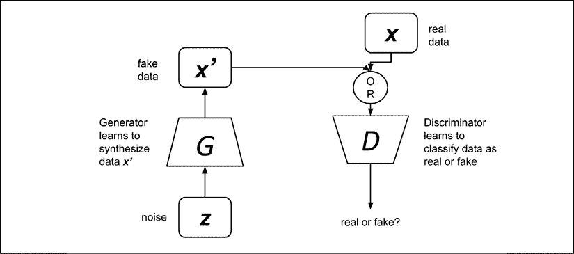
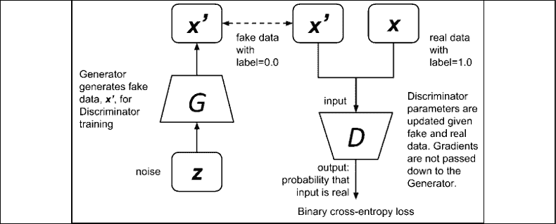
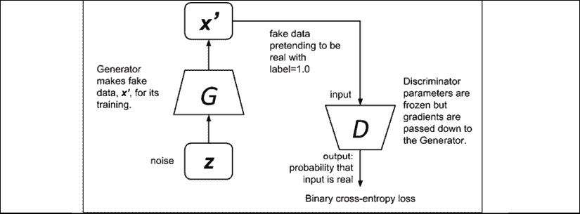
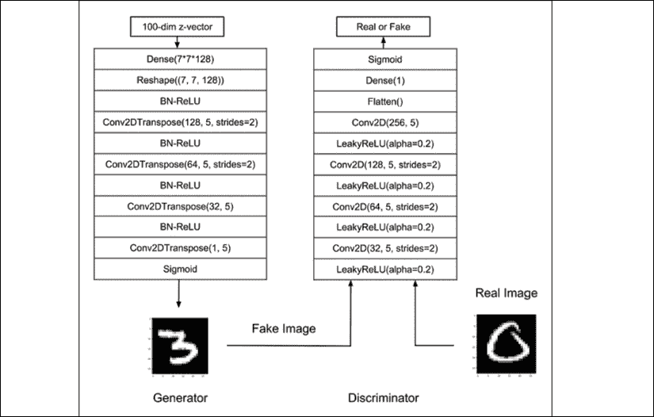
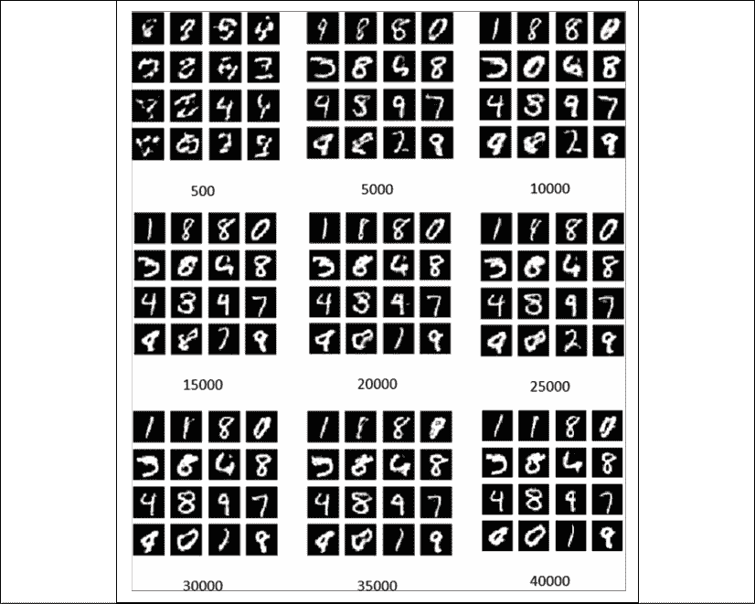
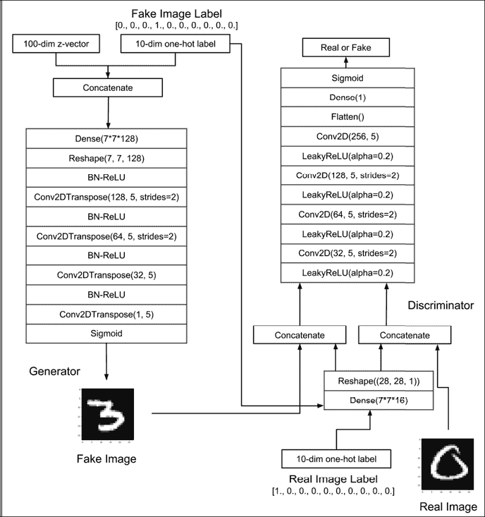
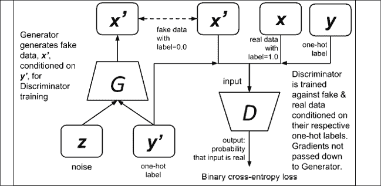
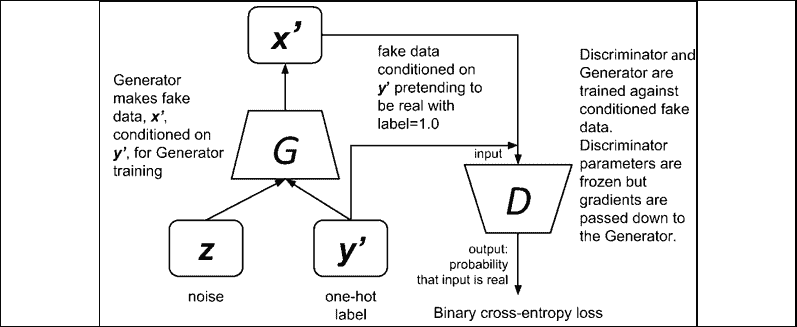
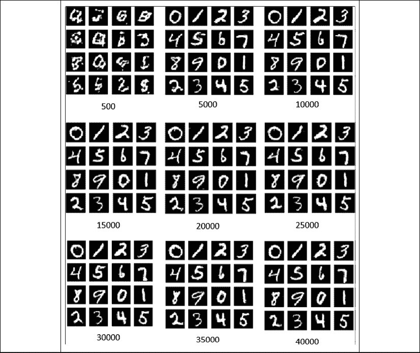

# 四、生成对抗网络（GAN）

在本章中，我们将研究**生成对抗网络**（**GAN**）[1]。 GAN 属于生成模型家族。 但是，与自编码器不同，生成模型能够在给定任意编码的情况下创建新的有意义的输出。

在本章中，将讨论 GAN 的工作原理。 我们还将使用`tf.keras`回顾几个早期 GAN 的实现，而在本章的后面，我们将演示实现稳定训练所需的技术。 本章的范围涵盖了 GAN 实现的两个流行示例，**深度卷积 GAN**（**DCGAN**）[2]和**条件 GAN**（**CGAN**）[3]。

总之，本章的目标是：

*   GAN 的原理简介
*   GAN 的早期工作实现之一的简介，称为 DCGAN
*   改进的 DCGAN，称为 CGAN，它使用条件
*   在`tf.keras`中实现 DCGAN 和 CGAN

让我们从 GAN 的概述开始。

# 1\. GAN 概述

在进入 GAN 的更高级概念之前，让我们开始研究 GAN，并介绍它们背后的基本概念。 GAN 非常强大。 通过执行潜在空间插值，他们可以生成不是真实人的新人脸这一事实证明了这一简单的陈述。

可以在以下 YouTube 视频中看到 GAN 的高级功能：

*   [Progressive GAN [4]](https://youtu.be/G06dEcZ-QTg)
*   [StyleGAN v1 [5]](https://youtu.be/kSLJriaOumA)
*   [StyleGAN v2 [6]](https://youtu.be/c-NJtV9Jvp0)

展示如何利用 GAN 产生逼真的面部的视频演示了它们的功能。 这个主题比我们之前看过的任何内容都先进得多。 例如，上面的视频演示了自编码器无法轻松完成的事情，我们在“第 3 章”，“自编码器”中介绍了这些内容。

GAN 可以通过训练两个相互竞争（且相互配合）的网络（称为**生成器**和**判别器**（有时称为**评论家**）。 生成器的作用是继续弄清楚如何生成伪造数据或信号（包括音频和图像），使伪造者蒙上阴影。 同时，判别器被训练以区分假信号和真实信号。 随着训练的进行，判别器将不再能够看到合成生成的数据与真实数据之间的差异。 从那里，可以丢弃判别器，然后可以使用生成器来创建从未见过的新的真实数据。

GAN 的基本概念很简单。 但是，我们将发现的一件事是，最具挑战性的问题是我们如何实现对生成器－区分器网络的稳定训练？ 为了使两个网络都能同时学习，生成器和判别器之间必须存在健康的竞争。 由于损失函数是根据判别器的输出计算得出的，因此其参数会快速更新。 当判别器收敛速度更快时，生成器不再为其参数接收到足够的梯度更新，并且无法收敛。 除了难以训练之外，GAN 还可能遭受部分或全部模态崩溃的影响，这种情况下，生成器针对不同的潜在编码生成几乎相似的输出。

## GAN 的原理

如图“图 4.1.1”所示，GAN 类似于伪造者（生成者）-警察（区分者）场景。 在学院里，警察被教导如何确定美钞是真钞还是假钞。 来自银行的真实美钞样本和来自伪造者的伪钞样本被用来训练警察。 但是，伪造者会不时地假装他印制了真实的美元钞票。 最初，警方不会上当，并且会告诉造假者这笔钱是假的。 考虑到此反馈，造假者再次磨练他的技能，并尝试制作新的假美元钞票。 如预期的那样，警察将能够发现这笔钱是伪造的，并说明为什么美元钞票是伪造的：


图 4.1.1：GAN 的生成器和判别器类似于伪造者和警察。 造假者的目的是欺骗警察，使他们相信美元钞票是真实的

此过程无限期地继续，但是到了造假者已经掌握了伪造货币的程度，以至于伪造品与真实货币几乎无法区分-甚至对于最受执业的警察也是如此。 然后，伪造者可以无限次打印美元钞票，而不会被警方抓获，因为它们不再可识别为伪造的。

如图“图 4.1.2”所示，GAN 由两个网络组成，一个生成器和一个判别器：



图 4.1.2：GAN 由两个网络组成，一个生成器和一个判别器。 判别器经过训练，可以区分真实信号和虚假信号或数据。 生成器的工作是生成伪造的信号或数据，这些伪造的信号或数据最终会欺骗判别器

发生器的输入是噪声，输出是合成数据。 同时，判别器的输入将是实数据或合成数据。 真实数据来自真实的采样数据，而虚假数据来自生成器。 所有有效数据均标记为 1.0（即 100% 为真实概率），而所有合成数据均标记为 0.0（即 0% 为真实概率）。 由于标记过程是自动化的，因此 GAN 仍被认为是深度学习中无监督学习方法的一部分。

判别器的目标是从此提供的数据集中学习如何区分真实数据与伪数据。 在 GAN 训练的这一部分中，仅判别器参数将被更新。 像典型的二元分类器一样，判别器经过训练，可以在 0.0 到 1.0 的范围内预测置信度值，以了解给定输入数据与真实数据的接近程度。 但是，这只是故事的一半。

生成器将以固定的时间间隔假装其输出是真实数据，并要求 GAN 将其标记为 1.0。 然后，当将伪造数据提供给判别器时，自然会将其分类为伪造，标签接近 0.0。

优化器根据显示的标签（即 1.0）计算生成器参数更新。 在对新数据进行训练时，它还会考虑自己的预测。 换句话说，判别器对其预测有一些疑问，因此，GAN 将其考虑在内。 这次，GAN 将让梯度从判别器的最后一层向下向下传播到生成器的第一层。 但是，在大多数实践中，在训练的此阶段，判别器参数会暂时冻结。 生成器将使用渐变来更新其参数并提高其合成伪数据的能力。

总体而言，整个过程类似于两个网络相互竞争，同时仍在合作。 当 GAN 训练收敛时，最终结果是生成器，可以合成看似真实的数据。 判别器认为该合成数据是真实数据或带有接近 1.0 的标签，这意味着该判别器可以被丢弃。 发生器部分将有助于从任意噪声输入中产生有意义的输出。

下面的“图 4.1.3”中概述了该过程：



图 4.1.3：训练判别器类似于使用二进制交叉熵损失训练二进制分类器网络。 伪数据由生成器提供，而真实数据来自真实样本

如上图所示，可以通过最小化以下等式中的损失函数来训练判别器：

 (Equation 4.1.1)

该方程只是标准的二进制交叉熵代价函数。 损失是正确识别真实数据`1 - D(g(z))`的期望值与 1.0 正确识别合成数据`1 - D(g(z))`的期望值之和。 日志不会更改本地最小值的位置。

训练过程中将两个小批数据提供给判别器：

1. `x`，来自采样数据的实数据（换言之，`x ~ p_data`），标签为 1.0

1.  `x' = g(z)`，来自生成器的带有标签 0.0 的伪造数据

为了使的损失函数最小，将通过反向传播通过正确识别真实数据`D(x)`和合成数据`1 - D(g(z))`来更新判别器参数`θ^(D)`。 正确识别真实数据等同于`D(x) -> 1.0`，而正确分类伪造数据则与`D(g(z)) -> 0.0`或`1 - D(g(z)) -> 1.0`相同。 在此等式中，`z`是生成器用来合成新信号的任意编码或噪声向量。 两者都有助于最小化损失函数。

为了训练生成器，GAN 将判别器和生成器损耗的总和视为零和博弈。 生成器损耗函数只是判别器损耗函数的负数：

 (Equation 4.1.2)

然后可以将其更恰当地重写为值函数：

 (Equation 4.1.3)

从生成器的角度来看，应将“公式 4.1.3”最小化。 从判别器的角度来看，值函数应最大化。 因此，生成器训练准则可以写成极大极小问题：

 (Equation 4.1.4)

有时，我们会假装合成数据是带有标签 1.0 的真实数据，以此来欺骗判别器。 通过最大化`θ^(D)`，优化器将梯度更新发送到判别器参数，以将该合成数据视为真实数据。 同时，通过将`θ^(G)`的相关性减至最小，优化器将在上训练生成器的参数，从而欺骗识别器。 但是，实际上，判别器对将合成数据分类为伪造的预测很有信心，并且不会更新 GAN 参数。 此外，梯度更新很小，并且在传播到生成器层时已大大减小。 结果，生成器无法收敛。



图 4.1.4：训练发生器就像使用二进制交叉熵损失函数训练网络一样。 来自生成器的虚假数据显示为真实数据

解决方案是按以下形式重新构造生成器的损耗函数：

 (Equation 4.1.5)

损失函数只是通过训练生成器，最大程度地提高了判别器认为合成数据是真实数据的机会。 新公式不再是零和，而是纯粹由启发式驱动的。“图 4.1.4”显示了训练过程中的发生器。 在此图中，仅在训练整个对抗网络时才更新生成器参数。 这是因为梯度从判别器向下传递到生成器。 但是，实际上，判别器权重仅在对抗训练期间临时冻结。

在深度学习中，可以使用合适的神经网络架构来实现生成器和判别器。 如果数据或信号是图像，则生成器和判别器网络都将使用 CNN。 对于诸如音频之类的一维序列，两个网络通常都是循环的（RNN，LSTM 或 GRU）。

在本节中，我们了解到 GAN 的原理很简单。 我们还了解了如何通过熟悉的网络层实现 GAN。 GAN 与其他网络的区别在于众所周知，它们很难训练。 只需稍作更改，就可以使网络变得不稳定。 在以下部分中，我们将研究使用深度 CNN 的 GAN 早期成功实现之一。 它称为 DCGAN [3]。

# 2\. 在 Keras 中实现 DCGAN

“图 4.2.1”显示 DCGAN，其中用于生成伪造的 MNIST 图像：



图 4.2.1：DCGAN 模型

DCGAN 实现以下设计原则：

*   使用`stride > 1`和卷积代替`MaxPooling2D`或`UpSampling2D`。 通过`stride > 1`，CNN 可以学习如何调整特征映射的大小。
*   避免使用`Dense`层。 在所有层中使用 CNN。 `Dense`层仅用作生成器的第一层以接受`z`向量。 调整`Dense`层的输出大小，并成为后续 C​​NN 层的输入。
*   使用**批量归一化**（**BN**），通过将每一层的输入归一化以使均值和单位方差为零，来稳定学习。 生成器输出层和判别器输入层中没有 BN。 在此处要介绍的实现示例中，没有在标识符中使用批量归一化。
*   **整流线性单元**（**ReLU**）在发生器的所有层中均使用，但在输出层中则使用`tanh`激活。 在此处要介绍的实现示例中，在生成器的输出中使用`sigmoid`代替`tanh`，因为通常会导致对 MNIST 数字进行更稳定的训练。
*   在判别器的所有层中使用 **Leaky ReLU**。 与 ReLU 不同，Leaky ReLU 不会在输入小于零时将所有输出清零，而是生成一个等于`alpha x input`的小梯度。 在以下示例中，`alpha = 0.2`。

生成器学习从 100 维输入向量（`[-1.0，1.0]`范围内具有均匀分布的 100 维随机噪声）生成伪图像。 判别器将真实图像与伪图像分类，但是在训练对抗网络时无意中指导生成器如何生成真实图像。 在我们的 DCGAN 实现中使用的内核大小为 5。这是为了允许它增加卷积的接收场大小和表达能力。

生成器接受由 -1.0 到 1.0 范围内的均匀分布生成的 100 维`z`向量。 生成器的第一层是`7 x 7 x 128 = 6,272`单位的密集层。 基于输出图像的预期最终尺寸（`28 x 28 x 1`，28 是 7 的倍数）和第一个`Conv2DTranspose`的过滤器数量（等于 128）来计算单位数量。

我们可以将转置的 CNN（`Conv2DTranspose`）想象成 CNN 的逆过程。 在一个简单的示例中，如果 CNN 将图像转换为特征映射，则转置的 CNN 将生成给定特征映射的图像。 因此，转置的 CNN 在上一章的解码器中和本章的生成器中使用。

在对`strides = 2`进行两个`Conv2DTranspose`之后，特征映射的大小将为`28 x 28 x n_filter`。 每个`Conv2DTranspose`之前都有批量规范化和 ReLU。 最后一层具有 *Sigmoid* 激活，可生成`28 x 28 x 1`假 MNIST 图像。 将每个像素标准化为与`[0, 255]`灰度级相对应的`[0.0, 1.0]`。 下面的“列表 4.2.1”显示了`tf.keras`中生成器网络的实现。 定义了一个函数来生成生成器模型。 由于整个代码的长度，我们将列表限制为正在讨论的特定行。

[完整的代码可在 GitHub 上获得](https://github.com/PacktPublishing/Advanced-Deep-Learning-with-Keras)。

“列表 4.2.1”：`dcgan-mnist-4.2.1.py`

```py
def build_generator(inputs, image_size):
    """Build a Generator Model 
```

```py
 Stack of BN-ReLU-Conv2DTranpose to generate fake images
    Output activation is sigmoid instead of tanh in [1].
    Sigmoid converges easily. 
```

```py
 Arguments:
        inputs (Layer): Input layer of the generator 
            the z-vector)
        image_size (tensor): Target size of one side
            (assuming square image) 
```

```py
 Returns:
        generator (Model): Generator Model
    """ 
```

```py
 image_resize = image_size // 4
    # network parameters 
    kernel_size = 5
    layer_filters = [128, 64, 32, 1] 
```

```py
 x = Dense(image_resize * image_resize * layer_filters[0])(inputs)
    x = Reshape((image_resize, image_resize, layer_filters[0]))(x) 
```

```py
 for filters in layer_filters:
        # first two convolution layers use strides = 2
        # the last two use strides = 1
        if filters > layer_filters[-2]:
            strides = 2
        else:
            strides = 1
        x = BatchNormalization()(x)
        x = Activation('relu')(x)
        x = Conv2DTranspose(filters=filters,
                            kernel_size=kernel_size,
                            strides=strides,
                            padding='same')(x) 
```

```py
 x = Activation('sigmoid')(x)
    generator = Model(inputs, x, name='generator')
    return generator 
```

判别器与相似，是许多基于 CNN 的分类器。 输入是`28 x 28 x 1`MNIST 图像，分类为真实（1.0）或伪（0.0）。 有四个 CNN 层。 除了最后的卷积，每个`Conv2D`都使用`strides = 2`将特征映射下采样两个。 然后每个`Conv2D`之前都有一个泄漏的 ReLU 层。 最终的过滤器大小为 256，而初始的过滤器大小为 32，并使每个卷积层加倍。 最终的过滤器大小 128 也适用。 但是，我们会发现生成的图像在 256 的情况下看起来更好。最终输出层被展平，并且在通过 Sigmoid 激活层缩放后，单个单元`Dense`层在 0.0 到 1.0 之间生成预测。 输出被建模为伯努利分布。 因此，使用了二进制交叉熵损失函数。

建立生成器和判别器模型后，通过将生成器和判别器网络连接起来，建立对抗模型。 鉴别网络和对抗网络都使用 RMSprop 优化器。 判别器的学习率是`2e-4`，而对抗网络的学习率是`1e-4`。 判别器的 RMSprop 衰减率为`6e-8`，对抗网络的 RMSprop 衰减率为`3e-8`。

将对手的学习率设置为判别器的一半将使训练更加稳定。 您会从“图 4.1.3”和“图 4.1.4”中回忆起，GAN 训练包含两个部分：判别器训练和生成器训练，这是冻结判别器权重的对抗训练。

“列表 4.2.2”显示了`tf.keras`中判别器的实现。 定义一个函数来建立鉴别模型。

“列表 4.2.2”：`dcgan-mnist-4.2.1.py`

```py
def build_discriminator(inputs):
    """Build a Discriminator Model 
```

```py
 Stack of LeakyReLU-Conv2D to discriminate real from fake.
    The network does not converge with BN so it is not used here
    unlike in [1] or original paper. 
```

```py
 Arguments:
        inputs (Layer): Input layer of the discriminator (the image) 
```

```py
 Returns:
        discriminator (Model): Discriminator Model
    """
    kernel_size = 5
    layer_filters = [32, 64, 128, 256] 
```

```py
 x = inputs
    for filters in layer_filters:
        # first 3 convolution layers use strides = 2
        # last one uses strides = 1
        if filters == layer_filters[-1]:
            strides = 1
        else:
            strides = 2
        x = LeakyReLU(alpha=0.2)(x)
        x = Conv2D(filters=filters,
                   kernel_size=kernel_size,
                   strides=strides,
                   padding='same')(x) 
```

```py
 x = Flatten()(x)
    x = Dense(1)(x)
    x = Activation('sigmoid')(x)
    discriminator = Model(inputs, x, name='discriminator')
    return discriminator 
```

在“列表 4.2.3”中，我们将说明如何构建 GAN 模型。 首先，建立鉴别模型，然后实例化生成器模型。 对抗性模型只是生成器和判别器组合在一起。 在许多 GAN 中，批大小为 64 似乎是最常见的。 网络参数显示在“列表 4.2.3”中。

“列表 4.2.3”：`dcgan-mnist-4.2.1.py`

建立 DCGAN 模型并调用训练例程的功能：

```py
def build_and_train_models():
    # load MNIST dataset
    (x_train, _), (_, _) = mnist.load_data() 
```

```py
 # reshape data for CNN as (28, 28, 1) and normalize
    image_size = x_train.shape[1]
    x_train = np.reshape(x_train, [-1, image_size, image_size, 1])
    x_train = x_train.astype('float32') / 255 
```

```py
 model_name = "dcgan_mnist"
    # network parameters
    # the latent or z vector is 100-dim
    latent_size = 100
    batch_size = 64
    train_steps = 40000
    lr = 2e-4
    decay = 6e-8
    input_shape = (image_size, image_size, 1) 
```

```py
 # build discriminator model
    inputs = Input(shape=input_shape, name='discriminator_input')
    discriminator = build_discriminator(inputs)
    # [1] or original paper uses Adam, 
    # but discriminator converges easily with RMSprop
    optimizer = RMSprop(lr=lr, decay=decay)
    discriminator.compile(loss='binary_crossentropy',
                          optimizer=optimizer,
                          metrics=['accuracy'])
    discriminator.summary() 
```

```py
 # build generator model
    input_shape = (latent_size, )
    inputs = Input(shape=input_shape, name='z_input')
    generator = build_generator(inputs, image_size)
    generator.summary() 
```

```py
 # build adversarial model
    optimizer = RMSprop(lr=lr * 0.5, decay=decay * 0.5)
    # freeze the weights of discriminator during adversarial training
    discriminator.trainable = False
    # adversarial = generator + discriminator
    adversarial = Model(inputs,
                        discriminator(generator(inputs)),
                        name=model_name)
    adversarial.compile(loss='binary_crossentropy',
                        optimizer=optimizer,
                        metrics=['accuracy'])
    adversarial.summary() 
```

```py
 # train discriminator and adversarial networks
    models = (generator, discriminator, adversarial)
    params = (batch_size, latent_size, train_steps, model_name)
    train(models, x_train, params) 
```

从“列表 4.2.1”和“列表 4.2.2”中可以看出，DCGAN 模型很简单。 使它们难以构建的原因是，网络中的较小更改设计很容易破坏训练收敛。 例如，如果在判别器中使用批量归一化，或者如果生成器中的`strides = 2`传输到后面的 C​​NN 层，则 DCGAN 将无法收敛。

“列表 4.2.4”显示了专用于训练判别器和对抗网络的功能。 由于自定义训练，将不使用常规的`fit()`功能。 取而代之的是，调用`train_on_batch()`对给定的数据批量运行单个梯度更新。 然后通过对抗网络训练生成器。 训练首先从数据集中随机选择一批真实图像。 这被标记为实数（1.0）。 然后，生成器将生成一批伪图像。 这被标记为假（0.0）。 这两个批量是串联在一起的，用于训练判别器。

完成此操作后，生成器将生成一批新的伪图像，并将其标记为真实（1.0）。 这批将用于训练对抗网络。 交替训练这两个网络约 40,000 步。 定期将基于特定噪声向量生成的 MNIST 数字保存在文件系统中。 在最后的训练步骤中，网络已收敛。 生成器模型也保存在文件中，因此我们可以轻松地将训练后的模型重新用于未来的 MNIST 数字生成。 但是，仅保存生成器模型，因为这是该 DCGAN 在生成新 MNIST 数字时的有用部分。 例如，我们可以通过执行以下操作来生成新的和随机的 MNIST 数字：

```py
python3 dcgan-mnist-4.2.1.py --generator=dcgan_mnist.h5 
```

“列表 4.2.4”：`dcgan-mnist-4.2.1.py`

训练判别器和对抗网络的功能：

```py
def train(models, x_train, params):
    """Train the Discriminator and Adversarial Networks 
```

```py
 Alternately train Discriminator and Adversarial networks by batch.
    Discriminator is trained first with properly real and fake images.
    Adversarial is trained next with fake images pretending to be real
    Generate sample images per save_interval. 
```

```py
 Arguments:
        models (list): Generator, Discriminator, Adversarial models
        x_train (tensor): Train images
        params (list) : Networks parameters 
```

```py
 """
    # the GAN component models
    generator, discriminator, adversarial = models
    # network parameters
    batch_size, latent_size, train_steps, model_name = params
    # the generator image is saved every 500 steps
    save_interval = 500
    # noise vector to see how the generator output evolves during training
    noise_input = np.random.uniform(-1.0, 1.0, size=[16, latent_size])
    # number of elements in train dataset
    train_size = x_train.shape[0]
    for i in range(train_steps):
        # train the discriminator for 1 batch
        # 1 batch of real (label=1.0) and fake images (label=0.0)
        # randomly pick real images from dataset
        rand_indexes = np.random.randint(0, train_size, size=batch_size)
        real_images = x_train[rand_indexes]
        # generate fake images from noise using generator 
        # generate noise using uniform distribution
        noise = np.random.uniform(-1.0,
                                  1.0,
                                  size=[batch_size, latent_size])
        # generate fake images
        fake_images = generator.predict(noise)
        # real + fake images = 1 batch of train data
        x = np.concatenate((real_images, fake_images))
        # label real and fake images
        # real images label is 1.0
        y = np.ones([2 * batch_size, 1])
        # fake images label is 0.0
        y[batch_size:, :] = 0.0
        # train discriminator network, log the loss and accuracy
        loss, acc = discriminator.train_on_batch(x, y)
        log = "%d: [discriminator loss: %f, acc: %f]" % (i, loss, acc) 
```

```py
 # train the adversarial network for 1 batch
        # 1 batch of fake images with label=1.0
        # since the discriminator weights 
        # are frozen in adversarial network
        # only the generator is trained
        # generate noise using uniform distribution
        noise = np.random.uniform(-1.0,
                                  1.0,
                                  size=[batch_size, latent_size])
        # label fake images as real or 1.0
        y = np.ones([batch_size, 1])
        # train the adversarial network 
        # note that unlike in discriminator training, 
        # we do not save the fake images in a variable
        # the fake images go to the discriminator input of the adversarial
        # for classification
        # log the loss and accuracy
        loss, acc = adversarial.train_on_batch(noise, y)
        log = "%s [adversarial loss: %f, acc: %f]" % (log, loss, acc)
        print(log)
        if (i + 1) % save_interval == 0:
            # plot generator images on a periodic basis
            plot_images(generator,
                        noise_input=noise_input,
                        show=False,
                        step=(i + 1),
                        model_name=model_name) 
```

```py
 # save the model after training the generator
    # the trained generator can be reloaded for 
    # future MNIST digit generation
    generator.save(model_name + ".h5") 
```

“图 4.2.2”显示了生成器伪造图像根据训练步骤的演变。 生成器已经以 5,000 步的速度生成了可识别的图像。 非常像拥有一个知道如何绘制数字的代理。 值得注意的是，某些数字从一种可识别的形式（例如，最后一行的第二列中的 8）变为另一种形式（例如，0）。 当训练收敛时，判别器损失接近 0.5，而对抗性损失接近 1.0，如下所示：

```py
39997: [discriminator loss: 0.423329, acc: 0.796875] [adversarial loss:
0.819355, acc: 0.484375]
39998: [discriminator loss: 0.471747, acc: 0.773438] [adversarial loss:
1.570030, acc: 0.203125]
39999: [discriminator loss: 0.532917, acc: 0.742188] [adversarial loss:
0.824350, acc: 0.453125] 
```

我们可以看到以下结果：



图 4.2.2：DCGAN 生成器在不同训练步骤生成的伪造图像

在本节中，由 DCGAN 生成的伪造图像是随机的。

生成器无法控制哪个特定数字。 没有机制可以请求生成器提供特定的数字。 这个问题可以通过称为 CGAN [4]的 GAN 变体来解决，我们将在下一部分中进行讨论。

# 3\. Conditional GAN

使用与上一节相同的 GAN ，会对生成器和判别器输入都施加一个条件。 条件是数字的一键向量形式。 这与要生成的图像（生成器）或分类为真实或伪造的图像（判别器）相关。 CGAN 模型显示在“图 4.3.1”中。

CGAN 与 DCGAN 相似，除了附加的单热向量输入。 对于生成器，单热标签在`Dense`层之前与潜向量连接在一起。 对于判别器，添加了新的`Dense`层。 新层用于处理一个热向量并对其进行整形，以使其适合于与后续 CNN 层的另一个输入串联。



图 4.3.1：CGAN 模型与 DCGAN 相似，只不过是一个热向量，用于调节发生器和判别器的输出

生成器学习从 100 维输入向量和指定位数生成伪图像。 判别器基于真实和伪图像及其对应的标签将真实图像与伪图像分类。

CGAN 的基础仍然与原始 GAN 原理相同，区别在于判别器和生成器的输入均以“一热”标签`y`为条件。

通过在“公式 4.1.1”和“公式 4.1.5”中合并此条件，判别器和发生器的损耗函数在“公式 4.3.1”和“公式 4.3.2”中显示，分别为：

 (Equation 4.3.1)

 (Equation 4.3.2)

给定“图 4.3.2”，将损失函数写为：

 (Equation 4.3.3)

 (Equation 4.3.4)

判别器的新损失函数旨在最大程度地减少预测来自数据集的真实图像和来自生成器的假图像（给定一个热点标签）的误差。“图 4.3.2”显示了如何训练判别器。



图 4.3.2：训练 CGAN 判别器类似于训练 GAN 判别器。 唯一的区别是，所生成的伪造品和数据集的真实图像均以其相应的“一键通”标签作为条件。

生成器的新损失函数可最大程度地减少对以指定的一幅热标签为条件的伪造图像进行鉴别的正确预测。 生成器学习如何在给定一个热向量的情况下生成特定的 MNIST 数字，该数字可能使判别器蒙蔽。“图 4.3.3”显示了如何训练生成器。



图 4.3.3：通过对抗网络训练 CGAN 生成器类似于训练 GAN 生成器。 唯一的区别是，生成的伪造图像以“一热”标签为条件

“列表 4.3.1”突出显示了判别器模型中所需的微小更改。 该代码使用`Dense`层处理单热点向量，并将其与输入图像连接在一起。 修改了`Model`实例以用于图像和一键输入向量。

“列表 4.3.1”：`cgan-mnist-4.3.1.py`

突出显示了 DCGAN 中所做的更改：

```py
def build_discriminator(inputs, labels, image_size):
    """Build a Discriminator Model 
```

```py
 Inputs are concatenated after Dense layer.
    Stack of LeakyReLU-Conv2D to discriminate real from fake.
    The network does not converge with BN so it is not used here
    unlike in DCGAN paper. 
```

```py
 Arguments:
        inputs (Layer): Input layer of the discriminator (the image)
        labels (Layer): Input layer for one-hot vector to condition
            the inputs
        image_size: Target size of one side (assuming square image)
    Returns:
        discriminator (Model): Discriminator Model
    """
    kernel_size = 5
    layer_filters = [32, 64, 128, 256] 
```

```py
 x = inputs 
```

```py
 y = Dense(image_size * image_size)(labels)
    y = Reshape((image_size, image_size, 1))(y)
    x = concatenate([x, y]) 
```

```py
 for filters in layer_filters:
        # first 3 convolution layers use strides = 2
        # last one uses strides = 1
        if filters == layer_filters[-1]:
            strides = 1
        else:
            strides = 2
        x = LeakyReLU(alpha=0.2)(x)
        x = Conv2D(filters=filters,
                   kernel_size=kernel_size,
                   strides=strides,
                   padding='same')(x) 
```

```py
 x = Flatten()(x)
    x = Dense(1)(x)
    x = Activation('sigmoid')(x)
    # input is conditioned by labels
    discriminator = Model([inputs, labels], x, name='discriminator')
    return discriminator 
```

以下“列表 4.3.2”突出显示了代码更改，以在生成器生成器函数中合并条件化单热标签。 对于`z`向量和单热向量输入，修改了`Model`实例。

“列表 4.3.2”：`cgan-mnist-4.3.1.py`

突出显示了 DCGAN 中所做的更改：

```py
def build_generator(inputs, labels, image_size):
    """Build a Generator Model
    Inputs are concatenated before Dense layer.
    Stack of BN-ReLU-Conv2DTranpose to generate fake images.
    Output activation is sigmoid instead of tanh in orig DCGAN.
    Sigmoid converges easily. 
```

```py
 Arguments:
        inputs (Layer): Input layer of the generator (the z-vector)
        labels (Layer): Input layer for one-hot vector to condition the inputs
        image_size: Target size of one side (assuming square image)
    Returns:
        generator (Model): Generator Model
    """
    image_resize = image_size // 4
    # network parameters
    kernel_size = 5
    layer_filters = [128, 64, 32, 1] 
```

```py
 x = concatenate([inputs, labels], axis=1)
    x = Dense(image_resize * image_resize * layer_filters[0])(x)
    x = Reshape((image_resize, image_resize, layer_filters[0]))(x) 
```

```py
 for filters in layer_filters:
        # first two convolution layers use strides = 2
        # the last two use strides = 1
        if filters > layer_filters[-2]:
            strides = 2
        else:
            strides = 1
        x = BatchNormalization()(x)
        x = Activation('relu')(x)
        x = Conv2DTranspose(filters=filters,
                            kernel_size=kernel_size,
                            strides=strides,
                            padding='same')(x) 
```

```py
 x = Activation('sigmoid')(x)
    # input is conditioned by labels
    generator = Model([inputs, labels], x, name='generator')
    return generator 
```

“列表 4.3.3”突出显示了在`train()`函数中所做的更改，以适应判别器和生成器的条件一热向量。 首先对 CGAN 判别器进行训练，以一批真实和伪造的数据为条件，这些数据以其各自的热门标签为条件。 然后，在给定一个热标签条件假冒数据为假的情况下，通过训练对抗网络来更新生成器参数。 与 DCGAN 相似，在对抗训练中，判别器权重被冻结。

“列表 4.3.3”：`cgan-mnist-4.3.1.py`

着重介绍了 DCGAN 中所做的更改：

```py
def train(models, data, params):
    """Train the Discriminator and Adversarial Networks 
```

```py
 Alternately train Discriminator and Adversarial networks by batch.
    Discriminator is trained first with properly labelled real and fake images.
    Adversarial is trained next with fake images pretending to be real.
    Discriminator inputs are conditioned by train labels for real images,
    and random labels for fake images.
    Adversarial inputs are conditioned by random labels.
    Generate sample images per save_interval. 
```

```py
 Arguments:
        models (list): Generator, Discriminator, Adversarial models
        data (list): x_train, y_train data
        params (list): Network parameters 
```

```py
 """
    # the GAN models
    generator, discriminator, adversarial = models
    # images and labels
    x_train, y_train = data
    # network parameters
    batch_size, latent_size, train_steps, num_labels, model_name = params
    # the generator image is saved every 500 steps
    save_interval = 500
    # noise vector to see how the generator output evolves during training
    noise_input = np.random.uniform(-1.0, 1.0, size=[16, latent_size])
    # one-hot label the noise will be conditioned to
    noise_class = np.eye(num_labels)[np.arange(0, 16) % num_labels]
    # number of elements in train dataset
    train_size = x_train.shape[0] 
```

```py
 print(model_name,
          "Labels for generated images: ",
          np.argmax(noise_class, axis=1)) 
```

```py
 for i in range(train_steps):
        # train the discriminator for 1 batch
        # 1 batch of real (label=1.0) and fake images (label=0.0)
        # randomly pick real images from dataset
        rand_indexes = np.random.randint(0, train_size, size=batch_size)
        real_images = x_train[rand_indexes]
        # corresponding one-hot labels of real images
        real_labels = y_train[rand_indexes]
        # generate fake images from noise using generator
        noise = np.random.uniform(-1.0,
                                  1.0,
                                 size=[batch_size, latent_size]) 
```

```py
 # assign random one-hot labels
        fake_labels = np.eye(num_labels)[np.random.choice(num_labels,batch_size)]
        # generate fake images conditioned on fake labels
        fake_images = generator.predict([noise, fake_labels])
        # real + fake images = 1 batch of train data
        x = np.concatenate((real_images, fake_images))
        # real + fake one-hot labels = 1 batch of train one-hot labels
        labels = np.concatenate((real_labels, fake_labels))
        # label real and fake images
        # real images label is 1.0
        y = np.ones([2 * batch_size, 1])
        # fake images label is 0.0
        y[batch_size:, :] = 0.0
        # train discriminator network, log the loss and accuracy
        loss, acc = discriminator.train_on_batch([x, labels], y)
        log = "%d: [discriminator loss: %f, acc: %f]" % (i, loss, acc)
        # train the adversarial network for 1 batch
        # 1 batch of fake images conditioned on fake 1-hot labels 
        # w/ label=1.0
        # since the discriminator weights are frozen in 
        # adversarial network only the generator is trained
        # generate noise using uniform distribution        
        noise = np.random.uniform(-1.0,
                                  1.0,
                                  size=[batch_size, latent_size])
        # assign random one-hot labels
        fake_labels = np.eye(num_labels)[np.random.choice(num_labels,batch_size)] 
```

```py
 # label fake images as real or 1.0
        y = np.ones([batch_size, 1])
        # train the adversarial network 
        # note that unlike in discriminator training, 
        # we do not save the fake images in a variable
        # the fake images go to the discriminator input of the adversarial
        # for classification
        # log the loss and accuracy
        loss, acc = adversarial.train_on_batch([noise, fake_labels], y)
        log = "%s [adversarial loss: %f, acc: %f]" % (log, loss, acc)
        print(log)
        if (i + 1) % save_interval == 0:
            # plot generator images on a periodic basis
            plot_images(generator,
                        noise_input=noise_input,
                        noise_class=noise_class,
                        show=False,
                        step=(i + 1),
                        model_name=model_name) 
```

```py
 # save the model after training the generator
    # the trained generator can be reloaded for 
    # future MNIST digit generation
    generator.save(model_name + ".h5") 
```

“图 4.3.4”显示了当生成器被调整为产生带有以下标签的数字时生成的 MNIST 数字的演变：

```py
[0 1 2 3
4 5 6 7
8 9 0 1
2 3 4 5] 
```

我们可以看到以下结果：



图 4.3.4：使用标签`[0 1 2 3 4 5 6 7 8 9 0 1 2 3 4 5]`对 CGAN 在不同训练步骤中生成的伪造图像

鼓励您运行经过训练的生成器模型，以查看新的合成 MNIST 数字图像：

```py
python3 cgan-mnist-4.3.1.py --generator=cgan_mnist.h5 
```

或者，也可以请求要生成的特定数字（例如 8）：

```py
python3 cgan-mnist-4.3.1.py --generator=cgan_mnist.h5 --digit=8 
```

使用 CGAN，就像有一个代理，我们可以要求绘制数字，类似于人类如何写数字。 与 DCGAN 相比，CGAN 的主要优势在于我们可以指定希望代理绘制的数字。

# 4。结论

本章讨论了 GAN 的一般原理，以便为我们现在要讨论的更高级的主题奠定基础，包括改进的 GAN，解缠的表示 GAN 和跨域 GAN。 我们从了解 GAN 如何由两个网络（称为生成器和判别器）组成的这一章开始。 判别器的作用是区分真实信号和虚假信号。 生成器的目的是欺骗判别器。 生成器通常与判别器结合以形成对抗网络。 生成器是通过训练对抗网络来学习如何生成可欺骗判别器的虚假数据的。

我们还了解了 GAN 的构建方法，但众所周知，其操作起来非常困难。 提出了`tf.keras`中的两个示例实现。 DCGAN 证明了可以训练 GAN 使用深层 CNN 生成伪造图像。 伪造的图像是 MNIST 数字。 但是，DCGAN 生成器无法控制应绘制的特定数字。 CGAN 通过调节生成器以绘制特定数字来解决此问题。 该病是单热标签的形式。 如果我们要构建可以生成特定类数据的代理，则 CGAN 很有用。

在下一章中，将介绍 DCGAN 和 CGAN 的改进。 特别是，重点将放在如何稳定 DCGAN 的训练以及如何提高 CGAN 的感知质量上。 这将通过引入新的损失函数和稍有不同的模型架构来完成。

# 5\. 参考

1.  `Ian Goodfellow. NIPS 2016 Tutorial: Generative Adversarial Networks. arXiv preprint arXiv:1701.00160, 2016 (https://arxiv.org/pdf/1701.00160.pdf).`
1.  `Alec Radford, Luke Metz, and Soumith Chintala. Unsupervised Representation Learning with Deep Convolutional Generative Adversarial Networks. arXiv preprint arXiv:1511.06434, 2015 (https://arxiv.org/pdf/1511.06434.pdf).`
1.  `Mehdi Mirza and Simon Osindero. Conditional Generative Adversarial Nets. arXiv preprint arXiv:1411.1784, 2014 (https://arxiv.org/pdf/1411.1784.pdf).`
1.  `Tero Karras et al. Progressive Growing of GANs for Improved Quality, Stability, and Variation. ICLR, 2018 (https://arxiv.org/pdf/1710.10196.pdf).`
1.  `Tero Karras, , Samuli Laine, and Timo Aila. A Style-Based Generator Architecture for Generative Adversarial Networks. Proceedings of the IEEE Conference on Computer Vision and Pattern Recognition. 2019.`
1.  `Tero Karras et al. Analyzing and Improving the Image Quality of StyleGAN. 2019 (https://arxiv.org/abs/1912.04958).`