# 七、跨域 GAN

在计算机视觉，计算机图形学和图像处理中，许多任务涉及将图像从一种形式转换为另一种形式。 灰度图像的着色，将卫星图像转换为地图，将一位艺术家的艺术品风格更改为另一位艺术家，将夜间图像转换为白天，将夏季照片转换为冬天只是几个例子。 这些任务被称为**跨域传输**，将成为本章的重点。 源域中的图像将传输到目标域，从而生成新的转换图像。

跨域传输在现实世界中具有许多实际应用。 例如，在自动驾驶研究中，收集公路现场驾驶数据既费时又昂贵。 为了在该示例中覆盖尽可能多的场景变化，将在不同的天气条件，季节和时间中遍历道路，从而为我们提供了大量不同的数据。 使用跨域传输，可以通过转换现有图像来生成看起来真实的新合成场景。 例如，我们可能只需要在夏天从一个区域收集道路场景，在冬天从另一地方收集道路场景。 然后，我们可以将夏季图像转换为冬季，并将冬季图像转换为夏季。 在这种情况下，它将必须完成的任务数量减少了一半。

现实的合成图像的生成是 GAN 擅长的领域。 因此，跨域翻译是 GAN 的应用之一。 在本章中，我们将重点介绍一种流行的跨域 GAN 算法，称为 *CycleGAN* [2]。 与其他跨域传输算法（例如 *pix2pix* [3]）不同，CycleGAN 不需要对齐的训练图像即可工作。 在对齐的图像中，训练数据应该是由源图像及其对应的目标图像组成的一对图像； 例如，卫星图像和从该图像得出的相应地图。

CycleGAN 仅需要卫星数据图像和地图。 这些地图可以来自其他卫星数据，而不必事先从训练数据中生成。

在本章中，我们将探讨以下内容：

*   CycleGAN 的原理，包括其在`tf.keras`中的实现
*   CycleGAN 的示例应用，包括使用 CIFAR10 数据集对灰度图像进行着色和应用于 MNIST 数字和*街景门牌号码（SVHN）* [1]数据集的样式迁移

让我们开始讨论 CycleGAN 背后的原理。

# 1\. CycleGAN 的原理

将图像从一个域转换到另一个域是计算机视觉，计算机图形学和图像处理中的常见任务。“图 7.1.1”显示了边缘检测，这是常见的图像转换任务：

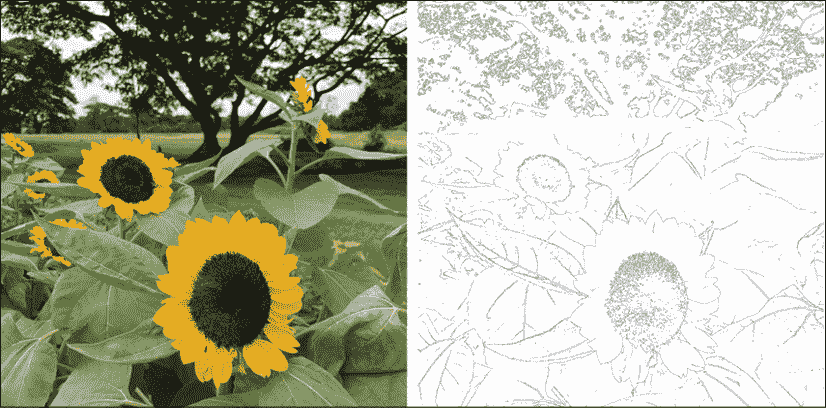

图 7.1.1：对齐图像对的示例：使用 Canny 边缘检测器的左，原始图像和右，变换后的图像。 原始照片是作者拍摄的。

在此示例中，我们可以将真实照片（左）视为源域中的图像，将边缘检测的照片（右）视为目标域中的样本。 还有许多其他具有实际应用的跨域翻译过程，例如：

*   卫星图像到地图
*   脸部图像到表情符号，漫画或动画
*   身体图像到头像
*   灰度照片的着色
*   医学扫描到真实照片
*   真实照片到画家的绘画

在不同领域中还有许多其他示例。 例如，在计算机视觉和图像处理中，我们可以通过发明一种从源图像中提取特征并将其转换为目标图像的算法来执行翻译。 坎尼边缘算子就是这种算法的一个例子。 但是，在很多情况下，翻译对于手工工程师而言非常复杂，因此几乎不可能找到合适的算法。 源域分布和目标域分布都是高维且复杂的。

解决图像翻译问题的一种方法是使用深度学习技术。 如果我们具有来自源域和目标域的足够大的数据集，则可以训练神经网络对转换进行建模。 由于必须在给定源图像的情况下自动生成目标域中的图像，因此它们必须看起来像是来自目标域的真实样本。 GAN 是适合此类跨域任务的网络。 *pix2pix* [3]算法是跨域算法的示例。

pix2pix 算法与**条件 GAN**（**CGAN**）[4]相似，我们在“第 4 章”，“生成对抗网络（GAN）”。 我们可以回想起在 CGAN 中，除了`z`噪声输入之外，诸如单热向量之类的条件会限制生成器的输出。 例如，在 MNIST 数字中，如果我们希望生成器输出数字 8，则条件为单热向量`[0, 0, 0, 0, 0, 0, 0, 0, 1, 0]`。 在 pix2pix 中，条件是要翻译的图像。 生成器的输出是翻译后的图像。 通过优化 CGAN 损失来训练 pix2pix 算法。 为了使生成的图像中的模糊最小化，还包括 *L1* 损失。

类似于 pix2pix 的神经网络的主要缺点是训练输入和输出图像必须对齐。“图 7.1.1”是对齐的图像对的示例。 样本目标图像是从源生成的。 在大多数情况下，对齐的图像对不可用或无法从源图像生成，也不昂贵，或者我们不知道如何从给定的源图像生成目标图像。 我们拥有的是来自源域和目标域的样本数据。“图 7.1.2”是来自同一向日葵主题上源域（真实照片）和目标域（范高的艺术风格）的数据示例。 源图像和目标图像不一定对齐。

与 pix2pix 不同，CycleGAN 会学习图像翻译，只要源数据和目标数据之间有足够的数量和差异即可。 无需对齐。 CycleGAN 学习源和目标分布，以及如何从给定的样本数据中将源分布转换为目标分布。 无需监督。 在“图 7.1.2”的上下文中，我们只需要数千张真实向日葵的照片和数千张梵高向日葵画的照片。 在训练了 CycleGAN 之后，我们可以将向日葵的照片转换成梵高的画作：

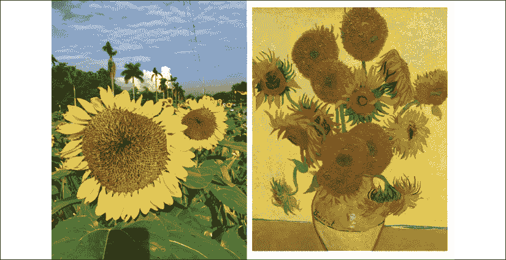

图 7.1.2：未对齐的图像对示例：左侧为菲律宾大学沿着大学大道的真实向日葵照片，右侧为伦敦国家美术馆的梵高的向日葵， 英国。 原始照片由作者拍摄。

下一个问题是：我们如何建立可以从未配对数据中学习的模型？ 在下一部分中，我们将构建一个使用正向和反向循环 GAN 的 CycleGAN，以及一个循环一致性检查，以消除对配对输入数据的需求。

## CycleGAN 模型

“图 7.1.3”显示了 CycleGAN 的网络模型：


图 7.1.3：CycleGAN 模型包含四个网络：生成器`G`，生成器`F`，判别器`D[y]`和判别器`D[x]`

让我们逐个讨论“图 7.1.3”。 让我们首先关注上层网络，即转发周期 GAN。 如下图“图 7.1.4”所示，正向循环 CycleGAN 的目标是学习以下函数：

 (Equation 7.1.1)

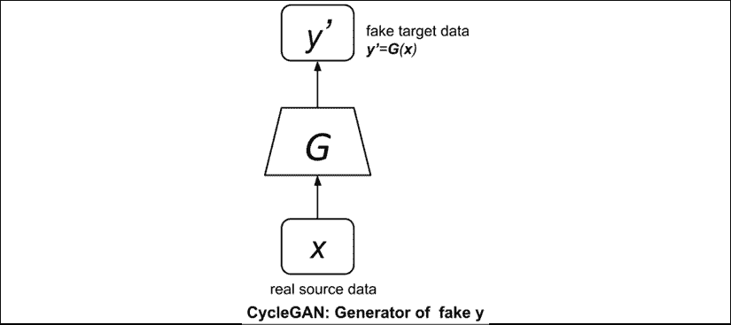

图 7.1.4：伪造`y`的 CycleGAN 生成器`G`

“公式 7.1.1”只是假目标数据`y'`的生成器`G`。 它将数据从源域`x`转换为目标域`y`。

要训​​练生成器，我们必须构建 GAN。 这是正向循环 GAN，如图“图 7.1.5”所示。 该图表明，它类似于“第 4 章”，“生成对抗网络（GANs）”中的典型 GAN，由生成器`G`和判别器`D[y]`组成，它可以以相同的对抗方式进行训练。通过仅利用源域中的可用实际图像`x`和目标域中的实际图像`y`，进行无监督学习。

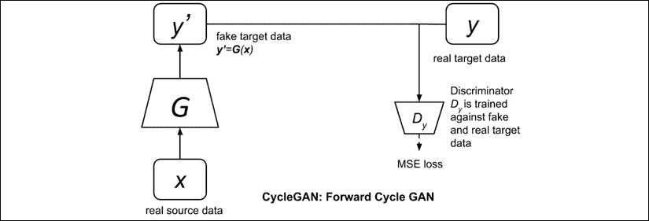

图 7.1.5：CycleGAN 正向循环 GAN

与常规 GAN 不同，CycleGAN 施加了周期一致性约束，如图“图 7.1.6”所示。 前向循环一致性网络可确保可以从伪造的目标数据中重建真实的源数据：

 (Equation 7.1.2)


图 7.1.6：CycleGAN 循环一致性检查

通过最小化正向循环一致性 *L1* 损耗来完成：

 (Equation 7.1.3)

周期一致性损失使用 *L1* 或**平均绝对误差**（**MAE**），因为与 *L2* 或**均方误差**（**MSE**）相比，它通常导致较少的模糊图像重建。

循环一致性检查表明，尽管我们已将源数据`x`转换为域`y`，但`x`的原始特征仍应保留在`y`中并且可恢复。 网络`F`只是我们将从反向循环 GAN 借用的另一个生成器，如下所述。

CycleGAN 是对称的。 如图“图 7.1.7”所示，后向循环 GAN 与前向循环 GAN 相同，但将源数据`x`和目标数据`y`的作用逆转。 现在，源数据为`y`，目标数据为`x`。 生成器`G`和`F`的作用也相反。`F`现在是生成器，而`G`恢复输入。 在正向循环 GAN 中，生成器`F`是用于恢复源数据的网络，而`G`是生成器。

Backward Cycle GAN 生成器的目标是合成：

 (Equation 7.1.2)

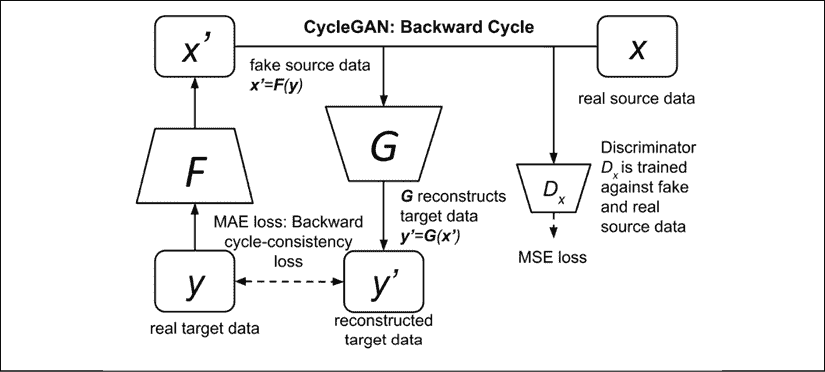

图 7.1.7：CycleGAN 向后循环 GAN

这可以通过对抗性训练反向循环 GAN 来完成。 目的是让生成器`F`学习如何欺骗判别器`D[x]`。

此外，还具有类似的向后循环一致性，以恢复原始源`y`：

 (Equation 7.1.4)

这是通过最小化后向循环一致性 *L1* 损耗来完成的：

 (Equation 7.1.5)

总而言之，CycleGAN 的最终目标是使生成器`G`学习如何合成伪造的目标数据`y'`，该伪造的目标数据`y'`会在正向循环中欺骗识别器`D[y]`。 由于网络是对称的，因此 CycleGAN 还希望生成器`F`学习如何合成伪造的源数据`x'`，该伪造的源数据可以使判别器`D[x]`在反向循环中蒙蔽。 考虑到这一点，我们现在可以将所有损失函数放在一起。

让我们从 GAN 部分开始。 受到*最小二乘 GAN（LSGAN）* [5]更好的感知质量的启发，如“第 5 章”，“改进的 GAN” 中所述，CycleGAN 还使用 MSE 作为判别器和生成器损耗。 回想一下，LSGAN 与原始 GAN 之间的差异需要使用 MSE 损失，而不是二进制交叉熵损失。

CycleGAN 将生成器－标识符损失函数表示为：

 (Equation 7.1.6)

 (Equation 7.1.7)

 (Equation 7.1.8)

 (Equation 7.1.9)

 (Equation 7.1.10)

 (Equation 7.1.11)

损失函数的第二组是周期一致性损失，可以通过汇总前向和后向 GAN 的贡献来得出：


 (Equation 7.1.12)

CycleGAN 的总损失为：

 (Equation 7.1.13)

CycleGAN 建议使用以下权重值`λ1 = 1.0`和`λ2 = 10.0`，以更加重视循环一致性检查。

训练策略类似于原始 GAN。 “算法 7.1.1”总结了 CycleGAN 训练过程。

“算法 7.1.1”：CycleGAN 训练

对`n`训练步骤重复上述步骤：

1.  通过使用真实的源数据和目标数据训练前向循环判别器，将`L_forward_GAN^(D)`降至最低。 实际目标数据的小批量`y`标记为 1.0。 伪造的目标数据`y' = G(x)`的小批量标记为 0.0。
2.  通过使用真实的源数据和目标数据训练反向循环判别器，将`L_backward_GAN^(D)`最小化。 实际源数据的小批量`x`标记为 1.0。 一小部分伪造的源数据`x' = F(y)`被标记为 0.0。

1.  通过训练对抗网络中的前向周期和后向周期生成器，将`L_GAN^(D)`和`L_cyc`最小化。 伪造目标数据的一个小批量`y' = G(x)`被标记为 1.0。 一小部分伪造的源数据`x' = F(y)`被标记为 1.0。 判别器的权重被冻结。

在神经样式转移问题中，颜色组合可能无法成功地从源图像转移到伪造目标图像。 此问题显示在“图 7.1.8”中：

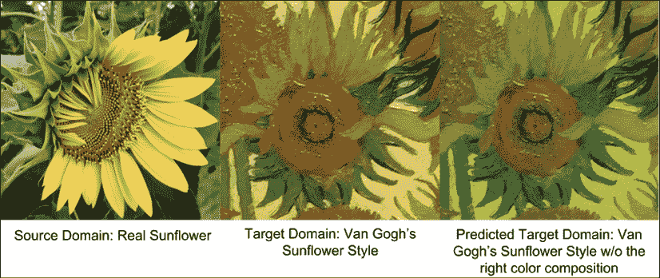

图 7.1.8：在样式传输过程中，颜色组合可能无法成功传输。 为了解决此问题，将身份丢失添加到总损失函数中

为了解决这个问题，CycleGAN 建议包括正向和反向循环身份损失函数：

 (Equation 7.1.14)

CycleGAN 的总损耗变为：

 (Equation 7.1.15)

其中`λ3 = 0.5`。 在对抗训练中，身份损失也得到了优化。“图 7.1.9”重点介绍了实现身份正则器的 CycleGAN 辅助网络：

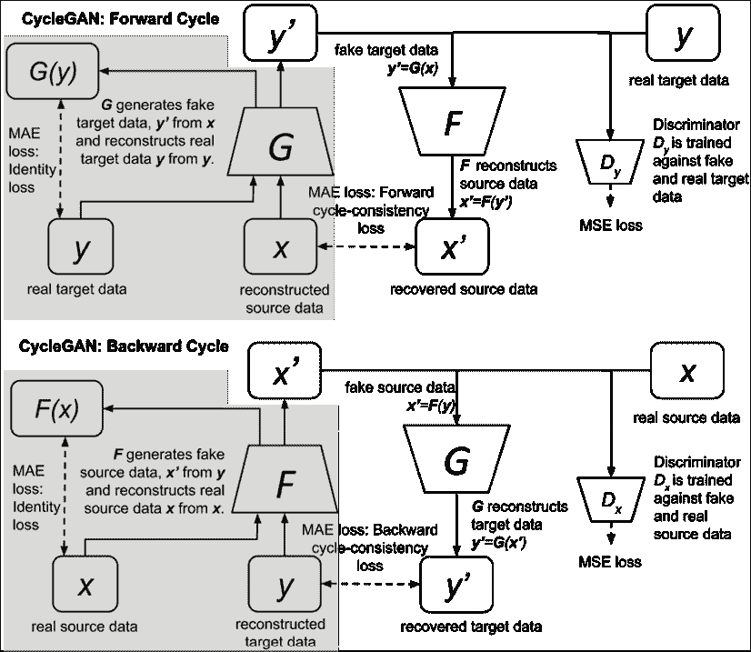

图 7.1.9：具有身份正则化网络的 CycleGAN 模型，图像左侧突出显示

在下一个部分，我们将在`tf.keras`中实现 CycleGAN。

## 使用 Keras 实现 CycleGAN

我们来解决，这是 CycleGAN 可以解决的简单问题。 在“第 3 章”，“自编码器”中，我们使用了自编码器为 CIFAR10 数据集中的灰度图像着色。 我们可以记得，CIFAR10 数据集包含 50,000 个训练过的数据项和 10,000 个测试数据样本，这些样本属于 10 个类别的`32 x 32` RGB 图像。 我们可以使用`rgb2gray`（RGB）将所有彩色图像转换为灰度图像，如“第 3 章”，“自编码器”中所述。

接下来，我们可以将灰度训练图像用作源域图像，将原始彩色图像用作目标域图像。 值得注意的是，尽管数据集是对齐的，但我们 CycleGAN 的输入是彩色图像的随机样本和灰度图像的随机样本。 因此，我们的 CycleGAN 将看不到训练数据对齐。 训练后，我们将使用测试的灰度图像来观察 CycleGAN 的表现。

如前几节所述，要实现 CycleGAN，我们需要构建两个生成器和两个判别器。 CycleGAN 的生成器学习源输入分布的潜在表示，并将该表示转换为目标输出分布。 这正是自编码器的功能。 但是，类似于“第 3 章”，“自编码器”中讨论的典型自编码器，使用的编码器会对输入进行下采样，直到瓶颈层为止，此时解码器中的处理过程相反。

由于在编码器和解码器层之间共享许多低级特征，因此该结构不适用于某些图像转换问题。 例如，在着色问题中，灰度图像的形式，结构和边缘与彩色图像中的相同。 为了解决这个问题，CycleGAN 生成器使用 *U-Net* [7]结构，如图“图 7.1.10”所示：

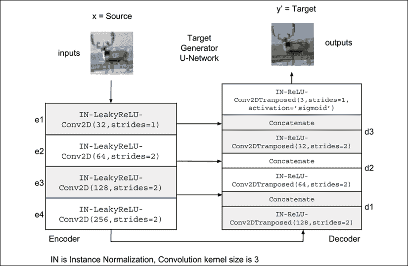

图 7.1.10：在 Keras 中实现正向循环生成器`G`。 产生器是包括编码器和解码器的 U 网络[7]。

在 U-Net 结构中，编码器层的输出`e[ni]`与解码器层的输出`d[i]`，其中`n = 4`是编码器/解码器的层数，`i = 1, 2, 3`是共享信息的层号。

我们应该注意，尽管该示例使用`n = 4`，但输入/输出尺寸较大的问题可能需要更深的编码器/解码器层。 通过 U-Net 结构，可以在编码器和解码器之间自由传输特征级别的信息。

编码器层由`Instance Normalization(IN)-LeakyReLU-Conv2D`组成，而解码器层由`IN-ReLU-Conv2D`组成。 编码器/解码器层的实现如清单 7.1.1 所示，而生成器的实现如列表 7.1.2 所示。

[完整的代码可在 GitHub 上找到](https://github.com/PacktPublishing/Advanced-Deep-Learning-with-Keras)。

**实例规范化**（**IN**）是每个数据（即 IN 是图像或每个特征的 BN）。 在样式迁移中，重要的是标准化每个样本而不是每个批量的对比度。 IN 等于，相当于对比度归一化。 同时，BN 打破了对比度标准化。

记住在使用 IN 之前先安装`tensorflow-addons`：

```py
$ pip install tensorflow-addons 
```

“列表 7.1.1”：`cyclegan-7.1.1.py`

```py
def encoder_layer(inputs,
                  filters=16,
                  kernel_size=3,
                  strides=2,
                  activation='relu',
                  instance_norm=True):
    """Builds a generic encoder layer made of Conv2D-IN-LeakyReLU
    IN is optional, LeakyReLU may be replaced by ReLU
    """ 
```

```py
 conv = Conv2D(filters=filters,
                  kernel_size=kernel_size,
                  strides=strides,
                  padding='same') 
```

```py
 x = inputs
    if instance_norm:
        x = InstanceNormalization(axis=3)(x)
    if activation == 'relu':
        x = Activation('relu')(x)
    else:
        x = LeakyReLU(alpha=0.2)(x)
    x = conv(x)
    return x 
```

```py
def decoder_layer(inputs,
                  paired_inputs,
                  filters=16,
                  kernel_size=3,
                  strides=2,
                  activation='relu',
                  instance_norm=True):
    """Builds a generic decoder layer made of Conv2D-IN-LeakyReLU
    IN is optional, LeakyReLU may be replaced by ReLU
    Arguments: (partial)
    inputs (tensor): the decoder layer input
    paired_inputs (tensor): the encoder layer output 
          provided by U-Net skip connection &
          concatenated to inputs.
    """ 
```

```py
 conv = Conv2DTranspose(filters=filters,
                           kernel_size=kernel_size,
                           strides=strides,
                           padding='same') 
```

```py
 x = inputs
    if instance_norm:
        x = InstanceNormalization(axis=3)(x)
    if activation == 'relu':
        x = Activation('relu')(x)
    else:
        x = LeakyReLU(alpha=0.2)(x)
    x = conv(x)
    x = concatenate([x, paired_inputs])
    return x 
```

将移至生成器实现中：

“列表 7.1.2”：`cyclegan-7.1.1.py`

Keras 中的生成器实现：

```py
def build_generator(input_shape,
                    output_shape=None,
                    kernel_size=3,
                    name=None):
    """The generator is a U-Network made of a 4-layer encoder
    and a 4-layer decoder. Layer n-i is connected to layer i. 
```

```py
 Arguments:
    input_shape (tuple): input shape
    output_shape (tuple): output shape
    kernel_size (int): kernel size of encoder & decoder layers
    name (string): name assigned to generator model 
```

```py
 Returns:
    generator (Model):
    """ 
```

```py
 inputs = Input(shape=input_shape)
    channels = int(output_shape[-1])
    e1 = encoder_layer(inputs,
                       32,
                       kernel_size=kernel_size,
                       activation='leaky_relu',
                       strides=1)
    e2 = encoder_layer(e1,
                       64,
                       activation='leaky_relu',
                       kernel_size=kernel_size)
    e3 = encoder_layer(e2,
                       128,
                       activation='leaky_relu',
                       kernel_size=kernel_size)
    e4 = encoder_layer(e3,
                       256,
                       activation='leaky_relu',
                       kernel_size=kernel_size) 
```

```py
 d1 = decoder_layer(e4,
                       e3,
                       128,
                       kernel_size=kernel_size)
    d2 = decoder_layer(d1,
                       e2,
                       64,
                       kernel_size=kernel_size)
    d3 = decoder_layer(d2,
                       e1,
                       32,
                       kernel_size=kernel_size)
    outputs = Conv2DTranspose(channels,
                              kernel_size=kernel_size,
                              strides=1,
                              activation='sigmoid',
                              padding='same')(d3) 
```

```py
 generator = Model(inputs, outputs, name=name) 
```

```py
 return generator 
```

CycleGAN 的判别器类似于原始 GAN 判别器。 输入图像被下采样数次（在此示例中为 3 次）。 最后一层是`Dense`（1）层，它预测输入为实数的可能性。 除了不使用 IN 之外，每个层都类似于生成器的编码器层。 然而，在大图像中，用一个数字将图像计算为真实图像或伪图像会导致参数效率低下，并导致生成器的图像质量较差。

解决方案是使用 PatchGAN [6]，该方法将图像划分为补丁网格，并使用标量值网格来预测补丁是真实概率。“图 7.1.11”显示了原始 GAN 判别器和`2 x 2` PatchGAN 判别器之间的比较：

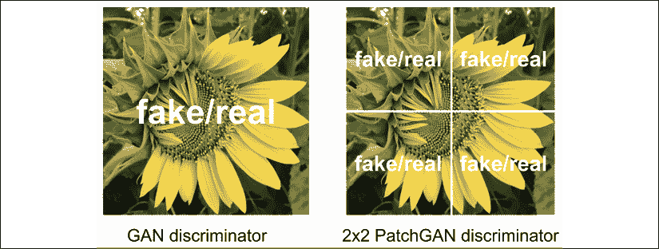

图 7.1.11：GAN 与 PatchGAN 判别器的比较

在此示例中，面片不重叠且在其边界处相遇。 但是，通常，补丁可能会重叠。

我们应该注意，PatchGAN 并没有在 CycleGAN 中引入一种新型的 GAN。 为了提高生成的图像质量，如果使用`2 x 2` PatchGAN，则没有四个输出可以区分，而没有一个输出可以区分。 损失函数没有变化。 从直觉上讲，这是有道理的，因为如果图像的每个面片或部分看起来都是真实的，则整个图像看起来会更加真实。

“图 7.1.12”显示了`tf.keras`中实现的判别器网络。 下图显示了判别器确定输入图像或色块为彩色 CIFAR10 图像的可能性：

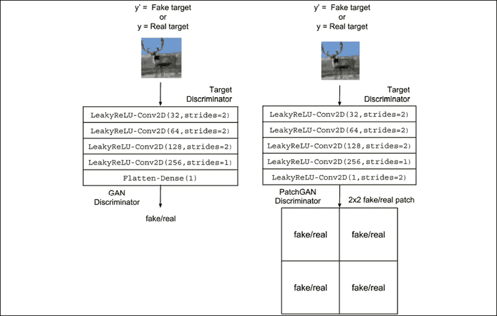

图 7.1.12：目标标识符`D[y]`在`tf.keras`中的实现。 PatchGAN 判别器显示在右侧

由于输出图像只有`32 x 32` RGB 时较小，因此表示该图像是真实的单个标量就足够了。 但是，当使用 PatchGAN 时，我们也会评估结果。“列表 7.1.3”显示了判别器的函数构建器：

“列表 7.1.3”：`cyclegan-7.1.1.py`

`tf.keras`中的判别器实现：

```py
def build_discriminator(input_shape,
                        kernel_size=3,
                        patchgan=True,
                        name=None):
    """The discriminator is a 4-layer encoder that outputs either
    a 1-dim or a n x n-dim patch of probability that input is real 
```

```py
 Arguments:
    input_shape (tuple): input shape
    kernel_size (int): kernel size of decoder layers
    patchgan (bool): whether the output is a patch 
        or just a 1-dim
    name (string): name assigned to discriminator model 
```

```py
 Returns:
    discriminator (Model):
    """ 
```

```py
 inputs = Input(shape=input_shape)
    x = encoder_layer(inputs,
                      32,
                      kernel_size=kernel_size,
                      activation='leaky_relu',
                      instance_norm=False)
    x = encoder_layer(x,
                      64,
                      kernel_size=kernel_size,
                      activation='leaky_relu',
                      instance_norm=False)
    x = encoder_layer(x,
                      128,
                      kernel_size=kernel_size,
                      activation='leaky_relu',
                      instance_norm=False)
    x = encoder_layer(x,
                      256,
                      kernel_size=kernel_size,
                      strides=1,
                      activation='leaky_relu',
                      instance_norm=False) 
```

```py
 # if patchgan=True use nxn-dim output of probability
    # else use 1-dim output of probability
    if patchgan:
        x = LeakyReLU(alpha=0.2)(x)
        outputs = Conv2D(1,
                         kernel_size=kernel_size,
                         strides=2,
                         padding='same')(x)
    else:
        x = Flatten()(x)
        x = Dense(1)(x)
        outputs = Activation('linear')(x) 
```

```py
 discriminator = Model(inputs, outputs, name=name) 
```

```py
 return discriminator 
```

使用生成器和判别器生成器，我们现在可以构建 CycleGAN。“列表 7.1.4”显示了构建器函数。 与上一节中的讨论一致，实例化了两个生成器`g_source = F`和`g_target = G`以及两个判别器`d_source = D[x]`和`d_target = D[y]`。 正向循环为`x' = F(G(x)) = reco_source = g_source(g_target(source_input))`。反向循环为`y' = G(F(y)) = reco_target = g_target(g_source (target_input))`。

对抗模型的输入是源数据和目标数据，而输出是`D[x]`和`D[y]`的输出以及重构的输入`x'`和`y'`。 在本示例中，由于由于灰度图像和彩色图像中通道数之间的差异，因此未使用身份网络。 对于 GAN 和循环一致性损失，我们分别使用建议的`λ1 = 1.0`和`λ2 = 10.0`损失权重。 与前几章中的 GAN 相似，我们使用 RMSprop 作为判别器的优化器，其学习率为`2e-4`，衰减率为`6e-8`。 对抗的学习率和衰退率是判别器的一半。

“列表 7.1.4”：`cyclegan-7.1.1.py`

`tf.keras`中的 CycleGAN 构建器：

```py
def build_cyclegan(shapes,
                   source_name='source',
                   target_name='target',
                   kernel_size=3,
                   patchgan=False,
                   identity=False
                   ):
    """Build the CycleGAN 
```

```py
 1) Build target and source discriminators
    2) Build target and source generators
    3) Build the adversarial network 
```

```py
 Arguments:
    shapes (tuple): source and target shapes
    source_name (string): string to be appended on dis/gen models
    target_name (string): string to be appended on dis/gen models
    kernel_size (int): kernel size for the encoder/decoder
        or dis/gen models
    patchgan (bool): whether to use patchgan on discriminator
    identity (bool): whether to use identity loss 
```

```py
 Returns:
    (list): 2 generator, 2 discriminator, 
        and 1 adversarial models 
    """ 
```

```py
 source_shape, target_shape = shapes
    lr = 2e-4
    decay = 6e-8
    gt_name = "gen_" + target_name
    gs_name = "gen_" + source_name
    dt_name = "dis_" + target_name
    ds_name = "dis_" + source_name 
```

```py
 # build target and source generators
    g_target = build_generator(source_shape,
                               target_shape,
                               kernel_size=kernel_size,
                               name=gt_name)
    g_source = build_generator(target_shape,
                               source_shape,
                               kernel_size=kernel_size,
                               name=gs_name)
    print('---- TARGET GENERATOR ----')
    g_target.summary()
    print('---- SOURCE GENERATOR ----')
    g_source.summary() 
```

```py
 # build target and source discriminators
    d_target = build_discriminator(target_shape,
                                   patchgan=patchgan,
                                   kernel_size=kernel_size,
                                   name=dt_name)
    d_source = build_discriminator(source_shape,
                                   patchgan=patchgan,
                                   kernel_size=kernel_size,
                                   name=ds_name)
    print('---- TARGET DISCRIMINATOR ----')
    d_target.summary()
    print('---- SOURCE DISCRIMINATOR ----')
    d_source.summary() 
```

```py
 optimizer = RMSprop(lr=lr, decay=decay)
    d_target.compile(loss='mse',
                     optimizer=optimizer,
                     metrics=['accuracy'])
    d_source.compile(loss='mse',
                     optimizer=optimizer,
                     metrics=['accuracy']) 
```

```py
 d_target.trainable = False
    d_source.trainable = False 
```

```py
 # build the computational graph for the adversarial model
    # forward cycle network and target discriminator
    source_input = Input(shape=source_shape)
    fake_target = g_target(source_input)
    preal_target = d_target(fake_target)
    reco_source = g_source(fake_target) 
```

```py
 # backward cycle network and source discriminator
    target_input = Input(shape=target_shape)
    fake_source = g_source(target_input)
    preal_source = d_source(fake_source)
    reco_target = g_target(fake_source) 
```

```py
 # if we use identity loss, add 2 extra loss terms
    # and outputs
    if identity:
        iden_source = g_source(source_input)
        iden_target = g_target(target_input)
        loss = ['mse', 'mse', 'mae', 'mae', 'mae', 'mae']
        loss_weights = [1., 1., 10., 10., 0.5, 0.5]
        inputs = [source_input, target_input]
        outputs = [preal_source,
                   preal_target,
                   reco_source,
                   reco_target,
                   iden_source,
                   iden_target]
    else:
        loss = ['mse', 'mse', 'mae', 'mae']
        loss_weights = [1., 1., 10., 10.]
        inputs = [source_input, target_input]
        outputs = [preal_source,
                   preal_target,
                   reco_source,
                   reco_target] 
```

```py
 # build adversarial model
    adv = Model(inputs, outputs, name='adversarial')
    optimizer = RMSprop(lr=lr*0.5, decay=decay*0.5)
    adv.compile(loss=loss,
                loss_weights=loss_weights,
                optimizer=optimizer,
                metrics=['accuracy'])
    print('---- ADVERSARIAL NETWORK ----')
    adv.summary() 
```

```py
 return g_source, g_target, d_source, d_target, adv 
```

我们遵循训练过程，我们可以从上一节中的“算法 7.1.1”中调用。“列表 7.1.5”显示了 CycleGAN 训练。 此训练与原始 GAN 之间的次要区别是有两个要优化的判别器。 但是，只有一种对抗模型需要优化。 对于每 2,000 步，生成器将保存预测的源图像和目标图像。 我们将的批量大小设为 32。我们也尝试了 1 的批量大小，但是输出质量几乎相同，并且需要花费更长的时间进行训练（批量为每个图像 43 ms，在 NVIDIA GTX 1060 上批量大小为 32 时，最大大小为每个图像 1 vs 3.6 ms）

“列表 7.1.5”：`cyclegan-7.1.1.py`

`tf.keras`中的 CycleGAN 训练例程：

```py
def train_cyclegan(models,
                   data,
                   params,
                   test_params,
                   test_generator):
    """ Trains the CycleGAN. 

    1) Train the target discriminator
    2) Train the source discriminator
    3) Train the forward and backward cyles of 
        adversarial networks 
```

```py
 Arguments:
    models (Models): Source/Target Discriminator/Generator,
        Adversarial Model
    data (tuple): source and target training data
    params (tuple): network parameters
    test_params (tuple): test parameters
    test_generator (function): used for generating 
        predicted target and source images
    """ 
```

```py
 # the models
    g_source, g_target, d_source, d_target, adv = models
    # network parameters
    batch_size, train_steps, patch, model_name = params
    # train dataset
    source_data, target_data, test_source_data, test_target_data\
            = data 
```

```py
 titles, dirs = test_params 
```

```py
 # the generator image is saved every 2000 steps
    save_interval = 2000
    target_size = target_data.shape[0]
    source_size = source_data.shape[0] 
```

```py
 # whether to use patchgan or not
    if patch > 1:
        d_patch = (patch, patch, 1)
        valid = np.ones((batch_size,) + d_patch)
        fake = np.zeros((batch_size,) + d_patch)
    else:
        valid = np.ones([batch_size, 1])
        fake = np.zeros([batch_size, 1]) 
```

```py
 valid_fake = np.concatenate((valid, fake))
    start_time = datetime.datetime.now() 
```

```py
 for step in range(train_steps):
        # sample a batch of real target data
        rand_indexes = np.random.randint(0,
                                         target_size,
                                         size=batch_size)
        real_target = target_data[rand_indexes] 
```

```py
 # sample a batch of real source data
        rand_indexes = np.random.randint(0,
                                         source_size,
                                         size=batch_size)
        real_source = source_data[rand_indexes]
        # generate a batch of fake target data fr real source data
        fake_target = g_target.predict(real_source) 
```

```py
 # combine real and fake into one batch
        x = np.concatenate((real_target, fake_target))
        # train the target discriminator using fake/real data
        metrics = d_target.train_on_batch(x, valid_fake)
        log = "%d: [d_target loss: %f]" % (step, metrics[0]) 
```

```py
 # generate a batch of fake source data fr real target data
        fake_source = g_source.predict(real_target)
        x = np.concatenate((real_source, fake_source))
        # train the source discriminator using fake/real data
        metrics = d_source.train_on_batch(x, valid_fake)
        log = "%s [d_source loss: %f]" % (log, metrics[0]) 
```

```py
 # train the adversarial network using forward and backward
        # cycles. the generated fake source and target 
        # data attempts to trick the discriminators
        x = [real_source, real_target]
        y = [valid, valid, real_source, real_target]
        metrics = adv.train_on_batch(x, y)
        elapsed_time = datetime.datetime.now() - start_time
        fmt = "%s [adv loss: %f] [time: %s]"
        log = fmt % (log, metrics[0], elapsed_time)
        print(log)
        if (step + 1) % save_interval == 0:
            test_generator((g_source, g_target),
                           (test_source_data, test_target_data),
                           step=step+1,
                           titles=titles,
                           dirs=dirs,
                           show=False) 
```

```py
 # save the models after training the generators
    g_source.save(model_name + "-g_source.h5")
    g_target.save(model_name + "-g_target.h5") 
```

最后，在使用 CycleGAN 构建和训练函数之前，我们必须执行一些数据准备。 模块`cifar10_utils.py`和`other_ utils.py`加载`CIFAR10`训练和测试数据。 有关这两个文件的详细信息，请参考源代码。 加载后，将训练图像和测试图像转换为灰度，以生成源数据和测试源数据。

“列表 7.1.6”显示了 CycleGAN 如何用于构建和训练用于灰度图像着色的生成器网络（`g_target`）。 由于 CycleGAN 是对称的，因此我们还构建并训练了第二个生成器网络（`g_source`），该网络可以将颜色转换为灰度。 训练了两个 CycleGAN 着色网络。 第一种使用标量输出类似于原始 GAN 的判别器，第二种使用`2 x 2` PatchGAN。

“列表 7.1.6”：`cyclegan-7.1.1.py`

CycleGAN 用于着色：

```py
def graycifar10_cross_colorcifar10(g_models=None):
    """Build and train a CycleGAN that can do
        grayscale <--> color cifar10 images
    """ 
```

```py
 model_name = 'cyclegan_cifar10'
    batch_size = 32
    train_steps = 100000
    patchgan = True
    kernel_size = 3
    postfix = ('%dp' % kernel_size) \
            if patchgan else ('%d' % kernel_size) 
```

```py
 data, shapes = cifar10_utils.load_data()
    source_data, _, test_source_data, test_target_data = data
    titles = ('CIFAR10 predicted source images.',
              'CIFAR10 predicted target images.',
              'CIFAR10 reconstructed source images.',
              'CIFAR10 reconstructed target images.')
    dirs = ('cifar10_source-%s' % postfix, \
            'cifar10_target-%s' % postfix) 
```

```py
 # generate predicted target(color) and source(gray) images
    if g_models is not None:
        g_source, g_target = g_models
        other_utils.test_generator((g_source, g_target),
                                   (test_source_data, \
                                           test_target_data),
                                   step=0,
                                   titles=titles,
                                   dirs=dirs,
                                   show=True)
        return 
```

```py
 # build the cyclegan for cifar10 colorization
    models = build_cyclegan(shapes,
                            "gray-%s" % postfix,
                            "color-%s" % postfix,
                            kernel_size=kernel_size,
                            patchgan=patchgan)
    # patch size is divided by 2^n since we downscaled the input
    # in the discriminator by 2^n (ie. we use strides=2 n times)
    patch = int(source_data.shape[1] / 2**4) if patchgan else 1
    params = (batch_size, train_steps, patch, model_name)
    test_params = (titles, dirs)
    # train the cyclegan
    train_cyclegan(models,
                   data,
                   params,
                   test_params,
                   other_utils.test_generator) 
```

在的下一部分中，我们将检查 CycleGAN 的生成器输出以进行着色。

## CycleGAN 的生成器输出

“图 7.1.13”显示 CycleGAN 的着色结果。 源图像来自测试数据集：

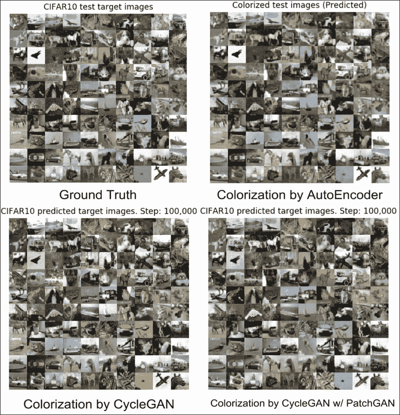

图 7.1.13：使用不同技术进行着色。 显示的是基本事实，使用自编码器的着色（第 3 章，自编码器），使用带有原始 GAN 判别器的 CycleGAN 进行着色，以及使用带有 PatchGAN 判别器的 CycleGAN 进行着色。 彩色效果最佳。 原始彩色照片可以在该书的 [GitHub 存储库](https://github.com/PacktPublishing/Advanced-Deep-Learning-with-Keras/blob/master/chapter7-cross-domain-gan/README.md)中找到。

为了进行比较，我们使用第 3 章，“自编码器”中描述的普通自编码器显示了地面真实情况和着色结果。 通常，所有彩色图像在感觉上都是可接受的。 总体而言，似乎每种着色技术都有自己的优点和缺点。 所有着色方法与天空和车辆的正确颜色不一致。

例如，平面背景（第三行，第二列）中的天空为白色。 自编码器没错，但是 CycleGAN 认为它是浅棕色或蓝色。

对于第六行第六列，暗海上的船天空阴沉，但自编码器将其涂成蓝色和蓝色，而 CycleGAN 将其涂成蓝色和白色，而没有 PatchGAN。 两种预测在现实世界中都是有意义的。 同时，使用 PatchGAN 对 CycleGAN 的预测与基本事实相似。 在倒数第二行和第二列上，没有方法能够预测汽车的红色。 在动物身上，CycleGAN 的两种口味都具有接近真实情况的颜色。

由于 CycleGAN 是对称的，因此它还能在给定彩色图像的情况下预测灰度图像。“图 7.1.14”显示了两个 CycleGAN 变体执行的颜色到灰度转换。 目标图像来自测试数据集。 除了某些图像的灰度阴影存在细微差异外，这些预测通常是准确的。

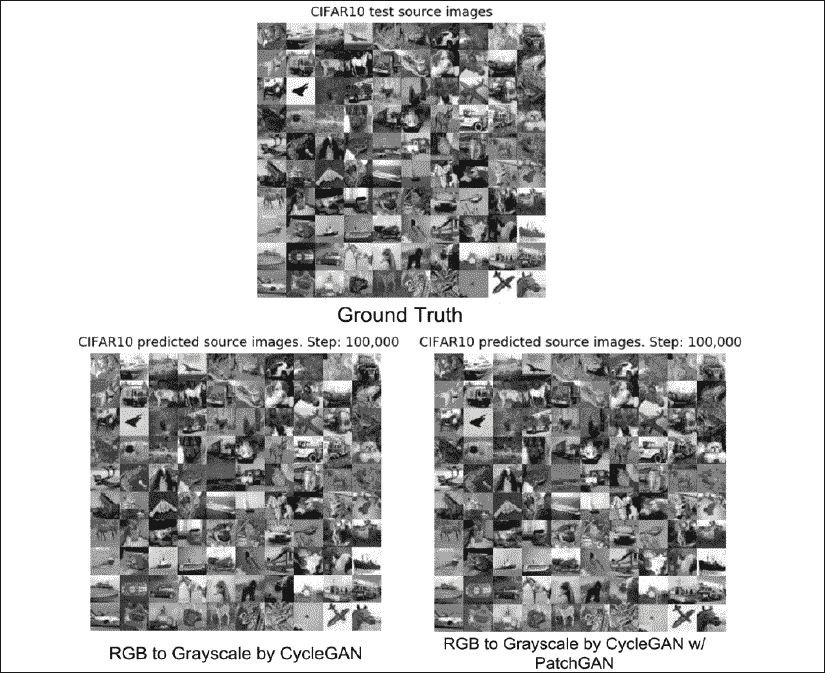

图 7.1.14：颜色（来自图 7.1.9）到 CycleGAN 的灰度转换

要训​​练 CycleGAN 进行着色，命令是：

```py
python3 cyclegan-7.1.1.py -c 
```

读者可以使用带有 PatchGAN 的 CycleGAN 预训练模型来运行图像转换：

```py
python3 cyclegan-7.1.1.py --cifar10_g_source=cyclegan_cifar10-g_source.h5
--cifar10_g_target=cyclegan_cifar10-g_target.h5 
```

在本节中，我们演示了 CycleGAN 在着色上的一种实际应用。 在下一部分中，我们将在更具挑战性的数据集上训练 CycleGAN。 源域 MNIST 与目标域 SVHN 数据集有很大的不同[1]。

## MNIST 和 SVHN 数据集上的 CycleGAN

我们现在要解决一个更具挑战性的问题。 假设我们使用 MNIST 灰度数字作为源数据，并且我们想从 *SVHN* [1]中借鉴样式，这是我们的目标数据。 每个域中的样本数据显示在“图 7.1.15”中：


图 7.1.15：两个未对齐数据的不同域。 原始彩色照片可以在该书的 [GitHub 存储库](https://github.com/PacktPublishing/Advanced-Deep-Learning-with-Keras/blob/master/chapter7-cross-domain-gan/README.md)中找到。

我们可以重用上一节中讨论的 CycleGAN 的所有构建和训练函数，以执行样式迁移。 唯一的区别是，我们必须添加用于加载 MNIST 和 SVHN 数据的例程。 SVHN 数据集可在[这个页面](http://ufldl.stanford.edu/housenumbers/)中找到。

我们介绍`mnist_svhn_utils.py`模块来帮助我们完成此任务。“列表 7.1.7”显示了针对跨域传输的 CycleGAN 的初始化和训练。

CycleGAN 结构与上一部分相同，不同之处在于我们使用的内核大小为 5，因为两个域完全不同。

“列表 7.1.7”：`cyclegan-7.1.1.py`

CycleGAN 用于 MNIST 和 SVHN 之间的跨域样式转移：

```py
def mnist_cross_svhn(g_models=None):
    """Build and train a CycleGAN that can do mnist <--> svhn
    """ 
```

```py
 model_name = 'cyclegan_mnist_svhn'
    batch_size = 32
    train_steps = 100000
    patchgan = True
    kernel_size = 5
    postfix = ('%dp' % kernel_size) \
            if patchgan else ('%d' % kernel_size) 
```

```py
 data, shapes = mnist_svhn_utils.load_data()
    source_data, _, test_source_data, test_target_data = data
    titles = ('MNIST predicted source images.',
              'SVHN predicted target images.',
              'MNIST reconstructed source images.',
              'SVHN reconstructed target images.')
    dirs = ('mnist_source-%s' \
            % postfix, 'svhn_target-%s' % postfix) 
```

```py
 # generate predicted target(svhn) and source(mnist) images
    if g_models is not None:
        g_source, g_target = g_models
        other_utils.test_generator((g_source, g_target),
                                   (test_source_data, \
                                           test_target_data),
                                   step=0,
                                   titles=titles,
                                   dirs=dirs,
                                   show=True)
        return 
```

```py
 # build the cyclegan for mnist cross svhn
    models = build_cyclegan(shapes,
                            "mnist-%s" % postfix,
                            "svhn-%s" % postfix,
                            kernel_size=kernel_size,
                            patchgan=patchgan)
    # patch size is divided by 2^n since we downscaled the input
    # in the discriminator by 2^n (ie. we use strides=2 n times)
    patch = int(source_data.shape[1] / 2**4) if patchgan else 1
    params = (batch_size, train_steps, patch, model_name)
    test_params = (titles, dirs)
    # train the cyclegan
    train_cyclegan(models,
                   data,
                   params,
                   test_params,
                   other_utils.test_generator) 
```

将 MNIST 从测试数据集传输到 SVHN 的结果显示在“图 7.1.16”中。 生成的图像具有样式的 SVHN，但是数字未完全传送。 例如，在第四行上，数字 3、1 和 3 由 CycleGAN 进行样式化。

但是，在第三行中，不带有和带有 PatchGAN 的 CycleGAN 的数字 9、6 和 6 分别设置为 0、6、01、0、65 和 68：

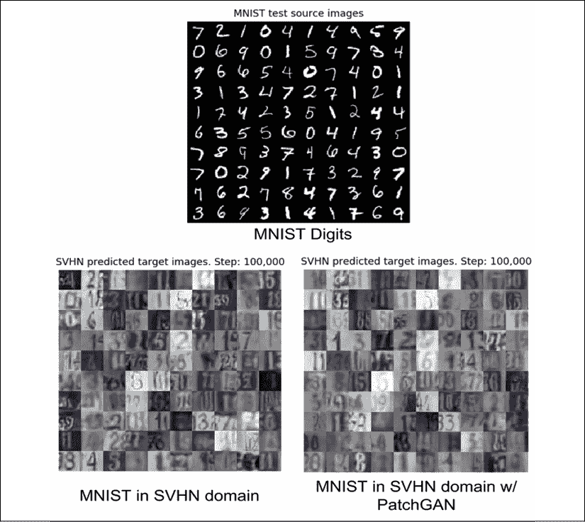

图 7.1.16：测试数据从 MNIST 域到 SVHN 的样式转移。 原始彩色照片可以在该书的 [GitHub 存储库](https://github.com/PacktPublishing/Advanced-Deep-Learning-with-Keras/blob/master/chapter7-cross-domain-gan/README.md)中找到。

向后循环的结果为“图 7.1.17”中所示的。 在这种情况下，目标图像来自 SVHN 测试数据集。 生成的图像具有 MNIST 的样式，但是数字没有正确翻译。 例如，在第一行中，对于不带和带有 PatchGAN 的 CycleGAN，数字 5、2 和 210 分别被样式化为 7、7、8、3、3 和 1：

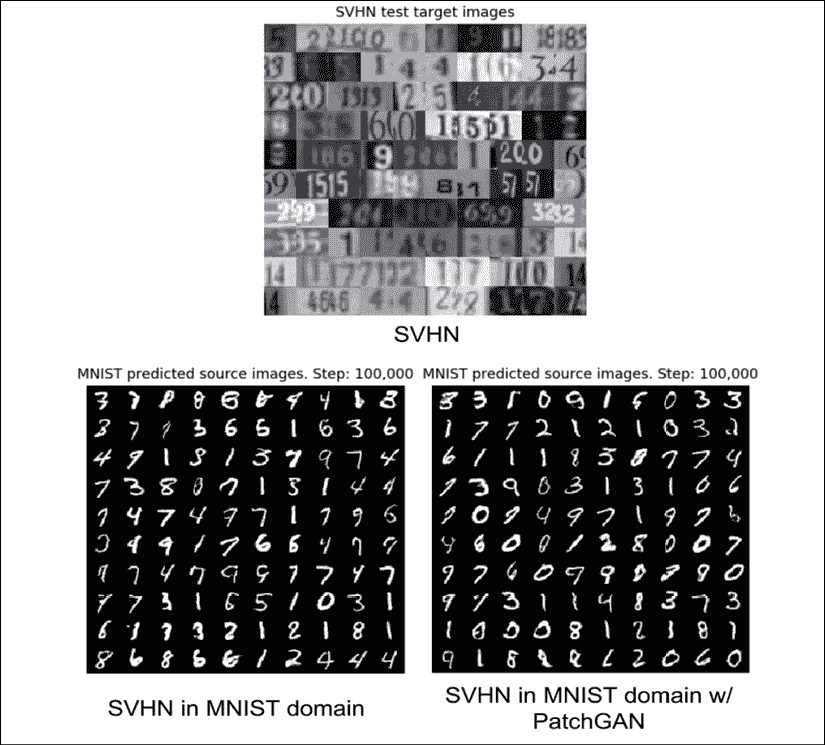

图 7.1.17：测试数据从 SVHN 域到 MNIST 的样式转移。 原始彩色照片可以在该书的 [GitHub 存储库](https://github.com/PacktPublishing/Advanced-Deep-Learning-with-Keras/blob/master/chapter7-cross-domain-gan/README.md)中找到。

在 PatchGAN 的情况下，假设预测的 MNIST 数字被限制为一位，则输出 1 是可以理解的。 有以某种方式正确的预测，例如在第二行中，不使用 PatchGAN 的 CycleGAN 将 SVHN 数字的最后三列 6、3 和 4 转换为 6、3 和 6。 但是，CycleGAN 两种版本的输出始终是个位数且可识别。

从 MNIST 到 SVHN 的转换中出现的问题称为“标签翻转”[8]，其中源域中的数字转换为目标域中的另一个数字。 尽管 CycleGAN 的预测是周期一致的，但它们不一定是语义一致的。 在翻译过程中数字的含义会丢失。

为了解决这个问题， *Hoffman* [8]引入了一种改进的 CycleGAN，称为**循环一致性对抗域自适应**（**CyCADA**）。 不同之处在于，附加的语义损失术语可确保预测不仅周期一致，而且语义一致。

“图 7.1.18”显示 CycleGAN 在正向循环中重建 MNIST 数字。 重建的 MNIST 数字几乎与源 MNIST 数字相同：

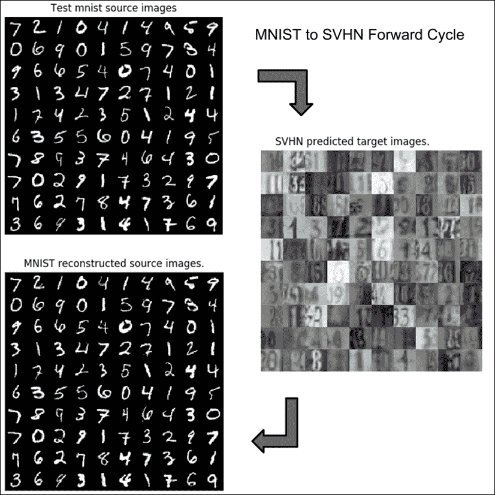

图 7.1.18：带有 MNIST 上的 PatchGAN 的 CycleGAN（源）到 SVHN（目标）的前向周期。 重建的源类似于原始源。 原始彩色照片可以在该书的 [GitHub 存储库](https://github.com/PacktPublishing/Advanced-Deep-Learning-with-Keras/blob/master/chapter7-cross-domain-gan/README.md)中找到。

“图 7.1.19”显示了 CycleGAN 在向后周期中重构 SVHN 数字的过程：


图 7.1.19：带有 MNIST 上的 PatchGAN 的 CycleGAN 与 SVHN（目标）的反向循环。 重建的目标与原始目标并不完全相似。 原始彩色照片可以在该书的 [GitHub 存储库](https://github.com/PacktPublishing/Advanced-Deep-Learning-with-Keras/blob/master/chapter7-cross-domain-gan/README.md)中找到。

在“图 7.1.3”中，CycleGAN 被描述为具有周期一致性。 换句话说，给定源`x`，CycleGAN 将正向循环中的源重构为`x'`。 另外，在给定目标`y`的情况下，CycleGAN 在反向循环中将目标重构为`y'`。

重建了许多目标图像。 有些数字显然是相同的，例如最后两列（3 和 4）中的第二行，而有些数字却是相同的但是模糊的，例如前两列列中的第一行（5 和 2）。  尽管样式仍像第二行一样，但在前两列（从 33 和 6 到 1 以及无法识别的数字）中，有些数字会转换为另一数字。

要将 MNIST 的 CycleGAN 训练为 SVHN，命令为：

```py
python3 cyclegan-7.1.1.py -m 
```

鼓励读者使用带有 PatchGAN 的 CycleGAN 预训练模型来运行图像翻译：

```py
python3 cyclegan-7.1.1.py --mnist_svhn_g_source=cyclegan_mnist_svhn-g_ source.h5 --mnist_svhn_g_target=cyclegan_mnist_svhn-g_target.h5 
```

到目前为止，我们只看到了 CycleGAN 的两个实际应用。 两者都在小型数据集上进行了演示，以强调可重复性的概念。 如本章前面所述，CycleGAN 还有许多其他实际应用。 我们在这里介绍的 CycleGAN 可以作为分辨率更高的图像转换的基础。

# 2\. 总结

在本章中，我们讨论了 CycleGAN 作为可用于图像翻译的算法。 在 CycleGAN 中，源数据和目标数据不一定要对齐。 我们展示了两个示例，*灰度 ↔ 颜色*和 *MNIST ↔ SVHN* ，尽管 CycleGAN 可以执行许多其他可能的图像转换 。

在下一章中，我们将着手另一种生成模型，即**变分自编码器**（**VAE**）。 VAE 具有类似的学习目标–如何生成新图像（数据）。 他们专注于学习建模为高斯分布的潜在向量。 我们将以有条件的 VAE 和解开 VAE 中的潜在表示形式来证明 GAN 解决的问题中的其他相似之处。

# 3\. 参考

1.  `Yuval Netzer et al.: Reading Digits in Natural Images with Unsupervised Feature Learning. NIPS workshop on deep learning and unsupervised feature learning. Vol. 2011. No. 2. 2011 (https://www-cs.stanford.edu/~twangcat/papers/nips2011_housenumbers.pdf).`
1.  `Zhu-Jun-Yan et al.: Unpaired Image-to-Image Translation using Cycle-Consistent Adversarial Networks. 2017 IEEE International Conference on Computer Vision (ICCV). IEEE, 2017 (http://openaccess.thecvf.com/content_ICCV_2017/papers/Zhu_Unpaired_Image-To-Image_Translation_ICCV_2017_paper.pdf).`
1.  `Phillip Isola et al.: Image-to-Image Translation with Conditional Adversarial Networks. 2017 IEEE Conference on Computer Vision and Pattern Recognition (CVPR). IEEE, 2017 (http://openaccess.thecvf.com/content_cvpr_2017/papers/Isola_Image-To-Image_Translation_With_CVPR_2017_paper.pdf).`
1.  `Mehdi Mirza and Simon Osindero. Conditional Generative Adversarial Nets. arXiv preprint arXiv:1411.1784, 2014 (https://arxiv.org/pdf/1411.1784.pdf).`
1.  `Xudong Mao et al.: Least Squares Generative Adversarial Networks. 2017 IEEE International Conference on Computer Vision (ICCV). IEEE, 2017 (http://openaccess.thecvf.com/content_ICCV_2017/papers/Mao_Least_Squares_Generative_ICCV_2017_paper.pdf).`
1.  `Chuan Li and Michael Wand. Precomputed Real-Time Texture Synthesis with Markovian Generative Adversarial Networks. European Conference on Computer Vision. Springer, Cham, 2016 (https://arxiv.org/pdf/1604.04382.pdf).`
1.  `Olaf Ronneberger, Philipp Fischer, and Thomas Brox. U-Net: Convolutional Networks for Biomedical Image Segmentation. International Conference on Medical image computing and computer-assisted intervention. Springer, Cham, 2015 (https://arxiv.org/pdf/1505.04597.pdf).`
1.  `Judy Hoffman et al.: CyCADA: Cycle-Consistent Adversarial Domain Adaptation. arXiv preprint arXiv:1711.03213, 2017 (https://arxiv.org/pdf/1711.03213.pdf).`