# 12

# 语义分割

在“第 11 章”，“对象检测”中，我们讨论了对象检测作为一种重要的计算机视觉算法，具有多种实际应用。 在本章中，我们将讨论另一种称为语义分割的相关算法。 如果对象检测的目的是对图像中的每个对象同时执行定位和标识，则在语义分割中，目的是根据每个像素的对象类别对它们进行分类。

进一步扩展类比，在对象检测中，我们使用边界框显示结果。 在语义分割中，同一对象的所有像素都属于同一类别。 在视觉上，同一对象的所有像素将具有相同的颜色。 例如，属于**苏打水**类别的所有像素均为蓝色。 非苏打罐对象的像素将具有不同的颜色。

类似于对象检测，语义分割有许多实际应用。 在医学成像中，它可用于分离和测量正常细胞与异常细胞的区域。 在卫星成像中，语义分段可用于度量森林覆盖率或灾难期间的洪水程度。 通常，语义分割可用于识别属于同一类对象的像素。 识别每个对象的各个实例并不重要。

好奇的读者可能会想知道，一般而言，不同的分割算法与特别是语义分割算法之间有什么区别？ 在以下部分中，我们将对不同的分割算法进行限定。

总而言之，本章的目的是为了提出：

*   不同类型的细分算法
*   **全卷积网络**（**FCN**）作为语义分割算法的实现
*   `tf.keras`中 FCN 的实施和评估

我们将从讨论不同的分割算法开始。

# 1.细分

分割算法将图像划分为像素或区域集。 分区的目的是为了更好地理解图像表示的内容。 像素组可以表示图像中特定应用感兴趣的对象。 我们划分的方式区分了不同的分割算法。

在某些应用中，我们对给定图像中的特定可数对象感兴趣。 例如，在自主导航中，我们对车辆，交通标志，行人和道路上的其他物体的实例感兴趣。 这些可计数对象统称为，称为**事物**。 所有其他像素都集中在一起作为背景。 这种类型的细分称为**实例细分**。

在其他应用中，我们对可数对象不感兴趣，而对无定形的不可数区域感兴趣，例如天空，森林，植被，道路，草地，建筑物和水体。 这些对象统称为东西。 这种类型的分段称为**语义分段**。

大致上，**事物**和**事物**共同构成了整个图像。 如果算法可以识别事物像素和填充像素，则其称为**全光分割**，如 Kirilov 等人所定义。 （2019）[1]。

但是，事物与事物之间的区别并不严格。 应用程序可能将可数对象统称为东西。 例如，在百货商店中，不可能识别机架上的服装实例。 它们可以作为布料一起集中在一起。

“图 12.1.1”显示了不同类型的细分之间的区别。 输入的图像在桌子的顶部显示了两个汽水罐和两个果汁罐。 背景杂乱无章。 假设我们只对汽水罐和果汁罐感兴趣，在实例细分中，我们为每个对象实例分配唯一的颜色以分别区分四个对象。 对于语义分割，我们假设将所有的汽水罐都塞在一起，将果汁罐作为另一罐塞在一起，将背景作为最后的罐塞在一起。 基本上，我们为每种物料分配了唯一的颜色。 最后，在全景分割中，我们假设只有背景才是背景，而我们只对苏打水和果汁罐感兴趣。

对于这本书，我们仅探讨语义分割。 按照“图 12.1.1”中的示例，我们将为“第 11 章”，“对象检测”中使用的对象分配唯一的填充类别：1）[HTG6 水壶，2）**汽水罐**和 3）**果汁罐**。 第四个也是最后一个类别是背景。


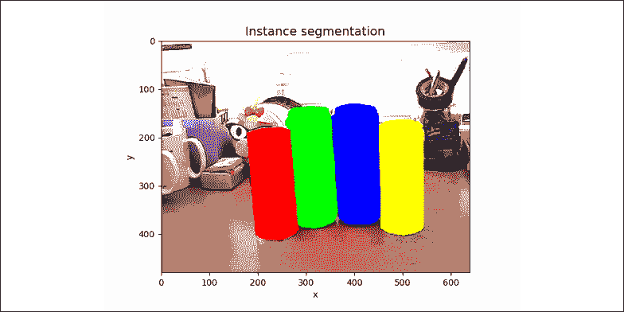

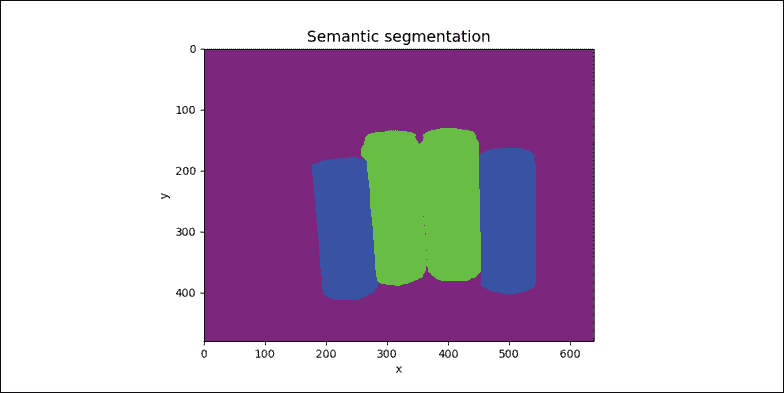

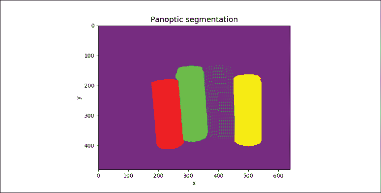

图 12.1.1：显示不同分割算法的四幅图像。 彩色效果最佳。 原始图像可以在 https://github.com/PacktPublishing/Advanced-Deep-Learning-with-Keras/tree/master/chapter12-segmentation 中找到

# 2.语义分割网络

从上一节中，我们了解到语义分割网络是一个像素级分类器。 网络框图显示在“图 12.2.1”中。 但是，与简单分类器不同（例如，“第 1 章”， *Keras* 和“第 2 章”， *Deep Neural 引入了 MNIST 分类器） 网络*），其中只有一个分类器生成`one-hot vector`作为输出，在语义分段中，我们有并行运行的并行分类器。 每个人都在生成自己的单热点矢量预测。 分类器的数量等于输入图像中的像素数量或图像宽度与高度的乘积。 每个`one-hot vector`预测的维数等于感兴趣的填充对象类别的数量。


图 12.2.1：可以将语义分割网络视为按像素分类器。 彩色效果最佳。 原始图像可以在 https://github.com/PacktPublishing/Advanced-Deep-Learning-with-Keras/tree/master/chapter12-segmentation 中找到

例如，假设我们对以下四个类别感兴趣：0）**背景**，1）**水壶**，2）**汽水罐**和 3）[HTG6 果汁可以，我们可以在“图 12.2.2”中看到，每个对象类别有四个像素。

相应地，使用 4-dim `one-hot vector`对每个像素进行分类。 我们使用阴影表示像素的类别。 利用这一知识，我们可以想象一个语义分割网络预测`image_width` x `image_height` 4 维一热向量作为输出，每个像素一个 4 维一热向量：

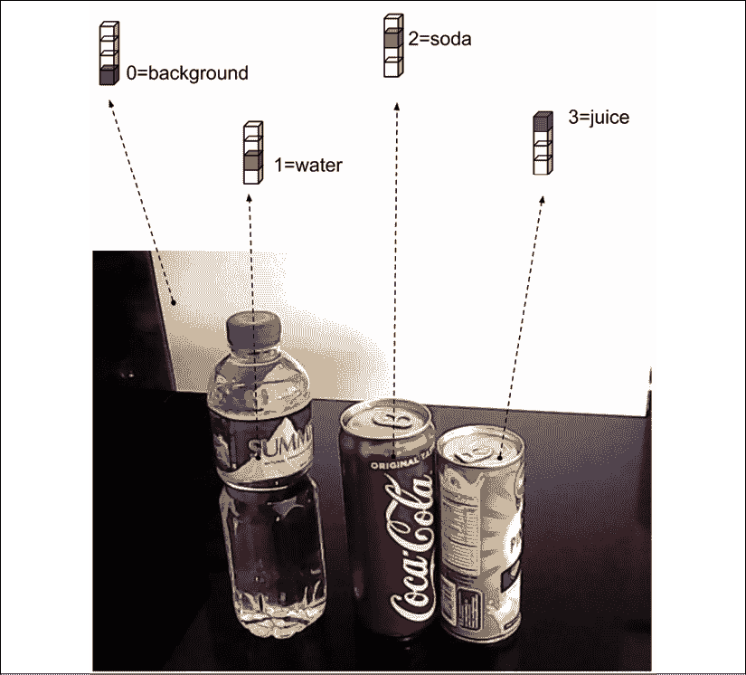

图 12.2.2：四个不同的样本像素。 使用 4 维一热向量，每个像素根据其类别进行分类。 彩色效果最佳。 原始图像可以在 https://github.com/PacktPublishing/Advanced-Deep-Learning-with-Keras/tree/master/chapter12-segmentation 中找到

了解了语义分割的概念后，我们现在可以介绍神经网络像素级分类器。 Long 等人的*完全卷积网络（FCN）启发了我们的语义分段网络体系结构。 （2015）* [2]。 FCN 的关键思想是在生成最终预测时使用多个比例的特征图。

我们的语义分段网络显示在“图 12.2.3”中。 它的输入是 RGB 图像（例如 640 x 480 x 3），并且输出具有类似尺寸的张量，但最后一个尺寸是填充类别的数量（例如，对于 4 种填充类别而言是 640 x 480 x 4 ）。 出于可视化目的，我们通过为每种类别分配颜色来将输出映射到 RGB：

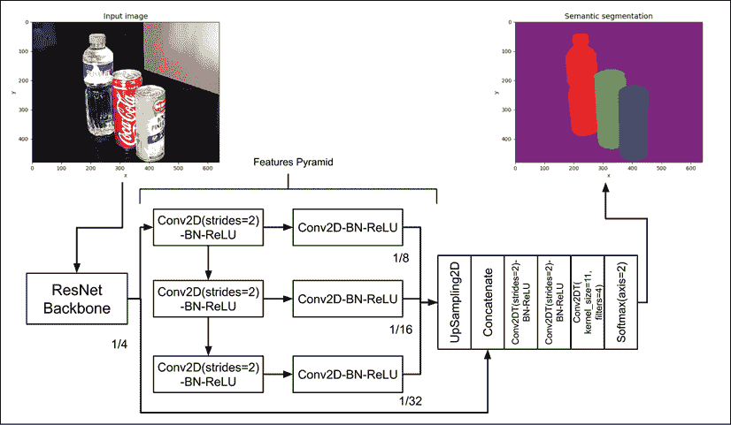

图 12.2.3：语义分割的网络架构。 除非另有说明，否则内核大小为 3。 除非另有说明，否则步幅为 1。 彩色效果最佳。 原始图像可以在 https://github.com/PacktPublishing/Advanced-Deep-Learning-with-Keras/tree/master/chapter12-segmentation 中找到

类似于“第 11 章”，“对象检测”中讨论的 SSD，我们采用骨干网作为特征提取器。 我们在 SSD 中使用类似的 ResNetv2 网络。 ResNet 主干网执行两次最大池化，以到达第一组特征图，其尺寸为输入图像的。 通过使用连续的`Conv2D(strides=2)-BN-ReLU`层生成其他特征图集，从而生成具有输入图像尺寸的特征图。

Zhao 等人的*金字塔场景解析网络（PSPNet）进行了改进，进一步增强了我们的语义分割网络体系结构。 （2017）* [3]。 在 PSPNet 中，每个特征图由另一个卷积层进一步处理。 此外，还使用了第一组特征图。

FCN 和 PSPNet 都对要素金字塔进行了上采样，以达到与第一组要素图相同的大小。 之后，使用`Concatenate`层将所有上采样特征融合在一起。 然后级联层通过步长等于 2 的转置卷积处理两次，以恢复原始图像的宽度和高度。 最后，使用核大小为 1 且滤镜等于 4（换句话说，类别数）和`Softmax`层的转置卷积生成按像素分类预测。

在下一节中，我们将讨论细分网络的`tf.keras`实现。 我们可以重用“第 11 章”，“对象检测”中的 SSD 中的某些网络块，以加快实现速度。

# 3\. Keras 中的语义分割网络

如图“图 12.2.3”所示，我们已经有了语义细分网络的一些关键构建块。 我们可以重用“第 2 章”，*深层神经网络*中介绍的 ResNet 模型。 我们只需要构建要素的金字塔以及上采样和预测层。

借用我们在“第 2 章”，*深层神经网络*中开发的 ResNet 模型，并在“第 11 章”，“对象检测”中重用了该模型， 我们提取具有四个级别的要素金字塔。“列表 12.3.1”显示了从 ResNet 提取要素的金字塔。 `conv_layer()`只是创建`Conv2D(strides=2)-BN-ReLU`层的辅助功能。

“列表 12.3.1”：`resnet.py`：

特征的金字塔功能：

```py
def features_pyramid(x, n_layers):
    """Generate features pyramid from the output of the 
    last layer of a backbone network (e.g. ResNetv1 or v2) 
```

```py
 Arguments:
        x (tensor): Output feature maps of a backbone network
        n_layers (int): Number of additional pyramid layers 
```

```py
 Return:
        outputs (list): Features pyramid 
    """
    outputs = [x]
    conv = AveragePooling2D(pool_size=2, name='pool1')(x)
    outputs.append(conv)
    prev_conv = conv
    n_filters = 512 
```

```py
 # additional feature map layers
    for i in range(n_layers - 1):
        postfix = "_layer" + str(i+2)
        conv = conv_layer(prev_conv,
                          n_filters,
                          kernel_size=3,
                          strides=2,
                          use_maxpool=False,
                          postfix=postfix)
        outputs.append(conv)
        prev_conv = conv 
```

```py
 return outputs 
```

“列表 12.3.1”只是功能金字塔的一半。 剩下的一半是每组特征之后的卷积。 另一半显示在“列表 12.3.2”中，以及金字塔各层的上采样。 例如，图像尺寸为的特征会被上采样 2 倍，以使其尺寸与图像尺寸为的第一组特征相匹配。 在同一清单中，我们还建立了完整的分割模型，从骨干网络到要素金字塔，再连接上采样要素金字塔，最后进一步进行特征提取，上采样和预测。 我们在输出层使用 n-dim（例如 4-dim）`Softmax`层执行逐像素分类。

“列表 12.3.2”：`model.py`：

构建语义分割网络：

```py
def build_fcn(input_shape,
              backbone,
              n_classes=4):
    """Helper function to build an FCN model.

    Arguments:
        backbone (Model): A backbone network
            such as ResNetv2 or v1
        n_classes (int): Number of object classes
            including background.
    """ 
```

```py
 inputs = Input(shape=input_shape)
    features = backbone(inputs) 
```

```py
 main_feature = features[0]
    features = features[1:]
    out_features = [main_feature]
    feature_size = 8
    size = 2
    # other half of the features pyramid
    # including upsampling to restore the
    # feature maps to the dimensions
    # equal to 1/4 the image size
    for feature in features:
        postfix = "fcn_" + str(feature_size)
        feature = conv_layer(feature,
                             filters=256,
                             use_maxpool=False,
                             postfix=postfix)
        postfix = postfix + "_up2d"
        feature = UpSampling2D(size=size,
                               interpolation='bilinear',
                               name=postfix)(feature)
        size = size * 2
        feature_size = feature_size * 2
        out_features.append(feature) 
```

```py
 # concatenate all upsampled features
    x = Concatenate()(out_features)
    # perform 2 additional feature extraction 
    # and upsampling
    x = tconv_layer(x, 256, postfix="up_x2")
    x = tconv_layer(x, 256, postfix="up_x4")
    # generate the pixel-wise classifier
    x = Conv2DTranspose(filters=n_classes,
                        kernel_size=1,
                        strides=1,
                        padding='same',
                        kernel_initializer='he_normal',
                        name="pre_activation")(x)
    x = Softmax(name="segmentation")(x) 
```

```py
 model = Model(inputs, x, name="fcn") 
```

```py
 return model 
```

给定分割网络模型，我们使用学习速度为 1e-3 的 Adam 优化器和分类交叉熵损失函数来训练网络。“列表 12.3.3”显示了模型构建和训练函数调用。 在 40 个周期之后，学习率每 20 个周期减半。 我们使用`AccuracyCallback`监视网络性能，类似于“第 11 章”，“对象检测”中的 SSD 网络。 回调使用类似于对象检测平均 IoU 的**平均 IoU**（**mIoU**）指标计算性能。 表现最佳的平均值 IoU 的权重保存在文件中。 通过调用`fit_generator()`将网络训练 100 个纪元。

“列表 12.3.3”：`fcn-12.3.1.py`：

语义分割网络的初始化和训练：

```py
 def build_model(self):
        """Build a backbone network and use it to
            create a semantic segmentation 
            network based on FCN.
        """ 
```

```py
 # input shape is (480, 640, 3) by default
        self.input_shape = (self.args.height,
                            self.args.width,
                            self.args.channels) 
```

```py
 # build the backbone network (eg ResNet50)
        # the backbone is used for 1st set of features
        # of the features pyramid
        self.backbone = self.args.backbone(self.input_shape,
                                           n_layers=self.args.layers) 
```

```py
 # using the backbone, build fcn network
        # output layer is a pixel-wise classifier
        self.n_classes =  self.train_generator.n_classes
        self.fcn = build_fcn(self.input_shape,
                             self.backbone,
                             self.n_classes) 
```

```py
 def train(self):
        """Train an FCN"""
        optimizer = Adam(lr=1e-3)
        loss = 'categorical_crossentropy'
        self.fcn.compile(optimizer=optimizer, loss=loss) 
```

```py
 log = "# of classes %d" % self.n_classes
        print_log(log, self.args.verbose)
        log = "Batch size: %d" % self.args.batch_size
        print_log(log, self.args.verbose) 
```

```py
 # prepare callbacks for saving model weights
        # and learning rate scheduler
        # model weights are saved when test iou is highest
        # learning rate decreases by 50% every 20 epochs
        # after 40th epoch
        accuracy = AccuracyCallback(self)
        scheduler = LearningRateScheduler(lr_scheduler) 
```

```py
 callbacks = [accuracy, scheduler]
        # train the fcn network
        self.fcn.fit_generator(generator=self.train_generator,
                               use_multiprocessing=True,
                               callbacks=callbacks,
                               epochs=self.args.epochs,
                               workers=self.args.workers) 
```

多线程数据生成器类`DataGenerator`与“第 11 章”，“对象检测”中使用的类类似。 如“列表 12.3.4”所示，对`__data_generation(self, keys)`签名方法进行了修改，以生成一对图像张量及其相应的按像素方向的地面真相标签或分割蒙版 。 在下一节中，我们将讨论如何生成基本事实标签。

“列表 12.3.4”：`data_generator.py`：

`DataGenerator`类用于语义分割的数据生成方法：

```py
 def __data_generation(self, keys):
        """Generate train data: images and 
        segmentation ground truth labels 
```

```py
 Arguments:
            keys (array): Randomly sampled keys
                (key is image filename) 
```

```py
 Returns:
            x (tensor): Batch of images
            y (tensor): Batch of pixel-wise categories
        """
        # a batch of images
        x = []
        # and their corresponding segmentation masks
        y = [] 
```

```py
 for i, key in enumerate(keys):
            # images are assumed to be stored 
            # in self.args.data_path
            # key is the image filename 
            image_path = os.path.join(self.args.data_path, key)
            image = skimage.img_as_float(imread(image_path))
            # append image to the list
            x.append(image)
            # and its corresponding label (segmentation mask)
            labels = self.dictionary[key]
            y.append(labels) 
```

```py
 return np.array(x), np.array(y) 
```

语义分割网络现已完成。 使用`tf.keras`，我们讨论了其架构实现，初始化和培训。

在运行训练程序之前，我们需要训练和测试带有地面真实性标签的数据集。 在的下一部分中，我们将讨论将在本章中使用的语义分割数据集。

# 4.示例数据集

我们可以使用在“第 11 章”，“对象检测”中使用的数据集。 回想一下，我们使用了一个小型数据集，其中包含使用便宜的 USB 相机（A4TECH PK-635G）收集的 1,000 640 x 480 RGB 火车图像和 50 640 x 480 RGB 测试图像。 但是，我们没有使用边界框和类别进行标记，而是使用多边形形状跟踪了每个对象类别的边缘。 我们使用相同的数据集注释器 **VGG 图像注释器**（**威盛**）[4]手动跟踪边缘并分配以下标签：1）**水瓶[** ，2）**汽水罐**和 3）**果汁罐**。

“图 12.4.1”显示了标记过程的示例 UI。

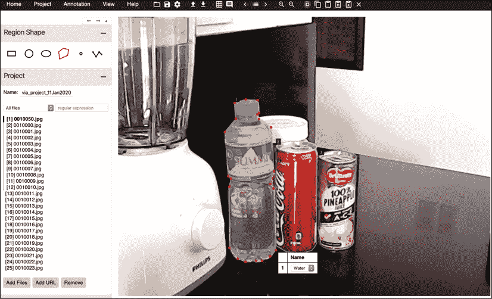

图 12.4.1：使用 VGG 图像注释器（VIA）进行语义分割的数据集标记过程

威盛标签软件将注释保存在 JSON 文件中。 对于训练和测试数据集，这些是：

```py
segmentation_train.json
segmentation_test.json 
```

无法原样使用存储在 JSON 文件中的多边形区域。 每个区域都必须转换成分割蒙版，即张量，其尺寸为`img_w x img_h x px – wise_category`。 在此数据集中，分割蒙版的尺寸为 640 x 480 x 4。类别 0 为背景，其余为 1）对于**水瓶**，2）对于**苏打罐**，以及 3）表示**果汁罐**。 在`utils`文件夹中，我们创建了一个`generate_gt_segmentation.py`工具，用于将 JSON 文件转换为分段掩码。 为了方便起见，用于训练和测试的地面真实数据存储在压缩数据集中，该数据集是从[上一章](https://bit.ly/adl2-ssd)下载的：

```py
segmentation_train.npy
segmentation_test.npy 
```

每个文件都包含`image filename: segmentation mask`格式的地面真相数据字典，该字典在训练和验证期间加载。“图 12.4.2”显示了使用彩色像素可视化的“图 12.4.1”中图像的分割蒙版的示例。

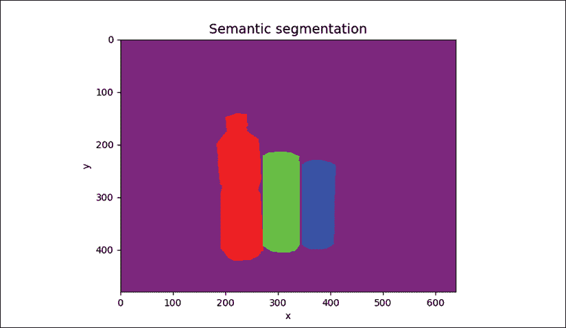

图 12.4.2：可视化图 12.4.1 中所做注释的分段蒙版

现在，我们准备训练和验证语义分割网络。 在下一节中，我们将显示在本节中注释的数据集上语义分割的结果。

# 5.语义分割验证

要训​​练语义分段网络，请运行以下命令：

```py
python3 fcn-12.3.1.py --train 
```

在每个时期，也会执行验证以确定性能最佳的参数。 对于语义分割，可以使用两个度量。 首先是平均 IOU。 这类似于上一章中目标检测中的平均 IoU。 区别在于针对每个填充类别在地面真相分割掩码和预测的分割掩码之间计算 IoU。 这包括背景。 平均 IoU 只是测试数据集所有 IoU 的平均值。

“图 12.5.1”显示了在每个时期使用 mIoU 的语义分割网络的性能。 最大 mIoU 为 0.91。 这个比较高。 但是，我们的数据集只有四个对象类别：

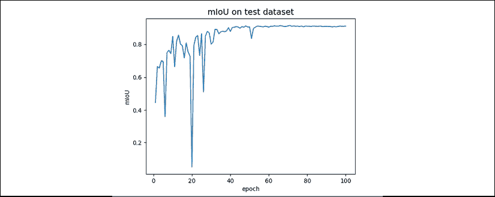

图 12.5.1：使用 mIoU 进行测试数据集训练期间的语义分割性能

第二个指标是平均像素精度。 这类似于在分类器预测上计算准确率的方式。 不同之处在于，分割网络具有的预测数量等于图像中的像素数量，而不是具有一个预测。 对于每个测试输入图像，计算平均像素精度。 然后，计算所有测试图像的平均值。

“图 12.5.2”显示了在每个时期使用平均像素精度的语义分割网络的性能。 最大平均像素精度为 97.9％。 我们可以看到平均像素精度与 mIoU 之间的相关性：

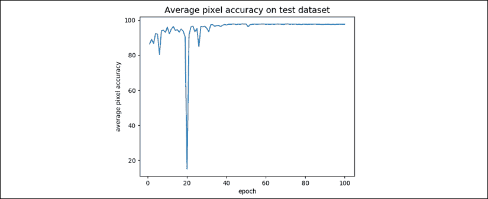

图 12.5.2：使用测试数据集的平均像素精度在训练期间的语义分割性能

“图 12.5.3”显示了输入图像，地面实况语义分割掩码和预测的语义分割掩码的样本：

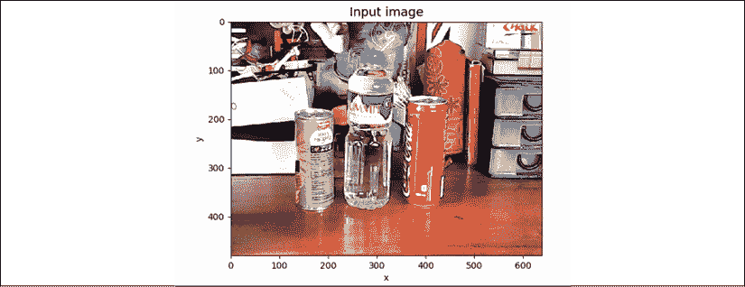

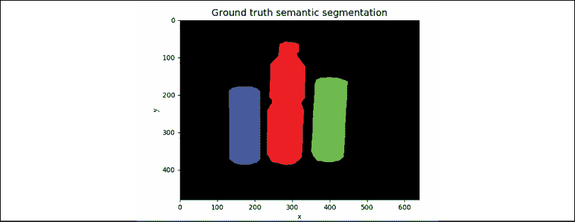

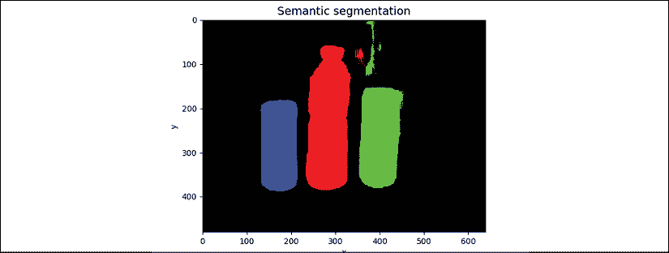

图 12.5.3：样本输入，基本事实和语义细分的预测。 我们将黑色分配为背景类，而不是紫色，如先前所用

总体而言，我们基于 FCN 并经过 PSPNet 的思想改进的语义分割网络的性能相对较好。 我们的语义分割网络绝不是最优化的。 可以减少要素金字塔中的过滤器数量，以最大程度地减少参数的数量，该参数约为 1110 万。 探索增加要素金字塔中的级别数也很有趣。 读者可以通过执行以下命令来运行验证：

```py
python3 fcn-12.3.1.py --evaluate 
--restore-weights=ResNet56v2-3layer-drinks-best-iou.h5 
```

在下一章中，我们将介绍无监督的学习算法。 考虑到监督学习中所需的昂贵且费时的标签，强烈地开发了无监督学习技术。 例如，在本章的语义分割数据集中，一个人花了大约 4 天的手工标签。 如果深度学习始终需要人工标记，那么它就不会前进。

# 六，结论

在本章中，讨论了分割的概念。 我们了解到细分有不同类别。 每个都有自己的目标应用程序。 本章重点介绍语义分段的网络设计，实现和验证。

我们的语义分割网络受到 FCN 的启发，FCN 已成为许多现代，最先进的分割算法（例如 Mask-R-CNN [5]）的基础。 PSPNet 的构想进一步增强了我们的网络，该构想在 ImageNet 2016 解析挑战赛中获得第一名。

使用 VIA 标记工具，使用与“第 11 章”，“对象检测”中使用的相同图像集生成用于语义分割的新数据集标签。 分割蒙版标记属于同一对象类的所有像素。

我们使用平均 IoU 和平均像素准确率指标对语义分割网络进行了训练和验证。 测试数据集上的性能表明，它可以有效地对测试图像中的像素进行分类。

如本章最后一部分所述，由于所涉及的成本和时间，深度学习领域正在意识到监督学习的局限性。 下一章重点介绍无监督学习。 它利用了通信领域信息理论中使用的互信息概念。

# 7.参考

1.  `Kirillov, Alexander, et al.: Panoptic Segmentation. Proceedings of the IEEE conference on computer vision and pattern recognition. 2019.`
1.  L`ong, Jonathan, Evan Shelhamer, and Trevor Darrell: Fully Convolutional Networks for Semantic Segmentation. Proceedings of the IEEE conference on computer vision and pattern recognition. 2015.`
1.  `Zhao, Hengshuang, et al.: Pyramid Scene Parsing Network. Proceedings of the IEEE conference on computer vision and pattern recognition. 2017.`
1.  `Dutta, et al.: VGG Image Annotator http://www.robots.ox.ac.uk/~vgg/software/via/`
1.  `He Kaiming, et al.: Mask R-CNN. Proceedings of the IEEE international conference on computer vision. 2017.`