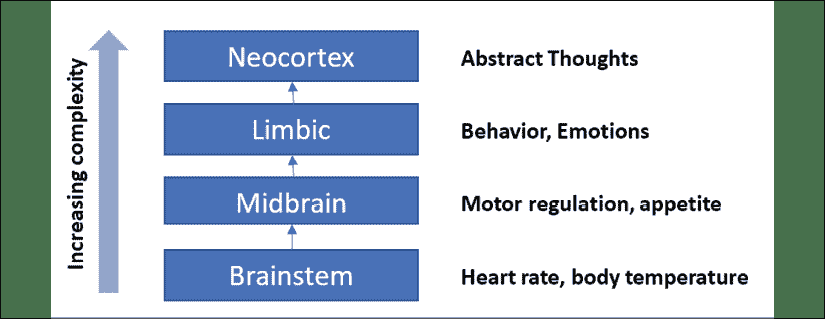
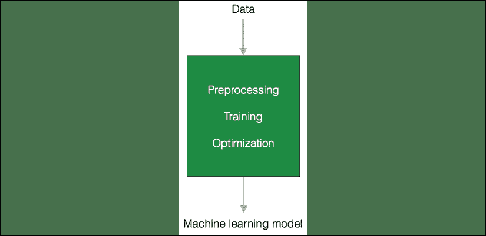
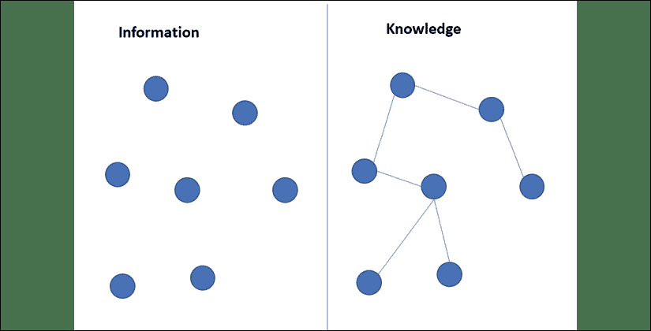
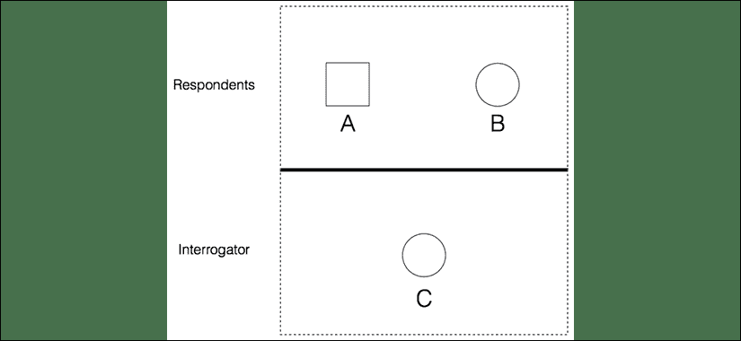
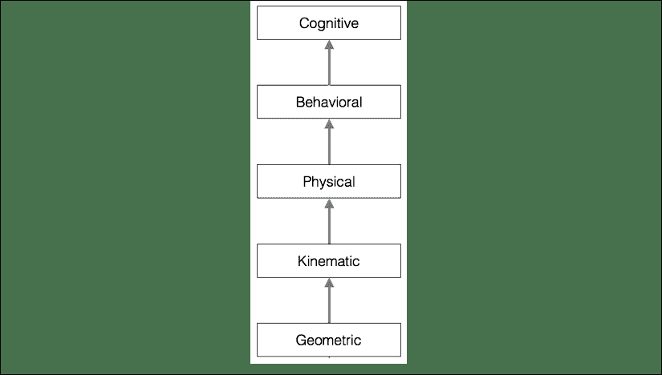
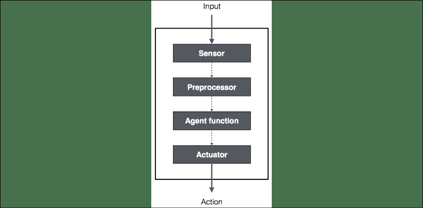
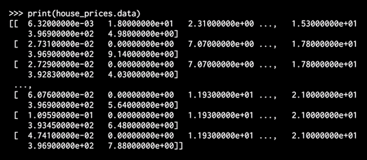
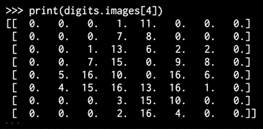

# 1 人工智能简介

在本章中，我们将讨论**人工智能**（**AI**）的概念及其在现实世界中的应用。 我们在日常生活中花费了大量时间与智能系统进行交互。 这可以采取以下形式：在互联网上搜索某些内容，进行生物特征识别的人脸识别或将口语单词转换为文本。 人工智能是这一切的核心，它正在成为我们现代生活方式的重要组成部分。 所有这些系统都是复杂的实际应用，而 AI 通过数学和算法解决了这些问题。 在整本书中，我们将学习可用于构建此类应用的基本原理。 我们的总体目标是使您能够应对日常生活中可能遇到的具有挑战性的新 AI 问题。

到本章末，您将了解：

*   什么是人工智能，为什么我们需要学习它？
*   人工智能有哪些应用？
*   人工智能分支的分类
*   机器学习的五个流派
*   什么是图灵测试？
*   什么是理性智能体？
*   什么是一般问题解决器？
*   如何建立智能体
*   如何安装 Python3 和相关包

# 什么是 AI？

如何定义 AI 可能会有很大差异。 从哲学上讲，什么是“智能”？ 一个人如何感知智能又定义了它的人为对应物。 对 AI 领域的广泛而乐观的定义可能是：“计算机科学领域，它研究机器如何执行通常需要有知觉的智能体的任务。” 从这样的定义可以说，像计算机乘以两个数字这样简单的东西就是“人工智能”。 这是因为我们设计了一种能够接受输入并独立产生逻辑输出的机器，而该逻辑输出通常需要有生命的实体进行处理。

更具怀疑性的定义可能更狭窄，例如：“研究机器如何紧密模仿人类智能的计算机科学领域”。 根据这样的定义，怀疑论者可能会认为我们今天所拥有的不是人工智能。 到目前为止，他们已经能够指出计算机无法执行的任务的示例，因此声称如果计算机不能令人满意地执行这些功能，它们将无法“思考”或展现人工智能。

本书倾向于更乐观的 AI 观，我们更喜欢惊叹于计算机当前可以执行的任务数量。

在我们前面提到的乘法任务中，如果两个数字足够大，那么计算机肯定会比人类更快，更准确。 目前在其他领域，人类可以比计算机表现更好。 例如，人类可以通过几个示例来识别，标记和分类对象，而当前计算机可能需要数千个示例才能以相同的准确度执行。 研究和改进工作一直在不懈地进行，我们将继续看到计算机能够解决越来越多的问题，而几年前，我们只能梦想着解决它们。 随着本书的发展，我们将探索许多这些用例并提供大量示例。

考虑人工智能领域的一种有趣方式是，从某种意义上讲，人工智能是科学的又一分支，正在研究我们所知道的最迷人的计算机：大脑。 借助 AI，我们试图在计算中反映大脑的某些系统和机制，从而发现自己从诸如神经科学的领域中借鉴并与之互动。

# 为什么我们需要学习 AI？

人工智能可以影响我们生活的各个方面。 AI 领域试图了解实体的模式和行为。 借助 AI，我们希望构建智能系统并理解智能的概念。 我们构建的智能系统对于理解像我们的大脑这样的智能系统如何构建另一个智能系统非常有用。

让我们看一下我们的大脑如何处理信息：



图 1：基本的大脑成分

与已经存在了数百年的数学或物理学等其他领域相比，人工智能还处于起步阶段。 在过去的几十年中，人工智能生产了一些引人注目的产品，例如自动驾驶汽车和可以行走的智能机器人。 根据我们前进的方向，很明显，获得智能将在未来几年对我们的生活产生重大影响。

我们不禁要问，人类的大脑如何如此轻松地做到这一点。 我们可以用大脑识别物体，理解语言，学习新事物并执行许多更复杂的任务。 人脑如何做到这一点？ 对于这个问题，我们还没有很多答案。 当您尝试使用机器复制大脑执行的任务时，您会发现它落后了！ 在许多方面，我们自己的大脑比机器复杂得多，能力也更强。

当我们尝试寻找诸如外星生命或时空旅行之类的事物时，我们不知道这些事物是否存在； 我们不确定这些追求是否值得。 关于 AI 的好处是它已经存在理想化的模型：我们的大脑是智能系统的圣杯！ 我们要做的就是模仿它的功能，以创建一个智能系统，该系统可以执行与我们的大脑相似或更好的事情。

让我们看看如何通过各种处理级别将原始数据转换为智能：


图 2：将数据转换为智能

我们想学习 AI 的主要原因之一是使许多事情自动化。 我们生活在一个世界：

*   我们处理海量且无法克服的数据。 人脑无法跟踪这么多数据。
*   数据同时来自多个来源。 数据是杂乱无章的。
*   从这些数据中获得的知识必须不断更新，因为数据本身一直在变化。
*   传感和驱动必须实时，高精度地运转。

即使人脑擅长分析我们周围的事物，也无法跟上上述条件。 因此，我们需要设计和开发可以做到这一点的智能机器。 我们需要可以实现以下目的的 AI 系统：

*   以有效的方式处理大量数据。 随着云计算的出现，我们现在能够存储大量数据。
*   同时从多个源提取数据，没有任何滞后。 对数据进行索引和组织，以使我们能够获得见解。
*   从新数据中学习，并使用正确的学习算法不断进行更新。 根据情况实时思考和应对情况。
*   继续执行任务，而不会感到疲劳或需要休息。

人工智能技术正在积极地用于使现有机器更智能，以便它们可以更快，更高效地执行 。

# AI 的分支

了解 AI 的各个研究领域非常重要，这样我们才能选择正确的框架来解决给定的现实世界问题。 有几种方法可以对 AI 的不同分支进行分类：

*   监督学习与无监督学习与强化学习
*   人工智能与狭义智能
*   按人体功能：
    *   机器视觉
    *   机器学习
    *   自然语言处理
    *   自然语言生成

接下来，我们介绍一个常见的分类：

*   **机器学习和模式识别**：这也许是目前最流行的 AI 形式。 我们设计和开发可以从数据中学习的软件。 基于这些学习模型，我们对未知数据进行预测。 这里的主要限制之一是这些程序仅限于数据的功能。

    如果数据集很小，那么学习模型也将受到限制。 让我们看看典型的机器学习系统是什么样的：



图 3：典型的计算机系统

当系统接收到以前看不见的数据点时，它将使用先前看过的数据（训练数据）中的模式来推断该新数据点。 例如，在人脸识别系统中，该软件将尝试匹配眼睛，鼻子，嘴唇，眉毛等的图案，以便在现有用户数据库中找到人脸。

*   **基于逻辑的 AI** ：数学逻辑用于在基于逻辑的 AI 中执行计算机程序。 用基于逻辑的 AI 编写的程序基本上是一组逻辑形式的语句，用于表达有关问题域的事实和规则。 它广泛用于模式匹配，语言解析，语义分析等。
*   **搜索**：AI 技术中广泛使用搜索技术。 这些程序检查了许多可能性，然后选择了最佳路径。 例如，在策略游戏中，例如国际象棋，网络，资源分配，调度等，经常使用它。
*   **知识表示**：必须以某种方式表示关于我们周围世界的事实，以便系统能够理解它们。 这里经常使用数学逻辑语言。 如果有效地表示知识，则系统可以变得越来越智能。 本体论是一个紧密相关的研究领域，涉及存在的各种对象。

    它是域中存在的实体的属性和关系的正式定义。 通常使用分类法或的层次结构完成此操作。 下图显示了信息和知识之间的区别：



图 4：信息与知识

*   **计划**：此字段用于优化计划，从而以最小的成本为我们带来最大的回报。 这些软件程序从有关情况的事实和目标说明开始。 这些程序还了解世界的事实，因此他们知道规则是什么。 他们从这些信息中得出实现目标的最佳方案。
*   **启发式**：启发式是用于解决给定问题的技术，该技术在短期内解决该问题是实用且有用的，但不能保证是最优的。 这更像是对应该采用何种方法解决问题的有根据的猜测。 在 AI 中，我们经常遇到无法检查所有可能性以选择最佳选项的情况。 因此，我们需要使用启发式方法来实现目标。 它们在机器人，搜索引擎等领域的 AI 中得到了广泛使用。
*   **遗传编程**：遗传编程是一种通过使程序配对并选择最适合的条件来获取程序来解决任务的方法。 程序被编码为一组基因，使用一种算法来获得可以很好地执行给定任务的程序。

# 机器学习的五个流派

机器学习可以通过各种方式进一步分类。 我们最喜欢的分类之一是 Pedro Domingos 在他的书*主算法*中提供的分类。 在他的书中，他根据萌芽了思想的科学领域对机器学习进行了分类。 例如，遗传算法起源于生物学概念。 以下是完整的分类，Domingos 为流派使用的名称，每个流派使用的主要算法以及值得注意的支持者：

| **流派** | **来源** | **主导算法** | **支持者** |
| --- | --- | --- | --- |
| 符号主义者 | 逻辑与哲学 | 反演 | Tom Mitchell、Steve Muggleton、Ross Quinlan |
| 连接主义者 | 神经科学 | 反向传播 | Yan LeCun、Geoffrey Hinton、Yoshua Bengio |
| 进化论者 | 生物学 | 基因编程 | John Koza、John Holland、Hod Lipson |
| 贝叶斯 | 统计 | 概率推断 | David Heckerman、Judea Pearl、Michael Jordan |
| 模拟器 | 心理学 | 内核机器 | Peter Hart、Vladimir Vapnik、Douglas Hofstadter |

**符号主义者**：符号主义者使用归纳或反演的概念作为主要工具。 当使用归纳法时，逆推演不是从前提和结论开始，而是从一系列前提和结论开始，然后反向进行以填补缺失的部分。

推论的一个例子：

苏格拉底是人类+所有人类都是凡人=可以推断出什么？ （苏格拉底是凡人）

归纳示例：

苏格拉底是人类+ ?? =苏格拉底是凡人（人类是凡人？）

**连接主义者**：连接主义者使用大脑，或者至少是我们对大脑的粗略了解，作为主要工具-主要是神经网络。 神经网络是一种算法，可以在大脑之后粗略地建模，旨在识别模式。 他们可以识别向量中包含的数字模式。 为了使用它们，需要将所有输入（例如图像，声音，文本或时间序列）转换为这些数字向量。 很难打开杂志或新闻网站，而不阅读“深度学习”示例。 深度学习是神经网络的一种特殊类型。

**进化论者**：进化论者专注于使用进化，自然选择，基因组和 DNA 突变的概念，并将其应用于数据处理。 进化算法将不断变异，进化并适应未知条件和过程。

**贝叶斯**：贝叶斯将集中在使用概率推断来处理不确定性上。 视觉学习和垃圾邮件过滤是贝叶斯方法解决的一些问题。 通常，贝叶斯模型将采用假设并应用一种“先验”推理，假设某些结果更有可能出现。 然后，他们在看到更多数据时会更新假设。

**模拟器**：模拟器着重于发现示例之间相似之处的技术。 最著名的模拟器模型是 *K 最近邻*算法。

# 使用图灵测试定义智能

传说中的计算机科学家和数学家*阿兰·图灵*提出了图灵测试以提供智能的定义。 这是测试计算机是否可以学习模仿人类行为的测试。 他将聪明的行为定义为在对话中达到人类智能的能力。 这种表现应该足以诱使询问者认为答案来自人。

为了查看机器是否可以做到这一点，他提出了一个测试设置：他提议人类应该通过文本界面来询问机器。 另一个限制是，人不能知道谁在询问的另一端，这意味着它可以是机器，也可以是人。 为了启用此设置，人员将通过文本界面与两个实体进行交互。 这两个实体称为受访者。 其中一个将是人类，另一个将是机器。

如果询问机无法告诉答案是来自机器还是人，则应答机通过测试。 下图显示了图灵测试的设置：



图 5：图灵测试

可以想像，对于响应方的机器而言，这是一项艰巨的任务。 对话期间发生了很多事情。 至少，机器必须精通以下内容：

*   **自然语言处理**：机器需要此语言才能与询问器通信。 机器需要解析句子，提取上下文并给出适当的答案。
*   **知识表示**：机器需要存储在询问之前提供的信息。 它还需要跟踪在对话过程中提供的信息，以便它再次出现时可以做出适当的响应。
*   **推理**：对于机器来说，了解如何解释所存储信息的很重要。 人们倾向于自动执行此操作，以便实时得出结论。
*   **机器学习**：这是所必需的，以便机器可以实时适应新条件。 机器需要分析和检测模式，以便得出推断。

您一定想知道为什么人类要与文本界面进行通信。 根据图灵的说法，人的物理模拟对于智能是不必要的。 这就是图灵测试避免人与机器之间直接进行物理交互的原因。

还有另一种叫做总图灵测试的东西，它涉及视觉和运动。 要通过此测试，机器需要使用计算机视觉并使用机器人在周围移动来查看物体。

# 使机器像人一样思考

数十年来，我们一直在尝试让机器更像人类那样思考。 为了实现这一目标，我们首先需要了解人类的想法。 我们如何理解人类思维的本质？ 做到这一点的一种方法是记下我们对事情的反应。 但这很快就变得棘手，因为有太多事情需要注意。 这样做的另一种方法是根据预定义的格式进行实验。 我们提出了一定数量的问题，以涵盖各种各样的人类主题，然后看看人们如何回应。

一旦收集了足够的数据，我们就可以创建一个模型来模拟人类过程。 该模型可用于创建可以像人类一样思考的软件。 当然，这说起来容易做起来难！ 我们关心的只是给定输入的程序输出。 如果程序的行为与人类行为相匹配，那么我们可以说人类具有类似的思考机制。

下图显示了不同层次的思维以及我们的大脑如何对事物进行优先排序：



图 6：思想水平

在计算机科学内部，有一个名为**认知模型**的研究领域，该领域致力于模拟人类的思维过程。 它试图了解人类如何解决问题。 它需要进入解决问题过程的思维过程，并将其转变为软件模型。 然后可以使用此模型来模拟人类行为。

认知建模用于各种 AI 应用，例如深度学习，专家系统，自然语言处理，机器人等。

# 建立理性智能体

人工智能的许多研究都集中在构建理性主体上。 什么是理性智能体？ 在此之前，让我们在 AI 的上下文中定义*合理性*一词。 合理性是指遵守一组规则并遵循其逻辑含义以实现理想的结果。 这需要以使执行该操作的实体获得最大利益的方式执行。 因此，如果在给定的一组规则下采取行动以实现其目标，则该行动者被称为理性行动。 它只是根据可用信息感知并采取行动。 当将机器人发送到未知地形时，该系统在 AI 中被大量用于设计机器人。

我们如何定义*理想的*是什么？ 答案是，这取决于智能体的目标。 该智能体应该是智能且独立的。 我们希望赋予适应新情况的能力。 它应该了解其环境，然后采取相应行动，以实现符合其最大利益的结果。 最大的利益取决于它要实现的总体目标。 让我们看看如何将输入转换为动作：



图 7：将输入转化为行动

我们如何定义理性智能体的表现指标？ 也许有人会说它与成功的程度成正比。 设置智能体以完成任务，因此表现度量取决于该任务完成的百分比。 但是我们必须考虑什么构成了整体的合理性。 如果只是结果，我们不考虑导致结果的行动。

做出正确的推断是理性的一部分，因为主体必须理性地行动以实现其目标。 这将有助于它得出可以连续使用的结论。

但是，在没有可证明的正确事情要做的情况下呢？ 在某些情况下，智能体不知道要做什么，但它仍然必须做一些事情。

让我们设置一个方案，使最后一点更加清楚。 想象一下，一辆无人驾驶汽车以每小时 60 英里的速度行驶，突然有人越过它。 对于本示例，假设给定汽车行驶的速度，则只有两种选择。 汽车要么撞向护栏，要么就知道会杀死汽车乘员，要么撞向行人并杀死他们。 正确的决定是什么？ 该算法如何知道该怎么做？ 如果您在开车，您会做什么吗？

现在，我们将学习理性智能体的最早示例之一-通用问题解决器。 就像我们将看到的那样，尽管它的名称很高大，但它确实无法解决任何问题，但是由于它，它在计算机科学领域是一个巨大的飞跃。

# 通用问题解决器

**通用问题解决器**（**GPS**）是由 Herbert Simon，J.C. Shaw 和 Allen Newell 提出的 AI 程序。 它是 AI 世界中第一个有用的计算机程序。 目的是使其能够作为通用的问题解决机器。 当然，以前有很多软件程序，但是这些程序执行特定的任务。 GPS 是第一个旨在解决任何一般问题的程序。 GPS 应该针对每个问题使用相同的基本算法来解决所有问题。

您一定已经意识到，这是艰巨的战斗！ 为了对 GPS 进行编程，作者创建了一种新语言，称为**信息处理语言**（**IPL**）。 基本前提是使用一组格式正确的公式来表达任何问题。 这些公式将成为有多个源和汇的有向图的一部分。 在图中，源是指起始节点，宿是指终止节点。 对于 GPS，源是公理，汇是结论。

即使 GPS 只是通用的，它也只能解决明确定义的问题，例如证明几何和逻辑上的数学定理。 它还可以解决单词拼图和下棋。 原因是这些问题可以在合理范围内形式化。 但是在现实世界中，由于您可以采取多种可能的途径，因此这很快变得很棘手。 如果它试图通过计算图表中的步数来强行解决问题，则完全无法计算 。

## 使用 GPS 解决问题

让我们看看如何构造一个给定的问题以使用 GPS 解决它：

1.  第一步是定义目标。 假设我们的目标是从杂货店里买些牛奶。
2.  下一步是定义前提条件。 这些前提条件与目标有关。 要从杂货店获取牛奶，我们需要有一种运输方式，杂货店应该有牛奶。

1.  此后，我们需要定义运算符。 如果我的交通工具是汽车，并且汽车的燃油不足，那么我们需要确保可以向加油站付款。 我们需要确保您可以在商店购买牛奶。

运算符要注意条件以及影响条件的一切。 它由行动，前提条件和采取行动引起的变化组成。 在这种情况下，操作就是向杂货店捐款。 当然，这首先要取决于您有钱，这是前提。 通过给他们钱，您正在改变您的金钱状况，这将导致您得到牛奶。

如果您可以像我们刚才那样解决问题，GPS 将会起作用。 限制在于它使用搜索过程来执行其工作，这对于任何有意义的现实应用而言都过于复杂且耗时。

在本节中，我们了解了什么是理性主体。 现在，让我们学习如何使这些理性主体更加智能和有用。

# 建立智能体

有很多方法可以将智能传递给智能体。 最常用的技术包括机器学习，存储的知识，规则等。 在本节中，我们将重点关注机器学习。 在这种方法中，我们通过数据和训练来向智能体赋予情报。

让我们看看智能体如何与环境交互：


图 8：智能体与其环境的交互

通过机器学习，有时我们希望对机器进行编程以使用标记的数据来解决给定的问题。 通过浏览数据和相关标签，机器学习了如何提取模式和关系。

在前面的示例中，智能体依赖于学习模型来运行推理引擎。 传感器感知到输入后，会将其发送到特征提取模块。 一旦提取了相关特征，训练有素的推理引擎将基于学习模型执行预测。 该学习模型是使用机器学习构建的。 然后，推理引擎做出决定并将其发送给执行器，执行器随后在现实世界中采取所需的操作。

今天存在许多机器学习的应用。 它用于图像识别，机器人技术，语音识别，预测股市行为等。 为了理解机器学习并构建完整的解决方案，您将必须熟悉来自不同领域的许多技术，例如模式识别，人工神经网络，数据挖掘， 统计等。 上。

## 模型类型

AI 世界中有两种类型的模型：分析模型和学习模型。 在我们拥有可以计算的机器之前，人们曾经依靠分析模型。

使用数学公式得出分析模型，这基本上是遵循一系列步骤以得出最终方程式的步骤。 这种方法的问题在于它是基于人类的判断。 因此，这些模型很简单，而且往往不准确，仅带有几个参数。 想想牛顿和其他古老的科学家在拥有计算机之前是如何进行计算的。 在得出工作公式之前，此类模型通常涉及长时间推导和长时间的反复试验。

然后，我们进入了计算机的世界。 这些计算机擅长分析数据。 因此，人们越来越多地使用学习的模型。 这些模型是通过训练过程获得的。 在训练期间，机器会查看许多输入和输出示例，以得出方程式。 这些学习的模型通常是复杂且准确的，具有数千个参数。 这产生了一个非常复杂的数学方程式，该方程式控制着可以帮助进行预测的数据。

机器学习使我们可以获得可以在推理引擎中使用的学习模型。 最好的事情之一是，我们不需要导出基本的数学公式。 您不需要了解复杂的数学，因为机器会根据数据得出公式。 我们需要做的就是创建输入列表和相应的输出。 我们得到的的学习模型只是标记的输入与与所需输出之间的关系。

# 安装 Python3

在本书中，我们将使用 Python3。 确保在计算机上安装了最新版本的 Python3。 键入以下命令进行检查：

```py
$ python3 --version 
```

如果看到打印出类似`Python3.x.x`（其中`x.x`是版本号）的内容，那很好。 如果不是，则直接安装。

## 在 Ubuntu 上安装

在 Ubuntu 14.xx 及更高版本上，Python3 已默认安装。 如果没有，您可以使用以下命令来安装：

```py
$ sudo apt-get install python3 
```

像我们在操纵器中一样执行检查命令：

```py
$ python3 --version 
```

您应该看到版本号作为输出。

## 在 Mac OS X 上安装

如果您使用的是 Mac OS X，建议使用 Homebrew 来安装 Python3。它是 Mac OS X 的出色包安装程序，非常易于使用。 如果没有 Homebrew，则可以使用以下命令进行安装：

```py
$ ruby -e "$(curl -fsSL https://raw.githubusercontent.com/Homebrew/install/master/install)" 
```

让我们更新程序包管理器：

```py
$ brew update 
```

让我们安装 Python3：

```py
$ brew install python3 
```

像之前一样运行检查命令：

```py
$ python3 --version 
```

您应该看到在输出上打印的数字为 。

## 在 Windows 上安装

如果使用 Windows，建议您使用 Python3 的`SciPy-stack`兼容发行版。Anaconda 非常流行并且易于使用。 [您可以在以下位置找到安装说明](https://www.continuum.io/downloads)。

如果要检查 Python3 的其他`SciPy-stack`兼容发行版，可以在[这个页面](http://www.scipy.org/install.html)中找到它们。 这些发行版的好处是它们附带了所有必需的包。 如果使用这些版本之一，则无需单独安装包。

安装后，请像前面一样运行检查命令：

```py
$ python3 --version 
```

您应该看到已输出的版本号。

# 安装包

在本书中，我们将使用各种包，例如 NumPy，SciPy，scikit-learn 和 matplotlib。 在继续之前，请确保安装这些包。

如果您使用 Ubuntu 或 Mac OS X，则安装这些包非常简单。 所有这些包都可以使用单行命令安装。 这是与相关的安装链接：

*   [NumPy](http://docs.scipy.org/doc/numpy-1.10.1/user/install.html)
*   [SciPy](http://www.scipy.org/install.html)
*   [scikit-learn](http://scikit-learn.org/stable/install.htmlx)
*   [matplotlib](http://matplotlib.org/1.4.2/users/installing.html)

如果您使用的是 Windows，则应该已安装 Python3 的`SciPy-stack`兼容版本。

# 加载数据

为了构建学习模型，我们需要代表世界的数据。 现在我们已经安装了必要的 Python 包，让我们看看如何使用这些包与数据进行交互。 通过键入以下命令，输入 Python 命令提示符：

```py
$ python3 
```

让我们导入包含所有数据集的包：

```py
>>> from sklearn import datasets 
```

让我们加载房价数据集：

```py
>>> house_prices = datasets.load_boston() 
```

打印数据：

```py
>>> print(house_prices.data) 
```

您将看到类似于以下内容的输出：



图 9：输入房屋价格的输出

我们来看看标签。

您将看到以下输出：


图 10：预测房价的输出

实际的数组较大，因此图像表示该数组中的前几个值。

scikit-learn 包中还有可用的图像数据集。 每个图像的形状均为`8×8`。 让我们加载它：

```py
>>> digits = datasets.load_digits() 
```

打印数字图像：

```py
>>> print(digits.images[4]) 
```

您将看到此输出：



图 11：scikit-learn 图像数组的输出

如您所见，它具有八行八列。

# 总结

在本章中，我们讨论了：

*   人工智能的意义何在？为什么我们需要研究它
*   人工智能的各种应用和分支
*   图灵测试是什么以及如何进行
*   如何使机器像人一样思考
*   理性主体的概念及其应如何设计
*   通用问题解决器（GPS）以及如何使用 GPS 解决问题
*   如何使用机器学习开发智能体
*   不同类型的机器学习模型

我们还介绍了如何在各种操作系统上安装 Python3，以及如何安装构建 AI 应用所需的必要包。 我们讨论了如何使用这些包来加载 scikit-learn 中可用的数据。

在下一章中，我们将学习监督学习以及如何建立分类和回归模型。