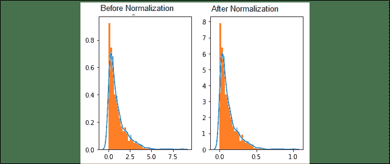
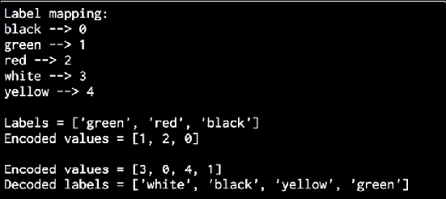
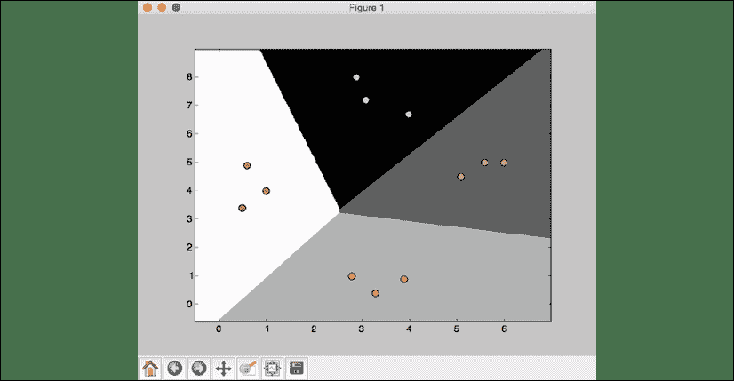
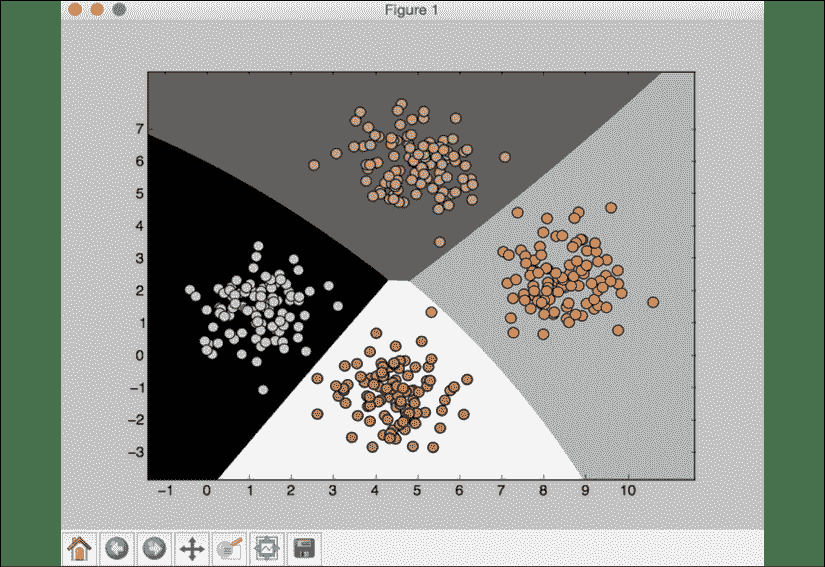
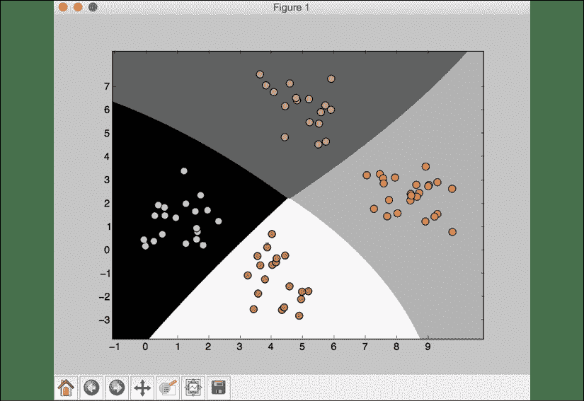
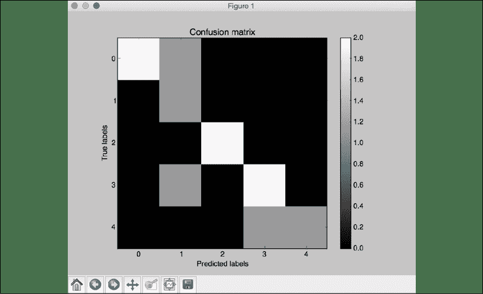
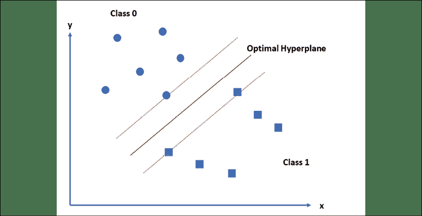
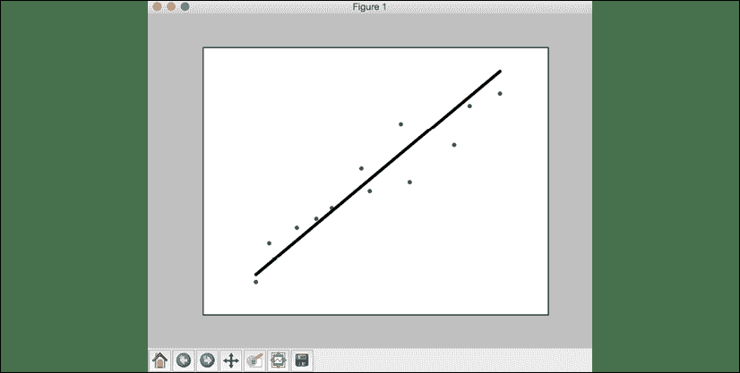

# 5

# 使用监督学习的分类和回归

在本章中，我们将使用监督学习技术来学习数据的分类和回归。 在本章的最后，您将对这些主题有更好的理解：

*   监督学习与无监督学习之间的差异
*   分类方法
*   数据预处理方法
*   标签编码
*   逻辑回归分类器
*   朴素贝叶斯分类器
*   混淆矩阵
*   支持向量机和 SVM 分类器
*   线性和多项式回归
*   单变量和多变量线性回归
*   使用支持向量回归机估算房价

# 无监督学习的优势

从流行的新闻界看到并不难，当今人工智能领域最热门的领域之一就是机器学习。 机器学习通常分为有监督的学习和无监督的学习。 还存在其他分类，但我们将在后面讨论。

在给出更正式的定义之前，让我们对监督学习与无监督学习有一些直观的了解。 假设您有一组人物肖像。 这一组中的人是一个非常多样化的男人和女人，您具有各种国籍，年龄，体重等。 最初，您将数据集通过无监督学习算法进行处理。 在这种情况下，在没有任何先验知识的情况下，无监督算法将根据其识别为相似的某些特征开始对这些照片进行分类。 例如，它可能独自开始认识到男人和女人是不同的，并且可能开始将男人归为一组，将女人归为另一组。 但是不能保证它将找到该模式。 由于某些肖像具有深色背景而另一些肖像具有浅色背景，因此它可能使图像聚类，这可能是无用的推断。

现在拍摄同一组照片，但是这次我们在每张照片上都有一个标签。 假设标签是性别。 因为我们现在有了数据的标签，所以我们可以将数据通过监督算法处理，并使用输入变量（在这种情况下，输入变量是照片像素）来计算目标变量（在这种情况下，性别）。 更正式的：

**监督学习**是指指的是基于标记的训练数据构建机器学习模型的过程。 在监督学习中，每个示例或行都是一个由输入变量和所需目标变量组成的元组。 例如，机器学习中使用的常见数据集是“泰坦尼克号”数据集。 该数据集包含描述著名船只 RMS Titanic 的乘客的特征。 一些输入功能是：

*   旅客姓名
*   性别
*   客舱等级
*   年龄
*   登船地点

在这种情况下，目标变量将是乘客是否幸存。

**无监督学习**是指指的是不依赖标记的训练数据来构建机器学习模型的过程。 从某种意义上说，这与监督学习相反。 由于没有可用的标签，因此您仅需要根据提供给您的数据来提取见解。 通过无监督学习，我们正在训练一个系统，其中单独的数据点可能会分成多个群集或组。 需要重点强调的一点是，我们并不确切地知道分离的标准是什么。 因此，无监督学习算法需要以可能的最佳方式将给定的数据集分为几组。

现在，我们已经描述了机器学习方法的主要分类方法之一，让我们开始研究如何分类数据。

# 什么是分类？

在本节中，我们将讨论监督分类技术。 分类过程是一种用于将数据排列成固定数量的类别，以便可以有效地使用它的技术。

在机器学习中，分类用于标识新数据点所属的类别。 基于包含数据点和相应标签的训练数据集建立分类模型。 例如，假设我们要确定给定的图像是否包含一个人的脸。 我们将构建一个训练数据集，其中包含与两个类别相对应的类别：面部和无面部。 然后将基于可用的训练样本来训练模型。 然后可以将训练后的模型用于推理。

良好的分类系统使查找和检索数据变得容易。 分类广泛用于面部识别，垃圾邮件识别，推荐引擎等。 好的数据分类算法将自动生成正确的标准，以将给定的数据分为给定数量的类别。

为了进行分类以产生不错的结果，将需要足够数量的样本，以便可以概括这些标准。 如果样本数量不足，该算法将过度适合训练数据。 这意味着它将无法很好地处理未知数据，因为它对模型进行了微调，无法适应训练数据中观察到的模式。 这实际上是机器学习领域中常见的问题。 在构建各种机器学习机器时，考虑这个因素是一个好主意。

# 预处理数据

原始数据是机器学习算法的推动力。 但是就像我们不能将原油放进汽车中，而是必须使用汽油一样，机器学习算法希望在训练过程开始之前就可以以某种方式格式化数据。 为了准备通过机器学习算法提取的数据，必须对数据进行预处理并将其转换为正确的格式。 让我们看一下实现这一目标的一些方法。

对于我们将要分析工作的示例，我们将需要导入一些 Python 软件包：

```py
import numpy as np
from sklearn import preprocessing 
```

另外，让我们定义一些样本数据：

```py
input_data = np.array([[5.1, -2.9, 3.3],
                       [-1.2, 7.8, -6.1],
                       [3.9, 0.4, 2.1],
                       [7.3, -9.9, -4.5]]) 
```

这些是我们将要分析的预处理技术：

*   二值化
*   均值去除
*   缩放比例
*   规范化

## 二值化

二进制化用于将数值转换为布尔值。 让我们使用一种内置方法，以`2.1`作为阈值 ld 值，对进行二值化。

将以下行添加到同一 Python 文件中：

```py
# Binarize data
data_binarized = preprocessing.Binarizer(threshold=2.1).transform(input_data)
print("\nBinarized data:\n", data_binarized) 
```

如果运行代码，将看到以下输出：

```py
Binarized data:
[[  1\.  0\.  1.]
[  0\.  1\.  0.]
[  1\.  0\.  0.]
[  1\.  0\.  0.]] 
```

如我们在这里看到的，`2.1`以上的所有值都变为`1`。 剩余值 变为`0`。

## 去除均值

去除均值是机器学习中常用的预处理技术。 通常，从特征向量中删除平均值非常有用，这样每个特征都以零为中心。 我们这样做是为了消除特征向量中的特征偏差。

将以下行添加到与上一节相同的 Python 文件中：

```py
# Print mean and standard deviation
print("\nBEFORE:")
print("Mean =", input_data.mean(axis=0))
print("Std deviation =", input_data.std(axis=0)) 
```

前一行显示输入数据的平均值和标准偏差。 让我们去除均值：

```py
# Remove mean
data_scaled = preprocessing.scale(input_data)
print("\nAFTER:")
print("Mean =", data_scaled.mean(axis=0))
print("Std deviation =", data_scaled.std(axis=0)) 
```

如果运行代码，将看到以下输出：

```py
BEFORE:
Mean = [ 3.775 -1.15  -1.3  ]
Std deviation = [ 3.12039661  6.36651396  4.0620192 ] AFTER:
Mean = [  1.11022302e-16  0.00000000e+00  2.77555756e-17]
Std deviation = [ 1\.  1\.  1.] 
```

从获得的值可以看出，平均值非常接近`0`，标准差是`1`。

## 缩放

正如在上一节中所做的一样，让我们​​通过访问一个示例来直观了解什么是缩放。 假设您有一个包含与房屋相关的特征的数据集，并且您正在尝试预测这些房屋的价格。 这些功能的数值范围可能会大不相同。 例如，房屋的平方英尺通常为数千，而房间数通常少于 10。此外，其中一些功能可能包含一些异常值。 例如，我们的数据集中可能有一些大厦使其他数据集倾斜。

我们需要找到一种缩放这些特征的方法，以使赋予每个特征的权重大致相同，而离群值的重要性也不会太大。 一种方法是重新调整所有功能，使它们落入较小的范围内，例如`0`和`1`。 MinMaxScaler 算法可能是实现此目的的最有效方法。 该算法的公式为：


其中`max(x)`是变量的最大值，`min(x)`是最小值，并且`x[i]`分别是个体的值。

在我们的特征向量中，每个特征的值可以在许多随机值之间变化。 因此，对这些功能进行缩放以具有一个公平的竞争环境以训练机器学习算法就变得很重要。 仅仅由于测量的性质，任何功能都不能人为地变大或变小。

要在 Python 中实现此功能，请在文件中添加以下几行：

```py
# Min max scaling
data_scaler_minmax = preprocessing.MinMaxScaler(feature_range=(0, 1)) 
data_scaled_minmax = data_scaler_minmax.fit_transform(input_data) 
print("\nMin max scaled data:\n", data_scaled_minmax) 
```

如果运行代码，将看到以下输出：

```py
Min max scaled data:
 [[ 0.74117647  0.39548023   1\.         ]
 [ 0\.           1\.          0\.         ]
 [ 0.6          0.5819209   0.87234043]
 [ 1\.           0\.          0.17021277]] 
```

缩放每一行，以使最大值为`1`，而所有其他值相对 e 为该值。

## 标准化

民间通常会混淆缩放和规范化。 术语经常被混淆的原因之一是因为它们实际上非常相似。 在这两种情况下，您都在转换数据以使数据更有用。 但是，在缩放时，您正在更改变量值的*范围*，而通过归一化，您正在更改数据分布的*形状。 为了使机器学习模型更好地工作，希望特征的值呈正态分布。*

但是现实是混乱的，有时情况并非如此。 例如，值的分布可能会偏斜。 规范化通常会分配数据。 以下是规范化之前和之后的数据图：



图 1：标准化前后

我们使用规范化过程来修改特征向量中的值，以便可以在一个通用尺度上对其进行测量。 在机器学习中，我们使用许多不同形式的规范化。 某些最常见的规范化形式旨在修改值，使它们的总和为 1。 确保每行的绝对值之和为`1`。 **L2 归一化**是指最小二乘，它通过确保平方和为`1`来工作。

通常，L1 归一化技术被认为比 L2 归一化技术更健壮。 L1 归一化技术很强大，因为它可以抵抗数据中的异常值。 很多时候，数据倾向于包含离群值，而我们对此无能为力。 我们希望使用可以在计算过程中安全有效地忽略它们的技术。 如果我们要解决离群值很重要的问题，那么 L2 规范化可能会成为更好的选择。

将以下行添加到同一 Python 文件中：

```py
# Normalize data
data_normalized_l1 = preprocessing.normalize(input_data, norm='l1') 
data_normalized_l2 = preprocessing.normalize(input_data, norm='l2') 
print("\nL1 normalized data:\n", data_normalized_l1)
print("\nL2 normalized data:\n", data_normalized_l2) 
```

如果运行代码，将看到以下输出：

```py
L1 normalized data:
 [[ 0.45132743  -0.25663717    0.2920354 ]
 [-0.0794702    0.51655629   -0.40397351]
 [ 0.609375     0.0625  0.328125	]
 [ 0.33640553	-0.4562212	-0.20737327]]
L2 normalized	data:
 [[ 0.75765788	-0.43082507	0.49024922]
 [-0.12030718	0.78199664 -0.61156148]
 [ 0.87690281	0.08993875	0.47217844]
 [ 0.55734935	-0.75585734 -0.34357152]] 
```

`data_preprocessor.py`文件中提供了整个部分的代码。

# 标签编码

当执行分类时，我们通常会处理很多标签。 这些标签可以是文字，数字或其他形式。 许多机器学习算法需要数字作为输入。 因此，如果它们已经是数字，则可以直接用于训练。 但这并非总是如此。

标签通常是单词，因为单词可以被人类理解。 训练数据用单词标记，以便可以跟踪映射。 要将单词标签转换为数字，可以使用标签编码器。 标签编码是指将单词标签转换为数字的过程。 这使算法能够处理数据。 让我们看一个例子：

创建一个新的 Python 文件并导入以下软件包：

```py
import numpy as np
from sklearn import preprocessing 
```

定义一些样本标签：

```py
# Sample input labels
input_labels = ['red', 'black', 'red', 'green', 'black', 'yellow', 'white'] 
```

创建标签编码器对象并对其进行训练：

```py
# Create label encoder and fit the labels 
encoder = preprocessing.LabelEncoder()
encoder.fit(input_labels) 
```

打印单词和数字之间的映射：

```py
# Print the mapping 
print("\nLabel mapping:")
for i, item in enumerate(encoder.classes_):
    print(item, '-->', i) 
```

让我们对一组随机排序的标签进行编码，以查看其性能：

```py
# Encode a set of labels using the encoder 
test_labels = ['green', 'red', 'black'] 
encoded_values = encoder.transform(test_labels) 
print("\nLabels =", test_labels)
print("Encoded values =", list(encoded_values)) 
```

让我们解码一组随机数字：

```py
# Decode a set of values using the encoder 
encoded_values = [3, 0, 4, 1]
decoded_list = encoder.inverse_transform(encoded_values)
print("\nEncoded values =", encoded_values)
print("Decoded labels =", list(decoded_list)) 
```

如果运行代码，将看到以下输出：



图 2：编码和解码输出

您可以检查映射以查看编码和解码步骤是否正确。 该部分的代码在 `label_encoder.py`文件中给出。

# 逻辑回归分类器

逻辑回归是的一种技术，用于解释输入变量和输出变量之间的关系。 回归可用于对连续值进行预测，但是对于离散预测，例如结果为*真*或*假*或*红色[* ，*绿色*或*黄色*作为另一个示例。

假定输入变量是独立的，输出变量称为因变量。 因变量只能采用一组固定的值。 这些值对应于分类问题的类别。

我们的目标是通过使用逻辑函数估计概率来确定独立变量和因变量之间的关系。 在这种情况下，此逻辑函数将是 **S 型曲线**，该曲线用于使用各种参数构建函数。 在逻辑回归模型中使用 S 形函数的一些原因是：

*   它的范围是 0 到 1
*   它的派生更容易计算
*   将非线性引入模型的简单方法

它与广义线性模型分析密切相关，在广义线性模型分析中，我们尝试将一条线拟合到一堆点以最小化误差。 代替线性回归，我们使用逻辑回归。 逻辑回归本身不是分类技术，但是以这种方式使用来促进分类。 由于其简单性，它通常在机器学习中使用。 让我们看看如何使用逻辑回归构建分类器。 在继续操作之前，请确保已安装软件包。 如果不是，[则可以在这里找到](https://docs.python.org/2/library/tkinter.html)。

创建一个新的 Python 文件并导入以下软件包：

```py
import numpy as np
from sklearn import linear_model
import matplotlib.pyplot as plt
from utilities import visualize_classifier 
```

使用二维向量和相应的标签定义样本输入数据：

```py
# Define sample input data
X = np.array([[3.1, 7.2], [4, 6.7], [2.9, 8], [5.1, 4.5], [6, 5], [5.6, 5], [3.3, 0.4], [3.9, 0.9], [2.8, 1], [0.5, 3.4], [1, 4], [0.6, 4.9]])
y = np.array([0, 0, 0, 1, 1, 1, 2, 2, 2, 3, 3, 3]) 
```

我们将使用此标记数据训练分类器。 现在创建逻辑回归分类器对象：

```py
# Create the logistic regression classifier
classifier = linear_model.LogisticRegression(solver='liblinear', C=1) 
```

使用之前定义的数据训练分类器：

```py
# Train the classifier
classifier.fit(X, y) 
```

通过查看类的边界来可视化分类器的性能：

```py
# Visualize the performance of the classifier 
visualize_classifier(classifier, X, y) 
```

必须先定义功能，然后才能使用它。 在本章中，我们将多次使用此函数，因此最好在一个单独的文件中对其进行定义并导入该函数。 此功能在提供的`utilities.py`文件中提供。

创建一个新的 Python 文件并导入以下软件包：

```py
import numpy as np
import matplotlib.pyplot as plt 
```

通过将`classifier`对象，输入数据和标签作为输入参数来创建函数定义：

```py
def visualize_classifier(classifier, X, y):
    # Define the minimum and maximum values for X and Y 
    # that will be used in the mesh grid
    min_x, max_x = X[:, 0].min() - 1.0, X[:, 0].max() + 1.0
    min_y, max_y = X[:, 1].min() - 1.0, X[:, 1].max() + 1.0 
```

我们还定义了将在网格网格中使用的`X`和`Y`方向的最小值和最大值。 该网格基本上是用于评估函数的一组值，以便我们可以可视化类的边界。 定义网格的步长并使用最小值和最大值创建它：

```py
 # Define the step size to use in plotting the mesh grid     mesh_step_size = 0.01

    # Define the mesh grid of X and Y values
    x_vals, y_vals = np.meshgrid(np.arange(min_x, max_x, mesh_step_size), np.arange(min_y, max_y, mesh_step_size)) 
```

在网格上的所有点上运行分类器：

```py
 # Run the classifier on the mesh grid
    output = classifier.predict(np.c_[x_vals.ravel(), y_vals.ravel()])

    # Reshape the output array
    output = output.reshape(x_vals.shape) 
```

创建图形，选择配色方案，然后覆盖所有点：

```py
 # Create a plot
    plt.figure() 
```

```py
 # Choose a color scheme for the plot
    plt.pcolormesh(x_vals, y_vals, output, cmap=plt.cm.gray)

    # Overlay the training points on the plot
    plt.scatter(X[:, 0], X[:, 1], c=y, s=75, edgecolors='black', linewidth=1, cmap=plt.cm.Paired) 
```

使用最小值和最大值指定图的边界，添加复选标记，并显示图形：

```py
 # Specify the boundaries of the plot
    plt.xlim(x_vals.min(), x_vals.max())
    plt.ylim(y_vals.min(), y_vals.max()) 
```

```py
 # Specify the ticks on the X and Y axes
    plt.xticks((np.arange(int(X[:, 0].min() - 1), int(X[:, 0].max() + 1), 1.0)))
    plt.yticks((np.arange(int(X[:, 1].min() - 1), int(X[:, 1].max() + 1), 1.0)))
    plt.show() 
```

如果代码已运行，您将看到以下屏幕截图：


图 3：设置图的边界后显示的图

如果在下面的行中将`C`的值更改为`100`，您将看到边界变得更加准确：

```py
classifier = linear_model.LogisticRegression(solver='liblinear', C=100) 
```

原因是`C`对分类错误施加了一定的惩罚，因此该算法针对训练数据进行了更多定制。 您应该谨慎使用此参数，因为如果将其大量增加，它将过度适合训练数据，并且不能很好地泛化。

如果在将`C`设置为`100`的情况下运行代码，则会看到以下屏幕截图：



图 4：在将 C 设置为 100 的情况下运行代码时的结果

如果与之前的数字进行比较，您会发现边界现在更好了。 该部分的代码在`logistic_regression.py`文件中给出。

# 朴素贝叶斯分类器

**朴素贝叶斯**是一种用于使用贝叶斯定理建立分类器的技术。 贝叶斯定理描述了基于与该事件相关的不同条件发生事件的概率。 通过为问题实例分配类标签，我们构建了朴素的贝叶斯分类器。 这些问题实例被表示为特征值的向量。 这里的假设是任何给定特征的值都独立于任何其他特征的值。 这称为独立性假设，它是朴素贝叶斯分类器的朴素部分。

给定类别变量，我们可以仅查看给定功能如何影响它，而不管其对其他功能的影响。 例如，如果发现动物，有四条腿，有一条尾巴并且以大约 70 MPH 的速度奔跑，则可以将其视为猎豹。 朴素的贝叶斯分类器认为这些特征中的每一个都对结果有独立的贡献。 结果是指该动物是猎豹的可能性。 我们并不关心皮肤图案，腿数，尾巴的存在和运动速度之间可能存在的相关性。 让我们看看如何构建朴素贝叶斯分类器。

创建一个新的 Python 文件并导入以下软件包：

```py
import numpy as np
import matplotlib.pyplot as plt
from sklearn.naive_bayes import GaussianNB 
from sklearn import.model_selection import train_test_split
from sklearn.model_selection import .model_selection import train_test_split
from sklearn.model_selection import cross_val_score 
```

```py
from utilities import visualize_classifier 
```

我们将使用文件`data_multivar_nb.txt`作为源数据。 此文件在每行中包含逗号分隔的值：

```py
# Input file containing data 
input_file = 'data_multivar_nb.txt' 
```

让我们从该文件加载数据：

```py
# Load data from input file
data = np.loadtxt(input_file, delimiter=',') 
X, y = data[:, :-1], data[:, -1] 
```

创建朴素贝叶斯分类器的实例。 我们将在这里使用高斯朴素贝叶斯分类器。 在这种类型的分类器中，我们假设与每个类关联的值都遵循高斯分布：

```py
# Create Naïve Bayes classifier
classifier = GaussianNB() 
```

使用训练数据训练分类器：

```py
# Train the classifier 
classifier.fit(X, y) 
```

对训练数据运行分类器并预测输出：

```py
# Predict the values for training data 
y_pred = classifier.predict(X) 
```

让我们通过将预测值与真实标签进行比较来计算分类器的准确性，然后可视化性能：

```py
# Compute accuracy
accuracy = 100.0 * (y == y_pred).sum() / X.shape[0]
print("Accuracy of Naïve Bayes classifier =", round(accuracy, 2), "%") 
```

```py
# Visualize the performance of the classifier 
visualize_classifier(classifier, X, y) 
```

先前用于的计算分类器准确性的方法并不可靠。 我们需要执行交叉验证，以便在测试数据时不会使用相同的训练数据。

将数据分为训练和测试子集。 如以下行中的`test_size`参数所指定，我们将分配 80% 用于训练，其余 20% 用于测试。 然后，我们将在此数据上训练朴素贝叶斯分类器：

```py
# Split data into training and test data
X_train, X_test, y_train, y_test = train_test_split(X, y, test_size=0.2, random_state=3)
classifier_new = GaussianNB() 
classifier_new.fit(X_train, y_train) 
y_test_pred = classifier_new.predict(X_test) 
```

计算分类器的准确性并可视化性能：

```py
# compute accuracy of the classifier
accuracy = 100.0 * (y_test == y_test_pred).sum() / X_test.shape[0] 
print("Accuracy of the new classifier =", round(accuracy, 2), "%") 
```

```py
# Visualize the performance of the classifier
visualize_classifier(classifier_new, X_test, y_test) 
```

让我们使用内置函数基于三重交叉验证来计算准确性，精确度和召回值：

```py
num_folds = 3
accuracy_values = cross_val_score(classifier,
        X, y, scoring='accuracy', cv=num_folds)
print("Accuracy: " + str(round(100*accuracy_values.mean(), 2)) + "%") 
```

```py
precision_values = cross_val_score(classifier,
         X, y, scoring='precision_weighted', cv=num_folds)
print("Precision: " + str(round(100*precision_values.mean(), 2)) + "%") 
```

```py
recall_values = cross_val_score(classifier,
        X, y, scoring='recall_weighted', cv=num_folds)
print("Recall: " + str(round(100*recall_values.mean(), 2)) + "%") 
```

```py
f1_values = cross_val_score(classifier,
        X, y, scoring='f1_weighted', cv=num_folds)
print("F1: " + str(round(100*f1_values.mean(), 2)) + "%") 
```

如果运行代码，则第一次训练将显示：



图 5：第一次训练后的聚类和边界

前面的屏幕快照显示了从分类器获得的边界。 我们可以看到它们很好地分隔了四个聚类，并根据输入数据点的分布创建了具有边界的区域。 您将在下面的屏幕截图中看到带有交叉验证的第二次训练：



图 6：使用交叉验证的第二次训练结果

您将和以下打印输出：

```py
Accuracy of Naïve Bayes classifier = 99.75 %
Accuracy of the new classifier = 100.0 %
Accuracy: 99.75%
Precision: 99.76%
Recall: 99.75%
F1: 99.75% 
```

该部分的代码在文件`naive_bayes.py`中给出。

# 混淆 矩阵

**混淆矩阵**是图形或用于描述分类器性能的表格。 矩阵中的每一行代表预测类中的实例，而每一列代表实际类中的实例。 之所以使用此名称，是因为如果模型混淆或错误标记了两个类别，则矩阵使可视化变得容易。 我们将每个类别与其他每个类别进行比较，看看有多少样本被正确分类或分类错误。

在构建此表的过程中，我们遇到了一些关键指标，这些指标在机器学习领域很重要。 让我们考虑一个二进制分类的情况，其中输出为`0`或`1`：

*   **真实阳性**：这些是我们预测`1`作为输出的样本，而真实情况也是`1`。
*   **真底片**：这些是我们为其预测了`0`作为输出的样本，并且真实情况也是`0`。
*   **假阳性**：这些是我们预测将其作为输出的`1`但实际情况为`0`的样本。 这也称为 *I 型错误*。
*   **假阴性**：这些是我们预测其输出为`0`但实际情况为`1`的样本。 这也称为 *II 型错误*。

根据当前的问题，我们可能必须优化算法以减少误报率或误报率。 例如，在生物识别系统中，避免误报非常重要，因为错误的人可能会访问敏感信息。 让我们看看如何创建一个混淆矩阵。

创建一个新的 Python 文件并导入以下软件包：

```py
import numpy as np
import matplotlib.pyplot as plt
from sklearn.metrics import confusion_matrix
from sklearn.metrics import classification_report 
```

为真实情况和预测的输出提供了一些定义的样本标签：

```py
# Define sample labels
true_labels = [2, 0, 0, 2, 4, 4, 1, 0, 3, 3, 3]
pred_labels = [2, 1, 0, 2, 4, 3, 1, 0, 1, 3, 3] 
```

使用我们刚刚定义的标签创建混淆矩阵：

```py
# Create confusion matrix
confusion_mat = confusion_matrix(true_labels, pred_labels) 
```

可视化混淆矩阵：

```py
# Visualize confusion matrix
plt.imshow(confusion_mat, interpolation='nearest', cmap=plt.cm.gray) 
plt.title('Confusion matrix')
plt.colorbar()
ticks = np.arange(5)
plt.xticks(ticks, ticks)
plt.yticks(ticks, ticks)
plt.ylabel('True labels')
plt.xlabel('Predicted labels')
plt.show() 
```

在前面的可视化代码中，`ticks`变量引用不同类的数量。 在我们的案例中，我们有五个不同的标签。

让我们打印分类报告：

```py
# Classification report
targets = ['Class-0', 'Class-1', 'Class-2', 'Class-3', 'Class-4'] print('\n', classification_report(true_labels, pred_labels, target_names=targets)) 
```

分类报告打印每个班级的表现。 如果运行代码，您将看到以下屏幕截图：



图 7：分类报告中每个班级的表现

白色表示较高的值，而黑色表示较低的值，如在图像右侧的颜色图键上所示。 在理想情况下，对角正方形将全为白色，其他所有区域均为黑色。 这表示 100% 的准确性。

输出应为如下：


图 8：分类报告中的值

可以看出，平均`precision`为 85%，平均`recall`为 73%。 而`f1-score`为 75%。 根据我们正在使用的域，这些结果可能是好结果，也可能是不好的结果。 如果所讨论的领域是试图确定患者是否患有癌症，而我们的准确率只能达到 85%，那么将有 15% 的人口被错误分类，并且会非常不满意。 如果我们正在分析的领域是某人是否打算购买产品并且我们的精度结果相同，则可以认为这是本垒打，可以大大减少我们的营销费用。

该部分的代码在文件`confusion_matrix.py`中给出。

# 支持向量机

**支持向量机**（**SVM**）是分类器，使用类别之间的分隔超平面进行定义。 此**超平面**是直线的 N 维版本。 给定带标签的训练数据和二进制分类问题，SVM 会找到将训练数据分为两类的最佳超平面。 这很容易扩展到`N`类的问题。

让我们考虑具有两类点的二维情况。 考虑到它是 2D，我们只必须处理 2D 平面上的点和线。 这比在高维空间中的矢量和超平面更容易可视化。 当然，这是 SVM 问题的简化版本，但是在将其应用于高维数据之前，了解它并对其进行可视化非常重要。

考虑下图：



图 9：用超平面分离两个类

点分为两类，我们想找到最佳的超平面来将这两个类分开。 但是我们如何定义最优？ 在此图片中，实线代表最佳超平面。 您可以绘制许多不同的线以将两类点分开，但这条线是最好的分隔符，因为它可以使每个点到分隔线的距离最大化。 虚线上的点称为支持向量。 两条虚线之间的垂直距离称为最大边距。 您可以将最大边距视为可以为给定数据集绘制的最​​粗边框。

# 使用支持向量机将收入数据分类

我们将构建一个支持向量机分类器，根据 14 个属性预测给定人员的收入等级。 我们的目标是查看年收入是高于还是低于 50,000 美元。 因此，这是一个二进制分类问题。 我们将使用[这个页面](https://archive.ics.uci.edu/ml/datasets/Census+Income)上提供的普查收入数据集。 此数据集中需要注意的一项是，每个数据点都是单词和数字的混合体。 我们不能使用原始格式的数据，因为算法不知道如何处理单词。 我们无法使用标签编码器来转换所有内容，因为数字数据很有价值。 因此，我们需要结合使用标签编码器和原始数值数据来构建有效的分类器。

创建一个新的 Python 文件并导入以下软件包：

```py
import numpy as np
import matplotlib.pyplot as plt from sklearn import preprocessing from sklearn.svm 
import LinearSVC
from sklearn.multiclass import OneVsOneClassifier 
from sklearn import cross_validation 
```

我们将使用文件`income_data.txt`加载数据。 此文件包含收入详细信息：

```py
# Input file containing 
data input_file = 'income_data.txt' 
```

为了从文件中加载数据，我们需要对其进行预处理以准备进行分类。 每个类别最多使用 25,000 个数据点：

```py
# Read the data X = []
y = []
count_class1 = 0
count_class2 = 0
max_datapoints = 25000 
```

打开文件并开始阅读以下行：

```py
with open(input_file, 'r') as f:
    for line in f.readlines():
        if count_class1 >= max_datapoints and count_class2 >= max_datapoints:
            break
        if '?' in line:
            continue 
```

每行都用逗号分隔，因此我们需要对其进行相应的拆分。 每行的最后一个元素代表标签。 根据该标签，我们将其分配给一个类：

```py
 data = line[:-1].split(', ')

        if data[-1] == '<=50K' and count_class1 < max_datapoints:
            X.append(data)
            count_class1 += 1

        if data[-1] == '>50K' and count_class2 < max_datapoints:
            X.append(data)
            count_class2 += 1 
```

将列表转换为`numpy`数组，以便可以将其用作`sklearn`函数的输入：

```py
# Convert to numpy array 
X = np.array(X) 
```

如果任何属性是字符串，则需要对其进行编码。 如果是数字，则可以原样保留。 请注意，我们最终将使用多个标签编码器，并且需要跟踪所有这些标签编码器：

```py
# Convert string data to numerical data 
label_encoder = []
X_encoded = np.empty(X.shape)
for i,item in enumerate(X[0]):
    if item.isdigit():
        X_encoded[:, i] = X[:, i]
    else:
        label_encoder.append(preprocessing.LabelEncoder())
        X_encoded[:, i] = label_encoder[-1].fit_transform(X[:, i])
X = X_encoded[:, :-1].astype(int)
y = X_encoded[:, -1].astype(int) 
```

使用线性内核创建`SVM`分类器：

```py
# Create SVM classifier
classifier = OneVsOneClassifier(LinearSVC(random_state=0)) 
```

训练分类器：

```py
# Train the classifier 
classifier.fit(X, y) 
```

使用 80/20 分割进行交叉验证以进行训练和测试，然后预测训练数据的输出：

```py
# Cross validation
X_train, X_test, y_train, y_test = cross_validation.train_test_split(X, y, test_size=0.2, random_state=5)
classifier = OneVsOneClassifier(LinearSVC(random_state=0)) classifier.fit(X_train, y_train)
y_test_pred = classifier.predict(X_test) 
```

计算分类器的 F1 得分：

```py
# Compute the F1 score of the SVM classifier
f1 = cross_validation.cross_val_score(classifier, X, y, scoring='f1_weighted', cv=3)
print("F1 score: " + str(round(100*f1.mean(), 2)) + "%") 
```

现在分类器已经准备就绪，让我们看看如何获​​取随机输入数据点并预测输出。 让我们定义一个这样的数据点：

```py
# Predict output for a test datapoint
input_data = ['37', 'Private', '215646', 'HS-grad', '9', 'Never-married', 'Handlers-cleaners', 'Not-in-family', 'White', 'Male', '0', '0', '40', 'United-States'] 
```

在执行预测之前，需要使用之前创建的标签编码器对数据点进行编码：

```py
# Encode test datapoint
input_data_encoded = [-1] * len(input_data)
count = 0
for i, item in enumerate(input_data):
    if item.isdigit():
        input_data_encoded[i] = int(input_data[i])
    else:
        input_data_encoded[i] = int(label_encoder[count].transform(input_data[i]))
        count += 1 
```

```py
input_data_encoded = np.array(input_data_encoded) 
```

现在我们准备使用分类器预测输出：

```py
# Run classifier on encoded datapoint and print output
predicted_class = classifier.predict(input_data_encoded)
print(label_encoder[-1].inverse_transform(predicted_class)[0]) 
```

如果运行代码，则将花费几秒钟来训练分类器。 完成后，您将看到以下输出：

```py
F1 score: 66.82% 
```

您还将看到测试数据点的输出：

```py
<=50K 
```

如果检查该数据点中的值，您将看到它与小于 50K 类中的数据点紧密对应。 您可以通过使用不同的内核并尝试参数的多种组合来更改分类器的性能（F1 得分，准确性或查全率）。

该部分的代码在文件`income_classifier.py`中给出。

# 什么是回归？

**回归**是估算输入和输出变量之间关系的过程。 需要注意的一项是输出变量是连续值实数。 因此，存在无限的可能性。 这与分类相反，在分类中，输出类别的数量是固定的。 这些类属于一组有限的可能性。

在回归中，假设输出变量取决于输入变量，因此我们想看看它们是如何关联的。 因此，输入变量称为*独立变量*，也称为，称为*预测变量*，输出变量称为，称为*因变量*，也称为 *标准变量*。 不需要输入变量彼此独立； 实际上，在许多情况下，输入变量之间存在相关性。

回归分析有助于我们理解当我们更改某些输入变量而其他输入变量保持固定时输出变量的值如何变化。 在线性回归中，我们假设输入和输出之间的关系是线性的。 这给我们的建模过程带来了限制，但是它是快速高效的。

有时，线性回归不足以解释输入和输出之间的关系。 因此，我们使用多项式回归，其中我们使用多项式来解释输入和输出之间的关系。 这在计算上更加复杂，但提供了更高的精度。 根据当前的问题，我们使用不同形式的回归来提取关系。 回归通常用于预测价格，经济型麦克风，价格变动等等。

# 建立单变量回归器

让我们看看如何构建单个变量回归模型。 创建一个新的 Python 文件并导入以下软件包：

```py
import pickle 
```

```py
import numpy as np
from sklearn import linear_model 
import sklearn.metrics as sm 
import matplotlib.pyplot as plt 
```

我们将使用提供给您的文件`data_singlevar_regr.txt`。 这是我们的数据源：

```py
# Input file containing data 
input_file = 'data_singlevar_regr.txt' 
```

这是一个逗号分隔的文件，因此我们可以使用单行函数调用轻松加载它：

```py
# Read data
data = np.loadtxt(input_file, delimiter=',') 
X, y = data[:, :-1], data[:, -1] 
```

将其分为培训和测试：

```py
# Train and test split 
num_training = int(0.8 * len(X)) 
num_test = len(X) - num_training 
```

```py
# Training data
X_train, y_train = X[:num_training], y[:num_training] 
```

```py
# Test data
X_test, y_test = X[num_training:], y[num_training:] 
```

创建一个线性回归对象并使用训练数据对其进行训练：

```py
# Create linear regressor object
regressor = linear_model.LinearRegression() 
```

```py
# Train the model using the training sets 
regressor.fit(X_train, y_train) 
```

使用训练模型预测测试数据集的输出：

```py
# Predict the output
y_test_pred = regressor.predict(X_test) 
```

绘制输出：

```py
# Plot outputs
plt.scatter(X_test, y_test, color='green') 
plt.plot(X_test, y_test_pred, color='black', linewidth=4) 
plt.xticks(())
plt.yticks(())
plt.show() 
```

通过将参考实际输出的基本事实与预测输出进行比较，计算回归器的性能指标：

```py
# Compute performance metrics 
print("Linear regressor performance:")
print("Mean absolute error =", round(sm.mean_absolute_error(y_test, y_test_pred), 2))
print("Mean squared error =", round(sm.mean_squared_error(y_test, y_test_pred), 2))
print("Median absolute error =", round(sm.median_absolute_error(y_test, y_test_pred), 2))
print("Explain variance score =", round(sm.explained_variance_score(y_test, y_test_pred), 2))
print("R2 score =", round(sm.r2_score(y_test, y_test_pred), 2)) 
```

创建模型后，我们可以将其保存到文件中，以便以后使用。 Python 提供了一个名为`pickle`的不错的模块，使我们能够执行此操作：

```py
# Model persistence 
output_model_file = 'model.pkl' 
```

```py
# Save the model
with open(output_model_file, 'wb') as f:
    pickle.dump(regressor, f) 
```

让我们从磁盘上的文件加载模型并执行预测：

```py
# Load the model
with open(output_model_file, 'rb') as f:
    regressor_model = pickle.load(f) 
```

```py
# Perform prediction on test data
y_test_pred_new = regressor_model.predict(X_test)
print("\nNew mean absolute error =", round(sm.mean_absolute_error(y_test, y_test_pred_new), 2)) 
```

如果运行代码，将会看到以下屏幕：



图 10：执行预测后的输出

您应该看到以下输出：

```py
Linear regressor performance:
Mean absolute error = 0.59 
Mean squared error = 0.49 
Median absolute error = 0.51 
Explain variance score = 0.86 
R2 score = 0.86
New mean absolute error = 0.59 
```

**平均绝对误差**（**MAE**）是绝对误差的平均值：


其中`y`<sub style="font-style: italic;">i</sub> 是预测值，`x`<sub style="font-style: italic;">i</sub> 是实际值。

**均方误差**（**MSE**）是误差平方的平均值，即，预测值和实际值之间的均方差。 由于随机性，MSE 几乎总是严格为正（而不是零）。 MSE 是评估器质量的度量。 它始终是非负值，并且值越接近零越好。

解释的差异衡量模型占数据集中差异的比例。 通常，将变异量化为方差； 还可以使用更具体的术语解释方差。 总变化的其余部分是无法解释的或剩余的变化。

确定系数或 R2 分数用于分析如何通过第二个变量的差异解释一个变量的差异。 例如，如果一个女人怀孕了，那与她们生孩子的相关性很高。

该部分的代码在文件`regressor_singlevar.py`中给出。

# 建立多元回归

在的上一部分中，我们讨论了如何为单个变量构建回归模型。 在本节中，我们将处理多维数据。 创建一个新的 Python 文件并导入以下软件包：

```py
import numpy as np
from sklearn import linear_model 
import sklearn.metrics as sm
from sklearn.preprocessing import PolynomialFeatures 
```

我们将使用提供给您的文件`data_multivar_regr.txt`。

```py
# Input file containing data 
input_file = 'data_multivar_regr.txt' 
```

这是一个逗号分隔的文件，因此我们可以通过单行函数调用轻松加载它：

```py
# Load the data from the input file
data = np.loadtxt(input_file, delimiter=',')
X, y = data[:, :-1], data[:, -1] 
```

将数据分为训练和测试：

```py
# Split data into training and testing 
num_training = int(0.8 * len(X)) 
num_test = len(X) - num_training 
```

```py
# Training data
X_train, y_train = X[:num_training], y[:num_training] 
```

```py
# Test data
X_test, y_test = X[num_training:], y[num_training:] 
```

创建并训练线性回归模型：

```py
# Create the linear regressor model 
linear_regressor = linear_model.LinearRegression() 
```

```py
# Train the model using the training sets 
linear_regressor.fit(X_train, y_train)# 
```

预测测试数据集的输出：

```py
# Predict the output
y_test_pred = linear_regressor.predict(X_test) 
```

打印性能指标：

```py
# Measure performance
print("Linear Regressor performance:")
print("Mean absolute error =", round(sm.mean_absolute_error(y_test, y_test_pred), 2))
print("Mean squared error =", round(sm.mean_squared_error(y_test, y_test_pred), 2))
print("Median absolute error =", round(sm.median_absolute_error(y_test, y_test_pred), 2))
print("Explained variance score =", round(sm.explained_variance_score(y_test, y_test_pred), 2)) 
print("R2 score =", round(sm.r2_score(y_test, y_test_pred), 2)) 
```

创建度数为 10 的多项式回归器。在训练数据集上训练回归器。 让我们以一个样本数据点为例，看看如何执行预测。 第一步是将其转换为多项式：

```py
# Polynomial regression
polynomial = PolynomialFeatures(degree=10) 
X_train_transformed = polynomial.fit_transform(X_train) 
datapoint = [[7.75, 6.35, 5.56]]
poly_datapoint = polynomial.fit_transform(datapoint) 
```

如果仔细观察，该数据点非常接近我们数据文件中第 11 行的数据点，即`[7.66, 6.29, 5.66]`。 因此，一个好的回归器应该预测接近`41.35`的输出。 创建一个线性回归对象并执行多项式拟合。 使用线性和多项式回归器执行预测以查看差异：

```py
poly_linear_model = linear_model.LinearRegression() 
poly_linear_model.fit(X_train_transformed, y_train)
print("\nLinear regression:\n", linear_regressor.predict(datapoint)) 
print("\nPolynomial regression:\n", poly_linear_model.predict(poly_datapoint)) 
```

如果运行代码，则输出应如下所示：

```py
Linear Regressor performance:
Mean absolute error = 3.58 
Mean squared error = 20.31 
Median absolute error = 2.99
Explained variance score = 0.86 
R2 score = 0.86 
```

您还将看到以下：

```py
Linear regression:
 [ 36.05286276]
Polynomial regression:
 [ 41.46961676] 
```

如您所见，线性回归为`36.05`； 多项式回归系数接近 41.35，因此多项式回归模型能够做出更好的预测。

该部分的代码在文件`regressor_multivar.py`中给出。

# 使用支持向量回归器估算房价

让我们看看如何使用 SVM 概念构建回归变量来估算房价。 我们将使用`sklearn`中可用的数据集，其中每个数据点由 13 个属性定义。

我们的目标是根据这些属性估算住房价格。 创建一个新的 Python 文件并导入以下软件包：

```py
import numpy as np
from sklearn import datasets
from sklearn.svm import SVR
from sklearn.metrics import mean_squared_error, explained_variance_score
from sklearn.utils import shuffle 
```

加载住房数据集：

```py
# Load housing data
data = datasets.load_boston() 
```

让我们对数据进行混洗，以免产生偏差：

```py
# Shuffle the data
X, y = shuffle(data.data, data.target, random_state=7) 
```

将数据集以 80/20 格式分为训练和测试：

```py
# Split the data into training and testing datasets 
num_training = int(0.8 * len(X))
X_train, y_train = X[:num_training], y[:num_training] 
X_test, y_test = X[num_training:], y[num_training:] 
```

使用线性核创建并训练支持向量回归器。 `C`参数代表训练错误的代价。 如果增加`C`的值，则模型将对其进行微调以适合训练数据。 但这可能会导致过度拟合并使其失去通用性。 `epsilon`参数指定阈值； 如果预测值在与实际值的距离之内，则不会对训练错误造成任何损失：

```py
# Create Support Vector Regression model
sv_regressor = SVR(kernel='linear', C=1.0, epsilon=0.1) 
```

```py
# Train Support Vector Regressor
sv_regressor.fit(X_train, y_train) 
```

评估回归器的性能并打印指标：

```py
# Evaluate performance of Support Vector Regressor 
y_test_pred = sv_regressor.predict(X_test)
mse = mean_squared_error(y_test, y_test_pred)
evs = explained_variance_score(y_test, y_test_pred) 
print("\n#### Performance ####")
print("Mean squared error =", round(mse, 2)) 
print("Explained variance score =", round(evs, 2)) 
```

让我们以测试数据点进行预测：

```py
# Test the regressor on test datapoint
test_data = [3.7, 0, 18.4, 1, 0.87, 5.95, 91, 2.5052, 26, 666, 20.2,
351.34, 15.27]
print("\nPredicted price:", sv_regressor.predict([test_data])[0]) 
```

如果运行代码，则应看到以下输出：

```py
#### Performance ####
Mean squared error = 15.41 
Explained variance score = 0.82 
Predicted price: 18.5217801073 
```

该部分的代码在文件`house_prices.py`中给出。 查看文件的第一行，查看`18.52`的预测与实际目标变量的接近程度。

# 总结

在本章中，我们了解了监督学习和无监督学习之间的区别。 我们讨论了数据分类问题以及如何解决它。 我们了解了如何使用各种方法预处理数据。 我们还学习了标签编码以及如何构建标签编码器。 我们讨论了逻辑回归并构建了逻辑回归分类器。 我们了解了朴素的贝叶斯分类器是什么，并学习了如何建立分类器。 我们还学习了如何构建混淆矩阵。

我们讨论了支持向量机，并了解了如何基于该向量构建分类器。 我们了解了回归，并了解了如何对单变量和多变量数据使用线性和多项式回归。 然后，我们使用支持向量回归器通过输入属性来估算房屋价格。

在下一章中，我们将学习预测分析以及如何使用集成学习构建预测引擎。