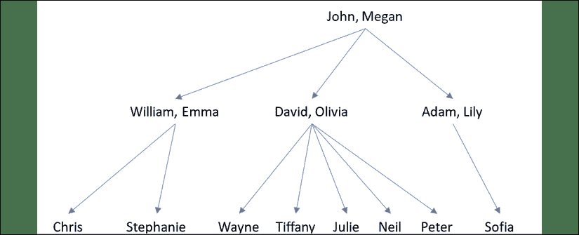
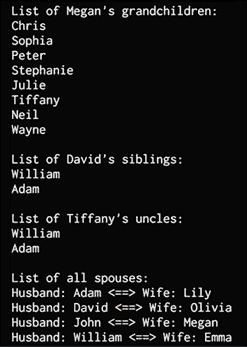
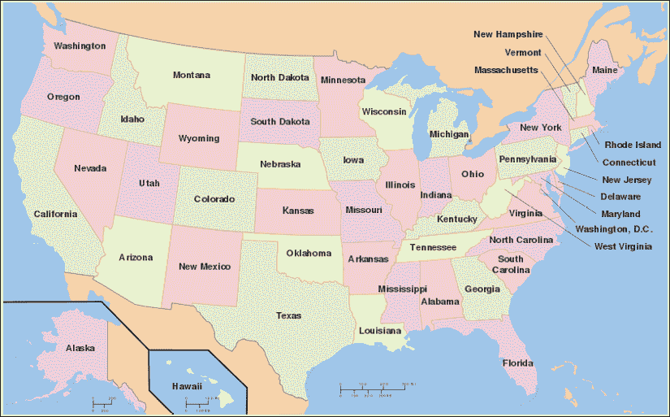

# 9 逻辑编程

在本章中，我们将学习如何使用逻辑编程编写程序。 我们将讨论各种编程范例，并查看如何使用逻辑编程构造程序。 我们将学习逻辑编程的组成部分，并了解如何解决这一领域的问题。 我们将实现 Python 程序来构建各种解决各种问题的求解器。

在本章结束时，您将了解以下内容：

*   什么是逻辑编程？
*   了解逻辑编程的基础
*   使用逻辑编程解决问题
*   安装 Python 包
*   匹配数学表达式
*   验证素数
*   解析家谱
*   分析地理
*   构建一个解谜器

# 什么是逻辑编程？

逻辑编程是一种编程范例，基本上意味着它是一种进行编程的方法。 在我们讨论它的构成及其在**人工智能**（**AI**）中的相关性之前，让我们先讨论一下编程范例。

编程范例的概念源于对编程语言进行分类的需求。 它是指计算机程序通过代码解决问题的方式。

一些编程范例主要涉及含义或用于实现特定结果的操作顺序。 其他编程范例也关注我们如何组织代码。

以下是一些较流行的编程范例：

*   **命令式**：使用语句更改程序的状态，从而产生副作用。
*   **函数式**：将计算视为对数学函数的评估，并且不允许更改状态或可变数据。
*   **声明式**：一种编程的方式，其中，通过描述需要完成的操作而不是如何执行来编写程序。 在不明确描述控制流程的情况下表达了底层计算的逻辑。
*   **面向对象**：将程序中的代码分组，以使每个对象都对自己负责。 对象包含指定更改如何发生的数据和方法。
*   **过程式**：将代码分组为功能，每个功能负责一系列步骤。
*   **符号式**：使用样式的语法和语法，程序可通过将样式视为纯数据来修改其自身的组件。
*   **逻辑式**：将计算视为对由事实和规则组成的知识数据库的自动推理。

逻辑编程已经存在了一段时间。 在 AI 的最后一个鼎盛时期非常流行的语言是 Prolog。 它是仅使用三种构造的语言：

*   事实
*   规则
*   问题

但是使用这三种构造，您就可以构建一些强大的系统。 一种流行的用法是构建“专家系统”。 背后的想法是采访在特定领域工作了很长时间的人类专家，并将访谈编入 AI 系统。 构建专家系统的领域示例如下：

*   **医学**：著名的例子包括 MYCIN，INTERNIST-I 和 CADUCEUS
*   **化学分析**：DENDRAL 是用于预测分子结构的分析系统
*   **财务**：协助银行家贷款的咨询计划
*   **调试程序**：SAINT，MATLAB 和 MACSYMA

为了理解逻辑编程，有必要了解计算和演绎的概念。 为了计算某些东西，我们从一个表达式和一组规则开始。 这套规则基本上是程序。

表达式和规则用于生成输出。 例如，假设我们要计算 23、12 和 49 的总和：


图 1：加法运算机制

完成操作的过程如下：

1.  相加`3 + 2 + 9 = 14`
2.  我们需要保留一个数字，即 4，然后携带 1
3.  相加`2 + 1 + 4 + 1 = 8`（加上我们携带的 1）
4.  结合 8 和 4。最终结果是：84

另一方面，要推断出某些东西，我们需要从一个推测开始。 证明是根据一组规则构造的。 计算过程是机械的，而演绎过程则更具创造性。

使用逻辑编程范例编写程序时，将基于有关问题域的事实和规则指定一组语句，然后求解器使用此信息进行求解。

# 了解逻辑编程的组成部分

在面向对象的或命令式编程中，始终需要定义一个变量。 在逻辑编程中，工作原理有所不同。 可以将未实例化的参数传递给函数，并且解释器将通过查看用户定义的事实来实例化这些变量。 这是解决变量匹配问题的有效方法。 将变量与不同项目进行匹配的过程称为统一。 这是逻辑编程不同的方式之一。 关系也可以在逻辑编程中指定。 关系通过称为事实和规则的子句来定义。

事实只是陈述，是关于程序和数据的真实情况。 语法很简单。 例如，“唐纳德是艾伦的儿子”是事实，而“艾伦的儿子是谁？”并非事实。 每个逻辑程序都需要事实，以便可以基于事实来实现给定的目标。

规则是我们在表达各种事实以及如何查询它们方面学到的知识。 它们是必须满足的约束，它们使您能够得出有关问题域的结论。 例如，假设您正在构建国际象棋引擎。 您需要指定有关如何在棋盘上移动的所有规则。

# 使用逻辑编程解决问题

逻辑编程使用事实和规则寻找解决方案。 必须为每个程序指定一个目标。 当逻辑程序和目标不包含任何变量时，求解器会提供一棵树，该树构成了用于解决问题和达到目标的搜索空间。

关于逻辑编程，最重要的事情之一就是我们如何对待规则。 规则可以视为逻辑语句。 让我们考虑以下内容：

```
Kathy orders dessert => Kathy is happy
```

这可以理解为：“如果 Kathy 很开心”和“则 Kathy 订购甜品”。 当凯西开心时，也可以将其解释为订购甜品。

同样，让我们​​考虑以下规则和事实：

```
canfly(X) :- bird(X), not abnormal(X).

abnormal(X) :- wounded(X).

bird(john).

bird(mary).

wounded(john).
```

以下是解释规则和事实的方法：

*   约翰受伤了
*   玛丽是鸟
*   约翰是鸟
*   受伤的鸟是异常的
*   没有异常的鸟可以飞

由此，我们可以得出结论，玛丽可以飞翔，而约翰不能飞翔。

在整个逻辑编程中，此结构以各种形式使用，以解决各种类型的问题。 让我们继续前进，看看如何解决 Python 中的这些问题。

# 安装 Python 软件包

在开始使用 Python 进行逻辑编程之前，我们需要安装几个软件包。 软件包`logpy`是一个 Python 软件包，可在 Python 中进行逻辑编程。 我们还将针对某些问题使用 SymPy。 因此，我们继续使用`pip`安装`logpy`和`sympy`：

```py
$ pip3 install logpy
$ pip3 install sympy 
```

如果在`logpy`的安装过程中出现错误，则可以从[这个页面](https://github.com/logpy/logpy)的源代码安装它。 一旦成功安装了这些软件包，就可以继续进行下一部分的。

# 匹配数学表达式

我们一直遇到数学运算。 逻辑编程是比较表达式并找出未知值的有效方法。 让我们看看如何做到这一点。

创建一个新的 Python 文件并导入以下软件包：

```py
from logpy import run, var, fact
import logpy.assoccomm as la 
```

定义几个数学运算：

```py
# Define mathematical operations
add = 'addition'
mul = 'multiplication' 
```

加法和乘法都是交换操作（意味着可以对操作数进行翻转而不会改变结果）。 让我们指定：

```py
# Declare that these operations are commutative 
# using the facts system
fact(la.commutative, mul)
fact(la.commutative, add)
fact(la.associative, mul)
fact(la.associative, add) 
```

让我们定义一些变量：

```py
# Define some variables
a, b, c = var('a'), var('b'), var('c') 
```

考虑以下表达式：

```py
expression_orig = 3 x (-2) + (1 + 2 x 3) x (-1) 
```

让我们用带掩码的变量生成该表达式。 第一个表达式是：

```py
expression1 = (1 + 2 x a) x b + 3 x c
```

第二个表达式是：

```py
expression2 = c x 3 + b x (2 x a + 1)
```

第三个表达式是：

```py
expression3 = ((((2 x a) x b) + b) + 3 x c
```

如果仔细观察，所有三个表达式都代表相同的基本表达式。 目标是将这些表达式与原始表达式匹配以提取未知值：

```py
# Generate expressions
expression_orig = (add, (mul, 3, -2), (mul, (add, 1, (mul, 2, 3)), -1))
expression1 = (add, (mul, (add, 1, (mul, 2, a)), b), (mul, 3, c))
expression2 = (add, (mul, c, 3), (mul, b, (add, (mul, 2, a), 1)))
expression3 = (add, (add, (mul, (mul, 2, a), b), b), (mul, 3, c)) 
```

将表达式与原始表达式进行比较。 方法运行通常在`logpy`中使用。 此方法采用输入参数并运行表达式。 第一个参数是值的数量，第二个参数是变量，第三个参数是函数：

```py
# Compare expressions
print(run(0, (a, b, c), la.eq_assoccomm(expression1, expression_orig)))
print(run(0, (a, b, c), la.eq_assoccomm(expression2, expression_orig)))
print(run(0, (a, b, c), la.eq_assoccomm(expression3, expression_orig))) 
```

完整代码在`expression_matcher.py`中给出。 如果运行代码，将看到以下输出：

```py
((3, -1, -2),)
((3, -1, -2),) 
() 
```

的前两行中的三个值表示`a`，`b`和`c`的值。 前两个表达式与原始表达式匹配，而第三个则什么也不返回。 这是因为，尽管第三个表达式在数学上是相同的，但在结构上却有所不同。 模式比较通过比较和表达式的结构来进行。

# 验证素数

让我们看看如何使用逻辑编程检查素数。 我们将使用`logpy`中可用的构造来确定给定列表中的哪些数字是质数，以及找出给定数字是否为质数。

创建一个新的 Python 文件并导入以下软件包：

```py
import itertools as it
import logpy.core as lc
from sympy.ntheory.generate import prime, isprime 
```

接下来，定义一个函数，该函数根据数据类型检查给定数字是否为质数。 如果是数字，则很简单。 如果它是一个变量，那么我们必须运行顺序操作。 为了提供一些背景知识，方法`conde`是一个目标构造函数，提供逻辑 AND 和 OR 运算。

方法`condeseq`类似于`conde`，但是它支持目标的通用迭代：

```py
# Check if the elements of x are prime 
def check_prime(x):
    if lc.isvar(x):
        return lc.condeseq([(lc.eq, x, p)] for p in map(prime, it.count(1)))
    else:
        return lc.success if isprime(x) else lc.fail 
```

声明将要使用的变量`x`：

```py
# Declate the variable 
x = lc.var() 
```

定义一组数字并检查哪些数字是质数。 方法`membero` 检查给定数字是否为输入参数中指定的数字列表的成员：

```py
# Check if an element in the list is a prime number 
list_nums = (23, 4, 27, 17, 13, 10, 21, 29, 3, 32, 11, 19)
print('\nList of primes in the list:')
print(set(lc.run(0, x, (lc.membero, x, list_nums), (check_prime, x)))) 
```

现在，通过打印前 7 个质数，以稍微不同的方式使用该函数：

```py
# Print first 7 prime numbers 
print('\nList of first 7 prime numbers:') 
print(lc.run(7, x, check_prime(x))) 
```

完整代码为`prime.py`中提供的。 如果运行代码，将看到以下输出：

```py
List of primes in the list:
{3, 11, 13, 17, 19, 23, 29}
List of first 7 prime numbers: (2, 3, 5, 7, 11, 13, 17) 
```

您可以确认输出值正确。

# 解析族谱

现在，我们对逻辑编程有了更多的了解，让我们使用它来解决一个有趣的问题。 考虑以下族谱：



图 2：样本族谱

约翰和梅根有三个儿子-威廉，大卫和亚当。 威廉，大卫和亚当的妻子分别是艾玛，奥利维亚和莉莉。 威廉和艾玛有两个孩子-克里斯和斯蒂芬妮。 大卫和奥利维亚有五个孩子-韦恩，蒂芙尼，朱莉，尼尔和彼得。 亚当和莉莉有一个孩子-索菲娅。 基于这些事实，我们可以创建一个程序来告诉我们韦恩的祖父或索菲娅的叔叔的名字。 即使我们没有明确指定有关祖父母或叔叔关系的任何内容，逻辑编程也可以推断出它们。

这些关系是在为您提供的名为`relationships.json`的文件中指定的。 该文件如下所示：

```py
{
       "father":
      [
              {"John": "William"},
              {"John": "David"},
              {"John": "Adam"},
              {"William": "Chris"},
              {"William": "Stephanie"},
              {"David": "Wayne"},
              {"David": "Tiffany"},
              {"David": "Julie"},
              {"David": "Neil"},
              {"David": "Peter"},
              {"Adam": "Sophia"}
      ],
      "mother":
      [
              {"Megan": "William"},
              {"Megan": "David"},
              {"Megan": "Adam"},
              {"Emma": "Stephanie"},
              {"Emma": "Chris"},
              {"Olivia": "Tiffany"},
              {"Olivia": "Julie"},
              {"Olivia": "Neil"},
              {"Olivia": "Peter"},
              {"Lily": "Sophia"}
    ]
} 
```

这是一个简单的 JSON 文件，用于指定父母之间的关系。 请注意，我们没有指定有关丈夫和妻子，祖父母或叔叔的任何信息。

创建一个新的 Python 文件并导入以下软件包：

```py
import json
from logpy import Relation, facts, run, conde, var, eq 
```

定义一个函数来检查`x`是否是`y`的父级。 我们将使用以下逻辑：如果`x`是`y`的父母，则`x`是父亲或母亲。 我们已经在事实基础中定义了“父亲”和“母亲”：

```py
# Check if 'x' is the parent of 'y' 
def parent(x, y):
    return conde([father(x, y)], [mother(x, y)]) 
```

定义一个函数来检查`x`是否为`y`的祖父母。 我们将使用以下逻辑：如果`x`是`y`的祖父母，则`x`的后代将是`y`的父代：

```py
# Check if 'x' is the grandparent of 'y' 
def grandparent(x, y):
    temp = var()
    return conde((parent(x, temp), parent(temp, y))) 
```

定义一个函数来检查`x`是否是`y`的兄弟。 我们将使用以下逻辑：如果`x`是`y`的兄弟，则`x`和`y`将具有相同的父代。 请注意，此处需要进行一些修改，因为当我们列出`x`的所有同级时，也会列出`x`，因为`x`满足这些条件。 因此，当我们打印输出时，我们将不得不从列表中删除`x`。 我们将在`main`函数中对此进行讨论：

```py
# Check for sibling relationship between 'a' and 'b' 
def sibling(x, y):
    temp = var()
    return conde((parent(temp, x), parent(temp, y))) 
```

定义一个函数以检查`x`是否是`y`的叔叔。 我们将使用以下逻辑：如果`x`是`y`的叔叔，那么`x`的祖父母将与`y`的父母相同。 请注意，此处需要进行一些修改，因为当我们列出`x`的所有叔叔时，也会列出`x`的父亲，因为`x`的父亲满足了这些条件。 因此，当我们打印输出时，我们将不得不从列表中删除`x`的父亲。 我们将在主要功能中对此进行讨论：

```py
# Check if x is y's uncle 
def uncle(x, y):
    temp = var()
    return conde((father(temp, x), grandparent(temp, y))) 
```

定义`main`函数并初始化关系`father`和`mother`：

```py
if __name__=='__main__':
    father = Relation()
    mother = Relation() 
```

从`relationships.json`文件中加载数据：

```py
 with open('relationships.json') as f: 
        d = json.loads(f.read()) 
```

读取数据并将其添加到事实库：

```py
 for item in d['father']:
        facts(father, (list(item.keys())[0], list(item.values())[0])) 
```

```py
 for item in d['mother']:
        facts(mother, (list(item.keys())[0], list(item.values())[0])) 
```

定义变量`x`：

```py
 x = var() 
```

现在，我们准备提出一些问题，看看求解器能否提出正确的答案。 让我们问一下约翰的孩子是谁：

```py
 # John's children 
    name = 'John'
    output = run(0, x, father(name, x)) 
    print("\nList of " + name + "'s children:") 
    for item in output:
        print(item) 
```

威廉的母亲是谁？

```py
 # William's mother 
    name = 'William'
    output = run(0, x, mother(x, name))[0] 
    print("\n" + name + "'s mother:\n" + output) 
```

亚当的父母是谁？

```py
 # Adam's parents name = 'Adam'
    output = run(0, x, parent(x, name)) 
    print("\nList of " + name + "'s parents:") 
    for item in output:
        print(item) 
```

谁是韦恩的祖父母？

```py
 # Wayne's grandparents name = 'Wayne'
    output = run(0, x, grandparent(x, name)) 
    print("\nList of " + name + "'s grandparents:") 
    for item in output:
        print(item) 
```

梅根的孙子是谁？

```py
 # Megan's grandchildren
    name = 'Megan'
    output = run(0, x, grandparent(name, x)) 
    print("\nList of " + name + "'s grandchildren:") 
    for item in output:
        print(item) 
```

大卫的兄弟姐妹是谁？

```py
 # David's siblings
    name = 'David'
    output = run(0, x, sibling(x, name)) 
    siblings = [x for x in output if x != name] 
    print("\nList of " + name + "'s siblings:") 
    for item in siblings:
        print(item) 
```

蒂芙尼的叔叔是谁

```py
 # Tiffany's uncles
    name = 'Tiffany'
    name_father = run(0, x, father(x, name))[0] 
    output = run(0, x, uncle(x, name))
    output = [x for x in output if x != name_father] 
    print("\nList of " + name + "'s uncles:")
    for item in output: 
        print(item) 
```

列出家庭中的所有配偶：

```py
 # All spouses
    a, b, c = var(), var(), var()
    output = run(0, (a, b), (father, a, c), (mother, b, c)) 
    print("\nList of all spouses:")
    for item in output:
        print('Husband:', item[0], '<==> Wife:', item[1]) 
```

完整代码为`family.py`中提供的。 如果运行代码，您将看到一些输出。 前半部分如下所示：


图 3：族谱示例输出

下半部分如下所示：：



图 4：族谱示例输出

您可以将输出与族谱进行比较，以确保在位上的确实正确。

# 地理分析

让我们使用逻辑编程来建立一个求解器来分析地理。 在此问题中，我们将指定有关美国各州位置的信息，然后查询程序以根据这些事实和规则回答各种问题。 以下是美国的地图：



图 5：相邻和沿海州示例图

已为您提供了两个名为`adjacent_states.txt` 和`coastal_states.txt`的文本文件。 这些文件包含有关哪些州彼此相邻以及哪些州沿岸的详细信息。 基于此，我们可以获得有趣的信息，例如“俄克拉荷马州和德克萨斯州都毗邻哪些州？” 或“哪个沿海州与新墨西哥州和路易斯安那州相邻？”

创建一个新的 Python 文件并导入以下内容：

```py
from logpy import run, fact, eq, Relation, var 
```

初始化关系：

```py
adjacent = Relation()
coastal = Relation() 
```

定义输入文件以从以下位置加载数据：

```py
file_coastal = 'coastal_states.txt' 
file_adjacent = 'adjacent_states.txt' 
```

加载数据：

```py
# Read the file containing the coastal states
with open(file_coastal, 'r') as f:
    line = f.read()
    coastal_states = line.split(',') 
```

将信息添加到事实库：

```py
# Add the info to the fact base 
for state in coastal_states:
    fact(coastal, state) 
```

读取相邻数据：

```py
# Read the file containing the coastal states 
with open(file_adjacent, 'r') as f:
    adjlist = [line.strip().split(',') for line in f if line and line[0].isalpha()] 
```

将邻接信息添加到事实库中：

```py
# Add the info to the fact base 
for L in adjlist:
    head, tail = L[0], L[1:]
    for state in tail:
        fact(adjacent, head, state) 
```

初始化变量`x`和`y`：

```py
# Initialize the variables
x = var()
y = var() 
```

现在，我们准备提出一些问题。 检查内华达州是否与路易斯安那州相邻：

```py
# Is Nevada adjacent to Louisiana?
output = run(0, x, adjacent('Nevada', 'Louisiana')) 
print('\nIs Nevada adjacent to Louisiana?:') 
print('Yes' if len(output) else 'No') 
```

打印出与俄勒冈州相邻的所有州：

```py
# States adjacent to Oregon
output = run(0, x, adjacent('Oregon', x)) 
print('\nList of states adjacent to Oregon:') 
for item in output:
    print(item) 
```

列出与密西西比州相邻的所有沿海州：

```py
# States adjacent to Mississippi that are coastal
output = run(0, x, adjacent('Mississippi', x), coastal(x)) 
print('\nList of coastal states adjacent to Mississippi:') 
for item in output:
    print(item) 
```

列出与沿海国接壤的七个州：

```py
# List of 'n' states that border a coastal state n = 7
output = run(n, x, coastal(y), adjacent(x, y))
print('\nList of ' + str(n) + ' states that border a coastal state:') 
for item in output:
    print(item) 
```

列出与阿肯色州和肯塔基州相邻的州：

```py
# List of states that adjacent to the two given states
output = run(0, x, adjacent('Arkansas', x), adjacent('Kentucky', x)) 
print('\nList of states that are adjacent to Arkansas and Kentucky:') 
for item in output:
    print(item) 
```

完整代码在`states.py`中给出。 如果运行代码，将看到以下输出：


图 6：相邻和沿海州示例输出

您可以将输出与美国地图进行交叉检查，以验证答案是否正确。 您也可以在程序中添加更多问题，以查看是否可以回答这些问题。

# 构建难题解决器

逻辑编程的另一个有趣的应用是解决难题。 我们可以指定难题的条件，程序将提供解决方案。 在本节中，我们将指定有关四个人的各种信息，并要求提供丢失的信息。

在逻辑程序中，我们按如下方式指定难题：

*   史蒂夫有辆蓝色的汽车。
*   养猫的人住在加拿大。 马修住在美国。
*   拥有黑色汽车的人居住在澳大利亚。
*   杰克有一只猫。
*   阿尔弗雷德（Alfred）居住在澳大利亚。
*   养狗的人住在法国。
*   谁有兔子？

目的是找到有兔子的人。 以下是有关这四个人的完整详细信息：


图 7：解谜器输入数据

创建一个新的 Python 文件并导入以下软件包：

```py
from logpy import *
from logpy.core import lall 
```

声明变量`people`：

```py
# Declare the variable people
people = var() 
```

使用`lall`定义所有规则。 第一条规则是有四个人：

```py
# Define the rules
rules = lall(
    # There are 4 people
    (eq, (var(), var(), var(), var()), people), 
```

名为史蒂夫的人有一辆蓝色轿车：

```py
 # Steve's car is blue
    (membero, ('Steve', var(), 'blue', var()), people), 
```

养猫的人住在加拿大：

```py
 # Person who has a cat lives in Canada
    (membero, (var(), 'cat', var(), 'Canada'), people), 
```

名为 Matthew 的人住在美国：

```py
 # Matthew lives in USA
    (membero, ('Matthew', var(), var(), 'USA'), people), 
```

拥有黑色汽车的人居住在澳大利亚：

```py
 # The person who has a black car lives in Australia 
    (membero, (var(), var(), 'black', 'Australia'), people), 
```

叫杰克的人有一只猫：

```py
 # Jack has a cat
    (membero, ('Jack', 'cat', var(), var()), people), 
```

名为 Alfred 的人居住在澳大利亚：

```py
 # Alfred lives in Australia
    (membero, ('Alfred', var(), var(), 'Australia'), people), 
```

养狗的人住在法国：

```py
 # Person who owns the dog lives in France
    (membero, (var(), 'dog', var(), 'France'), people), 
```

这一组人中有一只兔子。 那个人是谁？

```py
 # Who has a rabbit?
    (membero, (var(), 'rabbit', var(), var()), people)
) 
```

使用上述约束运行求解器：

```py
# Run the solver
solutions = run(0, people, rules) 
```

从解决方案中提取输出：

```py
# Extract the output
output = [house for house in solutions[0] if 'rabbit' in house][0][0] 
```

打印从求解器获得的完整矩阵：

```py
# Print the output
print('\n' + output + ' is the owner of the rabbit') 
print('\nHere are all the details:')
attribs = ['Name', 'Pet', 'Color', 'Country'] 
print('\n' + '\t\t'.join(attribs))
print('=' * 57)
for item in solutions[0]:
    print('')
    print('\t\t'.join([str(x) for x in item])) 
```

完整代码在`puzzle.py`中给出。 如果运行代码，将看到以下输出：


图 8：解谜器输出

前面的图显示了使用求解器获得的所有值。 如编号名称所示，其中一些仍然未知。 即使信息不完整，求解器仍能够回答问题。 但是为了回答每个问题，您可能需要添加更多规则。 该程序旨在演示如何用不完整的信息解决难题。 您可以尝试使用它，看看如何为各种场景构建拼图解算器。

# 总结

在本章中，我们学习了如何使用逻辑编程编写 Python 程序。 我们讨论了各种编程范例如何处理构建程序。 我们了解了如何在逻辑编程中构建程序。 我们了解了逻辑编程的各种构建块，并讨论了如何解决此领域的问题。 我们实现了各种 Python 程序来解决有趣的问题和难题。

在下一章中，我们将学习启发式搜索技术，并使用这些算法来解决现实世界中的问题。