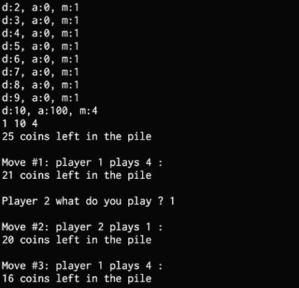
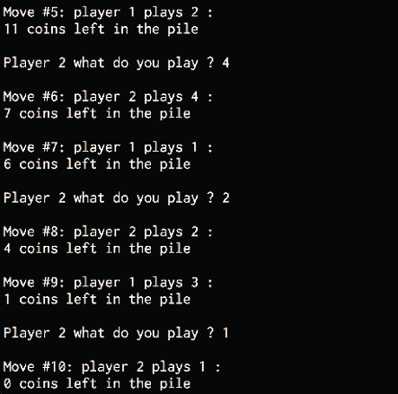
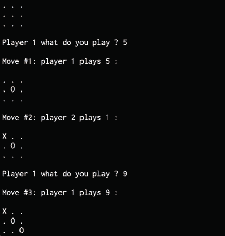
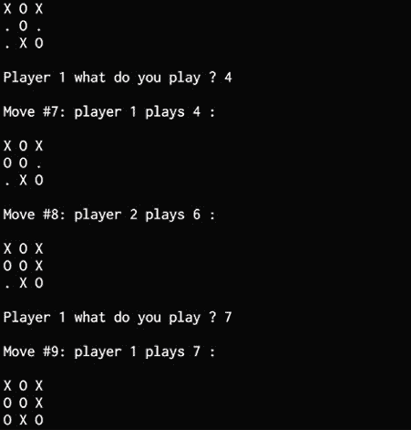
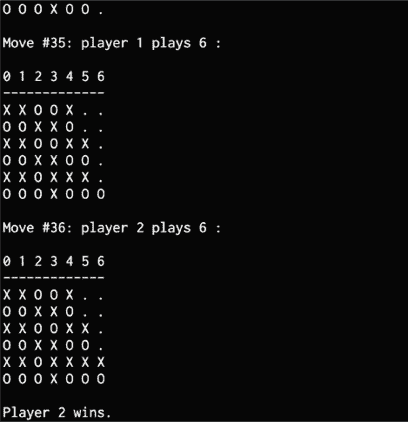
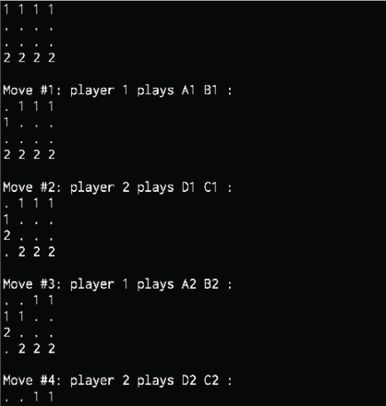
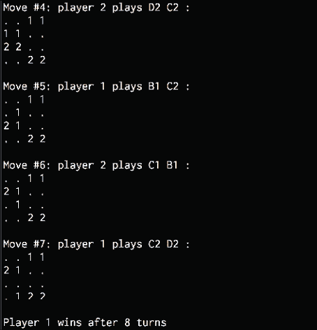

# 13

# 使用人工智能构建游戏

在本章中，我们将学习如何使用称为组合搜索的人工智能技术来构建游戏。 在其最基本的形式中，可以将其视为*蛮力方法*。 我们探索每种可能的解决方案。 在本章的后面，我们将变得更加聪明，找到一种使搜索短路的方法，而不必尝试所有可能的方法。 我们将学习如何使用搜索算法有效地提出赢得一系列游戏的策略。 然后，我们将使用这些算法为不同的游戏构建智能机器人。

在本章结束时，您将对以下概念有更好的理解：

*   游戏中的搜索算法
*   组合搜索
*   Minimax 算法
*   Alpha-Beta 修剪
*   Negamax 算法
*   构建一个机器人来玩最后的硬币站立
*   构建一个玩井字游戏的机器人
*   构建两个机器人来相互玩四连环
*   构建两个机器人来对抗 Hexapawn

# 在游戏中使用搜索算法

搜索算法通常在游戏中用于确定策略的。 该算法搜索可能的游戏动作并选择最佳的动作。 实现这些搜索时需要考虑各种参数-速度，准确性，复杂性等。 这些算法考虑了给定当前游戏状态的所有可能的游戏动作，然后评估每个可能的动作以确定最佳动作。 这些算法的目标是找到最终导致游戏获胜的最佳动作。 而且，每个游戏都有不同的规则和约束集。 这些算法在探索最佳动作时会考虑这些规则和约束。

没有对手的游戏比拥有对手的游戏更容易优化。 具有多个玩家的游戏，游戏玩法变得更加复杂。 让我们考虑一个两人游戏。 玩家为赢得比赛而进行的每一个举动，对方玩家都会采取行动以阻止该玩家获胜。 因此，当搜索算法从当前状态中找到最佳移动方式集时，它就不能不考虑对方玩家的反向移动而仅仅进行移动。 这意味着每次移动后都需要不断重新评估搜索算法。

让我们讨论一下计算机如何感知任何给定的游戏。 我们可以将游戏视为搜索树。 该树中的每个节点代表一个未来状态。 例如，如果您正在演奏 **Tic–Tac–Toe** （无与交叉），则可以构造一棵树来表示所有可能的移动。 我们从树的根开始，这是游戏的起点。 该节点将具有几个代表各种可能动作的子代。 反过来，在对手进行更多移动之后，这些孩子将拥有更多代表游戏状态的孩子。 树的终端节点代表游戏的最终动作。 游戏将以平局结束，或者其中一名玩家将赢得比赛。搜索算法搜索该树以在游戏的每个步骤做出决策。 现在，我们将学习各种搜索技术，包括如何进行详尽的组合搜索，以帮助我们在井字游戏中永不丢失，并解决许多其他问题。

# 组合搜索

搜索算法似乎可以解决为游戏添加智能的问题，但是存在一个缺点。 这些算法采用一种称为穷举搜索的搜索类型，也称为*蛮力*搜索。 它基本上探索了整个搜索空间并测试了每种可能的解决方案。 这意味着该算法将必须先探索所有可能的解决方案，然后才能获得最佳解决方案。

随着游戏变得越来越复杂，蛮力搜索可能不是最好的方法，因为可能性越来越多。 搜索很快变得难以处理。 为了解决该问题，可以使用组合搜索来解决问题。 组合搜索是指一个研究领域，其中搜索算法使用启发式方法有效地探索解决方案空间，以减小搜索空间的大小。 这在象棋或围棋之类的游戏中很有用。

组合搜索通过使用修剪策略有效地工作。 这些策略通过消除显然错误解决方案来避免测试所有可能的解决方案。 这有助于节省时间和精力。 现在，我们已经了解了详尽的组合搜索及其局限性，我们将开始探索捷径，“修剪”搜索树并避免测试每个组合的方法。 在以下各节中，我们将探索一些特定的算法，这些算法使我们能够执行组合搜索。

## Minimax 算法

现在，我们已经简要地讨论了组合搜索，下面我们来讨论组合搜索算法所采用的启发式方法。 这些启发式方法可用于加快搜索策略，而 Minimax 算法就是组合搜索使用的此类策略之一。 当两个玩家互相对抗时，他们的目标是截然相反的。 每个玩家都试图赢得胜利。 因此，每一方都需要预测对方选手要做什么才能赢得比赛。 牢记这一点，Minimax 试图通过战略来实现这一目标。 它将尝试最小化对手试图最大化的功能。

如前所述，蛮力仅在具有少量可能动作的简单游戏中起作用。 在更复杂的情况下，计算机无法通过所有可能的状态来找到最佳游戏玩法。 在这种情况下，计算机可以尝试使用启发式方法基于当前状态计算最佳移动。 计算机构造一棵树，它从底部开始。 它评估哪些举动会对自己的对手有利。 该算法基于以下前提：对手将做出哪些动作，前提是对手将做出最有利于他们的动作，从而使计算机受益最少。 此结果是树的终端节点之一，计算机使用此位置向后工作。 可以为计算机可用的每个选项分配一个值，然后可以选择最高的值来执行操作。

## Alpha-Beta 修剪

Minimax 搜索是一种有效的策略，但最终仍会探索树上不相关的部分。 当在节点上找到指示符，表明该子树中不存在解决方案时，则无需评估该子树。 但是 Minimax 搜索过于保守，因此最终探索了其中的一些子树。

Alpha-Beta 算法更智能，可以避免搜索发现的树中没有解决方案的部分。 此过程称为，称为**修剪**，Alpha-Beta 修剪是一种策略，用于避免搜索树中不包含解决方案的部分。

Alpha-Beta 修剪中的 Alpha 和 Beta 参数是指计算过程中使用的两个边界。 这些参数是指限制可能的解决方案集的值。 这是基于已经探索过的树的部分的。 Alpha 是可能解的最大上限，而 Beta 是可能解的最小上限。

如前所述，可以根据当前状态为每个节点分配一个值。 当算法将任何新节点视为解决方案的潜在路径时，如果该节点值的当前估计值介于 Alpha 和 Beta 之间，则可以进行计算。 这是的修剪方式。

## Negamax 算法

**Negamax** 算法是 Minimax 的一种变体，在现实世界的实现中经常使用。 两人游戏通常是零和游戏，这意味着一个玩家的损失等于另一个玩家的收益，反之亦然。 Negamax 广泛使用此属性来提出增加其赢得游戏机会的策略。

就游戏而言，给第一位玩家的给定位置的价值是给第二位玩家的价值的否定。 每个玩家都在寻找能够最大程度地伤害对手的举动。 此举所产生的价值应使对手获得最小价值。 这两种方法都可以无缝地工作，这意味着可以使用一种方法来评估头寸。 就简单性而言，这是它比 Minimax 更具优势的地方。 Minimax 要求第一个玩家选择具有最大值的移动，而第二个玩家必须选择具有最小值的移动。 这里也使用 Alpha-Beta 修剪。 现在，我们已经研究了几种最流行的组合搜索算法，下面我们安装一个库，以便我们可以构建一些 AI 并查看这些算法的实际应用。

# 安装`easyAI`库

在本章中，我们将使用名为`easyAI`的库。 这是一个人工智能框架，它提供了构建两人游戏所需的所有功能。 [您可以在此处了解的更多信息](http://zulko.github.io/easyAI)。

通过运行以下命令进行安装：

```py
$ pip3 install easyAI 
```

为了使用某些预建例程，需要访问某些文件。 为了易于使用，本书随附的代码包含一个名为`easyAI`的文件夹。 确保将此文件夹放置在与代码文件相同的文件夹中。 此文件夹基本上是`easyAI` GitHub 存储库的子集，[可在此处找到](https://github.com/Zulko/easyAI)。

您可以遍历源代码以使自己更加熟悉。

# 建立一个玩最后代币站立的机器人

在此游戏中，有一堆硬币，每个玩家轮流从该堆中取出许多硬币。 可从堆中取出的硬币数量有上限和下限。 游戏的目的是避免拿最后一枚硬币。 该配方是`easyAI`库中给出的“骨头游戏”配方的一种变体。 让我们看看如何构建一个可以与用户对战的游戏。

创建一个新的 Python 文件，并导入以下软件包：

```py
from easyAI import TwoPlayersGame, id_solve, Human_Player, AI_Player
from easyAI.AI import TT 
```

创建一个类来处理游戏的所有操作。 该代码继承自`easyAI`库中提供的基类`TwoPlayersGame`。 为了使代码正常运行，必须定义几个参数。 第一个是`players`变量。 稍后将讨论`player`对象。 使用以下代码创建类：

```py
class LastCoinStanding(TwoPlayersGame):
    def __init__(self, players):
        # Define the players. Necessary parameter.
        self.players = players 
```

定义要开始游戏的玩家。 选手从一开始编号。 因此，在这种情况下，玩家一开始游戏：

```py
 # Define who starts the game. Necessary parameter.
        self.nplayer = 1 
```

定义堆中的硬币数量。 您可以在这里自由选择任何数字。 在这种情况下，让我们选择`25`：

```py
 # Overall number of coins in the pile
        self.num_coins = 25 
```

定义任何动作中可以取出的最大硬币数。 您也可以自由选择此参数的任何数字。 在我们的情况下，我们选择`4`：

```py
 # Define max number of coins per move
        self.max_coins = 4 
```

定义所有可能的动作。 在这种情况下，玩家每一步可以拿 1、2、3 或 4 个硬币：

```py
 # Define possible moves
    def possible_moves(self):
        return [str(x) for x in range(1, self.max_coins + 1)] 
```

定义一种方法移除硬币并跟踪堆中剩余的硬币数量：

```py
 # Remove coins
    def make_move(self, move):
        self.num_coins -= int(move) 
```

通过检查剩余的硬币数量来检查是否有人赢得了比赛：

```py
 # Did the opponent take the last coin?
    def win(self):
        return self.num_coins <= 0 
```

在有人赢得比赛后停止游戏：

```py
 # Stop the game when somebody wins 
    def is_over(self):
        return self.win() 
```

根据`win`方法计算分数。 有必要定义此方法：

```py
 # Compute score 
    def scoring(self):
        return 100 if self.win() else 0 
```

定义一种方法来显示桩的当前状态：

```py
 # Show number of coins remaining in the pile 
    def show(self):
        print(self.num_coins, 'coins left in the pile') 
```

定义`main`功能并从定义转置表开始。 换位表用于游戏中以存储位置和运动，以加快算法的速度。

输入以下代码：

```py
if __name__ == "__main__":
    # Define the transposition table
    tt = TT() 
```

定义方法`ttentry`以获取硬币数。 这是一个可选方法，用于创建用于描述游戏的字符串：

```py
 # Define the method
    LastCoinStanding.ttentry = lambda self: self.num_coins 
```

让我们使用 AI 解决游戏。 函数`id_solve`用于使用迭代加深来解决给定的游戏。 它基本上确定了谁可以使用所有途径赢得比赛。 它看起来可以回答以下问题：

*   第一个玩家能否通过完美玩法来赢得胜利？
*   电脑会永远输给一个完美的对手吗？

方法`id_solve`多次探索了游戏的 Negamax 算法中的各种选项。 它总是从游戏的初始状态开始，并且需要不断增加深度才能继续进行。 它将一直这样做，直到分数表明有人将赢或输。 中的第二个参数采用该方法尝试使用的深度列表。 在这种情况下，它将尝试从`2`到`20`的所有值：

```py
 # Solve the game
    result, depth, move = id_solve(LastCoinStanding,
            range(2, 20), win_score=100, tt=tt)
    print(result, depth, move) 
```

在计算机上启动游戏：

```py
 # Start the game
    game = LastCoinStanding([AI_Player(tt), Human_Player()])
    game.play() 
```

完整代码在文件`coins.py`中给出。 这是一个交互式程序，因此它将期望用户输入。 如果您运行代码，则基本上可以与计算机对抗。 您的目标是迫使计算机拿走最后的硬币，以便您赢得比赛。 如果运行代码，最初将获得以下输出：



图 1：最后一次站立硬币游戏的初始输出

如果向下滚动，将在结尾处看到以下内容：



图 2：最后一枚硬币站立式游戏的最终输出

如我们所见，计算机赢得了游戏，因为用户拿起了最后一个硬币。

让我们来看看为另一个游戏[tf-tac-toe]构建机器人。

# 建立一个玩井字游戏的机器人

井字游戏（Nights and Crosss）是，也许是世界上最著名的游戏之一。 让我们看看如何构建一个可以与用户对战的游戏。 这是`easyAI`库中给出的井字游戏食谱的一个较小变体。

创建一个新的 Python 文件并导入以下软件包：

```py
from easyAI import TwoPlayersGame, AI_Player, Negamax
from easyAI.Player import Human_Player 
```

定义一个包含所有玩游戏方法的类。 首先定义玩家和谁开始游戏：

```py
class GameController(TwoPlayersGame): 
    def __init__(self, players):
        # Define the players 
        self.players = players 
```

```py
 # Define who starts the game 
        self.nplayer = 1 
```

我们将使用 3×3 的木板，编号从 1 到 9：

```py
 # Define the board
    self.board = [0] * 9 
```

定义一种方法来计算所有可能的移动：

```py
 # Define possible moves 
    def possible_moves(self):
        return [a + 1 for a, b in enumerate(self.board) if b == 0] 
```

定义一种在移动后更新板的方法：

```py
 # Make a move
    def make_move(self, move): 
        self.board[int(move) - 1] = self.nplayer 
```

定义一种方法来查看是否有人输了游戏。 我们将检查某人是否连续三个：

```py
 # Does the opponent have three in a line?
    def loss_condition(self):
        possible_combinations = [[1,2,3], [4,5,6], [7,8,9],
            [1,4,7], [2,5,8], [3,6,9], [1,5,9], [3,5,7]] 
```

```py
 return any([all([(self.board[i-1] == self.nopponent)
                for i in combination]) for combination in possible_combinations]) 
```

使用`loss_condition`方法检查游戏是否完成：

```py
 # Check if the game is over 
    def is_over(self):
        return (self.possible_moves() == []) or self.loss_condition() 
```

定义一种方法来显示当前进度：

```py
 # Show current position 
    def show(self):
        print('\n'+'\n'.join([' '.join([['.', 'O', 'X'][self.board[3*j + i]]
                for i in range(3)]) for j in range(3)])) 
```

使用`loss_condition`方法计算分数：

```py
 # Compute the score 
    def scoring(self):
        return -100 if self.loss_condition() else 0 
```

定义`main`功能并从定义算法开始。 Negamax 将用作此游戏的 AI 算法。 可以预先指定算法应预先考虑的步骤数。 在这种情况下，让我们选择`7`：

```py
if __name__ == "__main__":
    # Define the algorithm
    algorithm = Negamax(7) 
```

开始游戏：

```py
 # Start the game
  GameController([Human_Player(), AI_Player(algorithm)]).play() 
```

完整代码在文件`tic_tac_toe.py`中给出。 这是一个交互式游戏，您可以在计算机上玩。 如果运行代码，最初将获得以下输出：



图 3：井字游戏初始输出

如果向下滚动，将看到以下输出：



图 4：井字游戏最终输出

如我们所见，游戏以平局结束。 我们已经研究了可以与用户对抗的机器人。 现在让我们建立两个机器人来对抗。 这次在 Connect Four™ 中。

# 建立两个机器人来互相玩 Connect Four™

Connect Four™ 是，这是一款流行的两人游戏，以 Milton Bradley 商标出售。 它也以其他名称（例如“连续四个”或“四个向上”）而闻名。 在此游戏中，玩家轮流将光盘放入由六行七列组成的垂直网格中。 目标是连续获取四张光盘。 这是`easyAI`库中提供的“连接四个”配方的变体。 让我们看看如何构建它。 在此配方中，我们将创建两个可以相互对抗的机器人，而不是与计算机对抗。 每个人将使用不同的算法来查看哪个获胜。

创建一个新的 Python 文件并导入以下软件包：

```py
import numpy as np
from easyAI import TwoPlayersGame, Human_Player, AI_Player, \
        Negamax, SSS 
```

定义一个类，其中包含玩游戏所需的所有方法：

```py
class GameController(TwoPlayersGame):
    def __init__(self, players, board = None):
        # Define the players
        self.players = players 
```

用六行七列定义板：

```py
 # Define the configuration of the board
        self.board = board if (board != None) else (
            np.array([[0 for i in range(7)] for j in range(6)])) 
```

定义谁将开始游戏。 在这种情况下，让玩家一个开​​始游戏：

```py
 # Define who starts the game 
        self.nplayer = 1 
```

定义位置：

```py
 # Define the positions
        self.pos_dir = np.array([[[i, 0], [0, 1]] for i in range(6)] +
                 [[[0, i], [1, 0]] for i in range(7)] +
                 [[[i, 0], [1, 1]] for i in range(1, 3)] +
                 [[[0, i], [1, 1]] for i in range(4)] +
                 [[[i, 6], [1, -1]] for i in range(1, 3)] +
                 [[[0, i], [1, -1]] for i in range(3, 7)]) 
```

定义方法以获取所有可能的移动：

```py
 # Define possible moves
    def possible_moves(self):
        return [i for i in range(7) if (self.board[:, i].min() == 0)] 
```

定义一种方法来控制移动：

```py
 # Define how to make the move
    def make_move(self, column):
        line = np.argmin(self.board[:, column] != 0)
        self.board[line, column] = self.nplayer 
```

定义一种显示当前状态的方法：

```py
 # Show the current status
    def show(self):
        print('\n' + '\n'.join(
                ['0 1 2 3 4 5 6', 13 * '-'] +
                [' '.join([['.', 'O', 'X'][self.board[5 - j][i]]
                for i in range(7)]) for j in range(6)])) 
```

定义一种方法来计算损失的外观。 每当有人连续赢得四个时，该玩家就会赢得比赛：

```py
 # Define what a loss_condition looks like 
    def loss_condition(self):
        for pos, direction in self.pos_dir:
            streak = 0
            while (0 <= pos[0] <= 5) and (0 <= pos[1] <= 6):
                if self.board[pos[0], pos[1]] == self.nopponent:
                    streak += 1
                    if streak == 4:
                        return True
                else:
                    streak = 0 
```

```py
 pos = pos + direction 
```

```py
 return False 
```

使用`loss_condition`方法检查游戏是否结束：

```py
 # Check if the game is over
    def is_over(self):
        return (self.board.min() > 0) or self.loss_condition() 
```

计算分数：

```py
 # Compute the score 
    def scoring(self):
        return -100 if self.loss_condition() else 0 
```

定义`main`功能并从定义算法开始。 然后，这两种算法将相互竞争。 Negamax 将用于第一个计算机播放器，`SSS*`算法将用于第二个计算机播放器。 `SSS*`是一种搜索算法，它通过以最佳优先方式遍历树来进行状态空间搜索。 两种方法都将事先考虑的匝数作为输入参数。 在这种情况下，让我们同时使用`5`：

```py
if __name__ == '__main__':
    # Define the algorithms that will be used
    algo_neg = Negamax(5)
    algo_sss = SSS(5) 
```

开始玩游戏：

```py
 # Start the game
    game = GameController([AI_Player(algo_neg), AI_Player(algo_sss)])
    game.play() 
```

打印结果：

```py
 # Print the result
    if game.loss_condition():
        print('\nPlayer', game.nopponent, 'wins.')
    else:
        print("\nIt's a draw.") 
```

完整代码在文件`connect_four.py`中给出。 这不是一个互动游戏。 该代码将一种算法与另一种算法进行比较。 Negamax 算法是玩家 1，`SSS*`算法是玩家 2。

如果运行代码，最初将获得以下输出：


图 5：连接四个游戏的初始输出

如果向下滚动，则会在结尾处看到以下内容：



图 6：连接四个游戏的最终输出

如我们所见，第二名玩家赢得了比赛。 让我们再尝试一个游戏：Hexapawn。

# 建立两个机器人来互相对抗 Hexapawn

**Hexapawn** 是一款两人游戏，尺寸为`N×M`。 棋子存在于棋盘的两侧，目标是将棋子一直推进到棋盘的另一端。 国际象棋的标准典当规则适用。 这是`easyAI`库中提供的 Hexapawn 配方的变体。 将创建两个机器人，并使其相互对峙。 让我们创建代码。

创建一个新的 Python 文件并导入以下软件包：

```py
from easyAI import TwoPlayersGame, AI_Player, \
        Human_Player, Negamax 
```

定义一个类，其中包含控制游戏所需的所有方法。 首先定义两侧的棋子数和棋盘的长度。 创建一个包含位置的元组列表：

```py
class GameController(TwoPlayersGame):
    def __init__(self, players, size = (4, 4)):
        self.size = size
        num_pawns, len_board = size
        p = [[(i, j) for j in range(len_board)] \
                for i in [0, num_pawns - 1]] 
```

为每个玩家分配方向，目标和棋子：

```py
 for i, d, goal, pawns in [(0, 1, num_pawns - 1, 
                p[0]), (1, -1, 0, p[1])]:
            players[i].direction = d
            players[i].goal_line = goal
            players[i].pawns = pawns 
```

定义玩家并指定谁先开始：

```py
 # Define the players
        self.players = players 
```

```py
 # Define who starts first
        self.nplayer = 1 
```

定义用于识别棋盘上的位置（例如 B6 或 C7）的字母：

```py
 # Define the alphabets 
        self.alphabets = 'ABCDEFGHIJ' 
```

定义一个`lambda`函数将字符串转换为元组：

```py
 # Convert B4 to (1, 3)
        self.to_tuple = lambda s: (self.alphabets.index(s[0]),
                int(s[1:]) - 1) 
```

定义`lambda`函数以将元组转换为字符串：

```py
 # Convert (1, 3) to B4
        self.to_string = lambda move: ' '.join([self.alphabets[
                move[i][0]] + str(move[i][1] + 1)
                for i in (0, 1)]) 
```

定义一种方法来计算可能的移动：

```py
 # Define the possible moves
    def possible_moves(self):
        moves = []
        opponent_pawns = self.opponent.pawns
        d = self.player.direction 
```

如果在某个位置没有找到对手的棋子，那么这是一个有效的举动：

```py
 for i, j in self.player.pawns:
            if (i + d, j) not in opponent_pawns:
                moves.append(((i, j), (i + d, j))) 
```

```py
 if (i + d, j + 1) in opponent_pawns:
                moves.append(((i, j), (i + d, j + 1))) 
```

```py
 if (i + d, j - 1) in opponent_pawns:
                moves.append(((i, j), (i + d, j - 1))) 
```

```py
 return list(map(self.to_string, [(i, j) for i, j in moves])) 
```

定义如何进行移动并基于此更新棋子：

```py
 # Define how to make a move
    def make_move(self, move):
        move = list(map(self.to_tuple, move.split(' ')))
        ind = self.player.pawns.index(move[0])
        self.player.pawns[ind] = move[1] 
```

```py
 if move[1] in self.opponent.pawns:
            self.opponent.pawns.remove(move[1]) 
```

定义损失条件。 如果一名玩家在一行中获得 4，则对手输了：

```py
 # Define what a loss looks like
    def loss_condition(self):
        return (any([i == self.opponent.goal_line
                for i, j in self.opponent.pawns])
                or (self.possible_moves() == []) ) 
```

使用`loss_condition`方法检查游戏是否完成：

```py
 # Check if the game is over
    def is_over(self):
        return self.loss_condition() 
```

打印当前状态：

```py
 # Show the current status 
    def show(self):
        f = lambda x: '1' if x in self.players[0].pawns else (
                '2' if x in self.players[1].pawns else '.') 
```

```py
 print("\n".join([" ".join([f((i, j)) for j in 
          range(self.size[1])]) for i in range(self.size[0])])) 
```

定义`main`函数并从定义`scoring` lambda 函数开始：

```py
if __name__=='__main__':
    # Compute the score
    scoring = lambda game: -100 if game.loss_condition() else 0 
```

定义要使用的算法。 在这种情况下，我们将使用 Negamax，它可以预先计算`12`移动并为策略使用`scoring` Lambda 函数：

```py
 # Define the algorithm
    algorithm = Negamax(12, scoring) 
```

开始玩游戏：

```py
 # Start the game
    game = GameController([AI_Player(algorithm), 
            AI_Player(algorithm)])
    game.play()
    print('\nPlayer', game.nopponent, 'wins after', game.nmove, 'turns') 
```

完整代码为文件`hexapawn.py`中提供的。 这不是互动游戏。 创建了两个机器人并使其相互对接。 如果运行代码，最初将获得以下输出：



图 7：Hexapawn 游戏的初始输出

如果您向下滚动，则会在结尾处看到以下内容：



图 8：Hexapawn 游戏最终输出

如我们所见，一名玩家赢得了比赛。

# 总结

在本章中，我们讨论了如何使用一种称为组合搜索的特殊类型的人工智能技术来构建游戏。 我们学习了如何使用这些类型的搜索算法来有效地提出赢得比赛的策略。 这些算法可用于为更复杂的游戏构建游戏机，并解决各种问题。 我们讨论了组合搜索以及如何使用组合搜索来加快搜索过程。 我们了解了 Minimax 和 Alpha-Beta 修剪。 我们了解了 Negamax 算法是如何在实践中使用的。 然后，我们使用这些算法来构建用于玩“最后的硬币站立”和“井字游戏”的机器人。

我们学习了如何在 Connect Four 和 Hexapawn 中构建两个相互竞争的机器人。 在下一章中，我们将学习语音识别并构建一个自动识别语音的系统。