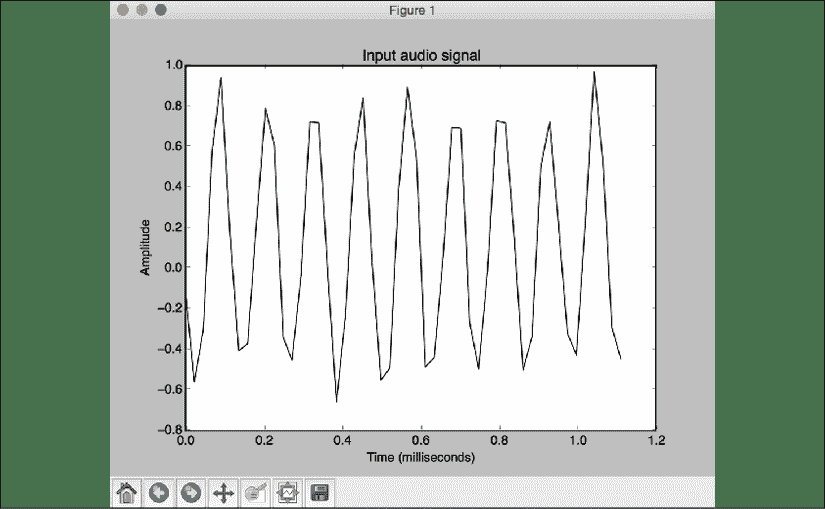
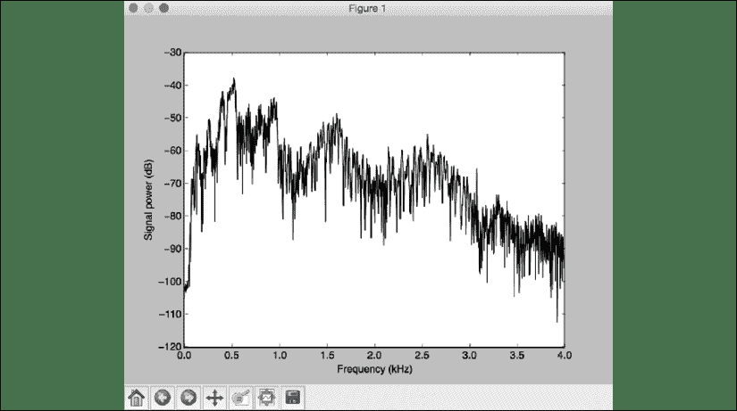
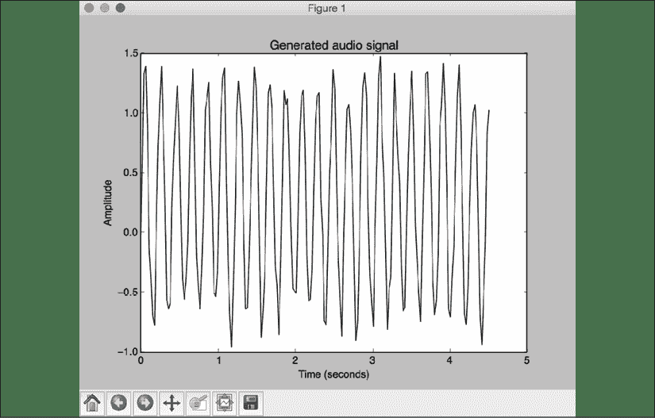
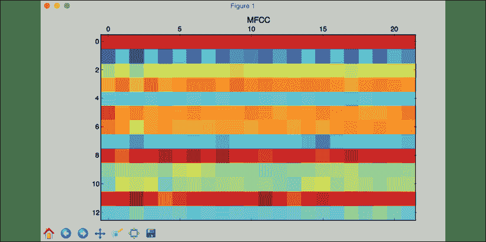
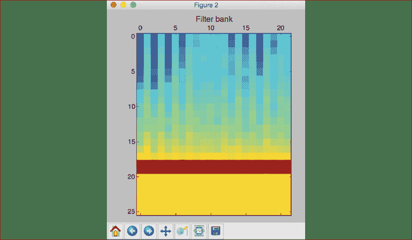
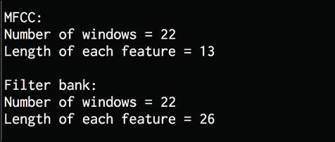
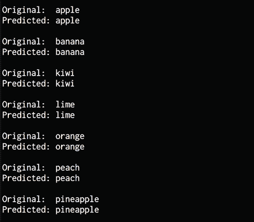

# 14 构建语音识别器

在本章中，我们将学习语音识别。 我们将讨论如何处理语音信号，并学习如何可视化各种音频信号。 通过利用各种技术来处理语音信号，我们将学习如何构建语音识别系统。

在本章结束时，您将了解更多有关：

*   处理语音信号
*   可视化音频信号
*   将音频信号转换到频域
*   产生音频信号
*   合成音调
*   提取语音特征
*   识别口语

我们将从讨论如何使用语音信号开始。

# 处理语音信号

语音识别是理解人类说出的单词的过程。 使用麦克风捕获语音信号，系统尝试理解正在捕获的单词。 语音识别广泛用于人机交互，智能手机，语音转录，生物识别系统，安全性等。

在分析语音信号之前，了解其本质非常重要。 这些信号恰好是各种信号的复杂混合。 语音的许多不同方面都会导致其复杂性。 它们包括情感，口音，语言和噪音。

由于这种复杂性，很难定义一套可靠的规则来分析语音信号。 相反，即使语音可以有很多变化，人类在理解语音方面也很出色。 人类似乎相对容易做到这一点。 为了使机器做到相同，我们需要帮助他们以与人类相同的方式理解语音。

研究人员致力于语音的各个方面和应用，例如理解口语，识别说话者是谁，识别情感以及识别口音。 在本章中，我们将着重于理解口语。 语音识别代表了人机交互领域的重要一步。 如果我们想构建可以与人类互动的认知机器人，那么他们需要以自然语言与我们对话。 这就是近年来自动语音识别成为许多研究人员关注的焦点的原因。 让我们继续，看看如何处理第个语音信号并构建语音识别器。

# 可视化音频信号

让我们看看如何可视化音频信号。 我们将学习如何从文件中读取音频信号并进行处理。 这将帮助我们了解音频信号的结构。 使用麦克风录制音频文件时，它们会采样实际的音频信号并存储数字化版本。 真实的音频信号是连续的值波，这意味着我们无法按原样存储它们。 我们需要以一定频率对信号进行采样并将其转换为离散的数值形式。

最常见的是，语音信号以 44,100 Hz 采样。 这意味着语音信号的每一秒被分解成 44,100 个部分，并且这些时间戳中每个时间戳的值都存储在输出文件中。 我们每`1/44,100`秒保存一次音频信号的值。 在这种情况下，我们说音频信号的采样频率为 44,100 Hz。 通过选择高采样频率，当人们听音频信号时，它似乎是连续的。 让我们继续进行可视化音频信号。

创建一个新的 Python 文件并导入以下包：

```py
import numpy as np
import matplotlib.pyplot as plt
from scipy.io import wavfile 
```

使用`wavefile.read`方法读取输入的音频文件。 它返回两个值–采样频率和音频信号：

```py
# Read the audio file
sampling_freq, signal = wavfile.read('random_sound.wav') 
```

打印信号的形状，数据类型和音频信号的持续时间：

```py
# Display the params
print('\nSignal shape:', signal.shape)
print('Datatype:', signal.dtype)
print('Signal duration:', round(signal.shape[0] / float(sampling_freq), 2), 'seconds') 
```

标准化信号：

```py
# Normalize the signal
signal = signal / np.power(2, 15) 
```

从`numpy`数组中提取第一个`50`值进行绘图：

```py
# Extract the first 50 values
signal = signal[:50] 
```

以秒为单位构造时间轴：

```py
# Construct the time axis in milliseconds
time_axis = 1000 * np.arange(0, len(signal), 1) / float(sampling_freq) 
```

绘制音频信号：

```py
# Plot the audio signal
plt.plot(time_axis, signal, color='black')
plt.xlabel('Time (milliseconds)')
plt.ylabel('Amplitude')
plt.title('Input audio signal')
plt.show() 
```

完整代码在文件`audio_plotter.py`中给出。 如果运行代码，您将看到以下屏幕截图：



图 1：输入音频信号的可视化

前面的屏幕截图显示了输入音频信号的前 50 个样本。 您将看到以下输出：


图 2：输入音频信号输出

上图中打印的输出显示了我们从符号 al 中提取的信息。

# 将音频信号转换到频域

为了分析音频信号，我们需要了解基本的频率成分。 这使我们能够洞悉如何从该信号中提取有意义的信息。 音频信号由频率，相位和幅度不同的正弦波混合而成。

如果我们剖析频率分量，我们可以识别很多特征。 任何给定的音频信号的特征在于其在频谱中的分布。 为了将时域信号转换为频域，我们需要使用数学工具，例如**傅里叶变换**。 如果您需要快速学习傅立叶变换，[请查看以下链接](http://www.thefouriertransform.com)。 让我们看看如何将音频信号从时域转换到频域。

创建一个新的 Python 文件并导入以下包：

```py
import numpy as np
import matplotlib.pyplot as plt 
from scipy.io import wavfile 
```

使用`wavefile.read`方法读取输入的音频文件。 它返回两个值–采样频率和音频信号：

```py
# Read the audio file
sampling_freq, signal = wavfile.read('spoken_word.wav') 
```

标准化音频信号：

```py
# Normalize the values
signal = signal / np.power(2, 15) 
```

提取信号的长度和一半长度：

```py
# Extract the length of the audio signal
len_signal = len(signal) 
```

```py
# Extract the half length
len_half = np.ceil((len_signal + 1) / 2.0).astype(np.int) 
```

对信号应用傅立叶变换：

```py
# Apply Fourier transform 
freq_signal = np.fft.fft(signal) 
```

归一化频域信号并取平方：

```py
# Normalization
freq_signal = abs(freq_signal[0:len_half]) / len_signal 
```

```py
# Take the square
freq_signal **= 2 
```

调整偶数和奇数情况下的傅立叶变换信号：

```py
# Extract the length of the frequency transformed signal
len_fts = len(freq_signal) 
```

```py
# Adjust the signal for even and odd cases
if len_signal % 2:
    freq_signal[1:len_fts] *= 2 
```

```py
else:
    freq_signal[1:len_fts-1] *= 2 
```

在`dB`中提取电源信号：

```py
# Extract the power value in dB 
signal_power = 10 * np.log10(freq_signal) 
```

构建`X`轴，在这种情况下，是在`kHz`中测量的频率：

```py
# Build the X axis
x_axis = np.arange(0, len_half, 1) * (sampling_freq / len_signal) / 1000.0 
```

绘制图：

```py
# Plot the figure
plt.figure()
plt.plot(x_axis, signal_power, color='black')
plt.xlabel('Frequency (kHz)')
plt.ylabel('Signal power (dB)')
plt.show() 
```

完整代码在文件`frequency_transformer.py`中给出。 如果运行代码，您将看到以下屏幕截图：



图 3：音频信号转换的可视化

前面的屏幕截图显示了信号在整个频谱上的强大程度。 在这种情况下，信号的功率会以较高的频率下降。

# 生成音频信号

现在我们知道音频信号是如何工作的，让我们看看如何生成一个这样的信号。 我们可以使用 NumPy 包生成各种音频信号。 由于音频信号是**正弦波**的混合，我们可以使用它来生成具有一些预定义参数的音频信号。

创建一个新的 Python 文件并导入以下包：

```py
import numpy as np
import matplotlib.pyplot as plt
from scipy.io.wavfile import write 
```

定义输出音频文件的名称：

```py
# Output file where the audio will be saved
output_file = 'generated_audio.wav' 
```

指定音频参数，例如持续时间，采样频率，音频频率，最小值和最大值：

```py
# Specify audio parameters
duration = 4  # in seconds
sampling_freq = 44100  # in Hz
tone_freq = 784
min_val = -4 * np.pi
max_val = 4 * np.pi 
```

使用定义的参数生成音频信号：

```py
# Generate the audio signal
t = np.linspace(min_val, max_val, duration * sampling_freq)
signal = np.sin(2 * np.pi * tone_freq * t) 
```

给信号增加一些噪声：

```py
# Add some noise to the signal
noise = 0.5 * np.random.rand(duration * sampling_freq)
signal += noise 
```

归一化并缩放信号：

```py
# Scale it to 16-bit integer values 
scaling_factor = np.power(2, 15) - 1
signal_normalized = signal / np.max(np.abs(signal))
signal_scaled = np.int16(signal_normalized * scaling_factor) 
```

将生成的音频信号保存在输出文件中：

```py
# Save the audio signal in the output file 
write(output_file, sampling_freq, signal_scaled) 
```

提取第一个`200`值进行绘图：

```py
# Extract the first 200 values from the audio signal 
signal = signal[:200] 
```

构造时间轴（以毫秒为单位）：

```py
# Construct the time axis in milliseconds
time_axis = 1000 * np.arange(0, len(signal), 1) / float(sampling_freq) 
```

绘制音频信号：

```py
# Plot the audio signal
plt.plot(time_axis, signal, color='black')
plt.xlabel('Time (milliseconds)')
plt.ylabel('Amplitude')
plt.title('Generated audio signal')
plt.show() 
```

完整代码在文件`audio_generator.py`中给出。 如果运行代码，您将看到以下屏幕截图：



图 4：音频信号生成的可视化

使用媒体播放器播放文件`generated_audio.wav`，以查看的外观。 这将是 *784 Hz* 信号和噪声信号的混合信号。

# 合成音调以产生音乐

前面的部分介绍了如何生成简单的单调，但意义不大。 它只是信号中的单个频率。 让我们使用该原理通过将不同的音调拼接在一起来合成音乐。 我们将使用诸如`A`，`C`，`G`和`F`之类的标准音来生成音乐。 为了查看这些标准音调的频率映射，[请查看以下链接](http://www.phy.mtu.edu/~suits/notefreqs.html)。

让我们使用此信息来生成音乐信号。

创建一个新的 Python 文件并导入以下包：

```py
import json
import numpy as np
import matplotlib.pyplot as plt
from scipy.io.wavfile import write 
```

定义一个函数以根据输入参数生成音调：

```py
# Synthesize the tone based on the input parameters
def tone_synthesizer(freq, duration, amplitude=1.0, sampling_freq=44100):
    # Construct the time axis
    time_axis = np.linspace(0, duration, duration * sampling_freq) 
```

使用指定的参数构造音频信号并返回：

```py
 # Construct the audio signal

    signal = amplitude * np.sin(2 * np.pi * freq * time_axis)
    return signal.astype(np.int16) 
```

定义`main`函数。 让我们定义输出音频文件名：

```py
if __name__=='__main__':
    # Names of output files
    file_tone_single = 'generated_tone_single.wav' 
    file_tone_sequence = 'generated_tone_sequence.wav' 
```

我们将使用一个音调映射文件，其中包含从音调名称（例如`A`，`C`和`G`）到相应频率的映射：

```py
 # Source: http://www.phy.mtu.edu/~suits/notefreqs.html
    mapping_file = 'tone_mapping.json' 
```

```py
 # Load the tone to frequency map from the mapping file
    with open(mapping_file, 'r') as f:
        tone_map = json.loads(f.read()) 
```

让我们生成持续时间为`3`秒的`F`音调：

```py
 # Set input parameters to generate 'F' tone
    tone_name = 'F'
    # seconds 
    duration = 3
    # amplitude 
    amplitude = 12000
    # Hz 
    sampling_freq = 44100 
```

提取相应的音频频率：

```py
 # Extract the tone frequency
    tone_freq = tone_map[tone_name] 
```

使用前面定义的音调合成器函数生成音调：

```py
 # Generate the tone using the above parameters
    synthesized_tone = tone_synthesizer(tone_freq, duration, amplitude, sampling_freq) 
```

将生成的音频信号写入输出文件：

```py
 # Write the audio signal to the output file 
    write(file_tone_single, sampling_freq, synthesized_tone) 
```

让我们生成一个音调序列，使其听起来像音乐。 让我们定义一个音调序列，其持续时间以秒为单位：

```py
 # Define the tone sequence along with corresponding 
    # durations in seconds
    tone_sequence = [('G', 0.4), ('D', 0.5), ('F', 0.3), ('C', 0.6), ('A', 0.4)] 
```

根据音调序列构造音频信号：

```py
 # Construct the audio signal based on the above sequence
    signal = np.array([])
    for item in tone_sequence:
        # Get the name of the tone
        tone_name = item[0] 
```

对于每个音调，提取相应的频率：

```py
 # Extract the corresponding frequency of the tone 
        freq = tone_map[tone_name] 
```

提取相应的持续时间：

```py
 # Extract the duration
        duration = item[1] 
```

使用`tone_synthesizer`函数合成音色：

```py
 # Synthesize the tone
        synthesized_tone = tone_synthesizer(freq, duration, amplitude, sampling_freq) 
```

将其附加到主输出信号：

```py
 # Append the output signal
        signal = np.append(signal, synthesized_tone, axis=0) 
```

将主输出信号保存到输出文件：

```py
 # Save the audio in the output file
    write(file_tone_sequence, sampling_freq, signal) 
```

完整代码为文件`synthesizer.py`中提供的。 如果运行代码，它将生成两个输出文件-`generated_tone_single.wav`和`generated_tone_sequence.wav`。

您可以使用媒体播放器播放音频文件，以听一下的声音。

# 提取语音特征

我们学习了如何将时域信号转换为频域。 频域特征已在所有语音识别系统中广泛使用。 我们之前讨论的概念是对该概念的介绍，但实际的频域特征要复杂一些。 将信号转换到频域后，我们需要确保以特征向量的形式使用该信号。 这就是 **梅尔频谱系数**（**MFCC**）的概念。 MFCC 是工具，用于从给定音频信号中提取频域特征。

为了从音频信号中提取频率特征，MFCC 首先提取功率谱。 然后，它使用滤波器组和**离散余弦变换**（**DCT**）提取特征。 如果您有兴趣进一步研究 MFCC，[请查看以下链接](http://practicalcryptography.com/miscellaneous/machine-learning/guide-mel-frequency-cepstral-coefficients-mfccs)。

我们将使用一个名为`python_speech_features`的包来提取 MFCC 特征。 [该包在这里可用](http://python-speech-features.readthedocs.org/en/latest)。

为了易于使用，相关的文件夹已包含在代码包中。 您将在代码包中看到一个名为`features`的文件夹，其中包含使用此包所需的文件。 让我们看看如何提取 MFCC 特征。

创建一个新的 Python 文件并导入以下包：

```py
import numpy as np
import matplotlib.pyplot as plt 
from scipy.io import wavfile 
from python_speech_features import mfcc, logfbank 
```

读取输入的音频文件并提取第一个`10,000`样本进行分析：

```py
# Read the input audio file
sampling_freq, signal = wavfile.read('random_sound.wav') 
```

```py
# Take the first 10,000 samples for analysis
signal = signal[:10000] 
```

提取 MFCC：

```py
# Extract the MFCC features
features_mfcc = mfcc(signal, sampling_freq) 
```

打印 MFCC 参数：

```py
# Print the parameters for MFCC
print('\nMFCC:\nNumber of windows =', features_mfcc.shape[0])
print('Length of each feature =', features_mfcc.shape[1]) 
```

绘制 MFCC 特征：

```py
# Plot the features
features_mfcc = features_mfcc.T
plt.matshow(features_mfcc)
plt.title('MFCC') 
```

提取滤波器组特征：

```py
# Extract the Filter Bank features
features_fb = logfbank(signal, sampling_freq) 
```

打印滤波器组的参数：

```py
# Print the parameters for Filter Bank
print('\nFilter bank:\nNumber of windows =', features_fb.shape[0])
print('Length of each feature =', features_fb.shape[1]) 
```

绘制特征：

```py
# Plot the features
features_fb = features_fb.T
plt.matshow(features_fb)
plt.title('Filter bank') 
```

```py
plt.show() 
```

完整代码在文件`feature_extractor.py`中给出。 如果运行代码，您将看到两个屏幕截图。 第一个屏幕截图显示了 MFCC 特征：



图 5：MFCC 特征映射

第二张屏幕截图显示了滤波器组特征：



图 6：滤波器组特征映射

您将看到以下打印出来：



图 7：MFCC 和滤波器组特征输出

正如我们在上一张图表中所看到的以及在本章中学到的那样，将声音转换为图片可能非常有用，并且它可以让我们以不同的方式分析声音并得出我们否则会错过的有见识的见解。

# 识别口语

现在已经学习了分析语音信号的所有技术，让我们继续学习如何识别语音。 语音识别系统将音频信号作为输入并识别正在说的单词。 **隐马尔可夫模型**（**HMM**）将用于此任务。

正如我们在上一章中讨论的那样，HMM 非常适合分析序列数据。 音频信号是时间序列信号，是序列数据的体现。 假定输出是由系统经过一系列隐藏状态生成的。 我们的目标是找出这些隐藏状态是什么，以便我们可以识别信号中的单词。 如果您有兴趣深入研究，[请查看以下链接](https://web.stanford.edu/~jurafsky/slp3/A.pdf)。

我们将使用名为`hmmlearn`的包来构建我们的语音识别系统。 [您可以在此处了解更多信息](http://hmmlearn.readthedocs.org/en/latest)。

您可以通过运行以下命令来安装包：

```py
$ pip3 install hmmlearn 
```

为了训练我们的语音识别系统，我们需要每个单词的音频文件数据集。 我们将使用[这个页面](https://code.google.com/archive/p/hmm-speech-recognition/downloads)上可用的数据库。

为了易于使用，在代码包中为您提供了一个名为`data`的文件夹，其中包含所有这些文件。 该数据集包含七个不同的单词。 每个词都有一个与之关联的文件夹，每个文件夹有 15 个音频文件。

在每个文件夹中，我们将使用 14 个进行训练，使用 1 个进行测试。 请注意，这实际上是一个非常小的数据集。 在现实世界中，您将使用更大的数据集来构建语音识别系统。 我们正在使用该数据集来熟悉语音识别，并了解如何构建一个系统来识别语音。

我们将为每个单词建立一个 HMM 模型，并存储所有模型以供参考。 当我们想识别未知音频文件中的单词时，我们将在所有这些模型中运行该单词，并选择得分最高的单词。 让我们看看如何建立这个系统。

创建一个新的 Python 文件并导入以下包：

```py
import os
import argparse
import warnings 
```

```py
import numpy as np
from scipy.io import wavfile 
```

```py
from hmmlearn import hmm
from python_speech_features import mfcc 
```

定义函数解析输入参数。 我们需要指定输入文件夹，其中包含训练语音识别系统所需的音频文件：

```py
# Define a function to parse the input arguments
def build_arg_parser():
    parser = argparse.ArgumentParser(description='Trains the HMM-based speech recognition system')
    parser.add_argument("--input-folder", dest="input_folder", required=True, help="Input folder containing the audio files for training")
    return parser 
```

定义一个训练 HMM 的类：

```py
# Define a class to train the HMM
class ModelHMM(object):
    def __init__(self, num_components=4, num_iter=1000):
        self.n_components = num_components
        self.n_iter = num_iter 
```

定义协方差类型和 HMM 类型：

```py
 self.cov_type = 'diag' 
        self.model_name = 'GaussianHMM' 
```

初始化变量，我们将在其中存储每个单词的模型：

```py
 self.models = [] 
```

使用指定的参数定义模型：

```py
 self.model = hmm.GaussianHMM(n_components=self.n_components, 
                covariance_type=self.cov_type, n_iter=self.n_iter) 
```

定义训练模型的方法：

```py
 # 'training_data' is a 2D numpy array where each row is 13-dimensional 
    def train(self, training_data):
        np.seterr(all='ignore')
        cur_model = self.model.fit(training_data)
        self.models.append(cur_model) 
```

定义一种方法来计算输入数据的分数：

```py
 # Run the HMM model for inference on input data
    def compute_score(self, input_data):
        return self.model.score(input_data) 
```

定义一个函数为训练数据集中的每个单词构建模型：

```py
# Define a function to build a model for each word
def build_models(input_folder):
    # Initialize the variable to store all the models
    speech_models = [] 
```

解析输入目录：

```py
 # Parse the input directory
    for dirname in os.listdir(input_folder):
        # Get the name of the subfolder
        subfolder = os.path.join(input_folder, dirname)
        if not os.path.isdir(subfolder):
            continue 
```

提取标签：

```py
 # Extract the label
        label = subfolder[subfolder.rfind('/') + 1:] 
```

初始化变量以存储训练数据：

```py
 # Initialize the variables
        X = np.array([]) 
```

创建用于训练的文件列表：

```py
 # Create a list of files to be used for training
        # We will leave one file per folder for testing
        training_files = [x for x in os.listdir(subfolder) if x.endswith('.wav')][:-1] 
```

```py
 # Iterate through the training files and build the models
        for filename in training_files:
            # Extract the current filepath
            filepath = os.path.join(subfolder, filename) 
```

从当前文件读取音频信号：

```py
 # Read the audio signal from the input file 
            sampling_freq, signal = wavfile.read(filepath) 
```

提取 MFCC 特征：

```py
 # Extract the MFCC features
            with warnings.catch_warnings():
                warnings.simplefilter('ignore')
                features_mfcc = mfcc(signal, sampling_freq) 
```

将数据点附加到变量`X`：

```py
 # Append to the variable X
            if len(X) == 0:
                X = features_mfcc
            else:
                X = np.append(X, features_mfcc, axis=0) 
```

初始化 HMM 模型：

```py
 # Create the HMM model
        model = ModelHMM() 
```

使用训练数据训练模型：

```py
 # Train the HMM
        model.train(X) 
```

将模型保存为当前单词：

```py
 # Save the model for the current word 
        speech_models.append((model, label)) 
```

```py
 # Reset the variable 
        model = None 
```

```py
 return speech_models 
```

定义一个函数以在测试数据集上运行测试：

```py
# Define a function to run tests on input files
def run_tests(test_files):
    # Classify input data
    for test_file in test_files:
        # Read input file
        sampling_freq, signal = wavfile.read(test_file) 
```

提取 MFCC 特征：

```py
 # Extract MFCC features
        with warnings.catch_warnings(): 
            warnings.simplefilter('ignore') 
            features_mfcc = mfcc(signal, sampling_freq) 
```

定义变量以存储最高分数和输出标签：

```py
 # Define variables
        max_score = -float('inf')
        output_label = None 
```

遍历每种模型以选择最佳模型：

```py
 # Run the current feature vector through all the HMM
        # models and pick the one with the highest score
        for item in speech_models:
            model, label = item 
```

求解分数并与最高分数进行比较：

```py
 score = model.compute_score(features_mfcc)
            if score > max_score:
                max_score = score
                predicted_label = label 
```

打印输出：

```py
 # Print the predicted output
        start_index = test_file.find('/') + 1
        end_index = test_file.rfind('/')
        original_label = test_file[start_index:end_index]
        print('\nOriginal: ', original_label)
        print('Predicted:', predicted_label) 
```

定义`main`函数并从输入参数获取输入文件夹：

```py
if __name__=='__main__':
    args = build_arg_parser().parse_args()
    input_folder = args.input_folder 
```

为输入文件夹中的每个单词建立一个 HMM 模型：

```py
 # Build an HMM model for each word 
    speech_models = build_models(input_folder) 
```

我们在每个文件夹中保留了一个文件进行测试。 使用该文件来查看模型的准确性：

```py
 # Test files -- the 15th file in each subfolder
    test_files = []
    for root, dirs, files in os.walk(input_folder):
        for filename in (x for x in files if '15' in x):
            filepath = os.path.join(root, filename)
            test_files.append(filepath) 
```

```py
 run_tests(test_files) 
```

完整代码在文件`speech_recognizer.py`中给出。 确保`data`文件夹与代码文件位于同一文件夹中。 运行代码，如下所示：

```py
$ python3 speech_recognizer.py --input-folder data 
```

如果运行代码，将看到以下输出：



图 8：识别的单词输出

正如我们在前面的编辑屏幕截图中所见一样，我们的语音识别系统可以正确识别的所有单词。

# 总结

在本章中，我们学习了语音识别。 我们讨论了如何使用语音信号和相关概念。 我们学习了如何可视化音频信号。 我们讨论了如何使用傅立叶变换将时域音频信号转换为频域。 我们讨论了如何使用预定义的参数生成音频信号。

然后，我们使用此概念通过将音调缝合在一起来合成音乐。 我们讨论了 MFCC 及其在现实世界中的使用方式。 我们了解了如何从语音中提取频率特征。 我们学习了如何使用所有这些技术来构建语音识别系统。 在下一章中，我们将讨论自然语言处理以及如何通过建模并对其进行分类来分析文本数据。