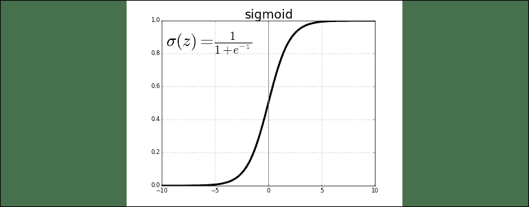
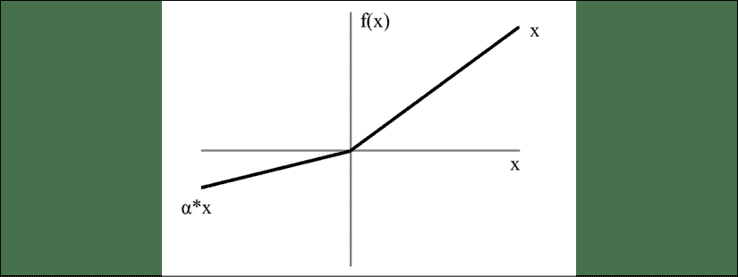
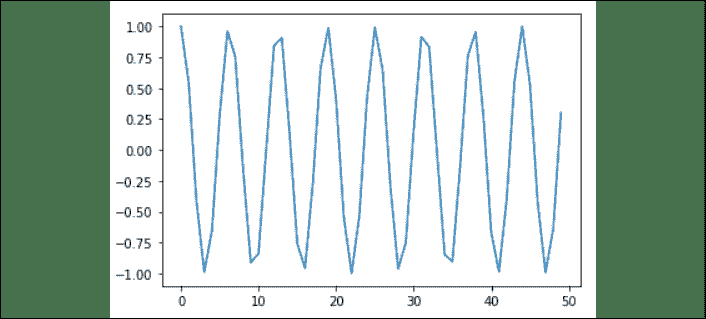

# 21

# 循环神经网络和其他深度学习模型

在本章中，我们将学习深度学习和**循环神经网络**（**RNN**）。 像前几章所介绍的 CNN 一样，RNN 在过去几年中也获得了很大发展。 就 RNN 而言，它们在语音识别领域被大量使用。 当今许多聊天机器人都基于 RNN 技术建立了基础。 使用 RNN 预测金融市场已经取得了一些成功。 例如，我们可能有一个带有单词序列的文本，并且我们有一个目标来预测序列中的下一个单词。

我们将讨论 RNN 的体系结构及其组件。 我们将继续使用上一章开始学习的 TensorFlow。 我们将使用 TensorFlow 快速构建 RNN。 我们还将学习如何使用单层神经网络构建 RNN 分类器。 然后，我们将使用 CNN 构建图像分类器。

到本章末，您将了解：

*   RNN 的基础
*   RNN 的架构
*   RNN 中的图层类型
*   语言建模用例的详细信息
*   如何使用基本算法构建初始 RNN 分类器
*   如何使用更先进的技术来增强 RNN

让我们从 RNN 的基础开始。

# 循环神经网络的基础

RNN 是另一种流行的模型，目前正在获得很大的关注。 正如我们在第 1 章，“人工智能导论”中讨论的那样，对一般神经网络（尤其是 RNN）的研究是*联系主义者*流派（ 在 Pedro Domingos 的 AI 分类中进行了介绍）。 RNN 通常用于解决自然语言处理（**NLP**）和**自然语言理解**（**NLU**）问题 。

RNN 背后的数学有时可能会令人不知所措。 在深入研究 RNN 之前，请牢记以下思想：赛车手不需要完全了解其赛车的机械原理即可使其快速行驶并赢得比赛。 同样，我们不一定需要完全了解 RNN 在幕后的工作方式，以使其对我们有用，有时甚至是令人印象深刻的工作。 Keras 库的创建者 Francois Chollet 描述了**长短期记忆**（**LSTM**）网络，这是 RNN 的一种形式，如下所示：

> “您不需要了解有关 LSTM 单元的特定体系结构的所有内容；作为人类，理解它不是您的工作。只需记住 LSTM 单元的含义：允许过去的信息 以后再注射。”

现在让我们进入神经网络的一些基础知识。 顾名思义，*神经*网络从大脑神经元的结构中获得灵感。 神经网络中的神经元大致模拟了人类神经元的结构和功能。 对于一般的大脑，尤其是神经元，我们有很多不了解的地方。 但在基本级别上，神经元接受输入，并且如果达到阈值，它将触发输出。 用数学术语来说，*人工*神经元是数学函数的容器，其唯一的任务是通过将给定的输入应用于函数来传递输出。

既然我们已经了解了使神经网络*滴答作响*的原因以及使它们发火的原因，那么让我们了解一些用于触发神经网络的常用功能。 这些功能通常称为，称为*激活功能*，因为它们在达到阈值时就会激活。 您可以将任何类型的功能用作激活功能，但以下是一些用作激活功能的常用功能：

*   步进功能
*   乙状结肠功能
*   tanh 功能
*   ReLU 功能

以下各节将更详细地描述每一个。

## 步进功能

步进功能是简单功能。 就这么简单。 如果输出高于某个阈值，则会触发该函数。 否则就不会。 图形化：


图 1：单位步进功能

如果`x`的值大于或等于零，则输出为`1`，如果`x`的值小于`0`。 零。 可以看出，阶跃函数不可微为零。 神经网络通常使用反向传播和梯度下降来计算不同层的权重。 由于阶跃函数为零时不可微，因此它无法向下进行梯度下降，并且在尝试更新其权重时会失败。

为了克服这个问题，我们可以改用 S 型函数。

## S 型功能

S 型函数（也称为作为逻辑函数）定义如下：



图 2：S 形函数

当`z`（自变量）趋于负无穷大时，函数的值趋于`0`；当`z`趋于趋近时，函数的值趋于`1`到无穷远。

乙状结肠功能有一个缺点。 容易出现梯度消失的问题。 从图形中可以看出，S 型函数的值在 0 到 1 之间的较小范围内。S 型函数具有陡峭的梯度。 因此，在许多情况下，输入的大变化会导致输出的小变化。 此问题称为*消失梯度*。 随着网络中层数的增加，该问题呈指数增长，因此很难扩展使用此功能的神经网络。

使用 S 形函数的原因之一是因为其输出始终落在 0 到 1 之间。因此，它对于需要预测输出为概率的模型很有用。 概率总是在 0 到 1 的范围内。因此，在这些情况下，S 型是要使用的适当函数。

现在我们来看 *tanh* 函数，它克服了 S 型函数的一些问题。

## Tanh 功能

*tanh（z）*函数是 S 形函数的重新缩放的版本。 其输出范围是`-1`至`-1`，而不是`0`至`1`。


图 3：Tanh 函数

之所以使用 *tanh* 函数而不是 Sigmoid 函数的主要原因是因为值以 0 为中心，所以导数更高。 较高的梯度有助于产生更好的学习率，因此可以更快地训练模型。 但是，使用 *tanh* 功能时，仍然存在消失梯度问题。

现在，我们将了解另一个功能：ReLU 功能。

## ReLU 功能

**整流线性单元**（**ReLU**）函数可能是在 CNN 和 RNN 模型中最流行的激活函数。 给定负输入时，该函数返回 0。 给定任何正值时，它将返回该值。 因此，它可以写为：

*f（x）= max（0，x）*

图形上看起来像这样：


图 4：ReLU 功能

在 ReLU 变体中，泄漏的 ReLU 实现是最受欢迎的实现之一。 对于正数，它返回与常规 ReLU 相同的值。 但是，它没有返回`0`为负值，而是具有恒定的斜率（小于`1`）。



图 5：泄漏的 ReLU 功能

该斜率是函数用户在设置模型时设置的参数。 斜率由*α*标识。 例如，对于*α= 0.3* ，激活函数为：

*f（x）=最大值（0.3 * x，x）*

泄漏的 ReLU 具有理论上的优势，即在所有值下都受到`x`的影响，因此可以更好地利用所有输入提供的信息。

鉴于 ReLU 的特性和优势，它经常是深度学习从业人员和研究人员选择的激活功能。

现在，我们已经介绍了 RNN 的一些基本功能，并讨论了它们的一些关键功能，下面让我们深入研究其实际的体系结构。

# RNN 的体系结构

RNN 背后的主要概念是利用序列中的先前信息。 在传统的神经网络中，假定所有输入和输出彼此独立。 在某些领域和用例中，这种假设是不正确的，我们可以利用这种相互联系的优势。

我将以个人为例。 我相信，在很多情况下，我可以根据几个最初的句子来预测我妻子接下来会说些什么。 我倾向于相信自己的预测能力具有很高的准确率。 也就是说，如果您问我的妻子，她可能会告诉您一个完全不同的故事！ Google 的电子邮件服务 Gmail 正在使用类似的概念。 如果您是该服务的用户，您会注意到，从 2019 年开始，它在认为可以完成句子时就开始提出建议。 如果猜对了，则只需按 Tab 键即可完成句子。 如果没有，您可以继续输入，并且可能会根据新输入给出不同的建议。 我不了解此服务的实现内部原理，但是可以假定他们正在使用 RNN 技术，因为 RNN 非常善于处理此类问题。

RNN 之所以称为递归，是因为这些算法对序列的每个元素执行相同的任务，并且输出取决于先前的计算。 您也可以将 RNN 视为具有“内存”，用于存储有关到目前为止发生的事情和已经计算出的信息。 从理论上讲，RNN 能够从中提取信息的序列长度没有限制。 实际上，它们通常以仅回顾几步的方式实现。 这是通常用于表示 RNN 的图：


图 6：循环神经网络及其正向计算所涉及的计算时间的展开

资料来源：LeCun，Bengio 和 G. Hinton，2015 年，《深度学习》，《自然》

上图表示作为完整网络展开或展开的 RNN。 术语*展开*用来表示逐步为整个序列布置网络。 例如，如果将前三个单词用于预测下一个单词，则将将*展开为*网络进入 3 层网络，每个单词一层。 控制 RNN 中发生的计算的公式如下：


图 7：3 层循环神经网络

资料来源：LeCun，Bengio 和 G. Hinton，2015 年，《深度学习》，《自然》

`x`<sub style="font-style: italic;">t</sub> 是时间步长`t`的输入。 在这种情况下，`x`<sub style="font-style: italic;">1</sub> 可能是单热门属性，与句子中的第 2 <sup>个</sup>单词相对应。

`s`<sub style="font-style: italic;">t</sub> 是时间步长`t`的隐藏状态。 您可以将其视为网络的*存储器*。`s`<sub style="font-style: italic;">t</sub> 是使用先前的隐藏状态和当前步骤的输入来计算的：


最常用的函数`f`是非线性函数，例如 *tanh* 或 *ReLU* 。 通常，将计算第 1 个 <sup>st</sup> 隐藏状态所需的 *s-1* 初始化为零。

`o`<sub style="font-style: italic;">t</sub> 是步骤`t`的输出。 例如，如果我们想预测句子中的下一个单词，那么它将是整个词汇表中概率的向量：


这里有一些注意事项。 您可以将隐藏状态`s`<sub style="font-style: italic;">t</sub> 视为网络的内存。`s`<sub style="font-style: italic;">t</sub> 捕获有关在所有先前时间步中发生的情况的信息。 仅根据时间`t`时的内存计算步骤`o`<sub style="font-style: italic;">t</sub> 的输出。 如前所述，由于`s`<sub style="font-style: italic;">t</sub> 只能捕获有关有限数量先前步骤的信息，因此它在实践中更为复杂。

与传统的深度神经网络在每一层使用不同的参数不同，RNN 共享相同的参数（先前显示的`U`，`V`和`W`） 所有步骤。 这是因为每个步骤都执行相同的任务，但是输入不同。 这大大减少了需要跟踪的参数总数。

上一个图具有每个时间步的输出，但是根据任务的不同，可能不需要此输出。 例如，执行情感分析时，通常对整个句子的情感而不是每个单词感兴趣。 同样，我们可能不需要每个时间步都输入。 RNN 的主要特征是其隐藏状态，该状态捕获有关序列的一些信息。

现在是时候深入研究一个具体的例子了。 我们将学习如何使用 RNN 预测句子中的下一个单词。 让我们做一些预测。

# 语言建模用例

我们的目标是使用 RNN 建立语言模型。 这就是这个意思。 假设我们有一个`m`个单词的句子。 语言模型使我们能够预测观察句子（在给定数据集中）的概率为：


换句话说，句子的概率是给定单词前面每个单词的概率的乘积。 因此，句子“请让我知道是否有任何问题”的概率等于给出“请让我知道如果您有...的问题”的概率乘以给出“有”的概率“ 请让我知道您是否有...”等等。

这有什么用？ 为什么将概率分配给给定句子很重要？

首先，像这样的模型可以用作评分机制。 语言模型可用于选择最可能的下一个单词。 从直觉上讲，最可能出现的下一个单词在语法上可能是正确的。

语言建模具有重要应用程序。 因为它可以预测给定前面单词的单词的概率，所以可以将其用于**自然文本生成**（**NTG**）。 给定一个现有的单词序列，从概率最高的单词列表中建议一个单词，然后重复该过程，直到生成完整的句子为止。

注意，在前面的等式中，每个单词的概率以所有先前的单词为条件。 在更实际的情况下，由于计算或内存限制，模型可能很难代表长期依赖关系。 因此，大多数模型通常仅限于仅查看少量的先前单词。

足够的理论。 现在，我们准备开始编写一些代码，并学习如何训练 RNN 以生成文本。

# RNN 培训

正如我们在本章的开头所讨论的那样，RNN 的应用在众多行业中广泛而多样。 在我们的案例中，我们仅执行一个简单的示例，以便更牢固地理解 RNN 的基本机制。

我们将尝试使用 RNN 建模的输入数据是数学*余弦*函数。

因此，首先让我们定义输入数据并将其存储到 NumPy 数组中。

```py
import numpy as np
import math
import matplotlib.pyplot as plt
input_data = np.array([math.cos(x) for x in np.arange(200)])
plt.plot(input_data[:50])
plt.show 
```

前面的语句将绘制数据，以便我们可以可视化输入数据的外观。 您应该得到如下输出：



图 8：可视化输入数据

现在，将输入数据分为两组，以便我们可以将一部分用于训练，另一部分用于验证。 从训练的角度看，这也许不是最佳的分割方法，但是为了使事情变得简单，让我们将数据分割到中间。

```py
X = []
Y = []
size = 50
number_of_records = len(input_data) - size
for i in range(number_of_records - 50):
  X.append(input_data[i:i+size])
  Y.append(input_data[i+size])

X = np.array(X)
X = np.expand_dims(X, axis=2)
Y = np.array(Y)
Y = np.expand_dims(Y, axis=1) 
```

让我们打印得到的训练数组的形状：

```py
X.shape, Y.shape 
```

您应该看到如下输出：

```py
((100, 50, 1), (100, 1)) 
```

让我们创建验证集：

```py
X_valid = []
Y_valid = []
for i in range(number_of_records - 50, number_of_records):
    X_valid.append(input_data[i:i+size])
    Y_valid.append(input_data[i+size])

X_valid = np.array(X_valid)
X_valid = np.expand_dims(X_valid, axis=2)
Y_valid = np.array(Y_valid)
Y_valid = np.expand_dims(Y_valid, axis=1) 
```

接下来，让我们定义 RNN 将使用的参数。 例如，我们定义隐藏层以包含`100`单位：

```py
learning_rate = 0.0001
number_of_epochs = 5
sequence_length = 50
hidden_layer_size = 100
output_layer_size = 1
back_prop_truncate = 5
min_clip_value = -10
max_clip_value = 10 
```

让我们定义各层之间连接的权重：

```py
W1 = np.random.uniform(0, 1, (hidden_layer_size, sequence_length))
W2 = np.random.uniform(0, 1, (hidden_layer_size, hidden_layer_size))
W3 = np.random.uniform(0, 1, (output_layer_size, hidden_layer_size)) 
```

在前面的代码中：

*   `W1`是输入层和隐藏层之间权重的权重矩阵
*   `W2`是隐藏层和输出层之间权重的权重矩阵
*   `W3`是 RNN 层（隐藏层）中共享权重的权重矩阵

我们将用于 RNN 的激活函数是 S 型函数。 有关一般的激活函数，尤其是 S 型函数的详细讨论，请参见上一章。

```py
def sigmoid(x):
    return 1 / (1 + np.exp(-x)) 
```

现在，我们已经准备就绪，可以开始训练模型了。 我们将迭代`25`时代。 您将在结果中清楚地看到模型和实际数据开始收敛的点。 确保收敛后停止训练。 否则，我们将过度拟合数据，并且我们的模型将使用训练数据生成良好的数字，但对于尚未看到的数据将不会表现良好。

运行该程序几次。 一旦看到数据开始收敛，就可以调整“历元数”的值。

这是培训期间将执行的步骤的概述：

1.  检查训练数据上的损失
    *   执行向前通过
    *   计算误差
2.  检查验证数据上的损失
    *   执行向前通过
    *   计算误差
3.  开始训练
    *   执行向前通过
    *   向后传播错误
    *   更新权重

```py
for epoch in range(number_of_epochs):
  # check loss on train
  loss = 0.0

  # do a forward pass to get prediction
  for i in range(Y.shape[0]):
    x, y = X[i], Y[i]
    prev_act = np.zeros((hidden_layer_size, 1))
    for t in range(sequence_length):
      new_input = np.zeros(x.shape)
      new_input[t] = x[t]
      mul_w1 = np.dot(W1, new_input)
      mul_w2 = np.dot(W2, prev_act)
      add = mul_w2 + mul_w1
      act = sigmoid(add)
      mul_w3 = np.dot(W3, act)
      prev_act = act
  # calculate error 
    loss_per_record = (y - mul_w3)**2 / 2
    loss += loss_per_record
  loss = loss / float(y.shape[0])

  # check loss on validation
  val_loss = 0.0
  for i in range(Y_valid.shape[0]):
    x, y = X_valid[i], Y_valid[i]
    prev_act = np.zeros((hidden_layer_size, 1))
    for t in range(sequence_length):
      new_input = np.zeros(x.shape)
      new_input[t] = x[t]
      mul_w1 = np.dot(W1, new_input)
      mul_w2 = np.dot(W2, prev_act)
      add = mul_w2 + mul_w1
      act = sigmoid(add)
      mul_w3 = np.dot(W3, act)
      prev_act = act
    loss_per_record = (y - mul_w3)**2 / 2
    val_loss += loss_per_record
  val_loss = val_loss / float(y.shape[0])
  print('Epoch: ', epoch + 1, ', Loss: ', loss, ', Val Loss: ', val_loss)

  # train model
  for i in range(Y.shape[0]):
    x, y = X[i], Y[i]

    layers = []
    prev_act = np.zeros((hidden_layer_size, 1))
    dW1 = np.zeros(W1.shape)
    dW3 = np.zeros(W3.shape)
    dW2 = np.zeros(W2.shape)

    dW1_t = np.zeros(W1.shape)
    dW3_t = np.zeros(W3.shape)
    dW2_t = np.zeros(W2.shape)

    dW1_i = np.zeros(W1.shape)
    dW2_i = np.zeros(W2.shape)

    # forward pass
    for t in range(sequence_length):
      new_input = np.zeros(x.shape)
      new_input[t] = x[t]
      mul_w1 = np.dot(W1, new_input)
      mul_w2 = np.dot(W2, prev_act)
      add = mul_w2 + mul_w1
      act = sigmoid(add)
      mul_w3 = np.dot(W3, act)
      layers.append({'act':act, 'prev_act':prev_act})
      prev_act = act
    # derivative of pred
    dmul_w3 = (mul_w3 - y)

    # backward pass
    for t in range(sequence_length):
      dW3_t = np.dot(dmul_w3, np.transpose(layers[t]['act']))
      dsv = np.dot(np.transpose(V), dmul_w3)

      ds = dsv
      dadd = add * (1 - add) * ds

      dmul_w2 = dadd * np.ones_like(mul_w2)
      dprev_act = np.dot(np.transpose(W2), dmul_w2)
      for i in range(t-1, max(-1, t-back_prop_truncate-1), -1):
        ds = dsv + dprev_act
        dadd = add * (1 - add) * ds
        dmul_w2 = dadd * np.ones_like(mul_w2)
        dmul_w1 = dadd * np.ones_like(mul_w1)
        dW2_i = np.dot(W2, layers[t]['prev_act'])
        dprev_act = np.dot(np.transpose(W2), dmul_w2)
        new_input = np.zeros(x.shape)
        new_input[t] = x[t]
        dW1_i = np.dot(U, new_input)
        dx = np.dot(np.transpose(U), dmul_w1)
        dW1_t += dW1_i
        dW2_t += dW2_i

      dW3 += dW3_t
      dW1 += dW1_t
      dW2 += dW2_t

      if dW1.max() > max_clip_value:
        dW1[dW1 > max_clip_value] = max_clip_value
      if dW3.max() > max_clip_value:
        dW3[dW3 > max_clip_value] = max_clip_value
      if dW2.max() > max_clip_value:
        dW2[dW2 > max_clip_value] = max_clip_value

      if dW1.min() < min_clip_value:
        dW1[dW1 < min_clip_value] = min_clip_value
      if dW3.min() < min_clip_value:
        dW3[dW3 < min_clip_value] = min_clip_value
      if dW.min() < min_clip_value:
        dW2[dW2 < min_clip_value] = min_clip_value

    # update
    W1 -= learning_rate * dW1
    W3 -= learning_rate * dW3
    W2 -= learning_rate * dW2 
```

输出应该看起来像这样：


图 9：5 个历元的 RNN 训练输出

如您所见，损失和验证损失在每个时期都在不断减少。 我们可能会再运行几个模型，并确保结果收敛。

这是一个有 10 个历时的示例：


图 10：10 个历元的 RNN 训练输出

如您所见，在第 6 个阶段之后，结果已经收敛。 找出最佳时期数是一个*试验和错误*过程。 从这些结果可以看出，大约 6 个纪元是正确的纪元数。

在这个例子中，我们几乎已经走到了尽头。 让我们根据预测值绘制初始输入数据集，然后看看如何得出。 以下是相关代码：

```py
preds = []
for i in range(Y_valid.shape[0]):
  x, y = X_valid[i], Y_valid[i]
  prev_act = np.zeros((hidden_layer_size, 1))
  # For each time step...
  for t in range(sequence_length):
    mul_w1 = np.dot(W_1, x)
    mul_w2 = np.dot(W2, prev_act)
    add = mul_w2 + mul_w1
    act = sigmoid(add)
    mul_w3 = np.dot(W3, act)
    prev_act = act
  preds.append(mul_w3)

preds = np.array(preds)
plt.plot(preds[:, 0, 0], 'g')
plt.plot(Y_valid[:, 0], 'r')
plt.show() 
```

这是的结果：


图 11：RNN 训练预测与实际图

如我们所见，预测值与初始值是相当一致的，因此这是一个不错的结果。 RNN 本质上是随机的，因此下一次我们运行示例时，对齐方式可能会更好或更坏。 您可能会看到不同的对齐方式。

最后，让我们计算**均方根误差**（**RMSE**）分数：

```py
from sklearn.metrics import mean_squared_error
math.sqrt(mean_squared_error(Y_valid[:, 0], preds[:, 0, 0])) 
```

RMSE 是方差的平方根。 可以将其解释为无法解释的方差的标准偏差。 它具有与响应变量具有相同单位的有用属性。 RMSE 值越低表示拟合度越好。

在这种情况下，我们得到的分数很低，表明我们的模型正在产生不错的预测：

```py
0.5691944360057564 
```

这是一个实际的 RNN 的简单示例。 而且，如您所见，这不是简单的两行程序！ 这凸显了一个事实，即 RNN 实施起来并不简单，将其应用于复杂任务是一项真正的任务。

此外，RNN 的计算量很大，因此生成准确的预测可能会花费大量时间。 如果我们无法使用合适的硬件，那几乎是肯定的。

尽管如此，RNN 已经取得了许多突破，并且数据科学界继续不断地为其寻找新的应用程序。 不仅如此，它们的性能和准确性也在不断提高。 到目前为止，我们将提高您已经设计的神经网络的性能和功能，并提出您自己的示例，说明如何将网络应用于其他领域。 快乐的编码。

# 摘要

在本章中，我们继续学习深度学习并学习了 RNN 的基础。 然后，我们讨论了 RNN 架构的基本概念是什么，以及为什么这些概念很重要。 在学习了基础知识之后，我们研究了 RNN 的一些潜在用途，并着眼于使用它来实现语言模型。 最初，我们使用基本技术来实现语言模型，然后开始为模型添加越来越多的复杂性以理解更高层次的概念。

希望您和我们一样兴奋，进入下一章，我们将学习如何使用强化学习来创建智能体。