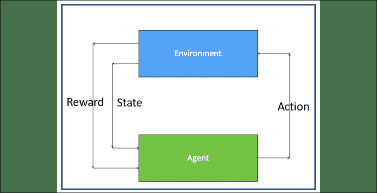
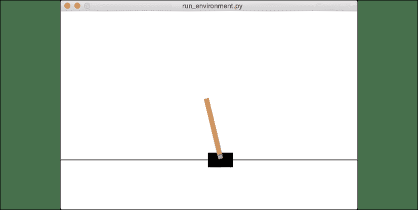
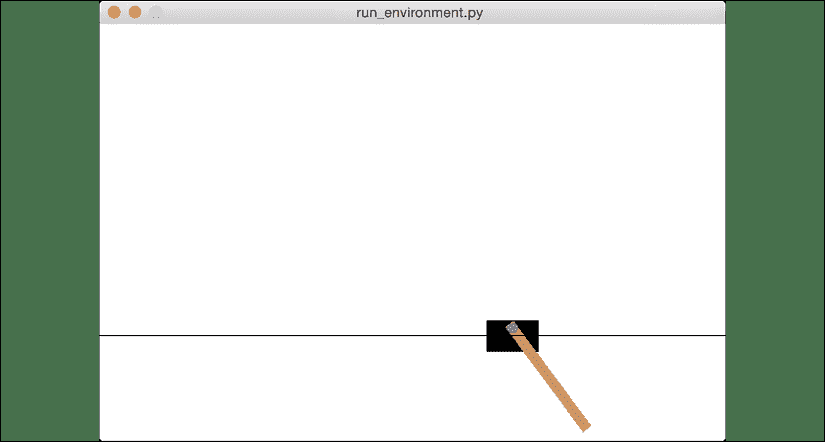
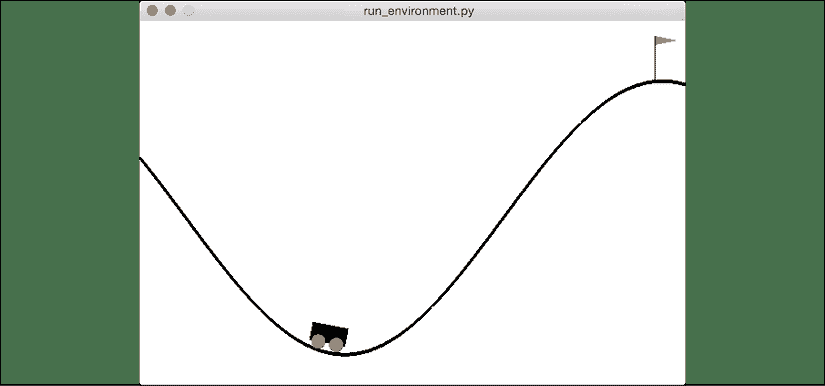
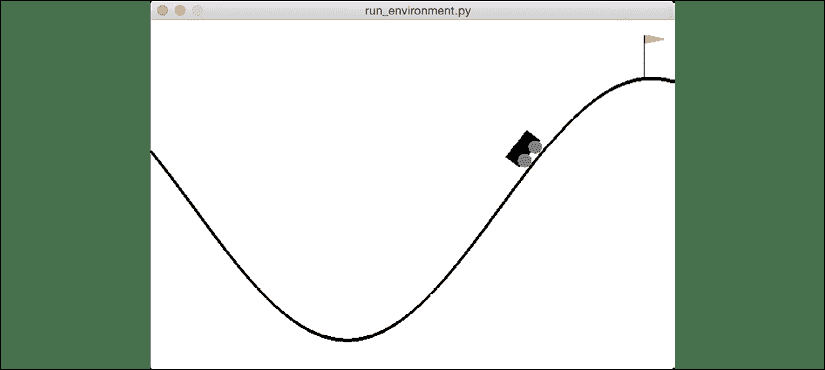
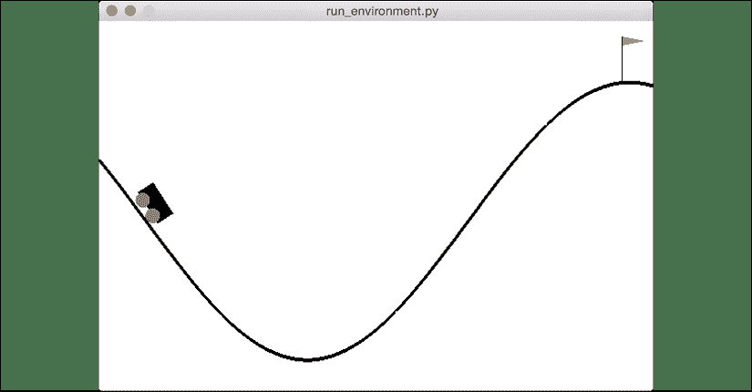
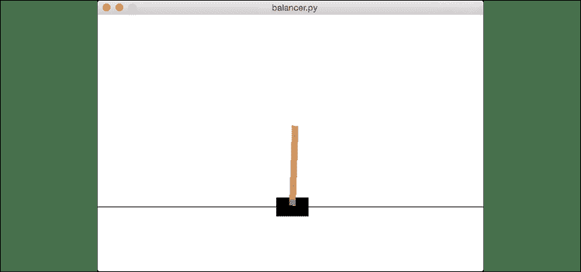
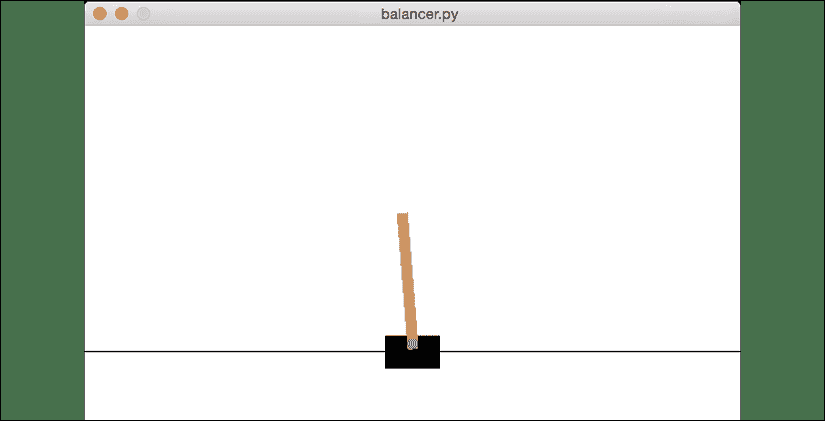
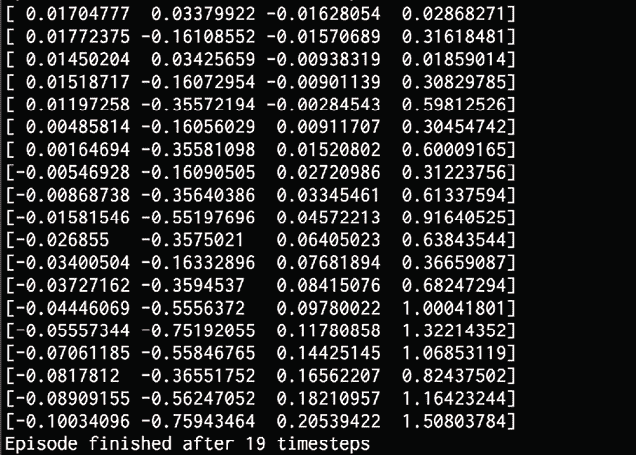

# 22

# 通过强化学习创建智能体

在本章中，我们将学习**强化学习**（**RL**）。 我们将讨论 RL 的前提。 我们将讨论 RL 和监督学习之间的区别。 我们将通过一些真实的 RL 实例来了解 RL 如何以各种形式表现出来。 我们将学习 RL 的组成部分以及所涉及的各种概念。 然后，我们将在 Python 中创建一个环境，以了解其在实际中的工作方式。 然后，我们将使用这些概念来构建学习代理。

在本章中，我们将介绍以下主题：

*   了解学习的意义
*   强化学习与监督学习
*   RL 的真实示例
*   RL 的构成要素
*   创造环境
*   建立学习代理

在进入 RL 本身之前，我们首先考虑一下学习的真正含义。 毕竟，它将帮助我们在尝试实现之前理解它！

# 了解学习的意义

学习的概念是人工智能的基础。 我们希望机器了解学习的过程，以便他们可以自己完成学习。 人类通过观察周围环境并与周围环境互动来学习。 当您去一个新地方时，您可以快速扫描并查看周围发生的事情。

没有人在教你怎么做。 您正在观察周围的环境并与之互动。 通过与环境建立这种联系，我们倾向于收集有关导致不同原因的大量信息。 我们了解因果关系，哪些行动会导致什么结果以及我们需要做些什么才能实现目标。

我们在生活中的每一个地方都使用这种学习过程。 我们收集了有关周围环境的所有知识，然后了解我们如何对此做出反应。 让我们考虑一个演说家的例子。 每当好的演说家在公开场合发表演讲时，他们就会知道人群对他们的发言有何反应。 如果人群没有响应，那么演说者会实时更改语音以确保人群参与。 如我们所见，演说者正试图通过他/她的行为来影响环境。 可以说，演说者*从与人群的互动中学习*，以便采取行动并达到一定的目标。 这种学习过程–观察环境，采取行动，评估该行动的后果，适应和再次采取行动–是人工智能中许多主题所基于的最基本的思想之一。 让我们牢记这一点来谈论 RL。

RL 是指学习操作方法并将情况映射到某些动作以最大化回报的过程。 在大多数机器学习范式中，学习代理会被告知要采取哪些行动才能获得一定的结果。 在加强学习的情况下，不会告知学习代理要采取什么行动。 取而代之的是，它必须通过尝试找出哪些行动会产生最高的回报。 这些行动往往会影响立即的报酬以及下一个情况。 这意味着所有后续奖励也将受到影响。

思考 RL 的一种好方法是理解我们定义的是学习问题而不是学习方法。 因此，可以说可以解决问题的任何方法都可以视为 RL 方法。 RL 的两个显着特征-反复试验学习和延迟奖励。 RL 代理使用这两个功能从中学习其行为的后果。

# 强化学习与监督学习

当前许多研究都集中在监督学习上。 RL 似乎有点像监督学习，但事实并非如此。 监督学习的过程是指从标记的样本中学习。 尽管这是一种有用的技术，但不足以从交互中开始学习。 当我们想设计一台机器来导航未知的地形时，这种学习将无济于事。 我们事先没有可用的训练样本。

我们需要一个可以通过与未知地形交互来从自身经验中学习的代理。 这是 RL 真正闪耀的地方。

让我们考虑一下代理与新环境进行交互以进行学习时的探索阶段。 它可以探索多少？ 在这一点上，该代理不知道环境有多大，并且在许多情况下，它将无法探索所有可能性。 那么，代理应该做什么？ 它是应该从其有限的经验中吸取教训，还是等到进一步探索后再采取行动？ 这是 RL 的主要挑战之一。 为了获得更高的报酬，代理必须支持经过尝试和测试的行为。 但是为了发现此类动作，它应继续尝试以前未选择的较新动作。 多年来，研究人员已经广泛研究了在探索与开发之间的这种权衡方案，但它仍然是活跃的话题。

# 强化学习的实际示例

让我们看看 RL 在现实世界中出现的位置。 这将帮助我们了解它的工作原理以及使用此可以构建哪些可能的应用程序，除非：

**游戏**：让我们考虑一下棋类游戏，例如围棋或象棋。 为了确定最佳动作，玩家需要考虑各种因素。 可能性的数量如此之大，以至于无法进行暴力搜索。 如果我们要使用传统技术制造一台可以玩这种游戏的机器，则需要指定许多规则来涵盖所有这些可能性。 RL 完全绕过了这个问题。 我们不需要手动指定任何逻辑规则。 学习代理仅通过示例学习并与自己玩游戏。

有关此主题的更详尽讨论，请参阅第 2 章，“人工智能基本用例”中的“游戏”部分。

**机器人技术**：让我们考虑一个机器人的工作，该机器人的工作是探索新建筑物。 它应确保它有足够的功率返回基站。 该机器人必须通过考虑所收集的信息量与安全返回基站的能力之间的权衡来决定是否应该做出决定。

有关此主题的更多信息，请跳至第 2 章，“人工智能基本用例”中的“装运和仓库管理”部分。

**工业控制器**：考虑调度电梯的情况。 一个好的调度程序将花费最少的电量，并为最多的人员服务。 对于此类问题，RL 代理可以学习如何在模拟环境中执行此操作。 然后，他们可以利用这些知识来制定最佳计划。

**婴儿**：机器在使用 RL 方面没有垄断权； 刚开始的几个月里，新生儿经历了几乎相同的过程。 他们通过反复尝试来学习，直到学会平衡为止。 有趣的是，婴儿发现了走路（或跑步！）是最有效的方式之后，发现了不同的运动方法。

如果仔细观察这些示例，您将看到一些共同的特征。 所有这些都涉及与环境的交互。 即使环境不确定，学习代理（无论是机器，婴儿还是其他设备）也旨在实现某个目标。 代理的动作将改变该环境的未来状态。 随着代理继续与环境交互，这会在以后的时间影响可用的机会。

在讨论了 RL 是什么之后，并涵盖了一些真实的示例，现在让我们开始研究 RL。 我们将从讨论 RL 系统的构建块开始。

# 强化学习的基础

除了代理与环境之间的交互，RL 系统中还有其他因素在起作用：



图 1：RL 的构成

通常，RL 代理执行以下步骤：

1.  有一组与代理和环境有关的状态。 在给定的时间点，代理会观察输入状态以感知环境。
2.  有政策规定需要采取什么措施。 这些政策具有决策功能。 使用这些策略根据输入状态确定操作。
3.  代理根据上一步采取行动。
4.  环境对此动作做出反应。 代理从环境中获得强化，也称为奖励。
5.  代理计算并记录有关该奖励的信息。 重要的是要注意，将为此状态/动作对收到此奖励，以便在给定特定状态的情况下，将来可将其用于采取更多的奖励行动。

RL 系统可以同时执行多个事情–通过执行试错搜索来学习，了解所处环境的模型，然后使用该模型来计划下一步。 在下一节中，我们将动手操作，并开始使用流行的框架使用 Python 编写的强化学习系统。

# 创建环境

我们将使用名为 **OpenAI Gym** 的程序包来构建 RL 代理。 [您可以在此处了解更多有关的信息](https://gym.openai.com)。 可以通过运行以下命令使用`pip`进行安装：

```py
$ pip3 install gym 
```

[您可以在此处找到与其安装相关的各种提示和技巧](https://github.com/openai/gym#installation)。

现在您已经安装了它，让我们继续编写一些代码。

创建一个新的 Python 文件并导入以下软件包：

```py
import argparse
import gym 
```

定义一个函数来解析输入参数。 输入参数将用于指定要运行的环境的类型：

```py
def build_arg_parser():
    parser = argparse.ArgumentParser(description='Run an environment')
    parser.add_argument('--input-env', dest='input_env', required=True,
            choices=['cartpole', 'mountaincar', 'pendulum', 'taxi', 'lake'], 
            help='Specify the name of the environment')
    return parser 
```

定义`main`函数并解析输入参数：

```py
if __name__=='__main__':
    args = build_arg_parser().parse_args()
    input_env = args.input_env 
```

创建一个从输入参数字符串到 OpenAI Gym 软件包中指定的环境名称的映射：

```py
 name_map = {'cartpole': 'CartPole-v0', 
                'mountaincar': 'MountainCar-v0',
                'pendulum': 'Pendulum-v0',
                'taxi': 'Taxi-v1',
                'lake': 'FrozenLake-v0'} 
```

根据输入参数创建环境，并将其重置：

```py
 # Create the environment and reset it
    env = gym.make(name_map[input_env])
    env.reset() 
```

重复`1000`次并在每个步骤中随机执行一个操作：

```py
 # Iterate 1000 times
    for _ in range(1000):
        # Render the environment
        env.render()
        # take a random action
        env.step(env.action_space.sample()) 
```

完整代码在文件`run_environment.py`中给出。 如果您想知道如何运行代码，请使用`help`参数运行它，如下图所示：


图 2：运行 Python 程序的命令

让我们在非常规环境下运行它。 运行以下命令：

```py
$ python3 run_environment.py --input-env cartpole 
```

如果运行它，您将看到一个窗口，其中显示**杆子**向右移动。 以下屏幕截图显示了初始位置：



图 3：Cartpole 示例输出

在下一秒钟左右，您将看到它移动，如以下屏幕截图所示：



图 4：Cartpole 示例输出 2

在端，您将看到它从窗口中消失，如以下屏幕截图所示：


图 5：Cartpole 示例输出 3

让我们使用`mountaincar`参数运行它。 运行以下命令：

```py
$ python3 run_environment.py --input-env mountaincar 
```

如果运行代码，则最初将看到下图：



图 6：山地车示例输出

如果让它运行几秒钟，您会看到汽车摆动得更多，从而达到了标志：



图 7：山地车示例输出 2

它将保持更大的步幅，如下图 所示：



图 8：山地车示例输出 3

在本节的第一个示例中，没有发生任何令人兴奋的事情。 它只是四处走动。 该示例确实使我们对所使用的 RL 框架有了基本的了解。 第二个示例更令人兴奋。 它实际上有一个目标（触摸标志）。 实现目标通常是如何构造强化问题。 在下一个示例中，我们将继续使事情变得更加有趣，并将我们的目光投向一个稍微复杂的目标。

# 建立学习代理

在本节的中，我们将基于第一个例子进行研究。 最初，柱子只是在四处移动。 现在，我们将尝试平衡购物车顶部的电线杆，并确保电线杆保持直立。 准备学习更多吗？ 让我们开始吧。

首先，创建一个新的 Python 文件并导入以下软件包：

```py
import argparse
import gym 
```

定义一个函数来解析输入参数：

```py
def build_arg_parser():
    parser = argparse.ArgumentParser(description='Run an environment')
    parser.add_argument('--input-env', dest='input_env', required=True,
            choices=['cartpole', 'mountaincar', 'pendulum'],
            help='Specify the name of the environment')
    return parser 
```

解析输入参数：

```py
if __name__=='__main__':
    args = build_arg_parser().parse_args()
    input_env = args.input_env 
```

在 OpenAI Gym 程序包中建立从输入参数到环境名称的映射：

```py
 name_map = {'cartpole': 'CartPole-v0', 
                'mountaincar': 'MountainCar-v0', 
                'pendulum': 'Pendulum-v0'} 
```

根据输入参数创建环境：

```py
 # Create the environment
    env = gym.make(name_map[input_env]) 
```

通过重置环境开始迭代：

```py
 # Start iterating
    for _ in range(20):
        # Reset the environment
        observation = env.reset() 
```

对于每次复位，迭代`100`次。 首先渲染环境：

```py
 # Iterate 100 times
        for i in range(100):
            # Render the environment
            env.render() 
```

打印当前观察值并根据可用的操作空间执行操作：

```py
 # Print the current observation
            print(observation)
            # Take action
            action = env.action_space.sample() 
```

提取采取当前措施的后果：

```py
 # Extract the observation, reward, status and 
            # other info based on the action taken
            observation, reward, done, info = env.step(action) 
```

检查我们是否实现了目标：

```py
 # Check if it's done 
            if done:
                print('Episode finished after {} timesteps'.format(i+1))
                break 
```

完整代码在文件`balancer.py`中给出。 如果您想知道如何运行代码，请使用`help`参数运行它，如以下屏幕截图所示：


图 9：运行 Python 平衡器示例的命令

让我们在`cartpole`环境中运行代码。 运行以下命令：

```py
$ python3 balancer.py --input-env cartpole 
```

如果运行代码，您将看到杆子平衡自身：



图 10：Cartpole 示例输出 4

如果让它运行几秒钟，您将看到杆子仍然站立，如以下屏幕截图所示：



图 11：Cartpole 示例输出 5

您应该会看到许多打印出来的信息。 如果您看其中的一集，它将看起来像这样：



图 12：绘图输出

不同的情节需要完成不同的步骤。 如果您滚动查看打印出来的信息，您将能够看到。 希望，当您运行本示例时，您至少在大多数情况下都会看到棘突。 凭借在本章中获得的知识，我认为我们还没有准备好在 Go 的游戏中击败 AlphaZero。 但是我们了解了如何构建此类系统的基础知识。

# 总结

在本章中，我们了解了 RL 系统。 我们讨论了 RL 的前提以及如何设置它。 我们讨论了 RL 和监督学习之间的区别。 我们浏览了一些真实的 RL 示例，并了解了各种系统如何以不同形式使用它。

我们讨论了 RL 的构建块以及诸如代理，环境，策略，奖励等概念。 然后，我们在 Python 中创建了一个环境，以查看其运行情况。 最后，我们使用这些概念来构建 RL 代理。

在下一章中，我们将进入一个截然不同的主题，并学习大数据技术如何帮助我们使机器学习系统更强大，更高效。