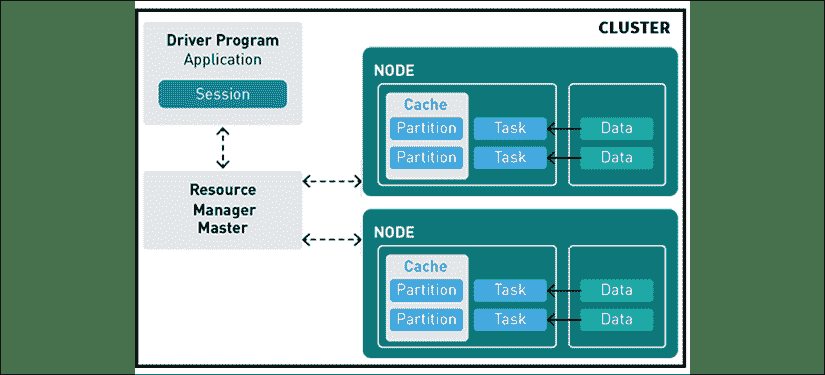
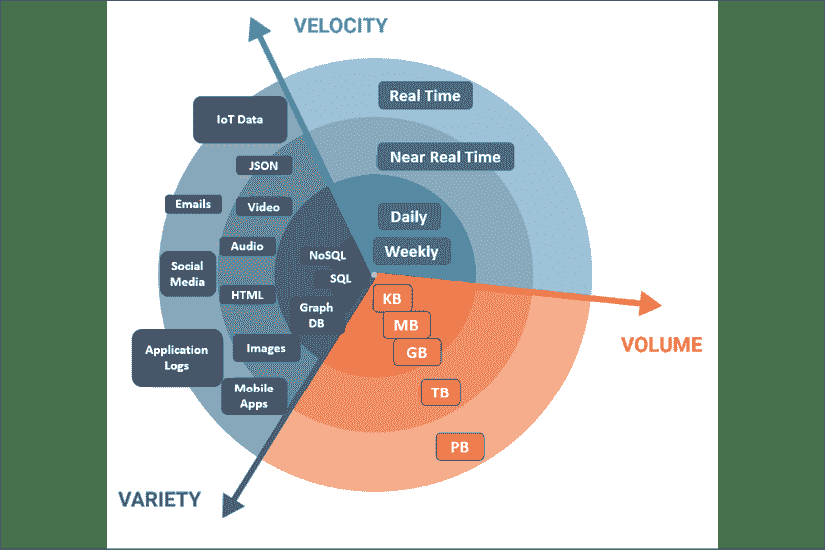

# 23 人工智能和大数据

在本章中，我们将学习什么是大数据以及如何在人工智能的背景下使用大数据技术。 我们将讨论大数据如何帮助加速机器学习流程。 我们还将讨论使用大数据技术什么时候是一个好主意，何时使用它们是过时的，并通过一些示例来加深我们的理解。 我们将学习使用大数据的机器学习管道的组成部分以及所涉及的各种挑战，并且将在 Python 中创建一个环境，以了解其在实践中的工作方式。 在本章的最后，我们将介绍：

*   大数据基础
*   大数据的三个 V
*   适用于人工智能和机器学习的大数据
*   使用大数据的机器学习管道
*   Apache Hadoop
*   Apache Spark
*   Apache Impala
*   NoSQL 数据库

让我们从大数据的基础开始。

# 大数据基础

是您今天定期进行的一项活动，而您十年前很少做，而且肯定二十年前从未做过。 但是，如果被告知您再也做不到，您会感到完全受阻。 您可能已经在今天或至少在本周进行了几次。 想猜一猜我在说什么吗？ 我说的是执行 Google 搜索。

Google 已经存在了很短的时间，但是现在我们非常依赖它。 它扰乱并颠覆了包括杂志出版，电话簿，报纸等在内的众多行业。 如今，每当我们遇到知识难题时，我们都会用 Google 抓它。 由于我们通过手机永久链接到互联网，因此尤其如此。 Google 几乎已经成为我们的延伸。

但是，您是否已停止考虑所有这些令人难以置信的知识发现背后的机制？ 实际上，我们触手可及的位置上有数十亿个文档，可以在几毫秒内访问它们，就像魔术一样，最相关的文档通常显示在前几个结果中，通常会为我们提供所需的答案。 有时我会觉得 Google 正在读我的想法，并且在开始键入关键字之前就知道我想要什么。

Google 提供这些答案的基本技术之一就是通常所说的大数据。 但是什么是大数据？ 这个名字本身并没有给我们太多。 *数据*可以是存储在计算机上的任何数据，而*大*是相对术语。 在定义什么是*大数据*之前，让我先介绍一下我对该主题最喜欢的观察之一：

图 1：大数据类比

这句话使人们明白，大数据对不同的人意味着不同的事物。 这种情况开始改变，但是传统数据库在我们可以存储多少信息以及可扩展的最大范围上有一个上限。 如果您正在使用 Hadoop，Spark，NoSQL 数据库和图形数据库等新技术，那么您正在使用大数据。 没有什么是无限的，但是这些技术可以横向扩展（而不是纵向扩展），因此可以更有效地扩展规模。 没有任何东西可以无限扩展，但是在传统技术（如传统数据库）与新技术（如 Hadoop 和 Spark）之间存在根本差异。 随着供应商和诸如 Snowflake 之类的工具的出现，也开始使用普通的 SQL 处理 PB 级数据库。

随着业务的增长和对资源的需求的增加，如果他们使用的是传统架构，则他们将通过升级到更大，功能更强的计算机来扩展。 可以预见，这种增长方式将达到极限。 硬件制造商制造的机器只有这么大。

相反，如果企业正在使用新技术并且遇到瓶颈，则可以通过*向外扩展*并向其中添加新机器而不是更换硬件来突破瓶颈。 由于我们正在增加火力，因此这个新增加的不必一定更大。 它通常与旧机器相同。 这种增长方法更具可扩展性。 我们可能有成千上万的机器协同工作来解决问题。

由一组计算资源进行的协作通常称为*集群*。 集群是统一的*节点*的集合，它们在一个共同的目标中进行协作，例如存储和分析大量结构化或非结构化数据。 这些集群通常在低成本商品硬件上运行开源分布式处理软件。

这样的集群在低成本的商用计算机上运行 Hadoop 的开源分布式处理软件。 群集通常称为，*非共享*系统，因为节点之间唯一共享的资源是连接它们的网络。

集群架构可以大大提高数据分析的处理速度。 该架构还具有高度可扩展性：当集群的处理能力因某个工作负载而无法承受时，可以轻松添加其他节点以提高吞吐量。 此外，集群架构本质上是容错的。

每个数据组件都冗余地复制到多个节点上，以确保不会因为单个节点故障而丢失数据。 数据丢失并非不可能，但极不可能。

图 2：集群和节点

为了更好地理解大数据，让我们继续研究利用大数据技术的最佳示例之一。 让我们继续分析 Google 搜索。 出于显而易见的原因，Google 搜索的许多实际内部运作都是专有的。 我们正在推测，但很可能只有 Google 内部的一些员工才能知道 Google 工作方式的确切细节。

可能没有人完全了解或了解 Google 搜索的每个细节。 我们其他人会根据 Google 时不时发布的各种信息做出有根据的猜测。

推测它可能如何工作仍然是有益的（而且很有趣）。 Google 的界面使它看起来很简单，除了用一组单词接收请求并根据该请求返回响应外，似乎并没有做其他事情。 我仍然记得我第一次看到 Google 搜索页面，并且感到非常困惑，无法确定页面是否已完成加载。 那是在拨号调制解调器时代，雅虎比 Google 更大。 如果您最近访问过 Yahoo 主页并且看到它仍然很忙，您将理解我的困境。 但是，通过简单的 Google 搜索请求，幕后发生了很多事情。 更进一步，将采取以下步骤：

1.  接收查询
2.  查询解析
3.  建立和规范字序
4.  在 Google 索引中查找信息。 在执行此查找时，通过考虑以下因素来个性化结果：
    *   个人喜好
    *   以前的搜索记录
    *   Google 知道的关于您的个人信息（很多）
5.  对结果进行排名（对结果进行排名的大部分工作已在发送查询之前完成）
6.  发回回应

这是一个示例查询，找到了多少个结果以及返回结果所花费的时间：

图 3：Google 搜索，显示的结果数

一个重要的考虑因素是，当您提交查询时，Google 不会搜索互联网。 到进行查询时，为快速响应已为您完成了许多工作。 在以下各节中，我们将讨论一些在后台进行的活动。

## 爬取

为了让 Google 提供结果，它需要知道可用的内容。 并没有神奇的中央存储库，它具有所有网页和网站，因此 Google 会不断搜索新的网站和页面，并将它们添加到其已知页面列表中。 此发现过程称为爬网。

有些页面在 Google 的网站列表中，因为 Google 以前已经对其进行了爬网。 当 Google 跟踪从已知页面到新页面的链接时，就会发现某些页面。 网站所有者或代理商提交网站以使 Google 知道该网站及其站点地图时，还会发现其他页面。

## 索引

一旦发现页面并将其添加到 Google 的网站列表中，Google 就会尝试了解其内容。 此过程称为索引编制。 Google 分析网站的内容，并对网站中的图像和视频进行分类。

然后将结果存储在 Google 索引中。 您可以想象，该索引确实符合大数据的定义。

通过创建此索引，Google 会搜索其互联网索引，而不是搜索互联网。 这似乎是一个很小的细节，但这是 Google 搜索如此快速的重要原因。

这样想吧。 当您去图书馆时，可以通过以下两种方式之一来查找书籍。 您可以转到卡片目录（假设它是一所旧学校图书馆），也可以在过道周围走动，直到找到所需的书。 您认为哪种方法会更快？

将典型库中包含的信息与 Google Universe 中包含的数据进行比较，我们很快就会意识到反对索引而不是原始数据的重要性。

Google 的工作方式与图书馆卡目录类似，不同之处在于 Google 的“目录”或索引包含指向大量网页的指针，并且比本地图书馆目录中的索引大得多。 根据 Google 自己的文档，他们承认其索引至少为 100 PB，并且可能是该索引的许多倍。 [更多信息可以在这里找到](https://www.google.com/search/howsearchworks/crawling-indexing/)。

如果您好奇的话，这里有一个很酷的网站，它将为您提供有关被索引的网页数量的实时估计。 [试试看](http://www.worldwidewebsize.com/)。

## 排名

当您使用搜索引擎寻找问题的答案时，Google 会使用许多因素来提供最相关的答案。 最重要的之一是 *PageRank* 的概念。 我们将让读者进一步了解该概念。 Google 使用其他标准来确定相关性，包括：

*   用户语言设置
*   以前的搜索记录
*   地理位置
*   设备（台式机或电话）的类型，品牌和型号

例如，搜索*药房*将为班加罗尔的用户提供不同于伦敦用户的结果。

正如我们在上一节中所看到的，Google 做了很多工作来使搜索快速进行。 但这并不是 Google 提供其魔力的全部。 Google 还可以如何加快搜索速度？

## 全球数据中心

与可口可乐配方一样，Google 喜欢将其*秘方*成分保密，因此 Google 不会发布有关其拥有多少个数据中心以及它们位于何处的详细信息。 可以肯定的是，他们有很多，而且遍布世界各地。

无论如何，当您向 Google 提交查询时，智能网络路由器都会将您的搜索查询扩展到距离您最近的且可用于执行搜索的数据中心。

[更多信息可以在这里找到](https://netvantagemarketing.com/blog/how-does-google-return-results-so-damn-fast/)。

## 分布式查找

因此，Google 有许多数据中心，这些数据中心中的每一个都容纳数百个（如果不是数千个）商用服务器。 这些计算机已连接并以同步方式一起工作以执行用户请求。 当搜索查询到达数据中心时，主服务器接收到该请求，然后将其分解为较小的批量并将查找作业分配给多个从属节点。 这些从属节点中的每一个都分配有 Google Web 索引的分区，并分配了针对给定查询返回最相关结果的任务。 这些结果将返回到主服务器，然后由主服务器进一步过滤，组织和排序合并的结果，然后再将其发送回请求者。

当查询提交给 Google 时，它利用了其中一些服务器的功能。 这些服务器可以处理同时查找。

## 定制软件

支持这些服务器的绝大部分（即使不是全部）关键软件都是由 Google 工程师量身定制的，专门供 Google 使用，包括：

*   自定义蜘蛛爬网网站
*   专有内部数据库
*   定制编程语言
*   专有文件系统称为 **Google 文件系统**（**GFS**）或 Colossus

希望您觉得自己对大数据有了更好的了解。 现在让我们增加一些混乱，让我们看看为什么当进入大数据时，大小并不是唯一重要的事情。

# 大数据的三个 V

不久以前习惯了在 90 天左右后清除应用生成的任何日志。 最近，公司意识到他们正在丢弃信息的金块。 此外，存储已经变得足够便宜，以至于保留这些日志都不费吹灰之力。 而且，云，互联网和技术的普遍发展现在可以创建更多的数据。 从智能手机到 IoT 小工具，工业传感器和监控摄像头，用于存储和传输数据的设备数量在世界范围内呈指数级增长，导致数据量激增。

图 4：大数据的三个 V

根据 IBM 的数据，2012 年每天产生 2.5 EB 的数据。无论以何种方式衡量，这都是一个很大的数字。 同样，大约 75% 的数据是非结构化的，来自文本，语音和视频等来源。

这么多正在创建的新数据没有被构造的事实带来了关于大数据的另一个好处。 数据量不是使大数据难以处理的唯一特征。 在处理数据时，至少要考虑另外两个项目，这会增加处理的复杂性。 它们通常被称为速度和变化。 让我们仔细看看通常所说的三个 V。

## 容量

由于明显的原因，卷是最常与大数据关联的特性。 让我们来看一些其他示例，以及在这种情况下大数据的含义。

在其他服务中，Facebook 存储图像。 没关系吧？ 但是，让我们回顾一下有关 Facebook 的一些统计数据：

*   Facebook 的用户数量超过中国的用户数量
*   每天约有 50 万人创建新的个人资料
*   Facebook 正在存储约 2500 亿张图像

那是大数据，那是数量。 对于 Facebook 和我们周围的整个世界，这些数字将继续增长。 考虑一下，当今世界上的手机数量已经超过了世界人数，并且每个人都在不断收集数据并将其发送到世界各地的 Google，Apple 和 Facebook。 大数据挑战将不断扩大。 堆积在现在变得流行的物联网和智能家居设备上，也许我们现在会开始不知所措。

## 速度

速度是衡量数据输入速度的指标。处理 TB 和 PB 的数据是一项挑战。 另一个更大的挑战是处理以下事实：该数据可能不是静态的，并且会持续增长。 在生成时，我们不仅必须接收它，而且在某些情况下，可能还需要对其进行处理，转换，分析和用于训练。

如果我们只需要担心数据量，就可以潜在地使用传统技术来处理数据并最终完成工作。 数据进入的速度要求以快速有效的方式处理数据，最重要的是，以快速的速度使用它来从中获取见解。

坚持使用 Facebook 示例。 2500 亿张图片肯定是一个大数目，而其他统计数据当然也可以视为大数目。 但这不是一个静态数字。

回想一下 2012 年的每一分钟：

*   发表了 510,000 条评论
*   293,000 个状态已更新
*   上传了 136,000 张照片

很难理解这一卷的庞大性。 每天，这相当于大约：

*   每天 7.35 亿条评论
*   每天 4.21 亿状态更新
*   每天上传 1.95 亿张图片

如今，Facebook 对其指标的要求越来越严格，因此很难获得最新的统计数据。 有关 Facebook 流量和其他热门网站的更多有趣统计信息，[请参见以下网址](http://thesocialskinny.com/100-social-media-statistics-for-2012/)。

当涉及到数据时，Facebook 必须将其提取，处理，索引，存储，然后再进行检索。 这些数字会略有不同，具体取决于您相信的来源以及数据的最新程度。 Facebook 最近由于政治原因而成为新闻。 忘记周围的所有争论。 您能想象他们手头上存在的技术问题，根据我们上面描述的数量和速度来确定图像是否令人反感，有争议，政治，真实或不真实等等。

可以想象，这些数字一直在增加。 就像在物理学中一样，您不仅具有速度，还可能具有加速度。

## 种类

在过去的好日子中，大多数数据存储在整齐的列和行中。 随着我们收集越来越多的数据，情况已不再如此。 我们正在收集和存储照片，传感器数据，IoT 设备信息，推文，加密的数据包，语音，视频等。 这些都彼此非常不同。 这些数据不是过去几天的整齐的行和列以及数据库联接。 其中大部分是非结构化的。 这意味着它不容易存储在数据库中并建立索引。

为了更好地理解，让我们从一个简单的示例开始。 假设您是即将发生的重要案件的原告律师。 作为发现的一部分，辩护团队最近向您发送了一堆在线和物理文件（在法律背景下，*发送*是原告和辩方交换他们将在审判期间出示的证据的过程），这样他们每个人都可以提出反驳。 这些文件包括语音邮件，电话录音，电子邮件，录像内容，物理文件，电子邮件（带有附件）和计算机文件。

法律上要求辩护人出示与案件有关的所有文件，但不需要他们为您整理文件。 他们向您发送额外的信息以增加混乱的情况并不少见。 辩护人只希望您错过一些关键信息，而这些关键信息可能是破解您的案件并为您的客户取得积极成果的关键。 法庭肯定会在您需要陈述案件的时间上设定最后期限和里程碑。 即使您在数量和速度上都没有处理 Facebook 级别的数字，在这种情况下，您数据的多样性比大多数 Facebook 数据更为复杂。 这就是使您的工作困难的原因。

我们不会详细介绍如何解决该项目，但让我们重点介绍一些必须解决的任务，其中机器学习和大数据将帮助您解决：

1.  扫描物理文件并执行 OCR。
2.  转录语音邮件，电话录音和录像内容。 索引它们。 我们正在尝试将数据格式标准化为机器可读的计算机文件，然后对其进行统一扫描和搜索。
3.  从电子邮件中分离附件。

1.  编制索引并使所有信息可搜索（有开源和专有工具可以帮助此过程，例如 Solr，Sinequa，Elastic Search 和 Amazon Kendra）。

在本部分中，我们确定了，这些方法可以使用大数据工具和各种见识来筛查所有这些疯狂问题，从而使用机器学习来解决问题，辨别模式并确定机会。 在以下各节中，我们将学习可用于实现此目的的实际工具。

# 大数据与机器学习

大数据技术已被世界各地的技术公司成功利用。 当今的企业了解大数据的力量，他们意识到与机器学习结合使用时，其功能甚至会更加强大。

机器学习系统与大数据技术相结合，以多种方式帮助企业，包括比以往任何时候都更具战略性地管理，分析和使用捕获的数据。

随着公司捕获并生成不断增长的数据量，这既是挑战，也是巨大的机遇。 幸运的是，这两种技术是共生的。 企业不断提出新的模型，这些模型增加了最终工作负载的计算需求。 大数据方面的新进展使这些新用例的处理变得容易并得到促进。 数据科学家发现，当前的架构可以处理增加的工作量。 因此，他们提出了分析此数据的新方法，并从可用的当前数据中获得了越来越深刻的见解。

精心设计的算法可以在大型数据集上蓬勃发展，这意味着数据越多，学习越有效。 随着大数据的出现以及计算能力的提高，机器学习继续以加速的速度发展。 随着大数据分析在机器学习领域的稳定增长，机器和设备将变得越来越智能，并继续承担以前为人类保留的任务。

这些公司正在创建数据管道，然后为机器学习模型提供数据，以不断改善运营。 以亚马逊为例。 像 Google 一样，Amazon 可能对其某些统计数据保持沉默。 幸运的是，可以获得一些信息。 2017 年，亚马逊向全球运送了 50 亿件物品。 每天有 1300 万件商品，或者每秒至少有 150 件商品。 如果我们要使用传统的数据技术来处理大量数据并将机器学习模型应用于该数据，那么在我们能够进行有用的推断之前，我们将收到更多的交易。 通过使用大数据技术，Amazon 可以处理这些交易并使用机器学习从其运营中获得有用的见解。

一个具体的例子是 Amazon 复杂的欺诈检测算法。 抓获欺诈行为的案例非常重要。 理想情况下，他们希望在发生之前将其捕获。 考虑到其交易量，许多检查需要同时进行。 有趣的是，在某些情况下，Amazon 不会尝试最小化欺诈数量，而是选择最大化客户满意度和服务可用性。 例如，当人们使用预付卡时，AWS 服务中发生的许多欺诈行为都会发生。 一种最小化欺诈的简单解决方案是禁止使用预付卡，但亚马逊仍然接受这种付款方式，取而代之的是，即使用户选择使用此付款方式，亚马逊也敦促其数据科学家提出最小化欺诈的解决方案。

在欺诈这个话题上，有趣的是，亚马逊在其 2019 年 re:Invent 会议上宣布了一项名为 **Fraud Detector** 的新服务。 它使用了与 Amazon 用来捕获欺诈的相同技术，并允许该服务的用户在自己的操作和交易中防止欺诈。 有关服务的更多信息，[可以在这里找到](https://aws.amazon.com/fraud-detector/)。

在前面的部分中，我们了解了大数据技术本身是如何强大的。 本节的重点是要理解机器学习是大数据集群可以成功进行并以大规模并行方式处理的工作负载之一。 许多大数据堆栈（例如 Hadoop 堆栈）具有内置的机器学习组件（例如 Mahout），但是我们不限于仅使用这些组件来训练机器学习模型。 这些堆栈可以与其他同类最佳的 ML 库结合使用，例如 Scikit-Learn，Theano，Torch，Caffe 和 TensorFlow。 现在我们已经讨论了大数据如何帮助我们创建机器学习模型，让我们进一步了解一些当今最流行的大数据工具。

## Apache Hadoop

Hadoop 是 Apache Software Foundation 旗下的一种流行的开源框架，它促进了多台计算机的联网，以处理，转换和分析大型数据集。 我们将在下一节中进一步讨论。 随着名为 **Apache Spark** 的新 Hadoop 组件的出现，还有其他处理该数据的方法，但是最初，许多工作负载是通过使用 *MapReduce* 编程范例来处理的。

Hadoop 框架被许多财富 500 强公司使用，包括 Facebook，Netflix 和其他公司。

Hadoop 可以与各种其他技术解决方案和第三方软件（包括机器学习工具）集成。

Hadoop 无疑是构建可伸缩大数据解决方案的最佳开源工具。 它可以处理海量的分布式数据集，并且可以轻松地与其他技术和框架集成。 让我们了解 Hadoop 生态系统中的一些核心概念。

### MapReduce

Hadoop 核心高度依赖 MapReduce。 MapReduce 是一种编程设计模式，用于使用并行，分布式集群计算来处理，转换和生成大型数据集。 MapReduce 模型通过协调分布式资源，并行运行多个作业以及同步节点之间的通信和数据传输来完成大规模数据集的处理。 通过跨节点复制数据，它可以很好地处理各个节点何时出现故障。

MapReduce 仅在多节点群集架构模型的上下文中才有意义。 MapReduce 背后的想法是，许多问题可以分为两个步骤。 映射和归约。

MapReduce 实现由一个映射组件和一个归约组件组成，映射组件执行映射，过滤和/或排序（例如，将不同家用物品的图像映射到队列中，每种类型的物品一个队列），归约组件完成摘要操作（继续示例，计算每个队列中的图像数量，为我们提供家用物品的频率）。

### Apache Hive

有许多组件组成了 Hadoop 生态系统，并且有涵盖该主题的完整书籍。 例如，我们推荐 Manish Kumar 和 Chanchal Singh 的《Mastering Hadoop 3》。 其中许多组件不在本书讨论范围之内，但是在结束本主题之前，我们应该介绍的 Hadoop 的一个重要组件是 Apache Hive。

Apache Hive 是构建在 Apache Hadoop 之上的数据仓库软件组件，支持数据查询和分析。 Apache Hive 支持类似 SQL 的界面，以获取 Hadoop 支持的各种数据库和文件系统中存储的数据。 如果没有 Hive，则需要实现复杂的 Java 代码以提供必要的 MapReduce 逻辑。 Apache Hive 提供了一种抽象，以支持对底层 Java 的类似 SQL 的查询（HiveQL），而无需实现复杂的低级 Java 代码。

由于大多数数据仓库应用都支持基于 SQL 的查询语言，因此 Hive 促进并支持将基于 SQL 的应用移植到 Hadoop 中。 Hive 最初是由 Facebook 开发的，但现在已集成到 Hadoop 生态系统中，并被众多财富 500 强公司使用。

## Apache Spark

Apache Spark 是，是另一个流行的开源框架，隶属于 Apache Software Foundation。 对于许多用例，可以使用 Spark 代替 Hadoop 来解决相同的问题。

Hadoop 是最早开发的，因此，它有很多心得和实现。 但是在许多情况下，Spark 可能是更好的选择。 这样做的主要原因是 Hadoop 通过将文件读写到磁盘上的 HDFS 来处理其大部分处理，而 Spark 使用称为 RDD 或弹性分布式数据集的概念在 RAM 中处理数据。

### 弹性分布式数据集

**弹性分布式数据集**（**RDD**）是 Spark 的基础组件。 RDD 具有以下特征：

*   不变性
*   分散式
*   始终驻留在内存中，而不驻留在磁盘存储中

RDD 中的数据集被划分为逻辑分区，这些逻辑分区冗余地存储在集群中的各个节点上。 这些对象可以是用户定义的类。 最初，只能使用 Scala 语言创建 RDD，但现在也支持 Java 和 Python。

更正式地说，RDD 是不可变的分区记录集。 RDD 是通过一系列确定性操作生成的。 RDD 是一组弹性的内存对象，可以并行且大规模地进行操作。

可以使用以下两种方法之一来创建 RDD：：

1.  通过并行化驱动程序中的现有集合
2.  通过引用来自外部磁盘存储的数据集，例如共享文件系统，S3，HBase，HDFS 或任何其他支持 Hadoop 兼容输入格式的外部数据源

Spark 利用 RDD 的概念来实现更快，更有效的 MapReduce 操作。 使用第二版 Spark，现在还支持更简单的数据结构，从而简化了数据集的处理。 这些是数据帧。

### 数据帧

Spark 中的新抽象是数据帧。 最初通过引入 Spark 2.0 作为 RDD 的替代接口来支持数据帧。 这两个接口有些相似。数据帧将数据组织到命名列中。 从概念上讲，它等效于关系数据库中的表或 Python 的 pandas 包或 R 中的数据帧。这使数据帧比 RDD 易于使用。 RDD 不支持类似的列级标题引用集。

数据帧可以从多种数据源生成，包括：

*   Hive 中的结构化数据文件（例如，Parquet，ORC，JSON）
*   蜂巢表
*   外部数据库（通过 JDBC）
*   现有的 RDD

DataFrame API 在 Scala，Java，Python 和 R 中可用。

### SparkSQL

SparkSQL 是，它可以激发出 Hive 对 Hadoop 的作用。 它允许 Spark 框架的用户查询数据框架，就像在传统的关系数据库中查询 SQL 表一样。

SparkSQL 添加了一个抽象级别，以允许查询存储在 RDD，数据帧和外部源中的数据，从而为所有这些数据源创建统一的接口。 提供这种统一的接口使开发人员可以轻松地创建复杂的 SQL 查询，以与异类的各种源（例如 HDFS 文件，S3，传统数据库等）相对。

更具体地说，SparkSQL 使用户能够：

*   对导入的数据和现有的 RDD 运行 SQL 查询
*   从 Apache Parquet 文件，ORC 文件和 Hive 表导入数据
*   将 RDD 和数据帧输出到 Hive 表或 Apache Parquet 文件

SparkSQL 具有列式存储，基于成本的优化器和代码生成以加快查询速度。 它可以使用 Spark 引擎支持数千个节点。

SparkSQL 无需修改即可运行 Hive 查询。 它重写了 Hive 前端和元存储，从而与现有 Hive 数据完全兼容。

## Apache Impala

在某些方面，例如 Apache Spark，Apache Impala 是用于存储在运行的集群中的数据的开源**大规模并行处理**（**MPP**）SQL 引擎。 在 Apache Hadoop 上。 它在 Apache Hadoop 之上运行。

Impala 为 Hadoop 提供了可扩展的并行 SQL 数据库引擎，使开发人员可以对存储在 Apache HBase，Amazon S3 和 HDFS 中的数据创建并运行低延迟 SQL 查询，而无需在读取数据之前先进行移动或转换。

Impala 可以轻松与 Hadoop 集成，并支持 MapReduce，Apache Hive 和 Apache Pig 以及 Hadoop 堆栈中的其他工具所使用的相同文件和数据格式，元数据以及安全和资源管理框架。

分析人员和数据科学家都使用 Impala。 人们通过 SQL，BI 工具以及机器学习库，包和工具对 Hadoop 中存储的数据进行分析。 结果是大规模数据处理（通过 MapReduce）。

可以使用相同的数据和元数据在同一系统上启动查询，而不必将数据集迁移到专用系统中，也不必转换为专有文件格式即可执行简单的分析。

支持的功能包括：

*   HDFS 和 Apache HBase 是受支持的格式
*   读取 Hadoop 文件格式，例如：
    *   文字（CSV，JSON，XML）
    *   木地板
    *   序列文件
    *   欧元
    *   挥发性有机物
    *   RC 文件
*   支持 Hadoop 安全性（例如 Kerberos 身份验证）
*   使用 Apache Sentry 的细粒度，基于角色的授权
*   使用 Apache Hive 中的元数据，ODBC 驱动程序和 SQL 语法

有关 Impala 及其历史的更多信息，[可以在 Impala 文档中找到](https://impala.apache.org/)，[以及这里](https://en.wikipedia.org/wiki/Apache_Impala)。

现在，让我们分析另一个可以大大增强大型数据集处理能力的重要技术。 现在，我们将尝试了解什么是 NoSQL 数据库。

# NoSQL 数据库

在深入研究 NoSQL 数据库的特定类型之前，我们首先了解什么是 NoSQL 数据库。 这不是一个好名字，但是很难提出更好的选择。 顾名思义，NoSQL 数据库是不是 SQL 数据库的任何数据库。 它包含各种数据库技术，这些技术必须针对能够应对更大工作量和更大，更多样化数据集的产品的市场需求而构建。

数据是新的石油，它存在于各种各样的地方。 日志文件，音频，视频，点击流，IoT 数据和电子邮件是需要处理和分析的数据的一些示例。 传统的 SQL 数据库在使用数据之前需要结构化的架构。 此外，它们的构建并不是为了利用当今容易获得的商品存储和处理能力。

## NoSQL 数据库的类型

**文档数据库**：文档数据库用于存储半结构化数据。 他们使用与复杂的数据结构（称为文档）配对的密钥。 文档可以包含许多类型的数据结构，例如原始值（如整数，布尔值和字符串），不同的键值对或键数组对，甚至是嵌套文档。

**图数据库**：图形数据库将图形结构用于具有节点，边和属性的语义查询，以表示和存储数据。 图形数据库的重点是数据中的关系。 一些示例使用图数据库的案例：

*   Facebook 中包含的信息以及网络中朋友之间的关系。
*   交易，客户和银行帐户。 即，使用*帐户 X* 的*客户 A* 向具有*帐户 Y* 的*客户 B* 汇款。
*   一个家庭的祖先信息。 该案例中的关系示例包括配偶，兄弟姐妹，父母，孩子，叔叔等。

图形数据库的示例是：

*   Neo4J
*   吉拉夫
*   老虎图
*   亚马逊海王星
*   蔚蓝宇宙

**键值数据库**：键值数据库是 NoSQL 数据库的最简单类型。 使用*属性*名称（或*键*）及其值存储数据库中的每个单项。 键值存储的一些示例是：

*   涟漪
*   岩石数据库
*   阿帕奇点燃
*   伯克利 DB
*   ArangoDB
*   雷迪斯

**按列数据库**：按列数据库已针对大型数据集的查询进行了优化，并将数据列而不是行存储在一起。 这些类型的数据库的示例是 Cassandra 和 HBase。

现在，让我们进一步详细介绍 NoSQL 数据库的一些最流行的实现。

## Apache Cassandra

Apache Cassandra 是，一个开放源代码的分布式 NoSQL 数据库。 它可以处理大量数据。 我利用了可以使用许多商品服务器进行处理的水平架构。 它具有无单点故障的架构，因此可提供高可用性。 Cassandra 依赖可以跨越多个数据中心和区域的集群。 它使用异步无主复制，同时为用户提供低延迟的操作。

Avinash Lakshman（亚马逊 DynamoDB 的作者之一）和 Prashant Malik 最初在 Facebook 上开发了 Cassandra。 Facebook 将 Cassandra 作为开源项目发布，并在 2010 年成为 Apache 的顶级项目。

## MongoDB

MongoDB 是面向文档的水平可伸缩数据库。 它使用 JSON 数据格式存储数据。 它通常用于存储网站数据，并且在内容管理和缓存应用中也很流行。 它支持复制和高可用性配置，以最大程度地减少数据丢失。

根据查询的类型，它可能是一个高性能的系统。 它是用 C++ 编写的。 它完全支持索引，具有丰富的查询语言，可以进行配置以提供跨数据中心的高可用性。

## Redis

Redis 是的另一个开源 NoSQL 数据库。 这是一个键值存储。 它支持键中的哈希，集，字符串，排序集和列表。 因此，Redis 也被称为数据结构服务器。 Redis 支持运行原子操作，例如增加散列中存在的值，设置交集计算，字符串附加，差和联合。 Redis 利用内存中的数据集来实现高性能。 Redis 支持大多数最受欢迎的编程语言，例如 Python，Java，Scala，C++ 等。

## Neo4j

Neo4j 是 Neo4j，Inc.开发的图形数据库管理系统。它最初于 2010 年 2 月发布。它在本机图形存储和处理中支持符合 ACID 的事务。 Neo4j 可能是最受欢迎的图形数据库。

Neo4j 具有开源版本和付费版本。 Neo4j 的开源版本可通过 GPL3 许可的开源“社区版”获得，而通过开源商业许可证，您可以拥有在线备份和高可用性扩展。 Neo 还根据开源商业条款向这些扩展提供了 Neo4j 许可。

Neo4j 用 Java 实现，并通过交易 HTTP 端点或二进制“螺栓”协议使用 Cypher Query Language 支持最受欢迎的语言。

还有许多其他流行的数据库实现。 我们几乎没有吃过那个宇宙的表面。 我们衷心希望您能为本书中介绍的概念更好地应对下一个数据科学项目。

# 总结

在本章中，我们首先围绕大数据奠定了核心和基本概念的基础。 然后，我们了解了与大数据有关的许多不同技术。 当涉及到大数据技术 Hadoop 时，我们了解了其中的所有“老祖宗”。 我们还了解了当今市场上当前最流行的大数据工具，即 Spark。

最后，我们了解了大数据实现中常用的另一种技术，即 NoSQL 数据库。 NoSQL 数据库引擎支持财富 500 强公司中许多最大的工作量，并在当今最常见的网站中服务数百万个页面。

对于当今机器学习中存在的所有令人惊奇和令人兴奋的应用，我们坚信，我们只是在探索一切可能的事物。 我们衷心希望您能更好地掌握机器学习中涉及的概念，但更重要的是，我们希望您的好奇心得到激发，这本书激发您毕生对这种美丽话题的兴趣。

我们很高兴看到您使用本章，本书中所包含的知识做什么。 希望您发现这本书引人入胜，有趣并且有用。 我们希望您阅读和阅读时一样开心。 我们希望您在所有努力中继续取得成功。