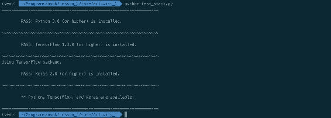
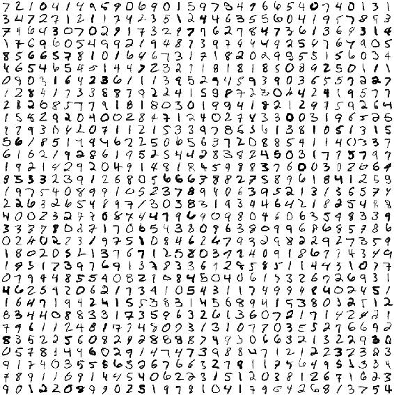
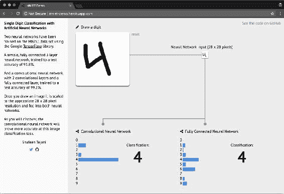
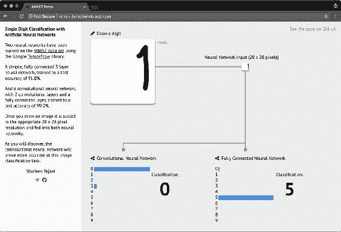
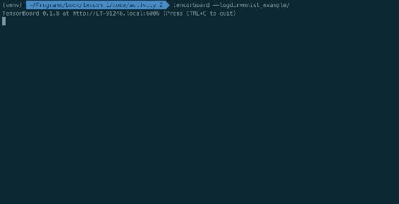
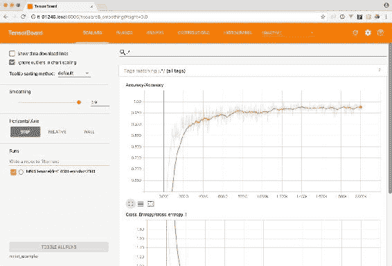

# 第 1 章。神经网络和深度学习简介

在本课程中，我们将介绍神经网络的基础知识以及如何建立深度学习编程环境。 我们还将探讨神经网络的常见组件及其基本操作。 我们将通过探索使用 TensorFlow 创建的训练有素的神经网络来结束本课程。

本课是关于了解神经网络可以做什么的。 我们将不讨论深度学习算法基础的数学概念，而将描述构成深度学习系统的基本部分。 我们还将看一些使用神经网络解决现实问题的例子。

本课将为您提供有关如何设计使用神经网络解决问题的系统的实用直觉，包括如何确定是否可以使用此类算法完全解决给定的问题。 从本质上讲，本课挑战您将问题视为思想的数学表示形式。 在本课程结束时，您将能够考虑这些表示形式的集合来思考问题，然后开始认识到深度学习算法如何学习这些表示形式。

# 课程目标

在本课程结束时，您将能够：

*   涵盖神经网络的基础
*   设置深度学习编程环境
*   探索神经网络的通用组件及其基本操作
*   通过探索使用 TensorFlow 创建的训练有素的神经网络来结束本课程

# 什么是神经网络？

麻省理工学院的沃伦·麦卡洛（Warren McCullough）和沃尔特·皮茨（Walter Pitts）于 40 年代首次提出了神经网络，也称为，即人工神经网络。

### 注意

有关更多信息，请参见《神经网络解释》，[可在以下网址访问](http://news.mit.edu/2017/explained-neural-networks-deep-learning-0414)。

受神经科学进步的启发，他们建议创建一个计算机系统，该计算机系统可以重现大脑（人类或其他方式）的工作方式。 其核心思想是作为互连网络工作的计算机系统。 即，具有许多简单组件的系统。 这些组件既可以解释数据，又可以相互影响如何解释数据。 今天仍然保留着相同的核心思想。

深度学习在很大程度上被认为是神经网络的当代研究。 可以将其视为神经网络的当前名称。 主要区别在于，深度学习中使用的神经网络通常比早期的神经网络更大，即具有更多的节点和层。 深度学习算法和应用程序通常需要获得成功的资源，因此使用*深度*一词来强调其大小和大量相互连接的组件。

## 成功的申请

自从 40 年代以一种形式或另一种形式出现以来，一直在研究神经网络。 但是，直到最近，深度学习系统才在大型工业应用中成功使用。

神经网络的当代支持者已在语音识别，语言翻译，图像分类和其他领域取得了巨大的成功。 其当前的突出优势是可用计算能力的显着提高以及**图形处理单元**（**GPU**）和**张量处理单元**（**TPU**）比常规 CPU 能够执行更多的同时数学运算，并且数据可用性更高。

不同 AlphaGo 算法的功耗。 AlphaGo 是 DeepMind 的一项举措，旨在开发出一系列击败 Go 游戏的算法。 它被认为是深度学习的强大典范。 TPU 是 Google 开发的一种芯片组，用于深度学习程序。

该图描绘了用于训练不同版本的 AlphaGo 算法的 GPU 和 TPU 的数量。 [来源](https://deepmind.com/blog/alphago-zero-learning-scratch/)。

### 注意

在本书中，我们不会使用 GPU 来完成我们的活动。 不需要 GPU 与神经网络一起使用。 在许多简单的示例（如本书中提供的示例）中，所有计算都可以使用简单的笔记本电脑的 CPU 执行。 但是，在处理非常大的数据集时，鉴于长时间训练神经网络不切实际，GPU 可能会提供很大帮助。

这是神经网络在其中产生巨大影响的一些实例：

*   **翻译文本**：2017 年，Google 宣布将为其翻译服务发布一种名为**转换器**的新算法。 该算法由使用双语文本训练的循环神经网络（LSTM）组成。 Google 表明，与行业标准（BLEU）相比，其算法已获得了显着的准确性，并且在计算效率上也很高。 据报道，在撰写本文时，转换器被 Google 翻译用作其主要翻译算法。

    ### 注意

    Google 研究博客，[《转换器：一种用于语言理解的新型神经网络体系结构》](https://ai.googleblog.com/2017/08/transformer-novel-neural-network.html)。

*   **自动驾驶汽车**：Uber，NVIDIA 和 Waymo 被认为正在使用深度学习模型来控制不同的控制驾驶的车辆功能。 每个公司都在研究多种可能性，包括使用人工训练网络，模拟在虚拟环境中驾驶的车辆，甚至创建类似于城市的小型环境，在其中可以根据预期和意外事件对车辆进行训练。

    ### 注意

    +   [`Alexis C. Madrigal: Inside Waymo's Secret World for Training Self-Driving Cars. The Atlantic. August 23, 2017.`](https://www.theatlantic.com/technology/archive/2017/08/inside-waymos-secret-testing-and-simulation-facilities/537648/)
    +   [`NVIDIA: End-to-End Deep Learning for Self-Driving Cars. August 17, 2016.`](https://devblogs.nvidia.com/parallelforall/deep-learning-self-driving-cars/)
    +   [`Dave Gershgorn: Uber's new AI team is looking for the shortest route to self-driving cars. Quartz. December 5, 2016.`](https://qz.com/853236/ubers-new-ai-team-is-looking-for-the-shortest-route-to-self-driving-cars/)

*   **图像识别**：Facebook 和 Google 使用深度学习模型来识别图像中的实体，并自动将这些实体标记为一组联系人中的人物。 在这两种情况下，都使用先前标记的图像以及目标朋友或联系人的图像来训练网络。 两家公司都报告说，在大多数情况下，这些模型能够以很高的精确度推荐朋友或联系人。

尽管其他行业中有更多示例，但深度学习模型的应用仍处于起步阶段。 还有更多成功的应用程序，包括您创建的应用程序。

### 为什么神经网络这么好？

为什么神经网络如此强大？ 神经网络之所以强大，是因为它们可用于以合理的近似值预测任何给定的函数。 如果一个人能够将一个问题表示为一个数学函数，并且还具有可以正确表示该函数的数据，那么原则上，只要有足够的资源，深度学习模型就可以近似该函数。 这通常称为神经网络的通用性原则。

### 注意

有关更多信息，请参阅 Michael Nielsen 的[《神经网络和深度学习：神经网络可以计算任何函数的视觉证明》](http://neuralnetworksanddeeplearning.com/chap4.html)。

在本书中，我们将不探讨通用性原理的数学证明。 但是，神经网络的两个特征应该为您提供有关如何理解该原理的正确直觉：表示学习和函数逼近。

### 注意

有关更多信息，请参阅[《深度强化学习的简要概述》](https://www.arxiv-vanity.com/papers/1708.05866/)。

#### 表示学习

用于训练神经网络的数据包含表示形式（也称为*特征*），这些表示形式说明您要解决的问题。 例如，如果有兴趣从图像中识别人脸，则将一组包含人脸的图像中每个像素的颜色值用作起点。 然后，模型将在训练过程中将像素组合在一起，从而不断学习更高级别的表示。


图 1：从输入数据开始的一系列高级表示。 基于来自 Yan LeCun，Yoshua Bengio 和 Geoffrey Hinton 的原始图像得出的图像。 “深度学习”。 自然 521，436–444（2015 年 5 月 28 日）doi：10.1038 / nature14539

用正式的词来说，神经网络是计算图，其中每个步骤从输入数据计算更高的抽象表示。

这些步骤中的每一步都代表进入不同抽象层的过程。 数据经过这些层，不断建立更高级别的表示。 该过程以最大可能的表示形式结束：模型试图进行预测。

#### 函数逼近

当神经网络学习数据的新表示时，它们通过将权重和偏差与来自不同层的神经元相结合来实现。 每当训练周期发生时，他们就会使用称为反向传播的数学技术来调整这些连接的权重。 权重和偏差在每个回合中都会改善，直至达到最佳效果。 这意味着神经网络可以测量每个训练周期的错误程度，调整每个神经元的权重和偏差，然后重试。 如果确定某项修改产生的效果比上一轮更好，它将投资于该修改，直到获得最佳解决方案。

简而言之，该过程是神经网络可以近似函数的原因。 但是，神经网络可能无法完美地预测功能有很多原因，其中主要的原因是：

*   许多函数包含随机属性（即随机属性）
*   训练数据可能会过分拟合
*   可能缺少训练数据

在的许多实际应用中，简单的神经网络能够以合理的精度逼近一个函数。 这些应用程序将成为本书的重点。

### 深度学习的局限性

深度学习技术最适合可以用形式化数学规则（即，数据表示形式）定义的问题。 如果很难用这种方式定义问题，则深度学习可能不会提供有用的解决方案。 此外，如果可用于给定问题的数据有偏差或仅包含生成该问题的基础功能的部分表示，则深度学习技术将仅能够重现该问题而不能学习解决该问题。

记住，深度学习算法正在学习数据的不同表示以逼近给定的功能。 如果数据不能恰当地表示功能，则可能是神经网络会错误地表示功能。 考虑以下类比：您正在尝试预测汽油（即燃料）的全国价格并创建深度学习模型。 您可以将信用卡对帐单与日常汽油费用一起用作该模型的输入数据。 该模型最终可能会了解您的汽油消耗模式，但可能会误述由仅在您的数据中每周代表的其他因素（例如政府策略，市场竞争，国际政治等）引起的汽油价格波动。 在生产中使用该模型时，最终将产生错误的结果。

为避免此问题，请确保用于训练模型的数据代表该模型试图尽可能准确地解决的问题。

### 注意

有关此主题的深入讨论，请参阅 FrançoisChollet 即将出版的书[《使用 Python 进行深度学习》](https://blog.keras.io/the-limitations-of-deep-learning.html)。 François 是 Keras（本书中使用的 Python 库）的创建者。 深度学习的局限性这一章对于理解该主题特别重要。 

#### 内在偏见和道德考量

研究人员建议使用深度学习模型而不考虑训练数据中的固有偏差不仅会导致性能不佳，还会导致道德上的复杂化。

例如，2016 年底，中国上海交通大学的研究人员创建了一个神经网络，该神经网络仅使用犯罪现场的面孔对犯罪分子进行正确分类。 研究人员使用了 1,856 张中国男子的图像，其中一半被定罪。

### 注意

[他们的模型识别出囚犯的准确率高达 89.5% ](https://blog.keras.io/the-limitations-of-deep-learning.html)。

麻省理工学院技术评论，[《神经网络学习通过面孔识别犯罪分子》](https://blog.keras.io/the-limitations-of-deep-learning.html)。

该论文在科学界和大众媒体中引起了极大轰动。 所提出的解决方案的一个关键问题是它不能正确地识别输入数据中固有的偏差。 即，本研究中使用的数据来自两个不同的来源：一个用于罪犯，一个用于非罪犯。 一些研究人员建议，他们的算法可以识别与研究中使用的不同数据源相关的模式，而不是从人们的面部识别相关模式。 尽管可以对模型的可靠性进行技术上的考虑，但主要的批评是出于道德基础：人们应该清楚地认识到深度学习算法所使用的输入数据的固有偏差，并考虑其应用将如何对人们的学习产生影响。 生活。

### 注意

蒂莫西·雷维尔（Timothy Revell），[《用于“识别”罪犯的面部识别技术的关注》](https://www.newscientist.com/article/2114900-concerns-as-face-recognition-tech-used-to-identify-criminals/)。

为了使进一步了解学习算法（包括深度学习）中的道德主题，请参阅 [AI Now Institute](https://ainowinstitute.org/) 所做的工作 为了解智能系统的社会意义。

## 神经网络的通用组件和操作

神经网络具有两个关键组成部分：层和节点。

节点是负责特定操作的，层是用于区分系统不同阶段的节点组。 通常，神经网络具有以下三类类别：

*   **输入**：接收并首先解释输入数据的位置
*   **隐藏**：进行计算的位置，在处理数据时对其进行修改
*   **输出**：组装并评估输出的位置


图 2：神经网络中最常见的层的图示。 通过 Glosser.ca-自己的作品，文件的衍生物：人工神经网络.svg，CC BY-SA 3.0，https：//commons.wikimedia.org/w/index.php？curid = 24913461

隐藏层是神经网络中最重要的层。 它们被称为*隐藏*的，因为在其中生成的表示形式在数据中不可用，但可以从中学习。 在这些层中，神经网络中进行了主要计算。

节点是网络中表示数据的地方。 有两个与节点关联的值：偏差和权重。 这两个值都影响数据如何由节点表示并传递到其他节点。 当网络*学习*时，它会有效地调整这些值以满足优化功能。

神经网络中的大部分工作都发生在隐藏层中。 不幸的是，没有明确的规则来确定网络应具有多少层或节点。 在实现神经网络时，人们可能会花费时间来尝试不同的层和节点组合。 建议始终从单个图层开始，并且总是以反映输入数据具有的要素数量（即，数据集中有多少*列*可用）的数量的节点开始。 然后，将继续添加层和节点，直到获得令人满意的性能-或每当网络开始过度适应训练数据时。

当前的神经网络实践通常仅限于实验，该实验涉及节点和层的数量（例如，网络的深度）以及在每一层执行的操作的种类。 在许多成功的实例中，仅通过调整这些参数，神经网络的性能就优于其他算法。

作为一种直觉，考虑一下数据通过输入层进入神经网络系统，然后在网络中从一个节点移动到另一个节点。 数据采用的路径将取决于节点的互连程度，每个节点的权重和偏差，在每个层中执行的操作的类型以及此类操作结束时的数据状态。 神经网络通常需要许多“运行”（或历元），以便不断调整节点的权重和偏差，这意味着数据多次流经图形的不同层。

本节为您提供了神经网络和深度学习的概述。 此外，我们讨论了入门者的直觉，以了解以下关键概念：

*   只要有足够的资源和数据，神经网络原则上就可以近似大多数功能。
*   层和节点是神经网络最重要的结构组件。 通常，人们会花费大量时间来更改这些组件以找到一种有效的体系结构。
*   权重和偏差是网络在训练过程中“学习”的关键属性。

这些概念将在我们的下一部分中证明是有用的，因为我们探索了一个在现实世界中经过训练的神经网络，并进行了修改以训练自己的神经网络。

# 配置深度学习环境

在完成本课程之前，我们希望您与真实的神经网络进行交互。 我们将首先介绍本书中使用的主要软件组件，并确保已正确安装它们。 然后，我们将探索一个预训练的神经网络，并探索前面“什么是神经网络”部分讨论的一些组件和操作。

## 深度学习的软件组件

我们将使用以下软件组件进行深度学习：

### Python 3

本书中，我们将使用 Python 3。 Python 是一种通用编程语言，在科学界非常流行-因此在深度学习中得到了采用。 本书不支持 Python 2，但可用于训练神经网络而不是 Python3。即使您选择在 Python 2 中实现解决方案，也应考虑迁移到 Python 3，因为其现代功能集比 Python 3 更强大。 它的前身。

### TensorFlow

TensorFlow 是一个库，用于以图形形式执行数学运算。 TensorFlow 最初由 Google 开发，如今已是一个由许多贡献者参与的开源项目。 它在设计时就考虑了神经网络，是创建深度学习算法时最受欢迎的选择之一。

TensorFlow 也以其生产组件而闻名。 它随附 [TensorFlow 服务](https://github.com/tensorflow/serving)，这是一种用于深度学习模型的高性能系统。 此外，可以在其他高性能编程语言（例如 Java，Go 和 C）中使用经过训练的 TensorFlow 模型。这意味着人们可以在从微型计算机（即 RaspberryPi）到 Android 设备的任何内容中部署这些模型。 。

### 大声

为了与 TensorFlow 高效交互，我们将使用 [Keras](https://keras.io/)，这是一个具有高级 API 的 Python 软件包，用于开发神经网络。 虽然 TensorFlow 专注于在计算图中彼此交互的组件，但 Keras 专门专注于神经网络。 Keras 使用 TensorFlow 作为其后端引擎，使开发此类应用程序变得更加容易。

截至 2017 年 11 月（TensorFlow 1.4 版），Keras 作为 TensorFlow 的一部分分发。 在`tf.keras`命名空间下可用。 如果安装了 TensorFlow 1.4 或更高版本，则系统中已经有 Keras 可用。

### TensorBoard

TensorBoard 是用于探索 TensorFlow 模型的数据可视化套件，并与 TensorFlow 原生集成。 TensorBoard 通过训练 TensorFlow 在训练神经网络时使用的检查点和摘要文件来工作。 可以近乎实时（延迟 30 秒）或在网络完成训练后进行探索。 TensorBoard 使实验和探索神经网络的过程变得更加容易，而且跟随您的网络训练也非常令人兴奋！

### Jupyter 笔记本，熊猫和 NumPy

在使用 Python 创建深度学习模型时，通常开始进行交互工作，慢慢地开发一个模型，最终将其变成结构化的软件。 在此过程中，经常使用以下三个 Python 程序包：Jupyter Notebooks，Pandas 和 NumPy：

*   Jupyter Notebooks 创建使用网络浏览器作为其界面的交互式 Python 会话
*   Pandas 是用于数据操纵和分析的程序包
*   NumPy 是，经常用于整形数据和执行数值计算

在本书中偶尔会使用这些软件包。 它们通常不构成生产系统的一部分，但经常在浏览数据和开始构建模型时使用。 我们将更加详细地关注其他工具。

### 注意

Michael Heydt 的《学习 Pandas》和 Dan Toomey 的《学习 Jupyter》提供了有关如何使用这些技术的全面指南。 这些书是继续学习的好参考。

<colgroup class="calibre28"><col class="calibre29"> <col class="calibre29"> <col class="calibre29"></colgroup> 
| 

零件

 | 

描述

 | 

最低版本

 |
| --- | --- | --- |
| 蟒蛇 | 通用编程语言。 深度学习应用程序开发中使用的流行语言。 | 3.6 |
| TensorFlow | 开源图计算 Python 软件包，通常用于开发深度学习系统。 | 1.4 |
| 硬 | 提供与 TensorFlow 的高级接口的 Python 软件包。 | 2.0.8-tf（随 TensorFlow 一起分发） |
| 张量板 | 基于浏览器的软件，用于可视化神经网络统计信息。 | 0.4.0 |
| Jupyter 笔记本 | 基于浏览器的软件，用于与 Python 会话进行交互。 | 5.2.1 |
| 大熊猫 | 用于分析和处理数据的 Python 软件包。 | 0.21.0 |
| NumPy | 用于高性能数值计算的 Python 软件包。 | 1.13.3 |

> 表 1：创建深度学习环境所需的软件组件

### 活动 1 –验证软件组件

在探索训练有素的神经网络之前，让我们验证所需的所有软件组件是否可用。 我们包含了一个脚本，用于验证这些组件的工作情况。 让我们花点时间运行脚本并处理可能发现的所有最终问题。

我们现在将测试您​​的工作环境中是否可以使用本书所需的软件组件。 首先，我们建议使用 Python 的本机模块`venv`创建一个 Python 虚拟环境。 虚拟环境用于管理项目依赖项。 我们建议您创建的每个项目都具有自己的虚拟环境。 现在创建一个。

### 注意

如果您对 conda 环境更满意，请随意使用它们。

1.  可以使用以下命令创建 Python 虚拟环境：

    ```py
    $ python3 -m venv venv
    $ source venv/bin/activate
    ```

2.  后面的命令会将字符串（`venv`）附加到命令行的开头。 使用以下命令停用您的虚拟环境：

    ```py
    $ deactivate
    ```

    ### 注意

    确保在处理项目时始终激活您的 Python 虚拟环境。

3.  激活您的虚拟环境后，通过对文件`requirements.txt`执行` pip`来确保安装了正确的组件。 这将尝试在该虚拟环境中安装本书中使用的模型。 如果它们已经可用，它将什么都不做：

    

    > 图 3：运行 pip 的终端的图像，用于从 requirements.txt 安装依赖项

    通过运行以下命令来安装依赖项：

    ```py
    $ pip install –r requirements.txt
    ```

    此将为您的系统安装所有必需的依赖项。 如果它们已经安装，则此命令应仅通知您。

    这些依赖性对于使用本书中的所有代码活动都是必不可少的。

    作为此活动的最后一步，让我们执行脚本`test_stack.py`。 该脚本正式验证了本书所需的所有软件包是否已在系统中安装并可用。

4.  学生，运行脚本`lesson_1/activity_1/test_stack.py`，检查 Python 3，TensorFlow 和 Keras 的依赖项是否可用。 使用以下命令：

    ```py
    $ python3 lesson_1/activity_1/test_stack.py
    ```

    该脚本返回有用的消息，说明已安装的内容和需要安装的内容。

5.  在终端中运行以下脚本命令：

    ```py
    $ tensorboard --help
    ```

    您应该看到一条帮助消息，解释每个命令的作用。 如果您没有看到该消息-或看到一条错误消息-请向您的教练寻求帮助：

    

    > 图 4：运行 python3 test_stack.py 的终端的图像。 该脚本返回消息，通知所有依赖项均已正确安装。

    ### 注意

    如果出现类似以下的消息，则无需担心：

    ```py
    RuntimeWarning: compiletime version 3.5 of module 'tensorflow.python.framework.fast_tensor_util' does not match runtime version 3.6
    return f(*args, **kwds)
    ```

    如果您运行的是 Python 3.6，并且分布式 TensorFlow 滚轮是在其他版本（本例中为 3.5）下编译的，则会显示该消息。 您可以放心地忽略该消息。

    一旦我们确认已安装 Python 3，TensorFlow，Keras，TensorBoard 和`requirements.txt`中概述的软件包，我们就可以继续进行有关如何训练神经网络的演示，然后继续使用这些工具探索受过训练的网络 相同的工具。

    ### 注意

    对于参考解决方案，请使用`Code/Lesson-1/activity_1`文件夹。

#### 探索训练有素的神经网络

在本节中，我们探索训练有素的神经网络。 我们这样做是为了了解神经网络如何解决现实世界的问题（预测手写数字），并熟悉 TensorFlow API。 在探索该神经网络时，我们将认识到先前各节中介绍的许多组件，例如节点和层，但我们还将看到许多我们不认识的组件（例如激活函数），我们将在后续部分中进行探索。 然后，我们将完成一个有关如何训练神经网络的练习，然后自己训练该网络。

我们将要探索的网络已经过训练，可以使用手写数字的图像识别数字（整数）。 它使用了 [MNIST 数据集](http://yann.lecun.com/exdb/mnist/)，该数据集通常用于探索模式识别任务。

##### MNIST 数据集

**国家标准技术混合研究所**（**MNIST**）数据集包含 60,000 张图像的训练集和 10,000 张图像的测试集。 每个图像都包含一个手写数字。 该数据集（是美国政府创建的数据集的衍生产品）最初用于测试解决计算机系统识别手写文本问题的不同方法。 为了提高邮政服务，税收系统和政府服务的绩效，能够做到这一点很重要。 对于现代方法，MNIST 数据集被认为过于幼稚。 在现代研究中（例如 CIFAR）使用了不同的和更新的数据集。 但是，MNIST 数据集对于了解神经网络的工作原理仍然非常有用，因为已知的模型可以高效地达到很高的准确性。

### 注意

CIFAR 数据集是机器学习数据集，其中包含按不同类别组织的图像。 与 MNIST 数据集不同，CIFAR 数据集包含许多不同领域的类，例如动物，活动和物体。 CIFAR 数据集位于[这里](https://www.cs.toronto.edu/~kriz/cifar.html)。



图 5：MNIST 数据集训练集中的节选。 每个图像是一个单独的 20x20 像素的图像，带有一个手写数字。 原始数据集可在以下位置获得：http://yann.lecun.com/exdb/mnist/。

###### 使用 TensorFlow 训练神经网络

现在，让我们训练一个神经网络，以使用 MNIST 数据集识别新数字。

我们将实现称为“卷积神经网络”的专用神经网络来解决这个问题（我们将在后面的部分中详细讨论）。 我们的网络包含三个隐藏层：两个全连接层和一个卷积层。 **卷积层**由以下 Python 代码的 TensorFlow 代码段定义：：

```py
  W = tf.Variable(
      tf.truncated_normal([5, 5, size_in, size_out], 
      stddev=0.1),
      name="Weights")

   B = tf.Variable(tf.constant(0.1, shape=[size_out]), name="Biases")

   convolution = tf.nn.conv2d(input, W, strides=[1, 1, 1, 1], padding="SAME")
   activation = tf.nn.relu(convolution + B)

  tf.nn.max_pool(
  activation,
  ksize=[1, 2, 2, 1],
  strides=[1, 2, 2, 1],
  padding="SAME")
```

### 注意

请在`Code/Lesson-1/activity_2/`中使用`mnist.py`文件作为参考。 在代码编辑器中打开脚本。

在我们的网络训练期间，我们只执行一次该代码段。

变量`W`和`B`代表权重和偏差。 这些是隐藏层内的节点使用的值，用于在数据通过网络时更改网络对数据的解释。 现在不用担心其他变量。

**全连接层**由以下 Python 代码段定义：：

```py
 W = tf.Variable(
     tf.truncated_normal([size_in, size_out], stddev=0.1),
  	  name="Weights")

 B = tf.Variable(tf.constant(0.1, shape=[size_out]), name="Biases")
	  activation = tf.matmul(input, W) + B
```

### 注意

请在`Code/Lesson-1/activity_2/`中使用`mnist.py`文件作为参考。 在代码编辑器中打开脚本。

在这里，我们还有两个 TensorFlow 变量`W`和`B`。 请注意，这些变量的初始化非常简单：`W`被初始化为修剪后的高斯分布（修剪过`size_in`和`size_out`）的随机值，标准偏差为`0.1,`和`B`（ 术语）初始化为`0.1`（常数）。 这两个值在每次运行期间都会不断变化。 该代码段执行两次，产生两个全连接网络-一个将数据传递到另一个。

那 11 行 Python 代码代表了我们完整的神经网络。 我们将在“第 2 课”，“模型体系结构”中详细介绍使用 Keras 的每个组件。 目前，应重点了解网络在每次运行时都会改变每个层中的`W`和`B`值，以及这些代码片段如何形成不同的层。 这 11 行 Python 是数十年来神经网络研究的高潮。

现在让我们训练该网络以评估其在 MNIST 数据集中的表现。

###### 训练神经网络

请按照以下步骤设置此练习：

1.  打开两个终端实例。
2.  在这两个目录中，导航到目录`lesson_1/exercise_a`。
3.  在两者中，确保您的 Python 3 虚拟环境处于活动状态，并且已安装`requirements.txt`中概述的要求。
4.  在其中之一中，使用以下命令启动 TensorBoard 服务器：

    ```py
    $ tensorboard --logdir=mnist_example/
    ```

5.  在另一个目录中，运行`train_mnist.py`脚本。
6.  启动服务器时，在提供的 TensorBoard URL 中打开浏览器。

在运行脚本`train_mnist.py,`的终端中，您将看到带有模型历元的进度条。 打开浏览器页面时，您将看到几个图形。 单击读取**精度**的那个，将其放大并让页面刷新（或单击**刷新**按钮）。 随着时间的流逝，您将看到模型越来越准确。

利用这一刻来说明神经网络在训练过程中尽早达到高准确度的能力。

我们可以看到，在大约 200 个周期（或步骤）内，网络的准确性超过了 90%。 也就是说，网络正确获取了测试集中 90% 的数字。 在训练到第 2000 步时，网络继续获得准确性，在此期间结束时达到 97% 的准确性。

现在，让我们也测试那些网络在看不见的数据下的性能。 我们将使用 Shafeen Tejani 创建的开源 Web 应用程序来探索受过训练的网络是否正确地预测了我们创建的手写数字。

###### 使用看不见的数据测试网络性能

在浏览器中访问[网站](http://mnist-demo.herokuapp.com/)并在指定的白框中，绘制一个`0`和`9`之间的数字：



图 6：Web 应用程序中，我们可以手动绘制数字并测试两个受过训练的网络的准确性

### 注意

[来源](https://github.com/ShafeenTejani/mnist-demo)。

在应用程序中，您可以看到两个神经网络的结果。 我们训练过的那个在左边（称为 CNN）。 它能正确分类所有手写数字吗？ 尝试在指定区域的边缘绘制编号。 例如，尝试在该区域的右边缘附近绘制数字`1`：



图 7：两个网络都难以估计区域边缘上绘制的值

### 注意

在此示例中，我们看到在绘图区域的右侧绘制了数字`1`。 在两个网络中，此数字为`1`的概率为`0`。

MNIST 数据集在图像边缘不包含数字。 因此，两个网络都没有为位于该区域的像素分配相关值。 如果我们将它们拉近指定区域的中心，则这两个网络都将更好地正确分类数字。 这表明神经网络只能像用于训练它们的数据一样强大。 如果用于训练的数据与我们试图预测的数据完全不同，则该网络很可能会产生令人失望的结果。

#### 活动 2 –探索训练有素的神经网络

在本节中，我们将探索运动过程中训练的神经网络。 我们还将通过更改原始网络中的超参数来训练其他一些网络。

让我们开始探索在练习中训练的网络。 我们在本书的目录中提供了与二进制文件相同的受训网络。 让我们使用 TensorBoard 打开受过训练的网络，并探索其组件。

在您的终端上，导航至目录`lesson_1/activity_2`并执行以下命令以启动 TensorBoard：

```py
$ tensorboard --logdir=mnist_example/
```

现在，在浏览器中打开 TensorBoard 提供的 URL。 您应该能够看到 TensorBoard 标量页面：



图 8：启动 TensorBoard 实例后的终端图像

打开`tensorboard`命令提供的 URL 后，您应该能够看到以下 TensorBoard 页面：



图 9：TensorBoard 登陆页面的图像

现在让我们探索我们训练有素的神经网络，看看它是如何工作的。

在 TensorBoard 页面上，单击**标量**页面，然后放大**精度**图。 现在，将**平滑**滑块移动到 **0.9** 。

准确性图衡量网络能够猜测测试集标签的准确性。 最初，网络猜测这些标签完全错误。 发生这种情况是因为我们已使用随机值初始化了网络的权重和偏差，因此其首次尝试只是一个猜测。 然后，网络将在第二次运行中更改其层的权重和偏差； 网络将继续通过改变其权重和偏见来投资于那些能带来积极成果的节点，并通过逐渐减少其对网络的影响（最终达到`0`）来惩罚那些没有结果的节点。 如您所见，这是一种非常有效的技术，可以快速产生出色的结果。

让我们将注意力集中在**精度**图表上。 看看在大约 1,000 个周期后，该算法如何达到很高的准确性（> 95% ）？ 在 1,000 到 2,000 个时代之间会发生什么？ 如果我们继续训练更多的时期，它将变得更加准确吗？

当网络的精度继续提高时，在 1,000 到 2,000 之间，但是的速率下降。 如果训练更多的时间段，网络可能会略有改善，但是在当前架构下，其精度不会达到 100%。

该脚本是 Google 官方脚本的修改版，旨在显示 TensorFlow 的工作方式。 我们将脚本分为易于理解的功能，并添加了许多注释来指导您的学习。 尝试通过修改脚本顶部的变量来运行该脚本：

```py
 LEARNING_RATE = 0.0001
 EPOCHS = 2000
```

### Note

请在`Code/Lesson-1/activity_2/`中使用`mnist.py`文件作为参考。

现在，尝试通过修改这些变量的值来运行该脚本。 例如，尝试将学习率修改为`0.1`，将时期修改为`100`。 您认为网络可以达到可比的结果吗？

### 注意

您还可以在神经网络中修改许多其他参数。 现在，尝试网络的时代和学习率。 您会注意到，这两个功能可以极大地改变您网络的输出，但幅度却很大。 进行实验，看看是否可以通过更改这两个参数来使用当前体系结构更快地训练该网络。

使用 TensorBoard 验证网络的训练方式。 通过将起始值乘以 10，再更改几次这些参数，直到您注意到网络正在改善。 调整网络并提高准确性的过程类似于当今工业应用中用于改进现有神经网络模型的过程。

# 摘要

在本课程中，我们使用 TensorBoard 探索了经过 TensorFlow 训练的神经网络，并以不同的时期和学习率训练了我们自己的该网络的修改版本。 这为您提供了有关如何训练高性能神经网络的动手经验，还使您能够探索其某些局限性。

您认为我们可以使用真实的比特币数据达到类似的准确性吗？ 在“第 2 课”，“模型结构”期间，我们将尝试使用通用的神经网络算法预测未来的比特币价格。 在“第 3 课”，“模型评估和优化”中，我们将评估和改进该模型，最后，在“第 4 课”，“产品化”，我们将创建一个程序，通过 HTTP API 对该系统进行预测。