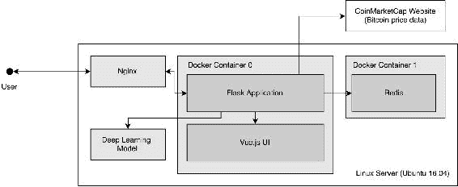

# 第 4 章产品化

本课程重点介绍如何*产品化*深度学习模型。 我们使用“产品化”一词来定义可被其他人和应用使用的深度学习模型创建的软件产品。

我们对在使用新数据时可用的模型，不断从新数据中学习模式并因此做出更好的预测的模型感兴趣。 我们研究了两种处理新数据的策略：一种重新训练现有模型，另一种创建全新模型。 然后，我们在比特币价格预测模型中实现后一种策略，以便它可以连续预测新的比特币价格。

本课程还提供了如何将模型部署为 Web 应用的练习。 在本课程结束时，我们将能够部署一个有效的 Web 应用（具有正常运行的 HTTP API）并将其修改为我们的核心内容。

由于其简单性和普遍性（毕竟，Web 应用非常普遍），我们以 Web 应用为例来说明如何部署深度学习模型，但是还有许多其他可能性。

# 课程目标

在本课程中，您将：

*   处理新数据
*   将模型部署为 Web 应用

# 处理新数据

可以在一组数据中训练模型，然后将其用于进行预测。 这样的静态模型可能非常有用，但是通常情况下，我们希望我们的模型不断从新数据中学习，并不断地不断改进。

在本节中，我们将讨论关于如何重新训练深度学习模型以及如何在 Python 中实现它们的两种策略。

## 分离数据和模型

构建深度学习应用时，两个最重要的领域是数据和模型。 从架构的角度来看，我们建议将这两个区域分开。 我们认为这是一个好建议，因为这些区域中的每个区域都包含固有地彼此分离的功能。 通常需要收集，清理，组织和规范化数据； 模型需要进行训练，评估并能够做出预测。 这两个领域都是相互依存的，但最好分开处理。

按照该建议，我们将使用两个类来帮助我们构建 Web 应用：`CoinMarketCap()`和`Model()`：

*   `CoinMarketCap()`：此是[用于从以下网站获取比特币价格的类](http://www.coinmarketcap.com)。 这就是我们原始比特币数据来自的地方。 通过此类，可以轻松地定期检索该数据，并返回带有已解析记录和所有可用历史数据的 Pandas 数据帧。 `CoinMarketCap()`是我们的数据组件。
*   `Model()`：此类将到目前为止已编写的所有代码实现为一个类。 该类提供了与我们先前训练的模型进行交互的工具，并且还允许使用非规范化数据进行预测，这更容易理解。 `Model()`类是我们的模型组件。

这两个类在我们的示例应用中得到了广泛使用，并定义了数据和模型组件。

### 数据组件

`CoinMarketCap()`类创建用于检索和解析数据的方法。 它包含一种相关方法`historic()`，以下代码中对其进行了详细说明：

```py
 @classmethod
 def historic(cls, start='2013-04-28', stop=None,
 ticker='bitcoin', return_json=False):

    start = start.replace('-', '')
    if not stop:
        stop = datetime.now().strftime('%Y%m%d')

    base_url = 'https://coinmarketcap.com/currencies'
    url = '/{}/historical-10\. data/?start={}&end={}'.format(ticker, start, 	    stop)
    r = requests.get(url)
```

> “代码段 1”：`CoinMarketCap()`类中的`historic()`方法。 此方法从 CoinMarketCap 网站收集数据，对其进行解析，然后返回 Pandas 数据帧。

`historic()`类返回一个 Pandas `DataFrame`，准备由`Model()`类使用。

当在其他模型中工作时，请考虑创建实现与`CoinMarketCap()`类相同功能的程序组件（例如 Python 类）。 也就是说，创建一个组件，该组件将从可用数据中获取数据，解析该数据，并以可用格式将其提供给您的建模组件。

`CoinMarketCap()`类使用参数`ticker`确定要收集的加密货币。 `CoinMarketCap`还有许多其他可用的加密货币，包括非常受欢迎的以太坊（`ethereum`）和比特币现金（`bitcoin-cash`）。 与使用本书中创建的比特币模型相比，使用`ticker`参数来更改加密货币并训练不同的模型。

#### 模型组件

在`Model()` 类中，我们实现了应用的模型组件。 此类包含五种方法，可实现本书中所有不同的建模主题。 这些是：

*   `build()`：使用 Keras 构建 LSTM 模型。 此函数用作手动创建的模型的简单包装。
*   `train()`：使用实例化类的数据训练模型。
*   `evaluate()`：使用一组损失函数对进行模型评估。
*   `save()`：将模型另存为本地文件。
*   `predict()`：进行并根据以周为单位的观测值的输入序列返回预测。

在本课程中，我们将使用这些方法来对我们的模型进行工作，训练，评估和发布预测。 `Model()`类是如何将基本 Keras 函数包装到 Web 应用中的示例。 前面的方法几乎与前面的课程完全一样，但是添加了语法糖以增强它们的接口。 例如，方法`train()`通过以下代码实现：

```py
 def train(self, data=None, epochs=300, verbose=0, batch_size=1):
    self.train_history = self.model.fit(
            x=self.X, y=self.Y,
            batch_size=batch_size, epochs=epochs,
            verbose=verbose, shuffle=False)

    self.last_trained = datetime.now().strftime('%Y-%m-%d %H:%M:%S')
    return self.train_history
```

> “代码段 2”：`Model()`类中的`train()`方法。 该方法使用来自`self.X`和`self.Y`的数据训练`self.model`中可用的模型。

在前面的代码片段中，您将注意到`train()`方法类似于“第 3 课”，“模型评估与优化”中“活动 6”和`7`的解决方案。 总体思路是，可以很容易地将 Keras 工作流程中的每个过程（构建或设计，训练，评估和预测）转变为程序的不同部分。 在我们的例子中，我们将它们变成可以从`Model()`类调用的方法。 这将组织我们的程序，并提供一系列约束（例如在模型架构或某些 API 参数上），以帮助我们在稳定的环境中部署模型。

在下一部分中，我们将探讨处理新数据的通用策略。

#### 处理新数据

机器学习模型（包括神经网络）的核心思想是它们可以从数据中学习模式。 想象一下，某个模型是使用某个数据集训练的，而现在它正在发布预测。 现在，假设有新数据可用。 我们可以采用什么策略，以便模型可以利用新获得的数据来学习新模式并改善其预测？

在此部分中，我们讨论两种策略：重新训练旧模型和训练新模型。

##### 重新训练旧模型

通过这种策略，我们用新数据重新训练了现有模型。 使用此策略，可以不断调整模型参数以适应新现象。 但是，后期训练期间使用的数据可能与其他较早的数据明显不同。 这种差异可能会导致模型参数发生重大变化，从而使其学习新模式而忘记旧模式。 这种现象通常称为*灾难性遗忘*。

### 注意

灾难性的遗忘是影响神经网络的常见现象。 深度学习研究人员多年来一直在努力解决这个问题。 DeepMind 是英国拥有的 Google 深度学习研究小组，在寻找解决方案方面取得了显着进步。 [《克服神经网络中的灾难性遗忘》](https://arxiv.org/pdf/1612.00796.pdf)是此类工作的很好参考。

首次用于训练的接口（`model.fit()`）可以用于训练新数据：

```py
   X_train_new, Y_train_new = load_new_data()

 model.fit(x=X_train_new, y=Y_train_new,
 batch_size=1, epochs=100,
 verbose=0)

```

> “代码段 3”：在我们的 LSTM 模型中实现 TensorBoard 回调的代码段

在 Keras 中，训练模型时，将保留其权重信息-这是模型的状态。 当使用`model.save()`方法时，该状态也被保存。 当调用方法`model.fit()`时，将使用先前的状态作为起点，使用新的数据集重新训练模型。

在典型的 Keras 模型中，可以毫无问题地使用此技术。 但是，在使用 LSTM 模型时，此技术有一个关键限制：训练数据和验证数据的形状必须相同。 例如，我们的 LSTM 模型（`bitcoin_lstm_v0`）使用 76 周来预测未来的一周。 如果我们尝试在接下来的一周内用 77 周的时间对网络进行训练，则该模型会引发一个异常，其中包含有关数据形状错误的信息。

解决此问题的一种方法是按模型期望的格式排列数据。 在我们的案例中，我们需要配置模型以使用 40 周来预测未来一周。 使用此解决方案，我们首先在 2017 年的前 40 周训练模型，然后在接下来的几周内继续对其进行训练，直到达到 50 周为止。我们使用`Model()`类在以下代码中执行此操作：

```py
  M = Model(data=model_data[0*7:7*40 + 7],
             variable='close',
             predicted_period_size=7)

  M.build()
  6   M.train()

  for i in range(1, 10 + 1):

M.train(model_data[i*7:7*(40 + i) + 7])

```

> 片段 4：实现再训练技术的片段

这项技术易于训练，并且在大序列中也可以很好地工作。 下一技术更易于实现，并且在较小的序列中效果很好。

###### 训练新模型

另一种策略是每当有新数据可用时创建并训练新模型。 这种方法倾向于减少灾难性的遗忘，但是训练时间会随着数据的增加而增加。 它的实现非常简单。

以比特币模型为例，现在假设我们有 2017 年 49 周的旧数据，而一周后就有新数据可用。 我们用以下引号中的变量`old_data`和`new_data`表示这一点：

```py
   	old_data = model_data[0*7:7*48 + 7]
   	new_data = model_data[0*7:7*49 + 7]

   	M = Model(data=old_data,
             variable='close',
             predicted_period_size=7)

   	M.build()
   	M.train()
 M = Model(data=new_data,
 variable='close',
 predicted_period_size=7)

 M.build()
 M.train()

```

> 片段 5：该片段实现了在有新数据时训练新模型的策略

这种方法实现起来非常简单，并且对于小型数据集而言效果很好。 这将是我们比特币价格预测应用的首选解决方案。

###### 活动 8 – 处理新数据

在此活动中，每当有新数据可用时，我们都会重新训练模型。

首先，我们从导入`cryptonic`开始。 Cryptonic 是为本书开发的简单软件应用，它使用 Python 类和模块实现了本节之前的所有步骤。 将 Cryptonic 视为开发相似应用的模板。

`cryptonic`作为 Python 模块随此活动一起提供。 首先，我们将启动 Jupyter 笔记本实例，然后将加载`cryptonic`包。

1.  在您的终端上使用，导航到目录`lesson_4/activity_8`，然后执行以下代码来启动 Jupyter 笔记本实例：

    ```py
    $ jupyter notebook
    ```

2.  在浏览器中打开应用提供的 URL，然后打开名为`Activity_8_Re_training_a_model_dynamically.ipynb`的 Jupyter 笔记本。

    现在，我们将从`cryptonic: Model()`和`CoinMarketCap()`加载这两个类。 这些类有助于操纵模型的过程以及从网站 [CoinMarketCap](https://coinmarketcap.com/) 获取数据的过程。

3.  在 Jupyter 笔记本实例中，导航至标题`Fetching Real-Time Data`。 现在，我们将从`CoinMarketCap`获取更新的历史数据。 只需调用方法：

    ```py
    $ historic_data = CoinMarketCap.historic()
    ```

    现在，变量`historic_data`填充有一个 Pandas 数据帧，其中包含截至今天或昨天的数据。 这很棒，可以在有更多数据时更容易地重新训练模型。

    数据实际上包含了与我们之前的数据集相同的变量。 但是，许多数据来自较早周期。 与几年前的价格相比，最近的比特币价格已经大幅波动。 在模型中使用此数据之前，请确保将其过滤为 2017 年 1 月 1 日之后的日期。

4.  使用 Pandas API，仅过滤 2017 年可用日期的数据：

    ```py
    $ model_data = # filter the dataset using pandas here
    ```

    您应该能够通过使用日期变量作为过滤索引来做到这一点。 在继续之前，请确保已过滤数据。

    类`Model()`编译到目前为止我们在所有活动中编写的所有代码。 在本活动中，我们将使用该类来构建，训练和评估我们的模型。

5.  使用`Model()`类，我们现在使用前面的过滤数据训练模型：

    ```py
    M = Model(data=model_data,
              variable='close',
              predicted_period_size=7)

    M.build()
    M.train()
    M.predict(denormalized=True)
    ```

    使用`Model()`类训练模型时，前面的步骤展示了完整的工作流程。

    ### 注意

    对于参考解决方案，请使用`Code/Lesson-4/activity_8`文件夹。

    接下来，我们将专注于每当有更多数据可用时就重新训练我们的模型。 这将网络的权重重新调整为新数据。

    为此，我们将模型配置为使用 40 周来预测一周。 现在，我们要使用剩下的 10 个完整星期来创建 40 个星期的重叠期间，一次包括这 10 个星期中的一个，并针对其中每个期间重新训练模型。

6.  导航到 Jupyter 笔记本中的标题`Re-Train Old Model`。 现在，使用索引将数据分成 7 天的重叠组，完成`range`函数和`model_data`过滤参数。 然后，重新训练我们的模型并收集结果：

    ```py
    results = []
    for i in range(A, B):
        M.train(model_data[C:D])
        results.append(M.evaluate())
    ```

    变量`A`，`B`，`C`和`D`是占位符。 使用整数可创建 7 天的重叠组，其中重叠为 1 天。

    重新训练模型后，继续并调用`M.predict(denormalized=True)`函数并欣赏结果。

    接下来，我们将专注于每当有新数据可用时创建和训练新模型。 为此，我们现在假设我们拥有 2017 年 49 周的旧数据，而一周之后，我们现在有了新数据。 我们用变量`old_data`和`new_data`来表示。

7.  导航至标题**训练新模型**，然后在变量`old_data`和`new_data`之间拆分数据：

    ```py
    old_data = model_data[0*7:7*48 + 7]
    new_data = model_data[0*7:7*49 + 7]
    ```

8.  然后，首先使用`old_data`训练模型：

    ```py
    M = Model(data=old_data,
              variable='close',
              predicted_period_size=7)
    M.build()
    M.train()
    ```

该策略是从头开始构建模型，并在有新数据可用时对其进行训练。 继续并在以下单元格中实现它。

现在，我们拥有了，以便动态地训练模型。 在下一部分中，我们将模型部署为 Web 应用，并通过 HTTP API 在浏览器中提供其预测。

在本部分中，我们了解了在有新数据可用时训练模型的两种策略：

*   重新训练旧模型
*   训练新模型

后者创建了一个新模型，该模型将使用完整的数据集进行训练，测试集中的观察结果除外。 前者在可用数据上训练模型一次，然后继续创建重叠的批量，以在每次有新数据可用时重新训练同一模型。

###### 将模型部署为 Web 应用

在此部分中，我们将模型部署为 Web 应用。 我们将使用一个名为`cryptonic`的示例 Web 应用来部署我们的模型，探索其架构，以便将来进行修改。 目的是让您将此应用用作更复杂应用的入门程序； 可以正常工作的启动器，可以根据需要扩展。

除了熟悉 Python 外，本主题还假定您熟悉创建 Web 应用。 具体来说，我们假设您对 Web 服务器，路由，HTTP 协议和缓存有所了解。 无需广泛了解这些主题，您就可以在本地部署演示的密码应用，但是学习这些主题将使将来的开发变得更加容易。

最后，使用 Docker 部署我们的 Web 应用，因此该技术的基础知识也很有用。

###### 应用架构和技术

为了部署我们的 Web 应用，我们将使用“表 1”中描述的工具和技术。 Flask 是关键，因为它有助于我们为模型创建 HTTP 接口，从而使我们能够访问 HTTP 端点（例如`/predict`）并以通用格式接收数据。 之所以使用其他组件，是因为它们是开发 Web 应用时的流行选择：

| 工具或技术 |  描述 |  角色 |
| --- | --- | --- |
| Docker | Docker 是一种用于处理以容器形式打包的应用的技术。 Docker 是一种越来越流行的用于构建 Web 应用的技术。 | 打包 Python 应用和 UI。 |
| Flask | Flask 是用于用 Python 构建 Web 应用的微框架。 | 创建应用路由。 |
| Vue.js | JavaScript 框架通过根据来自后端的数据输入在前端动态更改模板来工作。 | 呈现用户界面。 |
| Nginx | 可轻松配置 Web 服务器，以将流量路由到 Dockerized 应用并处理 HTTPS 连接的 SSL 证书。 | 在用户和 Flask 应用之间路由流量。 |
| Redis | 键值数据库。 由于其简单性和速度，它是实现缓存系统的流行选择。 | 缓存 API 请求。 |

> “表 1”：用于部署深度学习 Web 应用的工具和技术

这些组件组合在一起，如下图所示：



> 图 1：此项目中构建的 Web 应用的系统架构

用户使用他们的浏览器访问 Web 应用。 然后，该流量由 Nginx 路由到包含 Flask 应用的 Docker 容器（默认情况下，在端口`5000`上运行）。 Flask 应用已在启动时实例化了我们的比特币模型。 如果给出了模型，则无需训练即可使用该模型； 如果没有，它将创建一个新模型并使用 CoinMarketCap 的数据从头开始训练它。

准备好模型后，应用将验证请求是否已在 Redis 上缓存-如果是，它将返回缓存的数据。 如果不存在缓存，则它将继续进行并发布在 UI 中呈现的预测。

###### 部署和使用加密

`cryptonic`是作为 Docker 化应用开发的。 用 Docker 术语来说，意味着可以将应用构建为 Docker 镜像，然后在开发或生产环境中将其部署为 Docker 容器。

Docker 使用名为`Dockerfile`的文件来描述如何构建镜像的规则以及将该镜像作为容器部署时会发生什么。 以下代码提供了 Cryptonic 的 Dockerfile：

```py
  FROM python:3.6
  COPY . /cryptonic
  WORKDIR "/cryptonic"
  RUN pip install -r requirements.txt
  EXPOSE 5000
  CMD ["python", "run.py"]
```

> “代码段 7”：用于在本地构建 Docker 镜像的 Docker 命令

可以使用 Dockerfile 通过以下命令构建 Docker 镜像：

```py
  $ docker build --tag cryptonic:latest
```

此命令将使镜像`cryptonic:latest`可以部署为容器。 可以在生产服务器上重复构建过程，也可以直接部署镜像，然后将其作为容器运行。

生成镜像并可用后，可以使用命令`docker run`运行加密应用，如以下代码所示：

```py
  $ docker run --publish 5000:5000 \
               --detach cryptonic:latest
```

> 片段 8：在终端中执行`docker run`命令的示例

`--publish`标志将`localhost`上的端口`5000`绑定到 Docker 容器上的端口`5000`，并且`--detach`在后台将容器作为守护程序运行。

如果您训练了不同的模型，并且想用它代替训练新的模型，则可以更改`docker-compose.yml`上的`MODEL_NAME`环境变量，如代码段 9 所示。该变量应包含您已经训练并想要使用的模型的文件名（例如`bitcoin_lstm_v1_trained.h5`），它也应该是 Keras 模型。 如果这样做，请确保也将本地目录装载到`/models`文件夹中。 您决定挂载的目录必须具有模型文件。

`cryptonic`应用还包含许多环境变量，这些变量在部署自己的模型时可能会有用：

*   `MODEL_NAME`：允许提供经过训练的模型供应用使用。
*   `BITCOIN_START_DATE`：确定将哪一天用作比特币序列的开始日期。 近年来，比特币价格的波动性要比早期的波动大得多。 此参数仅将数据过滤到感兴趣的年份。 默认值为 2017 年 1 月 1 日。
*   `PERIOD_SIZE`：以天数设置周期大小。 默认值为`7`。
*   `EPOCHS`：配置模型在每次运行中训练的周期数。 默认值为`300`。

可以在`docker-compose.yml`文件中配置这些变量，如以下代码所示：

```py
 version: "3"
 services:
 cache:
 image: cryptonic-cache:latest
 volumes: - $PWD/cache_data:/data
 networks:- cryptonic
 ports: - "6379:6379"

 environment:
 - MODEL_NAME=bitcoin_lstm_v0_trained.h5
 - BITCOIN_START_DATE=2017-01-01
 - EPOCH=300
 - PERIOD_SIZE=7

```

> “代码段 9”：`docker-compose.yml`文件，包括环境变量

部署`cryptonic`的最简单方法是使用代码段 9 中的`docker-compose.yml`文件。此文件包含应用运行所必需的所有规范，包括有关如何与 Redis 缓存连接以及要使用的环境变量的说明。 导航到`docker-compose.yml`文件的位置后，可以使用命令`docker-compose up`启动`cryptonic`，如以下代码所示：

```py
$ docker-compose up -d
```

> “代码段 10”：使用`docker-compose`启动 Docker 应用。 标志`-d`在后台执行应用。

部署后，可以通过 Web 浏览器在端口`5000`上访问`cryptonic`。 该应用具有一个简单的用户界面，该用户界面带有一个时序图，描绘了真实的历史价格（换句话说，观察到的）和来自深度学习模型的预测未来价格（换句话说，预测的）。 您还可以在文本中读取使用`Model().evaluate()`方法计算出的 RMSE 和 MAPE：


图 2：已部署的加密应用的屏幕截图

除了其用户界面（使用 Vue.js 开发）外，该应用还具有 HTTP API，该 API 会在调用时进行预测。 该 API 具有端点`/predict`，该端点返回一个 JSON 对象，其中包含未来一周内非规范化的比特币价格预测：

```py
 {
    message: "API for making predictions.",
    period_length: 7,
    result: [
      15847.7,
      15289.36,
      17879.07,
…
      17877.23,
      17773.08
    ],
    success: true,
    version: 1
  }
```

> 片段 11：`/predict`端点的示例 JSON 输出

现在，应用可以部署在远程服务器中，并用于持续预测比特币价格。

###### 活动 9 – 部署深度学习应用

在此活动中，我们将模型作为本地 Web 应用部署。 这使我们可以使用浏览器连接到 Web 应用，或者通过应用的 HTTP API 使用另一个应用。 在继续之前，请确保您已经安装了以下应用，并且在计算机中可用：

*   Docker（社区版）17.12.0-ce 或更高版本
*   Docker Compose（`docker-compose`）1.18.0 或更高版本

可以从[以下网站](https://www.docker.com/)下载上述两个组件并将其安装在所有主要系统中。 这些对于完成此活动至关重要。 继续前进之前，请确保这些在系统中可用。

1.  在您的终端上，浏览至加密目录并为所有必需的组件构建 docker 镜像：

    ```py
    $ docker build --tag cryptonic:latest .
    $ docker build --tag cryptonic-cache:latest ./ cryptonic-cache/
    ```

2.  这两个命令构建了我们将在此应用中使用的两个镜像：密码（包含 Flask 应用）和密码缓存（包含 Redis 缓存）。
3.  生成图像后，识别`docker-compose.yml`文件并在文本编辑器中将其打开。 将参数`BITCOIN_START_DATE` 更改为 2017 年 1 月 1 日以外的日期：

    ```py
    BITCOIN_START_DATE = # Use other date here
    ```

4.  最后，使用`docker-compose`在本地部署 Web 应用，如下所示：

    ```py
    docker-compose up
    ```

    您应该在终端上看到活动日志，包括模型中的训练周期。

5.  训练完模型后，您可以在`http://localhost:5000`上访问您的应用，并在`http://localhost:5000/predict`上进行预测：

    

    > 图 3：本地部署的加密应用的屏幕快照

### 注意

对于参考解决方案，请使用`Code/Lesson-4/activity_9` 文件夹。

###### 总结

本课结束了我们创建深度学习模型并将其部署为 Web 应用的旅程。 我们的最后一步包括部署一个模型，该模型预测使用 Keras 和 TensorFlow 引擎构建的比特币价格。 我们通过将应用打包为 Docker 容器并进行部署来完成工作，以便其他人可以通过其 API 以及我们的模型使用模型的预测。

除了这项工作之外，您还了解到还有很多可以改进的地方。 我们的比特币模型只是模型可以做的事（尤其是 LSTM）的一个例子。 现在的挑战有两方面：随着时间的流逝，如何使该模型的表现更好？ 而且，可以将哪些功能添加到 Web 应用中以使模型更易于访问？ 祝你好运，继续学习！