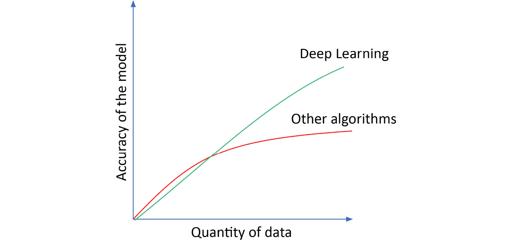
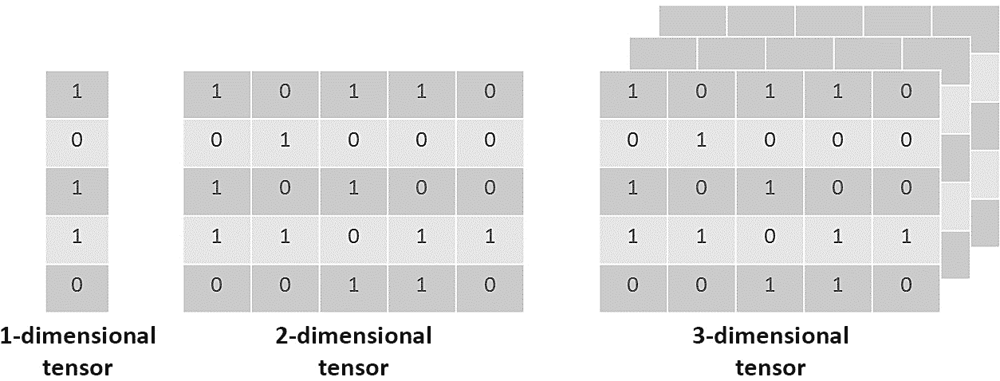
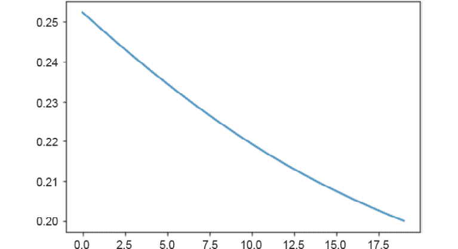

# 1.深度学习和 PyTorch 简介

总览

本章介绍了本书的两个主要主题：深度学习和 PyTorch。 在这里，您将能够探索深度学习的一些最受欢迎的应用程序，了解什么是 PyTorch，并使用 PyTorch 构建单层网络，这将是您将学习应用于现实生活的起点 数据问题。 在本章结束时，您将能够使用 PyTorch 的语法来构建神经网络，这在后续章节中将是必不可少的。

# 简介

深度学习是机器学习的子集，它专注于使用神经网络来解决复杂的数据问题。 如今，由于软件和硬件的进步使我们能够收集和处理大量数据（我们正在谈论数以亿计的条目），它变得越来越流行。 考虑到深度神经网络需要大量数据才能表现良好，这一点很重要。

深度学习的一些最著名的应用是自动驾驶汽车，流行的聊天机器人以及各种语音激活助手，这些将在本章中进一步说明。

PyTorch 于 2017 年推出，其主要特点是它使用**图形处理单元**（**GPU**）来使用“张量”处理数据。 这使算法可以高速运行，同时，它为用户提供了灵活性和标准语法，可以为许多数据问题获得最佳结果。 此外，PyTorch 使用动态计算图，使您可以随时随地更改网络。 本书使用 PyTorch 揭开了神经网络神秘面纱，并帮助您了解神经网络架构的复杂性。

# 为什么选择深度学习？

在本节中，我们将介绍深度学习的重要性及其普及的原因。

**深度学习**是机器学习的子集，它使用多层神经网络（大型神经网络），受人脑的生物结构启发，其中一层中的神经元接收一些输入数据，对其进行处理， 并将输出发送到下一层。 这些神经网络可以由成千上万个相互连接的节点（神经元）组成，大多数情况下组织在不同的层中，其中一个节点连接到上一层中的多个节点，从那里接收输入数据，还连接到上一层中的几个节点。 下一层，在处理完输出数据后，它将输出数据发送到下一层。

深度学习的普及是由于其准确率。 对于诸如**自然语言处理**（**NLP**）之类的复杂数据问题，它已达到比其他算法更高的准确度。 深度学习的出色表现能力已经达到了机器可以胜过人类的水平，例如在欺诈检测中。 深度学习模型不仅可以优化流程，而且可以提高其质量。 这意味着在诸如安全性之类的出于安全原因至关重要的革命性领域（例如自动驾驶汽车）的进步。

尽管神经网络在几十年前就已经理论化了，但神经网络最近变得流行有两个主要原因：

*   神经网络需要并实际上利用大量标记数据来实现最佳解决方案。 这意味着，要使用该算法创建出色的模型，就需要成千上万甚至上百万个条目，其中包含特征和目标值。 例如，关于猫的图像识别，您拥有的图像越多，该模型能够检测的功能就越多，这使其变得更好。

    注意

    标记数据是指包含一组功能（描述实例的特征）和目标值（要实现的值）的数据； 例如，包含人口统计和财务信息的数据集，其目标特征确定一个人的工资。

    下图显示了在数据量方面深度学习相对于其他算法的性能：



图 1.1：相对于其他算法的深度学习性能

如今，由于软件和硬件的进步使我们能够收集和处理这种粒度，这成为可能。

*   神经网络需要相当大的计算能力才能处理如此大量的数据，而无需花费数周（甚至更长）的时间来进行训练。 由于获得最佳模型的过程是基于反复试验的，因此有必要能够尽可能高效地运行训练过程。

    今天，这可以通过使用 GPU 来实现，它可以将神经网络的训练时间从数周缩短至数小时。

    注意

    为了加速深度学习，以便能够利用大量训练数据并构建最新模型，**现场可编程门阵列**（**FPGA**）和**张量处理单元**（**TPU**）正在由主要的云计算提供商开发，例如 AWS，Microsoft Azure 和 Google。

## 深度学习的应用

深度学习正在革新技术，并且已经在影响我们的生活。 深度学习可应用于各种情况，从医疗和安全（例如欺诈检测）目的到更琐碎的任务，例如为黑白图像着色或实时翻译文本。

深度学习的一些正在开发中或正在使用的应用包括：

*   **自动驾驶汽车**：诸如 Google 之类的多家公司一直在致力于开发部分或全部自动驾驶汽车，这些汽车通过使用数字传感器识别周围的物体来学习驾驶。
*   **医学诊断**：深度学习通过提高诸如脑和乳腺癌等绝症的诊断准确率，正在对该行业产生影响。 这是通过根据以前有或没有癌症的患者的标记 X 射线对新患者的 X 射线（或其他诊断影像机制）进行分类来完成的。
*   **语音助手**：由于各种语音激活的智能助手（例如 Apple 的 Siri，Google Home 和亚马逊的 Alexa）的激增，它可能是当今最受欢迎的应用程序之一。
*   **自动生成文本**：这意味着根据输入的句子生成新文本。 这通常用于电子邮件编写中，其中电子邮件提供者根据已编写的文本向用户建议接下来的几个单词。
*   **广告**：在商业世界中，深度学习通过瞄准合适的受众并制作更有效的广告来帮助提高广告系列的投资回报。 这样的一个例子是生成内容，以产生最新的和信息丰富的博客，以帮助吸引当前客户并吸引新客户。
*   **价格预测**：对于初学者来说，这是使用机器学习算法可以实现的典型示例。 价格预测包括根据实际数据训练模型。 例如，在房地产领域，这将包括提供具有房地产特征及其最终价格的模型，以便能够仅基于房地产特征来预测未来入场券的价格。

# PyTorch 简介

PyTorch 是一个开放源代码库，主要由 Facebook 的人工智能研究小组开发为 Python 版本的 Torch。

注意

Torch 是一个开放源代码，科学的计算框架，支持多种机器学习算法。

PyTorch 于 2017 年 1 月首次向公众发布。它使用 **GPU** 的功能来加速张量的计算，从而加快了复杂模型的训练时间。

该库具有 C++ 后端，并结合了 Torch 的深度学习框架，与具有许多深度学习功能的本机 Python 库相比，它可以提供更快的计算速度。 前端使用 Python，这有助于使其流行，从而使刚接触该库的数据科学家能够构建复杂的神经网络。 可以将 PyTorch 与其他流行的 Python 包一起使用。

尽管 PyTorch 相当新，但由于它是根据该领域许多专家的反馈开发的，因此迅速获得了普及。 这使得 PyTorch 成为对用户有用的库。

## PyTorch 中的 GPU

GPU 最初是为了加速图形渲染中的计算而开发的，尤其是对于视频游戏等。 但是，由于它们能够帮助加快任何领域的计算速度，包括深度学习计算，它们最近变得越来越受欢迎。

有几种平台可以将变量分配给计算机的 GPU，其中**计算统一设备架构**（**CUDA**）是最常用的平台之一。 CUDA 是 Nvidia 开发的计算平台，由于使用 GPU 来执行计算，因此可以加快计算密集型程序的速度。

在 PyTorch 中，可以通过使用`torch.cuda`包将变量分配给 CUDA，如以下代码片段所示：

```py
x = torch.Tensor(10).random_(0, 10)
x.to("cuda")
```

在这里，第一行代码创建了一个张量，该张量填充有随机整数（介于 0 和 10 之间）。 第二行代码将该张量分配给 CUDA，以便所有与该张量有关的计算都由 GPU 而不是 CPU 处理。 要将变量分配回 CPU，请使用以下代码片段：

```py
x.to("cpu")
```

在 CUDA 中，当解决深度学习数据问题时，优良作法是分配保存网络架构的模型以及输入数据。 这将确保在训练过程中执行的所有计算均由 GPU 处理。

但是，只有在您的计算机具有可用的 GPU 且您已将 CUDA 软件包安装了 PyTorch 的情况下，才能进行此分配。 要验证您是否能够在 CUDA 中分配变量，请使用以下代码段：

```py
torch.cuda.is_available()
```

如果前一行代码的输出为`True`，那么您都准备开始在 CUDA 中分配变量。

注意

要与 CUDA 软件包一起安装 PyTorch，请访问 PyTorch 的网站，[并确保选择包含 CUDA（两个版本）的选项](https://pytorch.org/get-started/locally/)。

## 什么是张量？

与 NumPy 相似，PyTorch 使用张量表示数据。 张量是`n`尺寸的矩阵状结构，不同之处在于 PyTorch 张量可以在 GPU 上运行（而 NumPy 张量不能），这有助于加速数值计算。 对于张量，尺寸也称为秩。 下图显示了不同尺寸的张量的直观表示：



图 1.2：不同尺寸张量的可视化表示

与矩阵相反，张量是包含在结构中的数学实体，可以与其他数学实体进行交互。 当一个张量转换另一个张量时，前者也进行自己的转换。

这意味着张量不仅是数据结构，而且是容器，当容器提供某些数据时，它们可以与其他张量以多线性方式映射。

类似于 NumPy 阵列或任何其他类似矩阵的结构，PyTorch 张量可以具有所需的任意多个尺寸。 可以使用以下代码片段在 PyTorch 中定义一维张量（`tensor_1`）和二维张量（`tensor_2`）：

```py
tensor_1 = torch.tensor([1,1,0,2])
tensor_2 = torch.tensor([[0,0,2,1,2],[1,0,2,2,0]])
```

请注意，前面的代码片段中的数字没有含义。 重要的是不同维度的定义，其中用随机数填充。 根据前面的代码段，第一个张量在一个维度上的大小为 4，而第二张量在两个维度中的每个维度的大小为 5，可以通过使用`shape`进行验证 张量变量的]属性，如下所示：

```py
tensor_1.shape
```

输出为`torch.Size([4])`。

```py
tensor_2.shape
```

输出为`torch.Size([2], [5])`。

使用支持 GPU 的计算机时，将进行以下修改以定义张量：

```py
tensor = torch.tensor([1,1,0,2]).cuda
```

使用 PyTorch 张量创建伪数据非常简单，类似于您在 NumPy 中执行的操作。 例如，`torch.randn()`返回一个用括号内指定尺寸的随机数填充的张量，而`torch.randint()`返回一个以整数填充的张量（最小 和最大值可以定义）括号内定义的尺寸：

注意

此处显示的代码段使用反斜杠（`\`）将逻辑划分为多行。 执行代码时，Python 将忽略反斜杠，并将下一行中的代码视为当前行的直接延续。

```py
example_1 = torch.randn(3,3)
example_2 = torch.randint(low=0, high=2, \
                          size=(3,3)).type(torch.FloatTensor)
```

可以看出，`example_1`是填充有随机数的二维张量，每个维的大小等于 3，而`example_2`是填充有 0，1 和 2 的二维张量（`high`参数是上限），每个尺寸的大小等于 3。

任何填充有整数的张量都必须转换为浮点数，以便我们可以将其馈送到任何 PyTorch 模型。

## 练习 1.01：使用 PyTorch 创建不同等级的张量

在本练习中，我们将使用 PyTorch 库创建秩为 1、2 和 3 的张量。 执行以下步骤以完成本练习：

注意

对于本章中的练习和活动，您将需要安装 Python 3.7，Jupyter 6.0，Matplotlib 3.1 和 PyTorch 1.3+（最好是 PyTorch 1.4，有或没有 CUDA）（如“前言”中的说明） ）。 它们将主要在 Jupyter 笔记本电脑中开发，建议您为不同的作业保留一个单独的笔记本电脑，除非建议不要这样做。

1.  导入名为`torch`的 PyTorch 库：

    ```py
    import torch
    ```

2.  创建以下等级的张量：`1`，`2`和`3`。

    使用`0`和`1`之间的值填充张量。 张量的大小可以根据您的需要进行定义，前提是正确创建了等级：

    ```py
    tensor_1 = torch.tensor([0.1,1,0.9,0.7,0.3])
    tensor_2 = torch.tensor([[0,0.2,0.4,0.6],[1,0.8,0.6,0.4]])
    tensor_3 = torch.tensor([[[0.3,0.6],[1,0]], \
                             [[0.3,0.6],[0,1]]])
    ```

    如果您的计算机具有可用的 GPU，则可以使用 GPU 语法创建等效张量：

    ```py
    tensor_1 = torch.tensor([0.1,1,0.9,0.7,0.3]).cuda()
    tensor_2 = torch.tensor([[0,0.2,0.4,0.6], \
                             [1,0.8,0.6,0.4]]).cuda()
    tensor_3 = torch.tensor([[[0.3,0.6],[1,0]], \
                             [[0.3,0.6],[0,1]]]).cuda()
    ```

3.  就像使用 NumPy 数组一样，使用`shape`属性输出每个张量的形状：

    ```py
    print(tensor_1.shape)
    print(tensor_2.shape)
    print(tensor_3.shape)
    ```

    考虑到张量每个维度的大小可能会根据您的选择而变化，因此`print`语句的输出应如下所示：

    ```py
    torch.Size([5])
    torch.Size([2, 4])
    torch.Size([2, 2, 2])
    ```

    注意

    要访问此特定部分的源代码，请参考[这里](https://packt.live/3dOS66H)。

    您也可以通过[这里](https://packt.live/2VwTLHq)在线运行此示例。 您必须执行整个笔记本才能获得所需的结果。

    要访问此源代码的 GPU 版本，请参考[这里](https://packt.live/31AwIzo)。 此版本的源代码无法作为在线交互示例使用，需要通过 GPU 设置在本地运行。

您已经成功创建了不同等级的张量。

在下一节中，我们将讨论使用 PyTorch 的优缺点。

## 使用 PyTorch 的优势

如今有几个库可用于开发深度学习解决方案，那么为什么要使用 PyTorch？ 答案是 PyTorch 是一个动态库，它允许用户极大的灵活性来开发可适应特定数据问题的复杂架构。

PyTorch 已被许多研究人员和人工智能开发人员采用，这使其成为机器学习工程师工具包中的重要工具。

要强调的关键方面如下：

*   **易于使用**：就 API 而言，PyTorch 具有简单的界面，可轻松开发和运行模型。 许多早期采用者认为它比 TensorFlow 等其他库更直观。
*   **速度**：使用 GPU 使该库的训练速度比其他深度学习库更快。 当必须测试不同的近似值以获得最佳的模型时，这特别有用。 此外，即使其他库也可以选择使用 GPU 加速计算，您也可以在 PyTorch 中通过键入几行简单的代码来实现。
*   **便利性**：PyTorch 灵活。 它使用动态计算图，使您可以随时随地更改网络。 由于易于对常规架构进行调整，因此在构建架构时还具有极大的灵活性。
*   **急切执行**：PyTorch 也是急切执行。 每行代码都是单独执行的，使您可以实时跟踪模型，并以方便的方式调试模型。
*   **预训练模型**：最后，它包含许多易于使用的预训练模型，它们是某些数据问题的一个很好的起点。

## 使用 PyTorch 的缺点

尽管优点很多，但仍然存在一些要考虑的缺点，在这里进行了说明：

*   **小型社区**：与其他库（例如 TensorFlow）相比，该库的适配器社区很小。 但是，它仅对公众开放了三年，今天，它已成为实施深度学习解决方案的最受欢迎的前五名图书馆之一，并且它的社区每天都在增长。
*   **参差不齐的文档**：与其他深度学习库相比，该库是一个相当新的文档，因此该文档并不完整。 但是，由于库的特性和功能正在增加，因此文档正在扩展。 此外，随着社区的不断发展，互联网上将提供更多信息。
*   **有关生产准备就绪的问题**：尽管有关该库的许多投诉都集中在无法将其部署到生产中，但在发布 1.0 版之后，该库包含了可以导出最终版本的生产能力 进行建模并在生产环境中使用它们。

## PyTorch 的关键元素

像任何其他库一样，PyTorch 具有用于开发不同功能的各种模块，库和包。 在本节中，将解释构建深度神经网络的三个最常用元素以及语法的简单示例。

### PyTorch autograd 库

`autograd`库由称为自动分化的技术组成。 其目的是通过数值计算函数的导数。 这对于我们将在下一章中学习的称为反向传播的概念至关重要，该概念是在训练神经网络时执行的。

元素的导数（也称为梯度）是指该元素在给定时间步长中的变化率。 在深度学习中，梯度是指维数和大小，其中必须在训练步骤中更新神经网络的参数，以最小化损失函数。 在下一章中将进一步探讨该概念。

注意

神经网络的详细解释和训练模型所采取的不同步骤将在后续章节中给出。

要计算梯度，只需调用`backward()`函数，如下所示：

```py
a = torch.tensor([5.0, 3.0], requires_grad=True)
b = torch.tensor([1.0, 4.0])
ab = ((a + b) ** 2).sum()
ab.backward()
```

在前面的代码中，创建了两个张量。 我们在这里使用`require_grad`参数来告诉 PyTorch 计算该张量的梯度。 但是，在构建神经网络时，不需要此参数。

接下来，使用两个张量的值定义一个函数。 最后，使用`backward()`函数来计算梯度。

通过打印`a`和`b`的梯度，可以确认仅对第一个变量（`a`）计算梯度，而对第二个梯度进行计算 一个（`b`），则会引发错误：

```py
print(a.grad.data)
```

输出为`Tensor([12., 14.])`。

```py
print(b.grad.data)
```

输出如下：

```py
AttributeError: 'NoneType' object has no attribute 'data'
```

### PyTorch nn 模块

考虑到已经解决了棘手的部分（梯度的计算），仅`autograd`库可用于构建简单的神经网络。 但是，这种方法可能很麻烦，因此引入了`nn`模块。

`nn`模块是一个完整的 PyTorch 模块，用于创建和训练神经网络，该神经网络通过使用不同的元素，可以进行简单而复杂的开发。 例如，`Sequential()`容器可轻松创建遵循一系列预定义模块（或层）的网络架构，而无需太多的定义网络架构的知识。

注意

在随后的章节中将进一步解释可用于每种神经网络架构的不同层。

该模块还具有定义损失函数以评估模型的能力，以及将在本书中讨论的许多更高级的功能。

只需几行就可以完成将神经网络架构构建为一系列预定义模块的过程，如下所示：

```py
import torch.nn as nn
model = nn.Sequential(nn.Linear(input_units, hidden_units), \
                      nn.ReLU(), \
                      nn.Linear(hidden_units, output_units), \
                      nn.Sigmoid())
loss_funct = nn.MSELoss()
```

首先，导入模块。 然后，定义模型架构。 `input_units`表示输入数据包含的要素数量，`hidden_​​units`表示隐藏层的节点数量， `output_units`表示 输出层的节点。

从前面的代码中可以看出，网络的架构包含一个隐藏层，其后是 ReLU 激活函数和一个输出层，然后是一个 S 型激活函数，从而使其成为两层网络。

最后，损失函数定义为**均方误差**（**MSE**）。

注意

本书将介绍针对不同数据问题的最流行的损失函数。

要创建不遵循现有模块顺序的模型，请使用**自定义**`nn`模块。 我们将在本书后面介绍这些内容。

## 练习 1.02：定义单层架构

在本练习中，我们将使用 PyTorch 的`nn`模块为单层神经网络定义模型，并定义损失函数以评估模型。 这将是起点，以便您能够构建更复杂的网络架构来解决实际数据问题。 执行以下步骤以完成本练习：

1.  从 PyTorch 导入`torch`和`nn`模块：

    ```py
    import torch
    import torch.nn as nn
    ```

    注意

    本练习中使用`torch.manual_seed(0)`，以确保在本书的 GitHub 存储库中获得的结果具有可重复性。 但是，在出于其他目的训练网络时，不得定义种子。

    要了解有关 PyTorch 中种子的更多信息，请访问[这里](https://pytorch.org/docs/stable/notes/randomness.html)。

2.  定义输入数据的特征数为`10`（`input_units`），输出层的节点数为`1`（`output_units`）。

    ```py
    input_units = 10
    output_units = 1
    ```

3.  使用`Sequential()`容器，定义单层网络体系结构并将其存储在名为`model`的变量中。 确保定义一层，然后定义`Sigmoid`激活函数：

    ```py
    model = nn.Sequential(nn.Linear(input_units, output_units), \
                          nn.Sigmoid())
    ```

4.  打印模型以验证是否已相应创建：

    ```py
    print(model)
    ```

    在前面的代码段中显示的 将显示以下输出：

    ```py
    Sequential(
      (0): Linear(in_features=10, out_features=1, bias=True)
      (1): Sigmoid()
    )
    ```

5.  将损失函数定义为 MSE 并将其存储在名为`loss_funct`的变量中：

    ```py
    loss_funct = nn.MSELoss()
    ```

6.  打印损失函数以验证是否已相应创建：

    ```py
    print(loss_funct)
    ```

    运行前面的代码片段将显示以下输出：

    ```py
    MSELoss()
    ```

    注意

    要访问此特定部分的源代码，请参考[这里](https://packt.live/2YNwyTy)。

    您也可以通过[这里](https://packt.live/2YOVPws)在线运行此示例。 您必须执行整个笔记本才能获得所需的结果。

您已经成功定义了单层网络架构。

### PyTorch 优化软件包

`optim`程序包用于定义优化器，该优化器将使用`autograd`计算出的梯度来更新每次迭代中的参数（将在以下各章中进一步说明）。 模块。 在这里，可以从可用的不同优化算法中进行选择，例如 **Adam**，**随机梯度下降**（**SGD**）和**均方根传播**（**RMSprop**）等。

注意

后续章节将介绍最流行的优化算法。

要设置要使用的优化程序，在导入软件包后，以下代码行就足够了：

```py
optimizer = torch.optim.SGD(model.parameters(), lr=0.01)
```

在此，`model.parameters()`参数是指先前创建的模型的权重和偏差，而`lr`是指学习率，该学习率已设置为`0.01`。

权重是用于确定一般情况下某些信息的重要性级别的值。 这意味着信息的每一位对于网络中的每个神经元都有相应的权重。 此外，偏差类似于添加到线性函数中的拦截元素，用于调整给定神经元中相关性计算的输出。

学习率是一个运行参数，在优化过程中用于确定为使损失函数最小化而应采取的步骤的程度。

接下来，此处显示了运行 100 次迭代的优化过程，如您所见，它使用`nn`模块创建的模型以及`autograd`库计算出的梯度 ：

注意

以下代码段中的`#`符号表示代码注释。 注释已添加到代码中，以帮助解释特定的逻辑位。 下面的代码片段中的三引号（`"""`）用来表示多行代码注释的起点和终点。在代码中添加了注释，以帮助解释特定的逻辑位 。

```py
for i in range(100):
    # Call to the model to perform a prediction
    y_pred = model(x)
    # Calculation of loss function based on y_pred and y
    loss = loss_funct(y_pred, y)
    # Zero the gradients so that previous ones don't accumulate
    optimizer.zero_grad()
    # Calculate the gradients of the loss function
    loss.backward()
    """
    Call to the optimizer to perform an update
    of the parameters
    """
    optimizer.step()
```

对于每次迭代，调用模型以获得预测（`y_pred`）。 该预测和地面真实值（`y`）被馈送到损失函数，以确定模型逼近地面真实的能力。

接下来，将梯度归零，并使用`backward()`函数计算损失函数的梯度。

最后，调用`step()`函数，以基于优化算法和先前计算的梯度来更新权重和偏差。

## 练习 1.03：训练神经网络

注意

对于本练习，请使用与上一个练习相同的 Jupyter Notebook（*练习 1.02* ，*定义单层架构*）。

在本练习中，我们将使用 PyTorch 的`optim`包，学习如何从上一练习中训练单层网络。 考虑到我们将使用虚拟数据作为输入，训练网络不会解决数据问题，但是将其用于学习目的。 执行以下步骤以完成本练习：

1.  导入`torch`、PyTorch 的`optim`包和`matplotlib`。

    ```py
    import torch
    import torch.optim as optim
    import matplotlib.pyplot as plt
    ```

2.  创建随机值的虚拟输入数据（`x`）和仅包含零和一的虚拟目标数据（`y`）。 张量`x`的大小应为`(20, 10)`，而`y`的大小应为`(20, 1)`：
    ```py
    x = torch.randn(20,10)
    y = torch.randint(0,2, (20,1)).type(torch.FloatTensor)
    ```

3.  将优化算法定义为 Adam 优化器。 将学习率设置为等于 0.01：

    ```py
    optimizer = optim.Adam(model.parameters(), lr=0.01)
    ```

4.  运行优化 20 次迭代，将损失值保存在变量中。 每五次迭代，输出损失值：

    ```py
    losses = []
    for i in range(20):
        y_pred = model(x)
        loss = loss_funct(y_pred, y)
        losses.append(loss.item())
        optimizer.zero_grad()
        loss.backward()
        optimizer.step()
        if i%5 == 0:
            print(i, loss.item())
    ```

    输出应如下所示：

    ```py
    0 0.25244325399398804
    5 0.23448510468006134
    10 0.21932794153690338
    15 0.20741790533065796
    ```

    前面的输出显示纪元号以及损失函数的值，可以看出，该函数正在减小。 这意味着训练过程使损失函数最小化，这意味着模型能够理解输入特征和目标之间的关系。

5.  绘制线图以显示每个时期的损失函数的值：

    ```py
    plt.plot(range(0,20), losses)
    plt.show()
    ```

    输出应如下所示：



图 1.3：损失函数被最小化

如您所见，损失函数已被最小化。

注意

要访问此特定部分的源代码，请参考[这里](https://packt.live/2NJrPfd)。

您也可以通过[这里](https://packt.live/2BTnXWw)在线运行此示例。 您必须执行整个笔记本才能获得所需的结果。

这样，您就成功地训练了单层神经网络。

## 活动 1.01：创建单层神经网络

对于此活动，我们将创建一个单层神经网络，这将是我们在以后的活动中创建深度神经网络的起点。 让我们看一下以下情况。

您是萨默维尔市市长的助理，人事部门要求您建立一个模型，该模型能够根据人们对本市服务的满意度来预测人们对当前政府是否满意。 为此，您已经决定使用 PyTorch 并根据之前的调查结果构建一个单层神经网络。 执行以下步骤以完成此活动：

注意

用于此活动的数据集来自 UC Irvine 机器学习存储库，[该存储库可使用以下 URL 从**数据文件夹**超链接中下载](https://archive.ics.uci.edu/ml/datasets/Somerville+Happiness+Survey)。 [也可以在本书的 GitHub 存储库中找到它](https://packt.live/38gzpr5)。

1.  导入所需的库，包括用于读取 CSV 文件的熊猫。
2.  读取包含数据集的 CSV 文件。

    注意

    建议使用熊猫的`read_csv`函数加载 CSV 文件。 要了解有关此功能的更多信息，请访问[这里](https://pandas.pydata.org/pandas-docs/stable/reference/api/pandas.read_csv.html)。

3.  将输入特征与目标分开。 请注意，目标位于 CSV 文件的第一列中。 接下来，将值转换为张量，确保将值转换为浮点数。

    注意

    要切片 pandas DataFrame，请使用 pandas 的`iloc`方法。 要了解有关此方法的更多信息，请访问[这里](https://pandas.pydata.org/pandas-docs/stable/reference/api/pandas.DataFrame.iloc.html)。

4.  定义模型的架构，并将其存储在名为`model`的变量中。 记住要创建一个单层模型。
5.  定义要使用的损失函数。 在这种情况下，请使用 MSE 损失功能。
6.  定义模型的优化器。 在这种情况下，请使用 Adam 优化器，并将学习率设为`0.01`。
7.  对 100 次迭代运行优化，保存每次迭代的损失值。 每 10 次迭代打印一次损失值。
8.  绘制线图以显示每个迭代步骤的损耗值。

    注意

    有关此活动的解决方案，请参阅第 236 页。

# 总结

深度学习是机器学习的一个子集，其灵感来自人脑的生物结构。 它使用深度神经网络通过使用大量数据来解决复杂的数据问题。 尽管该理论是数十年前开发的，但由于硬件和软件的进步使我们能够收集和处理数百万条数据，因此该理论最近得到了使用。

随着深度学习解决方案的普及，已经开发了许多深度学习库。 其中，最新的一种是 PyTorch。 PyTorch 使用 C++ 后端，这有助于加快计算速度，同时具有 Python 前端，以使该库易于使用。

它使用张量存储数据，这些数据是 n 阶矩阵状结构，可以在 GPU 上运行以加快处理速度。 它提供了三个主要元素，这些元素对于创建复杂的神经网络架构非常有用。

`autograd`库可以计算函数的导数，这些导数用作优化模型权重和偏差的梯度。 此外，`nn`模块可帮助您轻松地将模型的架构定义为一系列预定义的模块，并确定用于测量模型的损失函数。 最后，考虑到先前计算的梯度，`optim`包用于选择用于更新参数的优化算法。

在下一章中，我们将学习神经网络的构建块。 我们将介绍三种类型的学习过程以及三种最常见的神经网络类型。 对于每个神经网络，我们将学习网络架构的结构以及训练过程的工作方式。 最后，我们将了解数据准备的重要性并解决回归数据问题。