# 2.神经网络的构建块

概述

本章介绍了神经网络的主要组成部分，并解释了当今的三种主要神经网络架构。 此外，它解释了训练任何人工智能模型之前数据准备的重要性，并最终解释了解决回归数据问题的过程。 在本章的最后，您将牢固地掌握不同网络架构及其不同应用的学习过程。

# 简介

在上一章中，已经解释了为什么深度学习如今变得如此流行，并且 PyTorch 被介绍为开发深度学习解决方案的最受欢迎的库之一。 尽管已解释了使用 PyTorch 构建神经网络的主要语法，但在本章中，我们将进一步探讨神经网络的概念。

尽管神经网络理论是在几十年前发展起来的，但是自从感知器概念演变成神经网络理论以来，最近就已经创建了不同的架构来解决不同的数据问题。 这部分是由于在现实生活中的数据问题（例如文本，音频和图像）中可以找到不同的数据格式。

本章的目的是深入探讨神经网络及其主要优点和缺点的主题，以便您了解何时以及如何使用它们。 然后，我们将解释最流行的神经网络架构的构建块：**人工神经网络**（**ANN**），**卷积神经网络**（**CNN**）和**循环神经网络**（**RNN**）。

接下来，将通过解决现实生活中的回归问题来说明建立有效模型的过程。 这包括准备要馈送到神经网络的数据（也称为数据预处理），定义要使用的神经网络架构以及评估模型的表现，目的是确定如何对其进行改进以实现最佳表现。 最佳解决方案。

上述过程将使用将在本章中讨论的一种神经网络架构来完成，同时考虑到每个数据问题的解决方案应使用对所讨论的数据类型表现最佳的架构进行。 其他架构将在后续章节中使用，以解决更复杂的数据问题，这些问题涉及使用图像和文本序列作为输入数据。

注意

[本章中提供的所有代码都可以在以下位置找到](https://packt.live/34MBauE)。

# 神经网络介绍

神经网络从训练数据中学习，而不是通过遵循一组规则进行编程来解决特定任务。 此学习过程可以遵循以下方法之一：

*   **监督学习**：这是最简单的学习形式，因为它包含一个标记的数据集，其中神经网络会找到解释特征和目标之间关系的模式。 学习过程中的迭代旨在最小化预测值和基本事实之间的差异。 一个例子是根据植物的叶子属性对植物进行分类。
*   **无监督学习**：与前面的方法相反，无监督学习包括使用未标记数据（意味着没有目标值）训练模型。 这样做的目的是为了更好地理解输入数据。 通常，网络获取输入数据，对其进行编码，然后从编码版本中重建内容，理想情况下保留相关信息。 例如，给定一个段落，神经网络可以映射单词，然后建议哪个单词对该段落最重要或最具描述性。 然后可以将它们用作标签。
*   **强化学习**：这种方法包括从输入数据中学习，其主要目标是从长远来看最大化奖励函数。 这是通过从传入的数据中学习来实现的，而不是通过对静态数据进行训练（如在监督式学习中）来实现的。 因此，决策不是基于即时奖励，而是基于整个学习过程中累积的奖励。 这样的一个示例是一个模型，该模型将资源分配给不同的任务，其目的是最大程度地减少使总体表现变慢的瓶颈。

    注意

    从我们在这里提到的学习方法中，最常用的一种是有监督的学习，这将主要在后续部分中使用。 这意味着本章中的所有练习，活动和示例都将使用标记的数据集作为输入数据。

## 什么是神经网络？

正如我们之前所讨论的，神经网络是一种机器学习算法，它以人脑的解剖结构为模型，并使用数学方程式从训练数据得出的观察结果中学习模式。

但是，要真正理解神经网络通常遵循的训练过程背后的逻辑，重要的是要了解感知器的概念。

感知器由弗兰克·罗森布拉特（Frank Rosenblatt）在 1950 年代开发，是一种人造神经元，它需要多个输入并产生二进制输出，类似于人脑中的神经元。 然后，这成为后续感知器（神经元）的输入。 感知器是神经网络的基本组成部分（就像神经元是人脑的组成部分一样）：


图 2.1：感知器图

在这里，`X1`，`X2`，`X3`和`X4`代表感知器的不同输入，并且这些可能是任何数字。 圆是感知器，在该处处理输入以达到输出。

Rosenblatt 还介绍了权重的概念（`w1`，`w2`，...，`wn`），这些数字表示每个输入的重要性。 输出可以是 0 或 1，并且取决于输入的加权总和是高于还是低于给定阈值（由开发人员设置的数值限制或由数据问题的约束设置），该阈值可以设置为感知器的参数，如下所示：


图 2.2：感知器输出方程

## 练习 2.01：执行感知器的计算

以下练习不需要任何编程。 相反，它由简单的计算组成，可帮助您理解感知器的概念。 要执行这些计算，请考虑以下情形。

下个星期五在您的镇上有一个音乐节，但是您生病了，想决定是否要去（0 表示您不参加，1 表示您要参加）。 您的决定取决于三个因素：

*   天气会好吗？ （`X1`）
*   你要和谁一起去？ （`X2`）
*   音乐是您喜欢的吗？ （`X3`）

对于前面的因素，如果问题的答案为是，则将使用 1，如果答案为否，则将使用 0。 此外，由于您病得很重，因此与天气相关的因素非常重要，因此您决定赋予该因素比其他两个因素大两倍的权重。 因此，您决定因素的权重将为 4（`w1`），2（`w2`）和 2（`w3`）。 现在，考虑阈值 5：

1.  考虑到下周五的天气不好，但是您要和某人一起去，并且您喜欢音乐节上的音乐，请根据提供的信息来计算感知器的输出：


图 2.3：感知器的输出

考虑到输出小于阈值，最终结果将等于 0，这意味着您不应该参加音乐节以避免生病的风险。

您已经成功执行了感知器的计算，这是了解神经网络内部学习过程的起点。

## 多层感知器

考虑到我们在上一节中学到的知识，多层网络的概念由堆叠在一起的多个感知器（也称为节点或神经元）组成的网络组成，如下所示：

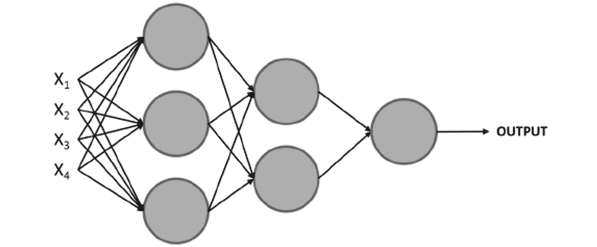

图 2.4：多层感知器图

注意

在神经网络中引用层的常规方法如下：

第一层是输入层，最后一层是输出层，中间的所有层都是隐藏层。

在这里，再次使用一组输入来训练模型，但是不是馈入单个感知器，而是将它们馈入第一层中的所有感知器（神经元）。 接下来，将从这一层获得的输出用作后续层中的感知器的输入，依此类推，直到到达最后一层为止，该层负责输出结果。

请注意，感知器的第一层通过对输入进行加权来处理简单的决策过程，而下一层可以根据前一层的输出来处理更复杂和抽象的决策，从而实现最新的表现。 复杂数据问题的深度神经网络（使用多层的网络）。

与传统的感知器不同，神经网络已经演化为在输出层中具有一个或多个节点，因此它们能够将结果呈现为二进制或多类。

## 神经网络的学习过程

一般而言，神经网络由多个神经元组成，其中每个神经元都会计算线性函数以及激活函数，以根据某些输入得出输出（激活函数旨在打破线性关系，稍后在本章中有更详细的说明）。 该输出与权重相关联，该权重代表其重要性级别，并将在下一层中用于计算。

而且，这些计算是在整个网络架构中进行的，直到达到最终输出为止。 与地面实况相比，此输出用于确定网络的表现，然后将其用于调整网络的不同参数以重新开始计算过程。

考虑到这一点，神经网络的训练过程可以看作是迭代过程，该过程在网络的各个层中前进和后退以达到最佳结果，如下图所示（损失函数将在后面介绍） 在这一章当中）：

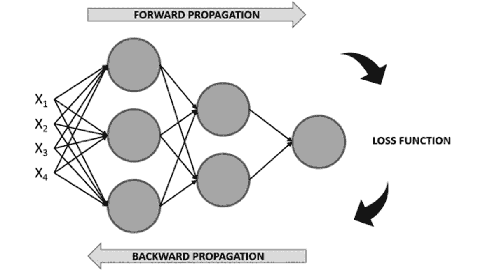

图 2.5：神经网络的学习过程图

### 正向传播

这是从左到右遍历网络架构的过程，同时使用输入数据执行计算以得出可以与基本事实进行比较的预测。 这意味着网络中的每个神经元都会根据与之关联的权重和偏差来转换输入数据（初始数据或从上一层接收的数据），并将输出发送到下一层，直到达到最后一层并做出预测。

注意

在神经网络中，偏差是帮助移动每个神经元的激活函数的数值，以避免可能影响训练过程的零值。 它们在神经网络训练中的作用将在本章后面解释。

在每个神经元中执行的计算都包括一个线性函数，该函数会将输入数据乘以某个权重再加上一个偏差，然后将其传递给激活函数。 激活函数的主要目的是打破模型的线性，这是至关重要的，因为考虑到使用神经网络解决的大多数实际数据问题不是由一条线定义，而是由一个复杂的函数定义。 这些公式如下：


图 2.6：每个神经元执行的计算

在这里，如前所述，`X`是指输入数据，`W`是确定输入数据重要程度的权重，`b`是偏置值和 sigma（`σ`）表示应用于线性函数的激活函数。

激活函数的目的是将非线性引入模型。 有不同的激活函数可供选择，当今最常用的激活函数列表如下：

*   **Sigmoid**：这是 Sigmoid，它基本上将值转换为 0 到 1 之间的简单概率，其中通过 Sigmoid 函数获得的大多数输出​​将接近 0 和 1 的极限。


图 2.7：Sigmoid激活函数

下图显示了 Sigmoid 激活函数的图形表示：

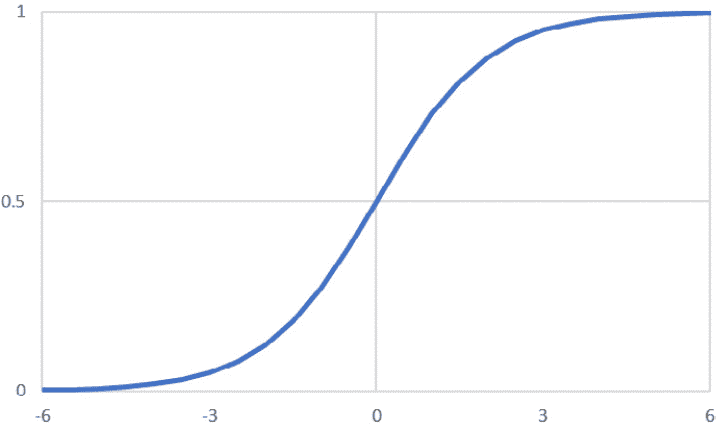

图 2.8：Sigmoid 激活函数的图形表示

*   **Softmax**：类似于 Sigmoid 函数，它计算`n`个事件的事件概率分布，这意味着其输出不是二进制的。 简而言之，此函数将计算输出与其他类别相比是目标类别之一的概率：


图 2.9：Softmax 激活函数

考虑到其输出是概率，因此通常在分类网络的输出层中找到此激活函数。

*   **Tanh**：此函数表示双曲正弦和双曲余弦之间的关系，结果介于 -1 和 1 之间。此激活函数的主要优点是可以更轻松地处理负值：


图 2.10：Tanh 激活函数

下图显示了 **tanh** 激活函数的图形表示：

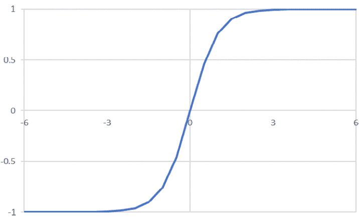

图 2.11：tanh 激活函数的图形表示

*   **整流线性函数（ReLU）**：如果线性函数的输出大于 0，则这基本上激活了一个节点； 否则，其输出将为 0。如果线性函数的输出大于 0，则此激活函数的结果将是其作为输入接收的原始数字：


图 2.12：ReLU 激活函数

按照惯例，此激活函数用于所有隐藏层。 我们将在本章的后续部分中了解有关隐藏层的更多信息。 下图显示了 ReLU 激活函数的图形表示：

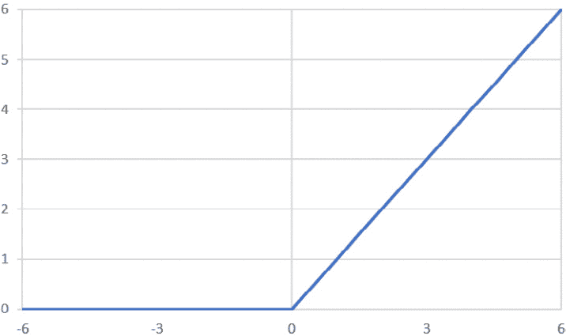

图 2.13：ReLU 激活函数的图形表示

### 损失函数的计算

一旦正向传播完成，训练过程的下一步就是计算损失函数，以通过比较预测相对于真实情况值的好坏来估计模型的误差。 考虑到这一点，要达到的理想值为 0，这意味着两个值之间没有差异。

这意味着训练过程的每次迭代的目标是通过更改在正向传播过程中用于执行计算的参数（权重和偏差）来最小化损失函数。

同样，有多种损失函数可供选择。 但是，用于回归和分类任务的最常用损失函数如下：

*   **均方误差（MSE）**：MSE 函数广泛用于衡量回归模型的表现，它计算真实情况值与预测值之间的距离之和：


图 2.14：MSE 损失函数

此处，`n`是指样本数，`y[i]`是基本真值，`y_hat[i]`是预测值。

*   **交叉熵/多类交叉熵**：此函数通常用于二进制或多类分类模型。 它测量两个概率分布之间的差异； 较大的损失函数将表示较大的差异。 因此，这里的目标是使损失函数最小化：


图 2.15：交叉熵损失函数

同样，`n`是指样本数。 `y[i]`和`y_hat[i]`分别是基本事实和预测值。

### 反向传播

训练过程的最后一步包括在网络架构中从右向左移动以计算损失函数相对于每一层的权重和偏差的偏导数（也称为梯度），以便更新这些参数（权重和偏差），以便在下一个迭代步骤中，损失函数较低。

优化算法的最终目标是找到损失函数达到最小可能值的全局最小值，如下图所示：

注意

局部最小值是指函数域的一部分内的最小值。 另一方面，全局最小值是指函数整个域的最小值。

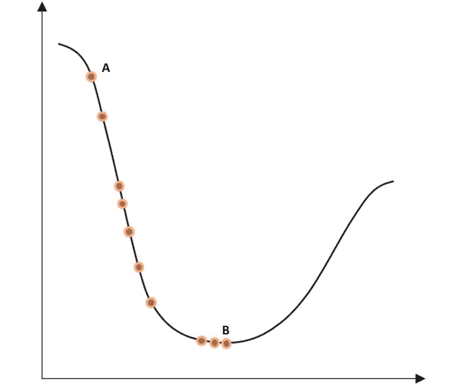

图 2.16：二维空间中迭代步骤的损失函数优化

在此，最左边的点`A`是任何优化之前的损失函数的初始值。 曲线底部最右边的点`B`是经过多次迭代步骤后的损失函数，其值已最小化。 从一个点到另一个点的过程称为**步骤**。

但是，重要的是要提到损失函数并不总是像前面的函数那样平滑，这可能会带来在优化过程中达到局部最小值的风险。

此过程也称为优化，并且有不同的算法在实现相同目标的方法上有所不同。 接下来将解释最常用的优化算法。

### 梯度下降

梯度下降是数据科学家中使用最广泛的优化算法，它是许多其他优化算法的基础。 计算完每个神经元的梯度后，权重和偏差会沿梯度的相反方向更新，应将其乘以学习率（用于控制每次优化中所采取步骤的大小），例如以下等式。

学习率在训练过程中至关重要，因为它防止权重和过冲/下冲偏差的更新，这可能会阻止模型分别收敛或延迟训练过程。

梯度下降算法中权重和偏差的优化如下：


图 2.17：梯度下降算法中的参数优化

此处，`α`是指学习率，`dw / db`表示给定神经元中权重或偏差的梯度。 从权重或偏差的原始值中减去两个值的乘积，以惩罚较高的值，这有助于计算较大的损失函数。

梯度下降算法的一种改进版本称为随机梯度下降，它基本上遵循相同的过程，区别在于它以随机批量而不是一个块的形式获取输入数据，从而缩短了训练时间，同时达到了出色的表现。 此外，此方法允许使用较大的数据集，因为通过将小批数据集用作输入，我们不再受计算资源的限制。

## 优缺点

以下是对神经网络的优缺点的解释。

### 优势

在最近几年中，神经网络变得越来越流行，其原因有四个：

*   **数据**：神经网络以利用大量数据的能力而广为人知，并且由于硬件和软件的进步，现在可以收集和存储海量数据库。 随着更多数据输入到神经网络中，这使神经网络能够显示其真正的潜力。
*   **复杂数据问题**：如前所述，神经网络非常适合解决其他机器学习算法无法解决的复杂数据问题。 这主要是由于它们具有处理大型数据集和发现复杂模式的能力。
*   **计算能力**：技术的进步也增加了当今可用的计算能力，这对于训练使用数百万条数据的神经网络模型至关重要。
*   **学术研究**：由于前面的三点，有关此主题的学术研究在互联网上得以广泛传播，这不仅促进了每天新研究的浸入，而且还有助于保持算法和硬件 /最新的软件要求。

### 劣势

仅仅因为使用神经网络有很多优点，并不意味着每个数据问题都应该以这种方式解决。 这是一个常见的错误。 没有一种算法可以很好地解决所有数据问题，并且选择使用哪种算法应取决于可用的资源以及数据问题。

尽管人们认为神经网络的表现优于几乎所有机器学习算法，但也必须考虑它们的缺点，以便您可以权衡最重要的数据问题。 让我们现在通过它们：

*   **黑盒**：这是神经网络最常见的缺点之一。 从根本上讲，尚不清楚神经网络如何以及为什么达到特定输出。 例如，当神经网络错误地将猫的图片预测为狗时，就不可能知道错误的原因是什么。
*   **数据要求**：为获得最佳结果而需要的大量数据可能是同一个优点和缺点。 神经网络比传统的机器学习算法需要更多的数据，这可能是在某些数据问题和其他算法之间进行选择的主要原因。 当监督手头的任务时，这将成为一个更大的问题，这意味着需要对数据进行标记。
*   **训练时间**：由于上述缺点，对大量数据的需求也使训练过程比传统的机器学习算法持续时间更长，在某些情况下，这是不可行的。 使用 GPU 可以减少训练时间，从而加快计算速度。
*   **计算上非常昂贵**：同样，神经网络的训练过程在计算上也很昂贵。 虽然一个神经网络可能需要花费数周的时间才能收敛，但其他机器学习算法却可能需要数小时或数分钟才能得到训练。 所需的计算资源量取决于手头的数据量以及网络的复杂性。 更深的神经网络需要更长的时间来训练。

    注意

    有各种各样的神经网络架构。 本章将解释三种最常用的方法，并在后续各章中对它们的实际实现进行说明。 但是，如果您想了解其他架构，请访问[这里](http://www.asimovinstitute.org/neural-network-zoo/)。

## 人工神经网络简介

**人工神经网络**（**人工神经网络**）也称为多层感知器，是多个感知器的集合。 感知器之间的连接通过层发生。 一层可以具有所需数量的感知器，并且它们都与先前和后续层中的所有其他感知器相连。

网络可以具有一层或多层。 具有四层以上的网络被认为是深度神经网络，通常用于解决复杂和抽象的数据问题。

人工神经网络通常由三个主要元素组成，这些元素已在前面进行了解释，也可以在下图中看到：

1.  **输入层**：这是网络的第一层，通常位于网络图形表示中最左侧。 在执行任何计算之前，它会接收输入数据，并完成第一组计算。 这是发现最普通模式的地方。

    对于监督学习问题，输入数据包含一对特征和目标。 网络的工作是发现特征与目标之间的相关性或依赖性。

2.  **隐藏层**：接下来，可以找到隐藏层。 神经网络可以具有许多隐藏层，这意味着在输入层和输出层之间可以有任意数量的层。 它具有的层越多，可以解决的数据问题就越复杂，但培训时间也将更长。 还有一些神经网络架构根本不包含隐藏层，单层网络就是这种情况。

    在每一层中，都会根据从上一层作为输入接收的信息执行计算，然后将其用于输出将成为下一层输入的值。

3.  **输出层**。这是网络的最后一层，位于网络图示的最右边。它接收网络中所有神经元处理数据后的数据，以做出最终预测。

    输出层可以具有一个或多个神经元。 前者是指解决方案是二进制的模型，其形式为 0 或 1s。 另一方面，后一种情况由模型组成，这些模型输出实例属于每个可能的类标签（目标变量具有的可能值）的概率，这意味着该层将具有与类标签一样多的神经元：


图 2.18：具有两个隐藏层的神经网络的架构

## 卷积神经网络简介

**卷积神经网络**（**CNN**）主要用于计算机视觉领域，在最近几十年中，机器达到的准确率水平超过了人类的能力。

CNN 创建的模型使用神经元的子组来识别图像的不同方面。 这些组应该能够相互通信，以便它们可以一起形成完整的图像。

考虑到这一点，CNN 的架构中的层划分了它们的识别任务。 第一层专注于琐碎的模式，而网络末端的层则使用该信息来揭示更复杂的模式。

例如，当识别图片中的人脸时，前几层专注于寻找将一个特征与另一个特征分开的边缘。 接下来，后续层强调面部的某些特征，例如鼻子。 最后，最后两层使用此信息将人的整个面孔放在一起。

当遇到某些特征时激活一组神经元的想法是通过使用过滤器（内核）来实现的，过滤器（内核）是 CNN 架构的主要组成部分之一。 但是，它们不是架构中存在的唯一元素，这就是为什么在此将对 CNN 的所有组件进行简要说明的原因：

注意

在使用 CNN 时可能已经听说过的填充和跨步的概念，将在本书的后续章节中进行解释。

1.  **卷积层**。在这些层中，图像（用像素矩阵表示）和过滤器之间进行卷积计算。这种计算产生一个特征图作为输出，最终作为下一层的输入。

    该计算对滤波器形状相同的图像矩阵进行细分，然后对这些值进行乘法运算。 然后，将乘积之和设置为该图像部分的输出，如下图所示：

    

    图 2.19：图像和滤镜之间的卷积运算

    在这里，左边的矩阵是输入数据，中间的矩阵是过滤器，右边的矩阵是计算的输出。 在方框中突出显示的值所发生的计算可以在这里看到：

    

    图 2.20：图像第一部分的卷积

    对图像的所有子部分都进行了卷积乘法。 下图显示了同一示例的另一个卷积步骤：

    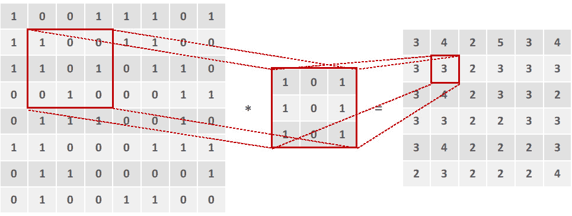

    图 2.21：卷积运算的进一步步骤

    卷积层的一个重要概念是它们是不变的，因此每个滤波器都将具有特定的函数，该函数在训练过程中不会发生变化。 例如，负责检测耳朵的过滤器将仅在整个训练过程中专门用于该函数。

    此外，考虑到所使用的滤镜，考虑到每个 CNN 都将专注于识别图像的特定特征或一组特征，因此 CNN 通常将具有多个卷积层。 通常，在两个卷积层之间有一个池化层。

2.  **池化层**：尽管卷积层能够从图像中提取相关特征，但是当分析复杂的几何形状时它们的结果可能会变得非常巨大，这将使训练过程在计算能力方面成为不可能，因此发明了池化层。

    这些层不仅实现了减少卷积层输出的目标，而且还消除了已提取特征中存在的任何噪声，最终最终有助于提高模型的准确率。

    可以应用两种主要类型的池化层，其背后的想法是检测在图像中表现出较强影响的区域，以便可以忽略其他区域。

    **最大池化**：此操作包括将给定大小的矩阵的一个子部分作为该最大子集操作的输出，并采用该子部分中的最大数目：

    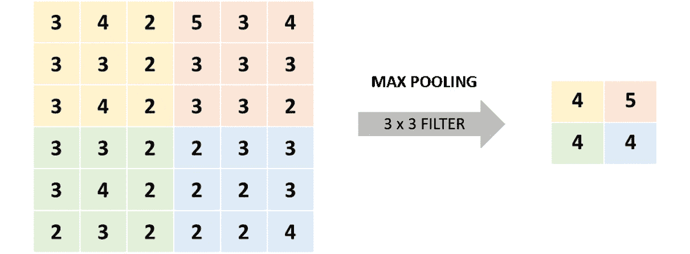

    图 2.22：最大池化操作

    在上图中，通过使用`3 x 3`最大池化过滤器，可以实现右侧的结果。 在此，黄色部分（左上角）的最大数量为 4，而橙色部分（右上角）的最大数量为 5。

    **平均池化**：类似地，平均池操作采用矩阵的各个子部分，并将符合规则的数字作为输出，在这种情况下，该数字是所讨论的子部分中所有数字的平均值：

    

    图 2.23：平均池化操作

    在这里，使用`3 x 3`滤镜，我们得到 2.9，这是黄色部分（左上角）中所有数字的平均值，而 3.2 是橙色部分（右上角）中所有数字的平均值。 。

3.  **全连接层**：最后，考虑到如果网络仅能够检测一组特征而不具有将其分类为类标签的能力，则该网络将无用，最后 CNN 使用全连接层采取前一层检测到的特征（称为特征图），并输出属于类别标签的那组特征的概率，用于进行最终预测。

    像人工神经网络一样，全连接层使用感知器根据给定的输入来计算输出。 此外，至关重要的是要提到 CNN 在架构的末尾通常具有不止一个全连接层。

通过组合所有这些概念，可以获得 CNN 的常规架构。 每个类型可以有任意数量的层，每个卷积层可以具有任意数量的滤镜（每个滤镜用于特定任务）。 此外，池化层应具有与上一个卷积层相同数量的过滤器，如下图所示：


图 2.24：CNN 架构图

## 循环神经网络简介

前述神经网络（ANN 和 CNN）的主要局限性在于，它们只能通过考虑当前事件（正在处理的输入）来学习，而不会考虑先前或后续事件，因此考虑到我们人类并不这样思考，这是不便的。 例如，当阅读一本书时，通过考虑上一段或更多段中的上下文，您可以更好地理解每个句子。

因此，并考虑到神经网络旨在优化传统上由人类完成的多个过程这一事实，至关重要的是考虑一个能够考虑输入和输出序列的网络，因此**循环神经网络**（**RNN**）。 它们是一种强大的神经网络，可以通过使用内部存储器找到复杂数据问题的解决方案。

简而言之，这些网络中包含循环，即使在处理后续的一组信息时，这些循环也可以使信息在其内存中保留更长的时间。 这意味着 RNN 中的感知器不仅将输出传递到下一个感知器，而且还保留了一些信息给自己，这对于分析下一信息很有用。 这种内存保留功能使他们可以非常准确地预测下一步。

与其他网络类似，RNN 的学习过程尝试映射输入（`x`）和输出（`y`）之间的关系，不同之处在于这些模型还考虑了先前输入的全部或部分历史。

RNN 允许以输入序列，输出序列或什至同时以两种形式处理数据序列，如下图所示：


图 2.25：RNN 处理的数据序列

在此，每个框都是一个矩阵，箭头表示发生的函数。 底部的框是输入，顶部的框是输出，中间的框代表 RNN 在该点的状态，该状态保存网络的内存。

从左至右，上述各图可以解释如下：

1.  一个不需要解决 RNN 的典型模型。 它具有固定的输入和固定的输出。 例如，这可以指图像分类。
2.  该模型接受输入并产生一系列输出。 例如，以接收图像作为输入的模型； 输出应为图像标题。
3.  与前面的模型相反，该模型采用一系列输入并产生单个结果。 在情感分析问题上可以看到这种类型的架构，其中输入是要分析的句子，输出是句子后面的预测情感。
4.  最后的两个模型采用一系列输入，并返回一系列输出，不同之处在于第一个模型同时分析输入并生成输出。 例如，当视频的每个帧都被单独标记时。 另一方面，第二个多对多模型分析整个输入集，以生成输出集。 语言翻译就是一个例子，在进行实际翻译之前，需要先理解一种语言的整个句子。

# 数据准备

当然，在收集数据之后，开发任何深度学习模型的第一步都应该是准备数据。 如果我们希望了解手边的数据以正确地概述项目范围，那么这一点至关重要。

许多数据科学家没有这样做，这导致模型的表现很差，甚至导致模型无用，因为他们没有从一开始就回答数据问题。

数据准备过程可以分为三个主要任务：

1.  了解数据并处理任何潜在问题
2.  重新缩放特征，以确保不会因错误引入偏差
3.  拆分数据以能够准确地衡量表现

所有这三个任务将在下一节中进一步说明。

注意

在应用任何机器学习算法时，考虑到它们指的是事先准备数据所需的技术，我们前面解释的所有任务几乎都是相同的。

## 处理混乱数据

该任务主要包括执行**探索性数据分析**（**EDA**），以了解可用数据，以及检测可能影响模型开发的潜在问题。

EDA 流程很有用，因为它有助于开发人员发现对于定义操作过程至关重要的信息。 此处说明此信息：

1.  **数据量**：这既指实例数，也指特征数。 前者对于确定是否有必要甚至有可能使用神经网络甚至是深度神经网络解决数据问题至关重要，因为考虑到此类模型需要大量数据才能达到较高的准确率。 另一方面，后者对于确定是否提前开发某些特征选择方法以减少特征数量，简化模型并消除任何冗余信息是否有用是有用的。
2.  **目标特征**：对于受监督的模型，需要标记数据。 考虑到这一点，选择目标特征（我们希望通过构建模型来实现的目标）以评估特征是否具有许多缺失值或离群值非常重要。 此外，这有助于确定开发目标，该目标应与可用数据一致。
3.  **噪音数据/异常值**：噪音数据是指明显不正确的值，例如 200 岁的人。 另一方面，离群值所指的值虽然可能是正确的，但与平均值相差甚远，例如，一个 10 岁的大学生。

    没有检测异常值的确切科学方法，但是有一些通常被接受的方法。 假设数据集呈正态分布，那么最受欢迎的数据集之一就是确定离平均值约 3-6 标准差的任何值。

    识别异常值的一种同样有效的方法是选择第 99 个百分点和第 1 个百分点的值。

    当此类值代表要素数据的 5% 以上时，处理此类值非常重要，因为不这样做可能会给模型带来偏差。 与其他任何机器学习算法一样，处理这些值的方法是使用均值或回归插补技术删除异常值或分配新值。

4.  **缺失值**：类似于上述内容，考虑到不同的模型会对这些值做出不同的假设，因此具有许多缺失值的数据集会给模型带来偏差。 同样，当缺失值占要素值的 5% 以上时，应再次使用均值或回归插补技术，通过消除或替换它们来处理它们。
5.  **定性特征**：最后，考虑到删除或编码数据可能会导致更准确的模型，因此检查数据集是否包含定性数据也是关键的一步。

    此外，在许多研究开发中，对同一数据测试了几种算法，以确定哪种算法表现更好，并且其中某些算法不能容忍使用定性数据，就像神经网络一样。 这证明了转换或编码它们以便能够向所有算法提供相同数据的重要性。

## 练习 2.02：处理混乱数据

注意

本章中的所有练习都将使用从 UC Irvine 机器学习存储库获得的**电器能耗预测数据集**完成，该数据集可从[这里](https://archive.ics.uci.edu/ml/datasets/Appliances+energy+prediction)下载。 [也可以在本书的 GitHub 存储库中找到它](https://packt.live/34MBoSw)。

**电器能耗预测数据集**包含 4.5 个月的数据，涉及低能耗建筑物中不同房间的温度和湿度测量，目的是预测某些电器使用的能耗。

在本练习中，我们将使用`pandas`（这是一个受欢迎的 Python 软件包）来探索手头的数据并学习如何检测缺失值，离群值和定性值。 执行以下步骤以完成本练习：

注意

对于本章中的练习和活动，您将需要在本地计算机上安装 Python 3.7，Jupyter 6.0，NumPy 1.17 和 Pandas 0.25。

1.  打开 Jupyter 笔记本以实现此练习。
2.  导入 Pandas 库：

    ```py
    import pandas as pd
    ```

3.  使用Pandas读取 CSV 文件，其中包含我们从 UC Irvine 机器学习存储库站点下载的数据集。

    接下来，删除名为`date`的列，因为我们不想在以下练习中考虑它：

    ```py
    data = pd.read_csv("energydata_complete.csv")
    data = data.drop(columns=["date"])
    ```

    最后，打印`DataFrame`的头部：

    ```py
    data.head()
    ```

    输出应如下所示：

    

    图 2.26：设备能源预测数据集的主要实例

4.  检查数据集中的分类特征：

    ```py
    cols = data.columns
    num_cols = data._get_numeric_data().columns
    list(set(cols) - set(num_cols))
    ```

    第一行生成数据集中所有列的列表。 接下来，包含数值的列也存储在变量中。 最后，通过从整个列列表中减去数字列，可以获得非数字列。

    结果列表为空，表示没有分类特征要处理。

5.  使用 Python 的`isnull()`和`sum()`函数来查找数据集各列中是否缺少任何值：

    ```py
    data.isnull().sum()
    ```

    此命令计算每列中空值的数量。 对于正在使用的数据集，不应缺少任何值，如在此处所示：

    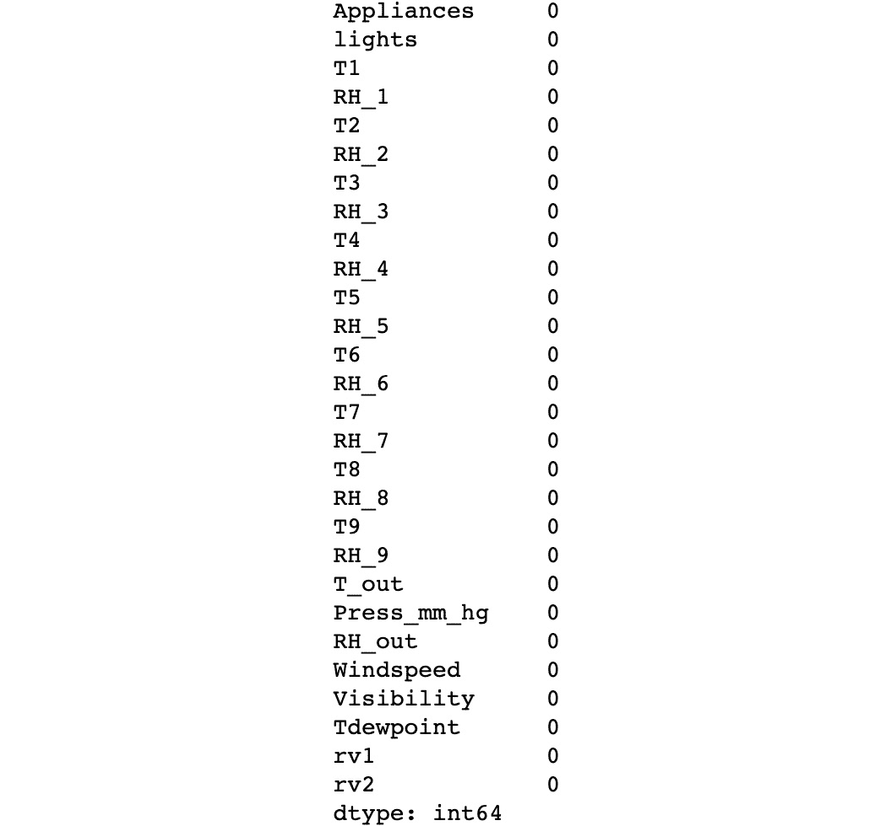

    图 2.27：缺失值计数

6.  使用三个标准偏差作为度量来检测数据集中所有特征的离群值：

    ```py
    outliers = {}
    for i in range(data.shape[1]):
        min_t = data[data.columns[i]].mean() \
                - (3 * data[data.columns[i]].std())
        max_t = data[data.columns[i]].mean() \
                + (3 * data[data.columns[i]].std())
        count = 0
        for j in data[data.columns[i]]:
            if j < min_t or j > max_t:
                count += 1
        percentage = count / data.shape[0]
        outliers[data.columns[i]] = "%.3f" % percentage
    outliers
    ```

    前面的代码段循环遍历数据集中的列，以评估每个异常值的存在。 它会继续计算最小和最大阈值，以便可以计算超出阈值之间范围的实例数。

    最后，它计算离群值的百分比（即离群值除以实例总数），以便输出显示每列此百分比的字典。

    通过打印结果字典（**离群值**），可以显示数据集中所有特征（列）的列表以及离群值的百分比。 根据结果​​，可以得出结论，无需考虑异常值，因为考虑到它们仅占数据的 5%，如以下屏幕截图所示：

    注意

    请注意，只要将变量放在笔记本中单元格的末尾，Jupyter 笔记本便可以打印变量的值，而无需使用打印函数。 在任何其他编程平台或任何其他情况下，请确保使用打印函数。

    例如，打印包含异常值的结果字典的等效方法（也是最佳实践）将使用`print`语句，如下所示：`print(outliers)`。 这样，在不同的编程平台上运行时，代码将具有相同的输出。

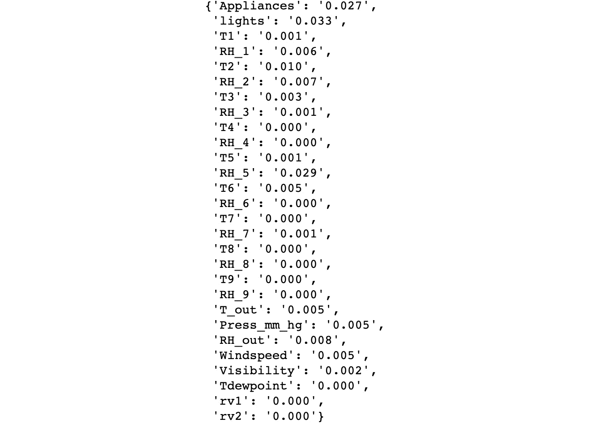

图 2.28：离群参与每个特征

注意

要访问此特定部分的源代码，请参考[这里](https://packt.live/2CYEglp)。

您也可以通过[这里](https://packt.live/3ePAg4G)在线运行此示例。 您必须执行整个笔记本才能获得所需的结果。

您已经成功浏览了数据集并处理了潜在问题。

## 数据缩放

尽管不需要重新缩放数据就可以将其馈送到算法中进行训练，但是如果您希望提高模型的准确率，这是重要的一步。 这主要是因为每个特征具有不同的比例可能会导致模型假定给定特征比其他特征更重要，因为它具有更高的数值。

以两个特征为例，一个特征测量一个人的孩子数量，另一个特征描述一个人的年龄。 即使年龄特征可能具有较高的数值，但在推荐学校的研究中，孩子特征的数目可能更为重要。

考虑到这一点，如果所有特征均等地缩放，则模型实际上可以赋予那些相对于目标特征最重要的特征更高的权重，而不是赋予它们具有的数值。 此外，它还可以消除模型从数据不变性中学习的需要，从而有助于加快训练过程。

有两种主要的重新缩放方法在数据科学家中很流行，尽管没有选择一个或另一个的规则，但重要的是要强调它们必须单独使用（一个或另一个）。

可以在这里找到这两种方法的简要说明：

*   **规范化**：这包括重新缩放值，以便所有要素的所有值都介于零和一之间。 使用以下公式完成此操作：


图 2.29：数据标准化

*   **标准化**：相反，此缩放方法将转换所有值，以使其平均值为 0 且其标准差等于 1。这可使用以下公式完成：


图 2.30：数据标准化

## 练习 2.03：重新缩放数据

在本练习中，我们将重新缩放上一练习中的数据。 请执行以下步骤：

注意

使用与上一练习相同的 Jupyter 笔记本。

1.  将特征与目标分开。 我们这样做只是为了重新特征要素数据：

    ```py
    X = data.iloc[:, 1:]
    Y = data.iloc[:, 0]
    ```

    前面的代码片段获取数据并使用切片将特征与目标分离。

2.  通过使用规范化方法重新缩放特征数据。 显示结果`DataFrame`的标题（即前五个实例）以验证结果：

    ```py
    X = (X - X.min()) / (X.max() - X.min())
    X.head()
    ```

    输出应如下所示：


图 2.31：标准化设备能源预测数据集的主要实例

注意

要访问此特定部分的源代码，请参考[这里](https://packt.live/2ZojumJ)。

您也可以通过[这里](https://packt.live/2NLVgxq)在线运行此示例。 您必须执行整个笔记本才能获得所需的结果。

您已成功缩放数据集。

## 分割数据

将数据集分为三个子集的目的是，可以在不引入偏差的情况下对模型进行适当的训练，微调和测量。 这是每个集合的说明：

*   **训练集**：顾名思义，该集合被馈送到要训练的神经网络。 对于监督学习，它由特征和目标值组成。 如前所述，考虑到神经网络需要训练大量数据，通常这是三者中最大的集合。
*   **验证集（开发集）**：该集主要用于测量模型的表现，以便对超参数进行调整以提高性能。 完成此微调过程是为了使我们可以配置能获得最佳结果的超参数。

    尽管没有对模型进行数据训练，但模型会对模型产生间接影响，这就是为什么不应该对模型进行最终表现评估的原因，因为它可能是有偏差的度量。

*   **测试集**：该集对模型没有影响，这就是为什么它用于对看不见的数据进行模型的最终评估的原因，这成为模型在未来的数据集上的表现如何的指南。

考虑到每个数据问题都是不同的，并且开发深度学习解决方案通常需要反复试验的方法，因此没有理想的科学方法可以将数据分为上述三组。 尽管如此，众所周知，对于较大的数据集（数十万个实例），每个集合的分割比例应为 98:1:1，因为对于训练集使用尽可能多的数据至关重要。 对于较小的数据集，常规拆分比率为 60:20:20。

## 练习 2.04：拆分数据集

在本练习中，我们将前一练习的数据集分为三个子集。 为了学习的目的，我们将探索两种不同的方法。 首先，将使用索引分割数据集。 接下来，将 scikit-learn 的`train_test_split()`函数用于相同的目的，从而通过两种方法获得相同的结果。 执行以下步骤以完成本练习：

注意

使用与上一练习相同的 Jupyter 笔记本。

1.  打印数据集的形状，以确定要使用的拆分比率：

    ```py
    shape
    ```

    此操作的输出应为`(19735, 27)`。 这意味着可以使用 60:20:20 的分配比例进行训练，验证和测试。

2.  获取将用作训练和验证集上限的值。 这将用于通过索引拆分数据集：

    ```py
    train_end = int(len(X) * 0.6)
    dev_end = int(len(X) * 0.8)
    ```

    前面的代码确定将用于通过切片划分数据集的实例的索引。

3.  打乱数据集：

    ```py
    X_shuffle = X.sample(frac=1, random_state=0)
    Y_shuffle = Y.sample(frac=1, random_state=0)
    ```

    使用Pandas`sample`函数，可以对特征和目标矩阵中的元素进行混洗。 通过将`frac`设置为 1，我们确保所有实例都经过改组并在函数的输出中返回。 使用`random_state`参数，我们确保两个数据集均被混洗。

4.  使用索引将经过改组的数据集分为要素和目标数据这三组：

    ```py
    x_train = X_shuffle.iloc[:train_end,:]
    y_train = Y_shuffle.iloc[:train_end]
    x_dev = X_shuffle.iloc[train_end:dev_end,:]
    y_dev = Y_shuffle.iloc[train_end:dev_end]
    x_test = X_shuffle.iloc[dev_end:,:]
    y_test = Y_shuffle.iloc[dev_end:]
    ```

5.  打印所有三组的形状：

    ```py
    print(x_train.shape, y_train.shape)
    print(x_dev.shape, y_dev.shape)
    print(x_test.shape, y_test.shape)
    ```

    以上操作的结果应为：

    ```py
    (11841, 27) (11841,)
    (3947, 27) (3947,)
    (3947, 27) (3947,)
    ```

6.  从 scikit-learn 的`model_selection`模块导入`train_test_split()`函数：

    ```py
    from sklearn.model_selection import train_test_split
    ```

    注意

    尽管根据实际学习的需要导入了不同的程序包和库，但是在代码开始时导入它们始终是一种好习惯。

7.  拆分打乱后的数据集：

    ```py
    x_new, x_test_2, \
    y_new, y_test_2 = train_test_split(X_shuffle, Y_shuffle, \
                                       test_size=0.2, \
                                       random_state=0)
    dev_per = x_test_2.shape[0]/x_new.shape[0]
    x_train_2, x_dev_2, \
    y_train_2, y_dev_2 = train_test_split(x_new, y_new, \
                                          test_size=dev_per, \
                                        random_state=0)
    ```

    代码的第一行执行初始拆分。 该函数将以下内容作为参数：

    `X_shuffle`，`Y_shuffle`：要拆分的数据集，即要素数据集，以及目标数据集（也称为`X`和`Y`）

    `test_size`：测试集中要包含的实例的百分比

    `random_state`：用于确保结果的可重复性

    此行代码的结果是将每个数据集（`X`和`Y`）分为两个子集。

    要创建其他集（验证集），我们将执行第二次拆分。 前面代码的第二行负责确定要用于第二个拆分的`test_size`，以便测试集和验证集具有相同的形状。

    最后，代码的最后一行使用先前计算为`test_size`的值执行第二次拆分。

8.  打印所有三组的形状：

    ```py
    print(x_train_2.shape, y_train_2.shape)
    print(x_dev_2.shape, y_dev_2.shape)
    print(x_test_2.shape, y_test_2.shape)
    ```

    以上操作的结果应为：

    ```py
    (11841, 27) (11841,)
    (3947, 27) (3947,)
    (3947, 27) (3947,)
    ```

    我们可以看到，两种方法的结果集具有相同的形状。 使用一种方法还是另一种方法是优先考虑的问题。

    注意

    要访问此特定部分的源代码，请参考[这里](https://packt.live/2VxvroW)。

    您也可以通过[这里](https://packt.live/3gcm5H8)在线运行此示例。 您必须执行整个笔记本才能获得所需的结果。

您已成功将数据集分为三个子集。

## 无法准备数据的缺点

尽管准备数据集的过程很耗时，并且在处理大型数据集时可能很累，但这样做的缺点更加不便：

*   **较长的训练时间**：包含噪声，缺失值以及冗余或无关列的数据需要花费相当长的时间来训练，并且在大多数情况下，此时间延迟甚至比准备数据所需的时间更长。 例如，在数据准备期间，可以确定五列与该研究目的无关，这可能会大大减少数据集，从而大大减少训练时间。
*   **偏差的引入**：未清理的数据通常包含错误或缺失值，可能会使模型偏离真实情况。 例如，缺少值可能会导致模型做出不正确的推断，进而导致创建不代表数据的模型。
*   **避免泛化**：异常值和嘈杂的值会阻止模型对数据进行泛化，这对于构建代表当前训练数据以及未来看不见的数据的模型至关重要。 例如，包含年龄变量的数据集包含 100 岁以上人群的条目，则可能会导致模型说明那些实际上只代表人口很小一部分的用户。

## 活动 2.01：执行数据准备

在本活动中，我们将准备一个数据集，其中包含歌曲列表，每首歌曲具有几个有助于确定其发行年份的属性。 数据准备步骤对于本章的下一个活动至关重要。 让我们看一下以下情况。

您在一家音乐唱片公司工作，您的老板想揭示表示不同时间段唱片的细节，这就是为什么他们汇总了一个包含 515,345 条唱片的数据的数据集，发布年份从 1922 年到 2011 年。 要求您准备数据集，以便准备将其馈送到神经网络。 执行以下步骤以完成此活动：

注意

要下载此活动的数据集，[请访问以下 UC Irvine 机器学习存储库 URL](https://archive.ics.uci.edu/ml/datasets/YearPredictionMSD)。

引用：`Dua, D. and Graff, C. (2019). UCI Machine Learning Repository [http://archive.ics.uci.edu/ml]. Irvine, CA: University of California, School of Information and Computer Science.`

[也可以在本书的 GitHub 存储库中找到它](https://packt.live/38kZzZR)

1.  导入所需的库。
2.  使用Pandas，加载`.csv`文件。
3.  验证数据集中是否存在任何定性数据。
4.  检查缺失值。

    您还可以添加一个附加的`sum()`函数，以获取整个数据集中的缺失值之和，而无需按列进行区分。

5.  检查异常值。
6.  将特征与目标数据分开。
7.  使用标准化方法重新缩放数据。
8.  将数据分为三组：训练，验证和测试。 使用您喜欢的任何一种方法。

    注意

    有关此活动的解决方案，请参阅第 239 页。

# 构建深度神经网络

一般而言，可以使用 scikit-learn（不适用于深度学习）之类的库在非常简单的级别上构建神经网络，该库可以为您执行所有数学运算而没有很大的灵活性，或者在非常复杂的级别上，通过从头开始编码训练过程的每个步骤，或使用更强大的框架，可以提供极大的灵活性。

PyTorch 的构建考虑了该领域许多开发人员的意见，其优点是可以将两个近似值放在同一位置。 正如我们前面提到的，它具有一个神经网络模块，该模块被构建为允许使用顺序容器对简单架构进行简单的预定义实现，同时允许创建自定义模块，从而为构建非常复杂的架构的过程引入灵活性 。

在本节中，我们将讨论使用顺序容器开发深度神经网络，以揭开其复杂性。 不过，在本书的后续章节中，我们将继续研究更复杂和抽象的应用，而这些应用也可以非常轻松地实现。

正如我们前面提到的，顺序容器是一个模块，它被构建为包含遵循顺序的模块序列。 它包含的每个模块都将对给定的输入进行一些计算以得出结果。

可以在顺序容器中使用一些最流行的模块（层）来开发常规分类模型，在这里进行了解释：

注意

在随后的章节中将解释用于其他类型的架构（例如 CNN 和 RNN）的模块。

*   **线性层**：这将线性变换应用于输入数据，同时保持内部张量来容纳权重和偏差。 它接收输入样本的大小（数据集的要素数量或上一层的输出数量），输出样本的大小（当前层中的单位数量，即输出数量） ），以及是否在训练过程中使用偏差张量（默认设置为`True`）作为参数。
*   **激活函数**：它们接收线性层的输出作为输入，以破坏线性。 如前所述，有几个激活函数可以添加到顺序容器中。 最常用的解释如下：

    **ReLU**：这将校正后的线性单元函数应用于包含输入数据的张量。 它接受的唯一参数是是否应在原位进行操作，默认情况下将其设置为`False`。

    **Tanh**：这会将基于元素的 tanh 函数应用于包含输入数据的张量。 它不需要任何参数。

    **Sigmoid**：这将前面解释的 Sigmoid 函数应用于包含输入数据的张量。 它不需要任何参数。

    **Softmax**：将 softmax 函数应用于包含输入数据的 n 维张量。 重新缩放输出，以使张量的元素位于零与一之间的范围内，并且总和为一。 它采用应沿着其计算 softmax 函数的维度作为参数。

*   **丢弃层**：此模块根据设置的概率将输入张量的某些元素随机归零。 它使用概率进行随机选择，以及是否应在原位进行操作，默认情况下将其设置为`False`作为参数。 该技术通常用于处理过拟合模型，稍后将对其进行详细说明。
*   **规范化层**：可以使用不同的方法在顺序容器中添加规范化层。 其中一些包括`BatchNorm1d`，`BatchNorm2d`和`BatchNorm3d`。 其背后的想法是对来自上一层的输出进行归一化，最终在较短的训练时间上达到相似的精度水平。

## 练习 2.05：使用 PyTorch 构建深度神经网络

在本练习中，我们将使用 PyTorch 库定义四层深度神经网络的架构，然后将使用我们在先前练习中准备的数据集对其进行训练。 请执行以下步骤：

注意

使用与上一练习相同的 Jupyter 笔记本。

1.  从 PyTorch 导入名为`torch`的 PyTorch 库，以及`nn`模块。

    ```py
    import torch
    import torch.nn as nn
    ```

    注意

    此练习中使用了`torch.manual_seed(0)`，以确保在本书的 GitHub 存储库中获得的结果具有可重复性。

2.  对于我们在上一个练习中创建的每个集合，将特征列与目标分开。 此外，将最终的`DataFrame`转换为张量：

    ```py
    x_train = torch.tensor(x_train.values).float()
    y_train = torch.tensor(y_train.values).float()
    x_dev = torch.tensor(x_dev.values).float()
    y_dev = torch.tensor(y_dev.values).float()
    x_test = torch.tensor(x_test.values).float()
    y_test = torch.tensor(y_test.values).float()
    ```

3.  使用`sequential()`容器定义网络架构。 确保创建四层网络。 考虑到我们正在处理回归问题，请在前三层使用 ReLU 激活函数，而在最后一层不使用激活函数。

    每层的单位数应为 100、50、25 和 1：

    ```py
    model = nn.Sequential(nn.Linear(x_train.shape[1], 100), \
                          nn.ReLU(), \
                          nn.Linear(100, 50), \
                          nn.ReLU(), \
                          nn.Linear(50, 25), \
                          nn.ReLU(), \
                          nn.Linear(25, 1))
    ```

4.  将损失函数定义为 MSE：

    ```py
    loss_function = torch.nn.MSELoss()
    ```

5.  将优化器算法定义为 Adam 优化器：

    ```py
    optimizer = torch.optim.Adam(model.parameters(), lr=0.001)
    ```

6.  使用`for`循环在训练数据上训练 1,000 个迭代步骤来训练网络：

    ```py
    for i in range(1000):
        y_pred = model(x_train).squeeze()
        loss = loss_function(y_pred, y_train)
        optimizer.zero_grad()
        loss.backward()
        optimizer.step()
        if i%100 == 0:
            print(i, loss.item())
    ```

    注意

    `squeeze()`函数用于删除`y_pred`的附加尺寸，该尺寸已从大小`[3000,1]`转换为`[3000]`。

    考虑到`y_train`是一维的，并且两个张量都必须具有相同的维数才能馈送到损失函数，这一点至关重要。

    运行前面的代码片段将产生类似于以下内容的输出：

    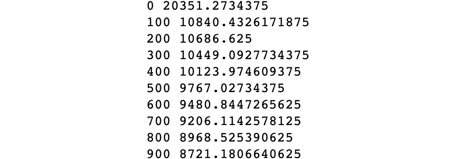

    图 2.32：不同迭代步骤的损失值

    可以看出，损失值随时间连续减小。

7.  为了测试模型，对测试集的第一个实例进行预测，并与地面真相（目标值）进行比较。

    ```py
    pred = model(x_test[0])
    print("Ground truth:", y_test[0].item(), \
          "Prediction:",pred.item())
    ```

    输出应类似于以下内容：

    ```py
    Ground truth: 60.0 Prediction: 69.5818099975586
    ```

    如您所见，真实情况值（`60`）非常接近预测值（`69.58`）。

    注意

    要访问此特定部分的源代码，请参考[这里](https://packt.live/2NJsQUz)。

    您也可以通过[这里](https://packt.live/38nrnNh)在线运行此示例。 您必须执行整个笔记本才能获得所需的结果。

您已经成功创建并训练了一个深度神经网络来解决回归问题。

## 练习 2.02：开发回归问题的深度学习解决方案

在本活动中，我们将创建并训练一个神经网络来解决我们在上一活动中提到的回归问题。 让我们看一下场景。

您继续在唱片公司工作，在看到您准备好数据集的出色工作后，您的老板已经信任您定义网络架构以及使用准备好的数据集进行训练的任务。 执行以下步骤以完成此活动：

注意

使用与上一活动相同的 Jupyter 笔记本。

1.  导入所需的库。
2.  从目标中为我们在上一个活动中创建的所有三组数据拆分函数。 将`DataFrame`转换为张量。
3.  定义网络的架构。 随意尝试层数和每层单位数的不同组合。
4.  定义损失函数和优化器算法。
5.  使用循环对训练网络进行 3,000 个迭代步骤。
6.  通过对测试集的第一个实例执行预测并将其与基本事实进行比较来测试模型。

您的输出应类似于以下内容：

```py
Ground truth: 1995.0 Prediction: 1998.0279541015625
```

注意

有关此活动的解决方案，请参见第 242 页。

# 总结

产生神经网络的理论是由弗兰克·罗森布拉特（Frank Rosenblatt）于几十年前提出的。 它始于感知器的定义，感知器是受人类神经元启发的单元，其将数据作为输入以对其进行转换。 感知器背后的理论包括将权重分配给输入数据以执行计算，以便最终结果取决于结果而为一件事或另一件事。

神经网络最广为人知的形式是由一系列感知器创建的神经网络，这些感知器分层堆叠在一起，其中一列感知器（层）的输出是下一个感知器的输入。

解释了神经网络的典型学习过程。 在此，需要考虑三个主要过程：前向传播，损失函数的计算和反向传播。

该过程的最终目标是通过更新网络每个神经元中每个输入值所伴随的权重和偏差来最小化损失函数。 这可以通过迭代过程来实现，该过程可能要花费几分钟，几小时甚至几周的时间，具体取决于数据问题的性质。

还讨论了三种主要类型的神经网络的主要架构：人工神经网络，卷积神经网络和循环神经网络。 第一个用于解决传统的分类或回归问题，第二个由于具有解决计算机视觉问题（例如图像分类）的能力而广受欢迎，第三个可按顺序处理数据，用于语言翻译等任务。

在下一章中，将讨论解决回归问题和分类数据问题之间的主要区别。 您还将学习如何解决分类数据问题，以及如何改善其表现以及如何部署模型。