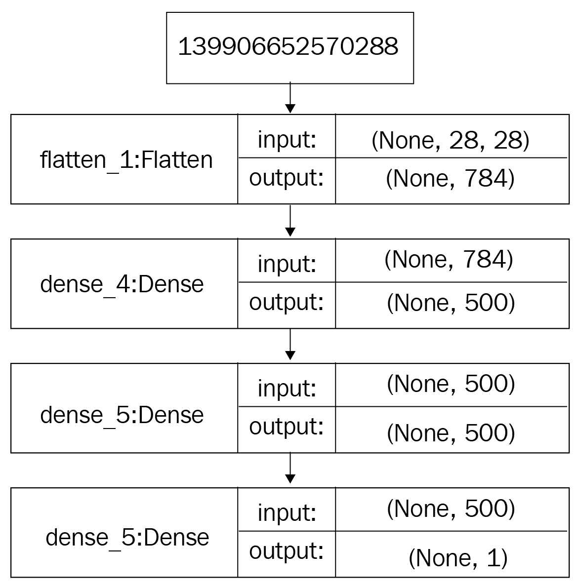
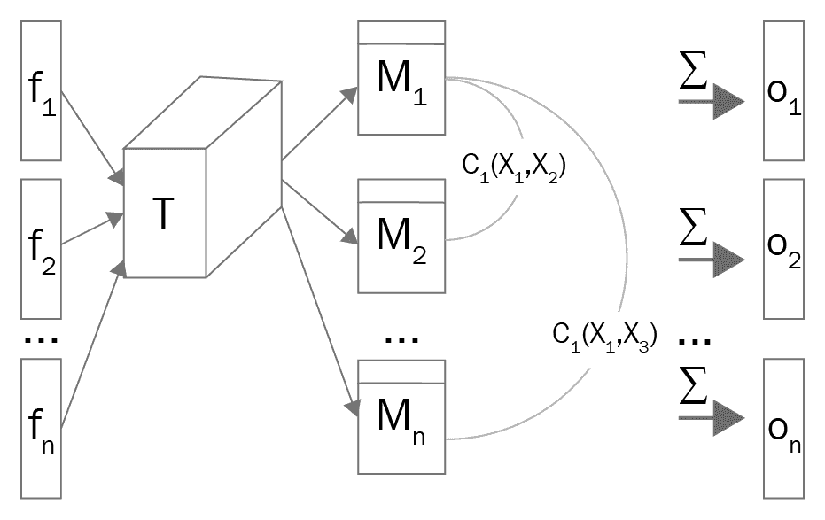
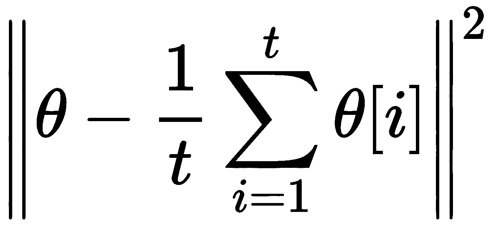

# 生成对抗网络简介

在本章中，我们将研究**生成对抗网络**（**GAN**）。 它们是一种深度神经网络架构，它使用无监督的机器学习来生成数据。 他们在 2014 年由 Ian Goodfellow，Yoshua Bengio 和 Aaron Courville 的论文中介绍，[可在以下链接中找到](https://arxiv.org/pdf/1406.2661)。 GAN 具有许多应用，包括图像生成和药物开发。

本章将向您介绍 GAN 的核心组件。 它将带您了解每个组件的工作方式以及 GAN 背后的重要概念和技术。 它还将简要概述使用 GAN 的优缺点 ，并深入了解某些实际应用。

本章将通过探讨以下主题来涵盖所有这些要点：

*   什么是 GAN？
*   GAN 的架构
*   与 GAN 相关的重要概念
*   GAN 的不同品种
*   GAN 的优缺点
*   GAN 的实际应用

# 什么是 GAN？

GAN 是由两个网络（生成器网络和判别器网络）组成的深度神经网络架构。 通过生成和辨别的多个周期，两个网络互相训练，同时试图互相取胜。

# 什么是生成器网络？

生成器网络使用现有数据来生成新数据。 例如，它可以使用现有图像生成新图像。 生成器的主要目标是从随机生成的数字向量（称为**潜在空间**）生成数据（例如图像，视频，音频或文本）。 在创建生成器网络时，我们需要指定网络的目标。 这可能是图像生成，文本生成，音频生成，视频生成等。

# 什么是判别器网络？

判别器网络试图区分真实数据和生成器网络生成的数据。 判别器网络尝试将传入的数据放入预定义的类别。 它可以执行多类分类或二进制分类。 通常，在 GAN 中执行二进制分类。

# 通过 GAN 中的对抗游戏进行训练

在 GAN 中，网络是通过对抗性游戏来训练的：两个网络相互竞争。 例如，假设我们要让 GAN 伪造艺术品：

1.  第一个网络，即生成器，从未见过真实的艺术品，但正在尝试创建看起来像真实的艺术品。
2.  第二个网络是判别器，试图识别艺术品是真实的还是伪造的。
3.  生成器反过来试图通过在多次迭代中创建更逼真的艺术品来欺骗判别器，使其认为其假货是真实的交易。
4.  判别器试图通过继续完善其自己的确定伪造品的标准来胜过生成器。
5.  他们通过在每次迭代中对自己的过程中所做的成功更改提供反馈，从而互相指导。 此过程是 GAN 的训练。
6.  最终，判别器将生成器训练到无法再确定哪个艺术品是真实的和哪个艺术品是伪造的这一点。

在此游戏中，同时训练两个网络。 当我们达到区分者无法区分真假艺术品的阶段时，网络便达到了称为**纳什均衡**的状态。 这将在本章稍后讨论。

# GAN 的实际应用

GAN 具有一些相当有用的实际应用，其中包括：

*   **图像生成**：生成器网络在经过样本图像训练后，可用于生成逼真的图像。 例如，如果我们要生成新的狗图像，则可以在狗的图像的数千个样本上训练 GAN。 训练完成后，生成器网络将能够生成与训练集中的图像不同的新图像。 图像生成用于市场营销，徽标生成，娱乐，社交媒体等。 在下一章中，我们将生成动漫人物的面孔。
*   **文本到图像的合成**：从文本描述生成图像是 GAN 的一个有趣用例。 由于 GAN 能够根据您编写的某些文本生成新数据，因此在电影行业中可能会有所帮助。 在漫画行业，可以自动生成故事序列。
*   **面部老化**：对于娱乐和监视行业都非常有用。 这对于面部验证特别有用，因为这意味着公司不需要随着人的变老而更改其安全系统。 age-cGAN 网络可以生成不同年龄的图像，然后可以将其用于训练用于面部验证的鲁棒模型。
*   **图像到图像的转换**：图像到图像的转换可用于将白天拍摄的图像转换为夜晚拍摄的图像，并将草图转换为绘画 ，以将图像的样式设置为类似于毕加索或梵高的绘画，将航空图像自动转换为卫星图像 ，并将马的图像转换为斑马的图像。 这些用例具有突破性，因为它们可以节省我们的时间。
*   **视频合成**： GAN 也可以用于生成视频。 与我们手动创建内容相比，它们可以在更少的时间内生成内容。 它们可以提高电影创作者的工作效率，还可以使想在业余时间制作创意视频的业余爱好者获得支持。
*   **高分辨率图像生成**：如果使用低分辨率相机拍摄照片，GAN 可以帮助您生成高分辨率图像而不会丢失任何基本细节。 这在网站上可能很有用。
*   **补全图像的缺失部分**：如果您的图像中有些缺失的部分，GAN 可以帮助您恢复这些部分。

# GAN 的详细架构

GAN 的架构具有两个基本元素：生成器网络和判别器网络。 每个网络都可以是任何神经网络，例如**人工神经网络**（**ANN**），**卷积神经网络**（**CNN**）， **循环神经网络**（**RNN**），或**长短期记忆**（**LSTM**）。 判别器必须具有完全连接的层，最后是分类器。

让我们仔细看一下 GAN 架构的组件。 在此示例中，我们将想象正在创建一个虚拟 GAN。

# 生成器的架构

虚拟 GAN 中的生成器网络是一个简单的前馈神经网络，具有五层：输入层，三个隐藏层和输出层。 让我们仔细看看生成器（虚拟）网络的配置：

| **编号** | **层名称** | **配置** |
| --- | --- | --- |
| 1 | 输入层 | `input_shape=(batch_size, 100)`，`output_shape=(batch_size, 100)` |
| 2 | 密集层 | `neurons=500`，`input_shape=(batch_size, 100)` ， `output_shape=(batch_size, 500)` |
| 3 | 密集层 | `neurons=500`，`input_shape=(batch_size, 500)` ， `output_shape=(batch_size, 500)` |
| 4 | 密集层 | `neurons=784`，`input_shape=(batch_size, 500)`，`output_shape=(batch_size, 784)` |
| 5 | 重塑层 | `input_shape=(batch_size, 784)`，`output_shape=(batch_size, 28, 28)` |

上表显示了隐藏层的配置，以及网络中的输入和输出层。

下图显示了生成器网络中每一层的张量流以及张量的输入和输出形状：

生成器网络的架构。

让我们讨论一下前馈神经网络在数据正向传播期间如何处理信息：

*   输入层采用从高斯（正态）分布中采样的 100 维向量，并将张量直接传递给第一隐藏层。
*   三个隐藏层是分别具有 500、500 和 784 个单位的密集层。 第一隐藏层（密集层）将形状为`[batch_size, 100]`的张量转换为形状为`[batch_size, 500]`的张量。

*   第二密集层生成形状为`[batch_size, 500]`的张量。
*   第三隐藏层生成`[batch_size, 784]`形状的张量。
*   在最后一个输出层中，该张量从`[batch_size, 784]`的形状改成`[batch_size, 28, 28]`的形状。 这意味着我们的网络将生成一批图像，其中一个图像的形状为`[28, 28]`。

# 判别器的架构

我们 GAN 中的判别器是前馈神经网络，它具有五层，包括一个输入层和一个输出层，以及三个密集层。 判别器网络是一个分类器，与生成器网络略有不同。 它处理图像并输出该图像属于特定类别的概率。

下图显示了判别器网络中每一层的张量流以及张量的输入和输出形状：

判别器网络的架构。

让我们讨论判别器如何在网络训练期间以正向传播方式处理数据：

1.  最初，它接收形状为`28x28`的输入。
2.  输入层采用输入张量，该张量是形状为（ `batch_sizex28x28` ）的张量，然后将其直接传递到第一隐藏层。
3.  接下来，平坦化层将张量平坦化为 784 维向量，该向量将传递到第一隐藏（密集）层。 第一和第二隐藏层将其修改为 500 维向量。
4.  最后一层是输出层，又是一个密集层，其中一个单元（ 神经元）和乙状结肠为激活函数。 它输出一个值为 0 或 1 的值。值为 0 表示提供的图像是假的，而值为 1 表示提供的图像是真实的。

# 与 GAN 相关的重要概念

现在我们已经了解了 GAN 的架构，下面让我们看一下一些重要概念的简要概述。 我们首先来看 KL 散度。 理解 JS 差异非常重要，这是评估模型质量的重要措施。 然后，我们将研究纳什均衡，这是我们在训练中试图达到的状态。 最后，我们将仔细研究目标函数，了解这些目标函数对于很好地实现 GAN 至关重要。

# Kullback-Leibler 散度

**Kullback-Leibler 散度**（**KL 散度**），也称为**相对熵**，是一种用于识别两个概率分布之间相似性的方法。 它测量一个概率分布`p`与第二个预期概率分布`q`的差异。

用于计算两个概率分布`p(x)`和`q(x)`之间的 KL 散度的公式如下：

当`p(x)`等于`q(x)`时，KL 散度将为零或最小值。

由于 KL 散度的不对称性质，我们不应该使用它来度量两个概率分布之间的距离。 因此，不应将其用作距离度量。

# 詹森-香农分歧

**Jensen-Shannon** 散度（也称为**信息半径**（**IRaD**）或**总散度与平均值**）是两个概率分布之间相似度的另一种度量。 它基于 KL 散度。 但是，与 KL 散度不同，JS 散度本质上是对称的，可用于测量两个概率分布之间的距离。 如果我们采用 Jensen-Shannon 发散的平方根，则会得到 Jensen-Shannon 距离，因此它是距离度量。

以下等式表示两个概率分布`p`和`q`之间的 Jensen-Shannon 散度：

在前面的等式中，`p + q`是中点度量，而`D[KL]`是 Kullback-Leibler 散度。

现在我们已经了解了 KL 散度和 Jenson-Shannon 散度，让我们讨论 GAN 的纳什均衡。

# 纳什均衡

纳什均衡描述了博弈论中的特定状态。 在非合作游戏中可以达到这种状态，在这种游戏中，每个玩家都根据自己对其他玩家的期望，尝试选择最佳策略来为自己获得最佳结果。 最终，所有参与者都达到了根据其他参与者做出的决定为自己选择最佳策略的地步。 在游戏的这一点上，他们不会从改变策略中获得任何好处。 这种状态是纳什均衡。

关于如何达到纳什均衡的一个著名例子是《囚徒困境》。 在此示例中，两名犯罪分子（A 和 B）因犯罪而被捕。 两者都放置在单独的单元中，彼此之间无法通信。 检察官只有足够的证据将他们定罪为较小的罪行，而没有主要罪行，这将使他们长期入狱。 为了定罪，检察官向他们提出要约：

*   如果 A 和 B 都牵涉对方主要罪行，则将分别服刑 2 年。
*   如果 A 暗示 B 但 B 保持沉默，则 A 将被释放，B 将被判入狱 3 年（反之亦然）。
*   如果 A 和 B 都保持安静，则他们以较少的费用只能服刑 1 年。

从这三种情况来看，很明显，A 和 B 的最佳可能结局是保持安静并在监狱服刑 1 年。 但是，保持安静的风险为 3 年，因为 A 和 B 都无法知道对方也将保持安静。 因此，他们将达到一种状态，在这种状态下，他们的实际最佳策略是供认，因为这是提供最高奖励和最低惩罚的选择。 当达到这种状态时，任何罪犯都不会通过改变策略来获得任何好处； 因此，他们将达到纳什均衡。

# 目标功能

为了创建一个生成器网络，该生成器网络生成与真实图像相似的图像，我们尝试提高生成器生成的数据与实际数据之间的相似性。 为了测量相似度，我们使用目标函数。 这两个网络都有自己的目标功能，并且在训练过程中，它们会尽量减少各自的目标功能。 以下方程式表示 GAN 的最终目标函数：

在前面的等式中，`D(x)`是判别器模型，`G(z)`是生成器模型，`P(x)`是实际数据分布，`P(z)`是生成器生成的数据的分布，`E`是预期的输出。 

在训练期间，`D`（**判别器**）想要使整个输出最大化，而`G`（生成器）希望使整个输出最小化，从而训练 GAN 使生成器和判别器网络达到平衡。 当它达到平衡时，我们说模型已经收敛。 这个平衡就是纳什平衡。 训练完成后，我们将获得一个生成器模型，该模型能够生成逼真的图像。

# 计分算法

计算 GAN 的准确性很简单。 GAN 的目标函数不是特定函数，例如均方误差或交叉熵。 GAN 在训练期间学习目标功能。 研究人员提出了许多计分算法来衡量模型的拟合程度。 让我们详细了解一些评分算法。

# 初始分数

初始分数是 GAN 使用最广泛的评分算法。 它使用预训练的 Inception V3 网络（在 Imagenet 上进行训练）来提取生成图像和真实图像的特征。 由 Shane Barrat 和 Rishi Sharma 在其论文[《关于初始分数的注释》](https://arxiv.org/pdf/1801.01973.pdf)中提出。 初始分数或简称 IS，用于衡量所生成图像的质量和多样性。 让我们看一下`IS`的等式：

在前面的等式中，符号`x`表示从分布中采样的样本。 `P(g)`和`x ~ P(g)`代表相同的概念。 `P(y|x)`是条件类别分布，`P(y)`是边际类别分布。

要计算初始分数，请执行以下步骤：

1.  首先采样由模型生成的`N`个图像，表示为`(x^i)`
2.  然后，使用以下公式构建边际类分布：

    

3.  然后，使用以下公式计算 KL 散度和预期的改进：

    

4.  最后，计算结果的指数以得出初始分数。

如果模型的初始得分高，则其质量会很好。 尽管这是一项重要措施，但仍存在某些问题。 例如，即使模型每类生成一张图像，它也显示出很高的准确性，这意味着模型缺乏多样性。 为了解决此问题，提出了其他性能指标。 在下一节中，我们将介绍其中之一。

# Fréchet 起始距离

为了克服初始分数的各种缺点，Martin Heusel 等人在他们的论文中提出了 **Fréchlet 初始距离**（**FID**），[《收敛到局部纳什均衡的两个时间维度更新规则所训练的 GAN》](https://arxiv.org/pdf/1706.08500.pdf)。

计算 FID 分数的公式如下：

前面的等式表示实际图像`x`，与生成的图像`g`之间的 FID 分数。 为了计算 FID 分数，我们使用 Inception 网络从 Inception 网络的中间层提取特征图。 然后，我们对多元高斯分布建模，以学习特征图的分布。 此多元高斯分布具有`μ`的均值和`∑`的协方差，我们用它们来计算 FID 得分。 FID 分数越低，模型越好，它越有能力生成更高质量的更多图像。 完美的生成模型的 FID 得分为零。 使用 FID 得分而不是 Inception 得分的优势在于它对噪声具有鲁棒性，并且可以轻松地测量图像的多样性。

[FID 的 TensorFlow 实现可在以下链接中找到](https://www.tensorflow.org/api_docs/python/tf/contrib/gan/eval/frechet_classifier_distance)。

学术界和工业界的研究人员最近提出了更多的评分算法。 我们不会在这里介绍所有这些内容。 在进一步阅读之前，请查看另一种称为模式得分的评分算法，[有关该算法的信息可在以下链接中找到](https://arxiv.org/pdf/1612.02136.pdf)。

# GAN 的变体

当前有成千上万种不同的 GAN，并且这个数字正以惊人的速度增长。 在本节中，我们将探索六种流行的 GAN 架构，我们将在本书的后续章节中对其进行更详细的介绍。

# 深度卷积生成对抗网络

Alec Radford，Luke Metz 和 Soumith Chintala 在名为《使用深度卷积生成对抗网络的无监督表示学习》的论文中提出了**深层卷积 GAN**（**DCGAN**），[可通过以下链接获得](https://arxiv.org/pdf/1511.06434.pdf) 。 朴素 GAN 通常在其网络中没有**卷积神经网络**（**CNN**）。 这是在 DCGAN 的引入下首次提出的。 我们将在第 3 章，“使用条件 GAN 进行面部老化”中，学习如何使用 DCGAN 生成动漫人脸。

# StackGAN

StackGAN 由 Han Zhang，Tao Xu，Li Hongsheng Li 等人在其题为《StackGAN：使用堆叠式生成对抗网络进行照片般逼真的文本到图像合成》的论文中提出，[可从以下链接获得](https://arxiv.org/pdf/1612.03242.pdf)。 他们使用 StackGAN 来探索文本到图像的合成，并获得了令人印象深刻的结果。 StackGAN 是一对网络，当提供文本描述时，它们会生成逼真的图像。 我们将在第 6 章， “StackGAN – 文本到真实图像的图像合成”中，学习如何使用 StackGAN 从文本描述生成逼真的图像。。

# 循环 GAN

CycleGAN 由朱俊彦，Taesung Park，Phillip Isola 和 Alexei A. Efros 在题为《使用循环生成对抗网络的不成对图像到图像翻译》的论文中提出。 [在以下链接中](https://arxiv.org/pdf/1703.10593)。 CycleGAN 具有一些非常有趣的潜在用途，例如将照片转换为绘画，反之亦然，将夏天拍摄的照片转换为冬天，反之亦然，或者将马的图像转换为斑马的图像，反之亦然。 我们将在第 7 章， “CycleGAN - 将绘画变成照片”中学习如何使用 CycleGAN 将绘画变成照片。

# 3D GAN

3D-GAN 由 Wu Jiajun Wu，Zhengkai Zhang，薛天凡，William T. Freeman 和 Joshua B. Tenenbaum 在其名为《通过 3D 生成对抗建模来学习对象形状的概率潜在空间》的论文中提出，[可通过以下链接获得](https://arxiv.org/pdf/1610.07584)。 在制造业和 3D 建模行业中，生成对象的 3D 模型具有许多用例。 一旦在对象的 3D 模型上进行训练，3D-GAN 网络便能够生成不同对象的新 3D 模型。 我们将在第 2 章， “使用 3D-GAN 生成形状”中学习如何使用 3D-GAN 生成对象的 3D 模型。

# 年龄

有条件 GAN 的面部老化由 Grigory Antipov，Moez Baccouche 和 Jean-Luc Dugelay 在他们的题为《使用条件生成对抗网络的面部老化》的论文中提出，[可通过以下链接获得](https://arxiv.org/pdf/1702.01983.pdf)。 面部老化具有许多行业用例，包括跨年龄的面部识别，寻找迷路的孩子以及娱乐。 我们将在第 3 章，“使用条件 GAN 的面部老化”中，学习如何训练条件 GAN 生成给定目标年龄的人脸。

# pix2pix

pix2pix 网络是由 Phillip Isola，朱俊彦，周廷辉和 Alexei A. Efros 在他们的论文《使用条件对抗网络的图像到图像翻译》中介绍的，[可通过以下链接获得](https://arxiv.org/abs/1611.07004)。 pix2pix 网络具有与 CycleGAN 网络类似的用例。 它可以将建筑物标签转换为建筑物图片（我们将在 pix2pix 章节中看到一个类似的示例），黑白图像转换为彩色图像，将白天至夜晚的图像，草图转换为照片， 和航拍图像到类似地图的图像。

有关现有所有GAN的列表，请参阅 [GAN Zoo](https://github.com/hindupuravinash/the-gan-zoo)，这是 Avinash Hindupur 的文章。

# GAN 的优势

与其他有监督或无监督学习方法相比，GAN 具有某些优势：

*   **GAN 是一种无监督的学习方法** ：获取带标签的数据是一个手动过程，需要花费大量时间。 GAN 不需要标签数据； 当他们学习数据的内部表示时，可以使用未标记的数据来训练他们。
*   **GAN 生成数据**：关于 GAN 的最好的事情之一是，它们生成的数据类似于真实数据。 因此，它们在现实世界中有许多不同的用途。 它们可以生成与真实数据无法区分的图像，文本，音频和视频。 GAN 生成的图像可应用于营销，电子商务，游戏，广告和许多其他行业。

*   **GAN 学习数据的密度分布**：GAN 学习数据的内部表示。 如前所述，GAN 可以学习混乱而复杂的数据分布。 这可以用于许多机器学习问题。
*   **受过训练的判别器是分类器**：经过训练，我们得到了判别器和生成器。 判别器网络是分类器，可用于分类对象。

# 训练 GAN 的问题

与任何技术一样，GAN 也有一些问题。 这些问题通常与训练过程有关，包括模式崩溃，内部协变量偏移和梯度消失。 让我们更详细地看看这些。

# 模式崩溃

模式崩溃是指生成器网络生成变化不大的样本或模型开始生成相同图像的情况。 有时，概率分布实际上是多峰的，非常复杂。 这意味着它可能包含来自不同观察值的数据，并且对于样品的不同子图可能具有多个峰。 有时，GAN 不能为数据的多峰概率分布建模，并且会遭受模式崩溃。 所有生成的样本实际上都相同的情况称为完全崩溃。

我们可以使用许多方法来克服模式崩溃问题。 其中包括：

*   通过针对不同模式训练多个模型（GAN）

*   通过使用各种数据样本来训练 GAN

# 消失的渐变

在反向传播期间，梯度从最后一层向第一层反向流动。 随着向后流动，它变得越来越小。 有时，梯度是如此之小，以至于初始层学习非常缓慢或完全停止学习。 在这种情况下，梯度完全不会改变初始层的权重值，因此有效地停止了网络中初始层的训练。 这被称为**梯度消失**问题。

如果我们使用基于梯度的优化方法训练更大的网络，此问题将变得更加严重。 当我们少量改变参数值时，基于梯度的优化方法通过计算网络输出的变化来优化参数值。 如果参数值的变化导致网络输出的微小变化，则权重变化将非常小，因此网络将停止学习。

当我们使用 Sigmoid 和 Tanh 等激活函数时，这也是一个问题。 乙状结肠激活函数将值限制在 0 到 1 之间，将`x`的大值转换为大约 1，将`x`的小值或负值转换为大约零。 Tanh 激活函数将输入值压缩为 -1 和 1 之间的范围，将大输入值转换为大约 1，将小值转换为大约负 1。当应用反向传播时，我们使用微分链式规则， 有倍增作用。 当我们到达网络的初始层时，梯度（误差）呈指数下降，从而导致梯度消失。

为了克服这个问题，我们可以使用激活函数，例如 ReLU，LeakyReLU 和 PReLU。 这些激活函数的梯度在反向传播期间不会饱和，从而导致神经网络的有效训练。 另一种解决方案是使用批量规范化，该规范化将对网络隐藏层的输入规范化。

# 内部协变量移位

当我们网络的输入分配发生变化时，就会发生内部协变量偏移。 当输入分布更改时，隐藏层将尝试学习以适应新的分布。 这减慢了训练过程。 如果进程变慢，则需要很长时间才能收敛到全局最小值。 当网络输入的统计分布与以前看到的输入完全不同时，就会出现此问题。 批量标准化和其他归一化技术可以解决此问题。 我们将在以下各节中进行探讨。

# 训练 GAN 时解决稳定性问题

训练稳定性是与 GAN 相关的最大问题之一。 对于某些数据集，由于此类问题，GAN 从未收敛。 在本节中，我们将研究一些可用于提高 GAN 稳定性的解决方案。

# 特征匹配

在 GAN 的训练过程中，我们使判别器网络的目标函数最大化，并使生成器网络的目标函数最小化。 这个目标函数有一些严重的缺陷。 例如，它没有考虑生成的数据和实际数据的统计信息。

特征匹配是 Tim Salimans，Ian Goodfellow 等人在其题为《GAN 训练的改进技术》的论文中提出的一种技术，旨在通过引入新的目标函数来改善 GAN 的收敛性。 生成器网络的新目标函数鼓励其生成具有统计信息的数据，该数据与真实数据相似。

要应用特征映射，网络不会要求判别器提供二进制标签。 相反，判别器网络提供从判别器网络的中间层提取的输入数据的激活或特征图。 从训练的角度来看，我们训练判别器网络以学习真实数据的重要统计信息。 因此，目的在于通过学习那些判别特征，它应该能够从假数据中区分出真实数据。

为了从数学上理解这种方法，让我们首先看一下不同的表示法：

*   `f(x)`：来自判别器网络中间层的真实数据的激活图或特征图
*   `f(G(z))`：生成器网络从判别器网络中的中间层生成的数据的激活/功能映射。

这个新的目标函数可以表示为：

使用此目标函数可以获得更好的结果，但是仍然不能保证收敛。

# 小批量判别

小批量判别是稳定 GAN 训练的另一种方法。 它是由 Ian Goodfellow 等人在《GAN 训练的改进技术》中提出的，该技术可从[这里](https://arxiv.org/pdf/1606.03498.pdf)获得。 为了理解这种方法，让我们首先详细研究问题。 在训练 GAN 时，当我们将独立的输入传递给判别器网络时，梯度之间的协调可能会丢失，这将阻止判别器网络学习如何区分由生成器网络生成的各种图像。 这是模式崩溃，这是我们之前讨论的问题。 为了解决这个问题，我们可以使用小批量判别。 下图很好地说明了此过程：

小批判别是一个多步骤的过程。 执行以下步骤，将小批量判别添加到您的网络：

1.  提取样本的特征图，然后将它们与张量`T ∈ R^(A×B×C)`相乘，生成矩阵`M[i] ∈ R^(A×B)`。
2.  然后，使用以下公式计算矩阵`M[i]`的行之间的 L1 距离：

3.  然后，为特定示例`x[i]`计算所有距离的总和：

3.  然后，将`o(x[i])`与`f(x[i])`连接起来，并将其馈送到网络的下一层：

为了从数学上理解这种方法，让我们仔细看一下各种概念：

*   `f(x[i])`：来自判别器网络中间层的第`i`个样本的激活图或特征图
*   `T ∈ R^(A×B×C)`：三维张量，我们乘以`f(x[i])`
*   `M[i] ∈ R^(A×B)`：将张量`T`和`f(x[i])`相乘时生成的矩阵
*   `o(x[i])`：对于特定示例`x[i]`，采用所有距离的总和后的输出

小批量判别有助于防止模式崩溃，并提高训练稳定性的机会。

# 历史平均

历史平均是一种获取过去参数平均值并将其添加到生成器和判别器网络的各个成本函数的方法。 它是由 Ian Goodfellow 等人在先前提到的《GAN 训练的改进技术》中提出的。

历史平均值可以表示为：

在前面的等式中，`θ[i]`是在特定时间`i`的参数值。 这种方法也可以提高 GAN 的训练稳定性。

# 单面标签平滑

之前，分类器的标签/目标值为 0 或 1； 0 代表假图片，1 代表真实图片。 因此，GAN 容易出现对抗性示例，其中是神经网络的输入，导致神经网络的输出不正确。 标签平滑是一种向判别器网络提供平滑标签的方法。 这意味着我们可以使用十进制值，例如 0.9（真实），0.8（真实），0.1（虚假）或 0.2（虚假），而不是将每个示例都标记为 1（真实）或 0（虚假）。 我们对真实图像和伪图像的目标值（标签值）进行平滑处理。 标签平滑可以降低 GAN 中对抗性示例的风险。 要应用标签平滑，请为图像分配标签 0.9、0.8 和 0.7、0.1、0.2 和 0.3。 要查找有关标签平滑的更多信息，[请参阅以下论文](https://arxiv.org/pdf/1606.03498.pdf)。

# 批量标准化

批量标准化是一种对特征向量进行归一化以使其没有均值或单位方差的技术。 它用于稳定学习并处理较差的权重初始化问题。 这是预处理步骤，适用于网络的隐藏层，可帮助我们减少内部协变量偏移。

批量标准化由 Ioffe 和 Szegedy 在其 2015 年论文《批量标准化：通过减少内部协变量偏移来加速深度网络训练》中引入。[可以在以下链接中找到](https://arxiv.org/pdf/1502.03167.pdf)。

The benefits of batch normalization are as follows:

*   **减少内部协变量偏移**：批量标准化有助于我们通过归一化值来减少内部协变量偏移。
*   **更快的训练**：如果从正态/高斯分布中采样值 ，则网络将更快地训练。 批量规范化有助于将值白化到我们网络的内部层。 总体训练速度更快，但是由于涉及额外的计算，因此每次迭代都会变慢。
*   **更高的准确性**：批量标准化提供了更好的准确性。
*   **较高的学习率**：通常，当我们训练神经网络时，我们使用较低的学习率，这需要很长时间才能收敛网络。 通过批量标准化，我们可以使用更高的学习率，从而使我们的网络更快地达到全球最低水平。
*   **减少了丢弃法的需求**：当我们使用丢弃时，我们会破坏网络内部层中的一些基本信息。 批量标准化充当一个正则化器，这意味着我们可以训练网络而无需退出层。

在批量规范化中，我们将规范化应用于所有隐藏层，而不是仅将其应用于输入层。

# 实例规范化

如上一节所述，批量标准化仅通过利用来自该批量的信息来对一批样本进行归一化。 实例规范化是一种略有不同的方法。 在实例归一化中，我们仅通过利用来自该特征图的信息来归一化每个特征图。 实例规范化由 Dmitry Ulyanov 和 Andrea Vedaldi 在标题为《实例规范化：用于快速风格化的缺失成分》的论文中介绍，[可通过以下链接获得](https://arxiv.org/pdf/1607.08022.pdf)。

# 总结

在本章中，我们了解了 GAN 是什么以及组成标准 GAN 架构的组件。 我们还探讨了可用的各种 GAN。 建立 GAN 的基本概念后，我们继续研究 GAN 的构建和功能中涉及的基本概念。 我们了解了 GAN 的优缺点，以及有助于克服这些缺点的解决方案。 最后，我们了解了 GAN 的各种实际应用。

利用本章中 GAN 的基本知识，我们现在将进入下一章，在此我们将学习使用 GAN 生成各种形状。

