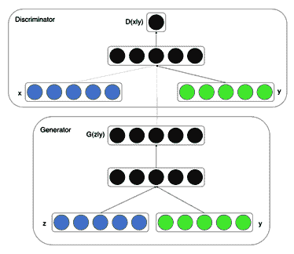
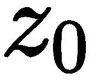
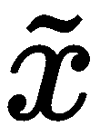
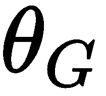
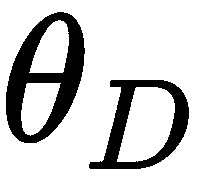
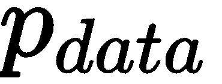
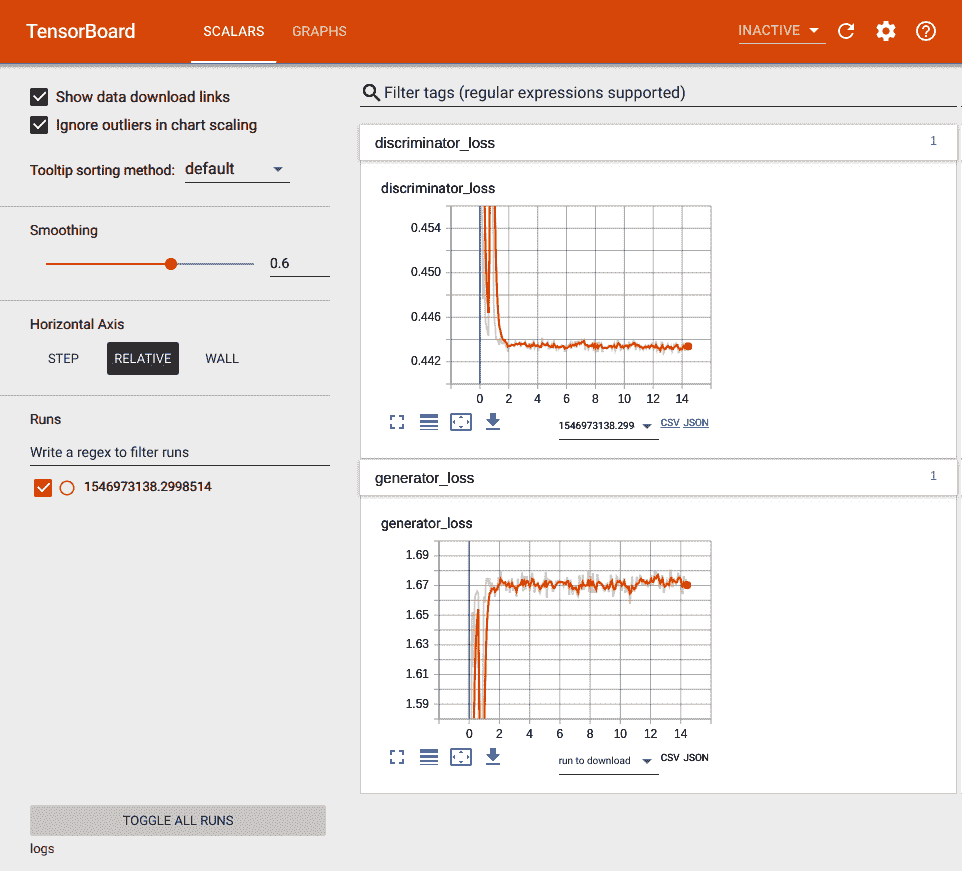
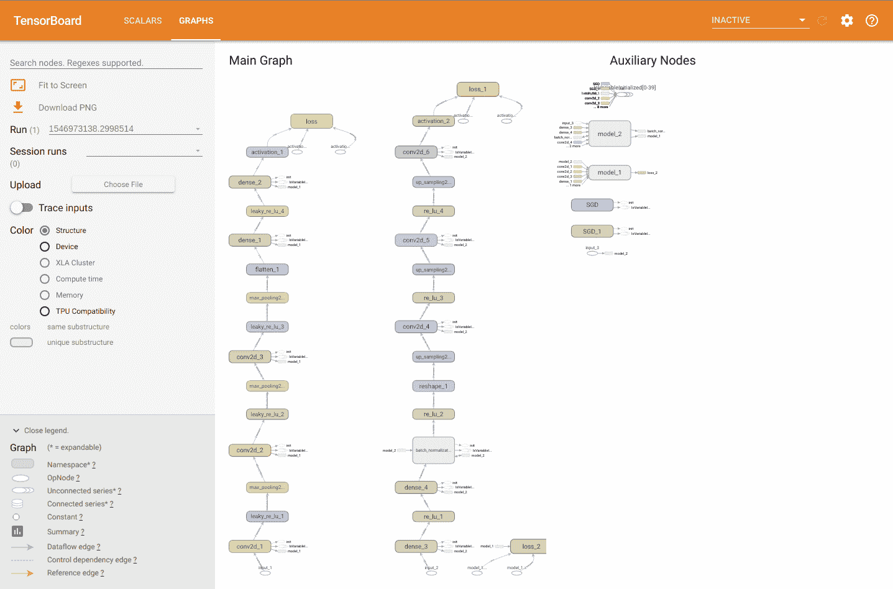

# 使用条件 GAN 进行面部老化


**条件 GAN**（**cGAN**）是 GAN 模型的扩展。 它们允许生成具有特定条件或属性的图像，因此被证明比朴素 GAN 更好。 在本章中，我们将实现一个 cGAN，该 cGAN 一旦经过训练，就可以执行自动面部老化。 Grigory Antipov，Moez Baccouche 和 Jean-Luc Dugelay 在其名为《使用条件生成对抗网络的人脸老化》的论文中，首先介绍了我们将要实现的 cGAN 网络。 [可以在以下链接中找到](https://arxiv.org/pdf/1702.01983.pdf)。

在本章中，我们将介绍以下主题：

*   介绍用于面部老化的 cGAN
*   设置项目
*   准备数据
*   cGAN 的 Keras 实现
*   训练 cGAN
*   评估和超参数调整
*   面部老化的实际应用


# 介绍用于面部老化的 cGAN


到目前为止，我们已经针对不同的用例实现了不同的 GAN 网络。 条件 GAN 扩展了普通 GAN 的概念，并允许我们控制生成器网络的输出。 面部老化就是在不更改身份的情况下更改一个人的面部年龄。 在大多数其他模型（包括 GAN）中，由于不考虑面部表情和面部配件（例如太阳镜或胡须），因此会使人的外观或身份损失 50%。 Age-cGAN 会考虑所有这些属性。 在本节中，我们将探索用于面部老化的 cGAN。


# 了解 cGAN


cGAN 是 GAN 的一种，它取决于一些额外的信息。 我们将额外的`y`信息作为额外的输入层提供给生成器。 在朴素 GAN 中，无法控制所生成图像的类别。 当我们向生成器添加条件`y`时，我们可以使用`y`生成特定类别的图像，该图像可以是任何类型的数据，例如类标签或整数数据 。 Vanilla GAN 只能学习一个类别，而为多个类别构造 GAN 则非常困难。 但是，可以使用 cGAN 生成针对不同类别具有不同条件的多模式模型。

下图显示了 cGAN 的体系结构：



cGAN 的训练目标函数可以表示为：


此处，`G`是生成器网络，`D`是判别器网络。 判别器的损失为，  生成器的损失为。  我们可以说`G(z|y)`在给定`z`和`y`情况下建模我们数据的分布。 在此，`z`是从正态分布得出的尺寸为 100 的先验噪声分布。


# Age-cGAN 的架构


用于面部老化的 cGAN 的架构稍微复杂一些。 Age-cGan 由四个网络组成：编码器，FaceNet，生成器网络和判别器网络。 使用编码器，我们可以利用潜在的向量来学习输入面部图像和年龄条件的逆映射。  FaceNet 是面部识别网络，用于学习输入图像`x`与重构的图像之间的差异。 我们有一个生成器网络，该网络使用由人脸图像和条件向量组成的隐藏表示并生成图像。 判别器网络将区分真实图像和伪图像。

cGAN 的问题在于它们无法学习将属性`y`的 输入图像`x`逆映射到潜向量`z`的任务。解决此问题的方法是使用编码器网络。 我们可以训练一个编码器网络来近似输入图像`x`的逆映射。 在本节中，我们将探讨 Age-cGAN 涉及的网络。


# 编码器网络


编码器网络的主要目标是生成所提供图像的潜向量。 基本上，它会拍摄尺寸为`(64, 64, 3)`的图像，并将其转换为 100 维向量。 编码器网络是一个深度卷积神经网络。 网络包含四个卷积块和两个密集层。 每个卷积块包含一个卷积层，一个批标准化层和一个激活函数。 在每个卷积块中，每个卷积层后面都有一个批处理归一化层，但第一个卷积层除外。 Age-cGAN 部分的 *Keras 实现将介绍编码器网络的配置。*


# 生成器网络


生成器的主要目标是生成尺寸为`(64, 64, 3)`的图像。 它需要一个 100 维的潜向量和一些额外的信息`y`和尝试生成逼真的图像。 生成器网络也是一个深层卷积神经网络。 它由密集，上采样和卷积层组成。 它采用两个输入值：噪声向量和条件值。 条件值是提供给网络的附加信息。 对于 Age-cGAN，这就是年龄。 生成器网络的配置将在 Age-cGAN 部分的“Keras 实现”中进行介绍。


# 鉴别网络


判别器网络的主要目标是识别所提供的图像是伪造的还是真实的。 它通过使图像经过一系列下采样层和一些分类层来实现。 换句话说，它可以预测图像是真实的还是伪造的。 像其他网络一样，判别器网络是另一个深度卷积网络。 它包含几个卷积块。 每个卷积块都包含一个卷积层，一个批处理归一化层和一个激活函数，除了第一个卷积块之外，它没有批处理归一化层。 区分网络的配置将在 Age-cGAN 部分的“Keras 实现”中进行介绍。


# 人脸识别网络


面部识别网络的主要目标是在给定图像中识别人的身份。 对于我们的任务，我们将使用没有完全连接的层的预训练的 Inception-ResNet-2 模型。 Keras 有一个很好的预训练模型库。 出于实验目的，您也可以使用其他网络，例如 Inception 或 ResNet-50。 要了解有关 Inception-ResNet-2 的更多信息，[请访问链接](https://arxiv.org/pdf/1602.07261.pdf)。 一旦提供了图像，经过预训练的 Inception-ResNet-2 网络将返回相应的嵌入。 可以通过计算嵌入的欧几里德距离来计算针对真实图像和重建图像的提取的嵌入。 关于年龄识别网络的更多信息将在 Age-cGAN 部分的“Keras 实现”中进行介绍。


# 时代的阶段


Age-cGAN 具有多个训练阶段。 如上一节所述，Age-cGAN 具有四个网络，并经过三个阶段的训练。 Age-cGAN 的训练包括三个阶段：

1.  **有条件的 GAN 训练**：在此阶段，我们训练生成器网络和判别器网络。
2.  **初始潜在向量近似**：在此阶段，我们训练编码器网络。
3.  **潜向量优化**：在此阶段，我们同时优化编码器和生成器网络。

以下屏幕截图显示了 Age-cGAN 的各个阶段：


Stages in the Age-cGANSource: Face Aging with Conditional Generative Adversarial Networks, https://arxiv.org/pdf/1702.01983.pdf

我们将在以下部分介绍 Age- cGAN 的所有阶段。


# Conditional GAN training


在这个阶段，我们训练生成器网络和判别器网络。 经过训练后，生成器网络可以生成面部的模糊图像。 此阶段类似于训练朴素 GAN，其中我们同时训练两个网络。


# 训练目标功能


用于训练 cGAN 的训练目标函数可以表示为：


训练 cGAN 网络涉及优化函数，  。 训练 cGAN 可以看作是 minimax 游戏，其中同时对生成器和判别器进行训练。 在上式中， 代表生成器网络的参数， 代表`G`和`D`的 参数 ， 是判别器模型的损失，是  对于生成器模型的损失，  是分布  所有可能的图像。


# 初始潜在​​向量近似


**初始潜在向量近似** 是一种近似潜在向量以优化人脸图像重建的方法。 为了近似一个潜在向量，我们有一个编码器网络。 我们在生成的图像和真实图像上训练编码器网络。 训练后，编码器网络将开始从学习到的分布中生成潜在向量。 用于训练编码器网络的训练目标函数是欧几里得距离损失。


# 潜在向量优化


在潜在向量优化过程中，我们同时优化了编码器网络和生成器网络。 我们用于潜在向量优化的方程式如下：


*FR* 是面部识别网络。 该方程式表明，真实图像和重建图像之间的欧几里得距离应最小。 在此阶段，我们尝试最小化距离以最大程度地保留身份。


# 设置项目


如果尚未使用所有章节的完整代码克隆存储库，请立即克隆存储库。 克隆的存储库有一个名为`Chapter03`的目录，其中包含本章的全部代码。 执行以下命令来设置项目：

1.  首先，导航到父目录，如下所示：

```py
cd Generative-Adversarial-Networks-Projects
```

2.  现在，将目录从当前目录更改为  `Chapter03`：

```py
cd Chapter03
```

3.  接下来，为该项目创建一个 Python 虚拟环境：

```py
virtualenv venv
virtualenv venv -p python3 # Create a virtual environment using python3 interpreter
virtualenv venv -p python2 # Create a virtual environment using python2 interpreter
```

我们将为此项目使用此新创建的虚拟环境。 每章都有其自己单独的虚拟环境。

4.  接下来，激活新创建的虚拟环境：

```py
source venv/bin/activate
```

激活虚拟环境后，所有其他命令将在此虚拟环境中执行。

5.  接下来，通过执行以下命令，安装`requirements.txt` 文件中提供的所有库：

```py
pip install -r requirements.txt
```

您可以参考  `README.md` 文件，以获取有关如何设置项目的更多说明。 开发人员经常会遇到依赖关系不匹配的问题。 为每个项目创建一个单独的虚拟环境将解决此问题。

在本节中，我们已成功设置项目并安装了所需的依赖项。 在下一部分中，我们将处理数据集。


# 准备数据


在本章中，我们将使用`Wiki-Cropped`数据集，其中包含 64 张以上 328 张不同人脸的图像。 作者还提供了数据集 ，该数据集仅包含已裁剪的面部，因此我们无需裁剪面部。

The authors of the paper titled *Deep expectation of real and apparent age from a single image without facial landmarks,* which is available at[https://www.vision.ee.ethz.ch/en/publications/papers/articles/eth_biwi_01299.pdf](https://www.vision.ee.ethz.ch/en/publications/papers/articles/eth_biwi_01299.pdf), have scraped these images from Wikipedia and made them available for academic purposes. If you intend to use the dataset for commercial purposes, contact the authors at `rrothe@vision.ee.ethz.ch`.

您可以从[以下链接](https://data.vision.ee.ethz.ch/cvl/rrothe/imdb-wiki/)手动下载数据集，并将所有压缩文件放置在 Age-cGAN 项目内的目录中。

执行以下步骤以下载和提取数据集。


# 下载数据集


要下载仅包含裁剪的面的数据集，请执行以下命令：

```py
# Before download the dataset move to data directory
cd data

# Wikipedia : Download faces only
wget https://data.vision.ee.ethz.ch/cvl/rrothe/imdb-wiki/static/wiki_crop.tar
```


# 提取数据集


下载数据集后，手动将文件提取到数据文件夹中，或执行以下命令来提取文件：

```py
# Move to data directory
cd data

# Extract wiki_crop.tar
tar -xvf wiki_crop.tar
```

`wiki_crop.tar`文件包含 62,328 张图像和一个包含所有标签的`wiki.mat`文件。 `scipy.io`库有一个称为`loadmat`的方法，这是在 Python 中加载`.mat`文件的非常方便的方法。 使用以下代码加载提取的`.mat`文件：

```py
def load_data(wiki_dir, dataset='wiki'):
    # Load the wiki.mat file
  meta = loadmat(os.path.join(wiki_dir, "{}.mat".format(dataset)))

    # Load the list of all files
  full_path = meta[dataset][0, 0]["full_path"][0]

    # List of Matlab serial date numbers
  dob = meta[dataset][0, 0]["dob"][0]

    # List of years when photo was taken
  photo_taken = meta[dataset][0, 0]["photo_taken"][0]  # year   # Calculate age for all dobs  age = [calculate_age(photo_taken[i], dob[i]) for i in range(len(dob))]

    # Create a list of tuples containing a pair of an image path and age
  images = []
    age_list = []
    for index, image_path in enumerate(full_path):
        images.append(image_path[0])
        age_list.append(age[index])

    # Return a list of all images and respective age
  return images, age_list
```

`photo_taken`变量是年份列表，`dob`是 Matlab 列表中相应照片的序列号。 我们可以根据序列号和照片拍摄的年份来计算该人的年龄。 使用以下代码来计算年龄：

```py
def calculate_age(taken, dob):
    birth = datetime.fromordinal(max(int(dob) - 366, 1))

    # assume the photo was taken in the middle of the year
  if birth.month < 7:
        return taken - birth.year
    else:
        return taken - birth.year - 1
```

现在，我们已经成功下载并提取了数据集。 在下一节中，让我们研究 Age-cGAN 的 Keras 实现。


# Age-cGAN 的 Keras 实现


像普通 GAN 一样，cGAN 的实现非常简单。 Keras 提供了足够的灵活性来编码复杂的生成对抗网络。 在本节中，我们将实现 cGAN 中使用的生成器网络，判别器网络和编码器网络。 让我们从实现编码器网络开始。

在开始编写实现之前，创建一个名为 `main.py` 的 Python 文件，并导入基本模块，如下所示：

```py
import math
import os
import time
from datetime import datetime

import matplotlib.pyplot as plt
import numpy as np
import tensorflow as tf
from keras import Input, Model
from keras.applications import InceptionResNetV2
from keras.callbacks import TensorBoard
from keras.layers import Conv2D, Flatten, Dense, BatchNormalization, Reshape, concatenate, LeakyReLU, Lambda, \
    K, Conv2DTranspose, Activation, UpSampling2D, Dropout
from keras.optimizers import Adam
from keras.utils import to_categorical
from keras_preprocessing import image
from scipy.io import loadmat
```


# 编码器网络


编码器网络是**卷积神经网络**（**CNN**），可将图像（`x`）编码为潜向量（`z`）或 潜在的向量表示。 让我们从在 Keras 框架中实现编码器网络开始。

执行以下步骤来实现编码器网络：

1.  首先创建一个输入层：

```py
input_layer = Input(shape=(64, 64, 3))
```

2.  接下来，添加第一个卷积块，其中包含具有激活函数的 2D 卷积层，具有以下配置：
    *   **过滤器**：`32`
    *   **内核大小**：`5`
    *   **大步前进**：`2`
    *   **填充**：``same``
    *   **激活**：`LeakyReLU`，其中`alpha`等于`0.2`：

```py
# 1st Convolutional Block enc = Conv2D(filters=32, kernel_size=5, strides=2, padding='same')(input_layer)  enc = LeakyReLU(alpha=0.2)(enc)
```

3.  接下来，再添加三个卷积块，其中每个都包含一个 2D 卷积层，然后是一个批处理归一化层和一个激活函数，具有以下配置：
    *   **过滤器**：`64`，`128`，`256`
    *   **内核大小**：`5`，`5`，`5`
    *   **跨越**：`2`，`2`，`2`
    *   **填充**：`same`，`same`，``same``
    *   **批量归一化**：每个卷积层后面都有一个批量归一化层
    *   **激活**：`LealyReLU`，`LeakyReLU`，`LeakyReLU`，其中`alpha`等于`0.2`：

```py
# 2nd Convolutional Block enc = Conv2D(filters=64, kernel_size=5, strides=2, padding='same')(enc)
enc = BatchNormalization()(enc)
enc = LeakyReLU(alpha=0.2)(enc)

# 3rd Convolutional Block enc = Conv2D(filters=128, kernel_size=5, strides=2, padding='same')(enc)
enc = BatchNormalization()(enc)
enc = LeakyReLU(alpha=0.2)(enc)

# 4th Convolutional Block enc = Conv2D(filters=256, kernel_size=5, strides=2, padding='same')(enc)
enc = BatchNormalization()(enc)
enc = LeakyReLU(alpha=0.2)(enc)
```

4.  接下来，将最后一个卷积块的输出展开，如下所示：

```py
# Flatten layer enc = Flatten()(enc)
```

Converting an`n`-dimensional tensor to a one-dimensional tensor (array) is called **flattening**.

5.  接下来，添加具有以下配置的密集（完全连接）层，批处理规范化层和激活函数：
    *   **单位（节点）**：2,096
    *   **批量标准化**：是
    *   **激活**：`LeakyReLU`，其中`alpha`等于`0.2`：

```py
# 1st Fully Connected Layer enc = Dense(4096)(enc)
enc = BatchNormalization()(enc)
enc = LeakyReLU(alpha=0.2)(enc)
```

6.  接下来，使用以下配置添加第二个密集（完全连接）层：
    *   **单位（节点）**：`100`
    *   **激活**：无：

```py
# Second Fully Connected Layer enc = Dense(100)(enc)
```

7.  最后，创建 Keras 模型并指定编码器网络的输入和输出：

```py
# Create a model model = Model(inputs=[input_layer], outputs=[enc])
```

编码器网络的完整代码如下所示：

```py
def build_encoder():
    """
 Encoder Network   :return: Encoder model
 """  input_layer = Input(shape=(64, 64, 3))

    # 1st Convolutional Block
  enc = Conv2D(filters=32, kernel_size=5, strides=2, padding='same')(input_layer)   enc = LeakyReLU(alpha=0.2)(enc)

    # 2nd Convolutional Block
  enc = Conv2D(filters=64, kernel_size=5, strides=2, padding='same')(enc)
    enc = BatchNormalization()(enc)
    enc = LeakyReLU(alpha=0.2)(enc)

    # 3rd Convolutional Block
  enc = Conv2D(filters=128, kernel_size=5, strides=2, padding='same')(enc)
    enc = BatchNormalization()(enc)
    enc = LeakyReLU(alpha=0.2)(enc)

    # 4th Convolutional Block
  enc = Conv2D(filters=256, kernel_size=5, strides=2, padding='same')(enc)
    enc = BatchNormalization()(enc)
    enc = LeakyReLU(alpha=0.2)(enc)

    # Flatten layer
  enc = Flatten()(enc)

    # 1st Fully Connected Layer
  enc = Dense(4096)(enc)
    enc = BatchNormalization()(enc)
    enc = LeakyReLU(alpha=0.2)(enc)

    # Second Fully Connected Layer
  enc = Dense(100)(enc)

    # Create a model
  model = Model(inputs=[input_layer], outputs=[enc])
    return model
```

我们现在已经成功地为编码器网络创建了 Keras 模型。 接下来，为生成器网络创建 Keras 模型。


# 生成器网络


生成器网络是一个 CNN，它采用 100 维向量`z`，并生成尺寸为`(64, 64, 3)`的图像。 让我们在 Keras 框架中实现生成器网络。

执行以下步骤以实现生成器网络：

1.  首先创建生成器网络的两个输入层：

```py
latent_dims = 100 num_classes = 6 
# Input layer for vector z
input_z_noise = Input(shape=(latent_dims, ))

# Input layer for conditioning variable
input_label = Input(shape=(num_classes, ))
```

2.  接下来，沿着通道维度连接输入，如下所示：

```py
x = concatenate([input_z_noise, input_label])
```

上一步将生成级联张量。

3.  接下来，添加具有以下配置的密集（完全连接）块：
    *   **单位（节点）**：`2,048`
    *   **输入尺寸**：106
    *   **激活**：`LeakyReLU`的`alpha`等于``0.2``
    *   **退出**：`0.2`：

```py
x = Dense(2048, input_dim=latent_dims+num_classes)(x)
x = LeakyReLU(alpha=0.2)(x)
x = Dropout(0.2)(x)
```

4.  接下来，使用以下配置添加第二个密集（完全连接）块：
    *   **单位（节点）**：16,384
    *   **批量标准化**：是
    *   **激活**：`alpha`等于`0.2`的`LeakyReLU`
    *   **退出**：`0.2`：

```py
x = Dense(256 * 8 * 8)(x)
x = BatchNormalization()(x)
x = LeakyReLU(alpha=0.2)(x)
x = Dropout(0.2)(x)
```

5.  接下来，将最后一个密集层的输出重塑为尺寸为`(8, 8, 256)`的三维张量：

```py
x = Reshape((8, 8, 256))(x)
```

该层将生成张量为（`batch_size`，`8, 8, 256`）的张量。

6.  接下来，添加一个升采样模块，该模块包含一个升采样层，其后是一个具有以下配置的 2D 卷积层和一个批归一化层：
    *   **上采样大小**：`(2, 2)`
    *   **过滤器**：`128`
    *   **内核大小**：`5`
    *   **填充**：`same`
    *   **批量规范化**：是，`momentum`等于`0.8`
    *   **激活**：`LeakyReLU`，其中`alpha`等于`0.2`：

```py
x = UpSampling2D(size=(2, 2))(x)
x = Conv2D(filters=128, kernel_size=5, padding='same')(x)
x = BatchNormalization(momentum=0.8)(x)
x = LeakyReLU(alpha=0.2)(x)
```

`Upsampling2D` is the process of repeating the rows a specified number of times`x`and repeating the columns a specified number of times`y`, respectively.

7.  接下来，添加另一个上采样块（类似于上一层），如以下代码所示。 除了卷积层中使用的过滤器数为`128`之外，该配置与上一个块类似：

```py
x = UpSampling2D(size=(2, 2))(x)
x = Conv2D(filters=64, kernel_size=5, padding='same')(x)
x = BatchNormalization(momentum=0.8)(x)
x = LeakyReLU(alpha=0.2)(x)
```

8.  接下来，添加最后一个升采样块。 该配置与上一层相似，除了在卷积层中使用了三个过滤器并且不使用批处理归一化的事实：

```py
x = UpSampling2D(size=(2, 2))(x)
x = Conv2D(filters=3, kernel_size=5, padding='same')(x)
x = Activation('tanh')(x)
```

9.  最后，创建 Keras 模型并指定生成器网络的输入和输出：

```py
model = Model(inputs=[input_z_noise, input_label], outputs=[x])
```

生成器网络的完整代码如下所示：

```py
def build_generator():
    """
 Create a Generator Model with hyperparameters values defined as follows  :return: Generator model
 """  latent_dims = 100
  num_classes = 6    input_z_noise = Input(shape=(latent_dims,))
    input_label = Input(shape=(num_classes,))

    x = concatenate([input_z_noise, input_label])

    x = Dense(2048, input_dim=latent_dims + num_classes)(x)
    x = LeakyReLU(alpha=0.2)(x)
    x = Dropout(0.2)(x)

    x = Dense(256 * 8 * 8)(x)
    x = BatchNormalization()(x)
    x = LeakyReLU(alpha=0.2)(x)
    x = Dropout(0.2)(x)

    x = Reshape((8, 8, 256))(x)

    x = UpSampling2D(size=(2, 2))(x)
    x = Conv2D(filters=128, kernel_size=5, padding='same')(x)
    x = BatchNormalization(momentum=0.8)(x)
    x = LeakyReLU(alpha=0.2)(x)

    x = UpSampling2D(size=(2, 2))(x)
    x = Conv2D(filters=64, kernel_size=5, padding='same')(x)
    x = BatchNormalization(momentum=0.8)(x)
    x = LeakyReLU(alpha=0.2)(x)

    x = UpSampling2D(size=(2, 2))(x)
    x = Conv2D(filters=3, kernel_size=5, padding='same')(x)
    x = Activation('tanh')(x)

    model = Model(inputs=[input_z_noise, input_label], outputs=[x])
    return model
```

现在，我们已经成功创建了生成器网络。 接下来，我们将为判别器网络编写代码。


# 鉴别网络


判别器网络是 CNN。 让我们在 Keras 框架中实现判别器网络。

执行以下步骤以实现判别器网络：

1.  首先创建两个输入层，因为我们的判别器网络将处理两个输入：

```py
# Specify hyperparameters
# Input image shape
input_shape = (64, 64, 3)
# Input conditioning variable shape
label_shape = (6,)

# Two input layers
image_input = Input(shape=input_shape)
label_input = Input(shape=label_shape)
```

2.  接下来，添加具有以下配置的二维卷积块（Conv2D + 激活函数）：
    *   **过滤器** = `64`
    *   **内核大小**：`3`
    *   **大步前进**：`2`
    *   **填充**：`same`
    *   **激活**：`LeakyReLU`，其中`alpha`等于`0.2`：

```py
x = Conv2D(64, kernel_size=3, strides=2, padding='same')(image_input)
x = LeakyReLU(alpha=0.2)(x)
```

3.  接下来，展开`label_input`使其具有`(32, 32, 6)`的形状：

```py
label_input1 = Lambda(expand_label_input)(label_input)
```

`expand_label_input`功能如下：

```py
# The expand_label_input function
def expand_label_input(x):
    x = K.expand_dims(x, axis=1)
    x = K.expand_dims(x, axis=1)
    x = K.tile(x, [1, 32, 32, 1])
    return x
```

前面的函数会将尺寸为`(6, )`的张量转换为尺寸为`(32, 32, 6)`的张量。

4.  接下来，沿着通道维度将变换后的标签张量和最后一个卷积层的输出串联起来，如下所示：

```py
x = concatenate([x, label_input1], axis=3)
```

5.  添加具有以下配置的卷积块（2D 卷积层 + 批处理归一化 + 激活函数）：
    *   **过滤器**：`128`
    *   **内核大小**：`3`
    *   **大步前进**：`2`
    *   **填充**：`same`
    *   **批量标准化**：是
    *   **激活**：`LeakyReLU`，其中`alpha`等于`0.2`：

```py
x = Conv2D(128, kernel_size=3, strides=2, padding='same')(x)
x = BatchNormalization()(x)
x = LeakyReLU(alpha=0.2)(x)
```

6.  接下来，再添加两个卷积块，如下所示：

```py
x = Conv2D(256, kernel_size=3, strides=2, padding='same')(x)
x = BatchNormalization()(x)
x = LeakyReLU(alpha=0.2)(x)

x = Conv2D(512, kernel_size=3, strides=2, padding='same')(x)
x = BatchNormalization()(x)
x = LeakyReLU(alpha=0.2)(x)
```

7.  接下来，添加一个扁平层：

```py
x = Flatten()(x)
```

8.  接下来，添加一个输出概率的密集层（分类层）：

```py
x = Dense(1, activation='sigmoid')(x)
```

9.  最后，创建 Keras 模型并指定判别器网络的输入和输出：

```py
model = Model(inputs=[image_input, label_input], outputs=[x])
```

判别器网络的整个代码如下：

```py
def build_discriminator():
    """
 Create a Discriminator Model with hyperparameters values defined as follows  :return: Discriminator model
 """  input_shape = (64, 64, 3)
    label_shape = (6,)
    image_input = Input(shape=input_shape)
    label_input = Input(shape=label_shape)

    x = Conv2D(64, kernel_size=3, strides=2, padding='same')(image_input)
    x = LeakyReLU(alpha=0.2)(x)

    label_input1 = Lambda(expand_label_input)(label_input)
    x = concatenate([x, label_input1], axis=3)

    x = Conv2D(128, kernel_size=3, strides=2, padding='same')(x)
    x = BatchNormalization()(x)
    x = LeakyReLU(alpha=0.2)(x)

    x = Conv2D(256, kernel_size=3, strides=2, padding='same')(x)
    x = BatchNormalization()(x)
    x = LeakyReLU(alpha=0.2)(x)

    x = Conv2D(512, kernel_size=3, strides=2, padding='same')(x)
    x = BatchNormalization()(x)
    x = LeakyReLU(alpha=0.2)(x)

    x = Flatten()(x)
    x = Dense(1, activation='sigmoid')(x)

    model = Model(inputs=[image_input, label_input], outputs=[x])
    return model
```

现在，我们已经成功创建了编码器，生成器和判别器网络。 在下一部分中，我们将组装所有内容并训练网络。


# 训练 cGAN


训练 cGAN 进行面部老化的过程分为三个步骤：

1.  训练 cGAN
2.  初始潜在​​向量近似
3.  潜在向量优化

我们将在以下各节中逐一介绍这些步骤。


# 训练 cGAN


这是训练过程的第一步。 在这一步中，我们训练生成器和判别器网络。 执行以下步骤：

1.  首先指定训练所需的参数：

```py
# Define hyperparameters
data_dir = "/path/to/dataset/directory/" wiki_dir = os.path.join(data_dir, "wiki_crop")
epochs = 500 batch_size = 128 image_shape = (64, 64, 3)
z_shape = 100 TRAIN_GAN = True TRAIN_ENCODER = False TRAIN_GAN_WITH_FR = False fr_image_shape = (192, 192, 3)
```

2.  接下来，为训练定义优化器。 我们将使用 Keras 中提供的`Adam`优化器。 初始化优化器，如以下代码所示：

```py
# Define optimizers
# Optimizer for the discriminator network dis_optimizer = Adam(lr=0.0002, beta_1=0.5, beta_2=0.999, epsilon=10e-8)

# Optimizer for the generator network
gen_optimizer = Adam(lr=0.0002, beta_1=0.5, beta_2=0.999, epsilon=10e-8)

# Optimizer for the adversarial network
adversarial_optimizer = Adam(lr=0.0002, beta_1=0.5, beta_2=0.999, epsilon=10e-8)
```

对于所有优化程序，请使用等于`0.0002`的学习速率，等于`0.5`的`beta_1`值，等于`0.999`的`beta_2`值以及等于`10e-8`的`epsilon`值。

3.  接下来，加载并编译生成器和判别器网络。 在 Keras 中，我们必须在训练网络之前编译网络：

```py
# Build and compile the discriminator network discriminator = build_discriminator()
discriminator.compile(loss=['binary_crossentropy'], optimizer=dis_optimizer)

# Build and compile the generator network generator = build_generator1()
generator.compile(loss=['binary_crossentropy'], optimizer=gen_optimizer)
```

要编译网络，请使用`binary_crossentropy`作为损失函数。

4.  接下来，构建并编译对抗模型，如下所示：

```py
# Build and compile the adversarial model discriminator.trainable = False input_z_noise = Input(shape=(100,))
input_label = Input(shape=(6,))
recons_images = generator([input_z_noise, input_label])
valid = discriminator([recons_images, input_label])
adversarial_model = Model(inputs=[input_z_noise, input_label], outputs=[valid])
adversarial_model.compile(loss=['binary_crossentropy'], optimizer=gen_optimizer)
```

要编译对抗模型，请使用`binary_crossentropy`作为损失函数，并使用`gen_optimizer`作为优化器。

5.  接下来，存储损失的`TensorBoard` 如下：

```py
tensorboard = TensorBoard(log_dir="logs/{}".format(time.time()))
tensorboard.set_model(generator)
tensorboard.set_model(discriminator)
```

6.  接下来，使用在*准备数据*部分中定义的`load_data`函数加载所有图像：

```py
images, age_list = load_data(wiki_dir=wiki_dir, dataset="wiki")
```

7.  接下来，将年龄数值转换为年龄类别，如下所示：

```py
# Convert age to category
age_cat = age_to_category(age_list)
```

`age_to_category`函数的定义如下：

```py
# This method will convert age to respective category
def age_to_category(age_list):
    age_list1 = []

    for age in age_list:
        if 0 < age <= 18:
            age_category = 0
  elif 18 < age <= 29:
            age_category = 1
  elif 29 < age <= 39:
            age_category = 2
  elif 39 < age <= 49:
            age_category = 3
  elif 49 < age <= 59:
            age_category = 4
  elif age >= 60:
            age_category = 5    age_list1.append(age_category)
    return age_list1
```

`age_cat`的输出应如下所示：

```py
[1, 2, 4, 2, 3, 4, 2, 5, 5, 1, 3, 2, 1, 1, 2, 1, 2, 2, 1, 5, 4 , .............]
```

将年龄类别转换为一键编码的向量：

```py
# Also, convert the age categories to one-hot encoded vectors
final_age_cat = np.reshape(np.array(age_cat), [len(age_cat), 1])
classes = len(set(age_cat))
y = to_categorical(final_age_cat, num_classes=len(set(age_cat)))
```

将年龄类别转换为一键编码的向量后，`y`的值应如下所示：

```py
[[0\. 1\. 0\. 0\. 0\. 0.]
 [0\. 0\. 1\. 0\. 0\. 0.]
 [0\. 0\. 0\. 0\. 1\. 0.]
 ...
 [0\. 0\. 0\. 1\. 0\. 0.]
 [0\. 1\. 0\. 0\. 0\. 0.]
 [0\. 0\. 0\. 0\. 1\. 0.]]
```

`y`的形状应为（`total_values`，`5`）。

8.  接下来，加载所有图像并创建一个包含所有图像的`ndarray`：

```py
# Read all images and create an ndarray
loaded_images = load_images(wiki_dir, images, (image_shape[0], image_shape[1]))
```

`load_images`函数的定义如下：

```py
def load_images(data_dir, image_paths, image_shape):
    images = None   for i, image_path in enumerate(image_paths):
        print()
        try:
            # Load image
  loaded_image = image.load_img(os.path.join(data_dir, image_path), target_size=image_shape)

            # Convert PIL image to numpy ndarray
  loaded_image = image.img_to_array(loaded_image)

            # Add another dimension (Add batch dimension)
  loaded_image = np.expand_dims(loaded_image, axis=0)

            # Concatenate all images into one tensor
  if images is None:
                images = loaded_image
            else:
                images = np.concatenate([images, loaded_image], axis=0)
        except Exception as e:
            print("Error:", i, e)

    return images
```

`loaded_images`中的值应如下所示：

```py
[[[[ 97\. 122\. 178.]
 [ 98\. 123\. 179.]
 [ 99\. 124\. 180.]
 ...
 [ 97\. 124\. 179.]
 [ 96\. 123\. 178.]
 [ 95\. 122\. 177.]]
...
[[216\. 197\. 203.]
 [217\. 198\. 204.]
 [218\. 199\. 205.]
 ...
 [ 66\. 75\. 90.]
 [110\. 127\. 171.]
 [ 89\. 115\. 172.]]]
 [[[122\. 140\. 152.]
 [115\. 133\. 145.]
 [ 95\. 113\. 123.]
 ...
 [ 41\. 73\. 23.]
 [ 38\. 77\. 22.]
 [ 38\. 77\. 22.]]
[[ 53\. 80\. 63.]
 [ 47\. 74\. 57.]
 [ 45\. 72\. 55.]
 ...
 [ 34\. 66...
```

9.  接下来，创建一个`for`循环，该循环应运行的次数由时期数指定，如下所示：

```py
for epoch in range(epochs):
    print("Epoch:{}".format(epoch))

    gen_losses = []
    dis_losses = []

    number_of_batches = int(len(loaded_images) / batch_size)
    print("Number of batches:", number_of_batches)
```

10.  接下来，在纪元循环内创建另一个循环，并使它运行 `num_batches` 指定的次数，如下所示：

```py
 for index in range(number_of_batches):
        print("Batch:{}".format(index + 1))
```

我们用于区分网络和对抗网络训练的整个代码将在此循环内。

11.  接下来，对真实数据集中的一批图像和一批一次性编码的年龄向量进行采样：

```py
        images_batch = loaded_images[index * batch_size:(index + 1) * batch_size]
        images_batch = images_batch / 127.5 - 1.0
        images_batch = images_batch.astype(np.float32)

        y_batch = y[index * batch_size:(index + 1) * batch_size]
```

`image_batch`的形状应为[`batch_size`和`64, 64, 3`），`y_batch`的形状应为（`batch_size`和`6`）。

12.  接下来，从高斯分布中采样一批噪声向量，如下所示：

```py
        z_noise = np.random.normal(0, 1, size=(batch_size, z_shape))
```

13.  接下来，使用生成器网络生成伪造图像。 请记住，我们尚未训练生成器网络：

```py
        initial_recon_images = generator.predict_on_batch([z_noise, y_batch])
```

生成器网络有两个输入`z_noise`和`y_batch`，它们是我们在步骤 11 和 12 中创建的。

14.  现在，在真实图像和伪图像上训练判别器网络：

```py
        d_loss_real = discriminator.train_on_batch([images_batch, y_batch], real_labels)
        d_loss_fake = discriminator.train_on_batch([initial_recon_images, y_batch], fake_labels)
```

此代码应在一批图像上训练判别器网络。 在每个步骤中，将对一批样本进行鉴别。

15.  接下来，训练对抗网络。 通过冻结判别器网络，我们将仅训练生成器网络：

```py
        # Again sample a batch of noise vectors from a Gaussian(normal) distribution 
        z_noise2 = np.random.normal(0, 1, size=(batch_size, z_shape))

 # Samples a batch of random age values        random_labels = np.random.randint(0, 6, batch_size).reshape(-1, 1)

        # Convert the random age values to one-hot encoders
        random_labels = to_categorical(random_labels, 6)

        # Train the generator network
        g_loss = adversarial_model.train_on_batch([z_noise2, sampled_labels], [1] * batch_size)
```

前面的代码将在一批输入上训练生成器网络。 对抗模型的输入是`z_noise2`和`random_labels`。

16.  接下来，计算并打印损失：

```py
        d_loss = 0.5 * np.add(d_loss_real, d_loss_fake)
 print("d_loss:{}".format(d_loss))
        print("g_loss:{}".format(g_loss))

        # Add losses to their respective lists
        gen_losses.append(g_loss)
        dis_losses.append(d_loss)
```

17.  接下来，将损失写入 TensorBoard 以进行可视化：

```py
    write_log(tensorboard, 'g_loss', np.mean(gen_losses), epoch)
    write_log(tensorboard, 'd_loss', np.mean(dis_losses), epoch)
```

18.  每隔 10 个周期取样并保存图像，如下所示：

```py
 if epoch % 10 == 0:
        images_batch = loaded_images[0:batch_size]
        images_batch = images_batch / 127.5 - 1.0
  images_batch = images_batch.astype(np.float32)

        y_batch = y[0:batch_size]
        z_noise = np.random.normal(0, 1, size=(batch_size, z_shape))

        gen_images = generator.predict_on_batch([z_noise, y_batch])

        for i, img in enumerate(gen_images[:5]):
            save_rgb_img(img, path="results/img_{}_{}.png".format(epoch, i))
```

将前面的代码块放入周期循环中。 每隔 10 个时间段，它将生成一批伪图像并将其保存到结果目录。 这里， `save_rgb_img()` 是效用函数，定义如下：

```py
def save_rgb_img(img, path):
 """
 Save a rgb image """  fig = plt.figure()
 ax = fig.add_subplot(1, 1, 1)
 ax.imshow(img)
 ax.axis("off")
 ax.set_title("Image")

 plt.savefig(path)
 plt.close()
```

19.  最后，通过添加以下行来保存两个模型：

```py
# Save weights only
generator.save_weights("generator.h5")
discriminator.save_weights("discriminator.h5")

# Save architecture and weights both
generator.save("generator.h5)
discriminator.save("discriminator.h5")
```

如果您已成功执行本节中给出的代码，则说明您已成功训练了生成器和判别器网络。 在此步骤之后，生成器网络将开始生成模糊的面部图像。 在下一部分中，我们将训练编码器模型以进行初始潜在向量近似。


# 初始潜在​​向量近似


正如我们已经讨论过的，cGAN 不会学习从图像到潜在向量的反向映射。 取而代之的是，编码器学习了这种反向映射，并能够生成潜在向量，我们可以将其用于在目标年龄生成人脸图像。 让我们训练编码器网络。

我们已经定义了训练所需的超参数。 执行以下步骤来训练编码器网络：

1.  首先建立编码器网络。 添加以下代码以构建和编译网络：

```py
# Build Encoder encoder = build_encoder()
encoder.compile(loss=euclidean_distance_loss, optimizer='adam')
```

我们尚未定义`euclidean_distance_loss`。 在构建编码器网络之前，让我们对其进行定义并添加以下内容：

```py
def euclidean_distance_loss(y_true, y_pred):
    """
 Euclidean distance loss  """  return K.sqrt(K.sum(K.square(y_pred - y_true), axis=-1))
```

2.  接下来，加载生成器网络，如下所示：

```py
generator.load_weights("generator.h5")
```

在这里，我们正在加载上一步的权重，在该步骤中，我们成功地训练并保存了生成器网络的权重。

3.  接下来，对一批潜在向量进行采样，如下所示：

```py
z_i = np.random.normal(0, 1, size=(1000, z_shape))
```

4.  接下来，对一批随机年龄数字进行采样，并将随机年龄数字转换为单热编码向量，如下所示：

```py
y = np.random.randint(low=0, high=6, size=(1000,), dtype=np.int64)
num_classes = len(set(y))
y = np.reshape(np.array(y), [len(y), 1])
y = to_categorical(y, num_classes=num_classes)
```

您可以随意采样。 在我们的例子中，我们正在采样 1,000 个值。

5.  接下来，添加一个纪元循环和一个批处理步骤循环，如下所示：

```py
for epoch in range(epochs):
    print("Epoch:", epoch)

    encoder_losses = []

    number_of_batches = int(z_i.shape[0] / batch_size)
    print("Number of batches:", number_of_batches)
    for index in range(number_of_batches):
        print("Batch:", index + 1)
```

6.  现在，从 1,000 个样本中采样一批潜伏向量和一批单热编码向量，如下所示：

```py
        z_batch = z_i[index * batch_size:(index + 1) * batch_size]
        y_batch = y[index * batch_size:(index + 1) * batch_size]
```

7.  接下来，使用预先训练的生成器网络生成伪造图像：

```py
        generated_images = generator.predict_on_batch([z_batch, y_batch])
```

8.  最后，通过生成器网络在生成的图像上训练编码器网络：

```py
        encoder_loss = encoder.train_on_batch(generated_images, z_batch)
```

9.  接下来，在每个时期之后，将编码器损耗写入 TensorBoard，如下所示：

```py
    write_log(tensorboard, "encoder_loss", np.mean(encoder_losses), epoch)
```

10.  我们需要保存训练有素的编码器网络。 通过添加以下代码来保存编码器模型：

```py
encoder.save_weights("encoder.h5")
```

如果您已成功执行了本节中给出的代码，则将成功地训练编码器模型。 现在，我们的编码器网络已准备好生成初始潜向量。 在下一节中，我们将学习如何执行优化的潜在向量近似。


# 潜在向量优化


在前面的两个步骤中，我们成功地训练了生成器网络，判别器网络和编码器网络。 在本节中，我们将改进编码器和生成器网络。 在这些步骤中，我们将使用**人脸识别**（**FR**）网络，该网络会生成输入给它的特定输入的 128 维嵌入，以改善生成器和编码器 网络。

执行以下步骤：

1.  首先构建并加载编码器网络和生成器网络的权重：

```py
encoder = build_encoder()
encoder.load_weights("encoder.h5")

# Load the generator network generator.load_weights("generator.h5")
```

2.  接下来，创建一个网络以将图像从`(64, 64, 3)`形状调整为`(192, 192, 3)`形状，如下所示：

```py
# Define all functions before you make a call to them
def build_image_resizer():
    input_layer = Input(shape=(64, 64, 3))

    resized_images = Lambda(lambda x: K.resize_images(x, height_factor=3, width_factor=3,
  data_format='channels_last'))(input_layer)

    model = Model(inputs=[input_layer], outputs=[resized_images])
    return model
```

```py
image_resizer = build_image_resizer()
image_resizer.compile(loss=loss, optimizer='adam')
```

要使用 FaceNet，我们图像的高度和宽度应大于 150 像素。 前面的网络将帮助我们将图像转换为所需的格式。

3.  建立人脸识别模型：

```py
# Face recognition model fr_model = build_fr_model(input_shape=fr_image_shape)
fr_model.compile(loss=loss, optimizer="adam")
```

请参阅[这里](https://github.com/PacktPublishing/Generative-Adversarial-Networks-Projects/Age-cGAN/main.py)以获取`build_fr_model()`功能。

4.  接下来，创建另一个对抗模型。 在此对抗模型中，我们将具有三个网络：编码器，生成器和面部识别模型：

```py
# Make the face recognition network as non-trainable
fr_model.trainable = False # Input layers input_image = Input(shape=(64, 64, 3))
input_label = Input(shape=(6,))

# Use the encoder and the generator network
latent0 = encoder(input_image)
gen_images = generator([latent0, input_label])

# Resize images to the desired shape
resized_images = Lambda(lambda x: K.resize_images(gen_images, height_factor=3, width_factor=3,
  data_format='channels_last'))(gen_images)
embeddings = fr_model(resized_images)

# Create a Keras model and specify the inputs and outputs to the network
fr_adversarial_model = Model(inputs=[input_image, input_label], outputs=[embeddings])

# Compile the model
fr_adversarial_model.compile(loss=euclidean_distance_loss, optimizer=adversarial_optimizer)
```

5.  在第一个循环中添加一个`epoch`循环和一个批处理步骤循环，如下所示：

```py
for epoch in range(epochs):
    print("Epoch:", epoch)
   number_of_batches = int(len(loaded_images) / batch_size)
    print("Number of batches:", number_of_batches)
    for index in range(number_of_batches):
        print("Batch:", index + 1)
```

6.  接下来，从真实图像列表中采样一批图像：

```py
        # Sample and normalize
        images_batch = loaded_images[index * batch_size:(index + 1) * batch_size]
        images_batch = images_batch / 255.0
        images_batch = images_batch.astype(np.float32)

        # Sample a batch of age one-hot encoder vectors
        y_batch = y[index * batch_size:(index + 1) * batch_size]
```

7.  接下来，使用 FR 网络为真实图像生成嵌入：

```py
        images_batch_resized = image_resizer.predict_on_batch(images_batch)         real_embeddings = fr_model.predict_on_batch(images_batch_resized)
```

8.  最后，训练对抗模型，这将训练编码器模型和生成器模型：

```py
        reconstruction_loss = fr_adversarial_model.train_on_batch([images_batch, y_batch], real_embeddings)
```

9.  另外，将重建损失写入 TensorBoard 以进行进一步可视化：

```py
 # Write the reconstruction loss to Tensorboard        write_log(tensorboard, "reconstruction_loss", reconstruction_loss, index)
```

10.  保存两个网络的权重：

```py
# Save improved weights for both of the networks generator.save_weights("generator_optimized.h5")
encoder.save_weights("encoder_optimized.h5")
```

恭喜你！ 我们现在已经成功地训练了 Age-cGAN 进行面部老化。


# 可视化损失


要可视化训练损失，请启动  Tensorboard 服务器，如下所示：

```py
tensorboard --logdir=logs
```

现在，在浏览器中打开  `localhost:6006` 。 TensorBoard 的标量部分包含两种损失的图表，如以下屏幕截图所示：



这些图将帮助您决定是继续还是停止训练。 如果损失不再减少，您就可以停止训练，因为没有改善的机会。 如果损失持续增加，则必须停止训练。 使用超参数，然后选择一组您认为可以提供更好结果的超参数。 如果损失逐渐减少，请继续训练模型。


# 可视化图形


TensorBoard 的`GRAPHS`部分包含两个网络的图形。 如果网络性能不佳，这些图可以帮助您调试网络。 它们还显示了每个图中的张量流和不同的操作：



Flow of tensors and different operations inside the graphs


# Age-cGAN 的实际应用


年龄综合和年龄发展具有许多工业和消费者应用：

*   **跨年龄人脸识别**：可以将其合并到安全应用程序中，例如移动设备解锁或桌面解锁。 当前的面部识别系统的问题在于它们需要随时间更新。 使用 Age-cGAN 网络，跨年龄人脸识别系统的寿命将更长。
*   **寻找失落的孩子**：这是 Age-cGAN 的有趣应用。 随着儿童年龄的增长，他们的面部特征会发生变化，并且很难识别它们。 Age-cGAN 可以模拟指定年龄的人的脸。
*   **娱乐**：例如，在移动应用程序中，用于显示和共享指定年龄的朋友的照片。
*   **电影中的视觉效果**：手动模拟一个人的年龄是一个繁琐而漫长的过程。 Age-cGAN 可以加快此过程并降低创建和模拟人脸的成本。


# 概要


在本章中，我们介绍了年龄条件生成对抗网络（Age-cGAN）。 然后，我们研究了 Age-cGAN 的体系结构。 之后，我们学习了如何设置我们的项目，并研究了 Ages-cGAN 的 Keras 实现。 然后，我们在 Wiki 裁剪的数据集上训练了 Age-cGAN，并经历了 Age-cGAN 网络的所有三个阶段。 最后，我们讨论了 Age-cGAN 的实际应用。

在下一章中，我们将使用 GAN 的另一个变体生成动画角色：DCGAN。


