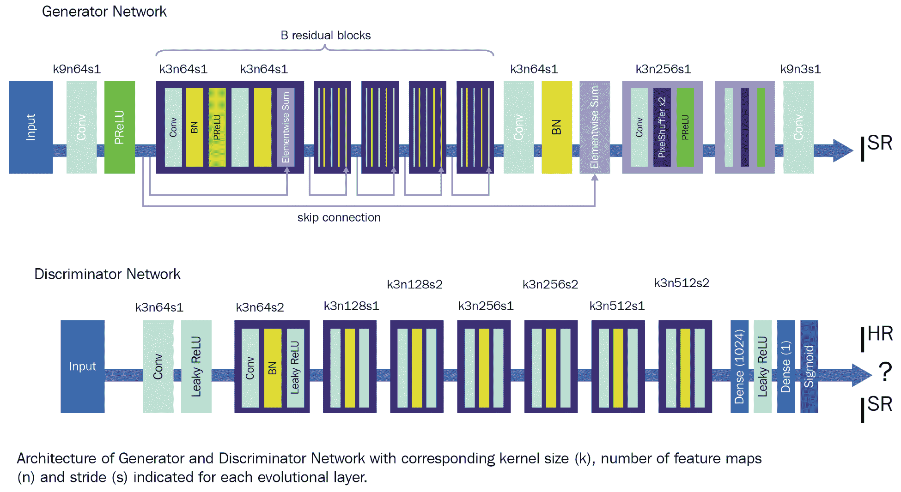
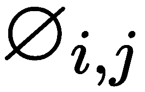
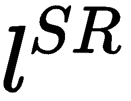
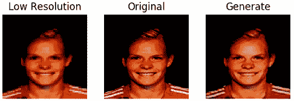
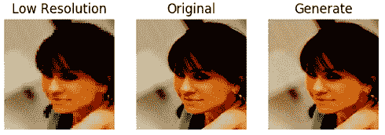
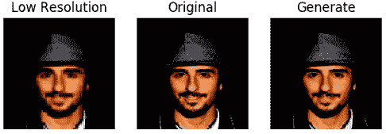
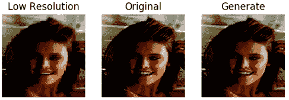
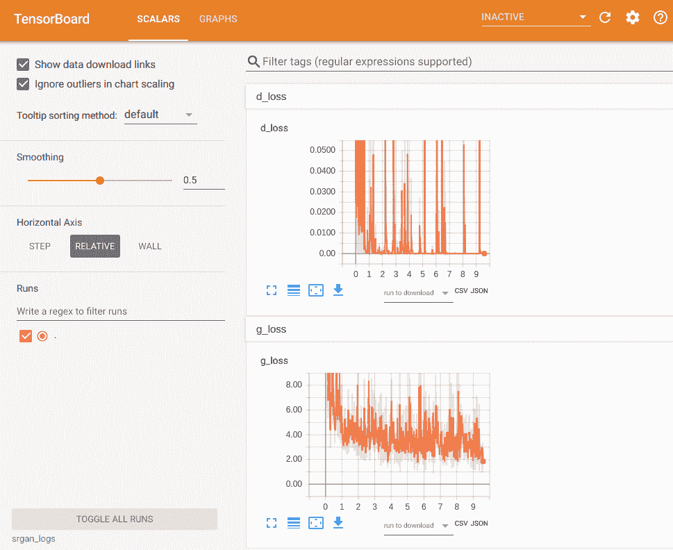
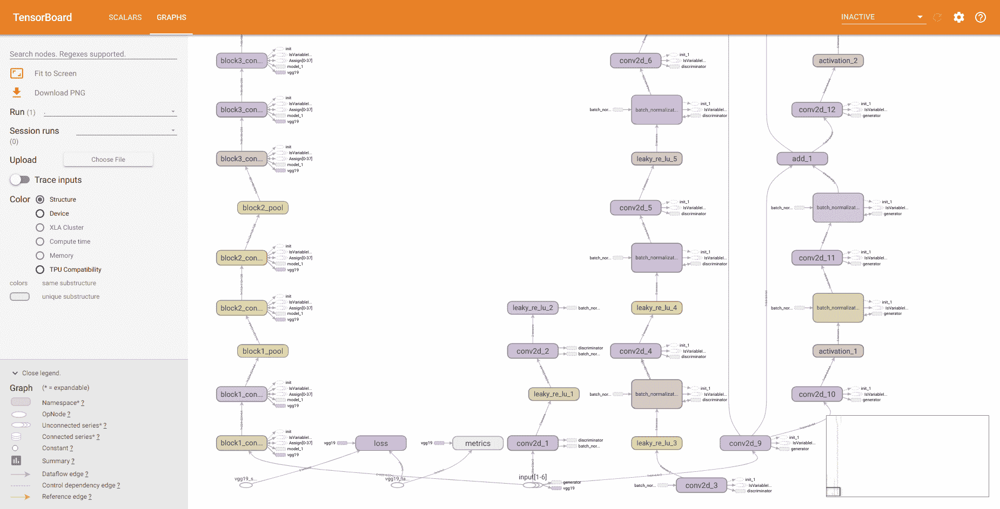

# 使用 SRGAN 生成逼真的图像


**超分辨率生成对抗网络**或 **SRGAN** ，是**生成对抗网络**（**GAN**）， 低分辨率图像中的高分辨率图像，具有更好的细节和更高的质量 。 CNN 较早用于产生高分辨率图像，该图像可以更快地训练并达到高水平的精度。 但是，在某些情况下，它们无法恢复更精细的细节，并且通常会生成模糊的图像。 在本章中，我们将在 Keras 框架中实现一个 SRGAN 网络，该网络将能够生成高分辨率图像。 SRGAN 在标题为《使用生成对抗网络的逼真的单图像超分辨率》的论文中引入，作者是 Christian Ledig，Lucas Theis，Ferenc Huszar， Jose Caballero，Andrew Cunningham 等，[可以在以下链接中找到](https://arxiv.org/pdf/1609.04802.pdf)。

在本章中，将涵盖以下主题：

*   SRGAN 简介
*   设置项目
*   下载 CelebA 数据集
*   SRGAN 的 Keras 实现
*   训练 SRGAN 和网络优化
*   SRGAN 的实际应用


# SRGAN 简介


与其他 GAN 一样，SRGAN 包含一个生成器网络和一个判别器网络。 两个网络都很深。 这两个网络的功能指定如下：

*   **生成器**：生成器网络拍摄尺寸为`64x64x3`的低分辨率图像，并且在一系列卷积和上采样层之后， 生成超分辨率 形状为`256x256x3`的图片
*   **判别器**：判别器网络拍摄高分辨率图像，并尝试识别给定的图像是真实的（来自真实数据样本）还是伪造的（由 生成器）


# SRGAN 的架构


在 SRGAN 中，这两个网络都是深度卷积神经网络。 它们包含卷积层和上采样层。 每个卷积层之后是批处理归一化操作和一个激活层。 我们将在以下各节中详细探讨网络。 下图显示了 SRGAN 的架构：



在以下各节中，让我们详细了解网络的架构。


# 生成器网络的架构


如前一节所述，生成器网络是深度卷积神经网络。 生成器网络包含以下块：

*   残差块
*   残差块
*   后残差块
*   上采样块
*   最后的卷积层

让我们一一探讨这些块：

*   **前残差块**：前残差块包含单个 2D 卷积层和 relu 作为激活函数。 块的配置如下：

| **层名称** | **超参数** | **输入形状** | **输出形状** |
| 2D 卷积层 | `Filters=64, kernel_size=3, strides=1, padding='same', activation='relu'` | `(64, 64, 3)` | `(64, 64, 64)` |

*   **残差块**：残差块包含两个 2D 卷积层。 两层之后是动量值等于 0.8 的批归一化层。 每个残差块的配置如下：

| **层名称** | **超参数** | **输入形状** | **输出形状** |
| 2D 卷积层 | `Filters=64, kernel_size=3, strides=1, padding='same', activation='relu'` | `(64, 64, 64)` | `(64, 64, 64)` |
| 批量归一化层 | `Momentum=0.8` | `(64, 64, 64)` | `(64, 64, 64)` |
| 2D 卷积层 | `Filters=64, kernel_size=3, strides=1, padding='same'` | `(64, 64, 64)` | `(64, 64, 64)` |
| 批量归一化层 | `Momentum=0.8` | `(64, 64, 64)` | `(64, 64, 64)` |
| 加法层 | `None` | `(64, 64, 64)` | `(64, 64, 64)` |

加法层计算输入到块的张量和最后一批归一化层的输出之和。 生成器网络包含 16 个具有上述配置的残差块。

*   **后残差块**：后残差块还包含单个 2D 卷积层和`relu`作为激活函数。 卷积层之后是批处理归一化层，其动量值为 0.8。 后残差块的配置如下：

| **层名称** | **超参数** | **输入形状** | **输出形状** |
| 2D 卷积层 | `Filters=64, kernel_size=3, strides=1, padding='same'` | `(64, 64, 64)` | `(64, 64, 64)` |
| 批量归一化层 | `Momentum=0.8` | `(64, 64, 64)` | `(64, 64, 64)` |

*   **上采样块**：上采样块包含一个上采样层和一个 2D 卷积层，并使用 relu 作为激活函数。 生成器网络中有两个上采样模块。 第一个升采样模块的配置如下：

| **层名称** | **超参数** | **输入形状** | **输出形状** |
| 2D 上采样层 | `Size=(2, 2)` | `(64, 64, 64)` | `(128, 128, 64)` |
| 2D 卷积层 | `Filters=256, kernel_size=3, strides=1, padding='same', activation='relu'` | `(128, 128, 256)` | `(128, 128, 256)` |

第二个上采样模块的配置如下：

| **层名称** | **超参数** | **输入形状** | **输出形状** |
| 2D 上采样层 | `Size=(2, 2)` | `(128, 128, 256)` | `(256, 256, 256)` |
| 2D 卷积层 | `Filters=256, kernel_size=3, strides=1, padding='same', activation='relu'` | `(256, 256, 256)` | `(256, 256, 256)` |

*   **最后的卷积层**：最后一层是使用 tanh 作为激活函数的 2D 卷积层。 它生成形状为`(256, 256, 3)`的图像。 最后一层的配置如下：

| **层名称** | **超参数** | **输入形状** | **输出形状** |
| 2D 卷积层 | `Filters=3, kernel_size=9, strides=1, padding='same', activation='tanh'` | `(256, 256, 256)` | `(256, 256, 3)` |

这些超参数最适合 Keras 框架。 如果使用任何其他框架，请相应地对其进行修改。


# 判别器网络的架构


判别器网络也是一个深度卷积网络。 它包含八个卷积块，后跟两个密集（完全连接）层。 每个卷积块后面都有一个批处理归一化层。 网络的末端有两个密集层，它们充当分类块。 最后一层预测图像属于真实数据集或伪数据集的概率。 判别器网络的详细配置如下表所示：

| **层名称** | **超参数** | **输入形状** | **输出形状** |
| --- | --- | --- | --- |
| 输入层 | 没有 | `(256, 256, 3)` | `(256, 256, 3)` |
| 2D 卷积层 | `filter= 64, kernel_size = 3, stride= 1, padding='same', activcation='leakyrelu'` | `(256, 256, 3)` | `(256, 256, 64)` |
| 2D 卷积层 | `filter= 64, kernel_size = 3, stride= 2, padding='same', activcation='leakyrelu'` | `(256, 256, 64)` | `(128, 128, 64)` |
| 批量归一化层 | `momentum= 0.8` | `(128, 128, 64)` | `(128, 128, 64)` |
| 2D 卷积层 | `filter= 128, kernel_size = 3, stride= 1, padding='same', activcation='leakyrelu'` | `(128, 128, 64)` | `(128, 128, 128)` |
| 批量归一化层 | `momentum= 0.8` | `(128, 128, 128)` | `(128, 128, 128)` |
| 2D 卷积层 | `filter= 128, kernel_size = 3, stride= 2, padding='same', activcation='leakyrelu'` | `(128, 128, 128)` | `(64, 64, 128)` |
| 批量归一化层 | `momentum= 0.8` | `(64, 64, 128)` | `(64, 64, 128)` |
| 2D 卷积层 | `filter= 256, kernel_size = 3, stride= 1, padding='same', activcation='leakyrelu'` | `(64, 64, 128)` | `(64, 64, 256)` |
| 批量归一化层 | `momentum= 0.8` | `(64, 64, 256)` | `(64, 64, 256)` |
| 2D 卷积层 | `filter= 256, kernel_size = 3, stride= 2, padding='same', activcation='leakyrelu'` | `(64, 64, 256)` | `(32, 32, 256)` |

现在，我们对这两个网络的架构有了清晰的了解。 在下一部分中，让我们看一下训练 SRGAN 所需的目标函数。


# 训练目标功能


要训​​练 SRGAN，有一个目标函数或损失函数，我们需要将其最小化以训练模型。 SRGAN 的目标函数称为**感知损失**函数，它是两个损失函数的加权和，如下所示：

*   内容丢失
*   对抗损失

在以下各节中，让我们详细研究内容损失和对抗损失。


# 内容丢失


内容丢失有两种类型，如下所示：

*   MSE 像素损失
*   VGG 损失

让我们详细讨论这些损失。


# MSE 像素损失


内容损失是在真实图像的每个像素值与生成的图像的每个像素值之间计算的均方误差。 像素级 MSE 损失计算出生成的图像与实际图像有多大差异。 像素级 MSE 损失的计算公式如下：


在此，表示由所生成的网络所生成的高分辨率图像。 代表从真实数据集中采样的高分辨率图像。


# VGG 损失


VGG 丢失是另一个内容丢失功能，可应用于生成的图像和真实图像。 VGG19 是一种非常流行的深度神经网络，主要用于图像分类。 VGG19 由 Simonyan 和 Zisserman 在他们的论文《用于大规模图像识别的超深度卷积网络》中引入，可在[这里](https://arxiv.org/pdf/1409.1556.pdf)获得。 预训练的 VGG19 网络的中间层用作特征提取器，可用于提取生成的图像和真实图像的特征图。 VGG 损失基于这些提取的特征图。 计算为生成的图像和真实图像的特征图之间的欧几里得距离。 VGG 损失的公式如下：


在此，表示由 VGG19 网络生成的特征图。 代表提取的真实图像特征图，代表提取的高分辨率图像生成的特征图。 整个方程表示生成图像和真实图像的特征图之间的欧式距离。

前述内容损失中的任何一种都可以用于训练 SRGAN。 对于我们的实现，我们将使用 VGG 损失。


# 对抗损失


根据判别器网络返回的概率计算对抗损失。 在对抗模型中，判别器网络被馈送有由生成的网络生成的生成的图像。 对抗损失可以用以下等式表示：


这里，是所生成的图像  ， 表示所生成的图像是真实图像的概率。

知觉损失函数是内容损失和对抗损失的加权和，表示为以下方程式：


在此，总的感知损失由表示。 是内容损失，可以是像素级 MSE 损失或 VGG 损失。

通过最小化感知损失值，生成器网络试图欺骗判别器。 随着感知损失的值减小，生成器网络开始生成更逼真的图像。

现在开始进行该项目。


# 设置项目


如果尚未使用所有章节的完整代码克隆存储库，请立即克隆存储库。 下载的代码有一个名为`Chapter05`的目录，其中包含本章的全部代码。 执行以下命令来设置项目：

1.  首先，导航到父目录，如下所示：

```py
cd Generative-Adversarial-Networks-Projects
```

2.  现在，将目录从当前目录更改为  `Chapter05`：

```py
cd Chapter05
```

3.  接下来，为该项目创建一个 Python 虚拟环境：

```py
virtualenv venv
virtualenv venv -p python3 # Create a virtual environment using 
 python3 interpreter
virtualenv venv -p python2 # Create a virtual environment using 
 python2 interpreter
```

我们将为此项目使用此新创建的虚拟环境。 每章都有其自己单独的虚拟环境。

4.  接下来，激活新创建的虚拟环境：

```py
source venv/bin/activate
```

激活虚拟环境后，所有其他命令将在此虚拟环境中执行。

5.  接下来，通过执行以下命令，安装`requirements.txt` 文件中提供的所有库：

```py
pip install -r requirements.txt
```

您可以参考  `README.md` 文件，以获取有关如何设置项目的更多说明。 开发人员经常会遇到依赖关系不匹配的问题。 为每个项目创建一个单独的虚拟环境将解决此问题。

在本节中，我们已成功设置项目并安装了所需的依赖项。 在下一节中，让我们研究数据集。 我们将探索下载和格式化数据集的各种步骤。


# 下载 CelebA 数据集


在本章中，我们将使用大型 **CelebFaces 属性**（**CelebA**）数据集，该数据集可从[这里](http://mmlab.ie.cuhk.edu.hk/projects/CelebA.html)获得。 数据集包含 202、599 名名人的面部图像。

该数据集仅可用于非商业研究目的，不能用于商业目的。 如果您打算将数据集用于商业目的，请寻求图像所有者的许可。

我们将使用 `CelebA` 数据集训练我们的 SRGAN 网络。 执行以下步骤下载和提取数据集：

1.  从以下链接下载数据集：

```py
https://www.dropbox.com/sh/8oqt9vytwxb3s4r/AAB06FXaQRUNtjW9ntaoPGvCa?dl=0
```

2.  通过执行以下命令从下载的`img_align_celeba.zip`中提取图像：

```py
unzip img_align_celeba.zip
```

现在，我们已经下载并提取了数据集。 现在，我们可以开始进行 SRGAN 的 Keras 实现。


# SRGAN 的硬实现


正如我们所讨论的，SRGAN 在 Imagenet 数据集上具有三个神经网络，一个生成器，一个判别器和一个预训练的 VGG19 网络。 在本节中，我们将编写所有网络的实现。 让我们从实现生成器网络开始。

在开始编写实现之前，创建一个名为`main.py`的 Python 文件并导入基本模块，如下所示：

```py
import glob
import os

import numpy as np
import tensorflow as tf
from keras import Input
from keras.applications import VGG19
from keras.callbacks import TensorBoard
from keras.layers import BatchNormalization, Activation, LeakyReLU, Add, Dense, PReLU, Flatten
from keras.layers.convolutional import Conv2D, UpSampling2D
from keras.models import Model
from keras.optimizers import Adam
from keras_preprocessing.image import img_to_array, load_img
from scipy.misc import imsave
```


# 生成器网络


我们已经在“生成器网络的架构”中探讨了生成器网络的架构。 让我们首先在 Keras 框架中编写生成器网络的层，然后使用 Keras 框架的函数式 API 创建 Keras 模型。

执行以下步骤以在 Keras 中实现生成器网络：

1.  首先定义生成器网络所需的超参数：

```py
residual_blocks = 16 momentum = 0.8  input_shape = (64, 64, 3)
```

2.  接下来，创建一个输入层，以将输入提供给网络，如下所示：

```py
input_layer = Input(shape=input_shape)
```

输入层获取形状为`(64, 64, 3)`的输入图像，并将其传递到网络中的下一层。

3.  接下来，如下所示添加残差前块（2D 卷积层）：
    配置：
    *   **过滤器**：`64`
    *   **内核大小**：`9`
    *   **大步前进**：`1`
    *   **填充**：`same`
    *   **激活**：`relu:`

```py
gen1 = Conv2D(filters=64, kernel_size=9, strides=1, padding='same', activation='relu')(input_layer)
```

4.  接下来，编写一个包含残差块完整代码的方法，如下所示：

```py
def residual_block(x):
    """
 Residual block """  filters = [64, 64]
    kernel_size = 3
  strides = 1
  padding = "same"
  momentum = 0.8
  activation = "relu"    res = Conv2D(filters=filters[0], kernel_size=kernel_size, 
                 strides=strides, padding=padding)(x)
    res = Activation(activation=activation)(res)
    res = BatchNormalization(momentum=momentum)(res)

    res = Conv2D(filters=filters[1], kernel_size=kernel_size, 
                 strides=strides, padding=padding)(res)
    res = BatchNormalization(momentum=momentum)(res)

    # Add res and x
  res = Add()([res, x])
    return res
```

5.  现在，使用在最后一步中定义的`residual_block`函数添加 16 个残差块：

```py
res = residual_block(gen1)
for i in range(residual_blocks - 1):
    res = residual_block(res)
```

前残差块的输出进入第一个残差块。 第一个残差块的输出将到达第二个残差块，依此类推，直到第 16 个残差块。

6.  接下来，添加后残差块（2D 卷积层，然后是批处理归一化层），如下所示：
    配置：
    *   **过滤器**：`64`
    *   **内核大小**：`3`
    *   **大步前进**：``1``
    *   **填充**：`same`
    *   **批量归一化**：是（动量为 0.8）：

```py
gen2 = Conv2D(filters=64, kernel_size=3, strides=1, padding='same')(res)
gen2 = BatchNormalization(momentum=momentum)(gen2)
```

7.  现在，添加`Add`层，以获取残留前块的输出`gen1`和后残差块的输出`gen2`之和。 该层生成另一个类似形状的张量。 有关更多详细信息，请参考“ *生成器网络*的架构”部分。

```py
gen3 = Add()([gen2, gen1])
```

8.  接下来，添加一个升采样块，如下所示：
    配置：
    *   **上采样大小**：`2`
    *   **文件管理器**：`256`
    *   **内核大小**：`3`
    *   **大步前进**：`1`
    *   **填充**：`same`
    *   **激活**：`PReLU:`

```py
gen4 = UpSampling2D(size=2)(gen3)
gen4 = Conv2D(filters=256, kernel_size=3, strides=1, padding='same')(gen4)
gen4 = Activation('relu')(gen4)
```

9.  接下来，添加另一个上采样块，如下所示：
    配置：
    *   **上采样大小**：  `2`
    *   **文件管理器**：  `256`
    *   **内核大小**：  `3`
    *   **大步前进**：  `1`
    *   **填充**：  `same`
    *   **激活**：  `PReLU:`

```py
gen5 = UpSampling2D(size=2)(gen4)
gen5 = Conv2D(filters=256, kernel_size=3, strides=1, padding='same')(gen5)
gen5 = Activation('relu')(gen5)
```

10.  最后，添加输出卷积层：
    配置：
    *   **过滤器**：`3`（等于通道数）
    *   **内核大小**：`9`
    *   **大步前进**：`1`
    *   **填充**：`same`
    *   **激活**：`tanh:`

```py
gen6 = Conv2D(filters=3, kernel_size=9, strides=1, padding='same')(gen5)
output = Activation('tanh')(gen6)
```

一旦定义了网络中的所有层，就可以创建 Keras 模型。 我们已经使用 Keras 的函数式 API 定义了 Keras 顺序图。 让我们通过指定网络的输入和输出来创建 Keras 模型。

11.  现在，创建 Keras 模型并指定模型的输入和输出，如下所示：

```py
model = Model(inputs=[input_layer], outputs=[output], name='generator')
```

我们已经成功地为生成器网络创建了 Keras 模型。 现在，将生成器网络的整个代码包装在 Python 函数中，如下所示：

```py
def build_generator():
    """
 Create a generator network using the hyperparameter values defined below  :return:
 """  residual_blocks = 16
  momentum = 0.8
  input_shape = (64, 64, 3)

    # Input Layer of the generator network
  input_layer = Input(shape=input_shape)

    # Add the pre-residual block
  gen1 = Conv2D(filters=64, kernel_size=9, strides=1, padding='same',  
                  activation='relu')(input_layer)

    # Add 16 residual blocks
  res = residual_block(gen1)
    for i in range(residual_blocks - 1):
        res = residual_block(res)

    # Add the post-residual block
  gen2 = Conv2D(filters=64, kernel_size=3, strides=1, padding='same')(res)
    gen2 = BatchNormalization(momentum=momentum)(gen2)

    # Take the sum of the output from the pre-residual block(gen1) and 
      the post-residual block(gen2)
  gen3 = Add()([gen2, gen1])

    # Add an upsampling block
  gen4 = UpSampling2D(size=2)(gen3)
    gen4 = Conv2D(filters=256, kernel_size=3, strides=1, padding='same')(gen4)
    gen4 = Activation('relu')(gen4)

    # Add another upsampling block
  gen5 = UpSampling2D(size=2)(gen4)
    gen5 = Conv2D(filters=256, kernel_size=3, strides=1, 
                  padding='same')(gen5)
    gen5 = Activation('relu')(gen5)

    # Output convolution layer
  gen6 = Conv2D(filters=3, kernel_size=9, strides=1, padding='same')(gen5)
    output = Activation('tanh')(gen6)

    # Keras model
  model = Model(inputs=[input_layer], outputs=[output], 
                  name='generator')
    return model
```

我们已经成功地为生成器网络创建了 Keras 模型。 在下一节中，我们将为判别器网络创建 Keras 模型。


# 判别器网络


我们已经在“使用 Keras 框架的函数式 API 创建 Keras 模型”中探讨了判别器网络的架构。 让我们 首先在 Keras 框架中编写判别器网络的层。

执行以下步骤以在 Keras 中实现判别器网络：

1.  首先定义判别器网络所需的超参数：

```py
leakyrelu_alpha = 0.2 momentum = 0.8 input_shape = (256, 256, 3)
```

2.  接下来，创建一个输入层，以将输入提供给网络，如下所示：

```py
input_layer = Input(shape=input_shape)
```

3.  接下来，添加一个卷积块，如下所示：
    配置：
    *   **过滤器**：`64`
    *   **内核大小**：`3`
    *   **大步前进**：`1`
    *   **填充**：`same`
    *   **激活**：`LeakyReLU`，`alpha`等于 0.2：

```py
dis1 = Conv2D(filters=64, kernel_size=3, strides=1, padding='same')(input_layer)
dis1 = LeakyReLU(alpha=leakyrelu_alpha)(dis1)
```

4.  接下来，添加另外七个卷积块，如下所示：
    配置：
    *   **过滤器**：`64`，`128`，`128`，`256`，`256`，`512`，`512`
    *   **内核大小**：`3`，`3`，`3`，`3`，`3`，`3`，`3`
    *   **跨越**：`2`，`1`，`2`，`1`，`2`，`1`，`2`
    *   每个卷积层的**填充**：`same`
    *   **激活**：`LealyReLU`，每个卷积层的`alpha`等于 0.2：

```py
# Add the 2nd convolution block dis2 = Conv2D(filters=64, kernel_size=3, strides=2, padding='same')(dis1)
dis2 = LeakyReLU(alpha=leakyrelu_alpha)(dis2)
dis2 = BatchNormalization(momentum=momentum)(dis2)

# Add the third convolution block dis3 = Conv2D(filters=128, kernel_size=3, strides=1, padding='same')(dis2)
dis3 = LeakyReLU(alpha=leakyrelu_alpha)(dis3)
dis3 = BatchNormalization(momentum=momentum)(dis3)

# Add the fourth convolution block dis4 = Conv2D(filters=128, kernel_size=3, strides=2, padding='same')(dis3)
dis4 = LeakyReLU(alpha=leakyrelu_alpha)(dis4)
dis4 = BatchNormalization(momentum=0.8)(dis4)

# Add the fifth convolution block dis5 = Conv2D(256, kernel_size=3, strides=1, padding='same')(dis4)
dis5 = LeakyReLU(alpha=leakyrelu_alpha)(dis5)
dis5 = BatchNormalization(momentum=momentum)(dis5)

# Add the sixth convolution block dis6 = Conv2D(filters=256, kernel_size=3, strides=2, padding='same')(dis5)
dis6 = LeakyReLU(alpha=leakyrelu_alpha)(dis6)
dis6 = BatchNormalization(momentum=momentum)(dis6)

# Add the seventh convolution block dis7 = Conv2D(filters=512, kernel_size=3, strides=1, padding='same')(dis6)
dis7 = LeakyReLU(alpha=leakyrelu_alpha)(dis7)
dis7 = BatchNormalization(momentum=momentum)(dis7)

# Add the eight convolution block dis8 = Conv2D(filters=512, kernel_size=3, strides=2, padding='same')(dis7)
dis8 = LeakyReLU(alpha=leakyrelu_alpha)(dis8)
dis8 = BatchNormalization(momentum=momentum)(dis8)
```

5.  接下来，添加具有 1,024 个节点的密集层，如下所示：
    配置：
    *   **节点**：`1024`
    *   **激活**：`LeakyReLU`，`alpha`等于 0.2：

```py
dis9 = Dense(units=1024)(dis8)
dis9 = LeakyReLU(alpha=0.2)(dis9)
```

6.  然后，添加一个密集层以返回概率，如下所示：

```py
output = Dense(units=1, activation='sigmoid')(dis9)
```

7.  最后，创建 Keras 模型并指定网络的输入和输出：

```py
model = Model(inputs=[input_layer], outputs=[output], 
              name='discriminator')
```

将判别器网络的整个代码如下包装在函数中：

```py
def build_discriminator():
    """
 Create a discriminator network using the hyperparameter values defined below  :return:
 """  leakyrelu_alpha = 0.2
  momentum = 0.8
  input_shape = (256, 256, 3)

    input_layer = Input(shape=input_shape)

    # Add the first convolution block
  dis1 = Conv2D(filters=64, kernel_size=3, strides=1, padding='same')(input_layer)
    dis1 = LeakyReLU(alpha=leakyrelu_alpha)(dis1)

    # Add the 2nd convolution block
  dis2 = Conv2D(filters=64, kernel_size=3, strides=2, padding='same')(dis1)
    dis2 = LeakyReLU(alpha=leakyrelu_alpha)(dis2)
    dis2 = BatchNormalization(momentum=momentum)(dis2)

    # Add the third convolution block
  dis3 = Conv2D(filters=128, kernel_size=3, strides=1, padding='same')(dis2)
    dis3 = LeakyReLU(alpha=leakyrelu_alpha)(dis3)
    dis3 = BatchNormalization(momentum=momentum)(dis3)

    # Add the fourth convolution block
  dis4 = Conv2D(filters=128, kernel_size=3, strides=2, padding='same')(dis3)
    dis4 = LeakyReLU(alpha=leakyrelu_alpha)(dis4)
    dis4 = BatchNormalization(momentum=0.8)(dis4)

    # Add the fifth convolution block
  dis5 = Conv2D(256, kernel_size=3, strides=1, padding='same')(dis4)
    dis5 = LeakyReLU(alpha=leakyrelu_alpha)(dis5)
    dis5 = BatchNormalization(momentum=momentum)(dis5)

    # Add the sixth convolution block
  dis6 = Conv2D(filters=256, kernel_size=3, strides=2, padding='same')(dis5)
    dis6 = LeakyReLU(alpha=leakyrelu_alpha)(dis6)
    dis6 = BatchNormalization(momentum=momentum)(dis6)

    # Add the seventh convolution block
  dis7 = Conv2D(filters=512, kernel_size=3, strides=1, padding='same')(dis6)
    dis7 = LeakyReLU(alpha=leakyrelu_alpha)(dis7)
    dis7 = BatchNormalization(momentum=momentum)(dis7)

    # Add the eight convolution block
  dis8 = Conv2D(filters=512, kernel_size=3, strides=2, padding='same')(dis7)
    dis8 = LeakyReLU(alpha=leakyrelu_alpha)(dis8)
    dis8 = BatchNormalization(momentum=momentum)(dis8)

    # Add a dense layer
  dis9 = Dense(units=1024)(dis8)
    dis9 = LeakyReLU(alpha=0.2)(dis9)

    # Last dense layer - for classification
  output = Dense(units=1, activation='sigmoid')(dis9)

    model = Model(inputs=[input_layer], outputs=[output], name='discriminator')
    return model
```

在这一部分，我们已经成功地为判别器网络创建了 Keras 模型。 在下一节中，我们将构建 VGG19 网络，如“SRGAN 简介”中所示。


# VGG19 网络


我们将使用预训练的 VGG19 网络。 VGG19 网络的目的是提取生成的图像和真实图像的特征图。 在本节中，我们将在 Keras 中使用预先训练的权重构建和编译 VGG19 网络：

1.  首先指定输入形状：

```py
input_shape = (256, 256, 3)
```

2.  接下来，加载预训练的 VGG19 并指定模型的输出：

```py
vgg = VGG19(weights="imagenet")
vgg.outputs = [vgg.layers[9].output]
```

3.  接下来，创建符号 `input_tensor` ，这将是我们对 VGG19 网络的符号输入，如下所示：

```py
input_layer = Input(shape=input_shape)
```

4.  接下来，使用 VGG19 网络提取功能：

```py
features = vgg(input_layer)
```

5.  最后，创建 Keras `model`并为网络指定`inputs`和`outputs`：

```py
model = Model(inputs=[input_layer], outputs=[features])
```

最后，将 VGG19 模型的整个代码包装在一个函数中，如下所示：

```py
def build_vgg():
    """
 Build the VGG network to extract image features """  input_shape = (256, 256, 3)

    # Load a pre-trained VGG19 model trained on 'Imagenet' dataset
  vgg = VGG19(weights="imagenet")
    vgg.outputs = [vgg.layers[9].output]

    input_layer = Input(shape=input_shape)

    # Extract features
  features = vgg(input_layer)

    # Create a Keras model
  model = Model(inputs=[input_layer], outputs=[features])
    return model
```


# 对抗网络


对抗网络是使用生成器，判别器和 VGG19 的组合网络。 在本节中，我们将创建一个对抗网络。

执行以下步骤来创建对抗网络：

1.  首先为网络创建输入层：

```py
input_low_resolution = Input(shape=(64, 64, 3))
```

对抗网络将收到`(64, 64, 3)`形状的图像，这就是我们创建输入层的原因。

2.  接下来，使用生成器网络生成伪造的高分辨率图像，如下所示：

```py
fake_hr_images = generator(input_low_resolution)
```

3.  接下来，使用 VGG19 网络提取伪造图像的特征，如下所示：

```py
fake_features = vgg(fake_hr_images)
```

4.  接下来，使判别器网络在对抗网络中不可训练：

```py
discriminator.trainable = False
```

我们使判别器网络不可训练，因为我们不想在训练生成器网络时训练判别器网络。

5.  接下来，将伪造的图像传递到判别器网络：

```py
output = discriminator(fake_hr_images)
```

6.  最后，创建一个 Keras 模型，这将是我们的对抗模型：

```py
model = Model(inputs=[input_low_resolution], outputs=[output, 
              fake_features])
```

7.  将对抗模型的整个代码包装在 Python 函数中：

```py
def build_adversarial_model(generator, discriminator, vgg):

    input_low_resolution = Input(shape=(64, 64, 3))

    fake_hr_images = generator(input_low_resolution)
    fake_features = vgg(fake_hr_images)

    discriminator.trainable = False    output = discriminator(fake_hr_images)

    model = Model(inputs=[input_low_resolution],
  outputs=[output, fake_features])

    for layer in model.layers:
        print(layer.name, layer.trainable)

    print(model.summary())
    return model
```

我们现在已经成功地在 Keras 中实现了网络。 接下来，我们将在*数据准备*部分中下载的数据集上训练网络。


# 训练 SRGAN


训练 SRGAN 网络是一个分为两个步骤的过程。 第一步，我们训练判别器网络。 在第二步中，我们训练对抗网络，最终训练生成器网络。 让我们开始训练网络。

执行以下步骤来训练 SRGAN 网络：

1.  首先定义训练所需的超参数：

```py
# Define hyperparameters data_dir = "Paht/to/the/dataset/img_align_celeba/*.*" epochs = 20000 batch_size = 1   # Shape of low-resolution and high-resolution images low_resolution_shape = (64, 64, 3)
high_resolution_shape = (256, 256, 3)
```

2.  接下来，定义训练优化器。 对于所有网络，我们将使用学习率等于 0.0002 且`beta_1`等于`0.5`的 Adam 优化器：

```py
# Common optimizer for all networks common_optimizer = Adam(0.0002, 0.5)
```


# 建立和编译网络


在本节中，我们将完成构建和编译网络所需的不同步骤：

1.  构建和编译 VGG19 网络：

```py
vgg = build_vgg()
vgg.trainable = False vgg.compile(loss='mse', optimizer=common_optimizer, metrics=
            ['accuracy'])
```

要编译 VGG19，请使用`mse`作为损失，使用`accuracy`作为度量，并使用`common_optimizer`作为优化器。 编译网络之前，请先禁用训练，因为我们不想训练 VGG19 网络。

2.  接下来，构建并编译`discriminator`网络，如下所示：

```py
discriminator = build_discriminator()
discriminator.compile(loss='mse', optimizer=common_optimizer, 
                      metrics=['accuracy'])
```

要编译判别器网络，使用 `mse` 作为损失， `accuracy` 作为度量，并使用 `common_optimizer` 作为优化器。

3.  接下来，构建生成器网络：

```py
generator = build_generator()
```

4.  接下来，创建一个对抗模型。 首先创建两个输入层：

```py
input_high_resolution = Input(shape=high_resolution_shape)
input_low_resolution = Input(shape=low_resolution_shape)
```

5.  接下来，使用生成器网络从低分辨率图像中象征性地生成高分辨率图像：

```py
generated_high_resolution_images = generator(input_low_resolution)
```

使用 VGG19 提取生成图像的特征图：

```py
features = vgg(generated_high_resolution_images)
```

使判别器网络不可训练，因为我们不想在对抗模型训练期间训练判别器模型 ：

```py
discriminator.trainable = False
```

6.  接下来，使用判别器网络获取生成的高分辨率伪图像的概率：

```py
probs = discriminator(generated_high_resolution_images)
```

在此，`probs`表示所生成的图像属于真实数据集的概率。

7.  最后，创建并编译对抗网络：

```py
adversarial_model = Model([input_low_resolution, input_high_resolution], [probs, features])
adversarial_model.compile(loss=['binary_crossentropy', 'mse'], 
            loss_weights=[1e-3, 1], optimizer=common_optimizer)
```

要编译对抗模型，请使用`binary_crossentropy`和`mse`作为损失函数，`common_optimizer`作为优化器，并使用`[0.001, 1]`作为损失权重。

8.  添加`Tensorboard`以可视化训练损失并可视化网络图：

```py
tensorboard = TensorBoard(log_dir="logs/".format(time.time()))
tensorboard.set_model(generator)
tensorboard.set_model(discriminator)
```

9.  创建一个循环，该循环应运行指定的时期数：

```py
for epoch in range(epochs):
    print("Epoch:{}".format(epoch))
```

完成此步骤后，所有代码都将在此`for`循环内。

10.  接下来，对一批高分辨率和低分辨率图像进行采样，如下所示：

```py
high_resolution_images, low_resolution_images = 
    sample_images(data_dir=data_dir,   
    batch_size=batch_size,low_resolution_shape=low_resolution_shape,     high_resolution_shape=high_resolution_shape)
```

`sample_images` 功能 的代码如下。 它具有很强的描述性，通过阅读可以理解。 它包含加载和调整图像大小并生成高分辨率和低分辨率图像的不同步骤：

```py
def sample_images(data_dir, batch_size, high_resolution_shape, low_resolution_shape):
    # Make a list of all images inside the data directory
  all_images = glob.glob(data_dir)

    # Choose a random batch of images
  images_batch = np.random.choice(all_images, size=batch_size)

    low_resolution_images = []
    high_resolution_images = []

    for img in images_batch:
        # Get an ndarray of the current image
  img1 = imread(img, mode='RGB')
        img1 = img1.astype(np.float32)

        # Resize the image
  img1_high_resolution = imresize(img1, high_resolution_shape)
        img1_low_resolution = imresize(img1, low_resolution_shape)

        # Do a random flip
  if np.random.random() < 0.5:
            img1_high_resolution = np.fliplr(img1_high_resolution)
            img1_low_resolution = np.fliplr(img1_low_resolution)

        high_resolution_images.append(img1_high_resolution)
        low_resolution_images.append(img1_low_resolution)

    return np.array(high_resolution_images), 
           np.array(low_resolution_images)
```

11.  接下来，对图像进行归一化以将像素值转换为`[-1, 1]`之间的范围，如下所示：

```py
    high_resolution_images = high_resolution_images / 127.5 - 1.
    low_resolution_images = low_resolution_images / 127.5 - 1.
```

将像素值转换为 -1 到 1 的范围非常重要。我们的生成器网络的末尾有`tanh`。 `tanh`激活函数将值压缩到相同范围。 在计算损失时，必须使所有值都在同一范围内。


# 训练判别器网络


本节中给出的步骤显示了如何训练判别器网络。 这是最后一系列步骤的延续：

1.  使用`generator`网络生成伪造的高分辨率图像：

```py
generated_high_resolution_images = 
          generator.predict(low_resolution_images)
```

2.  创建一批真实标签和伪标签：

```py
    real_labels = np.ones((batch_size, 16, 16, 1))
    fake_labels = np.zeros((batch_size, 16, 16, 1))
```

3.  在真实图像和真实标签上训练判别器网络：

```py
d_loss_real = discriminator.train_on_batch(high_resolution_images, 
   real_labels)
```

4.  在生成的图像和伪造标签上训练判别器：

```py
d_loss_fake = discriminator.train_on_batch(generated_high_resolution_images, fake_labels)
```

5.  最后，计算总的判别器损失：

```py
    d_loss = 0.5 * np.add(d_loss_real, d_loss_fake)
```

现在，我们添加了代码来训练判别器网络。 接下来，添加代码以训练对抗模型，从而训练生成器网络。


# 训练生成器网络


本节中给出的步骤显示了如何训练生成器网络。 这是最后一系列步骤的延续：

1.  再次，对一批高分辨率和低分辨率图像进行采样并对其进行归一化：

```py
    high_resolution_images, low_resolution_images = sample_images(data_dir=data_dir, batch_size=batch_size,low_resolution_shape=low_resolution_shape,  high_resolution_shape=high_resolution_shape)
 # Normalize images    high_resolution_images = high_resolution_images / 127.5 - 1.
    low_resolution_images = low_resolution_images / 127.5 - 1.
```

2.  使用 VGG19 网络提取真实高分辨率图像的特征图（内部表示）：

```py
    image_features = vgg.predict(high_resolution_images)
```

3.  最后，训练对抗模型并为其提供适当的输入，如下所示：

```py
    g_loss = adversarial_model.train_on_batch([low_resolution_images, high_resolution_images],
  [real_labels, image_features])
```

4.  在每个时期完成之后，将损失写入 TensorBoard 以将其可视化：

```py
    write_log(tensorboard, 'g_loss', g_loss[0], epoch)
    write_log(tensorboard, 'd_loss', d_loss[0], epoch)
```

5.  每隔 100 个周期后，使用生成器网络生成高分辨率的伪图像并保存以使其可视化：

```py
 if epoch % 100 == 0:
        high_resolution_images, low_resolution_images = sample_images(data_dir=data_dir, batch_size=batch_size,low_resolution_shape=low_resolution_shape,
 high_resolution_shape=high_resolution_shape)
        # Normalize images
  high_resolution_images = high_resolution_images / 127.5 - 1.
  low_resolution_images = low_resolution_images / 127.5 - 1.
 # Generate fake high-resolution images  generated_images = generator.predict_on_batch(low_resolution_images)

        # Save
        for index, img in enumerate(generated_images):
            save_images(low_resolution_images[index], high_resolution_images[index], img,
  path="results/img_{}_{}".format(epoch, index))
```

这些图像将帮助您决定是继续训练还是尽早停止训练。 如果生成的高分辨率图像的质量良好，请停止训练。 或者，继续训练，直到您的模型变好为止。

我们现在已经成功地在`CelebA`数据集上训练了 SRGAN 网络。 训练完成后，生成高分辨率图像非常容易。 拍摄尺寸为`64 x 64 x 3`的低分辨率图像，并将其传递给`generator.predict()`函数，该函数将生成高分辨率图像。


# 保存模型


在 Keras 中保存模型只需要一行代码。 要保存`generator`模型，请添加以下行：

```py
# Specify the path for the generator model
gen_model.save("directory/for/the/generator/model.h5")
```

同样，通过添加以下行来保存`discriminator`模型：

```py
# Specify the path for the discriminator model
dis_model.save("directory/for/the/discriminator/model.h5") 
```


# 可视化生成的图像


经过大量时间后，生成器将开始生成良好的图像。 让我们看一下生成的图像：

*   在 1,000 个时代之后，图像显示如下：



*   5,000 次之后，图像显示如下：



*   10,000 个纪元后，图像显示如下：



*   15,000 个纪元后，图像显示如下：



*   经过 20,000 个纪元后，图像显示如下：


要生成非常好的图像，请将网络训练 30,000-50,000 个纪元。


# 可视化损失


要显示训练损失，请启动，，`tensorboard`，，服务器，如下所示：

```py
tensorboard --logdir=logs
```

现在，在浏览器中打开  `localhost:6006` 。 TensorBoard 的标量部分包含两种损失的图：



这些图将帮助您决定是继续还是停止训练。 如果损失不再减少，您就可以停止训练，因为没有改善的机会。 如果损失持续增加，则必须停止训练。 尝试使用超参数，然后选择一组您认为可能会提供更好结果的超参数。 如果损失逐渐减少，请继续训练模型。


# 可视化图形


TensorBoard 的 GRAPHS 部分包含两个网络的图形。 如果网络性能不佳，这些图可以帮助您调试网络。 它们还显示了每个图中的张量流和不同的运算：




# SRGAN 的实际应用


现在，让我们看一下 SRGAN 的实际应用：

*   恢复旧照片
*   行业应用，例如自动提高徽标，横幅和小册子的分辨率
*   自动为用户增加社交媒体图像的分辨率
*   拍摄时自动增强相机上的照片
*   提高医学图像的分辨率


# 总结


在本章中，我们首先介绍 SRGAN。 然后，我们研究了生成器和判别器网络的架构。 后来，我们执行了该项目所需的设置。 然后，我们收集并探索了数据集。 之后，我们在训练 SRGAN 之前先在 Keras 中实现了该项目，评估了训练后的 SRGAN 网络，并使用超参数优化技术对训练后的模型进行了优化。 最后，我们简要介绍了 SRGAN 的一些不同应用。

在下一章中，我们将介绍 StackGAN 及其不同的应用程序。


