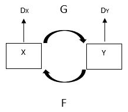
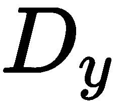
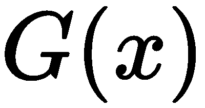
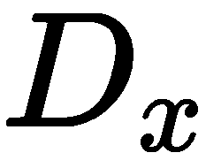
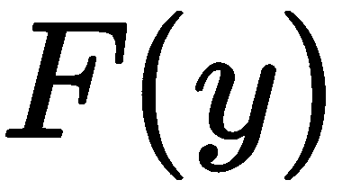
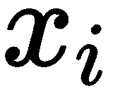
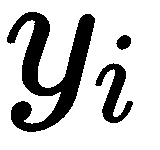
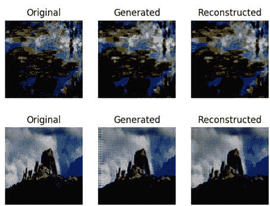
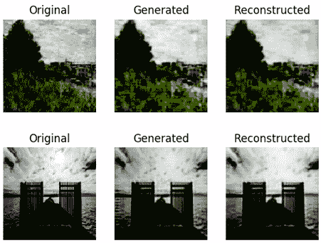
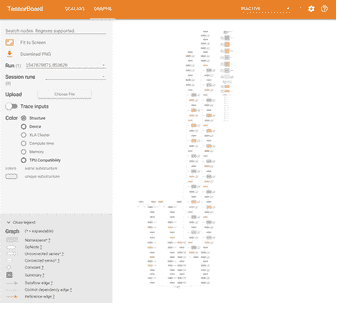

# CycleGAN-将绘画变成照片


CycleGAN 是一种**生成对抗性** **网络**（**GAN**）的类型，用于跨域传输任务，例如更改图像的样式，将绘画转变为照片， 反之亦然，例如照片增强功能，更改照片的季节等等。 CycleGAN 由朱俊彦，Taesung Park，Phillip Isola 和 Alexei A. Efros 在题为*的非配对图像到图像转换中使用循环一致对抗网络*引入。 该产品于 2018 年 2 月在加州大学伯克利分校的 **Berkeley AI Research**（**BAIR**）实验室生产，[可通过以下链接获得](https://arxiv.org/pdf/1703.10593.pdf)。 由于其广泛的使用案例，CycleGAN 在 GAN 社区引起了轰动。 在本章中，我们将与 CycleGAN 一起使用，尤其是使用它们将绘画转换为照片。

在本章中，我们将介绍以下主题：

*   CycleGAN 简介
*   CycleGAN 的架构
*   数据收集与准备
*   Keras 的 CycleGAN 实现
*   目标功能
*   训练 CycleGAN
*   CycleGAN 的实际应用


# CycleGAN 简介


为了将照片变成一幅画或一幅画，再将它们变成照片，普通 GAN 需要一对图像。 CycleGAN 是一种 GAN 网络，可以将图像从一个域 X 转换为另一个域 Y，而无需配对图像。 CycleGAN 尝试学习生成器网络，而生成器网络又学习了两个映射。 CycleGAN 无需训练大多数 GAN 中使用的单个生成器网络，而是训练两个生成器和两个判别器网络。

CycleGAN 中有两个生成器网络，如下所示：

1.  **生成器 A** ：学习映射，其中 X 是源域，`Y`是目标域。 它从源域`A`拍摄图像，并将其转换为与目标域`B`相似的图像。 基本上，网络的目的是学习映射，以使 *G（X）*与`Y`相似。
2.  **生成器 B** ：学习映射，然后从目标域 B 中获取图像，并将其转换为与源域 A 中的图像相似的图像。类似地， 网络要学习另一个映射，以便 *F（G（X）*类似于`X`）。

这两个网络的架构相同，但我们分别对其进行训练。

CycleGAN 中有两个判别器网络，如下所示：

1.  **判别器 A** ：判别器`A`的工作是区分由生成器网络`A`生成的图像，这些图像表示为 *G（X）* 和来自源域`A`的真实图像，它们表示为`X`。
2.  **鉴别符 B** ：鉴别符`B`的工作是区分由生成器网络`B`生成的图像，这些图像表示为 *F（Y）* 以及来自源域`B`的真实图像，它们表示为`Y`。

两个网络的架构是相同的。 与生成器网络类似，我们分别训练区分器网络。 如下图所示：



Illustration of a CycleGAN with two generator and two adversarial discriminator networks. Source: https://arxiv.org/pdf/1703.10593.pdf

在下一节中，让我们详细了解 CycleGAN 的架构。


# CycleGAN 的架构


CycleGAN 总体上由两种架构组成：生成器和判别器。 生成器架构用于创建两个模型，生成器 A 和生成器 B。判别器架构用于创建另外两个模型，判别器 A 和判别器 B。我们现在将在接下来的两节中介绍两个网络的架构。


# 生成器的架构


生成器网络是自动编码器类型的网络。 它以图像作为输入并输出另一个图像。 它由两部分组成：编码器和解码器。 编码器包含具有下采样功能的卷积层，并将`128x128x3`形状的输入转换为内部表示。 解码器包含两个上采样块和最后一个卷积层，该层将内部表示形式转换为`128x128x3`形状的输出。

生成器网络包含以下块：

*   卷积块
*   残留块
*   上采样块
*   最后的卷积层

让我们逐一介绍每个组件：

*   **卷积块**：卷积块包含 2D 卷积层，然后是实例规范化层和 relu 作为激活函数。 请参阅第 1 章， *生成对抗网络简介* ，以了解有关*实例规范化*的更多信息。

生成器网络包含三个卷积块，其配置如下：

| **层名称** | **超参数** | **输入形状** | **输出形状** |
| 2D 卷积层 | `filters=32, kernel_size=7, strides=1, padding='same'` | (128, 128, 3) | (128, 128, 32) |
| 实例规范化层 | `axis=1` | (128, 128, 32) | (128, 128, 32) |
| 激活层 | `activation='relu'` | (128, 128, 32) | (128, 128, 32) |
| 2D 卷积层 | `filters=64, kernel_size=3, strides=2, padding='same'` | (128, 128, 32) | (64, 64, 64) |
| 实例规范化层 | `axis=1` | (64, 64, 64) | (64, 64, 64) |
| 激活层 | `activation='relu'` | (64, 64, 64) | (64, 64, 64) |
| 2D 卷积层 | `filters=128, kernel_size=3, strides=2, padding='same'` | (64, 64, 64) | (32, 32, 128) |
| 实例规范化层 | `axis=1` | (32, 32, 128) | (32, 32, 128) |
| 激活层 | `activation='relu'` | (32, 32, 128) | (32, 32, 128) |

*   **残余块**：残余块包含两个 2D 卷积层。 两层之后是动量值等于 0.8 的批归一化层。 生成器网络包含六个残差块，其配置如下：

| **层名称** | **超参数** | **输入形状** | **输出形状** |
| 2D 卷积层 | `filters=128, kernel_size=3, strides=1, padding='same'` | (32, 32, 128) | （32、32、128） |
| 批量归一化层 | `axis=3, momentum=0.9, epsilon=1e-5` | （32、32、128） | （32、32、128） |
| 2D 卷积层 | `filters=138, kernel_size=3, strides=1, padding='same'` | （32、32、128） | （`(32, 32, 128)` |
| 批量归一化层 | `axis=3, momentum=0.9, epsilon=1e-5` | （32、32、128） | （32、32、128） |
| 加法层 | `None` | （32、32、128） | （32、32、128） |

加法层计算输入到块的  张量  与最后一批归一化层的输出之和。

*   **上采样块**：上采样块包含转置 2D 卷积层，并使用`relu`作为激活函数。 生成器网络中有两个上采样模块。 第一个升采样模块的配置如下：

| **层名称** | **超参数** | **输入形状** | **输出形状** |
| 转置 2D 卷积层 | `filters=64, kernel_size=3, strides=2, padding='same', use_bias=False` | (32, 32, 128) | (64, 64, 64) |
| 实例规范化层 | `axis=1` | (64, 64, 64) | (64, 64, 64) |
| 激活层 | `activation='relu'` | (64, 64, 64) | (64, 64, 64) |

第二个上采样模块的配置如下：

| **层名称** | **超参数** | **输入形状** | **输出形状** |
| 转置 2D 卷积层 | `filters=32, kernel_size=3, strides=2, padding='same', use_bias=False` | (64, 64, 64) | (128, 128, 32) |
| 实例规范化层 | `axis=1` | （ 128、128、32） | （ 128、128、32） |
| 激活层 | `activation='relu'` | （ 128、128、32） | （ 128、128、32） |

*   **最后的卷积层**：最后一层是使用`tanh`作为激活函数的 2D 卷积层。 它生成形状为（256、256、3）的图像。 最后一层的配置如下：

| **层名称** | **超参数** | **输入形状** | **输出形状** |
| 2D 卷积层 | `filters=3, kernel_size=7, strides=1, padding='same', activation='tanh'` | (128, 128, 32) | (128, 128, 3) |

These hyperparameters are best suited for the Keras framework. If you are using any other framework, modify accordingly.


# 判别器的架构


判别器网络的架构类似于 PatchGAN 网络中的判别器架构。 它是一个深度卷积神经网络，包含多个卷积块。 基本上，它会拍摄形状为（128、128、3）的图像，并预测该图像是真实的还是假的。 它包含几个 ZeroPadding2D 层，[可以在以下链接中找到其文档](https://keras.io/layers/convolutional/#zeropadding2d)。 下表详细显示了判别器网络的架构：

| **层名称** | **超参数** | **输入形状** | **输出形状** |
| 输入层 | `none` | (128, 128, 3) | (128, 128, 3) |
| ZeroPadding2D 层 | `padding(1, 1)` | (128, 128, 3) | (130, 130, 3) |
| 2D 卷积层 | `filters=64, kernel_size=4, strides=2, padding='valid'` | (130, 130, 3) | `(64, 64, 64)` |
| 激活层 | `activation='leakyrelu', alpha=0.2` | `(64, 64, 64)` | `(64, 64, 64)` |
| ZeroPadding2D 层 | `padding(1, 1)` | (64, 64, 64) | (66, 66, 64) |
| 2D 卷积层 | `filters=128, kernel_size=4, strides=2, padding='valid'` | (66, 66, 64) | （32、32、128） |
| 实例规范化层 | `axis=1` | (32, 32, 128) | (32, 32, 128) |
| 激活层 | `activation='leakyrelu', alpha=0.2` | （32、32、128） | （32、32、128） |
| ZeroPadding2D 层 | `padding(1, 1)` | (32, 32, 128) | (34, 34, 128) |
| 2D 卷积层 | `filters=256, kernel_size=4, strides=2, padding='valid'` | (34, 34, 128) | `(16, 16, 256)` |
| 实例规范化层 | `axis=1` | `(16, 16, 256)` | `(16, 16, 256)` |
| 激活层 | `activation='leakyrelu', alpha=0.2` | `(16, 16, 256)` | `(16, 16, 256)` |
| ZeroPadding2D 层 | `padding(1, 1)` | (16, 16, 256) | (18, 18, 256) |
| 2D 卷积层 | `filters=512, kernel_size=4, strides=2, padding='valid'` | (18, 18, 256) | `(8, 8, 512)` |
| 实例规范化层 | `axis=1` | `(8, 8, 512)` | `(8, 8, 512)` |
| 激活层 | `activation='leakyrelu', alpha=0.2` | `(8, 8, 512)` | `(8, 8, 512)` |
| ZeroPadding2D 层 | `padding(1, 1)` | `(8, 8, 512)` | (10, 10, 512) |
| 2D 卷积层 | `filters=1, kernel_size=4, strides=1, padding='valid', activation='sigmoid'` | (10, 10, 512) | `(7, 7, 1)` |

判别器网络返回形状为`(7, 7, 1)`的张量。 现在，我们已经介绍了这两个网络的详细架构。 在下一节中，我们将介绍训练 CycleGAN 所需的目标函数。

The ZeroPadding2D layer adds rows and columns of zeros at the top, bottom, left, and right of an image tensor.


# 训练目标功能


与其他 GAN 相似，CycleGAN 具有训练目标函数，我们需要将其最小化以训练模型。 损失函数是以下损失的加权总和：

1.  对抗损失
2.  循环一致性损失

在以下各节中，让我们详细研究对抗性损失和周期一致性损失。


# 对抗损失


对抗性损失是实际分布 A 或 B 的图像与生成器网络生成的图像之间的损失。 我们有两个映射功能，我们将对两个映射应用对抗性损失。

映射的对抗损失如下所示：


在此，x 是来自分布 A 的一个域的图像，y 是来自分布 B 的另一个域的图像。鉴别符试图区分 G 映射（）生成的图像和实数 图像 y 来自不同的分布 B。判别器试图区分 F 映射生成的图像（）和来自分布 A 的真实图像 x。G 的目的是使对抗损失函数最小 对抗对手 D，后者不断尝试使其最大化。


# 循环一致性损失


仅使用对抗损失的问题在于，网络可以将同一组输入图像映射到目标域中图像的任何随机排列。 因此，任何学习的映射都可以学习类似于目标分布的输出分布。 和之间可能有许多可能的映射功能。 循环一致性损失通过减少可能的映射数来克服了这个问题。 周期一致映射功能是可以将图像 x 从域 A 转换为域 B 中的另一个图像 y 并生成原始图像的功能。

前向循环一致性映射功能如下所示：


向后循环一致映射函数如下所示：


循环一致性损失的公式如下：


由于循环一致性损失，由 *F（G（x））*和 *G（F（y））*重构的图像分别类似于 x 和 y。


# 完整目标功能


完整目标函数是对抗损失和周期一致性损失两者的加权总和，表示如下：


在此，是第一个对抗性损失，是第二个对抗性损失。 在生成器 A 和判别器 B 上计算第一个对抗损失。在生成器 B 和判别器 A 上计算第二个对抗损失。

要训​​练 CycleGAN，我们需要优化以下功能：


前面的等式表明，训练一个 CycleGAN，需要最小化生成器网络的损耗，并使判别器网络的损耗最大化。 优化之后，我们将获得一组训练有素的网络，能够从绘画中生成照片。


# 设置项目


如果尚未使用所有章节的完整代码克隆存储库，请立即克隆存储库。 下载的代码有一个名为`Chapter07`的目录，其中包含本章的全部代码。 执行以下命令来设置项目：

1.  首先，导航到父目录，如下所示：

```py
cd Generative-Adversarial-Networks-Projects
```

2.  现在，将目录从当前目录更改为  `Chapter07`，如以下示例所示：

```py
cd Chapter07
```

3.  接下来，为该项目创建一个 Python 虚拟环境，如以下代码所示：

```py
virtualenv venv
virtualenv venv -p python3 # Create a virtual environment using 
           python3 interpreter
virtualenv venv -p python2 # Create a virtual environment using 
           python2 interpreter
```

我们将为此项目使用此新创建的虚拟环境。 每章都有其自己单独的虚拟环境。

4.  激活新创建的虚拟环境，如以下代码所示：

```py
source venv/bin/activate
```

激活虚拟环境后，所有其他命令将在该虚拟环境中执行。

5.  通过执行以下命令，安装`requirements.txt` 文件中提供的所有库：

```py
pip install -r requirements.txt
```

您可以参考  `README.md` 文件，以获取有关如何设置项目的更多说明。 开发人员经常会遇到依赖关系不匹配的问题。 为每个项目创建一个单独的虚拟环境将解决此问题。

在本节中，我们已经成功设置了项目并安装了必需的依赖项。 在下一节中，我们将处理数据集。


# 下载数据集


在本章中，我们将使用`monet2photo`数据集。 该数据集是开放源代码，可以由 UC Berkeley 的 **Berkeley AI Research**（**BAIR**）实验室使用。 [您可以从以下链接选择手动下载数据集](https://people.eecs.berkeley.edu/~taesung_park/CycleGAN/datasets/monet2photo.zip)。

下载后，将其解压缩到根目录中。

或者，要自动下载数据集，请执行以下命令：

```py
wget https://people.eecs.berkeley.edu/~taesung_park/CycleGAN/datasets/monet2photo.zip
upzip monet2photo.zip
```

这些命令将下载数据集并将其解压缩到项目的根目录中。

The `monet2photo` dataset is available for educational purposes only. To use it in commercial projects, you have to get permission from the BAIR laboratory, UC Berkeley. We don't hold the copyright for the images available in the dataset.


# 硬实现 CycleGAN


如本章前面的 *CycleGAN 简介*部分中所述，CycleGAN 具有两种网络架构，即生成器网络和判别器网络。 在本节中，我们将编写所有网络的实现。

但是，在开始编写实现之前，请创建一个 Python 文件`main.py`并导入基本模块，如下所示：

```py
from glob import glob
import matplotlib.pyplot as plt
import numpy as np
import tensorflow as tf
from keras import Input, Model
from keras.layers import Conv2D, BatchNormalization, Activation, Add, Conv2DTranspose, \
    ZeroPadding2D, LeakyReLU
from keras.optimizers import Adam
from keras_contrib.layers import InstanceNormalization
from scipy.misc import imread, imresize
```


# 生成器网络


在本章前面的*生成器网络的架构*部分中，我们已经探讨了生成器网络的架构。 让我们首先在 Keras 框架中编写生成器网络的层，然后使用 Keras 框架的功能 API 创建 Keras 模型。

执行以下步骤以在 Keras 中实现生成器网络：

1.  首先定义生成器网络所需的超参数，如下所示：

```py
input_shape = (128, 128, 3)
residual_blocks = 6
```

2.  接下来，创建一个输入层，将输入馈送到网络，如下所示：

```py
input_layer = Input(shape=input_shape)
```

3.  将第一个卷积块与先前在*生成器网络*部分的架构中指定的超参数相加，如下所示：

```py
x = Conv2D(filters=32, kernel_size=7, strides=1, padding="same")(input_layer)
x = InstanceNormalization(axis=1)(x)
x = Activation("relu")(x)
```

4.  添加第二个卷积块，如下所示：

```py
x = Conv2D(filters=64, kernel_size=3, strides=2, padding="same")(x)
x = InstanceNormalization(axis=1)(x)
x = Activation("relu")(x)
```

5.  添加第三个卷积块，如下所示：

```py
x = Conv2D(filters=128, kernel_size=3, strides=2, padding="same")(x)
x = InstanceNormalization(axis=1)(x)
x = Activation("relu")(x)
```

6.  定义残差块，如下所示：

```py
def residual_block(x):
    """
 Residual block """  res = Conv2D(filters=128, kernel_size=3, strides=1, padding="same")(x)
    res = BatchNormalization(axis=3, momentum=0.9, epsilon=1e-5)(res)
    res = Activation('relu')(res)

    res = Conv2D(filters=128, kernel_size=3, strides=1, padding="same")(res)
    res = BatchNormalization(axis=3, momentum=0.9, epsilon=1e-5)(res)

    return Add()([res, x])
```

现在，使用`residual_block()`函数向模型添加六个残差块，如以下示例所示：

```py
for _ in range(residual_blocks):
    x = residual_block(x)
```

7.  接下来，添加一个升采样块，如下所示：

```py
x = Conv2DTranspose(filters=64, kernel_size=3, strides=2, padding='same', use_bias=False)(x)
x = InstanceNormalization(axis=1)(x)
x = Activation("relu")(x)
```

8.  添加另一个升采样模块，如下所示：

```py
x = Conv2DTranspose(filters=32, kernel_size=3, strides=2, padding='same', use_bias=False)(x)
x = InstanceNormalization(axis=1)(x)
x = Activation("relu")(x)
```

9.  最后，添加输出卷积层，如下所示：

```py
x = Conv2D(filters=3, kernel_size=7, strides=1, padding="same")(x)
output = Activation('tanh')(x)
```

这是生成器网络的最后一层。 它生成形状为（128、128、3）的图像。

10.  现在，通过为网络指定`inputs`和`outputs`来创建 Keras 模型，如下所示：

```py
model = Model(inputs=[input_layer], outputs=[output])
```

生成器网络的整个代码如下所示：

```py
def build_generator():
    """
 Create a generator network using the hyperparameter values defined below """  input_shape = (128, 128, 3)
    residual_blocks = 6
  input_layer = Input(shape=input_shape)

    # First Convolution block
  x = Conv2D(filters=32, kernel_size=7, strides=1, padding="same")(input_layer)
    x = InstanceNormalization(axis=1)(x)
    x = Activation("relu")(x)

    # 2nd Convolution block
  x = Conv2D(filters=64, kernel_size=3, strides=2, padding="same")(x)
    x = InstanceNormalization(axis=1)(x)
    x = Activation("relu")(x)

    # 3rd Convolution block
  x = Conv2D(filters=128, kernel_size=3, strides=2, padding="same")(x)
    x = InstanceNormalization(axis=1)(x)
    x = Activation("relu")(x)

    # Residual blocks
  for _ in range(residual_blocks):
        x = residual_block(x)

    # Upsampling blocks
     # 1st Upsampling block
  x = Conv2DTranspose(filters=64, kernel_size=3, strides=2, padding='same', use_bias=False)(x)
    x = InstanceNormalization(axis=1)(x)
    x = Activation("relu")(x)

    # 2nd Upsampling block
  x = Conv2DTranspose(filters=32, kernel_size=3, strides=2, padding='same', use_bias=False)(x)
    x = InstanceNormalization(axis=1)(x)
    x = Activation("relu")(x)

    # Last Convolution layer
  x = Conv2D(filters=3, kernel_size=7, strides=1, padding="same")(x)
    output = Activation('tanh')(x)

    model = Model(inputs=[input_layer], outputs=[output])
    return model
```

我们已经成功地为生成器网络创建了 Keras 模型。 在下一节中，我们将为判别器网络创建 Keras 模型。


# 鉴别网络


我们已经在 *中探索了判别器网络的架构。*部分 让我们 首先在 Keras 框架中编写区分网络的层，然后使用 Keras 框架的功能 API 创建 Keras 模型。

执行以下步骤以在 Keras 中实现判别器网络：

1.  首先定义判别器网络所需的超参数，如下所示：

```py
input_shape = (128, 128, 3)
hidden_layers = 3
```

2.  接下来，添加一个输入层，将输入馈送到网络，如下所示：

```py
input_layer = Input(shape=input_shape)
```

3.  接下来，添加一个二维零填充层，如下所示：

```py
x = ZeroPadding2D(padding=(1, 1))(input_layer)
```

该层将在`x`和`y`轴上为输入张量添加填充。

4.  接下来，使用先前在*判别器网络*部分的架构中指定的超参数添加卷积块，如下所示：

```py
x = Conv2D(filters=64, kernel_size=4, strides=2, padding="valid")(x)
x = LeakyReLU(alpha=0.2)(x)
```

5.  接下来，添加另一个 2D 零填充层，如下所示：

```py
x = ZeroPadding2D(padding=(1, 1))(x)
```

6.  接下来，使用先前在*判别器网络* 部分中指定的超参数添加三个卷积块，如下所示：

```py
for i in range(1, hidden_layers + 1):
    x = Conv2D(filters=2 ** i * 64, kernel_size=4, strides=2, padding="valid")(x)
    x = InstanceNormalization(axis=1)(x)
    x = LeakyReLU(alpha=0.2)(x)
    x = ZeroPadding2D(padding=(1, 1))(x)
```

每个卷积块都有两个卷积层，实例规范化层，激活层和 2D 零填充层。

7.  现在，将最终（`output`）卷积层添加到网络，如下所示：

```py
output = Conv2D(filters=1, kernel_size=4, strides=1, activation="sigmoid")(x)
```

8.  最后，通过指定网络的输入和输出来创建 Keras 模型，如下所示：

```py
model = Model(inputs=[input_layer], outputs=[output])
```

判别器网络的整个代码如下所示：

```py
def build_discriminator():
    """
 Create a discriminator network using the hyperparameter values defined below """  input_shape = (128, 128, 3)
    hidden_layers = 3    input_layer = Input(shape=input_shape)

    x = ZeroPadding2D(padding=(1, 1))(input_layer)

    # 1st Convolutional block
  x = Conv2D(filters=64, kernel_size=4, strides=2, padding="valid")(x)
    x = LeakyReLU(alpha=0.2)(x)

    x = ZeroPadding2D(padding=(1, 1))(x)

    # 3 Hidden Convolution blocks
  for i in range(1, hidden_layers + 1):
        x = Conv2D(filters=2 ** i * 64, kernel_size=4, strides=2, padding="valid")(x)
        x = InstanceNormalization(axis=1)(x)
        x = LeakyReLU(alpha=0.2)(x)

        x = ZeroPadding2D(padding=(1, 1))(x)

    # Last Convolution layer
  output = Conv2D(filters=1, kernel_size=4, strides=1, activation="sigmoid")(x)

    model = Model(inputs=[input_layer], outputs=[output])
    return model
```

我们也已经成功地为判别器网络创建了 Keras 模型。 在下一部分中，我们将训练网络。


# 训练 CycleGAN


我们已经在 *CycleGANs 简介*部分中介绍了训练目标功能。 我们还为两个网络分别创建了 Keras 模型。 训练 CycleGAN 是一个多步骤的过程。 我们将执行以下步骤来训练网络：

1.  加载数据集
2.  创建生成器和判别器网络
3.  训练网络以达到指定次数
4.  绘制损失
5.  生成新图像

让我们在开始训练网络之前定义基本变量，如下所示：

```py
data_dir = "/Path/to/dataset/directory/*.*" batch_size = 1 epochs = 500
```


# 加载数据集


在执行其他任何操作之前，请执行以下步骤来加载数据集：

1.  首先使用`glob`模块创建图像路径列表，如下所示：

```py
imagesA = glob(data_dir + '/testA/*.*')
imagesB = glob(data_dir + '/testB/*.*')
```

我们具有来自两个域 A 和 B 的数据，这就是为什么我们创建了两个列表的原因。

2.  接下来，遍历列表。 在循环中加载，调整大小和水平翻转图像，如下所示：

```py
allImagesA = []
allImagesB = []
 # Iterate over the lists
for index, filename in enumerate(imagesA):
     # Load images
     imgA = imread(filename, mode='RGB')
     imgB = imread(imagesB[index], mode='RGB')

     # Resize images
     imgA = imresize(imgA, (128, 128))
     imgB = imresize(imgB, (128, 128))

     # Randomly horizontally flip images
     if np.random.random() > 0.5:
         imgA = np.fliplr(imgA)
         imgB = np.fliplr(imgB)

     allImagesA.append(imgA)
     allImagesB.append(imgB)
```

3.  现在，对图像进行归一化以使像素值在-1 和 1 之间的范围内，如下所示：

```py
# Normalize images allImagesA = np.array(allImagesA) / 127.5 - 1. allImagesB = np.array(allImagesB) / 127.5 - 1.
```

加载数据集的整个代码如下所示：

```py
def load_images(data_dir):
    imagesA = glob(data_dir + '/testA/*.*')
    imagesB = glob(data_dir + '/testB/*.*')

    allImagesA = []
    allImagesB = []

    for index, filename in enumerate(imagesA):
        # Load images
        imgA = imread(filename, mode='RGB')
        imgB = imread(imagesB[index], mode='RGB')

        # Resize images
        imgA = imresize(imgA, (128, 128))
        imgB = imresize(imgB, (128, 128))

        # Randomly horizontally flip images
        if np.random.random() > 0.5:
            imgA = np.fliplr(imgA)
            imgB = np.fliplr(imgB)

        allImagesA.append(imgA)
        allImagesB.append(imgB)

    # Normalize images
  allImagesA = np.array(allImagesA) / 127.5 - 1.
  allImagesB = np.array(allImagesB) / 127.5 - 1.    return allImagesA, allImagesB
```

前面的函数将返回两个 Numpy ndarray。 在开始训练之前，我们将使用它来加载和预处理图像。


# 建立和编译网络


在本节中，让我们构建必要的网络并准备进行训练。 执行以下步骤：

1.  首先定义训练所需的优化器，如以下代码所示：

```py
# Define the common optimizer common_optimizer = Adam(0.0002, 0.5)
```

我们将使用`Adam`优化器，其中`learning_rate`等于 0.0002，并且`beta_1`值等于 0.5。

2.  首先创建判别器网络，如以下代码所示：

```py
discriminatorA = build_discriminator()
discriminatorB = build_discriminator()
```

如*判别器网络的架构*部分所述，CycleGAN 具有两个判别器网络。

3.  接下来，编译网络，如下所示：

```py
discriminatorA.compile(loss='mse', optimizer=common_optimizer, metrics=['accuracy'])
discriminatorB.compile(loss='mse', optimizer=common_optimizer, metrics=['accuracy'])
```

使用`mse`作为损失函数，并使用`accuracy`作为度量标准来编译网络。

4.  接下来，创建生成器网络 A（`generatorAToB`）和 B（`generatorBToA`）。 生成器网络 A 的输入是数据集 A 的真实图像（realA），输出将是重构图像（fakeB）。 生成器网络 B 的输入是来自数据集 B 的真实图像（realB），输出将是重构图像（fakeA），如下所示：

```py
generatorAToB = build_generator()
generatorBToA = build_generator()
```

如 *CycleGAN 的架构*部分所述，CycleGAN 具有两个生成器网络。 `generatorAToB`会将图像从域 A 转换为域 B。`generatorBToA`会将图像从域 B 转换为域 A。

现在，我们已经创建了两个生成器网络和两个判别器网络。 在下一个小节中，我们将创建并编译一个对抗网络。


# 创建和编译对抗网络


对抗网络是一个组合网络。 它在单个 Keras 模型中使用所有四个网络。 创建对抗网络的主要目的是训练生成器网络。 当我们训练对抗网络时，它只训练生成器网络，但冻结了判别器网络的训练。 让我们创建一个具有所需功能的对抗模型。

1.  首先为网络创建两个输入层，如下所示：

```py
inputA = Input(shape=(128, 128, 3))
inputB = Input(shape=(128, 128, 3))
```

两个输入都将拍摄尺寸为（128、128、3）的图像。 这些是符号输入变量，不包含实际值。 它们用于创建 Keras 模型（TensorFlow 图）。

2.  接下来，使用生成器网络生成伪造图像，如下所示：

```py
generatedB = generatorAToB(inputA)
generatedA = generatorBToA(inputB)
```

使用符号输入层生成图像。

3.  现在，再次使用生成器网络重建原始图像，如下所示：

```py
reconstructedA = generatorBToA(generatedB)
reconstructedB = generatorAToB(generatedA)
```

4.  使用生成器网络生成伪造图像，如下所示：

```py
generatedAId = generatorBToA(inputA)
generatedBId = generatorAToB(inputB)
```

生成器网络 A（`generatorAToB`）将图像从域 A 转换为域 B。类似地，生成器网络 B（`generatorBToA`）将图像从域 B 转换为域 A。

5.  接下来，使两个判别器网络均不可训练，如下所示：

```py
discriminatorA.trainable = False discriminatorB.trainable = False
```

我们不想在我们的对抗网络中训练判别器网络。

6.  使用判别器网络来预测每个生成的图像是真实的还是伪造的，如下所示：

```py
probsA = discriminatorA(generatedA)
probsB = discriminatorB(generatedB)
```

7.  创建 Keras 模型并指定网络的输入和输出，如下所示：

```py
adversarial_model = Model(inputs=[inputA, inputB],outputs=[probsA, probsB, reconstructedA, reconstructedB, generatedAId, generatedBId])
```

我们的对抗网络将采用两个输入值（即张量），并返回六个输出值（即张量）。

8.  接下来，按如下所示编译对抗网络：

```py
adversarial_model.compile(loss=['mse', 'mse', 'mae', 'mae', 'mae', 'mae'],
  loss_weights=[1, 1, 10.0, 10.0, 1.0, 1.0],
  optimizer=common_optimizer)
```

对抗网络返回六个值，我们需要为每个输出值指定损失函数。 对于前两个值，我们使用**均方误差**损失，因为这是**对抗性损失**的一部分。 对于接下来的四个值，我们使用**平均绝对误差**损失，这是周期一致性损失的一部分。 六个不同损失的权重值为 1，1，10.0，10.0，1.0，1.0。 我们正在使用`common_optimizer`训练网络。

现在，我们已经成功为对抗网络创建了 Keras 模型。 如果您在理解 Keras 模型的工作方式时遇到困难，请查看 TensorFlow 图及其功能的文档。

在开始训练之前，请执行以下两个基本步骤。 TensorBoard 将在后面的部分中使用：

添加 TensorBoard 来存储损失和图形以用于可视化目的，如下所示：

```py
tensorboard = TensorBoard(log_dir="logs/{}".format(time.time()), write_images=True, write_grads=True,
  write_graph=True)
tensorboard.set_model(generatorAToB)
tensorboard.set_model(generatorBToA)
tensorboard.set_model(discriminatorA)
tensorboard.set_model(discriminatorB)
```

创建一个包含所有等于 1 的值的 4 维数组，该数组表示真实标签。 同样，创建另一个所有值均等于零的三维数组，其中 代表伪标签，如下所示：

```py
real_labels = np.ones((batch_size, 7, 7, 1))
fake_labels = np.zeros((batch_size, 7, 7, 1))
```

使用 numpy 的`ones()`和`zeros()`函数创建所需的 ndarray。 现在我们已经准备好基本组件，让我们开始训练。


# 开始训练


要针对指定的时期数训练网络，请执行以下步骤：

1.  首先加载两个域的数据集，如下所示：

```py
imagesA, imagesB = load_images(data_dir=data_dir)
```

我们已经在*中定义了`load_images`功能。*

2.  接下来，创建一个`for`循环，该循环应运行由时期数指定的次数，如下所示：

```py
for epoch in range(epochs):
    print("Epoch:{}".format(epoch))
```

3.  创建两个列表以存储所有迷你批次的损失，如下所示：

```py
dis_losses = []
gen_losses = []
```

4.  计算`epochs`循环内的迷你批处理数量，如下所示：

```py
num_batches = int(min(imagesA.shape[0], imagesB.shape[0]) /  
                  batch_size)
print("Number of batches:{}".format(num_batches))
```

5.  接下来，在 epochs 循环内创建另一个循环，并使其运行`num_batches`指定的次数，如下所示：

```py
 for index in range(num_batches):
        print("Batch:{}".format(index))
```

我们用于区分网络和对抗网络训练的整个代码将在此循环内。


# 训练判别器网络


本小节中的代码是上一节中代码的延续。 在这里，您将看到如何训练判别器网络：

1.  首先对两个域的图像进行小批量采样，如以下代码所示：

```py
        batchA = imagesA[index * batch_size:(index + 1) * batch_size]
        batchB = imagesB[index * batch_size:(index + 1) * batch_size]
```

2.  接下来，使用生成器网络生成伪造图像，如下所示：

```py
        generatedB = generatorAToB.predict(batchA)
        generatedA = generatorBToA.predict(batchB)
```

3.  然后，对判别器网络 A 进行真实图像和伪图像（由生成器网络生成）的训练，如下所示：

```py
        dALoss1 = discriminatorA.train_on_batch(batchA, real_labels)
        dALoss2 = discriminatorB.train_on_batch(generatedA, fake_labels)
```

此步骤将在真实图像和伪图像的微型批次上训练判别器 A，并会稍微改善网络。

4.  接下来，对判别器 B 进行真实图像和伪图像的训练，如下所示：

```py
dBLoss1 = discriminatorB.train_on_batch(batchB, real_labels)
dbLoss2 = discriminatorB.train_on_batch(generatedB, fake_labels)
```

5.  现在，计算判别器网络的总损耗值，如下所示：

```py
d_loss = 0.5 * np.add(0.5 * np.add(dALoss1, dALoss2), 0.5 * 
         np.add(dBLoss1, dbLoss2))
```

到目前为止，我们一直在添加代码来训练判别器网络。 在下一部分中，我们将训练对抗性网络以训练生成器网络。


# 训练对抗网络


为了训练对抗网络，我们需要输入值和真实值。 网络的输入值为`batchA`和`batchB`。 基本真值是`real_labels`，`real_labels`，`batchA`，`batchB`，`batchA`和`batchB`，如下所示：

```py
        g_loss = adversarial_model.train_on_batch([batchA, batchB],
  [real_labels, real_labels, batchA, batchB, batchA, batchB])
```

此步骤将训练生成器网络，而无需训练生成器网络。

在每个微型批处理上完成一次迭代（循环）之后，将损耗存储在名为`dis_losses`和`gen_losses`的列表中，如下所示：

```py
        dis_losses.append(d_loss)
        gen_losses.append(g_loss)
```

每 10 个周期后，使用生成器网络生成一组图像：

```py
# Sample and save images after every 10 epochs if epoch % 10 == 0:
    # Get a batch of test data
  batchA, batchB = load_test_batch(data_dir=data_dir, batch_size=2)

    # Generate images
  generatedB = generatorAToB.predict(batchA)
    generatedA = generatorBToA.predict(batchB)

    # Get reconstructed images
  reconsA = generatorBToA.predict(generatedB)
    reconsB = generatorAToB.predict(generatedA)

    # Save original, generated and reconstructed images
  for i in range(len(generatedA)):
        save_images(originalA=batchA[i], generatedB=generatedB[i], recosntructedA=reconsA[i],
  originalB=batchB[i], generatedA=generatedA[i], reconstructedB=reconsB[i],
  path="results/gen_{}_{}".format(epoch, i))
```

将前面的代码块放入`epochs`循环中。 每隔 10 个时间段，它将生成一批伪图像并将其保存到结果目录。

接下来，将平均损失存储到 TensorBoard 中以进行可视化。 既存储损失，也要存储生成器网络的平均损失和判别器网络的平均损失，如以下示例所示：

```py
write_log(tensorboard, 'discriminator_loss', np.mean(dis_losses), 
          epoch)
write_log(tensorboard, 'generator_loss', np.mean(gen_losses), epoch)
```

将前面的代码块放入`epochs`循环中。


# 保存模型


在 Keras 中保存模型只需要一行代码。 要保存生成器模型，请添加以下行：

```py
# Specify the path for the generator A model
generatorAToB.save("directory/for/the/generatorAToB/model.h5") 

# Specify the path for the generator B model
generatorBToA.save("directory/for/the/generatorBToA/model.h5")
```

同样，通过添加以下行来保存判别器模型：

```py
# Specify the path for the discriminator A model
discriminatorA.save("directory/for/the/discriminatorA/model.h5") 

# Specify the path for the discriminator B model
discriminatorB.save("directory/for/the/discriminatorB/model.h5")
```


# 可视化生成的图像


在将网络训练了 100 个时期之后，网络将开始生成体面的图像。 让我们看一下生成器网络生成的图像。

10 个时期后，图像显示如下：



在 20 个时代之后，图像显示如下：



我建议您将网络训练 1000 个纪元。 如果一切顺利，则在 1000 个时期之后，生成器网络将开始生成逼真的图像。


# 可视化损失


为了可视化训练的损失，请按以下方式启动 TensorBoard 服务器：

```py
tensorboard --logdir=logs
```

现在，在浏览器中打开`localhost:6006`。 TensorBoard 的**标量**部分包含两个损失的图，如以下示例所示：

判别器网络的损耗图如下所示：


生成器网络的损耗图如下所示：


这些图将帮助您决定是继续还是停止训练。 如果损失不再减少，您就可以停止训练，因为没有改善的机会。 如果损失持续增加，则必须停止训练。 使用超参数，然后选择一组您认为可以提供更好结果的超参数。 如果损失逐渐减少，请继续训练模型。


# 可视化图形


TensorBoard 的 GRAPHS 部分包含两个网络的图形。 如果网络性能不佳，这些图可以帮助您调试网络。 它们还显示了每个图中的张量流和不同的操作，如以下示例所示：




# CycleGAN 的实际应用


CycleGAN 有许多应用。 在本章中，我们使用了 CycleGAN 将画作转换为照片。 它们还可以在以下情况下使用：

*   **样式转换**：例如，将 p 个 hotos 转换为绘画，反之亦然，将马的图像转换为斑马，反之亦然，将橘子的图像转换为苹果，反之亦然
*   **照片增强**：CycleGAN 可用于增强图片质量
*   **季节转换**：例如，将冬天的图片变成夏天的图片，反之亦然
*   **游戏风格转移**：CycleGAN 可用于将游戏 A 的风格转移到游戏 B


# 概要


在本章中，我们学习了如何使用 CycleGAN 将绘画转换为照片。 我们从介绍 CyleGAN 入手，并探讨了 CycleGAN 所涉及的网络架构。 我们还探讨了训练 CycleGAN 所需的不同损失函数。 接下来是在 Keras 框架中实现 CycleGAN。 我们在`monet2photo`数据集上训练了 CycleGAN，并可视化了生成的图像，损耗和不同网络的图形。 在结束本章之前，我们探讨了 CycleGAN 的实际用例。

在下一章中，我们将在 pix2pix 网络上进行图像到图像的翻译。 在 pix2pix 中，我们将探索条件 GAN 进行图像翻译。


# 进一步阅读


CycleGAN 有许多已知的用例。 使用以下文章寻求帮助，探索新用途：

*   [通过深度学习（CycleGAN）将 Fortnite 变成 PUBG](https://towardsdatascience.com/turning-fortnite-into-pubg-with-deep-learning-cyclegan-2f9d339dcdb0)
*   [GAN-CycleGAN（用图片玩魔术）](https://towardsdatascience.com/turning-fortnite-into-pubg-with-deep-learning-cyclegan-2f9d339dcdb0) 
*   [GAN 和 CycleGAN](https://medium.com/@jonathan_hui/gan-cyclegan-6a50e7600d7)
*   [CycleGANs 简介](https://medium.com/coding-blocks/introduction-to-cyclegans-1dbdb8fbe781)
*   [在 TensorFlow 中理解和实现 CycleGAN](https://hardikbansal.github.io/CycleGANBlog/)


