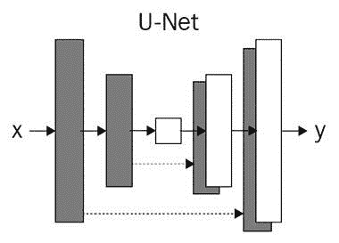
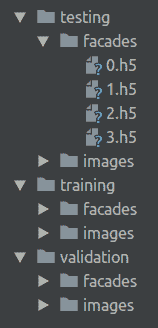
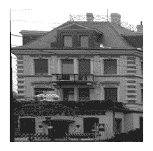
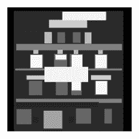
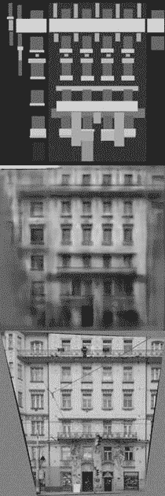
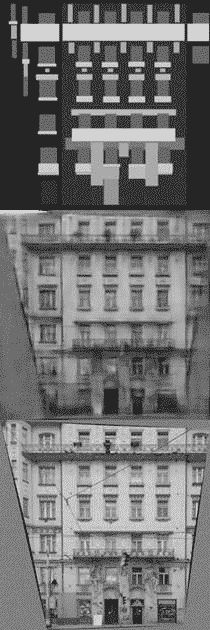
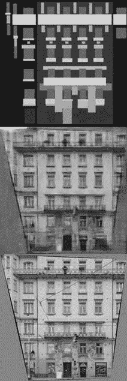
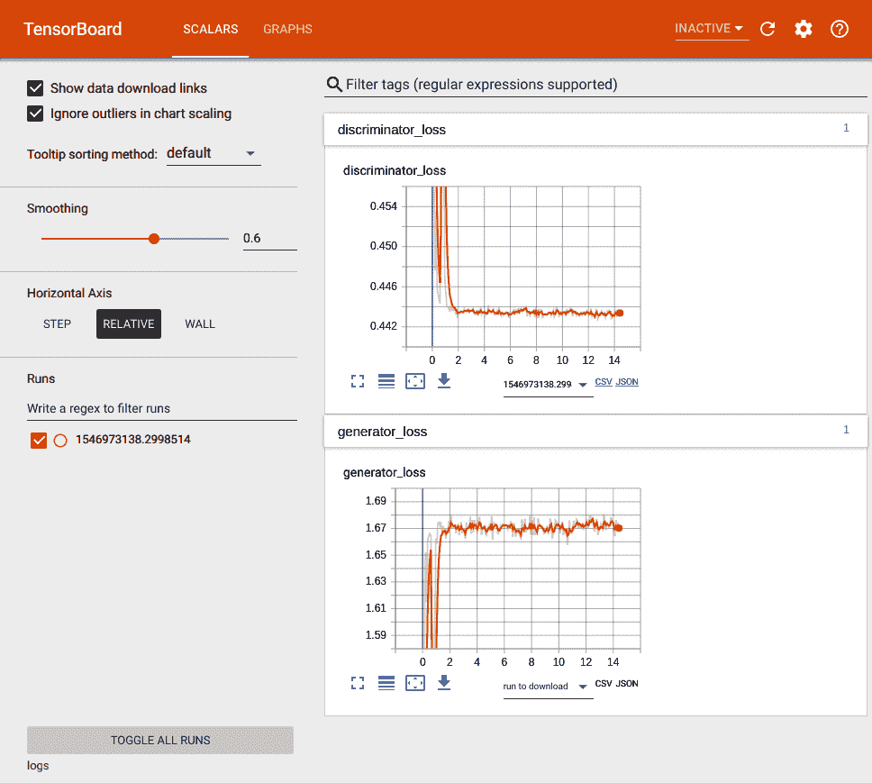
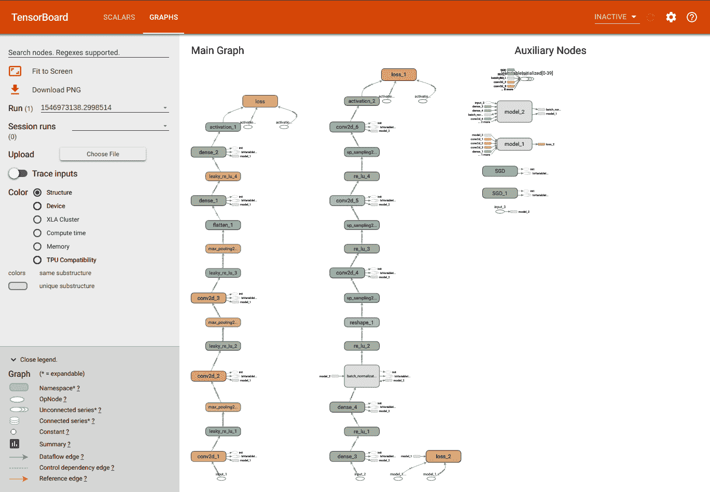
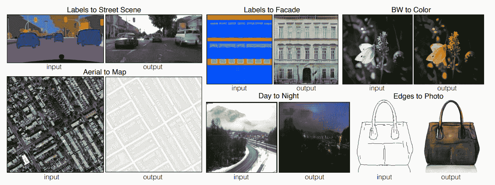

# 条件 GAN-使用条件对抗网络的图像到图像翻译


Pix2pix 是一种**生成对抗网络**（ **GAN** ），用于图像到图像的翻译。 图像到图像转换是一种将图像的一种表示形式转换为另一种表示形式的方法。 Pix2pix 学习从输入图像到输出图像的映射。 它可用于将黑白图像转换为彩色图像，将草图转换为照片，将白天图像转换为夜间图像，将卫星图像转换为地图图像。 pix2pix 网络最早是由菲利普·伊索拉（Phillip Isola），朱俊彦，周婷慧，阿列克谢·埃弗罗斯（Alexei A. Efros）在名为*和条件对抗网络*的图像到图像转换中引入的。 可以在以下链接中找到： [https://arxiv.org/pdf/1611.07004.pdf](https://arxiv.org/pdf/1611.07004.pdf) 。

在本章中，我们将介绍以下主题：

*   介绍 Pix2pix 网络
*   Pix2pix 网络的架构
*   数据收集与准备
*   Pix2pix 的 Keras 实现
*   目标功能
*   培训 Pix2pix
*   评估训练好的模型
*   Pix2pix 网络的实际应用


# 介绍 Pix2pix


Pix2pix 是条件 GAN 的变体。 我们已经在 [第 3 章](../Text/3.html)和*中使用条件 GAN（cGAN）*进行面部老化处理。 在继续之前，请确保您了解什么是 cGAN。 一旦熟悉了 cGAN，就可以继续本章。 Pix2pix 是一种 GAN，能够使用**机器学习**（ **ML** ）的无监督方法执行图像到图像的翻译。 经过训练后，pix2pix 可以将图像从域 A 转换为域 B。香草 CNN 也可以用于图像到图像的转换，但是它们不会生成逼真的图像。 另一方面，pix2pix 显示出巨大的潜力，能够生成逼真的图像。 我们将训练 pix2pix 将立面的标签转换为立面的图像。 让我们从了解 pix2pix 的体系结构开始。


# pix2pix 的体系结构


与其他 GAN 相似，pix2pix 由两个网络组成：生成器网络和鉴别器网络。 发电机网络的体系结构受 U-Net（ [https://arxiv.org/pdf/1505.04597.pdf](https://arxiv.org/pdf/1505.04597.pdf) ）的体系结构的启发。 同样，鉴别器网络的架构也受到 PatchGAN（ [https://arxiv.org/pdf/1604.04382.pdf](https://arxiv.org/pdf/1604.04382.pdf) ）架构的启发。 这两个网络都是深度卷积神经网络。 在本节中，我们将详细探讨 pix2pix。


# 发电机网络


正如我们在上一节中提到的，发电机网络在很大程度上受到 U-Net 架构的启发。 U-Net 的架构与自动编码器网络的架构几乎相同。 它们之间的主要区别在于，U-Net 网络在编码器中的各层之间具有跳过连接，并且生成器网络和自动编码器的解码器部分不具有跳过连接。 U-Net 网络由两个网络组成：编码器网络和解码器网络。 下图从基本层面说明了 U-Net 的体系结构：



上图应使您了解 U-Net 的体系结构。 如您所见，第一层的输出直接与最后一层合并。 第二层的输出与第二层的第二层合并，依此类推。 如果 *n* 是层的总数，则在编码器网络的第 i <sup>th</sup> 层与解码器的第[ *ni* ]层之间存在跳过连接 网络。 <sup>第</sup>层可以是这些层中的任何层。 让我们一个一个地仔细研究两个网络。


# 编码器网络


编码器网络是发电机网络的初始网络，包含八个**卷积块**，其配置如下：

| **图层名称** | **超参数** | **输入形状** | **输出形状** |
| 第一 2D 卷积层 | 过滤器= 64，kernel_size = 4，步幅= 2，padding ='same'， | (256, 256, 1) | (128, 128, 64) |
| 激活层 | Activation ='leakyrelu'，alpha = 0.2 | （128、128、64） | （ 128、128、64） |
| 第二 2D 卷积层 | 过滤器= 128，kernel_size = 4，步幅= 2，padding =“相同”， | (128, 128, 64) | (64, 64, 128) |
| 批次归一化层 | 没有 | （ 64、64、128） | （ 64、64、128） |
| 激活层 | Activation ='leakyrelu'，alpha = 0.2 | （ 64、64、128） | （ 64、64、128） |
| 第三 2D 卷积层 | 过滤器= 256，kernel_size = 4，步幅= 2，padding ='same'， | （ 64、64、128） | (32, 32, 256) |
| 批次归一化层 | 没有 | （32、32、256） | （32、32、256） |
| 激活层 | Activation ='leakyrelu'，alpha = 0.2 | （32、32、256） | (32, 32, 256) |
| 第四层 2D 卷积层 | 过滤器= 512，kernel_size = 4，步幅= 2，padding =“相同”， | (32, 32, 256) | (16, 16, 512) |
| 批次归一化层 | 没有 | （16，16，512） | （16，16，512） |
| 激活层 | Activation ='leakyrelu'，alpha = 0.2 | （16，16，512） | （16，16，512） |
| 第五层 2D 卷积层 | 过滤器= 512，kernel_size = 4，步幅= 2，padding =“相同”， | (16, 16, 512) | (8, 8, 512) |
| 批次归一化层 | 没有 | （ 8，8，512） | （ 8，8，512） |
| 激活层 | Activation ='leakyrelu'，alpha = 0.2 | （ 8，8，512） | （ 8，8，512） |
| 第六层 2D 卷积层 | 过滤器= 512，kernel_size = 4，步幅= 2，padding =“相同”， | (8, 8, 512) | (4, 4, 512) |
| 批次归一化层 | 没有 | （ 4，4，512） | （ 4，4，512） |
| 激活层 | Activation ='leakyrelu'，alpha = 0.2 | （ 4，4，512） | （ 4，4，512） |
| 第七层 2D 卷积层 | 过滤器= 512，kernel_size = 4，步幅= 2，padding =“相同”， | (4, 4, 512) | (2, 2, 512) |
| 批次归一化层 | 没有 | （ 2，2，512） | （ 2，2，512） |
| 激活层 | Activation ='leakyrelu'，alpha = 0.2 | （ 2，2，512） | （ 2，2，512） |
| 第八层 2D 卷积层 | 过滤器= 512，kernel_size = 4，步幅= 2，padding =“相同”， | (2, 2, 512) | (1, 1, 512) |
| 批次归一化层 | 没有 | （ 1，1，512） | （ 1，1，512） |
| 激活层 | Activation ='leakyrelu'，alpha = 0.2 | （ 1，1，512） | （ 1，1，512） |

编码器网络之后是解码器网络。 我们将在下一节中了解解码器网络的体系结构。


# 解码器网络


发生器网络中的解码器网络还包括八个**上采样卷积块**。 八个上采样卷积块的配置如下：

| **图层名称** | **超参数** | **输入形状** | **输出形状** |
| 第一 2D 上采样层 | 大小=（2，2） | （ 1，1，512） | （ 2，2，512） |
| 2D 卷积层 | 过滤器= 512，kernel_size = 4，步幅= 1，填充=“相同”， | (2, 2, 512) | (2, 2, 512) |
| 批次归一化层 | 没有 | （ 2，2，512） | （ 2，2，512） |
| 辍学层 | 辍学= 0.5 | (2, 2, 512) | （ 2，2，512） |
| 级联层（编码器网络中的第 7 个 Conv 层） | 轴= 3 | (2, 2, 512) | (2, 2, 1024) |
| 激活层 | 激活=“恢复” | （2，2，1024） | （ 2，2，1024） |
| 第二 2D 上采样层 | 大小=（2，2） | （ 2，2，1024） | （4，4，1024 ） |
| 2D 卷积层 | 过滤器= 1024，kernel_size = 4，步幅= 1，填充=“相同”， | （4，4，1024 ） | （ 4，4，1024 ） |
| 批次归一化层 | 没有 | （ 4，4，1024 ） | （ 4，4，1024 ） |
| 辍学层 | 辍学= 0.5 | （ 4，4，1024 ） | （ 4，4，1024 ） |
| 级联层（编码器网络中的第 6 个 Conv 层） | 轴= 3 | （ 4，4，1024 ） | （ 4，4，1536 ） |
| 激活层 | 激活=“恢复” | （ 4，4，1536） | （ 4，4，1536 ） |
| 第三 2D 上采样层 | 大小=（2，2） | （ 4，4，1536） | （8 ，8、1536 ） |
| 2D 卷积层 | 过滤器= 1024，kernel_size = 4，步幅= 1，填充=“相同”， | (8, 8, 1536) | (8, 8, 1024) |
| 批次归一化层 | 没有 | （ 8，8，1024） | （ 8，8，1024） |
| 辍学层 | 辍学= 0.5 | （ 8，8，1024） | （ 8，8，1024） |
| 级联层（编码器网络中的第 5 个 Conv 层） | 轴= 3 | （ 8，8，1024） | (8, 8, 1536) |
| 激活层 | 激活=“恢复” | （8，8，1536） | （ 8，8，1536 ） |
| 第四层 2D 上采样层 | 大小=（2，2） | （ 8，8，1536 ） | （ 16，16，1536） |
| 2D 卷积层 | 过滤器= 1024，kernel_size = 4，步幅= 1，填充=“相同”， | (16, 16, 1536) | (16, 16, 1024) |
| 批次归一化层 | 没有 | （ 16，16，1024） | （ 16，16，1024） |
| 串联层（编码器网络的第 4 个 Conv 层） | 轴= 3 | （ 16，16，1024） | (16, 16, 1536) |
| 激活层 | 激活=“恢复” | （ 16，16，1536） | （ 16，16，1536） |
| 第五层 2D 上采样层 | 大小=（2，2） | （ 16，16，1536 ） | （ 32、32、1536） |
| 2D 卷积层 | 过滤器= 1024，kernel_size = 4，步幅= 1，填充=“相同”， | （ 32、32、1536） | (32, 32, 1024) |
| 批次归一化层 | 没有 | （ 32、32、1024） | （ 32、32、1024） |
| 串联层（编码器网络的第 3 个 Conv 层） | 轴= 3 | （ 32、32、1024） | （ 32、32、1280） |
| 激活层 | 激活=“恢复” | （ 32、32、1280） | （ 32、32、1280） |
| 第六层 2D 上采样层 | 大小=（2，2） | （ 64、64、1280） | （ 64、64、1280） |
| 2D 卷积层 | 过滤器= 512，kernel_size = 4，步幅= 1，填充=“相同”， | （ 64、64、1280） | （ 64、64、512） |
| 批次归一化层 | 没有 | （ 64、64、512） | （ 64、64、512） |
| 串联层（编码器网络中的第二个 Conv 层） | 轴= 3 | （ 64、64、512） | （ 64、64、640） |
| 激活层 | 激活=“恢复” | （ 64、64、640） | （ 64、64、640） |
| 第七层 2D 上采样层 | 大小=（2，2） | （ 64、64、640） | （ 128、128、640） |
| 2D 卷积层 | 过滤器= 256，kernel_size = 4，步幅= 1，填充=“相同”， | （ 128、128、640） | （ 128、128、256） |
| 批次归一化层 | 没有 | （ 128、128、256） | （ 128、128、256） |
| 串联层（编码器网络中的第一个转化层） | 轴= 3 | （ 128、128、256） | （ 128、128、320） |
| 激活层 | 激活=“恢复” | （ 128、128、320） | （ 128、128、320） |
| 第八层 2D 上采样层 | 大小=（2，2） | （ 128、128、320） | （ 256、256、320） |
| 2D 卷积层 | 过滤器= 1，kernel_size = 4，步幅= 1，填充=“相同”， | （ 256、256、320） | （ 256，256，1） |
| 激活层 | 激活='tanh' | （ 256、256、1） | （ 256，256，1） |

生成器网络具有**七个跳过连接**，可以将其定义如下：

*   第 1 个<sup>编码器模块的输出到第<sup xmlns:epub="http://www.idpf.org/2007/ops">个第 7 个</sup> 解码器模块的输出。</sup>
*   从第 2 个<sup>编码器模块到</sup> 的输出的串联<sup xmlns:epub="http://www.idpf.org/2007/ops">第 6 个</sup> 解码器模块
*   从第 3 个<sup>编码器模块到</sup> 的第 5 个 解码器模块的输出的并置
*   从第 4 个<sup>编码器模块到</sup> 第 4 个 解码器模块的输出的串联
*   从第 5 个<sup>编码器模块到</sup> 第 3 个 解码器模块的输出的串联
*   从第 6 个<sup>编码器模块到</sup> 第 2 个<sup>和</sup> 解码器模块的输出串联
*   将第 7 个<sup>编码器模块的输出连接到第一个 <sup>st</sup></sup> 解码器模块的

串联沿着通道轴发生。 编码器网络的最后一层将张量传递到解码器网络的第一层。 在编码器网络的最后一块和解码器网络的最后一块没有串联。

发电机网络由这两个网络组成。 基本上，编码器网络是下采样器，而解码器网络是上采样器。 编码器网络 d 自己对尺寸为（256、256、1）的图像采样为尺寸为（1、1、1、512）的内部表示。 另一方面，解码器网络将 的内部表示以（1、1、1,512）维度上采样为（256、256、1）维度的输出图像 。

We will cover more on the architecture in the *Keras implementation of pix2pix* section.


# 鉴别网络


pix2pix 中鉴别器网络的架构受到 PatchGAN 网络架构的启发。 PatchGAN 网络包含八个卷积块，如下所示：

| **图层名称** | **超参数** | **输入形状** | **输出形状** |
| 第一 2D 卷积层 | 过滤器= 64，kernel_size = 4，步幅= 2，padding ='same'， | (256, 256, 1) | （ 256、256、64） |
| 激活层 | Activation ='leakyrelu'，alpha = 0.2 | （128、128、64 ） | （128，128，64 ） |
| 第二 2D 卷积层 | 过滤器= 128，kernel_size = 4，步幅= 2，padding =“相同”， | (128, 128, 64) | (64, 64, 128) |
| 批次归一化层 | 没有 | （ 64、64、128） | （ 64、64、128） |
| 激活层 | Activation ='leakyrelu'，alpha = 0.2 | （ 64、64、128）[ | （ 64、64、128） |
| 第三 2D 卷积层 | 过滤器= 256，kernel_size = 4，步幅= 2，padding ='same'， | （ 64、64、128） | （ 32、32、256） |
| 批次归一化层 | 没有 | （ 32、32、256） | （ 32、32、256） |
| 激活层 | Activation ='leakyrelu'，alpha = 0.2 | （ [ 32，32，256） | （ 32、32、256） |
| 第四层 2D 卷积层 | 过滤器= 512，kernel_size = 4，步幅= 2，padding =“相同”， | （ 32、32、256） | (16, 16, 512) |
| 批次归一化层 | 没有 | （16，16，512 ） | （16，16，512 ） |
| 激活层 | Activation ='leakyrelu'，alpha = 0.2 | （16、16、512 ） | （16，16，512 ） |
| 第五层 2D 卷积层 | 过滤器= 512，kernel_size = 4，步幅= 2，padding =“相同”， | （16，16，512 ） | (8, 8, 512) |
| 批次归一化层 | 没有 | (8, 8, 512) | (8, 8, 512) |
| 激活层 | Activation ='leakyrelu'，alpha = 0.2 | （8、8、512） | (8, 8, 512) |
| 第六层 2D 卷积层 | 过滤器= 512，kernel_size = 4，步幅= 2，padding =“相同”， | (8, 8, 512) | (4, 4, 512) |
| 批次归一化层 | 没有 | (4, 4, 512) | (4, 4, 512) |
| 激活层 | Activation ='leakyrelu'，alpha = 0.2 | （4、4、512） | (4, 4, 512) |
| 第七层 2D 卷积层 | 过滤器= 512，kernel_size = 4，步幅= 2，padding =“相同”， | (4, 4, 512) | (2, 2, 512) |
| 批次归一化层 | 没有 | （ 2，2，512） | （ 2，2，512） |
| 激活层 | Activation ='leakyrelu'，alpha = 0.2 | （ [ 2，2，512） | （ 2，2，512） |
| 第八层 2D 卷积层 | 过滤器= 512，kernel_size = 4，步幅= 2，padding =“相同”， | (4, 4, 512) | (1, 1, 512) |
| 批次归一化层 | 没有 | （ 1，1，512） | （ 1，1，512） |
| 激活层 | Activation ='leakyrelu'，alpha = 0.2 | （ [ 1，1，512） | （ 1，1，512） |
| 展平层 | 没有 | （1、1、512） | (512, ) |
| 致密层 | 单位= 2，激活='softmax' | （1、1、512） | (2, ) |

下表突出显示了鉴别器网络的体系结构和配置。 fl1 tten 层将张量展平为一维数组。

The remaining layers in the discriminator network are covered in the *The Keras implementation of pix2pix* section of this chapter.

现在，我们已经探索了这两个网络的体系结构和配置。 现在，我们将探讨训练 pix2pix 所需的训练目标函数。


# 训练目标功能


Pix2pix 是一个条件生成对抗网络，并且对于 c 附加 GAN s 的目标函数可以表示为：


在这里，网络 *G* （生成器）正试图使针对对手 *D* （鉴别器）的先前功能最小化，而对手 *D* 则试图使先前的功能最大化 功能。

如果必须比较香草 GAN 和条件 GAN 的目标函数，则香草 GAN 的目标函数如下：


为了减少图像的模糊，我们可以向目标函数添加一个 L1 损失函数。 L1 损失函数可以表示为：


在该等式中， *y* 是原始图像， *G（x，z）*是生成器网络生成的图像。 L1 损失是由原始图像的所有像素值与生成的图像的所有像素值之间的所有绝对差值的总和[t HTG4]来计算的。

pix2pix 的最终目标函数如下：


这是条件 GAN 的损失函数和 L1 损失函数的加权和。

现在我们对 pix2pix 网络有了基本的了解。 在开始在 Keras 中实现 pix2pix 之前，让我们设置项目。


# 设置项目


如果尚未使用所有章节的完整代码克隆存储库，请立即克隆存储库。 克隆的存储库有一个名为`Chapter09`的目录，其中包含本章的全部代码。 执行以下命令来设置项目：

1.  首先，导航到父目录，如下所示：

```py
cd Generative-Adversarial-Networks-Projects
```

2.  现在，将目录从当前目录更改为  `Chapter09`：

```py
cd Chapter09
```

3.  接下来，为该项目创建一个 Python 虚拟环境：

```py
virtualenv venv
virtualenv venv -p python3 # Create a virtual environment using python3 interpreter
virtualenv venv -p python2 # Create a virtual environment using python2 interpreter
```

我们将为此项目使用此新创建的虚拟环境。 每章都有其自己单独的虚拟环境。

4.  接下来，激活新创建的虚拟环境：

```py
source venv/bin/activate
```

激活虚拟环境后，所有其他命令将在此虚拟环境中执行。

5.  接下来，通过执行以下命令，安装`requirements.txt` 文件中提供的所有库：

```py
pip install -r requirements.txt
```

您可以参考  `README.md` 文件，以获取有关如何设置项目的更多说明。 开发人员经常会遇到依赖关系不匹配的问题。 为每个项目创建一个单独的虚拟环境将解决此问题。

在本节中，我们已成功设置项目并安装了所需的依赖项。 在下一部分中，我们将处理数据集。 现在，我们将探讨下载和格式化数据集所需的各个步骤。


# 准备数据


在本章中，我们将使用 Facades 数据集，该数据集可从以下链接获得：

[ht](http://efrosgans.eecs.berkeley.edu/pix2pix/datasets/facades.tar.gz) [tp：//efrosgans.eecs.berkeley.edu/pix2pix/datasets/facades.tar.gz](http://efrosgans.eecs.berkeley.edu/pix2pix/datasets/facades.tar.gz) 。

该数据集包含立面标签和地面真实立面图像。 外观通常是建筑物的正面，外观标签是外观图像的建筑标签。 下载数据集后，我们将了解有关立面的更多信息。 执行以下命令以下载和提取数据集：

1.  通过执行以下命令下载数据集：

```py
# Before downloading the dataset navigate to data directory
cd data

# Download the dataset
wget http://efrosgans.eecs.berkeley.edu/pix2pix/datasets/facades.tar.gz
```

2.  下载数据集后，使用以下命令提取数据集：

```py
tar -xvzf facades.tar.gz
```

下载的数据集的文件结构如下：



数据集分为训练，测试和验证数据集。 让我们来提取图像。

执行以下步骤以加载数据集：

1.  首先创建包含外观标签的`.h5`文件列表和包含外观图像的`.h5`另一个列表，如下所示：

```py
data_dir_path = os.path.join(data_dir, data_type)

# Get all .h5 files containing training images facade_photos_h5 = [f for f in os.listdir(os.path.join(data_dir_path, 'images')) if '.h5' in f]
facade_labels_h5 = [f for f in os.listdir(os.path.join(data_dir_path, 'facades')) if '.h5' in f]
```

2.  接下来，遍历列表以依次加载每个图像：

```py
final_facade_photos = None final_facade_labels = None   for index in range(len(facade_photos_h5)):
```

此步骤之后的所有代码都将位于前面的`for`循环中。

3.  接下来，加载包含图像的`h5`文件，并检索实际图像的 Numpy NDArrays：

```py
facade_photos_path = data_dir_path + '/images/' +   
                     facade_photos_h5[index]
facade_labels_path = data_dir_path + '/facades/' +  
                     facade_labels_h5[index]

facade_photos = h5py.File(facade_photos_path, 'r')
facade_labels = h5py.File(facade_labels_path, 'r')
```

4.  接下来，将图像调整为所需的图像尺寸，如下所示：

```py
# Resize and normalize images num_photos = facade_photos['data'].shape[0]
num_labels = facade_labels['data'].shape[0]

all_facades_photos = np.array(facade_photos['data'], dtype=np.float32)
all_facades_photos = all_facades_photos.reshape((num_photos, img_width, img_height, 1)) / 255.0   all_facades_labels = np.array(facade_labels['data'], dtype=np.float32)
all_facades_labels = all_facades_labels.reshape((num_labels, img_width, img_height, 1)) / 255.0
```

5.  接下来，将调整大小的图像添加到最终的 NDArrays 中：

```py
if final_facade_photos is not None and final_facade_labels is not None:
final_facade_photos = np.concatenate([final_facade_photos, 
                                   all_facades_photos], axis=0)
final_facade_labels = np.concatenate([final_facade_labels, all_facades_labels], axis=0)
 else:
        final_facade_photos = all_facades_photos
        final_facade_labels = all_facades_labels
```

加载和调整图像大小的整个代码如下所示：

```py
def load_dataset(data_dir, data_type, img_width, img_height):
    data_dir_path = os.path.join(data_dir, data_type)

    # Get all .h5 files containing training images
  facade_photos_h5 = [f for f in os.listdir(os.path.join(data_dir_path, 'images')) if '.h5' in f]
    facade_labels_h5 = [f for f in os.listdir(os.path.join(data_dir_path, 'facades')) if '.h5' in f]

    final_facade_photos = None
  final_facade_labels = None   for index in range(len(facade_photos_h5)):
        facade_photos_path = data_dir_path + '/images/' + facade_photos_h5[index]
        facade_labels_path = data_dir_path + '/facades/' + facade_labels_h5[index]

        facade_photos = h5py.File(facade_photos_path, 'r')
        facade_labels = h5py.File(facade_labels_path, 'r')

        # Resize and normalize images
  num_photos = facade_photos['data'].shape[0]
        num_labels = facade_labels['data'].shape[0]

        all_facades_photos = np.array(facade_photos['data'], dtype=np.float32)
        all_facades_photos = all_facades_photos.reshape((num_photos, img_width, img_height, 1)) / 255.0    all_facades_labels = np.array(facade_labels['data'], dtype=np.float32)
        all_facades_labels = all_facades_labels.reshape((num_labels, img_width, img_height, 1)) / 255.0    if final_facade_photos is not None and final_facade_labels is not None:
            final_facade_photos = np.concatenate([final_facade_photos, all_facades_photos], axis=0)
            final_facade_labels = np.concatenate([final_facade_labels, all_facades_labels], axis=0)
        else:
            final_facade_photos = all_facades_photos
            final_facade_labels = all_facades_labels

    return final_facade_photos, final_facade_labels
```

先前的功能将从训练，测试和验证目录中的`.h5`文件加载图像。


# 可视化图像


可视化外观标签和外观图像的 Python 函数如下所示：

```py
def visualize_bw_image(img):
    """
 Visualize a black and white image """  fig = plt.figure()
    ax = fig.add_subplot(1, 1, 1)
    ax.imshow(img, cmap='gray', interpolation='nearest')
    ax.axis("off")
    ax.set_title("Image")
    plt.show()
```

使用前面的功能可以使外观标签或外观照片可视化，如下所示：

```py
visualize_bw_image(image)
visualize_bw_image(image)
```

建筑物外墙的图像示例如下：



下图表示前面的门面图像的建筑标签：



我们将训练一个 pix2pix 网络，该网络能够从立面标签生成立面图像。 让我们开始使用生成器和鉴别器的 Keras 实现。


# pix2pix 的 Keras 实现


如前所述，pix2pix 具有两个网络：一个生成器和一个鉴别器。 该生成器受 U-Net 架构的启发。 同样，鉴别器网络也受到 PatchGAN 架构的启发。 我们将在以下部分中实现这两个网络。

在开始编写实现之前，创建一个 Python 文件 `main.py` ，然后按以下方式导入基本模块：

```py
import os
import time

import h5py
import keras.backend as K
import matplotlib.pyplot as plt
import numpy as np
from cv2 import imwrite
from keras import Input, Model
from keras.layers import Convolution2D, LeakyReLU, BatchNormalization, UpSampling2D, Dropout, Activation, Flatten, Dense, Lambda, Reshape, concatenate
from keras.optimizers import Adam
```


# 发电机网络


生成器网络从源域 A 拍摄尺寸为（256、256、1）的图像，并将其转换为目标域 B 中尺寸为（256、256、1）的图像。 基本上，它将图像从源域 A 转换为目标域 B。让我们在 Keras 框架中实现生成器网络。

执行以下步骤来创建发电机网络：

1.  首先定义生成器网络所需的超参数：

```py
kernel_size = 4 strides = 2 leakyrelu_alpha = 0.2 upsampling_size = 2 dropout = 0.5 output_channels = 1 input_shape = (256, 256, 1)
```

2.  现在创建一个输入层，将输入输入到网络，如下所示：

```py
input_layer = Input(shape=input_shape)
```

The input layer takes an input image of a shape of (256, 256, 1) and passes it to the next layer in the network.

如上所述，生成器网络具有两个部分：编码器和解码器。 在接下来的几个步骤中，我们将编写编码器部分的代码。

3.  使用先前在，，*，pix2pix* 部分部分中指示的参数，将第一个卷积块添加到生成器网络：

```py
# 1st Convolutional block in the encoder network encoder1 = Convolution2D(filters=64, kernel_size=kernel_size, padding='same', strides=strides)(input_layer)
encoder1 = LeakyReLU(alpha=leakyrelu_alpha)(encoder1)
```

第一卷积块包含具有激活功能的 2D 卷积层。 与其他七个卷积块不同，它没有批处理规范化层。

4.  将其他七个卷积块添加到生成器网络：

```py
# 2nd Convolutional block in the encoder network encoder2 = Convolution2D(filters=128, kernel_size=kernel_size, padding='same',
  strides=strides)(encoder1)
encoder2 = BatchNormalization()(encoder2)
encoder2 = LeakyReLU(alpha=leakyrelu_alpha)(encoder2)

# 3rd Convolutional block in the encoder network encoder3 = Convolution2D(filters=256, kernel_size=kernel_size, padding='same',
  strides=strides)(encoder2)
encoder3 = BatchNormalization()(encoder3)
encoder3 = LeakyReLU(alpha=leakyrelu_alpha)(encoder3)

# 4th Convolutional block in the encoder network encoder4 = Convolution2D(filters=512, kernel_size=kernel_size, padding='same',
  strides=strides)(encoder3)
encoder4 = BatchNormalization()(encoder4)
encoder4 = LeakyReLU(alpha=leakyrelu_alpha)(encoder4)

# 5th Convolutional block in the encoder network encoder5 = Convolution2D(filters=512, kernel_size=kernel_size, padding='same',
  strides=strides)(encoder4)
encoder5 = BatchNormalization()(encoder5)
encoder5 = LeakyReLU(alpha=leakyrelu_alpha)(encoder5)

# 6th Convolutional block in the encoder network encoder6 = Convolution2D(filters=512, kernel_size=kernel_size, padding='same',
  strides=strides)(encoder5)
encoder6 = BatchNormalization()(encoder6)
encoder6 = LeakyReLU(alpha=leakyrelu_alpha)(encoder6)

# 7th Convolutional block in the encoder network encoder7 = Convolution2D(filters=512, kernel_size=kernel_size, padding='same',
  strides=strides)(encoder6)
encoder7 = BatchNormalization()(encoder7)
encoder7 = LeakyReLU(alpha=leakyrelu_alpha)(encoder7)

# 8th Convolutional block in the encoder network encoder8 = Convolution2D(filters=512, kernel_size=kernel_size, padding='same',
  strides=strides)(encoder7)
encoder8 = BatchNormalization()(encoder8)
encoder8 = LeakyReLU(alpha=leakyrelu_alpha)(encoder8)
```

这是发电机网络中编码器部分的末端。 生成器网络中的第二部分是解码器。 在接下来的几个步骤中，让我们为解码器编写代码。

5.  将第一个上采样卷积块添加到先前在 *pix2pix* 部分的体系结构中指示的参数中：

```py
# 1st Upsampling Convolutional Block in the decoder network decoder1 = UpSampling2D(size=upsampling_size)(encoder8)
decoder1 = Convolution2D(filters=512, kernel_size=kernel_size, padding='same')(decoder1)
decoder1 = BatchNormalization()(decoder1)
decoder1 = Dropout(dropout)(decoder1)
decoder1 = concatenate([decoder1, encoder7], axis=3)
decoder1 = Activation('relu')(decoder1)
```

第一个上采样模块从编码器部分的最后一层获取输入。 它具有一个 2D 上采样层，一个 2D 卷积层，一个批处理归一化层，一个脱落层，一个串联操作和一个激活函数。 请参阅 Keras 文档以找到有关这些层的更多信息，该文档可从 [https://keras.io/](https://keras.io/) 获得。

6.  同样，添加以下七个卷积块，如下所示：

```py
# 2nd Upsampling Convolutional block in the decoder network decoder2 = UpSampling2D(size=upsampling_size)(decoder1)
decoder2 = Convolution2D(filters=1024, kernel_size=kernel_size, padding='same')(decoder2)
decoder2 = BatchNormalization()(decoder2)
decoder2 = Dropout(dropout)(decoder2)
decoder2 = concatenate([decoder2, encoder6])
decoder2 = Activation('relu')(decoder2)

# 3rd Upsampling Convolutional block in the decoder network decoder3 = UpSampling2D(size=upsampling_size)(decoder2)
decoder3 = Convolution2D(filters=1024, kernel_size=kernel_size, padding='same')(decoder3)
decoder3 = BatchNormalization()(decoder3)
decoder3 = Dropout(dropout)(decoder3)
decoder3 = concatenate([decoder3, encoder5])
decoder3 = Activation('relu')(decoder3)

# 4th Upsampling Convolutional block in the decoder network decoder4 = UpSampling2D(size=upsampling_size)(decoder3)
decoder4 = Convolution2D(filters=1024, kernel_size=kernel_size, padding='same')(decoder4)
decoder4 = BatchNormalization()(decoder4)
decoder4 = concatenate([decoder4, encoder4])
decoder4 = Activation('relu')(decoder4)

# 5th Upsampling Convolutional block in the decoder network decoder5 = UpSampling2D(size=upsampling_size)(decoder4)
decoder5 = Convolution2D(filters=1024, kernel_size=kernel_size, padding='same')(decoder5)
decoder5 = BatchNormalization()(decoder5)
decoder5 = concatenate([decoder5, encoder3])
decoder5 = Activation('relu')(decoder5)

# 6th Upsampling Convolutional block in the decoder network decoder6 = UpSampling2D(size=upsampling_size)(decoder5)
decoder6 = Convolution2D(filters=512, kernel_size=kernel_size, padding='same')(decoder6)
decoder6 = BatchNormalization()(decoder6)
decoder6 = concatenate([decoder6, encoder2])
decoder6 = Activation('relu')(decoder6)

# 7th Upsampling Convolutional block in the decoder network decoder7 = UpSampling2D(size=upsampling_size)(decoder6)
decoder7 = Convolution2D(filters=256, kernel_size=kernel_size, padding='same')(decoder7)
decoder7 = BatchNormalization()(decoder7)
decoder7 = concatenate([decoder7, encoder1])
decoder7 = Activation('relu')(decoder7)

# Last Convolutional layer decoder8 = UpSampling2D(size=upsampling_size)(decoder7)
decoder8 = Convolution2D(filters=output_channels, kernel_size=kernel_size, padding='same')(decoder8)
decoder8 = Activation('tanh')(decoder8)
```

最后一层的激活函数为`'tanh'`，因为我们打算让生成器生成介于-1 到 1 之间的值。`'concatenate'`层用于添加跳过连接。 最后一层将生成张量为（256，256，1）的张量。

The 'concatenate' layer concatenates tensors along the channel dimension. You can provide a value for the axis, along which you want your tensors to be concatenated.

7.  最后，通过指定发电机网络的输入和输出来创建 Keras 模型：

```py
# Create a Keras model
model = Model(inputs=[input_layer], outputs=[decoder8])
```

Python 函数内部的生成器网络的整个代码如下所示：

```py
def build_unet_generator():
    """
 Create U-Net Generator using the hyperparameter values defined  
    below """    kernel_size = 4
  strides = 2
  leakyrelu_alpha = 0.2
  upsampling_size = 2
  dropout = 0.5
  output_channels = 1
  input_shape = (256, 256, 1)

    input_layer = Input(shape=input_shape)

    # Encoder Network   # 1st Convolutional block in the encoder network  encoder1 = Convolution2D(filters=64, kernel_size=kernel_size, 
                             padding='same',
  strides=strides)(input_layer)
    encoder1 = LeakyReLU(alpha=leakyrelu_alpha)(encoder1)

    # 2nd Convolutional block in the encoder network
  encoder2 = Convolution2D(filters=128, kernel_size=kernel_size, 
                             padding='same',
  strides=strides)(encoder1)
    encoder2 = BatchNormalization()(encoder2)
    encoder2 = LeakyReLU(alpha=leakyrelu_alpha)(encoder2)

    # 3rd Convolutional block in the encoder network
  encoder3 = Convolution2D(filters=256, kernel_size=kernel_size, 
                             padding='same',
  strides=strides)(encoder2)
    encoder3 = BatchNormalization()(encoder3)
    encoder3 = LeakyReLU(alpha=leakyrelu_alpha)(encoder3)

    # 4th Convolutional block in the encoder network
  encoder4 = Convolution2D(filters=512, kernel_size=kernel_size, 
                             padding='same',
  strides=strides)(encoder3)
    encoder4 = BatchNormalization()(encoder4)
    encoder4 = LeakyReLU(alpha=leakyrelu_alpha)(encoder4)

    # 5th Convolutional block in the encoder network
  encoder5 = Convolution2D(filters=512, kernel_size=kernel_size, 
                             padding='same',
  strides=strides)(encoder4)
    encoder5 = BatchNormalization()(encoder5)
    encoder5 = LeakyReLU(alpha=leakyrelu_alpha)(encoder5)

    # 6th Convolutional block in the encoder network
  encoder6 = Convolution2D(filters=512, kernel_size=kernel_size, 
                             padding='same',
  strides=strides)(encoder5)
    encoder6 = BatchNormalization()(encoder6)
    encoder6 = LeakyReLU(alpha=leakyrelu_alpha)(encoder6)

    # 7th Convolutional block in the encoder network
  encoder7 = Convolution2D(filters=512, kernel_size=kernel_size, 
                             padding='same',
  strides=strides)(encoder6)
    encoder7 = BatchNormalization()(encoder7)
    encoder7 = LeakyReLU(alpha=leakyrelu_alpha)(encoder7)

    # 8th Convolutional block in the encoder network
  encoder8 = Convolution2D(filters=512, kernel_size=kernel_size, 
                             padding='same',
  strides=strides)(encoder7)
    encoder8 = BatchNormalization()(encoder8)
    encoder8 = LeakyReLU(alpha=leakyrelu_alpha)(encoder8)

    # Decoder Network   # 1st Upsampling Convolutional Block in the decoder network  decoder1 = UpSampling2D(size=upsampling_size)(encoder8)
    decoder1 = Convolution2D(filters=512, kernel_size=kernel_size, 
                             padding='same')(decoder1)
    decoder1 = BatchNormalization()(decoder1)
    decoder1 = Dropout(dropout)(decoder1)
    decoder1 = concatenate([decoder1, encoder7], axis=3)
    decoder1 = Activation('relu')(decoder1)

    # 2nd Upsampling Convolutional block in the decoder network
  decoder2 = UpSampling2D(size=upsampling_size)(decoder1)
    decoder2 = Convolution2D(filters=1024, kernel_size=kernel_size, 
                             padding='same')(decoder2)
    decoder2 = BatchNormalization()(decoder2)
    decoder2 = Dropout(dropout)(decoder2)
    decoder2 = concatenate([decoder2, encoder6])
    decoder2 = Activation('relu')(decoder2)

    # 3rd Upsampling Convolutional block in the decoder network
  decoder3 = UpSampling2D(size=upsampling_size)(decoder2)
    decoder3 = Convolution2D(filters=1024, kernel_size=kernel_size, 
                             padding='same')(decoder3)
    decoder3 = BatchNormalization()(decoder3)
    decoder3 = Dropout(dropout)(decoder3)
    decoder3 = concatenate([decoder3, encoder5])
    decoder3 = Activation('relu')(decoder3)

    # 4th Upsampling Convolutional block in the decoder network
  decoder4 = UpSampling2D(size=upsampling_size)(decoder3)
    decoder4 = Convolution2D(filters=1024, kernel_size=kernel_size, 
                             padding='same')(decoder4)
    decoder4 = BatchNormalization()(decoder4)
    decoder4 = concatenate([decoder4, encoder4])
    decoder4 = Activation('relu')(decoder4)

    # 5th Upsampling Convolutional block in the decoder network
  decoder5 = UpSampling2D(size=upsampling_size)(decoder4)
    decoder5 = Convolution2D(filters=1024, kernel_size=kernel_size, 
                             padding='same')(decoder5)
    decoder5 = BatchNormalization()(decoder5)
    decoder5 = concatenate([decoder5, encoder3])
    decoder5 = Activation('relu')(decoder5)

    # 6th Upsampling Convolutional block in the decoder network
  decoder6 = UpSampling2D(size=upsampling_size)(decoder5)
    decoder6 = Convolution2D(filters=512, kernel_size=kernel_size, 
                             padding='same')(decoder6)
    decoder6 = BatchNormalization()(decoder6)
    decoder6 = concatenate([decoder6, encoder2])
    decoder6 = Activation('relu')(decoder6)

    # 7th Upsampling Convolutional block in the decoder network
  decoder7 = UpSampling2D(size=upsampling_size)(decoder6)
    decoder7 = Convolution2D(filters=256, kernel_size=kernel_size, 
                             padding='same')(decoder7)
    decoder7 = BatchNormalization()(decoder7)
    decoder7 = concatenate([decoder7, encoder1])
    decoder7 = Activation('relu')(decoder7)

    # Last Convolutional layer
  decoder8 = UpSampling2D(size=upsampling_size)(decoder7)
    decoder8 = Convolution2D(filters=output_channels, 
               kernel_size=kernel_size, padding='same')(decoder8)
    decoder8 = Activation('tanh')(decoder8)

    model = Model(inputs=[input_layer], outputs=[decoder8])
    return model
```

我们现在已经成功地为发电机网络创建了 Keras 模型。 在下一节中，我们将为鉴别器网络创建 Keras 模型。


# 鉴别网络


鉴别器网络受 PatchGAN 架构的启发。 它包含八个卷积块，一个密集层和一个平坦层。 鉴别器网络获取从尺寸为（256、256、1）的图像中提取的一组补丁，并预测给定补丁的概率。 让我们在 Keras 中实现鉴别器。

1.  首先初始化生成器网络所需的超参数：

```py
kernel_size = 4 strides = 2 leakyrelu_alpha = 0.2 padding = 'same' num_filters_start = 64 # Number of filters to start with num_kernels = 100 kernel_dim = 5 patchgan_output_dim = (256, 256, 1)
patchgan_patch_dim = (256, 256, 1)

# Calculate number of patches
number_patches = int((patchgan_output_dim[0] / patchgan_patch_dim[0]) * (patchgan_output_dim[1] / patchgan_patch_dim[1]))
```

2.  让我们向网络添加一个输入层。 这需要一个张量为 `patchgan_patch_dim`的张量的补丁：

```py
input_layer = Input(shape=patchgan_patch_dim)
```

3.  接下来，如下所示将卷积层添加到网络。 *pix2pix 的体系结构*部分中提供了该块的配置：

```py
des = Convolution2D(filters=64, kernel_size=kernel_size, padding=padding, strides=strides)(input_layer)
des = LeakyReLU(alpha=leakyrelu_alpha)(des)
```

4.  接下来，使用以下代码计算卷积块的数量：

```py
# Calculate the number of convolutional layers total_conv_layers = int(np.floor(np.log(patchgan_output_dim[1]) / 
                    np.log(2)))
list_filters = [num_filters_start * min(total_conv_layers, (2 ** i)) for i in range(total_conv_layers)]
```

5.  接下来，使用先前在 *pix2pix* 部分的体系结构中指示的超参数值添加另外七个卷积块：

```py
# Next 7 Convolutional blocks for filters in list_filters[1:]:
    des = Convolution2D(filters=filters, kernel_size=kernel_size, padding=padding, strides=strides)(des)
    des = BatchNormalization()(des)
    des = LeakyReLU(alpha=leakyrelu_alpha)(des)

```

6.  接下来，将平坦的层添加到网络，如下所示：

```py
flatten_layer = Flatten()(des)
```

平坦层将 *n* 维张量转换为一维张量。

7.  类似地，添加具有两个节点/神经元的密集层，并添加 `softmax` 作为激活函数。 这需要一个来自 `Flatten` 层的张量，并将其转换为尺寸为 `(batch_size, 2)`的张量：

```py
dense_layer = Dense(units=2, activation='softmax')(flatten_layer)
```

`softmax`函数将向量转换为概率分布。

8.  接下来，为 PatchGAN 网络创建 Keras 模型，如下所示：

```py
model_patch_gan = Model(inputs=[input_layer], outputs=[dense_layer, flatten_layer])
```

PatchGAN 模型将输入张量作为输入，并输出两个张量，一个来自密集层，另一个来自平坦层。 我们的 PatchGAN 网络现已准备就绪。 但是，它本身不能用作鉴别器。 而是将单个补丁分类为真实或伪造类别。 要创建完整的鉴别器，请按照下列步骤操作：

1.  我们将从输入图像中提取色块，并将它们逐一馈送到 PatchGAN。 创建一个等于补丁数量的输入层列表，如下所示：

```py
# Create a list of input layers equal to number of patches list_input_layers = [Input(shape=patchgan_patch_dim) for _ in range(number_patches)]
```

2.  接下来，将补丁传递到 PatchGAN 网络并获得概率分布：

```py
# Pass the patches to the PatchGAN and get probability distribution output1 = [model_patch_gan(patch)[0] for patch in list_input_layers]
output2 = [model_patch_gan(patch)[1] for patch in list_input_layers]
```

如果我们有多个面片，则`output1`和`output2`都是张量的列表。 我们现在应该有两个张量列表。

3.  如果您有多个补丁，请沿着渠道维度将其串联起来以计算永久损耗：

```py
# In case of multiple patches, concatenate them along the channel dimension to calculate perceptual loss if len(output1) > 1:
    output1 = concatenate(output1)
else:
    output1 = output1[0]

# In case of multiple patches, merge output2 as well if len(output2) > 1:
    output2 = concatenate(output2)
else:
    output2 = output2[0]
```

4.  接下来，创建一个密集层，如下所示：

```py
dense_layer2 = Dense(num_kernels * kernel_dim, use_bias=False, activation=None)
```

5.  接下来，添加一个自定义损失层。 该层计算馈入该层的张量的最小批判别：

```py
custom_loss_layer = Lambda(lambda x: K.sum(
    K.exp(-K.sum(K.abs(K.expand_dims(x, 3) - K.expand_dims(K.permute_dimensions(x, pattern=(1, 2, 0)), 0)), 2)), 2))
```

6.  接下来，使`output2`张量通过`dense_layer2`：

```py
output2 = dense_layer2(output2)
```

7.  接下来，将`output2`重塑为`(num_kernels, kernel_dim)`的张量：

```py
output2 = Reshape((num_kernels, kernel_dim))(output2)
```

8.  接下来，将`output2`张量传递到`custom_loss_layer`：

```py
output2 = custom_loss_layer(output2)
```

9.  接下来，连接`output1`和`output2`以创建一个张量，并将其通过密集层：

```py
output1 = concatenate([output1, output2])
final_output = Dense(2, activation="softmax")(output1)
```

将`"softmax"`用作最后一个密集层的激活功能。 这将返回概率分布。

10.  最后，通过如下指定网络的输入和输出来创建鉴别器模型：

```py
discriminator = Model(inputs=list_input_layers, outputs=[final_output])
```

鉴别器网络的完整代码如下：

```py
def build_patchgan_discriminator():
    """
 Create PatchGAN discriminator using the hyperparameter values defined below """  kernel_size = 4
  strides = 2
  leakyrelu_alpha = 0.2
  padding = 'same'
  num_filters_start = 64 # Number of filters to start with
  num_kernels = 100
  kernel_dim = 5
  patchgan_output_dim = (256, 256, 1)
    patchgan_patch_dim = (256, 256, 1)
    number_patches = int(
        (patchgan_output_dim[0] / patchgan_patch_dim[0]) * (patchgan_output_dim[1] / patchgan_patch_dim[1]))

    input_layer = Input(shape=patchgan_patch_dim)

    des = Convolution2D(filters=64, kernel_size=kernel_size, padding=padding, strides=strides)(input_layer)
    des = LeakyReLU(alpha=leakyrelu_alpha)(des)

    # Calculate the number of convolutional layers
  total_conv_layers = int(np.floor(np.log(patchgan_output_dim[1]) / np.log(2)))
    list_filters = [num_filters_start * min(total_conv_layers, (2 ** i)) for i in range(total_conv_layers)]

    # Next 7 Convolutional blocks
  for filters in list_filters[1:]:
        des = Convolution2D(filters=filters, kernel_size=kernel_size, padding=padding, strides=strides)(des)
        des = BatchNormalization()(des)
        des = LeakyReLU(alpha=leakyrelu_alpha)(des)

    # Add a flatten layer
  flatten_layer = Flatten()(des)

    # Add the final dense layer
  dense_layer = Dense(units=2, activation='softmax')(flatten_layer)

    # Create the PatchGAN model
  model_patch_gan = Model(inputs=[input_layer], outputs=[dense_layer, flatten_layer])

    # Create a list of input layers equal to the number of patches
  list_input_layers = [Input(shape=patchgan_patch_dim) for _ in range(number_patches)]

    # Pass the patches through the PatchGAN network
  output1 = [model_patch_gan(patch)[0] for patch in list_input_layers]
    output2 = [model_patch_gan(patch)[1] for patch in list_input_layers]

    # In case of multiple patches, concatenate outputs to calculate perceptual loss
  if len(output1) > 1:
        output1 = concatenate(output1)
    else:
        output1 = output1[0]

    # In case of multiple patches, merge output2 as well
  if len(output2) > 1:
        output2 = concatenate(output2)
    else:
        output2 = output2[0]

    # Add a dense layer
  dense_layer2 = Dense(num_kernels * kernel_dim, use_bias=False, activation=None)

    # Add a lambda layer
  custom_loss_layer = Lambda(lambda x: K.sum(
        K.exp(-K.sum(K.abs(K.expand_dims(x, 3) - K.expand_dims(K.permute_dimensions(x, pattern=(1, 2, 0)), 0)), 2)), 2))

    # Pass the output2 tensor through dense_layer2
  output2 = dense_layer2(output2)

    # Reshape the output2 tensor
  output2 = Reshape((num_kernels, kernel_dim))(output2)

    # Pass the output2 tensor through the custom_loss_layer
  output2 = custom_loss_layer(output2)

    # Finally concatenate output1 and output2
  output1 = concatenate([output1, output2])
    final_output = Dense(2, activation="softmax")(output1)

    # Create a discriminator model
  discriminator = Model(inputs=list_input_layers, outputs=[final_output])
    return discriminator
```

我们现在已经成功创建了鉴别器网络。 接下来，让我们创建一个对抗网络。


# 对抗网络


在本节中，我们将创建一个**对抗网络**，其中包含 U-Net 生成器网络和 PatchGAN 鉴别器网络。 执行以下步骤来创建对抗网络：

1.  首先初始化超参数：

```py
input_image_dim = (256, 256, 1)
patch_dim = (256, 256)
```

2.  接下来，创建一个输入层，将输入馈送到网络，如下所示：

```py
input_layer = Input(shape=input_image_dim)
```

3.  接下来，使用生成器网络生成伪造的图像：

```py
generated_images = generator(input_layer)
```

4.  接下来，从生成的图像中提取补丁：

```py
# Chop the generated images into patches img_height, img_width = input_img_dim[:2]
patch_height, patch_width = patch_dim

row_idx_list = [(i * patch_height, (i + 1) * patch_height) for i in range(int(img_height / patch_height))]
column_idx_list = [(i * patch_width, (i + 1) * patch_width) for i in range(int(img_width / patch_width))]

generated_patches_list = []
for row_idx in row_idx_list:
    for column_idx in column_idx_list:
        generated_patches_list.append(Lambda(lambda z: z[:, column_idx[0]:column_idx[1], row_idx[0]:row_idx[1], :],
  output_shape=input_img_dim)(generated_images))
```

5.  冻结了鉴别器网络的训练，因为我们不想训练 鉴别器网络：

```py
discriminator.trainable = False
```

6.  现在，我们应该有一个补丁列表。 通过 PatchGAN 鉴别器网络传递它们：

```py
dis_output = discriminator(generated_patches_list)
```

7.  最后，通过如下指定网络的输入和输出来创建 Keras 模型：

```py
model = Model(inputs=[input_layer], outputs=[generated_images,  
              dis_output])
```

这些步骤使用两个网络（生成器网络和鉴别器网络）创建对抗模型。 对抗模型的整个代码如下：

```py
def build_adversarial_model(generator, discriminator):
    """
 Create an adversarial model """  input_image_dim = (256, 256, 1)
    patch_dim = (256, 256)

    # Create an input layer
  input_layer = Input(shape=input_image_dim)

    # Use the generator network to generate images
  generated_images = generator(input_layer)

    # Extract patches from the generated images
  img_height, img_width = input_img_dim[:2]
    patch_height, patch_width = patch_dim

    row_idx_list = [(i * patch_height, (i + 1) * patch_height) for i in range(int(img_height / patch_height))]
    column_idx_list = [(i * patch_width, (i + 1) * patch_width) for i in range(int(img_width / patch_width))]

    generated_patches_list = []
    for row_idx in row_idx_list:
        for column_idx in column_idx_list:
            generated_patches_list.append(Lambda(lambda z: z[:, column_idx[0]:column_idx[1], row_idx[0]:row_idx[1], :],
  output_shape=input_img_dim)(generated_images))

    discriminator.trainable = False    # Pass the generated patches through the discriminator network
  dis_output = discriminator(generated_patches_list)

    # Create a model
    model = Model(inputs=[input_layer], outputs=[generated_images, dis_output])
    return model
```

现在，我们已经成功地为发电机网络，鉴别器网络和对抗模型创建了模型。 我们准备训练 pix2pix。 在下一部分中，我们将在 Facades 数据集中训练 pix2pix 网络。


# 训练 pix2pix 网络


像任何其他 GAN 一样，训练 pix2pix 网络是一个两步过程。 第一步，我们训练鉴别器网络。 在第二步中，我们训练对抗网络，最终训练发电机网络。 让我们开始训练网络。

执行以下步骤来训练 SRGAN 网络：

1.  首先定义训练所需的超参数：

```py
epochs = 500 num_images_per_epoch = 400 batch_size = 1 img_width = 256 img_height = 256 num_channels = 1 input_img_dim = (256, 256, 1)
patch_dim = (256, 256)

# Specify dataset directory path
dataset_dir = "pix2pix-keras/pix2pix/data/facades_bw"
```

2.  接下来，定义通用优化器，如下所示：

```py
common_optimizer = Adam(lr=1E-4, beta_1=0.9, beta_2=0.999,  
                        epsilon=1e-08)
```

对于所有网络，我们将使用`Adam`优化器，其中`learning rate`等于 1e-4， `beta_1` 等于 0.9， `beta_2`等于 0.999，并且`epsilon`等于 1e-08。

3.  接下来，构建并编译 PatchGAN 鉴别器网络，如下所示：

```py
patchgan_discriminator = build_patchgan_discriminator()
patchgan_discriminator.compile(loss='binary_crossentropy', optimizer=common_optimizer)
```

要编译鉴别器模型，请使用`binary_crossentropy`作为损失函数，并使用`common_optimizer`作为训练优化器。

4.  现在，构建并编译生成器网络，如下所示：

```py
unet_generator = build_unet_generator()
unet_generator.compile(loss='mae', optimizer=common_optimizer)
```

要编译鉴别器模型，请使用 `mse` 作为损失函数，并使用 `common_optimizer` 作为训练优化器。

5.  接下来，构建并编译对抗模型，如下所示：

```py
adversarial_model = build_adversarial_model(unet_generator, patchgan_discriminator)
adversarial_model.compile(loss=['mae', 'binary_crossentropy'], loss_weights=[1E2, 1], optimizer=common_optimizer)
```

要编译对抗模型，请使用损失列表 `['mse', 'binary_crossentropy']` 和 `common_optimizer` 作为训练优化器。

6.  现在，按如下所示加载训练，验证和测试数据集：

```py
training_facade_photos, training_facade_labels = load_dataset(data_dir=dataset_dir, data_type='training',img_width=img_width, img_height=img_height)

test_facade_photos, test_facade_labels = load_dataset(data_dir=dataset_dir, data_type='testing',img_width=img_width, img_height=img_height)

validation_facade_photos, validation_facade_labels = load_dataset(data_dir=dataset_dir, data_type='validation',img_width=img_width, img_height=img_height)
```

`load_dataset` 功能 是 *D* *ata 制备* 部分中定义的 。 每一组包含所有图像的一组 ndarray。 每组的尺寸将为 `(#total_images, 256, 256, 1)` **。**

7.  添加  `tensorboard` 以可视化训练损失并可视化网络图：

```py
tensorboard = TensorBoard(log_dir="logs/".format(time.time()))
tensorboard.set_model(unet_generator)
tensorboard.set_model(patchgan_discriminator)
```

8.  接下来，创建一个 for 循环，该循环应运行的次数由时期数指定，如下所示：

```py
for epoch in range(epochs):
    print("Epoch:{}".format(epoch))
```

9.  创建两个列表以存储所有迷你批次的损失：

```py
dis_losses = []
gen_losses = []

# Initialize a variable
batch_counter = 1
```

10.  接下来，在 epochs 循环内创建另一个循环，并使它运行`num_batches`指定的次数，如下所示：

```py
num_batches = int(training_facade_photos.shape[0] / batch_size) for index in range(int(training_facade_photos.shape[0] / batch_size)):
print("Batch:{}".format(index))
```

我们用于区分网络和对抗网络训练的整个代码将在此循环内。

11.  接下来，对培训和验证数据进行小批量采样，如下所示：

```py
        train_facades_batch = training_facade_labels[index * batch_size:(index + 1) * batch_size]
        train_images_batch = training_facade_photos[index * batch_size:(index + 1) * batch_size]

        val_facades_batch = validation_facade_labels[index * batch_size:(index + 1) * batch_size]
        val_images_batch = validation_facade_photos[index * batch_size:(index + 1) * batch_size]
```

12.  接下来，生成一批假图像并从中提取补丁。 如下使用`generate_and_extract_patches`功能：

```py
patches, labels = generate_and_extract_patches(train_images_batch, train_facades_batch, unet_generator,batch_counter, patch_dim)
```

`generate_and_extract_patches`功能定义如下：

```py
def generate_and_extract_patches(images, facades, generator_model, batch_counter, patch_dim):
    # Alternatively, train the discriminator network on real and generated images
  if batch_counter % 2 == 0:
        # Generate fake images
  output_images = generator_model.predict(facades)

        # Create a batch of ground truth labels
  labels = np.zeros((output_images.shape[0], 2), dtype=np.uint8)
        labels[:, 0] = 1    else:
        # Take real images
  output_images = images

        # Create a batch of ground truth labels
  labels = np.zeros((output_images.shape[0], 2), dtype=np.uint8)
        labels[:, 1] = 1    patches = []
    for y in range(0, output_images.shape[0], patch_dim[0]):
        for x in range(0, output_images.shape[1], patch_dim[1]):
            image_patches = output_images[:, y: y + patch_dim[0], x: x + patch_dim[1], :]
            patches.append(np.asarray(image_patches, dtype=np.float32))

    return patches, labels
```

前面的功能使用生成器网络生成伪图像，然后从生成的图像中提取补丁。 现在，我们应该有一个补丁列表及其基本真理值。

13.  现在，在生成的补丁上训练鉴别器网络：

```py
d_loss = patchgan_discriminator.train_on_batch(patches, labels)
```

这将在提取的补丁和地面真相标签上训练鉴别器网络。

14.  接下来，训练对抗模型。 对抗性模型将训练生成器网络，但冻结区分器网络的训练。 使用以下代码：

```py
labels = np.zeros((train_images_batch.shape[0], 2), dtype=np.uint8)
        labels[:, 1] = 1   # Train the adversarial model        g_loss = adversarial_model.train_on_batch(train_facades_batch, [train_images_batch, labels])
```

15.  每个小批量完成后增加批计数器：

```py
batch_counter += 1
```

16.  在每个微型批处理上完成一次迭代（循环）后，将损失存储在名为`dis_losses`和`gen_losses`的列表中：

```py
dis_losses.append(d_loss)
gen_losses.append(g_loss)
```

17.  另外，将平均损失存储到  TensorBoard 以进行可视化。 既存储损失，也要存储发电机网络的平均损失和鉴别器网络的平均损失：

```py
write_log(tensorboard, 'discriminator_loss', np.mean(dis_losses), 
          epoch)
write_log(tensorboard, 'generator_loss', np.mean(gen_losses), epoch)
```

18.  每 10 个周期后，使用生成器网络生成一组图像：

```py
 # After every 10th epoch, generate and save images for visualization if epoch % 10 == 0:
        # Sample a batch of validation datasets
  val_facades_batch = validation_facade_labels[0:5]
        val_images_batch = validation_facade_photos[0:5]

        # Generate images
  validation_generated_images = unet_generator.predict(val_facades_batch)

        # Save images
  save_images(val_images_batch, val_facades_batch, validation_generated_images, epoch, 'validation', limit=5)
```

将前面的代码块放入 epochs 循环中。 每隔 10 个时间段，它将生成一批伪图像并将其保存到结果目录。 这里，`save_images()`是如下定义的效用函数：

```py
def save_images(real_images, real_sketches, generated_images, num_epoch, dataset_name, limit):
    real_sketches = real_sketches * 255.0
  real_images = real_images * 255.0
  generated_images = generated_images * 255.0    # Save some images only
  real_sketches = real_sketches[:limit]
    generated_images = generated_images[:limit]
    real_images = real_images[:limit]

    # Create a stack of images
  X = np.hstack((real_sketches, generated_images, real_images))

    # Save stack of images
  imwrite('results/X_full_{}_{}.png'.format(dataset_name, num_epoch), X[0])
```

现在，我们已经成功地在立面数据集上训练了 pix2pix 网络。 对网络进行 1000 个时代的培训，以获取高质量的发电机网络。


# 保存模型


在 Keras 中保存模型只需要一行代码。 要保存生成器模型，请添加以下行：

```py
# Specify the path for the generator model
unet_generator.save_weights("generator.h5")
```

同样，通过添加以下行来保存鉴别器模型：

```py
# Specify the path for the discriminator model
patchgan_discriminator.save_weights("discriminator.h5")
```


# 可视化生成的图像


在将网络训练了 20 个时间段后，网络将开始生成体面的图像：让我们看一下由生成器网络生成的图像。

在 20、50、150 和 200 个时代（从左到右） 之后，图像如下所示：

   

每个块均包含垂直堆叠的外观标签，生成的照片和实际图像。 我建议您将网络训练 1000 个纪元。 如果一切顺利，则在 1000 个时期之后，生成器网络将开始生成逼真的图像。


# 可视化损失


要可视化培训损失，请启动 T ensorBoard 服务器，如下所示：

```py
tensorboard --logdir=logs
```

现在，在浏览器中打开  `localhost:6006` 。 TensorBoard 的  **标量** 部分包含两种损失的图表，如以下屏幕截图所示：



SCALARS section of TensorBoard

这些图将帮助您决定是继续还是停止训练。 如果损失不再减少，您就可以停止培训，因为没有改善的机会。 如果损失持续增加，则必须停止训练。 尝试使用超参数，然后选择一组您认为可以提供更好结果的超参数。 如果损失逐渐减少，请继续训练模型。


# 可视化图形


TensorBoard 的  GRAPHS 部分包含两个网络的图形。 如果网络性能不佳，这些图可以帮助您调试网络。 它们还显示了每个图中的张量流和不同的操作：



Flow of tensors and different operations inside each graph


# pix2pix 网络的实际应用


pix2pix 网络有很多应用。 其中包括：

*   将像素级分割转换为真实图像
*   要将白天图像转换为夜间图像，反之亦然
*   将卫星平面图像转换为地图图像
*   将草图转换为照片
*   将黑白图像转换为彩色图像，反之亦然

以下是从指定的官方文件中拍摄的图像。 它显示了 pix2pix 网络的不同用例：



Source: Image-to-Image Translation with Conditional Adversarial Networks:Source: arXiv:1611.07004 [cs.CV]


# 概要


在本章中，我们了解了 pix2pix 网络是什么，并探讨了其体系结构。 我们从 d 自身加载开始，准备要训练的数据集，然后准备了项目，并研究了 pix2pix 网络的 K 时代实现。 之后，我们研究了训练 pix2pix 网络的目标函数。 然后，我们在立面数据集上训练了 pix2pix 网络，并探索了 pix2pix 网络的一些 p 实际应用。

在下一章中，我们将预测 GAN 的未来。 我们将研究 GAN 领域在不久的将来会发生什么，以及它将如何改变我们的行业和我们的日常生活。


