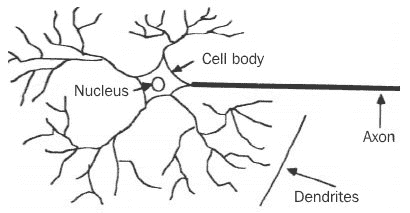
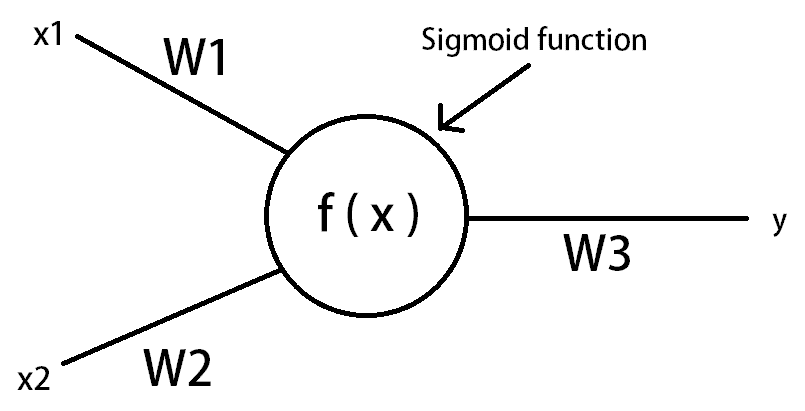
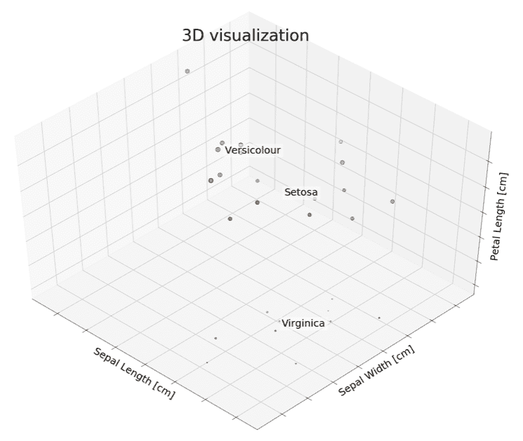

# 一键式学习简介

人们可以通过少量示例学习新事物。 当受到刺激时，人类似乎能够快速理解新概念，然后在将来认识到这些概念的变体。 孩子可以从一张图片中学会识别狗，但是机器学习系统需要大量示例来学习狗的特征并在将来识别它们。 作为一个领域，机器学习在各种任务（例如分类和 Web 搜索以及图像和语音识别）上都取得了巨大的成功。 但是，这些模型通常在没有大量数据（示例）可供学习的情况下表现不佳。 本书的主要动机是使用很少的示例来训练模型，而无需进行大量的重新训练就能够将其概括为不熟悉的类别。

深度学习在机器学习的发展中发挥了重要作用，但它也需要大量的数据集。 不同的技术（例如正则化）可以减少在低数据环境中的过度拟合，但不能解决较少的训练示例所固有的问题。 此外，大型数据集导致学习缓慢，需要使用梯度下降法进行许多权重更新。 这主要是由于 ML 算法的参数方面，在该方面需要慢慢学习训练示例。 相反，许多已知的非参数模型（例如最近邻居）不需要任何训练，但是性能取决于有时任意选择的距离度量（例如 L2 距离）。 一次学习是计算机视觉中的对象分类问题。 尽管大多数基于 ML 的对象分类算法都需要数百或数千张图像和非常大的数据集进行训练，但是一次学习的目的是从一个或仅几个训练图像中学习有关对象类别的信息。 在本章中，我们将学习一键式学习的基础知识，并探索其实际应用。

本章将涵盖以下主题：

*   人脑概述
*   机器学习-历史概述
*   一键式学习-概述
*   设置环境
*   编码练习

# 技术要求

需要使用以下库来学习和执行本章中的项目：

*   蟒蛇
*   水蟒
*   Jupyter 笔记本
*   火炬
*   Matplotlib
*   Scikit 学习

[您可以在本书的 GitHub 存储库中找到本章的代码文件](https://github.com/PacktPublishing/Hands-on-One-Shot-Learning-with-Python)。

# 人脑–概述

自文明开始以来，人脑一直是研究的主题。 如果我们研究孩子的成长，我们会发现随着他们的成长，他们的学习能力也会提高。 首先，他们了解食物，然后学习识别面孔。 每当孩子学到东西时，信息就会被编码到大脑的某个部分。 尽管如此，真正的问题仍然存在，信息如何存储在我们的大脑中？ 为什么有些信息被硬编码，而其他信息却容易被忘记？

# 人脑如何学习

关于大脑如何训练自己以处理数据的大多数信息是未知的，但是有各种理论可以对其进行探索。 如下图所示，如果我们查看大脑神经元的结构，则神经元的工作方式类似于收集器，其中它通过**树突**从其他神经元收集信号。 一旦信号变强，神经元就会通过称为**轴突**的细链向附近的神经元发出电信号。 在该网络的末端，突触将信号活动转换为激发活动并激活连接的神经元。 大脑神经元通过改变突触的有效性来学习将信号发送到大脑的不同部分，类似于人工神经网络中某些神经元的权重变为接近零的方式：



有许多理论表明，神经元之间的紧密连接会增加人类的学习能力。 反过来，许多神经科学家认为，随着通过学习和刺激来更多地利用大脑，就会形成密集的树突状连接。 因此，随着学习的越来越多，我们变得越来越聪明。

# 比较人类神经元和人工神经元

尽管人类神经元一直是创建人工神经网络的灵感，但它们在多种方式上却有所不同。 研究人员正在尝试通过尝试不同的激活（激励）功能和非线性系统来弥合这些差距。 与我们的大脑具有收集和传输从我们的感官接收到的信息的神经元的方式类似，神经网络也由多层（一组神经元）组成，这些层通过跨层传输信息来学习任务。 在某些情况下，我们可以说人造神经元的工作方式类似于大脑中存在的神经元。 让我们看下图：



如上图所示，信息流经每个连接，每个连接都有特定的权重，该权重控制数据流。 如果将人脑神经元的活动与人工神经网络进行比较，我们将看到，只要为任务创建神经网络，就如同创建新的脑神经元。 如果环顾四周，我们已经开始依靠计算机做出决策，例如在信用卡欺诈，垃圾邮件/非垃圾邮件和推荐系统方面。 就像我们为周围的小任务创造了新的大脑。 仍然存在问题，人与人工神经网络之间有什么区别？ 让我们找出：

*   主要区别之一是所需的学习数据量。 要学习神经网络，我们需要大量数据，而人脑可以学习的数据更少。 如果我们希望拥有与人脑相似的神经网络，则需要改进现有的优化算法。
*   另一个关键区别是速度。 通常，神经网络比人类更快地处理数据和信息。

# 机器学习–历史概述

机器学习是一个程序，在给定任务（损失函数）的情况下，可以通过经验（训练数据）进行学习。 凭着经验，该程序将学会按照给定的标准执行给定的任务。 在 1960 年代，机器学习主要集中于创建不同形式的数据预处理过滤器。 随着图像滤镜的引入，重点逐渐转向计算机视觉，并在 1990 年代和 2000 年代在这一领域进行了重大研究。 在开发了传统机器学习算法方面的一些稳定性之后，研究人员转向了概率领域，因为随着高维数据的引入，它变得更有希望。 深度学习在 2012 年赢得 ImageNet 挑战赛时便开始蓬勃发展，并且自此在数据科学领域中发挥了重要作用。

机器学习可以分为两类：

*   **参数**：使用给定训练数据（例如逻辑回归，支持向量机和神经网络）的算法调整数学或统计模型中的参数，即可完成学习。
*   **非参数**：通过存储训练数据（记忆）并执行一些降维映射来完成学习，例如， **k 最近邻**（**kNN**）和决策树。

由于学习参数的要求，参数方法通常需要大量数据。 顺便说一句，如果我们有大量的数据集，则最好使用参数方法，因为非参数方法通常需要存储数据并针对每个查询对其进行处理。

# 机器学习和深度学习中的挑战

机器学习和深度学习已经彻底改变了计算机科学行业，但它们各有利弊。 我们当前方法面临的一些常见挑战如下：

*   **数据收集**：为每个类别收集足够的相关数据以供机器学习非常费力。
*   **数据标记**：通常，标记数据需要专家或由于隐私，安全或道德问题而无法进行。
*   **硬件限制**：由于数据量大，而且参数模型大，因此训练它们需要昂贵的硬件（GPU 和 TPU）。
*   **结果分析**：尽管有某些提供分析参数的开源库，但了解结果也是一项重大挑战。

除了这些挑战之外，机器学习在处理特征选择和高维数据方面也面临挑战。

在下一节中，我们将介绍一次学习，并学习如何尝试解决机器学习和深度学习所面临的挑战。

# 一键式学习–概述

一次学习可以看作是一种类似于人类学习方式的机器训练方法。 一次学习是一种在有限的监督数据的帮助下，借助强大的先验知识来学习新任务的方法。 李菲菲博士最早发表的导致图像分类问题精度高的著作可以追溯到 2000 年代-尽管近年来，研究人员在通过不同的深度学习架构和优化算法（例如， 匹配网络，不可知论元学习模型和记忆增强神经网络。 一键式学习在多个行业中都有很多应用，尤其是在医疗和制造业中。 在医学上，当可用数据有限时，例如在治疗罕见疾病时，我们可以使用一次学习。 而在制造中，我们可以减少人为错误，例如表壳制造中的缺陷。

# 一口气学习的先决条件

如果我们进一步讨论如何从有限的数据中学习必要的信息，我们将意识到人脑已经受过训练以提取重要信息的神经元。 例如，如果教导孩子球形物体是球，那么他们的大脑也会处理有关球的大小和纹理的信息，也称为物体的**过滤器**。 因此，对于任何形式的一次学习，我们都可以说我们至少需要满足以下条件之一：

*   先前训练有素的过滤器和预定架构
*   正确的数据分配假设
*   一种确定形式的分类法，用于存储或收集的信息

在某些情况下，我们观察到只能具有非常低的特征提取水平。 在这些情况下，我们只能依靠非参数或概率方法，因为要学习参数，我们需要足够数量的数据。 即使我们以某种方式强迫神经网络几乎不学习任何数据，也将导致过拟合。

在下一部分中，我们将进行简短的编码练习，以了解当我们拥有小的数据集时，简单的非参数 kNN 的性能要优于神经网络。 不幸的是，它在现实世界中可能无法很好地工作，因为我们仍然存在学习良好的特征表示并选择合适的距离函数的问题。

# 一键式学习的类型

解决单次学习的方法多种多样。 粗略地说，它们可以分为五个主要类别：

*   数据扩充方法
*   基于模型的方法
*   基于指标的方法
*   基于优化的方法
*   基于生成建模的方法

下图显示了一次学习的类别：


数据扩充是深度学习社区中最常用的方法，可以为数据增加变化，增加数据大小并平衡数据。 这是通过在数据中添加某种形式的噪声来实现的。 例如，图像可能会被缩放，平移和旋转。 而在自然语言处理任务中，可能会有同义词替换，随机插入和随机交换。

尽管数据增强方法在预处理中起着至关重要的作用，但本书不会涉及到该主题。 在本书中，我们将着重于一次学习的算法方法以及如何实现它们。 我们还将在常用的单次学习数据集上进行实验，例如 **Omniglot** 数据集和 **Mini ImageNet**。

# 设置环境

在本节中，我们将使用以下步骤为我们的编码练习和问题设置虚拟环境：

1.  通过进入您选择的目录并在 Git Bash 命令行中运行以下命令来克隆存储库：

```py
git clone https://github.com/Packt-Publishing/Hands-on-One-Shot-Learning.git
```

2.  转到克隆的存储库的`Chapter01`目录：

```py
cd Hands-on-One-Shot-Learning/Chapter01
```

3.  然后，打开一个终端并使用以下命令安装 [Python 版本 3.6 的 Anaconda](https://docs.anaconda.com/anaconda/install/)，并创建一个虚拟环境：

```py
conda create --name environment_name python=3.6
```

在“步骤 3”和`4`中，可以将`environment_name`替换为易于记忆的名称，例如`one_shot`或您选择的名称。

4.  使用以下命令激活环境：

```py
source activate environment_name
```

5.  使用以下命令安装`requirements.txt`：

```py
pip install -r requirements.txt
```

6.  运行以下命令以打开 Jupyter Notebook：

```py
jupyter notebook
```

现在我们已经建立了环境，让我们继续进行编码练习。

# 编码练习

在本节中，我们将探索一种基本的一次学习方法。 作为人类，我们有一种分层的思维方式。 例如，如果我们看到一些未知的东西，我们会寻找它与我们已经知道的对象的相似性。 同样，在本练习中，我们将使用非参数 kNN 方法查找类。 我们还将其性能与基本神经网络架构进行比较。

# kNN –基本的一次学习

在本练习中，我们将把 kNN 与拥有少量数据集的神经网络进行比较。 我们将使用从`scikit-learn`库导入的`iris`数据集。

首先，我们将首先讨论 kNN 的基础知识。 kNN 分类器是一个非参数分类器，它简单地存储训练数据`D`，并使用对它的`k`个最近邻居的多数投票对每个新实例进行分类，并使用任何距离函数来计算 。 对于 kNN，我们需要选择距离函数`d`和邻居数`k`：


[您还可以在以下 GitHub 链接上引用代码文件](https://github.com/PacktPublishing/Hands-on-One-Shot-Learning-with-Python/blob/master/Chapter01/CodingExercise01.ipynb)。

请按照以下步骤将 kNN 与神经网络进行比较：

1.  使用以下代码导入此练习所需的所有库：

```py
import numpy as np
import matplotlib.pyplot as plt
from sklearn import datasets
from sklearn.neighbors import KNeighborsClassifier
from sklearn.model_selection import train_test_split
from sklearn.metrics import confusion_matrix, accuracy_score
from sklearn.model_selection import cross_val_score
from sklearn.neural_network import MLPClassifier
```

2.  导入`iris`数据集：

```py
# import small dataset
iris = datasets.load_iris()
X = iris.data
y = iris.target
```

3.  为了确保我们使用的数据集非常小，我们将随机选择 30 个点并使用以下代码进行打印：

```py
indices=np.random.choice(len(X), 30)
X=X[indices]
y=y[indices]
print (y)
```

这将是结果输出：

```py
[2 1 2 1 2 0 1 0 0 0 2 1 1 0 0 0 2 2 1 2 1 0 0 1 2 0 0 2 0 0]
```

4.  为了理解我们的功能，我们将尝试以散点图的形式将它们绘制在 3D 中：

```py
from mpl_toolkits.mplot3d import Axes3D
fig = plt.figure(1, figsize=(20, 15))
ax = Axes3D(fig, elev=48, azim=134)
ax.scatter(X[:, 0], X[:, 1], X[:, 2], c=y,
         cmap=plt.cm.Set1, edgecolor='k', s = X[:, 3]*50)

for name, label in [('Virginica', 0), ('Setosa', 1), ('Versicolour', 2)]:
    ax.text3D(X[y == label, 0].mean(),
              X[y == label, 1].mean(),
              X[y == label, 2].mean(), name,
              horizontalalignment='center',
              bbox=dict(alpha=.5, edgecolor='w', facecolor='w'),size=25)

ax.set_title("3D visualization", fontsize=40)
ax.set_xlabel("Sepal Length [cm]", fontsize=25)
ax.w_xaxis.set_ticklabels([])
ax.set_ylabel("Sepal Width [cm]", fontsize=25)
ax.w_yaxis.set_ticklabels([])
ax.set_zlabel("Petal Length [cm]", fontsize=25)
ax.w_zaxis.set_ticklabels([])

plt.show()
```

下图是输出。 正如我们在 3D 可视化中所看到的，数据点通常在组中找到：



5.  首先，我们将首先使用 80:20 拆分将数据集拆分为训练集和测试集。 我们将使用`k=3`作为最近的邻居：

```py
X_train, X_test, y_train, y_test = train_test_split(X, y, test_size = 0.2, random_state = 0)
# Instantiate learning model (k = 3)
classifier = KNeighborsClassifier(n_neighbors=3)

# Fitting the model
classifier.fit(X_train, y_train)

# Predicting the Test set results
y_pred = classifier.predict(X_test)

cm = confusion_matrix(y_test, y_pred)

accuracy = accuracy_score(y_test, y_pred)*100
print('Accuracy of our model is equal ' + str(round(accuracy, 2)) + ' %.')
```

这将导致以下输出：

```py
Accuracy of our model is equal 83.33 %.
```

6.  初始化隐藏层的大小和迭代次数：

```py
mlp = MLPClassifier(hidden_layer_sizes=(13,13,13),max_iter=10)
mlp.fit(X_train,y_train)
```

您可能会收到一些警告，具体取决于 scikit-learn 的版本，例如`/sklearn/neural_network/multilayer_perceptron.py:562:ConvergenceWarning: Stochastic Optimizer: Maximum iterations (10) reached and the optimization hasn't converged yet. % self.max_iter, ConvergenceWarning)`。 这只是表明您的模型尚未收敛。

7.  我们将预测 kNN 和神经网络的测试数据集，然后将两者进行比较：

```py
predictions = mlp.predict(X_test)

accuracy = accuracy_score(y_test, predictions)*100
print('Accuracy of our model is equal ' + str(round(accuracy, 2)) + ' %.')
```

以下是结果输出：

```py
Accuracy of our model is equal 50.0 %.
```

对于我们当前的情况，我们可以看到神经网络的准确率不如 kNN。 这可能是由于许多原因造成的，包括数据集的随机性，邻居的选择以及层数。 但是，如果我们运行足够的时间，我们会发现 kNN 总是会存储更好的数据，因为它总是存储数据点，而不是像神经网络那样学习参数。 因此，kNN 可以称为单次学习方法。

# 概要

深度学习已经彻底变革了数据科学领域，并且仍在不断进步，但是仍然有一些主要行业尚未体验到深度学习的所有优势，例如医疗和制造业。 人类成就的顶峰将是创造一种可以像人类一样学习并且可以像人类一样成为专家的机器。 但是，成功的深度学习通常需要拥有非常庞大的数据集才能进行工作。 幸运的是，本书重点介绍了可以消除此先决条件的架构。

在本章中，我们了解了人类的大脑以及人工神经网络的结构如何接近我们的大脑结构。 我们介绍了机器学习和深度学习的基本概念及其挑战。 我们还讨论了一次学习及其各种类型，然后在`iris`数据集上进行了实验，以比较在数据稀缺情况下的参数方法和非参数方法。 总的来说，我们得出结论，正确的特征表示在确定机器学习模型的效率方面起着重要作用。

在下一章中，我们将学习基于度量的单次学习方法，并探索单次学习算法的特征提取领域。

# 问题

*   为什么对于一次学习任务，kNN 比新近训练的人工神经网络更好地工作？
*   什么是非参数机器学习算法？
*   决策树是参数算法还是非参数算法？
*   将其他分类算法作为编码练习进行实验，并比较结果。