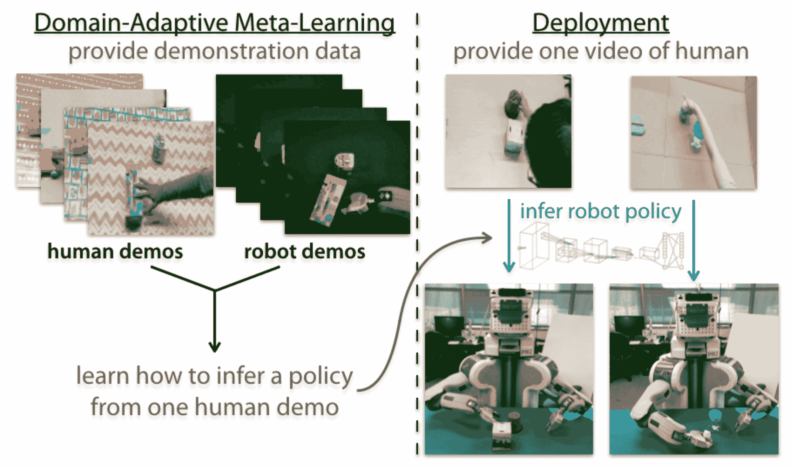
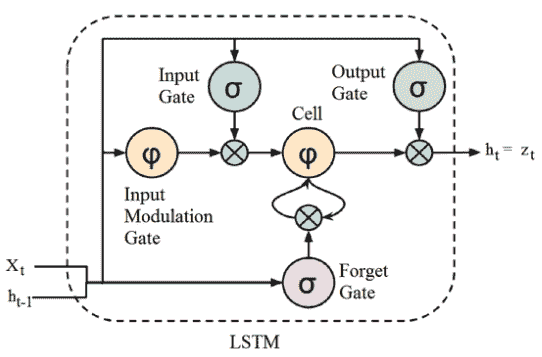
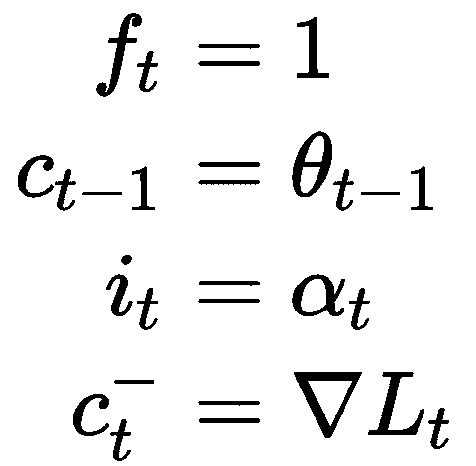
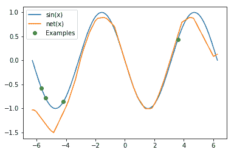
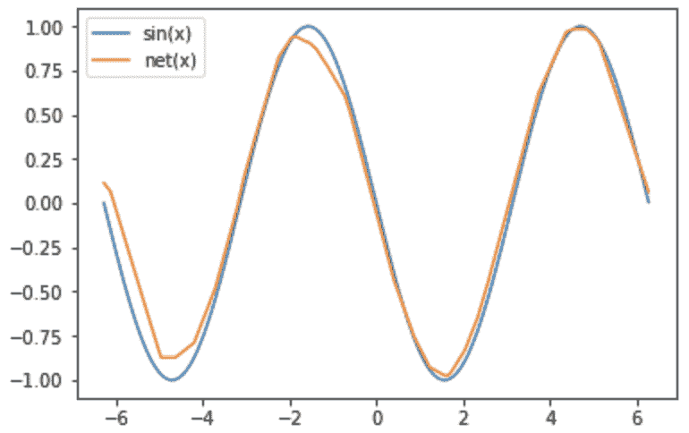

# 基于优化的方法

大多数深度学习模型都是使用梯度下降法来学习目标的。 但是，梯度下降优化需要大量训练样本才能使模型收敛，这使其不适合进行少量学习。 在通用深度学习模型中，我们训练模型以学习实现确定的目标，而人类则训练为学习任何目标。 遵循此观察结果，各种研究人员创建了针对**元学习**机制的不同优化方法。

换句话说，系统着重于如何收敛任何损失函数（目标），而不是最小化单个损失函数（目标），这使该算法方法任务和域不变。 例如，您不需要训练模型就可以使用交叉熵损失函数来识别花朵的类型。 相反，您可以训练模型以了解任何两个图像之间的差异，从而使模型任务不可知（例如花识别，花检测）和领域不可知（例如猫识别）。

在本章中，我们将介绍以下主题：

*   梯度下降概述
*   了解模型不可知的元学习
*   了解 LSTM 元学习器
*   编码练习

# 技术要求

在本章中，将需要 Python，Anaconda，Jupyter 笔记本，Matplotlib 和 Scikit-learn 库来学习和执行该项目。

您可以从本书的 [GitHub 存储库](https://github.com/PacktPublishing/Hands-On-One-shot-Learning-with-Python)中找到本章的代码文件。

# 梯度下降概述

如果我们研究神经网络架构的学习方法，它通常由很多参数组成，并使用梯度下降算法进行了优化，该算法需要对许多示例进行许多迭代以使其性能良好。 但是，梯度下降算法在其模型中提供了不错的性能，但是在某些情况下，梯度下降优化算法会失败。 让我们在接下来的部分中介绍这种情况。

当给出有限数量的数据时，梯度下降算法无法优化神经网络的主要原因有两个：

*   对于每个新任务，神经网络必须从其参数的随机初始化开始，这会导致后期收敛。 迁移学习已通过使用预训练的网络来缓解此问题，但由于数据应具有相似的域而受到限制。
*   即使是梯度下降的权重更新步骤方法（例如 AdaGrad，Adam，RMS 等）的变体也无法在较少的时期内表现良好。 这些算法不能保证收敛，特别是在用于非凸优化时。

真正有用的是学习一些可以在所有域中使用的通用初始化，这是初始化的一个好地方。 梯度下降算法的关键思想是基于下一步的方向，该方向是根据概率分布假设选择的。 因此，如果我们能够以某种方式完全近似概率分布，则仅需几个步骤就可以优化网络。 这是一次/小样本学习基于优化的算法的基本思想。

# 了解模型不可知的元学习

**与模型无关的元学习**（**MAML**）尝试通过为每个新任务提供更好的权重初始化来解决梯度下降方法的缺点。 这种方法的关键思想是使用不同的数据集训练模型的参数。 当将其用于新任务时，该模型通过使用已初始化的参数通过一个或多个梯度步骤来微调架构，从而提供更好的性能。 从特征学习的角度来看，这种训练模型参数以使一些梯度步骤可以优化损失函数的方法也可以从构建内部表示的角度来看。 在这种方法中，我们选择通用模型的架构，以便可以将其用于各种任务。 MAML 的主要贡献是一种与模型和任务无关的简单快速学习算法。

# 了解 MAML 背后的逻辑

MAML 的目的是为模型的参数提供良好的初始化，从而以较少的梯度步骤实现对新任务的最佳快速学习。 它还尝试避免过拟合的情况，这种情况在训练具有较少数据架构的神经网络时会发生。 下图是 MAML 的表示形式：


如上图所示，`θ`是模型的参数，粗黑线是元学习阶段。 假设我们有三个不同的新任务，并且为每个任务（带有箭头的灰色线）执行了一个梯度步骤。 我们可以看到参数`θ`接近三个任务的所有三个最佳参数，这使`θ`成为可以快速适应不同新任务的最佳参数初始化。 结果，参数θ的很小变化将导致任何任务的损失函数的最佳最小化。 根据这一观察结果，MML 建议我们首先应通过主要数据集学习θ； 在对实际数据集进行微调的同时，我们仅需移动一小步。

顾名思义，与模型无关的元学习可以用于任何形式的模型，无论是分类，回归还是强化学习。 但是对于这本书，我们将只关注 MAML 算法的一次学习分类方面。 所以，让我们开始吧！

# 算法

要了解 MAML 的一次学习/小样本学习，首先，我们需要学习某些术语。 这些类似于我们在匹配网络时学到的知识：

*  `T`：这表示各种任务-例如，我们希望我们的模型学习识别猫，狗，马等，以及`T[i]`代表一种识别猫的训练模型。 在此，`T[i] ∈ T`。
*  `P(T)`：这表示所有任务之间的概率分布。 我们的目标是通过 MAML 学习`P(T)`。
*  `L(T)`：这表示任务生成的损失函数`T`数据点。 对于分类，我们可以使用交叉熵损失：


假设我们希望训练一个分类模型`f[θ]`，该模型可以学习识别图像中的猫，狗和马。 让我们逐步介绍如何设置 MAML：

1.  随机初始化模型参数`θ ~ N(0, 1)`。
2.  重复直到完成。
3.  从`P(T)`中提取`T[i]`-例如，我们从所有可能的任务中随机抽取识别猫的任务。

4.  对于从`P(T)`采样的所有`T[i]`，执行以下操作：

*   `T[i]`的样本 K 训练数据点`D[i] = (x[i], y[i])`（对于一次学习，`K = 1`）。
*   前向穿过层（`f[θ]`），以计算`L[T[i]]`和`▽[θ] L[T[i]] f[θ]`。
*   使用梯度下降法更新参数。 由于我们正在针对特定任务训练模型，因此我们将学习`θ'[i]`（特定于任务的参数）：


*   来自`T[i]`的样本测试数据点`D'[i] = (x[i], y[i])`，用于元更新。

结束`for`循环。

5.  通过使用模型`f[θ'[i]]`上的采样测试数据点`D'[i]`计算损失及其梯度来更新`θ`：


结束`repeat`循环。

对于 Omniglot 和 mini-ImageNet 数据集，MAML 能够实现比连体网络，匹配网络和内存增强神经网络更好的性能。 由于事实证明 MAML 的性能更好，因此还有许多其他任务可以使用 MAML。 让我们来看一个这样的变体-**域自适应元学习**（**DAML**）。

# MAML 应用–域自适应元学习

当涉及到模仿学习时，机器人需要接收适当的数据，这些数据包括有关动觉变化（有关其身体部位运动的意识），遥距操作（控制）和其他类型输入的信息。 另一方面，人脑只需观看一些视频即可学习。 DAML 尝试通过使用元学习（MAML）解决模仿学习的问题。 它提出了一种仅通过利用从不同任务的数据中提取的强大先验知识（例如，关于动觉学习的信息）就可以从人类的单个视频中学习机器人操纵技能的系统，如下图所示：



由于无法使用模仿学习损失函数来训练机器人，因此 DAML 提出了行为克隆目标的**暂时损失**，该目标也充当日志空间中的正则化项。 众所周知，在任何情况下都要进行强正则化对于避免过拟合非常重要，尤其是在单次学习的情况下。

# 了解 LSTM 元学习器

LSTM 元学习器是一种元学习。 LSTM 元学习器分为两个阶段：

*   **元学习器**：在此阶段，模型着重于学习跨各种任务的常识。
*   **基础学习器**：在基础学习器中，模型尝试优化以学习任务特定目标的参数。

LSTM 元学习器的关键思想是训练 LSTM 单元以*学习我们原始任务的更新规则*。 用元学习框架的术语来说， **LSTM 细胞**将用作元学习器，而*特定于任务的目标*（例如狗的品种分类）将被使用 成为*基础学习器*。

现在，问题来了，为什么我们要使用 LSTM 单元？ LSTM 元学习器的作者做出了一个关键的观察，即 LSTM 中的单元状态更新与反向传播中的基于梯度的更新相似，可用于学习基本学习器目标的更新规则：



LSTM 在各种门的帮助下存储信息历史记录，如上图所示。 我们还知道，**随机梯度下降**（**SGD**）有多种变化形式，例如动量，RMSprop，Adam 等，它们实质上存储了有关过去学习的信息（在 梯度形式）以实现更好的优化。 因此，从逻辑上讲，可以将 LSTM 单元视为一种更好的优化策略，该策略使模型能够捕获特定任务的短期知识和公共长期知识。

在下一部分中，我们将了解架构，LSTM 单元背后的逻辑以及权重更新算法。

# LSTM 元学习器的架构

如果我们研究梯度下降的更新方法，我们将看到一个这样的方程：


此处， `θ[t]`是时间步长`t`的参数，`▽L[t]`是`t`时的损失梯度，并且`α[t]`是时间`t`时的学习率。

另一方面，LSTM 单元的单元更新方程看起来像这样：


此更新看起来与 LSTM 中单元的更新方式非常相似。 LSTM 元学习器的作者提出，如果将以下值放在单元更新方程中，那么我们将获得梯度下降更新规则：



从逻辑上考虑这一点，我们只想学习`i[t]`，因为这与估计梯度下降的*学习率*基本相似。 因此，LSTM 元学习器将`i[t]`定义如下：


本质上，`i[t]`被定义为具有当前梯度，当前损失和先前学习率`i[t-1]`的组合的 Sigmoid 函数。

对于`f[t]`，应为 1，但为避免梯度缩小的问题，其定义如下：


本质上，`f[t]`被定义为具有当前梯度，当前损失和遗忘门的 Sigmoid 函数。

您可能想知道为什么他们使用 LSTM 单元的这种特定选择？ 如果仔细观察，会根据当前梯度和当前损失选择`i[t]`和`f[t]`。 故意这样做是为了使元学习器能够*控制学习率*，以便在更少的时间内训练基础学习器。

# 数据预处理

在一般的深度学习设置中，要在给定数据集`D`上训练模型，我们将数据集分为三个部分：训练，验证和测试集。 但是在元学习设置中，我们首先将数据集划分为特定于任务的集（例如，猫品种分类和狗品种分类），称为**元集**，例如`D[n]`。 对于每个`D ∈ D[n]`由`D_n_train`和`D_n_test`组成，因此对于`K`次学习，每个`D_n_train`由`K * N`个示例组成，其中`N`是类数。

此后，`D_n_train`进一步分为三个部分：`D_meta_train`，`D_meta_val`，`D_meta_test`。 在这里，目标是使用`D_meta_train`训练*学习算法*，该算法可以将任何特定于任务的集合作为训练集`D_train`并产生 更好的分类器（学习器）。

# 算法–伪代码实现

要训​​练一个一次学习模型，您需要匹配训练条件以测试时间条件，例如，像在匹配网络中一样，在较少的数据上进行训练，但要进行多个批量。 LSTM 元学习器也遵循与匹配网络相同的概念，并已被证明在特定任务目标上确实表现出色。

要开始理解 LSTM 元学习器，首先，我们需要了解某些术语：

*   **基础学习器**（`M`）：具有特定任务的主要目标，带有参数`θ`-例如，用于识别猫的分类器
*   **元学习器**（`R`）：LSTM 单元，带有参数，`θ`
*   **数据点**（`X, Y`）：从`D_meta_train`采样的数据点
*   **损失**（`L`）：用于调整主要任务特定目标的损失函数，例如，二进制交叉熵损失

让我们开始逐步学习 LSTM 元学习器算法：

1.  首先，随机初始化 LSTM 单元的初始参数（`θ[0]`）。
2.  对于`D = 1`至`n`步骤，请执行以下操作：

*   从`D_meta_train`中随机抽取`D_train, D_test`。
*   随机初始化基础学习器（分类模型）的初始参数（`θ[0]`）。
*   对于`t = 1`至`T`步骤，重复以下步骤：
*   从`D_train`中随机采样输入输出对`(X[t], Y[t])`。
*   使用`L[t] = L(M(X[t], θ[t-1]), Y[t])`计算基础学习器（分类模型）的损失。
*   使用单元格的基本学习器的损失（`L[t]`）及其梯度（`▽[θ[t-1]] L[t]`），更新单元格状态（`c[t]`） 状态方程。
*   将基本学习器（分类模型）参数更新为`θ[t] = c[t]`（请参阅 LSTM 元学习器的“架构”部分）。

结束`T`步骤循环。

*   现在，从`D_test`中随机采样输入输出对`(X_test, Y_test)`。
*   使用`L_test = L(M(X_test, θ[T]), Y_test)`计算基础学习器（分类模型）的损失。
*   使用`▽[θ[d-1]] Y_test`（请参阅 LSTM 元学习器“架构”部分）更新元学习器（LSTM 单元）参数（`θ[t]`）。

结束`n`步骤循环。

简而言之，在迭代`T`步骤的同时，基本学习器参数也会更新。 在`T`步骤之后，最终的基本学习器参数将用于评估测试集并更新元学习器参数。 有关该算法的图形表示，请参考以下架构图：


LSTM 元学习器的总体思路非常引人注目。 您可能想知道为什么我们只使用一个 LSTM 单元，为什么 LSTM 元学习器的作者没有像在匹配网络中看到的那样使用整个 LSTM 网络。 您确实可以在元学习器中添加一些复杂的架构，但这要付出大量训练参数的代价。 LSTM 单元的使用使这种元学习架构对于单次学习变得可行。

在下一部分中，我们将进行 MAML 和 LSTM 元学习器的编码练习，这将有助于我们更全面地了解架构。

# 练习题

在本节中，我们将首先使用 MAML 进行正弦数据回归的简单练习。

# 模型无关元学习的简单实现

在本教程中，我们将展示如何应用 MAML 来学习正弦数据的简单曲线。 本教程的第二部分在 GitHub 上可用，我们可以在其中学习如何使用 torch-meta 库在 mini-ImageNet 上训练 MAML。

让我们通过以下步骤开始本教程：

1.  导入所有库：

```py
import math
import random
import torch
from torch import nn
from torch.nn import functional as F
import matplotlib as mpl
mpl.use('Agg')
import matplotlib.pyplot as plt
%matplotlib inline
```

2.  创建一个简单的神经网络架构。 我们将获得随机生成的正弦曲线数据。 我们将使用这个非常小的网络，因为我们不需要大的网络来学习曲线：

```py
def net(x, params):
    x = F.linear(x, params[0], params[1])
    x = F.relu(x)

    x = F.linear(x, params[2], params[3])
    x = F.relu(x)

    x = F.linear(x, params[4], params[5])
    return x

params = [
    torch.Tensor(32, 1).uniform_(-1., 1.).requires_grad_(),
    torch.Tensor(32).zero_().requires_grad_(),

    torch.Tensor(32, 32).uniform_(-1./math.sqrt(32), 
        1./math.sqrt(32)).requires_grad_(),
    torch.Tensor(32).zero_().requires_grad_(),

    torch.Tensor(1, 32).uniform_(-1./math.sqrt(32), 
        1./math.sqrt(32)).requires_grad_(),
    torch.Tensor(1).zero_().requires_grad_(),
]
```

3.  设置训练参数。 初始化`alpha`，`beta`，学习率，优化器和循环数的参数：

```py
opt = torch.optim.SGD(params, lr=1e-2)
n_inner_loop = 5
alpha = 3e-2
```

4.  实现优化算法：

```py
for it in range(100000): # training for large number of iterations
    b = 0 if random.choice([True, False]) else math.pi # setting up 
            beta variable randomly
    #### Randomly obtain task 1 sinusoidal data ####
    x = torch.rand(4, 1)`4`math.pi - 2*math.pi
    y = torch.sin(x + b)
    #### Randomly obtain the task 2 sinusoidal data ####
    v_x = torch.rand(4, 1)`4`math.pi - 2*math.pi
    v_y = torch.sin(v_x + b)
    opt.zero_grad() # setup optimizer
    new_params = params # initialize weights for inner loop
    for k in range(n_inner_loop):
        f = net(x, new_params) # re-initialize task 2 neural 
            network with new parameters
        loss = F.l1_loss(f, y) # set loss as L1 Loss
        grads = torch.autograd.grad(loss, new_params, 
            create_graph=True)
        new_params = [(new_params[i] - alpha*grads[i]) for i in
             range(len(params))] # update weights of inner loop
    v_f = net(v_x, new_params) # re-initialize task 1 neural 
        network with new parameters
    loss2 = F.l1_loss(v_f, v_y) # calculate Loss
    loss2.backward() # Backward Pass
    opt.step()
```

运行此命令后，您将以以下形式查看优化输出：

```py
Iteration 0 -- Inner loop 0 -- Loss: 0.3558
Iteration 0 -- Inner loop 1 -- Loss: 0.3815
Iteration 0 -- Inner loop 2 -- Loss: 0.3788
Iteration 0 -- Inner loop 3 -- Loss: 0.3265
Iteration 0 -- Inner loop 4 -- Loss: 0.4066
Iteration 0 -- Outer Loss: 0.7631
Iteration 100 -- Inner loop 0 -- Loss: 0.9611
Iteration 100 -- Inner loop 1 -- Loss: 0.9364
Iteration 100 -- Inner loop 2 -- Loss: 0.9122
Iteration 100 -- Inner loop 3 -- Loss: 0.8883
Iteration 100 -- Inner loop 4 -- Loss: 0.8641
Iteration 100 -- Outer Loss: 1.0115
```

5.  绘制获得的结果。 一旦获得正确的参数，我们将首先生成一些随机数据点以对五个数据点进行子采样。 如果将结果绘制成图，我们将看到神经网络能够在正弦数据点上获得正确的曲线：

```py
# Randomly generate 5 data points.
t_b = math.pi 
t_x = torch.rand(4, 1)`4`math.pi - 2*math.pi
t_y = torch.sin(t_x + t_b)

opt.zero_grad()

t_params = params
for k in range(n_inner_loop):
    t_f = net(t_x, t_params)
    t_loss = F.l1_loss(t_f, t_y)

    grads = torch.autograd.grad(t_loss, t_params, 
        create_graph=True)
    t_params = [(t_params[i] - alpha*grads[i]) for i 
        in range(len(params))]

test_x = torch.arange(-2*math.pi, 2*math.pi, step=0.01).unsqueeze(1)
test_y = torch.sin(test_x + t_b)

test_f = net(test_x, t_params)

plt.plot(test_x.data.numpy(), test_y.data.numpy(), label='sin(x)')
plt.plot(test_x.data.numpy(), test_f.data.numpy(), label='net(x)')
plt.plot(t_x.data.numpy(), t_y.data.numpy(), 'o', label='Examples')
plt.legend()
plt.savefig('maml_output.png')
```

运行此命令后，您应该能够获得如下图：



如果查看该图，您将看到网络能够大致学习`sin(x)`曲线。

# 域自适应元学习的简单实现

在本教程中，我们将使用域自适应元学习来学习正弦数据的简单曲线。 它是模型不可知的元学习的一种变体，但是增加了先验信息，也就是说，已经添加了有关该域的其他相关信息。

让我们开始！

元学习算法优化了模型快速学习新任务的能力。 为此，他们使用跨各种任务收集的数据，并根据其学习新的元测试任务的能力进行评估。 此过程可以形式化为学习数据（一系列任务）的先验知识（即提取重要信息），并且微调过程成为在学习到的先验知识下的推断：

1.  导入所有库：

```py
import math
import random
import sys
import torch # v0.4.1
from torch import nn
from torch.nn import functional as F
from tqdm import tqdm
from time import sleep
import matplotlib as mpl
mpl.use('Agg')
import matplotlib.pyplot as plt
%matplotlib inline
import warnings
warnings.filterwarnings('ignore')
```

2.  创建一个简单的神经网络架构，将学习正弦曲线。 我们将从正弦曲线中获取随机生成的数据，因此我们将使用这个非常小的网络，因为我们不需要大的网络来学习曲线：

```py
def meta_net(x, params): 
    # main network which is suppose to learn our main objective 
    i.e; learn sinusoidal curve family here.
    x = F.linear(x, params[0], params[1])
    x1 = F.relu(x)

    x = F.linear(x1, params[2], params[3])
    x2 = F.relu(x)

    y = F.linear(x2, params[4], params[5])

    return y, x2, x1

params = [
    torch.Tensor(32, 1).uniform_(-1., 1.).requires_grad_(),
    torch.Tensor(32).zero_().requires_grad_(),

    torch.Tensor(32, 32).uniform_(-1./math.sqrt(32), 
        1./math.sqrt(32)).requires_grad_(),
    torch.Tensor(32).zero_().requires_grad_(),

    torch.Tensor(1, 32).uniform_(-1./math.sqrt(32), 
        1./math.sqrt(32)).requires_grad_(),
    torch.Tensor(1).zero_().requires_grad_(),
]
```

3.  创建另一个简单的神经网络架构，以添加有关该域的先验信息。 我们将在我们的主要网络中增加一些先验知识； 因此，我们需要创建一个简单的`adap_net`：

```py
def adap_net(y, x2, x1, params): 
    # the net takes forward pass from meta_net and provides 
    efficient parameter initializations.
    # It works adapts the meta_net easily to any form of change

    x = torch.cat([y, x2, x1], dim=1)

    x = F.linear(x, params[0], params[1])
    x = F.relu(x)

    x = F.linear(x, params[2], params[3])
    x = F.relu(x)

    x = F.linear(x, params[4], params[5])

    return x

adap_params = [
    torch.Tensor(32, 1+32+32).uniform_(-1./math.sqrt(65), 
        1./math.sqrt(65)).requires_grad_(),
    torch.Tensor(32).zero_().requires_grad_(),

    torch.Tensor(32, 32).uniform_(-1./math.sqrt(32), 
        1./math.sqrt(32)).requires_grad_(),
    torch.Tensor(32).zero_().requires_grad_(),

    torch.Tensor(1, 32).uniform_(-1./math.sqrt(32), 
        1./math.sqrt(32)).requires_grad_(),
    torch.Tensor(1).zero_().requires_grad_(),
]
```

4.  设置训练参数。 我们将使用内循环而不是外循环训练，因此，我们需要设置某些参数，例如`alpha`，`beta`，学习率，优化器和循环数：

```py
opt = torch.optim.SGD(params + adap_params, lr=1e-2)
n_inner_loop = 5
alpha = 3e-2
```

5.  实现优化算法。 如“域自适应元学习”部分所述，这种方法只能从一个人的视频中学习新技能。 为此，它首先使用人类演示和远程演示来训练元网络，以在元训练阶段建立强大而丰富的先于任务：

```py
inner_loop_loss=[]
outer_lopp_loss=[]
# Here, T ∼ p(T ) {or minibatch of tasks} is to learn sinusoidal family curves
with tqdm(total=100000, file=sys.stdout) as pbar:
    for it in range(100000):
        b = 0 if random.choice([True, False]) else math.pi
        #### Randomly obtain the task 2 sinusoidal data ####
        v_x = torch.rand(4, 1)`4`math.pi - 2*math.pi 
        v_y = torch.sin(v_x + b)
        opt.zero_grad()
        new_params = params
        for k in range(n_inner_loop):
            sampled_data = torch.FloatTensor([[random.uniform
                (math.pi/4, math.pi/2) if b == 0 
                else random.uniform(-math.pi/2, -math.pi/4)]]
            # Here, si is adap_net parameters: adap_params and 
            theta is meta_net parameters
            f, f2, f1 = meta_net(sampled_data, new_params) 
            h = adap_net(f, f2, f1, adap_params)     
            adap_loss = F.l1_loss(h, torch.zeros(1, 1)) # Calculate 
            Loss
            grads = torch.autograd.grad(adap_loss, new_params, 
                create_graph=True)
            # Compute policy parameters phi_t(new_params)
            new_params = [(new_params[i] - alpha*grads[i]) for i
                in range(len(params))]
            if it % 100 == 0: 
                inner_loop_loss.append(adap_loss)
        v_f, _, _ = meta_net(v_x, new_params) # forward pass using 
        learned policy parameters 
        loss = F.l1_loss(v_f, v_y) # calculate the loss of meta_net
        loss.backward()   
        opt.step() # optimize the policy parameters(theta and si)
        pbar.update(1)
        if it % 100 == 0: 
            outer_lopp_loss.append(loss)
```

在此阶段，机器人（`meta_net`）学习如何使用数据向人类学习。 在元训练阶段之后，机器人可以通过将其学习到的先验知识与执行新技能的人员的一个视频相结合来获得新技能。 此方法包括两个阶段：

*   在元训练阶段，目标是使用人类和机器人的演示数据获取先验策略（`φ`）
*   使用学到的知识，然后快速学习如何仅用几个数据点来模仿新任务

一旦运行了上面的代码，您将获得以下输出：

```py
Iteration 0 -- Inner loop 0 -- Loss: 0.0211
Iteration 0 -- Inner loop 1 -- Loss: 0.0183
Iteration 0 -- Inner loop 2 -- Loss: 0.0225
Iteration 0 -- Inner loop 3 -- Loss: 0.0180
Iteration 0 -- Inner loop 4 -- Loss: 0.0156
Iteration 0 -- Outer Loss: 0.5667
Iteration 100 -- Inner loop 0 -- Loss: 0.0009
Iteration 100 -- Inner loop 1 -- Loss: 0.0007
Iteration 100 -- Inner loop 2 -- Loss: 0.0003
Iteration 100 -- Inner loop 3 -- Loss: 0.0003
Iteration 100 -- Inner loop 4 -- Loss: 0.0000
Iteration 100 -- Outer Loss: 0.8096 ...
```

6.  微调主网。 一旦获得正确的参数，我们将首先生成一些随机数据点以对五个数据点进行子采样，并使用`adap_net`的损失微调主要的`meta_net`：

```py
t_b = math.pi
opt.zero_grad()
t_params = params

for k in range(n_inner_loop):
    # sample the new task data
    new_task_data = torch.FloatTensor([[random.uniform
            (math.pi/4, math.pi/2) if t_b == 0 
            else random.uniform(-math.pi/2, -math.pi/4)]])
    # forward pass through meta_net to extract the input for 
    adap_net
    t_f, t_f2, t_f1 = meta_net(new_task_data, t_params)
    # extract the information from adap_net
    t_h = adap_net(t_f, t_f2, t_f1, adap_params)
    # calculate the loss, here we used true label as 
    torch.zeros(1, 1), because t_b = pi
    t_adap_loss = F.l1_loss(t_h, torch.zeros(1, 1))

    grads = torch.autograd.grad(t_adap_loss, t_params, 
        create_graph=True)
    # learn the policy using the loss of adap_net
    t_params = [(t_params[i] - alpha*grads[i]) for i 
        in range(len(params))]
```

部署后，机器人可以仅使用人类与这些对象一起执行任务的单个视频，即可适应具有新颖对象的特定任务。

7.  使用以下代码可视化输出：

```py
test_x = torch.arange(-2*math.pi, 2*math.pi, step=0.01).unsqueeze(1)
test_y = torch.sin(test_x + t_b)

test_f, _, _ = meta_net(test_x, t_params) # use the learned parameters

plt.plot(test_x.data.numpy(), test_y.data.numpy(), label='sin(x)')
plt.plot(test_x.data.numpy(), test_f.data.numpy(), label='meta_net(x)')
plt.legend()
plt.savefig('daml-sine.png')
```

运行代码后，您将看到类似于以下内容的图形：



如果您无法获得理想的正弦曲线形状，则将迭代次数加倍。

在这里，您可以看到我们的净模型（橙色线）非常接近真实数据集（蓝色线）。 如果您希望使用真实的数据集探索这些模型，请参考[上的 GitHub 存储库 https://github.com/PacktPublishing/Hands-On-One-shot-Learning-with-Python/tree/ master / Chapter04](https://github.com/PacktPublishing/Hands-On-One-shot-Learning-with-Python/tree/master/Chapter04) 。 在这里，您会发现使用 Omniglot 和 mini-ImageNet 数据集的其他优化算法。

# 总结

要求解任何方程，通常我们可以使用很多方法。 同样，为了进行优化（学习神经网络的参数），许多研究人员也公开了许多方法，但是事实证明梯度下降是一种适用于每种情况的通用方法。 如果我们希望处理特定类型的神经网络问题，那么最好探索可能适合我们任务的不同优化技术。

在这一章中，我们研究了两种最著名的一次学习优化方法：MAML 和 LSTM 元学习器。 我们了解了 MAML 如何通过优化我们的初始参数设置来解决一次学习问题，从而在几个数据点上进行一个或几个梯度下降步骤可以导致更好的概括。 我们还探讨了 LSTM 元学习器对如何训练 LSTM 细胞作为元学习器以预测基础学习器体重更新的见解。

在下一章中，我们将探讨一种著名的 ML 方法贝叶斯学习。 我们将通过用概率模型表示对象类别来观察几个贝叶斯学习框架的发展。 我们将对判别式`K`-次学习和贝叶斯程序学习及其在现实世界中的应用进行恰当的解释。

# 问题

1.  梯度下降优化算法的优缺点是什么？
2.  梯度下降优化算法有其他选择吗？
3.  为什么训练神经网络需要那么多的周期？

# 进一步阅读

有关本章中介绍的一些架构的更多详细信息，建议阅读以下论文：

*   [《与模型无关的元学习》](https://arxiv.org/pdf/1703.03400.pdf)
*   [《作为小样本学习模型的优化》](https://openreview.net/pdf?id=rJY0-Kcll)