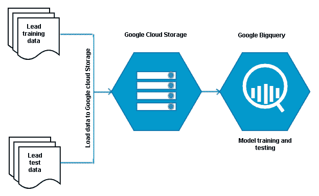
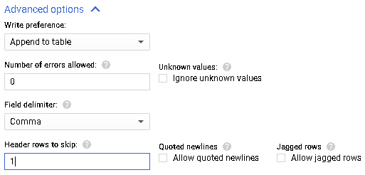

# 使用 GCP 组件进行计算和处理

在云中构建和运行**人工智能**（**AI**）应用程序之前，了解可用的不同选项非常重要。 这将帮助我们为应用选择正确的选项，以确保我们以经济高效的方式获得最佳性能。

在本章中，我们将深入探讨可用于在 **Google Cloud Platform** （**GCP**）上构建和运行 AI 应用程序的选项。 我们将研究 GCP 上可用的计算，处理和存储选项，以及业务流程和可视化。 一旦我们对这些选项有了充分的了解，我们将在本章的结尾部分介绍一个动手例子。

在本章中，我们将研究以下主题：

*   了解计算选项
*   进入存储选项
*   了解处理选项
*   创建构建机器学习（ML）管道的示例

# 了解计算选项

GCP 提供了各种计算选项来部署您的应用程序，并使用实际的 Google 基础架构来运行您的应用程序。 可用的选项如下：

*   **基础架构即服务**（**IaaS**）
*   货柜
*   **平台即服务**（**PaaS**）

所有计算选项均与其他 GCP 服务和产品进行通信，例如存储，网络，Stackdriver，安全性和大数据产品套件。 根据给定应用程序的需求，从 Compute Engine，Kubernetes Engine，App Engine 和 Cloud Functions 中选择适当的计算选项。

Google 计算选项可帮助您在 Google 基础架构上运行多种大小的虚拟机并对其进行自定义。 它使您能够运行容器化的应用程序，并且如果您不必照顾与基础架构相关的项目，则可以直接在引擎上部署代码。 因此，根据您的需求，Google 提供了多种选择来利用计算能力，加快开发工作并缩短产品上市时间。

接下来，我们将详细讨论以下计算选项：

*   计算引擎
*   应用引擎
*   云功能
*   Kubernetes 引擎

# 计算引擎

Compute Engine 是 Google Cloud 提供的 IaaS； 它是在 Google 基础架构中运行的虚拟机。

Google Cloud 提供的所有区域和区域都可以使用 Compute Engine。 它具有永久性磁盘和本地**固态驱动器**（**SSD**）的存储选项。SSD 内部内置芯片上集成电路，不包含任何旋转头或 磁盘驱动器以读取数据。 与硬盘驱动器相比，SSD 更耐用，读取时间更快。 永久磁盘是一种网络存储，最多可以扩展到 64 TB，而本地 SSD 是加密驱动器，它实际上已连接到服务器，并且可以扩展到 3 TB。

在旋转实例时，用户可以选择预定义的计算选项之一，也可以使用自定义的配置。 可以使用 Linux 或 Windows 操作系统启动 Compute Engine。 这些实例可以使用 CPU，GPU 和 TPU 启动，并且由于基础结构是由 Google 提供的，因此用户可以进行操作系统级的自定义。

用户可以在 Compute Engine 中创建托管和非托管实例组：

*   受管实例组将始终包含相同的虚拟机，并支持自动扩展，高可用性，滚动更新等。
*   非托管实例组可以包含具有不同配置的计算机。 用户可以在创建托管实例组时使用实例模板，但不能与非托管实例组一起使用。
*   建议选择一个受管且统一的实例组，直到在同一池中非常需要不同配置的计算机为止。

让我们快速讨论一个有助于降低价格的选项。 如果可能，请使用可抢占的计算机。 可抢占式虚拟机是短期且低成本的选件，可在已知工作负载并预期在 24 小时内完成工作负载时使用。 这些虚拟机具有显着的成本优势，与常规实例相比，可节省高达 80％的成本。 可抢占式机器将节省多达 80％的成本，但有一个陷阱：Google 始终可以在 30 秒内从您那里收回该实例。 Google 每秒收费，并为用户提供可持续的折扣。

# 计算引擎和 AI 应用

在为 AI（ML）应用程序训练模型时，始终需要功能强大的机器，以通过提供充足的训练数据并减少训练模型的时间来提高模型的效率。 Google Compute Engine 具有多个选项，可以启动功能强大的计算实例和组，从而可以在其上训练和运行模型。 对于训练和运行模型，应使用 CPU 和 GPU 的功能。 对于 TensorFlow 应用程序，应使用带有 TPU 的机器。

# 应用引擎

App Engine 是 Google Cloud 提供的 PaaS； 它是一个完全托管的无服务器应用程序平台。

在 Google Cloud 覆盖的大多数区域中都可以使用 App Engine。 您可以将 App Engine 视为可用于部署的基础架构； 开发人员只需专注于构建应用程序并将其部署到 App Engine 上，其他所有事情都将得到解决。 App Engine 具有出色的功能，例如自动缩放，流量拆分，应用程序安全，监视和调试-所有这些功能对于部署，保护和扩展任何应用程序都是必不可少的。 使用 Cloud SDK 和 IntelliJ IDEA 之类的工具，开发人员可以直接连接到 App Engine 并执行诸如调试源代码和运行 API 后端之类的操作。 App Engine 的限制之一是无法自定义其操作系统。

App Engine 有两种不同的环境：

*   标准
*   灵活

App Engine 标准环境应用程序在沙盒环境中运行，并支持运行 Python，Java，Node.js，Go 和 PHP 应用程序。 另一方面，App Engine 灵活环境应用程序在 Google Compute Engine 虚拟机上的 Docker 容器中运行，除了标准环境支持的语言外，还支持运行 Ruby 和.NET 应用程序。 有关在标准环境和灵活环境之间进行选择的更多详细信息，请参阅[这里](https://cloud.google.com/appengine/docs/the-appengine-environments)。

App Engine 对于部署任何 Web 或移动应用程序非常有用。 根据资源的使用情况，基础架构会自动扩展，Google 只会针对已使用的应用程序收费。

# App Engine 和 AI 应用程序

在 App Engine 上运行任何移动或 Web 应用程序时，在许多用例中，这些应用程序都需要 AI。 在 App Engine 中部署应用程序时可以实现这些目标。 该服务可以与云终结点一起部署，而 Python 应用程序可以在 App Engine 中部署，从而加载训练有素的机器学习模型。 通过 App Engine 访问模型后，该服务可以将请求发送到 Python 应用程序并以一致的方式获取响应。

# 云功能

Cloud Functions 是 Google Cloud 提供的事件驱动的无服务器 PaaS，非常适合微服务架构。

Google Cloud 覆盖的大多数区域都提供 Cloud Functions。 它们主要用于小型或单一用途的功能，例如调用其他服务或将事件写入发布/订阅主题等。 云功能中有一些很棒的功能，可提供敏捷性和零停机维护。 云功能可以自动销售，并且高度可用。 您可以使用 Cloud Functions 连接到大多数 Google Cloud 服务。

可以使用 JavaScript 或 Python 开发 Cloud Functions。 用户仅在运行时才需要为云功能付费。 这使其非常具有成本效益。

# 云功能和 AI 应用

在运行任何应用程序时，如果用户希望基于特定事件调用 Cloud ML 或 Cloud Vision 的 API，则可以使用 Cloud Functions。

# Kubernetes 引擎

Kubernetes Engine 是 Google Cloud 提供的一项托管服务； 它用于部署和运行容器化的应用程序。 以下是 Kubernetes Engine 的功能：

*   它可在 Google Cloud 提供的所有区域和区域中使用。
*   在 Kubernetes 集群下，Google 实际上正在运行 Compute Engine，因此我们在 Compute Engine 上拥有的大多数优势将与 Kubernetes Engine 一起使用，并提供其提供的其他服务。
*   在 Kubernetes 集群中，可以使用具有自定义 OS 映像的虚拟机，并且集群将自动缩放自定义映像。
*   Kubernetes 集群具有高度的安全性，并获得了 HIPAA 和 PCI DSS 3.1 的支持。
*   它带有仪表板服务，允许用户对其进行管理。
*   它会自动升级和自动修复。
*   它支持常见的 Docker 映像和私有容器注册表，用户可以通过该注册表访问私有 Docker 映像。
*   Kubernetes 集群可以与 Stackdriver 集成在一起，以实现对集群的监视和日志记录。

如果您的应用程序可以管理其中一台虚拟机发生故障的情况，那么将可抢占实例与 Kubernetes 群集配合使用非常有意义，因为这样可以节省大量成本。

# Kubernetes Engine 和 AI 应用程序

在为 Al（ML）应用训练模型时，始终需要功能强大的机器，以通过提供充足的训练数据并减少训练模型的时间来提高模型的效率。 可以使用 GPU 构建 Kubernetes 集群，以训练模型并运行 ML 工作负载。 这可以使许多机器学习应用程序受益，这些应用程序需要具有强大 GPU 机器的托管容器化集群。

# 进入存储选项

GCP 提供了各种存储选项来存储您的应用程序数据。 不同的应用程序具有不同的存储需求，并且取决于应用程序，性能得以提高。 从 GCP 存储选项来看，很明显，它可以支持各种存储需求，例如 NoSQL，文档 DB，对象存储，**关系数据库管理系统**（**RDBMS**）等。 。 您可以使用 Google 的托管服务来满足存储需求，也可以使用 Google 基础架构并安装所需的服务。

为您的应用程序选择正确的存储选项很重要。 根据 Google 中可用的存储选项，以下图表将帮助您确定正确的存储选项：


接下来，我们将详细讨论以下存储选项：

*   云储存
*   云大表
*   云数据存储
*   Cloud Firestore
*   云端 SQL

*   云扳手
*   云存储
*   云文件存储

# 云储存

云存储是 GCP 提供的对象存储。 以下是云存储的功能：

*   它可以存储任何数量的数据和各种格式的数据，包括结构化数据，非结构化数据，视频文件，图像，二进制数据等。
*   用户可以根据以下要求将数据存储在 Cloud Storage 中的四个不同的存储桶中，即多区域存储，区域存储，近线存储和冷线存储。
    *   如果数据在世界范围内经常访问，则转到“多区域”存储桶。
    *   如果经常在同一地理区域访问数据，则进入“区域”存储桶。 对于每月访问一次的数据，请使用 Nearline，对于每年访问一次的数据，请使用 Coldline 存储桶。
    *   选择桶很重要，因为与之相关的成本。
*   默认情况下，存储在 Cloud Storage 中的数据是高度可用的并已加密。 如果您要自定义默认加密，则可以轻松实现。
*   Cloud Storage 提供了 API 和工具，用于进出数据传输。
*   用户可以使用`gsutil`工具从本地传输数据，也可以使用云服务从其他云传输数据。
*   所有数据传输都是安全的，并且在飞行中已加密。
*   具有对象生命周期管理等功能，可将数据移至便宜的，不常使用的存储中，并且用户可以使用**访问控制列表**（**ACL**）来确保数据访问的安全性。
*   这是一项集中式服务，并且与所有计算和处理选项集成在一起。
*   BigQuery 和 Dataproc 等服务可以访问 Cloud Storage 中存储的数据，以创建表并将其用于处理中。

凭借其所有功能，云存储是 GCP 上最常用的存储选项，也是最便宜的存储选项之一。 根据存储类别和访问模式，其价格从每月每 GB 0.007 美元到每月每 GB 0.036 美元不等。

# 云存储和 AI 应用

云存储可以在各种 AI 和 ML 用例中提供帮助。 大多数大数据迁移或现代数据平台都使用 Cloud Bigtable 构建其 NoSQL 数据库。 例如，Spark ML 应用程序将访问 Cloud Bigtable 中的数据并将结果存储在其中。 云存储已经用于基因组学，视频转码，数据分析和计算等用例。

# 云大表

Cloud Bigtable 是 GCP 提供的完全托管的 NoSQL 数据库系统。 它可以以极低的延迟和高吞吐量扩展到 PB 级的数据。 Cloud Bigtable 的功能如下：

*   Cloud Bigtable 最适合读写操作非常繁重的用例； 话虽如此，Bigtable 可以用于流和批处理操作。
*   Bigtable 中的每个表都包含一个单列族，并且每个列族都具有多个列限定符。 在任何给定的时间点，可以将列限定符添加到列族。
*   数据作为键值对存储在表中。 在 Bigtable 中设计表格时，最重要的事情是行键列。 仅基于此列，数据将在表中均匀分布，并且用户在读取数据时将获得优化的性能。
*   如果行键列的数据倾斜，则将发生热点。 例如，如果行键是表中的一个城市，并且数据仅针对一个城市倾斜，那么数据将不会均匀分布，并且读取也不会得到优化。
*   另一方面，如果应用程序正在均匀地接收多个城市的数据，则数据将被公平分配，并且读取操作将得到优化。
*   可以在 Bigtable 中的行级别执行更新操作。
*   Google Cloud Bigtable 与 Stackdriver，Cloud Dataflow，Dataproc 和 Hadoop 等服务集成在一起。
*   它还支持行业标准的 HBase API。 默认情况下，存储在 Bigtable 中的所有数据都是加密的，并且可以使用访问控制为用户提供适当的访问权限。
*   对于 Bigtable 的每个节点，用户每小时需支付 0.65 美元，SSD 存储每小时每 GB 收费 0.17 美元，HDD 存储每小时每 GB 0.026 美元。

# Cloud Bigtable 和 AI 应用程序

Cloud Bigtable 可以充当各种 AI 和 ML 用例的存储。 大多数大数据迁移或现代数据平台都使用 Cloud Bigtable 构建其 NoSQL 数据库。 例如，流式 ML 应用程序可以很好地将 Bigtable 用作后端。

# 云数据存储

Cloud Datastore 是 GCP 提供的完全托管的，可扩展的 NoSQL 数据库。 数据存储区建立在 Bigtable 之上； 这就是为什么它具有高度可扩展性的原因。 Cloud Datastore 的功能如下：

*   Cloud Datastore 提供了一些重要的 RDBMS 功能，例如 ACID 支持，类似于 SQL 的查询等等。
*   为了轻松使用数据存储，您应该了解基本术语及其与 RDBMS 的相似性。 这是 RDBMS 和数据存储区术语的比较表：

|  | **数据存储区** | **RDBMS** |
| 对象类别 | 类 | 表 |
| 单一物件 | 实体 | 行 |
| 唯一标识 | 键 | 首要的关键 |
| 个人资料 | 属性 | 领域 |

如果数据存储与 RDBMS 非常相似，为什么还要使用数据存储？ 原因很简单，因为它的可伸缩性是 RDBMS 无法实现的。

*   Google Cloud Datastore 与 Stackdriver，App Engine 和 Compute Engine 等服务集成在一起。
*   它具有很高的可用性，并带有管理仪表板。 默认情况下，存储在数据存储区中的所有数据都是加密的，并且可以使用访问控制为用户提供适当的访问权限。
*   对于 1 GB 的存储空间，向用户收取$ 0.18，写入 100,000 个实体$ 0.18，读取 100,000 个实体$ 0.06 以及删除相同金额的$ 0.02。

# 云数据存储和 AI 应用程序

Cloud Datastore 可以充当大型 Web 应用程序的 AI 和 ML 用例的存储。 GCP 上托管的任何电子商务网站都可以使用数据存储来保存数据，并且使用此数据，可以训练 ML 模型并可以向用户提供所需的建议，进而可以提高客户满意度。

# Cloud Firestore

Cloud Firestore 是可扩展的 NoSQL 文档数据库。 它是适用于 Firebase 的 Web，服务器和移动开发的数据库。

Firestore 中存储的数据几乎全局实时同步，并且可以从多个设备进行访问。 Firestore 将数据存储在文档和集合中。 让我们快速看一下如何存储数据的示例：

*   员工是集合，其中应包含所有文件。
*   Anand 和 Vikram 是代表员工的文档，并且在文档内部，有一些字段映射到值。

这是集合的结构：

员工-托收

Anand-文件

姓名：Anand Deshpande

部门：IT

职务：副总裁

Vikram-文件

姓名：Vikram Chaudhari

部门：IT

任命：主任

随后是 GCP 中的 Firestore 用户界面的屏幕截图：


文档通过它们在数据库中的位置唯一标识。 默认情况下，Firestore 中存储的所有数据都是加密的，并且可以使用访问控制为用户提供适当的访问权限。 对于 1 GB 的存储空间，向用户收取$ 0.18，写入 100,000 个文档$ 0.18，读取 100,000 个文档$ 0.06 和删除相同数量的文档$ 0.02。

# Cloud Firestore 和 AI 应用程序

Cloud Firestore 可以充当 AI 和 ML 用例中存储在移动和 Web 设备上的应用程序的存储。 在 GCP 上托管的具有网站和移动应用程序的任何应用程序都可以将数据保存在 Firestore 中，并且可以使用此数据训练 ML 模型，并可以在其移动设备和网站应用程序上向用户提供所需的建议。

# 云端 SQL

Cloud SQL 是 MySQL 和 PostgreSQL 的完全托管实例。 Cloud SQL 的功能如下：

*   它具有可扩展性，是高达 10 TB 数据的正确选择。
*   它的实例可以在任何时间和适合应用程序的区域中立即创建。
*   可以创建的实例的范围从 1 个虚拟 CPU（VCPU）到 64 个 VCPU，以及 600 MB RAM 到 400 GB RAM。
*   关于持久性存储，用户可以选择 SSD 或 HDD 存储。 速度更快的 SSD 比 HDD 的成本更高。
*   可以启用自动持久性存储，以确保数据库不会耗尽空间。 高可用性是可选的，并且取决于用户是否启用它。

*   可以从大多数 GCP 计算和处理服务访问 Cloud SQL 实例。
*   最快的访问方式之一是使用 Google Cloud Shell。 实例的所有更新和补丁都是自动的，用户无需担心。
*   Cloud SQL 是高度安全的，并且默认情况下，其中存储的所有数据都是加密的。
*   从 GCP 外部访问 Cloud SQL 的应用程序必须经过健壮的安全层才能对其进行访问。
*   Cloud SQL 很便宜，并且为实例提供了很多持续的用户折扣价格。
*   根据实例类型的不同，每小时的价格范围为$ 0.0150– $ 8.0480。 永久存储的价格为：SSD 为 0.17 美元，HDD 为 0.09 美元，备份为 0.08 美元。

# Cloud SQL 和 AI 应用程序

Cloud SQL 可以为大型和复杂的结构化数据提供所有 AI 和 ML 用例。 另一个名为 Cloud Spanner 的服务可以提供类似的用例，Cloud SQL 可以提供类似的用例，但是规模非常大。

# 云扳手

Cloud Spanner 是完全托管的，可横向扩展的关系数据库管理服务。 它可以在所有可用区域中扩展到数百万个节点。 Cloud Spanner 的功能如下：

*   可以立即创建它的实例，并且可以在单个或多个区域中创建适合该应用程序的实例。
*   可以从一个节点到数百万个节点创建 Cloud Spanner 实例。
*   即使 Cloud Spanner 是分布式数据库，它仍支持 ACID 事务，其可用性为 99.999％。 Cloud Spanner 具有 RDBMS 等功能和可扩展性（如分布式数据库）。
*   可以使用大多数 GCP 计算和处理服务以及外部 GCP（具有正确的权限集）访问 Cloud Spanner 实例。
*   最快的方法之一是使用 Google Cloud Shell 快速访问它。 实例的所有更新和补丁都是自动的，用户不必担心。

*   Cloud Spanner 是高度安全的，默认情况下，所有存储的数据都是加密的。
*   它与身份和访问管理集成在一起，并提供诸如审核和日志记录之类的功能。
*   它提供两种定价，一种用于区域设置，另一种用于多区域设置。
*   区域实例的每个节点价格为$ 0.90，而多区域节点的价格为每小时每个节点$ 3。
*   对于区域实例，持久性存储的价格为每月每 GB 0.30 美元，对于多区域实例，永久性存储的价格为每月每 GB 0.50 美元。

# Cloud Spanner 和 AI 应用程序

Cloud Spanner 可以提供适用于 MySQL 和 PostgreSQL 的所有 AI 和 ML 用例。 Cloud SQL 适用于服务需要高达 10 TB 结构化数据的 AI 和 ML 用例； 例如，机器学习用例需要数据准备，这涉及复杂的 SQL 连接并可以提高流程效率。

# 云存储

Cloud Memorystore 是基于 Redis 构建的完全托管的内存中数据存储服务。 以下是 Cloud Memorystore 的功能：

*   Redis 是一个通用的数据库，可以用于很多用例。 通常，人们将 Redis 用作缓存服务，但是它具有各种不同的数据结构，可以为**物联网**（**IoT**），ML，流式传输等其他用例提供服务 上。
*   借助 Cloud Memorystore，Google 本质上提供了可伸缩且高度可用的 Redis 实例。
*   Google 针对 Cloud Memorystore 的**服务级别协议**（**SLA**）对于标准层为 99.9％，并且受到 Google 的网络政策和基于角色的访问控制的完全保护。
*   Cloud Memorystore 分为两层：基本层和标准层：
    *   基本实例非常适合用作缓存服务，并且不会附加任何 SLA。
    *   标准实例提供了高可用性，并在另一个区域中部署了副本，因此它可以从区域故障中恢复。

*   根据 Redis M1-M5 的存储容量和网络容量，可分为五个容量层，分别从 1 GB 到 300 GB 和 3 Gbps 到 12 Gbps 不等。
*   由于 Cloud Memorystore 遵循所有 Redis 协议，因此很容易在其上提升和转移现有 Redis 项目。
*   Cloud Memory 与身份和访问管理以及 Stackdriver 集成在一起，后者提供 24/7 系统监视等功能来保护您的数据，检查 Memorystore 的性能等。 其数据始终驻留在 VPC 中。
*   由于 Cloud Memorystore 具有五种不同的容量，因此其价格也会相应变化。 价格范围从每小时每 GB 0.016 美元到每小时每 GB 0.049 美元。

# Cloud Memorystore 和 AI 应用程序

Cloud Memorystore 可以使用 Redis ML 模块满足各种 AL 和 ML 用例。 Redis ML 具有各种 ML 模块作为内置数据类型。 Cloud Memorystore 可以为线性和逻辑回归，决策树矩阵计算等提供机器学习模块服务。

# 云文件存储

Cloud Filestore 是 GCP 提供的完全托管的高性能网络文件存储。 以下是 Cloud Filestore 的功能：

*   云端存储可与需要网络文件存储的 Google Compute Engine 和 Kubernetes Engine 应用程序一起使用。
*   Cloud Filestore 快速可靠，非常适合要求低延迟和高吞吐量的应用程序。
*   Filestore 是一致的，并在一段时间内提供可靠的性能。 它遵循 NFSv3 协议，具有 99.99％的高可用性，并且最大共享容量为 63.9 TB。
*   Cloud Filestore 具有 Google 级别的安全性，具有高度的安全性，分为两个等级：标准和高级。
*   这两层的价格因地区而异。 标准层的价格从每月每 GB 0.20 美元到 0.24 美元不等，高级层的价格从每月每 GB 0.30 美元到 0.36 美元不等。

# 云文件存储和 AI 应用程序

Cloud Filestore 可以服务所有 AI 和 ML 用例，这些用例要求本质上不是很复杂的数据集具有高吞吐量。

在下一节中，我们将讨论处理选项。

# 了解处理选项

除了 IaaS 选项（可用于通过计算选项构建自己的 AI 和 ML 管道）之外，Google 还提供了一些托管服务，可用于处理数据以及构建 AI 和 ML 管道。 以下是完全托管的处理选项：

*   大查询
*   数据过程
*   云数据流

所有托管处理选项都与其他 Google Cloud Services 集成在一起，例如网络，身份和访问管理，Stackdriver 等。 这些使跟踪活动和加强应用程序的安全性变得容易。 BigQuery 可用于卸载现有数据仓库并创建一个新仓库，并且使用 BigQuery ML 选项，您可以构建 ML 管道。 Dataproc 可用于在 GCP 上迁移现有的 Hadoop 项目并在其上运行 AI 和 ML 管道。 Cloud Dataflow 可用于在 GCP 上构建全新的管道。

# 大查询

BigQuery 是 GCP 的云数据仓库，具有机器学习风格（BigQuery ML）。 它是一个非常强大的工具，可以处理 PB 的数据，并且为您提供了随时可用的模型，您可以在 SQL 编程中使用这些模型来构建机器学习管道。

BigQuery 快速，可扩展且无服务器。 您只需单击几下即可构建 BigQuery 数据集，然后开始将数据加载到其中。 BigQuery 使用 Colossus 以列格式将数据存储在本机表中，并且数据被压缩。 这使得数据检索非常快。 除存储外，BigQuery 使用以下工具和网络组件来使其快速，可靠和高效：

*   Jupyter 网络，用于对数据进行混洗
*   Dremel 引擎进行处理
*   Borg 用于集群管理

换句话说，它利用 Google 出色的基础架构和最佳服务，使其快速，高度可用且可扩展。

BigQuery 带有其他功能，例如数据和查询共享，保存所需的查询； 它符合 ANSI 2011，并与本机以及外部工具（包括 Informatica，Talend 等）集成。 BigQuery 中保存的所有数据均已加密。 它是联盟的，可以查询来自其他服务（如 Cloud Storage 和 Bigtable）的数据。 BigQuery 还通过 BigQuery Streaming 支持实时分析。

BigQuery 拥有一个友好的用户界面，用户可以从中执行所有操作，还具有一个命令行工具`bqclient` *和*，可用于连接到 BigQuery。 BigQuery 有两种定价模式：“按需付费”，即每 TB 查询处理向用户收取 5 美元的费用；以及“固定费用定价”，即每月约 40,000 美元，为此用户可获得 2,000 个专用插槽用于处理。 存储费用为每月每 GB 0.02 美元； 对于短期存储和长期存储，每月每 GB 0.01 USD。

# BigQuery 和 AI 应用程序

BigQuery ML 是 BigQuery 机器学习的一种形式，它具有一些内置算法，可以直接在 SQL 查询中用于训练模型和预测输出。 BigQuery ML 当前支持分类模型的线性回归，二进制逻辑回归和多类逻辑回归。

# 云数据进程

Cloud Dataproc 是一个完全托管的 Hadoop 和 Spark 集群，可以在几秒钟内旋转。 Cloud Dataproc 是一个自动扩展集群，可用于非常有效地运行 Hadoop，Spark 以及 AI 和 ML 应用程序。 在高峰时段，可以根据使用情况将节点添加到群集，并且在需求较低时可以进行缩减。

Dataproc 与其他服务集成，例如云存储，BigQuery，Stackdriver，身份和访问管理以及网络。 这使得群集的使用非常容易且安全。

在 Dataproc 集群下，Google 实际上运行计算实例。 用户可以从广泛的计算机配置中进行选择来构建集群，或者如果现有计算机配置不能满足需求，则用户也可以使用自定义计算机配置来构建集群。 这里要注意的一件非常重要的事情是 Dataproc 集群使用抢占式实例。 这可以为集群的定价创造奇迹。 抢占型实例的价格要低得多，大约是具有相同配置的实际实例的 20％，而 Google 可以在 30 秒内通知收回实例。

对于 Dataproc 集群，可将抢占实例用作数据节点，因为通常将 Dataproc 集群用于计算目的，并且所有数据都将保存在 Cloud Storage 中。 因此，在这种情况下，即使抢占式实例发生故障，该作业也将转移到另一个节点，并且不会产生任何影响。 Cloud Dataproc 集群的定价随实例而异，但是具有非常有竞争力的定价。

# Cloud Dataproc 和 AI 应用程序

Cloud Dataproc 可以使用 Apache Spark，Hadoop 和其他工具来满足各种 AI 和 ML 用例。 将 Dataproc 视为完全托管的云 Hadoop 和 Spark 集群。 可以在 Hadoop 和 Spark 上构建的所有 AI 和 ML 用例都可以在 Cloud Dataproc 集群上构建。

# 云数据流

Cloud Dataflow 是用于运行批处理和流应用程序的完全托管服务，并且具有用于运行 AI 和 ML 作业的丰富集成。 它是 Google 提供的无服务器服务，基于 Apache Beam 构建，因此，批处理代码和流代码都可以相互使用。 可以以非常简化的方式用 Java 和 Python 构建 Cloud Dataflow 应用程序。

Cloud Dataflow 与其他 GCP 服务集成在一起，例如 Cloud Pub / Sub，Cloud Machine Learning，Stackdriver，BigQuery 和 Bigtable，这使得构建 Cloud Dataflow 作业非常容易。 在 Cloud Dataflow 之下，App Engine 正在运行，因此用户拥有无限的能力来扩展其工作。 Cloud Dataflow 会根据工作需求自动扩展。

除了已处理数据的定价外，批处理和流作业的 Cloud Dataflow 定价基本相同。 它根据 VCPU，RAM，持久性存储和处理的数据量进行收费。

# 云数据流和 AI 应用

Cloud Dataflow 可以与 Cloud Machine Learning 集成，服务于各种 AL 和 ML 用例。 欺诈检测是一个经典的用例，可以使用 Cloud Dataflow 和 Cloud Machine Learning 实施流作业。

到目前为止，我们已经了解了 GCP 的基本知识，这将有助于我们有效地使用平台，做出正确的选择并建立有效的渠道。 现在，您已了解 GCP 上所有可用的计算，存储和处理选项。 现在，让我们开始构建 ML 管道。

# 建立 ML 管道

让我们来看一个详细的示例，在该示例中，我们将建立一条端到端的管道，从将数据加载到 Cloud Storage，在其上创建 BigQuery 数据集，使用 BigQuery ML 训练模型并对其进行测试。 在此用例中，我们将使用逻辑回归模型来查找潜在客户转化概率。 您可以使用选择的任何合适的数据集并遵循此示例。

潜在客户数据包含有关潜在客户的各种属性。 BigQuery ML 具有内置功能，我们可以直接在任何数据集中训练模型。 我们可以预测输出变量和转换概率。 BigQuery 提供了一个 SQL 接口来训练和评估机器学习模型。 该模型可以部署在平台上进行消费。

我们有两个数据集：潜在客户训练数据和测试数据，其中训练数据为实际总体数据的 80％，测试数据为 20％。 使用训练数据训练模型后，我们将在测试数据上评估模型，并在以下类别中找到每个潜在客户的潜在客户转换概率：

*   垃圾铅
*   合格
*   有兴趣
*   关闭

*   没兴趣
*   不容忽视
*   无法到达

# 了解流程设计

下图代表了将数据加载到 Cloud Storage 和 BigQuery 中以及对模型进行训练并使用潜在客户数据进行测试的端到端过程。 您可以选择一个数据集：



从上图中，我们可以看到以下内容：

1.  我们已将潜在客户的培训和测试数据集加载到 Cloud Storage 存储桶中。
2.  将数据加载到 Cloud Storage 后，我们将使用`leads_training`和`leads_test`这两个表将潜在客户数据集创建到 BigQuery 中。
3.  创建数据集后，我们将使用`leads_training`表来训练我们的模型，并使用`leads_test`表来测试模型。

我们将在以下各节中详细讨论每个步骤。

# 将数据加载到 Cloud Storage

让我们讨论将数据加载到 Cloud Storage 中的分步过程：

1.  您应该具有培训和测试数据。
2.  在 Cloud Storage 中创建训练和测试存储桶。
3.  在 GCP 控制台中，单击左上角的导航菜单，然后在存储部分中，单击存储（云存储）。
4.  单击顶部的创建存储桶。 您将看到以下屏幕：


5.  为存储桶指定一个全局唯一的名称。
6.  为您的用例选择一个区域存储桶。
7.  选择您要在其中创建存储桶的位置。

8.  单击创建。
9.  通过单击存储桶，将训练和测试数据上传到各自的存储桶，然后使用上载文件选项或将文件拖放到存储桶中。

# 将数据加载到 BigQuery

现在，我们将讨论 BigQuery 数据集并将数据加载到 BigQuery 中：

1.  首先，按照以下步骤在 BigQuery 中创建 Leads 数据集：
    1.  在 GCP 控制台中，点击左上方的导航菜单，然后在大数据部分中点击 BigQuery。
    2.  单击左侧面板中的项目名称。
    3.  单击创建数据集链接。
    4.  将数据集名称指定为 Leads 并创建它。 选择您喜欢的位置，然后创建数据集。
2.  接下来，按照以下步骤从 Cloud Storage 存储桶中的可用数据创建`Leads_Training`和`Leads_Test`表：
    1.  单击左侧面板中项目中的 Leads 数据集。
    2.  单击创建表。
    3.  代替空表，选择从以下位置创建表：Google Cloud Storage。
    4.  给出文件的位置。
    5.  选择文件格式为 CSV。
    6.  根据要创建的表，将表名命名为`Leads_Test_Data`或`Leads_Training_Data`。
    7.  单击自动检测架构。
    8.  在高级选项**的**中，如果数据集具有标题，则将“标题行”设置为跳过为`1`。
    9.  单击创建表。

以下屏幕快照中还显示了创建表的上述步骤：


以下屏幕快照描述了如何跳过标题行：



现在，我们已经在 BigQuery 中创建了 Leads 数据集，并从 Cloud Storage 存储桶中的可用数据中创建了`Leads_Training`和`Leads_Test`表，接下来我们将训练模型。

# 训练模型

以下 BigQuery 代码段将用于通过`Leads_Training`表中的逻辑回归来训练销售线索模型：

请使用[这个页面](https://github.com/vss-vikram/Hands-On-Artificial-Intelligence-on-Google-Cloud-Platform)上的`leads_model.sql`文件从以下链接加载查询。

```py
CREATE MODEL
 `Leads.lead_model_optimum`
 OPTIONS
 (model_type = 'logistic_reg') AS
 SELECT
 Lead_Stage AS label,
 lead_origin,
 lead_source,
 ...,
 ...,
 ...,
 ..., 
 receive_more_updates_about_our_courses,
 update_me_on_supply_chain_content,
 Get_updates_on_PGDMHBSCM,
 city_new,
 ...,
 ...,
 Asymmetrique_Activity_Score,
 Asymmetrique_Profile_Score,
 Last_Notable_Activity
 FROM
 Leads.Leads_Training_Data;
```

从前面的代码中，我们可以看到以下内容：

*   我们正在 Leads 数据集中创建一个名称为`lead_model_optimum` 的模型。
*   如您在`OPTIONS`中看到的那样，已经创建了逻辑回归模型，其中`model_type`是`logistic_reg`。

*   `Lead_Stage`是我们将根据测试数据进行预测的标签。
*   `Lead_Stage`是我们可以从中识别销售线索状态的列。
*   模型将使用`lead_origin`至`Last_Notable_Activity`列来预测测试数据上的`Lead_Status`。
*   该模型是使用`Leads_Training_Table`中的数据创建的。
*   创建模型后，它将以名称`lead_model_optimum`保存在 Leads 数据集中。

通过单击“模型”，您将能够看到“模型详细信息”，“模型状态”和“模型模式”。 它具有完整的细节，例如所使用的算法，迭代次数，学习率，完成时间等。 因此，只需将前面的代码复制并粘贴到`BigQuery`窗口中，便可以创建第一个模型。

接下来，我们将看到如何评估所创建的模型。

# 评估模型

在`BigQuery`中，可以使用`ml.evaluate()`函数评估任何模型。 它将给出该模型的结果。 在下面的代码块中是`BigQuery`代码和模型评估结果。 让我们看下面的代码：

```py
SELECT *  FROM
 ml.evaluate (model `Leads.lead_model_optimum`,
         (
         SELECT  Lead_Stage AS label, *
             FROM
         `Leads.Leads_Training_Data` )
        )
```

在前面的代码中，我们对`lead_model_optimum`进行了评估以查找其详细信息。

执行前面的查询后，让我们看一下以下结果：


上面的屏幕快照显示了完整的模型评估详细信息。 如我们所见，SQL 界面训练模型的准确性很高，并且训练数据覆盖率。 得分值还表明该模型是最佳拟合的，而不是评估数据的过拟合或过拟合。 关键是，业务分析师还可以使用 BigQuery 提供的简单 SQL 接口执行模型训练和部署。

# 测试模型

在 BigQuery 中，`ml.predict()`函数用于使用模型预测结果。 执行以下 BigQuery 代码以测试您的模型：

```py
SELECT
 prospect_id,
 predicted_label
 FROM
 ml.predict(model `Leads.lead_model_optimum`,
 (
 SELECT
 *
 FROM
 Leads_Test_Data))
```

在前面的代码中，模型基于`prospect_id`预测`test_data`的`Lead_Stage`。

您可以看到生成的屏幕截图。 请比较模型的预测和基于`prospect_id`的测试数据的`Lead_Stage`列，以查看模型的准确性：


至此，本例结束。 请在使用 Spark 的 Dataproc 集群上尝试相同的示例。

# 概要

在本章中，我们学习了在 GCP 上构建 AI 应用程序时对我们有帮助的所有组件。 我们研究了不同的计算，存储和处理选项，以及这些选项可以为我们提供哪些帮助。 请记住，选择正确的存储，计算和处理对于构建具有成本效益的应用程序非常重要。 除了学习组件之外，我们还使用 BigQuery 和 Cloud Storage 进行了潜在客户预测的动手示例，并且您可以在 Dataproc 集群上使用 Spark 尝试相同的示例。

在下一章中，我们将深入探讨利用 GCP 的功能来使用自动缩放功能处理大量数据。