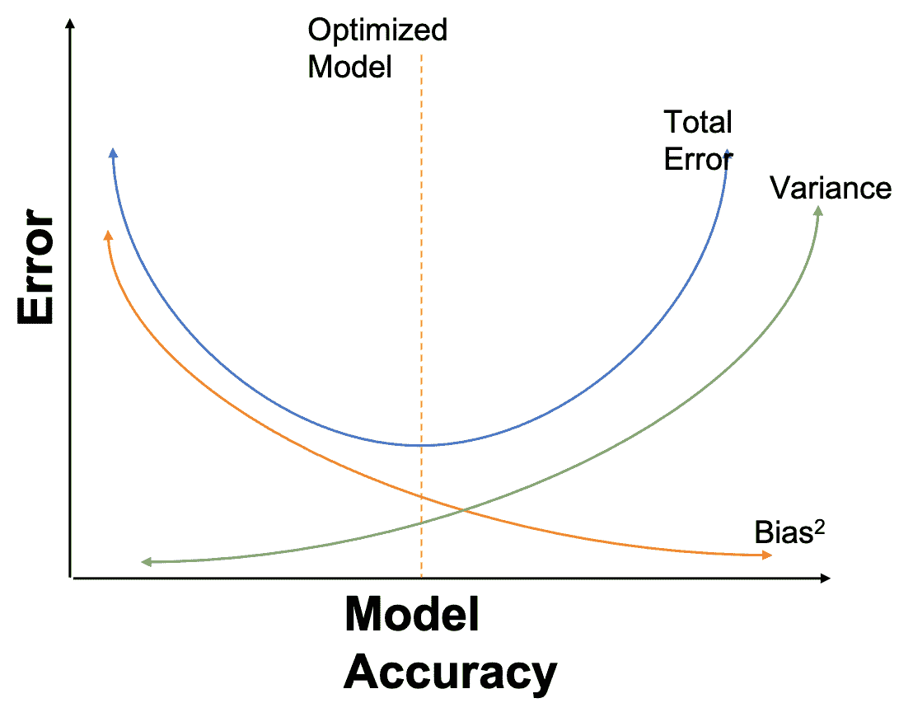
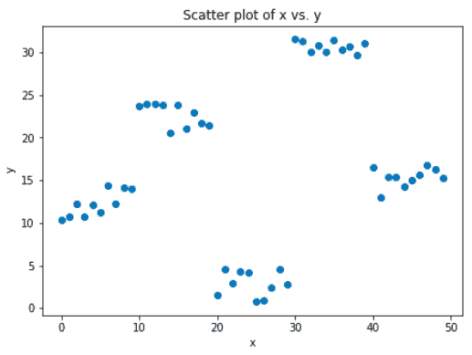
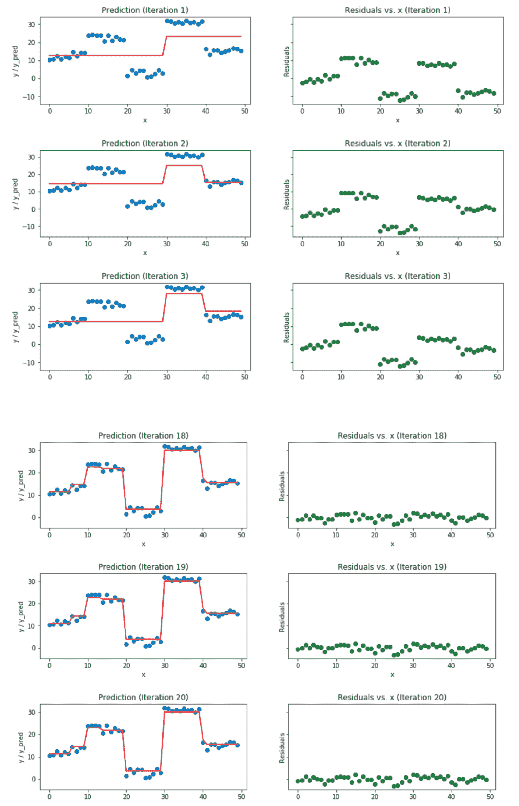
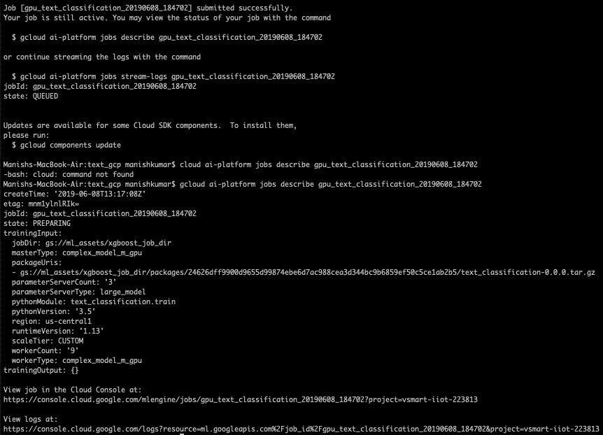
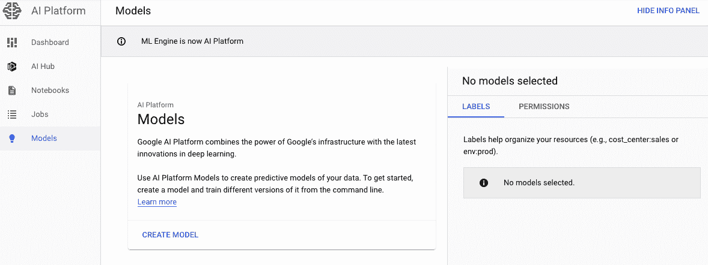
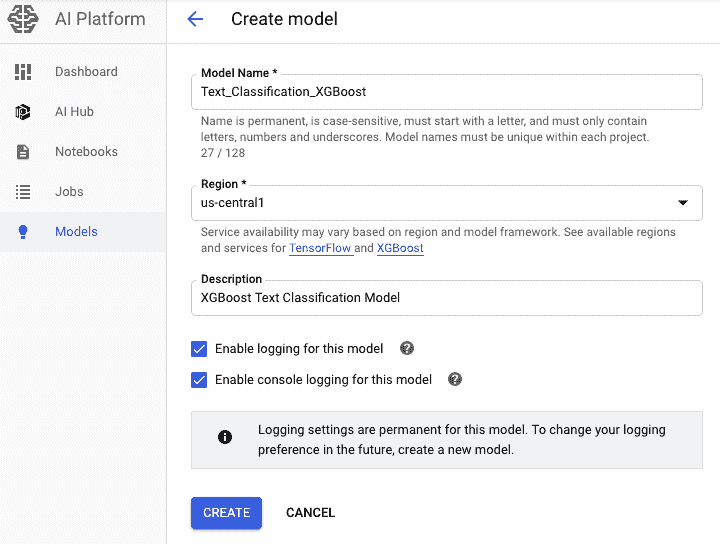
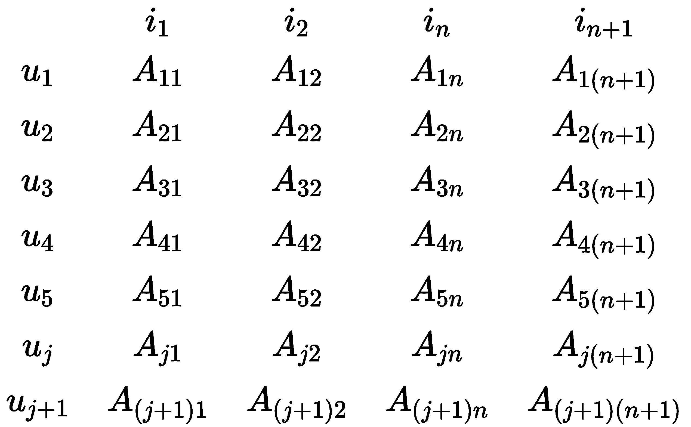

# XGBoost 的机器学习应用程序

在许多领域，基于机器学习的数据驱动方法变得非常重要。 一个很好的例子是基于机器学习的智能电子邮件垃圾邮件分类器，它通过学习大量垃圾邮件数据和用户反馈来保护我们的电子邮件。 另一个这样的示例可以是针对性广告系统，其基于某些上下文向用户展示广告，或者是防止恶意攻击者攻击的银行欺诈检测系统。 为了使机器学习应用程序在上述领域取得成功，必须牢记一些重要因素。

一种是建立并使用有效的统计模型来表示涵盖最重要场景的所有复杂数据依赖关系，另一种是可伸缩地构建那些模型以确保它们在越来越大的数据集上工作。 机器学习的可伸缩性使您能够通过并行和分布式计算进行快速学习，并且还提供了有效的内存利用率。

在本章中，我们将讨论 XGBoost 库，这是一种集成学习算法。 XGBoost 是一种基于决策树集成的机器学习算法，该算法使用梯度提升系统。 在预测涉及非结构化数据（例如图像和文本）的问题时，人工神经网络往往会胜过任何其他算法或系统。 尽管如此，当涉及中小型结构化/表格数据时，基于决策树的算法目前被认为是同类最佳。 这是因为在某些情况下，仅一种机器学习模型的结果可能不够。 共同学习为组合多种机器学习算法的预测能力提供了系统的解决方案。 结果是一个单一模型，提供了多个模型的附加输出。 集成模型（也称为基础学习器）可以使用相同的学习算法，也可以使用不同的算法。 在本章中，您将学习如何使用 Python 实现 XGBoost 算法。 您还将学习有关梯度提升的概念以及它们如何支持 XGBoost 算法的知识。

本章将涵盖以下主题：

*   XGBoost 库概述
*   训练和存储 XGBoost 机器学习模型
*   使用 XGBoost 训练的模型
*   使用 XGBoost 库构建推荐系统

# XGBoost 库概述

XGBoost 是一个库，可帮助以可扩展且以性能为中心的方式在非常大的数据集上运行集成学习机器学习算法。 因此，它着重于计算速度和模型性能。 换句话说，对于 XGBoost 而言，高端硬件情况下性能或可伸缩性提高的结果更多。 XGBoost 在梯度提升框架内实现了用于机器学习的算法。 我们将很快进入 XGBoost 库。 但是在此之前，我们还应该了解集成学习和梯度提升。

# 集成学习

集成学习算法结合了多个基本模型以产生最佳的预测模型。 与尝试从训练数据中学习假设的普通机器学习方法相反，集成方法尝试构建和组合许多假设。 使用集成方法时，重点放在泛化上，由于算法的特定性质或由于选择的训练集而导致的偏差方差折衷，有时基础学习者会忽略它。

通常，基础学习算法会根据训练数据生成基础学习者，这些数据可以是决策树，神经网络或其他机器学习算法。 大多数乐团使用单个基本学习算法来生成同类基础学习器，但是也存在几种使用多种不同类型的学习算法来生成异构学习器的方法。 在后一种情况下，没有用于基础学习的单一算法。 套袋和加强是广泛使用的集成方法。 这些是一种简单的组装技术，使用一些模型平均技术来共同构建许多独立的预测变量/模型/学习者（例如平均加权，多数或平均法线）。

另一个更大的问题是如何确保基础学习者不相互关联。 确保这些基本共同学习者的预测彼此独立是很重要的。 否则，它将排除整体建模的优化预测模型。 对于不同的基础共同学习者，我们的意思是最终的基础模型应该有所不同。 如果模型使用的数据集完全不同并且完全代表不同的上下文，则这些模型可以不同。 如果模型考虑不同的假设或使用完全不同的算法类别，则模型可以有所不同。

# 集成学习如何决定最佳预测模型？

当集成学习模型产生的误差尽可能低时，确定最佳模型，而损失函数的较低值确定最小值。 损失函数用于衡量预测模型可以预测预期结果的程度。 查找最小功能点的最常见方法是梯度下降。 总而言之，我们必须首先了解导致模型错误的原因，才能真正了解集成模式背后的原因。 我们将向您简要介绍这些错误，并为每位集成学生提供对这些问题的见解。 任何模型的误差都可以在数学上分为三种类型。

# 可减少的误差 – 偏差

偏差是预测值和实际值之间的距离。 换句话说，偏差是平均模型预测值与我们尝试预测的正确值之间的差。 高度偏倚的模型很少考虑训练数据，而过于简化了模型。 高偏差会导致算法错过相关的输入输出变量关系。 如果模型具有很高的偏差度，则意味着该模型过于简单，无法捕获支撑数据的复杂性。 为了量化偏差，它是预测值和实际值之间的平均差。

# 可减少的误差 – 方差

当模型在经过训练的数据集上良好但在新数据集（例如测试数据集或验证数据集）上表现不佳时，就会发生方差。 方差告诉我们如何分散实际值。 高方差会导致过拟合，这意味着算法模型中训练数据中存在随机噪声。 如果模型显示出很高的方差，则它会变得非常灵活，并适应训练集的数据点。 如果高方差模型遇到另一个未学习的数据点，则无法正确预测。 方差量化了预测和相同观测值之间的差异。

# 不可减少的误差

不可减少的错误是无论您使用哪种机器学习算法都无法将其最小化的错误。 它们通常是由可能影响输出变量的未知变量引起的。 改善不可减少错误的预测的唯一方法是识别和预测那些外部影响。

# 总误差

总误差定义如下：


通常，随着模型变得越来越复杂，由于模型的失真较小，您会看到错误的减少。 但是，这只会发生到某个特定点。 随着模型的不断复杂化，您最终会过拟合模型，因此方差将开始增加。 正确优化的模型应该平衡方差和偏差，如下图所示：



# 梯度提升

梯度提升是整体学习器的一种。 这意味着将基于一组不同的模型创建最终模型。 这些不同模型的拟合程度过高，因此它们的预测能力较弱，但是由于将它们组合在一起，因此在总体结果方面要好得多。 在梯度提升机中，决策树是最常用的弱模型类型。 因此，简而言之，梯度提升是一种基于回归和分类的机器学习方法，可将预测模型生成为弱预测模型的集合，该模型通常基于决策树。 现在让我们看看如何在数学上进行定义。

任何监督学习算法都旨在定义和最小化损失函数。 **均方误差**（**MSE**）或损失函数定义如下：


我们希望损失函数最小。 实际上，梯度提升的目的是找到使损失函数最小化的数据的最近似函数。 这可以用数学方式表示为：


因此，在梯度提升中，除了找到最佳参数`P`之外，我们还希望找到最佳函数`F`。 与简单的逻辑回归不同，此更改使问题复杂得多。 之前，我们要优化的参数数量是固定的（例如，在开始训练之前已定义了逻辑回归模型）； 现在，如果函数`F`发生更改，它可以随着我的优化过程而更改。

显然，搜索每个单个特征和参数以获得最佳特征会花费太长时间，因此梯度提升可以通过使用许多简单函数并将它们组合来找到最佳函数`F`。 以下是渐变增强中涉及的步骤：

1.  首先，使用简单的模型和错误分析数据对数据建模。 这些错误指向难以通过简单模型拟合的数据点。
2.  然后，对于后续模型，我们特别关注难以拟合的数据以对其进行校正。
3.  归根结底，我们将所有预测变量组合在一起，赋予每个预测变量一定的权重。

[这个页面](https://github.com/PacktPublishing/Hands-On-Artificial-Intelligence-on-Google-Cloud-Platform)上的代码表示如何在 Python 中完成梯度提升。

此代码用于在 Python 中实现梯度提升。 但目的还在于显示如何在多次迭代后减少错误。 散点图显示了机器学习算法的输入（`X`）的输出（`Y`）的分布方式。 以下输出还显示了残留散点图，该残留散点图在第 20 次迭代后变得随机性降低，表明梯度提升已找到最佳输出：



前面的散点图是输入和输出机器学习算法的表示。 下面显示了应用梯度提升之前的实际输出：



我们可以在前面的屏幕截图中看到以下内容：

*   从第 18 次迭代开始，残差实际上是在第 20 次迭代附近随机分布的。
*   一旦残差随机分布均匀，我们就知道梯度提升已经给出了优化的输出。
*   换句话说，梯度提升从残差中识别出最大数量的图案，并给出了最大的优化输出。

# 极限梯度提升（XGBoost）

XGBoost 是由 Tianqi Chen 开发的，其全名是 eXtreme Gradient Boosting。 XGBoost 是梯度助推器机器的一种可扩展且准确的实现方式，仅针对模型性能和计算速度而开发，作为助力树算法的计算机功率极限。 陈天琪说，后者使它更具优势，与其他图书馆有所不同。 以下是 XGboost 使其独特的一些重要功能：

*   **并行化**：在 XGBoost 中并行构建顺序树。 用于构建基础学习者的循环可以互换。 因此，列出树的叶节点的外循环可以与计算特征的内循环互换。 如果这是原始方式，则必须在外部循环开始之前完成内部循环，而内部循环不会占用更多的计算量。 在 XGBoost 中，为了缩短运行时间，通过初始化全局扫描并使用所有实例的并行线程进行排序来交换循环的顺序。 此开关通过抵消任何并行开销来提高算法效率。
*   **停止标准**：在梯度提升框架中，用于树分割的停止标准基于分割时的负损失函数。 但是，对于 XGBoost，它将按指定的`max_depth`参数开始向后修剪树。 这是一种深度优先的方法，可以提高算法的整体性能和效率。
*   **最大硬件资源使用率**：XGBoost 旨在最大程度地利用硬件资源。 它通过每棵树中的内部缓冲区利用系统缓存来存储梯度统计信息。 其他改进包括计算核外和优化可用磁盘空间，同时处理不适合内存的大数据帧。

# 训练和存储 XGBoost 机器学习模型

在本节中，我们将研究如何使用 Google AI Hub 训练和存储机器学习模型。 AI Hub 是一站式存储，用于检测，共享和部署机器学习模型。 它是可重用的模型目录，可以快速安装在 AI 平台执行环境中。 该目录包含基于以下通用框架的模型设计的汇编：TensorFlow，PyTorch，Keras，scikit-learn 和 XGBoost。 每种模型都可以包装由 GPU 或 TPU，Jupyter 笔记本和 Google 自己的 AI API 支持的深度学习 VM，格式可以在 Kubeflow 中实现。 每个模型都有标签，这些标签可根据一系列特征来方便信息的搜索和发现。 借助`.../text_classification_rapids_framework.py`处的代码，我们将 XGBoost 与 RAPIDS 框架一起用于文本分类。

从算法上讲，此代码执行以下步骤：

1.  导入了必要的软件包。 在较高级别上，此代码使用`OS`，`google.cloud`，`cudf(RAPID)`，`sklearn`，`pandas`和`xgboost`。 它还会导入`pynvml`，这是一个 Python 库，用于低级 CUDA 库，用于 GPU 管理和监视。
2.  接下来，代码将安装`miniconda`库和 RAPIDS 平台，然后设置 NVIDIA GPU 所需的一些环境变量。
3.  代码的下一部分将设置访问 Google API 所需的一些常量，例如`project id`和`bucket id`。
4.  然后，该代码从 GCS 存储桶中下载训练数据（`text_classification_emp.csv`）。 然后将其存储在本地作业目录中以供进一步使用。
5.  代码的下一部分使用`\n`分割 CSV，并创建两个数组，一个数组用于标签（目标变量），另一个数组用于文本（预测变量）。
6.  然后，它创建一个 Pandas `DataFrame`，然后将其转换为与基础 GPU 兼容的 CUDF `DataFrame`。 这样做是为了确保所有其他操作都利用基础 GPU。
7.  然后，按照 80%-20% 的规则将数据分为训练和测试数据集。
8.  然后，标签编码器用于将标签编码为矢量值。
9.  之后，在字符级别上计算 TF-IDF。
10.  最后，使用 XGBoost 库训练模型。

要提交前面的代码来训练模型，您必须运行以下命令。 此命令是标准`google-ai-platform` CLI，该 CLI 提交训练说明以在 Google Cloud AI 平台上训练任何模型：

```py
gcloud ai-platform jobs submit training $JOB_NAME \
--job-dir=$JOB_DIR \
--package-path=$TRAINING_PACKAGE_PATH \
--module-name=$MAIN_TRAINER_MODULE \
--region=$REGION \
--runtime-version=$RUNTIME_VERSION \
--python-version=$PYTHON_VERSION \
--config=config.yaml
```

可以按照以下方法将那边的环境变量设置为`job.properties`，并且在运行`gcloud ai-platform`作业之前必须先获取`job.properties`的源。 可以在以下代码中看到一个示例：

```py
PROJECT_ID=test-project-id
BUCKET_ID=ml-assets
JOB_NAME=gpu_text_classification_$(date +"%Y%m%d_%H%M%S")
JOB_DIR=gs://${BUCKET_ID}/xgboost_job_dir
TRAINING_PACKAGE_PATH="text_classification"
MAIN_TRAINER_MODULE=text_classification.train
REGION=us-central1
RUNTIME_VERSION=1.13
PYTHON_VERSION=3.5
```

特定于 GPU 的`config.yml`文件的内容如下：

```py
trainingInput:
  scaleTier: CUSTOM
  # Configure a master worker with 4 K80 GPUs
  masterType: complex_model_m_gpu
  # Configure 9 workers, each with 4 K80 GPUs
  workerCount: 9
  workerType: complex_model_m_gpu
  # Configure 3 parameter servers with no GPUs
  parameterServerCount: 3
  parameterServerType: large_model
```

程序包的结构如下块所示：

```py
text_classification
|
|__ __init__.py
|__ config.yml
|__ run.sh
|__ job.properties
|__ train.py
```

提交代码后，您可以使用以下屏幕快照中显示的命令检查作业状态：



如以下屏幕截图所示，这是驱动程序 Cloud ML GPU 日志的外观：


在本部分中，我们了解了如何使用 Google Cloud AI 平台进行 XGBoost 模型训练。 部署代码和使用 GCP 强大的并行计算的步骤很重要。 尝试在您的工作环境中执行此处演示的每个步骤。

# 使用已训练的 XGBoost 模型

将模型存储在 Google Cloud Storage 中之后，需要以正确的格式放置数据以进行预测。 它必须是矢量格式且非稀疏。 这意味着您必须具有不包含零值的向量。 如果该值为 0，则必须将其表示为 0.0。 让我们看下面的例子：


执行以下步骤以使用 XGBoost 训练的模型：

1.  从网络浏览器转到`console.google.com`。
2.  在 GCP 控制台中打开“AI 平台模型”页面：



3.  接下来，您将必须使用以下屏幕快照中显示的输入来创建模型资源：



4.  之后，创建以下屏幕截图所示的模型版本：


5.  有效创建模型版本后，AI 平台将从准备用于预测应用程序的新服务器开始。

现在，您可以运行以下 Python 程序来调用云机器学习 API：

```py
import googleapiclient.discovery

def predict_json(project, model, instances, version=None):
    """Send json data to a deployed model for prediction.
    Args:
        project (str): project where the AI Platform Model is deployed.
        model (str): model name.
        instances ([[float]]): List of input instances, where each input
           instance is a list of floats.
        version: str, version of the model to target.
    Returns:
        Mapping[str: any]: dictionary of prediction results defined by the
            model.
    """
    # Create the AI Platform service object.
    # To authenticate set the environment variable
    # GOOGLE_APPLICATION_CREDENTIALS=<path_to_service_account_file>
    service = googleapiclient.discovery.build('ml', 'v1')
    name = 'projects/{}/models/{}'.format(project, model)

    if version is not None:
        name += '/versions/{}'.format(version)

    response = service.projects().predict(
        name=name,
        body={'instances': instances}
    ).execute()

    if 'error' in response:
        raise RuntimeError(response['error'])

    return response['predictions']
```

前面的代码是客户端机器学习 Python 代码，并利用了通过 Google Cloud AI 平台部署的模型。 它以 JSON 作为输入并提供预测的输出。 在下一节中，我们将看到如何使用 XGBoost 库构建推荐系统。

您可以在[这个页面](https://cloud.google.com/ml-engine/docs/tensorflow/python-client-library)上找到 Python 客户端库的详细信息。

# 使用 XGBoost 库构建推荐系统

现代互联网零售客户要求个性化产品。 这提高了他们的满​​意度，因此也增加了电子零售商的收入。 这就是为什么推荐系统已经使用了很多年的原因。 当前的推荐系统所提供的结果主要包括普通产品。 但是，分销商想要的方案也建议不常见的商品，因为在这个漫长的尾巴中，它们仍占零售商销售的很大份额。 亚马逊的推荐系统享有盛誉。 它提出了其他产品，通常与消费者目前正在观看的商品相关。 如果他们不完全了解他们要寻找的内容，建议的系统还可以帮助客户找到产品或访问 Netflix 和 YouTube 时的视频。 它们通常基于称为协作过滤的技术。 通过使用这种方法收集许多用户的偏好来生成用户选择的预测。 假设，如果用户具有等效首选项的子集，则其他不可见产品的等效首选项更有可能出现。

与具有相应历史记录的用户相比，集体过滤仅依赖于用户历史记录。 换句话说，零售商对所提建议的影响有限，强烈建议将其用于普通产品。 对于许多在线公司而言，这是不必要的，因为他们的大部分收入仍然来自知名度较低的产品的长尾巴。 因此，对于公司而言，找到一种能够鼓励少见的普通产品和著名产品的算法至关重要。 为了开发一种平衡的项目推荐系统，将零售商最畅销产品清单中最著名的产品与较不常见的产品结合在一起，建议使用基于树的梯度提升算法 XGBoost。 使用开源 XGBoost 软件库，梯度提升树学习可以成为平衡产品建议的正确方法。

由于推荐系统的长期使用，已经建立了几种推荐算法。 文献表明，最有前途的算法类别包括基于模型的算法。 针对用户-项目关系，交互信息以及用户和项目特征调整了几种机器学习方法。 决策树学习在先前的研究中非常成功。 在该技术中，决策树用于使用注释来预测对象的目标值。 梯度提升方法允许顺序添加模型以纠正先前模型的错误，直到可以进行进一步的改进为止。 结合起来，将创建目标值的最终预测。 更具体地说，建议某个用户购买物品的可能性。

为了进一步说明这一点，让我们以用户项目矩阵为例：



在此用户项目矩阵中，行代表用户，每一列都是项目，每个单元格都是用户评分。 共有`j + 1`个用户和`n + 1`个项目。 在此， `A[jn]`是`i[n]`的用户`u[j]`分数。`A[jn]`可以在 1 到 5 之间。有时，如果矩阵是用户`u[i]`是否查看对象`i[n]`，`A[jn]`也可以是二进制的。 在这种情况下， `A[jn]`为 0 或 1。在我们的情况下，我们将`A[jn]`视为 1 到 5 分 。 该矩阵是非常稀疏的矩阵，这意味着其中的许多单元都是空的。

由于项目很多，因此单个用户不可能对所有项目进行评分。 在实际情况下，单个用户甚至不会给最低的项目评分。 这就是为什么此矩阵中约有 99% 的单元空着。 空单元格可以表示为**非数字**（**NaN**）。 例如，假设`n`为 1000 万，`m`为 20,000。 因此`n * m`为`20 ^ 10M`，这是一个非常大的数字。 如果用户平均给 5 项评分，则评分总数为`5 * 10M  = 5 * 10⁶`。 这被称为矩阵的**稀疏度**。 矩阵稀疏度的公式如下：

`矩阵的稀疏度 = 空单元数 / 单元总数`。

因此，矩阵的稀疏度为`(10^10 - 5 * 10^6) / 10^10 = 0.9995`。 这意味着 99.95% 的单元格为空。 这是极其稀疏的。

由于稀疏度为 99.95%，因此标准推荐系统可能会考虑有利可图但未由特定用户评级的线下项目。 因此，XGBoost 算法将派上用场。

# 创建和测试 XGBoost 推荐系统模型

让我们使用 XGBoost 创建一个推荐系统。 [这个页面](https://github.com/PacktPublishing/Hands-On-Artificial-Intelligence-on-Google-Cloud-Platform)上的代码表示如何使用 XGBoost 构建推荐系统模型。 它基于用户电影评级数据集。 我们将利用 RAPIDS 包进行此实现。 我们将使用`conda`安装运行时库，安装程序包，并使用图形库表示结果。

下表包含`users.csv`的示例数据：

| 0 | 50 | 5 | 881250949 |
| --- | --- | --- | --- |
| 0 | 172 | 5 | 881250949 |
| 0 | 133 | 1 | 881250949 |
| 196 | 242 | 3 | 881250949 |
| 186 | 302 | 3 | 891717742 |
| 22 | 377 | 1 | 878887116 |
| 244 | 51 | 2 | 880606923 |
| 166 | 346 | 1 | 886397596 |
| 298 | 474 | 4 | 884182806 |
| 115 | 265 | 2 | 881171488 |

下表包含`movie_lens.csv`的示例数据。 这是一个说明性示例。 实际的训练数据可以高达数 GB，一旦我们使用了正确的基础基础架构集，XGBoost 算法就可以有效地训练它：

| **项目 ID** | **标题** |
| --- | --- |
| 1 | Toy Story（1995） |
| 2 | GoldenEye（1995） |
| 3 | Four Rooms（1995） |
| 4 | Get Shorty（1995） |
| 5 | Copycat（1995） |
| 6 | Shanghai Triad (Yao a yao yao dao waipo qiao)（1995） |
| 7 | Twelve Monkeys（1995） |
| 8 | Babe（1995） |
| 9 | Dead Man Walking（1995） |
| 10 | Richard III（1995） |

这些样本文件可用于使用 XGBoost 算法训练和评估模型。 使用非常大的数据集进行训练时，可以显着提高性能。

# 总结

树增强是一种非常有效的，广泛使用的机器学习技术。 在本章中，我们定义了一种称为 XGBoost 的可伸缩端到端树提升方案，数据研究人员广泛使用该方案来获取有关许多机器学习问题的最新成果。 我们提出了一种用于稀疏数据的新颖算法和一种用于近似树学习的加权分位数草图。 XGBoost 使用比当前系统少得多的资源来扩展数十亿个示例。 在本章中，我们介绍了不同的代码示例，到目前为止，您知道如何使用 Google Cloud AI Platform 提交模型并将这些模型用于预测。

在下一章中，我们将演示使用流组件对运动中的数据执行分析。