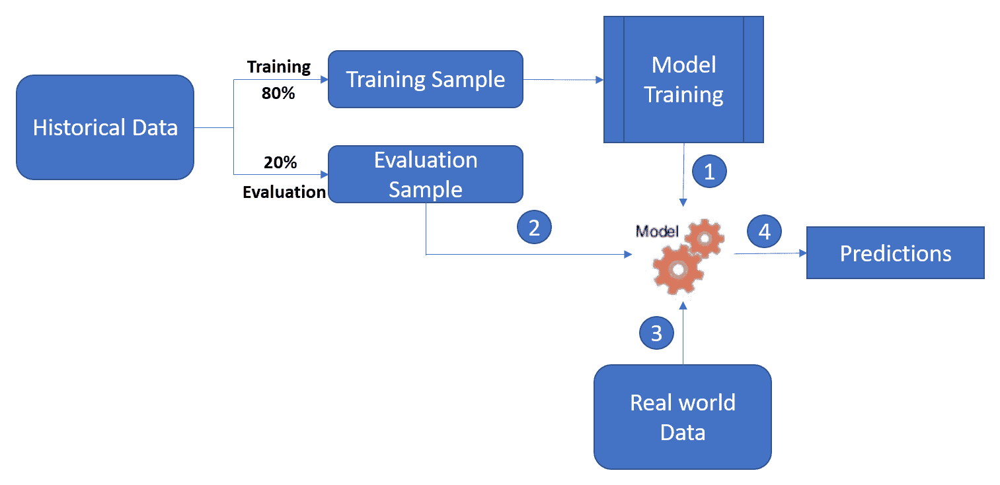
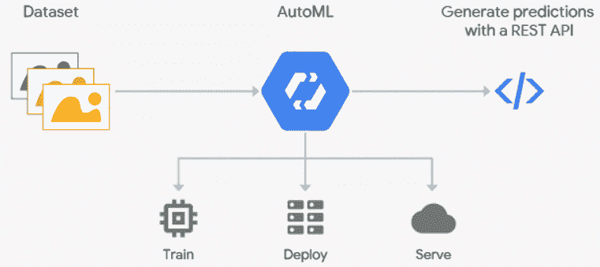
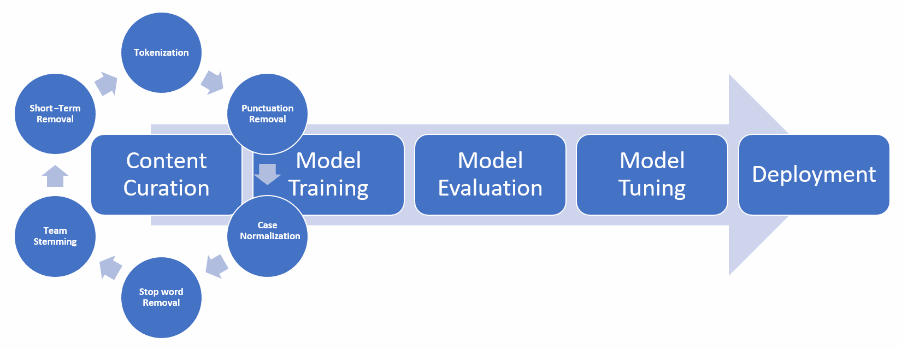
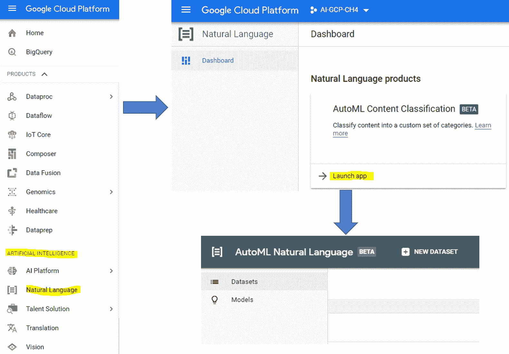
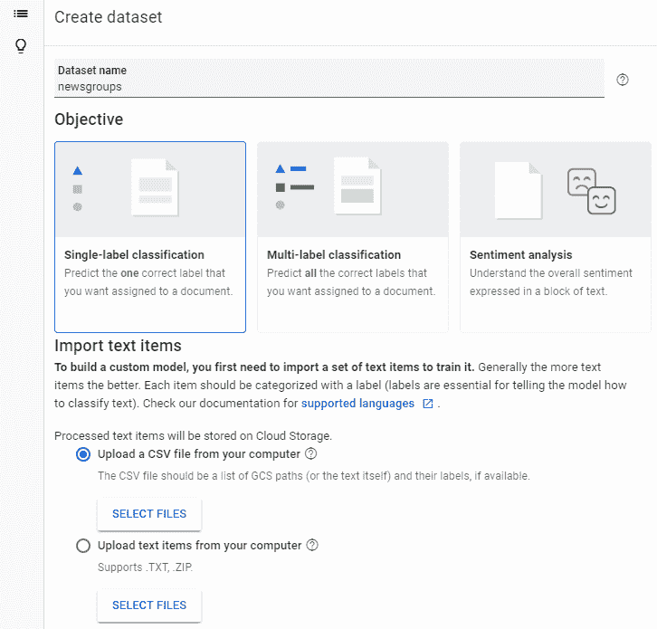
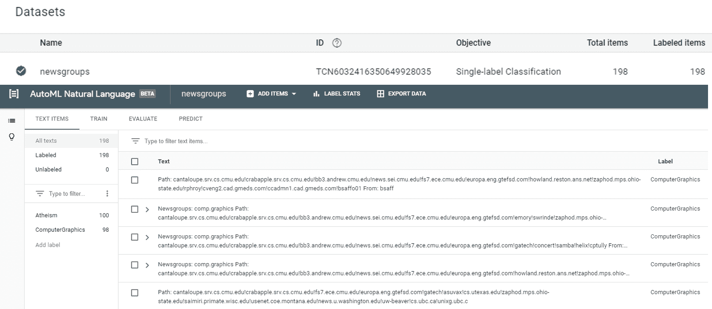
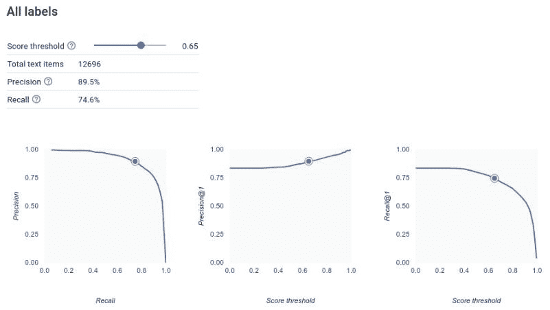

# 使用 Cloud AutoML

在上一章中，我们了解了机器学习中最流行，最方便的算法之一。 在本章中，我们将了解 **Google 云平台**（**GCP**）如何使通过 AutoML 服务轻松使用各种机器学习模型成为可能。 AutoML 使开发人员和分析人员在数据工程和机器学习编程方面经验有限的情况下，可以轻松构建机器学习模型。 我们将对 AutoML 采取一种实际的方法，并学习如何利用它来构建和部署一些实际用例的模型，例如文档和图像分类，语音到文本转换以及情感分析。

本章将涵盖以下主题：

*   Cloud AutoML 概述
*   使用 AutoML 自然语言进行文档分类
*   使用 AutoML Vision API 进行图像分类
*   使用语音到文本 API 执行语音到文本转换。
*   使用 AutoML 自然语言 API 进行情感分析

# Cloud AutoML 概述

有监督的机器学习模型遵循一致的生命周期。 监督学习取决于历史数据。 基于历史数据，对模型进行训练。 模型训练只是建立一个假设函数，该函数能够根据输入或自变量预测输出或因变量。 例如，在零售商店的销售预测模型的情况下，历史销售数据用于训练。 数据可以横向分布在影响销售的众多因素中。 训练数据被随机分为训练数据集和评估数据集。 通常，训练数据和评估数据之间分别有 80-20 的比例。

基于所选算法对模型进行训练，然后将其用于基于评估数据集评估准确率。 调整训练参数可提高模型的准确率和性能。 一旦模型在各种评估样本中都能很好地运行，就可以在实际环境中进行部署和使用了。 在此阶段，模型遇到了全新的数据集，而在训练过程中可能看不到。 在这里，将假设函数的泛化用于预测。 下图描述了通用的监督学习过程：



传统上，在非云环境中，此过程需要由数据科学家完全管理。 GCP Cloud AutoML 是一个完全托管的环境，负责所有操作流程，基础架构和模型管理。 GCP Cloud AutoML 为与**自然语言处理**（**NLP**）和**计算机视觉**（**CV**）相关的模型提供了接口。 在本章中，我们将通过利用 NLP 和 CV 接口的示例用例深入探讨 GCP Cloud AutoML。 Cloud AutoML 的优点如下：

*   **易于使用**：机器学习经验有限的开发人员可以轻松地使用 AutoML 平台来训练自定义机器学习模型。 可以根据特定的业务用例快速定制模型。 底层的复杂性由 GCP 管理，最终用户在训练模型和运行各种实验时无需担心计算能力或存储需求。
*   **高性能**：通过使用 GCP AutoML 引擎进行训练，评估和部署模型，用户可以访问 Google 的最新计算基础架构和分布式计算平台，从而始终如一地提供可靠的结果 。 根据资源需求与数据量和模型复杂性成比例，对集群进行动态自动缩放。
*   **速度和敏捷性**：上图所示的监督学习过程通过 AutoML 提供的简单直观的用户界面进行全面管理。 GUI 使您可以轻松快速地训练，评估，调整和部署模型。 由于可以进行各种实验的速度和敏捷性，可以快速尝试和测试不同的模型。 可以调整参数并可以快速验证结果。 这使得模型开发和部署过程极为灵活。

# AutoML 的工作原理

通过在机器学习模型的训练，评估和部署上创建高层抽象，AutoML 简化了有监督的学习过程。 下图显示了 AutoML 的工作原理：



将 AutoML 与传统的有监督的学习管道进行比较，显而易见：

*   AutoML 简化了训练，评估和部署 ML 模型的过程。
*   此外，AutoML 支持通过 RESTful API 与模型进行交互。
*   与 REST API 集成后，可以轻松利用来自各种应用程序和端点的机器学习模型。
*   AutoML 用户界面通常用于实验和快速测试假设。

但是，REST API 用于训练，评估和利用机器学习模型。 这是 AutoML 支持的通用和代表性 API 端点的快速概述。

# AutoML API 概述

RESTful API 被基于 GCP 的 AI 应用程序用来调用 AutoML 服务。 用户界面通常用于概念验证，但是企业应用程序需要一组丰富的 API 库才能与诸如 AutoML 之类的组件进行交互。 在本节中，我们将介绍一组代表性的 API 和这些 RESTful API 中的重要字段。

让我们看一下与`v1beta1.projects.locations.models`中的模型进行交互的 API 端点。

# REST 源–指向模型位置

在下表中，我们列出了通过模型位置 API 进行的一些基本方法调用。 调用应用程序需要将适当的参数传递给 API 端点，以创建和删除模型并将其用于预测：

| **方法** | **端点** | **说明** | **响应** |
| `create` | POST / v1beta1 / {parent} / models | 创建一个模型 | 完成后在响应字段中返回模型 |
| `delete` | 删除/ v1beta1 / {name} | 删除模型 | 完成后，在响应字段中返回`google.protobuf.Empty`，在元数据字段中返回`deleteDetails` |
| `get` | GET / v1beta1 / {name} | 获取模型 | 如果成功，则响应主体包含模型的实例 |
| `predict` | POST / v1beta1 / {name}：预测 | 执行预测 |  |

让我们看一下可用于调用 API 的实际有效负载。 这是机器学习模型的 JSON 表示形式。 以下代码段描述了关键字段和相应的数据类型：

```py
{
  "name": string,
  "displayName": string,
  "datasetId": string,
  "createTime": string,
  "updateTime": string,
  "deploymentState": enum(DeploymentState),

  // Union field model_metadata can be only one of the following:
  "imageClassificationModelMetadata": {
    object(ImageClassificationModelMetadata)
  },
  "textClassificationModelMetadata": {
    object(TextClassificationModelMetadata)
  },
  "translationModelMetadata": {
    object(TranslationModelMetadata)
  }
  // End of list of possible types for union field model_metadata.
}
```

应用程序运行时需要提供通用存根，以利用响应内容并利用调用应用程序中的响应。

让我们看一下前面代码中的字段描述：

*   `name`：这是一个仅输出的字段，代表模型的资源名称。 该字段的输出格式为`projects/{project_id}/locations/{locationId}/models/{modelId}`。
*   `displayName`：此字段是 GCP Web 界面中显示的模型的名称。 名称可以由用户选择。 管理此字段名称的规则如下：
    *   长度最多为 32 个字符。
    *   它可以包含 ASCII 拉丁字母 A-Z 和 a-z：
        *   下划线（_）
        *   ASCII 数字 0-9
    *   第一个字符必须是字母。
*   `datasetId`：此字段指向用于创建模型的数据集的资源 ID。 数据集必须属于相同的祖先项目和位置。
*   `createTime` / `updateTime`：这是创建/更新模型时的日期时间戳。 GCP 使用具有纳秒精度的 RFC3339 UTC 格式，例如`2019-03-05T15:01:23.045123456Z`。
*   `deploymentState`：这是模型的当前状态。 GCP 平台上模型的可能状态如下：
    *   `DEPLOYMENT_STATE_UNSPECIFIED`：不应使用。
    *   `DEPLOYED`：已部署模型。
    *   `UNDEPLOYED`：未部署模型。

`imageClassificationModelMetadata`，`textClassificationModelMetadata`和`translationModelMetadata`分别用于图像，文本和翻译模型。 我们将在本章的后续部分中对此进行解释。

这是用于模型评估的 REST 源 API：`v1beta1.projects.locations.models.modelEvaluations`。

# REST 源–用于评估模型

这是获取和列出模型评估的方法调用：

| **方法** | **端点** | **说明** |
| `get` | GET / v1beta1 / {name} | 获得模型评估 |
| `list` | GET / v1beta1 / {parent} / modelEvaluations | 列出模型评估 |

可以使用简单的 API 列出模型评估参数，并且可以将其用于调用应用程序中的迭代模型改进。

以下 API 使应用程序能够在运行时分析模型操作。 在某些情况下，由于数据量和模型复杂性，模型训练和评估需要更长的时间。 这些操作调用帮助应用程序向最终用户报告模型训练和评估的状态。

# REST 源–操作 API

下表列出了`v1beta1.projects.locations.operations` API：

| **方法** | **端点** | **说明** |
| `cancel` | POST / v1beta1 / {name}：取消 | 在长时间运行的操作上启动异步取消 |
| `delete` | 删除/ v1beta1 / {name} | 删除长时间运行的操作 |
| `get` | GET / v1beta1 / {name} | 获取长时间运行的操作的最新状态 |
| `list` | GET / v1beta1 / {name} / operations | 列出与请求中的指定过滤器匹配的操作 |
| `wait` | POST / v1beta1 / {name}：等待 | 等待指定的长时间运行的操作，直到完成或最多达到指定的超时，并返回最新状态 |

请注意，对于操作 API 的请求是异步的，并且对于调用应用程序是非阻塞的。 这些对于调用应用程序以报告模型训练和评估的进度很有用。

# 使用 AutoML 自然语言进行文档分类

文档分类是一个非常重要的用例，主要用于分析文档或大量文档（例如法律文档）的内容。 有时，手动分类需要付出很多努力，而且可能不可行。 GCP 提供了易于使用的自然语言界面，可以对其进行自定义训练，以基于 AutoML 进行文档分类。 让我们了解一个包含 20 个新闻组的公共可用数据集的分类过程。 该数据集可从[这里](http://qwone.com/~jason/20Newsgroups/)下载。 这是大约 20,000 个新闻组文档的集合，平均分布在 20 个不同的新闻组中。 这些新闻组对应于不同的主题。 目标是根据训练数据训练模型，评估模型，最后将其用于文档分类。

# 传统的机器学习方法用于文档分类

文档分类过程遵循一组标准步骤。 在训练分类模型之前，需要对文档内容进行分类，以确保分类的准确率。 下图显示了以传统方式使用机器学习进行文档分类的整个过程：



与该图所示的方法不同，AutoML 简化了文档分类的流程。

# 使用 AutoML 进行文档分类

在本节中，我们将研究 GCP 中的 AutoML 接口，以使用 AutoML 进行文档分类。

# 导航到 AutoML 自然语言界面

使用您的 GCP 凭据登录[这里](https://console.cloud.google.com)。 在导航菜单上，转到**人工智能**部分，然后单击**自然语言**子菜单：



AutoML 自然语言使上传数据集和训练模型变得容易。 在我们的示例中，数据集是新闻组文档的集合。

# 创建数据集

要创建新数据集，请单击标题栏中的“新建数据集”按钮：



为数据集提供唯一的名称（在这种情况下为`newsgroups`）。 GCP 提供以下用于上传数据集的选项：

*   从计算机上载 CSV 文件：CSV 文件应包含 Google Cloud Storage 路径列表和相应的标签，并用逗号分隔。
*   从计算机上载文本项：该界面允许选择多个文本文件或包含多个文件的 ZIP 存档。
*   在云存储上选择 CSV：可以从 Cloud Storage 中选择包含路径和标签的带标签的 CSV 文件。

创建数据集后，可以从 Google Cloud Storage URI 和本地驱动器导入其他项目。

# 标记训练数据

可以通过在上传到数据集的 CSV 文件中包含标签并使用 AutoML Natural Language UI 来为文本文档添加标签来标记训练数据：



创建标记的训练数据集时，请考虑以下提示：

*   创建具有可变长度文档以及各种写作风格和作者的数据集。 较高的变化水平可提高模型准确率。
*   这些文档需要对人类读者分类。 AutoML 界面取决于预先标记的训练数据，因此模型的准确率取决于手动标记过程的准确率。
*   GCP 建议每个标签有 1,000 个训练文件。 每个标签的最小文档数为 10。每个标签的训练样本数量越多，内容的变化也越大，模型的准确率就越高。
*   对于无法归入预定义标签之一的文档，请使用`None_of_the_above`或等效标签。 这将提高模型的准确率，而不是贴错标签或保留空白标签。

# 训练模型

创建数据集并对其进行完全标记后，即可对模型进行训练。 单击 TRAIN NEW MODEL 按钮，通过提供模型名称来启动异步训练过程。 型号名称最多可以包含 32 个字符，并且可以包含字母，数字和下划线。 模型训练所需的时间取决于训练数据的数量和变化。 训练模型可能需要几分钟到几个小时。 一旦模型训练完成，就会向已注册的电子邮件 ID 发送电子邮件通知。


如下面的屏幕快照所示，模型经过训练后，将显示模型属性（例如，模型创建时的日期时间和训练数据的定量性质）以及质量参数（例如**精度**和**召回**）：

# 评估模型

与传统的机器学习管道不同，在传统的机器学习管道中，我们需要在评估数据集上评估模型，而 GCP 在内部使用测试集中的项目评估模型。 在此阶段检查模型的质量和准确率。 AutoML 提供了两个级别的聚合质量指标，这些指标指示模型在所有功能和标签以及每个类别标签上的总体训练水平。 GCP 报告了以下指标：

*   **AuPRC**（精度和召回曲线下的**面积**）：这表示平均精度。 典型值在 0.5 到 1.0 之间。 值越高表示模型越准确。
*   **精度和召回曲线**：AutoML 提供了一种交互式方式来设置标签的阈值。 较低的阈值会增加召回率，但会降低精度：



*   **混淆矩阵**：这可以可视化模型的准确率，以预测输出类别。 它代表评估阶段训练数据中输出标签的百分比：


这些易于使用的 AutoML 度量标准可用于评估模型的可靠性，从而预测实际数据集上的输出类别。 如果混乱程度很高，而准确率和召回率得分很低，则该模型可能需要其他训练数据。

除了用于模型评估的 Web 界面之外，GCP 还提供了一个可编程的 API 接口，用于使用命令行，Python，Java 和 Node.js 进行评估。

# 命令行

使用以下命令通过将`model-name`替换为实际模型名称来获取 JSON 格式的模型评估参数：

```py
curl -H "Authorization: Bearer $(gcloud auth application-default print-access-token)" -H "Content-Type:application/json" https://automl.googleapis.com/v1beta1/model-name/modelEvaluations
```

此命令以 JSON 格式返回评估参数，如下所示：

```py
{
  "modelEvaluation": [
    {
      "name": "projects/434039606874/locations/us-central1/models/7537307368641647584/modelEvaluations/9009741181387603448",
      "annotationSpecId": "17040929661974749",
      "classificationMetrics": {
        "auPrc": 0.99772006,
        "baseAuPrc": 0.21706384,
        "evaluatedExamplesCount": 377,
        "confidenceMetricsEntry": [
          {
            "recall": 1,
            "precision": -1.3877788e-17,
            "f1Score": -2.7755576e-17,
            "recallAt1": 0.9761273,
            "precisionAt1": 0.9761273,
            "f1ScoreAt1": 0.9761273
          },
          {
            "confidenceThreshold": 0.05,
            "recall": 0.997,
            "precision": 0.867,
            "f1Score": 0.92746675,
            "recallAt1": 0.9761273,
            "precisionAt1": 0.9761273,
            "f1ScoreAt1": 0.9761273
```

有两个主要的封装对象用于表示模型评估参数：标头级别的分类指标和置信度指标。 在此 JSON 响应中还报告了准确率和召回率得分。

# 蟒蛇

这是用于获取模型评估参数的 Python 代码片段：

```py
project_id = 'PROJECT_ID'
compute_region = 'COMPUTE_REGION'
model_id = 'MODEL_ID'
filter_ = 'Filter expression'

from google.cloud import automl_v1beta1 as automl

client = automl.AutoMlClient()

# Get the fully qualified path of the model based on project, region and model
model_full_id = client.model_path(project_id, compute_region, model_id)

# Apply the filter for listing all the model evaluations. 
response = client.list_model_evaluations(model_full_id, filter_)

print("Loop for listing all the model evaluations received based on the filter condition")
for element in response:
    print(element)
```

此代码段获取模型评估参数，并在响应上进行迭代，并打印各个参数，例如精度和召回率。

# 爪哇

这是用于获取模型评估参数的等效 Java 代码：

```py
public static void autoMLModelEvaluation(
    String projectId, String computeRegion, String modelId, String filter) throws IOException {
  // Instantiates a client
  AutoMlClient client = AutoMlClient.create();

  // Get the full path of the model.
  ModelName modelFullId = ModelName.of(projectId, computeRegion, modelId);

  // List all the model evaluations in the model by applying filter
  ListModelEvaluationsRequest modelEvaluationsrequest = ListModelEvaluationsRequest.newBuilder()
          .setParent(modelFullId.toString())
          .setFilter(filter)
          .build();

  // Iterate through the results.
  String modelEvaluationId = "";
  for (ModelEvaluation element : client.listModelEvaluations(modelEvaluationsrequest).iterateAll()) {
    if (element.getAnnotationSpecId() != null) {
      modelEvaluationId = element.getName().split("/")[element.getName().split("/").length - 1];
    }
  }

  // Resource name for the model evaluation.
  ModelEvaluationName modelEvaluationFullId =
      ModelEvaluationName.of(projectId, computeRegion, modelId, modelEvaluationId);

  // Get a model evaluation.
  ModelEvaluation modelEvaluation = client.getModelEvaluation(modelEvaluationFullId);

  ClassificationEvaluationMetrics classMetrics = modelEvaluation.getClassificationEvaluationMetrics();
  List<ConfidenceMetricsEntry> confidenceMetricsEntries = classMetrics.getConfidenceMetricsEntryList();

// Iterate over the list and get individual evaluation parameters. 
```

此代码段获取模型评估参数，并在响应上进行迭代，并打印各个参数，例如精度和召回率。 也可以将其打包为独立的 API 调用，并开发为微服务。

# Node.js

这是评估代码的 Node.js 实现。 代码简洁明了，并异步调用评估 API：

```py
const automl = require(`@google-cloud/automl`);
const util = require(`util`);

const client = new automl.v1beta1.AutoMlClient();

const projectId = `PROJECT_ID`;
const computeRegion = `REGION_NAME`;
const modelId = `MODEL_ID`;
const modelEvaluationId = `MODEL_EVAL_ID”;

  // Get the full path of the model evaluation.
  const modelEvaluationFullId = client.modelEvaluationPath(
    projectId,
    computeRegion,
    modelId,
    modelEvaluationId
  );

  // Get complete detail of the model evaluation.
  const [response] = await client.getModelEvaluation({
    name: modelEvaluationFullId,
  });
  console.log(util.inspect(response, false, null));
```

可以使用此代码段开发无阻塞的异步微服务，该代码段可以使用评估参数响应调用的应用程序。

# 使用模型进行预测

建立并评估模型后，GCP 将提供一个简单的界面，用于使用模型进行预测。 在这种情况下，该模型已准备好根据输入数据中的关键字对各种类别的文档进行分类。

# Web 界面

GCP 提供了用于快速测试模型的 Web 界面和 REST API，可在生产环境中用于文档分类：


在这种情况下，模型已基于在文本区域中输入的文本，以 100% 的置信度预测文档与**计算机图形学**相关。

# 用于模型预测的 REST API

我们可以使用一个简单的 REST API 来使用已部署的模型进行预测：

```py
export GOOGLE_APPLICATION_CREDENTIALS=key-file-path 

curl -X POST   
-H "Authorization: Bearer $(gcloud auth application-default print-access-token)" 
-H "Content-Type: application/json" 
https://automl.googleapis.com/v1beta1/projects/ai-gcp-ch4/locations/us-central1/models/TCN2853684430635363573:predict 
-d '{
         "payload" : {
           "textSnippet": {
                "content": "YOUR TEXT HERE",
                 "mime_type": "text/plain"
            },
         }
    }'

```

可以在生产环境中使用 Python 调用该 API。

# 用于模型预测的 Python 代码

将以下代码保存在名为`document_classifier.py`的文件中。 此代码使用已部署的模型进行预测：

```py
import sys 

from google.cloud import automl_v1beta1 
from google.cloud.automl_v1beta1.proto 
import service_pb2 

def get_prediction(content, project_id, model_id):
   prediction_client = automl_v1beta1.PredictionServiceClient()
   name = 'projects/{}/locations/us-central1/models/{}'.format(project_id, model_id)
   payload = {'text_snippet': {'content': content, 'mime_type': 'text/plain' }}
   params = {}
   request = prediction_client.predict(name, payload, params)
   return request # waits till request is returned
 if __name__ == '__main__':
   content = sys.argv[1]
   project_id = sys.argv[2]
   model_id = sys.argv[3]
   print get_prediction(content, project_id, model_id)
```

用`python document_classifier.py "Document Text" <<project_id>> <<model_id>>`调用文档分类器 API。 通过传递项目 ID 和已部署的模型 ID，可以使用此命令执行 Python 代码。

# 使用 AutoML Vision API 进行图像分类

GCP 提供了 Vision API，可用于以可视输入（图像和视频）的形式为非结构化数据构建智能应用程序，并可通过 Web 控制台和 API 进行访问。

# AutoML Vision 的图像分类步骤

GCP 上的图像分类过程遵循与 *AutoML* 文档分类中的文档分类过程相似的步骤。 以下是图像分类中涉及的步骤：


假设您已经知道如何设置 Google 帐户并创建了 GCP 项目。 让我们从**收集训练图像**步骤中逐步进行图像分类的步骤。

# 收集训练图像

AutoML Vision API 使用监督学习模型，因此需要训练图像的集合。 这些是用于训练目的的预先标记图像。 图像中可以包含一个或多个对象，并且需要以样本为基础定义和验证各个输出标签以确保准确率。 我们需要建立一个数据集来训练图像分类模型。

# 创建数据集

第一步，我们需要为图像创建一个占位符，以用于训练和评估模型。 创建数据集时，我们需要将分类类型称为多类或多标签。 在多分类器的情况下，将单个标签分配给每个分类的文档，而多标签分类器可以将多个标签分配给一个文档。

Web 界面提供了创建数据集的直观方法：

1.  单击标题栏中的**新数据集**按钮。 以下屏幕快照显示了用于创建数据集的用户界面：


2.  在项目中为新数据集提供唯一的名称。 有两种方法可以在数据集创建 UI 中上传图像：
    *   从您的计算机上载图像：AutoML 支持 JPG 和 PNG 格式。 包含一组 JPG 或 PNG 图像的 ZIP 归档文件也可以批量上传。
    *   在 Cloud Storage 上选择一个 CSV 文件：一个逗号分隔的文件，其中包含 Google Cloud Storage 上图像的路径列表及其标签（如果在创建数据集时可用）。

也可以将图像导入推迟到以后，并且可以将其中没有任何图像的数据集创建为占位符。 可以通过选中**启用多标签分类**复选框来指定分类类型。 默认分类类型是多分类。

# 标记和上传训练图像

我们将利用 Cloud Storage 上载图像并创建一个 CSV 文件来标记图像文件的内容。 我们将创建一个 Google Cloud Storage 存储桶，并存储将用于训练自定义模型的文档。 使用 Google Cloud Shell 中的以下命令创建 Cloud Storage 存储桶：

```py
gsutil mb -p ai-gcp-ch4 -c regional -l us-central gs://ai-gcp-ch4-vcm/

```

值区名称必须采用`PROJECT_ID-vcm`格式。

此命令将在项目内创建名称为`ai-gcp-ch4-vcm`的存储桶。

我们将通过以下命令在新创建的存储桶中使用包含花卉图像的公共可用数据集：

```py
gsutil -m cp -R gs://cloud-ml-data/img/flower_photos/  gs://ai-gcp-ch4-vcm/img/
```

将图像批量装入存储桶后，标记图像的最简单方法是使用 CSV。 CSV 文件的通用格式为`Image_Path, Label(s)`。 如果有多个标签（一个图像中有多个对象），则各个标签需要用逗号（`,`）分隔，如以下示例所示：

```py
gs://ai-gcp-ch4-vcm/img/flower_photos/roses/15674450867_0ced942941_n.jpg,roses
gs://ai-gcp-ch4-vcm/img/flower_photos/daisy/1031799732_e7f4008c03.jpg,daisy
```

在此示例中，第一个图像包含玫瑰，第二个图像包含雏菊花。 让我们将图像和标签导入数据集中：


CSV 文件中列出的图像以及存储在存储桶中的图像将被加载到数据集中并在此步骤中进行标记。 至此，我们的数据集已准备好训练分类模型。 这是 AutoML Vision 界面中带标签的数据集的快照：


我们的数据集包含分布在五个标签中的 3,665 个标签图像。 Web 界面允许修改标签并根据需要删除图像。 也可以通过使用 REST API 和命令行界面来填充带有标签图像的数据集，并且可以通过实用地调用它。

这是可用于调用 API 的 HTTP POST URL。 （在此 URL 字符串中替换`Project_ID`，`Region`和`datasetId`）：

```py
POST https://automl.googleapis.com/v1beta1/projects/ai-gcp-ch4/locations/us-central1/datasets/ICN7902227254662260284:importData
```

请求正文包含以下 JSON 格式的有效负载：

```py
{
     "inputConfig": {
     "gcsSource": {
     "inputUris": "gs://ai-gcp-ch4-vcm/img/flower_photos/all_data_updated.csv",
     }
    }
}
```

将请求正文保存在`import_images_request.json`文件中，然后在 Cloud Shell 上发送`curl`请求：

```py
curl -X POST \
-H "Authorization: Bearer "$(gcloud auth application-default print-access-token) \
-H "Content-Type: application/json; charset=utf-8" \
-d @import_images_request.json \
https://automl.googleapis.com/v1beta1/projects/ai-gcp-ch4/locations/us-central1/datasets/ICN7902227254662260284:importData
```

也可以通过导入`automl_v1beta1`包从 Python 调用该 API。 这是用于将图像导入数据集中的 Python 代码段：

```py
project_id = 'ai-gcp-ch4'
compute_region = 'us-central1'
dataset_id = 'ICN7902227254662260284'
paths = 'gs://ai-gcp-ch4-vcm/img/flower_photos/all_data_updated.csv'

from google.cloud import automl_v1beta1 as automl

client = automl.AutoMlClient()
dataset_full_id = client.dataset_path(project_id, compute_region, dataset_id)
input_config = {'gcs_source': {'input_uris': paths}}
response = client.import_data(dataset_full_id, input_config)
print('Processing import...')
print('Data imported. {}'.format(response.result()))
```

将图像加载到数据集中后，下一步就是训练分类模型。

# 训练模型

GCP AutoML 抽象了实际模型训练的复杂性，并从数据集中的图像创建了三个唯一的集合。 80% 的图像被随机标记为训练集，而 10% 的图像分别用于评估和测试集。 一个简单的界面启动分类模型训练过程：


根据训练图像的数量，标签的数量以及分配的计算资源，模型训练最多可能需要 15 分钟或几个小时。 该过程是异步的，一旦模型训练完成，便会触发电子邮件。 模型训练也可以通过命令行和实用地调用 API 来完成。

这是训练模型的`POST`请求（为`Project_ID`，`Region`，`datasetId`和`displayName`使用适当的参数； `displayName`是模型的名称，可由用户选择） ）：

```py
curl \
-X POST \
-H "Authorization: Bearer $(gcloud auth application-default print-access-token)" \
-H "Content-Type: application/json" \
https://automl.googleapis.com/v1beta1/projects/ai-gcp-ch4/locations/us-central1/models \
-d '{
       "datasetId": "ICN7902227254662260284",
       "displayName": "aigcpch4-image-clasification-model",
       "image_object_detection_model_metadata": {
            "model_type": "cloud-low-latency-1"
       },
    }'
```

`model_type`有两个选项。 `cloud-low-latency-1`以模型准确率为代价来最小化训练时间，而`cloud-high-accuracy-1`通过进行更多次训练迭代来最小化训练误差并创建更准确的模型，因此需要更多的时间和计算资源来进行训练。 需要根据特定用例以及时间和成本预算进行选择。 可以利用 AutoML Vision API 进行实用的模型训练。 这是训练模型的 Python 代码：

```py
project_id = 'ai-gcp-ch4'
compute_region = 'us-central1'
dataset_id = 'ICN7902227254662260284' 
model_name = 'aigcpch4-image-clasification-model'

from google.cloud import automl_v1beta1 as automl

client = automl.AutoMlClient()
project_location = client.location_path(project_id, compute_region)

my_model = {
    'display_name': model_name,
    'dataset_id': dataset_id,
    'image_object_detection_model_metadata': {
        "model_type": "cloud-low-latency-1"
    }
}
response = client.create_model(project_location, my_model)
print('Training image object detection model...')
```

模型训练完成后，该模型将在 AutoML Vision Web 界面的“模型”部分列出：


下一步是评估模型的准确率。 可在 Web 界面的`EVALUATE`选项卡下获得评估统计信息。

# 评估模型

使用训练集对模型进行训练后，评估集将用于模型评估。 评估结果位于“评估”选项卡中，并显示“平均精度”，“精度”和“调用率”。 这是用于评估模型的 Web 界面的屏幕截图：


如屏幕截图所示，我们在用户界面上获得了模型评估指标。 我们得到以下重要的模型训练参数：

*   **平均精度**：这可衡量所有得分阈值上的模型性能。
*   **精度**：这是对阳性指示正确比例的度量。 在数学上，精度定义为`Pred = TP / (TP + FP)`。 真实肯定代表模型正确预测肯定类别的结果。 假阳性表示模型错误地预测阳性类别的结果。
*   **召回**：这是对正确识别的实际阳性比例的度量。 在数学上，召回率定义为`Recall = TP / (TP + FN)`。 假阴性表示模型错误地预测阴性类别的结果。

可以同时使用精度和召回措施对模型进行全面评估，因此平均精度对于理解模型的有效性非常重要。 AutoML 提供了所有标签上模型参数的合并视图以及特定标签的参数值：


可以使用 REST API 评估模型，可以通过命令行以及实用地调用 REST API。

# 命令行界面

这是用于从 GCP AutoML 上部署的模型中获取模型评估的命令：

```py
curl -X GET \
-H "Authorization: Bearer "$(gcloud auth application-default print-access-token) \
https://automl.googleapis.com/v1beta1/projects/ai-gcp-ch4/locations/us-central1/models/ICN7883804797052012134/modelEvaluations
```

我们需要提供项目名称，区域和模型 ID，以便使用命令行界面获得评估。

# Python 代码

这是一段 Python 代码，可用于获取已部署模型的模型评估。 我们需要传递`project_id`，region 和`model_id`作为参数：

```py
project_id = 'ai-gcp-ch4'
compute_region = 'us-central1'
model_id = 'ICN7883804797052012134'
filter_ = ''
from google.cloud import automl_v1beta1 as automl
client = automl.AutoMlClient()
model_full_id = client.model_path(project_id, compute_region, model_id)
response = client.list_model_evaluations(model_full_id, filter_)
print('List of model evaluations:')
for element in response:
 print(element)
```

一旦建立了模型并评估了阈值准确率，就可以使用一组新图像来测试模型了。

# 测试模型

GCP AutoML 提供了一个简单的界面来测试模型。 可以从 Web UI 上载新图像，并根据部署的模型进行测试。 这是 Web UI 的屏幕截图，展示了所需的步骤：


还可以通过 REST API 使用命令行以及以编程方式测试和使用该模型。

创建一个`image_classification_request.json`文件，如下所示：

```py
{ "payload": { "image": { "imageBytes": "IMAGE_BYTES" } } }
```

将以下请求发送到 Web 服务：

```py
curl -X POST -H "Content-Type: application/json" \
  -H "Authorization: Bearer $(gcloud auth application-default print-access-token)" \
  https://automl.googleapis.com/v1beta1/projects/ai-gcp-ch4/locations/us-central1/models/ICN7883804797052012134:predict -d @image_classification_request.json
```

# Python 代码

以下是可在应用程序内用于基于一组新图像调用模型的 Python 代码：

```py
import sys
from google.cloud import automl_v1beta1
from google.cloud.automl_v1beta1.proto import service_pb2
def get_prediction(content, project_id, model_id):
  prediction_client = automl_v1beta1.PredictionServiceClient()
  name = 'projects/{}/locations/us-central1/models/{}'.format(project_id, model_id)
  payload = {'image': {'image_bytes': content }}
  params = {}
  request = prediction_client.predict(name, payload, params)
  return request # waits till request is returned
if __name__ == '__main__':
  file_path = sys.argv[1]
  project_id = sys.argv[2]
  model_id = sys.argv[3]
  with open(file_path, 'rb') as ff:
    content = ff.read()
  print get_prediction(content, project_id, model_id)
```

如本节中所述，AutoML 使无缝训练该图像分类模型变得无缝且容易，并且该模型已部署在云上，并且可以由经过身份验证的用户和服务帐户使用简单的 API 接口进行访问。

# 使用语音文本 API 执行语音文本转换

GCP 提供了一个非常有效且易于使用的 API，用于语音到文本的转换。 尽管界面简单直观，但下方仍存在深度神经网络，可不断训练并丰富语音到文本模型。 应用程序开发人员无需了解底层细节以及特定的神经网络配置和调整。 在撰写本文时，API 可以识别一百多种语言和方言。 该平台以批量和实时模式提供语音到文本转换服务。 随着平台被越来越多的用户用于转换，模型的准确率会在一段时间内提高。 该平台还提供用于自动检测口语的 API。 在允许语音命令的特定用例中，此功能非常方便。 该 API 允许选择适合特定用例的预构建模型。 例如，**命令和搜索**模型最适合语音命令，**电话**模型最适合记录电话对话。 下图描述了语音文本 API 的所有受支持的功能：


在本节中，我们将遍历 API 并了解如何利用语音转文本 API 来构建应用程序。

与语音到文本 API 交互的方法有以下三种：

*   **同步识别**：这是一个阻塞 API 调用，适用于少于 1 分钟的音频内容。 音频数据将发送到 REST 或 gRPC 端点。 仅当转录整个音频内容时，API 才会响应。
*   **异步识别**：这是一个非阻塞 API 调用，适用于持续时间较长的音频内容（最长 480 分钟）。 此 API 调用在云上启动了长期运行的操作，并且调用服务需要定期轮询以获取转录结果。 呼叫服务需要在后续呼叫期间管理文本数据，以优化性能。
*   **流识别**：用于实时转录，并通过 gRPC 作为双向流进行支持。 文本转换过程是实时的，并且响应文本可以作为连续流使用。 呼叫服务需要收集时间序列数据并将其用作流。

# 同步请求

请求主体由配置参数和音频文件的路径组成。 同步请求示例如下：

```py
{
    "config": {
        "encoding": "LINEAR16",
        "sampleRateHertz": 16000,
        "languageCode": "en-US",
    },
    "audio": {
        "uri": "gs://bucket-name/path_to_audio_file"
    }
}
```

JSON 请求正文中的`config`字段是`RecognitionConfig`对象的体现，其 JSON 表示如下：

```py
{
  "encoding": enum (AudioEncoding),
  "sampleRateHertz": number,
  "audioChannelCount": number,
  "enableSeparateRecognitionPerChannel": boolean,
  "languageCode": string,
  "maxAlternatives": number,
  "profanityFilter": boolean,
  "speechContexts": [
    {
      object (SpeechContext)
    }
  ],
  "enableWordTimeOffsets": boolean,
  "enableAutomaticPunctuation": boolean,
  "metadata": {
    object (RecognitionMetadata)
  },
  "model": string,
  "useEnhanced": boolean
}
```

下表中定义了 JSON 模板中的字段：

| **字段名称** | **类型** | **说明** |
| `encoding` | `enum` | 该字段定义了需要转录的音频文件的编码。 API 支持以下值：

*   `ENCODING_UNSPECIFIED`

*   LINEAR16 – 16 位未压缩格式

*   **FLAC**（**免费无损音频编解码器**）：这种编码比 LINEAR16 更可靠，并且需要一半的带宽

*   MULAW / AMR（自适应多速率窄带编解码器）/ AMR_WB（宽带）/ OGG_OPUS / SPEEX_WITH_HEADER_BYTE

 |
| `sampleRateHertz` | `number` | 该字段定义音频数据的采样率。 数据点的范围为 8,000 至 48,000 Hz。 对于 WAV 和 FLAC 音频格式，此字段是可选的。 |
| `audioChannelCount` | `number` | 该字段指示输入音频数据中的多个通道。 |
| `enableSeparateRecognitionPerChannel` | `boolean` | 如果`audioChannelCount`大于 1，则需要将该参数显式设置为`True`。 |
| `languageCode` | `string` | 这是指示对话语言的必填字段。 例如，`en-US`用于表示美国英语。 |
| `maxAlternatives` | `number` | 这是一个可选参数，指示响应中返回的替代识别消息的最大数量。 根据训练的模型和语音上下文，服务器返回的值可能少于设置的替代值。 参数值范围为 0 到 30。 值 0 或 1 将最多返回一个识别，如果该字段不是请求的一部分，则最多返回一个识别。 |
| `profanityFilter` | `boolean` | 这是一个可选属性，如果设置为`True`，则会过滤出亵渎或淫秽的语言表达式。 |
| `speechContexts[]` | 对象（`SpeechContext`） | 这是一个可选的但重要的属性，可为识别模型提供提示以实现更准确的转录。 通过在此对象中发送语音上下文，可以消除由于语音上相似的单词而引起的潜在错误，从而可以基于语音上下文进行更准确的识别。 |
| `enableWordTimeOffsets` | `boolean` | 这是个可选的选项。 如果设置为`true`，则转录语音中的每个单词都将在音频信号中标记其开始和结束时间。 默认情况下，此参数的值为`false`。 |
| `enableAutomaticPunctuation` | `boolean` | 此可选字段仅影响所选的语言，当前可作为实验字段使用。 启用后，转录将包括标点文本。 默认情况下，该参数设置为`false`。 |
| `metadata` | `object` | 这是一个可选字段，提供有关音频信号的元数据。 该字段是`RecognitionMetadata`类型，包含以下子字段：`interactionType` / `industryNaicsCodeOfAudio` / `microphoneDistance` / `originalMediaType` / `recordingDeviceType` / `recordingDeviceName` / `originalMimeType` / `obfuscatedId` / `audioTopic`元数据为模型提供了其他提示，这些提示用于更准确和上下文相关的转录。 |
| `model` | `string` | 这是一个可选字段，用于选择适当的机器学习模型以执行语音到文本的识别。 选择合适的识别模型可以大大提高转录的准确率。 如果未设置模型，则根据`RecognitionConfig`中的参数选择运行时模型。 以下是 GCP 上当前可用型号的列表：

*   `command_and_search`：最适合语音命令或语音搜索的模型

*   `phone_call`：最适合电话对话转录的模型

*   `video`：最适合从原始视频数据中提取音频信号的模型

*   `default`：未指定或无法使用特定对话模型时的模型

 |
| `useEnhanced` | `boolean` | 这是一个可选参数，为使用增强型模型而设置为`true`。 增强型模型比常规模型更准确，成本也更高。 |

通过在请求的`audio`字段中发送`content`参数，可以将音频内容嵌入到请求主体中。 嵌入式内容可以成为 gRPC 或 REST 请求的一部分。 对于 gRPC 请求，音频必须与协议缓冲区版本 3 语言规范兼容，并作为二进制数据嵌入。 在 REST 请求中发送嵌入式音频时，需要对音频进行 JSON 序列化和 Base64 编码。 这是在请求正文中发送 Base64 编码的音频内容的示例：

```py
  {
      "config": {
        "encoding":"WAV",
        "sampleRateHertz":18000,
        "languageCode":"en-US"
      },
      "audio": {
        "content": "XtxhQwJJJCIQABQLLTUJABtAA+gA8AB+W8FZndQvQAyjv..."
      }
    }
```

这是 Base64 编码的音频数据的 Python 代码：

```py
import base64

def encode_audio(audio):
  audio_content = audio.read()
  return base64.b64encode(audio_content)
```

或者，可以通过使用 URI 指向内容来在请求中发送对音频内容的引用。 指向的音频应为原始二进制格式，而不是 Base64 编码格式。 URI 指向 Google Cloud Storage 上音频文件的请求示例如下：

```py
 {
      "config": {
        "encoding":"WAV",
        "sampleRateHertz":18000,
        "languageCode":"en-US"
      },
      "audio": {
        "uri": "gs://bucket-name/path_to_audio_file"
      }
    }
```

URI 指向的音频文件应该可以通过 Internet 公开访问和/或可以通过 GCP 上的服务帐户访问。

同步请求提供的时间响应与音频内容的长度成正比。 以以下格式接收响应：

```py
{
  "name": "8214202757943088943",
  "metadata": {
    "@type": "type.googleapis.com/google.cloud.speech.v1.LongRunningRecognizeMetadata",
    "progressPercent": 100,
    "startTime": "2019-09-22T08:16:32.013650Z",
    "lastUpdateTime": "2019-09-22T08:16:55.278630Z"
  },
  "done": true,
  "response": {
    "@type": "type.googleapis.com/google.cloud.speech.v1.LongRunningRecognizeResponse",
    "results": [
      {
        "alternatives": [
          {
            "transcript": "One Two Three Four",
            "confidence": 0.97186122,
            "words": [
              {
                "startTime": "1.300s",
                "endTime": "1.400s",
                "word": "One"
              },
              {
                "startTime": "1.400s",
                "endTime": "1.600s",
                "word": "two"
              },
              {
                "startTime": "1.600s",
                "endTime": "1.600s",
                "word": "three"
              },
              {
                "startTime": "1.600s",
                "endTime": "1.900s",
                "word": "four"
              },
              ...
            ]
          }
        ]
      },
      {
        "alternatives": [
          {
            "transcript": "one too thee four",
            "confidence": 0.9041967,
          }
        ]
      }
    ]
  }
}
```

响应包含两个不同的部分：

*   **标头信息**：这是有关语音到文本转录过程的标头级信息。 标头包含以下字段：
    *   `name`：这是语音转文字 API 分配的唯一名称。
    *   `metadata`：包括以下内容：
        *   `@type`：此字段表示 GCP 定义的响应类型。 该字段指向对象定义 URI。
        *   `progressPercent`：此字段表示转录完成的百分比。
        *   `startTime`：这是语音到文本翻译的开始时间。
        *   `LastUpdateTime`：这是 API 上次更新状态的时间。
*   **响应**：包含以下字段：
    *   `@type`：此字段表示由 GCP 定义的响应主体的类型。 该字段指向对象定义 URI（`type.googleapis.com/google.cloud.speech.v1.LongRunningRecognizeResponse`）。
    *   `results`：这是一个收集对象，它是基于音频输入的连续部分的语音到文本转换单元的顺序列表。
    *   `alternatives`：每个单独的顺序结果均包含一个或多个具有不同置信度的替代转录。 备选方案按置信度降序排列。 通常，第一种选择是最好的，可以由应用程序使用。 响应中的替代数目由`maxAlternatives`请求参数控制。
    *   `transcript`：每个备选方案均显示音频部分的笔录。
    *   `confidence`：这是一个数字字段，指示模型与副本的可信度。
    *   `words`：在每个替代成绩单中，都有多个单词。 （可选）这些单词显示在时间轴上（基于`enableWordTimeOffsets`请求参数的值）：
        *   `startTime`：表示输出单词的音频信号内的开始时间
        *   `endTime`：表示输出单词的音频信号内的结束时间
        *   `word`：实际转录

对于同步转录，该请求将发送到以下端点：

```py
POST https://speech.googleapis.com/v1/speech:recognize
```

这是一条简单的 HTTP `POST`消息，以 JSON 格式返回语音识别响应。

# 异步请求

异步或非阻塞请求在请求主体和标头方面相似。 但是，当请求旨在异步时，API 方法调用是不同的。 调用`LongRunningRecognize`方法。 响应不会立即返回。 `LongRunningRecognize`的请求将在调用 API 时立即返回脉冲检查消息，而不是包含转录的响应。 响应格式如下：

```py
{
  "name": "operation_name",
  "metadata": {
    "@type": "type.googleapis.com/google.cloud.speech.v1.LongRunningRecognizeMetadata"
    "progressPercent": 37,
    "startTime": "2019-09-03T13:24:39.579144Z",
    "lastUpdateTime": "2019-09-03T13:24:39.826903Z"
  }
}
```

该过程将继续转录请求中发送的音频信号。 转录完成后，将以`progressPercent`作为`100`发送响应。 此时，响应的格式与同步响应的格式相同。

# 流请求

根据应用程序的要求，可能需要具有双向流传输功能以实时连续记录音频信号。 语音转文字 API 提供了一种在双向流中进行实时转录的方法。 发送者应用程序可以将连续的音频信号流发送到 API，并从服务中接收离散的以及完整的转录形式。 即时结果以转录格式表示当前音频，最终响应获得整个转录（类似于同步和异步响应）。

就 API 而言，流请求将作为端点发送到`StreamingRecognize`方法。 由于该 API 是连续的流式 API，因此会将多个请求发送到具有不同音频窗口的 API。 但是，第一条消息必须包含流请求的配置。 该配置由`StreamingRecognitionConfig`对象定义，该对象向 API 提供提示以处理特定的流音频信号。 `StreamingRecognitionConfig`对象定义如下：

*   `config`：这是我们在本章前面讨论的`RecognitionConfig`对象。
*   `single_utterance`：这是一个可选的`boolean`标志。 当将其设置为`false`时，尽管语音中有很长时间的停顿，流识别 API 仍会继续转录输入信号。 该流将保持打开状态，直到被调用进程显式关闭为止，或者直到经过了某个时间阈值为止。 在这种情况下，API 可能返回多个`StreamingRecognitionResult`对象。 如果将此标志设置为`true`，则模型会检测到音频信号中的暂停，并且 API 返回`END_OF_SIGNAL_UTTERANCE`事件并完成识别过程。 在这种情况下，API 将仅返回一次出现的`StreamingRecognitionResult`。
*   `interim_results`：这是一个可选标志。 如果设置为`true`，则中间结果由 API 返回；如果设置为`false`，则 API 仅在转录完成后才返回结果。

API 以`StreamingRecognizeResponse`消息对象的形式返回响应。 这是流式语音转文本服务 API 返回的唯一对象。 响应对象包含以下重要字段：

*   `speechEventType`：这表示基础模型检测到的音频对话中的暂停。 API 识别两种事件类型。 `SPEECH_EVENT_UNSPECIFIED`表示未指定任何事件，`END_OF_SINGLE_UTTERANCE`表示模型已检测到音频信号中的暂停，并且 API 预计流中不会再有其他音频数据。 仅当`single_utterance`请求参数设置为`true`时，才发送此事件。
*   `results`：这是主要包装对象，其中包含转录结果作为集合：
    *   `alternatives`：类似于同步和异步转录请求，此集合提供了具有不同置信度的各种转录选择。
    *   `isFinal`：当模型录制整个音频信号时，此标志设置为`true`。
    *   `stability`：在流语音识别的上下文中，语音的重叠部分会在移动的时间窗口上被转录。 这意味着音频信号内的特定位置可以在后续帧内被转录一次以上。 语音到文本模型会生成一个稳定性分数，该分数指示转录发生变化的可能性。 分数为 0 表示不稳定的转录将最终改变，分数为 1 表示原始转录将没有任何变化。

# 使用 AutoML 自然语言 API 进行情感分析

情感分析是构建智能平台的关键实用功能之一，该智能平台可根据最终用户对服务或主题的感知来推荐业务操作。 考虑到数据的上下文和性质的变化，该过程非常复杂。 通常，在大多数情况下，数据是非结构化或半结构化的，这使得难以实现较高的准确率。 作为一般过程，情感分析可以分为以下步骤：


*   **目标设置**：需要在用例的上下文中明确定义情感分析的目标。 例如，当要分析购买者的情感时，我们需要将其围绕产品及其功能集中。
*   **文本处理**：基于上下文目标和内容来源，下一步是执行文本处理，这涉及消除噪音和不需要的单词，并组织语和情感内容。
*   **解析内容**：在此阶段，将根据逻辑和有意义的内涵对内容进行解析和分组。 根据极性和语义对内容进行细分。
*   **文本细化**：在此阶段需要识别停用词和同义词。
*   **分析和评分**：在此阶段，将根据训练数据和文本的语义对经过解析和精炼的内容进行评分。 评分用于训练模型以对新内容进行实际情感分析。

AutoML 自然语言情感分析创建了一个抽象层，使应用开发过程摆脱了情感分析的核心复杂性。 一旦以适当的评分精心准备了训练数据，该平台就会通过简单的 Web 界面和 API 来进行模型的训练，评估和部署。 在本节中，我们将了解使用 AutoML 在 GCP 上执行情感分析的过程。

该过程中最重要且最耗时的步骤是使用 GCP AutoML 创建用于自然语言情感分析的训练数据。 类似于任何其他有监督的学习模型训练过程，我们需要提供示例数据，该数据以整数比例标记文本内容。 通常，情感分数从 0 开始，可以根据需要进行细化。 整数标签越高，情感越积极。 可以基于预期的粒度定义最大情感分数。 作为一般准则，情感分数必须从 0 开始，并且在训练数据中不得有任何差距，以进行准确的模型训练。 建议在训练数据中使用偶数个样本，每个单独的分数。 这将避免模型欠拟合。

AutoML 接受 CSV 格式的训练数据，每行三个字段。 第一个字段将行表示为**训练**，**验证**或**测试**样本。 该字段在数据集中是可选的。 如果数据文件中未提供，AutoML 会自动创建一个拆分，并将大约 80% 的样本分配给训练，每个样本分别分配 10% 进行验证和测试。

第二个字段是模型需要分析的实际内容的占位符。 第三个字段表示代表情感的实际分数，该分数以 0（最负数）开头，最大值为 10（最正数）：

1.  让我们用标有 **Twitter 数据**的示例数据集进行 AutoML 情感分析实验。 从导航菜单>人工智能>自然语言启动 **AutoML 情感分析**：


2.  启动应用程序后，单击顶部菜单栏上的**新数据集**按钮

3.  提供**数据集名称**，然后选择**情感分析**选项，如以下屏幕快照所示：


存在用于上传文本内容的四个选项：

*   从您的计算机上载 CSV 文件：CSV 文件可以是带有实际数据的文本文件，也可以是 GCS 路径列表。
*   从您的计算机上载文本项。
*   在 Cloud Storage 上选择一个 CSV 文件。
*   稍后导入文本项：可以通过创建文本项集并将其直接标记在工作空间中来创建数据集。

加载数据集后，AutoML 将在控制台上提供有关标记数据的统计信息：


4.  在此阶段，模型已准备好进行训练。 单击`TRAIN`选项卡，然后单击**开始训练**按钮。 AutoML 将根据用户定义的分割或默认分割百分比来分割训练数据。 训练完模型后，将基于评估样本对其进行评估，并在`EVALUATE`选项卡上提供详细的模型性能分析。 该模型自动部署在平台上，可用于通过 Web 界面或 API 对新数据集执行情感分析。 这是使用部署的模型执行情感分析的 Python 代码片段：

```py
    project_id = 'ai-gcp-ch4'
    compute_region = 'us-central1'
    model_id = '[MODEL_ID]'
    file_path = '/local/path/to/file'

    from google.cloud import automl_v1beta1 as automl

    automl_client = automl.AutoMlClient()

    prediction_client = automl.PredictionServiceClient()

    model_full_id = automl_client.model_path(
        project_id, compute_region, model_id
    )

    with open(file_path, "rb") as content_file:
        snippet = content_file.read()

    payload = {"text_snippet": {"content": snippet, "mime_type": "text/plain"}}

    params = {}
    response = prediction_client.predict(model_full_id, payload, params)
    print("Prediction results:")
    for result in response.payload:
        print("Predicted sentiment label: {}".format(result.text_sentiment.sentiment))
    for key, data in response.metadata.items():
        if key == 'sentiment_score':
            print("Normalized sentiment score: {}".format(data))
```

该代码可用于通过应用程序边界调用 API，并且需要身份验证密钥才能访问服务。

# 概要

在本章中，我们了解了 GCP 如何通过 Web 界面和 API 轻松构建，部署和使用机器学习模型。 我们已经根据一些最常见的用例展示了该平台的易用性和可伸缩性。 可以以安全的方式公开 API 层，并且可以基于新的和标记的数据集不断升级模型。

在下一章中，我们将了解如何构建基于云的机器学习引擎，并逐步介绍在生产环境中将机器学习即服务应用于服务的分步过程。