# 构建大数据云机器学习引擎

**机器学习**（**ML**）通过实现**人工智能**（**AI**）彻底改变了技术领域。 在客户支持，欺诈检测和商业智能领域，ML 一直成为企业的最爱。 ML 的重要性也影响着云计算领域。 因此，包括谷歌在内的每个云提供商都在革新其平台上的 AI 服务方面发挥着重要作用。 从新服务的开发到大型重组（在战略上将 AI 定位于其组织结构及其发展中）的重大重组中，他们在过去几年进行了大量投资。

与其他基于云的本机服务相比，云上的 ML 和 AI 平台具有各种交付模型，例如语音重组，视频分析，其他形式的认知计算，ML 自动化，ML 模型管理，ML 模型服务和 GPU- 基于计算。

在本章中，我们将研究 ML 的各种元素，包括 Google Cloud ML 以及如何使用 Google Cloud 的机器学习引擎。 Cloud Machine Learning Engine 也称为 Cloud AI Platform。 因此，让我们从了解云中的 ML 开始。

本章将涵盖以下主题：

*   了解机器学习
*   了解如何使用云机器学习引擎
*   Keras 框架概述
*   使用 Keras 框架训练模型
*   使用 Google AI 平台训练模型
*   使用 Cloud Machine Learning Engine 的异步批量预测
*   使用 Cloud Machine Learning Engine 进行实时预测

# 了解机器学习

几年来，人们一直在谈论 ML，好像它有望带来可影响人类生存各个方面的巨大优势。 还已努力将 ML 开发到不需要人类参与的程度。 在 AI 阶段可以看到 ML 的光明前景，该阶段利用 ML 模型并使他们从观察中学习。 需要大量处理能力和存储空间才能正确评估所有适当信息，以在 AI 系统中获得准确的 ML 结果。 希望将 ML 技术用于预测分析的公司必须在软件和硬件方面节省大量资金。 由于云已经改变了一切，因此情况不再如此。 在当今的大数据时代，云消除了对完全拥有物理硬件和软件的需求。 许多公司可以轻松地对数据进行智能分析，因为这些复杂的系统可以在云中租用。 只要他们可以访问 ML 的云，任何人都可以最大程度地使用该技术。

要构建 ML 解决方案，您不需要云提供商。 有现成的开源学习框架，例如 TensorFlow，MXNet 和 CNTK，这些框架允许企业在其硬件上进行操作并帮助他们构建 ML 模型。 但是，内部开发的高级 ML 模型会遇到准确率问题。 这是因为对实际大数据模型的训练通常涉及具有巨大计算和存储容量的大型集群。 在将 ML 技能引入业务应用中的许多方面，进入的障碍很大。 构造，训练和实现 ML 模型以及计算和硬件规范所需的专业知识，将导致更大的人工，生产和基础架构支出。 这些问题可以通过云计算解决，因为主要的公共云平台旨在使企业能够利用 ML 技能来解决业务问题，而不会带来任何技术负担。 总而言之，以下是在云上使用 ML 的一些优点：

*   由于对必需硬件的短期要求，云的按使用付费模型对于 AI 或 ML 的繁重工作负载非常有用。
*   云使公司可以轻松地在计算实例或存储空间方面试验 ML 的容量，并随着性能和需求目标的增加而扩展。
*   可以在云中找到专用设备（GPU / TPU）的便捷可用性，可以帮助加快 AI 的增长。
*   云提供了智能服务，无需用户具备 AI 或数据科学的先进能力。

*   要开发 AI 框架，您必须从硬件，软件以及所有其他类型的必需框架开始使用云提供程序。
*   还允许您自己在云中部署某些成本控制策略。 例如，仅使用硬件并使用开源软件开发自定义解决方案，就可以为组织节省资金。

在下一节中，我们将专门研究 Google Cloud Platform 的 AI 平台产品以及如何使用它。 我们还将简要介绍 Google Cloud 提供的某些 ML 服务。

# 了解如何使用云机器学习引擎

Cloud Machine Learning Engine 是一项由 Google Cloud 管理的服务，可让开发人员和信息研究人员为 ML 构建，操作和产生更好的模型。 Cloud ML Engine（或 AI 平台）提供可以单独使用或一起使用的训练和预测服务。 训练和预测服务现在称为 ML Engine 中的 **AI 平台训练**和 **AI 平台预测**。 下图表示 Google Cloud AI 平台：

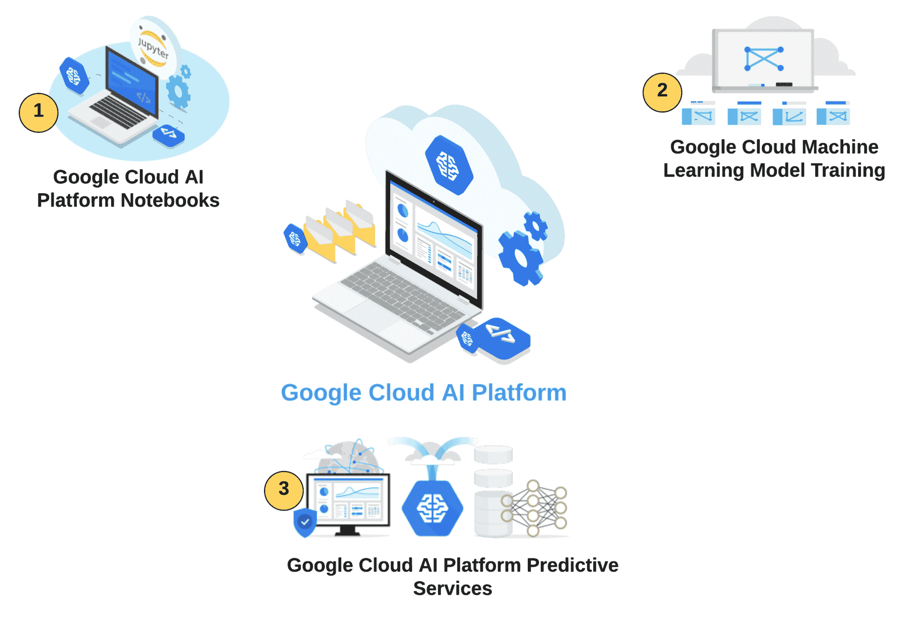

三个步骤使用 Cloud AI Platform。 如上图所示，您可以使用 Google AI Platform Notebooks，Google Cloud Machine Learning 模型训练以及 Google Cloud AI Platform Prediction 服务来构建项目。 在本章中，我们将介绍如何利用 Google AI Platform Notebooks。 我们在“第 8 章”，“使用 Cloud ML Engine 实现 TensorFlow 模型”和“第 9 章”，“构建预测应用”中介绍了 Google Cloud Machine Learning 模型的训练和预测服务。

# Google Cloud AI Platform 笔记本

**AI 平台笔记本**是一项托管服务，可提供嵌入式 **JupyterLab** 环境，设计人员和信息研究人员只需单击一下最新信息研究和 ML 框架，即可构建 JupyterLab 案例。 BigQuery，Cloud Dataproc 和 Cloud Dataflow 集成在笔记本中。 这使得处理和预处理信息易于实现。 最终，这会导致建模，训练和实现方面的信息获取更为简单。 一键部署新的 JupyterLab 案例，即可立即分析您的信息。 每个示例都预先配置了最常见的数据科学和 ML 库的优化变体。 JupyterLab 接口利用笔记本电脑，并预先安装了优化的库变体，例如 TensorFlow，PyTorch，sci-kit-learn，pandas， **SciPy** 和 **Matplotlib**。 通过添加 **CPU**， **RAM** 和 **GPU**，您可以从小处着手，然后进行扩展。 如果您的信息对于一台计算机而言太大，则可以无缝迁移到 BigQuery，Cloud Dataproc，Cloud Dataflow 和 AI Platform 预测训练等服务。

# Google AI Platform 深度学习图像

Google AI 平台笔记本为您节省了创建专门用于运行深度学习算法的计算实例的麻烦。 Google Cloud AI Platform 提供了深度学习虚拟机，这些虚拟机提供经过验证，优化和测试的操作系统映像，从而省去了为深度学习算法构建和配置计算实例的麻烦。 AI 深度学习 VM 映像平台是一系列 VM 映像，这些映像已通过基于 Debian9 的 Compute Engine 针对数据科学和 ML 进行了优化。 所有图像都预装了主要的 ML 框架和仪器，并且可以在 GPU 盒的盒子外面使用，以加快信息处理的速度。 Google Cloud AI Platform 的深度学习 VM 映像是预打包的虚拟机图片的集合，这些图片提供了深刻的，随时可运行的 ML 平台结构。

深度学习 VM 图片通过预配置依赖项，重要仪器的预安装和性能优化来帮助您为深度学习模型营造氛围。 关于 Google 平台深度学习图像，您需要注意三个重要概念。 让我们来看看。

第一个概念称为**图像系列**。 图像系列是为特定目的或特定架构预先配置的一系列图像。 Google 云端提供了各种深度学习 VM 映像系列。 每个图像系列都特定于某个 ML 框架。 Google 云提供的一些图像系列示例如下：

*   TensorFlow 系列，带有或不带有 GPU。
*   PyTorch 系列，带有或不带有 GPU。
*   Chainer 实验系列，带有或不带有 GPU。
*   一个基本或通用映像系列，您可以在其中添加或不添加 GPU 来添加首选框架。

第二个概念称为图像。 映像是虚拟机的单个蓝图。 深度学习 VM 图片是由公共计算引擎预先配置的虚拟机图片。 图像类型有两种，如下所示：

*   **自定义图像**：只有您的项目可以查看自定义图像。 这些图像是根据您正在处理的项目的需要专门定制的。 可以创建启动驱动器中的自定义图片以及其他图片。 然后，您可以使用此个性化图片生成示例。
*   **公共图像**：Google，开放源代码社区和第三方供应商提供并维护公共图像。 默认情况下，所有项目都可以访问和使用这些图像来创建实例。

您可以免费使用大多数公共图像，但也可以在项目中添加一些高级图像。 您无需为 Compute Engine 的自定义图片付费，但在维护项目中的自定义图片时会产生存储费。

第三个概念称为实例。 实例是承载 Google 基础架构的虚拟机。 预先配置的深度学习 VM 映像之一基于深度学习 VM 实例。 使用 Google Cloud Platform 控制台或命令行工具，可以生成带有图像的实例。

深度学习图像始终是使用 Google AI 平台笔记本的第一步。 如果不选择这些深度学习图像，您将无法启动这些笔记本。 在下一节中，我们将研究如何启动和运行这些笔记本。

# 创建 Google Platform AI 笔记本

让我们首先创建一个 Google Platform AI Notebook，如下所示：

1.  创建一个新实例。 以下屏幕截图显示了如何从 Google 云控制台的用户界面执行此操作：


2.  接下来，您必须选择将在 AI Notebook 的计算实例中使用的可用自定义图像或公共图像：

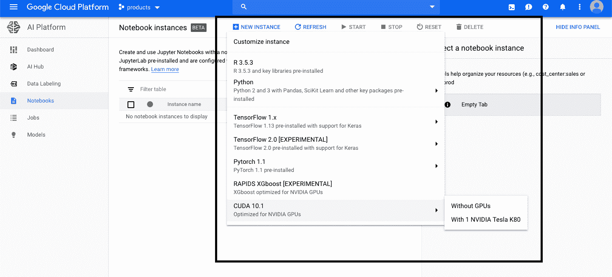

3.  选择虚拟机映像后，将显示以下屏幕，其中包含一些重要的实例信息。 您应该仔细检查它。 如果您需要更改任何内容，可以单击`CUSTOMIZE`选项，如下所示：

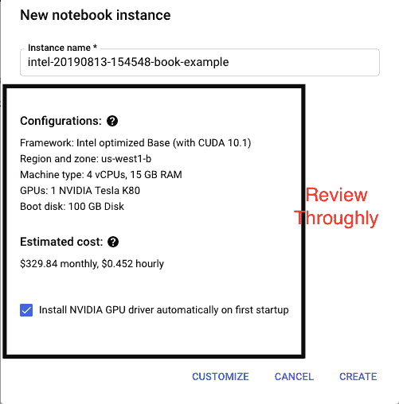

4.  自定义屏幕提供了用于更改 RAM，区域，区域等的选项，如以下屏幕截图所示：

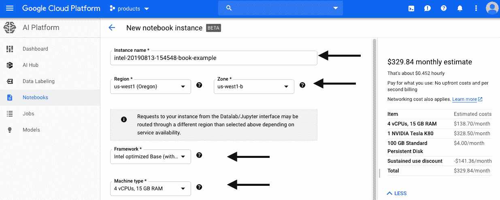

5.  您还可以在 GPU 和启动磁盘周围进行其他自定义，如以下屏幕截图所示：

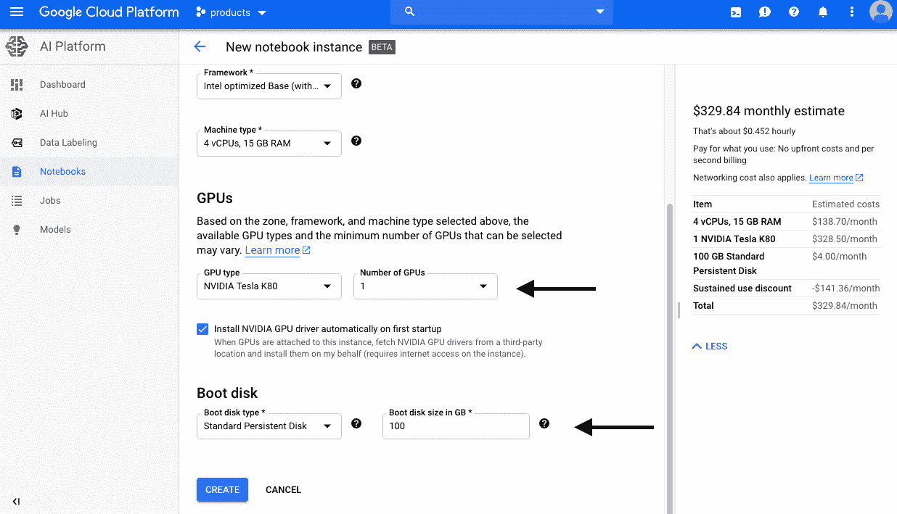

6.  创建笔记本后，它将显示在 Google Cloud AI Platform UI 的可用笔记本列表中，如以下屏幕截图所示：


7.  运行以下命令以访问您创建的 VM 实例上的 JupyterLab 用户界面。 以下命令设置端口转发：

```py
export INSTANCE_NAME="<my-instance>"
gcloud compute ssh $INSTANCE_NAME -- -L 8080:localhost:8080
```

8.  以下屏幕截图显示了 UI 的外观。 您必须在网络浏览器中输入`http://localhost:8080/lab?`才能获得此信息：

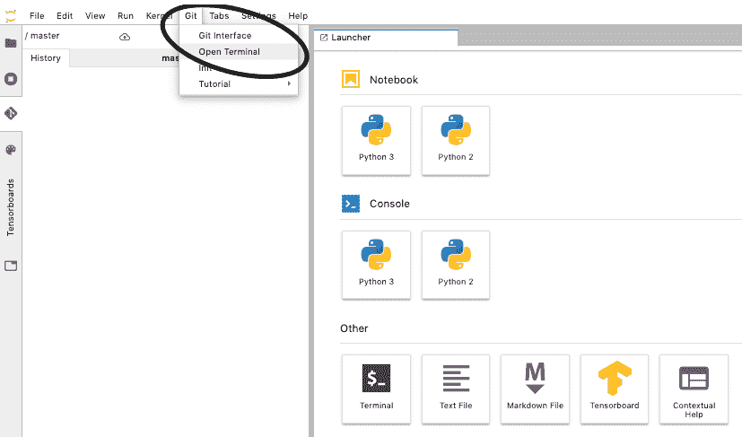

您还可以使用以下 shell 脚本自动执行此操作：

```py
#!/bin/bash
IMAGE=--image-family=tf-latest-cpu
INSTANCE_NAME=dlvm
GCP_LOGIN_NAME=<proxy@gmail.com> # CHANGE THIS
gcloud config set compute/zone us-central1-a # CHANGE THIS
echo "Launching $INSTANCE_NAME"
gcloud compute instances create ${INSTANCE_NAME} \
      --machine-type=n1-standard-2 \
      --scopes=https://www.googleapis.com/auth/cloud-platform,https://www.googleapis.com/auth/userinfo.email \
      ${IMAGE} \
      --image-project=deeplearning-platform-release \
      --boot-disk-device-name=${INSTANCE_NAME} \
      --metadata="proxy-user-mail=${GCP_LOGIN_NAME}"
echo "Looking for Jupyter URL on $INSTANCE_NAME"
while true; do
   proxy=$(gcloud compute instances describe ${INSTANCE_NAME} 2> /dev/null | grep dot-datalab-vm)
   if [ -z "$proxy" ]
   then
      echo -n "."
      sleep 1
   else
      echo "done!"
      echo "$proxy"
      break
   fi
done
```

这是此自动化脚本的伪代码：

*   定义虚拟机映像类型
*   提供 Google Cloud Platform 凭证
*   设置将在笔记本后面进行计算的计算区域
*   定义实例大小
*   遍历计算实例，并在实例上查找 Jupyter 笔记本 URL

在下一部分中，我们将探索 AI 笔记本，并学习如何将其用于特定任务。

# 使用 Google Platform AI 笔记本

您可以使用 AI Notebooks JupyterLab 平台设置本地笔记本，也可以从 Git 存储库克隆。 在用户界面中，单击顶部菜单上的 Git 图标以克隆存储库，如以下屏幕截图所示：


如我们所见，Google Cloud Platform 允许我们选择各种版本的 Python，以及一种创建特定类型的支持文件的方式：


Jupyter 笔记本允许命令行界面从 Git 存储库中提取代码。 您可以使用左窗格中的文件浏览器查看此代码。 这是一个方便的功能，使多个开发人员可以轻松无缝地进行协作。

# 自动执行 AI 笔记本

一旦开发了代码并能够基于运行时配置参数使其工作，就可以使用称为 Papermill 的库来执行和评估这些笔记本。 让我们来看看 Papermill 可以为我们做些什么：

*   该库允许您生成各种笔记本并同时运行它们。
*   Papermill 还可以帮助您收集和汇总笔记本集合中的指标。
*   它还允许您从各个地方读取或写入信息。 这意味着您可以将输出笔记本存储在另一个存储系统上，该存储系统具有更高的耐用性并更易于访问可靠的管道。
*   在撰写本文时，Papermill 最近添加了 Google Cloud Bucket 帮助。 我们将在本章中演示如何使用此新功能。

下图显示了 Papermill 如何与 Google Cloud AI Notebooks 一起使用：

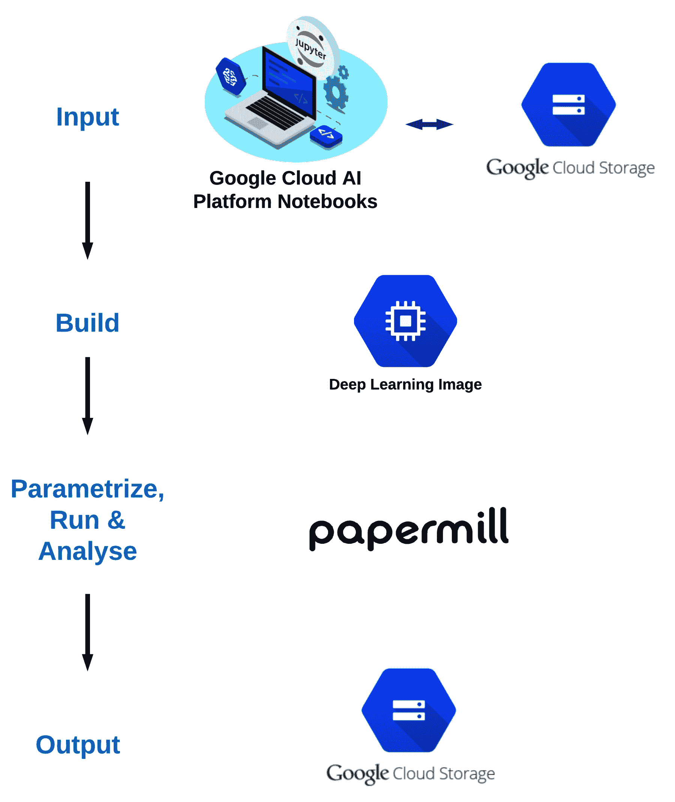

Papermill 可让您改变笔记本材料工作方式的范式。 由于 Papermill 不会更改笔记本电脑室通常缺少的原始笔记本电脑，因此我们收到的功能特征已添加到我们的工作定义中。 我们的输入（它是一个 JSON 笔记本文档）和我们的输入参数被视为不变的执行文档，这些文档会生成不变的输出文档。

该输出文档提供了已执行的代码，输出和日志，以及可随时轻松进行重做的可重复模板。 Papermill 从多个位置读取或写入的能力是它的另一个特点。 为了提供可靠的管道，我们可以将输出笔记本存储在耐用性高且易于访问的地方。 前往 Google Cloud 存储桶以存储您的输出笔记本。 这使输出笔记本隔离了文档，从而为我们的用户提供了尽可能多的支持。 这使我们可以轻松分析诸如连接到服务或 Google Cloud 的存储前缀之类的操作。

用户可以使用这些连接并调试问题，验证结果并生成新模板，而不会影响初始工作流程。 此外，由于 Papermill 管理其运行时过程，因此您不需要笔记本或其他基础结构即可针对笔记本内核执行。 这消除了我们在托管的笔记本服务的简化上下文中执行的某些复杂性。 请查看下图，以更深入地了解 Papermill 库：

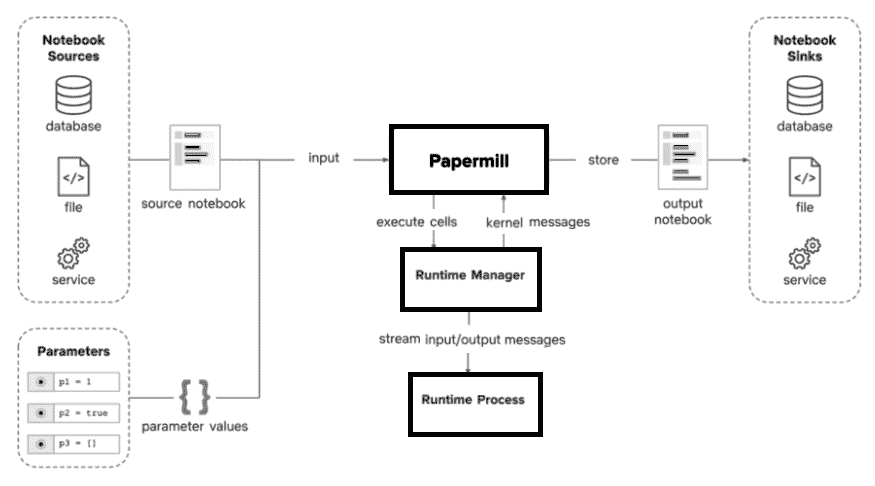

以下代码是创建深度学习 VM 的常规方法。 但是，请记住，必须选择包含要运行笔记本的关键依赖项的 VM。 如果您的笔记本需要 PyTorch，反之亦然，请不要尝试使用 TensorFlow 图片：

```py
  # Compute Engine Instance parameters
export IMAGE_FAMILY="tf-latest-cu100" 
export ZONE="us-central1-b"
export INSTANCE_NAME="notebook-executor"
export INSTANCE_TYPE="n1-standard-8"
# Notebook parameters
export INPUT_NOTEBOOK_PATH="gs://my-bucket/input.ipynb"
export OUTPUT_NOTEBOOK_PATH="gs://my-bucket/output.ipynb"
export PARAMETERS_FILE="params.yaml" # Optional
export PARAMETERS="-p batch_size 128 -p epochs 40" # Optional
export STARTUP_SCRIPT="Papermill ${INPUT_NOTEBOOK_PATH} ${OUTPUT_NOTEBOOK_PATH} -y ${PARAMETERS_FILE} ${PARAMETERS}"

gcloud compute instances create $INSTANCE_NAME \
        --zone=$ZONE \
        --image-family=$IMAGE_FAMILY \
        --image-project=deeplearning-platform-release \
        --maintenance-policy=TERMINATE \
        --accelerator='type=nvidia-tesla-t4,count=2' \
        --machine-type=$INSTANCE_TYPE \
        --boot-disk-size=100GB \
        --scopes=https://www.googleapis.com/auth/cloud-platform \
        --metadata="install-nvidia-driver=True,startup-script=${STARTUP_SCRIPT}"

gcloud --quiet compute instances delete $INSTANCE_NAME --zone $ZONE
```

前面的代码中使用的参数如下：

*   `INPUT_NOTEBOOK_PATH`：位于 Cloud Storage 存储桶中的输入笔记本； 例如`gs://my-bucket/input.ipynb`。
*   `OUTPUT_NOTEBOOK_PATH`：位于 Cloud Storage 存储桶中的输出笔记本； 例如`gs://my-bucket/input.ipynb`。
*   `PARAMETERS_FILE`：用户可以提供一个 YAML 文件，应在其中读取笔记本参数值； 例如`gs://my-bucket/params.yaml`。
*   `PARAMETERS`：用户可以通过`-p`键值传递参数以执行笔记本； 例如`-p batch_size 128 -p epochs 40`。

以下是我们选择`*cu-100`图像系列的 GPU 实例示例。 根据特定要求和版本的可用性，可以使用其他配置。 另外，我们需要提供输入和输出笔记本的路径。 将所有这些参数传递给`gcloud`命令以创建计算实例：

```py
    IMAGE_FAMILY="tf-latest-cu100" # Or use any required DLVM image.
    ZONE="us-central1-b"
    INSTANCE_NAME="notebook-executor"
    INSTANCE_TYPE="n1-standard-8"
    INPUT_NOTEBOOK_PATH=$1
    OUTPUT_NOTEBOOK_PATH=$2
    GPU_TYPE=$3
    GPU_COUNT=$4
    STARTUP_SCRIPT="Papermill ${INPUT_NOTEBOOK_PATH} ${OUTPUT_NOTEBOOK_PATH}"
    # Create DLVM
    gcloud compute instances create $INSTANCE_NAME \
        --zone=$ZONE \
        --image-family=$IMAGE_FAMILY \
        --image-project=deeplearning-platform-release \
        --maintenance-policy=TERMINATE \
        --accelerator="type=nvidia-tesla-${GPU_TYPE},count=${GPU_COUNT}" \
        --machine-type=$INSTANCE_TYPE \
        --boot-disk-size=100GB \
        --scopes=https://www.googleapis.com/auth/cloud-platform \ --metadata="install-nvidia-driver=True,startup-script=${STARTUP_SCRIPT}"
    gcloud --quiet compute instances delete $INSTANCE_NAME --zone $ZONE
```

以下是一个 CPU 实例示例。 这类似于使用 GPU 购买虚拟机。 我们需要选择适当的映像系列，即`*-cpu`，并提供类似的参数以使用`gcloud`命令启动实例：

```py

    IMAGE_FAMILY="tf-latest-cpu" # Or use any required DLVM image.
    ZONE="us-central1-b"
    INSTANCE_NAME="notebook-executor"
    INSTANCE_TYPE="n1-standard-8"
    INPUT_NOTEBOOK_PATH=$1
    OUTPUT_NOTEBOOK_PATH=$2
    STARTUP_SCRIPT="Papermill ${INPUT_NOTEBOOK_PATH} ${OUTPUT_NOTEBOOK_PATH}"
    # Create DLVM
    gcloud compute instances create $INSTANCE_NAME \
        --zone=$ZONE \
        --image-family=$IMAGE_FAMILY \
        --image-project=deeplearning-platform-release \
        --machine-type=$INSTANCE_TYPE \
        --boot-disk-size=100GB \
        --scopes=https://www.googleapis.com/auth/cloud-platform \
        --metadata="startup-script=${STARTUP_SCRIPT}"
    gcloud --quiet compute instances delete $INSTANCE_NAME --zone $ZONE

```

启动脚本执行以下操作：

1.  使用 TensorFlow 深度学习 VM 和两个 NVIDIA Tesla T4 GPU 创建一个 Compute Engine 实例。
2.  安装 NVIDIA GPU 驱动程序。
3.  使用 Papermill 工具执行笔记本。
4.  将笔记本的结果（所有单元格都已预先计算）上载到 Cloud Storage 存储桶，在本例中为`gs://my-bucket/`。
5.  每个单元执行后，Papermill 发出一个保存。 这可能会产生 429 个“太多请求”错误，这些错误由库本身处理。
6.  终止 Compute Engine 实例。

如果要查看启动脚本的完整代码，[请查看以下链接](https://shorturl.at/tBJ12)。

希望您现在对 Papermill 库有了很好的了解。 您需要完成以下步骤，以完成在生产环境中使用 AI 笔记本的过程。 我们在这里谨慎地介绍了这些步骤，但是也最好在合并列表中显示它们：

1.  使用 Google AI 笔记本开发代码
2.  安排和自动进行深度学习 VM 映像配置
3.  安排和自动化 Jupyter 笔记本

# Keras 框架概述

Keras 是 Python 的深度学习框架，可以帮助我们识别和训练几乎任何类型的深度学习模型。 对于科学家而言，Keras 的创建是为了进行快速实验。 这是一个在 TensorFlow 或 Theano 上运行的开源 Python 库。 让我们看一下 Keras 及其功能：

*   它是模块化，快速且易于使用的。
*   它是由 Google 工程师 FrançoisChollet 设计的。
*   Keras 不处理低级计算。 相反，他们使用另一个名为后端的库来执行工作。 因此，Keras 是具有低级 API 的高级 API 包装器，可以在 TensorFlow，CNTK 或 Theano 之上运行。
*   Keras 的高级 API 处理我们如何创建模型，定义级别或设置各种输入输出模型。 它允许相同的代码在 CPU 或 GPU 上无缝运行。
*   Keras 具有一些主要的重要特征。 它具有易于使用的 API 来快速构建深度学习模型的原型。
*   它支持卷积（PC 视觉）网络，递归（序列）网络及其任意组合。
*   它包含各种任意的网络架构。 支持多输入或多输出，层共享，模型共享等。 这包括多个模型。
*   Keras 本质上非常适合构建深度学习模型，从生成的对手网络到图灵机。
*   Keras 是一个模型库，为深入的教育系统的发展提供了高级构建块。
*   它不处理低级活动，例如张量的操纵和微分。 取而代之的是，它依赖于经过优化的专用张量库，该张量库可用作 Keras 的主干电机。

Keras 不用选择单个张量库，而是以模块化的方式管理此问题，并将 Keras 与该库联系在一起。 多个后端电机可以无缝插入 Keras。 TensorFlow 后端，Theano 后端和 Microsoft **认知工具包**（**CNTK**）后端目前是当前的三种后端实现。 Keras 将来将能够与更多的深度学习引擎一起使用。

Keras 的构建是为了与 Python 配合使用，因此它易于使用，模块化且易于扩展。 该 API 是为人而不是机器而设计的，并且遵循减少认知负载的最​​佳实践。 所有这些独立的模块都可以组合起来，以生成新的模型，神经层，成本功能，优化器，初始化方案，激活函数和正则化系统。 有了新的类和功能，可以轻松添加新模型。 描述的是 Python 代码中的模型，而不是用于模型设置的不同文件。

使用 Keras 的主要原因来自其指南，主要是它易于使用。 Keras 提供的优势包括广泛接受，支持广泛的制造部署，至少包含五种支持电机（TensorFlow，CNTK，Theano，MXNet 和 PlaidML），以及对各种 GPU 和分布式训练的强大支持。 易于教学和易于模型开发。 此外，Google，Microsoft，Amazon，Apple，Nvidia，Uber 等都支持 Keras。

Keras 本身并不像张量积和卷积那样在较低级别上运行。 相反，它取决于后端电动机。 虽然 Keras 支持多个后端马达，但它使用 TensorFlow 作为主要（默认）后端，并使用 Google 作为主要风扇。 如前所述，Keras API 在 TensorFlow 中打包为`tf.keras`，现在是 TensorFlow 2.0 中的主要 TensorFlow API。 这是一个如何使用 Keras 框架使用 MNIST 数据集进行图像分类的基本示例：

```py
import keras
keras.__version__

from keras.datasets import mnist

(train_images, train_labels), (test_images, test_labels) = mnist.load_data()

train_images.shape

len(train_labels)

train_labels

test_images.shape

len(test_labels)

test_labels

from keras import models
from keras import layers

network = models.Sequential()
network.add(layers.Dense(512, activation='relu', input_shape=(28 * 28,)))
network.add(layers.Dense(10, activation='softmax'))

network.compile(optimizer='rmsprop',
                loss='categorical_crossentropy',
                metrics=['accuracy'])

train_images = train_images.reshape((60000, 28 * 28))
train_images = train_images.astype('float32') / 255

test_images = test_images.reshape((10000, 28 * 28))
test_images = test_images.astype('float32') / 255

from keras.utils import to_categorical

train_labels = to_categorical(train_labels)
test_labels = to_categorical(test_labels)

network.fit(train_images, train_labels, epochs=5, batch_size=128)

test_loss, test_acc = network.evaluate(test_images, test_labels)

print('test_acc:', test_acc)
```

在前面的代码中，我们通过将图像重塑为像素矩阵来加载图像数据集并使用 Keras 库训练图像。 通过神经网络以五次迭代（历元）对神经网络进行 128 批量的训练。 训练和测试标签在输入到神经网络之前会被转换为分类变量。 `network.fit`方法为训练数据集训练神经网络，而`network.evaluate`方法用于评估模型的精度参数。 最后，打印精度参数以进行分析。 如果发现模型的准确率高于阈值，则将其用于对新数据集运行预测。

这是前面代码的输出：

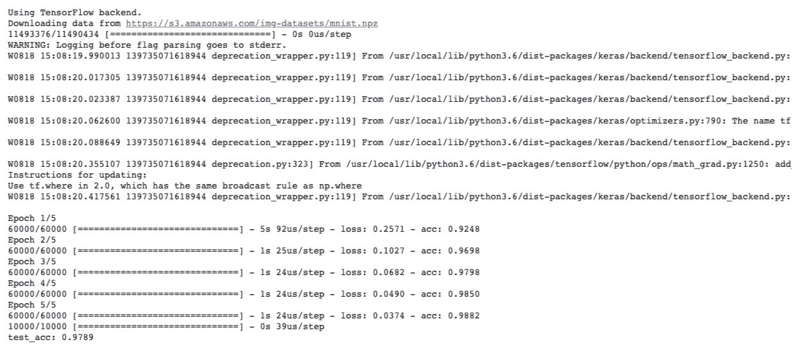

如我们所见，通过神经网络进行了五次迭代，每次迭代，我们在评估数据集上的准确率更高。

# 使用 Keras 框架训练模型

在本节中，我们将介绍另一个使用 Keras 框架训练神经网络的代码示例。 要运行此代码，我们需要访问以下库：

*   `os`：这提供了各种依赖于操作系统的功能。
*   `glob`：该模块非常适合使用 UNIX shell 参数。
*   `numpy`：该库用于基本的数学功能。

[以下链接提供了使用 Keras 训练神经网络的必要代码](https://shorturl.at/pwGIX)。

前面链接中引用的代码从磁盘加载训练数据，并将其分为训练和评估集。 该模型的结构从 Keras 顺序模型开始，并在我们向其提供训练数据之前将各种层添加到网络。 最后，`model.fit`方法用于通过五个迭代（时期）以 256 个批量训练数据。

以下屏幕快照显示了不同代码段的输出结果：

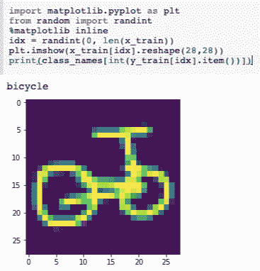

如我们所见，该模型基于用于训练的训练数据图像将图像分类为`bicycle`。

现在，让我们看一下神经网络的结构，以及通过神经网络进行的每次迭代输出如何变化。 输出形状定义了神经网络结构，我们可以根据评估结果通过将参数值传递到 Keras 库来对其进行配置：

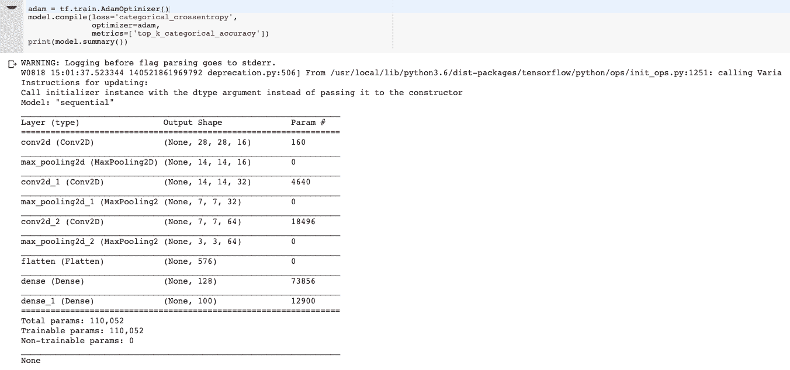

现在，让我们看一下使用带有 TensorFlow 背景的 Keras 库训练模型的输出。 我们已经配置了训练，以使其经过 5 次迭代（历时）进行处理。 如我们所见，模型的准确率随着每次迭代而增加。 一旦我们对模型进行了足够的训练，使其准确率超过设置的阈值，就可以使用该模型对新记录进行分类：


现在，我们可以使用此模型来预测新数据点。 该预测将根据提供的训练数据输出班级：

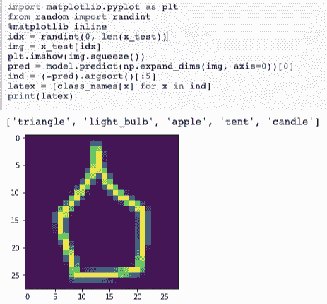

至此，我们已经使用 Keras 完成了模型训练，评估和预测步骤。 我们还可以可视化模型在各个时期的性能以及使用`matplot`库如何通过模型优化损失函数：

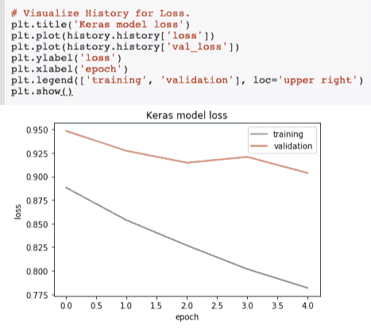

前面的屏幕快照显示了如何使用 Keras 在模型的训练迭代中将训练和验证损失最小化。

# 使用 Google AI 平台训练模型

在上一节中，您学习了如何使用 Keras 框架训练模型。 在本节中，我们将在 Google Cloud AI Platform 上训练相同的模型。 核心代码库将保持不变，但是训练模型的方式将有所不同。 让我们开始吧：

1.  您要做的第一件事是设置代码的目录结构。 确保根据 Google Cloud AI 平台的要求命名文件。 看起来像这样：


2.  需要将其他代码添加到前面的代码中，以确保将模型保存到 Google Cloud 存储桶中。 该代码如下：

```py
PROJECT_ID="<project_id>" #change this
BUCKET_ID="ml_assets"
JOB_NAME = 'my_first_keras_job'
JOB_DIR = 'gs://' + BUCKET_ID + '/keras-job-dir'
REGION="<REGION>" #change this
! gsutil ls -al gs://$BUCKET_ID
print(JOB_DIR)
export_path = tf.contrib.saved_model.save_keras_model(model, JOB_DIR + '/keras_export')
print("Model exported to: ", export_path)
#Verify model is created
! gsutil ls -al $JOB_DIR/keras_export

```

以下屏幕截图显示了上述代码的输出：

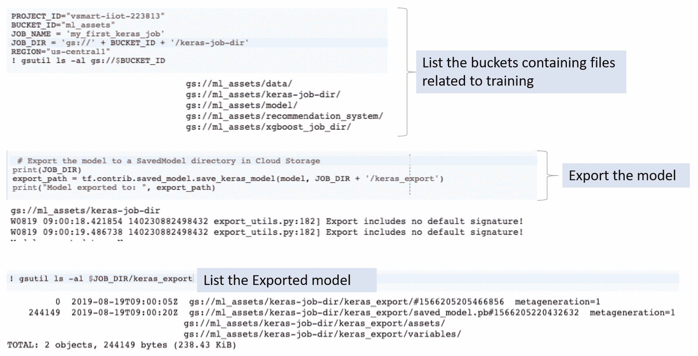

3.  让我们来看看 Google Cloud 控制台窗口中的存储桶：


4.  最后，您必须以以下`gcloud` AI 平台命令的形式提交训练工作：

```py
#!/bin/sh
PROJECT_ID="<project-id>" #change this
BUCKET_ID="ml_assets"
JOB_NAME='my_keras_job'
JOB_DIR='gs://$BUCKET_ID/keras-job-dir'
REGION="us-central1" #change this
gcloud config set project $PROJECT_ID
gcloud ai-platform jobs submit training $JOB_NAME \
  --package-path trainer/ \
  --module-name trainer.task \
  --region $REGION \
  --python-version 3.5 \
  --runtime-version 1.13 \
  --job-dir $JOB_DIR \
  --stream-logs
```

上一条命令的输出如下：

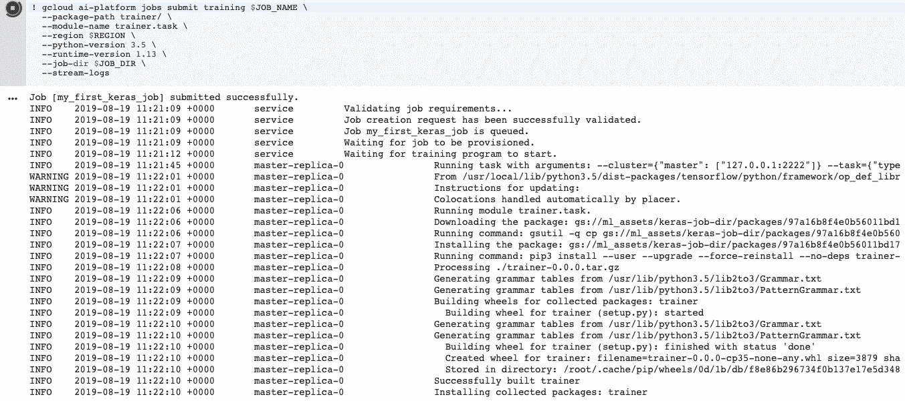

5.  此外，我们可以使用 Google Cloud 控制台可视化正在运行的作业，如下所示：


Google Cloud Platform 会存储过程日志，以便于监视和故障排除。 我们可以通过控制台窗口中的 Stackdrive Logging 访问这些日志，如下所示：

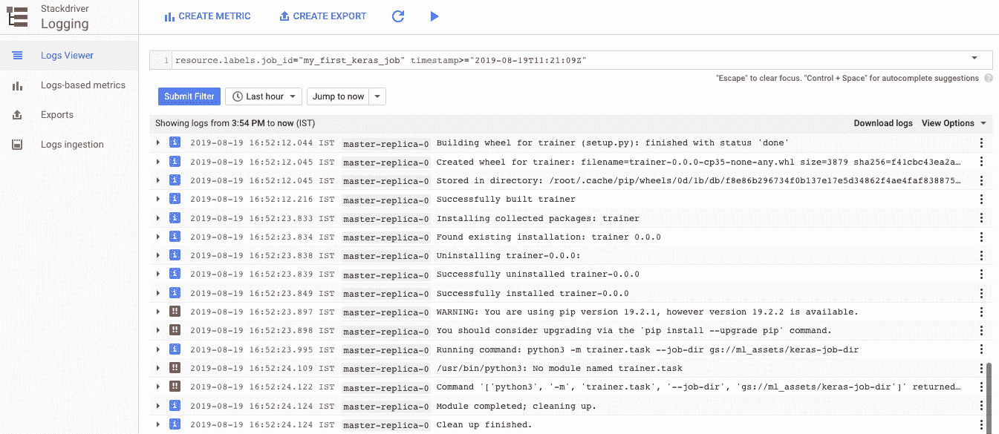

现在我们的训练工作已经成功，我们可以将保存的 ML 模型用于在线和离线预测。 接下来我们将看这个。

# 使用 Cloud Machine Learning Engine 的异步批量预测

为了使用上一节中训练和导出的模型来提供在线预测，我们必须在 AI 平台中创建模型资源，并在其中创建版本资源。 版本资源是合格模型有效地用于提供预测的资源。 使用此框架，您可以多次调整，重新训练和管理 AI 平台中的所有版本。

模型或版本是已存储在 AI 平台的模型服务中的高级学习解决方案的示例。 您可以使用已训练的标准模型（作为保存的模型）进行发布。 您也可以在创建版本时提供自定义代码（测试版）来处理预测。 让我们来看看：

1.  以下命令在 Google Cloud AI Platform 中创建模型版本：

```py
MODEL_NAME = "keras_model"

! gcloud ai-platform models create $MODEL_NAME \
  --regions $REGION
```

上一条命令的输出如下：


2.  使用以下命令创建下一个模型版本：

```py
MODEL_VERSION = "v1"

# Get a list of directories in the `keras_export` parent directory
KERAS_EXPORT_DIRS = ! gsutil ls $JOB_DIR/keras_export/

# Pick the directory with the latest timestamp, in case you've trained
# multiple times
SAVED_MODEL_PATH = KERAS_EXPORT_DIRS[-1]

# Create model version based on that SavedModel directory
! gcloud ai-platform versions create $MODEL_VERSION \
  --model $MODEL_NAME \
  --runtime-version 1.13 \
  --python-version 3.5 \
  --framework tensorflow \
  --origin $SAVED_MODEL_PATH
```

以下是 Google Cloud UI 的输出：


以下屏幕截图显示了 Keras 模型的版本详细信息：

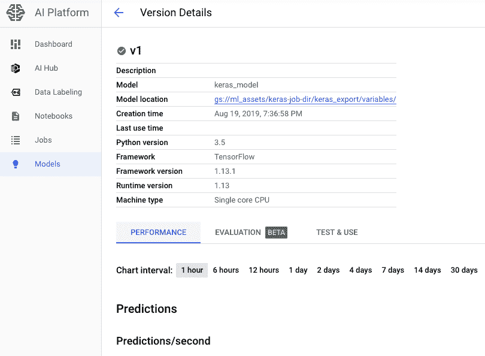

3.  现在，您已经创建了预测模型版本，您需要创建用于批量预测的 Python 脚本。 首先以以下代码中所示的格式创建预测输入 JSON：

```py
{
  "dataFormat": enum (DataFormat),
  "outputDataFormat": enum (DataFormat),
  "inputPaths": [
    string
  ],
  "maxWorkerCount": string,
  "region": string,
  "runtimeVersion": string,
  "batchSize": string,
  "signatureName": string,

  // Union field model_version can be only one of the following:
  "modelName": string,
  "versionName": string,
  "uri": string
  // End of list of possible types for union field model_version.
  "outputPath": string
}
```

让我们回顾一下前面代码中使用的每个参数：

*   **数据格式**：用于输入文件进行预测的格式类型。 对于特定任务，所有输入文件必须具有相同的信息格式。 它可以是 JSON，`TF_Record`或`TF_Record_GZIP`格式。
*   **输出数据格式**：用于预测输出文件的格式类型。
*   **输入路径**：需要存储在 Google Cloud 存储中的输入数据文件的 URI。
*   **输出路径**：云中要通过提供预测服务保存输出的位置。 您的项目需要被允许写到这个地方。
*   **模型名称和版本名称**：您希望从中接收投影的型号名称和版本。 如果未指定版本，则使用模型的默认版本。 如果愿意，可以使用未部署的 SavedModel Cloud 存储路径，称为 Model URI。

*   **模型 URI**：您要从中接收投影的模型名称和版本。 如果未指定版本，则使用模型的默认版本。 如果愿意，可以使用未部署的 SavedModel Cloud 存储路径，称为 Model URI。

*   **区域**：Google Compute Engine 将在其中运行您的工作的区域。 为了执行预测任务并保存输入和输出信息以获取非常广泛的信息，所有内容都需要在同一区域中设置。

*   **最大工作器数（可选）**：处理集群中用于此任务的最大预测节点数。 您可以通过这种方式为自动批量预测缩放功能设置上限。 如果不设置值，则默认为 10。

*   **运行时版本（可选）**：使用的 AI 平台的版本。 包含此选项以允许您指定要与 AI Platform 模型一起使用的运行时版本。 对于已部署的模型版本，应始终忽略此值，以告知服务使用在部署模型版本时指定的相同版本。

*   **签名名称（可选）**：如果您保存的模型具有各种签名，则可以选择由 TensorFlow SavedModel 标识的备用输入/输出映射，以指定自定义 TensorFlow 签名名称。

4.  以下 Python 代码代表了如何构建 JSON 主体：

```py
import time
import re

def make_batch_job_body(project_name, input_paths, output_path,
 model_name, region, data_format='JSON',
 version_name=None, max_worker_count=None,
 runtime_version=None):

 project_id = 'projects/{}'.format(project_name)
 model_id = '{}/models/{}'.format(project_id, model_name)
 if version_name:
 version_id = '{}/versions/{}'.format(model_id, version_name)
```

5.  以`model_name_batch_predict_YYYYMMDD_HHMMSS`格式制作`jobName`：

```py
timestamp = time.strftime('%Y%m%d_%H%M%S', time.gmtime())

    # Make sure the project name is formatted correctly to work as the basis
    # of a valid job name.
    clean_project_name = re.sub(r'\W+', '_', project_name)

    job_id = '{}_{}_{}'.format(clean_project_name, model_name,
                           timestamp)
```

6.  开始使用所需信息构建请求字典：

```py
body = {'jobId': job_id,
            'predictionInput': {
                'dataFormat': data_format,
                'inputPaths': input_paths,
                'outputPath': output_path,
                'region': region}}   
```

7.  使用版本（如果存在）或模型（默认版本）（如果不存在）：

```py
if version_name:
 body['predictionInput']['versionName'] = version_id
 else:
 body['predictionInput']['modelName'] = model_id   
```

8.  如果指定，则仅包括最大数量的工作程序或运行时版本。 否则，让服务使用其默认值：

```py
 if max_worker_count:
        body['predictionInput']['maxWorkerCount'] = max_worker_count

    if runtime_version:
        body['predictionInput']['runtimeVersion'] = runtime_version

    return body
```

9.  同样，用于调用 Prediction API 的 Python 代码如下：

```py
    import googleapiclient.discovery as discovery

    project_id = 'projects/{}'.format(project_name)

    ml = discovery.build('ml', 'v1')
    request = ml.projects().jobs().create(parent=project_id,
                                          body=batch_predict_body)

    try:
        response = request.execute()

        print('Job requested.')

        # The state returned will almost always be QUEUED.
        print('state : {}'.format(response['state']))

    except errors.HttpError as err:
        # Something went wrong, print out some information.
        print('There was an error getting the prediction results.' +
              'Check the details:')
        print(err._get_reason())
```

前面的代码通过`request.execute()`方法调用发送预测请求，该请求以异步方式执行批量预测作业。

在下一节中，我们将研究使用 Cloud Machine Learning Engine 的实时预测，该引擎将范例转换为 Google Cloud Platform 上的完全无服务器的 ML。

# 使用 Cloud Machine Learning Engine 的实时预测

优化了在线预测，以最小化服务预测的延迟。 每个请求我们可以处理一个或多个实例。 在线预测在响应消息中作为输入数据返回，该输入数据直接作为 JSON 字符串传递。 它将尽快返回。 在响应应用输入进行请求或在其他需要及时推断的情况下，通常应使用在线预测。 批量预测有其自身的缺点。 如果使用单个模型和少量输入实例，则可以看到使用在线预测与批量预测完成相同的预测请求所需的时间有相当大的差异。 几乎立即完成由互联网请求返回的预测可能要花费大量时间。 这是两种预测技术所使用的各种设施的副作用。 在创建应用时，AI 平台会分配并初始化批量预测资源。 通常，已准备好在线预测，以便可以在需要时进行处理。 您可以通过[这里](https://github.com/PacktPublishing/Hands-On-Artificial-Intelligence-on-Google-Cloud-Platform)了解有关在线预测的更多信息。

前面的链接告诉我们，使用 Google Cloud Platform 上的简单且一致的 API 可以轻松地与 ML 引擎进行交互。 该 API 可用于实时预测，因为它具有很高的吞吐量和使用底层弹性计算能力的效率，而所有这些功能均由 Google Cloud Platform 启用。

# 总结

在本章中，我们通过一个实际的示例用例演示了 Keras 与 Google Cloud Platform 的结合使用。 我们了解了如何使用云机器学习引擎。 Keras 是一个用 Python 编写的开源神经网络库。 它可以在 Microsoft Cognitive Toolkit，TensorFlow 或 Theano 上运行。 我们看到 Keras 支持卷积网络，循环网络以及两者的组合。 展望未来，我们使用 Cloud Machine Learning Engine 执行了异步批量预测和实时预测。

在下一章中，我们将学习 DialogFlow，它用于构建界面（例如对话式 IVR 和聊天机器人），以实现企业和用户之间的交互。