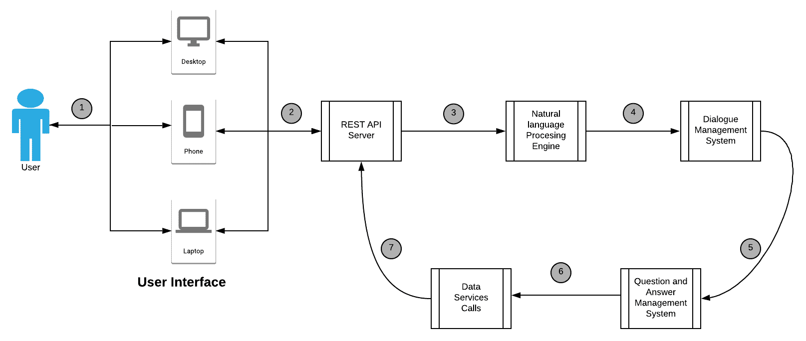
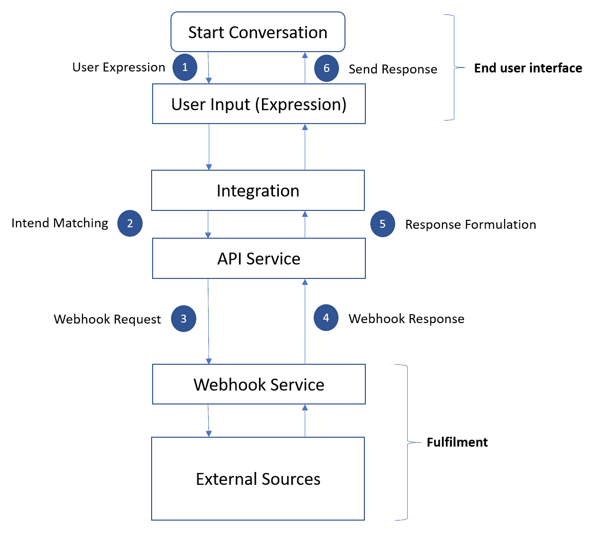
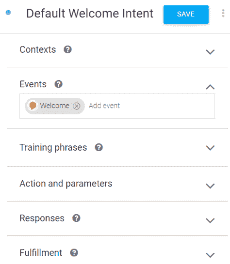
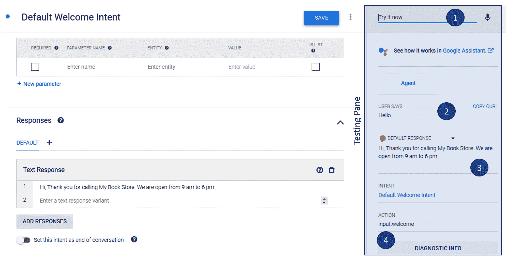
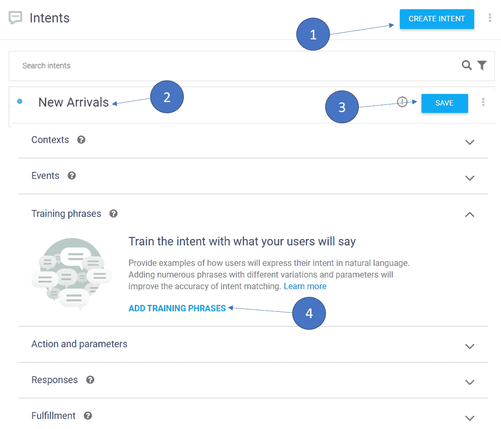
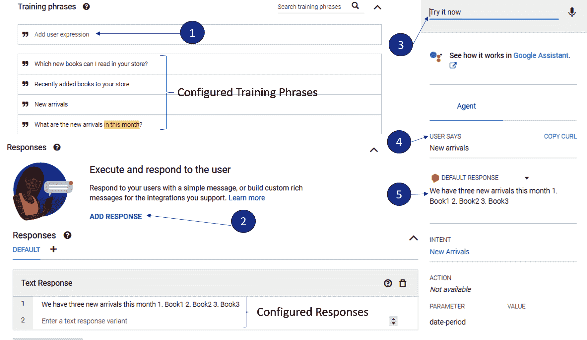
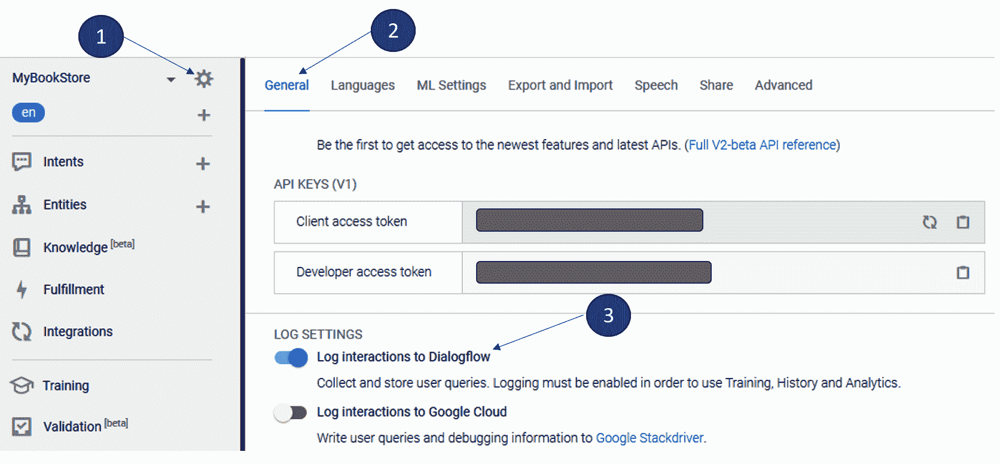
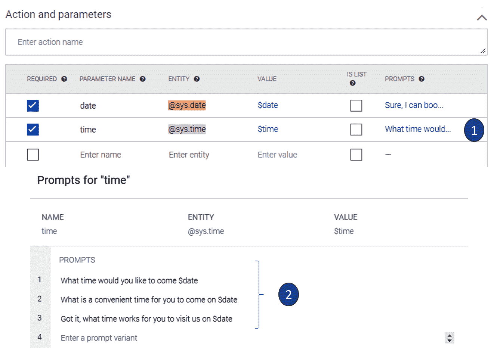

# 使用 DialogFlow 的智能对话应用程序

**人工智能**（**AI**）不断改变着我们搜索和处理事物的方式，而聊天机器人是人们渴望摆脱自己不想做的事情的真实例证。 通过他们自己。 人工智能驱动的聊天机器人可以在不涉及人类的情况下完成出色的工作。 聊天机器人是一个智能聊天程序。 它应该能够令人信服地模拟一个人。 与 AI 技术结合使用时，它称为智能聊天机器人。

聊天机器人的最常见实例是某些公司使用的客户支持系统。 它已经发展为可以进行 70-80％的对话，而公司中没有实际的人与客户进行对话。 银行和金融市场已经在大量使用聊天机器人来处理客户请求并迅速协助他们进行银行交易。 出于完全相同的原因，云提供商正在提供聊天机器人平台，以缩短产品上市时间。 在本章中，我们将学习如何使用名为 DialogFlow 的 **Google Cloud Platform** （**GCP**）服务构建会话应用程序。 DialogFlow 提供了一种轻松的方法来为企业构建会话应用程序，并可以大大节省运营成本。 在本章中，我们将学习 DialogFlow 的核心概念，并通过一个示例说明如何构建对话应用程序。

以下是本章将涉及的主题：

*   DialogFlow 简介
*   构建一个 DialogFlow 代理
*   使用 DialogFlow 执行音频情感分析

# DialogFlow 简介

在开始 DialogFlow 之前，我们需要从高层次了解如何使用不同的技术来增强智能聊天机器人系统的功能。 大多数聊天机器人是电子邮件或对话的一种界面，其中机器人会响应您的文本，而不是人。 这些聊天机器人在包含应用程序的上下文中运行。 但是，捕获集中在您与之通信的用户界面层周围。 人类与机器人的对话是由**机器学习**（**ML**）算法驱动的，该算法将您的消息分解为具有**自然语言理解能力的自然语言**（**NLU**）方法并以与任何人都可以期望的方式相当的方式回答查询。

# 了解 DialogFlow 的构建基块

让我们通过查看 DialogFlow 的高级体系结构来了解对话应用程序的各种构建块。

下图从高层表示了任何聊天机器人应用程序的不同组件：



图 6.1：聊天机器人应用程序的组件

系统的独立构建块需要在一段时间内进行微调和即兴创作，并且需要不断的反馈和培训循环。 在某些情况下，基于对一组已知输入的一组预定义响应来构建会话应用程序。 显然，这些系统无法提供类似于人的体验，并且缺乏自然的对话风格。 DialogFlow 抽象了许多此类过程，并允许应用程序开发人员通过简单易用的界面专注于对话框的上下文和语义。

该引擎还利用了不断增强的 ML 模型来支持其他意图，实体和上下文。 在本节中，我们将学习 DialogFlow 的各种构造块和接口，如以下列表所示：

*   **DialogFlow 代理：**简而言之，此组件类似于需要培训才能处理用户呼叫的人工代理。 例如，一家银行的呼叫中心员工需要了解他们在接听客户电话时将会遇到的一些基本工作流程，术语和常见情况。 但是，培训不能满足所有可能的问题和会话分支。 代理需要了解上下文中的意图，并在信息不足以满足客户查询的情况下以最佳选择或首要问题做出回应。 与人工代理类似，DialogFlow 代理是一个复制人工代理并以一定程度的模糊性理解自然语言的模块。 作为 DialogFlow 应用程序开发人员，我们需要设计和开发 DialogFlow 代理，以处理预期应用程序上下文中的对话。
*   **DialogFlow 意图**：一旦代理将文本转换成段，便会标记和标记某些关键字以了解代理上下文中的意图。 与人类对话一样，DialogFlow 代理和另一端的人类用户轮流进行对话，以使其成为有意义的对话。 从该人那里收集到的信息又称为**最终用户表示。** DialogFlow 代理需要经过培训，以将最终用户表达与预配置的意图匹配-此过程称为**意图分类**。 例如，如果我们正在设计一个 DialogFlow 代理来处理餐厅的预订，则该代理需要响应与菜单，时间安排和预订有关的用户问题和查询。 这称为对话的上下文，并且代理需要在餐厅预订的上下文中对用户的意图进行分类。 基于意图分类，代理要么通过从用户那里寻求其他信息来进行响应，要么查询应用程序的后端以找到问题的答案。 该意图包含以下组件：
    *   **训练短语**：这些是代理在应用程序上下文内的对话中寻找的预定义关键字集。 DialogFlow 使用基于主要短语集的本体映射，应用程序开发人员使用这些短语来扩展代理的词汇表。 这意味着应用程序开发人员无需针对所有可能的意图关键字和短语训练代理。 DialogFlow 引擎在内部增强了代理上下文中可能的一组意图表达。
    *   **动作**：应用程序开发人员可以为意图定义动作。 这些动作需要在系统中预定义和配置。 这些动作可能是对基础数据集进行修改的特定活动，也可能是代理在下一个会话输出中提出的主要问题。 例如，在酒店预订系统的情况下，如果最终用户的意图被理解为针对特定人数的特定时间的预订，则代理商可以继续进行并触发预订餐桌的动作。 如果代理商需要其他信息以了解预订时间，则可以提出补充问题。
    *   **参数**：在应用程序的上下文中验证了意图，并且 DialogFlow 提取最终用户表达式作为参数。 每个参数都是实体的预定义类型。 DialogFlow 提供的系统实体与会话数据类型匹配。 系统实体匹配日期，参数值，范围，电子邮件 ID 等。 此时的参数定义了如何从最终用户中提取数据。 参数是可用于构建逻辑表达式的结构化数据构造。
    *   **响应**：应用程序开发人员可以根据上下文，意图和派生给最终用户的动作定义响应。 根据上下文，座席可以结束对话，采取预期的操作或提出问题以收集其他信息。
*   **DialogFlow 实体**：当代理从最终用户对话中提取意图时，它将映射到一个实体。 实体将语义含义与关键字相关联。 DialogFlow 提供了一组系统实体，它们是跨各种上下文（例如，数量和单位，日期和时间等）的通用对话实体。 DialogFlow 还提供了用于定义开发人员实体的接口。 这些是特定于上下文的自定义实体，应用程序开发人员可以创建这些实体，以使代理理解应用程序上下文中的对话。 例如，可以用映射到餐厅所服务的特定菜单项的开发者实体来训练餐厅预订代理。

*   **DialogFlow 上下文**：类似于人机交互，DialogFlow 对话发生在上下文中。 该应用程序适合特定的业务场景，因此需要在应用程序的上下文中理解关键字。 重要的是，要使意图与应用程序的上下文正确匹配，以使对话有意义。 通过使用上下文，可以在特定方向上构建对话。 有两种类型的上下文需要解决：
    *   **输入上下文**：当最终用户表达式在上下文中是紧密匹配时，这允许 DialogFlow 匹配意图。
    *   **输出上下文**：如果用户表达式在当前上下文中不紧密匹配，则 DialogFlow 可以激活新的上下文。 例如，如果最终用户说*菜单上是什么？* ，将触发输出上下文，并询问特定问题以进一步阐明，例如*素食还是非素食菜单？* 根据用户的选择，将激活特定的上下文，并且 DialogFlow 会详细说明这些选项。 在对话中的任何给定点，可以激活多个输出上下文。 这样可以对输出进行更好的控制，从而使对话朝着预期的方向发展。 可以基于用户响应来确定此时的上下文。 在这种情况下，如果用户选择*素食者*，则可以将素食菜单中的项目提供给用户。 输出上下文具有生命周期，并且在匹配意图后 5 个请求或 20 分钟后过期。
*   **跟进意图**：我们可以使用跟进意图来设置各种意图的上下文。 父母意愿与跟进意愿之间存在亲子关系。 在对话的上下文中可以创建嵌套的后续意图层次结构。 DialogFlow 提供了一组预定义的后续意图，这些意图表示对话期间使用的大多数表达式。 该平台还提供了一种定义自定义跟进意图的方式，以实现更精细的控制和对话流程。 这是 DialogFlow 提供的所有后续意图的标题列表：
    *   **后备**：当基于用户的输入不清楚意图和上下文时，这是一个表达式。
    *   **是/否**：捕获对后续问题的肯定/否定反应。
    *   **之后**：这链接到用户打算在不久的将来某个时间发生的定时事件。
    *   **取消**：这通常适用于特定动作或事件的取消。 通常，会话在这一点上趋向于关闭意图或遵循替代路径。
    *   **更多**：当用户需要更多信息或 DialogFlow 代理需要来自调用者的其他信息以实现意图时，使用此选项。
    *   **下一个/上一个**：在处理一组可能的选项时使用。 例如，如果对话是关于菜单项的，则调用者和 DialogFlow 代理可以使用此后续意图导航到下一个或上一个可能的选项。
    *   **重复**：用于重复对话。
    *   **选择编号**：这是选择编号选项时使用的跟进意图。
*   **DialogFlow 事件**：使用 DialogFlow 事件，代理可以响应外部事件触发对话流。 外部事件在上下文中称为非对话输入。 例如，电子邮件，社交媒体消息或对特定号码的电话的接收可以配置为外部事件。 DialogFlow 代理可以配置为侦听此类事件，并根据特定事件采取对话路径。 DialogFlow 上有一些可用的预定义平台事件。 这些是在集成平台上发生的事件。 这是 DialogFlow 支持的平台事件的代表性列表：
    *   `TELEPHONY_WELCOME`：当收到使用 DialogFlow 注册的电话号码的呼叫时，将生成此事件。
    *   `ALEXA_WELCOME`：当用户开始与特定技能进行交互时，将生成此事件。
    *   `MEDIA_STATUS`：根据特定媒体文件的状态（例如，音频文件的播放完成时）生成此事件。 可以在此类媒体状态事件上触发 DialogFlow 操作。
    *   `SIGN_IN`：当用户登录到集成服务（Twitter，Google 等）时，将生成此事件。 在这种情况下，可以触发对话流程。

*   **DialogFlow 实现**：有时候，对话需要来自外部源的数据才能提供用户所需的信息。 在这种情况下，DialogFlow 提供了一个实现接口，以将请求派生到外部源（例如数据库和 API），并请求特定的数据点。 从外部服务接收到数据后，DialogFlow 会将数据集成到会话的意图和上下文中，并将响应提供给调用方。 可以针对每个意图启用实现设置。 如果未定义实现，则 DialogFlow 使用在意图内定义的静态响应。 通过 Webhook 服务启用与实现代理的交互。 Webhook 使集成两个异构应用程序变得容易。 DialogFlow 将上下文和意图数据序列化到 Webhook 服务。 Webhook 服务依次调用外部 API 端点或访问数据库以获取所请求的信息。 这是定义 DialogFlow 请求生命周期的工作流程，该请求需要通过履行服务使用外部源数据：



图 6.2：通过履行服务的 DialogFlow 请求的生命周期

在介绍了 DialogFlow 核心概念之后，在下一部分中，我们将研究在平台上构建 DialogFlow 代理的过程。

# 构建一个 DialogFlow 代理

作为通用 GCP 原则，GCP 项目中存在任何服务。 一个 GCP 项目可以包含一个 DialogFlow 代理。 如果我们要有多个 DialogFlow 代理，则需要在不同的项目下进行管理。 一个项目组织了 DialogFlow 代理所需的所有资源。 前提条件是，我们需要启用 API，监视工具和计费信息。 我们需要提供对项目用户帐户的访问权限，并在粒度级别上设置访问控制，以便用户可以访问最少的服务资源。 我们将通过 DialogFlow 控制台导航至[这里](https://dialogflow.cloud.google.com/#/getStarted)来进行工作。

让我们为书店构建一个 DialogFlow 代理。 导航到控制台后，单击侧面菜单或控制台登录页面上的“创建代理”按钮。 根据应用程序的上下文以及默认语言和时区选择代理名称。 DialogFlow 控制台提供了一个选项，可以使用现有的 GCP 项目以及在从控制台创建代理的工作流程中创建新项目。 以下屏幕快照显示了 DialogFlow 控制台中的代理创建屏幕：


图 6.3：DialogFlow 控制台中的代理创建屏幕

我们将通过 DialogFlow 控制台创建一个新的 Google 项目。 单击右上角的创建按钮。 创建代理后，我们将进入“意图”屏幕。 DialogFlow 为每个代理提供两个默认意图。 这些是任何应用程序通常都需要的预配置意图：

*   **欢迎意图**：这是开始对话的默认意图。 作为最佳实践，座席需要向用户打招呼并使其与问候语的总体用户风格相匹配。 还建议欢迎意图以代理提供的特定于域的功能进行答复。 例如，对于书店代理，该代理需要向用户打招呼，并简短地谈论书店。

*   **后备意图**：这是默认意图，当代理无法将用户表达式与任何已配置的意图匹配时调用。

所有意图都配置有上下文，事件，训练短语，动作和参数，响应和实现。 让我们看一下默认的欢迎意图。 可以根据应用程序上下文对欢迎意图进行配置和修改以吸引用户：



图 6.4：默认欢迎意图

默认的欢迎意图配置了一组训练短语和响应。 让我们修改默认的欢迎意图以适合我们的书店代理。 我们可以添加新的响应，也可以删除 DialogFlow 提供的默认响应。

以下屏幕截图说明了欢迎意图的配置：


图 6.5：配置默认的欢迎意图

DialogFlow 控制台提供了一种快速测试已配置响应的简便方法。 在右窗格中，DialogFlow 提供了一种提供音频和文本输入的方法，并根据配置的意图模拟 DialogFlow 代理的响应。 这是一个截图，说明了来自欢迎意图的响应：



图 6.6：意图测试

我们可以使用以下工具配置代理：

*   **用于输入测试短语的文本字段**：控制台使用户可以键入测试字符串，还可以与系统的麦克风集成以进行语音对话测试。
*   **用户表达式**：DialogFlow 测试窗格会重现输入或说出的文字，以进行验证和测试。
*   **响应**：基于意图配置，来自 DialogFlow 代理的响应显示在此区域中。
*   **诊断信息**：这是 DialogFlow 提供的一种方便工具，用于对意图请求/响应进行故障排除。

单击诊断信息按钮，以 JSON 格式查看 DialogFlow 代理的响应。 这是来自代理的 JSON 格式的示例响应：

```py
{
        "responseId": "af1b533d-b107-42c1-b2af-1fcc30ed6b01-b4ef8d5f",
        "queryResult": {
             "queryText": "Hello",
             "action": "input.welcome",
             "parameters": {},
             "allRequiredParamsPresent": true,
             "fulfillmentText": "Hi, Thank you for calling My Book Store. We are open from 9 am to 6 pm",
             "fulfillmentMessages": [
                 {
                   "text": {
                   "text": [
                        "Hi, Thank you for calling My Book Store. We are open from 9 am to 6 pm"
                     ]
                   }
                }
              ],
       "intent": {
           "name": "projects/mybookstore-efjbhb/agent/intents/6fa880d8-1ed2-4999-86dc-a58211a164c4",
           "displayName": "Default Welcome Intent"
       },
          "intentDetectionConfidence": 1,
          "languageCode": "en"
     }
}
```

我们可以为欢迎意图添加响应变体。 DialogFlow 根据上下文和用户表达式随机选择响应。 为了对提供的特定响应进行精细控制，我们需要通过编写自定义代码来利用实现 API。 当我们提供诸如*的开放式回复时，我该如何帮助您？* ，代理期望来自用户的响应以在特定方向上推动对话。

我们可以通过创建自定义意图来处理对话中的这些派生。 在创建自定义意图之前，让我们看一下 DialogFlow 提供的默认回退意图。 当用户的表达式无法与任何已配置的意图匹配时，激活后备意图。 当基于用户表达的意图匹配失败时，DialogFlow 会提供默认的后备意图和一组预配置的响应。 这是 DialogFlow 中默认回退意图的快照：


图 6.7：默认回退意图

让我们创建几个自定义意图来帮助 MyBookStore DialogFlow 代理继续与自定义欢迎意图之外的呼叫者进行对话。 我们希望代理执行以下两项任务：

*   提及当月的新来者清单。
*   保留该书的副本供用户取用。

在这种情况下，我们需要创建两个意图。 让我们创建我们的第一个意图，该意图将当前月书店中的最新消息告知用户。 例如，当用户说“我想知道最近的到货”时，代理商应回答“这是本月到货的新书清单”。 书-1，作者，出版物”。 以下屏幕截图显示了创建新的自定义意图的过程：



图 6.8：自定义意图的创建

从前面的屏幕截图可以看出，我们执行以下步骤：

1.  在 DialogFlow 控制台中单击“创建意图”按钮。
2.  提供自定义意图的名称。 在这种情况下，我们将其命名为“新到货”。
3.  单击保存按钮。
4.  作为基本配置，请配置代理可以在当前意图内响应的各种训练短语。

以下屏幕截图显示了在新到达意图中配置训练短语和座席响应的过程：



图 6.9：自定义意图的训练短语和座席响应的配置

在特定的自定义意图内添加可能的用户短语的多个变体。 当我们使用自然语言进行交流时，可以通过多种方式表达特定的事物。 我们配置的训练短语越多，DialogFlow 越能训练模型以准确处理各种交流方式。 在内部，DialogFlow 利用 ML 算法，该算法在更多训练数据中会变得更好。

建议使用至少 10 个训练短语组合来配置意图：

1.  DialogFlow 提供了用于实现反馈循环的培训工具，并提高了代理的准确性。 部署 DialogFlow 代理并且用户开始与该代理通信后，将有用户登录到 DialogFlow 的短语和话语。 我们需要启用设置以将交互记录到 DialogFlow。 这些设置可以在代理设置页面的“常规”选项卡上找到。 以下屏幕快照显示了 DialogFlow 代理的常规设置：



图 6.10：使用 DialogFlow 记录交互的常规配置

我们需要启用**日志设置**，以将交互记录到 DialogFlow。 这样，我们将能够收集和存储用户查询。 用户查询将可用于手动培训。 这将有助于创建一个训练循环，以确保随着越来越多的用户与代理进行交互，代理在一段时间内的性能会更好。

2.  为“新到达”意图添加各种响应。 在此意图的上下文中，输入表达式的所有变体都希望代理商做出响应，以提及书店中的新到货清单。 与我们使用默认的欢迎意图所做的类似，我们可以配置多个响应，这些响应向呼叫者提供有关新到达的信息。 DialogFlow 会为每个用户表达式随机选择一个已配置的响应的特定实例，以匹配意图中已配置的训练短语。
3.  可以使用一组训练短语来测试代理配置。

4.  DialogFlow 显示了已被解释并与意图匹配的用户表达式。
5.  代理基于意图配置的响应。

一旦用户知道书店有新来的东西，代理就可以引导对话以查看用户是否感兴趣。 如果是，则可以将意图响应配置为引导用户保留特定书籍的副本以供提取。 为了简化此操作，我们需要从用户的表达式中捕获参数。 到目前为止，这是使用 MyBookStore 代理进行的转换的流程：

| 来电者：你好我的书店代理：您好，感谢您致电我的书店。 我们的营业时间为上午 9 点至下午 6 点。来电者：这个月有什么新来的？我的书店的代理人：这个月我们有三个新来的人。 您想来接下一本书吗？来电者：是的。 我想明天来接**。**我的书店代理：可以。 你明天想什么时间来？来电者：**上午 10 点**。我的书店代理：知道了。 您的约会预定于 **2019 年 12 月 30 日**在**上午 10 点**进行。 再见。 |

在这种情况下，用户打算去商店并提到一天。 DialogFlow 代理需要配置为从用户表达式中提取含义。 对于人类来说，从对话中提取有意义的信息是一件容易的事。 但是，机器（DialogFlow）代理需要针对特定​​的对话流进行培训。 要安排商店访问的约会，让我们创建一个名为`Store_Visit`的新意图：

1.  创建一个名为`Store_Visit`的新意图。
2.  在训练短语部分中，添加以下短语：
    *   `3 pm today`。
    *   `Today`。
    *   `Yes. I want to come and pickup tomorrow`。

输入这些训练短语后，请注意，“操作和参数”部分中将出现两个参数。 这些参数映射到`@sys.date`和`@sys.time`系统参数。 以下屏幕截图显示了训练短语以及已配置的操作和参数：


图 6.11：带有动作和参数的定制意图

通过此设置，当 My Book Store 代理包含日期和时间信息时，他们可以根据特定的培训短语为呼叫者预订约会； 但是，在实际对话中，我们不能期望用户在初始对话期间提供所有必需的信息。 为了解决这个问题，我们需要使用一种称为插槽填充的功能。 我们需要将已识别的参数设置为 REQUIRED。 请参阅“图 6.11”。 我们需要通过选中第一列中的框来设置所需的日期和时间参数。

一旦完成，座席将在对话期间要求特定的数据和时间信息，并提示用户输入需要安排约会的日期和时间。 必需参数的顺序指示 DialogFlow 代理将搜索有关必需字段的信息的顺序。 在这种情况下，代理将提示用户设置约会日期，然后再在特定时间进行预订。 获取约会日期后，代理会提示用户设置约会时间。 在“ PROMPTS”列中，我们可以配置各种表达式，以提示需要特定的参数。 以下屏幕截图显示了`$time`参数的提示配置：



图 6.11：插槽填充和提示配置

这是使对话更加有意义和自然的两个不同步骤：

*   使用提示填充插槽以收集所需参数的值
*   配置各种提示以收集约会时间

随着我们添加更多的训练短语和响应，并在我们的应用程序上下文中以自然的对话风格填充空位和提示，对话听起来越来越自然。 让我们使用 DialogFlow 提供的测试接口来测试 MyBookStore 代理：


图 6.12：测试 MyBookStore 代理

MyBookStore 代理执行以下步骤：

*   代理通过各种意图和空位填充无缝地导航对话。 在这一点上，我们仅提供了答复，说已预约。
*   该约会尚未在后端系统中实际预订，并且尚未进行日历条目。 为了使用户能够进行日历条目，我们需要使用履行过程来创建日历条目。

# DialogFlow 支持的用例

DialogFlow 引擎可以有效地用于需要人工代理回答客户查询或执行一组预配置操作的任何行业的商务应用程序。 借助语音交互和强大的 NLP 引擎，对话听起来自然，并且如果进行了广泛配置，则呼叫者很难区分人工代理和 DialogFlow 代理。

DialogFlow 代理提供对在开发和配置过程中经过内部培训的 ML 模型的无服务器访问。 GCP 支持的所有非功能性方面和功能固有地可用于 DialogFlow 代理。 一些重要的优势是可伸缩性和可用性。 如果服务遇到大量流量和 API 请求，则会自动扩展群集以满足对计算资源的需求增长。 由于使用了底层的 GCP 基础架构，该平台还确保了 99.9％的可用性。

这有助于无缝地为服务提供 24/7 客户支持。 例如，在航空公司代理的情况下，客户可以使用 DialogFlow 提供的对话界面查询航班时刻表，预订航班或执行 Web 登机手续。 该代理可以 24/7 全天候提供这些服务，从而提高了服务水平并显着降低了运营成本。 代理可以与客户的 CRM 系统集成，以便处理某些未经培训的请求。 随着服务的使用，对日志进行分析，并建立反馈循环，会话代理的质量会在一段时间内提高。

# 使用 DialogFlow 执行音频情感分析

DialogFlow 提供了一项功能，可以对每个用户表达式执行情感分析。 当产品或服务的用户致电寻求帮助时，此功能在呼叫中心的环境中很有用。 DialogFlow 利用了 Cloud Natural Language 的情感分析引擎。 可以从 DialogFlow 设置菜单中启用情感分析，方法是导航到“高级”设置，然后单击“为当前查询启用情感分析”。

DialogFlow 企业版中提供了此功能。 DialogFlow 还提供与 Cloud Natural Language 引擎的集成，以执行情感分析。 每个用户对话都是有状态的交互，并由 DialogFlow 中的`session_id`唯一标识。 建议您在 API 调用中使用相同的会话 ID 进行连续对话。 这是一个代码片段，用于使用 DialogFlow API 根据对话中的用户表达式执行情感分析：

```py
def get_sentiment(PROJECT_ID, SESSION_ID, text,language_code): 

    import dialogflow_v2 as dialogflow  
    session_client = dialogflow.SessionsClient()

    session_path = session_client.session_path(project_id, session_id)

    text_input = dialogflow.types.TextInput(text=text, language_code=language_code)

    query_input = dialogflow.types.QueryInput(text=text_input)

    sentiment_config = dialogflow.types.SentimentAnalysisRequestConfig(analyze_query_text_sentiment=True)

    query_params = dialogflow.types.QueryParameters(sentiment_analysis_request_config=sentiment_config)

    response = session_client.detect_intent(session=session_path, query_input=query_input, query_params=query_params)
```

用户表达的情感分数封装在响应对象中。 当需要智能履行代理程序时，可以将该 API 方便使用，该代理程序可以与外部系统和服务集成以通过智能对话代理程序提供增值服务。 该服务可以与外部数据源集成，以使对话对呼叫者更加有意义和有用。

这种集成使构建可以访问大量外部信息和服务的智能代理成为可能。 该平台还提供了一个封闭的反馈环路，用于在代理用于自然对话时改善一段时间内的对话。 该平台还提供与 Natural Language 引擎的无缝集成，以对 DialogFlow 代理遇到的每个用户表达式执行情感分析。 利用 DialogFlow 可以轻松满足各种可能性和用例。 使用 DialogFlow，功能团队可以使用机器智能和类似人的对话。

# 概要

在本章中，我们学习了 DialogFlow，它是一个用于构建对话应用程序的服务。 对话式应用程序需要强大的 NLP 引擎，训练模型以分析用户表达的基础结构，规则引擎以及用于提供自然语言响应的智能代理。 独立地构建这些功能块需要对组件进行编码。 可伸缩性和可用性也面临挑战。

我们已经看到了 GCP 上的 DialogFlow 引擎如何处理所有构造块，并允许开发人员专注于业务场景并提供简单的用户界面以及 API 层以利用服务。 无需编码即可构建具有静态内容的简单对话代理，因此开发团队无需具备高端编程技能。 可以由业务分析师和了解服务功能方面的人员来构建简单的对话代理。 与外部服务（电子邮件，电话，社交媒体等）的集成也可以由实现代理完成。

在下一章中，我们将深入研究云 TPU，它们是构建高性能 ML 操作的基本构建块。