# 了解云 TPU

任何平台都只能发挥其优势。 利用 **Google Cloud Platform**（**GCP**）之类的平台，最重要的方面是将其投入运营，来处理业务的日常工作量。 在本章中，我们将看到在 GCP 上运行**人工智能**（**AI**）的一些最佳实践和实用技巧。 我们将了解**张量处理单元**（**TPU**）以及 TPU 如何在内部运行以促进大规模并行计算需求，以便构建利用**机器学习**（**ML**）模型的各种服务。

本章将涵盖以下主题：

*   介绍云 TPU 及其组织
*   软硬件架构图
*   使用 TPU 进行模型开发的最佳实践
*   使用`TPUEstimator`训练模型
*   设置 TensorBoard 以分析 TPU 性能
*   表现指南
*   了解可抢占的 TPU

# 云 TPU 及其组织的简介

TPU 是在 GCP 上构建各种服务和 ML 模型的基本构建块。 为了充分利用该平台，我们需要了解 TPU 的核心概念。 这些核心概念将帮助我们优化性能，并使我们能够最大程度地利用为该帐户分配的计算资源。

Google 已经开发了 TPU，以加速 ML 工作流程。 借助 Cloud TPU，用户可以使用 TensorFlow 在 Google 的 Cloud TPU 硬件上运行其 ML 工作流。 用户可以使用 TPU（特别是线性代数算法）获得最大的性能提升。 TensorFlow 计算集群可以利用**中央处理器**（**CPU**），**图形处理器**（**GPU**）和 TPU 来构建。 在本章的后面，我们将详细讨论可以使用 TPU 并可以带来巨大好处的领域。

现在，让我们快速检查一下 Cloud TPU 可用的区域。 这将帮助您确定最近的模型部署区域：

*   **在美国地区的可用性**：在撰写本章时，TPU 在美国和欧洲地区普遍可用。 以下屏幕快照所示的表格中列出了美国地区的一般可用性：


**TFRC** 是 **TensorFlow 研究云**的缩写。

*   **在欧洲地区的可用性**：在以下屏幕快照中显示的表格中列出了欧洲区域的一般可用性：

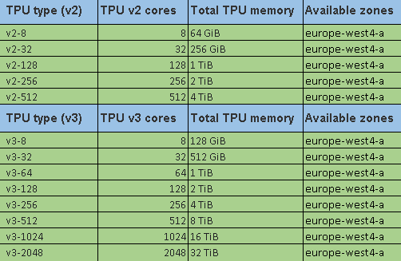

*   **在亚洲地区的可用性**：此外，GCP 在亚洲地区也正在扩展，在撰写本章时，其可用性有限，如以下屏幕快照所示。 预计随着 GCP 在整个地理区域中采用率的提高，亚洲地区的可用性也会有所提高：


应用程序可以通过**虚拟私有云**（**VPC**）网络从实例，容器和 AI 服务访问 TPU 节点。 下表概述了访问 GCP 上的 TPU 节点的方法：

*   Compute Engine 上的 Cloud TPU 非常适合需要它来管理自己的 Cloud TPU 服务的用户； 通常，建议使用 Google Cloud 的用户，因为它具有 CTPU 实用程序，可以为用户完成基本的后台工作，例如设置虚拟机，云存储服务和 TPU。
*   当您需要在应用程序中进行自动扩展，灵活地更改硬件（CPU，GPU 和 TPU 之间），虚拟机的自动管理以及**无类别域间路由**（**CIDR**）时，可以使用 Kubernetes Engine 上的 Cloud TPU 块范围，更重要的是，是一个容错应用程序。

*   经验丰富的 ML 程序员应使用 AI 服务上的 Cloud TPU，他们可以利用 GCP 提供的托管 AI 服务。 AI 服务为用户管理 AI 工作流中的许多活动，例如在用户数据上训练 ML 模型，部署模型，预测监控和模型管理。

现在，我们对 TPU 有了基本的了解，让我们看一下 TPU 的使用领域和优势。

以下屏幕快照描述了硬件使用的区域，即 CPU，GPU 和 TPU：


从前面的屏幕快照可以明显看出，我们需要在用例和当前问题的背景下进行思考，然后才能在 CPU，GPU 和 TPU 之间做出选择。 具有由矩阵计算控制的大量训练和评估数据的超大型模型最适合在 TPU 上进行训练。

# 使用 TPU 的优势

在 ML 算法中，通常使用线性代数计算。 TPU 使这种计算的性能最大化； 可以在很短的时间内在 TPU 上训练在 GPU 上花费大量时间的模型。 此外，对于**卷积神经网络**（**CNN**）模型，Cloud TPU 大大缩短了达到准确率的时间。 如果您拥有适用于 Cloud TPU 的应用程序，则可以在很短的时间内以非常低的成本获得最大的输出。

以下屏幕快照显示了用于训练 ResNet 50 模型的 GPU 和 TPU 的快速比较。 ResNet 50 是一个 CNN 模型，已经对 ImageNet 数据库中的一百万幅图像进行了训练。 已经观察到，如果用户使用八个 v100 GPU 和一个完整的 Cloud TPU v2 pod，则训练时间和成本都会大大降低。 虽然训练速度提高了 27 倍，但成本也降低了 38%。

以下屏幕截图比较了在 GPU 和 TPU 上进行训练的成本：

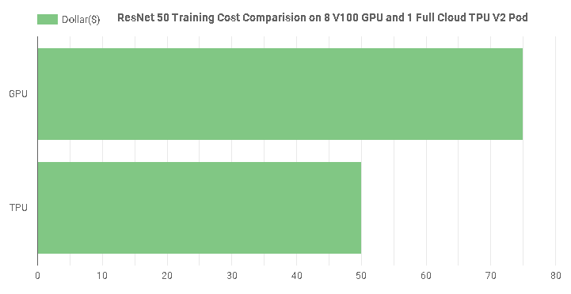

图 7.1 训练费用比较

从前面的屏幕快照可以明显看出，TPU 可以为复杂的模型训练工作节省大量成本。 在一段时间内进行多次部署后，节省的成本变得更加重要，尤其是在生产部署场景中，该场景中需要经常训练模型。

# 软硬件架构图

为了进一步加速数学计算，创建了专用硬件作为**专用集成电路**（**ASIC**）。 这样，尤其是在`n`-多维数学中，计算能力得到了倍增。 在本节中，我们将详细介绍 TPU 及其相关组件的软件和硬件架构。

# 可用的 TPU 版本

每个 TPU 版本都包含一些主要组件，这些组件构成了 TPU 的功能。 在讨论 TPU 版本时，我们将看一下 TPU 内核的架构和 TPU 内核的**高带宽存储器**（**HBM**）。 我们将了解每个 TPU 设备上的内核如何互连以及如何将网络接口用于设备间通信。

下表显示了 TPU v2 的特征：

*   每个 TPU 内核 TPU v2 的 HBM 为 8 GB。
*   每个内核具有一个`128 * 128`的**矩阵单元**（**MXU**）。
*   一个 TPU 盒最多可具有 512 个内核和 4 TB 的总内存。

下图显示了 TPU v2 的组织：

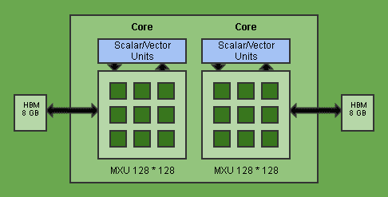

图 7.2 TPU V2 特性

下表显示了 TPU v3 的特征：

*   每个 TPU 内核 TPU v3 的 HBM 为 16 GB。
*   每个内核具有两个`128 * 128`的 MXU。
*   一个 TPU 盒最多可具有 2,048 个内核和 32 TB 的总内存。

下图显示了 TPU v3 的组织：


图 7.3 TPU 的组织

每个 TPU 内核均由标量单位，矢量单位和 MXU 组成。 TPU 芯片以 MXU 计算能力为后盾。 在一个周期内，MXU 可以执行 16,000 个**乘积**（**MAC**）操作。 MXU 输入和输出是 32 位浮点值，但是它以`bfloat16`精度执行乘法以提高精度。 每个内核可以独立执行用户操作，并且通过高带宽互连可以与其他芯片进行通信。 对于大型 ML 工作负载，可以将多个 TPU 设备与高速网络接口互连，以获得大量的 TPU 内核和内存。

# 与 TPU v2 相比，TPU v3 的性能优势

正如我们在本书前面所看到的，与 TPU v2 相比，TPU v3 具有更多的 **TeraFlops**（**TFLOPS**）和内存。 因此，肯定有一些地方 TPU v3 可以获得比 TPU v2 更好的结果。 要确定要使用的 TPU 版本，可以在可用版本上运行模型，并使用 TensorBoard 检查性能。

以下是 TPU v3 可以改善的一些方面：

*   受计算限制的模型在 TPU v3 上具有显着的优势。
*   数据不适合 TPU v2 内存但适合 TPU v3 内存的情况会有所帮助。
*   批量大小不适合 TPU v2 的新型号可以再次获得性能优势。
*   在某些区域中，模型是输入绑定的，或者模型是内存绑定的； 在那里，您可能看不到这种性能提升。 因此，在确定 TPU 版本之前，请在预期用例的背景下进行性能基准测试和成本价值分析。

# 可用的 TPU 配置

让我们讨论 Google 提供的不同类型的 TPU 配置。

Google 提供了两种不同类型的配置，用户可以在两个 TPU 版本中利用它们。 它们如下：

*   **单设备 TPU**：这些是执行所有操作的单独设备。 这些设备未通过网络与其他 TPU 设备互连。 实际上，一个以上的单个 TPU 设备无法通过网络连接到另一设备。
*   **TPU 盒**：TPU 盒不过是群集，其中有多个 TPU 设备通过高速网络与另一台设备互连。

下图描述了单个 TPU 设备，因为它不连接到另一个 TPU 设备，因此不需要高速网络带宽。 TPU 节点仅连接到一个 TPU 设备。 TPU 中的芯片已经互连，不需要主机 CPU 或主机网络资源：

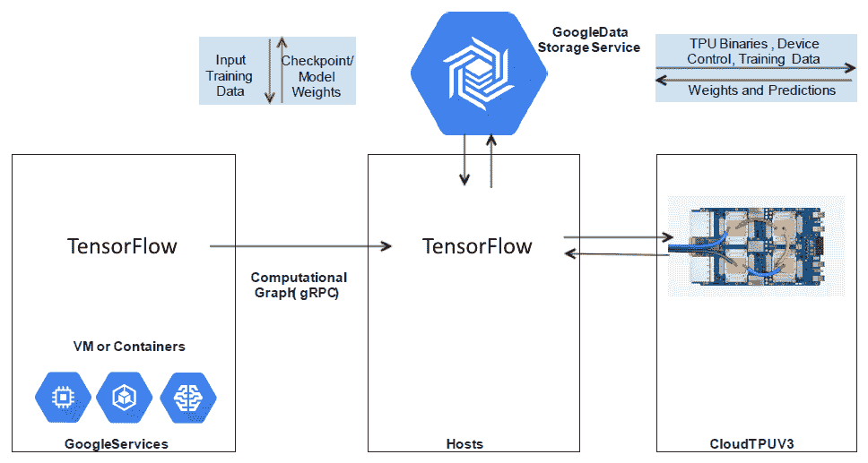

图 7.4 单设备 TPU

上图中的设备正在使用 Cloud TPU v3，但是在设置节点时，您可以指定任何 TPU 版本。 我们将在“软件架构”部分中讨论流程。 以下屏幕快照描绘了一个 TPU 盒，其中多个 TPU 设备通过高速网络连接进行连接：

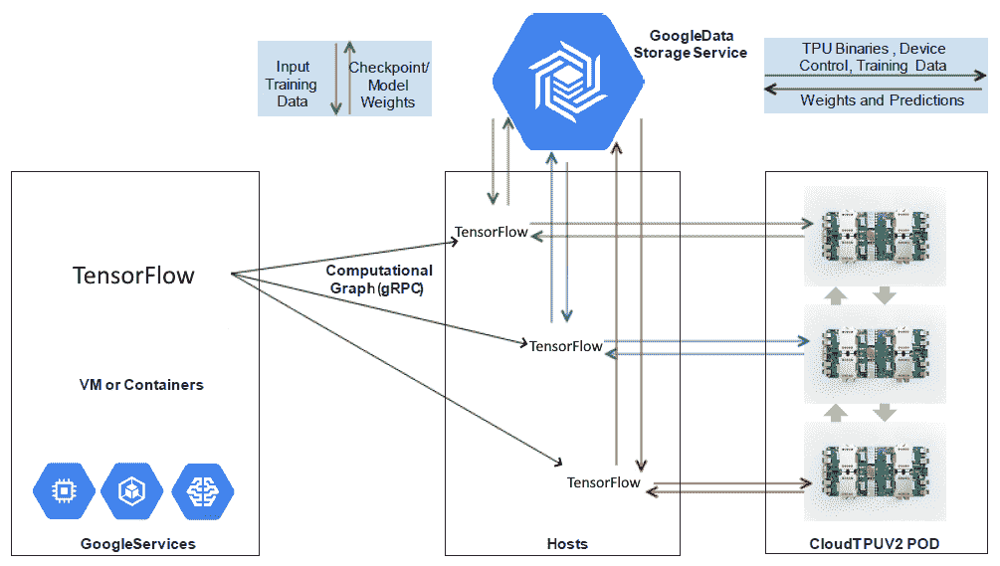

图 7.5 TPU 盒

在上图中，请注意以下几点：

*   主机正在不同的 TPU 设备上分配 ML 工作流。
*   TPU 中的芯片已经互连，不需要主机 CPU 或主机网络资源。
*   由于 TPU 设备通过高速带宽网络连接，因此它们也不需要主机 CPU 或主机网络资源。

上图中的设备正在使用 Cloud TPU v2，但是在设置节点时，可以指定任何 TPU 版本。 在创建 TPU 节点时，我们还可以指定是占用全部 TPU 还是部分 TPU 吊舱。 可以使用 Cloud TPU API 自动化 TPU 节点的 TPU 管理，这极大地有助于扩展集群和管理工作负载。

# 软件架构

在本节中，我们将看到运行应用程序时在软件方面发生的情况。

**TPU 软件架构的流程**：TensorFlow 生成计算图，并通过 **gRPC 远程过程调用**（**gRPC**）。 根据您选择的 TPU 的类型和可用于工作负载的设备数量，TPU 节点会及时编译计算图，并将二进制文件发送到一个或多个可用的 TPU 设备。

下图描述了 TPU 软件架构的软件组件块。 它由 ML 模型，`TPUEstimator`， **TensorFlow 客户端**， **TensorFlow 服务器** 和 **XLA 即时（JIT）编译**组成：

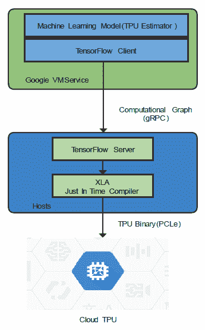

图 7.6 TPU 的软件组件块

让我们详细讨论每个组件，如下所示：

*   **`TPUEstimator`**：`TPUEstimator`简化了 Cloud TPU 的模型构建，以提取最大的 TPU 性能。 `TPUEstimator`是基于估计器的高级 API。 `TPUEstimator`将 ML 程序转换为 TensorFlow 操作。 对于使用 Cloud TPU 的 ML 模型，绝对应该使用`TPUEstimator`。
*   **TensorFlow 客户端**：TensorFlow 客户端将 TensorFlow 操作转换为计算图，然后通过 gRPC 发送到 TensorFlow 服务器。
*   **TensorFlow 服务器**：TensorFlow 服务器在 Cloud TPU 服务器上运行。 当 TensorFlow 服务器从 TensorFlow 客户端接收到计算图时，它将从所需的存储中加载输入。 它将图划分为多个块，应在 TPU 和 CPU 上运行。 它生成**加速线性代数**（**XLA**）操作，以便在 Cloud TPU 上运行子图，并调用 XLA 编译器。
*   **XLA 编译器**：XLA 是**即时**（**JIT**）编译器。 TensorFlow 服务器产生 XLA 编译器视为输入的操作。 XLA 生成在 Cloud TPU 上运行的二进制代码，包括从片上存储器到硬件执行单元的数据编排以及芯片间通信。 Cloud TPU 使用 Cloud TPU 服务器和 Cloud TPU 之间的**外围组件互连快速**（**PCIe**）连接来加载二进制代码，然后启动执行。

# 使用 TPU 进行模型开发的最佳实践

在本节中，我们将讨论如何在 Cloud TPU 上开发模型以最大化模型性能并优化利用硬件。

让我们快速看一下 TPU 芯片配置。 单个 TPU 芯片包含两个内核，每个内核具有多个 MXU。 正如我们所讨论的，MXU 非常适合执行密集矩阵乘法和卷积的程序。 因此，对于此类程序，我们绝对应该考虑使用 TPU 并利用其硬件。 未执行矩阵乘法并且执行诸如`add`之类的操作的程序将不会有效地使用 MXU。 在以下小节中，我们将介绍一些准则，这些准则将帮助您决定是否应使用 TPU，并告知您如何开发模型以从中获得最佳性能。

# 在 TPU 上进行模型开发的指导原则

为了充分利用硬件程序，您应该利用所有可用的内核，因为这会增加模型训练的时间（每个 TPU 设备包含四个芯片和八个内核）。 这可以使用`TPUEstimator`来实现。 它提供了一个图形运算符，可帮助构建和运行副本。 每个副本都是在每个核心上运行的训练图，并且实质上是批量大小的八分之一。

布局和形状是获得性能提升的非常重要的方面。 当 XLA 编译器转换代码时，它包括将矩阵平铺为多个小块。 这样可以提高 MXU 的使用效率。 由于 MXU 为`128 * 128`，因此它希望平铺应为 8 的倍数。有些适用于平铺的矩阵，而有些则需要重塑。 这些是内存绑定操作。 形状恒定的模型适合 TPU，而形状变化的模型不适合 Cloud TPU，因为重新编译形状会减慢处理速度。

对于高性能的 Cloud TPU 程序，应将密集的计算轻松地分为`128 * 128`的倍数。XLA 编译器使用填充选项。XLA 编译器未完全利用 MXU 时，将张量填充零。 您可以通过`op_profile`看到 XLA 编译器应用的填充。 通常，填充有助于提高性能，但也有两个缺点。 应用填充意味着未充分利用 MXU，并且由于它增加了张量所需的片上存储空间，因此有时可能会导致内存不足错误。 因此，选择正确的尺寸对于最小化/避免填充非常重要。

张量尺寸应该非常谨慎地选择，因为它在从 MXU 中提取最大性能方面起着重要作用。 XLA 编译器使用批量大小或尺寸来获得 MXU 的最佳性能。 因此，任何一个都应该是 128 的倍数。如果都不是 128 的倍数，则编译器应该填充 1 到 128。可以从 MXU 中获得最大的性能，因为它的批量大小和 TPU 是 8 的倍数。

# 使用`TPUEstimator`训练模型

在本节中，我们将讨论训练模型时`TPUEstimator`的用法和优点。

`TPUEstimator`吸收了许多底层的，特定于硬件的细节，并简化了在 Cloud TPU 上运行的模型。 `TPUEstimator`在内部执行许多优化以增强模型的性能。 使用`TPUEstimator`编写的模型可以跨不同的硬件运行，例如 CPU，GPU，TPU 吊舱和单个 TPU 设备，大多数情况下无需更改代码。

# 标准 TensorFlow 估计器 API

TensorFlow Estimator 提供了一个用于训练，评估，运行和导出服务模型的 API，如下表所示。 对于估计器，您应该编写与 TensorFlow 图的模型和输入部分相对应的`model_fn`和`input_fn`函数。 让我们看一下以下屏幕截图：


图 7.7 TensorFlow API

除了上述功能之外，TensorFlow Estimator 还包括其他一些常见功能，例如工作训练，检查点功能等。

# `TPUEstimator`编程模型

GCP 为`TPUEstimator`编程提供了一致的模型。 以下是有关模型的详细信息：

*   `TPUEstimator`使用`model_fn`，它包装计算并将其分配到所有 Cloud TPU 内核。 为了获得最佳性能，应根据批量大小调整学习率。
*   跨 TPU 进行计算的复制和分发由`model_fn`完成。 您必须确保计算仅包含 Cloud TPU 支持的操作。

*   通过`input_fn`功能对在远程主机 CPU 上运行的输入管道进行建模。
*   输入操作应使用`tf.data`进行编程。
*   每次调用都会将全局批量的输入处理到一个设备上。 碎片批量大小是从[`'batch_size'`]参数中获取的。 确保返回数据集而不是张量以获得最佳性能。
*   应用程序代码始终在客户端上运行，而工作程序执行 TPU 计算。
*   为了获得良好的性能输入管道，操作始终放在远程工作器上，只有`tf.data`支持它。
*   为了摊销 TPU 的启动成本，模型训练步骤包含在`tf.while_loop`中，到目前为止，`tf.while_loop`仅可以包装`tf.data`。 因此，正是出于这两个原因，必须使用`tf.data`。

# `TPUEstimator`概念

基本上，TensorFlow 程序可以使用图形内复制和图形间复制。 为了运行 TensorFlow 程序，`TPUEstimator`使用图形内复制。 稍后，我们将介绍图内复制和图间复制之间的区别。

TensorFlow 会话主服务器不在`TPUEstimator`中本地运行。 我们的程序创建了一个图，该图被复制到 Cloud TPU 中的所有可用核心，并且 TensorFlow 会话主服务器设置为第一个工作服务器。 输入管道位于远程主机上，因此训练示例可以快速提供给 Cloud TPU。 Cloud TPU 工作人员之间发生同步操作； 也就是说，每个工人都在同一时间执行相同的步骤。

# 从 TensorFlow 估计器转换为`TPUEstimator`

当您转换为任何其他工具时，请确保从一个小例子开始，然后再处理一个复杂的例子。 这有助于熟悉任何工具的基本概念。

要将`tf.estimator.Estimator`类转换为使用`tf.contrib.tpu.TPUEstimator`，您将需要执行以下步骤：

1.  将`tf.estimator.RunConfig`更改为`tf.contrib.tpu.RunConfig`。

2.  设置`TPUConfig`以指定`iterations_per_loop`。 训练循环的指定迭代次数由 Cloud TPU 执行，然后返回主机。 在运行所有 Cloud TPU 迭代之前，不会保存检查点或摘要。
3.  在`model_fn`中，使用`tf.contrib.tpu.CrossShardOptimizer`包装优化器，如以下代码所示。 您必须将`tf.estimator.Estimator`更改为`tf.contrib.tpu.TPUEstimator`才能转换为`TPUEstimator`：

```py
optimizer = tf.contrib.tpu.CrossShardOptimizer(
 tf.train.GradientDescentOptimizer(learning_rate=learning_rate))
```

默认值`RunConfig`在每 100 个步骤后为 TensorBoard 保存摘要，并每 10 分钟写入一个检查点。

# 设置 TensorBoard 来分析 TPU 性能

分析任何应用程序的性能都是至关重要的，TensorBoard 可帮助可视化和分析 Cloud TPU 的性能。 使用 TensorBoard，您不仅可以监视您的应用程序，还可以通过应用 TensorBoard 提供的建议来提高其性能。

设置 Cloud TPU 之后，您应该安装最新版本的 Cloud TPU 分析器以创建`capture-tpu-profile`脚本。 以下是运行 TensorBoard 的步骤：

1.  打开一个新的 Cloud Shell 以启动 TensorBoard。
2.  运行以下命令来设置所需的环境变量，并为您的云存储桶和模型目录创建环境变量。 模型目录变量（`MODEL_DIR`）包含 GCP 目录的名称，该目录在模型训练期间存储检查点，摘要和 TensorBoard 输出。 以下代码显示了带有可用于设置 TensorBoard 的参数的命令：

```py
$ ctpu up ctpu up --name=[Your TPU Name] --zone=[Your TPU Zone]

$ export STORAGE_BUCKET=gs://YOUR STORAGE BUCKET NAME
$ export MODEL_DIR=${STORAGE_BUCKET}/MODEL DIRECTORY
```

TensorBoard 跟踪可以通过两种方式查看：

*   静态跟踪查看器
*   流跟踪查看器

如果每个 TPU 需要超过一百万个事件，则必须使用流跟踪查看器。

让我们检查一下如何启用静态跟踪查看器。

3.  在用于设置环境变量（在上一步中设置）的同一 Cloud Shell 中运行以下命令：

```py
$tensorboard --logdir=${MODEL_DIR} &

```

4.  在同一 Cloud Shell 的顶部，单击`Web Preview`并打开端口`8080`以查看 TensorBoard 输出。 要从命令行捕获输出，请运行以下命令：

```py
$ capture_tpu_profile --tpu=[YOUR TPU NAME] --logdir=${MODEL_DIR}

```

TensorBoard 提供以下功能：

*   TensorBoard 提供了各种选项来可视化和分析性能。
*   您可以可视化图形并利用 Profiler 来提高应用程序的性能。
*   XLA 结构图和 TPU 兼容性图对于分析非常有用。
*   还有一些分析器选项，例如概述页面，输入管道分析器，XLA Op 配置文件，跟踪查看器（仅适用于 Chrome 浏览器），内存查看器，吊舱查看器和流跟踪查看器（仅适用于 Chrome 浏览器）。 这些对于分析性能和调整应用程序非常有用。

# 性能指南

在开发模型时，非常重要的是要对其进行调整以使其获得良好的性能。 在本节中，我们将介绍一些技巧，这些技巧将帮助您提高模型在 Cloud TPU 上的性能。 这样，Cloud TPU 可以提供良好的性能，但是我们可以通过为应用程序设置正确的配置来增强它。

在以下小节中，我们将讨论提高性能的重点领域。

# XLA 编译器性能

XLA 编译器是标准 TensorFlow 代码库的一部分。 它是 ML 编译器，可以为 CPU，GPU，TPU 和其他一些平台生成二进制文件。 将 Cloud TPU 的 TensorFlow 模型转换为 XLA 图，然后 XLA 编译器将其转换为 TPU 可执行文件。 在这里，我们将注意到的一件事是 TPU 硬件不同于 CPU 和 GPU 硬件。

CPU 具有少量高性能线程，而 GPU 具有大量高性能线程。 Cloud TPU 具有`128 * 128`个 MXU，它们可以作为单个非常高性能的线程执行，并且每个周期可以执行 16,000 次操作，或者以管道方式连接的`128 * 128`个微小线程。

# 平铺的后果

Cloud TPU 中的阵列是平铺的。 这要求将其中一个维度的填充填充为 8 的倍数，将另一个维度填充为 128 的倍数。XLA 执行数据布局转换，以将数据安排在内存中以进行有效使用。 这些转变是由试探法驱动的。 这对于大多数模型而言效果很好，但有时可能会出错。 为了获得最佳性能，应尝试不同的配置。

以下是一些可以最大程度提高性能的非常重要的事情：

*   填充成本应降至最低。
*   批和特征尺寸的值应非常有效地选择。

# 融合

如果要组合执行多个操作，则 XLA 编译器将使用融合技术来优化程序。 融合操作是可以组合执行的多个操作的组合。

例如，考虑以下一系列操作：

```py
tf_add = tf.add(x, y)
result = tf.multiply(tf_add, z)
```

在步骤中，此代码将像这样执行：

1.  首先，循环将顺序访问元素并执行加法运算，结果将保存在`tf_add`中，并将其存储在临时存储器中，如以下代码块所示：

```py
for (i = 0; i < cnt; i++) {
 tf_add[i] = x[i] + y[i];
}
```

2.  现在，将再次访问加法结果并将其相乘，如下所示：

```py
for (i = 0; i < cnt; i++) {
 result = tf_add[i] * z[i];
}
```

使用融合，数组访问会同时发生，如以下代码块所示：

```py
#In Fusion both addition and multiplication operations are performed together.
for (i = 0; i < cnt; i++) {
 result = (x[i] + y[i]) * z[i];
}
```

在此示例中，内存往返次数减少了，并且 XLA 不需要为`tf_add`分配任何空间。

融合为 Cloud TPU 带来了许多好处，例如：减少了内存传输，优化了硬件利用率，等等。

当两个形状相同的张量组合在一起时，广播将隐式发生，但是请注意，强制实现广播可能会导致性能下降。

# 了解抢占式 TPU

可抢占的 TPU 是低成本 TPU，但其性能与按需 TPU 相同。 但是这里要注意的是，当 Google 需要资源用于其他目的时，总可以终止它。 让我们检查一下如何从控制台创建可抢占的 TPU。

# 从控制台创建抢占式 TPU 的步骤

GCP 为创建可抢占的 TPU 提供了简单的界面。 涉及的步骤如下：

1.  在 GCP 控制台上的 Compute Engine 下，选择`TPU`。 如果未启用 API，请单击`ENABLE`启用它，如以下屏幕截图所示：

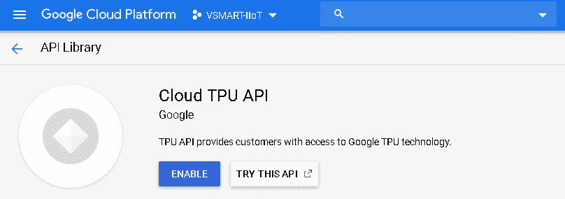

图 7.8 启用 Cloud TPU API

2.  单击**创建 TPU 节点**，如以下屏幕截图所示：

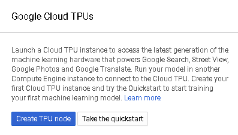

图 7.9 创建 TPU 节点

3.  填写所需的详细信息，选择**可抢占性**选项，然后单击**网络，描述，标签**链接，如以下屏幕截图所示：

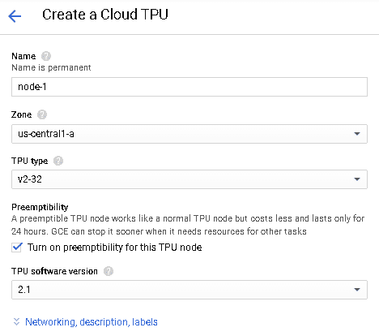

图 7.10 创建云 TPU

4.  填写其他详细信息，然后单击屏幕底部的**创建**，如以下屏幕截图所示，您的 TPU 准备就绪：

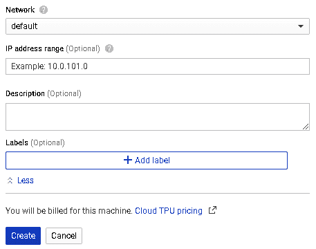

图 7.11 创建 Cloud TPU 的其他详细信息

# 抢占式 TPU 的定价

与按需 TPU 相比，可抢占 TPU 的价格约为价格的 30% 左右。 这里要注意的一点是，抢占式 TPU 的配额高于普通 TPU 的配额，而抢占式 TPU 具有单独的配额。 以下屏幕快照显示了 us-central1 区域中 v2-8 和 v3-8 的定价比较示例：

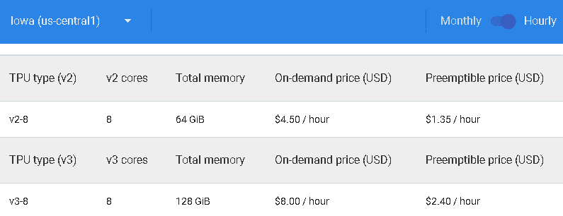

图 7.12 价格比较 v2-8 和 v3-5

# 抢占式 TPU 的检测

如果已经创建了 TPU，并且我们必须检查它是否可抢占，则有相应的规定。 以下命令用于检测 TPU 是否可抢占：

*   `ctpu`命令：运行以下命令检查已创建的 TPU 的详细信息。 在“TPU 可抢占”上打印的值指示 TPU 是否被抢占，`READY`值表示未抢占 TPU，而`PREEMPTED`值表示 TPU 已被抢占：

```py
$ ctpu status
```

*   `gcloud`命令：如果尚未指定区域，它将使用当前配置中的 compute 属性的值。 运行以下命令以检索项目中可用于 Cloud TPU 的计算区域列表：

```py
$gcloud compute tpus list
```

在决定使用 TPU 选项之前，请检查您的用例是否可以继续使用可抢占的 TPU，因为这样可以节省大量成本。

# 总结

在本章中，我们获得了创建 TPU 并在其上编写模型的所有必需知识。 我们已经了解了 Cloud TPU 及其组织以及 Cloud TPU 软件和硬件架构的基础。 我们已经在 Google Cloud 上创建了 TPU 和可抢占的 TPU。 我们已经编写了模型并使用`TPUEstimator`对其进行了训练。 我们已经使用 TensorBoard 描述了 Cloud TPU。 除了学习所有这些，我们还通过了足够的技巧来编写优化的模型。

在下一章中，我们将基于在实际项目上的经验，介绍在 GCP 上实现 TensorFlow 模型的最佳和行之有效的实践。