# 使用 Cloud ML Engine 实现 TensorFlow 模型

**Google Cloud Platform**（**GCP**）上的 Cloud ML Engine 是一种无服务器方式，可用于构建机器学习管道。 该引擎利用基础平台组件，消除了对基础架构的配置和维护的需求。 数据科学家可以专注于数据，模型和预测。 这是在生产环境中启动并运行模型的理想且快速的方法。 该平台固有地提供了存储和计算弹性，并且几乎无限制地扩展了模型的训练和使用已部署的模型进行实时预测的能力。

在本章中，我们将深入研究 Cloud ML Engine，并了解各种构建模块，并使用 TensorFlow 模型对机器学习管道进行实验。

本章将涵盖以下主要主题：

*   了解 Cloud ML Engine 的组件
*   训练和利用 TensorFlow 模型涉及的步骤
*   在 Cloud ML Engine 中打包和部署您的训练应用
*   为您的训练工作选择正确的计算选项
*   监控您的 TensorFlow 训练模型作业

# 了解 Cloud ML Engine 的组件

首先，让我们了解 Cloud ML Engine 满足哪些机器学习工作流程单元。 Cloud ML Engine 可用于以下目的：

*   训练机器学习模型
*   部署训练有素的模型
*   使用部署的模型进行预测
*   通过各种参数和 KPI 监视模型使用情况
*   模型管理以及版本控制

Cloud ML Engine 具有各种组件，它们执行独特的操作并在机器学习管道中发挥作用。 这些组件是服务组件，它们利用基础平台组件并利用所需的存储和计算量，具体取决于模型的复杂性和数据量。 这是 Cloud ML Engine 的组件。

# 训练服务

训练服务模型提供了一些预定义的算法，这些算法可轻松用于训练而无需编写任何代码。 该算法可与训练数据一起使用，前提是该数据限于平台上可用算法内的预期方案。

# 使用内置算法

在撰写本章时，Cloud ML Engine 支持以下算法：

*   **线性学习器**：此学习器算法使用 TensorFlow 估计器，`LinearClassifier`和`LinearRegressor`，可用于分类和回归问题。 该算法支持**图形处理器**（**GPU**）加速，以及默认的**中央处理器**（**CPU**）加速器。
*   **宽和深**：这是一种旨在具有最佳级别的算法，用于存储训练数据并同时概括输入。 该算法对于分类，回归和排名问题很有用。 该算法支持 GPU 加速以及默认的 CPU 加速器。

*   **XGBoost**：我们已经在“第 3 章”，“使用 XGBoost 的机器学习应用”中详细了解了此算法，Cloud ML Engine 提供了对该算法的内置包装器，并以并行的方式简化了两个阶段，即预处理和训练。 在预处理阶段，Cloud ML Engine 将分类数据和数字数据转换为统一的数据集，该数据集完全以数字格式表示。 该算法可轻松用于诸如点击率预测之类的用例。 GPU 加速器不支持该算法，并且只能与 CPU 一起使用。

一旦确定了合适的算法，就需要对输入（训练，评估和生产）数据进行格式化，以匹配内置算法的预期模式。 数据需要以不带标题的**逗号分隔值**（**CSV**）格式提交，并且第一列应代表目标变量。 我们需要在 GCP 上为内置算法指定存储分区，以存储训练输出。 Cloud ML Engine 为训练工作提供了有限的自定义，例如使用特定的机器类型进行训练。

原始的一组机器类型只能用于内置算法。 我们还可以定义需要运行作业的区域。 默认情况下，平台会自动选择合适的区域来运行训练作业。 还可以通过使用所需的学习率和批量大小来完成特定于作业的自定义。 我们可以设置超参数调整的目标阈值，以实现最大的准确率并最小化损失函数的值。 内置算法可在 GCP 共享空间上的容器内使用，可以与特定的**统一资源标识符**（**URI**）配合使用，如下表所示：

| **算法** | **容器 URI** |
| --- | --- |
| 线性学习器 | `gcr.io/cloud-ml-algos/linear_learner_cpu:latest``gcr.io/cloud-ml-algos/linear_learner_gpu:latest` |
| 宽深 | `gcr.io/cloud-ml-algos/wide_deep_learner_cpu:latest``gcr.io/cloud-ml-algos/wide_deep_learner_gpu:latest` |
| XGBoost | `gcr.io/cloud-ml-algos/boosted_trees:latest` |

让我们使用内置的线性学习器算法解决一个简单的回归问题。 例如，学生的**学业能力测验**（**SAT**）分数与**平均绩点**（**GPA**）分数之间存在已知的相关关系 。 我们将有一个包含两列的示例 CSV 文件。

第一列包含 GPA 分数（输出变量），第二列包含 SAT 分数。 首先让我们将 CSV 文件上传到存储桶。 以下是使用 Cloud ML Engine 训练模型的简单步骤，该模型根据 SAT 分数预测 GPA 分数：

1.  从导航菜单中输入 GCP 控制台和 AI 平台，然后转到`Jobs`侧菜单。 您将以表格格式查看所有作业（正在运行和已完成）。 单击标题菜单中的“新训练工作”按钮。
2.  创建训练工作有两种选择：使用内置算法训练或自定义代码训练。 在这种情况下，请选择“内置算法训练”选项。
3.  选择线性学习器算法。
4.  单击“下一步”按钮。

在以下屏幕快照中直观地表示了所有前面的步骤。 我们来看一下：

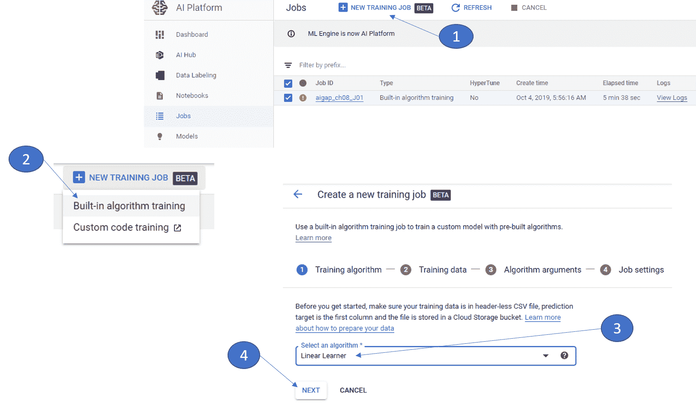

图 8.1-Cloud ML Engine 的模型训练所涉及的步骤（1）

5.  提供 Google Storage 上 CSV 文件的标准路径。 该 CSV 文件包含没有标题行的训练数据，并且目标属性出现在第一列中。
6.  提供用于验证的训练数据百分比的数值。 默认情况下，此值为 20，并且可以根据用例上下文将此数字更改为任何合理的值。
7.  提供用于测试的训练数据百分比的数字值（可选）。 推荐值为 20，可以根据用例要求和机器学习问题的特征进行设置。
8.  提供到要存储模型文件的输出目录的标准路径。 这必须是 Google Cloud Storage 上的有效位置。
9.  单击`NEXT`按钮，为算法提供运行时参数。

在以下屏幕快照中直观地表示了所有前面的步骤。 我们来看一下：

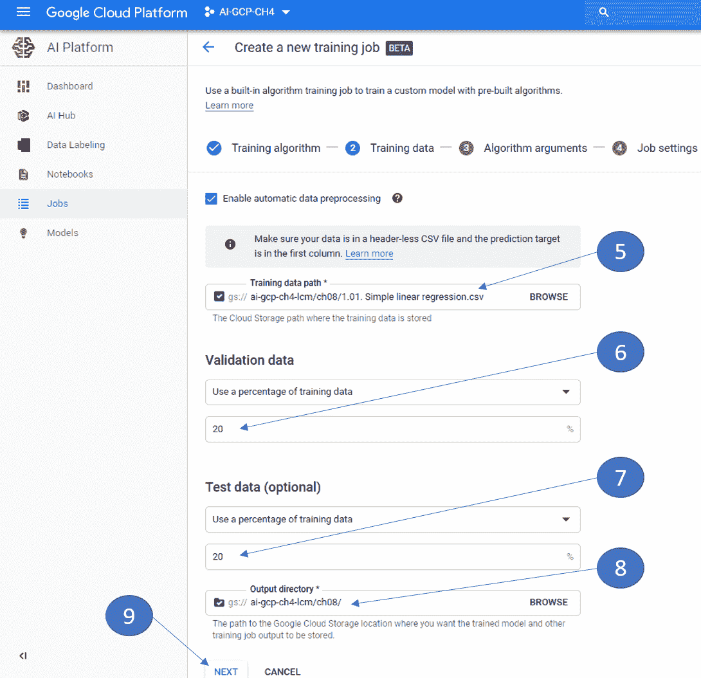

图 8.2-Cloud Engine ML 模型训练所涉及的步骤（2）

10.  选择需要训练的模型类型。 当预期输出是连续变量时，将使用回归模型；而当预期输出是离散类时，将使用分类模型。
11.  仔细选择最大步数，以确保完整的训练数据在生成的输出模型中得到充分体现。 同时，为此参数设置很高的值会增加训练模型的计算成本。
12.  学习率是使用梯度下降算法使用模型时使用的数值。 原则上，此属性指示学习算法的两次迭代之间的步长。

这是需要设置的基本参数。 在以下屏幕快照中直观地表示了所有前面的步骤。 我们来看一下：

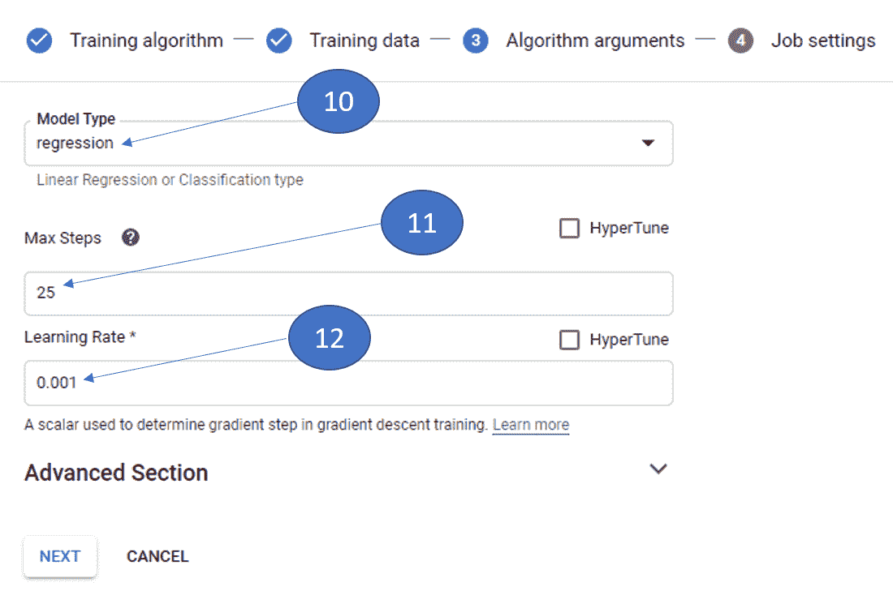

图 8.3-将参数传递给模型训练

除了这些基本参数外，还可以对模型进行超调，以进一步优化和提高准确率。 选中“最大步数”旁边的`HyperTune`复选框时，需要设置最小和最大步数； 并且选中“学习率”旁边的`HyperTune`复选框时，需要设置最小和最大学习率。

除了基本参数之外，还有一些高级设置可用作可配置参数，用于进一步调整模型训练，如以下屏幕快照所示：

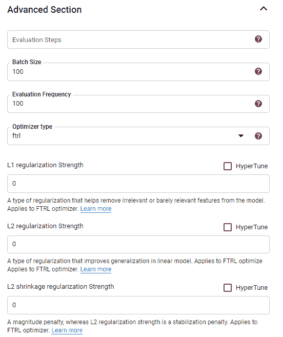

图 8.4-高级模型训练配置

可用于调整的其他参数如下：

*   **评估步骤**：这是一个可选字段，指示需要对其进行评估的批量数量。 如果未指定参数，则对整个数据集运行评估。
*   **批量大小**：这是在一个评估步骤中处理的数据行数。

*   **优化器类型**：我们可以选择三种可能的优化器，这些优化器根据梯度下降算法的实现细节而有所不同：
    *   亚当优化器
    *   FTRLOptimizer（默认）
    *   **随机梯度下降**（**SGD**）优化器
*   **L1 正则化强度**：这是一个数值，表示正则化的一种类型，该类型与权重的绝对值之和成比例地对权重进行惩罚。
*   **L2 正则化强度**：这是一个数值，表示正则化的一种类型，该类型与权重的平方和成比例地对权重进行惩罚。
*   **L2 收缩调整强度**：此参数适用于`FtrlOptimizer`，表示幅度损失。 大于等于 0。

设置算法参数后，最后一步是在下一个工作流程步骤中提供作业 ID，区域和资源大小，如下所示：

13.  **作业 ID**：这是一个字母数字字段，在项目中必须是唯一的，并且一旦设置就无法更改。 建议在作业 ID 创建中使用项目特定的上下文，因为这样可以更轻松地在生产环境中进行监视和故障排除。

14.  **区域**：这是用于训练模型的服务器所在的地理区域。 建议使用相同的区域来存储训练数据和模型训练。

15.  **扩展层**：这定义了需要分配给 AI 平台用于训练工作的资源。 各个层具有预先配置的资源级别，并且可以进行自定义，如下所示：

    *   `BASIC`：此层设置单个工作程序实例。 顾名思义，这是基本配置级别，不能考虑用于生产负载。
    *   `STANDARD_1`：此层配置许多工作程序和一组有限的参数服务器。
    *   `PREMIUM_1`：此层预配置了大量工作程序和参数服务器。
    *   `BASIC_GPU`：此层为 GPU 提供单个工作程序实例。 再一次，这将加快训练速度，仅对实验有益。
    *   `BASIC_TPU`：此层使用 Cloud TPU 设置单个工作程序实例。
    *   `CUSTOM`：使用此配置时，可以完全配置用于训练的群集的规模。 需要为自定义配置设置以下参数：
        *   **主节点类型**：需要用于主节点的虚拟机的类型。 这是必填字段。
        *   **工作器数**：这定义了用于训练的工人数。 如果工人数设置为 1 或更多，则还需要设置工人类型。
        *   **参数服务器数**：这定义了用于训练的参数服务器的计数。 如果参数服务器的数量为 1 个或更多，则需要设置参数服务器类型。

在以下屏幕快照中直观地表示了所有前面的步骤。 我们来看一下：

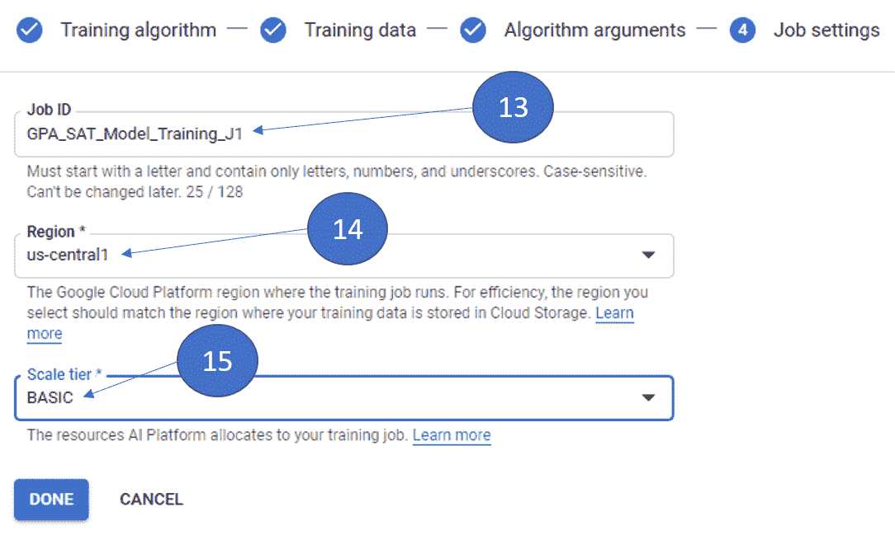

图 8.5-模型训练的作业设置

16.  作业设置完成后，模型开始训练，并且可以在控制台中跟踪作业。 以下屏幕截图显示了控制台中正在进行，成功和失败的作业：


图 8.6-模型训练作业控制台

17.  一旦模型训练完成，就可以从控制台进行部署。 该模型可通过**表述性状态转移**（**REST**）API 与新数据集一起调用。 需要提供唯一的模型名称以及需要在其中部署模型的区域，以及关于模型的可选描述，如以下屏幕快照所示：

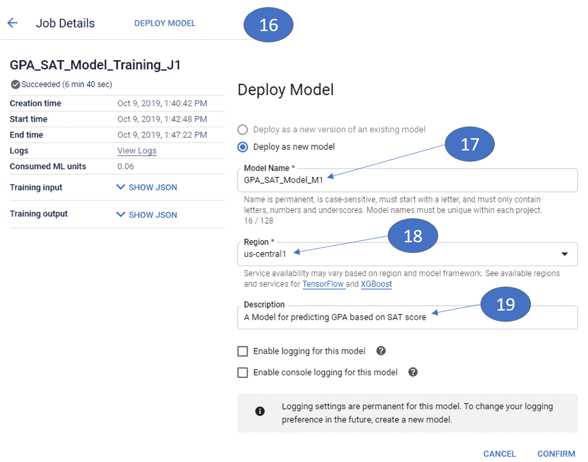

图 8.7-模型部署

在这一点上，模型被训练和部署以供使用。 在接下来的部分中，我们将研究利用模型和构建预测服务。

# 使用自定义训练应用

内置算法是一些最常用的算法。 但是，您将需要针对大多数实际用例训练定制模型。 AI 平台提供了用于训练自定义模型的标准一致框架。 以下屏幕快照描述了通用过程：

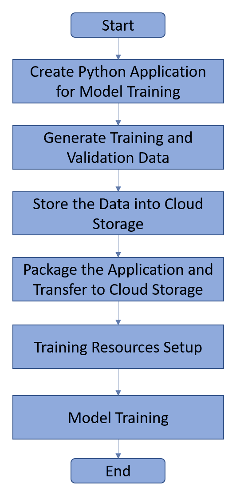

图 8.8-在 AI 平台上训练自定义模型的步骤

AI 平台与典型的机器学习开发生命周期同步工作并对其进行补充。 模型训练代码从本地文件夹或共享位置访问训练数据。 我们需要从 Cloud Storage 位置访问训练数据。 提取数据后，需要分批量每个单独的数据实例。 可以根据用例上下文和数据量来决定这些批量。 评估数据用于测试模型的准确率。 经过训练的模型将作为二进制文件导出，并存储在本地驱动器或 Cloud Storage 位置中。

另外，可以以分布式方式训练模型。 AI 平台使其成为一个无缝的过程，并要求将有关多台机器的详细信息作为训练群集的参数进行传递。 训练服务根据机器类型和所选容量执行资源分配。 在单个节点上运行的每个训练作业都称为**复制副本**。 每个副本都扮演一个角色，并对一组特定的训练数据进行操作。 工作负载分配的详细信息由平台管理，不需要特定的用户配置或参与。 有三种类型的实体有助于分布式模型训练，如下所示：

*   **主节点**：AI 平台将一个副本指定为主节点。 分布式训练计划在其他可用节点上进行，并且主节点会跟踪进度。 训练作业的总体状态与主节点的状态相同。
*   **工作器**：集群中可用的节点扮演工作器的角色。 单个工作人员执行其任务，并将状态报告回主节点。
*   **参数服务器**：副本节点之一被指定为参数服务器，并执行节点之间模型的共享状态的协调任务。

分布式训练的基本且简单的策略涉及将数据分块为各个段，从而在节点上使用每个单独的数据段来训练模型。 在这种情况下，参数服务器会跟踪各个梯度值，并执行合并到最终模型状态的任务。

使用可用框架之一构建应用后，需要将其打包以便在平台上进行部署。 可以使用`gcloud` **命令行界面**（**CLI**）完成打包。 建议使用`gcloud`工具打包应用。 可以使用标准打包和构建工具手动构建该软件包，如以下代码块所示：

```py
gcloud ai-platform jobs submit training $JOB_NAME --staging-bucket $PACKAGE_STAGING_PATH --job-dir $JOB_DIR --package-path $TRAINER_PACKAGE_PATH --module-name $MAIN_TRAINER_MODULE --region $REGION 
```

这是我们需要传递给脚本的参数的简要说明：

*   `--staging-bucket`：这是一个存储训练和依赖项的云存储位置。 GCP 项目需要有权访问此存储桶，建议该存储桶位于打算运行训练作业的同一区域中。
*   `--job-dir`：这是一个云存储位置，用于存储训练作业的输出文件。 该位置必须与训练作业要在同一区域进行。
*   `--package-path`：这是父目录的本地路径，其中存在应用工件。 AI 平台将该路径中的内容打包到`tar.gz`文件中，并将其上传到云存储中。 通过解压缩档案的内容来执行训练作业。
*   `--module-name`：这是应用的名称。
*   `--region`：这是执行训练工作的地理区域。

# 预测服务

上一节中训练的机器学习模型可以基于新的数据集托管在云上进行消费和预测。 预测服务主要负责管理预测所需的存储和计算资源。 作为一般过程，需要导出训练工件。 对于在 AI 平台上训练的模型以及在外部训练的模型，导出过程相同。 可以导出的最大模型大小为 250 MB。 如果需要导出更大的定制模型，则需要提交配额增加表。 AI 平台限制了计算基础架构的使用，因此该平台可以在合理的水平上使用，足以满足大多数通用用例的需要。

但是，计算密集型和大型模型可能需要增加配额。 机器学习模型预测是一个迭代过程，需要对模型的多个版本进行训练。 AI 平台将模型引用为特定机器学习管道的各种版本的容器。 模型可以包含管道的各种版本，并且特定版本可以由 API 调用。 一旦提供了模型版本，就应格式化需要发送到预测服务的数据，并将其提供给 API 调用进行预测。

可以通过两种方式请求预测，如下所示：

*   **在线预测**：服务使用用于 API 调用的数据调用模型版本，并在响应中返回预测。 在后台，模型版本会在运行时部署在请求中指定的区域上。 平台可以缓存模型版本，该模型版本更常用于快速响应时间。
*   **批量预测**：批量预测是一个异步服务调用，当用例需求是这样的需求：需要大量进行预测时，可以使用该异步服务，并且可以在服务提供预测时独立进行处理。 当请求批量预测时，预测服务会在 AI 平台上分配资源以运行作业。 这可能涉及一个或多个预测节点。 在每个分配的节点上还原模型图。 一旦分配了节点，输入数据就由主服务器分发以进行分布式预测。 每个单独的节点在请求预测服务时将预测数据存储在提到的云存储位置中。

在在线预测和批量预测的前提，可能的用例以及因此的存储和计算需求方面，存在根本的区别。 在线预测的目标是最小化预测服务的等待时间（响应时间），并将预测返回到响应的消息正文中。 另一方面，批量预测的目标是处理具有大型数据集和复杂模型的大量实例。 预测输出存储在 Cloud Storage 存储桶中，而不是在消息响应正文中发送。

在线预测通常可以用在处理实时数据的用例中，并且需要及时进行预测以使系统采取行动。 当预测需要对大量历史数据进行操作时，可以使用批量预测。 如果我们尝试使用批量预测模式运行较小的预测负载（数据量较小且算法简单），则与在线预测模型相比，它需要更长的时间。 这是由于以下事实：发送请求时完成了计算和存储资源的提供，并且优先级低于在线预测作业。 为特定用例选择正确的预测模式非常重要。

在创建用于在线预测的模型时，用户需要决定使用哪个区域来运行预测，并且必须决定是否启用在线预测日志记录。 启用日志记录对于故障排除或测试很有用。 但是，启用日志记录时会产生额外的费用。 在提出在线模型预测请求之前，需要先考虑这些成本。

应用开发人员还需要确定要使用的运行时版本，以及 Python 的版本和用于在线预测的机器类型。 可以根据数据量和模型的复杂性来确定机器类型。

可以为预测服务启用三个级别的日志记录，如下所示：

*   **访问日志记录**：此日志记录有助于分析对预测服务的请求数，并跟踪请求开始和呈现时间的时间戳。 可以基于等待时间值以及预测服务的使用模式进行分析。
*   **流日志记录**：标准错误和标准输出被写入 Stackdriver Logging。 仅出于调试目的，需要仔细启用此设置，否则可能会遇到高昂的成本。 仅在创建模型资源时才能启用此日志记录。
*   **请求-响应日志记录**：此级别将在线预测请求和响应记录到 BigQuery 表中。

可以使用`gcloud`命令行以及 REST API 启用这些日志记录级别。 为了使用`gcloud`启用访问日志记录，需要传递`--enable logging`参数，如下所示：

```py
gcloud ai-platform models create model_name --regions us-central1 --enable-logging 
```

如以下代码块所示，需要传递`--enable-console-logging`参数以启用流日志记录：

```py
gcloud ai-platform models create model_name --regions us-central1 --enable-console-logging
```

无法使用`gcloud`启用请求响应日志记录。 需要使用 REST API 启用它。 可以在创建模型和版本时设置日志记录级别。 `projects.models.create` 方法用于创建模型，并通过以下 HTTP URI 进行调用：

```py
POST https://ml.googleapis.com/v1/{parent=projects/*}/models
```

父项是代表项目名称的必需的字符串 URL 参数。 为了成功验证请求，我们需要对项目具有`ml.models.create` Google **身份和访问管理**（**IAM**）权限。 请求主体是模型对象的表示。 这是模型对象的示意图：

```py
{
  "name": string,
  "description": string,
  "defaultVersion": {
    object (Version)
  },
  "regions": [
    string
  ],
  "onlinePredictionLogging": boolean,
  "onlinePredictionConsoleLogging": boolean,
  "labels": {
    string: string,
    ...
  },
  "etag": string
}
```

让我们看一下下表中的模型参数列表及其描述：

| **参数名称** | **类型** | **必填** | **说明** |
| --- | --- | --- | --- |
| `name` | 字符串 | 是 | 这是模型的名称。 模型名称在项目中必须唯一。 |
| `description` | 字符串 | 否 | 这是创建模型时的描述。 |
| `defaultVersion` | 目的 | 是 | 当未在请求内发送版本信息时，将使用该模型版本。 随着模型的发展，默认版本会不断变化并变得越来越有用。 可以使用`projects.methods`更改为模型版本。 |
| `regions[]` | 字符串数组 | 否 | 这是模型在其上部署的所有区域的列表。 这是为 AI 平台的将来版本提供的。 在撰写本章时，平台仅支持一个区域。 默认值为`us-central1`。 |
| `onlinePredictionLogging` | 布尔型 | 否 | 如果设置为`true`，则在线预测日志将发送到 StackDriver Logging。 这些日志类似于服务器访问日志，其中记录了所有请求的请求时间戳和响应时间。 默认情况下，此参数的值为`false`，需要将其显式设置为`true`。 |
| `onlinePredictionConsoleLogging` | 布尔型 | 否 | 如果设置为`true`，则在线预测日志将以更详细的方式发送到 StackDriver Logging，并包含标准输出以及标准错误日志消息的完整记录。 该日志对于调试很有帮助，但需要谨慎使用以节省成本。 |
| `labels` | 键值对映射 | 否 | 标签有助于组织 AI 平台上的各种资源。 这些标签是可以具有任意值的键值字符串。 带标签的资源易于监视和分组。 我们最多可以提供 64 个标签。 键和值最多可以包含 63 个字符。 键必须以字母开头，并且可以包含字母数字字符，下划线和破折号。 |
| `etag` | 字符串 | 是 | 该标志用于防止两个独立模型更新之间的竞争状况。 需要在各种请求和响应之间以链接的方式使用`etag`参数，以确保对模型进行顺序更新。 建议有效使用`etag`，以避免模型版本不一致。 |

除了创建模型之外，相同的请求主体对象还可用于以下功能：

*   `delete`：删除模型
*   `get`：获取有关模型的所有信息，包括版本
*   `getIamPolicy`：获取资源的访问控制策略
*   `list`：提供项目中存在的所有模型的列表
*   `patch`：更新模型资源
*   `setIamPolicy`：设置 AI 平台内特定资源的访问控制
*   `testIamPermissions`：列出呼叫用户帐户对特定资源拥有的所有权限

为了执行在线预测，需要以值列表形式或 JSON 对象的形式对输入数据进行结构化和格式化。 以下是可以在 AI 平台上传递给张量模型的输入张量的示例：

```py
{"values":["one","two","three"], "key":123}
```

需要将该对象格式化为以下格式，才能发送到 REST API 端点：

```py
{"instances": [
                       {"values": ["one","two","three"], "key": 1},
                       {"values": ["five","six","seven"], "key": 2}
]}

def predict(project, model, instances, version=None):

    GOOGLE_APPLICATION_CREDENTIALS=<path_to_service_account_file>
    service = googleapiclient.discovery.build('ml', 'v1')
    name = 'projects/{}/models/{}'.format(project, model)

    if version is not None:
        name += '/versions/{}'.format(version)

    response = service.projects().predict(
        name=name,
        body={'instances': instances}
    ).execute()

    if 'error' in response:
        raise RuntimeError(response['error'])

    return response['predictions']
```

如我们所见，可以通过使用对项目的引用来对 JSON 格式的输入结构化数据进行建模来获得在线预测。 我们使用`googleapiclient`创建机器学习服务的实例，并在服务实例上调用`predict`方法。

# 笔记本

The AI Platform provides an intuitive way of working with it in terms of notebooks. These are pre-packaged online interfaces that can be used for effective collaboration among team members and can be quickly configured to have the latest versions of Python libraries in the backend. The notebooks enable the developers to create and manage virtual machines on the GCP that can utilize TensorFlow and PyTorch frameworks, along with R and Python deep learning packages.

可以配置工作流和管道，以真正无服务器的方式利用 CPU 和 GPU。 笔记本电脑可以使用的图像经过测试和优化，以实现最佳性能和易用性。 GCP 的身份验证层用于访问笔记本，并且可以与任何其他 GCP 资源相同的方式配置 IAM 策略。 与 GCP 上托管的 GitHub 存储库无缝集成。

AI Platform 笔记本支持以下运行时和程序包：

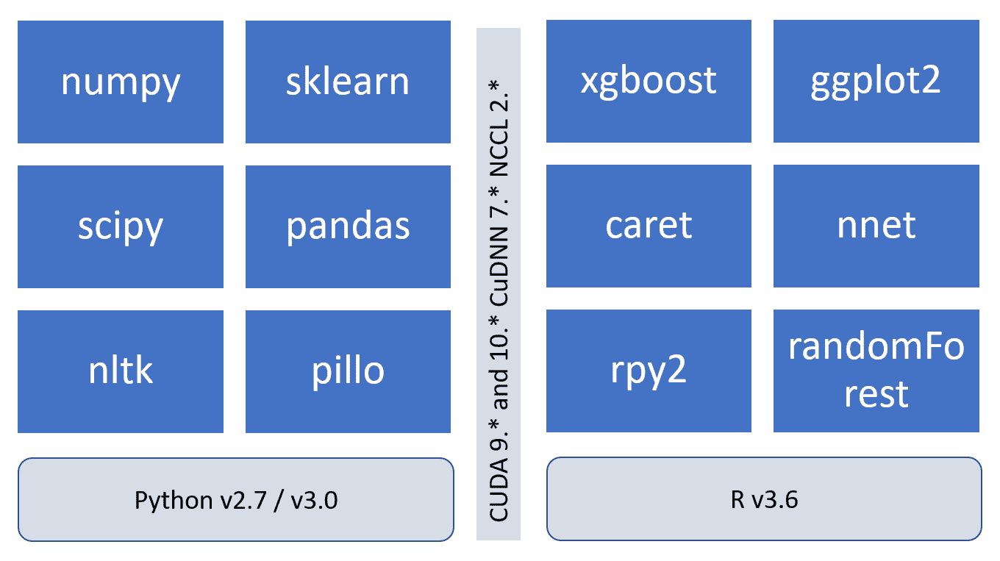

图 8.9-AI 平台支持的运行时和程序包

为了在 AI 平台上使用笔记本，需要选择一个项目，并且需要启用 Compute Engine API 才能导航到笔记本页面。 让我们创建笔记本的新实例：

1.  从导航菜单转到 AI 平台内的`Notebooks`笔记本菜单。
2.  单击顶部菜单栏上的`NEW INSTANCE`链接。
3.  从可用选项中选择用于创建实例，或单击“自定义实例”以对新实例的各种参数和容量进行精细控制。
4.  选择具有或不具有 GPU 的实例。 如果实例是使用 GPU 创建的，请选择选项以自动安装 GPU 驱动程序。 创建实例后，可以在以后修改 GPU 计数。 以下屏幕快照描述了创建笔记本新实例的步骤：

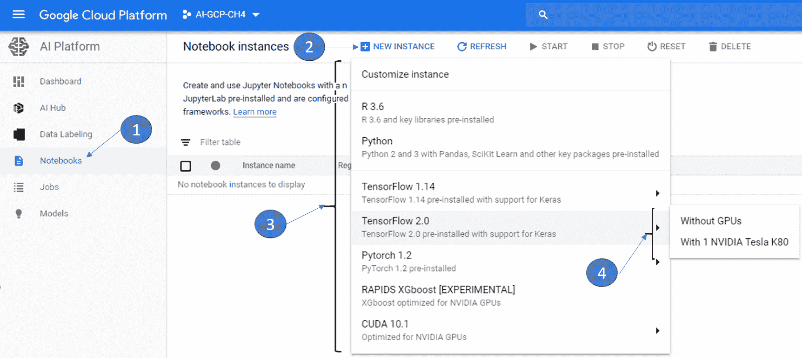

图 8.10-创建新笔记本实例的步骤（1）

让我们使用不带 GPU 的 TensorFlow 2.0 创建一个新的笔记本实例。

5.  AI 平台分配默认实例名称。 可以根据用例上下文修改此名称。 建议使用日期时间戳作为实例名称，以提高可维护性。
6.  环境：AI 平台使用带有英特尔®MKL-DNN 和 CUDA 10.0 的 TensorFlow 2.0 创建图像，并且默认情况下包括 Python 2/3，scikit-learn，pandas 和 NLTK。
7.  机器配置：AI 平台使用默认区域（us-west1-b），具有 15 GB RAM 的 4 个 vCPU 和 100 GB 的启动磁盘创建机器。
8.  联网：子网是默认设置（10.138.0.0/20）。
9.  估计成本：AI 平台根据持续使用折扣提供估计成本。
10.  单击“创建”按钮分配笔记本实例。

以下屏幕截图显示了使用 TensorFlow 2.0 而不使用 GPU 创建新笔记本实例的步骤：

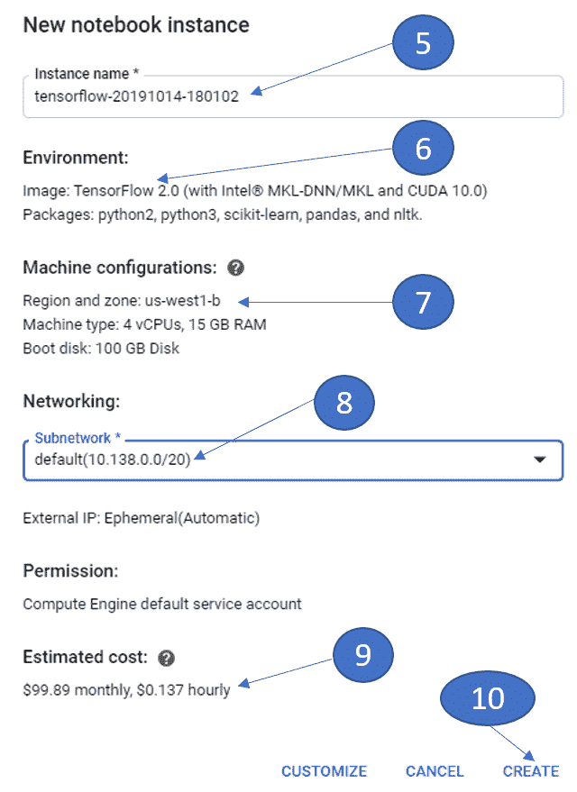

图 8.11-创建新笔记本实例的步骤（2）

11.  使用设定的配置创建笔记本后，您可以通过单击`OPEN JUPYTERLAB`超链接来打开 JupyterLab 界面，如以下屏幕截图所示：

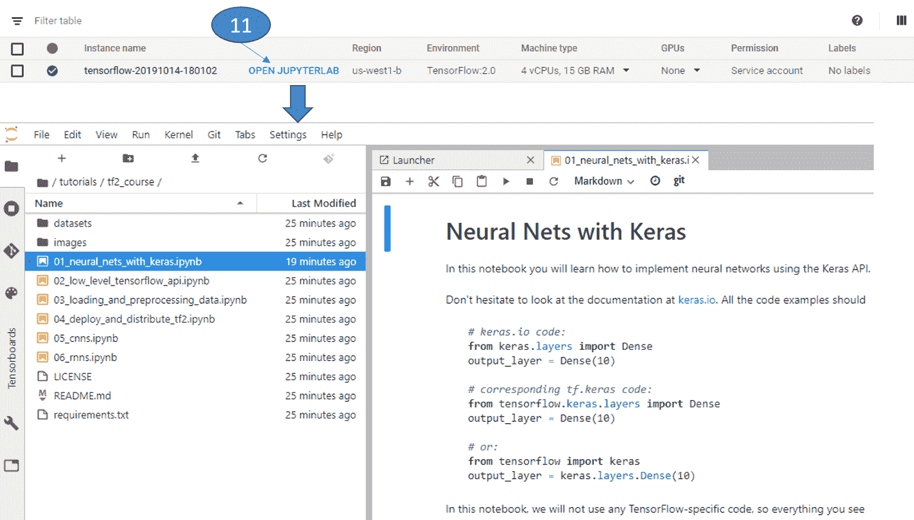

图 8.12-打开 Jupyter 笔记本

# 数据标签服务

AI 平台提供了**数据标注服务**，该服务可以在人类标记者的帮助下轻松，高效地注释训练数据。 模型训练需要大量数据，有时无法获得人工为训练和评估数据加上标签的努力。 可以利用数据标签服务进行连续评估，这有助于基于一组新的输入数据来改进模型，以提高准确率。

使用数据标签服务的一般过程始于创建一个数据集，其中包含样本，这些样本将作为人类标签的指南。 与样本数据集一起，需要提供一个注释规范集，其中包含用例上下文中训练数据的所有可能的分类类别。 我们还可以向贴标机提供一组额外的说明，以进行实际的贴标。 一旦满足先决条件，就可以根据样本，注释规范集和说明生成服务请求，人工贴标人员可以导出训练数据以用于模型的训练和评估。

以下屏幕快照显示了使用数据标签服务的一般过程：

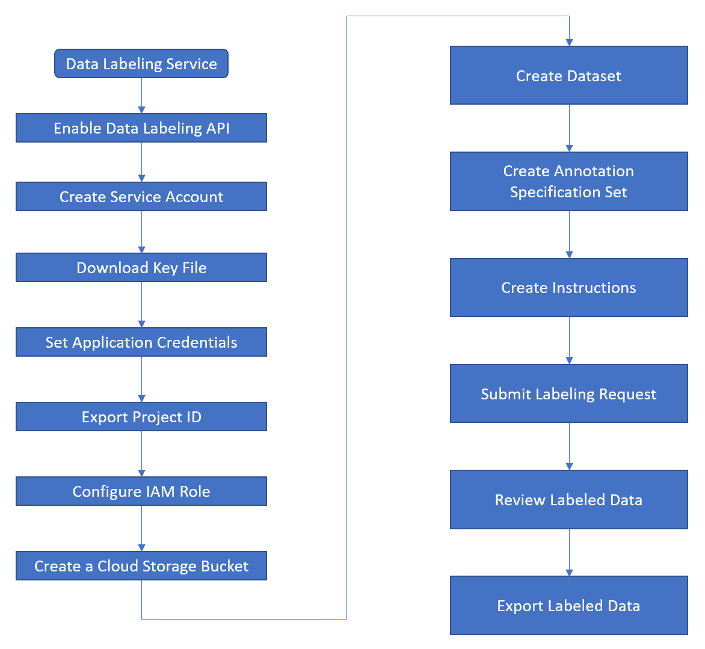

图 8.13-使用数据标记服务涉及的步骤

# 深度学习容器

这些容器提供了一个抽象的应用层，该层可以在各种环境中运行并且可以与基础操作系统无缝地协同工作。 这有助于开发人员专注于应用开发，因为所有依赖项均由容器管理，而与部署应用的环境无关。

AI 平台提供了一个现成的深度学习容器，其中包含关键的数据科学框架，库和工具。 AI 平台上的深度学习容器包含 TensorFlow，PyTorch，scikit-learn 和 R 框架，以及 Python 和 R 运行时。 容器中还包括最常用的 Python 软件包。

# 训练和利用 TensorFlow 模型涉及的步骤

在本部分中，我们将逐步介绍在 AI 平台上训练 TensorFlow 模型所涉及的所有步骤。 本地机器学习管道以及 AI 平台上的核心组件是相似的，因此，应用开发人员很容易利用熟悉的过程在 AI 平台上构建和部署模型。 以下屏幕截图中的流程图表示在 AI 平台上训练和使用 TensorFlow 模型的一般步骤：

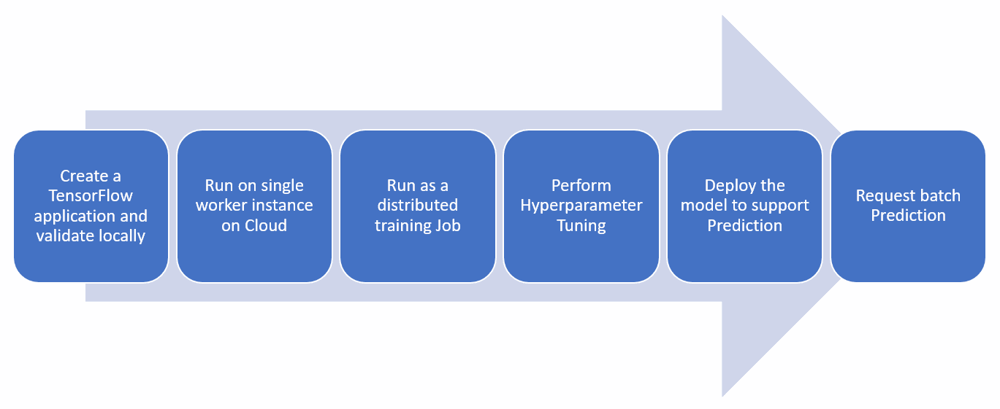

图 8.14-在 AI 平台上训练和使用 TensorFlow 模型的通用步骤

# 先决条件

为了在 AI 平台上训练，部署和利用 TensorFlow 模型，我们需要考虑以下组件的成本：

*   **AI 平台**：训练/部署/预测
*   **云存储**：用于训练/分段应用包/训练工件的输入数据

训练和部署 TensorFlow 模型的主要要求是创建一个项目。 创建项目并启用计费后，我们需要启用 AI 平台和 Compute Engine API。 此时，请安装云**软件开发套件**（**SDK**），并使用身份验证和授权对其进行初始化。

至此，完成了与平台相关的先决条件。 现在，我们需要为应用运行设置环境。

在 GCP 控制台中，单击顶部菜单栏上的“激活 Cloud Shell”按钮。 这将打开 Cloud Shell Web 界面。

这是我们需要从 Cloud Shell 采取的步骤：

1.  列出 AI 平台上存在的所有模型。
2.  更新 AI 平台上的所有组件。
3.  安装或升级 TensorFlow。

您可以在控制台的以下屏幕截图中看到突出显示的上述步骤：

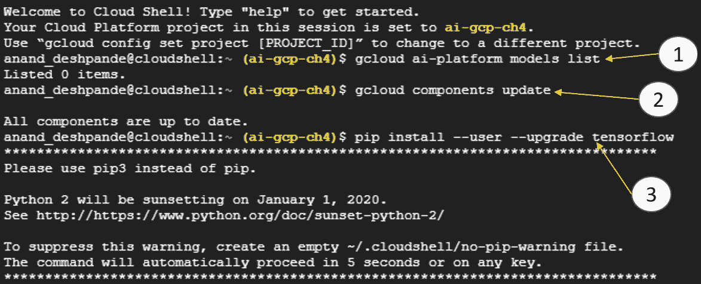

图 8.15-通过 GCP 控制台进行 AI 平台设置的要求

至此，环境设置完成。 现在，我们可以在本地开发和验证训练应用。 在云上运行该应用之前，建议在本地运行该应用以进行快速调试，并确保所有程序都能按预期工作。 在本地运行应用时，云资源不会产生任何费用。

# 创建一个 TensorFlow 应用并在本地运行

训练应用是根据开发人员的偏好和项目的上下文构造的。 但是，有一个推荐的项目结构，可以确保各个项目之间的一致性，并且不需要进行上下文开发人员训练。

# 项目结构推荐

让我们设置项目结构：

1.  创建一个主项目目录，其中包含应用的所有代码。
2.  在主项目目录中创建一个`setup.py`文件。 `setup.py`文件确保所有子目录都包含在用于应用分发的存档包中。 以下代码块显示了`setup.py`的典型实现：

```py
from setuptools import setup, find_packages
import os

NAME = 'preprocessing'
VERSION = 'x.y'
REQUIRED_PACKAGES = [COMMA_SEPARATED LIST OF PACKAGES]

setup(
    name=NAME,
    version=VERSION,
    packages=find_packages(),
    install_requires=REQUIRED_PACKAGES, 
    )
```

3.  创建一个名为`trainer`的子目录。 `trainer`目录包含应用模块代码，并且通常包含以下文件：
    *   `task.py`：这是主要的应用模块，以及包含负责训练作业的编排的应用逻辑的文件。
    *   `model.py`：这是包含模型逻辑以及模型的各种属性和配置参数的文件。
4.  创建使应用模块化和逻辑可读的各种子目录。

5.  建议在每个子目录中创建一个`__init__.py`文件。 通常，`Setuptools`将这些用作包装应用的标记。
6.  当调用`gcloud`命令进行训练时，`package-path`参数设置为`trainer`目录。 运行时在父目录中搜索`setup.py`文件，并根据`trainer`目录中`task.py`和`model.py`文件中的代码训练模型。

# 训练数据

在此示例中，我们将使用人口普查收入数据，它是公共可用的数据集之一。 这是数据集的特征：

*   **摘要**：基于 14 个属性的数据集，用于预测一个人的收入是低于还是大于 50,000 美元。
*   **类型**：多变量。
*   **实例**的数量：48,842。
*   **区域**：社交。
*   **属性类型**：类别/整数。

让我们继续进行模型训练。

1.  在以下命令的帮助下，打开 Cloud Shell 并下载示例代码：

```py
wget https://github.com/GoogleCloudPlatform/cloudml-samples/archive/master.zip
unzip master.zip
cd cloudml-samples-master/census/estimator
```

2.  在以下命令的帮助下获取训练数据：

```py
mkdir data
gsutil -m cp gs://cloud-samples-data/ai-platform/census/data/* data/
TRAIN_DATA=$(pwd)/data/adult.data.csv
EVAL_DATA=$(pwd)/data/adult.test.csv
```

3.  创建用于存储模型和中间文件的输出目录。

4.  为了在本地运行模型，我们需要使用以下命令：

```py
gcloud ai-platform local train \
    --module-name trainer.task \
    --package-path trainer/ \
    --job-dir $MODEL_DIR \
    -- \
    --train-files $TRAIN_DATA \
    --eval-files $EVAL_DATA \
    --train-steps 1000 \
    --eval-steps 100
```

这是模型输出目录的屏幕截图：


图 8.16-模型输出目录

训练和评估模型后，即可使用 TensorBoard 分析各种模型训练参数。 TensorBoard 是 TensorFlow 打包的可视化工具包。 它有助于在模型图中可视化和分析损失和准确率。 以下命令用于将 TensorBoard 作为 Web 应用启动（默认在端口`8080`上）：

```py
tensorboard --logdir=$MODEL_DIR --port=8080
```

前面的命令将返回以下输出。 我们来看一下：

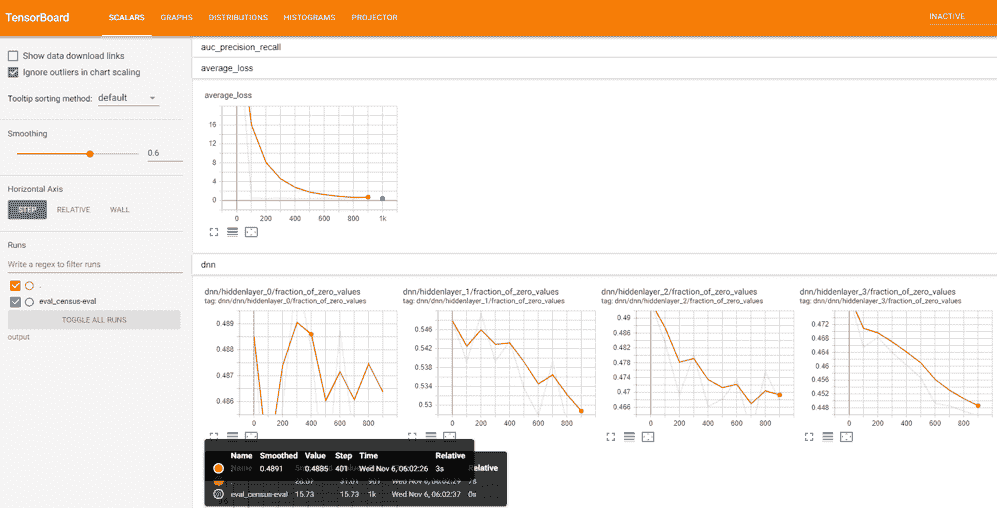

图 8.17 使用 TensorBoard 的模型视图

正如我们从前面的屏幕截图中可以看到的那样，TensorBoard 可以通过直观的可视化工具轻松分析模型性能。

在下一部分中，让我们看一下打包和部署训练应用所涉及的步骤。

# 在 Cloud ML Engine 中打包和部署您的训练应用

重要的是要了解在 ML Engine 中打包和部署应用的正确方法。 在本节中，我们将讨论机器学习应用的打包和部署中的一些推荐方法和最佳实践。 我们可以使用`gcloud`命令行工具来打包和上传应用。 最简单的方法是使用以下命令进行打包以及上载应用，同时提交训练作业：

```py
gcloud ai-platform jobs submit training
```

让我们定义打包和部署应用所需的全局环境变量，如下所示：

*   `PATH_TRAINER_PACKAGE`：训练作业所需的所有源代码文件的标准路径。
*   `TRAINER_MODULE`：这是`.task`文件的名称，该文件代表主应用模块，并且该文件包含负责训练作业的编排的应用逻辑。
*   `STAGING_BUCKET`：这是训练作业运行时用于存储中间结果和临时文件的 Google 存储空间上的路径。

除了这些之外，我们需要设置变量以表示作业名称，作业目录和区域。 作业名称可用于跟踪与作业相关的数据和沿袭点； 作业目录存储训练作业的中间结果和最终结果； 并且需要该区域在适当的位置运行训练工作，以优化计算和存储成本并最小化开销。

这是一个使用`gcloud ai-platform`命令负责打包和部署应用的命令：

```py
gcloud ai-platform jobs submit training $JOB_NAME \
    --staging-bucket $STAGING_BUCKET \
    --job-dir $JOB_DIR \
    --package-path $PATH_TRAINER_PACKAGE \
    --module-name $TRAINER_MODULE \
    --region $REGION \
    -- \
    --user_first_arg=first_arg_value \
    --user_second_arg=second_arg_value
```

除了运行命令的必需参数之外，我们还可以将许多用户定义的和应用特定的参数传递给此脚本。 参数值可用于运行时和特定于应用的逻辑的实现。

训练作业还可能需要一些依赖关系才能成功运行训练作业。 有两种类型的依赖关系需要解决：

*   **标准 Python 依赖项**：这些是 PyPI 上可用的标准 Python 软件包。 AI 平台通过`pip install`命令安装了标准依赖项。 这类似于独立应用的依赖项解析。 定义 AI 平台上的依赖项的标准方法是提及`setup.py`文件中的依赖项。 `setup.py`文件需要放置在应用的根目录中。 在以下代码片段中可以看到`setup.py`文件的模板：

```py
from setuptools import find_packages
from setuptools import setup

REQUIRED_PACKAGES = ['comma separated list of required packages']
setup(
    name='trainer',
    version='0.1',
    install_requires=REQUIRED_PACKAGES,
    packages=find_packages(),
    include_package_data=True,
    description='Setup details and required packages for the training application'
)
```

*   **用户定义和自定义依赖项**：这些是应用在运行时所需的用户定义包。 AI 平台可以使用`pip install`命令解决这些依赖性。 定制依赖项程序包需要在运行时可供应用访问，因此，需要提供该程序包的标准 URI 作为脚本的参数。 建议将软件包文件存储在可访问的 Cloud Storage 位置。 使用`gcloud`命令时，依赖项可以放在本地计算机上，也可以放在 Cloud Storage 上。 AI 平台按照它们在命令中出现的顺序对这些依赖项进行分级。 需要将多个依赖项指定为以逗号分隔的列表。

在下一节中，我们将学习如何通过选择正确的计算选项和运行时参数来优化训练工作。

# 为您的训练工作选择正确的计算选项

重要的是为训练工作选择正确的计算选项，以便最佳利用平台资源。 这导致训练时间和成本最小化。 我们需要为训练作业设置运行时属性。 训练工作是 AI 平台上的标准对象。 训练工作的结构如下（输入参数以**粗体**字体突出显示，[请在此链接中找到完整的配置](https://github.com/PacktPublishing/Hands-On-Artificial-Intelligence-on-Google-Cloud-Platform)：

```py
{
  "jobId": string, //Required: user defined identifier for the job
  "createTime": string,          //Output Parameter: indicates when a job was created 
  "labels": {                    //Optional Input Parameter: recommended to be used for organizing 
    string: string,              //and troubleshooting the run-time jobs.   
    ...
  },
 "trainingInput": { //Required: specifies the input parameters for the training job.  
 object (TrainingInput)
 },
  "predictionInput": {           //Required: specifies the input parameters for the prediction job. 
 object (PredictionInput)
 }
}
```

具体来说，我们需要为运行时作业配置填充`TrainingInput`或`PredictionInput`资源。 这些对于特定请求是互斥的，并且在运行时仅需要使用这些输入参数之一。 让我们详细查看`TrainingInput`参数的以下 JSON 结构（[请在此链接中找到完整的配置](https://github.com/PacktPublishing/Hands-On-Artificial-Intelligence-on-Google-Cloud-Platform)）：

```py
{
  "scaleTier": enum (ScaleTier),    //Required: specifies machine types, count of replicas, workers,parameter servers
  "packageUris": [                 //Required: These are the Google Cloud Storage locations for
    string                         // the packages containing the training program along with
  ],                               //          additional dependencies
  "pythonModule": string,          //Required: The python module to run after importing all the 
  "args": [                        //packages and resolving the dependencies 
    string
  ],
  "hyperparameters": {             //Optional: The set of hyper-parameters to be tuned. 
    object (HyperparameterSpec)
  },
  "region": string,               //Required: The compute engine region on which the training job will run
}
```

我们将详细研究`ScaleTier`和`HyperParameterSpec`对象。 在此之前，让我们了解在提交预测作业时使用的`PredictionInput`对象的 JSON 结构，如以下代码块所示：

```py
{
  "dataFormat": enum (DataFormat),        //Required: Format of the input data file (JSON, TEXT, etc.)    
  "outputDataFormat": enum (DataFormat),  //Optional: Format of the output data file (default-JSON)
  "inputPaths": [                         //Required: Cloud storage location of input data files
    string
  ],
  "maxWorkerCount": string,               //Optional: Maximum number of workers (default-10)
  "region": string,                       //Required: Google Compute Engine region
  "runtimeVersion": string,               //Optional: AI Platform run-time version
  "batchSize": string,                    //Optional: Number of records per batch (default-64)
  "signatureName": string,                //Optional: Name of signature defined in the saved model
  "modelName": string,                    
  "versionName": string,
  "uri": string
  "outputPath": string
}
```

选择正确的参数后，可以极大地优化训练和预测性能。 我们需要了解各种规模的层和超参数，以进一步优化性能和成本。 根据训练数据的数量和算法的复杂性，选择合适的比例尺等级很重要。 想法是仅使用适当数量的资源进行训练和预测。 这有助于最小化训练单元的成本。 根据需要，高级层在 CPU 内核数和 GPU 利用率方面具有额外的容量。 但是，随着等级的提高，成本也会增加。 GCP 上有各种可用的规模级别，如下所示：

*   `BASIC`：提供单个工作程序实例，适合于学习和实验。 这也可以用于小尺寸的概念证明（**POC**）。
*   `STANDARD_1`：提供多个工作程序节点和仅几个参数服务器。
*   `PREMIUM_1`：为大量工作人员提供许多参数服务器。
*   `BASIC_GPU`：为单个工作程序实例提供 GPU。
*   `CUSTOM`：此层允许设置主服务器类型，工作程序计数，参数服务器计数和参数服务器类型的自定义值。 选择`CUSTOM`标度等级时，`TrainingInput`中的这些参数成为必需参数。

除了比例等级之外，我们还需要仔细选择超参数值，以进一步优化训练效果。

# 为训练工作选择超参数

通过`TrainingInput`对象中的`HyperparameterSpec`对象控制超参数。 以下代码块显示了`HyperParameterSpec`对象的结构：

```py
{
  "goal": enum (GoalType),            //Required: The type of goal used for tuning [MAXIMIZE/MINIMIZE]
  "params": [                         //Required: The set of parameters to be tuned
    {
      object (ParameterSpec)
    }
  ],
  "maxTrials": number,               //Optional: Number of trials to be attempted (default-1)
  "maxParallelTrials": number,       //Optional: Number of parallel trials. May reduce quality of                                              //          optimization
  "maxFailedTrials": number,         //Optional: Number of failed trials before the hyper parameter tuning                                      //          job is failed
  "hyperparameterMetricTag": string, //Optional: TensorFlow summary tag name for optimizing trials. 
  "resumePreviousJobId": string,     
  "enableTrialEarlyStopping": boolean,
  "algorithm": enum (Algorithm)      //Optional: Search algorithm used by the hyper parameter tuning job
}                                    //          ALGORITHM_UNSPECIFIED / GRID_SEARCH / RANDOM_SEARCH
```

虽然成本是选择计算资源时的基本考虑因素之一，但我们还需要了解，平台对训练资源的使用存在一些限制，这些限制由各种操作的配额设置。 让我们简要地看一下 AI 平台施加的配额限制。

由于多租户云平台的固有性质，特定用户和项目所使用的资源需要受到配额的限制和控制，以防止错误地过度使用资源。 AI 平台还根据服务请求强加了一些配额限制。 分配给项目的任何用户帐户每分钟只能发起一定数量的单个 API 请求。 该限制适用于特定的 API 或一组 API，如下所示：

*   作业创建请求：1 分钟内最多可以发出 60 个请求。
*   预测请求：1 分钟内最多可以提出 6,000 个请求。
*   以下用于资源管理的子 API 的请求总数：每分钟最多 300 个请求：
    *   `list/get`（`projects.jobs`，`projects.model`秒，`projects.models.versions`，`projects.operations`）
    *   `delete/create`（`projects.models`，`projects.models`。`versions`）
    *   `cancel`（`projects.jobs`，`projects.operations`）
    *   `setDefault`

除服务请求外，每个项目最多有 100 个模型，每个模型最多可以有 200 个版本。

在某些情况下，无法创建具有这些限制的 AI 应用的生产版本。 GCP 允许通过管理控制台请求增加配额。 此外，AI 平台还限制了虚拟机的并发使用次数，如下所示：

*   并发预测节点数：72
*   预测节点中运行的并发 vCPU 数量：450

用于训练的 GPU 的限制如下：

| **GPU 类型** | **并行 GCP（训练）** | **并行 GPU（预测）** |
| --- | --- | --- |
| Tesla K80 | 30 | 30 |
| Tesla P4 | 8 | 2 |
| Tesla P100 | 30 | 30 |
| Tesla V100 | 8 | 8 |
| Tesla T4 | 6 | 6 |

我们需要从可用选项中仔细选择，以优化性能和成本。 在下一节中，我们将研究如何在 GCP 上监视 TensorFlow 模型作业。

# 监控您的 TensorFlow 训练模型作业

模型训练工作所需的时间与训练数据量和训练模型的复杂度成比例。 应用必须能够报告训练工作的状态。 AI 平台提供了三种主要方法来监视训练工作。 GCP 控制台提供了用于列出训练作业的用户界面。 `gcloud` CLI 和自定义 Python 代码可用于获取训练作业的状态。

以下是用于监视训练作业的`gcloud`命令：

```py
gcloud ai-platform jobs describe job_name
```

该命令返回当前正在运行的作业的状态，由`job_name`参数指示，如下所示：

```py
gcloud ai-platform jobs list --limit=5
```

此命令返回项目平台上当前正在运行的所有作业的列表。

# 总结

在本章中，我们已经了解了如何借助 Cloud ML Engine（AI 平台）在 GCP 上利用无服务器机器学习。 我们已经看到了访问 AI 平台的各种方法，以及构建 TensorFlow 应用以及打包和部署模型的方法。 我们还研究了在 AI 平台上组织应用，通过使用正确级别的基础架构来优化性能，同时节省成本的最佳实践。 最后，我们学习了如何使用命令行工具监视应用。

在下一章中，我们将使用 TensorFlow 模型构建预测应用，并在 GCP 上采用实用的方法进行 AI 应用开发。