# 受限的玻尔兹曼机器和自编码器

当您在线购物或浏览电影时，您可能会想知道您可能也喜欢的或*电影的*产品如何工作。 在本章中，我们将说明幕后算法，称为**受限 boltzmann 机**（**RBM**）。 我们将首先回顾 RBM 及其发展路径。 然后，我们将更深入地研究其背后的逻辑，并在 TensorFlow 中实现 RBM。 我们还将应用它们来构建电影推荐器。 除了浅层架构，我们还将继续使用称为**深度信念网络**（**DBN**）的 RBM 堆叠版本，并使用它对图像进行分类，当然，我们在 TensorFlow 中的实现 刮。**

RBM 通过尝试重建输入数据来找到输入的潜在表示。 在本章中，我们还将讨论自编码器，这是另一种具有类似想法的网络。 在本章的后半部分，我们将继续介绍自编码器，并简要介绍它们的发展路径。 我们将说明按照其体系结构或形式化形式分类的各种自编码器。 我们还将采用不同类型的自编码器来检测信用卡欺诈。 这将是一个有趣的项目，更令人着迷的是，您将看到这些自编码器种类如何努力学习使用某些体系结构或强加约束形式的更健壮的表示形式。

我们将深入探讨以下主题：

*   什么是 RBM？
*   成果管理制的发展路径
*   在 TensorFlow 中实施 RBM
*   电影推荐的 RBM
*   数据库
*   TensorFlow 中 DBN 的实现
*   DBN 用于图像分类
*   什么是自编码器？
*   自编码器的发展路径
*   香草自编码器
*   深度自编码器
*   稀疏的汽车编码器
*   去噪自编码器
*   压缩自编码器
*   自编码器用于信用卡欺诈检测

# 什么是 RBM？

RBM 是一种生成型随机神经网络。 通过说生成式，它表明网络对输入集上的概率分布进行建模。 随机意味着神经元在被激活时具有随机行为。 RBM 的一般图如下所示：

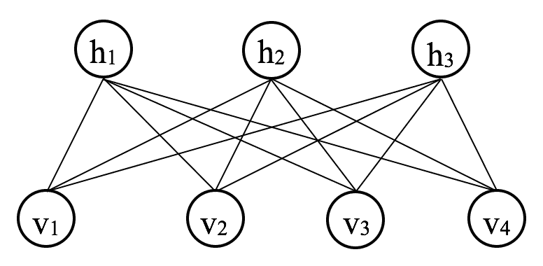

通常，RBM 由一个输入层组成，该输入层通常称为可见层（**v <sub>1</sub>** ， **v2** ， **v3** ， **v4** 和一个隐藏层（**h <sub>1</sub>** ， **h2** ，`h`[HTG18 例如，] 3 ，`h``4`。 RBM 模型由与可见层和隐藏层之间的连接相关的权重 *W = {*  *}* 以及偏差 *a = [ * 用于可见层，偏置 *b = * 用于隐藏层。

RBM 中显然没有输出层，因此学习与前馈网络中的学习有很大不同，如下所示：

*   与其减少描述地面实况与输出层之间差异的损失函数，不如尝试减少能量函数，该函数定义如下：


对于不熟悉能量函数的人，术语**能量**来自物理学，用于量化大型物体对另一个物体的重力。 物理学中的能量函数测量两个对象或机器学习中两个变量的兼容性。 能量越低，变量之间的兼容性越好，模型的质量越高。

*   与产生输出相反，它在其可见和隐藏单元集上分配概率，并且每个单元在`0`（关闭）或`1`（激活）的二进制状态下 时间点。 给定可见层`v`，隐藏单元被激活的概率计算如下：


类似地，给定一个隐藏层`h`，我们可以如下计算可见单元被激活的概率：


由于`h`和`v`的状态基于彼此随机分配给`0`或`1`，因此可以通过重复 采样程序少。 下图演示了此过程：

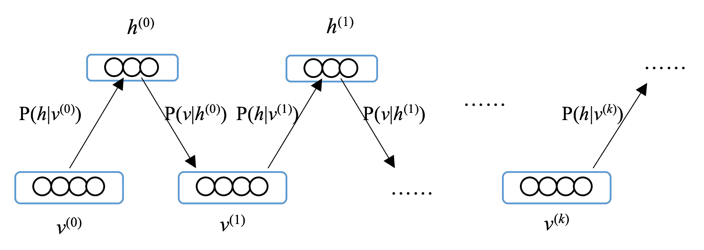

从可见层 *v <sup>（0）</sup>* 的初始状态开始，计算 *P（h | v <sup>（0）</sup>）*； 隐藏层 *h <sup>（0）</sup>* 用 *P（h | v <sup>（0）</sup>）*采样，然后计算 *P（v | h <sup>（0）</sup>）*。 接下来，基于 *P（v | h <sup>（0）</sup>）*和 *h 采样状态 *v <sup>（1）</sup>* <sup>（1）</sup>* 基于 *P（h | v <sup>（1）</sup>）*，依此类推。 此过程称为吉布斯采样。 也可以将其视为重建可见层。

*   根据初始状态 *v <sup>（0）</sup>* 和状态 *v <sup>（k）</sup>*`k`Gibbs 步骤之后，其中表示外部乘积：


这些梯度称为对比散度。

我希望您现在已经掌握了成果管理制背后的理论。 在简要介绍了 RBM 的演变路径之后，您将在动手部分中增强对 RBM 的理解，我们将在下一节中进行介绍。

# 成果管理制的发展路径

顾名思义，RBM 源自 Boltzmann 机器。 Boltzmann 机器由 Geoffrey Hinton 和 Paul Smolensky 于 1983 年发明，是一种网络类型，其中所有单元（可见和隐藏）都处于二进制状态并连接在一起。 尽管他们具有学习有趣的表示形式的理论能力，但对他们来说还是有许多实际问题，包括培训时间，培训时间随模型大小呈指数增长（因为所有单元都已连接）。 玻尔兹曼机的总体示意图如下：

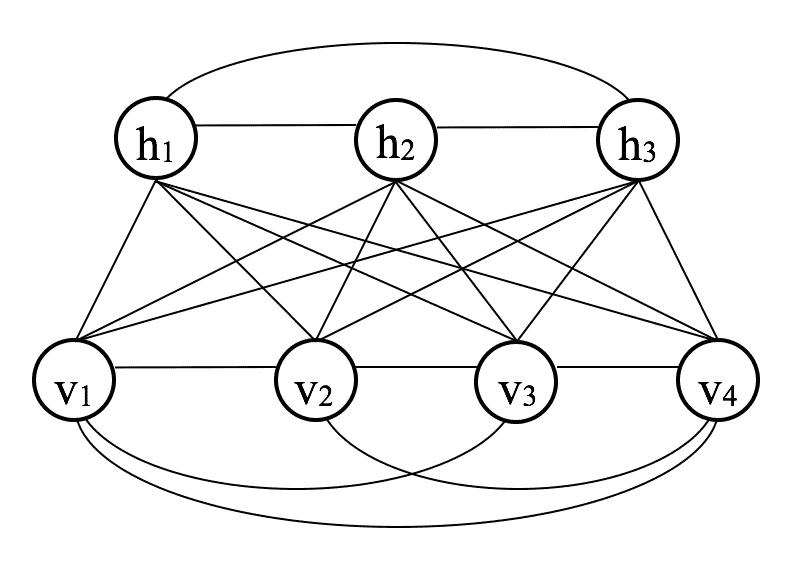

为了使学习 Boltzmann 机器模型更容易，Paul Smolensky 于 1986 年首次发明了一种称为 Harmonium 的连接受限的版本。 在 2000 年中期，Geoffrey Hinton 和其他研究人员发明了一种效率更高的体系结构，该体系结构仅包含一个隐藏层，并且不允许隐藏单元之间进行任何内部连接。 从那时起，RBM 被应用于各种有监督的学习任务中，包括：

*   图像分类，（*使用判别受限的 Boltzmann 机器进行分类*，由 H. Larochelle 和 Y. Bengio 撰写，第 25 届国际机器学习会议论文集，2008：536-543）
*   语音识别（*，使用 N. Jaitly 和 G.Hinton，使用受限的 Boltzmann 机器*学习语音声波的更好表示，国际声学，语音和信号处理会议，2011：5884-5887）

它们也已应用于无人监督的学习任务，包括以下内容：

*   降维（*使用神经网络降低数据的维数*，G。Hinton 和 R.Salakhutdinov，科学，2006 年 7 月：504-507）
*   特征学习（A.Coates 等人，国际人工智能与统计会议 2011：215-223，无监督特征学习中的单层网络分析 *n），当然还有协作过滤和推荐系统 ，我们将在本节之后进行处理*

您可能会注意到，RBM 有点*浅*，只有一个隐藏层。 Geoffrey Hinton 在 2006 年推出了称为[DBN]的*深*版本的 RBM。DBN 可以看作是堆叠在一起的一组 RBM，其中一个 RBM 的隐藏层是下一个 RBM 的可见层。 隐藏层充当分层特征检测器。 DBN 的一般图如下所示：


DBN 也有许多有趣的应用程序，例如：

*   电话识别（*用于电话识别的深度信念网络*，由 A. Mohamed 等人在 NIPS 语音识别和相关应用深度学习研讨会的论文集中进行，2009 年）
*   脑电信号（*脑电图的深层信念网络：对近期贡献和未来展望的回顾*，作者：F。Movahedi 等人，在 IEEE Biomedical and Health Informatics，2018 年 5 月； 22（3）：642- 652）
*   自然语言理解（*深度信念网络对自然语言理解*的应用，作者 R. Sarikaya 等人，在 IEEE / ACM 音频，语音和语言处理交易中，2014 年 4 月； 22（4）：778 -784）

按照承诺，我们现在将详细研究 RBM 及其深版本 DBN，然后将其应用于实际问题。

# RBM 体系结构和应用

我们将首先介绍 RBM 及其实现，以及它们在推荐系统中的应用，然后再转到 DBN 并利用它们对图像进行分类。

# RBM 及其在 TensorFlow 中的实施

让我们从初始化 RBM 模型的参数开始。 回想一下，RMB 模型由与可见层和隐藏层之间的连接关联的权重`W`，可见层的偏置`a`和偏置`b`组成。 用于隐藏层。 RBM 对象由权重`W`，偏差`a`和`b`，可见单元数和隐藏单元数，Gibbs 步骤数构成。 常规神经网络超参数，包括批处理大小，学习率和时期数：

```py
>>> import numpy as np
>>> import tensorflow as tf
>>> class RBM(object):
...     def __init__(self, num_v, num_h, batch_size, learning_rate, 
                     num_epoch, k=2):
...         self.num_v = num_v
...         self.num_h = num_h
...         self.batch_size = batch_size
...         self.learning_rate = learning_rate
...         self.num_epoch = num_epoch
...         self.k = k
...         self.W, self.a, self.b = self._init_parameter()
```

在属性初始化之后，我们定义`_init_`参数方法如下：

```py
>>> def _init_parameter(self):
...     """ Initializing the model parameters including weights 
            and bias 
        """
...     abs_val = np.sqrt(2.0 / (self.num_h + self.num_v))
...     W = tf.get_variable('weights', shape=(self.num_v, self.num_h),
                   initializer=tf.random_uniform_initializer(
                                    minval=-abs_val, maxval=abs_val))
...     a = tf.get_variable('visible_bias', shape=(self.num_v),
                                    initializer=tf.zeros_initializer())
...     b = tf.get_variable('hidden_bias', shape=(self.num_h), 
                                    initializer=tf.zeros_initializer())
...     return W, a, b

```

直观地，我们可以安全地将所有偏差初始化为 0。对于权重，最好使用启发式方法将其初始化。 常用的启发式方法包括：

*   
*   ，也称为 **xavier 初始化**
*   

这些启发式方法有助于防止收敛缓慢，并且通常是权重初始化的良好起点。

正如我们前面提到的，训练 RBM 模型是一个搜索参数的过程，该参数可以通过 Gibbs 采样最好地重构输入向量。 让我们实现 Gibbs 采样方法，如下所示：

```py
>>> def _gibbs_sampling(self, v):
...     """
...     Gibbs sampling
...     @param v: visible layer
...     @return: visible vector before Gibbs sampling, 
                 conditional probability P(h|v) before Gibbs sampling,
                 visible vector after Gibbs sampling,
                 conditional probability P(h|v) after Gibbs sampling
...     """
...     v0 = v
...     prob_h_v0 = self._prob_h_given_v(v0)
...     vk = v
...     prob_h_vk = prob_h_v0
...     for _ in range(self.k):
...         hk = self._bernoulli_sampling(prob_h_vk)
...         prob_v_hk = self._prob_v_given_h(hk)
...         vk = self._bernoulli_sampling(prob_v_hk)
...         prob_h_vk = self._prob_h_given_v(vk)
...     return v0, prob_h_v0, vk, prob_h_vk
```

给定输入向量 *vk* ，吉布斯采样开始于计算 *P（h | v）*。 然后执行 Gibbs 步骤。 在每个吉布斯步骤中，隐藏层`h`是根据 *P（h | v）*通过伯努利采样获得的； 计算条件概率 *P（v | h）*并用于生成可见矢量`v`的重建版本； 并根据最新的可见矢量更新条件概率 *P（h | v）*。 最后，它返回 Gibbs 采样之前和之后的可见向量，以及 Gibbs 采样之前和之后的条件概率 *P（h | v）*。

现在，我们实现了条件概率 *P（v | h）*和 *P（h | v）*的计算，以及伯努利采样：

*   计算如下：

```py
>>> def _prob_v_given_h(self, h):
...     """
...     Computing conditional probability P(v|h)
...     @param h: hidden layer
...     @return: P(v|h)
...     """
...     return tf.sigmoid(
              tf.add(self.a, tf.matmul(h, tf.transpose(self.W))))
```

*   计算如下：

```py
>>> def _prob_h_given_v(self, v):
...     """
...     Computing conditional probability P(h|v)
...     @param v: visible layer
...     @return: P(h|v)
...     """
...     return tf.sigmoid(tf.add(self.b, tf.matmul(v, self.W)))
```

*   现在，我们将计算伯努利抽样，如下所示：

```py
>>> def _bernoulli_sampling(self, prob):
...     """ Bernoulli sampling based on input probability """
...     distribution = tf.distributions.Bernoulli(
                                  probs=prob, dtype=tf.float32)
...     return tf.cast(distribution.sample(), tf.float32)
```

现在我们能够计算吉布斯采样前后的可见输入和条件概率 *P（h | v）*，我们可以计算梯度，包括 *，Δa= v <sub>0</sub> -v <sub> k </sub>* 和*Δb= P（h | v <sup>（0）</sup>）-P（h | v <sup>（k）</sup> ）*，如下所示：

```py
>>> def _compute_gradients(self, v0, prob_h_v0, vk, prob_h_vk):
...     """
...     Computing gradients of weights and bias
...     @param v0: visible vector before Gibbs sampling
...     @param prob_h_v0: conditional probability P(h|v) 
                                         before Gibbs sampling
...     @param vk: visible vector after Gibbs sampling
...     @param prob_h_vk: conditional probability P(h|v) 
                                        after Gibbs sampling
...     @return: gradients of weights, gradients of visible bias,
                 gradients of hidden bias
...     """
...     outer_product0 = tf.matmul(tf.transpose(v0), prob_h_v0)
...     outer_productk = tf.matmul(tf.transpose(vk), prob_h_vk)
...     W_grad = tf.reduce_mean(outer_product0 - outer_productk, axis=0)
...     a_grad = tf.reduce_mean(v0 - vk, axis=0)
...     b_grad = tf.reduce_mean(prob_h_v0 - prob_h_vk, axis=0)
...     return W_grad, a_grad, b_grad
```

使用 Gibbs 采样和渐变，我们可以组合一个以时间为单位的参数更新，如下所示：

```py
>>> def _optimize(self, v):
...     """
...     Optimizing RBM model parameters
...     @param v: input visible layer
...     @return: updated parameters, mean squared error of reconstructing v
...     """
...     v0, prob_h_v0, vk, prob_h_vk = self._gibbs_sampling(v)
...     W_grad, a_grad, b_grad = self._compute_gradients(v0, prob_h_v0, vk,  
                                                         prob_h_vk)
...     para_update=[tf.assign(self.W, 
                           tf.add(self.W, self.learning_rate*W_grad)),
...                  tf.assign(self.a, 
                           tf.add(self.a, self.learning_rate*a_grad)),
...                  tf.assign(self.b, 
                           tf.add(self.b, self.learning_rate*b_grad))]
...     error = tf.metrics.mean_squared_error(v0, vk)[1]
...     return para_update, error
```

除了更新权重，偏差和偏差之外，我们还计算了重建可见层的均方误差。

到目前为止，我们已经准备好用于训练 RBM 模型的必要组件，因此下一步是将它们放在一起以形成 train 方法，如以下代码所示：

```py
>>> def train(self, X_train):
...     """
...     Model training
...     @param X_train: input data for training
...     """
...     X_train_plac = tf.placeholder(tf.float32, [None, self.num_v])
...     para_update, error = self._optimize(X_train_plac)
...     init = tf.group(tf.global_variables_initializer(),
                        tf.local_variables_initializer())
...     with tf.Session() as sess:
...         sess.run(init)
...         epochs_err = []
...         n_batch = int(X_train.shape[0] / self.batch_size)
...         for epoch in range(1, self.num_epoch + 1):
...             epoch_err_sum = 0
...             for batch_number in range(n_batch):
...                 batch = X_train[batch_number * self.batch_size:
                                  (batch_number + 1) * self.batch_size]
...                 _, batch_err = sess.run((para_update, error),
                                       feed_dict={X_train_plac: batch})
...                 epoch_err_sum += batch_err
...             epochs_err.append(epoch_err_sum / n_batch)
...             if epoch % 10 == 0:
...                 print("Training error at epoch %s: %s" % 
                                               (epoch,epochs_err[-1]))
```

请注意，我们在训练中采用小批量梯度下降，并记录每个时期的训练误差。 整个训练过程都依赖于`_optimize`方法，该方法适合每个数据批次上的模型。 它还会每隔`10`个时间段输出训练错误，以确保质量。

我们刚刚完成了 RBM 算法的实现。 在下一节中，我们将其应用于电影推荐。

# 电影推荐的 RBM

众所周知，电子商务网站会根据用户的购买和浏览历史向他们推荐产品。 相同的逻辑适用于电影推荐。 例如，Netflix 根据用户在观看的电影上提供的反馈（例如评分）来预测用户喜欢的电影。 RBM 是推荐系统最受欢迎的解决方案之一。 让我们看一下推荐的 RBM 的工作原理。

给定经过训练的 RBM 模型，由用户喜欢，不喜欢和未观看的一组电影组成的输入从可见层转到隐藏层，然后又回到可见层，从而生成输入的重构版本 。 除了与用户进行交互的电影外，重构的输入还包含以前未评级的信息。 它可以预测是否会喜欢这些电影。 一般图如下所示：

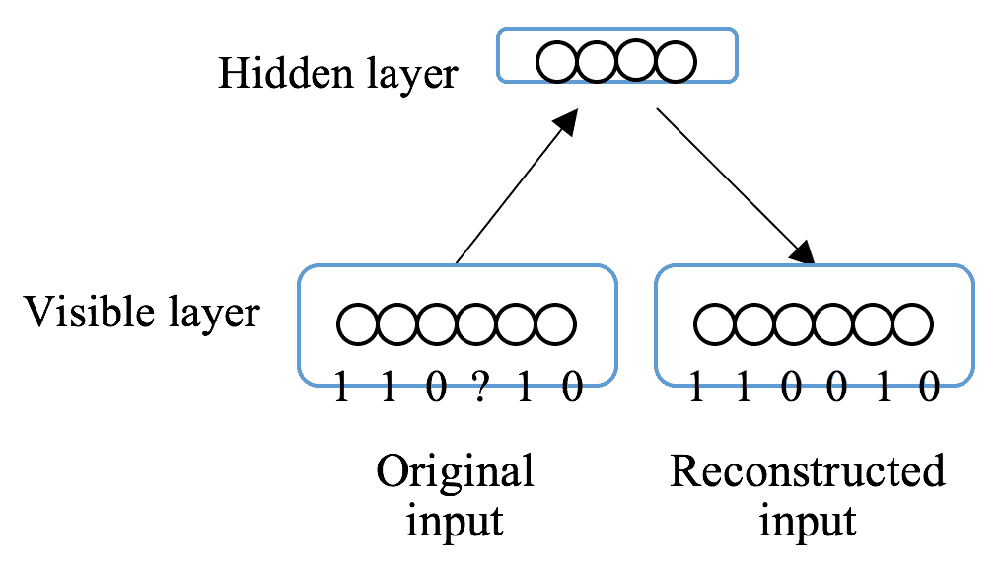

在此示例中，输入内容包括六部电影，其中三部被点赞（用`1`表示），两部不喜欢（用`0`表示），而另一部未分级（用 **？**）。 该模型接受输入并对其进行重构，包括*缺少的*电影。

因此，模型如何知道丢失的单位应为`0`（或`1`）？ 回忆每个隐藏的单元都连接到所有可见的单元。 在训练过程中，一个隐藏的单位试图发现一个潜在因素，该潜在因素可以解释数据中的一个属性，或本例中的所有电影。 例如，一个隐藏的二元单位可以了解电影类型是否是喜剧电影，是否属于正义电影，主题是否为复仇电影或其他任何捕捉到的东西。 在重构阶段，将为输入分配一个新值，该值是根据代表所有这些潜在因素的隐藏单位计算得出的。

听起来神奇吗？ 让我们开始构建基于 RBM 的电影推荐器。

我们将使用 [MovieLens](https://movielens.org) 中的电影评分数据集。 这是一个非商业性网站，用于收集用户的移动收视率并提供个性化建议，由明尼苏达大学的研究实验室 GroupLens 运营。

首先，我们将在[这个页面](https://grouplens.org/datasets/movielens/1m/)中查看 1M 基准数据集。 它包含来自 6,040 位用户的 3,706 部电影的大约一百万个收视率。 我们可以通过[这里](http://files.grouplens.org/datasets/movielens/ml-1m.zip)下载数据集并解压缩下载的文件。 等级包含在`ratings.dat`文件中，每一行是一个等级，格式如下：

```py
 UserID::MovieID::Rating::Timestamp
```

评分记录如下所示：

```py
1::1193::5::978300760
2::1357::5::978298709
10::1022::5::979775689
```

有几件事要注意：

*   用户 ID 的范围是 1 到 6,040
*   MovieID 的范围是 1 到 3,952，但并非每部电影都经过分级
*   评分是{1、2、3、4、5}之一
*   每个用户给几部电影评分

我们可以建立 RBM 模型，根据用户和其他人的电影评分推荐用户尚未观看的电影。

您可能会注意到输入额定值不是二进制的。 我们如何将它们提供给 RBM 模型？ 最简单的解决方法是二进制化，例如，将大于三的等级转换为`1`（类似），否则将其转换为`0`（不喜欢）。 但是，这可能会导致信息丢失。 或者，在我们的解决方案中，我们将原始评级缩放到`[0,1]`范围，并将每个重新缩放的评级视为获得`1`的概率。 也就是说，`v`= *P（v = 1 | h）*，不需要伯努利采样。

现在，让我们加载数据集并构建训练数据集。 不要忘了跟踪已分级的电影，因为并非所有电影都已分级：

```py
>>> import numpy as np
>>> data_path = 'ml-1m/ratings.dat'
>>> num_users = 6040
>>> num_movies = 3706
>>> data = np.zeros([num_users, num_movies], dtype=np.float32)
>>> movie_dict = {}
>>> with open(data_path, 'r') as file:
    ... for line in file.readlines()[1:]:
    ... user_id, movie_id, rating, _ = line.split("::")
    ... user_id = int(user_id) - 1
    ... if movie_id not in movie_dict:
    ... movie_dict[movie_id] = len(movie_dict)
    ... rating = float(rating) / 5
    ... data[user_id, movie_dict[movie_id]] = rating
>>> data = np.reshape(data, [data.shape[0], -1])
>>> print(data.shape)(6040, 3706)
```

训练数据集的大小为 6,040 x 3,706，每行包含`3706`缩放等级，包括`0.0`，表示未分级。 可以将其显示为下表（虚拟）以获得更直观的视图：

|  | `movie_0` | `movie_1` | `movie_2` | ... | ... | `movie_n` |
| `user_0` | `0.0` | `0.2` | `0.8` | `0.0` | `1.0` | `0.0` |
| `user_1` | `0.8` | `0.0` | `0.6` | `1.0` | `0.0` | `0.0` |
| `user_2` | `0.0` | `0.0` | `1.0` | `1.0` | `0.8` | `0.0` |
| ... | ... | ... | ... | ... | ... | ... |
| `user_m` | `0.0` | `0.6` | `0.0` | `0.8` | `0.0` | `0.8` |

看一下它们的分布，如下所示：

```py
>>> values, counts = np.unique(data, return_counts=True)
>>> for value, count in zip(values, counts):
...     print('Number of {:2.1f} ratings: {}'.format(value, count))
Number of 0.0 ratings: 21384032
Number of 0.2 ratings: 56174
Number of 0.4 ratings: 107557
Number of 0.6 ratings: 261197
Number of 0.8 ratings: 348971
Number of 1.0 ratings: 226309
```

我们可以看到矩阵非常稀疏。 同样，那些`0`代表未被相应用户评级的电影，而不是获得`1`的可能性为零。 因此，在整个培训过程中，我们应将未分级电影的分级保持为零，这意味着我们应在每个吉布斯步骤之后将其还原为`0`。 否则，它们的重构值将包含在隐藏层和渐变的计算中，结果，该模型将在很大程度上未优化。

因此，我们修改了`_gibbs_sampling`和`_optimize`方法，如下所示：

```py
>>> def _gibbs_sampling(self, v):
...     """
...     Gibbs sampling (visible units with value 0 are unchanged)
...     @param v: visible layer
...     @return: visible vector before Gibbs sampling,
                 conditional probability P(h|v) before Gibbs sampling,
...              visible vector after Gibbs sampling,
                 conditional probability P(h|v) after Gibbs sampling
...     """
...     v0 = v
...     prob_h_v0 = self._prob_h_given_v(v0)
...     vk = v
...     prob_h_vk = prob_h_v0
...     for _ in range(self.k):
...         hk = self._bernoulli_sampling(prob_h_vk)
...         prob_v_hk = self._prob_v_given_h(hk)
...         vk_tmp = prob_v_hk
...         vk = tf.where(tf.equal(v0, 0.0), v0, vk_tmp)
...         prob_h_vk = self._prob_h_given_v(vk)
...     return v0, prob_h_v0, vk, prob_h_vk
```

我们采用 *v = P（v = 1 | h）*并使用`0`恢复等级，如下所示：

```py
>>> def _optimize(self, v):
...     """
...     Optimizing RBM model parameters
...     @param v: input visible layer
...     @return: updated parameters, mean squared error of reconstructing v
...     """
...     v0, prob_h_v0, vk, prob_h_vk = self._gibbs_sampling(v)
...     W_grad, a_grad, b_grad = self._compute_gradients(
                                    v0, prob_h_v0, vk, prob_h_vk)
...     para_update=[tf.assign(self.W, 
                            tf.add(self.W, self.learning_rate*W_grad)),
...                 tf.assign(self.a, 
                            tf.add(self.a, self.learning_rate*a_grad)),
...                 tf.assign(self.b, tf.add(self.b,
                            self.learning_rate*b_grad))]
...     bool_mask = tf.cast(tf.where(tf.equal(v0, 0.0),
                            x=tf.zeros_like(v0), y=tf.ones_like(v0)),                     
                            dtype=tf.bool)
...     v0_mask = tf.boolean_mask(v0, bool_mask)
...     vk_mask = tf.boolean_mask(vk, bool_mask)
...     error = tf.metrics.mean_squared_error(v0_mask, vk_mask)[1]
...     return para_update, error
```

在计算训练误差时，我们只考虑那些额定的电影，否则它将变得非常小。 通过这些更改，我们现在可以安全地将 RBM 模型拟合到训练集上，如以下代码所示：

```py
>>> rbm = RBM(num_v=num_movies, num_h=80, batch_size=64, 
              num_epoch=100, learning_rate=0.1, k=5)
```

我们以`80`隐藏单位，`64,100`历元的批处理大小，`0.1`的学习率和`5` Gibbs 步骤初始化模型，如下所示：

```py
>>> rbm.train(data)
Training error at epoch 10: 0.043496965727907545
Training error at epoch 20: 0.041566036522705505
Training error at epoch 30: 0.040718327296224044
Training error at epoch 40: 0.04024859795227964
Training error at epoch 50: 0.03992816338196714
Training error at epoch 60: 0.039701666445174116
Training error at epoch 70: 0.03954154300562879
Training error at epoch 80: 0.03940619274656823
Training error at epoch 90: 0.03930238915726225
Training error at epoch 100: 0.03921664716239939
```

训练误差减少到`0.039`，我们可以使用训练后的模型推荐电影。 为此，我们需要返回优化的参数并使用这些参数添加预测方法。

在我们之前定义的训练方法中，我们通过更改以下行来保留更新的参数：

```py
... _, batch_err = sess.run(
                 (para_update, error),feed_dict={X_train_plac: batch})
```

我们需要将以下几行替换为：

```py
... parameters, batch_err = sess.run((para_update, error),
                                      feed_dict={X_train_plac: batch})
```

然后，我们需要在方法末尾返回最后更新的参数，如下所示：

```py
... return parameters
```

引入训练后的模型并重建输入数据的预测方法定义如下：

```py
>>> def predict(self, v, parameters):
...     W, a, b = parameters
...     prob_h_v = 1 / (1 + np.exp(-(b + np.matmul(v, W))))
...     h = np.random.binomial(1, p=prob_h_v)
...     prob_v_h = 1 / 
                 (1 + np.exp(-(a + np.matmul(h, np.transpose(W)))))
...     return prob_v_h
```

现在，我们可以获得输入数据的预测，如下所示：

```py
>>> parameters_trained = rbm.train(data)
>>> prediction = rbm.predict(data, parameters_trained)
```

以一个用户为例，我们将五星级的电影与未评级的电影进行比较，但预计其评级将高于`0.9`。 以下代码均显示了这些内容：

```py
>>> sample, sample_pred = data[0], prediction[0]
>>> five_star_index = np.where(sample == 1.0)[0]
>>> high_index = np.where(sample_pred >= 0.9)[0]
>>> index_movie = {value: key for key, value in movie_dict.items()}
>>> print('Movies with five-star rating:', ', 
         '.join(index_movie[index] for index in five_star_index))
Movies with five-star rating: 2918, 1035, 3105, 1097, 1022, 1246, 3257, 265, 1957, 1968, 1079, 39, 1704, 1923, 1101, 597, 1088, 1380, 300, 1777, 1307, 62, 543, 249, 440, 2145, 3526, 2248, 1013, 2671, 2059, 381, 3429, 1172, 2690
>>> print('Movies with high prediction:',
      ', '.join(index_movie[index] for index in high_index if index not
      in five_star_index))
Movies with high prediction: 527, 745, 318, 50, 1148, 858, 2019, 922, 787, 2905, 3245, 2503, 53
```

我们可以在`movies.dat`文件中查找相应的电影。 例如，该用户喜欢`3257::The Bodyguard`和`1101::Top Gun`是有道理的，因此他/她也将喜欢`50::The Usual Suspects`，`858::The Godfather`和`527::Schindler's List`。 但是，由于 RBM 的不受监督的性质，除非我们咨询每个用户，否则很难评估模型的性能。 我们需要开发一种模拟方法来测量预测精度。

我们为每个用户随机选择 20％的现有评分，并在将其输入经过训练的 RBM 模型中时暂时使它们未知。 然后，我们比较所选模拟等级的预测值和实际值。

首先，让我们将用户分成 90％的训练集和 10％的测试集，它们的等级将分别用于训练模型和执行仿真。 如下代码所示：

```py
>>> np.random.seed(1)
>>> np.random.shuffle(data)
>>> data_train, data_test = data[:num_train, :], data[num_train:, :]
```

其次，在测试集上，我们从每个用户中随机选择现有评级的 20％进行模拟，如下所示：

```py
>>> sim_index = np.zeros_like(data_test, dtype=bool)
>>> perc_sim = 0.2
>>> for i, user_test in enumerate(data_test):
...     exist_index = np.where(user_test > 0.0)[0]
...     sim_index[i, np.random.choice(exist_index,
                  int(len(exist_index)*perc_sim))] = True
```

所选等级暂时变为未知，如下所示：

```py
>>> data_test_sim = np.copy(data_test)
>>> data_test_sim[sim_index] = 0.0
```

接下来，我们在训练集上训练模型，并在模拟测试集上进行预测，如下所示：

```py
>>> rbm = RBM(num_v=num_movies, num_h=80, batch_size=64,
              num_epoch=100, learning_rate=1, k=5)
>>> parameters_trained = rbm.train(data_train)
Training error at epoch 10: 0.039383551327600366
Training error at epoch 20: 0.03883369417772407
Training error at epoch 30: 0.038669846597171965
Training error at epoch 40: 0.038585483273934754
Training error at epoch 50: 0.03852854181258451
Training error at epoch 60: 0.03849853335746697
Training error at epoch 70: 0.03846755987476735
Training error at epoch 80: 0.03844876645044202
Training error at epoch 90: 0.03843735127399365
Training error at epoch 100: 0.038423490045326095
>>> prediction = rbm.predict(data_test_sim, parameters_trained)
```

最后，我们可以通过计算预测值与所选等级的实际值之间的 MSE 来评估预测准确性，如下所示：

```py
>>> from sklearn.metrics import mean_squared_error
>>> print(mean_squared_error(
             data_test[sim_index],prediction[sim_index]))
0.037987366148405505
```

我们基于 RBM 的电影推荐器可实现`0.038`的 MSE。 如果您有兴趣，可以使用更大的数据集，例如位于[这里](https://grouplens.org/datasets/movielens/10m/)，以及位于[这里](https://grouplens.org/datasets/movielens/latest/)的 1000 万个收视率数据集。

通过其实施和应用，我们已经获得了更多有关 RBM 的知识。 按照承诺，在下一节中，我们将介绍 RBM 的堆叠体系结构-DBN。

# DBN 及其在 TensorFlow 中的实现

DBN 就是一组堆叠在一起的 RBM，其中一个 RBM 的隐藏层是下一个 RBM 的可见层。 在训练层的参数期间，前一层的参数保持不变。 换句话说，以顺序方式逐层训练 DBN 模型。 通过将每个图层添加到顶部，我们可以从先前提取的特征中提取特征。 这就是*深度*架构的来源，也是 DBN 分层特征检测器的成因。

要实现 DBN，我们需要重用 RBM 类中的大多数代码，因为 DBN 由一系列 RBM 组成。 因此，我们应该为每个 RBM 模型的参数明确定义变量范围。 否则，我们将为多个 RBM 类引用同一组变量，这在 TensorFlow 中是不允许的。 因此，我们添加了一个属性 ID，并使用它来区分不同 RBM 模型的参数：

```py
>>> class RBM(object):
...     def __init__(self, num_v, id, num_h, batch_size,
                      learning_rate, num_epoch, k=2):
...     self.num_v = num_v
...     self.num_h = num_h
...     self.batch_size = batch_size
...     self.learning_rate = learning_rate
...     self.num_epoch = num_epoch
...     self.k = k
...     self.W, self.a, self.b = self._init_parameter(id)
...
>>> def _init_parameter(self, id):
...     """ Initializing parameters the the id-th model
                including weights and bias """
...     abs_val = np.sqrt(2.0 / (self.num_h + self.num_v))
...     with tf.variable_scope('rbm{}_parameter'.format(id)):
...         W = tf.get_variable('weights', shape=(self.num_v,
                self.num_h), initializer=tf.random_uniform_initializer(
                minval=-abs_val, maxval=abs_val))
...         a = tf.get_variable('visible_bias', shape=(self.num_v),
                            initializer=tf.zeros_initializer())
...         b = tf.get_variable('hidden_bias', shape=(self.num_h),
                            initializer=tf.zeros_initializer())
...     return W, a, b
```

而且，训练的 RBM 的隐藏矢量被用作下一个 RBM 的输入矢量。 因此，我们定义了一种额外的方法来简化此操作，如下所示：

```py
>>> def hidden_layer(self, v, parameters):
...     """
...     Computing hidden vectors
...     @param v: input vectors
...     @param parameters: trained RBM parameters
...     """
...     W, a, b = parameters
...     h = 1 / (1 + np.exp(-(b + np.matmul(v, W))))
...     return h
```

RBM 类的其余部分与我们先前实现的类相同。 现在，我们可以处理 DBN，如下所示：

```py
>>> class DBN(object):
...     def __init__(self, layer_sizes, batch_size, 
                    learning_rates, num_epoch, k=2):
...     self.rbms = []
...     for i in range(1, len(layer_sizes)):
...         rbm = RBM(num_v=layer_sizes[i-1], id=i,
                      num_h=layer_sizes[i], batch_size=batch_size,
                      learning_rate=learning_rates[i-1],
                      num_epoch=num_epoch, k=k)
...         self.rbms.append(rbm)
```

DBN 类接受的参数包括`layer_sizes`（每层的单元数，从第一个输入层开始），`batch_size`，`learning_rates`（每个 RBM 单元的学习率列表），`num_epoch`和 Gibbs 步骤`k`。

训练方法定义如下，其中在原始输入数据或先前隐藏层的输出上训练隐藏层的参数：

```py
...     def train(self, X_train):
...         """
...         Model training
...         @param X_train: input data for training
...         """
...         self.rbms_para = []
...         input_data = None
...         for rbm in self.rbms:
...             if input_data is None:
...                 input_data = X_train.copy()
...             parameters = rbm.train(input_data)
...             self.rbms_para.append(parameters)
...             input_data = rbm.hidden_layer(input_data, parameters)
```

使用训练过的参数，`predict`方法将计算最后一层的输出，如下所示：

```py
...     def predict(self, X):
...         """
...         Computing the output of the last layer
...         @param X: input data for training
...         """
...         data = None
...         for rbm, parameters in zip(self.rbms, self.rbms_para):
...             if data is None:
...                 data = X.copy()
...             data = rbm.hidden_layer(data, parameters)
...         return data
```

最后一层的输出是提取的特征，这些特征用于下游任务，例如分类，回归或聚类。 在下一节中，我们将说明如何将 DBN 应用于图像分类。

# DBN 用于图像分类

我们将使用的数据集由`1797` 10 类手写数字图像组成。 每个图像的尺寸为 8 x 8，每个像素值的范围为 0 到 16。让我们读取数据集并将数据缩放到`0`到`1`的范围，然后将其分为训练和测试集，如下所示 ：

```py
>>> from sklearn import datasets
>>> data = datasets.load_digits()
>>> X = data.data
>>> Y = data.target
>>> print(X.shape)
(1797, 64)
>>> X = X / 16.0
>>> np.random.seed(1)
>>> from sklearn.model_selection import train_test_split
>>> X_train, X_test, Y_train, Y_test = 
                train_test_split(X, Y, test_size = 0.2)
```

我们使用一个分别具有两个`256`和`512`隐藏单元隐藏层的 DBN，并在训练集上对其进行训练，如下所示：

```py
>>> dbn = DBN([X_train.shape[1], 256, 512], 10, [0.05, 0.05], 20, k=2)
>>> dbn.train(X_train)
Training error at epoch 10: 0.0816881338824759
Training error at epoch 20: 0.07888000140656957
Training error at epoch 10: 0.005190357937106303
Training error at epoch 20: 0.003952089745968164
```

使用训练有素的 DBN，我们为训练和测试集生成最后一个隐藏层的输出向量，如以下代码所示：

```py
>>> feature_train = dbn.predict(X_train)
>>> feature_test = dbn.predict(X_test)
>>> print(feature_train.shape)
(1437, 512)
>>> print(feature_test.shape)
(360, 512)
```

然后，我们将提取的 512 维特征输入到逻辑回归模型中以完成数字分类任务，如下所示：

```py
>>> from sklearn.linear_model import LogisticRegression
>>> lr = LogisticRegression(C=10000)
>>> lr.fit(feature_train, Y_train)
```

整个算法的流程如下所示：

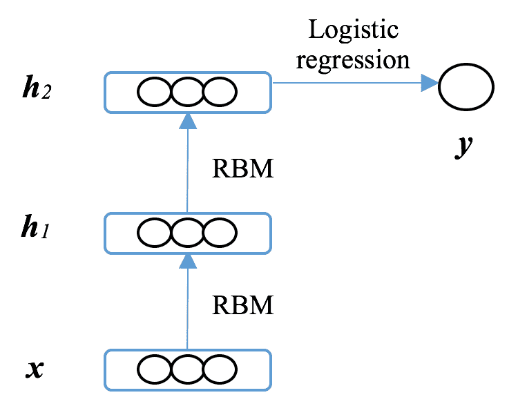

最后，我们使用经过训练的逻辑回归模型来预测从测试集中提取的特征，如下所示：

```py
>>> print(lr.score(feature_test, Y_test))
0.9777777777777777
```

用这种方法可以达到 97.8％的分类精度。

# 什么是自编码器？

在上一部分中，我们刚刚学习了 RBM 及其变体 DBN，并获得了实践经验。 回想一下，RBM 由输入层和隐藏层组成，后者试图通过查找输入的潜在表示来重建输入数据。 从本节开始，我们将学习的神经网络模型**自编码器**（**AE**`s`）具有相似的想法。 基本 AE 由三层组成：输入层，隐藏层和输出层。 输出层是通过隐藏层的输入的重建。 AE 的一般图如下所示：

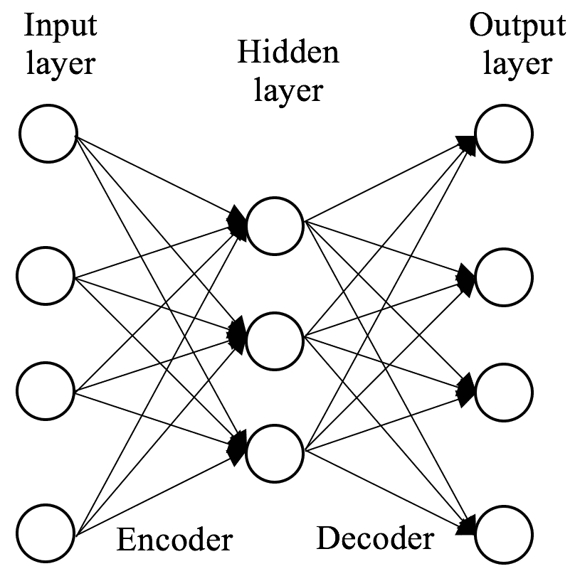

可以看到，当自编码器接收数据时，它首先对其进行编码以适合隐藏层，然后尝试将其重新构造回原始输入数据。 同时，隐藏层可以提取输入数据的潜在表示。 由于这种结构，网络的前半部分称为**编码器**，该编码器将输入数据压缩为潜在表示。 相反，后半部分是**解码器**，用于对提取的表示进行解压缩。

AE 和 RBM 都旨在最小化重构误差，但是 AE 与 RBM 在以下方面有所不同：

*   AE 以区分性方式了解隐藏表示，而无需考虑输入数据的概率分布
*   RBM 通过从隐藏层和输入层中进行采样以随机方式找到隐藏表示

现在，让我们快速了解 AE 的发展历程，然后再将其应用于实际问题。

# 自编码器的发展路径

首次引入自编码器作为神经网络中模块化学习*中无监督预训练的一种方法（D. Ballard，AAAI 程序，1987 年）。 然后将它们用于降维，例如在通过多层感知器进行的*自动关联和奇异值分解*中（H. Bourlard 和 Y. Kamp，biological cybernetics，1988； 59：291-294）和 线性特征学习，例如*自编码器，最小描述长度和亥姆霍兹* F *能量*（G。Hinton 和 R.Zemel，神经信息处理系统的发展，1994 年）。*

自编码器随着时间的推移而发展，在过去的十年中提出了几种变体。 在 2008 年，P。Vincent 等人。 *中介绍了**去噪自编码器**（**DAE**），并使用降噪自编码器*构成了稳健的功能（第 25 届国际机器学习会议论文集，1096-1103）， 网络被迫从损坏的版本中重建输入数据，以便他们可以学习更强大的功能。

I.Goodfellow 等。 2009 年，开发了**稀疏自编码器**，它通过引入稀疏约束来扩大隐藏表示。 可以在*测量深度网络中的不变性*中找到详细信息（神经信息处理系统的最新进展 22，NIPS 2009，646-654）。

**压缩自编码器**由 S. Rifai 在*压缩自编码器中提出：* E *特征提取期间的 xplicit 不变性*（第 28 届国际机器学习会议论文集，2011 年 ; 833-840）。 将惩罚项添加到成本函数，以便网络能够提取对输入数据周围的微小变化不太敏感的表示形式。

2013 年，在*自编码变体贝叶斯*中，提出了一种称为**变分自编码器**（**VAE**）的特殊类型（作者：D。Kingma 和 M. Welling， 第二届国际学习表示会议），其中考虑了潜在变量的概率分布。

我们将在 Keras 中实现 AE 的几种变体，并使用它们来解决信用卡欺诈检测问题。

# 自编码器架构和应用

我们将从基本的香草 AE 开始，然后是深度版本，然后是稀疏自编码器，去噪自编码器，然后使用收缩自编码器结束。

在整个部分中，我们将以信用卡欺诈数据集为例，演示如何应用各种架构的自编码器。

# 香草自编码器

这是最基本的三层体系结构，非常适合于开始实施自编码器。 让我们准备数据集。 我们正在使用的数据集来自 Kaggle 竞赛，可以从[这个页面](https://www.kaggle.com/mlg-ulb/creditcardfraud)中的`Data`页面下载。 每行包含 31 个字段，如下所示：

*   `Time`：自数据集中第一行以来的秒数
*   `V1, V2, ..., V28`：通过 PCA 获得的原始特征的主要成分
*   `Amount`：交易金额
*   `Class`：`1`用于欺诈性交易，`0`否则

我们将数据加载到 pandas 数据框中，并删除`Time`字段，因为它提供的信息很少，如下所示：

```py
>>> import pandas as pd
>>> data = pd.read_csv("creditcard.csv").drop(['Time'], axis=1)
>>> print(data.shape)
(284807, 30)
```

数据集包含 284,000 个样本，但高度不平衡，几乎没有欺诈性样本，如下所示：

```py
>>> print('Number of fraud samples: ', sum(data.Class == 1))
Number of fraud samples: 492
>>> print('Number of normal samples: ', sum(data.Class == 0))
Number of normal samples: 284315
```

从[这里](https://www.kaggle.com/mlg-ulb/creditcardfraud)的`Data`页面中的功能可视化面板中可以看出，V1 至 V28 是高斯标准分布，而`Amount` 不是。 因此，我们需要标准化`Amount`功能，如以下代码所示：

```py
>>> from sklearn.preprocessing import StandardScaler
>>> scaler = StandardScaler()
>>> data['Amount'] =
         scaler.fit_transform(data['Amount'].values.reshape(-1, 1))
```

经过预处理后，我们将数据分为 80％的训练和 20％的测试，如下所示：

```py
>>> import numpy as np
>>> np.random.seed(1)
>>> data_train, data_test = train_test_split(data, test_size=0.2)
```

正如我们所估计的那样，欺诈类仅占总人口的 0.17％，因此传统的监督学习算法可能很难从少数民族中选择足够的模式。 因此，我们求助于基于 AE 的无监督学习解决方案。 训练有素的自编码器可以完美地重建输入数据。 如果我们仅在正常样本上安装自编码器，则该模型将成为仅擅于再现非异常数据的正常数据重构器。 但是，如果我们将此模型输入异常输入，则重构输出和输入之间会有相对较大的差异。 因此，我们可以通过使用 AE 测量重建误差来检测异常。

因此，我们重组了训练和测试集，因为仅需要正常样本即可拟合模型，如下所示：

```py
>>> data_test = data_test.append(data_train[data_train.Class == 1],
                                 ignore_index=True)
>>> data_train = data_train[data_train.Class == 0]
```

由于我们的方法不受监督，因此我们不需要培训目标。 因此，我们仅采用训练集中的功能，如下所示：

```py
>>> X_train = data_train.drop(['Class'], axis=1).values
>>> X_test = data_test.drop(['Class'], axis=1).values
>>> Y_test = data_test['Class']
```

现在可以使用这些数据了。 现在是时候在 Keras 中构建香草自编码器了。 现在，让我们开始导入必要的模块，如下所示：

```py
>>> from keras.models import Model
>>> from keras.layers import Input, Dense
>>> from keras.callbacks import ModelCheckpoint, TensorBoard
>>> from keras import optimizers
```

第一层是输入层，单位为`29`（输入数据为`29`-维度），如下所示：

```py
>>> input_size = 29
>>> input_layer = Input(shape=(input_size,))
```

第二层是具有`40`单位的隐藏层，对输入数据进行编码，如下所示：

```py
>>> hidden_size = 40
>>> encoder = Dense(hidden_size, activation="relu")(input_layer)
```

最后，还有最后一层，即输出层，其大小与输入层相同，它对隐藏的表示进行解码，如下所示：

```py
>>> decoder = Dense(input_size)(encoder)
```

使用以下代码将它们连接在一起：

```py
>>> ae = Model(inputs=input_layer, outputs=decoder)
>>> print(ae.summary())
_______________________________________________________________
Layer (type)              Output Shape        Param #
=================================================================
input_1 (InputLayer)      (None, 29)           0
_______________________________________________________________
dense_1 (Dense)           (None, 40)           1200
_______________________________________________________________
dense_2 (Dense)           (None, 29)           1189
=================================================================
Total params: 2,389
Trainable params: 2,389
Non-trainable params: 0
_________________________________________________________________
```

然后，我们使用 Adam（学习率`0.0001`）作为优化器来编译模型，如下所示：

```py
>>> optimizer = optimizers.Adam(lr=0.0001)
>>> ae.compile(optimizer=optimizer, loss='mean_squared_error')
```

除了模型检查点之外，我们还使用 TensorBoard 作为回调函数。 TensorBoard 是 TensorFlow 的性能可视化工具，可提供训练和验证指标的动态图，例如：

```py
>>> tensorboard = TensorBoard(log_dir='./logs/run1/',
                       write_graph=True, write_images=False)
>>> model_file = "model_ae.h5"
>>> checkpoint = ModelCheckpoint(model_file, monitor='loss',
                         verbose=1, save_best_only=True, mode='min')
```

最后，我们使用数据（`X_train, X_train`）对模型进行拟合，并使用数据（`X_test, X_test`）作为自编码器进行验证，并尝试产生与输入相同的输出：

```py
>>> num_epoch = 30
>>> batch_size = 64
>>> ae.fit(X_train, X_train, epochs=num_epoch, batch_size=batch_size,
            shuffle=True, validation_data=(X_test, X_test),
            verbose=1, callbacks=[checkpoint, tensorboard])
```

以下是第一个和最后一个`3`时期的结果：

```py
Train on 227440 samples, validate on 57367 samples
Epoch 1/30
227440/227440 [==============================] - 4s 17us/step - loss: 0.6690 - val_loss: 0.4297
Epoch 00001: loss improved from inf to 0.66903, saving model to model_ae.h5
Epoch 2/30
227440/227440 [==============================] - 4s 18us/step - loss: 0.1667 - val_loss: 0.2057
Epoch 00002: loss improved from 0.66903 to 0.16668, saving model to model_ae.h5
Epoch 3/30
227440/227440 [==============================] - 4s 17us/step - loss: 0.0582 - val_loss: 0.1124
......
......
Epoch 28/30
227440/227440 [==============================] - 3s 15us/step - loss: 1.4541e-05 - val_loss: 0.0011
Epoch 00028: loss improved from 0.00001 to 0.00001, saving model to model_ae.h5
Epoch 29/30
227440/227440 [==============================] - 4s 15us/step - loss: 1.2951e-05 - val_loss: 0.0011
Epoch 00029: loss improved from 0.00001 to 0.00001, saving model to model_ae.h5
Epoch 30/30
227440/227440 [==============================] - 4s 16us/step - loss: 1.9115e-05 - val_loss: 0.0010
Epoch 00030: loss did not improve from 0.00001
```

我们可以在终端中输入以下命令来检出 TensorBoard：

```py
tensorboard --logdir=logs
```

它返回以下内容：

```py
Starting TensorBoard b'41' on port 6006
(You can navigate to http://192.168.0.12:6006)
```

通过转到`http://192.168.0.12:6006`（主机可能有所不同，具体取决于您的环境），我们可以看到随着时间的推移训练损失和验证损失。

下图显示了平滑= 0（无指数平滑）时的训练损失：

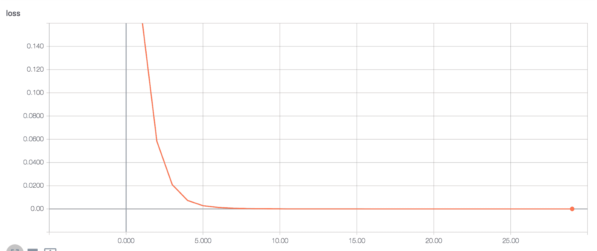

此处显示了平滑= 0（无指数平滑）时的验证损失：

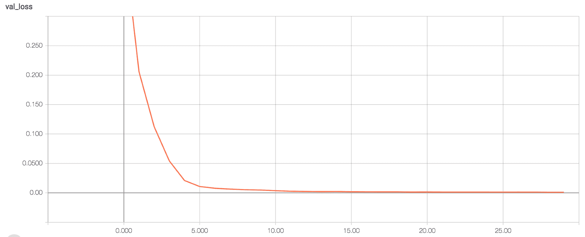

现在，我们可以将测试集提供给训练有素的模型，并计算由均方误差测量的重构误差，如下所示：

```py
>>> recon = ae.predict(X_test)
>>> recon_error = np.mean(np.power(X_test - recon, 2), axis=1)
```

通常，我们将计算 ROC 曲线下的面积，以评估不平衡数据的二进制分类性能，如下所示：

```py
>>> from sklearn.metrics import (roc_auc_score,
                      precision_recall_curve, auc, confusion_matrix)
>>> roc_auc = roc_auc_score(Y_test, recon_error)
>>> print('Area under ROC curve:', roc_auc)
Area under ROC curve: 0.9548928080050032
```

实现了 ROC `0.95`的 AUC。 但是，由于少数类别很少发生（在测试集中约为 0.87％），因此在这种情况下并不一定表示性能良好。 ROC 的 AUC 可以轻松达到`0.9`以上，而无需任何智能模型。 相反，我们应该通过精确调用曲线下的面积来衡量性能，该曲线绘制如下：

```py
>>> import matplotlib.pyplot as plt
>>> precision, recall, th =
               precision_recall_curve(Y_test, recon_error)
>>> plt.plot(recall, precision, 'b')
>>> plt.title('Precision-Recall Curve')
>>> plt.xlabel('Recall')
>>> plt.ylabel('Precision')
>>> plt.show()
```

请参考以下曲线图，以得到精确的召回曲线：

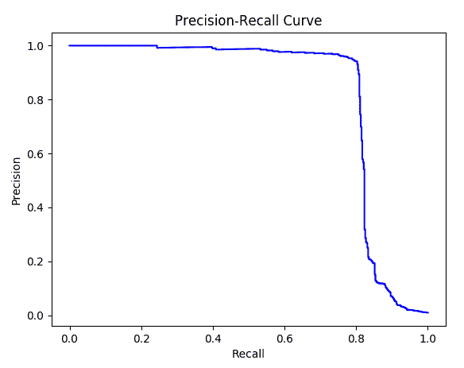

精确调用曲线下的面积计算如下：

```py
>>> area = auc(recall, precision)
>>> print('Area under precision-recall curve:', area)
Area under precision-recall curve: 0.8217824584439969
```

精确召回曲线下的面积为 0.82。 我们还可以绘制各种决策阈值下的精度和召回率，如下所示：

```py
>>> plt.plot(th, precision[1:], 'k')
>>> plt.plot(th, recall[1:], 'b', label='Threshold-Recall curve')
>>> plt.title('Precision (black) and recall (blue) for different
               threshold values')
>>> plt.xlabel('Threshold of reconstruction error')
>>> plt.ylabel('Precision or recall')
>>> plt.show()

```

请参考以下图表以获得预期结果：

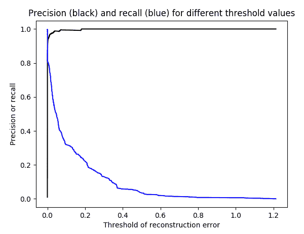

可以看出，我们设置的阈值越高，精度越高，但是召回率却越低。 我们将选择`0.000001`作为决策阈值并计算混淆矩阵，如下所示：

```py
>>> threshold = 0.000001
>>> Y_pred = [1 if e > threshold else 0 for e in recon_error]
>>> conf_matrix = confusion_matrix(Y_test, Y_pred)
>>> print(conf_matrix)
[[55078 1797]
[ 73 419]]
```

基于 AE 的异常检测器成功捕获了大多数欺诈交易，并且仅错误地拒绝了一些正常交易。 您可以根据特定的折衷考虑其他决策阈值。

# 深度自编码器

除了一个隐藏层，输出层可以是通过几个隐藏层对输入的重构。 例如，以下是分别具有`80`，`40`和`80`单位的三个隐藏层的模型：

```py
>>> hidden_sizes = [80, 40, 80]
>>> input_layer = Input(shape=(input_size,))
>>> encoder = Dense(hidden_sizes[0], activation="relu")(input_layer)
>>> encoder = Dense(hidden_sizes[1], activation="relu")(encoder)
>>> decoder = Dense(hidden_sizes[2], activation='relu')(encoder)
>>> decoder = Dense(input_size)(decoder)
>>> deep_ae = Model(inputs=input_layer, outputs=decoder)
>>> print(deep_ae.summary())
_______________________________________________________________
Layer (type)            Output Shape      Param #
===============================================================
input_1 (InputLayer)     (None, 29)       0
_______________________________________________________________
dense_1 (Dense)          (None, 80)       2400
_______________________________________________________________
dense_2 (Dense)          (None, 40)       3240
_______________________________________________________________
dense_3 (Dense)          (None, 80)       3280
_______________________________________________________________
dense_4 (Dense)          (None, 29) 2349
===============================================================
Total params: 11,269
Trainable params: 11,269
Non-trainable params: 0
_________________________________________________________________
```

由于要训练的参数更多，我们将学习率降低到`0.00005`，并增加了时期数，如下所示：

```py
>>> optimizer = optimizers.Adam(lr=0.00005)
>>> num_epoch = 50
```

其余代码与普通解决方案相同，在此不再赘述。 但是，这是前两个时期的结果：

```py
Epoch 1/50
227440/227440 [==============================] - 6s 25us/step - loss: 0.5392 - val_loss: 0.3506
Epoch 00001: loss improved from inf to 0.53922, saving model to model_deep_ae.h5
......
......
Epoch 49/50
227440/227440 [==============================] - 6s 26us/step - loss: 3.3581e-05 - val_loss: 0.0045
Epoch 00049: loss improved from 0.00004 to 0.00003, saving model to model_deep_ae.h5
Epoch 50/50
227440/227440 [==============================] - 6s 25us/step - loss: 3.4013e-05 - val_loss: 0.0047
Epoch 00050: loss did not improve from 0.00003
```

同样，我们通过精确调用曲线下的面积来测量性能，这次完成了`0.83`，这比香草版本略好：

```py
>>> print('Area under precision-recall curve:', area)
Area under precision-recall curve: 0.8279249913991501
```

# 稀疏的汽车编码器

在训练神经网络时，我们通常会在损失目标函数中施加约束，以控制网络的容量并防止过度拟合。 自编码器也不例外。 我们可以在自编码器的损失函数中添加 L1 范数正则化项，从而引入稀疏约束。 这种自编码器称为稀疏自编码器。

当训练样本很多时，例如我们的案例超过 220,000，很难说出稀疏性的影响。 因此，我们仅将 5％的数据用于训练，如下所示：

```py
>>> data_train, data_test = train_test_split(data, test_size=0.95)
```

我们将快速通过常规自编码器进行基准测试，如下所示：

```py
>>> hidden_sizes = [80, 40, 80]
>>> input_layer = Input(shape=(input_size,))
>>> encoder = Dense(hidden_sizes[0], activation="relu")(input_layer)
>>> encoder = Dense(hidden_sizes[1], activation="relu")(encoder)
>>> decoder = Dense(hidden_sizes[2], activation='relu')(encoder)
>>> decoder = Dense(input_size)(decoder)
>>> ae = Model(inputs=input_layer, outputs=decoder)
```

除了`0.0008`和`30`时期的学习率外，其余代码与上一节相同：

```py
>>> optimizer = optimizers.Adam(lr=0.0008)
>>> num_epoch = 30
```

以下是前两个时期的结果：

```py
Train on 14222 samples, validate on 270585 samples
Epoch 1/30
14222/14222 [==============================] - 3s 204us/step - loss: 0.5800 - val_loss: 0.2497
Epoch 00001: loss improved from inf to 0.57999, saving model to model_ae.h5
Epoch 2/30
14222/14222 [==============================] - 3s 194us/step - loss: 0.1422 - val_loss: 0.1175
Epoch 00002: loss improved from 0.57999 to 0.14224, saving model to model_ae.h5
......
......
Epoch 29/30
14222/14222 [==============================] - 3s 196us/step - loss: 0.0016 - val_loss: 0.0054
Epoch 00029: loss did not improve from 0.00148
Epoch 30/30
14222/14222 [==============================] - 3s 195us/step - loss: 0.0013 - val_loss: 0.0079
Epoch 00030: loss improved from 0.00148 to 0.00132, saving model to model_ae.h5
>>> print('Area under precision-recall curve:', area)
Area under precision-recall curve: 0.6628715223813105
```

我们在`0.66`的精确调用曲线下获得了面积。

现在，让我们使用 L1 正则化因子`0.00003`的稀疏版本，如下所示：

```py
>>> from keras import regularizers
>>> input_layer = Input(shape=(input_size,))
>>> encoder = Dense(hidden_sizes[0], activation="relu",
           activity_regularizer=regularizers.l1(3e-5))(input_layer)
>>> encoder = Dense(hidden_sizes[1], activation="relu")(encoder)
>>> decoder = Dense(hidden_sizes[2], activation='relu')(encoder)
>>> decoder = Dense(input_size)(decoder)
>>> sparse_ae = Model(inputs=input_layer, outputs=decoder)
```

前两个时期的结果如下：

```py
Epoch 1/30
14222/14222 [==============================] - 3s 208us/step - loss: 0.6295 - val_loss: 0.3061
Epoch 00001: loss improved from inf to 0.62952, saving model to model_sparse_ae.h5
Epoch 2/30
14222/14222 [==============================] - 3s 197us/step - loss: 0.1959 - val_loss: 0.1697
Epoch 00002: loss improved from 0.62952 to 0.19588, saving model to model_sparse_ae.h5
......
......
Epoch 29/30
14222/14222 [==============================] - 3s 209us/step - loss: 0.0168 - val_loss: 0.0277
Epoch 00029: loss improved from 0.01801 to 0.01681, saving model to model_sparse_ae.h5
Epoch 30/30
14222/14222 [==============================] - 3s 213us/step - loss: 0.0220 - val_loss: 0.0496
Epoch 00030: loss did not improve from 0.01681
```

使用稀疏自编码器可以实现精确调用曲线`0.70`下更大的区域，该稀疏自编码器学习输入数据的稀疏表示和放大表示：

```py
>>> print('Area under precision-recall curve:', area)
Area under precision-recall curve: 0.6955808468297678
```

# 去噪自编码器

**去噪自编码器**（**DAE**）是自编码器的另一种规范化版本，但是该规范化是在输入数据上添加的，而不是损失函数。 自编码器被迫从损坏的输入数据中重建原始数据，以期希望学习到更强大的功能。

对于每个输入样本，将随机选择一组特征进行更改。 建议将腐败率定为 30％至 50％。 通常，培训样本越多，腐败率越低； 样本越少，腐败率越高。

有两种典型的方法来生成损坏的数据：

*   为所选数据分配零
*   将高斯噪声添加到所选数据

下图演示了 DAE 的工作方式：

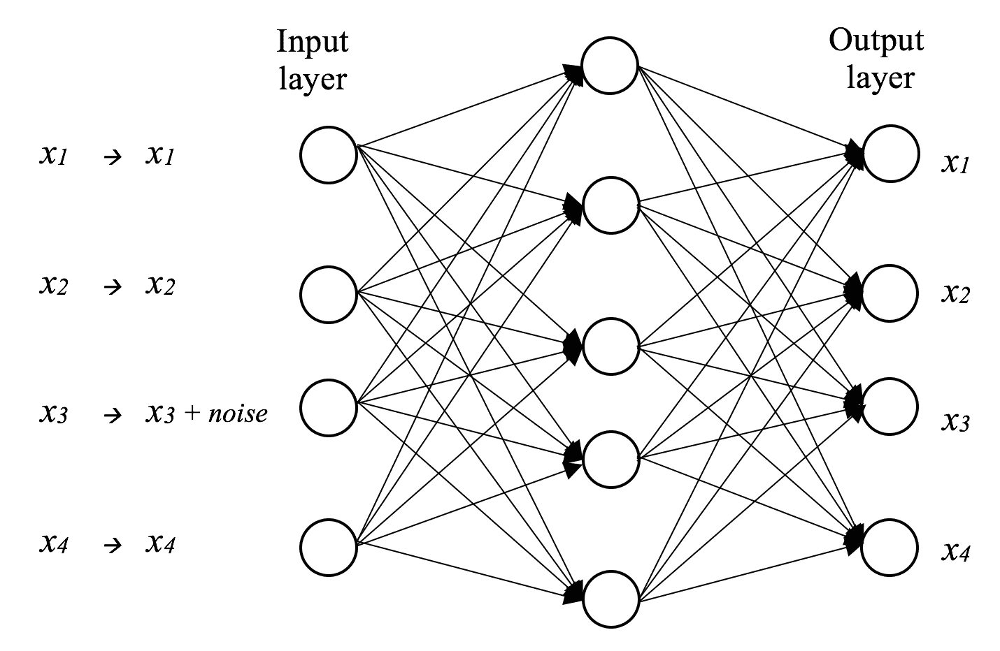

DAE 通常用于神经网络预训练，其中提取的鲁棒表示形式用作下游监督学习的输入特征。 因此，它们不适用于我们的无监督解决方案。 您可以通过[这个页面](https://blog.keras.io/building-autoencoders-in-keras.html)中的图像分类示例进行进一步研究。

# 压缩自编码器

我们将学习的最后一种自编码器是压缩自编码器。 它们与稀疏兄弟相似，因为它们增加了惩罚项以学习更强大的表示形式。 但是，惩罚项更为复杂，可以如下推导，其中 *h <sub>j</sub>* 是 *j <sup>th</sup>* 单位 隐藏层的输出，`W`是编码器的权重， *W <sub>ij</sub>* 是连接 *i <sup>th</sup> 的权重* 输入单元，以及 *j <sup>th</sup>* 隐藏单元：


我们在上一节中定义的香草自编码器的顶部添加压缩项，如下所示：

```py
>>> hidden_size = 40
>>> input_layer = Input(shape=(input_size,))
>>> encoder = Dense(hidden_size, activation="relu")(input_layer)
>>> decoder = Dense(input_size)(encoder)
>>> contractive_ae = Model(inputs=input_layer, outputs=decoder)
```

损失函数现在变为：

```py
>>> factor = 1e-5
>>> def contractive_loss(y_pred, y_true):
...     mse = K.mean(K.square(y_true - y_pred), axis=1)
...     W = K.variable(
                  value=contractive_ae.layers[1].get_weights()[0])
...     W_T = K.transpose(W)
...     W_T_sq_sum = K.sum(W_T ** 2, axis=1)
...     h = contractive_ae.layers[1].output
...     contractive = factor *
                    K.sum((h * (1 - h)) ** 2 * W_T_sq_sum, axis=1)
...     return mse + contractive
```

我们使用这种收缩损失来编译模型，如下所示：

```py
>>> contractive_ae.compile(optimizer=optimizer, loss=contractive_loss)
```

其余代码保持不变，但是这次使用`0.0003`（`optimizer = optimizers.Adam(lr=0.0003)`）的学习率。

我们在此介绍前两个时期的结果：

```py
Train on 227440 samples, validate on 57367 samples
Epoch 1/30
227440/227440 [==============================] - 6s 27us/step - loss: 0.3298 - val_loss: 0.1680
Epoch 00001: loss improved from inf to 0.32978, saving model to model_contractive_ae.h5
Epoch 2/30
227440/227440 [==============================] - 5s 24us/step - loss: 0.0421 - val_loss: 0.0465
Epoch 00002: loss improved from 0.32978 to 0.04207, saving model to model_contractive_ae.h5
......
......
Epoch 29/30
227440/227440 [==============================] - 5s 23us/step - loss: 3.8961e-04 - val_loss: 0.0045
Epoch 00029: loss did not improve from 0.00037
Epoch 30/30
227440/227440 [==============================] - 5s 22us/step - loss: 4.7208e-04 - val_loss: 0.0057
Epoch 00030: loss did not improve from 0.00037
```

该模型以`0.83`的精确召回曲线下的面积胜过香草模型：

```py
>>> print('Area under precision-recall curve:', area)
Area under precision-recall curve: 0.8311662962345293
```

到目前为止，我们已经研究了五种不同类型的自编码器，包括基本的香草编码，深度编码，稀疏编码，去噪编码和收缩编码。 每种类型的自编码器的特长来自某些体系结构或不同形式的强制约束。 尽管体系结构或处罚有所不同，但它们具有相同的目标，即学习更强大的表示形式。

# 概要

我们刚刚使用受限的 Boltzmann 机器和自编码器完成了 DL 体系结构的重要学习旅程！ 在本章中，我们更加熟悉 RBM 及其变体。 我们从 RBM 是什么，RBM 的演变路径以及它们如何成为推荐系统的最新解决方案入手。 我们从零开始在 TensorFlow 中实现了 RBM，并构建了基于 RBM 的电影推荐器。 除了浅层架构之外，我们还探索了称为深度信念网络的 RBM 的堆叠版本，并将其用于图像分类，该分类从零开始在 TensorFlow 中实现。

学习自编码器是旅程的后半部分，因为它们具有相似的想法，即通过输入数据重建来寻找潜在的输入表示形式。 在讨论了什么是自编码器并讨论了它们的发展路径之后，我们说明了各种自编码器，这些编码器按其体系结构或正则化形式进行了分类。 我们还在信用卡欺诈检测中应用了不同类型的自编码器。 每种类型的自编码器都打算提取某些结构或强制形式的鲁棒表示。

# 行使

您可以使用自编码器构建电影推荐器吗？

# 致谢

感谢 Shyong Lam 和 Jon Herlocker 清理并生成了 MovieLens 数据集：

F. Maxwell Harper 和 Joseph A. Konstan。 2015 年。 *MovieLens 数据集：历史和上下文。 ACM 交互式智能系统交易*（TiiS）5、4，第 19 条（2015 年 12 月），共 19 页。 DOI = http：//dx.doi.org/10.1145/2827872