# CNN 架构

在本章中，我们将讨论一类重要的图像深度学习网络，称为**卷积神经网络**（**CNN**）。 针对图像相关任务（例如图像识别，分类，对象检测等）而构建的大多数深度学习模型都将 CNN 作为其主要网络。 CNN 允许我们以三维体积而不是单维向量处理传入的数据。 尽管 CNN 是一类神经网络（由权重，层和损失函数组成），但深层前馈网络在结构上有很多差异，我们将在本章中进行解释。 为了让您了解 CNN 的功能强大，ResNet CNN 架构在世界著名的图像分类挑战 ILSVRC 上实现了 3.57％的最高错误率。 这种性能优于 ImageNet 强大数据集上的人类视觉感知。 我们将在本章后面讨论 ImageNet 和 ILSVRC。 以下是本章将要学习的主题：

*   深度前馈网络的问题以及对 CNN 的需求
*   到 CNN 的演进之路
*   CNN 的体系结构
*   CNN 的不同层及其作用
*   使用 CNN 进行图像分类
*   一些著名的图像分类 CNN 架构
*   您的第一个具有 CIFAR-10 数据集的 CNN 图像分类器
*   使用 CNN 进行对象检测
*   带有 CNN 的著名物体探测器
*   您的第一个 TensorFlow 对象检测器

# 深度前馈网络存在问题

在“第 2 章”，*深度前馈网络*中，我们学习了使用深度前馈网络识别（分类）时尚商品的图像。 每个图像的大小为 28 x 28，我们将一个神经元连接到每个像素。 这样，我们在第一层本身就有 28 x 28 = 784 个神经元。 但是在现实世界中，图像几乎没有这么小。 让我们考虑一个大小为 500 x 500 的中型图像。因此，现在，在第一层中，我们将需要 250,000 个神经元。 对于这样大小的图像，第一层中有大量的神经元。 因此，网络对于该任务而言在计算上变得过于昂贵。 那么，我们如何解决这个问题呢？ 同样，生物学的灵感来了！ 在下一节中，我们将详细介绍 CNN 的发展。

# 到 CNN 的演进之路

在 1960 年代，人们发现动物的视觉皮层并没有像深度前馈网络那样处理图像。 而是，视觉皮层中的单个神经元连接到一个小的区域（而不是单个像素），这称为感受野。 感受野中的任何活动都会触发相应的神经元。

受视觉皮层感受野的启发，科学家提出了局部连接的想法，以减少处理图像所需的人工神经元数量。 深度前馈网络的这种修改版本称为 CNN（在本书中，CNN 均指卷积神经网络）。 1989 年，Yann LeCun 开发了可训练的 CNN，能够识别手写数字。 1998 年，Yann LeCun 的 LeNet-5 模型再次成功地使用了七个堆叠的卷积层（例如深前馈网络中的层）对大小为 32 x 32 的数字进行分类。输入图像尺寸的增加由于缺乏处理能力而受到限制。 当时可用。 但是在 2000 年代初，GPU 能够执行并行计算，因此大大减少了深度学习网络所需的处理时间。 更深的 CNN 的开发始于 GPU。 在深入研究细节之前，我们将向您介绍 ImageNet。 它是一个开放源代码数据集，其中包含 1500 万张贴有大约 22,000 个不同对象的图像。 ImageNet 的建立旨在帮助在对象识别领域下开发具有手动标记图像的模型，以进行模型训练。 每年都会举办一场名为 **ImageNet 大规模视觉识别挑战赛**（**ILSVRC**）的竞赛，该竞赛使用 ImageNet 数据集的一个子集，以挑战为对象提供更准确的方法 识别，俗称**图像分类**。 有关更多详细信息，[请参考 ImageNet 网站](http://www.image-net.org/)。

CNN 中有很多新方面，例如权重共享，批量操作和本地连接。 在下一节中，我们将讨论所有这些以及体系结构。

# CNN 的体系结构

CNN 当然是像深度前馈网络一样的神经网络。 CNN 以可学习的权重逐层构建，并且像任何典型的深度学习网络一样受到训练：通过最小化成本函数和反向传播误差。 区别在于神经元的连接方式。 CNN 旨在处理图像。 图像数据具有 CNN 用来减少神经元数量并获得更好学习的两个独特功能：

*   图像是三维体积-宽度，高度和通道（通道有时称为深度）。 因此，卷积层以三维体积而不是单维矢量进行输入和输出。
*   邻域中的像素具有彼此相关的值。 这称为空间关系。 CNN 通过过滤器使用此功能，以提供与附近像素的神经元的本地连接。

在以下小节中，我们将研究 CNN 涉及的各层以及每一层的独特功能。

# 输入层

输入层由 3D 阵列而不是一维向量组成。 该层以像素在图像中的方式保存像素。 因此，输入层具有形状（批大小，宽度，高度和通道）。 例如，如果我们具有尺寸为 32 x 32 的图像和三个通道的 RGB，且批大小为 64，则输入层的形状将为（64、32、32、3）。 在下图中可以看到这一点：


输入层的形状由粉红色的立方体表示（图像来自 Wikipedia，CS231n 课程的一部分）

这里要注意的重要一点是，输入层用于将结构保持在三维空间中。 在下一节中，我们将看到卷积层如何利用此三维空间。

# 卷积层

我们将在这里讨论的第一件事是过滤器。 可以将滤镜视为由可学习的权重值组成的图像的较小版本。 就像我们在深层前馈网络中从一个神经元到另一个神经元具有权重连接一样，权重也存在于卷积层中，不同之处在于权重是以滤波器的形式将连接器覆盖的空间区域连接到神经元。 让我们考虑一个大小为 5 x 5（宽度和高度）的过滤器的示例。 滤镜也将延伸到图像的第三维（通道）。 对于三通道图像，滤镜尺寸为 5 x 5 x 3，对于单通道图像，滤镜尺寸为 5 x 5 x1。下图显示了 5 x 5 x 1 滤镜：


那么，滤波器在卷积层中做什么？ 过滤器在卷积层中执行两项非常重要的任务-本地连接和参数共享。 之前，我们讨论了 CNN 中的感受野，这意味着仅将神经元连接到其邻域图像像素。 该邻域由过滤器定义。 我们在图像上滑动滤镜，滤镜中的每个权重都连接到特定幻灯片的特定神经元。 然后，神经元使用该位置处过滤器覆盖的图像像素的权重和值来计算卷积输出。 换句话说，我们可以说卷积层中的每个神经元都局部地连接到由滤镜定义的图像的局部区域。 这称为本地连接。 下图显示了本地连接：

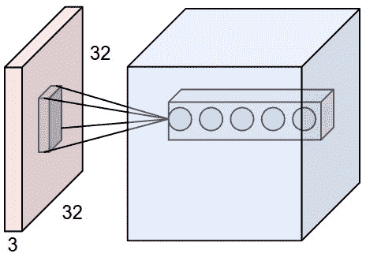

观察感受野（输入层中的深粉红色斑块）如何连接到下一层的单个神经元

神经元如何通过卷积计算滤波器的输出？ 为了理解这一点，让我们考虑在 6 x 6 x 1 图像上放置 3 x 3 x 1 滤镜的第一张幻灯片的场景。 计算滤波器中每个权重值与对应位置的像素值的点积。 对一个位置上所有权重值的点积求和，此计算出的总和就是卷积的输出。 激活功能（例如 ReLU）用于神经元的输出中。

接下来，我们将看到滤镜如何在图像上滑动以生成卷积输出。 对于过滤器的每张幻灯片，都会将新的神经元连接到过滤器输出。 因此，滑动所涉及的参数也趋向于控制卷积层的输出尺寸。 过滤器的滑动涉及三个重要参数-步幅，零填充和深度：

*   步幅决定了滤镜从一个位置滑动到另一位置时跳跃的像素数。 通常，步幅值保持为 1。滤镜在每张幻灯片中跳一个像素。 跨度也可以大于 1，但通常不使用。
*   通常，如果滤镜从图像的左上角开始滑动，则所有幻灯片的最终生成输出趋向于具有较小的尺寸。 但是，通常，我们希望卷积层的输出具有与输入图像相同的宽度和高度。 零填充在图像的边界上添加了 0 的额外填充，从而为过滤器提供了额外的滑动空间，使得最终输出的尺寸与输入的尺寸相同。 当我们加 0 时，这不会影响卷积运算的值。
*   通常，CNN 在层中不使用单个过滤器。 我们使用一组过滤器（例如 12 个过滤器）。 这样做是因为具有不同权重集的每个滤镜趋向于捕获图像的不同特征。 来自每个滤波器的响应被一个接一个地堆叠，并且每个响应被称为**激活图**。 例如，如果我们使用 32 x 32 x 1 的图像和四个大小为 3 x 3 x 1 的滤镜，且步幅为 2，填充为 1，则卷积层的输出尺寸为（16 x 16 x 4）。 在这里，最后一个维度将等于激活图的数量，该数量将等于过滤器的数量。 可以使用以下公式计算输出的宽度和高度：


在这里，`W`是输入大小（ *W = 32* ），`F`是过滤器大小（ *F = 3* ），`P`为填充（ *P = 1* ），而`S`为跨步（ *S = 1* ）。

您可能已经观察到，我们正在整个图像上制作相同的滤镜幻灯片。 这意味着在幻灯片中使用相同的权重，而不是为每个幻灯片创建不同的权重集。 由于图像中不同位置的像素值高度相关，因此使卷积幻灯片共享权重会产生良好的效果。 如果证明滤镜在图像中的某个位置有用，则该滤镜也将在不同位置有用。 整个图像上的滤波器权重共享称为**参数共享，**大大减少了网络中所需参数的数量。

下一层称为 maxpooling 层。 maxpooling 层用于减小激活图的大小。

# 最大池层

CNN 的总体思想是保持通过过滤器提取特征并增加激活图的深度，同时减小宽度和高度尺寸，以便最终剩下高度压缩的特征向量。 为了减小激活图的尺寸，CNN 使用连续卷积层之间的最大池化层。

maxpooling 层具有两个主要参数-内核大小和步幅。 Maxpooling 还在其连接到的上一层的激活图上滑动一个窗口。 该窗口通常称为内核。 内核在任何幻灯片上的工作都是比较内核所覆盖的值，并且*仅保留最大值*作为该位置的输出。 最常用的内核大小是 2 x2。使用超出此大小的内核大小会导致各层之间的信息大量丢失。 同样，步幅是决定内核在幻灯片中跳转多少像素的参数。 下图演示了内核在大小为 2 x 2，步幅为 2 的 4 x 4 激活图上执行 maxpooling 的过程：

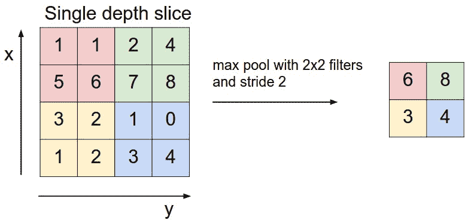

来自 CS231n 的图像

下图显示了如何使用 maxpooling 层来减小图像和要素图的大小：

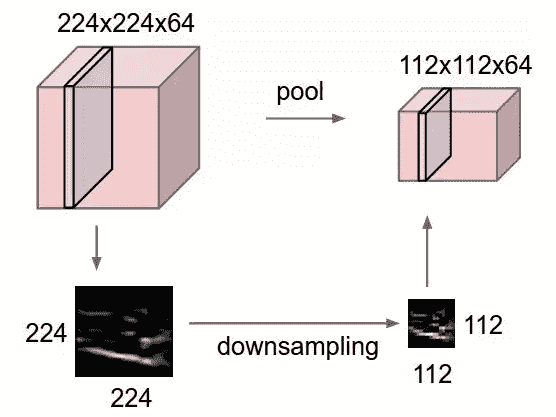

图片来自该课程 CS231n 课程

# 全连接层

在卷积网络的末端，我们需要对图像进行分类并训练网络。 这必须使用 softmax 概率和交叉熵损失来完成。 到现在为止，特征已与卷积层一起提取。 这里的想法是将最后一个卷积或 maxpooling 层的 4D 张量输出压缩到 2D 张量中，其中第一个维度仍将代表批处理大小，第二个维度将包含来自最后一层的所有输出值（像数组一样被压缩） 。 此压缩操作通常称为**展平**操作。 展平的目的是我们现在可以在前添加前馈层，展平后将它们连接到所有值，然后像在深前馈网络中那样使用 softmax 概率和交叉熵损失训练网络。 该层与前馈层相同，但称为全连接层，因为与卷积层不同，因为它仅具有本地连接性，所以该层连接到来自最后一层的每个值。 通常，如果展平后的参数数量很大，我们可以添加一系列全连接层。

现在我们已经了解了卷积网络中的体系结构和层，在下一节中，我们将使用卷积网络进行图像分类。

# 使用 CNN 进行图像分类

在本节中，我们将介绍一些用于图像分类任务的最成功的 CNN 架构，例如 VGGNet，InceptionNet 和 ResNet。 这些网络由于其强大的特征提取功能，还被用作对象检测模型中的特征提取器。 我们将在以下小节中简要讨论网络。

# 虚拟网

VGGNet 由牛津大学的 K. Simonyan 和 A. Zisserman 开发。 该网络在 ILSVRC 2014 上获得亚军。VGGNet 是 AlexNet 的改进，用较小的 3 x 3 卷积代替了 11 和 5 的较高卷积，在多个堆叠层上保持一致。 尽管 VGGNet 并非 ILSVRC 的赢家，但其简单，易于实现的体系结构及其强大的特征提取功能使 VGGNet 成为对象检测或分割任务中基础网络的明智选择。

VGGNet 具有许多基于堆叠层数的变体。 分别具有 16 层和 19 层的 VGG16 和 VGG19 是最常用的体系结构。 下图演示了具有 3 x 3 卷积层，maxpooling 和全连接层的 VGG16 架构：


如果您希望参考 VGGNet 的原始论文，请访问以下链接：https://arxiv.org/pdf/1409.1556.pdf。

接下来，我们将讨论 ILSVRC 2014 的获奖架构-InceptionNet。

# 盗梦网

GoogLeNet（通常称为 **InceptionNet**）是 2014 年 ILSVRC 竞赛的获胜者。 让我们在以下几点进行讨论：

*   在卷积神经网络中，选择合适的内核大小进行卷积总是一件大事。 同一对象在不同的​​图像中可以具有各种大小。 为了捕获不同大小的特征，我们当然需要相应地设置内核大小。 当感兴趣的对象覆盖大部分区域时，较大的内核通常是好的，而较小的内核则适合于本地放置的对象。
*   网络越深，越好！ 但是，堆叠很多层会使梯度流变得困难，并导致过度拟合。 简而言之，网络的深度在一定程度上受到限制。 超出此限制，网络不再训练。 它只是过拟合。
*   建立网络时，我们需要检查其大小。 建立非常大的网络需要巨大的计算能力，这是非常昂贵的。 建立网络的大量费用可能无法满足成本与效用之间的折衷。

Google 的研究人员为了解决这些问题，设计了一个复杂的层，他们将其称为 Inception 模块。

这个想法是对卷积内核并行使用不同大小，而不是在层中使用单个内核大小。 这样，网络现在可以选择内核大小，并且网络现在可以通过内核学习最适合该工作的功能。 相互并行排列内核也使体系结构稀疏，这有助于简化对更深层网络的培训。

典型的 InceptionNet 使用三个大小分别为 1 x 1、3 x 3 和 5 x 5 的卷积核。 将所有这三个内核的结果连接起来，形成一个输出向量，该向量充当下一层的输入。 初始层还在 3 x 3 和 5 x 5 内核之前添加了 1 x 1 卷积，以减小大小。 下图显示了 Inception 模块：


图片取自原始论文《卷积更深》

可以在[这个页面](https://arxiv.org/pdf/1409.4842.pdf)上找到原始论文的链接*，随着卷积的深入发展*。

接下来，我们将研究一种称为 ResNet 的体系结构，该体系结构在对图像进行分类方面声称比人类的感知甚至更好。

# ResNet

ResNet 是 ILSVRC 2015 的获奖架构。关于 ResNet 的最令人惊讶的事实是，它在 ILSVRC 上实现了 3.57％的前五位错误率，超过了人类的视觉感知！

ResNet 暴露了一个问题，该问题一直限制着非常深层网络的训练。 在训练深度网络时，精度达到一定的极限，然后迅速下降。 无论架构如何深入，这种现象都将准确率限制在一定的阈值内。 微软研究公司在名为*深度残差学习的图像识别*论文中介绍了 ResNet，该论文可在[这个页面](https://arxiv.org/pdf/1512.03385.pdf)中找到。

在整篇论文中，研究人员声称，与其让网络直接通过函数（例如 *H（x）*）学习从`x`到`y`的映射， 它使用残差函数 *F（x）= H（x）-x* 。 可以将函数 *F（x）*视为代表网络的层，并且可以将其重写为 *H（x）= F（x）+ x* 。 作者声称优化间接残差函数 *F（x）*比从 *x []获得直接优化映射 *H（x）*容易。* 至*和*。

在此，将`x`作为该层的输入，将 *H（x）*作为该层的输出，并将 *F（x）*作为该层的功能， 我们可以很容易地观察到输入`x`将添加到层的输出中，以使最终输出 *H（x）= F（x）+ x* 。 这种创建从该层的输入到输出的连接，称为**残余连接**或**跳过连接**。 下图显示了具有跳过连接的 ResNet 的构建块：

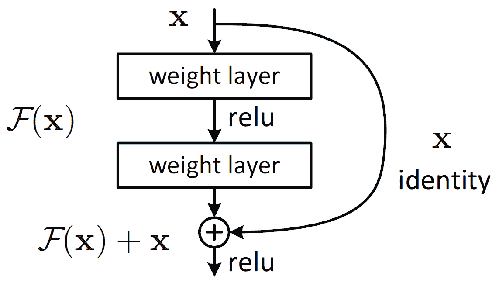

图片来源：深度残差学习，用于图像识别

跳过连接的添加解决了深度网络中的饱和和准确率降低的问题，使体系结构可以具有更多的层而不饱和。 该体系结构由 34 层组成，大部分包含 3 x 3 卷积滤波器。 为了减小特征图的宽度和高度，使用了第 2 步卷积。 最后，使用全局平均池，然后使用 1,000 个单位的全连接层。 在下图中，与典型的 **VGG-19** 和没有残留连接的体系结构相比，您可以观察到 ResNet 体系结构：

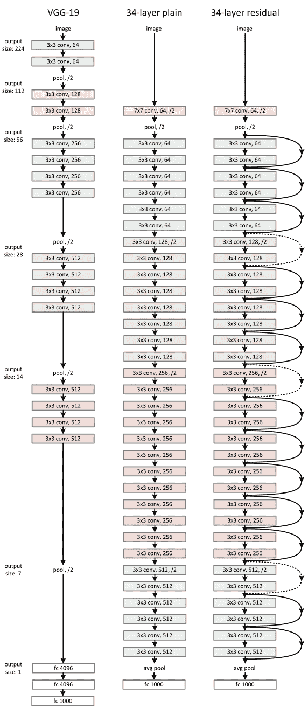

图片来源：深度残差学习，用于图像识别

现在是时候建立我们自己的 CNN 网络进行图像分类了。

# 建立我们的第一个 CNN

在这里，我们将使用著名的 CIFAR-10 数据集来演示使用 CNN 的分类。 如果您不了解 CIFAR 数据集，则以下小节将提供简要说明。

# CIFAR

CIFAR 数据集包含近 8000 万张图像。 该数据集是开源的，并由 Alex Krizhevsky，Vinod Nair 和 Geoffrey Hinton 进行整理。 数据集分为两个子集-CIFFAR-10 和 CIFAR-100。 CIFAR-10 数据集具有属于 10 类的图像-飞机，汽车，鸟，马，猫，狗，鹿，青蛙，船和卡车。 CIFAR-10 每个类别中有 6,000 张图像。 这意味着它总共有 60,000 张图像。 50,000 张图像用于培训，10,000 张图像用于测试。 每个图像的尺寸为 32 x 32 x 3，并且每个图像都是 RGB 颜色。 CIFAR-100 数据集与 CIFAR-10 相似，除了有 100 个类别而不是 10 个类别。我们将在这里使用 CIFAR-10 数据集，因为它具有较少的类别。 您可以从 [CIFAR 网站](https://www.cs.toronto.edu/~kriz/cifar.html)下载 CIFAR-10 Python 版本。

数据下载并提取后，您将在提取的文件夹中找到以下文件：


由于数据集很大，因此分为五个批次-`data_batch_1`，`data_batch_2`，`data_batch_3`，`data_batch_4`和`data_batch_5`，因此我们不需要将完整的数据集加载到内存中。 每个文件中的数据都使用 Python 中的`pickle`模块转储。 要从文件中检索数据，我们可以使用 Python 的 pickle 模块中的 load 方法。 每个批处理文件包含 10,000 张图像。 因此，转储向量的尺寸为（10,000 x 3,072）。 RGB 通道图像被展平为单个尺寸。 （32 x 32 x 3 = 3,072）。 我们将需要以所需的形式重塑数据。 接下来，我们将看到如何加载和预处理数据以供使用。

# 数据加载和预处理

让我们首先编写函数来加载数据批并将其重塑为三维图像。 我们还将使用在原始 CIFAR 网站中也提到过的 pickle 操作加载数据。 让我们创建一个名为`data`的类，该类将包含与数据加载和预处理有关的功能。 我们还将定义一个名为`load_data_batch`的函数，用于将数据批处理加载到内存中。 在类属性中，我们将创建一个名为`labelsDicti`的字典，该字典会将数字标签映射到其实际类。 还创建了逆字典`inverseLabelsDicti`，以将实际的类映射到数字标签。 这将有助于我们进行预测：

```py
# first import some essential modules
import numpy as np
import pickle
import matplotlib.pyplot as plt
import os
import sys

import tensorflow as tf
from sklearn.utils import shuffle

# define the path to the directory where you have extracted the zipped data
DATA_DIR = 'cifar-10-batches-py'

#hyper-parameters for the model

BATCH_SIZE = 128
CLASS_NUM = 10
EPOCHS = 20
DROPOUT = 0.5
LEARNING_RATE = 0.001
IMAGE_SIZE = (32, 32)
SEED = 2 

class data:

  def __init__(self, dataDir, fileName, batchSize, seed, classNum = 10):

    self.dataDir = dataDir
    self.fileName = fileName
    self.classNum = classNum
    self.batchSize = batchSize
    self.seed = seed

    self.labelsDicti = {0:'airplane',1:'automobile',2:'bird',3:'cat',4:'deer',5:'dog',6:'frog',7:'horse',8:'ship',9:'truck'}
    self.inverseLabelsDicti = {v:k for k,v in self.labelsDicti.items()}

  def load_data_batch(self):

    with open(os.path.join(self.dataDir, self.fileName), 'rb') as f:

      dataBatch = pickle.load(f, encoding = 'latin1') 
      #print(dataBatch['data'].shape)
      # latin1 encoding has been used to dump the data.

      # we don't need filename and other details,
      # we will keep only labels and images

    self.images = dataBatch['data']
    self.labels = dataBatch['labels']
```

在这里，`dataBatch`将是一个包含以下键的字典：

*   `batch_label`：表示文件在`5`批次中的哪个批次
*   `labels`：从`0`到`9`的图像的数字标签
*   `data`：`numpy`形状的数组（10,000 x 3,072），表示数据
*   `filenames`：包含相应图像的名称

我们仅将`data`和`labels`保留在两个单独的命名属性中，而忽略其他所有内容。 接下来，我们需要将图像重塑为原始形式。 为此，我们首先需要从 10,000 张图像中分离出三个通道。 除了将它们分为三个通道外，我们还将图像重塑为宽度和高度尺寸。 也就是 32 x32。这里要注意的重要一点是，我们需要先将图像分成通道，然后再分为宽度和高度。 因此，一旦将图像重塑为（10，000，3，32，32），我们将需要交换轴。 可以通过`numpy`阵列上的`transpose`函数完成交换：

```py
def reshape_data(self):

    # function to reshape and transpose
    self.images = self.images.reshape(len(self.images), 3, 32, 32).transpose(0, 2, 3, 1)
```

现在，我们可以可视化一些图像并查看它们的相应标签。 我们将向`data`类添加`visualise_data`函数，该函数将获取`4`索引列表，并将图像绘制在子图中的这些索引处，并将图像的类别显示为标题：

由于数据集中图像的尺寸较小，绘制的图像将非常模糊。

```py
def visualise_data(self, indices):

 plt.figure(figsize = (5, 5))

    for i in range(len(indices)):
      # take out the ith image in indices 
      img = self.images[indices[i]]

      # it's corresponding label
      label =self.labels[indices[i]]

      plt.subplot(2,2,i+1)
      plt.imshow(img)
      plt.title(self.labelsDicti[label])

plt.show()
```

您可以创建`data`类的对象，并调用我们在该对象上构建的函数以以下方式将其可视化：

```py
dataObj = data(DATA_DIR, 'data_batch_1')
dataObj.load_data_batch()
dataObj.reshape_data()
dataObj.visualise_data([100, 4000, 2, 8000])
# here we have chosen indices 100, 4000, 2, 8000
```

下面的屏幕快照显示了运行上述代码的输出：

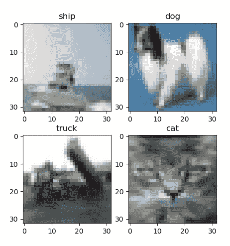

接下来，我们将标签转换为单一编码形式。 我们已经在“第 2 章”，*深度前馈网络*中讨论了一种热编码。 如果您不记得它，可以返回参考“第 2 章”，*深度前馈网络*下的一键编码。 CIFAR-10 的类数为 10，并且类属性`classNum`的默认值为`10`。 以下函数将标签转换为一键编码：

```py
  def one_hot_encoder(self):

    # this function will convert the labels into one-hot vectors
    # initially the label vector is a list, we will convert it to numpy array,

    self.labels = np.array(self.labels, dtype = np.int32)

    #converting to one-hot
    self.labels = np.eye(self.classNum)[self.labels]

    #print(self.labels.shape)
```

我们对图像进行归一化。 在这里，通过归一化，我们意味着将像素值设置在 0 到 1 之间。这很有用，因为激活函数在 0 到 1 之间时很敏感。每个通道中的像素值在 0 到 255 之间。 因此，我们将图像数组除以 255（这是可能的最大值），以使所有内容介于 0 和 1 之间：

```py
def normalize_images(self):

  # just simply dividing by 255
  self.images = self.images / 255
```

为了促进适当的训练，我们需要调出随机样本。 因此，我们将使用 sklearn 的`shuffle`函数对数据进行混洗：

```py
def shuffle_data(self):

  # shuffle the data so that training is better
  self.images, self.labels = shuffle(self.images, self.labels, random_state =         self.seed)
```

下一个功能将是`data`类的重要功能。 该函数将从加载的文件中生成一批数据和标签。 我们知道我们是分批训练模型的，并且我们已经声明了一个超参数`BATCH_SIZE`，它决定了一批图像的数量。 因此，该函数将继续循环遍历从文件加载的数据，并每次产生一批大小`BATCH_SIZE`。 在这里，使用`yield`代替`return`，因为`yield`保留了功能控件，并且我们创建了生成器对象，而不是一旦使用它们便被销毁的列表，从而节省了我们的内存：

```py
def generate_batches(self):

    # function to yield out batches of batchSize from the loaded file
    for i in range(0, len(self.images), self.batchSize):

          last = min(i + self.batchSize, len(self.images))

          yield (self.images[i: last], self.labels[i: last])
```

现在，我们将专注于构建 CNN 模型。 让我们定义另一个类`model`，它将包含我们的模型图。 我们还将超参数定义为类的属性：

```py
class model:

  def __init__(self, batchSize, classNum, dropOut, learningRate, epochs, imageSize, savePath):

    self.batchSize = batchSize
    self.classNum = classNum
    self.dropOut = dropOut
    self.imageSize = imageSize

    self.learningRate = learningRate
    self.epochs = epochs
    self.savePath = savePath
```

首先，我们将使占位符保留数据和标签。 在这里，请注意，占位符的尺寸将为 4。第一个尺寸将代表批处理大小，并且正如我们前面所讨论的，输入层将数据保存为 3D 体积。 其余三个尺寸分别是宽度，高度和图像通道。

这里要做的另一件事是为`dropOut`值创建另一个占位符。 由于 TensorFlow 将所有内容都视为张量，因此`dropOut`的值也必须是张量。 因此，通过`keepProb`，我们将添加`dropOut`占位符值：

```py
with tf.name_scope('placeholders') as scope:

      self.x = tf.placeholder(shape = [None, self.imageSize[0], self.imageSize[1], 3], dtype = tf.float32, name = 'inp_x')

      self.y = tf.placeholder(shape = [None, self.classNum], dtype = tf.float32, name = 'true_y')

      self.keepProb = tf.placeholder(tf.float32)
```

您可以使用不同的过滤器号，内核大小和网络中不同数量的层来试用网络体系结构。 让我们定义模型的第一层。 我们将在第一层中使用 64 个过滤器，内核大小为 3 x 3：

```py
#first conv layer with 64 filters
    with tf.name_scope('conv_1') as scope:

      #tensorflow takes the kernel as a 4D tensor. We can initialize the values     with tf.zeros

      filter1 = tf.Variable(tf.zeros([3, 3, 3, 64], dtype=tf.float32), name='filter_1')

      conv1 = tf.nn.relu(tf.nn.conv2d(self.x, filter1, [1, 1, 1, 1], padding='SAME', name = 'convo_1'))
```

在 TensorFlow 中，我们需要将过滤器定义为可变 4D 张量。 前三个维度代表过滤器的宽度，高度和深度，第四个维度是我们想要的过滤器的输出数量。 在这里，第三维必须是当前深度，而第四维必须是我们想要的过滤器数量（此处为 64）。

接下来，我们将在网络中添加一个 maxpooling 层：

```py
    with tf.name_scope('pool_1') as scope:

      pool1 = tf.nn.max_pool(conv1, ksize = [1, 2, 2, 1], strides = [1, 2, 2, 1],padding='SAME', name = 'maxPool_1')
```

在此，第二维和第三维表示池化内核的宽度和高度。 同样，我们将定义网络的其他层。 我们将逐渐增加深度，并减小宽度和高度：

```py
with tf.name_scope('conv_2') as scope:

      filter2 = tf.Variable(tf.zeros([2, 2, 64, 128], dtype=tf.float32), name='filter_2')

      conv2 = tf.nn.relu(tf.nn.conv2d(pool1, filter2, [1, 1, 1, 1], padding='SAME', name = 'convo_2'))

    with tf.name_scope('conv_3') as scope:

      filter3 = tf.Variable(tf.zeros([2, 2, 128, 128], dtype=tf.float32), name='filter_3')

      conv3 = tf.nn.relu(tf.nn.conv2d(conv2, filter3, [1, 1, 1, 1], padding='SAME', name = 'convo_3'))

    with tf.name_scope('pool_2') as scope:

      pool2 = tf.nn.max_pool(conv3, ksize = [1, 2, 2, 1], strides = [1, 2, 2, 1],
                   padding='SAME', name = 'maxPool_2')

    with tf.name_scope('conv_4') as scope:

      filter4 = tf.Variable(tf.zeros([1, 1, 128, 256], dtype=tf.float32), name='filter_4')

      conv4 = tf.nn.relu(tf.nn.conv2d(pool2, filter4, [1, 1, 1, 1], padding='SAME', name = 'convo_4'))

    with tf.name_scope('pool_3') as scope:

      pool3 = tf.nn.max_pool(conv4, ksize = [1, 2, 2, 1], strides = [1, 2, 2, 1],
                   padding='SAME', name = 'maxPool_3')

    with tf.name_scope('conv_5') as scope:

      filter5 = tf.Variable(tf.zeros([1, 1, 256, 512], dtype=tf.float32), name='filter_5')

      conv5 = tf.nn.relu(tf.nn.conv2d(pool3, filter5, [1, 1, 1, 1], padding='SAME', name = 'convo_5'))
```

现在，是时候添加全连接层了。 要添加全连接层，我们首先需要将来自上一层的输出展平。 您可以在 TensorFlow 中使用`Flatten()`函数，也可以重塑上一层的输出：

```py
    with tf.name_scope('flatten') as scope:

      flatt = tf.layers.Flatten()(conv5)

      #shape = conv5.get_shape().as_list()
      #flatt = tf.reshape(conv5, [-1, shape[1]*shape[2]*shape[3]])
```

我们将添加三个全连接层，其单位分别为 1,024、512 和 256。这些层将使用前面定义的`dropOut`和`rely`激活功能。 全连接层也称为**密集层**，因为它们创建具有全局连接的密集结构：

```py
    with tf.name_scope('dense_1') as scope:

      dense1 = tf.layers.dense(flatt, units = 1024, activation = 'relu',name='fc_1')

      dropOut1 = tf.nn.dropout(dense1, self.keepProb)

    with tf.name_scope('dense_2') as scope:

      dense2 = tf.layers.dense(dropOut1, units = 512, activation = 'relu',name='fc_2')

      dropOut2 = tf.nn.dropout(dense2, self.keepProb)

    with tf.name_scope('dense_3') as scope:

      dense3 = tf.layers.dense(dropOut2, units = 256, activation = 'relu',name='fc_3')

      dropOut3 = tf.nn.dropout(dense3, self.keepProb)
```

输出层也将是一个全连接层，不同之处在于我们将在此层中不使用任何激活函数：

```py
with tf.name_scope('out') as scope:

        outLayer = tf.layers.dense(dropOut3, units = self.classNum, activation = None, name='out_layer')
```

当我们为深度前馈网络定义损失函数和优化器时，我们将在此处类似地对其进行定义：

```py
    with tf.name_scope('loss') as scope:

      self.loss = tf.reduce_mean(tf.nn.softmax_cross_entropy_with_logits(logits = outLayer, labels = self.y))

    with tf.name_scope('optimizer') as scope:

      optimizer = tf.train.AdamOptimizer(learning_rate = self.learningRate)

      self.train = optimizer.minimize(self.loss)

    with tf.name_scope('accuracy') as scope:

      correctPredictions = tf.equal(tf.argmax(outLayer, axis=1), tf.argmax(self.y, axis = 1))

      # calculating average accuracy
      self.avgAccuracy = tf.reduce_mean(tf.cast(correctPredictions, tf.float32))
```

现在，让我们创建`model`类的对象以启动模型图：

```py
modelGraph = model(batchSize = BATCH_SIZE, classNum = CLASS_NUM, dropOut = DROPOUT,
          learningRate = LEARNING_RATE, epochs = EPOCHS, imageSize = IMAGE_SIZE,       savePath = 'model')
```

接下来，我们将创建一个 TensorFlow 会话并在批处理文件周围循环。 对于从 1 到 5 的每个批处理文件，我们将创建一个数据类的对象，并调用我们创建的函数来加载和预处理数据。 此外，`generate_batches`功能不断生成用于训练的批次。 您可以保存模型，例如，每隔 10 个<sup>个</sup>时间段：

```py
with tf.Session() as sess:

  sess.run(tf.global_variables_initializer())
  saver = tf.train.Saver()

  for epoch in range(modelGraph.epochs):

    for iBatch in range(1, 6):

      dataObj = data(DATA_DIR, 'data_batch_' + str(iBatch), BATCH_SIZE, SEED)
      dataObj.load_data_batch()
      dataObj.reshape_data()
      #dataObj.visualise_data([100, 4000, 2, 8000])
      dataObj.one_hot_encoder()
      dataObj.normalize_images()
      dataObj.shuffle_data()
      #print(dataObj.generate_batches()[0])

      for batchX, batchY in dataObj.generate_batches():

        #print(batchX[0])
        #print(batchY[0])

        _, lossT, accT = sess.run([modelGraph.train, modelGraph.loss, modelGraph.avgAccuracy],
                feed_dict = {modelGraph.x: batchX, modelGraph.y: batchY, modelGraph.keepProb: modelGraph.dropOut})

        print('Epoch: '+str(epoch)+' Minibatch_Loss: '+"{:.6f}".format(lossT)+' Train_acc: '+"{:.5f}".format(accT)+"\n")

      if epoch % 10 == 0:

        saver.save(sess, modelGraph.savePath)
```

下一部分将讨论使用 CNN 进行对象检测的任务。 我们将学习一些成功的对象检测架构，并使用 TensorFlow 实现对象检测。

# 使用 CNN 进行物体检测

我们在日常生活中遇到的大多数自然图像都不是由覆盖整个图像的单个对象组成的。 通常，它是位于不同位置的不同对象的混合体。 在这种情况下，简单的对象识别将行不通。 因此，检测图像中存在的各种物体及其位置变得具有挑战性。 这是深度学习大放异彩的地方！

因此，对象检测可以分为两部分：

*   **对象定位**：确定图像中对象的`x`，`y`坐标
*   **对象识别**：确定位置是否有对象，如果有，则确定是什么对象

因此，对象检测网络具有两个单独的子网来执行这两个任务。 第一个网络在图像中生成不同的兴趣区域，而第二个网络对它们进行分类。

# 神经网络

这是用于对象检测的深度学习方法的早期阶段之一。 它利用选择性搜索算法生成区域建议。 区域提议是图像中任何包含对象的可能性很大的长宽比的有界框。 选择性搜索是一种基于图的算法，该算法首先使用像素强度划分区域，然后根据颜色，纹理和大小对它们进行分层分组以生成区域。 该算法的问题在于，即使对于低分辨率图像，它也会产生太多区域建议。 因此，R-CNN 将区域提案限制为 2,000。

将这些建议调整为相同的形状，然后输入到 CNN 网络中，该网络将从区域中提取特征并输出特征向量。 每个类别的对象都有一个 SVM 分类器，该分类器被馈入该特征向量以预测包含该对象的区域的概率。 同样，相同的特征向量被馈送到线性回归器中以预测对象边界框中的偏移。 尽管区域提议包含对象，但可能不会涵盖整个对象。 因此，预测偏移量有助于校正边界框的坐标。 下图显示了 R-CNN 架构中涉及的步骤：

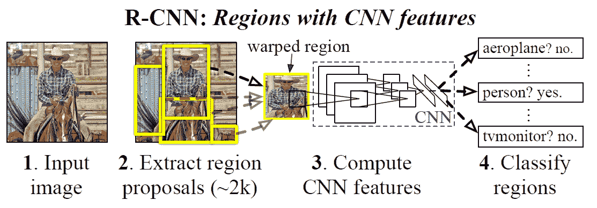

可以在[这个页面](https://arxiv.org/abs/1311.2524)上找到本文的链接*丰富的功能层次结构，以进行准确的对象检测和语义分割*。

接下来，我们将研究通过将选择性搜索替换为单独的区域提议网络来改进 R-CNN 的体系结构。

# 更快的 R-CNN

由于为每个图像生成了 2,000 个区域建议，因此 R-CNN 速度相当慢。 选择性搜索算法也不总是产生好的候选区域建议。 更快的 R-CNN 引入了区域提议网络以生成区域提议，从而取代了选择性搜索算法。 它具有以下功能：

*   最初从输入图像中提取特征图的 CNN
*   九个锚点（三个比例和三个比例），以覆盖特征图中不同大小和比例的对象
*   **区域提议网络**（**RPN**），以生成感兴趣的区域并对其进行排名
*   **感兴趣区域**（**ROI**）合并以将不同形状的提案重塑为固定大小

首先，将输入图像输入到 CNN 中以生成特征图。 特征图进入 RPN，RPN 使用 3 x 3 卷积内核将特征图调整为固定大小。 对于特征图上的每个点，将预测九个锚框以及它们的无对象（是否存在对象）和边界框坐标（中心 x，中心 y，宽度和高度）。 RPN 生成的许多建议彼此重叠。 通过非最大抑制来消除重叠的边界框，该非最大抑制将计算边界框的**交集**（**Iou**），并消除具有大于设置阈值分数的框。 RPN 为我们提供了建议的区域，但大小不同。 为了通过 R-CNN 对它们进行分类，我们需要获得相同大小的建议。 ROI 池通过将建议区域划分为相等数量的部分，然后应用 maxpooling 来执行工作。 这样，无论初始大小如何，输出将始终为固定大小。 然后将这些 ROI 合并的输出馈送到 R-CNN 模块中进行分类。 在下图中，您可以观察到体系结构的完整管道：

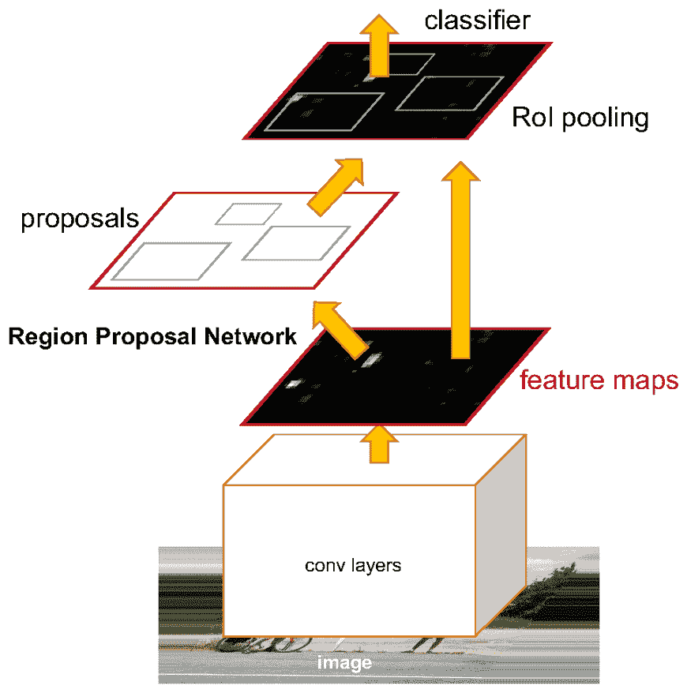

图片来自纸本，更快的 R-CNN：使用区域提议网络实现实时目标检测

可以在[这个页面](https://arxiv.org/pdf/1506.01497.pdf)上找到 Faster-RCNN 原始论文的链接。

接下来，我们将研究另一类对象检测器，即基于回归的对象检测器，它大大简化了对象检测的任务。

# 你只看一次（YOLO）

到目前为止，我们已经讨论过的对象检测架构依赖于区域建议（通过选择性搜索或单独的区域建议网络）。 这些类型的体系结构的问题在于，由于内部存在多个网络的集成，它们的实现非常复杂。 这些架构涉及大量参数，这使它们在计算上过于昂贵。 而且，网络首先提出了许多感兴趣的区域，这使得不可能实时执行检测。

为了应对这些挑战，Joseph Redmon，Santosh Divvala，Ross Girshick 和 Ali Farhadi 在 2015-16 年开发了一种新的基于预测（基于回归）的架构，该架构能够进行实时检测。 该架构称为 **YOLO** ，它是**的缩写，您只看一次**。 YOLO 是一种端到端可训练的体系结构，仅使用单个 CNN 来检测对象。

YOLO 将图像划分为 S x S 网格。 为每个网格预测两个边界框，以及对象属于特定类别的概率。 边界框大小不限于在网格内部。 每个边界框具有五个预测值-（`x`，`y`，`w`，`h`）。`x`和`y`表示边界框相对于网格的中心，而`w`和`h`表示网格的宽度和高度。 相对于图像尺寸的边界框。 因此，网络进行 *S x S x（B x 5 + C）*预测，其中`B`是每个单元格（例如两个）和`C`是`C`类的类概率。 您现在会注意到，该网络依赖于预测值，因此是基于回归的对象检测网络。 在下图中，您可以观察如何将图像划分为网格以预测边界框和类分数：

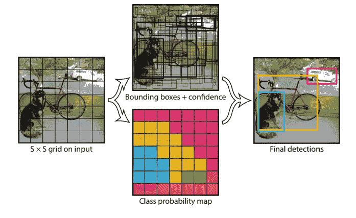

图片取自本文，您只看一次：统一的实时对象检测

论文的链接*只看一次：* *统一的实时对象检测*，可在[这里](https://arxiv.org/pdf/1506.02640.pdf)找到。

YOLO 使用 24 个卷积层。 这些层遵循简单的结构，一个接一个地重复使用 1 x 1 和 3 x 3 卷积。 最后，存在两个全连接层以输出预测的张量。 下图中可以看到该体系结构：

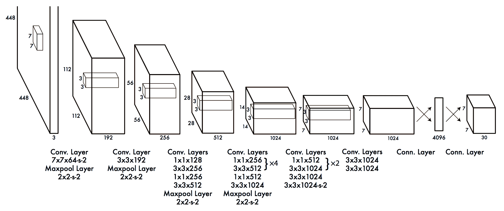

图片来自本文，您只看一次：*统一的实时对象检测*

YOLO 中使用的损失函数可分为四个部分：

*   边界框的位置`x`和`y`的预测的平方和损失
*   在边界框的宽度和高度中进行预测的平方根损失
*   边界框置信度得分的损失
*   分类损失

以下公式包含 YOLO 的组合损失函数：

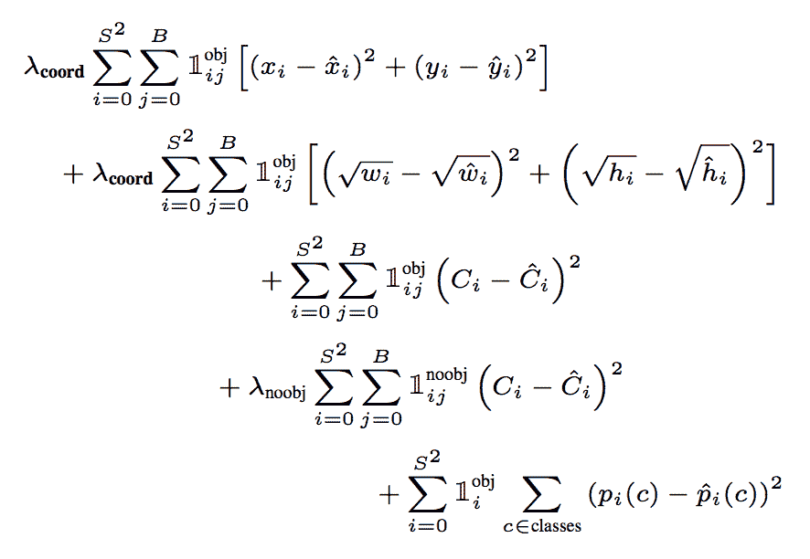

图片出自原始论文，“您只看一次”：统一的实时对象检测

损失函数中的第一项采用所有`B`边界框预测变量的边界框位置差的平方和。 第二项的功能相同，但宽度和高度相同。 您会注意到额外的平方根。 这组作者说，大边界框中的小偏差比小边界框中的小偏差要小。 对术语进行平方根运算有助于我们降低对较大值的敏感度。 我们还预测了置信度分数 *C <sub>i</sub>* ，以及边界框（预测边界框时模型的置信度）。 损失函数中的第三项与置信度得分有关。 损失函数中的最后一项是关于将对象分类为不同类别的。

尽管 YOLO 极大地简化了对象检测体系结构并能够实时进行预测，但是也存在某些缺点。 该模型不会提取不同比例的特征，因此对于不同大小和比例的对象不具有鲁棒性。 该模型还难以检测组合在一起的较小尺寸的对象。 接下来，我们将研究另一种基于回归的对象检测架构，即**单发多框检测器**（**SSD**），该架构可弥补 YOLO 的缺点。

# 单发多框探测器

与 YOLO 一样，SSD 也是基于回归的对象检测器，但是 SSD 的创建者声称 SSD 比 YOLO 更快，更准确。 我们可以将 SSD 分为四个主要部分：

*   基本网络-VGG16
*   多个比例特征图
*   卷积边界框预测
*   用于预测的默认边界框

任何卷积网络的首要任务是减小输入的尺寸并增加特征图的深度，以便提取特征。 然后，可以将特征图中提取的特征用于不同任务，无论是分类还是检测。 SSD 也一样！ SSD 使用著名的 VGG16 架构作为模型的初始层（基础网络）进行特征提取（请记住，这与 YOLO 不同，因为图像本身首先被划分为网格，然后将卷积应用于预测）。 VGG16 体系结构末尾的全连接层已被删除，因为使用 VGG16 的目的只是为了提供丰富的功能学习而非分类。 在改良的 VGG16 网络的末端，SSD 引入了六层以上的卷积。 这些额外的六层的大小逐渐减小。 添加额外层的目的是使网络能够从不同大小和不同比例的对象中提取特征。 这就是为什么这些层中的要素贴图的大小不断减小（多比例缩放的要素贴图）的原因。 下图显示了 SSD 的总体架构：


图片来自纸张，SSD：单发 MultiBox 检测器

原始文件的链接 *SSD：单发多用盒检测器*可以[在以下网址找到](https://www.cs.unc.edu/~wliu/papers/ssd.pdf)。

第一个特征图集是从 VGG 16 体系结构的第 23 层提取的，大小为 38 x 38 x 512（此处 512 是过滤器的深度或数量）。 第二组要素图的大小为 19 x 19 x 1,024，适用于捕获稍大的对象。 进一步的特征图集将尺寸减小到 10 x 10 x 512、5 x 5 x 256、3 x 3 x 256，最后减小到 1 x 1 x 256。

为了进行预测，SSD 在提取的特征图上使用 3 x 3 x`d`（`d`表示过滤器的深度）卷积内核。 对于特征图上的每个点，3 x 3 内核输出边界框偏移量和类分数。 SSD 为功能图中的每个点分配了默认框。 3 x 3 卷积的工作是从覆盖对象的默认边界框预测四个偏移值。 除偏移量外，它还可以预测类别的`c`类别分数。 如果我们在每个位置都有`m`x`n`尺寸特征图，并且在每个位置都有`k`默认边界框，则从该层做出的预测总数将为*（c + 4）xkxmxn* 。 每个位置的默认框数通常为 4 到 6。 这些默认边界框的比例和大小由网络中最低和最高要素图的比例决定。 假设我们有`m`个特征图； 然后，默认边界框的比例（ *s <sub>k</sub>* ）由以下公式给出：


在此， *s <sub>min</sub>* 是最低特征图的比例， *s <sub>max</sub>* 是最高特征图的比例。 然后，默认框的高度和宽度由以下关系定义：


以下屏幕快照说明了使用 8 x 8 功能图和 4 x 4 功能图进行 SSD 预测。 p 类的边界框偏移，和类分数（ *c <sub> 1 </sub>* ，`c`<sub>`2`和</sub> ....， *c <sub> p </sub>* ）的预测：


图片来自纸张，SSD：单发 MultiBox 检测器

SSD 中使用的损失函数是定位损失和分类损失的组合。 本地化损失是按以下方式定义的平滑 L1 损失：


在此，为预测边界框（`l`）和地面真实边界框（`g`）之间的所有`N`默认边界框计算平滑损耗。 。 分类损失是针对类别的 softmax 计算类别分数之上的简单交叉熵损失。 分类损失由以下公式给出：


在这里，第一项是边界框是否包含对象，第二项是没有对象时。 代表该类别的 softmax 得分。

到目前为止，我们已经了解了 SSD 的工作原理。 现在，让我们使用 SSD 使用 TensorFlow 来检测对象！

# TensorFlow 对象检测动物园

目标检测模型很难训练。 这是由于其复杂的体系结构以及进行大量预测的要求。 要训​​练诸如 Faster RCNN，YOLO 或 SSD 的对象检测模型，需要大量的并行处理能力，这并不是每个人都可以使用的。 即使您可以进行这种计算，也要花费数小时和数小时的时间，并要进行仔细的监视以训练端到端的对象检测模型。 尽管非常准确，但这可能会限制这些模型的易于使用。

为了克服这个普遍面临的问题，研究人员提出了预训练网络的想法。 使用可在公共大型数据集（例如 COCO 数据集，PASCAL VOC 数据集，Kitti 数据集等）上获得的最新资源来训练模型。 这些数据集的链接可以在[这个页面](http://cocodataset.org/#home)，和[这个页面](http://host.robots.ox.ac.uk/pascal/VOC/)中找到。

然后将模型的权重和图形公开。 对对象检测深度学习模型感兴趣的任何人都可以下载这些权重和图形以将其实现以用于对象检测。

TensorFlow 凭借其 TensorFlow 对象检测 API 和 TensorFlow 模型库向前迈出了一步，以开源各种预先训练的模型权重和 TensorFlow 冻结图来帮助深度学习开发人员。 您可以查看以下 TensorFlow 模型动物园的链接，并比较不同对象检测模型的运行时间和[**平均平均精度**（**MAP**）](https://github.com/tensorflow/models/blob/master/research/object_detection/g3doc/detection_model_zoo.md)。

接下来，我们将研究如何使用 TensorFlow 模型库进行对象检测。 让我们基于前面讨论的 SSD 建立模型。 我们的第一步是为我们要实现的模型下载预训练的权重。 在这里，我们将考虑模型`ssd_mobilenet_v2_coco`。 MobileNet 背后的想法将在下一章中进行讨论。 现在，将其视为在 COCO 数据集上训练的 SSD 对象检测网络。 您可以通过单击模型名称以压缩形式下载包含所有相关文件的目录，如以下屏幕截图所示：

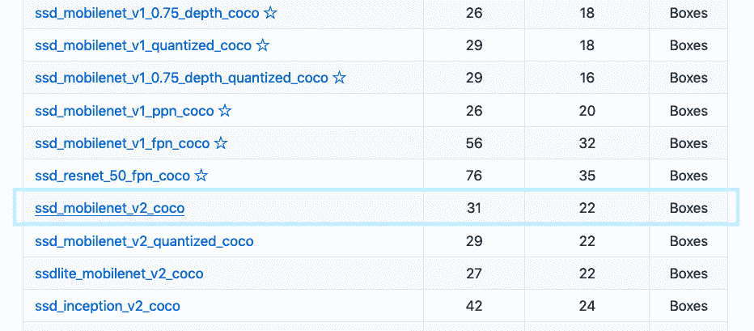

下载`.zip`文件后，可以将其解压缩到`deep_learning`文件夹中。 接下来，我们将看一个脚本，该脚本将从冻结的图形中加载模型和权重，并检测输入图像中的对象。 首先，导入所需的依赖项：

请记住要激活用于深度学习的 Python 库和 TensorFlow 的安装环境。 我们在“第 1 章”，*深度学习*中创建了一个名为`test_env`的环境。 您可以使用它！ 如果您缺少任何依赖项，则可以在终端中（在激活的环境下）简单地执行 **`conda install <dependency_name>`** 命令。

```py
import tensorflow as tf
import numpy as np
import matplotlib.pyplot as plt
import cv2
import os
import argparse
```

我们将使用`argparse`模块传递需要执行检测的图像的路径。 使用`argparse`，可以提供运行脚本时要检测到的图像的存储目录的路径：

```py
parser.add_argument('--im_path', type=str, help='path to input image')
#parser.add_argument('--save_path', type=str, help='save path to output image')
args = parser.parse_args()
IM_PATH = args.im_path
```

接下来，我们将使用`opencv`定义一个简单的函数来读取图像：

```py
def read_image(imPath):
  img = cv2.imread(imPath)
  return img    
```

提取的文件夹必须包含`protobuf`格式（带有`.pb`扩展名）的模型的冻结图。 我们需要读取此文件以加载冻结的图：

```py
FROZEN_GRAPH_FILE = 'frozen_inference_graph.pb'  #path to frozen graph
```

我们在 Python 中使用 TensorFlow，但是 TensorFlow 的实际库是用 C ++编写的。 TensorFlow 使用名为`protobuf`的模块将图形转换为不同的语言。 因此，在读取由`protobuf`（通常带有`.pb`扩展名）存储的图形时，我们需要首先使用`tf.GraphDef`定义一个序列图，然后将其放入要创建的空图内。 以下代码执行相同的操作：

```py
# making an empty graph

graph = tf.Graph()
with graph.as_default():

  # making a serial graph
  serialGraph = tf.GraphDef() 

  # reading from saved frozen graph

  with tf.gfile.GFile(FROZEN_GRAPH_FILE, 'rb') as f:

      serialRead = f.read()
      serialGraph.ParseFromString(serialRead)
      tf.import_graph_def(serialGraph, name = '')
```

接下来，我们使用加载的图初始化会话：

```py
sess = tf.Session(graph = graph)
```

现在，我们将读取指定目录路径中的图像。 在这里，我们仅考虑`.jpeg`图片，但您可以根据需要将其更改为其他格式：

```py
for dirs in os.listdir(IM_PATH):
  if not dirs.startswith('.'):
    for im in os.listdir(os.path.join(IM_PATH, dirs)):
      if im.endswith('.jpeg'):

        image = read_image(os.path.join(IM_PATH, dirs, im))
        if image is None:
          print('image read as None')
        print('image name: ', im)
```

TensorFlow 图由张量变量和占位符组成，它们用于在会话期间流动和馈送数据。 为了获取输出并将输入输入模型，我们需要取出负责输入和输出的张量。 我们可以通过图中的名称来获取张量。 我们使用以下代码为图像的输出检测到的边界框，类和输入占位符获取张量：

```py
imageTensor = graph.get_tensor_by_name('image_tensor:0')

bboxs = graph.get_tensor_by_name('detection_boxes:0')

classes = graph.get_tensor_by_name('detection_classes:0')
```

现在，我们准备对图像执行对象检测。 在这里，我们需要使用`np.expand_dims()`在图像中添加一个额外的尺寸，因为 TensorFlow 会保留批次尺寸的第一个尺寸：

```py
(outBoxes, classes) = sess.run([bboxs, classes],feed_dict = {imageTensor:np.expand_dims(image, axis=0)})
```

我们可以使用简单的`np.squeeze()`操作将结果提取为可视的，以通过使用以下代码来消除多余的尺寸：

```py
cnt = 0
imageHeight, imageWidth = image.shape[:2]
boxes = np.squeeze(outBoxes)
classes = np.squeeze(classes)
boxes = np.stack((boxes[:,1] * imageWidth, boxes[:,0] * imageHeight,
                boxes[:,3] * imageWidth, boxes[:,2] * imageHeight),axis=1).astype(np.int)
```

一旦有了预测的边界框，我们将使用`opencv`在其周围绘制一个矩形框。 您也可以选择打印类值。 将打印数字类值； 您可以参考 COCO 数据集并将数字标签转换为实际标签。 我们会将其留给您作为练习：

```py
for i, bb in enumerate(boxes):

    print(classes[i])
    cv2.rectangle(image, (bb[0], bb[1]), (bb[2], bb[3]), (100,100,255), thickness = 1)
```

此后，我们只需要绘制最终图像以查看图像上的边界框：

```py
plt.figure(figsize = (10, 10))
plt.imshow(image)
plt.show()
```

就是这样了！ 如果您陷入前面的片段的缩进或流程中，则以下是完整的代码供您参考：

```py
import tensorflow as tf
import numpy as np
import matplotlib.pyplot as plt
import cv2
import os
import argparse

parser = argparse.ArgumentParser()

parser.add_argument('--im_path', type=str, help='path to input image')

args = parser.parse_args()
IM_PATH = args.im_path

def read_image(imPath):
  img = cv2.imread(imPath)
  return img

FROZEN_GRAPH_FILE = 'frozen_inference_graph.pb' #path to frozen graph

# making an empty graph
graph = tf.Graph()
with graph.as_default():

  serialGraph = tf.GraphDef()

  with tf.gfile.GFile(FROZEN_GRAPH_FILE, 'rb') as f:
    serialRead = f.read()
    serialGraph.ParseFromString(serialRead)
    tf.import_graph_def(serialGraph, name = '')

sess = tf.Session(graph = graph)

for dirs in os.listdir(IM_PATH):
  if not dirs.startswith('.'):
    for im in os.listdir(os.path.join(IM_PATH, dirs)):
      if im.endswith('.jpeg'):

        image = read_image(os.path.join(IM_PATH, dirs, im))
        if image is None:
          print('image read as None')
        print('image name: ', im)

        # here we will bring in the tensors from the frozen graph we loaded,
        # which will take the input through feed_dict and output the bounding boxes

        imageTensor = graph.get_tensor_by_name('image_tensor:0')

        bboxs = graph.get_tensor_by_name('detection_boxes:0')

        classes = graph.get_tensor_by_name('detection_classes:0')

        (outBoxes, classes) = sess.run([bboxs, classes],feed_dict={imageTensor: np.expand_dims(image, axis=0)})

        # visualize
        cnt = 0
        imageHeight, imageWidth = image.shape[:2]
        boxes = np.squeeze(outBoxes)
        classes = np.squeeze(classes)
        boxes = np.stack((boxes[:,1] * imageWidth, boxes[:,0] * imageHeight,
                boxes[:,3] * imageWidth, boxes[:,2] * imageHeight),axis=1).astype(np.int)

        for i, bb in enumerate(boxes):

          print(classes[i])
          cv2.rectangle(image, (bb[0], bb[1]), (bb[2], bb[3]), (255,255,0), thickness = 1)

        plt.figure(figsize = (10, 10))
        plt.imshow(image)
        plt.show()
```

让我们拿起一张图片向您展示它的外观。 我们拍摄了以下两个人类站立的图像（图像来自 Wikipedia）：


这是检测到的结果：

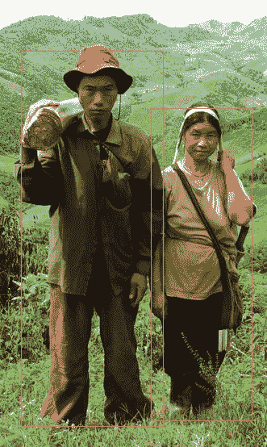

# 概要

在本章中，我们首先讨论了深度前馈网络的缺点以及 CNN 如何克服这些缺点而发展。 接下来，我们深入研究了 CNN 的体系结构，了解了 CNN 的不同层-输入层，卷积层，最大池化层和全连接层。 我们研究了一些著名的图像分类 CNN 的体系结构，然后在 CIFAR-10 数据集上构建了我们的第一个 CNN 图像分类器。 然后，我们继续使用 CNN 进行对象检测。 我们讨论了各种对象检测器，例如 RCNN，Faster-RCNN，YOLO 和 SSD。 最后，我们使用 TensorFlow 检测模型 Zoo 通过 SSD 实现了我们的第一个对象检测器。

在下一章中，我们将介绍 CNN 架构，这些架构需要较少的计算能力，并且重量轻，可以在移动设备上运行。 它们被称为 **MobileNets** ！