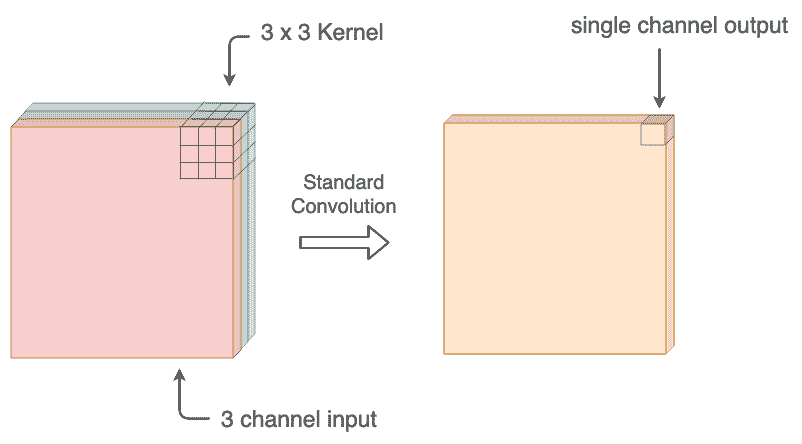
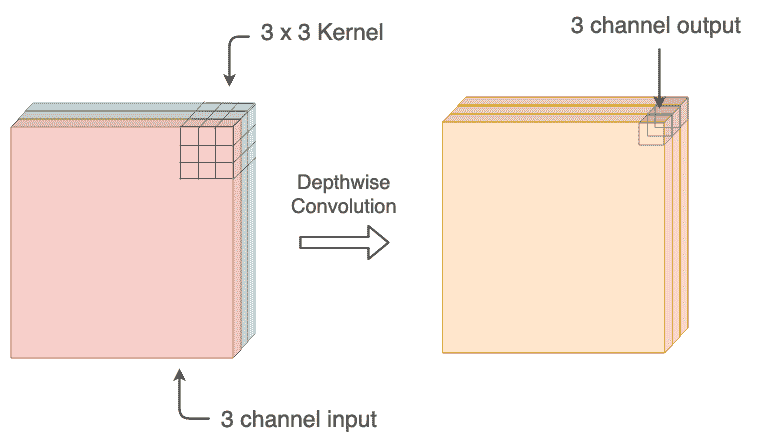
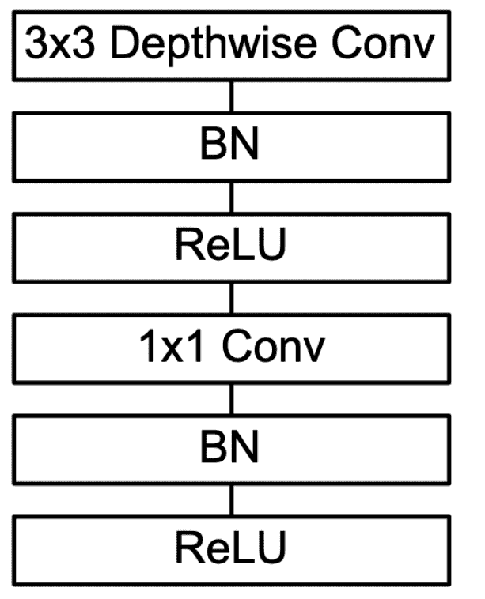
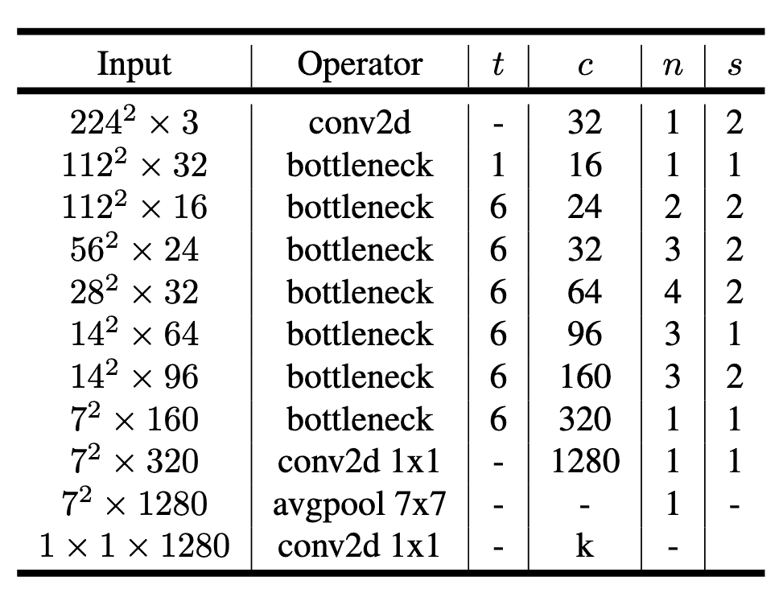
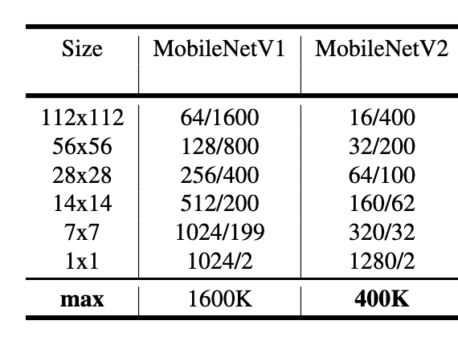
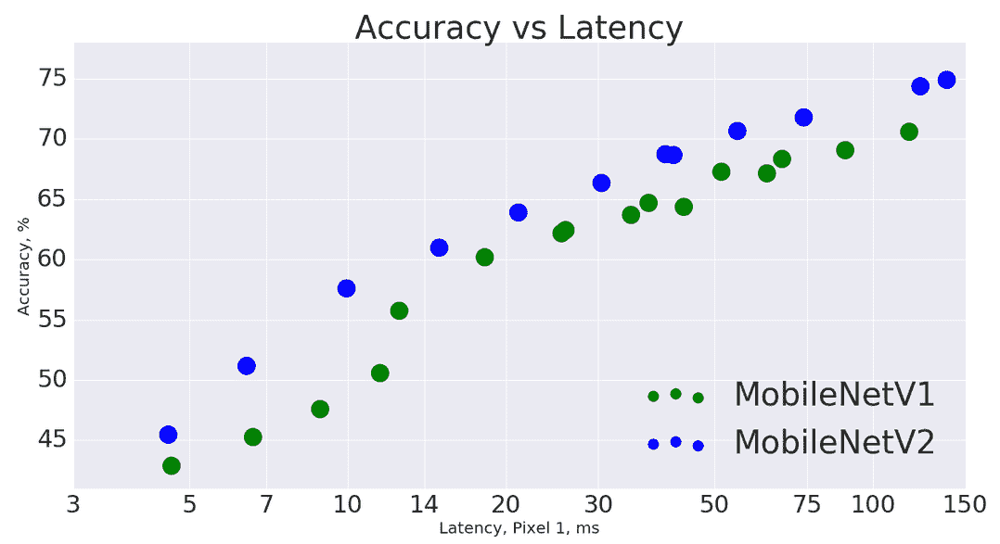
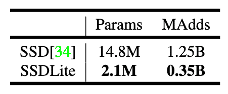

# 移动神经网络和 CNN

深度学习网络所需的计算成本一直是扩展的关注点。 进行推理需要数百万个乘法运算。 这限制了已开发的**卷积神经网络**（**CNN**）模型的实际使用。 移动神经网络为这一问题提供了突破。 它们是超小型且计算量较小的深度学习网络，并具有与原始同类产品相当的性能。 移动神经网络只是经过修改以具有更少参数的 CNN，这意味着它们消耗的内存更少。 这样，它们就可以在内存和处理能力有限的移动设备上工作。 因此，移动神经网络在使 CNN 用于实时应用中起着至关重要的作用。 在本章中，我们将介绍 Google 引入的两种基准移动 CNN 架构-MobileNet 和 MobileNetV2。 完成本章后，您将了解以下主题：

*   MobileNet 如何发展
*   MobileNet 的架构
*   用 Keras 实施 MobileNet
*   MobileNetV2
*   MobileNetV2 的动机
*   MobileNetV2 的架构
*   比较两个移动网
*   固态硬盘

# MobileNets 的演进之路

CNN 为计算机视觉带来了光明的未来。 CNN 凭借连续几年在 ILSVRC 竞赛中的出色表现，为复杂的计算机视觉任务（例如检测和识别）奠定了基准。 但是这些 CNN 模型所需的计算能力一直很高。 这可能导致 CNN 的商业使用受到重大挫折。 现实世界中几乎所有与对象检测有关的任务都是通过便携式设备执行的，例如移动电话，监控摄像头或任何其他嵌入式设备。 这些设备的计算能力和内存有限。 为了使任何深度学习网络都在便携式设备上运行，网络权重和网络中发生的计算数量（即网络中的参数数量）必须非常小。 CNN 具有数百万个参数和权重，因此似乎不可能在任何移动设备上打包和运行 CNN！

2017 年初，Google 的一组研究人员取得了突破，并推出了一种称为 MobileNets 的新型 CNN，用于移动和嵌入式视觉。 MobileNet 具有深度可分离卷积的概念，在保持相同模型深度的同时，显着减少了卷积网络的参数数量。 MobileNets 取得了巨大的成功！ 许多公司开始使用 MobileNets 在移动设备上进行实时检测。

Google 在 2018 年推出了第二版 MobileNets，称为 MobileNetV2。 较新的 MobileNetV2 具有反向残差块。 各种成功的对象检测架构（例如 SSD）也与 MobileNetV2 结合在一起，以创建用于对象检测的高效移动架构。 因此，让我们在下一部分中了解 MobileNets 的架构。

# MobileNets 的架构

MobileNets 架构的核心是深度可分离卷积的概念。 CNN 的标准卷积操作由深度卷积和点卷积代替。 因此，我们首先来看下一部分中的深度可分离卷积。

# 深度可分离卷积

顾名思义，深度可分离卷积必须与特征图的深度有关，而不是其宽度和高度。 请记住，当我们在 CNN 中的输入图像上使用滤镜时，该滤镜覆盖了图像的所有通道（例如彩色图像的三个 RGB 通道）。 无论输入中存在多少个通道，卷积核总是覆盖所有通道并在单个通道特征图中生成输出。

在任何层中，如果我们想要`n`个数量的特征图，则在上一层上运行`n`个数量的内核，因为每个内核输出一个通道。 下图显示了标准卷积的输出响应：



但是与标准卷积不同，深度卷积并未将输入中的所有通道都考虑在内以输出单个通道。 而是，它分别在每个通道上执行卷积。 因此，对`n`通道图像执行深度卷积将在输出中产生`n`通道。 深度方向可分卷积有两个部分-深度方向卷积（我们刚刚讨论过）和点方向卷积。 深度卷积之后是点状卷积，这只是一个具有`1 x 1`内核的常规卷积运算。 需要逐点卷积来组合深度卷积的结果。

下图显示了深度可分离卷积的输出响应：



那么，使用`n`卷积过滤器生成深度`n`的特征图有什么问题？ 为什么我们需要用深度方向可分离卷积代替标准卷积？ 在下一节中，我们将探讨原因。

# 深度可分离卷积的需求

在 MobileNets 中引入深度可分离卷积的目的是减少所需的计算费用。 因此，让我们将深度卷积可分离卷积与标准卷积的计算成本进行比较。 由于乘法运算而导致主要的计算成本（诸如加法的运算在计算上很简单）。 乘法次数越多，所需的计算就越高。 让我们考虑一个`M x M x N`图像的情况。 这是 RGB 图像的典型尺寸。 假设我们正在使用`K x K x N`大小的标准卷积核，并且我们希望尺寸特征图为`G x G x D`。 为此，我们必须使用`D`个过滤器：

*   因此，在一个位置上一个卷积过滤器所需的乘法运算次数为`K . K . N = K^2 N`。
*   该过滤器会滑动`G x G`次，以生成一个过滤器的完整输出。 这使得乘法的次数`G^2 K^2 N`。
*   我们有`D`个这样的内核。 因此，这使得我们需要卷积`G^2 K^2 ND`的总成本。

现在，让我们计算使用深度方向可分离卷积生成相同结果所需的乘法运算次数。 我们知道深度方向可分卷积有两个部分-深度方向卷积和点方向卷积。 标准卷积和深度卷积之间的主要区别在于，深度卷积在卷积内核中使用 1 的深度。 让我们考虑一下前面提到的相同场景。 我们有一个`M`x`M`x`N`图片：

*   此处的内核大小为`K x K x 1`。我们需要`N`个内核，以适应完整的图像，这将为我们提供一个`G x G x N`的输出尺寸。 因此，此处所需的乘法数为`G^2 K^2 N`。
*   现在，该进行逐点卷积了。 这涉及组合深度方向卷积的输出。 点式卷积的内核是`1 x 1 x N`。 如果该内核在深度卷积的整个输出中滑动，则一个内核所需的乘法运算次数将为`G^2 N`。
*   如果我们要在最终输出特征图中使用深度`D`，则使用`D`个点状核的最终输出为`G`x`G`x`D`。 因此，乘法数变为`G^2 ND`。
*   深度方向可分离卷积所需的乘法总数是深度方向卷积和点方向卷积所需的乘法总和，如下所示：


我们可以通过以下方式比较标准卷积和深度可分离卷积所需的乘法次数：


通常，如果我们将`D = 256`，`K = 3`，则比率为 0.115。 这意味着深度方向可分离卷积的参数是标准卷积的九倍。

希望您现在对 MobileNet 如何通过深度方向可分离卷积减少参数数量有所了解。 现在，让我们在下一个小节中查看 MobileNet 的结构。

# MobileNet 的结构

MobileNet 的结构由 30 层组成。 它以`3 x 3`的标准卷积作为第一层开始。 此后，继续进行深度卷积和点卷积。 深度可拆分卷积块是深度可拆分卷积和点式卷积的连续组合，如下图所示：



图片来自《MobileNets：用于移动视觉应用的高效卷积神经网络》。 BN 代表批次归一化。

在该结构中，前面的块重复 13 次。 为了减少特征图的宽度和高度，MobileNet 在深度卷积中使用了第二步。 是的，它不使用 maxpooling！ 为了增加特征图的深度，逐点卷积将通道数量加倍。 通道的加倍发生在相应的逐点层中，其中在深度卷积中使用步幅 2。

可以在[这个页面](https://arxiv.org/pdf/1704.04861.pdf)上找到 MobileNets 研究论文的链接。

MobileNet 经过 ImageNet 数据的训练，图像的输入尺寸为 224 x 224 x3。根据 ImageNet 图像的输入尺寸，从卷积层出来的最终输出尺寸为 7 x 7 x 1,024。 卷积结束后，将应用**全局平均池**（**GAP**）层，以使尺寸为 1 x 1 x 1,024。 假设尺寸为`H x W x D`的特征图，GAP 层会计算`HW`值的平均值，并使用单个平均值替换`H x W`值，因此输出尺寸始终为`1 x 1 x D`。

由于 MobileNet 主要用于分类，因此结束层是全连接层。 MobileNets 中使用的激活功能是 ReLU6。 我们已经了解了 ReLU，但是 ReLU6 是什么？ ReLU6 与 ReLU 功能相同，但上限限制为六个。 作者声称 ReLU6 可帮助模型更早地学习稀疏特征。 以下等式定义了 ReLU6 激活函数：


让我们在下表中查看 MobileNet 的完整架构：


图片来自《MobileNets：针对移动视觉应用的高效卷积神经网络》

既然我们已经了解了 MobileNet 的架构以及如何通过深度方向上可分离的卷积减少参数的数量，那么让我们看一下 MobileNet 的实现。

# MobileNet 与 Keras

MobileNet 经过 ImageNet 数据训练。 通过使用 Keras 应用程序类，我们可以使用模型的预训练权重来实现 MobileNet。 在 Keras 应用程序中，您可以找到许多预先训练的模型供使用。 您可以通过[这里](https://keras.io/applications/)浏览 Keras 应用程序的文档。

所以，让我们开始吧！ 首先，显然，我们将导入所需的依赖项：

```py
import keras
from keras.preprocessing import image
from keras.applications import imagenet_utils
from keras.models import Model
from keras.applications.mobilenet import preprocess_input

import numpy as np
import argparse
import matplotlib.pyplot as plt
```

Keras `preprocessing`提供了一个类，例如`ImageDataGenerator`类，该类有助于从数据集中绘制成批图像。 我们的下一个工作是获取模型权重和图形。 在我们的脚本中添加以下步骤后，下载将仅在您的系统上进行一次：

```py
model = keras.applications.mobilenet.MobileNet(weights = 'imagenet')
```

下载可能需要一些时间，具体取决于您的互联网连接。 Keras 将继续更新状态，完成后将如下图所示：


我们将使用`argparse`模块来帮助将图像路径传递到我们希望 MobileNet 分类的图像的脚本：

```py
parser = argparse.ArgumentParser()
parser.add_argument('--im_path', type = str, help = 'path to the image')
args = parser.parse_args()

# adding the path to image
IM_PATH = args.im_path
```

我们将使用 Keras 提供的`load_img`函数来加载此图像，并使用`img_to_array`将其转换为数组：

```py
img = image.load_img(IM_PATH, target_size = (224, 224))
img = image.img_to_array(img)
```

ImageNet 中的图像的宽度和高度为`224`。 因此，默认情况下将目标大小设置为`(224, 224)`。 正如我们前面所看到的，第一维始终保持批量大小。 我们将扩展图像的尺寸，以将批量大小作为第一个尺寸（因为我们使用的是单个图像，因此可以假定其为批量大小 1）：

```py
img = np.expand_dims(img, axis = 0)
```

最后，我们将通过`mobilenet`的`preprocess_input()`函数传递`img`，该函数执行基本的预处理操作，例如重新塑形和标准化图像的像素值：

```py
img = preprocess_input(img)
```

现在，是时候让 MobileNet 对我们提供的图像做出预测了：

```py
prediction = model.predict(img)
```

当模型根据 ImageNet 数据集预测类别时，我们将使用`decode_predictions`函数以人类可读的形式带回前五项预测：

```py
output = imagenet_utils.decode_predictions(prediction)
print(output)
```

让我们使用以下鹈鹕鸟的图像并检查 MobileNet 是否能够对其进行分类：


图片来自维基百科

您需要按照以下方式从正在运行的环境下的终端运行脚本以及图像的路径：

```py
$python mobilenet_keras.py --im_path=pelican.jpg
```

以下是我们脚本的输出。 您可以看到 MobileNet 将该图像预测为鹈鹕，概率为 0.99！ 在预测的前五类中，还有其他一些看起来像鹈鹕的鸟，但是由于 softmax 激活，它们的概率被抑制了：


您可以使用与 ImageNet 数据类有关的不同图像来探索 MobileNet 的性能。 在 MobileNet 成功之后，Google 研究团队于 2018 年 4 月发布了 MobileNet 的更新版本。我们将在下一部分中了解 MobileNet 的第二版本。

# MobileNetV2

第二个版本的 MobileNet，称为 MobileNetV2，甚至比 MobileNet 还要快。 第二个版本也具有较少的参数。 自发布以来，MobileNetV2 已广泛用于最新的对象检测和分段架构中，以使资源有限的设备上的对象检测或分段成为可能。 让我们看看创建 MobileNetV2 的动机。

# MobileNetV2 的动机

Google 的研究人员希望 MobileNet 更轻巧。 如何使 MobileNet 具有更少的参数？ 所有基于 CNN 的模型都增加了特征图（深度通道）的数量，同时减小了宽度和高度。 减小网络大小的一种简单方法是减小特征图的深度。 通道数越少，参数越少。 但这会削弱 CNN！ 卷积过滤器将无法从浅层特征图中提取特征。 那我们现在怎么办？

Google 研究人员找到了解决该问题的方法，并介绍了现有 MobileNet 架构的两个主要变化：**扩展线性瓶颈层**和**倒置残差块**。我们将在下一部分中介绍 MobileNetV2 的详细结构。

# MobileNetV2 的结构

MobileNetV2 的核心架构仍然依赖于深度方向上可分离的卷积层。 还记得 MobileNet 的基石吗？ 它具有`3 x 3`的深度卷积层，然后是`3 x 3`的逐点卷积和批量归一化，中间是 ReLU6。 MobileNetV2 遵循相同的块，不同之处在于顶部有一个额外的扩展层和一个线性瓶颈层来代替`3 x 3`点向卷积。 首先让我们看一下线性瓶颈层的作用。

# 线性瓶颈层

在 MobileNet 中，1 x 1 点向卷积负责增加通过网络的特征图的深度。 MobileNetV2 中的线性瓶颈层执行相反的工作。 它实际上减少了特征图的深度。 为了保留层中的非线性，ReLU 激活函数会降低负值。 这导致信道中的信息丢失。 为了解决这个问题，要素地图中使用了许多通道，因此很有可能一个通道中的信息丢失会保留在任何其他通道中。

但是，MobileNetV2 的作者证明，如果将输入通道投影到低维空间而不是高维空间，则 ReLU 激活能够保留来自输入通道的所有信息。 这是一个重大突破！ 作者还提供原始文件中的补充材料来证明这一点。

可以在[这个页面](https://arxiv.org/pdf/1801.04381.pdf)上找到 MobileNetV2 研究论文的链接。

因此，作者在卷积之后引入了所谓的线性瓶颈层，这降低了尺寸。 例如，如果中间层具有 384 个通道，则它将减少为 128 个通道。 但是减小尺寸并不是我们所需要的！ 为了执行深度卷积，我们需要更高的维数。 因此，在深度卷积之前使用扩展层以增加通道的数量。 让我们看一下扩展层的功能。

# 扩展层

**扩展层**是`1 x 1`卷积层，始终具有比输入维更大的输出通道维。 扩展量由称为**扩展因子**的超参数控制。 整个 MobileNetV2 的扩展因子都设置为 6。例如，如果输入具有 64 个通道，它将被扩展为`64 * 6 = 384`个通道。 在其上进行深度卷积，然后瓶颈层将其带回到 128 个通道。

MobileNetV2 的架构首先扩展通道，执行卷积，然后减小它。 这使架构的端到端维数较低，从而减少了所需参数的数量。

下图显示了 MobileNetV2 的总体构建块：


现在，架构还剩下一件事：剩余层。 尽管它类似于 ResNet 模型中的跳过连接，但我们将查看有关它的一些详细信息。

# 倒残块

由于通过将许多层堆叠在一起，深度学习模型变得太深，训练网络变得非常困难。 这不仅是由于需要巨大的计算能力，而且还因为梯度逐渐消失在层中。 我们知道深度学习模型中的所有学习都取决于通过反向传播的梯度流。 在大型网络中，梯度随着每一步而变小，并在穿过所有层之前消失。 这种现象限制了我们使网络变得太深。 ResNet 架构中引入的剩余连接或跳过连接可帮助我们克服此问题。 来自上一层的连接将添加到一层，以便渐变获得易于流动的路径。 这些跳过连接使 ResNet 模型比通常的更深。

受跳过连接的启发，MobileNetV2 的作者声称有用的信息仅位于瓶颈层，因此，为了使渐变易于通过多个瓶颈块流动，他们增加了从一个瓶颈层到另一个瓶颈层的剩余连接。 由于 ResNet 中原始残差连接和 MobileNetV2 中残差连接之间的设计差异，作者选择将此称为反向残差。

下图可以看出差异：


图片来自研究论文《MobileNetV2：残差和线性瓶颈》

既然我们已经涵盖了 MobileNetV2 的所有元素，我们将研究 MobileNetV2 的整体结构。

# 整体架构

MobileNetV2 首先对图像执行标准卷积，以​​创建 32 个滤镜特征图。 此后，有 19 个残存的瓶颈层块（我们在扩展层子部分中看到的块）。 所有卷积核的大小均为 3 x3。整个网络中一直使用 6 的恒定扩展因子。 下表列出了 MobileNetV2 的总体架构：



图片来自研究论文《MobileNetV2：残差和线性瓶颈》

在上表中，`n`列表示重复特定层的次数。 `s`列代表用于该层的步幅。 列`c`和`t`分别表示层中使用的通道数和扩展因子。

与 MobileNet 相似，我们也可以使用 Keras 来实现 MobileNetV2。

# 实施 MobileNetV2

我们将遵循与 MobileNet 相似的过程。 您可以在 Keras 应用程序中找到 MobileNetV2。 我们将使用与 MobileNet 相同的代码，除了这次将使用 MobileNetV2。 供参考，代码如下：

```py
import keras
from keras.preprocessing import image
from keras.applications import imagenet_utils
from keras.applications.mobilenet import preprocess_input
from keras.models import Model

import numpy as np
import argparse
import matplotlib.pyplot as plt

model = keras.applications.mobilenet_v2.MobileNetV2(weights = 'imagenet')

parser = argparse.ArgumentParser()
parser.add_argument('--im_path', type = str, help = 'path to the image')
args = parser.parse_args()

# adding the path to image
IM_PATH = args.im_path

img = image.load_img(IM_PATH, target_size = (224, 224))
img = image.img_to_array(img)

img = np.expand_dims(img, axis = 0)
img = preprocess_input(img)
prediction = model.predict(img)

output = imagenet_utils.decode_predictions(prediction)

print(output)
```

该脚本将首先下载 MobileNetV2 的权重，这可能需要一些时间，具体取决于您的互联网连接。 它看起来像这样：


让我们使用以下火烈鸟图像来检查输出：


这是输出的样子。 我们可以看到该网络大约有 86% 的人确定该图像是火烈鸟。 您可以观察到其他类别的概率由于 softmax 而受到抑制：


一年内推出了两个版本的 MobileNet。 第二个版本包含重大更改，我们已经讨论过。 现在，让我们比较两个网络的一些标准参数。

# 比较两个 MobileNet

MobileNetV2 对 MobileNet 的架构进行了重大更改。 这些更改值得吗？ 在性能方面，MobileNetV2 比 MobileNet 好多少？ 我们可以根据一次推理所需的乘法运算数量来比较模型，这通常称为 **MAC**（乘法累加数）。 MAC 值越高，网络越重。 我们还可以根据模型中的参数数量来比较模型。 下表显示了 MobileNet 和 MobileNetV2 的 MAC 和参数数：

| **网络** | **参数数** | **MAC** |
| MobileNet V1 | 420 万 | 575M |
| MobileNet V2 | 340 万 | 300M |

我们还可以根据不同通道数和分辨率所需的内存来比较模型。 下表提供了比较数据。 测量的内存为**千字节**（**Kb**）：



TensorFlow 还提供了在像素 1 移动电话上运行的两个 MobileNet 之间的**准确率与延迟**比较。 延迟基本上表示运行模型需要多少时间。 下图显示了比较：



您可以在[这个页面](https://github.com/tensorflow/models/tree/master/research/slim/nets/mobilenet)上找到有关比较的更多详细信息。

MobileNetV2 不仅仅是分类。 该架构的作者提出了将对象检测和分段架构相结合的想法。 在下一部分中，我们将介绍用于对象检测的 MobileNetV2 和 SSD 的非常成功的组合。

# 固态硬盘 MobileNetV2

MobileNetV2 的制造商还使移动设备的实时对象检测成为可能。 他们介绍了 SSD 对象检测器和 MobileNetV2（称为 **SSDLite**）的组合。 请记住，在“第 4 章”，“CNN 架构”中，我们将`ssd_mobilenetv2`用于对象检测。 与 SSDLite 相同。 选择 SSD 的原因很简单。 SSD 的构建独立于基础网络，因此卷积被深度可分离卷积替代。 SSDLite 的第一层连接到 MobileNetV2 的第 15 层的扩展。 用深度可分离卷积替换标准卷积可以显着减少网络进行对象检测所需的参数数量。

下表显示了原始 SSD 网络和 SSDLite 所需的参数数量和乘法运算的比较：



图片来自研究论文《MobileNetV2：残差和线性瓶颈》

# 概要

在本章的开头，我们讨论了使神经网络在实时应用程序中运行所需的移动神经网络。 我们讨论了 Google 推出的两种基准 MobileNet 架构-MobileNet 和 MobileNetV2。 我们研究了深度可分离卷积之类的修改如何工作，并取代了标准卷积，从而使网络能够以更少的参数获得相同的结果。 通过 MobileNetV2，我们研究了通过扩展层和瓶颈层进一步缩小网络的可能性。 我们还研究了 Keras 中这两个网络的实现，并根据参数数量，MAC 和所需的内存比较了这两个网络。 最后，我们讨论了 MobileNets 与对象检测网络（例如 SSD）的成功组合，以在移动设备上实现对象检测。

在下一章中，我们将介绍另一种成功的深度学习架构，称为**循环神经网络**（**RNN**）。 这些网络旨在捕获序列中的时间信息，例如句子或任何其他文本。