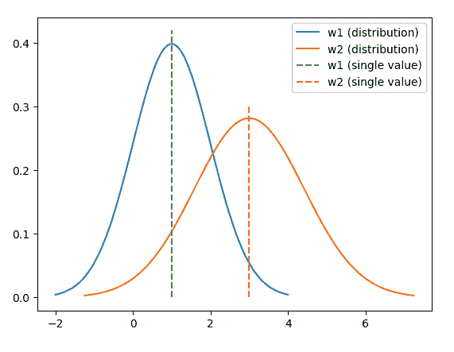
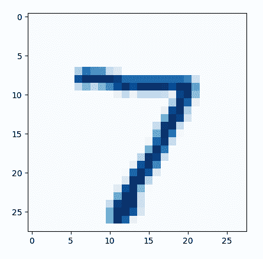
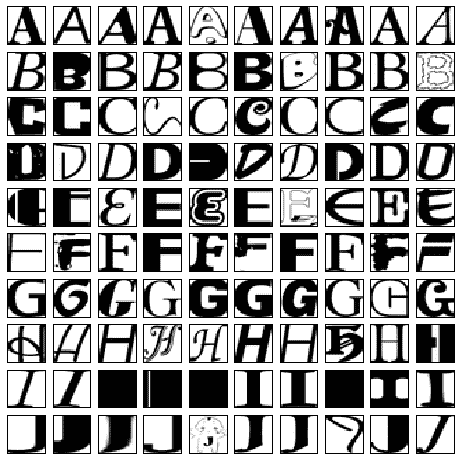
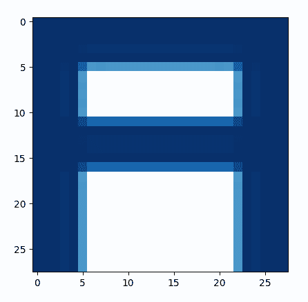
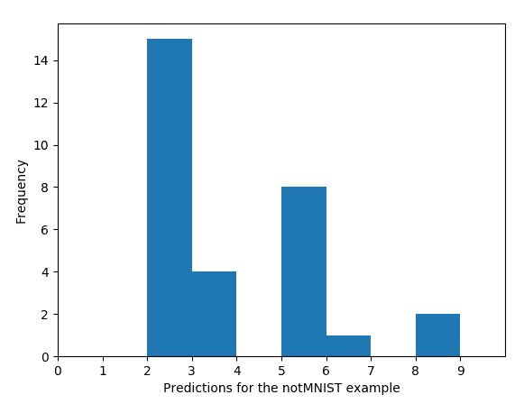
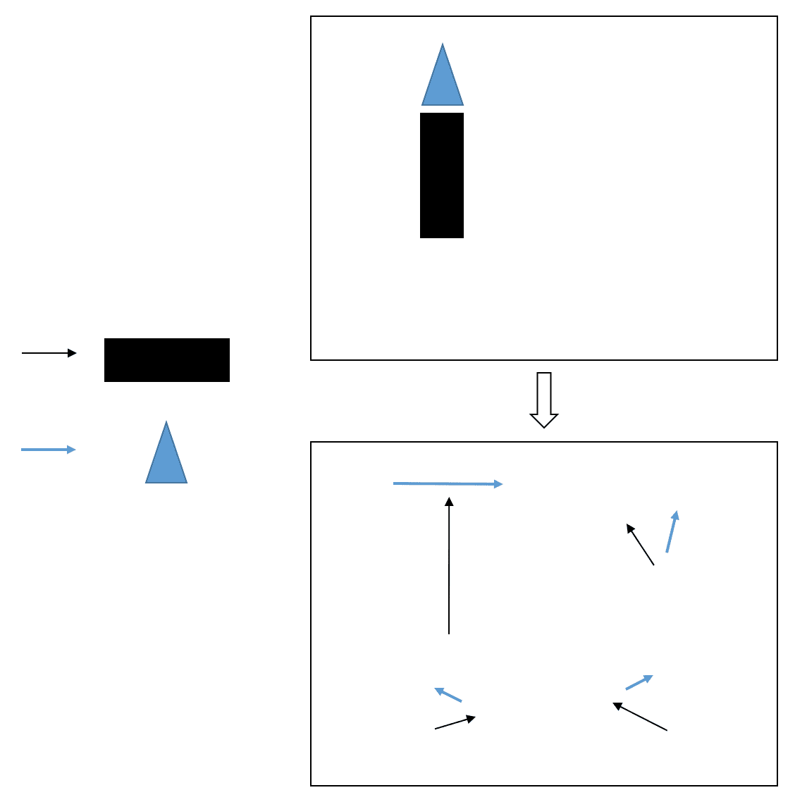
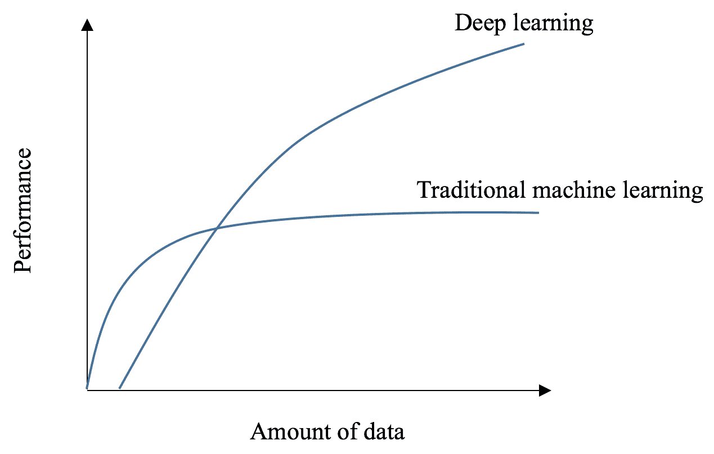
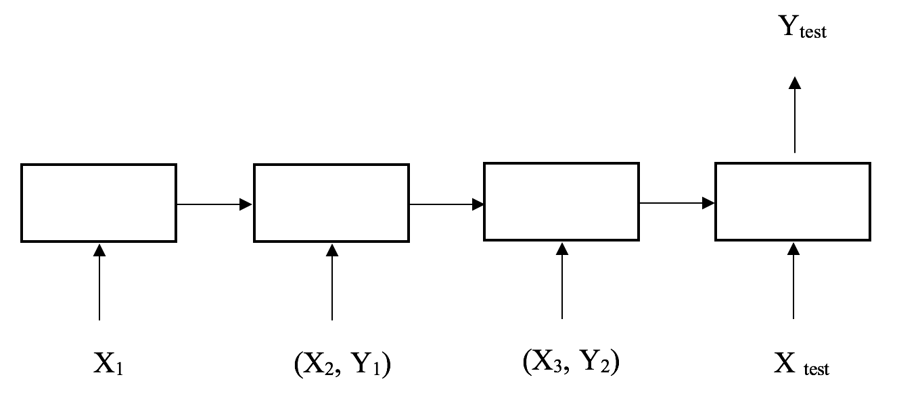
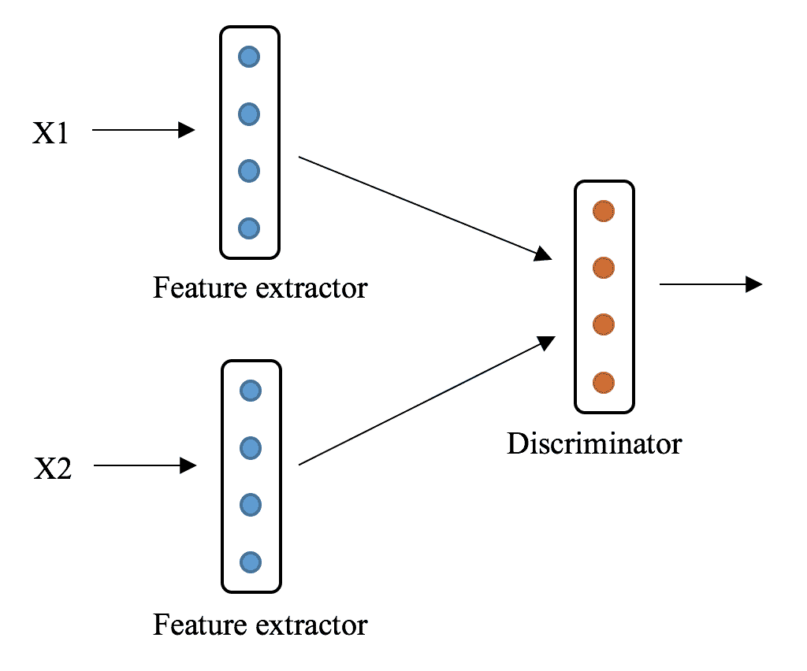

# 八、深度学习的新趋势

在本书的前七章中，具有各种架构的深度神经网络展示了它们从图像，文本和事务数据中学习的能力。 尽管近年来深度学习发展迅速，但它的发展似乎并不会很快减速。 我们看到几乎每个月都会提出新的深度学习架构，并且新的解决方案时不时地成为最新技术。 因此，在最后一章中，我们想谈一谈深度学习中的一些想法，这些想法今年对我们很有影响，并且在将来会更加突出。

在本章中，我们将研究以下主题：

*   贝叶斯神经网络
*   深度学习模型的局限性
*   贝叶斯神经网络的实现
*   胶囊网络
*   **卷积神经网络**（**CNN**）的局限性
*   元学习
*   深度学习中的挑战
*   元学习模型的实现

# 深度学习的新趋势

除了我们在前几章中提到的以外，还有许多其他有趣的深度学习模型和架构难以分类，同时，它们是深度学习的新趋势，并将在未来几年中产生巨大影响 。 在 NLP 中， **BERT**（代表**转换器的双向编码器表示**）成为了最新的语言模型（[有关更多详细信息，请参阅以下论文，由 Google 发布](https://arxiv.org/pdf/1810.04805.pdf)）。 在计算机视觉方面，GAN 不断获得普及和改进。 他们的发明者 Ian Goodfellow 提出了注意力生成对抗网络，用于更精细地生成图像，其中包括以下三个新趋势：

*   贝叶斯神经网络
*   胶囊网络
*   元学习

# 贝叶斯神经网络

贝叶斯深度学习结合了贝叶斯学习和深度学习的优点。 它提供了一个深度学习框架，可以实现最先进的表现，同时捕获和建模不确定性。 首先让我们开始理解不确定性的含义，然后我们将继续探讨贝叶斯深度学习如何从不确定性的角度看待事物。

# 我们的深度学习模型不知道的东西 - 不确定性

**不确定性**是由于知识有限而无法准确描述未来结果的状态。 在机器学习或深度学习的上下文中，这与预测结果的含糊性有关，或者与人的主观定义和概念有关，而不是自然的客观事实。 不确定性很重要，因为它为我们提供了有关预测的自信程度的信息-如果预测不足或过分虚假，我们可能会拒绝我们的预测。

我们的深度学习模型通常无法估计这种不确定性。 他们产生预测，并盲目接受它们的准确率。 您可能会争辩说，最后一个 Sigmoid 或 softmax 层提供了预测结果的可能性。 这不是信心吗？ 概率越高，置信度越高？ 不幸的是，这不是信心，因为概率描述了一个结果**相对于另一个**的结果，但并不能解释整体的信心。

在许多情况下，不知道不确定性可能会带来问题。 例如，2016 年 5 月，一辆 AI 辅助车辆在未能识别出明亮的天空下的白色拖拉机拖车时坠毁。 早在 2016 年，Google 相册中的图像分类系统将两名非洲人标记为大猩猩。 如果将不确定性纳入算法，则可能会避免错误的决策，因为低信度的预测将被拒绝。

# 我们如何获取不确定性信息 – 贝叶斯神经网络

贝叶斯深度学习将预测与不确定性信息相关联。 让我们看看它是如何工作的。

在我们的常规深度学习模型中，包括权重`w`和偏差`b`的参数是通过**最大似然估计**优化的 （**MLE**）：

`w = argmax[w] logP(x, y | w)`

训练模型后，参数的每个系数（例如`w[1], w[2], ..., b[1], b[2], ...`）都是标量，例如`w[1] = 1`，`w[2] = 3`。

相反，在贝叶斯学习中，每个系数都与一个分布相关联。 例如，它们可以处于高斯分布`w[1] ~ N(1, 1), w[2] ~ N(3, 2)`，如下图所示：



关于单个值进行分布的好处是，它可以衡量预测的可信度。 如果使用从分布中采样的不同参数集生成一致的预测，则可以说这些预测具有很高的置信度。 相反，如果在各种样本上的预测不一致，则可以说预测的置信度较低。

估计参数的分布等效于参数的最大后验估计（MAP）：

`w = argmax[w] logP(w | x, y)`

根据贝叶斯规则，可以如下计算`P(w | x, y)`：


困难的部分是计算分母，这就是证据。 这需要对`w`的所有可能值进行积分。 幸运的是，可以使用**蒙特卡洛**或**变分推断**之类的技术对其进行近似。 我们不会在此处提供有关这些技术的详细信息，因为它们不在本书的讨论范围之内。 取而代之的是，我们将使用 TensorFlow 实现贝叶斯神经网络，并演示拥有不确定性信息的力量。

[Edward](http://edwardlib.org/) 是我们将用来实现贝叶斯推理的库。 它建立在 TensorFlow 之上，专为概率建模和推断而设计，包括变分推断和蒙特卡洛。 在撰写本文时（2018 年底），Edward 仅与 TensorFlow 1.7 兼容。 因此，在安装 Edward 之前，我们将必须卸载当前版本的 TensorFlow 并安装 1.7 版：

```py
pip uninstall tensorflow
pip install tensorflow==1.7.0.
pip install edward
```

不要忘了在此部分之后安装最新版本的 TensorFlow。 现在，我们可以执行以下步骤来实现贝叶斯神经网络：

1.  让我们导入必要的包：

```py
>>> import numpy as np
>>> import tensorflow as tf
>>> from edward.models import Categorical, Normal
>>> import edward as ed
```

2.  加载训练和测试数据。 在示例中，我们将使用 MNIST 数据集：

```py
>>> def load_dataset():
...     (x_train, y_train), (x_test, y_test) =
 tf.keras.datasets.mnist.load_data('./mnist_data')
...     x_train = x_train / 255.
...     x_train = x_train.reshape([-1, 28 * 28])
...     x_test = x_test / 255.
...     x_test = x_test.reshape([-1, 28 * 28])
...     return (x_train, y_train), (x_test, y_test)
>>> (x_train, y_train), (x_test, y_test) = load_dataset()
```

3.  定义一些占位符和变量：

```py
>>> batch_size = 100
>>> n_features = 28 * 28
>>> n_classes = 10
>>> x = tf.placeholder(tf.float32, [None, n_features])
>>> y_ph = tf.placeholder(tf.int32, [batch_size])
```

4.  为简单起见，我们将使用仅具有一个隐藏层的神经网络，以及`w`和`b`。 我们分别使用高斯分布为权重和偏差设置先验：

```py
>>> w = Normal(loc=tf.zeros([n_features, n_classes]),
 scale=tf.ones([n_features, n_classes]))
>>> b = Normal(loc=tf.zeros(n_classes), scale=tf.ones(n_classes))
```

5.  `loc`参数指定分布的平均值，而`scale`参数指定标准偏差。 然后，我们可以计算预测输出：

```py
>>> y = Categorical(tf.matmul(x, w) + b)
```

由于模型的参数是与单个值相反的分布，因此输出也应具有分布-特别是分类分布。

6.  如前所述，我们使用变分推断来近似`w`和`b`的后验。 我们建立了近似分布`Q(w)`和`Q(b)`，它们将被优化以匹配`w`和`b`。 两组分布之间的差异通过 **Kullback-Leibler**（**KL**）散度来衡量，我们尝试将其最小化。

同样，近似分布`Q(w)`和`Q(b)`也是高斯分布，但初始位置随机：

```py
>>> qw = Normal(loc=tf.Variable(tf.random_normal(
           [n_features, n_classes])), scale=tf.nn.softplus(
 tf.Variable(tf.random_normal([n_features, n_classes]))))
>>> qb = Normal(loc=tf.Variable(tf.random_normal([n_classes])),
 scale=tf.nn.softplus(tf.Variable(
 tf.random_normal([n_classes]))))
```

7.  接下来，我们定义并初始化与 KL 散度的变分推论：

```py
>>> inference = ed.KLqp({w: qw, b: qb}, data={y: y_ph})
>>> inference.initialize(n_iter=100, scale=
                    {y: float(x_train.shape[0]) / batch_size})
```

变分推断带有 100 次迭代。

8.  不要忘记启动 TensorFlow 会话并初始化该会话的所有变量：

```py
>>> sess = tf.InteractiveSession()
>>> tf.global_variables_initializer().run()
```

9.  现在，我们可以以小批量的方式开始训练贝叶斯网络模型，在此我们可以重用我们在“第 7 章”，“生成对抗网络”中定义的批量生成函数：

```py
>>> def gen_batches_label(x_data, y_data, batch_size, shuffle=True):
...     """
...     Generate batches including label for training
...     @param x_data: training data
...     @param y_data: training label
...     @param batch_size: batch size
...     @param shuffle: shuffle the data or not
...     @return: batches generator
...     """
...     n_data = x_data.shape[0]
...     if shuffle:
...         idx = np.arange(n_data)
...         np.random.shuffle(idx)
...         x_data = x_data[idx]
...         y_data = y_data[idx]
...     for i in range(0, n_data - batch_size, batch_size):
...         x_batch = x_data[i:i + batch_size]
...         y_batch = y_data[i:i + batch_size]
...         yield x_batch, y_batch

>>> for _ in range(inference.n_iter):
...     for X_batch, Y_batch in gen_batches_label( x_train, y_train, batch_size):
...         inference.update(feed_dict={x: X_batch, y_ph: Y_batch})
```

10.  训练完成后，我们在测试集上评估模型（优化的近似分布`Q(w)`和`Q(b)`）。 因为它们是分布，所以我们可以对`w`和`b`的各种集合进行采样，并计算相应的预测。 我们训练样本 30 次，但总的来说，训练越多越好：

```py
>>> n_samples = 30
>>> pred_samples = []
>>> for _ in range(n_samples):
...     w_sample = qw.sample()
...     b_sample = qb.sample()
...     prob = tf.nn.softmax(
                tf.matmul(x_test.astype(np.float32), w_sample)
                         + b_sample)
...     pred = np.argmax(prob.eval(), axis=1).astype(np.float32)
...     pred_samples.append(pred)
```

11.  来自每个采样参数的预测记录在`pred_samples`中。 现在，我们可以计算每组预测的准确率：

```py
>>> acc_samples = []
>>> for pred in pred_samples:
...     acc = (pred == y_test).mean() * 100
...     acc_samples.append(acc)
```

30 组预测的准确率如下：

```py
>>> print('The classification accuracy for each sample of w and b:', 
          acc_samples)
The classification accuracy for each sample of w and b: [90.86999999999999, 90.86, 91.84, 90.88000000000001, 91.33, 91.14999999999999, 90.42, 90.59, 91.36, 91.18, 90.25, 91.22, 89.36, 90.99000000000001, 90.99000000000001, 91.33, 91.2, 91.38, 90.56, 90.75, 90.75, 91.01, 90.96, 91.17, 91.29, 91.03, 91.12, 91.64, 91.44, 90.71000000000001]
```

单个样本的准确率非常一致，约为 91%。 这表明该模型具有很高的置信度。 我们还可以仔细看一个图像示例来验证这一点。 我们需要拍摄第一个测试图像（即标签`7`）并显示它：

```py
>>> image_test_ind = 0
>>> image_test = x_test[image_test_ind]
>>> label_test = y_test[image_test_ind]
>>> print('The label of the image is:', label_test)
The label of the image is: 7
>>> import matplotlib.pyplot as plt
>>> plt.imshow(image_test.reshape((28, 28)),cmap='Blues')
>>> plt.show()
```

请参考以下屏幕截图以获取最终结果：



此示例的预测如下：

```py
>>> pred_samples_test = [pred[image_test_ind] for pred in pred_samples]
>>> print('The predictions for the example are:', pred_samples_test)
The predictions for the example are: [7.0, 7.0, 7.0, 7.0, 7.0, 7.0, 7.0, 7.0, 7.0, 7.0, 7.0, 7.0, 7.0, 7.0, 7.0, 7.0, 7.0, 7.0, 7.0, 7.0, 7.0, 7.0, 7.0, 7.0, 7.0, 7.0, 7.0, 7.0, 7.0, 7.0]
```

我们还制作了预测的直方图，以更好地可视化它们：

```py
>>> plt.hist(pred_samples_test, bins=range(10))
>>> plt.xticks(np.arange(0,10))
>>> plt.xlim(0, 10)
>>> plt.xlabel("Predictions for the example")
>>> plt.ylabel("Frequency")
>>> plt.show()
```

请参考以下屏幕截图以获取最终结果：


这些预测是一致且充满信心的。 如果预测不一致，将会是什么样？ 我们可以使用 *notMNIST* 数据集看到这一点。 *notMNIST* 数据集包含从`A`到`J`的 529,119 张`28 x 28`字母的灰度图像。 请参阅以下屏幕快照以获取数据集：



我们可以从[这里](http://yaroslavvb.com/upload/notMNIST/)下载数据集。 单击[`MNIST_small.tar.gz`的链接](http://yaroslavvb.com/upload/notMNIST/notMNIST_small.tar.gz)，该链接包含数据集的一小部分，并解压缩该文件。 举一个例子并显示它：

```py
>>> from scipy import ndimage
>>> image_file = 'notMNIST_small/A/MDRiXzA4LnR0Zg==.png'
>>> image_not = ndimage.imread(image_file).astype(float)
>>> plt.imshow(image_not, cmap='Blues')
>>> plt.show()
```

请参考以下屏幕截图以获取最终结果：



像之前一样对图像进行预处理：

```py
>>> image_not = image_not / 255.
>>> image_not = image_not.reshape([-1, 28 * 28])
```

同样，我们对经过训练的模型进行采样，并使用每组采样参数进行预测：

```py
>>> pred_samples_not = []
>>> for _ in range(n_samples):
...     w_sample = qw.sample()
...     b_sample = qb.sample()
...     prob = tf.nn.softmax(tf.matmul(
                   image_not.astype(np.float32),w_sample) + b_sample)
...     pred = np.argmax(prob.eval(), axis=1).astype(np.float32)
...     pred_samples_not.append(pred[0])
```

该 notMNIST 示例（`A`）的预测如下：

```py
>>> print('The predictions for the notMNIST example are:', 
                                                pred_samples_not)
The predictions for the notMNIST example are: [2.0, 5.0, 2.0, 2.0, 2.0, 2.0, 2.0, 3.0, 5.0, 5.0, 8.0, 2.0, 5.0, 5.0, 5.0, 3.0, 2.0, 5.0, 6.0, 2.0, 2.0, 5.0, 2.0, 2.0, 2.0, 2.0, 3.0, 3.0, 8.0, 2.0]
```

再次，我们对预测进行直方图，以更好地可视化它们：

```py
>>> plt.hist(pred_samples_not, bins=range(10))
>>> plt.xticks(np.arange(0,10))
>>> plt.xlim(0,10)
>>> plt.xlabel("Predictions for the notMNIST example")
>>> plt.ylabel("Frequency")
>>> plt.show()
```

请参考以下屏幕截图以获取最终结果：



这些预测是非常不一致的。 如我们所见，`2`，`3`，`5`，`6`和`8`到处都是 。 这是我们所期望的，因为基本事实是模型知道的`A`，不是 10 类（`0`至`9`）中的任何一个。 在贝叶斯学习中，预测具有很高的不确定性，因此我们将拒绝我们的预测。 在常规学习中，模型将给出不提供置信度或确定性信息的预测。

# 胶囊网络

胶囊网络是一种新型的深度神经网络。 它们以类似于 3D 计算机图形的方式处理视觉信息。 它们保留了对象之间的层次关系，而 CNN 无法做到。 尽管 CNN 仍然是大多数计算机视觉任务的首选解决方案，但它们仍面临一些挑战。 让我们谈谈胶囊网络是如何解救的。

# 卷积神经网络无法做什么

不要误会我的意思-CNN 非常棒，仍然是当今大多数计算机视觉问题的主要解决方案。 通过回顾我们在前几章中研究的内容，CNN 擅长从卷积过滤器激活的像素中检测有效特征，从而模拟人类视觉系统过程图像。 它们在较早的层中检测低级特征（例如边缘和线条），在较后的层中检测高水平特征（例如轮廓和形状）。 但是，它具有根本的局限性-缺乏空间层次结构。

假设我们正在使用 CNN 模型进行人脸检测项目。 训练有素的网络的某些卷积可能*识别*眼睛，但有些可能是由鼻子，一些耳朵或嘴巴触发的。 只要我们具有所有组件，包括两只眼睛和耳朵，一只鼻子和一只嘴，无论它们的相对位置如何，全连接层都可以识别一张脸。 那就对了！ 因此，以下两个图像 A 和 B 都将通过 CNN 人脸检测器：

**图片 A**：


**图片 B**：


显然，图像 B 不是脸，因为它的眼睛，鼻子，嘴巴和耳朵遍布各处。 但是，由于 CNN 仅关心某些组件的存在，而不关心这些组件的相对位置及其方向，因此将其分类为人脸。 胶囊网络是由 Geoffrey Hinton 发明的（[《胶囊之间的动态路由》](https://arxiv.org/abs/1710.09829)）来合并有关组件之间的相对空间关系及其方向的信息。 。

# 胶囊网络 – 融合方向和相对的空间关系

胶囊网络的发明受到计算机图形学的启发，在计算机图形学中，图像是根据对象的内部几何信息构造的。 此数据存储为代表这些对象的层次结构和相对位置及其方向的几何对象和矩阵的数组。

在 CNN 中，神经元输出标量。 在胶囊网络中，神经元输出一个向量，该向量以下列方式编码所有重要的几何信息：

*   向量的长度表示检测到物体（例如，眼睛，耳朵和鼻子或某种形状）的可能性
*   向量的方向编码对象的方向

以下检测摩天大楼的示例可以帮助您更好地了解向量：



在此简化示例中，两个向量（黑色和蓝色）代表水平矩形和三角形。 我们可以在生成的向量表示图中观察到这一点：存在摩天大楼的左上区域具有最长的向量，并且其方向与摩天大楼的方向匹配； 没有摩天大楼的区域的向量较短，其方向与摩天大楼的方向不同。

这种表示法的优点在于，该模型能够从所有不同的视角检测对象。 假设我们有一个向量，用于检测长度为 0.8 的摩天大楼的水平矩形。 如果我们更改图像中摩天大楼的视点，则向量将随着检测到的对象状态的变化而相应地旋转。 但是，向量的长度保持为 0.8，因为仍然可以检测到对象。 胶囊网络的这种特性称为**活动等价性**或**不变性**，而 CNN 不能通过合并来实现。

使用向量而不是比例作为神经元的输出，胶囊网络通过编码从不同层提取的特征之间的层次和几何关系来扩展 CNN。 特征不再是在二维平面上，而是在三维空间内，类似于计算机图形图像。 现在，您可能想知道胶囊如何消耗和产生向量。 让我们比较和总结胶囊中的计算以及下表中传统神经元中的计算：


胶囊不是直接进行加权和，而是首先运行矩阵乘法以获得更高级别的特征。 让我们重用我们的摩天大楼检测示例，并假设我们有一个输入向量`u[1]`用于检测矩形，`u[2]`用于检测三角形。 然后将这两个向量乘以仿射变换矩阵`W`的相应权重向量。 权重向量可能会编码矩形和摩天大楼之间的相对位置，而另一个权重向量可能会尝试了解三角形和摩天大楼之间关系的方向。 进行仿射变换后，我们可以获得较高级别的特征`u_hat[1]`和`u_hat[2]`，它们根据三角形和矩形的位置和方向表示摩天大楼的位置和方式。

此后，下一步是执行加权和，这听起来很熟悉。 在传统的神经元中，权重是通过反向传播进行优化和计算的。 但是，在捕获中使用**动态路由**学习权重。 动态路由的主要思想是使用多数表决来确定最可能的对象应该喜欢什么。 接近真实预测的向量的权重`c`应具有较高的值，与远离正确预测的向量相对应的权重`c`应具有较低的值。

最后，胶囊中的激活函数也是新的东西。 回想一下，在传统的神经元中，典型的激活函数包括 Sigmoid，tanh 和 ReLU，其主要目的是增加非线性并重新调整输入。 同样，对于胶囊，激活函数的后半部分将输入向量的长度转换为 1，但不改变其方向； 激活函数的前半部分（称为**压缩**）进一步缩放长度，使其不等于 1，同时增加了一些非线性。

这就是胶囊中计算的工作方式。 总而言之，胶囊网络采用功能强大的表示形式-向量-对不同层上重要的特征层次信息进行编码，这在使用标量的传统 CNN 中不可用。 最后但并非最不重要的一点是，如果您对自己实现胶囊网络感兴趣，请随时查看有关 Keras 和 CapsLayer 的以下链接：

*   <https://github.com/XifengGuo/CapsNet-Keras>
*   <https://github.com/naturomics/CapsLayer>

# 元学习

元学习是深度学习研究中另一个令人兴奋的趋势。 就像传统学习一样，它不仅仅针对特定任务在庞大的数据集上进行训练。 它试图利用从任务分配中学到的过去经验来模仿人类的学习过程。 即使只有少量训练样本，它也可以实现良好的表现。 但是，传统的深度学习方法无法做到这一点。

# 深度学习的一大挑战 – 训练数据

您可能已经看到了以下图表，在给定各种训练数据的情况下，将深度学习与传统机器学习算法之间的表现进行了比较：



仅有少量训练数据可用，深度学习算法通常不会比传统机器学习算法起作用或表现更差。 有了足够的数据，深度学习就开始击败传统学习。 随着数据量的增加，它对表现差距的影响也越来越大。 这里的明确信息是，深度学习通常需要足够数量的训练数据才能获得良好的表现。

深度学习之所以需要巨大的数据集，是因为它使用该数据集从头开始训练模型（或模型的某些关键部分）。 您在这里看到问题了吗？ 显然，与我们人类不同，传统的深度学习算法无法从少量数据样本中快速学习，而人类则可以利用过去的经验来快速学习。 我们可以从以下两个方面总结一下**机器学习**（**ML**）/ **深度学习**（**DL**）与人类：

*   **样本效率**：深度学习的样本效率低，因为它需要来自各个类别的足够的样本用于分类任务，而对于回归任务则需要足够的变化。 例如，我们通常在每位数数千个样本上训练一个手写数字识别器。
*   **可移植性**：对于特定任务，深度学习不会从以前的经验中学习，也不会利用从同一任务中学到的知识。 您可能会争辩说，迁移学习就像利用以前的经验一样，但是请记住，转移的知识是从其他任务中获得的，我们仍然需要使用庞大的数据集来微调模型的关键部分。

那么，我们如何才能使深度学习接近人类的学习方式-学习呢？ 当我们没有足够的训练数据时，如何还能有效地学习？ 答案是元学习。

# 元学习 – 学习如何学习

**元学习**是机器学习中的现代子领域。 它使用有关机器学习实验的元数据来自动解决具有类似属性的新学习问题。 在元学习中，训练仅限于来自单个分布的样本，并且不会因训练规模小而受到损害。 就像孩子们只看过几次之后如何分辨猫和狗一样。 另一方面，元学习超出了一项任务。 它了解有关任务的分布情况，因此它仍可用于从未介绍过的任务。 就像孩子一样，有了从猫和狗那里学到的知识，他们就可以区分老虎和狼，而以前却看不到任何老虎或狼。 简而言之，元学习**学习如何学习**。 它试图建立在如何解决任务的知识（元数据）上。

在元学习中，模型经过各种任务训练。 每个学习任务都与包含输入特征和目标变量的数据集相关联。 学习的目的是优化模型，以使这些任务的分配损失最小。 请注意，此处的模型表示高级优化器，可更新低级模型的权重。 即，训练高级模型以学习低级模型。 一项任务的一个数据集在整个过程中被视为一个数据样本。

元学习有许多不同的方法，因为*元学习*仍然是一个宽松术语，是一个相对较新的概念。 最受欢迎的包括：

*   **基于模型学习的元学习**：这是一个顺序模型，只需几个步骤即可更新其参数。 可以在**记忆增强神经网络**（**MANN**）中找到典型的模型学习架构，如下图所示，其外观与 RNN 相似。 在 MANN 中，模型的最后一步将提取要预测的样本。 在此之前，每个步骤都需要获取训练样本，并且样本的标签会在上一步中输入。 有了这种显式的存储缓冲区（也称为**一步偏移**），网络就可以记住学习经验，而不仅仅是从特征到标签的简单映射。 而且，由于我们可以通过随机选择不同的训练数据点`(X, Y)`并按顺序排列它们来轻松生成大量的训练案例，因此不必担心这种训练规模的限制。 下图描述了一个基于模型的元学习示例：



*   基于度量的学习，我们将在下一节中详细讨论。

# 基于指标的元学习

在有限的训练数据的情况下，我们应该做的是提取最重要的信息，而不要过度这样做。 基于度量的元学习试图实现相同的目标。 它利用度量或距离函数在正确的级别上提取特征。

典型的基于度量的学习模型是**连体神经网络**。 如下图的架构所示，它由两个相同的网络组成，它们共享相同的权重和参数以分别从两个输入中提取特征：



然后，从双胞胎网络中提取的特征将输入判别器，以确定两个输入数据样本是否属于同一类。 判别器首先计算特征对之间的距离（例如 L1 距离，L2 距离，余弦相似度）。 然后，该距离将通过 Sigmoid 激活传递到全连接层，以产生两个输入来自同一类别的概率。

简而言之，双胞胎网络试图学习有效的功能，以便揭示两个输入之间的关系。 为了帮助更好地了解这个基于度量的网络，我们将实现它，并将其应用于数据量有限的人脸识别项目。

标准的面部识别系统应该能够仅使用系统中该人的几张照片来识别该人的身份。 显然，为了积累足够的训练数据，不能强迫他拍摄数百张照片。 尽管这是一个多类别的分类问题，但在这种情况下，CNN 不能在一个很小的训练集上真正起作用，因为每个类别的样本要多得多。 而且，如果我们采用典型的多类分类路线，则每次新用户加入系统时都必须对模型进行重新训练，这是不切实际的。 幸运的是，连体神经网络擅长处理**几次学习**问题。

我们将使用 [AT&T 的人脸数据库](https://www.cl.cam.ac.uk/research/dtg/attarchive/facedatabase.html)（也称为 **ORL 人脸数据库**）的一个例子。 从[这里](http://www.cl.cam.ac.uk/Research/DTG/attarchive/pub/data/att_faces.tar.Z)下载数据集并解压缩。 提取的文件夹有 40 个子文件夹，从`s1`到`s40`，它们代表 40 个主题。 每个子文件夹包含 10 个图像文件`1.pgm`，`2.pgm`，...，`10.pgm`。 因此，总共只有来自 40 个个体的 400 个图像样本。 同样，要使典型的 CNN 分类器仅使用 400 个训练样本几乎是不可能的。

每个图像的尺寸为`92 * 112`，并具有 256 个灰度等级。 图像文件为 PGM 格式。 让我们开始使用`PIL`包阅读并显示一个样本。 `PIL`代表 **Python Imaging Library**，如果尚未安装，则可以使用以下命令进行安装：

```py
pip install Pillow
```

现在，阅读并显示一个图像样本：

```py
>>> from PIL import Image
>>> img = Image.open('./orl_faces/s1/1.pgm')
>>> print(img.size)
(92, 112)
>>> img.show()
```


首先，我们编写一个函数以将所有图像及其主题 ID 加载到字典中，其中键是主题 ID，值是 10 张图像的列表：

```py
>>> image_size = [92, 112, 1]
>>> def load_images_ids(path='./orl_faces'):
...     id_image = {}
...     for id in range(1, 41):
...         id_image[id] = []
...         for image_id in range(1, 11):
...             img = Image.open('{}/s{}/{}.pgm'.format(
                                                path, id, image_id))
...             img = np.array(img).reshape(image_size)
...             id_image[id].append(img)
...     return id_image
```

注意，每个图像矩阵都被重塑为尺寸`[92, 112, 1]`。

现在，加载所有图像及其主题 ID：

```py
>>> id_image = load_images_ids()
```

我们仅用 400 个样本处理该项目的方法是将其从多类分类转换为二分类问题。 我们不是直接预测图像属于 40 个对象中的哪个，而是预测图像属于各个对象的概率，而概率最高的那个将成为最终结果。 图像属于对象的概率是根据图像与对象样本之间的距离得出的。 下图说明了预测过程：


给定来自未知主题的图像，我们将其分别与来自三个主题的每个图像进行比较（假设系统中只有三个主题）。 我们将每对图像馈送到连体神经网络并获得概率分数。 具有对象 1 的图像的图像对获得最高概率。 因此，查询图像很可能来自主题 1。使用这种策略，我们将能够从 400 张图像中生成更多的训练样本（或者具体来说，是成对的），以适合连体神经网络。 。 例如，我们最多可以为每个主题创建`10 * 9/2 = 45`个唯一阳性对，或者对于所有 40 个主题总共创建`45 * 40 = 1800`个唯一阳性对。 类似地，我们可以为每对主题形成`10 * 10 = 100`个唯一的阴性对，或者对于所有可能的主题对总共形成`100 * (40 * 39/2) = 78,000`个唯一的阴性对。 最后，我们可以获得数百个训练样本，这确实提高了人脸识别表现。

现在，让我们通过执行以下步骤在 Keras 中构建连体神经网络：

1.  首先，导入所需的所有模块：

```py
>>> from keras import backend as K
>>> from keras.layers import Activation
>>> from keras.layers import Input, Lambda, Dense, Dropout, 
         Convolution2D, MaxPooling2D, Flatten
>>> from keras.models import Sequential, Model
```

2.  我们的连体网络由卷积层组成，因为我们正在处理图像，最大池化层和全连接层。 这种架构的连体网络被称为**卷积连体神经网络**：

```py
>>> def siamese_network():
...     seq = Sequential()
...     nb_filter = 16
...     kernel_size = 6
...     # Convolution layer
...     seq.add(Convolution2D(nb_filter, (kernel_size, kernel_size), input_shape=image_size, border_mode='valid'))
...     seq.add(Activation('relu'))
...     seq.add(MaxPooling2D(pool_size=(2, 2)))
...     seq.add(Dropout(.25))
...     # flatten
...     seq.add(Flatten())
...     seq.add(Dense(50, activation='relu'))
...     seq.add(Dropout(0.1))
...     return seq
```

3.  然后，我们可以定义输入占位符，两个图像，并将它们传递给连体网络：

```py
>>> img_1 = Input(shape=image_size)
>>> img_2 = Input(shape=image_size)
>>> base_network = siamese_network()
>>> feature_1 = base_network(img_1)
>>> feature_2 = base_network(img_2)
```

4.  然后，我们需要计算这两个结果特征向量之间的距离（我们使用 L1 距离），并将结果映射到概率输出：

```py
>>> distance_function = lambda x: K.abs(x[0] - x[1])
>>> distance = Lambda(distance_function, output_shape=
                           lambda x: x[0])([feature_1, feature_2])
>>> prediction = Dense(1, activation='sigmoid')(distance)
```

5.  最后，我们需要用输入和输出占位符包装 Keras 模型，并使用基于 Adam 的优化器和交叉熵作为损失函数对其进行编译：

```py
>>> model = Model(input=[img_1, img_2], output=prediction)
>>> from keras.losses import binary_crossentropy
>>> from keras.optimizers import Adam
>>> optimizer = Adam(lr=0.001)
>>> model.compile(loss=binary_crossentropy, optimizer=optimizer)
```

6.  现在该模型已准备好进行训练，我们需要使用以下功能构建训练集，其中从各个受试者中随机选择正对，从两个不同受试者中随机选择负对。 正负比率保持在 50:50：

```py
>>> np.random.seed(42)
>>> def gen_train_data(n, id_image):
...     X_1, X_2 = [], []
...     Y = [1] * (n // 2) + [0] * (n // 2)
...     # generate positive samples
...     ids = np.random.choice(range(1, 41), n // 2)
...     for id in ids:
...         two_image_ids = np.random.choice(range(10), 2, False)
...         X_1.append(id_image[id][two_image_ids[0]])
...         X_2.append(id_image[id][two_image_ids[1]])
...     # generate negative samples, by randomly selecting two 
                images from two ids
...     for _ in range(n // 2):
...         two_ids = np.random.choice(range(1, 41), 2, False)
...         two_image_ids = np.random.randint(0, 10, 2)
...         X_1.append(id_image[two_ids[0]][two_image_ids[0]])
...         X_2.append(id_image[two_ids[1]][two_image_ids[1]])
...     X_1 = np.array(X_1).reshape([n] + image_size) / 255
...     X_2 = np.array(X_2).reshape([n] + image_size) / 255
...     Y = np.array(Y)
...     return [X_1, X_2], Y
```

我们获得 8,000 个训练样本：

```py
>>> X_train, Y_train = gen_train_data(8000, id_image)
```

7.  现在，我们可以将模型拟合到训练集上，具有 10 个周期和 10% 的数据拆分以进行验证：

```py
>>> epochs = 10
>>> model.fit(X_train, Y_train, validation_split=0.1, batch_size=64, verbose=1, epochs=epochs)
Epoch 1/10
7200/7200 [==============================] - 71s 10ms/step - loss: 0.5168 - val_loss: 0.3305
Epoch 2/10
7200/7200 [==============================] - 62s 9ms/step - loss: 0.3259 - val_loss: 0.2210
Epoch 3/10
7200/7200 [==============================] - 59s 8ms/step - loss: 0.2467 - val_loss: 0.2219
Epoch 4/10
7200/7200 [==============================] - 59s 8ms/step - loss: 0.2089 - val_loss: 0.1669
Epoch 5/10
7200/7200 [==============================] - 60s 8ms/step - loss: 0.1920 - val_loss: 0.1521
Epoch 6/10
7200/7200 [==============================] - 59s 8ms/step - loss: 0.1534 - val_loss: 0.1441
Epoch 7/10
7200/7200 [==============================] - 59s 8ms/step - loss: 0.1509 - val_loss: 0.1124
Epoch 8/10
7200/7200 [==============================] - 58s 8ms/step - loss: 0.1408 - val_loss: 0.1323
Epoch 9/10
7200/7200 [==============================] - 59s 8ms/step - loss: 0.1281 - val_loss: 0.1360
Epoch 10/10
7200/7200 [==============================] - 58s 8ms/step - loss: 0.1215 - val_loss: 0.1736
```

训练和验证损失看起来都不错，但是我们仍然需要在真实环境中进行测试。 假设有`n`个受试者，则在一个测试用例中将有`n`个样本。 在这些`n`个样本中，一个样本是地面真实对，由查询图像和同一主题的图像组成； 其他`n-1`个样本由查询图像和其他主题的图像组成。 例如，假设我们有四个主题，`A`，`B`，`C`和`D`，及其图像`a`，`b`，`c`和`d`。 给定未知图像`x`，一个测试案例可以是`[x, a]`，`[x, b]`，`[x, c]`和`[x, d]`。 在元学习中，给定`n`唯一类，这样的任务称为**四路学习**或 **N 路学习**。

首先，让我们定义一个生成测试用例的函数：

```py
>>> def gen_test_case(n_way):
...     ids = np.random.choice(range(1, 41), n_way)
...     id_1 = ids[0]
...     image_1 = np.random.randint(0, 10, 1)[0]
...     image_2 = np.random.randint(image_1 + 1, 9 + image_1, 1)[0] % 10
...     X_1 = [id_image[id_1][image_1]]
...     X_2 = [id_image[id_1][image_2]]
...     for id_2 in ids[1:]:
...         image_2 = np.random.randint(0, 10, 1)[0]
...         X_1.append(id_image[id_1][image_1])
...         X_2.append(id_image[id_2][image_2])
...     X_1 = np.array(X_1).reshape([n_way] + image_size) / 255
...     X_2 = np.array(X_2).reshape([n_way] + image_size) / 255
...     return [X_1, X_2]
```

请注意，为方便起见，我们将地面真值样本放在第一位，而错误的样本放在其余部分。

我们将以 4、9、16、25、36 和 40 方式的学习方式评估模型。 在每种学习方式中，我们重复实验 1,000 次并计算准确率。 为了进行比较，我们使用 **K 最近邻**（**KNN**）作为基准模型来计算识别表现，我们定义如下：

```py
>>> def knn(X):
...     distances = [np.linalg.norm(x_1 - x_2)
 for x_1, x_2 in zip(X[0], X[1])]
...     pred = np.argmin(distances)
...     return pred
```

最后，我们开始测试：

```py
>>> n_experiment = 1000
>>> for n_way in [4, 9, 16, 25, 36, 40]:
...     n_correct_snn = 0
...     n_correct_knn = 0
...     for _ in range(n_experiment):
...         X_test = gen_test_case(n_way)
...         pred = model.predict(X_test)
...         pred_id = np.argmax(pred)
...         if pred_id == 0:
...             n_correct_snn += 1
...         if knn(X_test) == 0:
...             n_correct_knn += 1
...     print('{}-way few shot learning accuracy: {}'.format(
                            n_way, n_correct_snn / n_experiment))
...     print('Baseline accuracy with knn: {}\n'.format(
                            n_correct_knn / n_experiment)) 
4-way few shot learning accuracy: 0.963
Baseline accuracy with knn: 0.876 
9-way few shot learning accuracy: 0.931
Baseline accuracy with knn: 0.752 
16-way few shot learning accuracy: 0.845
Baseline accuracy with knn: 0.663 
25-way few shot learning accuracy: 0.767
Baseline accuracy with knn: 0.55 
36-way few shot learning accuracy: 0.679
Baseline accuracy with knn: 0.497 
40-way few shot learning accuracy: 0.659
Baseline accuracy with knn: 0.478
```

我们的连体元学习模型大大优于基线。 我们还可以观察到，`n`越高，要考虑的类别越多，因此预测正确的类别越困难。

# 总结

这是我们 DL 架构的最后一站，也是 DL 历程中的新趋势。 在本章中，我们了解到贝叶斯深度学习结合了贝叶斯学习和深度学习的优点。 它对不确定性进行建模，以某种方式告诉我们我们对预测的信任程度。 胶囊网络捕获对象之间的东方和相对空间关系。 我们相信，它们将来会变得更加成熟和流行。

元学习（即学习如何学习）是 DL 研究社区中令人兴奋的主题。 我们已经实现了元学习模型，即带有 Keras 的连体神经网络，并将其应用于人脸识别问题。 实际上，DL 中还有许多其他有趣的事情值得研究，例如深度强化学习，主动学习和自动机器学习。 在阅读本书时，您还发现其他趋势吗？