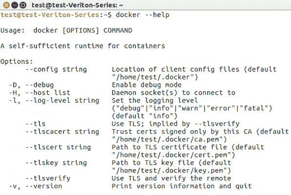
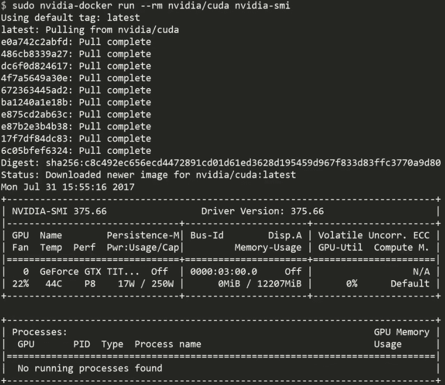
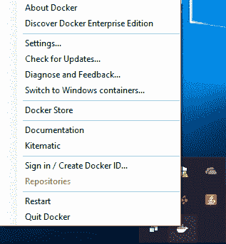
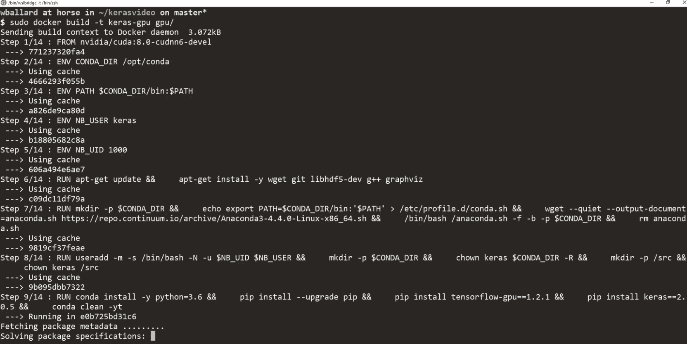
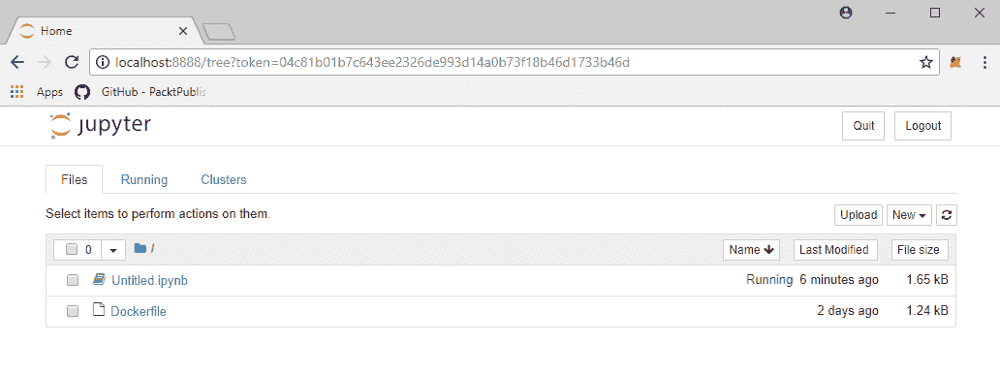

# 机器学习工具包

在本章中，我们将研究以下主题：

*   安装 Docker
*   构建机器学习 Docker 文件
*   在您的主机和 Docker 容器之间来回共享数据
*   使用 Docker 容器内部运行的机器学习基础架构构建 REST 服务

# 安装 Docker

我们需要下载 Docker 才能安装它，在本节中，您将看到我们如何在 Windows 上安装 Docker 并使用适合在 Linux 上安装的脚本。

让我们从 [https://www.docker.com/](https://www.docker.com/) 安装 Docker。 完成此操作的最快方法是前往菜单。 在这里，我们将选择下载 Windows 版本。 单击一下，直接转到 Docker 商店，您可以在其中下载适用于您平台的特定安装程序，如以下屏幕快照所示：


Docker 安装程序窗口

所有平台都可以在这里找到。 我们将只下载 Windows 的 MSI。 它的下载速度相对较快，将其下载到 PC 上后，只需单击 MSI 安装程序，它就会快速继续。

在 Ubuntu 上安装最好使用脚本来完成。 因此，我提供了一个示例安装脚本（`install-docker.sh`），该脚本将更新您的本地程序包管理器，以指向官方 Docker 发行版存储库，然后仅使用应用即可完成安装。

在 Linux 上安装 Docker 非常简单：只需运行我提供的`install-docker` shell 脚本即可。 软件包将更新，下载然后安装。 当结束时，只需键入`docker --help`以确保已安装所有内容：



输出— docker --help 命令

现在，为了获得 GPU 支持，这将使您的 Keras 和 TensorFlow 模型运行得更快，有一个名为`nvidia-docker`的特殊版本，该版本将 Ubuntu 上的设备暴露给 Docker 容器以允许 GPU 加速。 也有一个安装脚本（`install-nvidia-docker.sh`）。 现在，假设您确实有一个真正的 NVIDIA 图形卡，则可以使用 NVIDIA Docker 代替 Docker。

在这里，我们正在运行一个使用 NVIDIA SMI 的测试命令，它实际上是一个状态程序，向您显示计算机上的 GPU 状态：



GPU 状态

您会看到，我们的 TITAN X 完全暴露于 Docker。 安装 Docker 是一个相对容易的操作。

在下一部分中，我们将研究编写 Docker 文件以建立完整的机器学习环境。

# 机器学习 Docker 文件

现在，让我们开始准备准备机器学习的 Docker 文件。 在本节中，我们将研究克隆源文件，Docker 所需的基本映像，安装其他必需的软件包，公开一个卷以便您可以共享您的工作以及公开端口以便您能够 看 Jupyter Notebooks，这是我们将用来探索机器学习的工具。

现在，您需要获取这些部分附带的源代码。 前往 [https://github.com/wballard/kerasvideo/tree/2018](https://github.com/wballard/kerasvideo/tree/2018) ，您可以在其中快速克隆存储库。 在这里，我们只是使用 GitHub for Windows 作为一种相对快速的方法来克隆该存储库，但是您可以以自己喜欢的任何方式使用 Git。 将这些文件放在哪个目录中都没有关系。 我们只是将它们下载到本地工作目录中。 然后，我们将使用此位置作为开始构建实际 Docker 容器的位置。

在克隆存储库中，查看 Docker 文件：


Docker 文件代码

这就是我们将用来创建环境的东西。 我们从具有 CUDA 和 cuDNN 驱动程序的基本 NVIDIA 映像开始，它将在将来支持 GPU。 现在，在下一部分中，我们将更新容器上的软件包管理器，以确保我们具有`git`和`wget`更新的图形软件包，以便能够在笔记本中绘制图表：


Docker 文件代码

现在，我们将要安装 Anaconda Python。 我们正在从互联网上下载它，然后将其作为 shell 脚本运行，它将 Python 放置在计算机上。 完成后，我们将进行清理：


Docker 文件代码

Anaconda 是一种方便的 Python 发行版，可用于机器学习和数据科学任务，因为它带有预构建的数学库，尤其是 Pandas，NumPy，SciPy 和 scikit-learn，它们是使用优化的 **Intel Math Kernal Libraries 构建的。** 。 这是因为，即使没有 GPU，使用 Anaconda 通常也可以获得更好的性能。 它还具有以下优点：不是以 root 身份或全局方式安装在系统下，而是安装在主目录中。 因此，您可以将其添加到现有系统上，而不必担心破坏可能依赖 Python 的系统组件，例如，在用户的`bin`中或由全局软件包管理器安装的组件。

现在，我们将在名为 Keras 的容器上设置一个用户：


Docker 文件代码

当我们运行笔记本时，它们将以该用户身份运行，因此您将始终知道谁拥有文件。 并非一定要创建特定用户来设置容器，但是可以确保设置一致，这很方便。 随着将这些技术更多地与 Docker 结合使用，您可能会探索不同的基础映像，并且在这些映像上设置的那些用户目录可能与您期望的不完全相同。 例如，您可能使用其他外壳程序或具有其他主目录路径。 自行设置可保持一致。

现在，我们实际上将在我们的环境中安装`conda`：


Docker 文件代码

这将是我们在这里使用的 Python，并且我们将在其之上安装 TensorFlow 和 Keras，以拥有一个完整的环境。 您会在这里注意到我们同时使用`conda`和`pip`。 因此，`conda`是 Anaconda Python 随附的软件包管理器，但是您也可以使用常规的`pip`命令添加无法作为`conda`预打包图像使用的软件包。 因此，您可以始终以这种方式混合搭配以获取所需的包装。

在最后几节中，我们将设置`VOLUME`：


Docker 文件代码

这将允许访问计算机上的本地硬盘驱动器，以便在编辑和处理文件时文件不会在容器内丢失。 然后，我们公开了一个共享 IPython Notebook 的端口。 因此，该容器将提供端口`8888`，并在该容器上运行 IPython Notebook，然后您就可以直接从 PC 对其进行访问。

请记住，这些设置是从容器的角度来看的：当我们说`VOLUME src`时，我们真正要说的是在容器上创建一个`/src`，该容器准备从任何主机上接收金额 ，我们将在后面的部分中实际运行容器时进行操作。 然后，我们说`USER keras`：这是我们之前创建的用户。 之后，我们说`WORKDIR`，它表示当我们最终运行命令`jupyter notebook`时，将`/src`目录用作当前工作目录。 这将设置所有内容，以便我们具有一些合理的默认值。 我们正在以期望的用户身份运行，并且将要进入的目录位于我们期望运行的目录中，该命令将从 Docker 的容器中显示在网络端口上。

现在我们已经准备好 Docker 文件，让我们看一下一些安全设置以及如何与容器共享数据。

# 共享资料

在本节中，我们将研究在 Docker 容器和桌面之间共享数据。 我们将介绍一些必要的安全设置以允许访问。 然后，我们将运行自检以确保正确设置了这些安全性设置，最后，我们将运行实际的 Docker 文件。

现在，假设您已经安装并运行了 Docker，则需要从 Settings ...菜单中的可爱小鲸鱼进入 Docker 设置。 因此，转到任务栏的右下角，右键单击鲸鱼，然后选择设置...：



Docker 设置

为了使`VOLUME`正常工作，我们需要进行一些安全设置，以便我们的 Docker 容器可以查看我们的本地硬盘驱动器。 我从鲸鱼中弹出了此设置，我们将选择并复制稍后将使用的测试命令，然后单击“应用”：


Docker 设置窗口

现在，这将弹出一个新窗口，要求您输入密码，以便我们允许 Docker 将共享驱动器映射回我们的 PC，以便可以从容器内看到我们 PC 的硬盘。 该共享位置是我们将要工作和编辑文件的位置，以便我们可以保存我们的工作。

现在我们有了从对话框中复制的命令，我们将继续将其粘贴到命令提示符中，或者您可以在要运行测试容器的位置键入它，以确保 我们的 Docker 安装程序实际上可以看到本地硬盘驱动器：

```py
C:\11519>docker run --rm -v c:/Users:/data alpine ls /data
```

因此，您可以看到，使用`-v`开关，我们说的是`c:/Users:`（实际上在本地 PC 上），然后是`/data`（实际上在容器上），即体积和[ `alpine`测试机。 您会看到，它正在下载`alpine`测试容器，然后运行`ls`命令，并且我们可以访问：


输出— ls 命令

请注意，如果您在 Linux 上运行，则无需执行以下任何步骤； 您只需使用`sudo`运行 Docker 命令，具体取决于您实际共享的文件系统。 在这里，我们同时运行`docker`和`nvidia-docker`以确保我们可以访问主目录：


运行 docker 和 nvidia-docker

请记住，`nvidia-docker`是 Docker 的专用版本，带有带有很好的便捷包装的插件，可从 Docker 容器中看到 Linux 安装上的本地 GPU 设备。 如果您打算使用 GPU 支持，则需要记住使用`nvidia-docker`运行它。

现在，我们实际上将使用`docker build`命令来构建容器。 我们将使用`-t`为其命名为`keras`，然后继续运行以下命令：

```py
C:\11519>docker build -t keras .
```

实际上，这将相对较快地运行，因为实际上我已经在此计算机上构建了它，并且缓存了许多文件：


输出-Docker 构建

请注意，但是，第一次运行可能要花费 30 分钟。

方便地，在 Linux 上构建的命令与在 Windows 上使用 Docker 的命令完全相同。 但是，如果要在 Linux 主机上使用 GPU 支持，则可以选择使用`nvidia-docker`进行构建。 那么`docker build`的作用是什么？ 好吧，它将获取并执行 Docker 文件，下载软件包，创建文件系统，运行命令，然后将所有这些更改保存到虚拟文件系统中，以便以后可以重用。 每次运行 Docker 容器时，它都从运行构建时的状态开始。 这样，每次运行都是一致的。

既然我们已经运行了 Docker 容器，我们将继续到下一部分，在这里我们将使用 Jupyter Notebook 设置并运行 REST 服务。

# 机器学习 REST 服务

既然我们已经构建了 Docker 文件并使其可读，那么我们将在容器内运行 REST 服务。 在本节中，我们将研究运行 Docker 以及正确的命令行参数，REST 服务中公开的 URL，最后，我们将验证 Keras 是否已完全安装并正常运行。

现在要获得回报：实际上，我们将使用 docker run 命令运行我们的容器。 我们将在这里传递几个开关。 `-p`会告诉我们容器上的端口`8888`是我们 PC 上的端口`8888`，以及`-v`命令（我们实际上将挂载本地工作目录，这是我们克隆的位置） 来自 GitHub 的源代码）将安装到容器的卷中：

```py
C:\11519>docker run -p 8888:8888 -v C:/11519/:/src keras
```

按下*输入*，然后突然您会看到一个令牌，我们将使用该令牌来测试通过 Web 浏览器登录 IPython 容器：


输出-docker run

请注意，此令牌在每次运行实例时都是唯一的，并且对于您的 PC 也会有所不同。

现在，如果您在基于 Linux 的计算机上具有 GPU，则`gpu`文件夹中将有一个单独的 Docker 文件，您可以使用该文件来构建 Docker 容器，以获得加速的 GPU 支持。 因此，正如您在此处看到的那样，我们正在构建该 Docker 容器并将其命名为`keras-gpu`：



构建 Docker 容器

构建容器需要一些时间。 在输出中实际上没有什么需要注意的； 您只需要确保容器实际上在最后成功构建即可：


构建 Docker 容器

现在，随着容器的构建，我们将继续运行它。 我们将使用`nvidia-docker`运行它，它将 GPU 设备公开到您的 Docker 容器：

```py
sudo nvidia-docker run -p 8888:8888 -v ~/kerasvideo/:/src keras-gpu
```

否则，命令行开关与实际运行直线 Keras 容器的方式相同，除了它们分别为`nvidia-docker`和`keras-gpu`。 现在，一旦容器启动并运行，您将获得一个 URL，然后您将使用该 URL 并将其粘贴到浏览器中以访问由该容器提供的 IPython Notebook：


输出-在 Ubuntu 系统上运行的 docker

现在，我们将继续快速制作一个新的 IPython Notebook。 当它启动时，我们将`import keras`，确保它加载，然后花一秒钟才能出现：


硬载

然后，我们将使用以下使用 TensorFlow 的代码来检测 GPU 支持：

```py
from tensorflow.python.client import device_lib
print(device_lib.list_local_devices())
```

因此，我们将运行前面的代码，以查看库和设备：


检测库和设备

现在，我们可以看到`GPU`。

转到我们的 Web 浏览器，继续并粘贴该 URL 并转到：


浏览器窗口（lacalhost）

糟糕！ 由于`0.0.0.0`不是真实的计算机，因此无法达到； 我们将其切换为`localhost`，点击*输入*，然后确定我们有一个 IPython Notebook：



IPython 笔记本

我们将继续创建一个新的 Python 3 Notebook，并通过查看是否可以导入`keras`库并确保一切正常来对其进行快速测试。

看起来我们都准备好了。 我们的 TensorFlow 后端很不错！

这是我们将在本书中运行的环境：充分准备并准备就绪的 Docker 容器，因此您需要做的就是启动它，运行它，然后与内部托管的 Keras 和 IPython Notebooks 一起使用。 这样您每次都可以拥有一个轻松，可重复的环境。

# 概要

在本章中，我们研究了如何安装 Docker，包括从 [https://www.docker.com/](https://www.docker.com/) 获取它，设置机器学习 Docker 文件，与主机共享数据回传。 ，然后最后，运行 REST 服务以提供我们将在本书中使用的环境。

在下一章中，我们将深入研究并开始查看实际数据。 然后，我们将从了解如何获取图像数据并准备将其用于机器学习模型开始。