# 原型网络及其变体

在上一章中，我们了解了什么是连体网络以及如何将它们用于执行少量学习任务。 我们还探讨了如何使用连体网络进行面部和音频识别。 在本章中，我们将介绍另一种有趣的几次学习算法，称为原型网络，该算法能够将其推广到训练集中没有的班级。 我们将从了解什么是原型网络开始，然后我们将了解如何使用原型网络在 omniglot 数据集中执行分类任务。 然后，我们将看到原型网络的不同变体，例如高斯原型网络和半原型网络。

在本章中，您将了解以下内容：

*   原型网络
*   原型网络算法
*   使用原型网络进行分类
*   高斯原型网络
*   高斯原型网络算法
*   半原型网络

# 原型网络

原型网络是另一种简单，高效，很少的镜头学习算法。 像连体网络一样，原型网络尝试学习度量空间以执行分类。 原型网络的基本思想是创建每个类的原型表示形式，并根据类原型与查询点之间的距离对查询点（即新点）进行分类。

假设我们有一个包含狮子，大象和狗的图像的支持集，如下图所示：

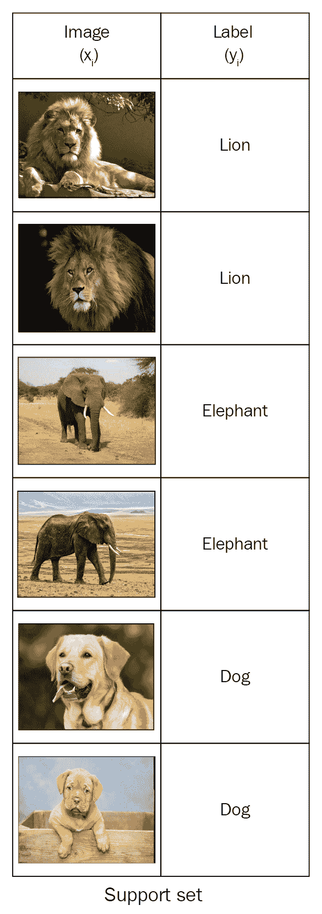

因此，我们分为三类： *{狮子，大象，狗}* 。 现在，我们需要为这三个类中的每一个创建一个原型表示。 我们如何构建这三个类的原型？ 首先，我们将使用嵌入功能来学习每个数据点的嵌入。 嵌入函数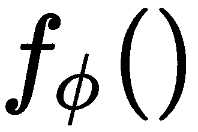可以是可用于提取特征的任何函数。 由于我们的输入是图像，因此我们可以使用卷积网络作为嵌入函数，该函数将从输入图像中提取特征：


一旦了解了每个数据点的嵌入，就可以将每个类中数据点的均值嵌入并形成类原型，如下图所示。 因此，类原型基本上就是在类中数据点的平均嵌入：


同样，当有新的数据点（即我们要为其预测标签的查询点）进入时，我们将使用与创建类原型相同的嵌入函数为该新数据点生成嵌入。 是，我们使用卷积网络为查询点生成嵌入：


对查询点进行嵌入后，我们将比较类原型和查询点嵌入之间的距离，以查找查询点所属的类。 我们可以使用欧几里得距离作为查找类原型与查询点嵌入之间距离的度量，如下所示：

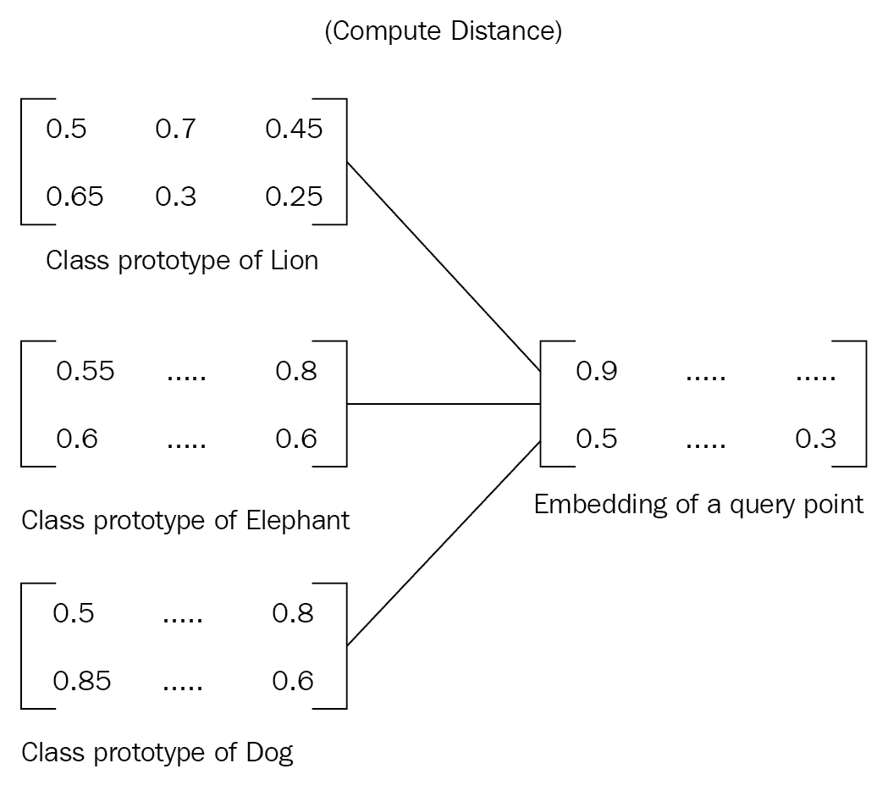

在找到类原型与查询点嵌入之间的距离后，我们将 softmax 应用于该距离并获得概率。 由于我们有狮子，大象和狗这三个类，因此我们将获得三个概率。 因此，概率最高的类别将是我们查询点的类别。

由于我们希望网络从几个数据点中学习，也就是说，我们希望执行几次快照学习，因此我们以相同的方式训练网络。 因此，我们使用了间歇式训练-对于每个情节，我们从数据集中的每个班级随机采样一些数据点，我们称其为支持集，仅使用支持集而不是整个数据集来训练网络。 同样，我们从数据集中随机抽取一个点作为查询点，并尝试预测其类别。 因此，通过这种方式，我们的网络受到了如何从较小的数据点集中学习的培训。

下图显示了我们原型网络的整体流程。 如您所见，首先，我们将为支持集中的所有数据点生成嵌入，并通过在类中获取数据点的平均嵌入来构建类原型。 我们还为查询点生成嵌入。 然后，我们计算类原型与查询点嵌入之间的距离。 我们使用欧几里得距离作为距离度量。 然后，我们将 softmax 应用于此距离并获得概率。 如下图所示，由于我们的查询点是狮子，因此狮子的概率很高，为 0.9：

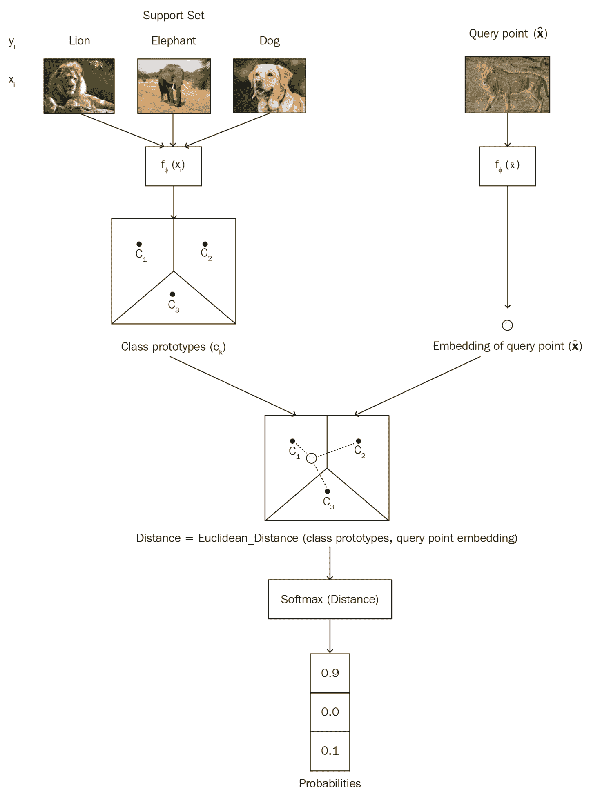

原型网络不仅用于单次/几次射击学习，而且还用于零次学习。 考虑以下情况：每个类没有数据点，但是您具有包含每个类的高级描述的元信息。 因此，在这些情况下，我们从每个类的元信息中学习嵌入，以形成类原型，然后使用该类原型进行分类。

# 算法

原型网络的算法如下所示：

1.  假设我们有数据集 *D* ，其中包含 *{（x <sub>1</sub> y <sub>1</sub> ），（x <sub>2</sub> ， y <sub>2</sub> ），...（x <sub>n</sub> ，y <sub>n</sub> ）}* 其中 *x* 是特征， *y* 是类别标签。
2.  由于我们进行了间歇式训练，因此我们从数据集中 *D* 中随机抽取每个类别的 *n* 个数据点数，并准备了支持集 *S* 。
3.  同样，我们选择 *n* 个数据点，并准备我们的查询集 *Q* 。
4.  我们使用嵌入函数 *f <sub>∅</sub>（）*来学习数据点在支持集中的嵌入。 嵌入功能可以是任何特征提取器，例如，用于图像的卷积网络和用于文本的 LSTM 网络。
5.  一旦获得每个数据点的嵌入，就可以通过获取每个类下数据点的平均嵌入来计算每个类的原型：


6.  同样，我们学习查询集嵌入。
7.  我们计算查询集嵌入和类原型之间的欧几里德距离 *d* 。
8.  我们通过在距离 *d* 上应用 softmax 来预测查询集类别的概率 *p <sub>∅</sub>（y = k | x）*：


9.  我们将损失函数 *J（∅），*计算为负对数概率， *J（∅）= -logp <sub>∅</sub>（y = k | x），*，我们尝试使用随机梯度下降法将损失降到最低。

# 使用原型网络执行分类

现在，我们将看到如何使用原型网络执行分类任务。 我们使用 omniglot 数据集进行分类。 该数据集包含来自 50 个不同字母的 1,623 个手写字符，每个字符都有 20 个不同的示例，这些示例是由不同的人编写的。 由于我们希望我们的网络从数据中学习，因此我们以相同的方式对其进行训练。 我们从每个类中采样五个示例，并将其用作我们的支持集。 我们使用四个卷积块作为编码器来学习支持集的嵌入，并构建类原型。 同样，我们从每个类中为我们的查询集采样五个示例，学习查询集嵌入，并通过比较查询集嵌入和类原型之间的欧式距离来预测查询集类。 让我们逐步了解它会更好地理解这一点。

[您还可以在此处查看 Jupyter Notebook 中可用的代码并进行解释](https://github.com/sudharsan13296/Hands-On-Meta-Learning-With-Python/blob/master/03.%20Prototypical%20Networks%20and%20its%20Variants/3.3%20Omniglot%20Character%20set%20classification%20using%20Prototypical%20Network.ipynb)。

首先，我们导入所有必需的库：

```py
import os
import glob
from PIL import Image
import numpy as np
import tensorflow as tf
```

现在，我们将探索并查看我们从数据中得到的结果。 众所周知，我们有不同字母的不同字符，每个字符有二十种不同的字母，由不同的人书写。 让我们绘制并检查其中的一些。

让我们从日语字母中绘制一个字符：

```py
Image.open('daimg/Japanese_(katakana)/character13/0608_01.png')
```

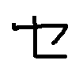

相同字母的不同变化：

```py
Image.open('daimg/Japanese_(katakana)/character13/0608_13.png')
```


让我们看一下梵文字母中的一个字符：

```py
Image.open('daimg/Sanskrit/character13/0863_09.png')
```


```py
Image.open('daimg/Sanskrit/character13/0863_13.png')
```


我们如何将图像转换为数组？ 我们可以使用`np.array`将这些图像转换为数组并将其重塑为 28 x 28：

```py
image_name = 'daimg/Sanskrit/character13/0863_13.png'
alphabet, character, rotation = 'Sanskrit/character13/rot000'.split('/')
rotation = float(rotation[3:])
```

您可以看到如下输出：

```py
array([[1., 1., 1., 1., 1., 1., 1., 1., 1., 1., 1., 1., 1., 1., 1., 1., 1., 1., 1., 1., 1., 1., 1., 1., 1., 1., 1., 1.], [1., 1., 1., 1., 1., 1., 1., 1., 1., 1., 1., 1., 1., 1., 1., 0., 1., 1., 1., 1., 1., 1., 0., 1., 1., 1., 0., 1.], [1., 1., 1., 1., 1., 1., 1., 1., 1., 1., 1., 1., 1., 1., 1., 1., 1., 1., 1., 1., 1., 1., 1., 1., 1., 1., 1., 1.], [1., 1., 1., 1., 1., 1., 1., 1., 1., 1., 1., 1., 1., 1., 1., 1., 1., 1., 1., 1., 1., 1., 1., 1., 1., 1., 1., 1.]],dtype=float32)
```

现在我们已经了解了数据集中的内容，我们将加载数据集：

```py
root_dir = 'data/'
```

我们在`/data/omniglot/splits/train.txt`文件中有拆分的详细信息，该文件中的语言名称，字符号，旋转信息和`/data/omniglot/data/`中的图像是：

```py
train_split_path = os.path.join(root_dir, 'splits', 'train.txt')

with open(train_split_path, 'r') as train_split:
    train_classes = [line.rstrip() for line in train_split.readlines()]
```

我们发现类的数量如下：

```py
#number of classes
no_of_classes = len(train_classes)
```

现在，我们将示例数量设置为 20，因为我们的数据集中每个类有 20 个示例，并将图像的宽度和高度设置为 28 x 28：

```py
#number of examples
num_examples = 20

#image width
img_width = 28

#image height
img_height = 28
channels = 1
```

接下来，我们将训练数据集的形状初始化为多个类，示例数以及图像的高度和宽度：

```py
train_dataset = np.zeros([no_of_classes, num_examples, img_height, img_width], dtype=np.float32)
```

现在，我们读取所有图像，将它们转换为 NumPy 数组，并将它们的标签和值（即`train_dataset = [label, values]`）存储在`train_dataset`数组中：

```py
for label, name in enumerate(train_classes):
    alphabet, character, rotation = name.split('/')
    rotation = float(rotation[3:])
    img_dir = os.path.join(root_dir, 'data', alphabet, character)
    img_files = sorted(glob.glob(os.path.join(img_dir, '*.png')))

    for index, img_file in enumerate(img_files):
        values = 1\. - np.array(Image.open(img_file).rotate(rotation).resize((img_width, img_height)), np.float32, copy=False)
        train_dataset[label, index] = values
```

训练数据的形状如下：

```py
train_dataset.shape

(4112, 20, 28, 28)
```

现在我们已经加载了训练数据，我们需要为它们创建嵌入。 我们使用卷积运算生成嵌入，因为我们的输入值是图像。 因此，我们定义了一个具有 64 个滤波器的卷积块，其中批量标准化和 ReLU 作为激活函数。 接下来，我们执行最大池化操作：

```py
def convolution_block(inputs, out_channels, name='conv'):

    conv = tf.layers.conv2d(inputs, out_channels, kernel_size=3, padding='SAME')
    conv = tf.contrib.layers.batch_norm(conv, updates_collections=None, decay=0.99, scale=True, center=True)
    conv = tf.nn.relu(conv)
    conv = tf.contrib.layers.max_pool2d(conv, 2)

    return conv
```

现在，我们定义嵌入函数，该函数为我们提供了包含四个卷积块的嵌入：

```py
def get_embeddings(support_set, h_dim, z_dim, reuse=False):

        net = convolution_block(support_set, h_dim)
        net = convolution_block(net, h_dim)
        net = convolution_block(net, h_dim) 
        net = convolution_block(net, z_dim) 
        net = tf.contrib.layers.flatten(net)

        return net
```

请记住，我们不会使用整个数据集进行训练； 由于我们使用的是一次性学习，因此我们从每个班级中抽取一些数据点作为支持集，并以情景方式使用支持集训练网络。

现在，我们定义一些重要的变量-我们考虑 50 次五次学习场景：

```py
#number of classes
num_way = 50 

#number of examples per class in a support set
num_shot = 5 

#number of query points for query set
num_query = 5 

#number of examples
num_examples = 20

h_dim = 64
z_dim = 64
```

接下来，我们为支持和查询集初始化占位符：

```py
support_set = tf.placeholder(tf.float32, [None, None, img_height, img_width, channels])
query_set = tf.placeholder(tf.float32, [None, None, img_height, img_width, channels])
```

并且我们分别在`support_set_shape`和`query_set_shape`中存储支持和查询集的形状：

```py
support_set_shape = tf.shape(support_set)
query_set_shape = tf.shape(query_set)
```

我们获得了用于初始化我们的支持和查询集的类数，支持集中的数据点数以及查询集中的数据点数：

```py
num_classes, num_support_points = support_set_shape[0], support_set_shape[1]
num_query_points = query_set_shape[1]
```

接下来，我们为标签定义占位符：

```py
y = tf.placeholder(tf.int64, [None, None])

#convert the label to one hot
y_one_hot = tf.one_hot(y, depth=num_classes)
```

现在，我们使用嵌入功能为支持集生成嵌入：

```py
support_set_embeddings = get_embeddings(tf.reshape(support_set, [num_classes * num_support_points, img_height, img_width, channels]), h_dim, z_dim)
```

我们计算每个类的原型，这是该类支持集嵌入的均值向量：

```py
embedding_dimension = tf.shape(support_set_embeddings)[-1]

class_prototype = tf.reduce_mean(tf.reshape(support_set_embeddings, [num_classes, num_support_points, embedding_dimension]), axis=1)
```

接下来，我们使用相同的嵌入函数来获取查询集的嵌入：

```py
query_set_embeddings = get_embeddings(tf.reshape(query_set, [num_classes * num_query_points, img_height, img_width, channels]), h_dim, z_dim, reuse=True)
```

现在我们有了类原型和查询集嵌入，我们定义了一个距离函数，该距离函数为我们提供了类原型和查询集嵌入之间的距离：

```py
def euclidean_distance(a, b):

    N, D = tf.shape(a)[0], tf.shape(a)[1]
    M = tf.shape(b)[0]
    a = tf.tile(tf.expand_dims(a, axis=1), (1, M, 1))
    b = tf.tile(tf.expand_dims(b, axis=0), (N, 1, 1))
    return tf.reduce_mean(tf.square(a - b), axis=2)
```

我们计算类原型与查询集嵌入之间的距离：

```py
distance = euclidean_distance(class_prototype,query_set_embeddings)
```

接下来，我们将每个类别的概率作为距离的 softmax：

```py
predicted_probability = tf.reshape(tf.nn.log_softmax(-distance), [num_classes, num_query_points, -1])
```

然后，我们计算损失：

```py
loss = -tf.reduce_mean(tf.reshape(tf.reduce_sum(tf.multiply(y_one_hot, predicted_probability), axis=-1), [-1]))
```

我们计算精度如下：

```py
accuracy = tf.reduce_mean(tf.to_float(tf.equal(tf.argmax(predicted_probability, axis=-1), y)))
```

然后，我们使用 Adam 优化器将损失降到最低：

```py
train = tf.train.AdamOptimizer().minimize(loss)
```

现在，我们开始 TensorFlow 会话并训练模型：

```py
sess = tf.InteractiveSession()
init = tf.global_variables_initializer()
sess.run(init)
```

我们定义时代数和情节数：

```py
num_epochs = 20
num_episodes = 100
```

接下来，我们开始进行情景式训练-也就是说，对于每个情节，我们都对数据点进行采样，构建支持和查询集，并训练模型：

```py
for epoch in range(num_epochs):

    for episode in range(num_episodes):

        # select 60 classes
        episodic_classes = np.random.permutation(no_of_classes)[:num_way]

        support = np.zeros([num_way, num_shot, img_height, img_width], dtype=np.float32)

        query = np.zeros([num_way, num_query, img_height, img_width], dtype=np.float32)

        for index, class_ in enumerate(episodic_classes):
            selected = np.random.permutation(num_examples)[:num_shot + num_query]
            support[index] = train_dataset[class_, selected[:num_shot]]

            # 5 querypoints per classs
            query[index] = train_dataset[class_, selected[num_shot:]]

        support = np.expand_dims(support, axis=-1)
        query = np.expand_dims(query, axis=-1)
        labels = np.tile(np.arange(num_way)[:, np.newaxis], (1, num_query)).astype(np.uint8)
        _, loss_, accuracy_ = sess.run([train, loss, accuracy], feed_dict={support_set: support, query_set: query, y:labels})

        if (episode+1) % 20 == 0:
            print('Epoch {} : Episode {} : Loss: {}, Accuracy: {}'.format(epoch+1, episode+1, loss_, accuracy_))
```

# 高斯原型网络

现在，我们将研究一种原型网络的变体，称为高斯原型网络。 我们刚刚学习了原型网络如何学习数据点的嵌入以及如何通过获取每个类的均值嵌入并使用类原型进行分类来构建类原型的。

在高斯原型网络中，连同为数据点生成嵌入，我们在它们周围添加一个以高斯协方差矩阵为特征的置信区域。 拥有置信度区域有助于表征单个数据点的质量，并且在嘈杂且不太均匀的数据中很有用。

因此，在高斯原型网络中，编码器的输出将是嵌入以及协方差矩阵。 除了使用完整的协方差矩阵之外，我们还包括来自协方差矩阵的半径或对角线分量以及嵌入：

*   **半径分量：**如果我们使用协方差矩阵的半径分量，则我们的协方差矩阵的维数将为 1，因为半径只是一个整数。
*   **对角分量**：如果我们使用协方差矩阵的对角分量，则我们的协方差矩阵的维数将与嵌入矩阵的维数相同。

此外，我们使用协方差矩阵的逆矩阵来代替直接使用协方差矩阵。 我们可以使用以下任何一种方法将原始协方差矩阵转换为逆协方差矩阵。 令 *S <sub>原始</sub>* 为协方差矩阵， *S* 为逆协方差矩阵：

*   *S = 1 + Softplus（S <sub>原始</sub>）*
*   *S = 1 + S 型（S <sub>原始</sub>）*
*   *S = 1+ 4 * S 型（S <sub>原始</sub>）*
*   *S =偏移+比例* softplus（S <sub>原始</sub> / div），*，其中*偏移*和*比例*是可训练的参数

因此，编码器，以及为输入生成嵌入，还返回协方差矩阵。 我们使用协方差矩阵的对角线或半径分量。 同样，我们使用逆协方差矩阵代替直接使用协方差矩阵。

但是将协方差矩阵与嵌入一起使用有什么用？ 如前所述，它在数据点周围添加了置信区域，在嘈杂的数据中非常有用。 看下图。 假设我们有两个类，`A`和`B`。 黑点表示数据点的嵌入，黑点周围的圆圈表示协方差矩阵。 大的虚线圆表示一个类的整体协方差矩阵。 中间的星星表示类的原型。 如您所见，在嵌入周围有这个协方差矩阵，这给了我们围绕数据点和类原型的置信度区域：

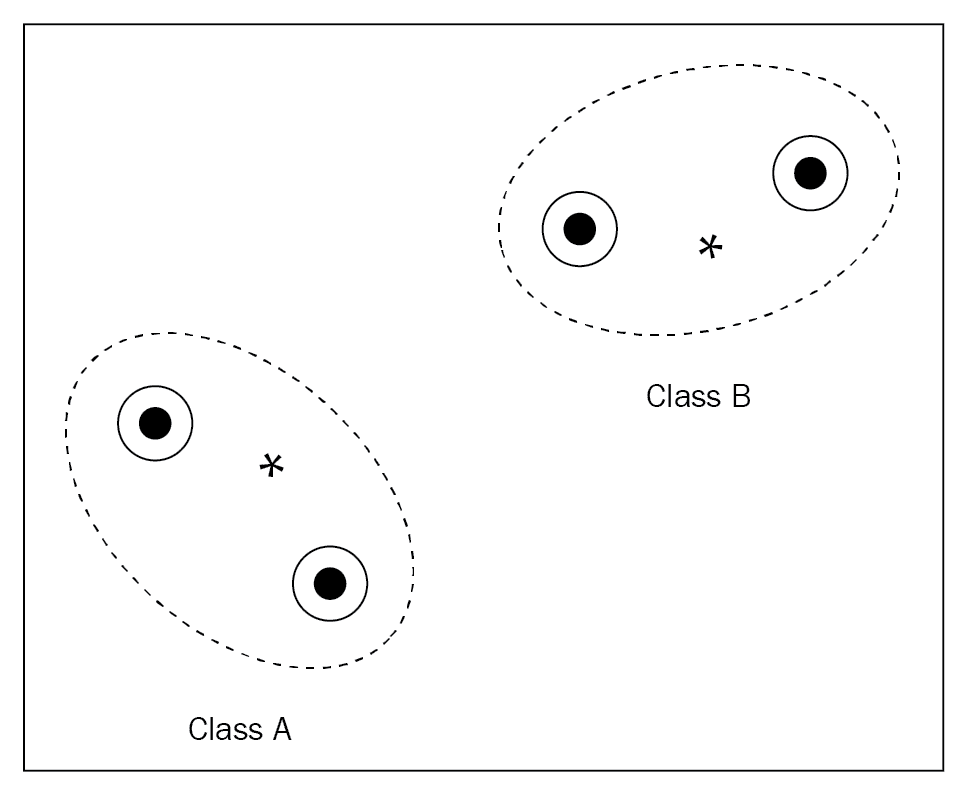

让我们通过查看代码更好地理解这一点。 假设我们有一个图像`X`，我们想为该图像生成嵌入。 让我们用 sigma 表示协方差矩阵。 首先，我们选择要使用协方差矩阵的哪个分量，即我们要使用对角分量还是半径分量。 如果我们使用半径分量，那么我们的协方差矩阵维将仅为 1。 如果我们选择对角线分量，则协方差矩阵的大小将与嵌入维数相同：

```py
if component =='radius':
    covariance_matrix_dim = 1
else:
    covariance_matrix_dim = embedding_dim
```

现在，我们定义编码器。 由于我们的输入是图像，因此我们使用卷积块作为编码器。 因此，我们定义了过滤器的大小，过滤器的数量以及池化层的大小：

```py
filters = [3,3,3,3] 
num_filters = [64,64,64,embedding_dim +covariance_matrix_dim] 
pools = [2,2,2,2]
```

我们将嵌入初始化为我们的图片`X`：

```py
previous_channels = 1 
embeddings = X 
weight = []
bias = []
conv_relu = []
conv = []
conv_pooled = []
```

然后，我们执行卷积运算并获得嵌入：

```py
for i in range(len(filters)):

    filter_size = filters[i]
    num_filter = num_filters[i]
    pool = pools[i]
    weight.append(tf.get_variable("weights_"+str(i), shape=[filter_size, filter_size, previous_channels, num_filter])
    bias.append(tf.get_variable("bias_"+str(i), shape=[num_filter]))
    conv.append(tf.nn.conv2d(embeddings, weight[i], strides=[1,1,1,1], padding='SAME') + bias[i])
    conv_relu.append(tf.nn.relu(conv[i]))
    conv_pooled.append(tf.nn.max_pool(conv_relu[i], ksize = [1,pool,pool,1], strides=[1,pool,pool,1], padding = "VALID"))

    previous_channels = num_filter
    embeddings = conv_pooled [i]
```

我们将最后一个卷积层的输出作为我们的嵌入，并对结果进行整形以具有嵌入以及协方差矩阵：

```py
X_encoded = tf.reshape(embeddings,[-1,embedding_dim + covariance_matrix_dim ])
```

现在，我们将嵌入和原始协方差矩阵拆分，因为我们需要将原始协方差矩阵转换为逆协方差矩阵：

```py
embeddings, raw_covariance_matrix = tf.split(X_encoded, [embedding_dim, covariance_matrix_dim], 1)
```

接下来，我们使用任何讨论的方法来计算协方差矩阵的逆：

```py
if inverse_transform_type == "softplus":
    offset = 1.0
    scale = 1.0
    inv_covariance_matrix = offset + scale * tf.nn.softplus(raw_covariance_matrix)

elif inverse_transform_type == "sigmoid":
    offset = 1.0
    scale = 1.0
    inv_covariance_matrix = offset + scale * tf.sigmoid(raw_covariance_matrix)

elif inverse_transform_type == "sigmoid_2":
    offset = 1.0
    scale = 4.0
    inv_covariance_matrix = offset + scale * tf.sigmoid(raw_covariance_matrix)

elif inverse_transform_type == "other":

    init = tf.constant(1.0)
    scale = tf.get_variable("scale", initializer=init)
    div = tf.get_variable("div", initializer=init)
    offset = tf.get_variable("offset", initializer=init)

    inv_covariance_matrix = offset + scale * tf.nn.softplus(raw_covariance_matrix/div)

```

到目前为止，我们已经看到我们可以计算协方差矩阵以及输入的嵌入。 下一步是什么？ 我们如何计算类原型？ 类原型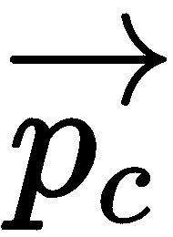可以如下计算：

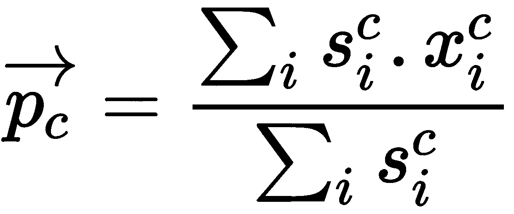

在该方程式中，是逆协方差矩阵的对角线，表示嵌入，上标 *c* 表示类别。

在为每个类计算原型之后，我们学习了查询点的嵌入。 令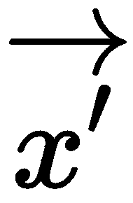为查询点的嵌入。 然后，我们计算查询点嵌入和类原型之间的距离，如下所示：


最后，我们预测查询集的类别（），该类别与类别原型的距离最小：


# 算法

现在，我们将通过逐步了解它来更好地理解高斯原型网络：

1.  假设我们有一个数据集， *D = {（（x <sub>1</sub> ，y <sub>1</sub> ，），（x <sub>2</sub> ，y <sub>2 [ <sub>i</sub> ，y <sub>i</sub> }}</sub>* ，其中 *x* 是特征， *y* 是标签。 假设我们有一个二进制标签，这意味着我们只有两个类， *0* 和 *1* 。 我们将对数据点 *D* 中的每个类进行随机抽样，而不用替换它们，并创建我们的支持集 *S* 。
2.  同样，我们按类随机抽取数据点，然后创建查询集 *Q* 。
3.  我们会将支持集传递给我们的嵌入函数 *f（）*。 嵌入函数将为我们的支持集以及协方差矩阵生成嵌入。
4.  我们计算协方差矩阵的逆。
5.  我们如下计算支持集中每个类的原型：


在该等式中，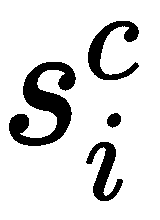是逆协方差矩阵的对角线，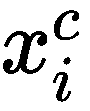表示支持集的嵌入，上标 *c* 表示类别。

6.  在计算支持集中每个类的原型之后，我们学习了查询集 *Q* 的嵌入。 假设 *x'*是查询点的嵌入。
7.  我们计算查询点嵌入与类原型的距离，如下所示：


8.  在计算出类原型与查询集嵌入之间的距离之后，我们将查询集的类预测为具有最小距离的类，如下所示：


# 半原型网络

现在，我们将看到原型网络的另一个有趣的变体，即半原型网络。 它处理未标记的示例。 众所周知，在原型网络中，我们通过获取每个类的均值嵌入来计算每个类的原型，然后通过查找查询点与类原型之间的距离来预测查询集的类。

考虑一下我们的数据集包含一些未标记数据点的情况：我们如何计算这些未标记数据点的类原型？

假设我们有一个支持集，其中 *x* 是要素， *y* 是标签，还有一个查询集。 伴随着这些，我们还有另外一个称为未标记集 *R* 的集合，在这里，我们只有未标记的例子。

那么，我们该如何处理这个未标记的集呢？

首先，我们将使用支持集中给出的所有示例来计算类原型。 接下来，我们使用软 k 均值并为 *R* 中的未标记示例分配类别-也就是说，我们通过计算类原型之间的欧式距离来为 *R 中的未标记示例分配类别 和未标记的示例。*

但是，这种方法的问题在于，由于我们使用的是软 k 均值，因此所有未标记的示例将属于任何类原型。 让我们说，我们的支持集中有三个类别， *{狮子，大象，狗}* ； 如果我们的未标记示例具有代表猫的数据点，则将猫放置在支持集中的任何类别中是没有意义的。 因此，我们没有将数据点添加到现有的类中，而是为未标记的示例分配了一个新类，称为 Distractor 类。

但是即使采用这种方法，我们也会遇到另一个问题，因为干扰项类别本身将具有很大的差异。 例如，考虑我们的未标记集合 *R* 包含完全不相关的数据点，例如 *{猫，直升机，公共汽车和其他}* ； 在这种情况下，建议不要将所有未标记的示例都放在一个称为“干扰项”类的类中，因为它们已经不纯且彼此无关。

因此，我们将分心器类重塑为示例，这些示例不在所有类原型的某个阈值距离之内。 我们如何计算该阈值？ 首先，我们计算所有类原型的未标记集合 *R* 中未标记示例之间的标准化距离。 接下来，我们通过将归一化距离的各种统计数据（例如最小，最大，偏度和峰度）输入神经网络来计算每个类原型的阈值。 基于此阈值，我们向类原型添加或忽略未标记的示例。

# 概要

在本章中，我们从原型网络开始，我们了解了原型网络如何使用嵌入函数计算类原型，并通过比较类原型和查询集嵌入之间的欧几里得距离来预测查询集的类标签。 之后，我们通过对 omniglot 数据集进行分类，对原型网络进行了实验。 然后，我们了解了高斯原型网络，该网络与嵌入一起还使用协方差矩阵来计算类原型。 之后，我们探索了半原型网络，该网络用于处理半监督类。 在下一章中，我们将学习关系和匹配网络。

# 问题

1.  什么是原型网络？
2.  计算嵌入有什么用？
3.  我们如何计算类原型？
4.  什么是高斯原型网络？
5.  高斯原型网络与普通网络有何不同？
6.  高斯原型网络中使用的协方差矩阵的不同成分是什么？

# 进一步阅读

*   [原型网络](https://arxiv.org/pdf/1703.05175.pdf)
*   [高斯原型网络](https://arxiv.org/pdf/1708.02735.pdf)
*   [半原型网络](https://arxiv.org/pdf/1803.00676.pdf)