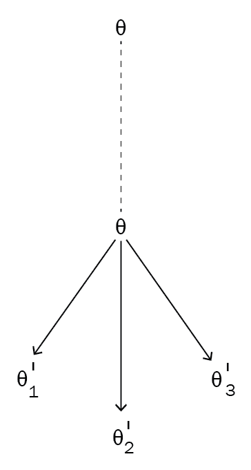
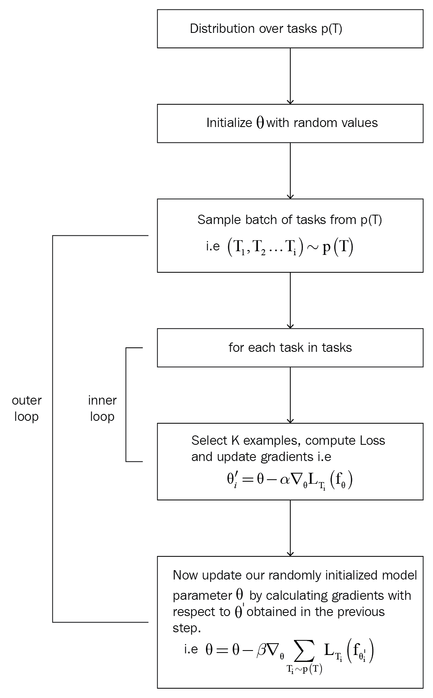
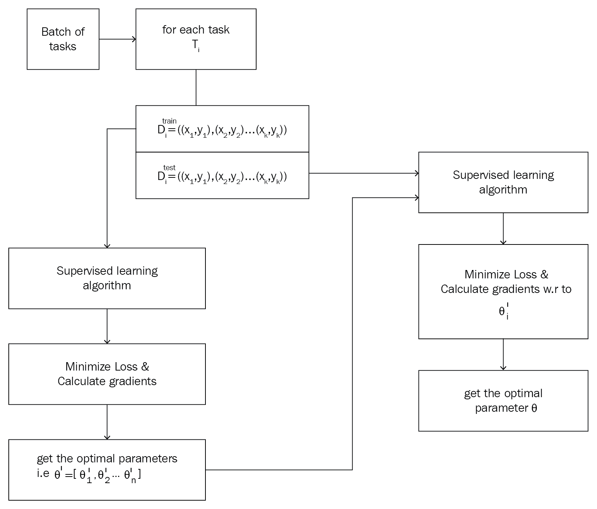

# MAML 及其变体

在上一章中，我们了解了**神经图灵机**（**NTM**）以及它如何存储和从内存中检索信息。 我们还了解了称为记忆增强神经网络的 NTM 变体，该变体广泛用于单次学习中。 在本章中，我们将学习一种有趣的，最流行的元学习算法，称为**模型不可知元学习**（**MAML**）。 我们将了解什么是不可知论元学习模型，以及如何在监督和强化学习设置中使用它。 我们还将学习如何从头开始构建 MAML，然后我们将学习**对抗性元学习**（**ADML**）。 我们将看到如何使用 ADML 查找健壮的模型参数。 接下来，我们将学习如何为分类任务实现 ADML。 最后，我们将学习用于元学习的**上下文适应元学习**（**CAML**）。

在本章中，您将了解以下内容：

*   MAML
*   MAML 算法
*   监督学习和强化学习设置中的 MAML
*   从头开始构建 MAML
*   ADML
*   从头开始构建 ADML
*   反洗钱

# MAML

MAML 是最近推出且使用最广泛的元学习算法之一，它在元学习研究中创造了重大突破。 元学习是元学习的重点，我们知道，在元学习中，我们从仅包含少量数据点的各种相关任务中学习，并且元学习者会产生一个可以很好地概括新的相关任务的快速学习者，即使训练样本数量较少。

MAML 的基本思想是找到一个更好的初始参数，以便具有良好的初始参数，该模型可以以较少的梯度步骤快速学习新任务。

那么，那是什么意思呢？ 假设我们正在使用神经网络执行分类任务。 我们如何训练网络？ 我们将从初始化随机权重开始，并通过最小化损失来训练网络。 如何使损失最小化？ 我们使用梯度下降。 好的，但是我们如何使用梯度下降来使损失最小化呢？ 我们使用梯度下降法来找到最佳的权重，这将使我们损失最小。 我们采取多个梯度步骤来找到最佳权重，以便可以达到收敛。

在 MAML 中，我们尝试通过学习类似任务的分布来找到这些最佳权重。 因此，对于新任务，我们不必从随机初始化的权重开始，而是可以从最佳权重开始，这将花费较少的梯度步骤来达到收敛，并且不需要更多的数据点来进行训练。

让我们简单地了解一下 MAML； 假设我们有三个相关任务： `T1, T2, T3`。 首先，我们随机初始化模型参数`θ`。 我们针对任务`T1`训练我们的网络。 然后，我们尝试通过梯度下降使损失`L`最小化。 通过找到最佳参数`θ'[1]`，我们将损失降至最低。 同样，对于任务`T2`和`T3`，我们将以随机初始化的模型参数`θ`开始，并通过梯度下降找到正确的参数集来最小化损失。 假设`θ'[2]`和`θ'[3]`是任务的最佳参数，分别是`T2`和`T3`。

如下图所示，我们以随机初始化的参数`θ`开始每个任务，并通过为每个任务`T`查找最佳参数`θ'[1]`，`θ'[2]`和`θ'[3]`来使损失最小化。 `T1, T2, T3`分别为：


但是，如果不将`θ`初始化为随机位置（即使用随机值），则如果将`θ`初始化为所有三个任务都通用的位置，则无需采取更多的梯度步骤，也将花费更少的时间。 为了训练。 MAML 试图做到这一点。 MAML 试图找到许多相关任务共有的最佳参数`θ`，因此我们可以用较少的数据点相对较快地训练新任务，而不必执行许多梯度步骤。

如下图所示，我们将`θ`移至所有不同的最佳`θ'`值共有的位置：



因此，对于一个新的相关任务，例如`T4`，我们不必从随机初始化的参数θ开始。 相反，我们可以从最佳θ值开始，这样它将花费更少的梯度步骤来达到收敛。

因此，在 MAML 中，我们尝试找到相关任务共有的最佳θ值，以帮助我们从更少的数据点中学习并最大程度地减少训练时间。 MAML 与模型无关，这意味着我们可以将 MAML 应用于可通过梯度下降训练的任何模型。 但是 MAML 到底如何工作？ 我们如何将模型参数移至最佳位置？ 我们将在下一节中详细探讨。

# MAML 算法

现在，我们对 MAML 有了基本的了解，我们将详细探讨它。 假设我们有一个由`θ`参数化的模型`f`，即`f[θ]()`，我们在任务上有一个分布`p(T)`。 首先，我们用一些随机值初始化参数`θ`。 接下来，我们从任务分布中抽样一些任务`Ti`，即`Ti ~ p(T)`。 假设我们采样了五个任务， `T = {T1, T2, ..., T5}`，然后，对于每个任务`Ti`，我们对`k`数据点进行采样并训练模型。 我们通过计算损耗`L[T[i]](f[θ])`来做到这一点，并使用梯度下降来使损耗最小化，并找到使损耗最小的最佳参数集：


在前面的公式中，适用以下条件：

*   `θ'[i]`是任务`Ti`的最佳参数
*   `θ`是初始参数
*   `α`是超参数
*   `ᐁ[θ]L[T[i]]f(θ)`是任务`Ti`的梯度

因此，在前面的梯度更新之后，我们将为采样的所有五个任务提供最佳参数：


现在，在采样下一批任务之前，我们执行元更新或元优化。 也就是说，在上一步中，我们通过训练每个任务`Ti`找到了最佳参数`θ'[i]`。 现在，我们针对这些最佳参数`θ'[i]`计算梯度，并通过训练一组新任务`Ti`来更新随机初始化的参数`θ`。 这使我们随机初始化的参数θ移至最佳位置，在训练下一批任务时，我们无需采取许多梯度步骤。 此步骤称为元步骤，元更新，元优化或元训练。 可以表示为：


在前面的公式中，适用以下条件：

*   `θ`是我们的初始参数
*   `β`是超参数
*   

    是每个新任务`Ti`相对于参数`θ'[i]`的梯度

如果您仔细看一下以前的元更新方程，我们会注意到我们正在更新模型参数`θ`，方法是仅取每个新任务`Ti`的参数`θ'[i]`最佳梯度平均值。

下图显示了 MAML 的总体算法； 我们的算法由两个循环组成：一个内部循环，我们在其中找到每个任务`Ti`的最佳参数`θ'[i]`，一个外部循环，在其中我们通过计算相对于一组新任务`Ti`中最佳参数`θ'[i]`的梯度来确定`θ`，并更新随机初始化的模型参数：



我们应始终牢记，在更新外循环中的模型参数`θ`时，不应使用找到最佳参数`θ'[i]`的同一组任务`Ti`。

因此，简而言之，在 MAML 中，我们对一批任务进行了采样，对于批量中的每个任务`Ti`，我们使用梯度下降使损失最小化并获得最佳参数`θ'[i]`。 然后，在采样另一批任务之前，我们通过计算一组新任务`Ti`中最佳参数`θ'[i]`的梯度来更新随机初始化的模型参数θ。

# 监督学习中的 MAML

MAML 非常擅长寻找最佳初始参数，对吗？ 现在，我们将看到如何在监督学习设置中使用 MAML。 在继续之前，让我们快速定义损失函数。 损失函数可以是根据我们正在执行的任务的任何函数。

如果执行回归，则可以将损失函数用作均方误差：


如果这是分类任务，那么我们可以使用损失函数，例如交叉熵损失：


现在，让我们一步一步地了解 MAML 如何在监督学习中使用：

1.  假设我们有一个由参数θ参数化的模型`f`，并且在任务`p(T)`上有分布。 首先，我们随机初始化模型参数θ。
2.  我们从任务分布中抽取一些任务`Ti`，即`Ti ~ p(T)`。 假设我们采样了三个任务，然后`T = {T1, T2, T3}`。

3.  **内循环**：对于任务（`T`）中的每个任务（`Ti`），我们对`k`个数据点进行采样，并准备我们的训练和测试数据集：

 

等待！ 什么是训练集和测试集？ 我们使用内循环中的训练集来找到最佳参数`θ'[i]`，并使用外循环中的测试集来寻找最佳参数`θ`。 **测试集并不意味着我们正在检查模型的性能。 它基本上充当外循环中的火车。 我们也可以将测试集称为元训练集。**

现在，我们在`D_train[i]`上应用任何监督学习算法，使用梯度下降法计算损失并最小化损失，并获得最佳参数`θ'[i]`，因此：


因此，对于每个任务，我们对`k`个数据点进行采样，并最小化训练集`D_train[i]`上的损失，并获得最佳参数`θ'[i]`。 当我们采样三个任务时，我们将拥有三个最佳参数`θ'[i]`。

4.  **外循环**：我们在测试集（元训练集）中执行元优化-也就是说，在这里，我们尝试使测试集`D_test[i]`中的损失最小化。 我们通过计算相对于上一步中计算出的最佳参数`θ'[i]`的梯度来最小化损耗，并使用我们的测试集（元训练集）更新随机初始化的参数`θ`：


5.  对于`n`次迭代，我们重复步骤 2 到步骤 5。 下图为您提供了监督学习中的 MAML 概述：



# 从头开始构建 MAML

在上一节中，我们了解了 MAML 的工作原理。 我们看到了 MAML 如何获得更好，更健壮的模型参数θ，该参数可以在各个任务之间推广。 现在，我们将通过从头开始编码来更好地了解 MAML。 为了更好地理解，我们将考虑一个简单的二进制分类任务。 我们随机生成输入数据，并使用简单的单层神经网络对其进行训练，然后尝试找到最佳参数`θ`。 现在，我们将逐步逐步了解如何执行此操作：

[您还可以在此处查看 Jupyter 笔记本中提供的代码，并附带说明](https://github.com/sudharsan13296/Hands-On-Meta-Learning-With-Python/blob/master/06.%20MAML%20and%20it's%20Variants/6.5%20Building%20MAML%20From%20Scratch.ipynb)。

首先，我们导入`numpy`库：

```py
import numpy as np
```

# 生成数据点

现在，我们定义了一个称为`sample_points`的函数，用于生成我们的输入（`x`，`y`）对。 它以`k`参数作为输入，这意味着我们要采样的（`x`，`y`）对的数量：

```py
def sample_points(k):
    x = np.random.rand(k,50)
    y = np.random.choice([0, 1], size=k, p=[.5, .5]).reshape([-1,1])
    return x,y
```

前面的函数返回以下输出：

```py
x, y = sample_points(10)
print x[0]
print y[0]

[0.537339   0.113621   0.62983308 0.3016117  0.91174146 0.95787598
 0.20520229 0.123301   0.64143809 0.68485511 0.29509309 0.65719205
 0.60906626 0.56890899 0.82614517 0.4408421  0.48018921 0.82674918
 0.37076319 0.56239926 0.47655734 0.16489053 0.79742579 0.57731408
 0.62065454 0.70110719 0.61330581 0.84084355 0.7967645  0.84148374
 0.04915798 0.31650656 0.64326928 0.20878387 0.29682973 0.34488916
 0.54626642 0.35608015 0.37950982 0.42281464 0.62984657 0.46538511
 0.84092615 0.38056331 0.21669412 0.44118415 0.65537459 0.2136067
 0.72679706 0.22969462]
[1]
```

# 单层神经网络

为了简单起见和更好地理解，我们使用只有一层的神经网络来预测输出：

```py
a = np.matmul(X, theta)
YHat = sigmoid(a)
```

因此，我们使用 MAML 来找到可在各个任务之间推广的最佳参数值`θ`。 因此，对于一项新任务，我们可以通过采取较少的梯度步骤，在较短的时间内从几个数据点中学习。

# 将 MAML 用于训练

现在，我们定义一个名为`MAML`的类，在其中实现 MAML 算法。 在`__init__`方法中，我们将初始化所有必需的变量。 然后，我们定义我们的`sigmoid`激活函数。 在此之后，我们定义了`train`函数。

我们定义用于实现 MAML 的类：

```py
class MAML(object):
```

我们定义`__init__`方法并初始化所有必需的变量：

```py
def __init__(self):
```

我们初始化许多任务，即每批任务中需要的任务数：

```py
        self.num_tasks = 10
```

以下是每个任务中需要的样本数量（即镜头数量）和数据点数量[`k`）：

```py
        self.num_samples = 10
```

以下是周期数，即训练迭代：

```py
        self.epochs = 1000
```

以下是内部循环（内部梯度更新）的超参数：

```py
        self.alpha = 0.0001
```

以下是外部循环（外部梯度更新）的超参数，即元优化：

```py
        self.beta = 0.0001
```

然后，我们随机初始化模型参数θ：

```py
        self.theta = np.random.normal(size=50).reshape(50, 1)
```

我们定义了`sigmoid`激活函数：

```py
    def sigmoid(self,a):
        return 1.0 / (1 + np.exp(-a))
```

现在，让我们开始培训：

```py
    def train(self):
```

对于时代数：

```py
        for e in range(self.epochs):  

            self.theta_ = []
```

对于批次任务中的任务`i`：

```py
            for i in range(self.num_tasks):
```

对`num_samples`个数据点进行采样，并准备我们的训练集`D_train[i]`：

```py
                XTrain, YTrain = sample_points(self.num_samples)
```

我们通过单层神经网络预测`YHat`的值：

```py
                a = np.matmul(XTrain, self.theta)

                YHat = self.sigmoid(a)
```

由于我们正在执行分类，因此我们将交叉熵损失用作损失函数：

```py
                loss = ((np.matmul(-YTrain.T, np.log(YHat)) - np.matmul((1 -YTrain.T), np.log(1 - YHat)))/self.num_samples)[0][0]
```

我们通过计算梯度将损失降至最低：

```py
                gradient = np.matmul(XTrain.T, (YHat - YTrain)) / self.num_samples
```

我们更新梯度并找到每个任务`Ti`的最佳参数`θ'`，其中：


```py
                self.theta_.append(self.theta - self.alpha*gradient)
```

我们初始化元梯度：

```py
            meta_gradient = np.zeros(self.theta.shape)
```

然后，我们对`k`个数据点进行采样，并准备用于元训练的测试集（元训练集），即`D_test[i]`：

```py
            for i in range(self.num_tasks):

                XTest, YTest = sample_points(10)
```

我们通过单层神经网络预测`YPred`的值：

```py
                a = np.matmul(XTest, self.theta_[i])

                YPred = self.sigmoid(a)
```

我们计算元梯度：

```py
                meta_gradient += np.matmul(XTest.T, (YPred - YTest)) / self.num_samples
```

我们使用元梯度更新随机初始化的模型参数θ：


```py
self.theta = self.theta-self.beta*meta_gradient/self.num_tasks
```

我们每隔 1000 个周期打印一次损失：

```py
            if e%1000==0:
                print "Epoch {}: Loss {}\n".format(e,loss) 
                print 'Updated Model Parameter Theta\n'
                print 'Sampling Next Batch of Tasks \n'
                print '---------------------------------\n'
```

`MAML`类的完整代码如下：

```py
class MAML(object):
    def __init__(self):

        #initialize number of tasks i.e number of tasks we need in each batch of tasks
        self.num_tasks = 10

        #number of samples i.e number of shots -number of data points (k) we need to have in each task
        self.num_samples = 10

        #number of epochs i.e training iterations
        self.epochs = 10000

        #hyperparameter for the inner loop (inner gradient update)
        self.alpha = 0.0001

        #hyperparameter for the outer loop (outer gradient update) i.e meta optimization
        self.beta = 0.0001

        #randomly initialize our model parameter theta
        self.theta = np.random.normal(size=50).reshape(50, 1)

    #define our sigmoid activation function 
    def sigmoid(self,a):
        return 1.0 / (1 + np.exp(-a))

    #now let's get to the interesting part i.e training 
    def train(self):

        #for the number of epochs,
        for e in range(self.epochs): 

            self.theta_ = []

            #for task i in batch of tasks
            for i in range(self.num_tasks):

                #sample k data points and prepare our train set
                XTrain, YTrain = sample_points(self.num_samples)

                a = np.matmul(XTrain, self.theta)

                YHat = self.sigmoid(a)

                #since we are performing classification, we use cross entropy loss as our loss function
                loss = ((np.matmul(-YTrain.T, np.log(YHat)) - np.matmul((1 -YTrain.T), np.log(1 - YHat)))/self.num_samples)[0][0]

                #minimize the loss by calculating gradients
                gradient = np.matmul(XTrain.T, (YHat - YTrain)) / self.num_samples

                #update the gradients and find the optimal parameter theta' for each of tasks
                self.theta_.append(self.theta - self.alpha*gradient)

            #initialize meta gradients
            meta_gradient = np.zeros(self.theta.shape)

            for i in range(self.num_tasks):

                #sample k data points and prepare our test set for meta training
                XTest, YTest = sample_points(10)

                #predict the value of y
                a = np.matmul(XTest, self.theta_[i])

                YPred = self.sigmoid(a)

                #compute meta gradients
                meta_gradient += np.matmul(XTest.T, (YPred - YTest)) / self.num_samples

            #update our randomly initialized model parameter theta with the meta gradients
            self.theta = self.theta-self.beta*meta_gradient/self.num_tasks

            if e%1000==0:
                print "Epoch {}: Loss {}\n".format(e,loss) 
                print 'Updated Model Parameter Theta\n'
                print 'Sampling Next Batch of Tasks \n'
                print '---------------------------------\n'
```

现在，让我们为`MAML`类创建一个实例：

```py
model = MAML()
```

我们开始训练模型：

```py
model.train()
```

我们可以看到如下输出： 我们可以注意到，损失从时期 0 的 2.71 急剧减少到时期 3,000 的 0.5：

```py
Epoch 0: Loss 2.71883405043

Updated Model Parameter Theta

Sampling Next Batch of Tasks 

---------------------------------

Epoch 1000: Loss 1.7829716017

Updated Model Parameter Theta

Sampling Next Batch of Tasks 

---------------------------------

Epoch 2000: Loss 1.29532754055

Updated Model Parameter Theta

Sampling Next Batch of Tasks 

---------------------------------

Epoch 3000: Loss 0.599713728648

Updated Model Parameter Theta

Sampling Next Batch of Tasks 

---------------------------------
```

# MAML 强化学习

如何在**强化学习**（**RL**）设置中应用 MAML？ 在 RL 中，我们的目标是找到正确的策略函数，该功能将告诉我们在每种状态下要执行哪些操作。 但是我们如何在 RL 中应用元学习呢？ 假设我们训练了智能体以解决两臂老虎机问题。 但是，我们不能使用相同的智能体来解决四臂老虎机问题。 我们必须再次从头开始训练智能体，以解决这个新的四臂老虎机问题。 当另一名`n`臂老虎机进来时，情况也是如此。我们一直在从头训练智能体以解决新问题，即使它与智能体已经学会解决的问题密切相关。 因此，代替执行此操作，我们可以应用元学习并在一组相关任务上对智能体进行培训，以便智能体可以利用其先前的知识在最短的时间内学习新的相关任务，而无需从头开始进行培训。

在 RL 中，我们可以将轨迹称为包含一系列观察和动作的元组。 因此，我们在这些轨迹上训练模型以学习最佳策略。 但是，同样，我们应该使用哪种算法来训练我们的模型？ 对于 MAML，我们可以使用可以通过梯度下降训练的任何 RL 算法。 我们使用策略梯度来训练我们的模型。 策略梯度通过直接将带有某些参数`θ`的策略`π`参数化为`π[θ]`来找到最佳策略。 因此，使用 MAML，我们尝试找到可在各个任务之间推广的最佳参数`θ`。

但是我们的损失函数应该是什么？ 在 RL 中，我们的目标是通过最大化正向奖励和最小化负向奖励来找到最优策略，因此我们的损失函数变为最小化负向奖励，它可以表示为：


但是上一个方程式中发生了什么？ `R(x[y, t])`表示时间`t`的状态`x`和动作`a`的奖励，`t = 1`至`H`表示我们的时间步长，其中`H`是地平线-我们的最终时间步长。

假设我们有一个由`θ`参数化的模型`f`，也就是`f[θ]()`和任务的分布`p(T)`。 首先，我们用一些随机值初始化参数`θ`。 接下来，我们从任务分布中抽样一些任务`Ti`： `Ti ~ p(T)`。

然后，对于每个任务，我们对`k`轨迹进行采样，并构建训练和测试集：`D_train[i], D_test[i] ~ T[i]`。 我们的数据集基本上包含诸如观察和动作之类的轨迹信息。 通过执行梯度下降，我们将训练集`D_train[i]`上的损耗降至最低，并找到最佳参数`θ'`：


现在，在采样下一批任务之前，我们执行元更新-也就是说，我们尝试通过计算相对于最佳参数`θ'[i]`的损失梯度来最大程度地减少测试集`D_test[i]`上的损失，并更新随机初始化的参数`θ`：


# 对抗式元学习

我们已经看到了如何使用 MAML 查找可跨任务通用的最佳参数θ。 现在，我们将看到一个称为 ADML 的 MAML 变体，该变体同时使用干净样本和对抗样本来查找更好且更健壮的初始模型参数`θ`。 在继续之前，让我们了解什么是对抗性样本。 通过对抗攻击获得对抗样本。 假设我们有一张图片； 对抗性攻击包括以无法被我们的眼睛察觉的方式稍微修改此图像，并将此修改后的图像称为对抗图像。 当我们将该对抗图像提供给模型时，它无法正确分类。 有几种不同的对抗攻击可用于获取对抗样本。 我们将看到一种常用的方法，称为**快速梯度符号方法**（**FGSM**）。

# FGSM

假设我们正在执行图像分类； 通常，我们通过计算损失并通过相对于模型参数（例如权重）计算损失的梯度并更新模型参数来尝试使损失最小化来训练模型。 为了获得图像的对抗样本，我们计算损失相对于图像输入像素的梯度，而不是模型参数。 因此，图像的对抗样本基本上是相对于图像的损耗梯度。 我们只采取一个梯度步骤，因此它在计算上是有效的。 计算完梯度后，我们取其符号。

对抗图像可以如下计算：


在前面的公式中，适用以下条件：

*   是对抗图片
*   是输入图像
*   是相对于我们输入图像的损耗梯度

如您在下图中所看到的，我们有一个输入图像`x`，并且通过将损失相对于我们的图像的梯度符号添加到实际图像中，我们得到了对抗图像。


# ADML

现在，我们已经了解了什么是对抗性样本以及如何生成对抗性样本，我们将看到如何在元学习中使用这些对抗性样本。 我们使用干净样本和对抗样本训练元学习模型。 但是，需要使用对抗样本训练模型吗？ 它有助于我们找到鲁棒的模型参数`θ`。 干净样本和对抗样本均在算法的内部和外部循环中使用，并且同样有助于更新模型参数。 ADML 使用干净样本和对抗样本之间的这种变化的相关性来获得更好，更健壮的模型参数初始化，从而使我们的参数对对抗样本变得健壮，并且可以很好地推广到新任务。

因此，当我们有任务分布`p(T)`，时，我们从任务分布中采样了一批任务`Ti`，对于每个任务，我们采样`k`个数据点，并准备我们的训练和测试集。

在 ADML 中，我们将训练集和测试集的干净样本和对抗样本采样为`D_train[clean_i]`，`D_train[adv_i]`，`D_test[clean_i]`，`D_test[adv_i]`。

现在，我们在火车上计算损耗，通过梯度下降使损耗最小，并找到最佳参数θ'。 由于我们拥有干净的和对抗的训练集，因此我们对这两个集合都执行梯度下降，并分别为干净的和对抗集找到最佳参数`θ'[i]`和`θ'[adv_i]`：


现在，我们进入元训练阶段，通过计算损失相对于上一步获得的最佳参数θ'的梯度，通过使测试集上的损失最小来找到最佳参数`θ`。

因此，我们通过计算相对于最佳参数`θ'[i]`和`θ'[adv_i]`的损失梯度，通过最小化纯净`D_test[clean_i]`和对抗性`D_test[adv_i]`测试集的损失来更新模型参数`θ`：


# 从头开始构建 ADML

在上一节中，我们了解了 ADML 的工作原理。 我们看到了如何使用干净样本和对抗样本训练我们的模型，以获得更好，更健壮的模型参数`θ`，该参数可在各个任务之间推广。 现在，我们将通过从头开始编码来更好地理解 ADML。 为了更好地理解，我们将考虑一个简单的二进制分类任务。 我们随机生成输入数据，并使用单层神经网络对其进行训练，然后尝试找到最佳参数`theta`。 现在，我们将逐步了解 ADML 的工作原理。

[您还可以在此处查看 Jupyter 笔记本中提供的代码，并附带说明](https://github.com/sudharsan13296/Hands-On-Meta-Learning-With-Python/blob/master/06.%20MAML%20and%20it's%20Variants/6.7%20Building%20ADML%20From%20Scratch.ipynb)。

首先，我们导入所有必需的库：

```py
import tensorflow as tf
import numpy as np
```

# 生成数据点

现在，我们定义了一个称为`sample_points`的函数，用于生成纯净输入（`x`和`y`）对。 它以`k`参数作为输入，这意味着我们要采样许多（`x`，`y`）对：

```py
def sample_points(k):
    x = np.random.rand(k,50)
    y = np.random.choice([0, 1], size=k, p=[.5, .5]).reshape([-1,1])
    return x,y
```

前面的函数返回以下输出：

```py
x, y = sample_points(10)
print x[0]
print y[0]

[0.69922136 0.77305793 0.72227583 0.45291578 0.52828294 0.65308614
 0.77281836 0.59878078 0.71554901 0.51660327 0.65538137 0.25267594
 0.13763862 0.12522582 0.16336571 0.87987815 0.64465771 0.86281232
 0.24503599 0.85324859 0.62247917 0.58166159 0.47871545 0.75025566
 0.87919612 0.49545388 0.31058753 0.66306459 0.34621453 0.56970739
 0.84310111 0.08747573 0.48944231 0.50061581 0.86215915 0.3248433
 0.01350084 0.23846395 0.91015074 0.04968178 0.59098773 0.74692099
 0.92763503 0.16319537 0.69655162 0.20419323 0.58241944 0.15703596
 0.76047838 0.93452557]
[0]
```

# FGSM

现在，我们定义了另一个称为`FGSM`的函数，用于生成对抗性输入。 我们使用 FGSM 生成对抗性样本。 我们已经看到了 FGSM 如何通过计算相对于输入而不是模型参数的梯度来生成对抗对。 因此，我们将干净（`x`，`y`）对作为输入，并生成对抗（`x_adv`，`y`）对：

```py
def FGSM(x,y):

    #placeholder for the inputs x and y
    X = tf.placeholder(tf.float32)
    Y = tf.placeholder(tf.float32)

    #initialize theta with random values
    theta = tf.Variable(tf.zeros([50,1]))

    #predict the value of y
    YHat = tf.nn.softmax(tf.matmul(X, theta)) 

    #calculate the loss
    loss = tf.reduce_mean(-tf.reduce_sum(Y*tf.log(YHat), reduction_indices=1))

    #now calculate gradient of our loss function with respect to our input X instead of model parameter theta
    gradient = ((tf.gradients(loss,X)[0]))

    #calculate the adversarial input
    #i.e x_adv = x + epsilon * sign ( nabla_x J(X, Y))
    X_adv = X + 0.2*tf.sign(gradient)
    X_adv = tf.clip_by_value(X_adv,-1.0,1.0)

    #start the tensoflow session
    with tf.Session() as sess:

        sess.run(tf.global_variables_initializer()) 
        X_adv = sess.run(X_adv, feed_dict={X: x, Y: y})

    return X_adv, y
```

# 单层神经网络

我们使用具有单层的神经网络来预测输出：

```py
a = np.matmul(X, theta)
 YHat = sigmoid(a)
```

因此，我们使用 ADML 查找可在各个任务之间推广的最佳参数值θ。 因此，对于一项新任务，我们可以通过采取较少的梯度步骤，在较短的时间内从几个数据点中学习。

# 对抗式元学习

现在，我们定义一个名为`ADML`的类，在其中实现 ADML 算法。 在`__init__`方法中，我们将初始化所有必需的变量。 然后，我们定义`sigmoid`函数，并定义`train`函数。

我们将逐步介绍此步骤，稍后再看完整的最终代码：

```py
class ADML(object):
```

我们定义`__init__`方法并初始化必要的变量：

```py
    def __init__(self):
```

我们初始化许多任务，即每批任务中需要的任务数：

```py
        self.num_tasks = 2
```

我们初始化每个任务中需要的多个样本（即多个镜头）和多个数据点（`k`）：

```py
        self.num_samples = 10
```

我们初始化多个时期，即训练迭代：

```py
        self.epochs = 100
```

内循环（内部梯度更新）的超参数如下：

```py
        #for clean sample

        self.alpha1 = 0.0001

        #for adversarial sample

        self.alpha2 = 0.0001
```

外循环（外梯度更新）的超参数（是元优化）如下：

```py
        #for clean sample
        self.beta1 = 0.0001

        #for adversarial sample
        self.beta2 = 0.0001
```

我们随机初始化模型参数`theta`：

```py
        self.theta = np.random.normal(size=50).reshape(50, 1)
```

我们定义了`sigmoid`激活函数：

```py
    def sigmoid(self,a):
        return 1.0 / (1 + np.exp(-a))
```

现在，让我们看看如何训练网络：

```py
    def train(self):
```

对于时代数：

```py
        for e in range(self.epochs): 

            #theta' of clean samples
            self.theta_clean = []

            #theta' of adversarial samples
            self.theta_adv = []
```

对于批次任务中的任务`i`：

```py
            for i in range(self.num_tasks):
```

我们对`k`个数据点进行采样，并准备我们的训练数据。 首先，我们采样干净的数据点，即``D_train[clean_i]``：

```py
                XTrain_clean, YTrain_clean = sample_points(self.num_samples)
```

将干净的样品喂入 FGSM 并获得对抗性样品`D_train[adv_i]`：

```py
                XTrain_adv, YTrain_adv = FGSM(XTrain_clean,YTrain_clean)
```

现在，我们计算`θ'[clean_i]`并将其存储在`theta_clean`中。 使用单层网络预测输出：

```py
                a = np.matmul(XTrain_clean, self.theta)

                YHat = self.sigmoid(a)
```

由于我们正在执行分类，因此我们将交叉熵损失用作损失函数：

```py
                loss = ((np.matmul(-YTrain_clean.T, np.log(YHat)) - np.matmul((1 -YTrain_clean.T), np.log(1 - YHat)))/self.num_samples)[0][0]
```

我们通过计算梯度将损失降至最低：

```py
                gradient = np.matmul(XTrain_clean.T, (YHat - YTrain_clean)) / self.num_samples
```

我们更新梯度并找到干净样本的最佳参数`θ'[i]`：


```py
                self.theta_clean.append(self.theta - self.alpha1*gradient)
```

现在，我们计算对抗样本的``θ'[adv_i]``并将其存储在`theta_adv`中：

```py

                #predict the output y 
                a = (np.matmul(XTrain_adv, self.theta))

                YHat = self.sigmoid(a)

                #calculate cross entropy loss
                loss = ((np.matmul(-YTrain_adv.T, np.log(YHat)) - np.matmul((1 -YTrain_adv.T), np.log(1 - YHat)))/self.num_samples)[0][0]

                #minimize the loss by calculating gradients
                gradient = np.matmul(XTrain_adv.T, (YHat - YTrain_adv)) / self.num_samples
```

我们更新梯度并找到对抗样本的最佳参数`θ'[i]`，

：

```py
                self.theta_adv.append(self.theta - self.alpha2*gradient)
```

我们为干净样本和对抗样本初始化元梯度：

```py
            meta_gradient_clean = np.zeros(self.theta.shape)

            #initialize meta gradients for adversarial samples
            meta_gradient_adv = np.zeros(self.theta.shape)
```

对于`i`个任务：

```py
            for i in range(self.num_tasks):
```

我们对`k`个数据点进行了采样，并准备了干净的和对抗的测试集（元训练集）进行元训练-即`D_test[clean_i]`和`D_test[adv_i]`：

```py

                #first, we sample clean data points
                XTest_clean, YTest_clean = sample_points(self.num_samples)

                #feed the clean samples to FGSM and get adversarial samples
                XTest_adv, YTest_adv = sample_points(self.num_samples)

```

首先，我们计算干净样本的元梯度：

```py
               #predict the value of y
                a = np.matmul(XTest_clean, self.theta_clean[i])

                YPred = self.sigmoid(a)

                #compute meta gradients
                meta_gradient_clean += np.matmul(XTest_clean.T, (YPred - YTest_clean)) / self.num_samples
```

现在，我们计算对抗样本的元梯度：

```py
                #predict the value of y
                a = (np.matmul(XTest_adv, self.theta_adv[i]))

                YPred = self.sigmoid(a)

                #compute meta gradients
                meta_gradient_adv += np.matmul(XTest_adv.T, (YPred - YTest_adv)) / self.num_samples
```

我们使用干净样本和对抗样本的元梯度更新随机初始化的模型参数θ：


```py
            self.theta = self.theta-self.beta1*meta_gradient_clean/self.num_tasks

            self.theta = self.theta-self.beta2*meta_gradient_adv/self.num_tasks
```

我们每 10 个周期打印一次损失：

```py
            if e%10==0:
                print "Epoch {}: Loss {}\n".format(e,loss) 
                print 'Updated Model Parameter Theta\n'
                print 'Sampling Next Batch of Tasks \n'
                print '---------------------------------\n'
```

`ADML`类的完整代码如下：

```py
class ADML(object):
    def __init__(self):

        #initialize number of tasks i.e number of tasks we need in each batch of tasks
        self.num_tasks = 2

        #number of samples i.e number of shots -number of data points (k) we need to have in each task
        self.num_samples = 10

        #number of epochs i.e training iterations
        self.epochs = 100

        #hyperparameter for the inner loop (inner gradient update)

        #for clean sample
        self.alpha1 = 0.0001

        #for adversarial sample
        self.alpha2 = 0.0001

        #hyperparameter for the outer loop (outer gradient update) i.e meta optimization

        #for clean sample
        self.beta1 = 0.0001

        #for adversarial sample
        self.beta2 = 0.0001

        #randomly initialize our model parameter theta
        self.theta = np.random.normal(size=50).reshape(50, 1)

    #define our sigmoid activation function 
    def sigmoid(self,a):
        return 1.0 / (1 + np.exp(-a))

    #now let's get to the interesting part i.e training 
    def train(self):

        #for the number of epochs,
        for e in range(self.epochs): 

            #theta' of clean samples
            self.theta_clean = []

            #theta' of adversarial samples
            self.theta_adv = []

            #for task i in batch of tasks
            for i in range(self.num_tasks):

                #sample k data points and prepare our training data

                #first, we sample clean data points
                XTrain_clean, YTrain_clean = sample_points(self.num_samples)

                #feed the clean samples to FGSM and get adversarial samples
                XTrain_adv, YTrain_adv = FGSM(XTrain_clean,YTrain_clean)

                #1\. First, we computer theta' for clean samples and store it in theta_clean

                #predict the output y 
                a = np.matmul(XTrain_clean, self.theta)

                YHat = self.sigmoid(a)

                #since we are performing classification, we use cross entropy loss as our loss function
                loss = ((np.matmul(-YTrain_clean.T, np.log(YHat)) - np.matmul((1 -YTrain_clean.T), np.log(1 - YHat)))/self.num_samples)[0][0]

                #minimize the loss by calculating gradients
                gradient = np.matmul(XTrain_clean.T, (YHat - YTrain_clean)) / self.num_samples

                #update the gradients and find the optimal parameter theta' for clean samples
                self.theta_clean.append(self.theta - self.alpha1*gradient)

                #2\. Now, we compute theta' for adversarial samples and store it in theta_clean

                #predict the output y 
                a = (np.matmul(XTrain_adv, self.theta))

                YHat = self.sigmoid(a)

                #calculate cross entropy loss
                loss = ((np.matmul(-YTrain_adv.T, np.log(YHat)) - np.matmul((1 -YTrain_adv.T), np.log(1 - YHat)))/self.num_samples)[0][0]

                #minimize the loss by calculating gradients
                gradient = np.matmul(XTrain_adv.T, (YHat - YTrain_adv)) / self.num_samples

                #update the gradients and find the optimal parameter theta' for adversarial samples
                self.theta_adv.append(self.theta - self.alpha2*gradient)

            #initialize meta gradients for clean samples
            meta_gradient_clean = np.zeros(self.theta.shape)

            #initialize meta gradients for adversarial samples
            meta_gradient_adv = np.zeros(self.theta.shape)

            for i in range(self.num_tasks):

                #sample k data points and prepare our test set for meta training

                #first, we sample clean data points
                XTest_clean, YTest_clean = sample_points(self.num_samples)

                #feed the clean samples to FGSM and get adversarial samples
                XTest_adv, YTest_adv = sample_points(self.num_samples)

                #1\. First, we computer meta gradients for clean samples 

                #predict the value of y
                a = np.matmul(XTest_clean, self.theta_clean[i])

                YPred = self.sigmoid(a)

                #compute meta gradients
                meta_gradient_clean += np.matmul(XTest_clean.T, (YPred - YTest_clean)) / self.num_samples

                #2\. Now, we compute meta gradients for adversarial samples

                #predict the value of y
                a = (np.matmul(XTest_adv, self.theta_adv[i]))

                YPred = self.sigmoid(a)

                #compute meta gradients
                meta_gradient_adv += np.matmul(XTest_adv.T, (YPred - YTest_adv)) / self.num_samples

            #update our randomly initialized model parameter theta
            #with the meta gradients of both clean and adversarial samples

            self.theta = self.theta-self.beta1*meta_gradient_clean/self.num_tasks

            self.theta = self.theta-self.beta2*meta_gradient_adv/self.num_tasks

            if e%10==0:
                print "Epoch {}: Loss {}\n".format(e,loss) 
                print 'Updated Model Parameter Theta\n'
                print 'Sampling Next Batch of Tasks \n'
                print '---------------------------------\n'
```

我们为`ADML`类创建一个实例：

```py
model = ADML()
```

然后，我们开始训练模型：

```py
model.train()
```

您会注意到损失如何随着时间的推移而减少：

```py
Epoch 0: Loss 100.25943711532

Updated Model Parameter Theta

Sampling Next Batch of Tasks 

---------------------------------

Epoch 10: Loss 2.13533264312

Updated Model Parameter Theta

Sampling Next Batch of Tasks 

---------------------------------

Epoch 20: Loss 0.426824910313

Updated Model Parameter Theta

Sampling Next Batch of Tasks 
```

# CAML

我们已经看到了 MAML 如何找到模型的最佳初始参数，从而可以轻松地以较少的梯度步骤将其适应于新任务。 现在，我们将看到一个有趣的 MAML 变体，称为 CAML。 CAML 的概念非常简单，与 MAML 相同。 它还尝试找到更好的初始参数。 我们了解了 MAML 如何使用两个循环。 在内部循环中，MAML 学习特定于任务的参数，并尝试使用梯度下降来最大程度地减少损失，在外部循环中，它更新模型参数以减少跨多个任务的预期损失，以便我们可以使用更新的模型参数作为相关任务的更好的初始化。

在 CAML 中，我们对 MAML 算法进行了非常小的调整。 在这里，我们不使用单个模型参数，而是将模型参数分成两个部分：

*   **上下文参数**：它是在内部循环上更新的特定于任务的参数。 用 denoted 表示，它特定于每个任务，代表单个任务的嵌入。
*   **共享参数**：跨任务共享，并在外循环中更新以找到最佳模型参数。 用`θ`表示。

因此，上下文参数在内部循环中针对每个任务进行调整，并且共享参数在各个任务之间共享，并用于外部循环中的元训练。 在每个适应步骤之前，我们将上下文参数初始化为零。

好的; 但是在将我们的参数分为两个不同的参数时真正有用的是什么？ 它用于避免针对特定任务的过拟合，促进更快的学习，并且具有高效的内存。

# CAML 算法

现在，让我们逐步了解 CAML 的工作原理：

1.  假设我们有一个由参数θ参数化的模型`f`，并且在任务`p(T)`上有分布。 首先，我们随机初始化模型参数θ。 我们还初始化了上下文参数`∅[0] = 0`。
2.  现在，我们从任务分布中抽样一些任务`Ti`，即`Ti ~ p(T)`。

3.  **内循环**：对于任务（`T`）中的每个任务（`Ti`），我们采样`k`个数据点并准备我们的训练和测试数据集：


现在，我们将上下文参数设置为`0`：


然后，我们计算`D_train[i]`的损失，使用梯度下降法将损失最小化，并学习任务特定参数`∅[i]`：


4.  **外循环**：现在，我们在测试集中执行元优化-也就是说，在这里，我们尝试使测试集中`D_test[i]`中的损失最小化并找到最佳参数：


5.  对`n`次迭代重复步骤 2 到步骤 4。

# 总结

在本章中，我们学习了如何找到可在各个任务之间推广的最佳模型参数`θ`，以便我们可以减少梯度步骤，并快速学习新的相关任务。 我们从 MAML 开始，我们看到了 MAML 如何执行元优化来计算最佳模型参数。 接下来，我们看到了对抗性元学习，其中我们使用了干净样本和对抗性样本来查找可靠的初始模型参数。 后来，我们了解了 CAML，并看到了 CAML 如何使用两个不同的参数，一个用于在任务中学习，另一个用于更新模型参数。

在下一章中，我们将学习元 SGD 和 Reptile 算法，该算法再次用于查找模型的更好的初始参数。

# 问题

1.  什么是 MAML？
2.  为什么 MAML 模型不可知？
3.  什么是对抗性元学习？
4.  什么是 FGSM？
5.  什么是上下文参数？
6.  什么是共享参数？

# 进一步阅读

*   [MAML 论文](https://arxiv.org/pdf/1703.03400.pdf)
*   [对抗性元学习论文](https://arxiv.org/pdf/1806.03316.pdf)
*   [CAML 论文](https://arxiv.org/pdf/1810.03642.pdf)