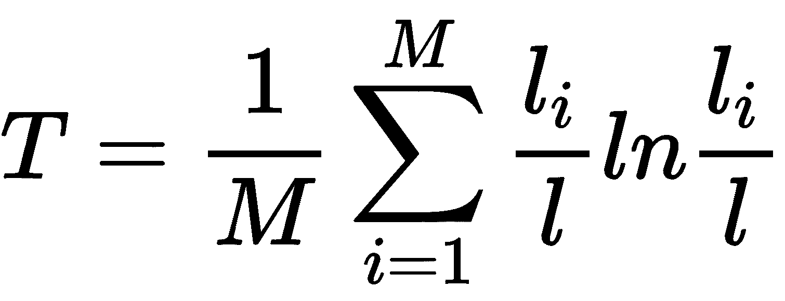
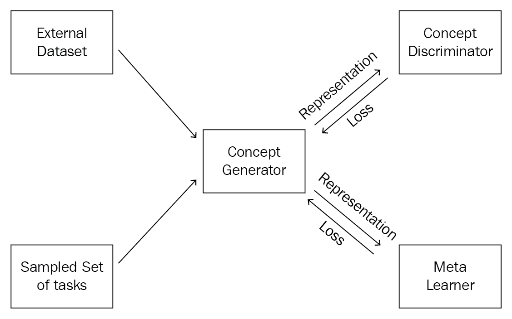

# 最新进展和后续步骤

恭喜你！ 我们已经到了最后一章。 我们已经走了很长一段路。 我们从元学习基础开始，然后看到了几种一次学习算法，例如连体，原型，匹配和关系网络。 后来，我们还看到了 NTM 如何存储和检索信息。 展望未来，我们看到了有趣的元学习算法，例如 MAML，Reptile 和元 SGD。 我们看到了这些算法如何找到最佳的初始参数。 现在，我们将看到元学习的一些最新进展。 我们将学习如何使用与任务无关的元学习来减少元学习中的任务偏差，以及如何在模仿学习系统中使用元学习。 然后，我们将看到如何使用 CACTUs 算法在无监督的学习环境中应用 MAML。 稍后，我们将学习一种称为学习在概念空间中学习的深度元学习算法。

在本章中，您将了解以下内容：

*   与任务无关的元学习（TAML）
*   元模仿学习
*   仙人掌
*   在概念空间学习

# 任务不可知元学习（TAML）

我们知道，在元学习中，我们在相关任务的分布上训练模型，以便只需几个样本就可以轻松地将其适应于新任务。 在前面的章节中，我们已经了解了 MAML 如何通过计算元梯度和执行元优化来找到模型的最佳初始参数。 但是我们可能面临的问题之一是，我们的模型可能会偏向某些任务，尤其是在元训练阶段中采样的任务。 因此，我们的模型在这些任务上将表现不佳。 如果模型这样做，那么还将导致我们发现更好的更新规则的问题。 由于在某些任务上存在偏见模型，我们也将无法对与元训练任务有很大差异的未见任务进行更好的概括。

为了减轻这种情况，我们需要使我们的模型在某些任务上不会偏见或表现不佳。 也就是说，我们需要使我们的模型与任务无关，以便可以防止任务偏差并获得更好的概括性。 现在，我们将看到两种执行 TAML 的算法：

*   熵最大化/减少
*   不平等最小化

# 熵最大化/减少

在本节中，我们将看到如何通过最大化和最小化熵来防止任务偏差。 我们知道熵是对随机性的一种度量。 因此，我们通过允许模型以相等的概率对预测的标签进行随机猜测来最大化熵。 通过对预测标签进行随机猜测，我们可以防止任务偏差。

我们如何计算熵？ 让我们用`H`表示熵。 通过从`p[T[i]](x[i])`中，在其`N`个预测标签的输出概率`y[i, n]`上，抽取`x[i]`来计算`T[i]`的熵：

在先前的等式中，`y_hat[i]`是模型的预测标签。

因此，我们在更新模型参数之前将熵最大化。 接下来，我们在更新模型参数后最小化熵。 那么，最小化熵意味着什么呢？ 使熵最小化意味着我们不对预测标签添加任何随机性，并且允许模型以高置信度预测标签。

因此，我们的目标是最大程度地减少每个任务的熵减少量，其表示如下：

我们将熵项与元目标合并，并尝试找到最佳参数`θ'[i]`，因此我们的元目标变为：

并且`λ`是这两项之间的平衡系数。

# 算法

现在，我们将逐步了解熵 TAML 的工作原理：

1.  假设我们有一个由参数`θ`参数化的模型`f`，并且有一个任务分布`p(T)`。 首先，我们随机初始化模型参数`θ`。
2.  从任务分布（即`T[i] ~ p(T)`）中抽样一批任务。 假设我们然后采样了三个任务：`T = {T[1], T[2], T[3]}`。
3.  **内循环**：对于任务`T`中的每个任务`T[i]`，我们对`k`个数据点进行采样，并准备训练和测试数据集：

然后，我们在训练集`D_train`上计算损失，使用梯度下降将损失最小化，并获得最佳参数：

因此，对于每个任务，我们对`k`个数据点进行采样，准备火车数据集，最大程度地减少损失，并获得最佳参数。 由于我们采样了三个任务，因此我们将拥有三个最佳参数：`θ' = {θ'[1], θ'[2], θ'[3]}`。

4.  **外循环**：我们执行元优化。 在这里，我们尝试将元训练集`D_test[i]`的损失降到最低。 我们通过计算相对于最佳参数`θ'[i]`的梯度来最小化损耗，并更新随机初始化的参数`θ`； 与此同时，我们将添加熵项。 因此，我们最终的元目标变为：

5.  对于`n`次迭代，我们重复步骤 2 至 4。

# 不平等最小化

熵方法的问题在于它仅适用于分类任务。 因此，我们无法将算法应用于回归或强化学习任务。 为了克服这个问题，我们将看到另一种算法，称为不平等最小化 TAML。 就像熵方法一样简单。 在这种方法中，我们试图使不平等最小化。 经济学中使用了几种不平等措施来衡量收入分配，财富分配等。 在元学习环境中，我们可以使用这些经济不平等措施来最小化我们的任务偏差。 因此，可以通过最小化批次中所有采样任务损失的不平等性来最小化模型对任务的偏见。

# 不平等度量

我们将看到一些常用的不平等测度。 我们可以将任务`T[i]`中的损失定义为`l[i]`，将采样任务的平均损失定义为`l_bar`，将单个批次中的任务数定义为`M`。

# 基尼系数

这是最广泛使用的不平等衡量标准之一。 它使用洛伦兹曲线测量分布的不等式。 洛伦兹曲线是一条累积频率曲线，它将特定变量的分布与表示等式的均匀分布进行比较。 基尼系数的值介于 0 到 1 之间，其中 0 表示完全相等，而 1 的值表示不完全。 它基本上是相对绝对均值差的一半。

因此，在我们的元学习设置中，我们可以如下计算基尼系数：

# 泰尔指数

泰尔指数是另一种常用的不平等度量。 它以荷兰计量经济学家 Henri Theil 的名字命名，是不平等度量族的一个特例，称为**广义熵度量**。 可以将其定义为最大熵与观察到的熵之差。

我们为元学习设置计算泰尔指数，如下所示：

# 算法的方差

算法的方差可以定义如下：

在先前的等式中，`g(l)`表示`l`的几何平均值。

我们可以使用任何这些不平等度量来计算任务偏差。 因此，一旦我们使用此不平等度量来计算任务偏差，就可以通过将不平等度量插入元目标中来最小化偏差。 因此，我们可以如下重写元目标：

在前面的等式中，`I(L[T[i]](f[θ'[i]]))`代表我们的不平等测度，`λ`是平衡系数。

# 算法

现在，我们将逐步了解不平等最小化 TAML 的工作原理：

1.  假设我们有一个由参数`θ`参数化的模型!`f`，并且在任务分布`p(T)`上。 首先，我们随机初始化模型参数`θ`。
2.  我们从任务分布（即`T[i] ~ p(T)`）中抽样一批任务。 说，我们已经采样了三个任务，然后是`T = {T[1], T[2], T[3]}`。
3.  **内循环**：对于任务`T`中的每个任务`T[i]`，我们对`k`个数据点进行采样，并准备训练和测试数据集：

然后，我们在训练集`D_train`上计算损失，使用梯度下降使损失最小化，并获得最佳参数：

因此，对于每个任务，我们对`k`个数据点进行采样，准备火车数据集，最大程度地减少损失，并获得最佳参数。 由于我们采样了三个任务，因此我们将拥有三个最佳参数`θ' = {θ'[1], θ'[2], θ'[3]}`。

4.  **外循环**：现在，我们执行元优化。 在这里，我们尝试使训练集`D_test[i]`的损失最小化。 我们通过计算相对于最佳参数`θ'[i]`的梯度来最小化损耗，并更新随机初始化的参数θ； 与此同时，我们将添加熵项。 因此，我们最终的元目标变为：

5.  对于`n`次迭代，我们重复步骤 2 至 4。

# 元模仿学习

如果我们希望我们的机器人更具通用性并执行各种任务，那么我们的机器人应该快速学习。 但是，如何使我们的机器人快速学习呢？ 好吧，我们人类如何快速学习？ 我们不是仅通过看着其他人就轻松地学习新技能吗？ 同样，如果我们仅通过观察动作就能使机器人学习，那么我们就可以轻松地使机器人有效地学习复杂的目标，而不必设计复杂的目标和奖励功能。 这种类型的学习（即从人类行为中学习）称为模仿学习，在这种情况下，机器人会尝试模仿人类行为。 机器人并不需要真正从人类的动作中学到东西。 它还可以从执行任务的其他机器人或执行任务的人/机器人的视频中学习。

但是模仿学习并不像听起来那样简单。 机器人将花费大量时间和演示来学习目标并确定正确的策略。 因此，我们将以演示（训练数据）的先验经验丰富机器人，从而不必完全从头学习每种技能。 增强机器人的先验经验有助于其快速学习。 因此，要学习多种技能，我们需要为每种技能收集演示-也就是说，我们需要为机器人添加特定于任务的演示数据。

但是，如何使我们的机器人从单个演示中快速学习一项任务呢？ 我们可以在这里使用元学习吗？ 我们可以重用演示数据并从几个相关任务中学习以快速学习新任务吗？ 因此，我们将元学习和模仿学习相结合，形成**元模仿学习**（**MIL**）。 借助 MIL，我们可以利用其他各种任务的演示数据，仅需一个演示就可以快速学习新任务。 因此，我们仅需演示一个新任务就可以找到正确的策略。

对于 MIL，我们可以使用我们已经看到的任何元学习算法。 我们将使用 MAML 作为元学习算法，该算法与可以通过梯度下降训练的任何算法兼容，并且将使用策略梯度作为找到正确策略的算法。 在策略梯度中，我们使用某些参数`θ`直接优化参数化策略`π[θ]`。

我们的目标是从单个任务的演示中学习可以快速适应新任务的策略。 这样，我们可以消除对每个任务的大量演示数据的依赖。 实际上，我们在这里的任务是什么？ 我们的任务将包含轨迹。 轨迹`tr`包含来自专家策略的一系列观察和动作，这些经验和活动均是演示。 等待。 什么是专家策略？ 由于我们正在执行模仿学习，因此我们正在向专家（人类行为）学习，因此我们将该策略称为专家策略，并以`π*`表示：

好吧，我们的损失函数应该是什么？ 损失函数表示我们的机器人动作与专家动作有何不同。 对于连续动作，我们可以使用均方误差损失作为我们的损失函数，对于离散动作，我们可以使用交叉熵作为损失函数。 假设我们有连续的行动； 那么我们可以如下表示均方误差损失：

假设我们有任务分布`p(T)`。 我们对一批任务进行采样，对于每个任务`T[i]`，我们对一些演示数据进行采样，通过最小化损失来训练网络，并找到最佳参数`θ'[i]`。 接下来，我们通过计算元梯度执行元优化，并找到最佳初始参数`θ`。 我们将在下一部分中确切地了解它的工作方式。

# MIL 算法

MIL 中涉及的步骤如下：

1.  假设我们有一个由参数`θ`参数化的模型`f`，并且有一个任务分布`p(T)`。 首先，我们随机初始化模型参数`θ`。
2.  从任务分布（即`T ~ p(T)`）中抽样一些任务`T[i]`。
3.  **内循环**：对于采样任务中的每个任务，我们都采样了一个演示数据-即`trajectory = {o1, a1, ..., o[t], a[t]}`。 现在，我们通过执行梯度下降来计算损耗并将损耗降至最低，从而获得了最佳参数`θ'[i]`：

    
    
    然后，我们还为元训练采样了另一个演示数据：`trajectory' = {o'1, a'1, ..., o'[t], a'[t]}`。
4.  **外循环**：现在，我们通过元优化使用`trajectory'`更新我们的初始参数，如下所示：

5.  对`n`次迭代重复步骤 2 到 4。

# CACTUS

我们已经了解了 MAML 如何帮助我们找到最佳的初始模型参数，以便可以将其推广到许多其他相关任务。 我们还了解了 MAML 如何在监督学习和强化学习设置中使用。 但是，我们如何在没有数据点标签的无监督学习环境中应用 MAML？ 因此，我们引入了一种称为 **CACTUS** 的新算法，该算法是`Clustering to Automatically Generate Tasks for Unsupervised Model Agnostic Meta Learning`的缩写。

假设我们有一个数据集`D`，其中包含未标记的示例：`D = {x[1], ..., x[n]}`。 现在，我们可以使用该数据集做什么？ 我们如何在该数据集上应用 MAML？ 首先，使用 MAML 进行培训需要什么？ 我们需要按任务分布，并通过对一批任务进行采样并找到最佳模型参数来训练模型。 任务应包含功能及其标签。 但是，如何从未标记的数据集中生成任务？

在下一部分中，让我们看看如何使用 CACTUS 生成任务。 生成任务后，我们可以轻松地将其插入 MAML 算法并找到最佳模型参数。

# 使用 CACTU 生成任务

假设我们有一个数据集`D`，其中包含没有标签的样本：`D = {x[1], ..., x[n]}`。 现在我们需要为数据集创建标签。 我们该怎么做？ 首先，我们使用一些嵌入函数来学习数据集中每个数据点的嵌入。 嵌入函数可以是任何特征提取器。 假设我们的输入是一幅图像，那么我们可以使用 CNN 作为嵌入函数来提取图像特征向量。

为每个数据点生成嵌入后，我们如何找到它们的标签？ 天真的和简单的方法是将我们的数据集`D`划分为具有某些随机超平面的`p`个分区，然后我们可以将数据集的每个这些分区子集视为一个单独的类。

但是这种方法的问题在于，由于我们使用的是随机超平面，因此我们的类可能包含完全不同的嵌入，并且还将相关的嵌入保留在不同的类中。 因此，我们可以使用聚类算法来代替使用随机超平面对数据集进行分区。 我们使用 k 均值聚类作为我们的聚类算法来划分数据集。 我们对多个迭代运行 k-means 聚类，并获得`k`聚类（分区）。

我们可以将每个群集视为一个单独的类。 下一个是什么？ 我们如何生成任务？ 假设由于集群，我们有五个集群。 我们从这五个群集中采样`n`个群集。 然后，我们从每个`n`簇中抽取`r`数据点，而无需替换； 这可以表示为`{x[r]}_n`。 之后，我们对`n`个单任务特定标签`l[n]`进行了排列，以为`n`个采样聚类的每一个分配标签。 因此，现在我们有一个数据点`{x[r]}_n`和一个标签`l[n]`。

最后，我们可以将任务`T`定义为：

# 概念空间中的元学习

现在，我们将看到如何使用深度元学习在概念空间中元学习。 首先，我们如何进行元学习？ 我们在每个任务中抽样一批相关任务和一些`k`数据点，并训练我们的元学习者。 我们可以将深度学习的力量与元学习结合起来，而不仅仅是使用我们的原始元学习技术进行培训。 因此，当我们对一批任务以及每个任务中的一些`k`数据点进行采样时，我们将使用深度神经网络学习每个`k`数据点的表示形式，然后对这些表示进行元学习。

我们的框架包含三个组件：

*   概念生成器
*   概念鉴别器
*   元学习者

概念生成器的作用是提取数据集中每个数据点的特征表示，捕获其高级概念，概念鉴别器的作用是识别和分类由概念生成器生成的概念，而元学习者学习由概念生成器生成的概念。 先前的所有组件（即概念生成器，概念鉴别器和元学习器）都可以一起学习。 因此，我们通过将元学习与深度学习相集成来改善原始元学习。 我们的概念生成器随着新的传入数据而发展，因此我们可以将我们的框架视为终身学习系统。

但是这里到底发生了什么？ 看下图； 如您所见，我们对一组任务进行采样，并将其提供给概念生成器，该概念生成器将学习概念（即嵌入），然后将这些概念提供给元学习器，后者将学习这些概念并将损失回馈给概念生成器。 同时，我们还将一些外部数据集提供给概念生成器，概念生成器学习这些输入的概念并将这些概念发送给概念识别器。 概念识别器预测这些概念的标签，计算损失，然后将损失发送回概念生成器。 通过这样做，我们增强了概念生成器概括概念的能力：

但是，为什么我们要这样做呢？ 代替在原始数据集上执行元学习，我们在概念空间中执行元学习。 我们如何学习这些概念？ 这些概念由概念生成器通过学习输入的嵌入来生成。 因此，我们在各种相关任务上训练概念生成器和元学习器； 与此相伴的是，我们通过向概念生成器提供外部数据集，从而通过概念鉴别器改进了概念生成器，以便可以更好地学习概念。 通过联合培训过程，我们的概念生成器可以学习各种概念并在相关任务上表现更好； 我们输入外部数据集只是为了增强概念生成器的性能，当我们输入一组新的输入时，它会不断学习。 因此，这是一个终身学习系统。

# 关键组件

现在，让我们详细了解每个组件。

# 概念生成器

众所周知，概念生成器用于提取特征。 我们可以使用由某些参数`θ[G]`参数化的深度神经网络来生成概念。 例如，如果我们的输入是图像，则概念生成器可以是 CNN。

# 概念判别器

它基本上是一个分类器，用于预测概念生成器生成的概念的标签。 因此它可以是由`θ[D]`参数化的任何监督学习算法，例如 SVM 和决策树。

# 元学习者

我们的元学习器可以是`θ[M]`参数化的任何元学习算法，例如 MAML，元 SGD 或 Reptile。

# 损失函数

我们在这里使用两组损失函数：

*   概念判别损失
*   元学习损失

# 概念判别损失

我们从数据集`D`中采样一些数据点`(x, y)`，将它们馈送到概念生成器，该概念生成器学习概念并将其发送给概念鉴别器，后者试图预测这些概念的类。 因此，概念鉴别符的丢失意味着我们的概念鉴别符在预测类别方面有多出色，可以表示为：

根据我们的任务，损失函数可以是任何损失函数。 例如，如果我们执行分类任务，则可能是交叉熵损失。

# 元学习损失

我们从任务分布中抽样一些任务，通过概念生成器学习它们的概念，对这些概念执行元学习，然后计算元学习损失：

我们的元学习损失取决于我们使用的元学习器，例如 MAML 或 Reptile。

我们的最终损失函数是概念歧视和元学习损失这两者的组合：

在前面的等式中，`lambda`是元学习和概念歧视损失之间的超参数平衡。 因此，我们的目标是找到使此损失最小的最佳参数：

我们通过计算梯度来最小化损失并更新模型参数：

# 算法

现在，我们将逐步了解我们的算法：

1.  假设我们有一个任务分布`p(T)`。 首先，我们随机初始化模型参数，例如概念生成器`θ[G]`，元学习器`θ[M]`和概念鉴别器`θ[D]`的参数。
2.  我们从任务分布中抽样一批任务，并通过概念生成器学习它们的概念，对这些概念执行元学习，然后计算元学习损失：

3.  我们从外部数据集`D`中采样一些数据点`(x, y)`，将它们馈送到概念生成器以学习其概念，将这些概念馈送到概念鉴别器中，对它们进行分类，然后计算概念辨别损失：

4.  我们将这两种损耗合并在一起，并尝试使用 SGD 来使损耗最小化，并获取更新的模型参数：

5.  对`n`次迭代重复步骤 2 到 4。

再次恭喜您学习了所有重要且流行的元学习算法。 元学习是 AI 的一个有趣且最有前途的领域，它将使我们更接近**广义人工智能**（**AGI**）。 现在，您已经阅读完本书，可以开始探索元学习的各种进步，并开始尝试各种项目。 学习和元学习！

# 总结

在本章中，我们学习了 TAML 来减少任务偏差。 我们看到了两种类型的方法：基于熵的 TAML 和基于不等式的 TAML。 然后，我们探索了元模仿学习，它将元学习与模仿学习相结合。 我们看到了元学习如何帮助模仿学习从更少的模仿中学习。 我们还看到了如何在使用 CACTUS 的无监督学习环境中应用模型不可知元学习。 然后，我们探索了一种称为学习在概念空间中学习的深度元学习算法。 我们看到了深度学习的力量如何促进元学习。

元学习是 AI 领域中最有趣的分支之一。 既然您已经了解了各种元学习算法，那么您就可以开始构建可在各种任务中推广的元学习模型，并为元学习研究做出贡献。

# 问题

1.  什么是不平等度量的所有不同类型？
2.  什么叫泰尔指数？
3.  什么是模仿学习？
4.  什么是概念生成器？
5.  什么是元学习损失？

# 进一步阅读

*   [与任务无关的元学习](https://arxiv.org/pdf/1805.07722.pdf)
*   [元模仿学习](http://proceedings.mlr.press/v78/finn17a/finn17a.pdf)
*   [CACTUS](https://arxiv.org/pdf/1810.02334.pdf)
*   [概念空间中的元学习](https://arxiv.org/pdf/1802.03596.pdf)