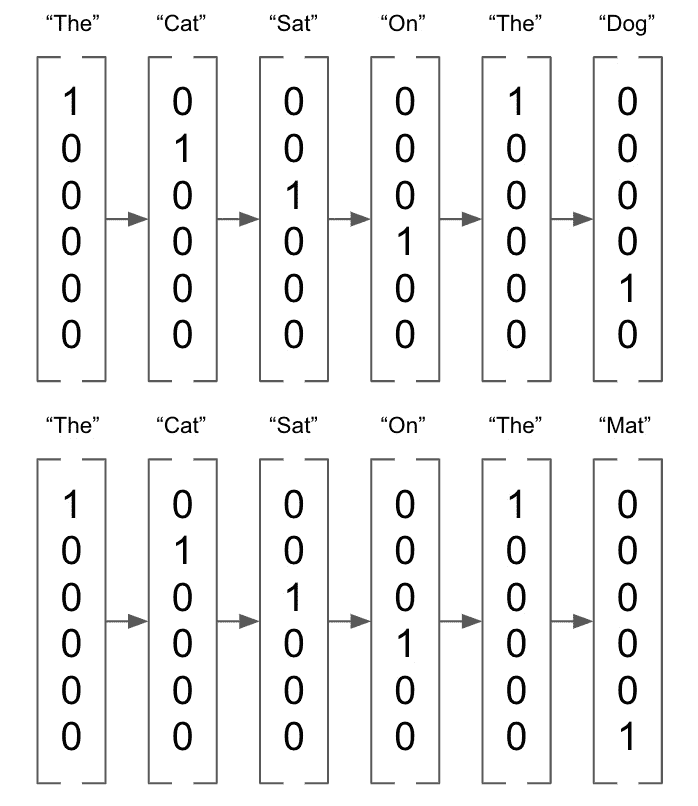
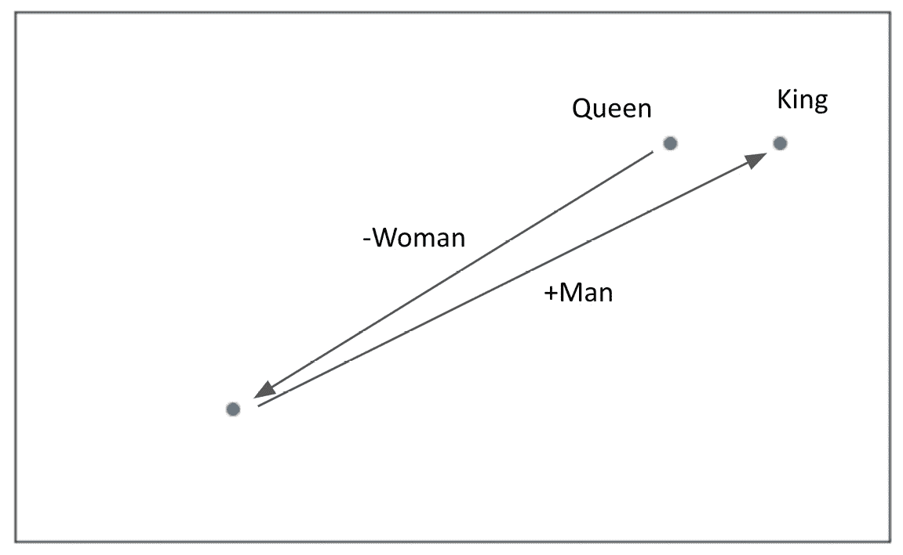
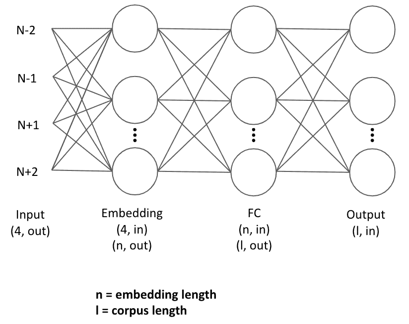
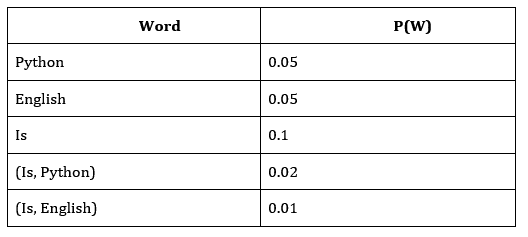
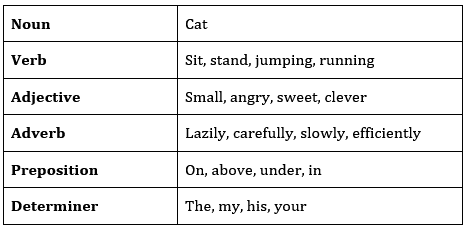
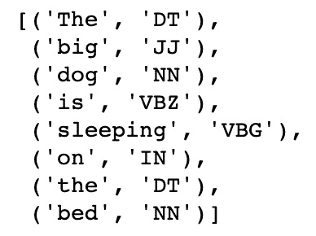

# “第 3 章”：NLP 和文本嵌入

在深度学习中，有许多种表示文本的方式。 虽然我们已经介绍了基本的**词袋**（**BoW**）表示形式，但不足为奇的是，还有一种更为复杂的表示文本数据的方式称为嵌入。 BoW 向量仅充当句子中单词的计数，而嵌入有助于从数字上定义某些单词的实际含义。

在本章中，我们将探讨文本嵌入，并学习如何使用连续 BoW 模型创建嵌入。 然后，我们将继续讨论 n 元语法以及如何在模型中使用它们。 我们还将介绍标记，分块和标记化可用于将 NLP 分成其各个组成部分的各种方式。 最后，我们将研究 TF-IDF 语言模型，以及它们如何对不经常出现的单词加权我们的模型。

本章将涵盖以下主题：

*   词嵌入
*   探索 CBOW
*   探索 n-gram
*   代币化
*   对词性进行标记和分块
*   特遣部队

# 技术要求

可以从[这里](https://nlp.stanford.edu/projects/glove/)下载 GLoVe 向量。 建议使用`Gloves.6B.50d.txt`文件，因为它比其他文件小得多，并且处理起来也快得多。 本章后面的部分将要求 NLTK。 本章的所有代码都可以在[这个页面](https://github.com/PacktPublishing/Hands-On-Natural-Language-Processing-with-PyTorch-1.x)中找到。

# NLP 的嵌入

单词没有表示其含义的自然方式。 在图像中，我们已经具有丰富的向量表示形式（包含图像中每个像素的值），因此显然具有单词的类似丰富的向量表示形式将是有益的。 当语言的部分以高维向量格式表示时，它们称为**嵌入**。 通过分析单词的语料库，并确定哪些单词经常出现在一起，我们可以获得每个单词的`n`长度向量，它可以更好地表示每个单词与所有其他单词的语义关系。 先前我们看到，我们可以轻松地将单词表示为一键编码的向量：



图 3.1 –一键编码向量

另一方面，嵌入是长度为`n`（在以下示例中为`n`= 3）的向量，可以采用任何值：


图 3.2 – n = 3 的向量

这些嵌入表示`n`-维空间中的单词向量（其中`n`是嵌入向量的长度），并且在该空间中具有相似向量的单词被认为更相似。 含义。 尽管这些嵌入可以是任何大小，但它们的尺寸通常比 BoW 表示的尺寸低得多。 BOW 表示需要向量，该向量的长度为整个语料库的长度，当以一种整体语言查看时，它们可能很快变得非常大。 尽管嵌入的维数足够高以表示单个单词，但它们通常不超过几百个维。 此外，BOW 向量通常非常稀疏，主要由零组成，而嵌入则包含大量数据，并且每个维度都有助于单词的整体表示。 较低的维数和它们不稀疏的事实使得对嵌入执行深度学习比对 BOW 表示执行深度学习要有效得多。

## GLoVe

我们可以下载一组预先计算的词嵌入，以演示它们如何工作。 为此，我们将使用**用于词表示的全局向量**（**GLoVe**）嵌入，[可以从此处下载](https://nlp.stanford.edu/projects/glove/)。 这些嵌入是在非常大的 NLP 数据集上计算的，并且在词共现矩阵上训练了。 这是基于这样的概念，即在一起出现的单词更有可能具有相似的含义。 例如，单词`sun`与单词`hot`相对于单词`cold`更有可能出现，因此`sun`和`hot`被认为更相似。

我们可以通过检查单个 GLoVe 向量来验证这是正确的：

1.  我们首先创建一个简单的函数来从文本文件中加载我们的 GLoVe 向量。这只是建立一个字典，其中索引是语料库中的每个词，值是嵌入向量。

    ```py
    def loadGlove(path):
        file = open(path,'r')
        model = {}
        for l in file:
            line = l.split()
            word = line[0]
            value = np.array([float(val) for val in line[1:]])
            model[word] = value
        return model
    glove = loadGlove('glove.6B.50d.txt')
    ```

2.  这意味着我们只需从字典中调用一个向量就可以访问它。

    ```py
    glove['python']
    ```

    这将产生以下输出：

    

    图 3.3 –向量输出

    我们可以看到，这将返回单词 Python 的 50 维向量嵌入。 现在，我们将引入**余弦相似度**的概念，以比较两个向量的相似度。 如果向量之间的`n`维空间中的角度为 0 度，则向量的相似度为 1。 余弦相似度高的值即使不相等也可以被认为是相似的。 可以使用以下公式进行计算，其中 A 和 B 是要比较的两个嵌入向量：

    

3.  我们可以使用 **Sklearn** 中的`cosine_similarity()`函数在 Python 中轻松计算。我们可以看到，**猫**和**狗**有相似的向量，因为它们都是动物。

    ```py
    cosine_similarity(glove['cat'].reshape(1, -1), glove['dog'].reshape(1, -1))
    ```

    结果为以下输出：

    

    图 3.4 –猫和狗的余弦相似度输出

4.  然而，**猫**和**钢琴**是完全不同的，因为它们是两个看似不相关的项目。

    ```py
    cosine_similarity(glove['cat'].reshape(1, -1), glove['piano'].reshape(1, -1))
    ```

    结果为以下输出：


图 3.5 –猫和钢琴的余弦相似度输出

## 嵌入操作

由于嵌入是向量，因此我们可以对它们执行操作。 例如，假设我们将嵌入用于以下类别，然后计算出以下内容：

```py
queen - womam + man
```

这样，我们可以近似嵌入`king`的嵌入。 这基本上用`Man`向量替换了`Queen`的`Woman`向量分量，从而得出了这种近似值。 我们可以通过图形方式对此进行说明，如下所示：



图 3.6 –示例的图形表示

请注意，在此示例中，我们以二维方式对此进行了图形化说明。 就我们的嵌入而言，这是在 50 维空间中发生的。 虽然这并不确切，但我们可以验证我们的计算向量确实类似于`King`的 GLoVe 向量：

```py
predicted_king_embedding = glove['queen'] - glove['woman'] + glove['man']
cosine_similarity(predicted_king_embedding.reshape(1, -1), glove['king'].reshape(1, -1))
```

结果为以下输出：


图 3.7 – GLoVe 向量的输出

尽管 GLoVe 嵌入是非常有用的预先计算的嵌入，但实际上我们可以计算自己的嵌入。 当我们分析特别独特的语料库时，这可能很有用。 例如，Twitter 上使用的语言可能与 Wikipedia 上使用的语言不同，因此在一个语言上训练的嵌入可能对另一个语言没有用。 现在，我们将演示如何使用连续的词袋来计算自己的嵌入。

# 探索 CBOW

**连续词袋（CBOW）**模型构成 Word2Vec 的一部分–由 Google 创建的模型，用于获取单词的向量表示 。 通过在非常大的语料库上运行这些模型，我们能够获得单词的详细表示，这些单词表示它们的语义和上下文相似性。 Word2Vec 模型包含两个主要组件：

*   **CBOW**：给定周围的单词，该模型尝试预测文档中的目标单词。
*   **SkipGram**：这与 CBOW 相反； 该模型尝试在给定目标词的情况下预测周围的词。

由于这些模型执行类似的任务，因此我们现在仅关注一个，特别是 CBOW。 该模型旨在预测单词（**目标单词**），并为其指定其他单词（称为**上下文**单词）。 解决上下文单词的一种方法可能是，就像一样简单，使用句子中目标单词之前的单词来预测目标单词，而更复杂的模型可以在目标单词之前和之后使用多个单词。 考虑以下句子：

```py
PyTorch is a deep learning framework
```

假设我们要根据上下文词来预测单词`deep`：

```py
PyTorch is a {target_word} learning framework
```

我们可以通过多种方式看待这一问题：


图 3.8 –上下文和表示表

对于我们的 CBOW 模型，我们将使用长度为 2 的窗口，这意味着对于模型的`(X, y)`输入/输出对，我们将使用`[n-2, n-1, n+1, n+2, n]`*，其中`n`是我们要预测的目标词。

使用这些作为模型输入，我们将训练一个包含嵌入层的模型。 此嵌入层自动形成我们语料库中单词的`n`维表示。 但是，首先，使用随机权重初始化该层。 这些参数是使用我们的模型学习的，因此，在我们的模型完成训练之后，可以使用此嵌入层来将我们的语料库编码为嵌入式向量表示形式。

## CBOW 架构

现在，我们将设计模型的架构，以学习我们的嵌入。 在这里，我们的模型接受四个单词的输入（目标单词之前两个，之后两个单词），并针对输出（我们的目标单词）训练它。 下面的图示说明了它的外观：



图 3.9 – CBOW 架构

输入的单词首先通过嵌入层，表示为大小（n，l）的张量，其中 n 是嵌入的指定长度，l 是语料库中单词的数量。 这是因为语料库中的每个单词都有其自己独特的张量表示形式。

然后使用来自四个上下文词的组合（求和）嵌入，将其馈入一个全连接层中，以学习针对目标词与上下文词的嵌入表示形式进行最终分类。 请注意，我们的预测词/目标词被编码为向量，即我们的语料库的长度。 这是因为我们的模型可以有效地预测语料库中每个单词成为目标单词的概率，而最终分类是概率最高的一个。 然后，我们得到一个损失，通过我们的网络反向传播，并更新全连接层上的参数以及嵌入本身。

该方法之所以有效，是因为我们学习到的嵌入表示语义相似性。 假设我们在以下方面训练模型：

```py
X = ["is", "a", "learning", "framework"]; y = "deep"
```

我们的模型从本质上要学习的是，目标词的组合嵌入表示在语义上与目标词相似。 如果我们在足够大的单词语料库上重复此操作，我们会发现我们的单词嵌入开始类似于我们以前看到的 GLoVe 嵌入，在语义上相似的单词在嵌入空间中彼此出现。

## 建筑物 CBOW

现在，我们将贯穿，从头开始构建 CBOW 模型，从而说明如何学习嵌入向量：

1.  我们首先定义一些文本，并进行一些基本的文本清理，删除基本的标点符号，并将其全部转换为小写。

    ```py
    text = text.replace(',','').replace('.','').lower().split()
    ```

2.  我们首先定义我们的语料库及其长度。

    ```py
    corpus = set(text)
    corpus_length = len(corpus)
    ```

3.  请注意，我们使用的是集合而不是列表，因为我们只关注文本中的唯一词汇。然后我们建立我们的语料库索引和反语料库索引。我们的语料库索引将允许我们获得给定单词本身的索引，这将在编码单词进入我们的网络时非常有用。我们的反语料库索引允许我们获得一个词，给定的索引值，这将用于将我们的预测转换回单词。

    ```py
    word_dict = {}
    inverse_word_dict = {}
    for i, word in enumerate(corpus):
        word_dict[word] = i
        inverse_word_dict[i] = word
    ```

4.  接下来，我们对我们的数据进行编码。我们在语料库中循环，对于每个目标词，我们捕捉上下文词（前面的两个词和后面的两个词）。我们将此与目标词本身附加到我们的数据集中。请注意，我们如何从语料库中的第三个词开始（索引为`2`），并在语料库结束前两步停止这个过程。这是因为开头的两个词前面不会有两个词，同样，结尾的两个词后面也不会有两个词。

    ```py
    data = []
    for i in range(2, len(text) - 2):
        sentence = [text[i-2], text[i-1],
                    text[i+1], text[i+2]]
        target = text[i]
        data.append((sentence, target))
        
    print(data[3])
    ```

    结果为以下输出：

    

    图 3.10 –编码数据

5.  然后，我们定义我们的嵌入的长度。虽然从技术上讲，这个长度可以是任何你想要的数字，但也要考虑一些权衡。虽然高维嵌入可以导致更详细的单词表示，但特征空间也会变得更稀疏，这意味着高维嵌入只适用于大型语料库。此外，更大的嵌入意味着更多的参数需要学习，所以增加嵌入大小会大大增加训练时间。我们只是在一个很小的数据集上进行训练，所以我们选择使用大小`20`的嵌入。

    ```py
    embedding_length = 20
    ```

    接下来，我们在 PyTorch 中定义 **CBOW** 模型。 我们定义嵌入层，以便它接受语料库长度的向量，并输出单个嵌入。 我们将线性层定义为一个全连接层，该层将嵌入并输出`64`的向量。 我们将最后一层定义为与文本语料库相同长度的分类层。

6.  我们通过获取和求和所有输入语境词的嵌入来定义我们的前向过程，然后通过 ReLU 激活函数的全连接层，最后进入分类层。然后通过 ReLU 激活函数的全连接层，最后进入分类层，分类层预测语料库中哪个词与上下文词的求和嵌入对应最多。

    ```py
    class CBOW(torch.nn.Module):
        def __init__(self, corpus_length, embedding_dim):
            super(CBOW, self).__init__()
            
            self.embeddings = nn.Embedding(corpus_length,                             embedding_dim)
            self.linear1 = nn.Linear(embedding_dim, 64)
            self.linear2 = nn.Linear(64, corpus_length)
            
            self.activation_function1 = nn.ReLU()
            self.activation_function2 = nn.LogSoftmax                                        (dim = -1)
        def forward(self, inputs):
            embeds = sum(self.embeddings(inputs)).view(1,-1)
            out = self.linear1(embeds)
            out = self.activation_function1(out)
            out = self.linear2(out)
            out = self.activation_function2(out)
            return out
    ```

7.  我们还可以定义一个`get_word_embedding()`函数，它可以让我们在训练完我们的模型后提取给定单词的嵌入。

    ```py
    def get_word_emdedding(self, word):
        word = torch.LongTensor([word_dict[word]])
        return self.embeddings(word).view(1,-1)
    ```

8.  现在，我们已经准备好训练我们的模型。我们首先创建一个模型的实例，并定义损失函数和优化器。

    ```py
    model = CBOW(corpus_length, embedding_length)
    loss_function = nn.NLLLoss()
    optimizer = torch.optim.SGD(model.parameters(), lr=0.01)
    ```

9.  然后，我们创建一个辅助函数，将我们的输入语境词，得到每一个语境词的词索引，并将其转换为一个长度为 4 的张量，形成我们神经网络的输入。

    ```py
    def make_sentence_vector(sentence, word_dict):
        idxs = [word_dict[w] for w in sentence]
        return torch.tensor(idxs, dtype=torch.long)
    print(make_sentence_vector(['stormy','nights','when','the'], word_dict))
    ```

    结果为以下输出：

    

    图 3.11 –张量值

10.  现在，我们训练我们的网络。我们循环通过 100 个周期，对于每一个通道，我们循环通过我们所有的上下文词，也就是目标词对。对于这些对，我们使用`make_sentence_vector()`加载上下文句子，并使用我们当前的模型状态来获得预测。我们根据我们的实际目标评估这些预测，以获得我们的损失。我们反推计算梯度，并通过我们的优化器来更新权重。最后，我们将该时代的所有损失相加并打印出来。在这里，我们可以看到，我们的损失正在减少，这表明我们的模型正在学习。

    ```py
    for epoch in range(100):
        epoch_loss = 0
        for sentence, target in data:
            model.zero_grad()
            sentence_vector = make_sentence_vector(sentence, word_dict)  
            log_probs = model(sentence_vector)
            loss = loss_function(log_probs, torch.tensor(
            [word_dict[target]], dtype=torch.long))
            loss.backward()
            optimizer.step()
            epoch_loss += loss.data
        print('Epoch: '+str(epoch)+', Loss: ' + str(epoch_loss.item()))
    ```

    这将产生以下输出：

    

    图 3.12 –训练我们的网络

    现在我们的模型已经训练完毕，我们可以进行预测了。 我们定义了几个函数来允许我们这样做。 `get_predicted_result()`从预测数组中返回预测的单词，而我们的`predicted_sentence()`函数则根据上下文单词进行预测。

11.  我们将我们的句子分割成单个单词，并将它们转化为一个输入向量。然后我们将其输入到模型中，创建我们的预测数组，并使用`get_predicted_result()`函数获得最终的预测词。我们也会打印出预测目标词前后的两个词作为上下文。我们可以运行几个预测来验证我们的模型是否正常工作。

    ```py
    def get_predicted_result(input, inverse_word_dict):
        index = np.argmax(input)
        return inverse_word_dict[index]
    def predict_sentence(sentence):
        sentence_split = sentence.replace('.','').lower().split()
        sentence_vector = make_sentence_vector(sentence_split, word_dict)
        prediction_array = model(sentence_vector).data.numpy()
        print('Preceding Words: {}\n'.format(sentence_split[:2]))
        print('Predicted Word: {}\n'.format(get_predicted_result(prediction_array[0], inverse_word_dict)))
        print('Following Words: {}\n'.format(sentence_split[2:]))
    predict_sentence('to see leap and')
    ```

    结果为以下输出：

    

    图 3.13 –预测值

12.  现在我们已经有了一个训练好的模型，我们能够使用`get_word_embedding()`函数，以便返回我们语料库中任何单词的 20 维单词嵌入。如果我们在另一个 NLP 任务中需要我们的嵌入，我们实际上可以从整个嵌入层中提取权重，并将其用于我们的新模型中。

    ```py
    print(model.get_word_emdedding('leap'))
    ```

    结果为以下输出：


图 3.14 –编辑模型后的张量值

在这里，我们演示了如何训练 CBOW 模型来创建单词嵌入。 实际上，要为语料库创建可靠的嵌入，我们将需要非常大的数据集，才能真正捕获所有单词之间的语义关系。 因此，对于您的模型，最好使用经过预先训练的嵌入，例如 GLoVe，它们已经在非常大的数据集上进行了训练，但是在某些情况下，最好对模型进行训练。 从头开始全新的嵌入集； 例如，当分析与正常 NLP 不同的数据语料库时（例如，Twitter 数据，用户可能会使用简短的缩写而不使用完整的句子）。

# 探索 n-gram

在我们的 CBOW 模型中，我们成功表明单词的含义与周围单词的上下文有关。 影响句子中单词含义的不仅是我们的上下文单词，还影响了这些单词的顺序。 考虑以下句子：

```py
The cat sat on the dog

The dog sat on the cat
```

如果将这两个句子转换成词袋表示法，我们将看到它们是相同的。 但是，通过阅读这些句子，我们知道它们的含义完全不同（实际上，它们是完全相反的！）。 这清楚地表明，句子的含义不仅是其包含的单词，还包括它们出现的顺序。 尝试捕获句子中单词顺序的一种简单方法是使用 n-gram。

如果我们对句子进行计数，而不是对单个单词进行计数，我们现在计算句子中出现的不同的两个单词对，这就是，即使用**二元语法**：


图 3.15 –二元语法的表格表示

我们可以这样表示：

```py
The cat sat on the dog -> [1,1,1,0,1,1]

The dog sat on the cat -> [1,1,0,1,1,1]
```

这些单词对试图捕捉单词在句子中出现的顺序，而不仅仅是它们的出现频率。 我们的第一句话包含两字组`cat sat`，而另一句话包含`dog sat`。 这些二元组显然可以帮助增加句子的上下文，而不仅仅是使用原始单词计数。

我们不仅限于单词。 我们还可以查看称为**三元组**或实际上是个不同数量的单词的不同单词三元组。 我们可以使用 n-gram 作为深度学习模型的输入，而不仅仅是单个单词，但是，当使用 n-gram 模型时，值得注意的是，您的特征空间会很快变得很大，并且可能使机器学习变得非常慢。 如果词典包含英语中的所有单词，则包含所有不同单词对的词典将大几个数量级！

## N-gram 语言建模

n-gram 帮助我们做的一件事是了解自然语言是如何形成的。 如果我们认为一种语言是由较小的单词对（二元图）的一部分而不是单个单词代表的，则可以开始将语言建模为概率模型，其中单词出现在句子中的概率取决于之前出现的单词 它。

在**一元**模型中，我们假设基于单词在语料库或文档中的分布，所有单词都有出现的可能性。 我们来看一个包含一个句子的文档：

```py
My name is my name
```

基于此句子，我们可以生成单词的分布，其中每个单词根据其在文档中的出现频率具有给定的出现概率：


图 3.16 –字母组合的表格表示

然后，我们可以从该分布中随机抽取单词，以生成新的句子：

```py
Name is Name my my
```

但是正如我们所看到的，这句话毫无意义，说明了使用会标模型的问题。 因为每个单词出现的概率与句子中的所有其他单词无关，所以没有考虑单词出现的顺序或上下文。 这是 n-gram 模型有用的地方。

现在，我们将考虑使用**二元**语言模型。 给定出现在单词前面的单词，此计算将考虑单词出现的概率：


这意味着，给定前一个单词，单词出现的概率是单词 n-gram 出现的概率除以前一个单词出现的概率。 假设我们正在尝试预测以下句子中的下一个单词：

```py
My favourite language is ___
```

随之，我们得到以下 n-gram 和单词概率：



图 3.17 –概率的表格表示

有了这个，我们可以计算出出现 Python 的概率，假设前一个单词*为*出现的概率仅为 20%，而*英语*出现的概率仅为 10%。 我们可以进一步扩展此模型，以使用我们认为适当的来表示单词的三元组或任何 n 元组。 我们已经证明，可以使用 n-gram 语言建模将关于单词之间的相互关系的更多信息引入我们的模型，而不必天真地假设单词是独立分布的。

# 分词

接下来，我们将学习 NLP 的分词化，这是一种预处理文本的方式，可以输入到模型中。 标记化将我们的句子分成较小的部分。 这可能涉及将一个句子拆分成单个单词，或者将整个文档分解成单个句子。 这是 NLP 必不可少的预处理步骤，可以在 Python 中相当简单地完成：

1.  我们先接收一个基本的句子，用 NLTK 中的**分词器**把这个句子分割成各个词。

    ```py
    text = 'This is a single sentence.'
    tokens = word_tokenize(text)
    print(tokens)
    ```

    结果为以下输出：

    

    图 3.18 –拆分句子

2.  请注意句号（`.`）是如何被认为是一个符号，因为它是自然语言的一部分。根据我们对文本的处理，我们可能希望保留或放弃标点符号。

    ```py
    no_punctuation = [word.lower() for word in tokens if word.isalpha()]
    print(no_punctuation)
    ```

    打印（无标点符号）

    结果为以下输出：

    

    图 3.19 –删除标点符号

3.  我们还可以使用**句子分词器**将文档标记为单个句子。

    ```py
    text = "This is the first sentence. This is the second sentence. A document contains many sentences."
    print(sent_tokenize(text))
    ```

    结果为以下输出：

    

    图 3.20 –将多个句子拆分为单个句子

4.  另外，我们也可以将两者结合起来，拆成单独的词句。

    ```py
    print([word_tokenize(sentence) for sentence in sent_tokenize(text)])
    ```

    结果为以下输出：

    

    图 3.21 –将多个句子分解为单词

5.  在标记化的过程中，还有一个可选的步骤，那就是去除停顿词。歇后语是非常常见的词，对句子的整体意思没有帮助。这些词包括`a`、`I`和`or`等。我们可以使用下面的代码从 NLTK 中打印出一个完整的列表。

    ```py
    stop_words = stopwords.words('english')
    print(stop_words[:20])
    ```

    结果为以下输出：

    

    图 3.22 –显示停用词

6.  我们可以利用基本的列表理解，轻松地将这些停顿词从我们的单词中删除。

    ```py
    text = 'This is a single sentence.'
    tokens = [token for token in word_tokenize(text) if token not in stop_words]
    print(tokens)
    ```

    结果为以下输出：


图 3.23 –删除停用词

尽管某些 NLP 任务（例如预测句子中的下一个单词）需要停用词，但其他任务（例如判断电影评论的情感）则不需要停用词，因为停用词对文档的整体含义没有多大帮助。 在这种情况下，最好删除停用词，因为这些常用词的出现频率意味着它们可能不必要地增加了我们的特征空间，从而增加了模型训练所需的时间。

# 对词性进行标记和分块

到目前为止，我们已经涵盖了几种表示单词和句子的方法，包括词袋，嵌入和 n-gram。 但是，这些表示无法捕获任何给定句子的结构。 在自然语言中，不同的单词在句子中可以具有不同的功能。 考虑以下：

```py
The big dog is sleeping on the bed
```

我们可以根据句子中每个单词的功能来“标记”此文本的各个单词。 因此，前面的句子变为：

```py
The -> big -> dog -> is -> sleeping -> on -> the -> bed

Determiner -> Adjective -> Noun -> Verb -> Verb -> Preposition -> Determiner-> Noun
```

这些**词性**包括但不限于以下内容：



图 3.24 –词性

这些不同的语音部分可以用来更好地理解句子的结构。 例如，形容词通常在英语名词之前。 我们可以在模型中使用这些词性及其相互之间的关系。 例如，如果我们要预测句子中的下一个单词，并且上下文单词是形容词，则我们知道下一个单词为名词的可能性很高。

## 标记

词性**标记**是将这些词性标签分配给句子中各个单词的动作。 幸运的是，NTLK 具有内置的标记功能，因此我们不需要训练自己的分类器就能做到：

```py
sentence = "The big dog is sleeping on the bed"
token = nltk.word_tokenize(sentence)
nltk.pos_tag(token)
```

结果为以下输出：



图 3.25 –分类词性

在这里，我们简单地标记我们的文本并调用`pos_tag()`函数以标记句子中的每个单词。 这将为句子中的每个单词返回一个标签。 我们可以通过在代码上调用`upenn_tagset()`来解码此标签的含义。 在这种情况下，我们可以看到`VBG`对应于一个动词：

```py
nltk.help.upenn_tagset("VBG")
```

结果为以下输出：


图 3.26 – VBG 的说明

使用经过预先训练的语音标记器的部分是有好处的，因为它们不仅充当字典，可以查找句子中的各个单词。 他们还使用句子中单词的上下文来分配其含义。 考虑以下句子：

```py
He drinks the water

I will buy us some drinks
```

这些句子中的`drinks`代表了两个不同的语音部分。 在的第一句话中，`drinks`是指动词；`drink`动词的现在时。在第二句中，`drinks`是指名词； 单数`drink`的复数形式。 我们的训练有素的标记器能够确定这些单个单词的上下文并执行语音标记的准确部分。

## 分块

分块扩展了语音标记的初始部分，旨在将我们的句子分成小块，其中这些大块中的每一个都代表一小部分语音。

我们可能希望将文本拆分为**实体**，其中每个实体都是单独的对象或事物。 例如，`the red book`不是指三个单独的实体，而是由三个单词描述的单个实体。 我们可以轻松地再次使用 NLTK 实现分块。 我们必须首先定义一个语法模式以使用正则表达式进行匹配。 问题中的模式查找**名词短语**（`NP`），其中名词短语定义为**确定词**（`DT`），然后是**可选形容词**（`JJ`），然后是**名词**（`NN`）：

```py
expression = ('NP: {<DT>?<JJ>*<NN>}')
```

使用`RegexpParser()`函数，我们可以匹配此表达式的出现并将其标记为名词短语。 然后，我们可以打印结果树，显示标记的短语。 在我们的例句中，我们可以看到`dog`和`bed`被标记为两个单独的名词短语。 我们可以根据需要使用正则表达式匹配定义的任何文本块：

```py
tagged = nltk.pos_tag(token)
REchunkParser = nltk.RegexpParser(expression)
tree = REchunkParser.parse(tagged)
print(tree)
```

结果为以下输出：


图 3.27 –树表示

# TF-IDF

**TF-IDF** 是我们可以学习以更好地表示自然语言的另一种技术。 它通常用于文本挖掘和信息检索中，以基于搜索词匹配文档，但也可以与嵌入结合使用，以更好地以嵌入形式表示句子。 让我们用以下短语：

```py
This is a small giraffe
```

假设我们要用一个嵌入来表示这句话的意思。 我们可以做的一件事就是简单地对这句话中五个单词中每个单词的平均嵌入进行平均：


图 3.28 –单词嵌入

但是，此方法为句子中的所有单词分配相等的权重。 您是否认为所有单词都对句子的含义有同等的贡献？ `This`和`a`是英语中非常常见的单词，但是`giraffe`很少见。 因此，我们可能希望为稀有词分配更多权重。 这种方法被称为**术语频率-反向文档频率**（**TD-IDF**）。 现在，我们将演示如何计算文档的 TF-IDF 权重。

## 计算 TF-IDF

顾名思义，TF-IDF 由两个分开的部分组成：术语频率和文档反向频率。 术语频率是一种特定于文档的度量，用于计算要分析的文档中给定单词的频率：


请注意，由于较长的文档更可能包含任何给定的单词，因此我们将该度量除以文档中单词的总数。 如果单词在文档中出现多次，它将获得更高的词频。 但是，这与我们希望对 TF-IDF 进行加权相反，因为我们希望对文档中出现的稀有单词给予更高的加权。 这就是 IDF 发挥作用的地方。

文档频率测量要分析单词的整个文档库中文档的数量，逆文档频率计算总文档与文档频率的比率：


如果我们有一个 100 个文档的语料库，并且单词在它们之间出现 5 次，则文档的倒数频率为 20。这意味着在所有文档中出现次数较少的单词的权重较高。 现在，考虑一个 100,000 个文档的语料库。 如果一个单词仅出现一次，则 IDF 为 100,000，而出现两次的单词的 IDF 为 50,000。 这些非常大且易失的 IDF 对于我们的计算而言并不理想，因此我们必须首先使用日志对其进行归一化。 请注意，如果我们为未出现在语料库中的单词计算 TF-IDF，我们如何在计算中加 1 以防止被 0 除：


这使我们最终的 TF-IDF 方程如下所示：


现在，我们可以演示如何在 Python 中实现此功能并将 TF-IDF 权重应用于我们的嵌入。

## 实施 TF-IDF

在这里，我们将使用 NLTK 数据集中的 Emma 语料对数据集实施 TF-IDF。 该数据集由 Jane Austen 的书《Emma》中的句子组成，我们希望为这些句子中的每一个计算一个嵌入式向量表示：

1.  我们首先导入我们的数据集，并循环处理每一个句子，删除所有标点符号和非字母数字字符（如星号）。我们选择在我们的数据集中留下停顿词，以展示 TF-IDF 如何处理这些词，因为这些词出现在许多文档中，因此具有非常低的 IDF。我们在语料库中创建了一个解析句子的列表和一组不同的词。

    ```py
    emma = nltk.corpus.gutenberg.sents('austen-emma.txt')
    emma_sentences = []
    emma_word_set = []
    for sentence in emma:
        emma_sentences.append([
            word.lower() for word in sentence 
            if word.isalpha()
        ])
        for word in sentence:
            if word.isalpha():
                emma_word_set.append(word.lower())
    emma_word_set = set(emma_word_set)
    ```

2.  接下来，我们创建一个函数，将返回给定文档中某个词的术语频率。我们以文档的长度来给出我们的词数，并计算这个词在文档中的出现次数，然后再返回比率。在这里，我们可以看到`ago`这个词在句子中出现了一次，而这个句子的长度是 41 个字，我们得到的词频是 0.024。

    ```py
    def TermFreq(document, word):
        doc_length = len(document)
        occurances = len([w for w in document if w == word])
        return occurances / doc_length
    TermFreq(emma_sentences[5], 'ago')
    ```

    结果为以下输出：

    

    图 3.29 – TF-IDF 分数

3.  接下来，我们计算我们的文档频率。为了有效地进行计算，我们首先需要预先计算一个文档频率词典。这将循环浏览所有数据，并统计语料库中每个词出现的文档数量。我们预先计算这个，这样我们就不必在每次计算某个词的文档频率时都要执行这个循环。

    ```py
    def build_DF_dict():
        output = {}
        for word in emma_word_set:
            output[word] = 0
            for doc in emma_sentences:
                if word in doc:
                    output[word] += 1
        return output
            
    df_dict = build_DF_dict()
    df_dict['ago']
    ```

4.  在这里，我们可以看到，`ago`这个词在我们的文档中出现了 32 次。使用这个词典，我们可以非常容易地计算出我们的反文档频率，方法是用文档频率除以文档总数，然后取这个值的对数。请注意，当这个词在语料库中没有出现时，我们如何在文档频率上加一，以避免除以零的错误。

    ```py
    def InverseDocumentFrequency(word):
        N = len(emma_sentences)
        try:
            df = df_dict[word] + 1
        except:
            df = 1
        return np.log(N/df)
    InverseDocumentFrequency('ago')
    ```

5.  最后，我们只需将词频和逆文档频率结合起来，就可以得到每个词/文档对的 TF-IDF 权重。

    ```py
    def TFIDF(doc, word):
        tf = TF(doc, word)
        idf = InverseDocumentFrequency(word)
        return tf*idf
    print('ago - ' + str(TFIDF(emma_sentences[5],'ago')))
    print('indistinct - ' + str(TFIDF(emma_sentences[5],'indistinct')))
    ```

    结果为以下输出：


图 3.30 – TF-IDF `ago`和`indistinct`的分数

在这里，我们可以看到，尽管`ago`和`indistinct`的单词在给定文档中仅出现一次，但`indistinct`出现在整个语料库中的频率较低， 表示它获得更高的 TF-IDF 权重。

## 计算 TF-IDF 加权嵌入

接下来，我们可以显示这些 TF-IDF 加权如何应用于嵌入：

1.  我们首先加载我们预先计算的 GLoVe 嵌入，以提供我们语料库中单词的初始嵌入表示。

    ```py
    def loadGlove(path):
        file = open(path,'r')
        model = {}
        for l in file:
            line = l.split()
            word = line[0]
            value = np.array([float(val) for val in line[1:]])
            model[word] = value
        return model
    glove = loadGlove('glove.6B.50d.txt')
    ```

2.  然后，我们计算文档中所有单个嵌入的非加权平均数，以获得句子整体的向量表示。我们简单地循环浏览文档中的所有单词，从 GLoVe 字典中提取嵌入物，然后计算所有这些向量的平均值。

    ```py
    embeddings = []
    for word in emma_sentences[5]:
        embeddings.append(glove[word])
    mean_embedding = np.mean(embeddings, axis = 0).reshape      (1, -1)
    print(mean_embedding)
    ```

    结果为以下输出：

    

    图 3.31 –均值嵌入

3.  我们重复这个过程来计算我们的 TF-IDF 加权文档向量，但这次，我们在求平均之前，先将我们的向量乘以它们的 TF-IDF 加权。

    ```py
    embeddings = []
    for word in emma_sentences[5]:
        tfidf = TFIDF(emma_sentences[5], word)
        embeddings.append(glove[word]* tfidf)
        
    tfidf_weighted_embedding = np.mean(embeddings, axis =                               0).reshape(1, -1)
    print(tfidf_weighted_embedding)
    ```

    结果为以下输出：

    

    图 3.32 – TF-IDF 嵌入

4.  然后，我们可以将 TF-IDF 加权嵌入与我们的平均嵌入进行比较，看看它们的相似度。我们可以使用余弦相似度来实现，如下。

    ```py
    cosine_similarity(mean_embedding, tfidf_weighted_embedding)
    ```

    结果为以下输出：


图 3.33 – TF-IDF 和平均嵌入之间的余弦相似度

在这里，我们可以看到我们的两种不同表示形式非常相似。 因此，虽然使用 TF-IDF 可能不会显着改变我们对给定句子或文档的表示，但可能会偏重于感兴趣的单词，从而提供更有用的表示。

# 摘要

在本章中，我们更深入地研究了词嵌入及其应用。 我们已经展示了如何使用连续词袋模型来训练它们，以及如何结合 n-gram 语言模型来更好地理解句子中词之间的关系。 然后，我们研究了将文档拆分为单独的令牌以进行轻松处理的方法，以及如何使用标记和分块来识别语音部分。 最后，我们展示了如何使用 TF-IDF 权重更好地以嵌入形式表示文档。

在下一章中，我们将看到如何使用 NLP 进行文本预处理，词干提取和词义化。