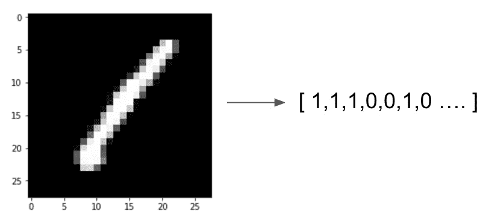
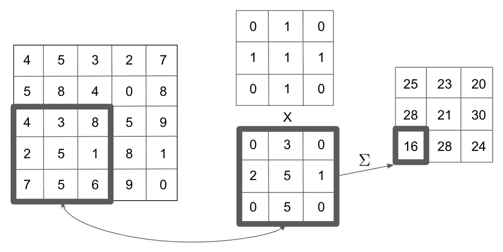
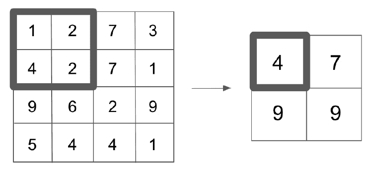
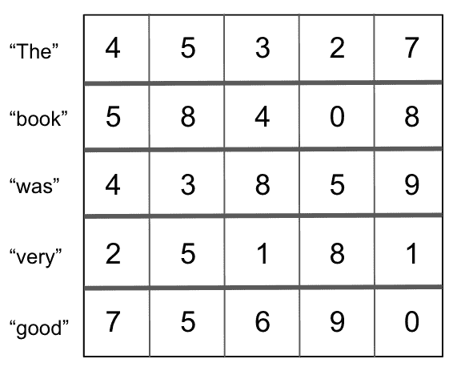
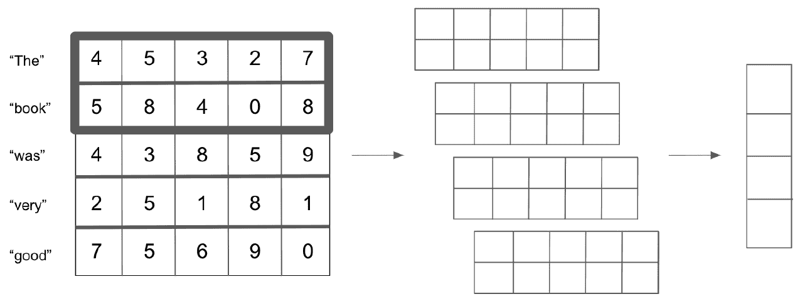
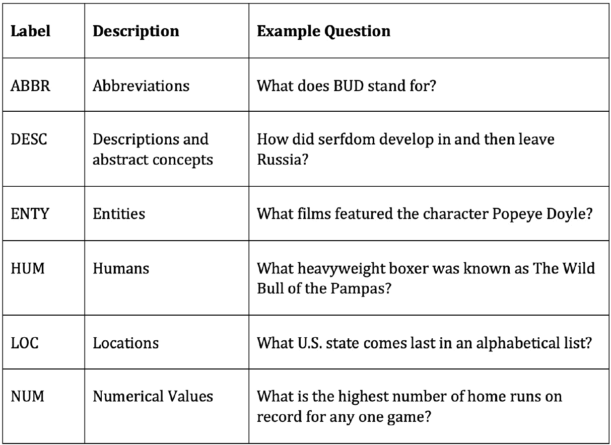
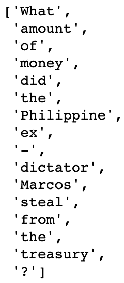
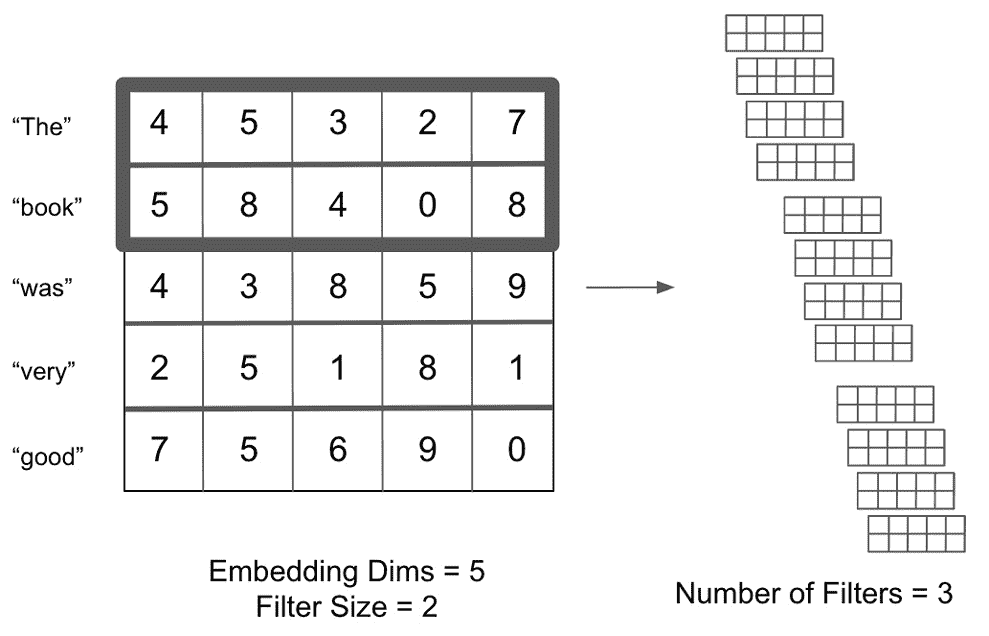
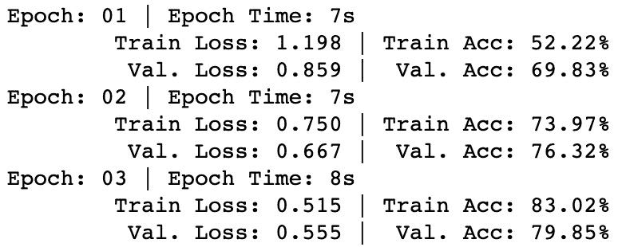

# “第 6 章”：用于文本分类的卷积神经网络

在上一章中，我们展示了如何使用 RNN 为文本提供情感分类。 但是，RNN 并不是唯一可用于 NLP 分类任务的神经网络架构。 **卷积神经网络**（**CNN**）是另一种这样的架构。

RNN 依赖顺序建模，保持隐藏状态，然后逐个单词顺序地遍历文本，并在每次迭代时更新状态。 CNN 不依赖于语言的顺序元素，而是尝试通过分别感知句子中的每个单词并了解其与句子中周围单词的关系来从文本中学习。

尽管出于此处提到的原因，CNN 更常用于对图像进行分类，但事实表明，它们也可以有效地对文本进行分类。 尽管我们确实将文本视为一个序列，但我们也知道句子中各个单词的含义取决于它们的上下文和它们旁边出现的单词。 尽管 CNN 和 RNN 以不同的方式从文本中学习，但是它们都显示出对文本分类有效的方法，并且在任何给定情况下使用哪种依赖于任务的性质。

在本章中，我们将探讨 CNN 背后的基本理论，并从头开始构建一个 CNN，该 CNN 将用于对文本进行分类。 我们将涵盖以下主题：

*   探索 CNN
*   构建用于文本分类的 CNN

让我们开始吧！

# 技术要求

本章的所有代码都可以在[这个页面](https://github.com/PacktPublishing/Hands-On-Natural-Language-Processing-with-PyTorch-1.x)中找到。

# 探索 CNN

CNN 的基础来自计算机视觉领域，但可以从概念上扩展到 NLP。 人脑处理和理解图像的方式不是以像素为单位，而是作为图像的整体图以及图像的每个部分与其他部分的关系。

CNN 的一个很好的类比是人的思维如何处理图片而不是句子。 考虑句子`This is a sentence about a cat.`。 当您阅读该句子时，您将阅读第一个单词，然后阅读第二个单词，依此类推。 现在，考虑一张猫的照片。 通过先看第一个像素，再看第二个像素，吸收图片中的信息是愚蠢的。 取而代之的是，当我们看着某物时，我们会立即感知到整个图像，而不是一个序列。

例如，如果我们对图像进行黑白表示（在本例中为数字 1），则可以看到可以将其转换为向量表示，其中每个像素的颜色由 0 或 a 表示 1：

图 6.1 –图像的向量表示

但是，如果我们从机器学习的角度考虑这一问题并将此向量视为模型的特征，那么单个像素为黑色或白色的事实是否会使图像具有给定位数的可能性更大或更小？ 右上角的白色像素会使图片更可能是四或七吗？ 想象一下，如果我们试图检测更复杂的事物，例如图片是狗还是猫。 屏幕中间的棕色像素会使照片更有可能是猫还是狗？ 直观地，我们看到，在图像分类方面，单个像素值没有多大意义。 但是，我们感兴趣的是像素彼此之间的关系。

在数字表示的情况下，我们知道一条长垂直线很可能是一条，而其中带有闭环的任何照片都更有可能是零，六，八或九。 通过识别并从图像中的图案中学习，而不仅仅是查看单个像素，我们可以更好地理解和识别这些图像。 这正是 CNN 旨在实现的目标。

## 卷积

CNN 背后的基本概念是卷积。 **卷积**本质上是一个滑动窗口函数，已应用于矩阵以从周围像素捕获信息。 在下图中，我们可以看到一个实际的卷积示例：

图 6.2 –实际的卷积

左侧是正在处理的图像，而顶部则是希望应用的卷积核。 对于图像中的每个 3x3 块，我们将其乘以内核，以在底部处获得卷积矩阵。 然后，我们对卷积矩阵求和（或取平均值），以获得初始图像中该 3x3 块的单个输出值。 请注意，在我们的 5x5 初始图像中，我们可以覆盖 9 个可能的 3x3 块。 当我们对初始图像中的每个 3x3 块应用此卷积过程时，剩下的最终处理卷积为 3x3。

在大图像中（对于 NLP，则为复杂的句子），我们还需要实现池化层。 在我们前面的示例中，将 3x3 卷积应用于 5x5 图像会产生 3x3 输出。 但是，如果将 3x3 卷积应用于 100x100 像素的图像，则只会将输出降低到 98x98。 这还不足以降低图像的尺寸，不足以有效地执行深度学习（因为我们必须在每个卷积层学习 98x98 参数）。 因此，我们应用池化层以进一步减小该层的尺寸。

池化层将函数（通常为 max 函数）应用于卷积层的输出，以减小其维数。 此功能应用于滑动窗口，类似于执行卷积的，但现在卷积不再重叠。 假设卷积层的输出为 4x4，并且对输出应用 2x2 的最大缓冲功能。 这意味着对于我们层中每个较小的 2x2 网格，我们将应用最大函数并保留结果输出。 我们可以在下图中看到这一点：

图 6.3 –池化层

这些池化层已被证明可以有效降低数据的维数，同时仍保留卷积层中的许多基本信息。

卷积和池化层的这种结合本质上是 CNN 从图像中学习的方式。 我们可以看到，通过应用许多这些卷积过程（也称为**卷积层**），我们能够捕获有关任何给定像素与其相邻像素的关系的信息。 在 CNN 中，我们旨在学习的参数是卷积内核本身的值。 这意味着我们的模型可以有效地学习如何对图像进行卷积，以便能够提取进行分类所需的必要信息。

在这种情况下，使用卷积有两个主要的优势。 首先，我们能够将一系列低级功能组合成高级功能； 也就是说，我们初始图像上的 3x3 色块是组成的单个值。 这实际上是减少特征的一种形式，仅允许我们从图像中提取相关信息。 使用卷积的另一个优点是它使我们的模型位置不变。 在我们的数字检测器示例中，我们不在乎数字是否出现在图像的右侧或左侧； 我们只是希望能够检测到它。 由于我们的卷积会检测图像中的特定图案（即边缘），因此我们的模型位置不变，因为从理论上讲，无论这些卷积出现在图像中的哪个位置，相同的特征都将被拾取。

尽管这些原理对于理解卷积如何在图像数据中起作用很有用，但它们也可以应用于 NLP 数据。 我们将在下一部分中对此进行讨论。

## 用于 NLP 的卷积

正如我们在本书中多次看到的那样，我们可以将单个单词在数字上表示为向量，将整个句子和文档表示为向量序列。 当我们将句子表示为向量序列时，我们可以将其表示为矩阵。 如果我们具有给定句子的矩阵表示形式，我们会立即注意到，这类似于我们在图像卷积中卷积的图像。 因此，只要我们可以将文本表示为矩阵，就可以以类似于图像的方式将卷积应用于 NLP。

让我们首先考虑使用这种方法的基础。 以前查看 n-gram 时，我们发现句子中一个单词的上下文取决于其前面的单词和后面的单词。 因此，如果我们能够以允许我们捕获一个单词与其周围单词的关系的方式对一个句子进行卷积，那么我们就可以从理论上检测语言中的模式并将其用于更好地对句子进行分类。

还值得注意的是，我们的卷积方法与图像卷积略有不同。 在我们的图像矩阵中，我们希望捕获相对于周围像素的单个像素的上下文，而在句子中，我们希望捕获相对于其周围其他向量的整个单词向量的上下文。 因此，在 NLP 中，我们希望在整个单词向量上而不是在单词向量内执行卷积。 下图中演示了。

我们首先将句子表示为单个单词向量：

图 6.4 –词向量

然后，我们在矩阵上应用（2 x`n`）卷积（其中`n`是我们字向量的长度；在这种情况下，`n`= 5） 。 我们可以使用（2 x`n`）滤波器对四个不同时间进行卷积，该滤波器可减少为四个输出。 您会注意到，这类似于二元语法模型，在一个五字句子中有四个可能的二元语法：

图 6.5 –将词向量卷积为二元语法

同样，我们可以对任意数量的 n-gram 执行此操作； 例如`n`= 3：

图 6.6 –将单词向量卷积为 n 元语法

像这样的卷积模型的好处之一是，我们可以卷积的 n-gram 的数量没有限制。 我们还能够同时对多个不同的 n-gram 进行卷积。 因此，要捕获二元语法和三元语法，我们可以像这样设置模型：

图 6.7 –将词向量卷积为二元语法和三元语法

尽管用于 NLP 的 CNN 具有诸如前面部分所述的优点，但它们确实有其缺点。

在图像的 CNN 中，一个给定像素可能与其周围像素有关的假设是一个合理的假设。 当应用于 NLP 时，尽管此假设部分正确，但单词可以在语义上相关，即使它们彼此之间并不紧邻。 句子开头的单词可能与句子结尾的单词相关。

虽然我们的 RNN 模型可能能够通过长期记忆依赖性来检测这种关系，但我们的 CNN 可能会遇到困难，因为 CNN 仅捕获目标单词周围单词的上下文。

话虽如此，尽管我们的语言假设不一定成立，但事实证明，用于 NLP 的 CNN 在某些任务中表现良好。 可以说，将 CNN 用于 NLP 的主要优点是速度和效率。 卷积可以在 GPU 上轻松实现，从而实现快速并行的计算和训练。

捕获单词之间的关系的方式也更加有效。 在真正的 n-gram 模型中，该模型必须学习每个单个 n-gram 的个体表示，而在我们的 CNN 模型中，我们仅学习卷积核，该卷积核将自动提取给定单词向量之间的关系。

既然我们已经定义了 CNN 如何从数据中学习，我们就可以开始从头开始编码模型。

# 建立用于文本分类的 CNN

既然我们了解了 CNN 的基础知识，我们就可以从头开始构建。 在上一章中，我们建立了情绪预测模型，其中情绪是二进制分类器；`1`表示正，`0`表示负。 但是，在此示例中，我们的目标是为**多类文本分类**构建 CNN。 在多类别问题中，特定示例只能分类为几种类别之一。 如果一个示例可以分类为许多不同的类别，则这就是多标签分类。 由于我们的模型是多类的，因此这意味着我们的模型将旨在预测我们的输入句子被归为几类中的哪一类。 尽管此问题比二进制分类任务要困难得多（因为我们的句子现在可以属于许多类别之一，而不是两个类别之一），但我们将证明 CNN 可以在此任务上提供良好的性能。 首先，我们将定义数据。

## 定义多类别分类数据集

在上一章中，我们查看了评论的选择，并根据评论是肯定的还是负面的，学习了二进制分类。 对于此任务，我们将查看来自 [TREC](https://trec.nist.gov/data/qa.html) 数据集的数据，这是用于评估性能的通用数据集 模型的文本分类任务。 数据集由一系列问题组成，每个问题都属于我们训练有素的模型将要学习分类的六大语义类别之一。 这六个类别如下：

图 6.8 – TREC 数据集中的语义类别

这意味着，与我们之前的分类类不同，我们的模型输出是`0`和`1`之间的单个预测，我们的多类预测模型现在返回概率 六个可能类别中的每个类别。 我们假设做出的预测是针对具有最高预测的类别的：

图 6.9 –预测值

通过这种方式，我们的模型现在将能够在多个类上执行分类任务，并且我们不再局限于我们之前看过的 0 或 1 二进制分类。 具有更多类的模型可能会因预测而受到影响，因为有更多不同的类可以区分。

在二元分类模型中，假设我们有一个平衡的数据集，我们希望我们的模型仅执行随机猜测就可以达到 50% 的准确率，而具有五个不同类别的多类模型只能具有 基线精度为 20%。 这意味着仅仅因为多类模型的准确度远低于 100%，并不意味着模型本身固有地在做出预测方面就很糟糕。 当涉及从数百个不同类别进行预测的训练模型时，尤其如此。 在这些情况下，仅具有 50% 准确率的模型将被认为表现良好。

现在我们已经定义了多类分类问题，我们需要加载数据以训练模型。

## 创建迭代器以加载数据

在上一章的 LSTM 模型中，我们仅使用了`.csv`文件，其中包含用于训练模型的所有数据。 然后，我们将这些数据手动转换为输入张量，并将它们一张一张地输入到我们的网络中以进行训练。 尽管这种方法是完全可以接受的，但它并不是最有效的方法。

在我们的 CNN 模型中，我们将改为根据数据创建数据迭代器。 这些迭代器对象使我们能够轻松地从输入数据中生成小批数据，从而使我们能够使用小批数据来训练模型，而不是将输入数据一一输入到网络中。 这意味着我们网络中的梯度是针对整批数据计算的，并且参数调整是在每批数据之后进行的，而不是在每行数据通过网络传递之后进行的。

对于我们的数据，我们将从 TorchText 包中获取数据集。 这样的优势不仅在于包含许多用于模型训练的数据集，而且还使我们能够使用内置函数轻松地对句子进行标记化和向量化。

按着这些次序：

1.  We first import the data and dataset functions from TorchText:

    从 torchtext 导入数据

    从 torchtext 导入数据集中

2.  Next, we create a field and label field we can use with the **TorchText** package. These define the initial processing steps our model will use to process our data:

    问题= data.Field（令牌=“ spacy”，batch_first =真）

    标签= data.LabelField（dtype = torch.float）

    在这里，我们将标记化设置为等于`spacy`，以设置输入句子的标记化方式。 `TorchText`然后使用`spacy`包自动标记输入的句子。 `spacy`由英语索引组成，因此任何单词都会自动转换为相关标记。 为了使此功能有效，您可能需要安装`spacy`。 可以在命令行中通过键入以下命令来完成：

    pip3 安装空间

    python3 -m spacy 下载 zh

    这将安装`spacy`并下载英语单词索引。

3.  We also define the data type for our labels as floats, which will allow us to calculate our losses and gradients. After defining our fields, we can use these to split our input data. Using the **TREC** dataset from **TorchText**, we pass this our questions and labels fields in order to process the dataset accordingly. We then call the **split** function in order to automatically divide our dataset into a training set and a validation set:

    train_data，_ =数据集。TREC.splits（问题，标签）

    train_data，valid_data = train_data.split（）

    请注意，通常，我们可以通过简单地调用火车数据来使用 Python 查看数据集：

    train_data

但是，在这里，我们正在处理`TorchText`数据集对象，而不是像我们以前所看到的那样，将数据集加载到熊猫中。 这意味着前面代码的输出如下：

图 6.10 – TorchText 对象的输出

我们可以查看此数据集对象内的单个数据； 我们只需要调用`.examples`参数即可。 这些示例每个都有一个文本和一个 label 参数，我们可以像检查文本一样检查它们：

train_data.examples [0]。文本

这将返回以下输出：

图 6.11 –数据集对象中的数据

标签代码如下运行：

train_data.examples [0] .label

这给我们以下输出：

图 6.12 –数据集对象的标签

因此，我们可以看到输入的数据由一个标记化的句子组成，而我们的标签则由我们希望分类的类别组成。 我们还可以检查训练和验证集的大小，如下所示：

打印（len（train_data））

打印（len（valid_data））

结果为以下输出：

图 6.13 –训练和验证集的大小

这表明我们的训练验证率约为 70% 至 30%。 值得注意的是，我们的输入句子是如何被标记化的，即标点符号被当作它们自己的标记。

现在我们知道我们的神经网络不会将原始文本作为输入，我们必须找到某种方法将其转换为某种形式的嵌入表示。 虽然我们可以训练自己的嵌入层，但可以改用我们在 “第 3 章” 中讨论过的预先计算的 **GLOVE** 向量来转换数据并执行文本嵌入。 这还具有使模型更快地训练的额外好处，因为我们将不需要从头开始手动训练嵌入层：

issues.build_vocab（train_data，

向量=“ glove.6B.200d”，

unk_init =火炬.Tensor.normal_）

labels.build_vocab（train_data）

在这里，我们可以看到，通过使用`build_vocab`函数并将我们的问题和标签作为训练数据进行传递，我们可以构建由 200 维 GLoVe 向量组成的词汇表。 请注意，TorchText 软件包将自动下载并获取 GLoVe 向量，因此在这种情况下无需手动安装 GLoVe。 我们还定义了我们希望如何处理词汇表中未知的值（即，如果模型传递了不在预训练词汇表中的令牌，则模型将如何处理）。 在这种情况下，我们选择将它们视为具有未指定值的普通张量，尽管稍后会进行更新。

现在，通过调用以下命令，我们可以看到我们的词汇表由一系列预先训练的 200 维 GLoVe 向量组成：

Questions.vocab.vectors

结果为以下输出：

图 6.14 –张量内容

接下来，我们创建数据迭代器。 我们为训练和验证数据创建单独的迭代器。 我们首先指定一种设备，以便能够使用支持 CUDA 的 GPU 更快地训练模型。 在迭代器中，我们还指定了要由迭代器返回的批量的大小，在这种情况下为`64`。 您可能希望对模型使用不同批量大小的进行试验，因为这可能会影响训练速度以及模型收敛到其全局最优速度的速度：

device = torch.device（如果 torch.cuda.is_available（）则为“ cuda”，否则为“ cpu”）

train_iterator，valid_iterator = data.BucketIterator.splits（

（train_data，valid_data），

batch_size = 64，

设备=设备）

## 建构 CNN 模型

现在我们已经加载了数据，现在可以创建模型了。 我们将使用以下步骤进行操作：

1.  We wish to build the structure of our CNN. We begin as usual by defining our model as a class that inherits from **nn.Module**:

    CNN（nn.Module）类：

    def __init __（自身，vocab_size，embedding_dim，n_filters，filter_sizes，output_dim，dropout，pad_idx）：

    super（）.__ init __（）

2.  Our model is initialized with several inputs, all of which will be covered shortly. Next, we individually define the layers within our network, starting with our embedding layer:

    self.embedding = nn.Embedding（vocab_size，embedding_dim，padding_idx = pad_idx）

    嵌入层将由词汇表中每个可能单词的嵌入组成，因此该层的大小是词汇表的长度和嵌入向量的长度。 我们正在使用 200 维 GLoVe 向量，因此在这种情况下，长度为`200`。 我们还必须传递 padding 索引，该索引是我们嵌入层的索引，用于使嵌入填充我们的句子，以便它们的长度相同。 我们将在稍后初始化模型时手动定义此嵌入。

3.  Next, we define the actual convolutional layers within our network:

    self.convs = nn.ModuleList（[

    nn.Conv2d（in_channels = 1，

    out_channels = n_filters，

    kernel_size =（fs，embedding_dim））

    对于 filter_sizes 中的 fs

    ])

4.  We start by using **nn.ModuleList** to define a series of convolutional layers. **ModuleList** takes a list of modules as input and is used when you wish to define a number of separate layers. As we wish to train several different convolutional layers of different sizes on our input data, we can use **ModuleList** to do so. We could theoretically define each layer separately like so:

    self.conv_2 = nn.Conv2d（in_channels = 1，

    out_channels = n_filters，

    kernel_size =（2，embedding_dim））

    self.conv_3 = nn.Conv2d（in_channels = 1，

    out_channels = n_filters，

    kernel_size =（3，embedding_dim））

在此，滤波器尺寸分别为`2`和`3`。 但是，在单个功能中执行此操作效率更高。 此外，如果我们向函数传递不同的过滤器大小，则将自动生成我们的层，而不是每次添加新层时都必须手动定义每个层。

我们还将`out_channels`值定义为我们希望训练的过滤器数；`kernel_size`将包含我们嵌入的长度。 因此，我们可以将`ModuleList`函数的长度传递给我们希望训练的滤波器长度以及每个滤波器的数量，它将自动生成卷积层。 该卷积层如何查找给定变量集的示例如下：

图 6.15 –卷积层寻找变量

我们可以看到我们的`ModuleList`函数适应了我们想要训练的过滤器的数量和大小。 接下来，在 CNN 初始化中，我们定义其余的层，即将对数据进行分类的线性层和将对网络进行正则化的丢弃层：

self.fc = nn.Linear（len（filter_sizes）* n_filters，output_dim）

self.dropout = nn.Dropout（辍学）

请注意，过去，线性层的大小始终为`1`，因为我们只需要一个输出节点即可执行二进制分类。 由于我们现在要解决多类别分类问题，因此我们希望对每个潜在类别进行预测，因此我们的输出维度现在是可变的，而不仅仅是`1`。 初始化网络时，我们将输出维度设置为`6`，因为我们正在预测句子所来自的六类之一。

接下来，与我们所有的神经网络一样，我们必须定义`forward`传播：

def forward（自身，文本）：

emb = self.embedding（text）.unsqueeze（1）

转化= [F.relu（c（emb））。squeeze（3）for self.convs 中的 c]

合并= [F.max_pool1d（c，c.shape [2]）。squeeze（2）

对于 c 中的]

concat = self.dropout（torch.cat（池，暗= 1））

返回 self.fc（concat）

在这里，我们首先将输入文本传递到嵌入层，以获取句子中所有单词的嵌入。 接下来，对于我们将嵌入语句传递到的每个先前定义的卷积层，我们应用 **relu** 激活函数并压缩结果，删除结果输出的第四维。 对所有定义的卷积层重复此操作，以便使`transforms`包含在所有卷积层的输出列表中。

对于这些输出中的每一个，我们都应用了合并函数来减小卷积层输出的维数，如前所述。 然后，我们将池化层的所有输出连接在一起，并在将其传递到最终的全连接层之前应用一个 dropout 函数，这将对我们的类进行预测。 完全定义 CNN 类之后，我们创建模型的实例。 我们定义我们的超参数，并使用它们创建 CNN 类的实例：

input_dimensions = len（questions.vocab）

output_dimensions = 6

embedding_dimensions = 200

pad_index = questions.vocab.stoi [questions.pad_token]

number_of_filters = 100

filter_sizes = [2,3,4]

dropout_pc = 0.5

模型= CNN（input_dimensions，embedding_dimensions，number_of_filters，filter_sizes，output_dimensions，dropout_pc，pad_index）

输入维度将始终是词汇量的长度，而输出维度将是我们希望预测的类的数量。 在这里，我们从六个不同的类别进行预测，因此我们的输出向量的长度为`6`。 我们的嵌入维数是 GLoVe 向量的长度（在这种情况下为`200`）。 填充索引可以从我们的词汇表中手动获取。

可以手动调整接下来的三个超参数，因此您不妨尝试选择不同的值，以了解这如何影响网络的最终输出。 我们传递了一个过滤器大小列表，以便我们的模型将使用大小为`2`，`3`和`4`的卷积训练卷积层。 我们将针对每种滤镜尺寸训练 100 个滤镜，因此总共将有 300 个滤镜。 我们还为我们的网络定义了 50% 的辍学率，以确保其充分正规化。 如果模型似乎容易过拟合或过拟合，则可以升高/降低此值。 一般的经验法则是，如果模型拟合不足，则尝试降低辍学率；如果模型拟合过度，则尝试提高辍学率。

初始化模型后，我们需要将权重加载到嵌入层中。 可以很容易地完成以下操作：

Gloves_embeddings = questions.vocab.vectors

model.embedding.weight.data.copy_（glove_embeddings）

结果为以下输出：

图 6.16 –降低压差后的张量输出

接下来，我们需要定义模型如何处理我们的模型处理嵌入层中未包含的未知标记的实例，以及我们的模型如何将填充应用于我们的输入语句。 幸运的是，解决这两种情况的最简单方法是使用由全零组成的向量。 我们确保这些零值张量与嵌入向量的长度相同（在这种情况下为`200`）：

unknown_index = questions.vocab.stoi [questions.unk_token]

model.embedding.weight.data [unknown_index] =火炬调零（embedding_dimensions）

model.embedding.weight.data [pad_index] = Torch.zeros（embedding_dimensions）

最后，我们定义优化器和标准（损失）函数。 请注意，由于分类任务不再是二进制的，因此我们选择使用交叉熵损失而不是二进制交叉熵。 我们还使用`.to(device)`使用指定的设备训练模型。 这意味着我们的训练将在支持 CUDA 的 GPU（如果有）上完成：

优化程序= torch.optim.Adam（model.parameters（））

条件= nn.CrossEntropyLoss（）。to（设备）

型号= model.to（设备）

现在我们的模型结构已经完全定义，我们准备开始训练模型。

## 训练 CNN

在定义训练过程之前，我们需要计算性能指标以说明模型的性能（希望！）如何随时间增加。 在我们的二进制分类任务中，准确率是我们用来衡量绩效的简单指标。 对于我们的多分类任务，我们将再次使用准确率，但是计算准确率的过程稍微复杂些，因为我们现在必须确定模型预测的六个类别中的哪个类别以及六个类别中的哪个类别是正确的类别。

首先，我们定义一个称为`multi_accuracy`的函数来计算：

def multi_accuracy（preds，y）：

pred = torch.max（preds，1）.indices

正确=（pred == y）.float（）

acc = correct.sum（）/ len（正确）

返回 acc

在这里，对于我们的预测，我们的模型使用`torch.max`函数对所有预测返回具有最高预测值的索引。 对于这些预测中的每一个，如果此预测索引与标签的索引相同，则将其视为正确的预测。 然后，我们对所有这些正确的预测进行计数，然后将它们除以预测的总数，以得出多类准确率的度量。 我们可以在训练循环中使用此功能来测量每个时期的准确率。

接下来，我们定义训练功能。 最初，我们将时间段的损失和准确率设置为`0`，我们将其称为`model.train()`以允许我们在训练模型时更新模型中的参数 模型：

def 火车（模型，迭代器，优化器，标准）：

epoch_loss = 0

epoch_acc = 0

model.train（）

接下来，我们遍历迭代器中的每批数据并执行训练步骤。 我们首先将梯度归零，以防止从上一批中计算出累积梯度。 然后，我们使用模型的当前状态根据当前批量中的句子进行预测，然后将其与标签进行比较以计算损失。 使用我们在上一节中定义的精度函数，我们可以计算给定批量的精度。 然后，我们反向传播损失，通过梯度下降更新权重并逐步通过优化器：

对于迭代器中的批量：

Optimizer.zero_grad（）

preds = model（batch.text）.squeeze（1）

损失=标准（preds，batch.label.long（））

acc = multi_accuracy（preds，batch.label）

loss.backward（）

Optimizer.step（）

最后，我们将这一批量的损失和准确率加到整个时期的总损失和准确率中。 在循环遍历该时期内的所有批量之后，我们计算该时期的总损失和准确率并返回：

epoch_loss + = loss.item（）

epoch_acc + = acc.item（）

total_epoch_loss =历时损耗/ len（迭代器）

total_epoch_accuracy = epoch_acc / len（迭代器）

返回 total_epoch_loss，total_epoch_accuracy

同样，我们可以定义一个称为`eval`的函数，该函数将在验证数据上调用，以根据尚未训练模型的一组数据来计算训练后的模型性能。 尽管此功能与我们之前定义的训练功能几乎相同，但是我们必须做两个关键的补充：

model.eval（）

使用 torch.no_grad（）：

这两个步骤将模型设置为评估模式，忽略任何遗漏函数，并确保未计算和更新梯度。 这是因为我们希望在评估性能时冻结模型中的权重，并确保不使用验证数据对模型进行训练，因为我们希望将其与用于训练模型的数据分开保存 。

现在，我们只需要与数据迭代器一起循环调用训练和评估函数，即可训练模型。 我们首先定义希望模型训练的时期数。 我们还定义了我们的模型迄今为止所实现的最低验证损失。 这是因为我们只希望使训练后的模型具有最低的验证损失（即性能最佳的模型）。 这意味着，如果我们的模型训练了多个时期并开始过拟合，那么只有这些模型的最佳性能将被保留，这意味着选择大量时期的后果会更少。

我们将最低的验证损失初始化为无穷大，开始于：

时代= 10

minimum_validation_loss = float（‘inf’）

接下来，我们定义训练循环，一次将跨一个时期。 我们记录训练的开始和结束时间，以便我们可以计算出每个步骤花费的时间。 然后，我们只需使用训练数据迭代器对模型调用训练函数来计算训练损失和准确率，并在此过程中更新模型。 然后，我们使用验证迭代器上的评估函数重复此过程，以计算验证数据的损失和准确率，而无需更新模型：

对于范围内的纪元（纪元）：

start_time = time.time（）

train_loss，train_acc =火车（模型，train_iterator，优化器，标准）

valid_loss，valid_acc =评估（模型，valid_iterator，条件）

end_time = time.time（）

此后，我们确定在当前时代之后，我们的模型是否优于目前表现最好的模型：

如果有效损失

minimum_validation_loss = valid_loss

torch.save（model.state_dict（），“ cnn_ [model.pt](http://model.pt) ”）

如果此时期之后的损失低于到目前为止的最低验证损失，则将验证损失设置为新的最低验证损失，并保存我们当前的模型权重。

最后，我们仅在每个时期之后打印结果。 如果一切工作正常，我们应该看到我们的训练损失在每个时期之后都有所下降，而我们的验证损失有望照此执行：

print（f’Epoch：{epoch + 1：02} | Epoch Time：{int（end_time-start_time）} s’）

打印（f’\ t 火车损失：{train_loss：.3f} |火车 Acc：{train_ acc * 100：.2f}% ’）

打印（f’\ t 损失值：{valid_loss：.3f} |累积值：{valid_ acc * 100：.2f}% ’）

结果为以下输出：

图 6.17 –测试模型

值得庆幸的是，我们发现确实存在。 训练和验证损失在每个时期都会下降，准确率也会提高，这表明我们的模型确实在学习！ 经过多次训练后，我们可以采用最佳模型并进行预测。

## 使用经过训练的 CNN 进行预测

幸运的是，使用我们训练有素的模型进行预测是一个相对简单的任务。 我们首先使用`load_state_dict`函数加载最佳模型：

model.load_state_dict（torch.load（‘cnn_ [model.pt](http://model.pt) ’））

我们的模型结构已经定义，因此我们只需从先前保存的文件中加载权重即可。 如果此操作正常，您将看到以下输出：

图 6.18 –预测输出

接下来，我们定义一个函数，该函数将一个句子作为输入，对其进行预处理，将其传递给我们的模型，然后返回预测：

defpredict_class（模型，句子，min_len = 5）：

tokenized = [nlp.tokenizer（句子）中 tok 的 tok.text]

如果 len（标记）

标记化+ = ['[<pad>'] * *（min_len-len（标记化））</pad>

索引= [questions.vocab.stoi [t] for t in tokenized]

张量= torch.LongTensor（索引）.to（设备）

张量= tensor.unsqueeze（0）

我们首先将输入语句传递到令牌生成器中以获取令牌列表。 然后，如果此句子的长度小于最小句子长度，则将其添加到该句子中。 然后，在最终创建由这些索引的向量组成的张量之前，我们将使用词汇表获取所有这些单独标记的索引。 我们将其传递给我们的 GPU（如果可用），然后取消压缩输出，因为我们的模型需要三维张量输入而不是单个向量。

接下来，我们做出预测：

model.eval（）

预测= torch.max（model（tensor），1）.indices.item（）

pred_index = labels.vocab.itos [预测]

返回 pred_index

我们首先将模型设置为评估模式（与评估步骤一样），以便不计算模型的梯度并且不调整权重。 然后，我们将句子张量传递到模型中，并获得长度为`6`的预测向量，该预测向量由六个类别中每个类别的单独预测组成。 然后，我们获取最大预测值的索引，并在标签索引中使用该索引以返回预测类的名称。

为了进行预测，我们只需在任何给定的句子上调用`Forecast_class()`函数。 让我们使用以下代码：

pred_class = Forecast_class（模型，“一个人必须走多少条路？”）

print（“预测类为：“ + str（pred_class））

这将返回以下预测：

图 6.19 –预测值

这个预测是正确的！ 我们的输入问题包含`how many`，表明该问题的答案是一个数值。 这正是我们的模型所预测的！ 您可以继续在其他可能要测试的问题上验证模型，希望能获得同样积极的结果。 祝贺您-您现在已经成功地训练了可以定义任何给定问题类别的多类 CNN。

# 摘要

在本章中，我们展示了如何使用 CNN 从 NLP 数据中学习以及如何使用 PyTorch 从头开始训练 CNN。 虽然深度学习方法与 RNN 中使用的方法有很大不同，但从概念上讲，CNN 以算法方式使用 n 语法语言模型背后的动机，以便从其邻近单词的上下文中提取有关句子中单词的隐式信息。 现在我们已经掌握了 RNN 和 CNN，我们可以开始扩展这些技术，以构建更高级的模型。

在下一章中，我们将学习如何构建利用卷积神经网络和循环神经网络元素的模型，并在序列上使用它们来执行更高级的功能，例如文本翻译。 这些被称为序列到序列网络。